# 三、MongoDB、Mongoose 和 REST 应用编程接口——第 2 部分

在这一章，你终于要搬出`playground`文件夹了，我们要开始玩猫鼬了。我们将连接到我们的 MongoDB 数据库，创建一个模型，讨论模型到底是什么，最后，我们将使用 Mongoose 将一些数据保存到数据库中。

# 设置猫鼬

我们不需要当前在`playground`目录中打开的任何文件，因此我们可以继续并关闭它们。我们还将使用 Robomongo 清除`TodoApp`数据库。Robomongo 内部的数据将与我们未来使用的数据略有不同，最好从头开始。删除数据库后不需要创建它，因为如果您还记得，一旦您开始向它写入数据，MongoDB 就会自动创建数据库。有了这些，我们现在可以探索猫鼬了，我一直喜欢做的第一件事就是查看网站。

你可以去[mongoosejs.com](http://mongoosejs.com/)查看网站:

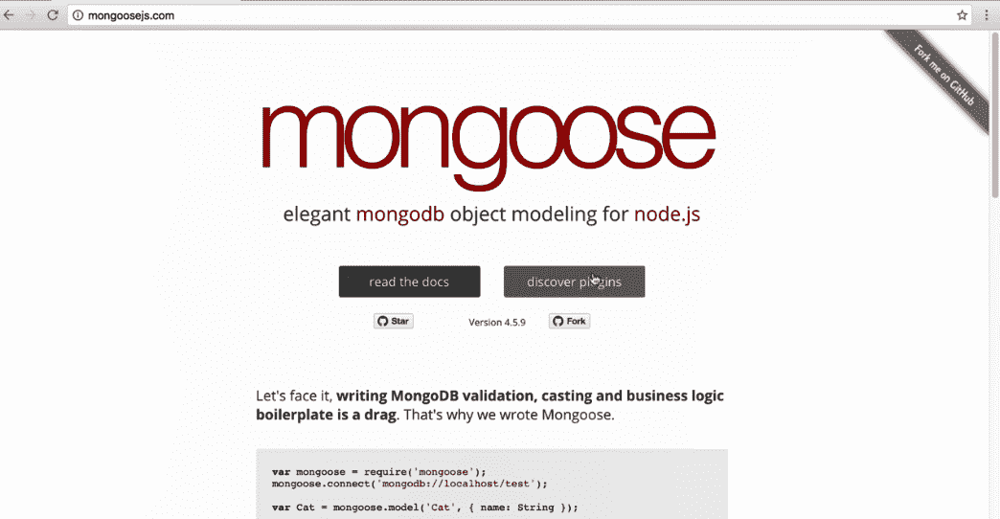

在这里，你可以找到例子，指南，插件的完整列表，以及大量的资源。阅读文档资源是我使用最多的资源。它包括有例子的类似教程的指南，以及涵盖该库的每一个特性的文档。这确实是一个极好的资源。

If you ever want to learn about something or want to use a feature we don't cover in the book, I highly recommend coming to this page, taking the examples, copying and pasting some code, playing around with it, and figuring out how it works. We're going to be covering most of the essential Mongoose features right now.

# 设置项目的根目录

在项目中实际使用 Mongoose 之前，我们需要做的第一件事就是安装它。在终端中，我将使用`npm i`安装它，这是`npm install`的缩写。模块名本身叫做`mongoose`，我们将安装最新版本，也就是`5.0.6`版本。我们将贴上`--save`的旗帜，因为我们需要猫鼬用于生产和测试目的:

```js
**npm i mongoose@5.0.6 --save**
```

一旦我们运行了这个命令，它就会开始工作。我们可以进入 Atom，开始创建运行应用所需的文件。

首先，让我们在项目的根目录下创建一个文件夹。这个文件夹将被称为`server`，与我们的服务器相关的一切都将被存储在`server`文件夹中。我们要创建的第一个文件将被称为`server.js`。这将是我们应用的根源。当您想要启动节点应用时，您将运行此文件。这个文件会让一切准备就绪。

我们在`server.js`里面需要做的第一件事就是装载猫鼬。我们将制作一个名为`mongoose`的变量，我们将从`mongoose`库中获取它。

```js
var mongoose = require('mongoose');
```

现在我们已经有了 mongose 变量，我们需要继续连接到数据库，因为在 mongose 知道如何连接之前，我们无法开始向数据库写入数据。

# 将猫鼬连接到数据库

连接的过程将与我们在 MongoDB 脚本中所做的非常相似；比如`mongodb-connect`剧本。这里我们称之为`MongoClient.connect`，传入一个 URL。我们要为猫鼬做的是调用`mongoose.connect`，传入完全相同的网址；`mongodb`是协议，叫进来`//`。我们将连接到端口`27017`上的`localhost`数据库。接下来是我们的`/`，后面是数据库名称，我们将继续使用`TodoApp`数据库，这是我们在`mongodb-connect`脚本中使用过的。

```js
var mongoose = require('mongoose');

mongoose.connect('mongodb://localhost:27017/TodoApp');
```

这就是这两种功能的不同之处。`MongoClient.connect`方法接受回调，也就是我们可以访问数据库的时候。猫鼬要复杂得多。这很好，因为这意味着我们的代码可以简单得多。猫鼬随着时间的推移保持着这种联系。想象一下我试图拯救一些东西。现在很明显，当这个 save 语句运行时，`mongoose.connect`还没有时间进行数据库连接请求。这至少需要几毫秒。这个声明几乎马上就要生效了。

在幕后，mongose 将在它真正尝试进行查询之前等待连接，这是 mongose 的巨大优势之一。我们不必微观管理事情发生的顺序；猫鼬为我们照顾它。

还有一件事我想在`mongoose.connect`上面配置一下。我们在本课程中一直使用承诺，并将继续使用它们。Mongoose 默认支持回调，但是回调真的不是我喜欢的编程方式。我更喜欢承诺，因为它们更容易链接、管理和扩展。在`mongoose.connect`语句的正上方，我们将告诉 Mongoose 我们想要使用哪个承诺库。如果你不熟悉承诺的历史，它不一定总是内置在 JavaScript 中的东西。承诺最初来自蓝鸟这样的图书馆。这是一个开发者的想法，他们创建了一个图书馆。人们开始使用它，以至于他们把它加入到语言中。

在我们的例子中，我们需要告诉 Mongoose，我们希望使用内置的 promise 库，而不是某个第三方库。我们将把`mongoose.Promise`设置为`global.Promise`，这是我们只需要做一次的事情:

```js
var mongoose = require('mongoose');

mongoose.Promise = global.Promise;
mongoose.connect('mongodb://localhost:27017/TodoApp');
```

我们只需将这两行放入`server.js`；我们不需要在其他地方添加它们。有了这些，猫鼬现在已经配置好了。我们已经连接到我们的数据库，并设置它使用承诺，这正是我们想要的。接下来我们要做的是创建一个模型。

# 创建待办事项模型

现在，正如我们已经谈到的，在 MongoDB 中，您的集合可以存储任何东西。我可以有一个收藏，里面有一份有年龄属性的文件，就这样。我可以在同一个集合中有一个不同的文档，它有一个属性名；就这样。这两份文件不同，但它们都在同一个集合中。猫鼬喜欢让事情变得更有条理。我们要做的是为我们想要存储的所有东西创建一个模型。在这个例子中，我们将创建一个 Todo 模型。

现在，Todo 将具有某些属性。它将有一个`text`属性，我们知道它是一个字符串；它将有一个`completed`属性，我们知道这是一个布尔值。这些是我们可以定义的东西。我们要做的是创建一个猫鼬模型，这样猫鼬就知道如何存储我们的数据。

在`mongoose.connect`语句的正下方，让我们创建一个名为`Todo`的变量，并将其设置为`mongoose.model`。`model`是我们将要用来创建新模型的方法。它需要两个参数。第一个是字符串名称。我将匹配左边的变量名，`Todo`，第二个参数将是一个对象。

```js
mongoose.connect('mongodb://localhost:27017/TodoApp');
var Todo = mongoose.model('Todo', {

});
```

该对象将定义模型的各种属性。例如，托多模型将有一个`text`属性，所以我们可以设置它。然后，我们可以将文本设置为等于一个对象，并且我们可以准确地配置文本是什么。我们可以为`completed`做同样的事情。我们会有一个完整的属性，我们会想要指定某些东西。也许是必须的；也许我们有定制的验证器；也许我们想设置类型。我们还将添加最后一个，`completedApp`，这将让我们知道待办事项何时完成:

```js
var Todo = mongoose.model('Todo', {
  text: {

  },
  completed: {

  },
  completedAt: {

  }
});
```

一个`createdApp`属性可能听起来很有用，但是如果你还记得 MongoDB `ObjectId`，它已经内置了`createdAt`时间戳，所以没有理由在这里添加一个`createdApp`属性。`completedAt`则相反，是要增值。它让你确切地知道你什么时候完成了一个 Todo。

从这里，我们可以开始指定每个属性的细节，在 Mongoose 文档中有大量不同的选项。不过现在，我们将通过为每个类型指定类型来保持事情非常简单，例如，`text`。我们可以将`type`设置为等于`String`。它总是一串；如果它是一个布尔值或数字，那就没有意义了。

```js
var Todo = mongoose.model('Todo', {
  text: {
    type: String
  },
```

接下来，我们可以为`completed`设置一个类型。它需要是一个布尔值；这是没有办法的。我们将把`type`设置为`Boolean`。

```js
  completed: {
    type: Boolean
  },
```

最后一个是`completedAt`。这将是一个常规的旧 Unix 时间戳，这意味着它只是一个数字，因此我们可以将`completedAt`的`type`设置为等于`Number`:

```js
  completedAt: {
    type: Number
  }
});
```

有了这个，我们现在有了一个工作的猫鼬模型。这是一个托多模型，有几个属性:`text`、`completed`和`completedAt`。

现在，为了确切地说明我们是如何创建实例的，我们将继续添加一个 Todo。我们不会担心获取数据、更新数据或删除数据，尽管这是 Mongoose 支持的东西。在接下来的部分中，我们将会担心这一点，因为我们开始为我们的 API 构建单独的路由。现在，我们将回顾一个创建全新 Todo 的快速示例。

# 创建全新的 Todo

我要做一个名为`newTodo`的变量，虽然你可以随便叫它；这里的名字不重要。重要的是你要运行 Todo 函数。这是从`mongoose.model`作为构造函数回来的。我们想在它前面添加`new`关键字，因为我们正在创建`Todo`的新实例。

现在，`Todo`构造函数确实接受一个参数。它将是一个对象，我们可以在其中指定一些属性。也许我们知道我们想要`text`和`Cook dinner`一样。在函数中，我们可以指定。`text`等于一串，`Cook dinner`:

```js
var newTodo = new Todo({
  text: 'Cook dinner'
});
```

我们不需要任何属性，所以我们可以就此打住。我们有一个`text`属性；这已经够好了。让我们继续探索如何将它保存到数据库中。

# 将实例保存到数据库

单独创建一个新实例实际上并不会更新 MongoDB 数据库。我们需要做的是在`newTodo`上调用一个方法。这将是`newTodo.save`。`newTodo.save`方法将负责将`text`保存到 MongoDB 数据库中。现在，`save`返回一个承诺，这意味着我们可以附加一个`then`调用并添加一些回调。

```js
newTodo.save().then((doc) => {

}, (e) => {

});
```

我们将添加回调，用于数据被保存或由于某种原因无法保存而出现错误的时候。可能连接失败，也可能模型无效。不管怎样，现在我们只打印一个小字符串。在上面，在成功回调中，我们实际上会得到 Todo。我可以把这个论点叫做`doc`，我可以把它打印到屏幕上，`console.log`。我先打印一条小消息:`Saved todo`，第二个参数将是实际的文档:

```js
newTodo.save().then((doc) => {
  console.log('Saved todo', doc);
}, (e) => {
  console.log('Unable to save todo');
});
```

我们已经配置了 Mongoose，连接到 MongoDB 数据库；我们已经创建了一个模型，指定了我们希望 Todos 拥有的属性；我们创建了一个新的 Todo 最后，我们将其保存到数据库中。

# 运行 Todos 脚本

我们将从终端运行脚本。我要开始跑步了。我们正在运行的文件在`server`目录中，它被称为`server.js`:

```js
**node server/server.js** 
```

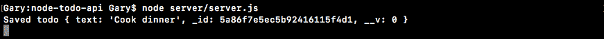

当我们运行文件时，我们得到`Saved todo`，这意味着事情进展顺利。我们这里有一个对象，正如预期的那样，它有一个`_id`属性；`text`财产，我们指定；以及`__v`属性。`__v`属性表示版本，来自猫鼬。我们将在后面讨论它，但本质上它会跟踪各种模型随时间的变化。

如果我们打开 Robomongo，我们会看到完全相同的数据。我将右键单击该连接并刷新它。在这里，我们有我们的`TodoApp`。在`TodoApp`数据库中，我们有我们的`todos`收藏:


请注意，Mongoose 会自动降低 Todo 的值并使其多元化。我要查看文档:


我们有一个文档，它的文本等于烹饪晚餐，正是我们在 Atom 内部创建的。

# 创建第二个 Todo 模型

我们用猫鼬模型创建了一个托多。我要你做的是做第二个，填写所有三个值。这意味着你要用一个`text`值，一个`completed`布尔值来创建一个新的 Todo 继续设置`true`；和一个`completedAt`时间戳，可以设置成自己喜欢的任意数字。然后，我希望你继续保存它；如果保存成功，将其打印到屏幕上；如果保存不好，打印错误。然后，最后，运行它。

我会做的第一件事是在下面做一个新的变量。我将创建一个名为`otherTodo`的变量，将其设置为`Todo`模型的一个`new`实例。

```js
var otherTodo = new Todo ({

});
```

从这里，我们可以传入一个参数，它将成为对象，我们可以指定所有这些值。我可以将`text`设置为我喜欢的任意值，例如`Feed the cat`。我可以将`completed`值设置为等于`true`，并且可以将`completedAt`设置为等于任意数字。任何低于 0 的值，比如-1，都会从 1970 年开始倒退，也就是 0 的位置。任何积极的东西都将是我们现在所处的位置，我们稍后将更多地讨论时间戳。现在，我将使用类似`123`的东西，这基本上是进入 1970 年的两分钟。

```js
var otherTodo = new Todo ({
  text: 'Feed the cat',
  completed: true,
  completedAt: 123
});
```

有了这个，我们现在只需要调用`save`。我要打电话给`otherTodo.save`。这实际上是要写入 MongoDB 数据库的内容。我将进行一次`then`回调，因为一旦保存完成，我确实想做点什么。如果`save`方法有效，我们将得到我们的`doc`，我将把它打印到屏幕上。我将使用我们之前谈到的漂亮打印系统`JSON.stringify`，传入实际对象`undefined`和`2`。

```js
var otherTodo = new Todo ({
  text: 'Feed the cat',
  completed: true,
  completedAt: 123
});

otherTodo.save().then((doc) => {
  console.log(JSON.stringify(doc, undefined, 2));
})
```

你不需要这么做；你可以用你喜欢的任何方式打印它。接下来，如果事情进展不顺利，我将打印一条小消息:`console.log('Unable to save', e)`。它将传递该错误对象，因此如果有人正在读取日志，他们可以准确地看到调用失败的原因:

```js
otherTodo.save().then((doc) => {
  console.log(JSON.stringify(doc, undefined, 2));
}, (e) => {
  console.log('Unable to save', e);
});
```

有了这个，我们现在可以注释掉第一个 Todo。这将阻止创建另一个，我们可以重新运行脚本，运行全新的 Todo 创建调用。在终端中，我将关闭旧的连接并启动新的连接。这将创建一个全新的 Todo，我们就在这里:

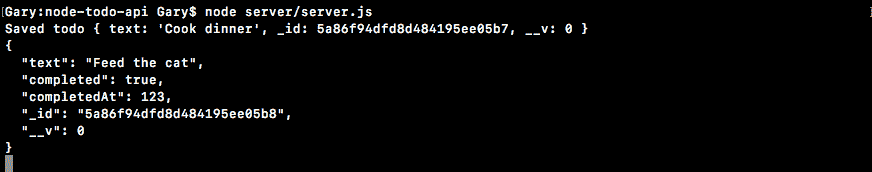

`text`属性等于`Feed the cat`。`completed`属性设置为布尔型`true`；请注意，它周围没有引号。`completedAt`等于数字`123`；再说一次，没有报价。我也可以去 Robomongo 确认这一点。我将重新收集 Todos 集合，现在我们有两个 Todos:

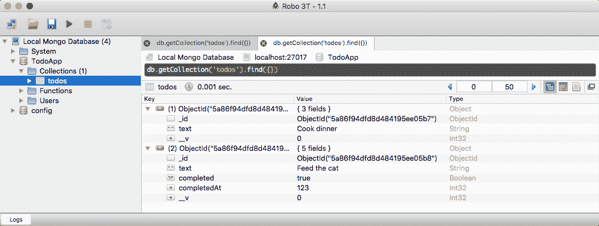

在“值”列的右侧，您还会注意到“类型”列。这里，我们有 int32 表示 completedAt 和 __v 属性。完成的属性是一个布尔值，文本是一个字符串，而 _id 是一个 ObjectId 类型。

Robomongo 里面隐藏了很多有用的信息。如果你想要某样东西，他们很可能已经把它内置了。就这些了。我们现在知道如何使用 Mongoose 建立连接，创建模型，最后将模型保存到数据库中。

# 验证器、类型和默认值

在这一部分，你将学习如何改进你的猫鼬模型。这将允许您添加验证等内容。您可以将某些属性作为一项要求，并且可以设置智能默认值。因此，如果没有提供像 completed 这样的东西，可以设置一个默认值。所有这些功能都内置在 Mongoose 中；我们只需要学会如何使用它。

为了说明我们为什么要设置这个东西，让我们滚动到我们的`server`文件的底部，并删除我们创建的`new Todo`上的所有属性。然后，我们将保存文件并进入终端，运行脚本。那将是`server`目录中的`node`，文件将被称为`server.js`:

```js
**node server/server.js** 
```

当我们运行它时，我们得到了新的 Todo，但是它只有版本和 ID 属性:


我们在模型中指定的所有属性`text`、`completed`和`completedAt`都无处可寻。这是一个相当大的问题。如果 Todos 没有`text`属性，我们就不应该将它们添加到数据库中，像`completed`这样的东西应该有智能默认值。没有人会创建一个待办事项，如果他们已经完成了它，所以完成应该默认为`false`。

# 猫鼬验证器

现在，为了开始，我们将在 Mongoose 文档中调出两个页面，这样如果您将来想要更深入地研究，您就可以知道这些东西的位置。首先，我们要查找验证器。我要去谷歌`mongoose validators`，这将向我们展示我们内置的所有默认验证属性:

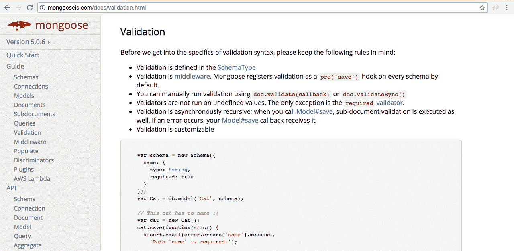

例如，我们可以将某个东西设置为`required`，所以如果它没有被提供，当我们试图保存该模型时，它会抛出一个错误。我们还可以为数字和字符串等设置验证器，为字符串赋予`min`和`max`值或`minlength` / `maxlength`值。

我们要看的另一个页面是模式页面。为了达到这个目的，我们将在谷歌上搜索`mongoose schemas`。这是第一个，`guide.html`文件:

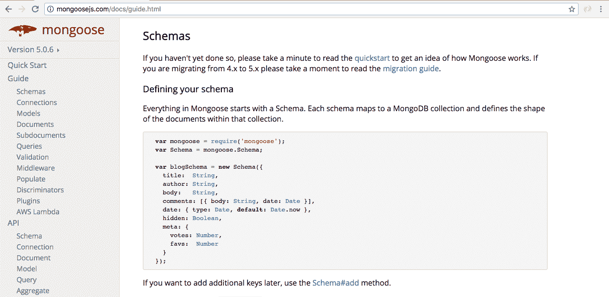

在这一页，你会看到一些与我们目前所做的略有不同的东西。他们调用`new Schema`，设置他们所有的属性。这不是我们已经做的事情，但我们将在未来做。现在，你可以考虑这个对象，`Schema`对象，与我们在 Atom 中的对象相同，我们把它作为第二个参数传递给我们的`mongoose.model`调用。

# 自定义 Todo 文本属性

首先，让我们定制猫鼬如何对待我们的`text`属性。目前，我们告诉 Mongoose 我们希望它是一个字符串，但是我们没有任何验证器。我们可以为`text`属性做的第一件事是将`required`设置为`true`。

```js
var Todo = mongoose.model('Todo', {
  text: {
    type: String,
    required: true
  },
```

当你设置`required`等于`true`时，这个值必须存在，所以如果我试图保存这个 Todo，它会失败。我们可以证明这一点。我们可以保存文件，前往终端，关闭并重新启动它:


我们收到一条不可读的错误消息。我们稍后会深入讨论这个问题，但现在您需要知道的是，我们得到了一个验证错误:Todo 验证失败，这太棒了。

现在，除了确保`text`属性存在之外，我们还可以设置一些自定义验证器。例如，对于字符串，我们有一个`minlength`验证器，这很棒。您不应该能够创建文本为空字符串的 Todo。我们可以将`minlength`设置为最小长度，在这种情况下，我们将为`1`:

```js
var Todo = mongoose.model('Todo', {
  text: {
    type: String,
    required: true,
    minlength: 1
  },
```

现在，即使我们在`otherTodo`函数中提供了一个`text`属性，假设我们将`text`设置为一个空字符串:

```js
var otherTodo = new Todo ({
  text: ''
});
```

还是会失败的。它确实在那里，但是它没有通过最小长度验证器，这里`minlength`验证器必须是`1`。我可以保存`server`文件，在终端重启，但还是失败了。

现在除了`required`和`minlength`之外，文档中还有几个其他的实用程序。一个很好的例子是叫做`trim`的东西。这对弦乐来说太棒了。本质上，`trim`修剪掉数值开头或结尾的任何空白。如果我将`trim`设置为等于`true`，如下所示:

```js
var Todo = mongoose.model('Todo', {
  text: {
    type: String,
    required: true,
    minlength: 1,
    trim: true
  },
```

它将删除任何前导或尾随空格。因此，如果我试图创建一个 Todo，它的`text`属性只是一堆空格，它仍然会失败:

```js
var otherTodo = new Todo ({
  text: '      '
});
```

`trim`属性将删除所有的前导和尾随空格，留下一个空字符串，如果我重新运行，我们仍然会失败。文本字段无效。如果我们确实提供了一个有效的值，那么事情就会像预期的那样进行。就在`otherTodo`中所有空格的中间，我将提供一个真正的托多值，它将是`Edit this video`:

```js
var otherTodo = new Todo ({
  text: '    Edit this video    '
});
```

当我们试图保存这个 Todo 时，首先会发生的是字符串开头和结尾的空格将被修剪。然后，它将验证该字符串的最小长度为 1，最后，它将把 Todo 保存到数据库中。我将继续保存`server.js`，重启我们的脚本，这次我们得到了我们的待办事项:


`Edit this video`文本显示为`text`属性。那些前导空格和尾随空格都被去掉了，这太棒了。仅使用三个属性，我们就能够配置我们的`text`属性，设置一些验证。现在，我们可以为`completed`做类似的事情。

# 猫鼬默认值

对于`completed`，我们不去`require`它，因为完成值最有可能默认为`false`。相反，我们可以设置`default`属性，给这个`completed`字段一个默认值。

```js
  completed: {
    type: Boolean,
    default: false
  },
```

现在`completed`，正如我们在前面的章节中谈到的，应该默认为`false`。如果已经创建了 Todo，就没有理由创建了。我们可以为`completedAt`做同样的事情。如果一个待办事项开始时没有完成，那么`completedAt`将不存在。只有当待办事项完成时，它才会存在；会是那个时间戳。我要做的是将`default`设置为`null`:

```js
  completed: {
    type: Boolean,
    default: false
  },
  completedAt: {
    type: Number,
    default: null
  }
```

太棒了。现在，我们有了一个非常好的 Todo 模式。我们将验证文本是否由用户正确设置，并且我们将自己设置`completed`和`completedAt`值，因为我们可以使用默认值。有了这个，我现在可以重新运行我们的`server`文件，这里我们得到一个更好的默认待办事项:

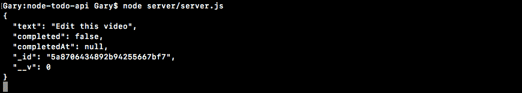

我们有`text`属性和用户提供的，已经过验证和修剪。接下来，我们将`completed`设置为`false`，将`completedAt`设置为`null`；这太棒了。我们现在有了一个万无一失的模式，它有良好的默认和验证。

# 猫鼬类型

如果你一直在玩各种类型，你可能已经注意到，如果你设置一个`type`等于你指定的类型以外的东西，在某些情况下它仍然有效。例如，如果我试图将`text`设置为等于一个对象，我将会得到一个错误。它会说，嘿，你试图使用一个字符串，但是一个对象出现了。但是，如果我试图将`text`设置为类似数字的值，我将使用`23`:

```js
var otherTodo = new Todo ({
  text: 23
});
```

这会有用的。这是因为 Mongoose 将把你的数字转换成一个字符串，本质上是用引号括起来。布尔运算也是如此。如果我传入这样一个布尔值:

```js
var otherTodo = new Todo ({
  text: true
});
```

得到的字符串将是`"true"`。我将在设置`text`等于`true`后继续保存文件，并运行脚本:

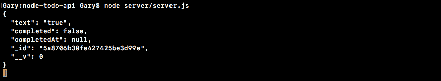

我做的时候得到`text`等于`true`，如前面截图所示。请注意，它确实是用引号括起来的。重要的是要意识到类型转换确实存在于猫鼬体内。它很容易把你绊倒，导致一些意想不到的错误。不过现在，我将把`text`设置为一个适当的字符串:

```js
var otherTodo = new Todo ({
  text: 'Something to do'
});
```

# 创建用于身份验证的猫鼬用户模型

现在，我们要创建一个全新的猫鼬模型。首先，你要做一个新的`User`模型。最终，我们将使用它进行身份验证。它将存储像电子邮件和密码这样的东西，Todos 将与此相关联`User`所以当我创建一个时，只有我可以编辑它。

我们将研究所有这些，但目前，我们将保持事情非常简单。在`User`模型上，唯一需要设置的属性是`email`属性。我们稍后会建立其他类似`password`的系统，但是会做一些不同的事情，因为它需要安全。目前，我们只坚持使用`email`。我要你`require`它。我也想让你`trim`它，所以如果有人在前面或后面加空格，那些空格就消失了。最后但同样重要的是，继续将`type`设置为 a `String`，设置类型，并设置`1`的`minlength`。现在，很明显，您可以传入一个不是电子邮件的字符串。稍后我们将探讨自定义验证。这将让我们验证该电子邮件是一封电子邮件，但目前这将使我们走上正轨。

一旦你创建了你的猫鼬模型，我希望你继续尝试创建一个新的`User`。创建一个没有`email`属性的，然后用 email 属性创建一个，确保当你运行脚本时，数据在 Robomongo 中按预期显示。这些数据应该会出现在新的`Users`系列中。

# 设置电子邮件属性

我要做的第一件事是制作一个变量来存储这个新模型，一个名为`User`的变量，我要把它设置为`mongoose.model`，这就是我们如何制作新的`User`模型。如您所知，第一个参数需要是字符串模型名称。我将使用与我在变量中指定的完全相同的名称，尽管它可能不同。我只是喜欢用这种模式保存东西，其中变量等于模型名。接下来，作为第二个参数，我们可以指定配置`User`应该具有的所有属性的对象。

```js
var User = mongoose.model('User', {

});
```

正如我之前提到的，我们稍后会添加其他属性，但就目前而言，添加对`email`属性的支持就足够了。这封邮件里有几件事我想做。首先，我想设置`type`。电子邮件总是一个字符串，所以我们可以将`type`设置为`String`。

```js
var User = mongoose.model('User', {
  email: {
    type: String,

  }
});
```

接下来，我们要去`require`它。没有邮箱就不能做用户，所以我把`required`设为`true`。在被要求之后，我们将继续发送`trim`那封邮件。如果有人在它之前或之后添加空格，这显然是一个错误，所以我们将继续删除那些用于`User`模型的空格，使我们的应用更加用户友好。最后但同样重要的是，我们要做的是设置一个`minlength`验证器。我们稍后将设置自定义验证，但是现在`1`的`minlength`将完成这个技巧。

```js
var User = mongoose.model('User', {
  email: {
    type: String,
    required: true,
    trim: true,
    minlength: 1
  }
});
```

现在，我将继续创建这个`User`的新实例并保存它。在我运行脚本之前，我会评论我们新的待办事项。现在，我们可以制作这个`User`模型的新实例。我将创建一个名为`user`的变量，并将其设置为`new User`，传入我们想要为该用户设置的任何值。

```js
var User = mongoose.model('User', {
  email: {
    type: String,
    required: true,
    trim: true,
    minlength: 1
  }
});

var user = new User({

});
```

我打算一开始什么都不用运行它，只是为了确保验证工作正常。在用户变量旁边，我现在可以调用`user.save`。`save`方法返回一个承诺，所以我可以锁定一个`then`回调。我将为这个添加一个成功案例，以及一个错误处理程序。错误处理程序将获得错误参数，成功案例将获得文档。如果进展顺利，我会用`console.log('User saved', doc)`打印一条消息，后面跟着`doc`的论点。这个例子不需要格式化。我将对错误处理程序做同样的事情，使用`console.log('Unable to save user')`后跟错误对象:

```js
var user = new User({

});

user.save().then((doc) => {
  console.log('User saved', doc);
}, (e) => {
  console.log('Unable to save user', e);
});
```

因为我们正在创建一个没有属性的用户，所以我们希望打印错误。我要保存`server.js`并重启文件:

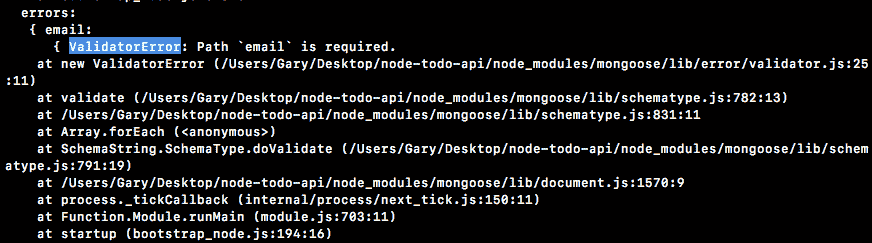

我们得到我们的错误。这是一个验证错误，需要路径“电子邮件”。猫鼬让我们知道我们确实有一个错误。邮件确实需要存在，因为我们设置`required`等于`true`。我将继续输入一个值，将`email`设置到我的电子邮件`andrew@example.com`中，之后我会输入几个空格:

```js
var user = new User({
  email: 'andrew@example.com '
});
```

这一次，事情应该如预期的那样发展，并且`trim`应该修剪邮件的结尾，去掉所有的空格，这就是我们得到的结果:


`User`确实保存了，太好了，`email`已经格式化好了。现在很明显，我可以像`123`那样放入一个字符串，它会起作用，因为我们还没有设置自定义验证，但是我们有一个很好的起点。我们有`User`型号，我们有我们的`email`物业已经准备就绪。

有了这些，我们现在开始创建应用编程接口。在下一节中，您将安装一个名为**邮递员**的工具，它将帮助我们测试我们的 HTTP 请求，然后我们将为我们的 Todo REST API 创建第一条路由。

# 安装邮递员

在本节中，您将学习如何使用邮递员。如果你正在构建一个 REST API，邮递员是一个必不可少的工具。我从来没有和团队一起工作过，也没有参与过邮差没有被每个开发人员大量使用的项目。Postman 允许您创建 HTTP 请求并将其发送出去。这使得测试您正在编写的所有内容是否如预期那样工作变得非常容易。现在很明显，我们也将编写自动化测试，但是使用 Postman 可以让您处理数据，并在您的 API 中移动时看到事情是如何工作的。它真的是一个神奇的工具。

我们将前往浏览器并前往[getpostman.com](https://www.getpostman.com/)，在这里我们可以抓取他们的应用:


现在我将使用 Chrome 应用。要安装它，你所要做的就是从 Chrome 商店安装 Chrome 应用，点击添加到 Chrome，它会把你带到你可以打开应用的页面。现在，要打开 Chrome 应用，你必须去这种奇怪的网址。是`chrome://apps`。在这里，你可以查看你所有的应用，我们只需点击它就可以打开邮差。

正如我之前提到的，Postman 允许您发出 HTTP 请求，所以我们将继续制作一些来玩用户界面。您不需要建立帐户，也不需要注册付费计划。付费计划面向需要高级功能的开发团队。我们只是在我们的机器上提出基本要求；我们不需要云存储之类的东西。我将跳过帐户创建，我们可以直接进入应用。

在这里，我们可以设置我们的请求；这是面板中发生的情况:


在空白处，我们可以看到结果。让我们继续向谷歌提出请求。

# 向谷歌发出一个 HTTP 请求

在网址栏，我要输入`http://google.com`。我们可以单击“发送”发送该请求。确保您选择了 GET 作为您的 HTTP 方法。当我发出请求时，它会返回，所有返回的数据都显示在空白处:


我们有状态代码这样的东西；我们有一个 200，意味着事情进行得很顺利；我们有时间，大约花了四分之一秒；我们有 Headers，它是从谷歌回来的；我们有 Cookies，但这种情况下没有；我们有我们的身体数据。`google.com`的正文是一个 HTML 网站。在很大程度上，我们将发送和接收的 body 将是 JSON，因为我们正在构建 REST API。

# 说明 JSON 数据的工作

为了说明 JSON 数据是如何工作的，我们将请求我们在本课程前面使用的地理编码网址。如果你还记得，我们能够传入一个位置，我们得到了一些 JSON 回来，描述的东西，如纬度和经度，以及格式化的地址。现在这应该还在你的 Chrome 历史中。

如果你删除了你的历史，你可以把[放在 https://maps.googleapis.com/maps/api/geocode/json?地址栏中的 address = 1301+Lombard+ST+费城](https://maps.googleapis.com/maps/api/geocode/json?address=1301+lombard+st+philadelphia)。这是我将使用的网址；您可以简单地复制它，也可以抓取任何 JSON API URL。我将把它复制到剪贴板，返回到 Postman，用我刚刚复制的 URL 交换出 URL:

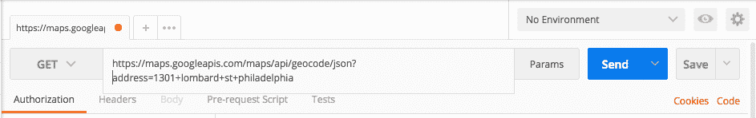

现在，我可以继续发出请求了。我们得到了我们的 JSON 数据，这太棒了:

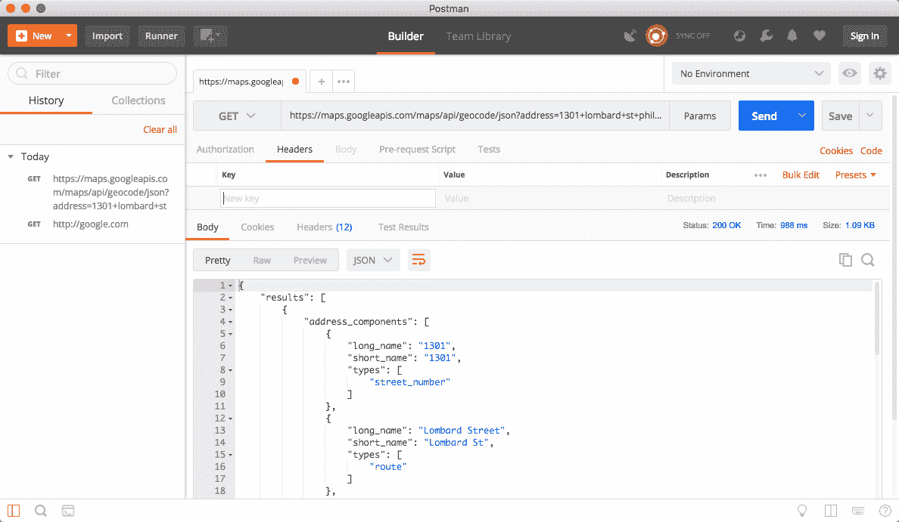

当我们发出这个请求时，我们能够看到返回的确切内容，这就是我们使用 Postman 的方式。

我们将使用 Postman 进行请求，添加 Todos，删除 Todos，获取我们所有的 Todos，并登录；所有这些事情都会在这里发生。请记住，API 不一定有前端。可能是安卓应用；可能是 iPhone 应用或者网络应用；也许是另一台服务器。Postman 为我们提供了一种与我们的 API 交互的方式，确保它按预期工作。我们有所有返回的 JSON 数据。在位于“正文”下的“原始”视图中，我们有原始数据响应。本质上，它只是没有被预先设定；没有格式化，没有着色。我们还有一个预览标签。预览选项卡对于 JSON 来说非常无用。说到 JSON 数据。，我总是坚持使用“漂亮”选项卡，这应该是默认设置。

现在我们已经安装了 Postman，并且对如何使用它有了一点了解，接下来我们将进入下一部分，在这里我们将实际创建我们的第一个请求。我们将启动一个邮差请求来点击我们将要创建的网址。这将让我们从邮递员或任何其他应用中制作新的 Todos，无论是网络应用、移动应用还是其他服务器。接下来就是这些了，所以只要确保你已经安装了邮差。如果您能够完成本节中的所有内容，您就可以继续了。

# 资源创建端点-开机自检/关机

在本节中，您将创建您的`HTTP POST`路线来添加新的 Todos。在深入研究之前，我们首先要重构`server.js`中的所有内容。我们有应该存在于其他地方的数据库配置，我们有我们的模型，它们也应该存在于不同的文件中。我们在`server.js`唯一想要的就是我们的快递路线处理员。

# 重构 server.js 文件以创建 POST todos 路由

首先，在`server`文件夹中，我们将创建一个名为`db`的新文件夹，在`db`文件夹中，我们将创建一个文件，所有这些猫鼬配置都将发生在这个文件中。我将要调用那个文件`mongoose.js`，我们所需要做的就是在这里获取我们的 Mongoose 配置代码:

```js
var mongoose = require('mongoose');
mongoose.Promise = global.Promise;
mongoose.connect('mongodb://localhost:27017/TodoApp');
```

剪下来，移到`mongoose.js`里。现在，我们需要出口一些东西。我们要导出的是`mongoose`变量。因此，本质上，当有人需要 mongoose.js 文件时，他们将配置 Mongoose 并获得它——他们将从库中取回`mongoose`变量。我将设置`module.exports`等于一个对象，在该对象上，我们将设置`mongoose`等于`mongoose`:

```js
mongoose.connect('mongodb://localhost:27017/TodoApp');

module.exports = {
  mongoose: mongoose
};
```

正如我们所知，在 ES6 中，这可以简化。如果您有一个同名的属性和变量，您可以将其缩短，我们可以更进一步，将它们放在一行:

```js
module.exports = {mongoose};
```

现在我们在一个单独的文件中拥有 Mongoose 配置，并且该文件可以在`server.js`文件中是必需的。我将使用 ES6 析构实现猫鼬属性。本质上，我们正在创建一个名为`mongoose`的局部变量，该变量等于对象上的 mongoose 属性，并且该对象将是需要我们刚刚创建的文件的返回结果。它在`db`目录中，名为`mongoose.js`，我们可以省略这个扩展名:

```js
var mongoose = require('./db/mongoose');
```

既然猫鼬住在自己的地方，那就让我们对`Todo`和`User`做同样的事情。这将发生在一个名为`models`的服务器的新文件夹中。

# 配置待办事项和用户文件

在`models`内部，我们将创建两个文件，每个模型一个。我要制作两个新文件，分别叫做`todo.js`和`user.js`。我们可以从`server.js`文件中获取 todos 和 Users 模型，并简单地将其复制并粘贴到相应的文件中。一旦模型被复制，我们可以将其从`server.js`移除。Todos 模型看起来是这样的:

```js
var Todo = mongoose.model('Todo', {
  text: {
    type: String,
    required: true,
    minlength: 1,
    trim: true
  },
  completed: {
    type: Boolean,
    default: false
  },
  completedAt: {
    type: Number,
    default: null
  }
});
```

`user.js`模型会是这样的。

```js
var User = mongoose.model('User', {
  email: {
    type: String,
    required: true,
    trim: true,
    minlength: 1
  }
});
```

我还将删除到目前为止的所有内容，因为 server.js 中的那些示例已经没有必要了。我们可以把猫鼬导入语句放在最上面。

在这些模型文件中，我们需要做一些事情。首先，我们将在 Todos 和 Users 文件中调用`mongoose.model`，所以我们仍然需要在 Mongoose 中加载。现在，我们不必加载我们创建的`mongoose.js`文件；我们可以在朴素的旧图书馆里借书。让我们做一个变量。我们将这个变量称为`mongoose`，我们将会看到`require('mongoose')`:

```js
var mongoose = require('mongoose');

var Todo = mongoose.model('Todo', {
```

我们需要做的最后一件事是导出模型，否则我们不能在需要这个模型的文件中使用它。我将设置`module.exports`等于一个对象，我们将设置`Todo`属性等于`Todo`变量；这正是我们在`mongoose.js`中所做的:

```js
module.exports = {Todo};
```

我们将在`user.js`做同样的事情。在`user.js`内部，在顶部，我们将创建一个名为`mongoose`的变量，要求`mongoose`，在底部，我们将导出`User`模型，`module.exports`，将其设置为一个对象，其中`User`等于`User`:

```js
Var mongoose = require('mongoose');

var User = mongoose.model('User', {
  email: {
    type: String,
    required: true,
    trim: true,
    minlength: 1
  }
});

module.exports = {User};
```

现在，我们的三个文件都已经格式化了。我们有三份新文件和一份旧文件。最后要做的是加载`Todo`和`User`。

# 正在服务器中加载待办事项和用户文件

在`server.js`文件中，让我们使用析构调用`Todo`创建一个变量，将其设置为`require('./models/todo')`，我们可以对`User`做完全相同的事情。使用 ES6 析构，我们将获取那个`User`变量，我们将从调用`require`返回的对象中获取它，要求`models/user`:

```js
var {mongoose} = require('./db/mongoose');
var {Todo} = require('./models/todo');
var {User} = require('./models/user');
```

有了这些，我们现在准备出发了。我们有完全相同的设置，只是它被重构了，这将使测试、更新和管理变得更加容易。`server.js`文件只是负责我们的路线。

# 配置快速应用

现在，为了开始，我们需要安装 Express。我们过去已经这样做过了，所以在终端中，我们所需要做的就是运行`npm i`后跟模块名，也就是`express`。我们将使用最新版本`4.16.2`。

我们还将安装第二个模块，我们可以在第一个模块之后直接输入。没必要跑`npm install`两次。这个叫做`body-parser`。`body-parser`会让我们把 JSON 发送到服务器。然后，服务器可以获取该 JSON 并使用它做一些事情。`body-parser`本质上解析身体。它接受该字符串主体，并将其转换为一个 JavaScript 对象。现在，有了`body-parser`，我们将安装最新版本`1.18.2`。我还将提供`--save`标志，该标志将向`package.json`的依赖项部分添加 Express 和`body-parser`:

```js
**npm i express@4.16.2 body-parser@1.18.2 --save** 
```

现在，我可以继续发出这个请求，安装两个模块，在`server.js`内部，我们可以开始配置我们的应用。

首先，我们必须装入刚刚安装的两个模块。正如我之前提到的，我喜欢在本地导入和库导入之间留出空间。我将使用一个名为`express`的变量来存储 Express 库，即`require('express')`。我们将用一个名为`bodyParser`的变量对`body-parser`做同样的事情，将其设置为要求`body-parser`的返回结果:

```js
var express = require('express');
var bodyParser = require('body-parser');

var {mongoose} = require('./db/mongoose');
var {Todo} = require('./models/todo');
var {User} = require('./models/user');
```

现在我们可以建立一个非常基本的应用。我们要做一个名为`app`的变量；这将存储我们的快速应用。我将把它设置为对`express`的呼叫:

```js
var {User} = require('./models/user');

var app = express();
```

我们还将调用`app.listen`，监听端口。我们最终会把这个部署到 Heroku。不过现在，我们将有一个本地端口，端口`3000`，我们将提供一个回调函数，一旦应用启动，它就会启动。我们要做的就是用`console.log`打印`Started on port 3000`:

```js
var app = express();

app.listen(3000, () => {
  console.log('Started on port 3000');
});
```

# 配置开机自检路由

现在，我们有一个非常基本的服务器。我们所要做的就是开始配置我们的路由，正如我所承诺的，我们将在这一部分重点关注的是 POST 路由。这将让我们创造新的 Todos。现在，在您的 REST APIs 内部，有基本的 CRUD 操作，CRUD 是创建、读取、更新和删除。

当您想要创建一个资源时，您使用`POST HTTP`方法，并将该资源作为主体发送。这意味着当我们想要创建一个新的 Todo 时，我们要向服务器发送一个 JSON 对象。它将有一个`text`属性，服务器将获得该`text`属性，创建新模型，并将带有 ID、已完成属性和`completedAt`的完整模型发送回客户端。

要设置一条路线，我们需要调用`app.post`，传递我们为每一条快速路线使用的两个参数，它们是我们的 URL 和我们的回调函数，用`req`和`res`对象调用。现在，一个 REST API 的 URL 真的很重要，并且有很多关于正确结构的讨论。对于资源，我喜欢用`/todos`:

```js
app.post('/todos', (req, res) => {

});
```

这是为了资源创建，这是一个非常标准的设置。`/todos`用于创建新的 Todo。稍后，当我们想要读取 Todos 时，我们将使用`GET`方法，我们将使用`/todos`中的`GET`来获取所有 Todos 或`/todos`，一些疯狂的数字，通过其 ID 来获取单个 Todo。这是一个非常常见的模式，也是我们将要使用的模式。不过现在，我们可以专注于获取从客户端发送的身体数据。

# 从客户端获取身体数据

为此，我们必须使用`body-parser`模块。正如我之前提到的，`body-parser`将把你的 JSON 转换成一个对象，把它附加到这个`request`对象上。我们将使用`app.use`配置中间件。`app.use`取中间件。如果我们正在编写定制中间件，它将是一个函数；如果我们使用第三方中间件，我们通常只访问库外的东西。在这种情况下，它将作为函数被调用。这个 JSON 方法的返回值是一个函数，这就是我们需要给 Express 的中间件:

```js
var app = express();

app.use(bodyParser.json());
```

有了这些，我们现在可以将 JSON 发送到我们的 Express 应用。在`post`回调里面我想做的就是简单的`console.log``req.body`的值，身体被`bodyParser`储存在这里:

```js
app.use(bodyParser.json());

app.post('/todos', (req, res) => {
  console.log(req.body);
});
```

我们现在可以启动服务器，在邮差内部进行测试。

测试邮递员内部的投递路线

在终端中，我将使用`clear`清除终端输出，然后我将运行应用:

```js
**node server/server.js** 
```

服务器在端口 3000 上，这意味着我们现在可以进入 Postman:

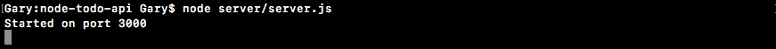

在邮差内部，我们不会像上一节那样提出`GET`请求。这一次，我们要做的是发出一个 POST 请求，这意味着我们需要将 HTTP 方法改为 POST，并键入 URL。那将是港口的 T1，T2。这是我们要将数据发送到的网址:

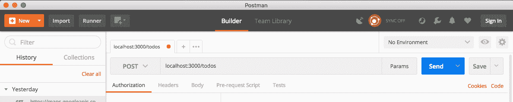

现在，为了向应用发送一些数据，我们必须转到 Body 选项卡。我们正在尝试发送 JSON 数据，因此我们将转到 raw，并从右侧的下拉列表中选择 JSON(应用/json):

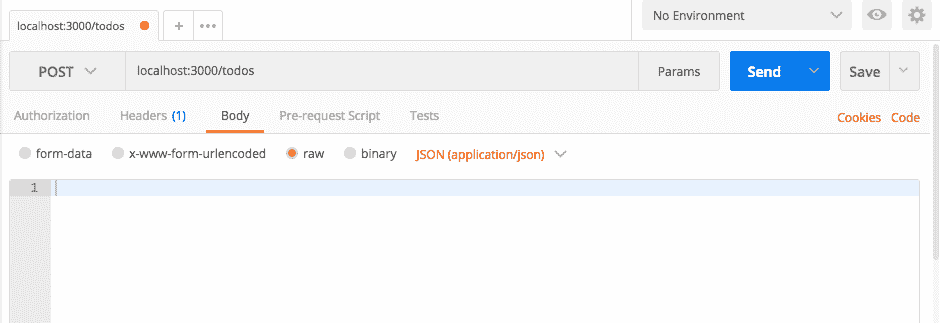

现在我们有了标题集。这是内容类型头，让服务器知道 JSON 正在被发送。所有这些都是由邮递员自动完成的。在 Body 内部，我唯一要附加到我的 JSON 的信息是一个`text`属性:

```js
{
  "text": "This is from postman"
}
```

现在，我们可以单击“发送”来启动我们的请求。我们永远得不到回应，因为我们还没有在`server.js`内部回应，但是如果我前往终端，你会看到我们有我们的数据:


这是我们在邮差内部创建的数据。它现在出现在我们的节点应用中，这太棒了。我们离真正创建 Todo 又近了一步。在 post 处理程序中剩下要做的唯一一件事就是使用来自`User`的信息实际创建 to do。

# 创建猫鼬模型的实例

在`server.js`中，让我们创建一个名为`todo`的变量来完成我们之前所做的事情，创建一个 Mongoose 模型的实例。我们将它设置为`new Todo`，传入我们的对象，并传入我们想要设置的值。在这种情况下，我们只想设置`text`。我们将文本设置为`req.body`，这是我们拥有的对象，然后我们将访问`text`属性，如下所示:

```js
app.post('/todos', (req, res) => {
  var todo = new Todo({
    text: req.body.text
  });
```

接下来，我们将调用`todo.save`。这实际上是将模型保存到数据库中，我们将为成功案例和错误案例提供回调。

```js
app.post('/todos', (req, res) => {
  var todo = new Todo({
    text: req.body.text
  });

todo.save().then((doc) => {

}, (e) => {

});
```

现在，如果事情进展顺利，我们将发回实际的 Todo，它将出现在随后的回调中。我要去拿`doc`，就在回调函数里面，我要用`res.send`把单据发回来。这将会给`User`真正重要的信息，比如 ID 和`completed`和`completedAt`属性，这些不是`User`设置的。如果事情进展不顺利，我们出现了错误，那也没关系。我们要做的就是使用`res.send`将错误发回:

```js
todo.save().then((doc) => {
  res.send(doc);
}, (e) => {
  res.send(e);
});
```

稍后我们将修改发送错误的方式。目前，这段代码将会非常好用。我们也可以设置一个 HTTP 状态。

# 设置 HTTP 状态代码

如果你记得的话，HTTP 状态让你给某人一些关于请求如何进行的信息。进展顺利吗？进展得不好吗？诸如此类的事情。你可以通过进入[httpstatuses.com](https://httpstatuses.com/)获得所有可用 HTTP 状态的列表。在这里，您可以查看所有可以设置的状态:

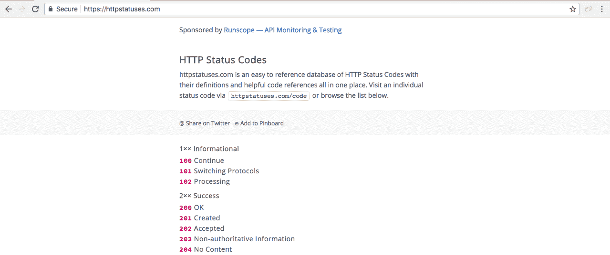

快递默认设置的是`200`。这意味着事情进展顺利。我们将使用的错误代码是`400`。答`400`状态表示有一些不良输入，如果模型无法保存，将会出现这种情况。也许`User`没有提供`text`属性，或者文本字符串是空的。无论哪种方式，我们都想送一辆`400`回去，这是一定会发生的。就在我们调用`send`之前，我们要做的就是调用`status`，传入`400`的状态:

```js
todo.save().then((doc) => {
  res.send(doc);
}, (e) => {
  res.status(400).send(e);
});
```

有了这些，我们现在准备在邮递员内部测试我们的`POST /todos`请求。

# 测试邮递员内部的开机自检/关机

我要在终端重启服务器。如果你愿意，你可以从`nodemon`开始。目前，我将手动重新启动它:

```js
**nodemon server/server.js** 
```

我们现在使用的是 localhost 3000，在 Postman 内部，我们可以发出与之前完全相同的请求。我将点击发送:


我们的状态是 200。这太棒了。这是默认状态，这意味着事情进展顺利。JSON 的回应正是我们所期待的。我们有自己设定的`text`；我们有生成的`_id`属性；我们有`completedAt`，默认设置为`null`；我们将`completed`设为`false`，默认。

我们还可以测试当我们试图在没有适当信息的情况下创建 Todo 时会发生什么。例如，也许我设置了一个等于空字符串的`text`属性。如果我发送此邮件，我们现在会收到 400 个错误请求:


现在，我们有一堆验证代码说`Todo validation failed`。然后，我们可以进入`errors`对象，得到具体的错误。在这里，我们可以看到`text`场失败了，`message`是`Path 'text' is required`。所有这些信息都可以帮助某人解决他们的请求并做出正确的决定。

现在，如果我进入 Robomongo，我将刷新`todos`的集合。看看最后一个，它确实是我们在《邮差》中创造的:

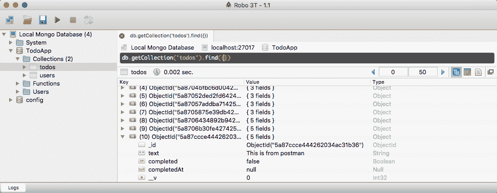

正文等于这是邮递员送来的。有了这些，我们现在有了第一个为 Todo REST API 设置的 HTTP 端点。

现在我还没有讲清楚什么是 REST。我们稍后再谈。目前，我们将专注于创建这些端点。当我们开始添加身份验证时，REST 版本将稍后推出。

# 向数据库添加更多 Todos

在邮递员里面，我们可以再添加一些 Todos，这就是我要做的。`Charge my phone`—我认为我从来不需要被提醒那个——我们将添加`Take a break for lunch`。在漂亮部分，我们看到`Charge my phone`托多是用唯一的标识创建的。我将发送第二个，我们将看到`Take a break for lunch` Todo 被创建:

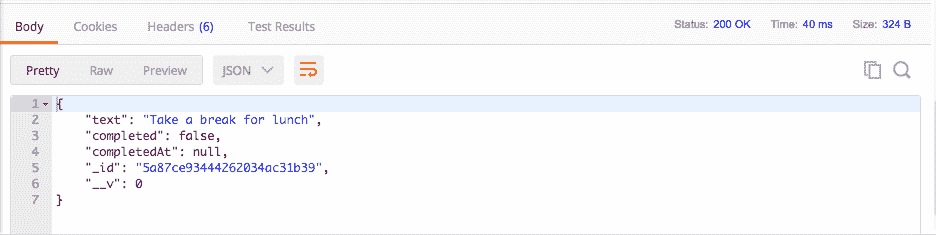

在 Robomongo 内部，我们可以对我们的`todos`系列进行最后的更新。我将展开最后三个项目，它们确实是我们在 Postman 中创建的三个项目:

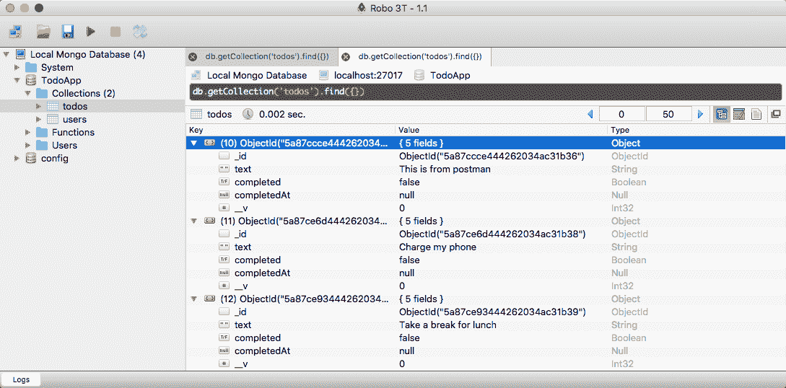

既然我们已经在项目中完成了一些有意义的工作，让我们继续并提交我们的更改。正如你在 Atom 中看到的那样，`server`目录是绿色的，这意味着它还没有被添加到 Git 中，而`package.json`文件是橙色的，这意味着它已经被修改了，尽管 Git 正在跟踪它。在终端我们可以关闭服务器，我总是喜欢运行`git status`来做一个理智检查:


在这里，一切看起来都和预期的一样。我可以使用`git add .`添加所有内容，然后再进行一次理智检查:


这里，我们在`server`文件夹中有我们的四个新文件，以及我们的`package.json`文件。

现在，是时候做出承诺了。我将创建一个快速提交。我用的是`-am`标志，一般是添加修改过的文件。既然我已经使用了 add，我可以简单地使用`-m`标志，就像我们在整个课程中一直在做的那样。对这个人来说，一个好的信息是类似于`Add POST /todos route and refactor mongoose`的东西:

```js
**git commit -m 'Add POST /todos route and refractor mongoose'** 
```

提交就绪后，我们现在可以将它推送到 GitHub，确保它已备份，并确保它可供项目中的任何其他协作者使用。请记住，单独创建一个提交不会在 GitHub 上启动它；你必须用另一个命令来推动它，即`git push`。有了这些，现在是时候进入下一部分了，在这里您将测试刚刚创建的路线。

# 测试开机自检/关机

在本节中，您将学习如何为 Todo API 设置测试套件，类似于我们在`test`节中所做的，我们将为`/todos`编写两个测试用例。我们将验证当我们发送正确的数据作为正文时，我们会得到一个带有完整文档的`200`，包括 ID；而且，如果我们发送了错误的数据，我们期望一个带有错误对象的`400`返回。

# 安装用于测试开机自检/关机路线的 npm 模块

现在，在我们做这些之前，我们必须安装我们在`test`部分安装的所有模块，`expect`用于断言，`mocha`用于整个测试套件，`supertest`用于测试我们的快速路线，以及`nodemon`。`nodemon`模块将让我们创建之前的`test-watch`脚本，这样我们就可以自动重启测试套件。现在我知道你已经在全球范围内安装了`nodemon`，但是因为我们是在`package.json`脚本中使用它，所以在本地安装它也是一个很好的主意。

我们将使用最新版本的`22.3.0`运行`npm i`。接下来是`mocha`。最新版本是`5.0.1`。之后是`nodemon`版本`1.15.0`，最后但同样重要的是`supertest` at 版本`3.0.0`。有了这个，我们所要做的就是钉上那面`--save-dev`旗帜。我们希望保存这些，但不是作为常规依赖项。它们仅用于测试目的，因此我们将它们保存为`devDependencies`:

```js
**npm i expect@22.3.0 mocha@5.0.1 nodemon@1.15.0 supertest@3.0.0 --save-dev** 
```

现在，我们可以继续运行这个命令，一旦完成，我们就可以开始在 Atom 中设置测试文件了。

# 设置测试文件

在 Atom 中，在我的`package.json`文件中，我现在列出了我的`devDependencies`:

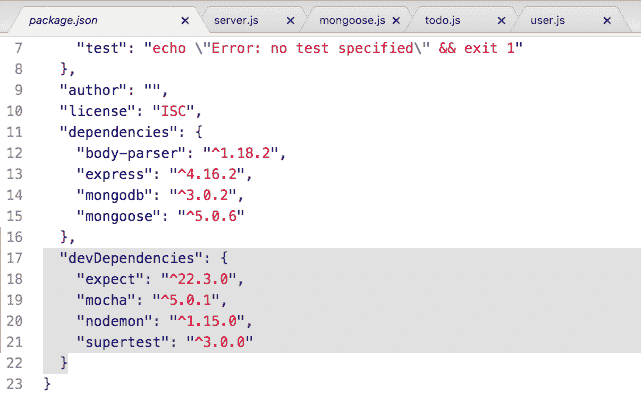

现在，我的这个命令的输出可能看起来有点不同于你的。npm 正在缓存我最近安装的一些模块，所以正如您在前面的截图中看到的，它只是抓取本地副本。不过它们确实被安装了，我可以通过打开`node_modules`文件夹来证明这一点。

我们现在将在`server`中创建一个文件夹，我们可以在其中存储所有的测试文件，这个文件夹将被称为`tests`。我们要为这部分担心的唯一文件是`server.js`的测试文件。我将在测试中创建一个名为`server.test.js`的新文件。这是我们将在本章中用于测试文件的扩展。在`server.test`文件中，我们现在可以通过需要许多这样的模块来开始工作。我们需要`supertest`模块和`expect`。不需要`mocha`和`nodemon`模块；他们不是这样使用的。

我们将得到的`const expect`变量将等于`require('expect')`，我们将使用`const`对`supertest`做完全相同的事情:

```js
const expect = require('expect');
const request = require('supertest');
```

现在我们已经准备好了，我们需要加载一些本地文件。我们需要加载`server.js`，这样我们就可以访问 Express 应用，因为我们需要它来进行超级测试，我们还想加载我们的 Todo 模型。稍后您会看到，我们将查询数据库，访问这个模型是必要的。现在模型已经出口了一些东西，但是`server.js`目前什么也没有出口。我们可以通过将`module.exports`添加到`server.js`文件的最底部，将其设置为一个对象来解决这个问题。在该对象上，我们要做的就是使用 ES6 对象语法将`app`属性设置为等于`app`变量。

```js
module.exports = {app};
```

有了这些，我们现在可以加载这两个文件了。

# 加载测试文件

首先，让我们继续创建一个名为`app`的局部变量，我们将使用 ES6 析构从请求服务器文件的返回结果中提取它。在这里，我们将从获取相对路径开始。然后，我们将从`tests`返回一个目录到`server`。文件名只是`server`没有扩展名。我们也可以对 Todo 模型做同样的事情。

我们要做一个常数叫做`Todo`。我们使用 ES6 析构来从导出中提取，文件来自相对路径，回到一个目录。然后我们要进入`models`目录，最后文件名叫做`todo`:

```js
const expect = require('expect');
const request = require('supertest');

const {app} = require('./../server');
const {Todo} = require('./../models/todo');
```

现在我们已经加载了所有这些，我们准备创建我们的`describe`块并添加我们的测试用例。

# 为测试用例添加描述块

我将使用`describe`对所有路线进行分组。我将为一些路线准备多个测试用例，添加一个`describe`块很好，这样你就可以快速浏览终端中的测试输出。POST Todos 的`describe`区块将简称为`POST /todos`。然后，我们可以添加我们的箭头函数(`=>`)，在这里我们可以开始布局我们的测试用例。第一个测试将验证当我们发送适当的数据时，一切都按预期进行:

```js
const {Todo} = require('./../models/todo');

describe('POST /todos', () => {
  it('should create a new todo')
});
```

现在，我们可以添加我们的回调函数，这个函数将采用`done`参数，因为这将是一个异步测试。你必须指定`done`，否则这个测试不会如预期的那样起作用。在回调函数中，我们要做的是创建一个名为`text`的变量。这是我们真正需要的唯一设置数据。我们只需要一个字符串，我们将一直使用这个字符串。去吧，给它任何你喜欢的价值。我要用`Test todo text`。

```js
describe('POST /todos', () => {
  it('should create a new todo',(done) => {
    var text = 'Test todo text';
  });
});
```

现在是时候开始通过`supertest`提出请求了。我们之前只提了`GET`的要求，但是`POST`的要求同样简单。

# 通过超级测试发出开机自检请求

我们将调用 request，传入我们想要请求的应用。接下来，我们将调用`.post`，它设置一个`POST`请求。我们要去`/todos`，我们要做的新事情是发送数据。为了将数据和请求一起作为主体发送，我们必须调用`send`，我们要传入一个对象。这个对象将被`supertest`转换为 JSON，所以我们没有必要担心这个——这只是使用`supertest`库的另一个重要原因。我们将把`text`设置为前面显示的`text`变量，我们可以使用 ES6 语法来完成:

```js
describe('POST /todos', () => {
  it('should create a new todo',(done) => {
    var text = 'Test todo text';

    request(app)
    .post('/todos')
    .send({text})
  })
});
```

既然我们已经发送了请求，我们就可以开始对请求进行断言了。

# 对开机自检请求进行断言

我们从状态开始。我要去`expect`状态等于`200`，这应该是我们跨有效数据发送的情况。在这之后，我们可以继续对回归的身体进行断言。我们希望确保身体是一个物体，并且它具有与我们之前指定的属性相同的`text`属性。当它把尸体送回来的时候，它应该这么做。

在`server.test.js`内部，我们可以通过创建一个自定义的`expect`断言来实现这一点。如果您还记得，我们的自定义`expect`调用确实会在响应中传递，我们可以在函数内部使用该响应。我们将`expect`设置为响应体具有`text`属性，并且`text`属性等于使用`toBe`，即我们定义的`text`字符串:

```js
    request(app)
    .post('/todos')
    .send({text})
    .expect(200)
    .expect((res) => {
      expect(res.body.text).toBe(text);
    })
```

如果是这样，太好了；这会过去的。如果没有，也没关系。我们将抛出一个错误，测试将失败。接下来我们需要做的是调用 end 来结束事情，但是我们还没有完成。我们想要做的实际上是检查存储在 MongoDB 集合中的内容，这就是我们加载模型的原因。我们将传递一个函数，而不是像以前那样将`done`传递到 end。调用此函数时会出现错误(如果有),并且响应为:

```js
  request(app)
  .post('/todos')
  .send({text})
  .expect(200)
  .expect((res) => {
    expect(res.body.text).toBe(text);
  })
  .end((err, res) => {

});
```

这个回调函数将允许我们做一些事情。首先，让我们处理任何可能发生的错误。如果状态不是`200`，或者`body`没有与我们发送的`text`属性相同的`text`属性，就会出现这种情况。我们要做的就是检查是否存在错误。如果错误确实存在，我们要做的就是把它传递给`done`。这将结束测试，将错误打印到屏幕上，因此测试确实会失败。我也打算`return`这个结果。

```js
.end((err, res) => {
  if(err) {
    return done(err);
  }
});
```

现在，归还它没什么特别的。它所做的只是停止函数执行。现在，我们将向数据库发出获取所有 Todos 的请求，验证我们的一个`Todo`确实被添加了。

# 请求从数据库中获取 Todos

为此，我们必须调用`Todo.find`。现在，`Todo.find`真的很像我们使用的 MongoDB 原生`find`方法。我们可以在没有参数的情况下调用它来获取集合中的所有内容。在这种情况下，我们将获取所有的 Todos。接下来，我们可以附加一个`then`回调。我们将用所有的`todos`调用这个函数，我们可以对此做一些断言。

```js
.end((err, res) => {
  if(err) {
    return done(err);
  }

Todo.find().then((todos) => {

})
```

在这种情况下，我们将断言我们创建的 Todo 确实存在。我们首先期望`todos.length`等于`1`这个数字，因为我们已经添加了一个待办事项。我们要再做一个断言。我们将去`expect`那个唯一的项目有一个`text`属性，等于使用`toBe`，我们在 server.test.js 中的`text`变量。

```js
Todo.find().then((todos) => {
  expect(todos.length).toBe(1);
  expect(todos[0].text).toBe(text);
})
```

如果这两个都通过了，那么我们可以非常确定一切都如预期的那样运行。状态代码是正确的，响应是正确的，数据库看起来也是正确的。现在是时候调用`done`，结束测试用例:

```js
Todo.find().then((todos) => {
  expect(todos.length).toBe(1);
  expect(todos[0].text).toBe(text);
  done();
})
```

我们还没有完全完成。如果其中任何一个失败，测试仍然会通过。我们要做的是锁定一个`catch`呼叫。

# 为错误处理添加 catch 调用

`catch`将会得到回调中可能出现的任何错误。然后，我们将能够接受这个错误参数，并使用箭头函数，我们将能够将其传递到`done`，就像这样:

```js
Todo.find().then((todos) => {
  expect(todos.length).toBe(1);
  expect(todos[0].text).toBe(text);
  done();
}).catch((e) => done(e));
```

请注意，这里我使用的是语句语法，而不是箭头函数表达式语法。有了这些，我们的测试用例就可以开始了。我们有一个很棒的测试用例，我们所需要做的就是在`package.json`中设置`scripts`来实际运行它。

# 在 package.json 中设置测试脚本

在运行测试之前，我们将设置`scripts`，就像我们在测试部分所做的那样。我们将有两个:`test`，它只是运行测试；和通过`nodemon`运行测试脚本的`test-watch`。这意味着，每当我们更改应用时，测试都会重新运行。

就在`test`中，我们将运行`mocha`，我们需要提供的唯一其他参数是测试文件的 globbing 模式。我们将获取`server`目录中的所有内容，该目录可能位于子目录中(稍后将介绍)，因此我们将使用两颗星(`**`)。它可以有任何文件名，只要它以`.test.js`扩展名结尾。

```js
"scripts": {
  "test": "mocha server/**/*.test.js",
  "test-watch":
},
```

现在对于`test-watch`，我们要做的就是运行`nodemon`。我们将使用`--exec`标志来指定在单引号内运行的自定义命令。我们要运行的命令是`npm test`。`test`脚本本身是有用的，`test-watch`只是在每次有变化时重新运行`test`脚本:

```js
"scripts": {
  "test": "mocha server/**/*.test.js",
  "test-watch": "nodemon --exec 'npm test'"
},
```

在我们继续前进之前，仍然有一个主要的缺陷需要修复。你可能已经注意到了，在`server.test`文件里面，我们做了一个非常大的假设。我们假设数据库里什么都没有。我们假设这一点，是因为我们期望 Todos 在加上 1 后长度为 1，这意味着我们假设它从 0 开始。这个假设是不正确的。如果我现在运行测试套件，它将会失败。数据库里已经有 Todos 了。我们要做的是在`server.test`文件中添加一个测试生命周期方法。这个叫`beforeEach`。

# 在 server.test.js 文件中添加测试生命周期方法

`beforeEach`方法将让我们在每个测试用例之前运行一些代码。我们将使用`beforeEach`以一种有用的方式建立数据库。目前，我们要做的就是确保数据库是空的。我们将传入一个函数，这个函数将被一个`done`参数调用，就像我们的单个测试用例一样。

```js
const {Todo} = require('./../models/todo');    

beforeEach((done) => {

});
```

这个函数将在每个测试用例之前运行，只有当我们调用`done`时，它才会进入测试用例，这意味着我们可以在这个函数内部做一些异步的事情。我要做的是调用`Todo.remove`，类似于 MongoDB 原生方法。我们只需要传入一个空对象；这将抹去我们所有的托多斯。然后，我们可以进行一次`then`回调，在`then`回调的内部，我们称之为`done`，就像这样:

```js
beforeEach((done) => {
  Todo.remove({}).then(() => {
    done();
  })
});
```

现在，我们也可以使用表达式语法来缩短它:

```js
beforeEach((done) => {
  Todo.remove({}).then(() => done());
});
```

有了这些，我们的数据库在每次请求之前都会是空的，现在我们的假设是正确的。我们假设我们从 0 Todos 开始，我们确实会从 0 Todos 开始，因为我们刚刚删除了所有内容。

# 运行测试套件

我将继续进入终端，清除终端输出，现在我们可以使用以下命令开始运行测试套件:

```js
**npm run test-watch** 
```

这将启动`nodemon`，这将启动测试套件，在这里我们得到一个测试通过，应该创建一个新的待办事项:


我们可以通过调整一些值来验证一切是否按预期运行。我可以补充`1`如下:

```js
request(app)
  .post('/todos')
  .send({text})
  .expect(200)
  .expect((res) => {
    expect(res.body.text).toBe(text + '1');
})
```

只是为了证明它确实在做它所说的事情。你可以看到我们得到了一个错误，因为两者不相等。

我们的地位也是如此。如果我将状态更改为其他状态，如`201`，测试套件将重新运行，并且会失败。最后但同样重要的是，如果我将`toBe`更改为`3`，如下所示:

```js
expect(todos.length).toBe(3); 
```

它会失败，因为我们总是在清除数据库，因此这里唯一正确的值是`1`。现在我们已经准备好了，我们可以添加第二个测试用例。这将是一个测试用例，验证当我们发送错误数据时，Todo 没有被创建。

# 测试用例:不应该用无效的主体数据创建 todo

首先，我们将使用`it`创建一个全新的测试用例。这个的文本可能类似于`should not create todo with invalid body data`。我们可以用`done`参数传入我们的回调，并开始发出我们的超级测试请求。

这一次，没有必要创建一个`text`变量，因为我们不会向它传递文本。我们要做的就是什么都不做:

```js
it('should not create todo with invalid body data', (done) => {

});
```

现在，我想让你做的是提出一个要求，就像我们以前做的那样。您将向同一个网址发出`POST`请求，但是您将把`send`作为一个空对象发送。这个空对象将导致测试失败，因为我们将无法保存模型。然后，你会期望我们得到一个`400`，在这种情况下，我们在 server.js 文件中发送一个 400。你不需要对回归的身体做任何假设。

最后但同样重要的是，您将使用以下格式；我们传递一个回调来结束，检查任何错误，然后对数据库做一些假设。你要做的假设是`todos`的长度是`0`。因为前面的代码块没有创建 Todo，所以那里不应该有 Todo。`beforeEach`函数将在每个测试用例之前运行，所以在`should create a new todo`中创建的 Todo 将在我们的用例运行之前被删除。去准备吧。提出请求并验证长度是否为 0。您不需要在前面的测试用例中有断言，因为这个断言断言了一些关于数组的东西，并且数组将是空的。您也可以关闭以下断言:

```js
.expect((res) => {
  expect(res.body.text).toBe(text);
})
```

因为我们不会对尸体做出任何断言。完成后，保存测试文件。确保你的两个测试都通过。

我要做的第一件事就是呼叫`request`，传入我们的`app`。我们想再发一个帖子请求，我再打`.post`吧，网址也是一样的。此时，我们将调用`.send`，但不会传递无效数据。这个测试用例的全部意义在于看看当我们传入无效数据时会发生什么。应该发生的是我们应该得到一个`400`，所以我要去`expect`那一个`400`响应就是从服务器回来的。现在我们不需要对身体做任何断言，所以我们可以继续前进到`.end`，在这里我们将传递用`err`参数(如果有的话)和`res`调用的函数，就像这样:

```js
it('should not create todo with invalid body data', (done) => {
  request(app)
  .post('/todos')
  .send({})
  .expect(400)
  .end((err, res) => {

  });
});
```

现在，我们要做的是处理任何潜在的错误。如果有错误，我们将转到`return`，这将停止函数的执行，我们将调用`done`，传入该错误，这样测试就会正常失败:

```js
.end((err, res) => {
  if(err) {
    return done(err);
  }
});
```

# 断言 Todos 集合的长度

现在，我们可以从数据库中获取并对 Todos 集合的长度做出一些断言。我将使用`Todo.find`来获取集合中的每一个 Todo。然后，我会进行一次`then`回调，这样我就可以用这些数据做一些事情。在这种情况下，我将得到`todos`，我将断言它的长度。我们要去`expect``todos.length`等于`toBe`数字`0`。

```js
Todo.find().then((todos) => {
  expect(todos.length).toBe(0);
});
```

在这个测试用例运行之前，数据库中不应该有 Todos，并且由于我们发送了错误的数据，这个测试用例不应该创建任何 Todos。我们现在可以调用`done`并且我们也可以锁定我们的`catch`回调，我们将需要像以前那样做。我们要打电话给`catch`，把那个错误的论点传入`done`:

```js
Todo.find().then((todos) => {
  expect(todos.length).toBe(0);
  done();
}).catch((e) => done(e));
```

现在，我们结束了。我可以保存文件。这将重启`nodemon`，这将重启我们的测试套件。我们应该看到的是我们的两个测试用例，它们都通过了。在终点站，我们得到的就是这个。我们有两个`POST /todos`的测试用例，两个都通过了:

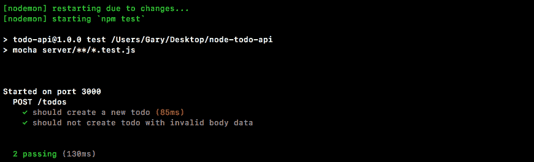

在这一部分设置基本的测试套件花了一点时间，但是在未来，随着我们添加更多的路由，测试将变得更加容易。我们不需要建立基础设施；我们不需要创建测试脚本或安装新模块。

# 提交 POST /todos 路由

最后要做的事情是做出承诺。我们添加了一些有意义的代码，所以我们想要保存这些工作。如果我运行`git status`，您可以看到我们有一些已更改的文件以及一些未跟踪的文件，因此我将使用`git add .`将所有这些文件添加到下一个提交中。现在，我可以使用带有`-m`标志的`git commit`来实际进行提交。一个很好的承诺信息是`Test POST /todos route`:

```js
**git commit -m 'Test POST /todos route'** 
```

我将进行提交，最后，我将使用`git push`将其推送到 GitHub。对于这种特殊情况，可以使用`git push`。我需要继续使用`git push --force`，这将覆盖 GitHub 上的所有内容。这只是我在这种特定情况下需要做的事情。你应该只是在跑`git push`。一旦你运行了它，你的代码应该会被推送到 GitHub，你就完成了。我们的路线有两个测试用例，现在是时候继续前进并添加新路线了。下一条路线将是`GET`请求获取所有托多斯。

# 列出资源- GET /todos

有了我们的测试套件，现在是时候创建我们的第二条路线了，即`GET /todos`路线，它将负责返回您所有的 Todos。这对任何 Todo 应用都很有用。

# 创建 GET /todos 路由

您可能要向用户显示的第一个屏幕是他们所有 Todos 的列表。这是获取信息的途径。这将是一个`GET`请求，所以我将使用`app.get`来注册路由处理器，并且 URL 本身将匹配我们拥有的 URL，`/todos`，因为我们想要获得所有的 Todos。稍后，当我们获得一个单独的待办事项时，该网址将看起来像`/todos/123`，但现在我们要将其与帖子网址进行匹配。接下来，我们可以在`server.js`中`app.listen`的正上方添加我们的回调；这将给出我们的请求和响应对象:

```js
app.get('/todos', (req, res) => {

});
```

我们所需要做的就是获取集合中的所有 Todos，这已经在测试文件中完成了。在`server.test.js`里面，我们使用`Todo.find`来获取所有的 Todos。我们将在这里使用同样的技术，但是我们不会传递查询；我们想归还所有东西。

```js
app.get('/todos', (req, res) => {
  Todo.find()
});
```

稍后，当我们添加身份验证时，您将只返回您创建的`Todos`，但是现在，如果没有身份验证，您将返回`Todos`集合中的所有内容。

接下来，我们将附加一个`then`呼叫。这个`then`调用将使用两个函数，一个是承诺解决时的成功案例函数，另一个是承诺被拒绝时触发的函数。成功案例将被所有的`todos`调用，我们要做的就是使用`res.send`发回信息。

```js
app.get('/todos', (req, res) => {
  Todo.find().then((todos) => {
    res.send()
  }, (e) => {

  })
});
```

我们可以通过`todos`阵列，但这不是完成工作的最佳方式。当你传回一个数组时，你就像是把自己锁了起来。如果您想添加另一个属性，无论是自定义状态代码还是其他数据，您都不能添加，因为您有一个数组。更好的解决方案是创建一个对象，并在该对象上指定`todos`，使用 ES6 将其设置为等于`todos`数组:

```js
app.get('/todos', (req, res) => {
  Todo.find().then((todos) => {
    res.send({todos});
  }, (e) => {

  })
});
```

这将允许您稍后添加其他属性。例如，我可以添加某种自定义状态代码，将它设置为我喜欢的任何值。通过使用一个对象，而不是发送一个数组回来，我们打开了一个更加灵活的未来。有了这些，我们的成功案例就可以开始了。我们需要做的唯一一件事就是处理错误，错误处理程序将看起来和我们之前使用的一样，`res.status`。我们将发回一个`400`，我们将发回传递给函数的错误对象:

```js
app.get('/todos', (req, res) => {
  Todo.find().then((todos) => {
    res.send({todos});
  }, (e) => {
    res.status(400).send(e);
  });
});
```

现在我们已经准备好了，我们可以开始启动我们的服务器，并在邮递员内部进行测试。

# 测试 GET /todos 路由

我将使用以下命令启动服务器:

```js
**node server/server.js** 
```

在 Postman 内部，我们可以从创建一些 Todos 开始。目前，我们的应用和应用的测试使用相同的数据库。我们在最后一节运行的`beforeEach`方法调用不幸地抹去了一切，这意味着我们没有数据可获取。我在 Postman 中要做的第一件事是尝试获取数据，我们应该得到一个空数组，它应该仍然有效。网址将是`localhost:3000/todos`并且它确实将是一个 GET 请求。我可以单击“发送”，这将触发请求，然后我们会得到我们的数据:

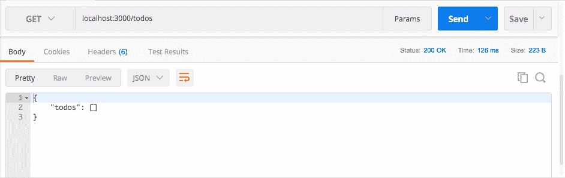

我们有一个对象，我们有我们的`todos`属性，我们有我们的空数组，这是预期的。

现在，您可能已经注意到，每次您想使用路由时，手动配置路由会变得非常繁琐，我们将一次又一次地使用许多相同的路由。有了邮递员，我们实际上可以创建一个路线集合，这样我们就可以重新发送请求，而不必手动输入所有信息。在右侧，我可以单击保存旁边的下拉箭头，然后单击另存为。在这里，我可以给我的请求一点细节:

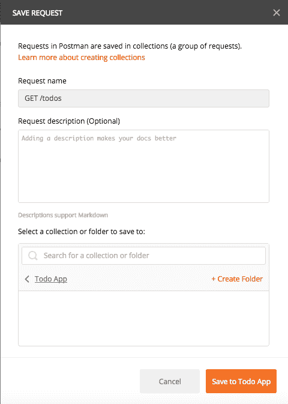

我要把请求名称改为`GET /todos`；这是我喜欢使用的命名约定，HTTP 方法后跟 URL。我们可以暂时将描述留空，并且我们可以创建一个新的集合，因为我们没有任何集合。邮差回声集合是邮差为您提供的探索此功能的示例集合。我们要做一个叫做`Todo App`的。现在，每当我们想要运行该命令时，我们所做的就是转到 Collections，单击 GET /todos，单击 Send，请求就会激发。

让我们继续设置一个`POST`请求来创建一个 Todo，然后我们运行它，保存它，并重新运行`GET`以确保它返回新创建的 Todo。

# 设置发布请求以创建待办事项

要创建`POST`请求，如果您记得，我们必须将方法更改为 POST，并且 URL 将是相同的，`localhost:3000/todos`:

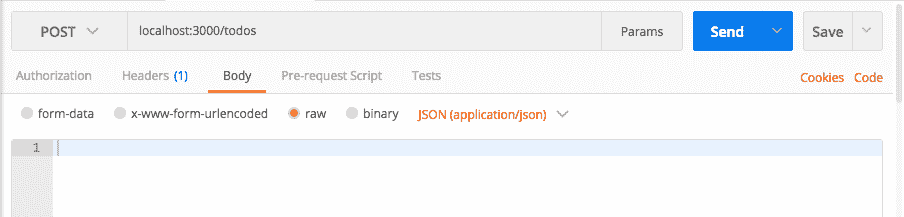

现在，为了让这个请求成功，我们还必须传递一个 Body 标签。这将是一个原始的 JSON 身体。在这里，我们可以指定我们想要发送的数据。在这种情况下，我们要发送的唯一数据属性是`text`，我会将其设置为`Something to do from postman`:

```js
{ 
  "text": "Something to do from postman"
}
```

现在，我们可以继续启动它，下面是我们新创建的 Todo，状态代码为 200:

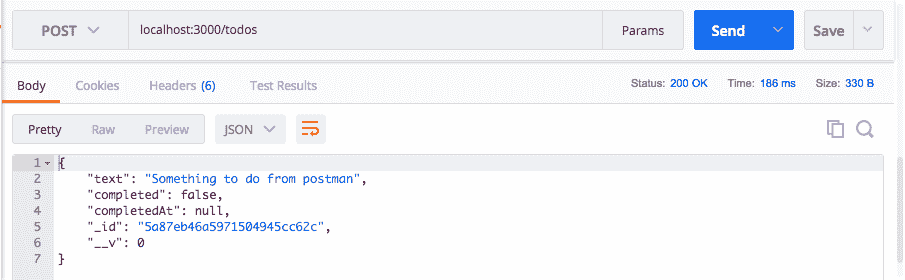

这意味着一切都很顺利。我们可以将它保存到我们的收藏中，以便稍后可以轻松地重新运行它。我将按照相同的语法将请求名称更改为`POST /todos`。然后，我可以选择一个现有的集合，托多应用集合，并保存它:


现在我可以简单地点击请求，使用*命令* + *进入*，或者点击发送按钮，发出请求，我得到了我的`todos`数组——一切看起来都很棒。

我可以随时点击开机自检，添加第二个，如果我喜欢的话可以调整一下，添加数字`2`，然后我可以使用*命令* + *进入*关闭那个。我可以重新运行`GET`请求，数据库中有我的两个`todos`:

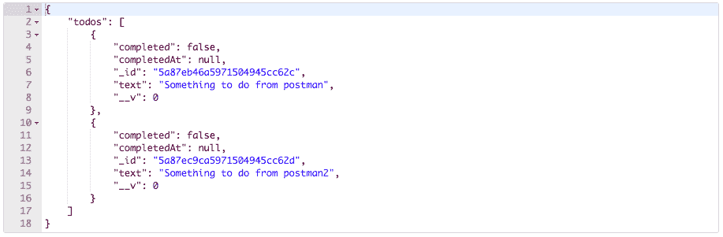

有了这些，我们的`GET /todos`请求就完成了。我们还在 Postman 中设置了我们的集合，使得更快地发出这些 HTTP 请求变得非常容易。

我将通过在终端中提交来结束这一部分。我要关闭服务器运行`git status`。这一次，你会看到我们只有一个文件，它被修改了，这意味着我们可以简单地使用带有`-a`标志的`git commit`，而不是使用`git add`。`-a`标志将所有修改过的文件添加到下一次提交中。它不适用于新的、未跟踪的文件，但是修改后的文件完全可以。然后，我可以添加`-m`标志来指定我的提交消息。一个很好的例子是`Add GET /todos route`:

```js
**git commit -a -m 'Add GET /todos route'** 
```

最后，我们将使用`git push`将其推送到 GitHub，现在我们完成了。在下一节中，我们将为`GET /todos`编写测试用例。

# 测试 GET /todos

现在我们的`GET /todos`路线已经到位，是时候为它添加一个测试用例了。现在，在我们实际编写测试用例之前，我们必须处理一个不同的问题。我们在`server.test`文件中做的第一件事是删除所有的 Todos，这发生在每次测试之前。`GET /todos`路线基本上依赖于它可以返回的 Todos 的事实。它将处理 Node Todos，但是对于我们的测试用例，我们需要该数据库中的一些数据。

为了添加这些数据，我们要做的是修改`beforeEach`，添加一些种子数据。这意味着我们的数据库仍然是可预测的；它开始的时候总是看起来完全一样，但是里面会有一些项目。

# 为 GET /todos 测试用例添加种子数据

现在，为了做到这一点，我们要做的第一件事是制作一个虚拟 Todos 的数组。这些托多斯只需要`text`属性，因为其他所有东西都将被猫鼬填充。我可以创建一个名为`todos`的常数，将其设置为一个数组，我们将有一个对象数组，其中每个对象都有一个`text`属性。例如，这个可以有一个文本`First test todo`，然后我可以添加第二个对象作为数组中的第二个项目，其`text`属性等于`Second test todo`:

```js
const todos = [{
  text: 'First test todo'
},{
  text: 'Second test todo'
}];
```

现在，在我们可以实际编写测试用例之前，我们必须使用一个名为`insertMany`的全新 Mongoose 方法修改`beforeEach`，该方法采用一个数组，如前面的代码块所示，并将所有这些文档插入集合中。这意味着我们需要快速调整代码。

我不使用简单的箭头函数来调用`done`，而是在回调函数内部加上一些大括号，我们将调用`Todo.insertMany`，并使用我们在前面代码块中定义的数组来调用`insertMany`。这将插入这个数组中的所有 todo，我们的两个 todo，然后我们可以做一些事情，比如调用`done`。我将返回响应，这将让我们链接回调，然后我可以添加一个`then`方法，在那里我可以使用一个非常简单的基于表达式的箭头函数。我要做的就是使用表达式语法调用`done`:

```js
beforeEach((done) => {
  Todo.remove({}).then(() => {
    return Todo.insertMany(todos);
  }).then(() => done());
});
```

现在，让我们继续运行测试套件。我现在要警告你，其他测试会有问题，因为他们断言的数字现在会不正确。在终端中，我将使用以下命令启动测试套件:

```js
**npm run test-watch** 
```

一旦这个测试套件开始运行，我将回到 Atom 中，正如您所看到的，正如所承诺的，两个测试用例都失败了。我们期待`3`成为`1`，我们期待`2`成为`0`。`2`一切都结束了。

为了解决这个问题，我们将使用两种不同的技术。在 server.test.js 文件中，在 Post todos 测试中，对于第一个测试，我们要做的只是找到 todos，其中`text`属性等于`Test todo text`:

```js
Todo.find({text}).then((todos) => {
  expect(todos.length).toBe(1);
  expect(todos[0].text).toBe(text);
  done();
}).catch((e) => done(e));
```

这意味着最终的长度仍然是`1`，并且第一个项目应该仍然有一个等于上面文本的`text`属性。对于第二个测试，我们将保持`find`的称呼不变；相反，我们将确保数据库的长度为`2`:

```js
Todo.find().then((todos) => {
  expect(todos.length).toBe(2);
  done();
}).catch((e) => done(e));
```

Todos 集合中应该只有两个文档，因为这是我们添加的全部内容，并且这是在测试一个失败，所以不应该添加第三个文档。有了这些，您可以看到我们的两个测试用例正在通过:


我们现在准备继续前进，并在测试用例中添加一个新的`describe`块。

# 向测试用例添加描述块

我将添加一个`describe`块，它将描述`GET /todos`路线，传入我们的箭头函数，然后我们可以添加我们的单个测试用例，`it('should get all todos', )`。现在，在这种情况下，所有`todos`都是指我们之前刚刚添加的两个 Todos。我将传递一个带有`done`参数的箭头函数，我们就可以开始了。我们所要做的就是启动超级测试请求——我将在快速应用上进行`request`操作——这将是一个 GET 请求，因此我们将调用`.get`，传入 URL `/todos`:

```js
describe('GET /todos', () => { 
  it('should get all todos', (done) => { 
    request(app) 
    .get('/todos') 
  )}; 
});
```

有了这些，我们现在准备好做出我们的断言；我们不会在请求正文中发送任何数据，但是我们将对返回的内容做出一些断言。

# 向测试用例添加断言

我们将`expect`看到一个`200`回来了，我们还将创建一个自定义断言，期待关于身体的一些东西。我们将为我们的回调函数提供响应，我们将前往`expect``res.body.todos`的长度为`2`、`.toBe(2)`。既然我们已经准备好了，我们所要做的就是附加一个`end`调用，并传入`done`作为参数。

```js
describe('GET /todos', () => {
  it('should get all todos', (done) => {
    request(app)
    .get('/todos')
    .expect(200)
    .expect((res) => {
      expect(res.body.todos.length).toBe(2);
    })
    .end(done);
  )};
});
```

没有必要提供一个函数来结束，因为我们没有异步地做任何事情。

有了这些，我们现在可以走了。我们可以保存`server.test`文件。这将使用`nodemon`重新运行测试套件；我们应该看到我们的新测试，它应该会通过。在终端中，我们可以看到:

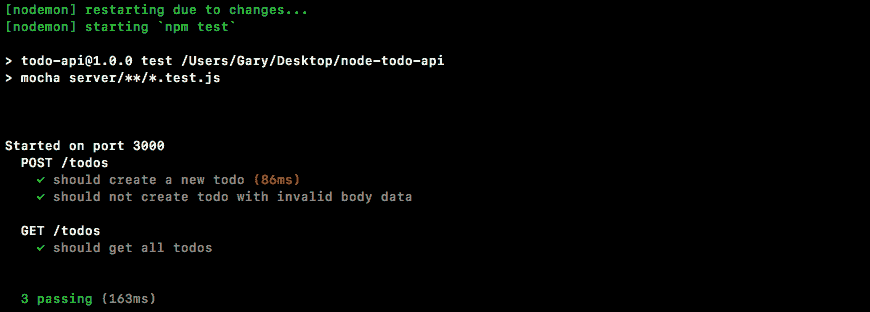

我们有我们的部分`POST /todos`；这两项测试都通过了，我们有`GET /todos`的部分，其中一项测试确实通过了。现在，如果我将状态更改为`201`，测试将会失败，因为那不是返回的状态。如果我将长度更改为`3`，将会失败，因为我们只添加了 2 个 Todos 作为种子数据。

现在我们已经完成了，让我们继续进行提交，保存这段代码。我要关闭`test-watch`脚本，运行一个`git status`命令，我们有两个修改的文件，这意味着我可以使用带有`-a`标志和`-m`标志的`git commit`。请记住，`-a`标志会将修改过的文件添加到下一次提交中。这个提交的一个好消息是`Add tests for GET /todos`:

```js
**git commit -a -m 'Add tests for GET /todos'**
```

我将进行提交，将其推送到 GitHub，然后我们就完成了。

# 摘要

在这一章中，我们建立了猫鼬，连接猫鼬到数据库。我们创建了几个 Todos 模型并运行了测试脚本。接下来，我们研究了猫鼬验证器、默认值和类型，并定制了 todo 模型属性，如 test、completed 和 completedAt。然后，我们查看了邮递员的基础知识，并向谷歌发出了 HTTP 请求。我们还研究了一些待办事项路由的配置，主要是 POST /todos 和 GET /todos。我们还研究了创建测试用例和测试这些路线。

有了这些，我们准备好继续添加一条全新的路线，这将在下一章中介绍。