# 七、将我们的聊天页面设计为网络应用

在前一章中，您学习了 Socket.io 和 WebSockets，它们支持服务器和客户端之间的双向通信。在这一章中，我们将继续讨论如何设计我们的聊天页面，让它看起来更像一个真正的网络应用。我们将研究时间戳，并使用矩方法格式化时间和日期。我们将为`newMessage`和`newLocation`消息创建和渲染模板。我们还将研究自动滚动，让聊天不那么烦人。

# 设置聊天页面的样式

在本节中，您将获得一些样式，这样我们的应用看起来就不那么像一个没有样式的 HTML 页面，而更像一个真正的网络应用。现在，在下面的截图中，在左边我们有一个人面板，我们还不会把它连接起来，尽管我们在页面内部给了它一个位置。最终，这将存储一个列表，列出所有连接到个人聊天室的人，这将在稍后进行。

在右侧，主要区域将是消息面板:

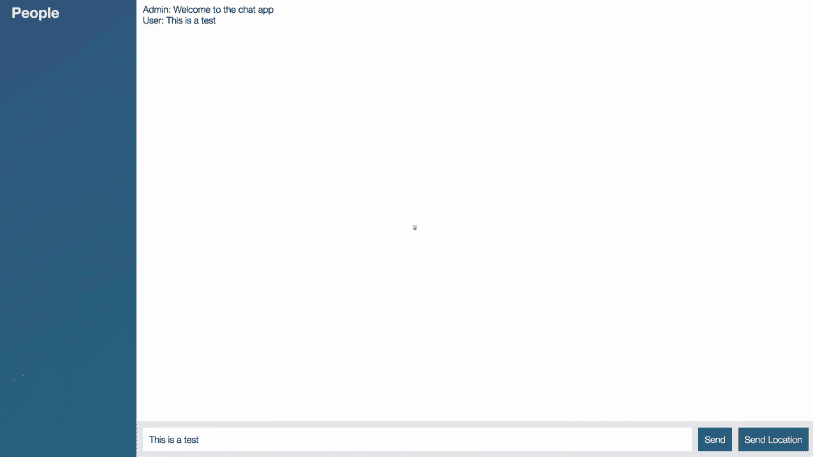

现在，单个的信息仍然是没有样式的，这将在以后出现，但是我们确实有一个地方来放置所有的东西。我们有自己的页脚，包括发送消息的表单、文本框和按钮，还包括发送位置按钮。

现在，为了完成所有这些，我们将添加一个我为这个项目创建的 CSS 模板。我们还将在我们的 HTML 中添加一些类；这将让我们应用各种风格。最后，我们将对 JavaScript 进行一些小的调整，以改善用户体验。让我们开始潜水吧。

# 存储模板样式

我们要做的第一件事是创建一个新文件夹和一个新文件来存储我们的样式。这将是我们稍后要抓取的模板样式，然后我们将继续将其加载到`index.html`中，以便在渲染聊天应用时使用这些样式。

现在我们要做的第一件事就是在`public`里面创建一个新的文件夹，并把这个文件夹叫做`css`。我们将只添加一个文件，一个名为`styles.css`的新文件。

现在，在我们开始抓取任何样式之前，让我们继续将这个文件导入到我们的应用中，为了测试并确保它正常工作，我们要做的是编写一个非常简单的选择器，我们要使用`*`选择所有内容，然后在花括号内我们要添加一个样式，将所有内容的`color`设置为等于`red`:

```js
* {
   color: red;
}
```

继续制作您的文件，就像这个一样，我们将保存它，然后我们将在`index.html`内导入它。就在我们的`meta`标签后面的`head`标签的底部，我们将添加一个`link`标签，这将让我们链接一个样式表。为了做到这一点，我们必须提供两个属性，首先，我们必须通过指定`rel`，或者关系属性，来告诉 HTML 我们到底链接到了什么。在这种情况下，我们试图链接一个`style sheet`，所以我们将提供这个值。现在我们接下来要做的就是提供`href`属性。这类似于`script`标签的`src`属性，它是您想要链接的文件的路径。在这种情况下，我们在`/css`有，我们刚刚创建了文件`style.css`，`/styles.css`:

```js
<head>
  <meta charset="utf-8">
  <link rel="stylesheet" href="/css/styles.css">
</head>
```

有了这个，我们可以保存`index.html`并在浏览器内部刷新页面，或者第一次加载页面，我们看到的是一个极其丑陋的页面:


我们已经设法使它比以前更丑，但这很好，因为这意味着我们的样式表文件被正确导入。

现在，为了获取我们将用于聊天应用的实际模板，我们将访问一个网址，[http://links.mead.io/chat-css](http://links.mead.io/chat-css)。这只是一个小小的链接，它将把你重定向到一个 Gist，这里我们有两个选项，我们可以选择缩小的样式模板或者未缩小的:


我将通过高亮显示或者点击原始链接来获取缩小的文件。我们将抓取我们在那里看到的全部内容，进入 Atom 并将其粘贴到我们的`styles.css`文件中，显然移除了之前的选择器。

现在我们已经做好了这一点，我们可以给我们的页面一次刷新，尽管我们不会看到太多的改进。在`localhost:3000`内部，我将刷新浏览器，很明显事情不同了:


这是因为我们需要将一些类应用到我们的 HTML 中，以便让一切正常工作。

# 调整结构以便对齐

我们需要调整结构，添加一些容器元素来帮助对齐。在 Atom 内部，我们可以在几分钟内完成这项工作。这个模板是围绕几个关键类构建的。第一个需要通过将`class`属性设置为引号内的`chat`来应用于`body`标签:

```js
<body class="chat">
```

这告诉样式表为这个聊天页面加载这些样式，我们将继续删除`Welcome to the chat app`，这不再是必要的。现在我们要做的下一件事是创建一个`div`标签，这个`div`将存放我们在左侧看到的`People`列表。它暂时是空的，但没关系，我们仍然可以继续创造它。

我们将制作`div`并给出这个`div`T4；类，并且`class`将被设置为等于下面的，`chat__sidebar`:

```js
<body class ="chat">

  <div class="chat">

  </div>
```

这是一些样式表模板中使用的命名约定，这实际上是一个偏好问题，你可以在创建样式表时随意调用它，我碰巧称之为`chat__sidebar`。这是更大的聊天应用中的一个子元素。

现在在`div`标签中，我们将使用`h3`标签添加一个小标题，我们将给它一个`People`的标题，或者你想称之为侧边栏列表的任何东西，我们还将提供一个`div`，它将最终容纳个人用户，尽管正如我提到的，我们还没有将它连接起来。现在，我们可以继续给它一个`id`设置，使其等于`users`，这样我们就可以稍后锁定它。这就是我们目前需要的聊天工具条:

```js
<div class ="chat__sidebar">
  <h3>People</h3>
  <div id="user"></div>
</div>
```

现在我们要做的下一件事是创建一个`div`标签，这个`div`将容纳那个主要区域，这意味着它将不仅包含我们的聊天消息，而且还包含底部的小表单，边栏右侧的所有内容。

这也需要为一些样式定制一个类，这个叫做`chat__ main`，在这里我们不仅要添加我们的无序列表，还要添加我们的`form`和`button`。让我们继续，将当前的所有标记，无序列表，向下移动到发送位置按钮，将其剪切并粘贴到`chat__main`中:

```js
<div class="chat__main">
  <ol id="messages"></ol>

  <form id="message-form">
    <input name="message" type="text" placeholder="Message"/>
    <button>Send</button>
  </form>
  <button id="send-location">Send Location</button>
</div>
```

现在我们还没有完全完成，还有一些事情需要调整。首先，我们必须在我们的有序列表中添加一个类，我们将`class`设置为`chat__messages`，这将提供必要的样式，我们需要创建的最后一个`div`将用于该页脚。这将是底部的灰色条，包含您的`form`和`Send Location`按钮。我们将制作`div`，这将有助于对齐，我们将通过将其剪下并粘贴到有序列表的`div`中，在其中添加`form`和`button`标签:

```js
<div class="chat__main">
  <ol id="messages" class="chat__messages"></ol>

  <form id="message-form">
    <input name="message" type="text" placeholder="Message"/>
    <button>Send</button>
  </form>
  <button id="send-location">Send Location</button>
</div>
```

现在我们也需要一个类，正如你可能已经猜到的，将`class`属性设置为字符串`chat__footer`:

```js
<div class="chat__footer">
  <form id="message-form">
    <input name="message" type="text" placeholder="Message"/>
    <button>Send</button>
  </form>
  <button id="send-location">Send Location</button>
</div>
```

现在我们已经准备好了所有的课程，我们可以前往浏览器，看看当我们刷新页面时会得到什么:


我们有自己风格的聊天应用，我们仍然可以做我们以前能做的任何事情。我可以发送信息，`Hey this should still work`，点击*进入*，屏幕显示`Hey this should still work`:


发送位置也是如此，我可以发送我的位置，这将发送到服务器，它将发送到所有客户端，我可以点击我的当前位置链接，该位置将显示在谷歌地图中。我们保留了所有的旧功能，同时添加了一组不错的样式:


# 改善用户体验

现在，在本节的后半部分，我想对表单进行一些用户体验改进。

我们要做的一个改进是在消息成功发送后清除文本值。我们还将对发送位置进行类似的操作。正如您可能已经注意到的，发送位置地理定位调用可能需要一两秒钟才能真正完成，我们将此按钮设置为禁用，这样就不会有人向它发送垃圾邮件来询问发生了什么。我们还将更新文本以显示`Sending Location`，以便有人知道后台正在发生一些事情。

为了完成这两件事，我们需要做的就是在`index.js`里面修改几行。在文件的底部，我们有两个 jQuery 事件侦听器，这两个都将被更改。

# 更改表单提交侦听器

现在我们要改变的第一件事是表单提交监听器。在`socket.emit`中，我们从字段中获取值，这就是我们传递的。我们接下来要在确认回调中做的是清除值。一旦服务器接收到请求，就没有理由保留它，所以我们可以做的是添加相同的`jQuery`选择器，目标是`name`属性等于`message`的字段。我们将通过再次调用`val`来清除它的值，但是我们将通过传入空字符串作为第一个参数来将该值设置为空字符串，而不是通过不提供参数来获取值:

```js
jQuery('#message-form').on('submit', function (e) {
  e.prevenDefault();

  var messageTextbox =

  socket.emit('createMessage', {
    from: 'User',
    text: jQuery('[name=message]').val()
 }, function () {
    jQuery('[name=message]').val('')
  });
});
```

您可以将该值设置为您喜欢的任何值，但在这种情况下，我们只想清除它，因此我们将使用以下方法调用。

我们有两次相同的选择器来加快速度，我们将创建一个变量，我们将调用该变量`messageTextbox`，然后我们可以将其设置为等于我们刚刚创建的选择器，现在我们可以在任何需要访问该输入的地方引用`messageTextbox`。我们可以参考它，`messageTextbox`和下一个，`messageTextbox`像这样:

```js
var messageTextbox = jQuery('[name=message]'); 

socket.emit('createMessage', { 
  from: 'User', 
  text: messageTextbox.val() 
}, function() { 
  messageTextbox.val('') 
}); 
```

现在是`createMessage`的监听器，在`server.js`里面结束，我们确实用一个字符串调用回调。现在，我们将移除传入零参数的伪值，如下所示:

```js
socket.broadcast.emit('newMessage', generateMessage('Admin, 'New user joined'));

socket.on('createMessage', (message, callback) => {
  console.log('createMessage', message);
  io.emit('newMessage', generateMessage(message.form, message.text));
  callback();
});
```

这意味着确认函数仍然会被调用，但是我们实际上不需要任何数据，我们只需要知道服务器何时响应。现在我们已经准备好了，我们可以继续刷新`localhost:3000`中的内容，键入一条消息，`Here is a message`并点击*进入*键，我们就可以清除该值，它确实被发送了:

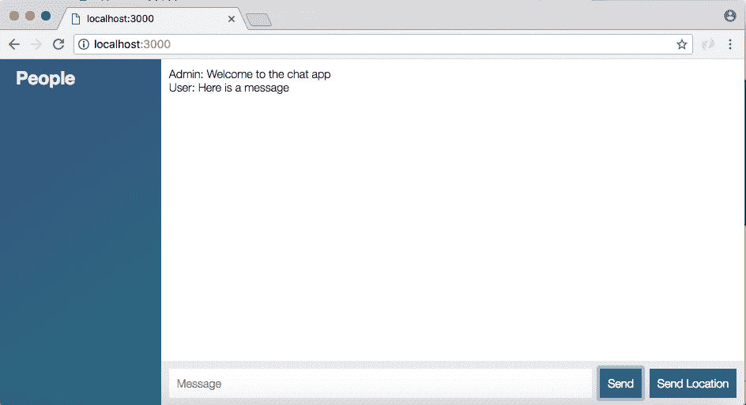

如果我输入一条消息，`Andrew`并点击发送按钮，同样的情况也会发生。

# 更新输入标签

现在我们要做的一件事是更新文本框的`input`标签。如果我刷新页面，我们目前没有进入消息字段，这将是非常好的。关闭自动完成也很好，因为你可以看到自动完成并不是一个有用的功能，它里面的值通常是垃圾。

因此，我们在 Atom 内部要做的是添加两个属性来定制输入。第一个是`autofocus`，不需要值，`autofocus`会在 HTML 渲染时自动聚焦输入，第二个我们要添加的是`autocomplete`，我们要将其设置为字符串`off`:

```js
<div class="chat__footer">
<form id="message-form">
  <input name="message" type="text" placeholder="Message" autofocus autocomplete="off"/>
  <button>Send</button>
<form>
<button id="send-location">Send Location</button>
```

有了这个，我们可以保存`index.html`，返回到 Chrome，刷新页面并测试。我要输入`test`，我没有自动完成功能，这很好，我们已经关闭了它，如果我点击发送按钮，我确实还在发送消息。当我重新加载页面时，我也被带进了文本框，我不需要做任何事情来开始输入。

# 自定义发送位置

接下来我们要做的是使用更多的 jQuery 定制发送位置按钮。现在我们刚接触 jQuery，这并不是一门真正的 jQuery 课程。这里的目标是更改按钮文本，并在此过程中禁用它。当这个过程完成时，也就是说这个位置要么被发送了，要么没有被发送，我们可以将按钮返回到它的正常状态，但是当地理定位呼叫发生时，我们不希望有人滥发信息。

为了做到这一点，我们将对`index.js`中的最终点击监听器进行一些调整，接下来是我们的点击监听器。在这里，我们需要对我们定义的按钮`locationButton`变量进行一些更改。我们将设置一个属性来禁用按钮。

为了做到这一点，我们将引用选择器`locationButton`，我们将调用一个 jQuery 方法。

现在，只有在我们确认他们甚至支持它之后，我们才会禁用它，如果他们不支持该功能，就没有理由继续禁用它。这里`locationButton.attr`将让我们设置一个属性，我们将设置`disabled`属性等于值`disabled`。现在这个禁用的也需要加引号:

```js
var locationButton = jQuery('#send-location');
locationButton.on('click', function () {
  if (!navigator.geolocation) {
    return alert('Geolocation not supported by your browser.');
  }

  locationButton.attr('disabled', 'disabled');
```

现在我们已经禁用了这个按钮，我们实际上可以测试它，我们从来没有取消它，所以它将被打破后，点击它一次，但我们可以确认这一行的工作。在浏览器中，我将进行刷新，单击发送位置，您可以立即看到它被禁用的按钮:


现在它将发送一次位置，但是如果我再次尝试点击它，按钮将被禁用，并且它永远不会重新触发`click`事件。这里的目标是仅在进程实际发生时禁用它，一旦它像这里一样被发送，我们希望重新启用它，以便有人可以发送更新的位置。

为了在 Atom 内部完成这项工作，我们将在成功处理程序和错误处理程序中添加一行 jQuery。如果进展顺利，我们将引用`locationButton`，并使用`removeAttr`移除禁用属性。这只需要一个参数，属性的名称，在这个例子中我们有，它是一个字符串，`disabled`:

```js
locationButton.attr('disabled', 'disabled');

navigator.geolocation.getCurrentPosition(function (position) {
  locationButton.removeAttr('disabled');
  socket.emit('createLocationMessage', {
    latitude: position.coords.latitude,
    longitude: position.coords.longitude
  });
```

这将删除我们之前定义的`disabled`属性，重新启用按钮。我们可以做完全相同的事情，在`function`里面复制粘贴下一行。如果由于某种原因我们无法获取位置，可能用户拒绝了`geolocation`的请求，我们仍然希望禁用该按钮，以便他们可以重试:

```js
navigator.geolocation.getCurrentPosition(function (position){ 
  locationButton.removeAttr('disabled'); 
  socket.emit('createLocationMessage', { 
    latitude: position.coords.latitude, 
    longitude: position.coords.longitude 
  }); 
}, function(){ 
   locationButton.removeAttr('disabled');
   alert('Unable to fetch location'); 
}); 
```

现在我们已经设置好了，我们可以通过刷新浏览器并尝试发送我们的位置来测试代码。我们应该看到按钮被禁用了一会儿，然后它被重新启用。我们可以点击它来证明它如预期的那样工作，并且按钮被重新启用，这意味着我们可以在稍后再次发送我们的位置时继续点击它。

# 更新按钮文本

现在我们要做的最后一件事是在这个过程中更新按钮文本。为了在 Atom 内部完成这项工作，我们将使用过去用过的`text`方法。

在`locationButton.attr`行，我们将通过调用文本`Sending location...`将`text`属性设置为。现在，在`index.js`文件中，真正的按钮文本是`Send Location`，我将继续使用小写的`location`来保持统一:

```js
var locationButton = jQuery('#send-location');
locationButton.on('click', function (){
  if (!navigator.geolocation){
    return alert('Geolocation not supported by your browser.');
  }
  locationButton.attr('disabled', 'disabled').text('Sending location...');
```

现在我们已经有了这个设置，我们正在更新这个过程发生时的文本，剩下唯一要做的事情是通过将`text`设置为等于字符串`Send location`将其调整回原始值，我们将在错误处理程序中做完全相同的事情，调用`text`传入字符串`Send location`:

```js
locationButton.attr('disabled', 'disabled').text('Sending location...'); 

navigator.geolocation.getCurrentPosition(function (position){ 
  locationButton.removeAttr('disabled').text('Send location'); 
  socket.emit('createLocationMessage', { 
    latitude: position.coords.latitude, 
    longitude: position.coords.longitude 
  }); 
}, function(){ 
    locationButton.removeAttr('disabled').text('Send location'); 
    alert('Unable to fetch location'); 
}); 
```

现在我们可以继续测试这是否如预期的那样工作，这两行(在成功和错误处理程序中)是相同的，不管它成功还是失败，我们都要做同样的事情。

在 Chrome 中，我将再次刷新我的页面，我们将单击发送位置按钮，您可以看到按钮被禁用，文本被更改，发送位置...显示:


一旦该过程完成并且位置被实际发送，按钮就返回到其默认状态。

有了这些，我们现在有了比以前更好的用户体验。我们不仅有一套很好的风格，我们也有一个更好的用户界面为我们的形式和发送位置按钮。这就是我们本节要讲到的地方。

让我们通过关闭服务器、运行`git status`、运行`git add .`来添加所有这些文件来进行快速提交，最后我们将继续运行`git commit`，其中`-m`标志提供了一条消息，`Add css for chat page`:

```js
**git commit -m 'Add css for chat page'**
```

我们可以继续使用`git push`将它推送到 GitHub，从现在开始，我将避免为 Heroku 部署，尽管欢迎您实时部署和测试您的应用。

# 时间戳和带有矩的格式

在整个课程中，我们使用了相当多的时间戳，我们在待办事项应用中生成了时间戳，我们还在聊天应用中为我们的所有消息生成了时间戳，但我们从未将它们格式化为人类可读的格式。这将是本节的主题，在下一节中，我们将把它付诸行动。

到下一节结束时，我们将有一个带有名称、时间戳和消息的格式化消息区域，我们也将有一些更好的样式。现在在这一节中，我们将讨论时间和时间戳，我们不会对应用的前端进行任何更改，我们将简单地了解时间在节点内部是如何工作的。

# 节点中的时间戳

为了探索这一点，我们将创建一个新的`playground`文件，在 Atom 内部，我们将创建一个`playground`文件夹来存储这个文件，在`playground`文件夹内部，我们可以创建一个新的文件，称之为`time.js`。在这里，它将随着时间的推移而发展，我们将在下一节把我们在这里学到的东西带到应用的前端。

我们对时间戳并不陌生，我们知道它们只不过是整数，无论是正的还是负的，类似`781`的东西是完全有效的时间戳，类似减去几十亿或者任何数字的东西都是有效的，甚至`0`也是完全有效的时间戳。所有这些数字都是相对于历史上的某个时刻的，这个时刻被称为 Unix 纪元，即 1 月 1 日& nbsp。`1970`午夜零时零分零秒。它以世界协调时存储，这意味着它与时区无关:

```js
// Jan 1st 1970 00:00:00 am

0
```

现在我的时间戳`0`实际上完美地代表了历史上的这个时刻，正数如 1000 指向未来，负数如-1000 指向过去。-1000 作为时间戳将代表 12 月 31 日&nbsp；1969 年 11 点 59 分 59 秒，我们从`1970`年 1 月 1 日开始，一秒一秒的进入过去。

现在这些时间戳在 JavaScript 中，它们以毫秒为单位存储，因为在常规的 Unix 时间戳中的 Unix 纪元，它们实际上以秒为单位存储。由于我们在本课程中使用了 JavaScript，我们将始终使用毫秒作为时间戳值，这意味着在这样的时间戳，1000 代表 1 月 1 日 <sup>st</sup> 的一秒钟，因为一秒钟有 1000 毫秒。

像 10000 这样的值是 10 秒后的今天，以此类推。现在我们面临的问题是永远得不到时间戳，获取时间戳真的很容易，我们所要做的就是调用`new Date`调用它的`getTime`方法。但是事情会变得更加困难，我们希望格式化一个人类可读的值，就像我们之前的值一样。

我们想在我们的网络应用的屏幕上打印一些东西，不仅仅是时间戳，我们还想打印一些东西，比如五分钟前，让用户知道消息是五分钟前发送的，或者您可能想打印实际日期以及月、日、小时、分钟和上午或下午的值。不管你想打印什么，我们都需要谈一谈格式，这就是默认`Date`对象的不足之处。

是的，有一些方法可以让你从一个日期中得到特定的值，比如年、月或月中的某一天，但是它们非常有限，并且定制起来是一个巨大的负担。

# 日期对象

为了准确地讨论这个问题，让我们继续通过谷歌搜索`mdn date`来获取日期文档，这将把我们带到*日期*的 Mozilla 开发者网络文档页面，这是一组非常棒的文档:

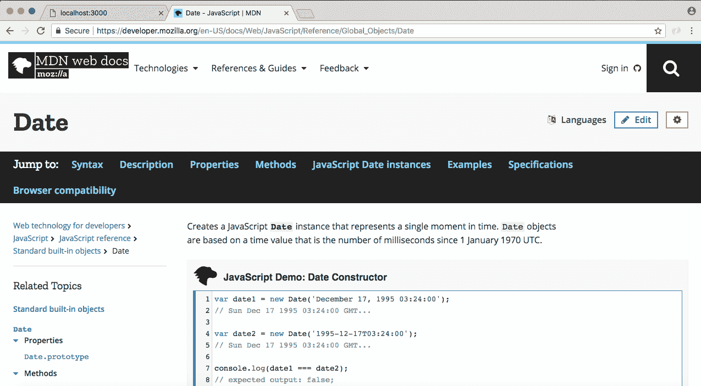

在这个页面上，我们可以访问所有可用的方法，这些都是类似于`getTime`的方法，返回关于日期的特定信息:


例如，如前一张截图所示，我们有一个`getDate`方法，返回一个月中的某一天，一个从 1 到 31 的值。我们有类似`getMinutes`的东西，它返回时间戳的当前分钟数。所有这些都存在于`Date`内部。

现在的问题是，这些真的是不可战胜的。例如，在 Atom 中，我们有一个小日期`Jan 1st 1970 00:00:10 am`。这是一月的简写版本。现在我们可以得到实际月份，向您展示我们将如何创建一个名为`date`的变量。我们将继续创建`new Date`，然后我们将继续调用一个方法。我将使用`console.log`将值打印到屏幕上，我们将调用`date.getMonth`:

```js
// Jan 1st 1970 00:00:10 am

var date = new Date();
console.log(date.getMonth());
```

文档中定义的`getMonth`方法将返回一个从 0 到 11 的基于 0 的月份值，其中 0 是 1 月，11 是 12 月。在终端内部，我将使用`nodemon`启动我们的应用，因为我们将重新启动它很多次。Nodemon 在`playground`文件夹而不是`server`文件夹，文件本身叫做`time.js`:

```js
**nodemon playground/time.js**
```

一旦它启动并运行，我们看到我们得到`2`回来，这是预期的:

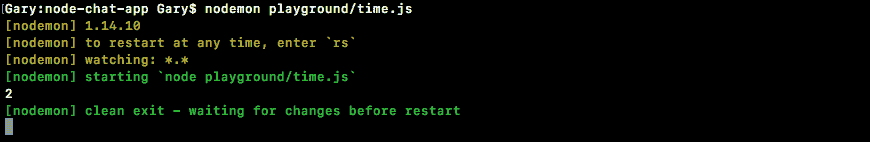

目前是 2018 年 3 月 25 日，3 月的`0`指数值将是`2`，尽管你通常认为它是 3。

现在之前的结果没问题。我们用数字 2 来表示月份，但是要得到一个实际的字符串 1 月或 1 月要困难得多。没有内置的方法来获得这个值。这意味着如果你真的想要得到那个值，你必须创建一个数组，也许你可以调用数组`months`，你可以像这样存储所有的值:

```js
var date = new Date();
var months = ['Jan', 'Feb']
console.log(date.getMonth());
```

这会很好，几个月内看起来没什么大不了的，但是一个月内的某一天，事情会变得同样令人困惑，就像我们遇到的一样。我们能拿回的只有 1 号。实际上，将它格式化为第一、第二或第三将会困难得多。只是没有一套好的方法来格式化你的日期。

当你想要一个相对的时间字符串时，事情变得更加复杂，比如三分钟前。最好在网页应用中与信息一起打印，打印实际的月份、日期和年份不是特别有用。如果我们能像许多聊天应用一样说，嘿，这条消息是三小时前、三分钟前或三年前发送的，那就太好了。

# 使用时间戳的矩

现在，当你开始像这样格式化时，你的第一反应通常是创建一些实用的方法来帮助格式化日期。但是没有必要这样做，因为我们在这一部分要看的是一个奇妙的时间库，叫做**时刻**。《瞬间》几乎是唯一的同类图书馆。它被普遍认为是处理时间和 JavaScript 的入门库，我从未在没有使用 Moment 的节点或前端项目上工作过，当您以任何身份处理日期时，它确实是必不可少的。

现在为了展示为什么 Moment 如此伟大，我们将首先在终端内部安装它。然后我们将发挥它的所有能力，它有很多。我们可以通过运行`npm i`来安装它，我将继续使用当前版本`moment@`版本`2.21.0`，我还将使用`--save`标志将其添加为一个依赖项，一个我们在 Heroku 和本地都需要的依赖项:

```js
**npm i moment@2.21.0 --save**
```

现在一旦安装好了，我可以使用`clear`清除终端输出，我们可以继续重新启动`nodemon`。在`playground`文件夹中，是时候要求矩，看看它到底能为我们做什么。

为了开始工作，让我们继续尝试解决我们试图用日期解决的问题。我们想打印一个月的速记版本，如一月、二月等。第一步将是注释掉前面的代码，并在顶部装入 Moment previous，需要它。我将通过要求`moment`库来创建一个名为`moment`和`require`的变量:

```js
var moment = require('moment');

// Jan 1st 1970 00:00:10 am

//var date = new Date();
//var months = ['Jan', 'Feb']
//console.log(date.getMonth());
```

接下来，我们将通过创造一个新的时刻来拉开序幕。现在，就像我们创建一个新的日期来获得一个特定的日期对象一样，我们将对 moment 做同样的事情。我将调用这个变量`date`，我们将它设置为等于对`moment`的调用，我们在前面加载的函数，没有任何参数:

```js
var moment = require('moment');

// Jan 1st 1970 00:00:10 am

//var date = new Date();
//var months = ['Jan', 'Feb']
//console.log(date.getMonth());

var date = moment();
```

这将创建一个表示当前时间点的新力矩对象。从这里开始，我们可以继续尝试使用它真正有用的格式化方法来格式化东西。格式方法是我喜欢 Moment 的主要原因之一，它让打印任何你想要的字符串变得非常简单。现在，在这种情况下，我们可以访问我们的`date`，我们将继续调用我刚才谈到的方法`format`:

```js
var moment = require('moment');
var date = moment(); 
console.log(date.format());
```

在我们进入我们要传递的格式之前，让我们像这样运行它。当我们在终端内完成这个操作时，  `nodemon`将会继续并重新启动，在这里我们有了格式化的日期:

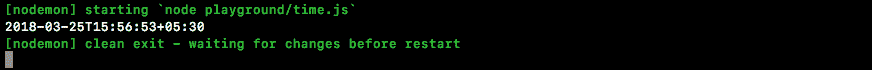

我们有年、月、日和其他值。它仍然不是真正的用户友好，但它是朝着正确方向迈出的一步。`format`方法的真正威力来自于你在里面传递一根弦。

现在，我们在 format 方法中传递的是模式，这意味着我们可以访问一组特定的值，我们可以使用这些值来输出某些东西。我们将在一秒钟内探索您可以使用的所有模式。现在，让我们继续使用一个；这是三重大写`M`模式:

```js
var date = moment(); 
console.log(date.format('MMM'));
```

当 Moment 在里面看到这个模式时，格式化它，并获取这个月的速记版本，这意味着如果我保存这个文件，并在终端内再次重新启动它。我们现在应该看到当前月份 9 月份的简写版本，它将是`Mar`:


就在这里，我们有`Sep`正如预期的那样，我们能够通过使用格式化方法来完成。现在，format 返回一个只有您指定的内容的字符串。在这里，我们只指定我们想要月的速记版本，所以我们得到的只是月的速记版本。我们还可以添加另一种模式，四个 Ys，打印出全年；在目前的情况下，它将打印出 2016 年的数字:

```js
console.log(date.format('MMM YYYY')); 
```

我将继续并再次节省时间，就在这里我们得到`Mar 2018`:


现在，Moment 有一套非常棒的文档，所以你可以使用任何你喜欢的模式。

# 时刻文件

在浏览器内部，我们可以通过转到[momentjs.com](http://momentjs.com/)来调出它。《瞬间》的文档非常棒。它可以在文档页面上找到，为了开始了解如何使用格式，我们将转到显示部分:

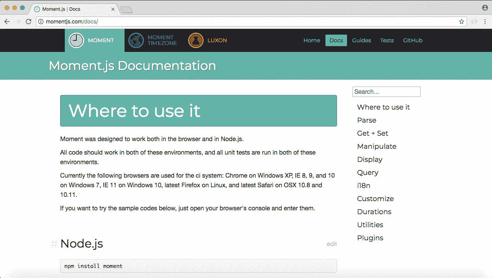

显示的第一项是格式。有几个关于如何使用格式的例子，但真正有用的信息是我们这里有的:

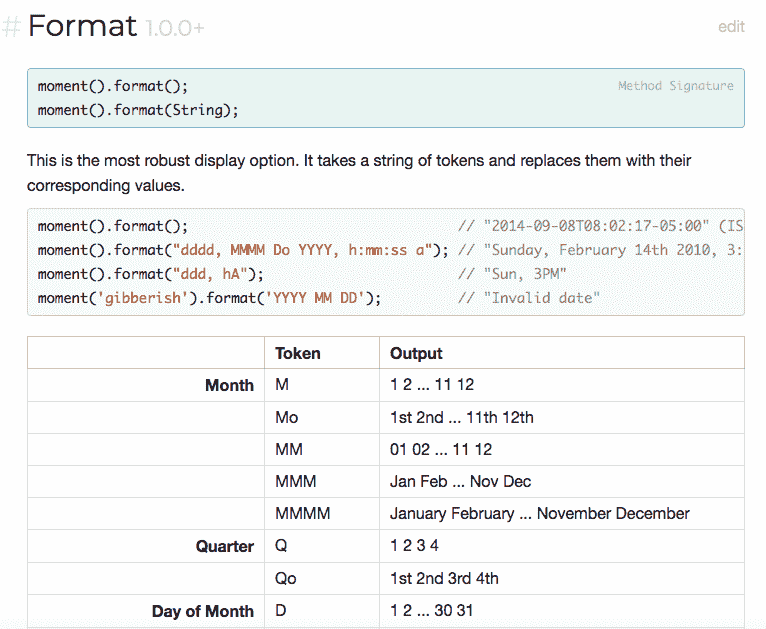

这里我们有所有的标记，我们可以把它放在字符串中，按照我们喜欢的方式格式化我们的一天。在前面，您可以看到您可以使用任意多的这些标记来创建真正复杂的日期输出。现在我们已经探索了两个。我们探索了`MMM`，它被定义在月标题的正下方，正如你所看到的，有五种不同的方式来表示月。

我们用了一年的`YYYY`模式也在这里定义了。使用年份有三种方法。我们刚刚探索了其中一个。这里有所有内容的部分，年、星期几、月几、上午/下午、小时、分钟、秒，所有这些都被定义了，它们都可以放在一个格式中，就像我们对当前值所做的那样:


现在，为了更深入地探讨这一点，让我们回到 Atom 并利用其中的一些优势。我们要做的是像这样打印日期:`Jan 1st 1970`，简写的月份和年份，我们已经有了，但是现在我们还需要一个月份的日期，格式像 1，2，3，而不是 1，2，3。

# 使用力矩格式化日期

为了做到这一点，如果我以前没有使用 Moment，我会在文档中查找月日部分，并查看可用的选项。我有 D 模式打印 1 到 31，Do  打印我们想要的，第 1，第 2，第 3 等等，DD 打印前面有 0 的数字，数值小于 10。

现在，在这种情况下，我们想使用 Do 模式，所以我们所要做的就是在格式内键入它。我将打开终端和 Atom，这样我们可以看到它在后台刷新，我们将键入:

```js
console.log(date.format('MMM Do YYYY')); 
```

保存文件，当它开始时，我们得到`March 25th 2018`，这确实是正确的:

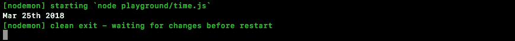

现在我们还可以添加其他字符，如逗号:

```js
console.log(date.format('MMM Do, YYYY'));
```

逗号不是 format 期望的模式的一部分，所以它只是简单地传递它，这意味着逗号就像我们在`March 25th, 2018`中键入的那样显示出来:

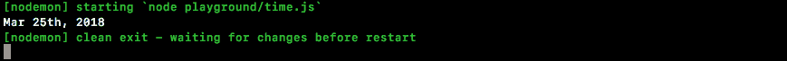

以这种方式使用格式给了我们很大的灵活性来决定如何打印日期。现在格式化只是众多方法中的一种。在 Moment 上有很多方法可以做任何事情，尽管我发现我在大多数项目中使用了几乎相同的六种方法。虽然它们确实存在，但对大多数来说确实没有太多的需求，因为它们在某些情况下是有用的。

# 力矩中的操纵部分

为了快速浏览片刻可以做的一些其他事情，让我们返回到文档并转到操作部分:

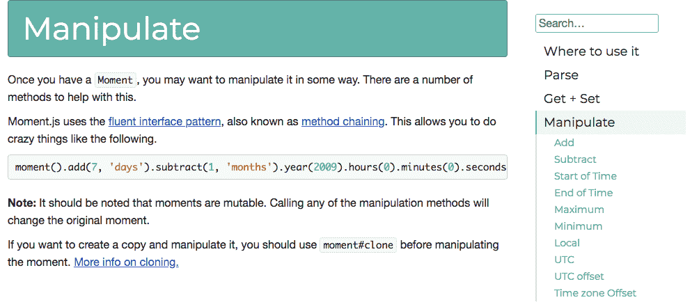

操纵下定义的前两种方法是`add`和`subtract`。这可以让你轻松地增加和减少时间。我们可以称`add`加七天，我们可以称`subtract`减七个月，如本例所示:


对于这个例子，您可以快速了解可以加减什么，年、季度、月、周，几乎任何时间单位都可以加减:

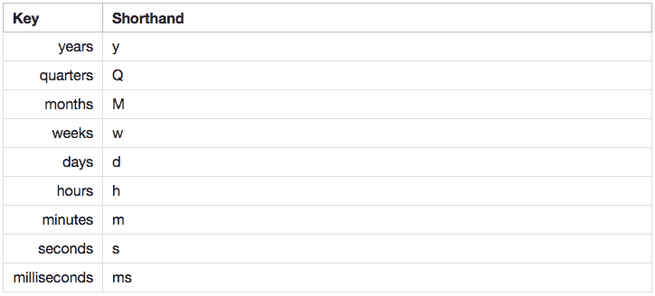

现在来看看时间戳到底发生了什么，我们可以继续添加和减去一些值。我将调用`date.add`，我们将继续添加一年，将`1`作为值，将`year`作为单位:

```js
var date = moment();
date.add(1, 'years')
console.log(date.format('MMM Do, YYY'));
```

现在，不管你使用单复数版本，两者都是一样的。这里可以看到我们在终端得到`2019`:

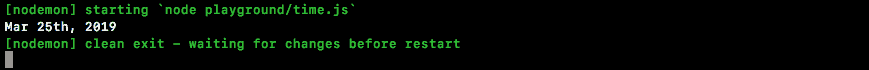

如果我把它改成年单数，我也得到同样的值。我们想加多少年就加多少年，我继续加`100`年:

```js
var date = moment();
date.add(100, 'year')
console.log(date.format('MMM Do, YYY'))
```

现在我们来到了`2118`:


`subtract`也是如此。我们可以链接呼叫，也可以将其添加为单独的语句。我就这样减去:

```js
date.add(100, 'year').subtract(9, 'months');
```

我们现在是九月，当我们减去九个月，我们回到六月:


现在你注意到我们从 T2 出发了。至`2117`&nbsp；因为减去这 9 个月需要我们改变年份。瞬间真的很擅长处理你扔给它的任何东西。现在我们将更多地使用格式。我将添加一个我想要的输出，我们需要找出在文档内部使用哪些模式来获得那个输出。

现在写作的当前时间，这是 10:35，它在 am 中，所以我有一个小写的 am。您的目标是打印这样的格式。显然，如果运行代码时是 12:15，你会看到 12:15，而不是 10:35；重要的只是格式，实际值没那么重要。现在，正如您将看到的，当您尝试打印小时和分钟时，您将有很多选择。对于这两个版本，你会有一个像 01 这样的填充版本或者像 1 这样的非填充版本。

我希望你使用填充版本几分钟，使用非填充版本几小时，也就是 6，像这样，和 01。如果你填充了时间，它看起来有点奇怪，如果你没有填充分钟，它看起来很糟糕。因此，如果碰巧是早上 6:01，我们想打印这样的东西。现在对于小时，你也可以选择 1 到 12 或者 1 到 24，我通常使用 12 小时制，所以我将使用 am。

在我们开始之前，我将注释掉前面的代码，我希望您从头开始编写所有内容。我将通过无参数调用`moment`来创建一个新的变量`date`，我们也将在`console.log`中调用 format，这样我们就可以将格式化后的值打印到屏幕上，`date.format`:

```js
var date = moment();
console.log(date.format(''))
```

在报价中，我们将提供我们的模式，从未添加的小时和添加的分钟开始。我们可以找到这两种模式，方法是转到文档，返回到“显示”，然后看一眼。如果我们滚动到下一个，我们将遇到的第一个是“小时”，我们有很多选项:

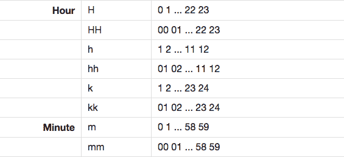

我们有 24 小时选项，我们有 1 到 12 小时；我们想要的是小写的 h，它是 1 到 12 的无加数。填充版本，也就是 hh，就在旁边，这不是我们想要的。我们将通过添加一个 h:

```js
var date = moment(); 
console.log(date.format('h')); 
```

我还将保存文件，在终端中查看它:


我们有`4`，看起来很棒。接下来是填充分钟，接下来我们将继续寻找该模式。一分钟内，我们有少得多的选项，无论是填充的还是未填充的，我们都想使用 mm。现在，在我添加 mm 之前，我要添加一个冒号。这将以纯文本形式传递，这意味着它不会被更改。我们将添加两个小写字母 ms:

```js
console.log(date.format('h:mm')); 
```

然后我们可以保存`time.js`并确保正确的东西打印在终端中，并且它确实显示了`4:22`:


接下来是抓取小写的 am 和 pm 值。我们可以在 小时之前的谷歌浏览器中找到这个模式:

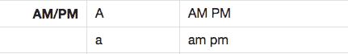

这里我们可以用大写的 A 表示大写的 AM 和 PM，或者用小写的 A 表示小写的版本。我将在空格后使用小写`a`来使用那个小写版本:

```js
var date = moment();
console.log(date.format('h:mm a'))
```

我可以在终端内保存文件，我确实有`4:24`打印到屏幕上，然后我们有`pm`:


一切看起来都很棒。这部分就到这里！在下一篇文章中，我们将把 Moment 集成到我们的服务器和客户端中，而不仅仅是把它放在一个`playground`文件中。

# 打印邮件时间戳

在本节中，您将格式化时间戳，并将它们与聊天消息一起显示在屏幕上。目前，我们显示它来自谁和文本，但是`createdAt`时间戳没有在任何地方使用。

现在，我们首先需要弄清楚的是，我们如何获取那个时间戳，并获得一个 Moment 对象，因为在一天结束时，我们希望调用`format`方法来按照我们喜欢的方式格式化它。为了做到这一点，你所要做的就是获取你的时间戳。我们将创建一个名为`createdAt`的变量来表示该值，并将其作为第一个参数传递给`moment`，这意味着我只需传递`createdAt`，如下所示:

```js
var createdAt = 1234; 
var date = moment(createdAt); 
```

当我这样做的时候，我们用同样的方法创造了一个时刻，比如格式化、加法和减法，但是它代表了不同的时间点。默认情况下，它使用当前时间。如果你输入一个时间戳，它会使用这个时间。现在这个数字`1234`刚刚超过 Unix 时代一秒钟，但是如果我们继续运行文件，我们应该会看到正确的东西在打印。使用`nodemon`命令，在`playground`文件夹中，我们将运行`time.js`，得到`5:30 am`，如下图所示:

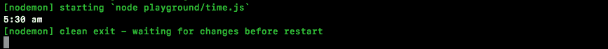

这是意料之中的，因为它考虑到了我们当地的时区。

# 从时间戳中获取格式化值

现在我们已经准备好了，我们已经有了实际获取这些时间戳并返回格式化值所需的一切。我们可以做的另一件事是我们可以用矩创建时间戳，它与我们使用的`new Date().getTime`方法具有完全相同的效果。

为了做到这一点，我们所做的就是我们称之为`moment.valueOf`。例如，我们可以创建一个名为`someTimestamp`的变量，将其设置为等于对`moment`的调用。我们将生成一个新的时刻，我们将调用它的`valueOf`方法。

这将继续并返回自 Unix 纪元以来的时间戳(单位为毫秒)。我们将注销`someTimestamp`变量，以确保它看起来是正确的，这里我们有我们的时间戳值:

```js
var someTimestamp = moment().valueOf(); 
console.log(someTimestamp);
```

# 更新 message.js 文件

我们要做的第一件事是调整我们的`message.js`文件。目前在`message.js`内部，我们使用`new Date().getTime`生成时间戳。我们将切换到矩，不是因为它改变了什么，我只是想在我们使用时间的任何地方都与使用矩保持一致。这将使维护和了解发生了什么变得更加容易。在`message.js`的顶部，我将制作一个名为`moment`的变量，将其设置为等于`require('moment')`:

```js
var moment = require('moment');

var generateMessage = (from, text) => {
  return {
    from,
    text,
    createAt: new Date().getTime()
  };
};
```

我们将继续用对`valueOf`的调用替换`createdAt`属性。我想让你做的是继续这样做，调用`moment`，调用`generateMessage`和`generateLocationMessage`中的`valueOf`方法，然后继续运行测试套件并确保两个测试都通过。

我们需要做的第一件事是调整`generateMessage`的`createdAt`属性。我们将调用`moment`，调用`valueOf`获取时间戳，我们将对`generateLocationMessage`执行相同的操作:

```js
var moment = require('moment');

var generateMessage = (from, text) => {
  return {
    from,
    text,
    createdAt: moment().valueOf()
  };
};

var generateLocationMessage = (from, latitude, longitude) => {
  return {
    from,
    url: `https://www.google.com/maps?q=${latitude},${longitude}`,
    createdAt: moment().valueOf()
  }
};
```

现在我们可以继续拯救`message.js`。进入终端，使用以下命令运行我们的测试套件:

```js
**npm test**
```

我们得到了两个测试，它们都通过了，这意味着我们得到的值确实是一个数字，正如我们的测试所断言的:

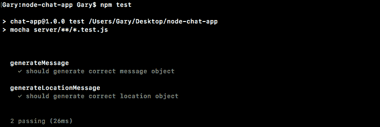

现在我们已经在服务器上集成了 Moment，我们将继续在客户端上做同样的事情。

# 客户端上的集成时刻

我们需要做的第一件事是载入 Moment。目前，我们在前端加载的唯一库是 jQuery。我们可以用几种不同的方法做到这一点；我将继续从  `node_modules`文件夹中抓取一个文件。我们已经安装了 Moment，版本 2.15.1，我们实际上可以抓取前端所需的文件，它位于`node_modules`文件夹内。

我们将进入`node_modules`，我们有一个非常长的按字母顺序排列的文件夹列表，我正在寻找一个名为`moment`的文件夹。我们要去`moment`抓住`moment.js`。我要右击复制它，然后我要向上滚动到最上面，关闭`node_modules`，我要把它粘贴到我们的`js` | `libs`目录里面。我们现在有`moment.js`了，如果你打开它，它是一个非常长的库文件。不需要对那个文件做任何修改，我们要做的就是加载`index.js`。就在我们的 jQuery 导入旁边，我们将添加一个全新的`script`标签，然后我们将提供`src`属性将其设置为等于`/js/js/moment.js`，就像这样:

```js
<script src="/socket.io/socket.io.js"></script>
<script src="/js/libs/jquery-3.1.0.min.js"></script>
<script src="/js/libs/moment.js"></script>
<script src="/js/index.js"></script>
```

现在我们已经准备好了，我们只能在客户端访问所有的矩函数，这意味着在`index.js`内部，我们可以适当地格式化消息内部返回的时间戳。现在，在进行任何更改之前，让我们使用以下命令启动我们的服务器:

```js
**nodemon server/server.js**
```

我们可以继续前进，进入浏览器，转到`localhost:3000`并对其进行刷新，我们的应用正在按预期工作。如果我打开开发人员工具，在控制台选项卡中，我们实际上可以使用矩。我们可以通过 moment 访问它，就像在 Node 中一样。我可以用`moment`，呼叫`format` : `moment().format()`。

我们拿回我们的绳子:

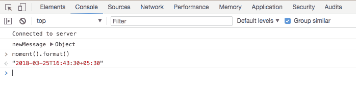

如果您已经成功导入了 Moment，您应该可以拨打此电话。如果你看到了这一点，那么你就准备好进入`index.js`的实际更新了。

# 更新新消息属性

如果你还记得的话，在信息中我们有一个`newMessage`和`newLocationMessage`的`createdAt`属性。我们所需要做的就是获取该值，将其传递给`moment`，然后生成我们的格式化字符串。

我们可以创建一个名为`formattedTime`的新变量，我们可以将其设置为调用`moment`传递时间戳`message.createdAt`:

```js
socket.on('newMessage', function (message) {
  var formattedTime = moment(message.createAt)
```

现在我们可以继续做我们喜欢做的事情。我们可以用我们在`time.js`、小时、分钟和上午/下午使用的完全相同的字符串调用格式传递；`h:`，两个小写`m` s，后面跟着一个空格和一个小写`a`:

```js
var formattedTime = moment(message.createdAt).format('h:mm a'); 
```

有了这个，我们现在有了格式化的时间，我们可以继续并将其添加到  `li.text`中。现在我知道我正在客户端代码中使用模板字符串。我们将很快删除这个，所以现在还没有必要进行调整，因为我没有在互联网浏览器或任何其他浏览器中测试，尽管应用的最终版本将不包括模板字符串。就在`from`声明之后，我们将继续注入另一个值，我们之前刚刚创建的`formattedTime`。所以我们的信息应该读名字像管理员，时间后面跟着文本:

```js
socket.on('newMessage', function (message) {
  var formattedTime = moment(message.createAt).format('h:mm a');
  var li = jQuery('<li></li>');
  li.text('${message.from} ${formattedTime}: ${message.text}');
```

我将继续保存`index.js`，并刷新浏览器以加载客户端代码:

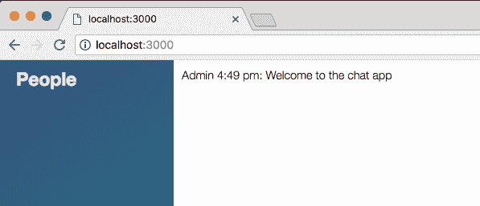

如前面的截图所示，我们看到管理员下午 4:49:欢迎来到聊天应用，这是正确的时间。我可以继续发送消息，`This is from a user`，发送，我们可以看到现在是下午 4:50:


这是从一个用户显示出来的，一切都很好。

# 更新新位置消息属性

现在对于发送位置，我们目前不使用矩；我们只更新了`newMessage`事件监听器。这意味着当我们打印位置信息时，我们没有时间戳。我们将修改`newLocationMessage`，您可以继续使用我们之前使用的相同技术来完成工作。现在，就格式化时间的实际渲染位置而言，您可以简单地将其放在`li.text`中，就像我们之前在`newMessage`属性的情况下所做的那样。

这个过程的第一步是将这个变量称为`formattedTime`。我们实际上可以复制下面的行:

```js
var formattedTime = moment(message.createdAt).format('h:mm a'); 
```

并将其粘贴在  `var li = jQuery('<li></li>');`线的正上方，如下所示:

```js
socket.on('newLocationMessage', function(message) {
  var formattedTime = moment(message.createAt).format('h:mm a');
```

我们想做完全一样的事情，我们想取那个`createdAt`场，得到一个瞬间对象，并调用`format`。

接下来，我们必须修改显示的内容，显示这个`formattedTime`变量，并将其放入&中。`li.text`声明:

```js
socket.on('newLocationMessage', function(message) {
  var formattedTime = moment(message.createAt).format('h:mm a');
  var li = jquery('<li></li>');
  var a = jQuery('<a target="_blank">My current location</a>');

  li.text(`${message.from} ${formattedTime}: `);
```

现在我们可以继续刷新应用，我们应该可以看到常规消息的时间戳。我们可以发送一条常规消息，一切仍然正常:

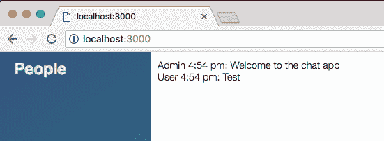

然后我们可以发送一个位置信息，我们只是改变了。它应该只需要一秒钟就可以开始，我们有我们当前的位置链接。我们有自己的名字和时间戳，这太棒了:

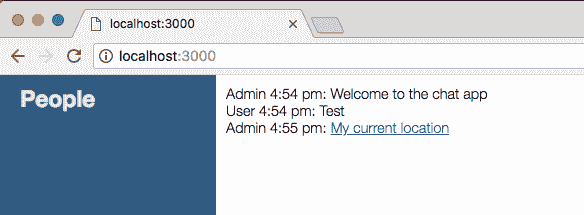

这部分就到这里。让我们继续，并真正做出承诺来保存我们的更改。

即使我们还没有完全完成信息区，我们已经正确地显示了所有的数据。它只是以一种不太赏心悦目的方式出现。不过现在，我们将进入终端并关闭服务器。我要运行`git status`，我们有新文件和一些修改的文件:

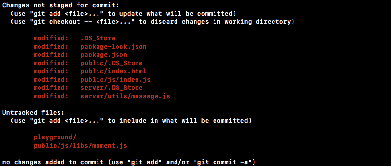

然后，`git add .`T4【nbsp；会处理好这一切。然后我们可以用`-m`旗做出我们的承诺`git commit`，这个承诺的一个好消息是`Format with an timestamps using momentjs`:

```js
git commit -m 'Format timestamp using momentjs'
```

我将继续使用  `git push`命令将它推送到 GitHub，我们就完成了。

在下一节中，我们将讨论一个模板引擎

# 小胡子

现在我们已经将时间戳正确地呈现在屏幕上了。我们将继续讨论名为**小胡子. js** 的模板引擎。这将使定义一些标记并多次呈现它变得更加容易。在我们的例子中，为了正确地呈现，我们的消息将具有相同的元素集。我们将有一个标题标签来标记用户的名字，我们将把文本添加到一个段落中，诸如此类。

现在，我们将在`index.html`中创建一些模板和标记，并呈现它们，这意味着我们不需要手动创建和操作这些元素，而不是像现在这样在`index.js`中进行。这可能是一个巨大的负担。

# 向目录中添加小胡子. js

现在，为了在我们实际创建任何模板或渲染它们之前开始，我们确实需要下载库。我们可以通过谷歌 Chrome 和谷歌`mustache.js`获得这个，我们正在寻找 GitHub 存储库，在这种情况下，它恰好是第一个链接。你也可以去[小胡子. github.io](http://mustache.github.io/) 点击 JavaScript 链接到同一个位置:

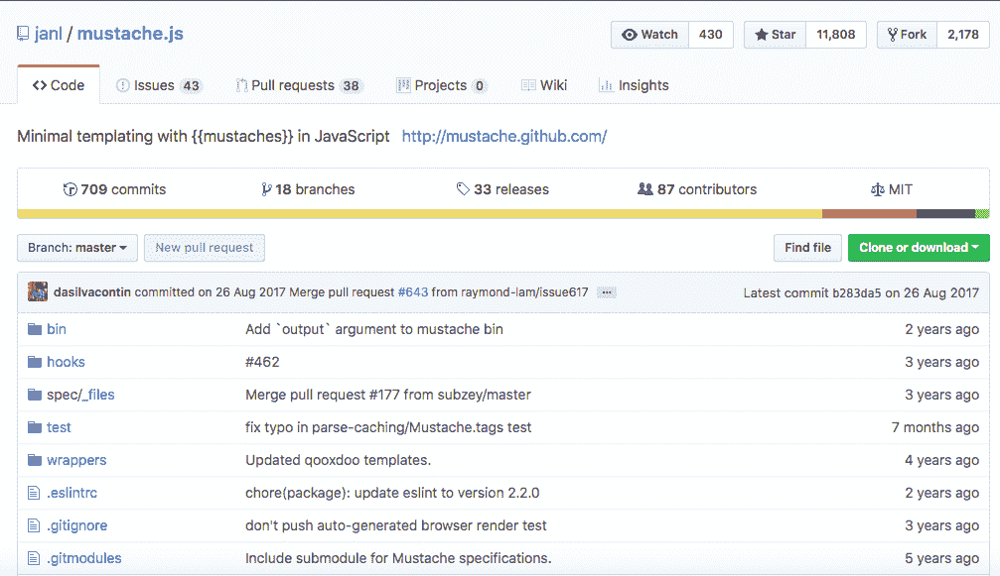

现在一旦你在这里，我们确实想要一个特定版本的图书馆。我们可以进入分支下拉菜单，从分支切换到标签。这将向我们展示所有发布的版本；我将在这里使用的版本是最新的 2.3.0 版本。我将抓住这个，接下来它将刷新存储库，我们正在寻找一个名为`mustache.js`的文件。这是我们需要下载并添加到`index.html`中的库文件:

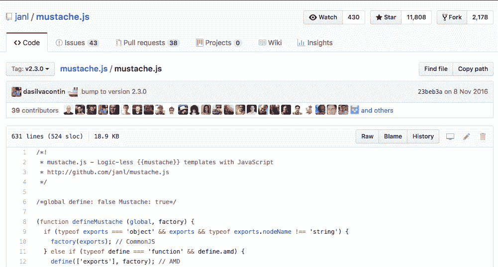

我可以点击  Raw 获取原始的 JavaScript 文件，我可以通过右键点击 另存为将其保存到项目中....我将进入桌面上的项目，`public` | `js` | `libs`目录，就在那里我们将添加文件。

现在一旦你有了文件，我们就可以通过在`index.html`中导入它来开始工作。在底部附近，我们目前有`jquery`和`moment`的`script`标签。这个看起来会很相似。这将是一个`script`标签，然后我们将添加那个`src`属性，这样我们就可以载入新文件`/js/libs`，最后是`/mustache.js`:

```js
<script src="/js/libs/moment.js"></script>
<script src="/js/libs/mustache.js"></script>
```

现在有了这个，我们可以继续创建一个模板并渲染它。

# 为新消息创建和呈现模板

创建一个模板并渲染它，会给你一个关于小胡子到底能做什么的很好的想法，然后我们将继续，实际上用我们的`newMessage`和`newLocationMessage`回调来连接它。为了在`index.html`内部开始，我们将通过在`chat__footer`分区旁边定义一个`script`标签来创建一个新模板。

现在在`script`标签内部，我们将添加我们的标记，但是在添加标记之前，我们必须在`script`上提供一些属性。首先，这将是一个可重用的模板，我们需要一种方法来访问它，所以我们给它一个`id`，我将称这个为`message-template`，而我们要定义的另一个属性是一个叫做`type`的东西。`type`属性让您的编辑器和浏览器知道`script`标签中存储了什么。我们将把类型设置为，在引号内，`text/template`:

```js
<script id = "message-template" type="text/template">

</script>
```

现在，我们可以编写一些标记，它将按预期工作。首先，让我们做一个非常简单的段落标记。我们将在`script`标签内制作一个`p`标签，我们将在里面添加一些文本，`This is a template`，我们将继续并关闭段落标签，就是这样，这就是我们要开始的地方:

```js
<script id="message-template" type="text/template"> 
  <p>This is a template</p> 
</script>
```

我们有一个消息模板`script`标签。我们可以继续，现在在&内渲染。`index.js`通过注释掉`newMessage`监听器里面的所有代码。我将注释掉所有代码，现在我们可以实现小胡子. js 呈现方法了。

# 实现小胡子渲染方法

首先，我们必须抓取模板，创建一个名为`template`的变量来完成这个任务，我们要做的就是使用我们刚刚提供的 ID`#message-template`用`jQuery`选择它。现在我们需要调用`html`方法，该方法将返回`message-template`中的标记，这是模板代码，在这种情况下是我们的段落标记:

```js
socket.on('newMessage', function (message) {
  var template = jquery('#message-template').html();
```

一旦我们有了这个，我们就可以在小胡子上调用一个方法，这个方法对我们来说是可用的，因为我们添加了`script`标签。让我们做一个名为`html`的变量；这是我们最终将添加到浏览器中的东西，我们将把它设置为对`Mustache.render`的调用。

现在`Mustache.render`取你想要渲染的`template`:

```js
socket.on('newMessage', function (message) {
  var template = jquery('#message-template').html();
  var html = Mustache.render(template);
```

我们将继续渲染它，现在我们可以像前面一样，通过将其添加到`messages` ID 中，在浏览器中将其吐出来。我们将选择带有消息标识的元素，调用`append`，并添加我们刚刚渲染的模板，我们可以在 HTML 内部访问该模板:

```js
socket.on('newMessage', function (message) {
  var template = jQuery('#message-template').html();
  var html = Mustache.render(template);

  jQuery('#messages').append(html);
```

现在有了这个，我们的服务器重新启动了，我们可以通过刷新浏览器来玩这个。我将刷新浏览器:

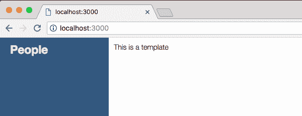

我们得到这是我们欢迎信息的模板，如果我键入任何其他内容，我们也会得到这是一个模板。不是超级有趣，也不是超级有用，但是很酷的是小胡子让你注入值，这意味着我们可以在模板中设置我们期望值被传递的地方。

例如，我们有`text`属性。为了引用一个值，可以使用双花括号语法，如下所示:

```js
<script id="message-template" type="text/template">
  <p>{{text}}</p>
</script>
```

然后你可以继续输入名字，就像`text`一样。现在，为了实际提供这个值，我们必须向 render 方法发送第二个参数。我们将传递模板和一个对象，而不仅仅是传递模板:

```js
socket.on('newMessage', function (message) {
  var template = jquery('#message-template').html();
  var html = Mustache.render(template, {

  });
```

这个对象将具有允许您呈现的所有属性。现在我们正在期待`text`属性，所以我们可能应该继续提供它。我将设置`text`等于`message.text`返回的值:

```js
var html = Mustache.render(template, { 
  text: message.text 
}); 
```

现在我们以动态方式呈现模板。模板作为可重用的结构，但是数据总是会改变，因为当我们调用 render:

有了这个，我们就可以继续刷新 Chrome 了，就在这里，我们看到了欢迎来到聊天应用，如果我继续输入一条消息，它就会显示在屏幕上，这太棒了:

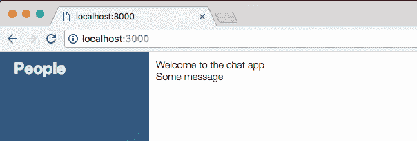

# 显示所有数据

现在这个过程的下一步将是得到所有的数据显示，我们有一个`from`属性和一个`createdAt`属性。我们实际上可以通过`formattedTime`进入`createdAt`房产。

我们将继续取消`formattedTime`行的注释，这是唯一一个我们实际上要延续到新系统的行。我要在`newMessage`回调里面加起来:

```js
socket.on('newMessage', function (message) {
  var formattedTime = moment(message.createAt).format('h:mm a');
  var template = jQuery('#message-template').html();
  var html = Mustache.render(template, {

  });
```

因为我们在渲染的时候还是要用到`formattedTime`。现在，在我们使用模板做任何其他事情之前，让我们先简单地传入这些值。我们已经传入了`text`值。接下来，我们可以传入`from`，通过`message.from`可以访问，我们还可以传入时间戳。你可以随便叫那个属性，我继续叫它`createdAt`，设置它等于`formattedTime`:

```js
var html = Mustache.render(template, { 
  text: message.text, 
  from: message.from, 
  createdAt: formattedTime 
}); 
```

# 提供自定义结构

现在有了这个，所有的数据都被传递进来了。我们只需要继续使用它。在`index.html`中，我们可以使用它的全部，我们还将提供一个定制的结构。就像我们之前设置代码时一样，我们将使用我在这个项目的模板中定义的一些类。

# 添加列表项标签

我们将从使用`li`标签的列表项开始。我们将继续添加一个类，我们将把这个类称为`message`。在这里，我们可以添加两个`div` s .第一个`div`是标题区，我们在这里添加`from`和`createdAt`值，第二个`div`是消息正文:

```js
<script id="message-template" type="text/template">
  <li class="message">
    <div></div>
    <div></div>
  </li>
</script>
```

现在对于第一个`div`我们要提供一个类，这个类将等于`message__title`。这就是消息标题信息要去的地方。我们将在这里通过提供一个`h4`标签来开始，它将在屏幕上呈现一个漂亮的标题，我们将在`h4`中放入`from`数据，我们可以通过使用双花括号`{{from}}`来完成:

```js
<script id="message-template" type="text/template">
  <li class="message">
    <div class="message__title">
      <h4>{{from}}</h4>
    </div>
```

同样的事情也适用于`span`，接下来将会发生。我们将添加一个`span`标签，在`span`标签内部，我们将注入`createdAt`，添加我们的双花括号，并指定属性名:

```js
<script id="message-template" type="text/template">
  <li class="message">
    <div class="message__title">
      <h4>{{from}}</h4>
      <span>{{createAt}}</span>
    </div>
```

# 添加邮件正文标签

现在我们可以继续前进，进入实际的消息体本身。接下来将在我们的第二节`div`中发生，我们将在这一节课中讲述。第二个`div`将有一个等于`message__body`的类，对于一个基本消息，一个非基于位置的消息。我们要做的就是添加一个段落标记，我们将通过提供两个花括号后跟`text`来呈现文本内部:

```js
<script id="message-template" type="text/template"> 
  <li class="message"> 
    <div class="message__title"> 
      <h4>{{from}}</h4> 
      <span>{{createdAt}}</span> 
    </div> 
    <div class="message__body"> 
      <p>{{text}}</p> 
    </div> 
  </li> 
</script> 
```

有了这个，我们实际上有了一个非常棒的系统来呈现我们的消息模板。代码，标记，在`message-template`里面定义，这意味着它是可重用的，在&里面。`index.js`。我们只有一点代码来连接所有的东西。这是一个可伸缩性更强的解决方案，比我们接下来为`newLocationMessage`所做的元素管理要容易得多。我要继续保存`index.js`，进入浏览器，刷新一下。

当我们这样做的时候，我们可以看到我们现在有了一套很好的消息风格。我要把它送走；我们得到了所有打印的名称、时间戳和文本。它看起来比以前好多了:

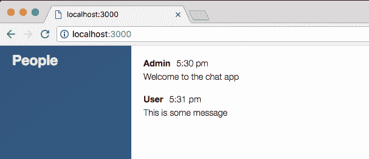

# 为新位置消息创建模板

现在我们的发送位置信息看起来仍然像垃圾。如果我点击 发送位置，需要几秒钟才能完成工作，就在这里！它没有样式，因为它没有使用模板。我们要做的是为`newLocationMessage`添加一个模板。我们将为模板设置标记，然后呈现它并传递必要的值。

在`index.html`中，我们可以通过创建第二个模板来开始做这件事。现在第二个模板将与第一个非常相似。我们可以通过复制和粘贴来复制这个模板。我们需要做的就是将`id`属性从`message-template`改为`location-message-template`:

```js
<script id="location-message-template" type="text/template">
  <li class="message">
    <div class="message__title">
    <h4>{{from}}</h4>
    <span>{{createAt}}</span>
  </div>
  <div class="message__body">
    <p>{{text}}</p>
  </div>
</li>
</script>
```

现在标题区域将是相同的。我们将拥有我们的`from`财产以及`createdAt`；会改变的是身体。

而不是用文本呈现一个段落。我们将使用锚点标签来呈现一个包含链接的段落。现在要添加锚标签，我们要添加`a`标签。然后在`href`属性中，我们将注入值。这将是从服务器传递到客户端的网址。我们将添加等号和花括号，我们想要添加的值是`url`:

```js
<div class="message__body">
  <p>
    <a href="{{url}}"
  </p>
</div>
```

接下来，我们将继承`target`属性，将设置为等于`_blank`，这将在新的选项卡中打开链接。最后，我们可以关闭锚点标签，为里面的链接添加文本。这个链接的一些好的文本应该是`My current location`，就像我们现在有的一样:

```js
<script id="location-message-template" type="text/template"> 
  <li class="message"> 
    <div class="message__title"> 
      <h4>{{from}}</h4> 
      <span>{{createdAt}}</span> 
    </div> 
    <div class="message__body"> 
      <p> 
        <a href="{{url}}" target="_blank">My current location</a> 
      </p> 
    </div> 
  </li> 
</script> 
```

这就是我们需要为模板做的一切。接下来，我们将在`index.js`内部连接所有这些，这意味着在`newLocationMessage`内部，您想要做一些与我们之前在`newMessage`中所做的非常相似的事情。您将呈现模板，传递必要的数据、文本、URL 和格式化的时间戳，而不是用 jQuery 呈现所有内容。

# 呈现新位置模板

我们要做的第一件事是注释掉我们不再需要的代码；除了变量`formattedTime`之外，其他都是:

```js
socket.on('newLocationMessage', function (message) {
  var formattedTime = moment(message.createAt).format('h:mm a');
  // var li = jQuery('<li></li>');
  // var a = jQuery('<a target="_blank">My current location</a>');
  // 
  // li.text(`${message.from} ${formattedTime}: `);
  // a.attr('href', message.url);
  // li.append(a);
  // jQuery('#message').append(li);
});
```

接下来，我们将通过创建一个名为`template`的变量从 HTML 中获取模板，并使用`jQuery`按 ID 选择它。就在引号内，我们将添加选择器。我们想通过 ID 进行选择，所以我们将添加它。&nbsp；`#location-message-template`是我们提供的 ID，现在我们想继续调用`html`来取回它的内部 HTML:

```js
socket.on('newLocationMessage', function (message) {
  var formattedTime = moment(message.createAt).format('h:mm a');
  var template = jQuery('#location-message-template').html();
```

接下来，我们将通过创建一个名为`html`的变量来存储返回值，从而实际呈现模板。我们要叫`mustache.render`。这需要这两个参数，即要呈现的模板和要呈现到该模板中的数据。现在数据是可选的，但是我们确实需要传递一些数据，所以我们也将提供这些数据。`template`是我们的第一个论点，第二个论点将成为一个对象:

```js
socket.on('newLocationMessage', function (message) {
  var formattedTime = moment(message.createAt).format('h:mm a');
  var template = jQuery('#location-message-template').html();
  var html = Mustache.render(template, {

  });
```

我先从设置`from`等于`message.from`开始，我们可以用`url`做同样的事情，设置为等于`message.url`。对于`createdAt`，我们将改为使用`formattedTime`变量，`createdAt`被设置为等于`formattedTime`，这是在`newMessage`模板的情况下定义的:

```js
socket.on('newLocationMessage', function (message) {
  var formattedTime = moment(message.createAt).format('h:mm a');
  var template = jQuery('#location-message-template').html();
  var html = Mustache.render(template, {
    from: message.from,
    url: message.url,
    createdAt: formattedTime
  });
```

现在我们可以访问我们需要呈现的 HTML 了。我们可以使用 jQuery 选择器来选择带有消息标识的元素，我们将调用 append 来添加新消息。我们要添加的新消息可通过`html`变量获得:

```js
socket.on('newLocationMessage', function(message) { 
  var formattedTime = moment(message.createdAt).format('h:mm a'); 
  var template = jQuery('#location-message-template').html(); 
  var html = Mustache.render(template, { 
    from: message.from, 
    url: message.url, 
    createdAt: formattedTime 
  }); 

  jQuery('#messages').append(html);
}); 
```

现在我们的功能完全转换了。我们可以删除旧的注释代码，保存文件，并在 Chrome 中进行测试。我将刷新页面以加载最新的代码，我将发送一条文本消息以确保它仍然有效，现在我们可以继续发送位置消息。我们应该在一秒钟内看到新的数据呈现，它确实如预期的那样工作:


我们有名称、时间戳和链接。我可以继续点击链接，以确保它仍然有效。

有了这些，我们现在有了一个更好的创建这些前端模板的设置。不需要在`index.js`内部做繁重的工作，我们可以在`index.html`内部做模板，简单地传入数据，这是一个可伸缩性更强的解决方案。

现在我们已经完成了，我们可以通过关闭服务器并运行`git status`来提交我们的更改。我们有一个新的文件和几个修改过的文件，`git add .`将为我们处理所有这些，我们可以用`-am`标志做出我们的承诺，`git commit`。实际上，我们已经添加了它，所以我们可以只使用`-m`旗帜，`Add mustache.js for message templates`:

```js
**git commit -m 'Add mustache.js for message templates'**
```

我将把它推送到 GitHub，我们可以使用`git push heroku master`快速部署到 Heroku。我将把这个向上推，只是为了确保所有的模板都在 Heroku 上正确渲染，就像它们在本地一样。部署只需一秒钟。一旦打开，我们可以通过运行`heroku open`或者像以前一样抓取该网址来打开它。这是应用的启动:

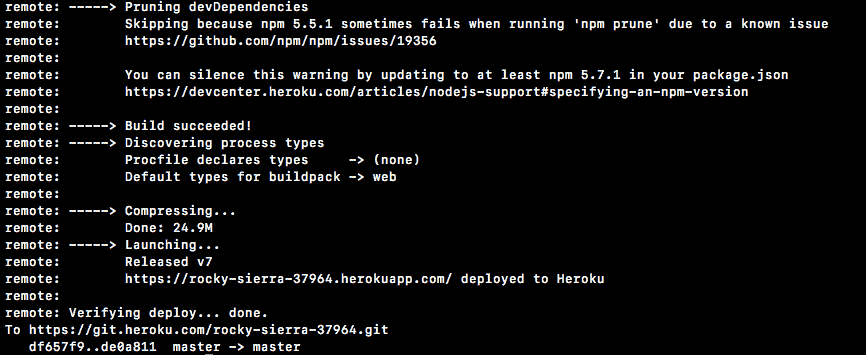

看起来一切都像预期的那样。我将抓取应用网址，进入 Chrome，并打开它:


现在我们正在 Heroku 内部实时查看我们的应用，消息数据如预期的那样显示出来。同样的事情应该适用于发送位置，发送位置消息应该使用新的设置，并且它确实如预期的那样工作。

# 自动滚动

如果我们要建立一个前端，我们不妨把它做好。在本节中，我们将添加自动滚动功能。因此，如果有新消息进来，它在消息面板中是可见的。现在这不是问题。我输入一个`a`，我点击*进入*，它就出现了。然而，随着我们进一步深入列表，您会看到消息开始在栏的底部消失:


现在我确实可以向下滚动查看最近的消息，但是如果我能自动滚动到最近的消息就更好了。所以如果有新消息像`123`一样进来，我会自动被带到底部。

现在，很明显，如果有人向上滚动阅读一条旧信息，我们会希望他们留在那里；我们不会想把它们滚动到底部，这和一开始看不到新消息一样烦人。这意味着我们将继续计算一个阈值。如果有人能看到最后一条消息，当新消息进来时，我们将继续滚动到底部。如果我在这条消息之前，我们将继续前进，让他们一个人呆着，没有理由滚动他们到底部，如果他们正在挖掘档案。

# 运行高度属性计算

为了做到这一点，我们必须进行计算，获取一些属性，主要是各种东西的高度属性。现在，为了讨论这些高度属性，并弄清楚我们将如何进行计算，我整理了一个非常短的部分。让我们开始吧，开始吧。为了准确说明我们将如何运行该计算，让我们看一下以下示例:


我们有这个浅紫色的盒子，它比深紫色的盒子高。这是整个消息容器。它可能会包含比我们在浏览器中实际看到的更多的消息。暗紫色区域是我们实际看到的。当我们向下滚动时，深紫色区域将向下移动到底部，当我们向上滚动时，它将向上移动到顶部。

现在，我们可以访问三个高度属性，这些属性将让我们进行必要的计算，以确定是否应该向下滚动用户。这些是:

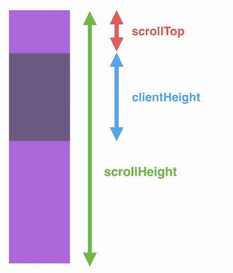

*   首先`scrollHeight`。这是我们的消息容器的整个高度，不管浏览器内部实际可见的高度是多少。这意味着如果我们在我们能看到的东西之前和之后都有信息。它们仍将在`scrollHeight`中说明。
*   接下来，我们有`clientHeight`。这是可见高度容器。
*   最后，我们有`scrollTop`。这是我们向下滚动到紫色容器中的像素数。

现在在目前的情况下我们想做什么？我们什么也不想做，用户真的没有向下滚动那么远。如果每次有新的消息传来，他们都会被压到谷底，这对他们来说将是一个负担。

在下一个场景中，我们再向下滚动一点:

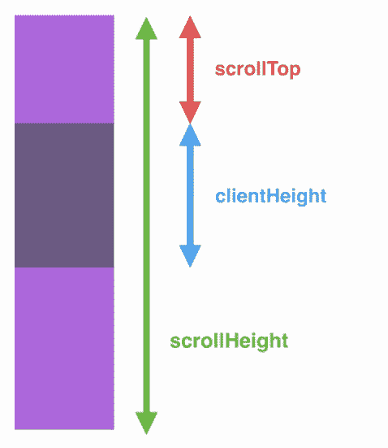

`scrollTop`增加了，`clientHeight`保持不变，`scrollHeight`也是如此。如果我们继续往下走，最终我们会到达最底层。目前，我们应该什么都不做，但是当我们到达底部时，计算看起来有点不同:


这里可以看到`scrollTop`值，这是我们所看到的前面的空格，加上`clientHeight`值和`scrollHeight`相同。这将是我们等式的基础。如果`scrollTop`加上`clientHeight`等于`scrollHeight`，当新消息进来时，我们确实希望向下滚动用户，因为我们知道它们在面板的最底部。那么在这种情况下我们该怎么办呢？当有新消息进来时，我们应该滚动到底部。现在有一个小小的怪癖:


我们已经添加了该消息，因此我们将在计算中考虑新的`messageHeight`，将`scrollTop`、`clientHeight`和`messageHeight`相加，并将该值与`scrollHeight`进行比较。使用这个，我们将再次能够将用户滚动到底部。

让我们继续在 Atom 中连线。现在我们知道如何进行计算了，让我们继续在`index.js`内进行计算。我们将创建一个新的函数，为我们完成所有这些繁重的工作。它将决定我们是否应该根据用户的位置将用户滚动到底部。让我们在顶部的内部做一个功能`index.js`。它不需要任何参数，我们将继续调用这个函数`scrollToBottom`:

```js
var socket = io();

function scrollToBottom () {

}
```

我们将在每次向聊天区添加新消息时调用`scrollToBottom`，这意味着我们需要在`newMessage`和`newLocationMessage`内执行两次。就在&内。`newLocationMessage`回调时，我可以叫`scrollToBottom`不要争论:

```js
socket.on('newMessage', function (message) {
  var formattedTime = moment(message.createAt).format('h:mm a');
  var template = jQuery('#message-template').html();
  var html = Mustache.render(template, {
    text: message.text,
    from: message.from,
    createdAt: formattedTime
  });

  jQuery('#message').append(html);
  scrollToBottom();
}); 
```

接下来我们追加`scrollToBottom`的时候我也会做同样的事情:

```js
socket.on('newLocationMessage', function (message) {
  var formattedTime = moment(message.createAt).format('h:mm a');
  var template = jQuery('#message-template').html();
  var html = Mustache.render(template, {
    from: message.from,
    url: message.url,
    createdAt: formattedTime
  });

  jQuery('#message').append(html);
  scrollToBottom();
}); 
```

现在我们需要做的就是将这个函数连接到:

*   确定我们是否应该将它们滚动到底部，然后
*   如果有必要，将它们滚动到底部。

# 创建一个新变量将消息滚动到底部

首先，我们将选择消息容器，创建一个新的变量来存储它。我们将实际创建相当多的变量来运行我们的计算，所以我将添加两个注释，`Selectors`和`Heights`。这将帮助我们分解一长串变量。

我们可以做一个变量，我们将这个变量称为`messages`，我们将把`messages`设置为一个`jQuery`选择器调用。我们将选择 ID 等于`messages`的所有元素，这只是我们的一个:

```js
function scrollToBottom () {
  // Selectors
  var message = jQuery('#message');
```

现在我们已经有了信息，我们可以专注于获得这些高度。我们要去取`clientHeight`、`scrollHeight`和`scrollTop`。首先，我们可以将一个名为`clientHeight`的变量设置为等于`messages`，然后我们将调用一个`prop`方法，它为我们提供了一种跨浏览器获取属性的方法。这是在没有 jQuery 的情况下进行的 jQuery 替代。这确保了它可以在所有浏览器上工作，不管他们称之为`prop`。我们将继续提供内部报价`clientHeight`来获取`clientHeight`道具:

```js
function scrollToBottom () {
  // Selectors
  var message = jQuery('#message'); 
  // Heights
  var clientHeight = message.prop('clientHeight');
}
```

我们将对另外两个值再做两次完全相同的事情。`scrollTop`将被设置为等于`messages.prop`获取道具`scrollTop`，最后但同样重要的是`scrollHeight`。一个名为`scrollHeight`的新变量将存储该值，我们将它设置为`messages.prop`，传入我们想要获取的道具`scrollHeight`:

```js
function scrollToBottom() { 
  //selectors 
  var messages = jQuery('#messages'); 
  //Heights 
  var clientHeight = messages.prop('clientHeight'); 
  var scrollTop = messages.prop('scrollTop'); 
  var scrollHeight = messages.prop('scrollHeight');
}
```

现在我们已经准备好了，我们可以开始计算了。

# 确定计算

我们想知道`scrollTop`加上`clientHeight`是否大于或等于`scrollHeight`。如果是，那么我们希望继续将用户滚动到底部，因为我们知道他们已经接近底部，`if (clientHeight + scrollTop is >= scrollHeight)`:

```js
var scrollHeight = message.prop('scrollHeight');

if (clientHeight + scrollTop >= scrollHeight) {

}
```

如果是这样的话，我们要做点什么。现在，我们将只使用`console.log`向屏幕打印一条小消息。我们只打印`Should scroll`:

```js
if (clientHeight + scrollTop >= scrollHeight) {
  console.log('Should scroll');
}
```

现在我们的计算还不完全，因为我们正在运行这个函数。在我们添加新消息之后，我们确实需要考虑这一点。正如我们在 Atom 内部看到的，如果我们能看到最后一条消息，我们确实希望将它们滚动到底部；如果我在列表的更高层，我们就不会滚动它们。但是如果我非常接近底部，比前面高几个像素，我们应该将它们滚动到底部，因为这很可能是它们想要的。

# 考虑到新消息的高度

为了做到这一点，我们必须考虑新消息的高度和先前消息的高度。在 Atom 中，我们将通过首先添加一个选择器来完成这项工作。

我们将创建一个名为`newMessage`的变量，它将存储最后一个列表项的选择器，也就是在调用滚动到底部之前刚刚添加的那个。我将使用`jQuery`来完成这个任务，但是我们实际上可以在之前的`messages`的基础上构建一个新的选择器，我们将调用它的`children`方法:

```js
function scrollToBottom () {
  // Selectors
  var message = jQuery('#message'); 
  var newMessage = message.children();
```

这使您可以编写一个特定于消息子级的选择器，这意味着我们拥有所有列表项，因此我们可以在另一个上下文中选择列表项，也许我们想要选择所有子级的段落。然而，在我们的例子中，我们将使用这个`last-child`修改器选择最后一个子列表项:

```js
var newMessage = messages.children('li:last-child');
```

现在我们只有一个项目，列表中的最后一个列表项目，我们可以通过在`scrollHeight`变量旁边制作一个名为`newMessageHeight`的变量来获得它的高度。我们将把它设置为`newMessage`，我们将把它的`innerHeight`方法称为:

```js
var scrollHeight = messages.prop('scrolHeight');
var newMessageHeight = newMessage.innerHeight();
```

这将计算消息的高度，考虑到我们也通过 CSS 应用的填充。

现在我们还需要考虑倒数第二条消息的高度。为此，我们将创建一个变量`lastMessageHeight`，并将其设置为等于`newMessage`，我们将调用`prev`方法。这将我们移动到上一个子项目，所以如果我们在最后一个列表项目，我们现在在倒数第二个列表项目，我们可以通过再次调用`innerHeight`来获得它的高度:

```js
var newMessageHeight = newMessage.innerHeight();
var lastMessageHeight = newMessage.prev().innerHeight();
```

现在我们也可以在我们的`if`语句中解释这两个值。我们要把它们加起来，`newMessageHeight`，我们还要加上`lastMessageHeight`，在计算的时候要考虑到这一点:

```js
function scrollToBottom() { 
  //selectors 
  var messages = jQuery('#messages'); 
  //Heights 
  var clientHeight = messages.prop('clientHeight'); 
  var scrollTop = messages.prop('scrollTop'); 
  var scrollHeight = messages.prop('scrollHeight'); 
  var newMessageHeight = newMessage.innerHeight(); 
  var lastMessageHeight = newMessage.prev().innerHeight(); 

  if(clientHeight + scrollTop + newMessageHeight + lastMessageHeight >= scrollHeight) { 
    console.log('Should scroll'); 
  }
}
```

现在我们的计算已经完成，我们可以实际测试事情是否如预期的那样运行。当我们应该滚动时，我们应该看到`Should scroll`。

# 测试计算

在浏览器内部，我将继续进行刷新，我还将打开开发人员工具，以便我们可以查看我们的`console.log`语句。你会注意到在较小的屏幕上，样式去掉了边栏。现在我要打*几次进入*。显然，我们不应该能够发送空消息，但目前我们可以，您可以看到`Should scroll`正在打印:


它实际上不会滚动，因为我们的消息容器的高度实际上并没有超过给它的浏览器空间的高度，但是它确实通过了条件。现在，当我们进一步往下看时，消息开始从屏幕底部消失，您会注意到消息前面的计数停止上升。每次应该滚动打印时，计数都会增加，但现在它停留在 2  处，即使我正在进一步添加新消息。

在这种情况下，我们可以向下滚动到底部，并添加一条新消息，`abc`。这会导致浏览器滚动，我们已经接近底部了。当我这样做时，应该滚动增量到 3，这太棒了。

如果我向上滚动到列表顶部，输入`123`并点击*进入*，应该滚动不会增加到 4，这是正确的。如果用户在最上面，我们不想将他们滚动到最下面。

# 必要时滚动用户

现在唯一要做的就是在必要时滚动用户。这将发生在我们的`if`语句中，我们可以删除我们的`console.log('Should scroll')`调用，并用对`messages.scrollTop`的调用来替换它，这是用于设置`scrollTop`值的 jQuery 方法，我们将它设置为`scrollHeight`，这是容器的总高度。这意味着我们将移动到消息区域的底部:

```js
if(clientHeight + scrollTop + newMessageHeight + lastMessageHeight >= scrollHeight) {
  messages.scrollTop(scrollHeight);
}
```

在谷歌浏览器中，我们现在可以刷新页面来获取最新的`index.js`文件，我将按住*回车*键一会儿。如您所见，我们正在自动向下滚动列表。如果我添加新消息，它会正确显示。

如果我靠近顶部，有新的消息进来，比如`123`，我不会向下滚动列表，这是正确的。现在，如果我不在底部，但已经非常接近了，并且有新的消息进来，我会滚动到底部。但是如果我稍微超过了最后一条消息，我们就不会滚动到底部，这正是我们想要的。这一切都是因为我们的计算。

# 提交与计算相关的更改

让我们在终端内部用一个提交来结束这个过程。如果我们运行`git status`，你会看到我们只有一个改变的文件。我可以用`git commit -am`来做承诺，`Scroll to bottom if user is close to bottom`:

```js
**git commit -am 'Scroll to bottom if user is close to bottom'**
```

我将继续使用`git push`命令将它推送到 GitHub，这被认为是这个项目的第一部分。

# 摘要

在这一章中，我们研究了用 HTML 格式设计基本聊天应用。我们还讨论了时间戳和使用矩方法格式化页面。之后，我们学习了小胡子. js 的概念，为消息创建和呈现模板。最后，我们学习了使用消息高度属性自动滚动和运行计算。这样，我们就有了一个基本的聊天应用。

在下一章，目标将是添加聊天室和名字，所以我转到一个注册页面。我进入房间，我想加入，我想使用的名字。然后我被带到一个聊天页面，但只针对那个特定的房间。因此，如果有两个房间，1 号房间的用户将无法与 2 号房间的用户通话，反之亦然。