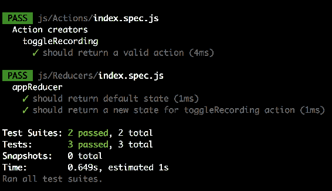
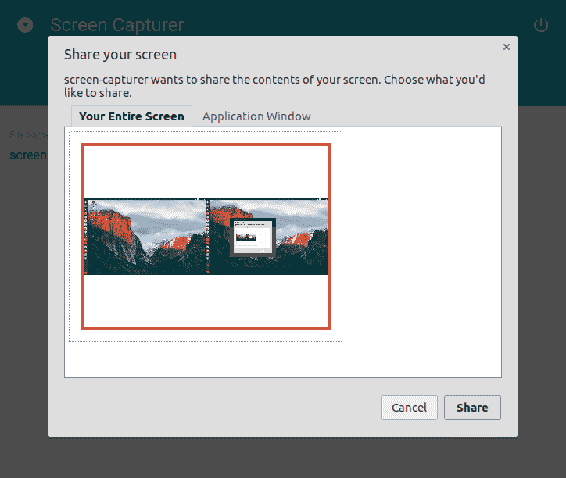
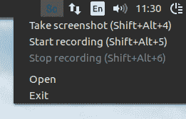

# 六、使用 NW.js 创建屏幕捕捉器——改进、工具和测试

在[第 5 章](5.html)，*使用 NW.js, React，和 Redux â€" Planning, Design, and Development，*中，我们应用了 Redux store 来管理应用状态。 现在，我们将了解如何使用中间件来处理 Redux，以及如何对 Redux 进行单元测试。

本章的主要目标是最终教会我们的屏幕捕捉器抓取屏幕截图并记录视频。 为此，您将学习如何使用 WebRTC api 来捕获和记录媒体流。 我们将研究如何使用 canvas 从流中生成静态帧图像。 我们将在实践中使用 Notification API 来通知用户执行的操作，而不管焦点是哪个窗口。 我们将在系统托盘中添加一个菜单，并将其与应用程序状态绑定。 我们将通过全局键盘快捷键使捕获动作可用。

# 工具回来的

在[第五章](5.html)*,**创建一个**与 NW.js 屏幕捕获者,React 和回来的规划、设计和开发,*你所学到的必需品回来的状态容器。 我们使用 Redux 构建了一个功能原型。 然而，在构建自己的应用程序时，您可能需要确切地知道状态树什么时候发生了什么事情。

幸运的是，Redux 接受中间件模块来处理横切问题。 这个概念与 Express 框架的概念非常相似。 当一个动作被分派但还没有到达还原器时，我们可以通过在事件上挂起第三方模块来扩展 Redux。 编写自定义日志程序没有多大意义，因为已经有很多可用的日志程序([http://bit.ly/2qINXML](http://bit.ly/2qINXML))。 例如，为了跟踪状态树中的更改，我们可以使用只报告状态差异的`redux-diff-logger`模块，这使得它更容易阅读。 因此，我们将安装包(`npm i -S redux-diff-logger`)，并在入口脚本中添加几行:

`./js/app.jsx`

```js
import { createStore, applyMiddleware, compose } from "redux"; 
import logger from 'redux-diff-logger'; 
const storeEnhancer = compose( 
        applyMiddleware( logger ) 
      ); 

const store = createStore( appReducer, storeEnhancer ); 

```

这里，我们从`redux-diff-logger`中导出`logger`，并将其传递到`redux`模块的`applyMiddleware`函数中，以创建一个存储增强器。 存储增强器将给定的中间件应用于存储的`dispatch`方法。 结合`redux`的`compose`功能，可以结合多种增强子。 我们将导数作为第二个参数传递给`createStore`函数。

现在，我们可以构建项目并启动它。 我们玩了一会 UI，然后在 DevTools 中查看。 JavaScript 控制台面板将输出我们造成的状态差异:


通过 redux-diff-logger 中间件，当我们执行任何导致状态变化的操作时，我们会在 DevTools 的 JavaScript 控制台中收到报告。 例如，我们修改了屏幕截图文件名模板，并立即反映在控制台中。 事实上，我们为状态树接收了一个全新的对象，但是 redux-diff-logger 足够智能，它只显示我们真正感兴趣的东西——状态的差异。

# Redux DevTools

日志报告已经很有用了，但是如果我们能得到一个像`DevTools`这样的工具来与状态交互，它会更有用。 第三方包`redux-devtools`引入可扩展环境，支持状态实时编辑和时间旅行。 我们将结合另外两个模块`redux-devtools-log-monitor`和`redux-devtools-dock-monitor`来研究它。 第一个允许我们检查状态和时间旅行。 第二个是一个包装器，当我们按下相应的热键时，它将 Redux DevTools UI 连接到窗口边缘。 为了看到它的实际效果，我们创建了一个描述 DevTools 的自定义组件:

`./js/Components/DevTools.jsx`

```js
import React from "react"; 
import { createDevTools } from "redux-devtools"; 
import LogMonitor from "redux-devtools-log-monitor"; 
import DockMonitor from "redux-devtools-dock-monitor"; 

const DevTools = createDevTools( 
  <DockMonitor toggleVisibilityKey="ctrl-h" 
               changePositionKey="ctrl-q" 
               defaultPosition="bottom" 
               defaultIsVisible={true}> 
    <LogMonitor theme="tomorrow" /> 
  </DockMonitor> 
); 

export default DevTools; 

```

我们使用`createDevTools`函数来创建组件。 在 JSX 中，我们通过`DockMonitor`道具和`LogMonitor`颜色主题来配置 React DevTools UI 的可见性和位置。

派生组件公开方法工具，该工具作为商店增强器返回。 因此，我们可以将它传递给 compose 函数:

`./js/app.jsx`

```js
import DevTools from "./Components/DevTools.jsx"; 

const storeEnhancer = compose( 
        applyMiddleware( logger ), 
        DevTools.instrument() 
      ); 

const store = createStore( appReducer, storeEnhancer ); 

```

在`DevTools`组件本身中，我们必须将其添加到 DOM 中:

```js
render(<Provider store={store}> 
  <div> 
    <App /> 
    <DevTools /> 
  </div> 
 </Provider>, document.querySelector( "root" ) ); 

```

现在，当我们运行应用程序时，我们可以看到停靠。 按*Ctrl*+*Q*可以改变其位置，按*Ctrl*+*H*可以隐藏或显示:


# 单元测试回来的

我们已经在[第 4 章](4.html)*Electron 和 React 聊天系统:增强、测试和交付(编写单元测试部分)*中对 Jest 测试框架进行了修改。 Redux 引入了新的概念，比如动作和减速器。 现在，我们将对它们进行单元测试。

你可能记得，要运行 Jest，我们需要配置巴别塔:

`.babelrc`

```js
{ 
  "presets": [ 
     ["env", { 
      "targets": { "node": 7 }, 
      "useBuiltIns": true 
    }], 
    "react", 
    "stage-3" 
  ], 

  "plugins": [ 
    "transform-class-properties", 
    "transform-decorators-legacy" 
  ] 
} 

```

同样，预置了`env`，我们在 Node.js 7 上锁定了 Babel，并启用了我们在 webpack 配置中使用的额外插件。

# 测试行动的创造者

实际上，对于动作创建者来说，这非常简单，因为它们是纯函数。 我们根据函数接口传入一个输入，并验证输出:

`./js/Actions/index.spec.js`

```js
import { createStore } from "redux"; 
import { toggleRecording } from "./index"; 

describe( "Action creators", () => { 
  describe( "toggleRecording", () => { 
    it( "should return a valid action", () => { 
      const FLAG = true, 
            action = toggleRecording( FLAG ); 
            expect( action.payload ).toEqual( { toggle: FLAG } ); 
    }); 
  }); 
}); 

```

我们已经为`toggleRecording`函数编写了一个测试。 我们断言这样一个事实:该函数产生了一个有效负载中带有`{ toggle: FLAG }`的操作对象。 如前一章所述，任何行为都应该具有强制性的属性`type`。 当我们在调用`redux-act`模块的`createAction`函数时忽略描述时，派生的操作创建器将生成一个带有动态生成的标识符的操作，这是很难测试的。 但是，我们给它一个字符串作为第一个参数，例如`TOGGLE_RECORDING`:

```js
  const toggleRecording = createAction( "TOGGLE_RECORDING", ( toggle ) => ({ toggle }) ); 

this becomes the unique identifier and therefore we can expect it in type property. 

expect( action.type ).toEqual( "TOGGLE_RECORDING" ); 

```


这和我们在当前应用中测试每个动作创建器的方法差不多。

# 测试还原剂

还原器和动作创造者一样，都是纯粹的功能。 它们接受参数中的最后一个状态树对象和已分派操作，并生成一个新的状态树对象。 因此，在测试减速器时，我们要检查给定的动作是否按预期修改了状态:

`./js/Reducers/index.spec.js`

```js
import { createStore } from "redux"; 
import { createReducer } from "redux-act"; 
import { TAB_SCREENSHOT, SCREENSHOT_DEFAULT_FILENAME, ANIMATION_DEFAULT_FILENAME } from "../Constants"; 
import { appReducer } from "./index"; 

describe( "appReducer", () => { 
  it( "should return default state", () => { 
    const DEFAULT_STATE = { 
      isRecording: false, 
      activeTab: TAB_SCREENSHOT, 
      screenshotFilename: SCREENSHOT_DEFAULT_FILENAME, 
      animationFilename: ANIMATION_DEFAULT_FILENAME, 
      screenshotInputError: "", 
      animationInputError: "" 
    }; 
    expect( appReducer() ).toEqual( DEFAULT_STATE ); 
  }); 

 }); 

```

Redux 第一次以`undefined`状态调用我们的 reducer。 我们期望 reducer 将一个预定义的对象作为默认状态。 因此，如果我们调用不带参数的函数，它应该在入口点接收默认状态，并在没有给出任何操作的情况下返回默认状态。

另一方面，我们可以导入一个动作创造者:

```js
import { toggleRecording } from "../Actions"; 

```

创建一个动作并将其传递给减速器:

```js
it( "should return a new state for toggleRecording action", () => { 
    const FLAG = true, 
          action = toggleRecording( FLAG ), 
          newState = appReducer( undefined, action ); 
    expect( newState.isRecording ).toEqual( FLAG ); 
  }); 

```

因此，我们测试减速机产生一种新的状态，根据给定的动作而改变。 通过调用`toggleRecording( true )`创建一个动作，目的是将状态对象属性`isRecording`设置为 true。 这就是我们在测试中断言的:



# 采取截图

以前创建的静态原型可能看起来很花哨，但没有多大用处。 我们需要一种能够截屏和录制屏幕视频的服务。

如果是关于应用程序窗口的截图，我们可以简单地使用 NW.js 上的 API:

```js
import * as fs from "fs"; 
function takeScreenshot( filePath ){ 
  appWindow.capturePage(( img ) => { 
    fs.writeFileSync( filePath, img, "base64" ); 
  }, { 
    format : "png", 
    datatype : "raw" 
  }); 
} 

```

但我们需要屏幕截图，因此，我们必须获得显示输入。 W3C 包括一个规范草案，“媒体捕获和流”([http://bit.ly/2qTtLXX](http://bit.ly/2qTtLXX))，它描述了捕获显示媒体的 API(`mediaDevices.getDisplayMedia`)。 不幸的是，在我写这篇文章的时候，它还不被 NW.js 支持，或者，老实说，不被任何浏览器支持。 但是，我们仍然可以使用`webkitGetUserMedia`，它可以传输桌面输入。 这个 API 曾经是 WebRTC([https://webrtc.org](https://webrtc.org))技术的一部分，专为实时视频、音频和数据通信而设计。

然而，目前它已从规范中删除，但在 NW.js 和 Electron 中仍然可用。 看起来我们别无选择，所以我们就这么做了。

`webkitGetUserMedia`接收所谓的`MediaStreamConstraints`对象，该对象描述我们想要捕获的内容，并返回一个承诺。 在我们的例子中，约束对象可能如下所示:

```js
{ 
    audio: false, 
    video: { 
     mandatory: { 
      chromeMediaSource: "desktop", 
      chromeMediaSourceId: desktopStreamId, 
      minWidth: 1280, 
      maxWidth: 1920, 
      minHeight: 720, 
      maxHeight: 1080 
     } 
   } 
} 

```

我们禁用音频录制，为视频设置边界(`webkitGetUserMedia`根据您的显示分辨率确定合适的大小。 当分辨率不符合其引起的范围`OverconstrainedError`)，并描述介质源。 但我们需要一个有效的媒体流 ID。 例如，我们可以从 NW.js API 中获得:

```js
nw.Screen.chooseDesktopMedia([ "window", "screen" ], ( mediaStremId ) => { 
      // mediaStremId 
    }); 

```

当把所有的组合在一起时，我们得到以下服务:

`./js/Service/Capturer.js` 

```js
import * as fs from "fs"; 
const appWindow = nw.Window.get(); 

export default class Capturer { 

  constructor(){  
    nw.Screen.chooseDesktopMedia([ "window", "screen" ], ( id) => { 
      this.start( id ); 
    }); 
  } 

  takeScreenshot( filename ){ 
    console.log( "Saving screensho" ); 
  } 

  start( desktopStreamId ){ 
    navigator.webkitGetUserMedia({ 
        audio: false, 
        video: { 
          mandatory: { 
            chromeMediaSource: "desktop", 
            chromeMediaSourceId: desktopStreamId, 
            minWidth: 1280, 
            maxWidth: 1920, 
            minHeight: 720, 
            maxHeight: 1080 
          } 
        } 
      }, ( stream ) => { 
        // stream to HTMLVideoElement 

      }, ( error ) => { 
        console.log( "navigator.getUserMedia error: ", error ); 
      }); 

  } 
} 

```

当运行它时，我们会看到一个提示我们选择媒体来源的对话框:



我真的不喜欢这个 UX。 我宁愿让它检测桌面媒体。 我们通过以下方法来实现:

```js
static detectDesktopStreamId( done ){ 
    const dcm = nw.Screen.DesktopCaptureMonitor; 
    nw.Screen.Init(); 
    // New screen target detected 
    dcm.on("added", ( id, name, order, type ) => { 
      // We are interested only in screens 
      if ( type !== "screen" ){ 
        return; 
      } 
      done( dcm.registerStream( id ) ); 
      dcm.stop(); 
    }); 
    dcm.start( true, true ); 
  } 

```

我们使用 NW.js API 的`DesktopCaptureMonitor`检测可用的媒体设备，拒绝应用窗口(类型为`"screen"`)，使用`registerStream`方法获取媒体流 ID。 现在，我们用自定义方法`detectDesktopStreamId`替换 NW.js API 的`chooseDesktopMedia`:

```js
  constructor(){ 
    Capturer.detectDesktopStreamId(( id ) => { 
      this.start( id ); 
    }); 
  } 

```

好吧，我们设法接收流。 我们得把它引到某个地方。 我们可以创建一个隐藏的`HTMLVideoElement`并将其用作视频流接收器。 我们将这个功能封装在一个单独的模块中:

`./js/Service/Capturer/Dom.js`

```js
export default class Dom { 

  constructor(){ 
    this.canvas = document.createElement("canvas") 
    this.video = Dom.createVideo(); 
  } 

   static createVideo(){ 
    const div = document.createElement( "div" ), 
          video = document.createElement( "video" ); 
    div.className = "preview"; 
    video.autoplay = true; 
    div.appendChild( video ); 
    document.body.appendChild( div ); 
    return video; 
  } 

 } 

```

在构造过程中，类在其中创建一个新的 DIV 容器和视频元素。 容器被附加到 DOM 上。 我们还需要用 CSS 来支持新元素:

img/main.css`

```js
.preview { 
  position: absolute; 
  left: -999px; 
  top: -999px; 
  width: 1px; 
  height: 1px; 
  overflow: hidden; 
}  

```

基本上，我们把容器移到视线之外。 因此，视频将被流进一个隐藏的`HTMLVideoElement`。 现在的任务是捕捉静止帧并将其转换为图像。 我们可以用下面的方法:

```js
  getVideoFrameAsBase64() { 
    const context = this.canvas.getContext("2d"), 
          width = this.video.offsetWidth, 
          height = this.video.offsetHeight; 

    this.canvas.width = width; 
    this.canvas.height = height; 

    context.drawImage( this.video, 0, 0, width, height ); 

    return this.canvas.toDataURL("img/png") 
      .replace( /^data:image\/png;base64,/, "" ); 

  } 

```

我们创建一个画布上下文匹配视频大小。 利用上下文方法`drawImage`，从视频流中绘制图像。 最后，我们将 canvas 转换为 Data URI，并通过分割`data:scheme`前缀获得 base64 编码的图像。

我们将把我们的`Dom`模块实例作为依赖注入到`Capturer`服务中。 为此，我们需要修改构造函数:

`./js/Service/Capturer.js`

```js
constructor( dom ){     
     this.dom = dom; 
    Capturer.detectDesktopStreamId(( id ) => { 
      this.start( id ); 
    }); 
  } 

```

我们还必须将媒体流转发到`HTMLVideoElement`:

```js
start( desktopStreamId ){ 
    navigator.webkitGetUserMedia( /* constaints */, ( stream ) => { 
        this.dom.video.srcObject = stream; 
      }, ( error ) => { 
        console.log( "navigator.getUserMedia error: ", error ); 
      }); 
} 

```

我们还添加了一个保存截图的方法:

```js
takeScreenshot( filename ){ 
    const base64Data = this.dom.getVideoFrameAsBase64(); 
    fs.writeFileSync( filename, base64Data, "base64" ); 
  } 

```

现在，当在组件中调用此方法时，图像将以静默方式保存。 说实话，这不是很友好。 用户按下按钮并没有收到关于图像是否真的被保存的信息。 我们可以通过显示桌面通知来改善用户体验:

```js
const ICON = img/icon-48x48.png`; 
//...  
takeScreenshot( filename ){ 
    const base64Data = this.dom.getVideoFrameAsBase64(); 
    fs.writeFileSync( filename, base64Data, "base64" ); 
    new Notification( "Screenshot saved",  { 
      body: `The screenshot was saved as ${filename}`, 
      icon: img/icon-48x48.png` 
    }); 

  } 

```

现在，当保存新创建的屏幕截图时，相应的消息将显示在系统级别。 因此，即使应用程序窗口是隐藏的(例如，我们使用系统托盘或快捷方式)，用户仍然会收到一个通知:


# 录制一个视频

事实上，在构建截屏服务时，我们已经完成了截屏录制的大部分工作。 我们已经有了由`webkitGetUserMedia`交付的`MediaStream`对象。 我们只需要一种方法来定义录制的开始和结束，并将收集的帧保存在视频文件中。 这就是我们可以从`MediaStream`Recording API 中受益的地方，该 API 捕获由`MedaStream`或`HTMLMediaElement`(例如，`<video>`)生成的数据，以便我们保存它。 因此，我们再次修改服务:

`./js/Service/Capturer.js`

```js
//... 
const toBuffer = require( "blob-to-buffer" ); 
//... 
start( desktopStreamId ){ 
    navigator.webkitGetUserMedia(/* constaints */, ( stream ) => { 
        let chunks = []; 
        this.dom.video.srcObject = stream; 
        this.mediaRecorder = new MediaRecorder( stream ); 
        this.mediaRecorder.onstop = ( e ) => { 
          const blob = new Blob( chunks, { type: "video/webm" }); 
          toBuffer( blob, ( err, buffer ) => { 
            if ( err ) { 
              throw err; 
            } 
            this.saveAnimationBuffer( buffer ); 
            chunks = []; 
          }); 
        } 
        this.mediaRecorder.ondataavailable = function( e ) { 
          chunks.push( e.data ); 
        } 

      }, ( error ) => { 
        console.log( "navigator.getUserMedia error: ", error ); 
      }); 

  } 

```

在接收到`MediaStream`后，我们使用它来创建`MediaRecorder`的实例。 我们订阅实例上的`dataavailable`事件。 处理程序接受一个 Blob(表示流帧的文件类对象)。 为了制作视频，我们需要一系列的帧。 因此，我们将每个接收到的 Blob 推入 chunk 数组。 我们还为停止事件订阅了一个处理程序，该处理程序将从收集的块创建一个类型为`webm`的新 Blob。 因此，我们有一个 Blob 表示屏幕播放，但我们不能将它保存在文件中。

对于二进制数据流，Node.js 将期望我们提供 Buffer 类的实例。 我们使用`blob-to-buffer`包将 Blob 转换为 Buffer。

在这段代码中，我们依赖于两个事件`dataavailable`和`stop`。 当我们启动录音机时，第一个被解雇，当我们停止录音机时，第二个被解雇。 我们公开这些行动:

```js
record( filename ){ 
    this.mediaRecorder.start(); 
    this.saveAnimationBuffer = ( buffer ) => { 
      fs.writeFileSync( filename, buffer, "base64" ); 
      new Notification( "Animation saved",  { 
        body: `The animation was saved as ${filename}`, 
        icon: ICON 
      }); 
    } 
  } 

  stop(){ 
    this.mediaRecorder.stop(); 
  } 

```

当调用方法`record`时，`MediaRecorder`的实例开始记录，相反地，通过`stop`方法，它停止进程。 此外，我们定义了将在录制停止时调用的`saveAnimationBuffer`回调(`this.mediaRecorder.onstop`)。 回调(`saveAnimationBuffer`)使用`buffer`参数接收录制的截屏视频的二进制流，并使用`fs`核心模块的`writeFileSync`方法将其保存。 与屏幕截图类似，在保存屏幕录制时，我们创建一个桌面通知来通知用户所执行的操作。

服务差不多准备好了。 但是您可以从我们的线框图中记得，Screen capture 接受文件名模板，例如`screenshot{N}.png`或`animation{N}.webm`，其中`{N}`是文件索引的占位符。 因此，我想将文件系统操作封装在专用类`Fsys`中，在这个类中，我们可以根据需要处理模板:

`./js/Service/Capturer/Fsys.js`

```js
import * as fs from "fs"; 

export default class Fsys { 

  static getStoredFiles( ext ){ 
    return fs.readdirSync( "." ) 
      .filter( (file) => fs.statSync( file ).isFile() 
          && file.endsWith( ext ) ) || [ ]; 
  } 

  saveFile( filenameRaw, data, ext ){ 
    const files = Fsys.getStoredFiles( ext ), 
          // Generate filename of the pattern like screenshot5.png 
          filename = filenameRaw.replace( "{N}", files.length + 1 ); 
    fs.writeFileSync( filename, data, "base64" ); 
    return filename; 
  } 
} 

```

这个类有静态方法`getStoredFiles`，它从工作目录返回给定类型(扩展名)的所有文件的数组。 在用`saveFile`方法保存一个文件之前，我们获取先前存储的文件的列表，并将`{N}`的值计算为`files.length + 1`。 因此，第一个屏幕截图将保存在名称`screenshot1.png`下，第二个屏幕截图将保存在名称`screenshot2.png`下，依此类推。

我们注入到`Capturer`服务中的`Fsys`实例:

```js

export default class Capturer { 

  constructor( fsys, dom ){ 
    this.fsys = fsys; 
    this.dom = dom; 
    Capturer.detectDesktopStreamId(( id ) => { 
      this.start( id ); 
    }); 
  } 

```

我们将在入口脚本中实例化服务:

`./func-services/js/app.jsx`

```js
import Fsys from "./Service/Capturer/Fsys"; 
import Dom from "./Service/Capturer/Dom"; 
import Capturer from "./Service/Capturer"; 

const capturer = new Capturer( new Fsys(), new Dom() ); 

render(<Provider store={store}> 
  <App capturer={capturer} /> 
 </Provider>, document.querySelector( "root" ) ); 

```

我们导入`Capturer`类及其依赖项。 在构造`Capturer`时，我们将其传递给`Fsys`和`Dom`实例。 我们将`Capturer`的派生实例与道具一起传递给`App`组件。

因此，服务的实例到达`ScreenshotTab`组件，我们可以使用它来截屏:

`./js/Components/ScreenshotTab.jsx`

```js
// Handle when clicked CAPTURE 
 onCapture = () => { 
    const { states } = this.props; 
    this.props.capturer.takeScreenshot( states.screenshotFilename ); 
  } 

```

类似地，在`AnimationTab`中，我们从相应的处理程序中应用实例的方法 record 和 stop:

`./js/Components/AnimationTab.jsx`

```js
// Handle when clicked RECORD 
onRecord = () => { 
    const { states } = this.props; 
    this.props.capturer.record( states.animationFilename ); 
    this.props.actions.toggleRecording( true ); 
  } 
 // Handle when clicked STOP 
  onStop = () => { 
    this.props.capturer.stop(); 
    this.props.actions.toggleRecording( false ); 
  } 

```

现在，在构建了应用程序之后，我们可以使用它来截屏并录制屏幕视频:


从我们的图像中，我们可以观察到用于截屏和录制屏幕录制的按钮是窗口 UI 的一部分。 然而，我们还需要提供隐藏窗口的功能。 那么，当应用程序被隐藏时，我们如何实现捕获操作呢? 答案是与系统托盘有关。

# 利用系统托盘

在*[第二章](1.html)，用 NW.js 创建文件资源管理器-增强和交付*中，我们已经研究了在系统托盘中添加和管理应用程序菜单。 简单地说，我们使用`nw.MenuItem`创建菜单项，将它们添加到`nw.Menu`实例，并将菜单附加到`nw.Tray`。 因此，托盘菜单的模板可能如下所示:

`./js/Service/Tray.js`

```js
const appWindow = nw.Window.get(); 

export default class Tray { 

  tray = null; 

  constructor( ) { 
    this.title = nw.App.manifest.description; 
    this.removeOnExit(); 
  } 

  getItems = () => { 
    return [ /* */ ]; 
  } 

  render(){ 
    if ( this.tray ) { 
      this.tray.remove(); 
    } 

    const icon = img/" + 
      ( process.platform === "linux" ? "icon-48x48.png" : "icon-
      32x32.png" ); 

    this.tray = new nw.Tray({ 
      title: this.title, 
      icon, 
      iconsAreTemplates: false 
    }); 

    const menu = new nw.Menu(); 
    this.getItems().forEach(( item ) => menu.append( new nw.MenuItem( 
    item ))); 

    this.tray.menu = menu; 

  } 

  removeOnExit(){ 
    appWindow.on( "close", () => { 
      this.tray.remove(); 
      appWindow.hide(); // Pretend to be closed already 
      appWindow.close( true ); 
    }); 
    // do not spawn Tray instances on page reload 
    window.addEventListener( "beforeunload", () => this.tray.remove(), 
    false ); 
  } 

} 

```

对于这个应用程序，我们需要以下菜单项:

```js
Take screenshot 
Start recording 
Stop recording 
--- 
Open 
Exit 

```

这里，`Start recording`和`Stop recording`根据状态`isRecording`属性启用。 此外，我们还需要`Capturer`实例和`screenshotFilename`和`animationFilename`状态属性来运行对用户请求的捕获操作。 因此，我们在`Tray`构造函数中注入了这两个依赖:

`./js/Service/Tray.js`

```js
import { toggleRecording } from "../Actions"; 
import { SCREENSHOT_DEFAULT_FILENAME, ANIMATION_DEFAULT_FILENAME } from "../Constants"; 

export default class Tray { 
 // default file names 
  screenshotFilename = SCREENSHOT_DEFAULT_FILENAME; 
  animationFilename = ANIMATION_DEFAULT_FILENAME; 
  isRecording = false;  

  constructor( capturer, store ) { 
    this.capturer = capturer; 
    this.store = store; 
} 

```

此外，我们还定义了一些实例属性。 `screenshotFilename`和`animationFilename`将从该状态接收最新的用户定义文件名模板。 当属性`isRecording`发生变化时，它将接收相应的状态值。 为了接收状态更新，我们订阅存储更改:

```js
constructor( capturer, store ) { 
    //... 
    store.subscribe(() => { 
      const { isRecording, screenshotFilename, animationFilename } = 
      store.getState(); 
      this.screenshotFilename = screenshotFilename; 
      this.animationFilename = animationFilename; 

      if ( this.isRecording === isRecording ) { 
        return; 
      } 
      this.isRecording = isRecording; 
      this.render(); 
    });    

  } 

```

在回调中，我们将状态的实际`isRecording`值与之前存储在实例属性`isRecording`中的值进行比较。 这样，我们就知道`isRecording`什么时候真正改变了。 只有这样，我们才会更新菜单。

最后，我们可以在`getItems`方法中填充菜单项选项数组:

```js
getItems = () => { 
    return [ 
      { 
        label: `Take screenshot`, 
        click: () => this.capturer.takeScreenshot( 
        this.screenshotFilename ) 
      }, 
      { 
        label: `Start recording`, 
        enabled: !this.isRecording, 
        click: () => { 
          this.capturer.record( this.animationFilename ); 
          this.store.dispatch( toggleRecording( true ) ); 
        } 
      }, 
      { 
        label: `Stop recording`, 
        enabled: this.isRecording, 
        click: () => { 
          this.capturer.stop(); 
          this.store.dispatch( toggleRecording( false ) ); 
        } 
      }, 
      { 
        type: "separator" 
      }, 
      { 
        label: "Open", 
        click: () => appWindow.show() 
      }, 
      { 
        label: "Exit", 
        click: () => appWindow.close() 
      } 
    ]; 
  } 

```

我们使用`close`方法退出应用程序窗口，使用`show`方法恢复隐藏的窗口。 我们依赖于传递的`Capturer`实例来捕获动作。 我们还通过分派(`store.dispatch`)`toggleRecording`操作来更新状态。

现在我们在输入脚本中实例化`Tray`类，并将其称为`render`方法:

`./js/app.jsx`

```js
import Shortcut from "./Service/Shortcut" 
const tray = new Tray( capturer, store ); 
tray.render(); 

```

当运行应用程序时，我们可以在系统通知区域的屏幕捕捉器菜单中看到:


# 注册全局键盘快捷键

菜单在托盘是一个解决方案，但实际上，我们有一个选项来执行捕捉动作，即使没有打开菜单。 js 允许我们分配全局键盘快捷键:

```js
  const shortcut = new nw.Shortcut({ 
      key: "Shift+Alt+4", 
      active: () => {} 
      failed: console.error 
    }); 

nw.App.registerGlobalHotKey( shortcut ); 
appWindow.on( "close", () => nw.App.unregisterGlobalHotKey( shortcut ) ); 
window.addEventListener( "beforeunload", () => nw.App.unregisterGlobalHotKey( shortcut ), false ); 

```

我们使用`nw.Shortcut`创建一个表示快捷方式的对象。 使用`nw.App.registerGlobalHotKey`注册快捷方式。 当应用程序关闭或重新加载时，我们使用`nw.App.unregisterGlobalHotKey`来注销快捷方式。

这给我们带来了以下服务:

`./js/Service/Shortcut.js`

```js
const appWindow = nw.Window.get(); 
import { toggleRecording } from "../Actions"; 
import { SCREENSHOT_DEFAULT_FILENAME, ANIMATION_DEFAULT_FILENAME, 
  TAKE_SCREENSHOT_SHORTCUT, RECORD_SHORTCUT, STOP_SHORTCUT } from "../Constants"; 

export default class Shortcut { 

 screenshotFilename = SCREENSHOT_DEFAULT_FILENAME; 
 animationFilename = ANIMATION_DEFAULT_FILENAME; 
 isRecording = false; 

 constructor( capturer, store ) { 

    this.capturer = capturer; 
    this.store = store; 

    store.subscribe(() => { 
      const { isRecording, screenshotFilename, animationFilename } = 
      store.getState(); 
      this.screenshotFilename = screenshotFilename; 
      this.animationFilename = animationFilename; 
      this.isRecording = isRecording; 
    }); 
 } 

 registerOne( key, active ){ 
    const shortcut = new nw.Shortcut({ 
      key, 
      active, 
      failed: console.error 
    }); 
    // Register global desktop shortcut, which can work without focus. 
    nw.App.registerGlobalHotKey( shortcut ); 
    appWindow.on( "close", () => nw.App.unregisterGlobalHotKey( 
    shortcut ) ); 
    window.addEventListener( "beforeunload", () => 
    nw.App.unregisterGlobalHotKey( shortcut ), false ); 
 } 

 registerAll(){ 
  this.registerOne( TAKE_SCREENSHOT_SHORTCUT, () => 
  this.capturer.takeScreenshot( this.screenshotFilename ) ); 
  this.registerOne( RECORD_SHORTCUT, () => { 
    if ( this.isRecording ) { 
      return; 
    } 
    this.capturer.record( this.animationFilename ); 
    this.store.dispatch( toggleRecording( true ) ); 
  }); 
  this.registerOne( STOP_SHORTCUT, () => { 
    if ( !this.isRecording ) { 
      return; 
    } 
    this.capturer.stop(); 
    this.store.dispatch( toggleRecording( false ) ); 
  }); 
 } 

} 

```

很像在`Tray`类中，我们注入捕获器并存储实例。 对于第一个，我们访问捕获操作，并使用第二个访问全局状态。 我们订阅状态更改以获取文件名模板和`isRecording`的实际值。 方法`registerOne`根据给定的键和回调创建并注册一个快捷方式实例，并订阅`close`和`beforeunload`事件来注销快捷方式。 在方法`registerAll`中，我们声明了动作快捷键。 我们将在 constants 模块中定义的快捷键:

`./js/Constants/index.js`

```js
export const TAKE_SCREENSHOT_SHORTCUT = "Shift+Alt+4"; 
export const RECORD_SHORTCUT = "Shift+Alt+5"; 
export const STOP_SHORTCUT = "Shift+Alt+6"; 

```

现在，我们也可以添加键到托盘菜单项:

```js
getItems = () => { 
 return [ 
    { 
      label: `Take screenshot (${TAKE_SCREENSHOT_SHORTCUT})`, 
   //... 

```

现在，当我们运行应用程序时，我们得到以下托盘菜单:



点击标题栏的隐藏窗口(左手边)按钮可以隐藏应用程序，按*Shift*+*Alt*+*4*截屏，并播放截屏。 *【T7 转变】+【显示】Alt*+*5*和【病人】+*Alt*+【t16.1】6 启动和停止记录,分别。

# 总结

我们通过介绍 Redux 中间件开始本章。 例如，我们使用`redux-diff-logger`来监视存储中的突变。 我们还插入了一组工具(`redux-devtools`)，在页面上启用类似 devtools 的面板，用于检查商店并使用取消操作及时返回。 在《Redux》结束时，我们检查了动作创造者和减速机的单元测试。

在本章中，我们创建了负责截屏和录制截屏的`Capturer`服务。 我们使用`webkitGetUserMedia`API 在`MediaStream`中实现了桌面视频输入的捕获。 通过 Canvas API，我们成功地从视频流中获取静止帧并将其转换为图像。 对于视频录制，我们使用了`MediaRecorder`API。 我们提供了相应的桌面通知，包括截屏和截屏动作。 我们在系统托盘中实现了一个应用程序菜单，并将其绑定到商店。 为了在不打开托盘菜单的情况下访问捕获操作，我们注册了全局键盘快捷键。