# 六、测试和使用文档记录 Node.js 微服务

到目前为止，我们所做的只是开发微服务，并围绕构建软件组件的过程讨论框架。 现在是时候对所有这些进行测试了。 测试是验证已经构建的软件的活动。 验证是一个非常广泛的术语。 在本章中，我们将学习如何测试微服务，不仅是从功能的角度，而且还将学习如何测试应用程序的性能，以及其他方面，如与不同模块的集成。 我们还将使用 Node.js 构建一个代理，以帮助我们检查服务的输入和输出，以便我们可以验证我们所设计的内容实际上正在发生，并再次保证语言(如 JavaScript)的通用性，以快速创建功能原型。

如今，带有 a /B 测试的功能发布也是一种趋势，即我们只针对特定类型的用户启用功能，然后我们收集参数以查看系统的变化情况。 在本章中，我们将构建一个微服务，它将使我们能够以可控的方式推出特性。

另一方面，我们将记录我们的应用程序，不幸的是，这在传统的软件开发中是一个被遗忘的活动:我还没有找到一个公司的文档能够 100%地捕获新开发人员所需的信息。

本章将涵盖以下主题:

*   **功能测试**:在本节中，我们将学习如何测试微服务，以及什么是好的测试策略。 我们还将学习一个名为 Postman 的工具来手动测试我们的 api，以及用 Node.js 构建一个代理来监视我们的连接。
*   **记录微服务**:我们将学习如何使用 Swagger 来记录使用开放 API 标准的微服务。 我们还将使用开放源码工具从 YAML 定义生成代码。

# 功能测试

测试通常是一项耗时的活动，在构建软件时并没有得到所有必需的关注。

想想公司是如何发展的:

1.  有人想出了一个主意。
2.  一些工程师/产品人员构建了这个系统。
3.  公司进入市场。

没有时间测试更多所需的最小手动测试。 特别是，当有人在互联网上看到，正确的测试可能会占用你多达 40%的开发时间，而这再次违背了常识。

自动化很好，单元、集成和端到端测试是自动化的一种形式。 通过让计算机测试我们的软件，我们大大减少了验证软件所需的人力。

考虑一下软件是如何开发的。 尽管我们公司喜欢声称我们敏捷*,事实是,每一个软件项目有一定程度的迭代开发中,测试是每周期的一部分,但是一般来说,它是被忽视的交付新功能。*

通过自动化大部分(或一大块)测试，我们节省了钱，如下图所示:

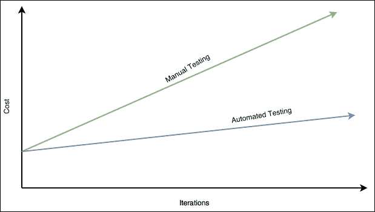

成本和迭代

如果做得好，测试实际上可以节省成本，而关键是做得好，这并不总是容易的。 多少测试算太多测试? 我们是否应该覆盖应用程序的每个角落? 我们真的需要深度性能测试吗?

这些问题通常会导致不同的观点，有趣的是，真相的来源并不单一。 这取决于你的系统的性质。

在本章中，我们将学习一系列广泛的测试技术，这并不意味着我们应该在我们的测试计划中包括所有这些技术，但至少我们将了解测试方法。

在过去的七年,Ruby on Rails 创建了一个巨大的趋势一个新的范式,叫做**测试驱动的开发(TDD**),在一定程度上,如今,大多数新开发平台的构建与 TDD。****

 ****就我个人而言，我并不是 TDD 的狂热采用者，但我喜欢接受好的部分。 在开发之前计划测试有助于创建具有正确内聚级别的模块，并定义清晰且易于测试的接口。 在本章中，我们不会深入讨论 TDD，但我们会多次提到它，并解释如何将这些公开的技术应用到 TDD 测试计划中。

## 自动化测试的金字塔

如何制定测试计划是一个棘手的问题。 无论你做什么，你最终都会觉得*这是完全错误的*。

在深入探讨之前，让我们定义一下我们将从功能的角度处理的不同类型的测试，以及它们应该针对什么进行设计。

### 单元测试

单元测试**是一种覆盖应用程序的各个部分而不考虑与不同模块的集成的测试。 它也被称为**白盒测试**和，目的是覆盖和验证尽可能多的分支。**

 **通常，衡量测试质量的方法是测试覆盖率，它是以百分比来衡量的。 如果我们的代码跨越 10 个分支，而我们的测试覆盖 7 个分支，那么我们的代码覆盖率是 70%。 这很好地表明了我们的测试覆盖率是多么可靠。 然而，这可能会引起误解，因为测试可能有缺陷，或者即使测试了所有分支，不同的输入将导致测试未捕获的不同输出。

在单元测试中，由于我们不与其他模块交互，我们将大量使用模拟和存根，以便模拟来自第三方系统的响应，控制流以命中所需的分支。

### 集成测试

顾名思义，**集成测试**是用来验证我们模块在应用程序环境中的集成的测试。 它们不是为了测试我们的代码分支而设计的，而是为了测试业务单元，在业务单元中，我们将把数据保存到数据库中，调用第三方 web 服务或我们架构的其他微服务。

这些测试是检查我们的服务是否按预期运行的完美工具，有时可能难以维护(通常情况下)。

在我多年的经验中，我还没有找到一家公司在集成测试方面做得很好，这有很多原因，如下表所示:

*   一些公司认为集成测试是昂贵的(这是事实)，因为它需要额外的资源(例如数据库和额外的机器)
*   其他一些公司试图只通过单元测试覆盖所有的业务用例，这取决于业务用例，但这远远不是理想的，因为单元测试做出的假设(模拟)可能会在我们的测试套件中给我们一个错误的信心
*   有时，集成测试被用于验证代码分支，就像它们是单元测试一样，这很耗时，因为您需要制定环境，使集成测试达到所需的分支

无论您多么聪明，集成测试都是您想要做的正确的事情，因为它是我们的软件中阻止集成 bug 发布到生产环境中的第一个真正的障碍。

### 端到端测试

这里，我们将演示我们的应用程序实际工作。 在集成测试中，我们在代码级别调用服务。 这意味着我们需要构建服务的上下文，然后发出调用。

与端到端测试的区别在于，在端到端测试中，我们实际上完全部署了应用程序，并发出执行目标代码所需的调用。 然而，很多时候，工程师可以决定将这两种类型的测试(集成测试和端到端测试)捆绑在一起，因为现代框架允许我们像运行集成测试一样快速运行端到端测试。

作为集成测试，端到端测试的目标不是测试应用程序的所有路径，而是测试用例。

在端到端测试中，我们可以找到几种不同的测试模式(范式)，如下:

*   我们可以测试 API 发出的 JSON 请求(或其他类型的请求)
*   我们可以使用 Selenium 测试 UI 来模拟 DOM 上的点击
*   我们可以使用一个新的范式叫做**行为驱动开发(BDD**)测试,映射到用例的行为在我们的应用程序中(点击 UI,请求 API,等等)和执行应用程序的用例****

 ****端到端测试通常是非常脆弱的，它们很容易被破坏。 根据我们的应用程序，我们可能对这些测试感到轻松，因为成本价值比非常低，但是，我仍然建议至少让其中一些测试覆盖最基本和最基本的流。

### 多少测试算多?

以下问题很难回答，尤其是在创业这样快节奏的企业中:

*   我们是否有太多的集成测试?
*   我们应该以 100%的单元测试覆盖率为目标吗?
*   如果硒元素每隔一天就会毫无理由地断裂，为什么还要做硒测试呢?

总会有妥协的。 测试覆盖率和所消耗的时间，并且，这些问题没有简单和单一的答案。

多年来我发现的唯一有用的指导原则是测试界所称的测试的**金字塔，即下图所示的。 如果你想一下，在你之前工作的项目中，你总共有多少个测试? 其中集成测试和单元测试的百分比是多少? 那么端到端测试呢? ：**

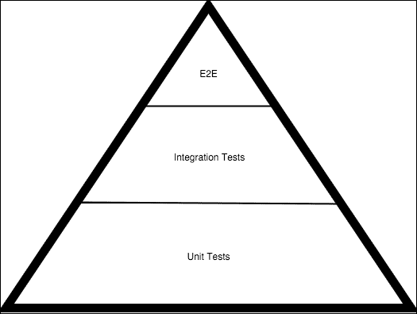

测试金字塔

前面的金字塔显示了这些问题的答案。 在一个正常的测试计划中，我们应该有很多单元测试:一些集成测试和很少的端到端测试。

原因很简单，大多数问题都可以在单元测试中发现。 访问代码的不同分支将验证应用程序中几乎每个功能用例的功能，因此在测试计划中有大量的功能用例是有意义的。 根据我的经验，在一个平衡的测试计划中，大约 70%的测试应该是单元测试。 然而，在面向微服务的架构中，特别是在使用动态语言(如 Node.js)时，这个数字很容易下降，但在我们的测试中仍然有效。 其背后的原因是 Node.js 允许你非常快速地编写集成测试，这样我们就可以用集成测试替换一些单元测试。

### 提示

测试是一个非常完善的、复杂的过程。 试图超越现有方法可能会导致难以维护和难以信任的测试套件。

集成测试负责捕捉集成问题，如下所示:

*   我们的代码可以呼叫短信网关吗?
*   到数据库的连接是否正常?
*   是否正在从我们的服务发送 HTTP 报头?

同样，根据我的经验，我们的测试中大约有 20%应该是集成测试; 关注依赖于第三方模块的积极流和一些消极流。

当涉及到端到端测试时，它们应该非常有限，并且只测试应用程序的主要流程，而不涉及太多细节。 单元和集成测试应该已经获取了这些细节，这些细节在发生故障时很容易修复。 然而，这里有一个陷阱:在 Node.js 中测试微服务时，90%的时候，集成和端到端测试是一回事。 由于 Node.js 的动态特性，我们可以从集成的角度(整个服务器正在运行)测试其余 API，但实际上，我们也将测试代码在与其他模块集成时的行为。 我们将在本章后面看到一个示例。

## 在 Node.js 中测试微服务

Node.js 是一种令人印象深刻的语言。 发展中任何一个方面的图书馆数量都是惊人的。 无论你想在 Node.js 中完成多么奇怪的任务，总会有一个 npm 模块。

关于测试，Node.js 有一个非常强大的库集，但其中两个库特别受欢迎:**Mocha**和**Chai**。

它们几乎是应用测试的行业标准，并且得到了很好的维护和升级。

另一个有趣的库称为**Sinon.JS**，它用于模拟、监视和存根方法。 我们将在接下来的章节中回到这些概念，但是这个库主要用于模拟与第三方的集成，而不与第三方进行交互。

### Chai

这个库是一个 BDD/TDD 断言库，可以与任何其他库一起使用来创建高质量测试。

断言是一种代码语句，它要么被实现，要么抛出错误，停止测试并将其标记为失败:

```js
5 should be equal to A
```

当变量`A`包含值`5`时，前面的语句将是正确的。 这是一个非常强大的工具，可以编写易于理解的测试，特别是使用 Chai，我们可以通过以下三种不同的接口访问断言:

*   `should`
*   `expect`
*   `assert`

在一天结束的时候，每一个条件都可以使用一个接口来检查，但是库为我们提供了一个如此丰富的接口，这一事实为我们编写干净、简单和可维护的测试提供了便利。

让我们来安装这个库:

```js
npm install chai

```

这将产生以下输出:

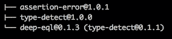

也就是说，柴火取决于`assertion-error`、`type-detect`、`deep-eql`。 如您所见，这很好地表明，我们将能够使用简单的指令、复杂的语句(如对象中的深度相等或类型匹配)进行检查。

Chai 这样的测试库并不直接依赖于我们的应用程序，而是依赖于开发。 我们需要它们来开发应用程序，但不应该将它们交付到生产环境中。 这是一个很好的理由来重组我们的`package.json`，并在`devDependencies`依赖标签中添加 Chai，如下所示:

```js
{
  "name": "chai-test",
  "version": "1.0.0",
  "description": "A test script",
  "main": "chai.js",
  "dependencies": {
  },
  "devDependencies": {
    "chai": "*"
  },
  "author": "David Gonzalez",
  "license": "ISC"
}
```

这将防止我们的软件进入 Chai 之类的产品库，这与我们应用程序的操作无关。

一旦我们安装了 Chai，我们就可以开始玩界面了。

#### bdd 风格接口

Chai 带有两种风格的 BDD 接口。 使用哪一个是个人偏好的问题，但我个人的建议是使用在任何情况下都让你感觉更舒服的那个。

让我们从`should`接口开始。 这是一个 bdd 风格的接口，使用类似于自然语言的东西，我们可以创建断言来决定我们的测试是成功还是失败:

```js
myVar.should.be.a('string')
```

为了能够构建像前面那样的句子，我们需要在程序中导入`should`模块:

```js
var chai = require('chai');

chai.should();

var foo = "Hello world";
console.log(foo);

foo.should.equal('Hello world');
```

虽然它看起来像一个黑魔法,它是方便的在测试我们的代码使用类似于自然语言,以确保我们的代码满足某些标准:*foo 应该等于“Hello world”*有直接翻译我们的测试。

Chai 提供的第二个 bdd 风格的接口是`expect`。 尽管它与`should`非常相似，但它改变了一点语法，以便设置结果必须满足的期望。

让我们看看下面的例子:

```js
var expect = require('chai').expect;

var foo = "Hello world";

expect(foo).to.equal("Hello world");
```

正如您所看到的，样式非常相似:一个连贯的接口允许我们检查测试是否满足成功的条件，但是如果不满足条件会发生什么呢?

让我们来执行一个简单的 Node.js 程序，它在条件之一失败:

```js
var expect = require('chai').expect;
var animals = ['cat', 'dog', 'parrot'];
expect(animals).to.have.length(4);
```

现在，让我们执行前面的脚本，假设你已经安装了 Chai:

```js
code/node_modules/chai/lib/chai/assertion.js:107
 throw new AssertionError(msg, {
 ^
AssertionError: expected [ 'cat', 'dog', 'parrot' ] to have a length of 4 but got 3
 at Object.<anonymous> (/Users/dgonzalez/Dropbox/Microservices with Node/Writing Bundle/Chapter 6/code/chai.js:24:25)
 at Module._compile (module.js:460:26)
 at Object.Module._extensions..js (module.js:478:10)
 at Module.load (module.js:355:32)
 at Function.Module._load (module.js:310:12)
 at Function.Module.runMain (module.js:501:10)
 at startup (node.js:129:16)
 at node.js:814:3

```

抛出异常，测试失败。 如果验证了所有条件，则不会引发异常，测试也就成功了。

如您所见，我们可以使用`expect`和`should`接口为我们的测试使用许多自然语言单词。 完整的列表可以在 Chai 文档([http://chaijs.com/api/bdd/#-include-value-](http://chaijs.com/api/bdd/#-include-value-))中找到，但让我们在下面的列表中解释一些最有趣的:

*   `not`:该词用于否定链中下列断言。 例如，`expect("some string").to.not.equal("Other String")`将通过。
*   `deep`:这个词是所有单词中最有趣的一个。 它用于对物体进行深度比较，是进行完全平等比较的最快方式。 例如，如果`foo`是一个带有`"David"`字符串值的`name`属性的 JavaScript 对象，那么`expect(foo).to.deep.equal({name: "David"})`就会成功。
*   `any`/`all`:这是用来检查字典或对象是否包含任何给定键的列表,这样`expect(foo).to.have.any.keys("name", "surname")``foo`会成功如果包含任何给定键的,`expect(foo).to.have.all.keys("name", "surname")`才会成功,如果它所有的钥匙。
*   :这是一个有趣的。 您可能知道，JavaScript 有一些缺陷，其中之一是表达式的真/假计算。 使用`ok`，我们可以抽象出所有的混乱，然后用做类似于下面的表达式列表的事情:
    *   `expect('everything').to.be.ok`:`'everything'`是一个字符串，它将被赋值为`ok`
    *   `expect(undefined).to.not.be.ok`:Undefined 在 JavaScript 中是不行的，所以这个断言会成功
*   `above`:这是一个非常有用的单词，用于检查数组或集合是否包含超过某个阈值的元素，如下所示:

如您所见，用于流利断言的 Chai API 非常丰富，使我们能够编写易于维护的描述性很强的测试。

现在，您可能会问自己，为什么有两种风格相同的界面，却几乎工作相同? 好吧，它们在功能上做同样的事情，但是，看看细节:

*   `expect`提供了链结语言的起点
*   `should`扩展了`Object.prototype`签名，将可链接语言添加到 JavaScript 中的每个对象中

从 Node.js 的角度来看，它们都很好，尽管事实是`should`正在测试`Object`的原型，这可能是一个对使用它有点偏执的理由，因为它具有侵入性。

#### 断言接口

**断言**接口匹配最常见的老式测试断言库。 在这种风格中，我们需要明确我们想要测试的内容，并且不存在流畅的表达式链:

```js
var assert = require('chai').assert;
var myStringVar = 'Here is my string';
// No message:
assert.typeOf(myStringVar, 'string');
// With message:
assert.typeOf(myStringVar, 'string', 'myStringVar is not string type.');
// Asserting on length:
assert.lengthOf(myStringVar, 17);
```

如果您已经在任何语言中使用了现有的测试库中的任何一个，那么就没有更多的可以深入研究了。

### 摩卡

在我的看来，Mocha 是我在职业生涯中使用过的最方便的测试框架之一。 它遵循的原则****行为驱动开发测试**(**BDDT**),测试用例描述的应用程序从另一个库并使用断言验证的结果执行代码。**

 **虽然听起来有点复杂，但从功能和技术的角度来看，确保我们的代码被覆盖是非常方便的，因为我们将把构建应用程序的需求镜像到验证它们的自动化测试中。

让我们从一个简单的例子开始。 Mocha 与其他库有点不同，因为它定义了自己的**领域特定语言**(**DSL**)，需要用 Mocha 而不是 Node.js 执行。 它是语言的一种延伸。

首先我们需要在系统中安装 Mocha:

```js
npm install mocha -g

```

这将产生类似下图的输出:


从现在开始，我们的系统中有一个新的命令:`mocha`。

下一步是用 Mocha 写一个测试:

```js
function rollDice() {
  return Math.floor(Math.random() * 6) + 1;
}

require('chai').should();
var expect = require('chai').expect;

describe('When a customer rolls a dice', function(){

  it('should return an integer number', function() {
    expect(rollDice()).to.be.an('number');
  });

  it('should get a number below 7', function(){
    rollDice().should.be.below(7);
  });

  it('should get a number bigger than 0', function(){
    rollDice().should.be.above(0);
  });

  it('should not be null', function() {
    expect(rollDice()).to.not.be.null;
  });

  it('should not be undefined', function() {
    expect(rollDice()).to.not.be.undefined;
  });
});
```

前面的例子很简单。 一个掷骰子并返回从`1`到`6`的整数的函数。 现在我们需要考虑一下用例和需求:

*   这个数必须是整数
*   这个整数必须小于 7
*   它必须大于 0，骰子没有负数
*   该函数不能返回`null`
*   该函数不能返回`undefined`

这涵盖了 Node.js 中几乎所有关于掷骰子的情况。 我们所做的是描述我们确实想要测试的情况，以便在不破坏现有功能的情况下安全地对软件进行更改。

这五个用例是对先前编写的测试的精确映射:

*   **我们描述情景**:*当客户掷骰子*
*   **条件验证**:*返回整数*

让我们运行之前的测试并检查结果:

```js
mocha tests.js

```

这应该会返回类似以下截图的内容:

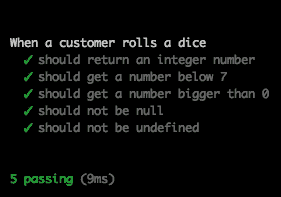

如您所见，Mocha 返回一个关于测试中发生了什么的全面报告。 在这种情况下，它们都通过了，所以我们不需要担心问题。

让我们强制一些测试失败:

```js
function rollDice() {
  return -1 * Math.floor(Math.random() * 6) + 1;
}

require('chai').should();
var expect = require('chai').expect;

describe('When a customer rolls a dice', function(){

  it('should return an integer number', function() {
    expect(rollDice()).to.be.an('number');
  });

  it('should get a number below 7', function(){
    rollDice().should.be.below(7);
  });

  it('should get a number bigger than 0', function(){
    rollDice().should.be.above(0);
  });

  it('should not be null', function() {
    expect(rollDice()).to.not.be.null;
  });

  it('should not be undefined', function() {
    expect(rollDice()).to.not.be.undefined;
  });
});
```

不小心，有人把一个代码片段撞到了`rollDice()`函数中，这使得函数返回一个不满足某些要求的数字。 让我们再次运行 Mocha，如下图所示:

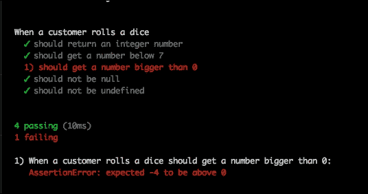

现在，我们可以看到报告返回了一个错误:方法返回了`-4`，其中它应该总是返回一个大于`0`的数字。

此外，在 Node.js 中使用 Mocha 和 Chai 进行这种类型的测试的一个好处是时间。 测试运行非常，所以如果我们破坏了某些内容，很容易收到反馈。 前面的套曲在`10ms`中运行。

### Sinon.JS -一个 mocking 框架

前两章已经集中在断言函数的返回值的条件，但是当我们的函数不返回任何值时会发生什么呢? 唯一正确的测量方法是检查方法是否被调用。 另外，如果我们的一个模块正在调用第三方 web 服务，但我们不希望我们的测试调用远程服务器，该怎么办?

为了回答这些问题，我们有两个概念性工具，分别是 mock 和 spies, Node.js 有一个完美的库来实现它们:Sinon.JS。

首先安装它，如下:

```js
npm install sinon

```

上述命令应该会产生如下输出:


现在让我们通过一个例子来解释它是如何工作的:

```js
function calculateHypotenuse(x, y, callback) {
  callback(null, Math.sqrt(x*x + y*x));
}

calculateHypotenuse(3, 3, function(err, result){
  console.log(result);
});
```

这个简单的脚本计算一个三角形的斜边，给定三角形的其他两条边的长度。 我们想要进行的测试之一是，回调函数在执行时提供了正确的参数列表。 要完成这样的任务，我们需要 Sinon.JS 所说的间谍:

```js
var sinon = require('sinon');

require('chai').should();

function calculateHypotenuse(x, y, callback) {
  callback(null, Math.sqrt(x*x + y*x));
}

describe("When the user calculates the hypotenuse", function(){
  it("should execute the callback passed as argument", function() {
    var callback = sinon.spy();
    calculateHypotenuse(3, 3, callback);
    callback.called.should.be.true;
  });
});
```

再次，我们使用 Mocha 运行脚本，Chai 通过`should`界面验证测试结果，如下图所示:

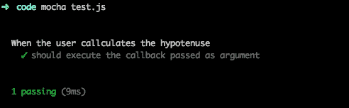

前面的脚本中重要的一行是:

```js
var callback = sinon.spy();
```

在这里，我们创建了间谍，并将其作为回调注入到函数中。 这个由 Sinon.JS 创建的函数实际上不仅是一个函数，而且是一个包含一些有趣信息的完整对象。 Sinon.JS 利用了 JavaScript 的动态特性做到了这一点。 通过使用`console.log()`将该对象转储到控制台，您可以看到该对象中的内容。

Sinon.JS 中另一个非常强大的工具是存根。 **stub**非常类似于 mock(在 JavaScript 中实际的效果是相同的)，允许我们模拟函数来模拟所需的返回:

```js
var sinon = require('sinon');
var expect = require('chai').expect;

function rollDice() {
  return -1 * Math.floor(Math.random() * 6) + 1;
}
describe("When rollDice gets called", function() {
  it("Math#random should be called with no arguments", function() {
    sinon.stub(Math, "random");
    rollDice();
    console.log(Math.random.calledWith());
  });
})
```

在本例中，我们对`Math#random`方法进行了 stub，这将导致该方法成为某种重载的空函数(它不发出 get 调用)，该函数将记录关于它被调用的内容或方式的统计信息。

前面的代码中有一个问题:我们从未恢复`random()`方法，这是非常危险的。 它有巨大的副作用，因为其他测试将把`Math#random`方法视为存根，而不是原始的方法，它可能导致我们根据无效信息编写测试代码。

为了防止这种情况，我们需要利用 Mocha 的`before()`和`after()`方法:

```js
var sinon = require('sinon');
var expect = require('chai').expect;

var sinon = require('sinon');
var expect = require('chai').expect;

function rollDice() {
  return -1 * Math.floor(Math.random() * 6) + 1;
}
describe("When rollDice gets called", function() {

  it("Math#random should be called with no arguments", function() {
    sinon.stub(Math, "random");
    rollDice();
    console.log(Math.random.calledWith());
  });
after(function(){
 Math.random.restore();
 });
});
```

如果你注意突出显示的代码,我们告诉 Sinon.JS 恢复最初的方法是里面的`it`块之一,所以,如果另一个`describe`块利用`http.get`,我们不会看到存根,但原来的方法。

### 提示

`before()`和`after()`方法对于设置和结束测试上下文非常有帮助。 然而，您需要小心它们执行的范围，因为它可能导致测试交互。

摩卡有几种口味:

*   `before(callback)`:在当前作用域之前执行(在前面代码的`describe`块的开头)
*   `after(callback)`:在当前作用域之后执行(在前面代码中的`describe`块的末尾)
*   `beforeEach(callback)`:在当前范围内每个元素的开始处执行(在前面示例中的每个`it`之前)
*   `afterEach(callback)`:在当前范围内的每个元素的末尾执行(在前面示例中的每个`it`之后)

Sinon.JS 中另一个有趣的特性是时间操作。 有些测试需要在事件发生的特定时间后执行周期性任务或响应。 使用 Sinon.JS，我们可以将时间作为测试的参数之一:

```js
var sinon = require('sinon');
var expect = require('chai').expect

function areWeThereYet(callback) {

  setTimeout(function() {
    callback.apply(this);
  }, 10);

}

var clock;

before(function(){
  clock = sinon.useFakeTimers();
});

it("callback gets called after 10ms", function () {
  var callback = sinon.spy();
  var throttled = areWeThereYet(callback);

  areWeThereYet(callback);

  clock.tick(9);
  expect(callback.notCalled).to.be.true;

  clock.tick(1);
  expect(callback.notCalled).to.be.false;
});

after(function(){
  clock.restore();
});
```

如你所见，我们现在可以在测试中控制时间。

### 测试真正的微服务

现在，是时候测试一个真正的微服务了，以便对整个测试套件有一个大致的了解。

我们 microservice 要用表达,它会过滤输入文本删除搜索引擎称之为**停止词**:*话说不到三个字符和单词禁止【5】。*

让我们看看代码:

```js
var _ = require('lodash');
var express = require('express');

var bannedWords = ["kitten", "puppy", "parrot"];

function removeStopWords (text, callback) {
  var words = text.split(' ');
  var validWords = [];
  _(words).forEach(function(word, index) {
    var addWord = true;

    if (word.length < 3) {
      addWord = false;
    }

    if(addWord && bannedWords.indexOf(word) > -1) {
      addWord = false;
    }

    if (addWord) {
      validWords.push(word); 
    }

    // Last iteration:
    if (index == (words.length - 1)) {
      callback(null, validWords.join(" "));
    }
  });
}
var app = express();

app.get('/filter', function(req, res) {
  removeStopWords(req.query.text, function(err, response){
    res.send(response);
  });
});

app.listen(3000, function() {
  console.log("app started in port 3000");
});
```

如您所见，服务非常小，所以它是解释如何编写单元、集成和端到端测试的完美示例。 在这种情况下,正如我们之前所述,E2E 和集成测试是完全相同的测试服务通过 REST API 将相当于测试系统从端到端角度,而且我们的组件是如何集成系统中。 考虑到这一点，如果我们要添加一个 UI，我们就必须将集成测试从 E2E 分离出来，以确保质量。

#### TDD -测试驱动开发

我们的服务完成了，工作了。 但是，现在我们想对它进行单元测试，但是我们发现了一些问题:

*   我们想要进行单元测试的功能在主`.js`文件之外不可见
*   服务器代码与功能代码紧密耦合，并且具有较差的内聚性

在这里，TDD 来拯救; 我们应该经常问自己“在编写软件时如何测试这个函数?” 这并不意味着我们应该以测试的特定目的来修改我们的软件，但是如果您在测试程序的一部分时遇到了问题，更有可能的是，您应该查看内聚和耦合，因为这是问题的一个很好的指示。 让我们看看下面的文件:

```js
var _ = require('lodash');
var express = require('express');

module.exports = function(options) {
  bannedWords = [];
  if (typeof options !== 'undefined') {
    console.log(options);
    bannedWords = options.bannedWords || [];
  }

  return function bannedWords(text, callback) {
    var words = text.split(' ');
    var validWords = [];
    _(words).forEach(function(word, index) {
      var addWord = true;

      if (word.length < 3) {
        addWord = false;
      }

      if(addWord && bannedWords.indexOf(word) > -1) {
        addWord = false;
      }

      if (addWord) {
        validWords.push(word); 
      }

      // Last iteration:
      if (index == (words.length - 1)) {
        callback(null, validWords.join(" "));
      }
    });
  }
}
```

在我看来，这个文件是一个高度可重用且具有良好内聚性的模块:

*   我们可以在任何地方导入它(甚至在浏览器中)
*   在创建模块时可以注入禁用的单词(对测试非常有用)
*   它不会与应用程序代码纠缠在一起

以这种方式放置代码，我们的应用程序模块将类似如下:

```js
var _ = require('lodash');
var express = require('express');

var removeStopWords = require('./remove-stop-words')({bannedWords: ["kitten", "puppy", "parrot"]});

var app = express();

app.get('filter', function(req, res) {
  res.send(removeStopWords(req.query.text));
});

app.listen(3000, function() {
  console.log("app started in port 3000");
});
```

如您所见，我们已经清楚地将业务单元(捕获业务逻辑的功能)与操作单元(服务器的设置)分开了。

正如我之前提到的，我不喜欢在编写代码之前编写测试，但是测试应该(在我看来)与代码一起编写，但要始终牢记前面提到的问题。

公司中似乎有一股推动采用 TDD 方法的力量，但它可能会导致显著的效率低下，特别是当业务需求不明确(90%的时间都是如此)并且我们在开发过程中面临变化时。

#### 单元测试

既然我们的代码已经处于更好的状态，我们将对函数进行单元测试。 我们将使用摩卡和 Chai 来完成这样的任务:

```js
var removeStopWords = require('./remove-stop-words')({bannedWords: ["kitten", "parrot"]});

var chai = require('chai');
var assert = chai.assert;
chai.should();
var expect = chai.expect;

describe('When executing "removeStopWords"', function() {

  it('should remove words with less than 3 chars of length', function() {
    removeStopWords('my small list of words', function(err, response) {
      expect(response).to.equal("small list words");
    });
  });

  it('should remove extra white spaces', function() {
    removeStopWords('my small       list of words', function(err, response) {
      expect(response).to.equal("small list words");
    });
  });

  it('should remove banned words', function() {
    removeStopWords('My kitten is sleeping', function(err, response) {
      expect(response).to.equal("sleeping");
    });
  });

  it('should not fail with null as input', function() {
    removeStopWords(null, function(err, response) {
      expect(response).to.equal("small list words");
    });
  });

  it('should fail if the input is not a string', function() {
    try {
      removeStopWords(5, function(err, response) {});
      assert.fail();
    }
    catch(err) {
    }
  });
});
```

正如您所看到的，我们在应用程序中几乎涵盖了每一个案例和分支，但是我们的代码覆盖情况如何呢?

到目前为止，我们已经提到过，但从未真正测量过。 我们将使用一种工具，称为**Istanbul**，来衡量测试覆盖率:

```js
npm install -g istanbul

```

这应该安装伊斯坦布尔。 现在我们需要运行报道报告:

```js
istanbul cover _mocha my-tests.js

```

这将产生一个类似如下图所示的输出:

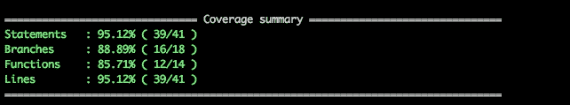

这也会在 HTML 中生成一个覆盖率报告，指出哪些行、函数、分支和语句没有被覆盖，如下面的截图所示:

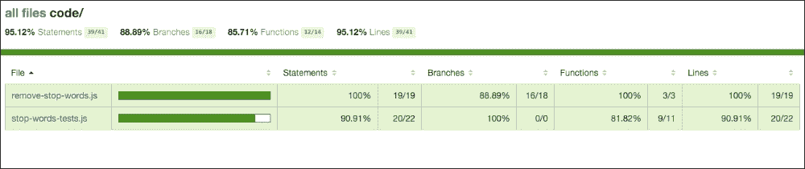

如你所见，我们看起来很好。 我们的代码(不是测试)实际上已经被很好地覆盖了，特别是如果我们查看代码文件的详细报告，如下图所示:


我们可以看到，只有一个分支(行**7**中的`or`操作符)没有被覆盖，而行**6**中的`if`操作符从未被转移到`else`操作符。

我们还获得了关于一行执行次数的信息:它显示在行号旁边的竖条中。 这些信息对于发现应用程序的热点区域也非常有用，在这些区域优化将受益最大。

关于正确的覆盖率水平，在本例中，很容易达到 90%以上，但不幸的是，在生产系统中，这并不那么容易:

*   代码要复杂得多
*   时间总是一个限制
*   测试可能不被视为生产时间

但是，在使用动态语言时，您应该小心谨慎。 在 Java 或 c#中，调用不存在的函数会导致编译时错误; 而在 JavaScript 中，它将导致运行时错误。 唯一真正的障碍是测试(手动或自动)，所以最好确保至少每一行都执行一次。 一般来说，对于大多数情况，超过 75%的代码覆盖率就足够了。

#### 端到端测试

为了对应用程序进行端到端测试，我们需要一个运行它的服务器。 通常，端到端测试是在受控环境下执行的，例如 QA 盒或预生产机器，以验证我们即将部署的软件的行为是否符合预期。

在这种情况下，我们的应用程序是一个 API，因此我们将创建端到端测试，同时将作为集成测试使用。

然而，在一个完整的应用程序中，我们可能希望在集成和端到端测试之间有一个明确的分离，并使用 Selenium 之类的东西从 UI 的角度来测试我们的应用程序。

Selenium 是一个框架，允许我们的代码向浏览器发送指令，如下所示:

*   点击带有`button1`ID 的按钮
*   将鼠标悬停在带有 CSS 类`highlighted`的`div`元素上

通过这种方式，我们可以确保我们的应用流程按照预期进行，端到端，并且我们的下一个版本不会破坏应用的关键流程。

让我们关注微服务的端到端测试。 我们一直在使用 Chai 和 Mocha 及其相应的断言接口来单元测试我们的软件，并使用 Sinon.JS 来模拟服务函数和其他元素，以避免调用被传播到第三方 web 服务或从一个方法获得受控的响应。

现在，在我们的端到端测试计划中，我们实际上希望发出对服务的调用，并获得响应来验证结果。

我们要做的第一件事就是在某个地方运行微服务。 为了方便起见，我们将使用本地机器，但是我们可以在持续开发环境中针对 QA 机器执行这些测试。

那么，让我们启动服务器:

```js
node stop-words.js

```

为了方便，我把我的脚本命名为`stop-words.js`。 一旦服务器开始运行，我们就可以开始测试了。 在一些情况下，我们可能希望我们的测试启动和停止服务器，以便一切都是自包含的。 让我们看一个小例子，看看如何做到这一点:

```js
var express = require('express');

var myServer = express();

var chai = require('chai');

myServer.get('/endpoint', function(req, res){
  res.send('endpoint reached');
});

var serverHandler;

before(function(){
  serverHandler = myServer.listen(3000);
});

describe("When executing 'GET' into /endpoint", function(){
  it("should return 'endpoint reached'", function(){
    // Your test logic here. http://localhost:3000 is your server.
  });
});

after(function(){
  serverHandler.close();
});
```

如您所见，Express 提供了一个以编程方式操作服务器的处理程序，因此只需使用`before()`和`after()`函数即可完成此任务。

在我们的示例中，我们将假设服务器正在运行。 为了发出请求，我们将使用一个名为`request`的库向服务器发出调用。

与往常一样，安装它的方法是执行`npm install request`。 一旦它完成了，我们可以利用这个惊人的图书馆:

```js
var chai = require('chai');
var chaiHttp = require('chai-http');
var expect = chai.expect;
chai.use(chaiHttp);

describe("when we issue a 'GET' to /filter with text='aaaa bbbb cccc'", function(){
  it("should return HTTP 200", function(done) {
    chai.request('http://localhost:3000')
      .get('/filter')
      .query({text: 'aa bb ccccc'}).end(function(req, res){
        expect(res.status).to.equal(200);
        done();
      });
  });
});

describe("when we issue a 'GET' to /filter with text='aa bb ccccc'", function(){
  it("should return 'ccccc'", function(done) {
    chai.request('http://localhost:3000')
      .get('/filter')
      .query({text: 'aa bb ccccc'}).end(function(req, res){
        expect(res.text).to.equal('ccccc');
        done();
      });
  });
});

describe("when we issue a 'GET' to /filter with text='aa bb cc'", function(){
  it("should return ''", function(done) {
    chai.request('http://localhost:3000')
      .get('/filter')
      .query({text: 'aa bb cc'}).end(function(req, res){
        expect(res.text).to.equal('');
        done();
      });
  });
});
```

通过前面的简单测试，我们设法以确保应用程序的每个移动部分都已执行的方式测试服务器。

这里有一个我们以前没有的特性:

```js
 it("should return 'ccccc'", function(done) {
    chai.request('http://localhost:3000')
      .get('/filter')
      .query({text: 'aa bb ccccc'}).end(function(req, res){
        expect(res.text).to.equal('ccccc');
 done();
      });
  });
```

如果您查看高亮显示的代码，您可以看到一个名为`done`的新回调。 这个回调有一个任务:阻止测试完成，直到调用它，以便 HTTP 请求有时间执行并返回适当的值。 记住，Node.js 是异步的，在一个操作完成之前，不会有线程被阻塞的情况。

除此之外，我们还使用了由`chai-http`引入的新 DSL 来构建 get 请求。

这种语言允许我们建立一个大范围的组合，考虑以下，例如:

```js
chai.request('http://mydomain.com')
  .post('/myform')
  .field('_method', 'put')
  .field('username', 'dgonzalez')
  .field('password', '123456').end(...)
```

在前面的请求中，我们提交了一个看起来像登录的表单，因此在`end()`函数中，我们可以断言从服务器返回的结果。

有无数的组合来测试我们的 api 与`chai-http`。

### 手动测试——必要的罪恶

无论我们在自动化测试中投入了多少精力，总是会有许多手动测试被执行。

有时候,我们需要做的只是当我们正在开发 API,我们想要看到的消息从我们的客户到服务器,但在其他一些时候,我们只是想打击我们的端点 pre-forged 请求导致软件执行我们期望。

在第一种情况下，我们将利用 Node.js 及其动态特性来构建一个代理，该代理将嗅探所有请求并将它们记录到终端上，以便我们可以调试正在发生的事情。 这种技术可以用来利用两个微服务之间的通信，在不中断流的情况下查看正在发生的事情。

在第二种情况下，我们将使用名为 Postman 的软件以受控的方式向服务器发出请求。

#### 构建代理来调试我们的微服务

我第一次与 Node.js 的接触正是由于这个问题:两个服务器互相发送消息，在没有明显原因的情况下导致错误行为。

这是一个非常常见的问题，有很多已经工作的解决方案(基本上是中间人代理)，但我们将展示 Node.js 是多么强大:

```js
var http = require('http');
var httpProxy = require('http-proxy');
var proxy = httpProxy.createProxyServer({});

http.createServer(function(req, res) {
  console.log(req.rawHeaders);
  proxy.web(req, res, { target: 'http://localhost:3000' });
}).listen(4000);
```

如果您还记得上一节，我们的`stop-words.js`程序在端口`3000`上运行。 我们对这段代码所做的就是使用`http-proxy`创建一个代理，该代理在将头记录到控制台之后，将端口`4000`上发出的所有请求隧道到端口`3000`。

如果我们在项目的根目录下使用`npm install`命令安装所有依赖项后运行该程序，我们可以看到代理是如何有效地记录请求并将它们隧道到目标主机:

```js
curl http://localhost:4000/filter?text=aaa

```

这将产生以下输出:


这个示例非常简单，但是这个小代理实际上可以部署在我们的微服务之间的任何地方，并为我们提供关于网络中正在发生的事情的非常有价值的信息。

#### 邮递员

在我们可以在互联网上找到的所有用于测试 api 的软件中，Postman 是我的最爱。 它开始作为扩展的谷歌 Chrome，但现在，已经采取的形式，一个独立的应用程序建立在 Chrome 运行时。

你可以在 Chrome 网络商店中找到它，而且它是免费的(所以你不需要付费)，尽管它有一个为团队提供更高级功能的付费版本。

界面非常简洁，如下截图所示:


左边,我们可以看到请求的历史**,**以及**集合的请求,这将是非常方便当我们正在一个长期项目,我们有一些复杂的请求。**

 **我们将再次使用我们的`stop-words.js`微服务来展示邮差的强大。

因此，首先要确保我们的微服务在运行。 完成后，让我们从 Postman 发出一个请求，如下面的截图所示:

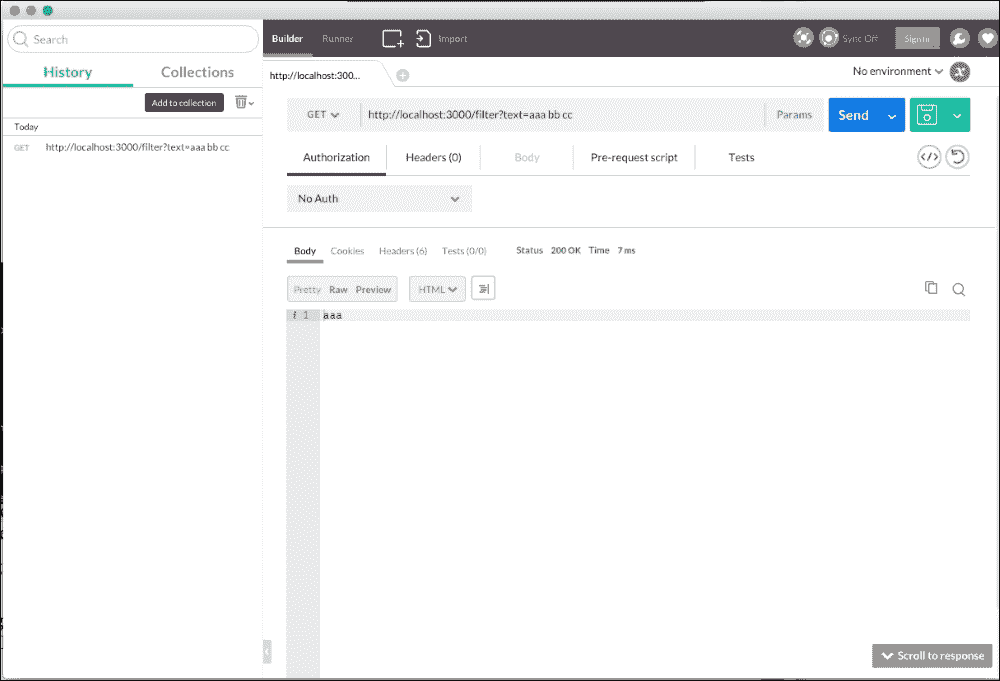

简单地说，我们已经为我们的服务发出了请求(使用**GET**动词)，并且它已经用文本进行了过滤:非常简单和有效。

现在假设我们希望通过 Node.js 执行该调用。 Postman 有一个非常有趣的特性，它为我们从接口发出的请求生成代码。 如果你点击窗口右侧保存按钮下的图标，出现的屏幕将发挥神奇的作用:


让我们看看生成的代码:

```js
var http = require("http");

var options = {
  "method": "GET",
  "hostname": "localhost",
  "port": "3000",
  "path": "/filter?text=aaa%20bb%20cc",
  "headers": {
    "cache-control": "no-cache",
    "postman-token": "912cacd8-bcc0-213f-f6ff-f0bcd98579c0"
  }
};

var req = http.request(options, function (res) {
  var chunks = [];

  res.on("data", function (chunk) {
    chunks.push(chunk);
  });

  res.on("end", function () {
    var body = Buffer.concat(chunks);
    console.log(body.toString());
  });
});

req.end();
```

这是一个非常容易理解的代码，特别是如果您熟悉 HTTP 库的话。

使用 Postman，我们还可以向服务器发送 cookie、头和表单，以模拟应用程序将通过发送身份验证令牌或 cookie 来实现的身份验证。

让我们将请求重定向到我们在上一节中创建的代理，如下截图所示:


如果你有代理和`stop-words.js`微服务运行，你应该在代理中看到类似以下输出:

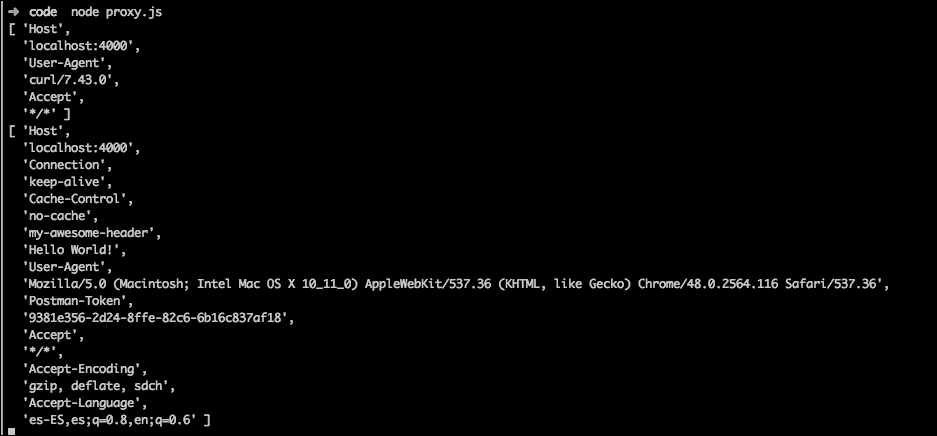

我们与 Postman 一起发送的标题，**my-awesome-header**，将会显示在原始标题列表中。

# 记录微服务

在本节中，我们将学习如何使用 Swagger 来记录 api。 Swagger 是遵循**开放 API 标准**的 API 管理器，因此它是所有 API 创建者的*公共语言*。 我们将讨论如何编写定义，以及为什么就如何描述资源达成一致是如此重要。

## 用 Swagger 文档化 api

文档总是一个问题。 不管你怎么努力，它最终总会过时。 幸运的是，在过去的几年里，正在推动为 REST api 生成高质量的文档。

API 管理人员在其中发挥了关键作用，而 Swagger 是一个特别有趣的平台。 Swagger 不仅仅是一个用于文档的模块，它还以这样一种方式管理您的 API，使您能够全面地了解您的工作。

让我们开始安装它:

```js
npm install -g swagger

```

这将在系统范围内安装 Swagger，因此它将是我们系统中的另一个命令。 现在，我们需要使用它创建一个项目:

```js
swagger project create my-project

```

这个命令允许你选择不同的 web 框架。 我们将选择 Express，因为它是我们已经在使用的一个。 命令的输出如下截图所示:

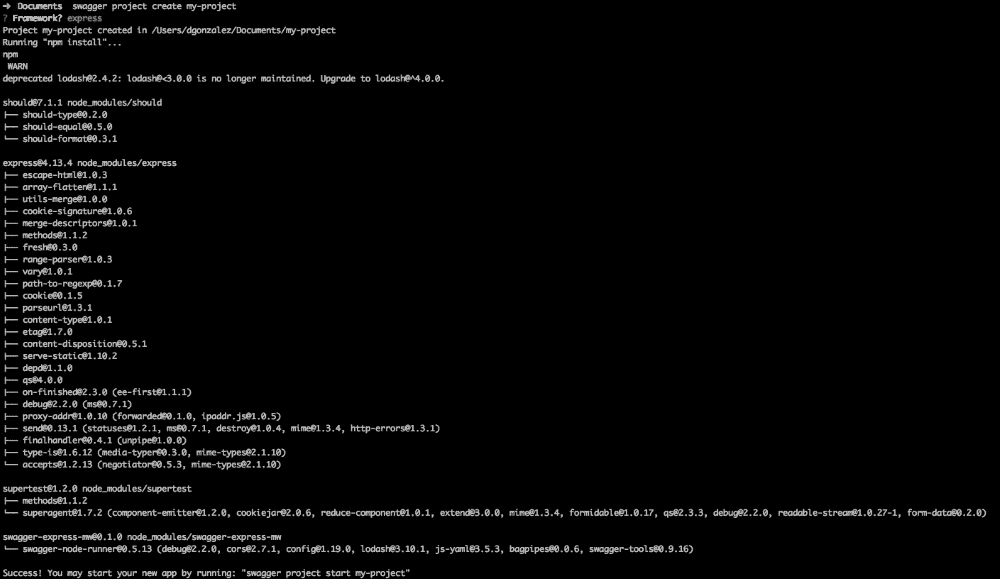

这张截图显示了如何使用 Swagger 启动一个项目

现在我们可以找到一个新的文件夹，名为`my-project`，如下图所示:

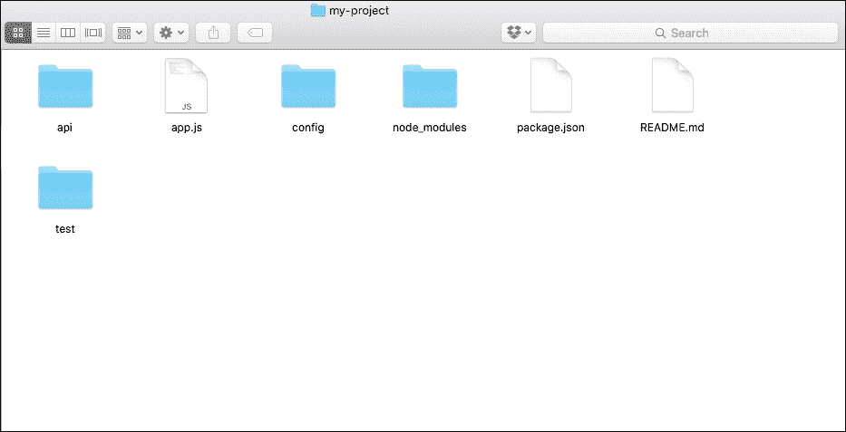

该结构是不言自明的，它是一个 Node.js 应用程序的常见布局:

*   `api`:在这里，我们的 API 代码将被放置
*   `config`:所有配置都在这里
*   `node_modules`:这是一个包含运行应用程序所需的所有依赖项的文件夹
*   `test`:这是，Swagger 在中生成了一些虚拟测试，我们可以在其中添加自己的测试

Swagger 附带了一个令人印象深刻的特性:一个嵌入式编辑器，允许您对 API 的端点建模。 为了运行它，从生成的文件夹中，执行以下命令:

```js
Swagger project edit

```

它将在默认浏览器中打开 Swagger Editor，窗口如下图所示:

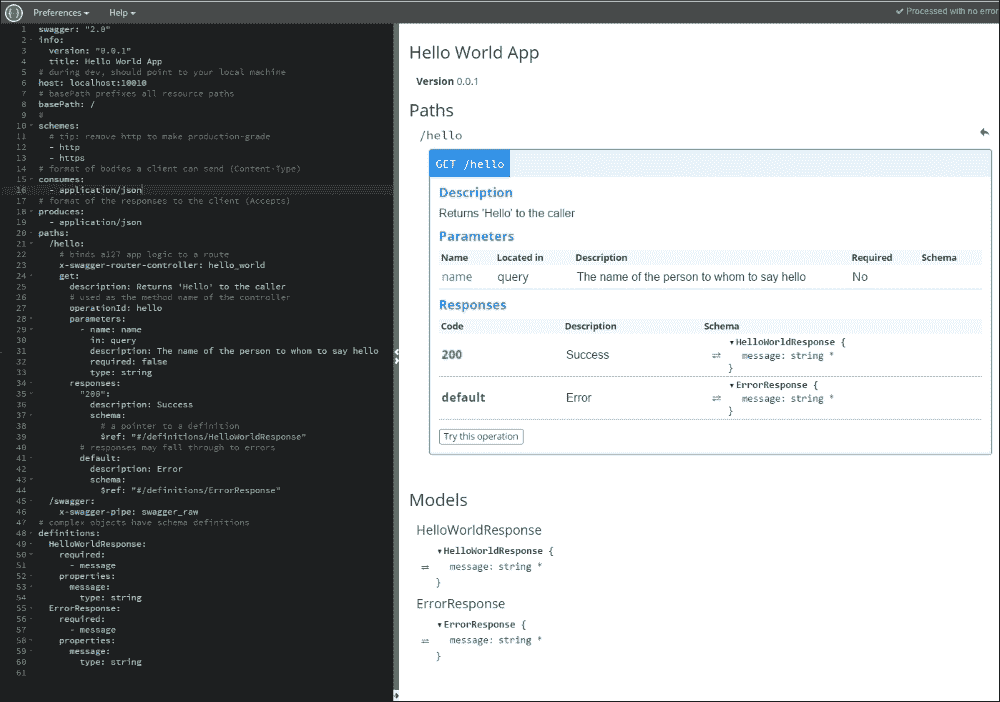

Swagger 使用了**Yet Another Markup Language**(**YAML**)。 它是一种非常类似于**JSON**的语言，但具有不同的语法。

在这个文档中，我们可以定制很多东西，比如路径(应用程序中的路由)。 让我们来看看 Swagger 生成的路径:

```js
/hello:
  # binds a127 app logic to a route
  x-swagger-router-controller: hello_world
  get:
    description: Returns 'Hello' to the caller
    # used as the method name of the controller
    operationId: hello
    parameters:
      - name: name
        in: query
        description: The name of the person to whom to say hello
        required: false
        type: string
    responses:
      "200":
        description: Success
        schema:
          # a pointer to a definition
          $ref: "#/definitions/HelloWorldResponse"
      # responses may fall through to errors
      default:
        description: Error
        schema:
          $ref: "#/definitions/ErrorResponse"
```

定义是自我记录的。 基本上，我们将以声明的方式配置端点使用的参数。 该端点将传入的操作映射到`hello_world`控制器中，特别是映射到`hello`方法中，该方法由`id`操作定义。 让我们看看 Swagger 在这个控制器中为我们生成了什么:

```js
'use strict';

var util = require('util');

module.exports = {
  hello: hello
};

function hello(req, res) {
  var name = req.swagger.params.name.value || 'stranger';
  var hello = util.format('Hello, %s!', name);
  res.json(hello);
}
```

该代码可以在项目的`api/controllers`文件夹中找到。 如您所见，它是一个打包为模块的相当标准的 Express 控制器(内聚良好)。 唯一奇怪的一行是`hello`函数中的第一行，在这里我们从 Swagger 获取参数。 一旦我们运行了这个项目，我们将在稍后回来讨论这个问题。

端点的第二部分是响应。 如我们所见，我们引用了两个定义:`HelloWorldResponse`用于`http code 200`，`ErrorResponse`用于其余代码。 这些对象在以下代码中定义:

```js
definitions:
  HelloWorldResponse:
    required:
      - message
    properties:
      message:
        type: string
  ErrorResponse:
    required:
      - message
    properties:
      message:
        type: string
```

这是很有趣的,虽然我们使用的是动态语言,定义的合同正在昂首阔步,这样我们有一个语言无关的定义,可以使用许多不同的技术,尊重技术的原则异质性,我们谈论的是早些时候[第一章](1.html "Chapter 1. Microservices Architecture"), *微服务架构*，[第二章](2.html "Chapter 2. Microservices in Node.js – Seneca and PM2 Alternatives")，*Node.js - Seneca 中的微服务和 PM2 替代*。

在解释了定义是如何工作的之后，是时候启动服务器了:

```js
swagger project start

```

这应该会产生一个非常类似以下代码的输出:

```js
Starting: C:\my-project\app.js...
 project started here: http://localhost:10010/
 project will restart on changes.
 to restart at any time, enter `rs`
try this:
curl http://127.0.0.1:10010/hello?name=Scott

```

现在，如果我们遵循输出的指令并执行 curl 命令，我们将得到以下输出:

```js
curl http://127.0.0.1:10010/hello?name=David
"Hello David!"

```

Swagger 将`name`查询参数绑定到 YAML 定义中指定的 Swagger 参数。 这听起来可能很糟糕，因为我们将软件耦合到 Swagger，但它给您带来了巨大的好处:Swagger 允许您通过编辑器测试端点。 让我们看看它是如何工作的。

在编辑器的右侧，您可以看到一个带有**尝试此操作**标签的按钮，如下截图所示:

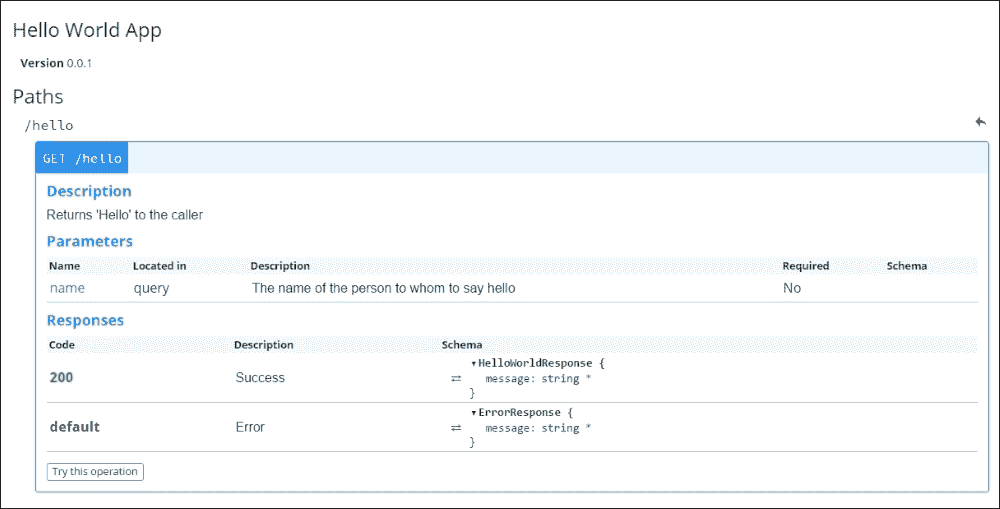

一旦你点击它，它将显示一个表单，允许你测试端点，如下截图所示:


在这个表单上有一个关于跨源请求的警告信息。 当我们在本地机器上进行开发时，我们不需要担心这个问题; 然而，在使用 Swagger Editor 测试其他主机时，我们可能会遇到问题。

### 注意事项

欲了解更多信息，请访问以下网址:

[https://en.wikipedia.org/wiki/Cross-origin_resource_sharing](https://en.wikipedia.org/wiki/Cross-origin_resource_sharing)

为**name**参数输入一个值，然后单击**发送请求**，如下图所示:

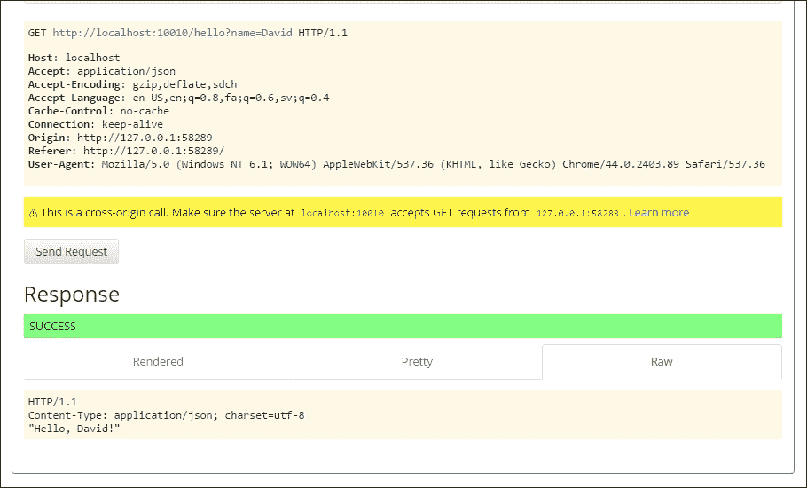

这是一个使用 Swagger Editor 测试端点的响应示例

请注意，为了让这个测试工作，我们的应用服务器必须启动并运行。

## 根据 Swagger 定义生成一个项目

到目前为止，我们一直在玩 Swagger 和生成的项目，但我们现在要从`swagger.yaml`文件生成项目。 我们将使用已经生成的项目作为起点，但我们将添加一个新的端点:

```js
swagger: "2.0"
info:
  version: "0.0.1"
  title: Stop Words Filtering App
host: localhost:8000
basePath: /
schemes:
  - http
  - https
consumes:
  - application/json
produces:
  - application/json
paths:
  /stop-words:
    x-swagger-router-controller: stop_words
    get:
      description: Removes the stop words from an arbitrary input text.
      operationId: stopwords
      parameters:
        - name: text
          in: query
          description: The text to be sanitized
          required: false
          type: string
      responses:
        "200":
          description: Success
          schema:
            $ref: "#/definitions/StopWordsResponse"
  /swagger:
    x-swagger-pipe: swagger_raw
definitions:
  StopWordsResponse:
    required:
      - message
    properties:
      message:
        type: string
```

端点您可能听起来很熟悉，因为我们在本章前面对它进行了单元测试。 您现在可能已经知道，Swagger Editor 非常酷:在您输入时，它提供关于 YAML 文件中正在发生什么的反馈，并保存更改。

下一步是从[https://github.com/swagger-api/swagger-codegen](https://github.com/swagger-api/swagger-codegen)下载 Swagger 代码生成器。 它是一个 Java 项目，所以我们需要 Java SDK 和 Maven 来构建它，如下:

```js
mvn package

```

Codegen 是一个工具，它允许我们从 Swagger YAML 中读取 API 定义，并使用我们选择的语言(在本例中是 Node.js)为项目构建基本结构。

项目根目录中的前面的命令应该生成所有子模块。 现在，就像在`swagger-codegen`文件夹的根目录下执行以下命令一样简单:

```js
java -jar modules/swagger-codegen-cli/target/swagger-codegen-cli.jar generate -i my-project.yaml -l nodejs -o my-project

```

Swagger 代码生成器支持多种语言。 这里的诀窍在于，当将它用于微服务时，我们可以定义接口，然后使用最合适的技术来构建我们的服务。

如果你去`my-project`文件夹，你应该在那里找到项目的完整结构，准备开始编码。

# 小结

在本章中，您学习了如何测试和记录微服务。 由于交付新功能的压力，这通常是软件开发中被遗忘的活动，但在我看来，这是一个有风险的决定。 我们必须在过多测试和过少测试之间找到平衡。 通常，我们总是试图为单元、集成和端到端测试找到合适的比例。

您还学习了手动测试以及有效地手动测试我们的软件的工具(总是有手动测试的一部分)。

另一个有趣的地方是文档和 API 管理。 在本例中，我们了解了 Swagger，它可能是导致 Open API 标准创建的最流行的 API 管理器。

如果您想要更深入地了解 API 世界(为了构建实用和高效的 API，还有很多东西需要学习)，您可能应该浏览[http://apigee.com](http://apigee.com)。 Apigee 是一家在构建 API 方面的公司专家，并为开发人员和企业提供可以帮助您构建更好 API 的工具。**************