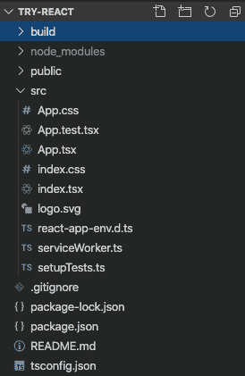
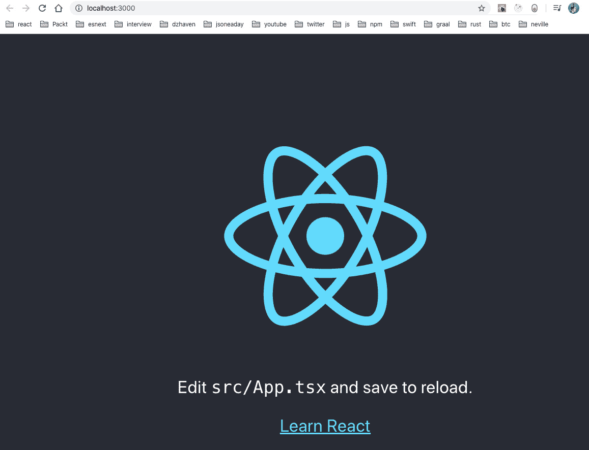
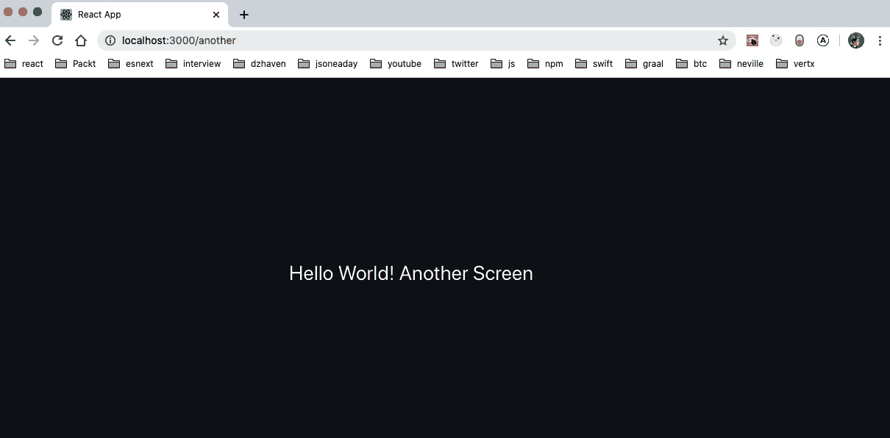
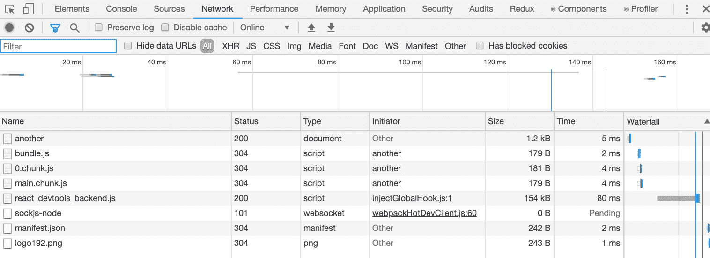

# 四、学习单页应用概念以及 React 如何实现这些概念

在本章中，我们将了解**单页应用**（**SPA**）。这种编程 web 应用的风格在 web 开发历史上相对较新，但近年来受到了强烈的欢迎。它的使用现在是构建大型复杂 web 应用的常见做法，这些应用需要感觉像本机桌面或移动应用。

我们将回顾以前构建 web 应用的方法，以及创建 SPA 风格应用的原因。然后，我们将学习 React 如何帮助我们以高效的方式构建这种风格的应用。

在本章中，我们将介绍以下主要主题：

*   了解网站在过去是如何建立的
*   了解水疗的好处和属性
*   了解 React 如何帮助构建 SPA 应用

# 技术要求

本章的要求与[*第三章*](03.html#_idTextAnchor052)*的要求类似，即构建具有 ES6+功能的更好的应用*。您应该对 JavaScript 以及 HTML 和 CSS 有基本的了解。我们将再次使用 Node.js 和**Visual Studio 代码**（**VSCode**）。

GitHub 存储库再次位于[https://github.com/PacktPublishing/Full-Stack-React-TypeScript-and-Node](https://github.com/PacktPublishing/Full-Stack-React-TypeScript-and-Node) 。使用`Chap4`文件夹中的代码。

要设置本章的代码文件夹，请转到您的`HandsOnTypescript`文件夹并创建一个名为`Chap4`的新文件夹。

# 了解过去网站是如何建立的

在本节中，我们将通过回顾设计和编写网页的原始方法，调查创建 SPA 风格编程的原因。拥有这些知识将有助于我们理解 SPA 的转变。

最初，web 刚起步时，没有 JavaScript 语言。最初，所有这些都只是为了在科学家之间共享文档而创建的静态 HTML 页面。一旦这种文档格式和互联网变得越来越流行，人们意识到这些文档需要改进样式方法来加强交流。因此，CSS 被创建，并成为 HTML 文档样式和布局的标准。最后，Netscape 浏览器公司决定 web 需要一种脚本语言使页面内容更具动态性，于是他们创建了 JavaScript。

尽管有这些特性，最初的 web 在本质上仍然是非常静态的。当您在浏览器中输入 URL 时，您会返回一个文档，即服务器上的实际文件，您输入的每个 URL 都是这样。CSS 和 JavaScript 确实有助于使 web 看起来更好、更具动态性，但它并没有改变 web 以页面为中心的模型。

随着网站变得越来越复杂，许多 web 开发人员希望更好地控制他们的 web 文档。他们希望动态控制网页的布局和内容。这导致创建了**公共网关接口**（**CGI**。CGI 是进行**服务器端渲染**（**SSR**的早期尝试）。这基本上意味着来自浏览器的请求是由 web 服务器接收的，但服务器不会返回静态 HTML 页面，而是运行一个处理器，该处理器将根据参数和逻辑动态生成页面，然后将其发送回。

无论网站使用的是一个静态 HTML 页面，该页面没有改变，还是使用服务器端逻辑在服务器上呈现其页面，在过去，重点是将完整的 HTML 页面作为文件发送给浏览器。这就是网站通常的工作方式。

这种基于单个文件或页面的模式与本机应用在台式机或移动设备上的工作方式完全不同。本机应用模型的不同之处在于，整个应用都是下载并安装到用户设备上的。当用户打开应用时，它就可以在那一刻全部使用了。需要在屏幕上绘制的任何控件都是通过已经存在的代码来完成的，并且不需要对后端服务器进行其他调用（发送或获取数据的调用除外）。这使应用的响应速度明显高于传统 web 应用，传统 web 应用需要不断刷新页面以显示旧模式中的新内容。

SPA 应用的动力是让 web 应用感觉更像本地设备应用，以便让它们具有相同的速度和响应能力。因此，SPA 风格使用各种技术和库使 web 应用运行起来，感觉更像本地应用。

在本节中，我们回顾了网站在 web 早期是如何构建的。当时，重点是生成和服务单个 HTML 文档文件。我们看到了这种编程风格的局限性，特别是与本机应用相比，SPA 风格的应用试图解决这些局限性，使 web 应用看起来像本机应用。在下一节中，您将看到什么是 SPA 应用，以及它们如何改进原始 web 的以页面为中心的模型。

# 了解水疗的好处和属性

在本节中，我们将了解 SPA 应用的好处和属性。通过了解这些属性，它们将帮助我们了解 React 创建过程中做出的一些架构决策，以及创建 React 应用时使用的一些相关库和组件。

如前所述，使用 SPA 风格的应用构建的动力是使我们的 web 应用看起来和感觉更像本地应用。通过使用 SPA 应用方法，我们将使我们的程序做出响应，看起来就像是安装在设备上一样。经典风格的 web 应用可能看起来很迟钝，因为对页面的任何更改都需要回拨服务器以获得新屏幕。但是，SPA 风格的应用会立即重新绘制屏幕的部分，而无需等待服务器返回新文件。因此，就用户所知，SPA 应用是本机设备应用。

构建 SPA 应用相当复杂，需要使用许多组件和库。然而，无论我们使用的是 Angular、Vue、React 还是其他框架，都有一些特定的特性和要求，这些特性和要求在 SPA 应用中总是很常见的。

让我们了解一些要求：

*   顾名思义，整个应用只存在于一个 HTML 页面上。与标准 HTML 应用不同，标准 HTML 应用使用单独的页面来显示不同的屏幕，第一个页面是 SPA 应用上加载的唯一页面。
*   JavaScript 动态呈现屏幕，而不是静态 HTML 文件。因此，第一次下载的 HTML 页面实际上几乎完全没有内容。但它将拥有 body 标记中的一个根元素，该元素将成为整个应用的容器，在用户与应用交互时再次呈现为活动的。
*   当检索主 HTML 文件时，运行应用所需的所有脚本和文件通常在开始时下载。然而，这种方法正在改变，越来越多的应用只下载一个基本级别的脚本文件，然后根据需要下载其他脚本。稍后我们将回顾如何使用这些技术，因为它们可以通过减少屏幕等待时间来增强用户体验。
*   对于 SPA，URL 路由的处理方式不同。在 SPA 应用中，根据您选择的框架，有一些机制用于创建**虚拟路由**。虚拟路由仅仅意味着，尽管用户似乎对不同的服务器端 URL 进行了不同的调用，但实际上，所有的“路由”只发生在客户端浏览器上，以便对不同的屏幕进行逻辑转换。换句话说，不会调用服务器，URL 路由成为将应用逻辑分隔为不同屏幕的一种方法。例如，当用户在其浏览器中键入 URL 时，他们必须按下*Enter*将提交内容发布回作为 URL 目标的服务器。但是，在 SPA 应用中发生路由的情况下，URL 没有指示实际的服务器路径。它不存在。因此，不会触发回发。相反，应用使用 URL 作为应用部分的一种容器，并在给定特定 URL 时触发特定行为。尽管如此，URL 路由仍然是一个有用的功能，因为路由是大多数用户所期望的功能，它允许他们为屏幕添加书签。

在本节中，我们了解了组成 SPA 的属性。我们介绍了处理整个应用只有一个文件的不同方法，以及用于构建此类应用的方法。在下一节中，我们将深入了解 React 如何启用 SPA 以及 React 团队为创建这种风格的应用所做的决策。

# 了解 React 如何帮助建立水疗中心

在本节中，我们将学习如何在高水平上做出反应。这种理解将帮助我们构建更好的基于 React 的应用，因为我们将了解 React 如何在内部运行。

如前所述，网站主要只是一个 HTML 文件，它是一个基于文本的文档。此文件包含浏览器用于创建名为**文档对象模型**（**DOM**的逻辑树的代码。此树根据文件中的所有 HTML 元素的顺序以及相对于结构中其他元素的顺序来表示这些元素。无论是否使用 SPA 样式，所有网站的页面上都有 DOM 结构。然而，React 以独特的方式利用 DOM 来帮助构建应用。

React 有两个主要结构：

*   React 在运行时维护自己的虚拟 DOM。此虚拟 DOM 不同于浏览器的 DOM。它是 React 自己独特的 DOM 副本，它根据代码中的指令创建和维护。根据 React 服务在内部执行的协调过程，根据需要创建和编辑此虚拟 DOM。协调过程是一个比较过程，React 查看浏览器 DOM 并将其与自己的虚拟 DOM 进行对比。此对账过程为一般称为**渲染阶段**。例如，当发现差异时，虚拟 DOM 包含浏览器中不包含的元素。DOM 将向浏览器 DOM 发送指令以创建该元素，以便浏览器 DOM 和虚拟 DOM 匹配。添加、编辑或删除元素的过程称为**提交阶段**。
*   React 开发的另一个主要属性是它是状态驱动的。在 React 中，应用由许多组件组成，每个组件中都可能有一些局部状态（即数据）。如果此数据因任何原因发生更改，React 将触发其协调过程，并在需要时在 DOM 中进行更改。

为了使这些概念更具体，我们应该看一个简单 React 应用的示例。但在此之前，让我们回顾一下 React 应用是由什么组成的

## React 应用的属性

在其核心，现代 React 应用需要一些基本功能才能正常工作。我们需要`npm`来帮助我们管理应用的依赖关系。正如您在前面的练习中所看到的，`npm`是一个存储库，允许我们从中央存储下载开源依赖项，并在应用中使用它们。我们还需要一个工具来完成所谓的捆绑。捆绑系统是一种服务，它将所有脚本文件和资产（如 CSS 文件）聚合在一起，并将它们缩小为一组文件。缩小过程从脚本中删除空白和其他不需要的文本，以便最终下载到用户浏览器上的文件尽可能小。这种较小的负载大小可以缩短应用启动时间并改善用户体验。我们将使用的捆绑系统称为 webpack，之所以选择它，是因为它是捆绑 React 应用的行业标准。此外，我们可以使用`npm`的内置脚本系统，创建脚本来自动化我们的一些工作。例如，我们可以创建脚本来启动测试服务器、运行测试并构建应用的最终生产版本。

如果我们使用`create-react-app``npm`包，我们可以获得前面提到的所有依赖项，以及进行 React 开发的常见依赖项和一些内置脚本来管理我们的应用。让我们使用此软件包创建我们的第一个应用：

1.  On your terminal or command line, go to the `HandsOnTypescript/Chap4` folder and run the following command:

    ```js
    npx create-react-app try-react -–template typescript
    ```

    我们使用的是`npx`，而不是`npm i -g`，这样就不必在本地安装`create-react-app`。

2.  此命令完成后，打开 VSCode 并打开新创建的文件夹`try-react`，这是我们在本章开头创建的。
3.  Open the terminal in VSCode and run the following command:

    ```js
    npm run build
    ```

    此命令将创建我们应用的生产版本，并将其放入名为`build`的文件夹中。构建完成后，您应该可以从 VSCode 中看到以下结构：



图 4.1–尝试反应

让我们看一下 To.T0p 给我们的，从顶部开始：

*   `build`文件夹是我们所有捆绑和缩小的最终生产文件的目的地。它们已缩小到尽可能小，并且还删除了调试信息以提高性能。
*   接下来，我们有`node_modules`文件夹，其中包含我们从`npm`存储库下载的所有依赖项。
*   然后，我们有`public`文件夹，这是一个静态资产的文件夹，比如`index.html`文件，它将用于构建我们的最终应用。
*   接下来，我们有一个可能是最重要的文件夹，名为`src`。顾名思义，这是包含所有源脚本的文件夹。任何带有`.tsx`扩展名的文件都表示 React 组件。`.ts`文件只是普通类型的脚本文件。最后，`.css`文件具有我们的样式属性（可以有多个）。`d.ts`文件是包含类型脚本类型信息的文件，编译器使用这些信息来确定需要执行的静态类型检查。
*   接下来是`.gitignore`文件。此文件与我们用来保存本书源代码的 GitHub 代码存储库一起使用。顾名思义，对于这个文件，我们告诉我们的`git`系统不要上传某些文件和文件夹，而是忽略它们。
*   `package.json`和`package-lock.json`文件用于配置和设置依赖项。此外，它们还可以存储构建、测试和运行脚本的配置，以及 Jest 测试框架的配置。
*   最后，我们有我们的`tsconfig.json`文件，我们在[*第 2 章*](02.html#_idTextAnchor025)*探索类型脚本*中讨论过。它将配置 TypeScript 编译器。请注意，默认情况下，严格模式处于打开状态，因此我们不能使用隐式[T1]或[T2]。

现在我们已经完成了这个项目的快速清单，让我们看看我们的一些文件的内容。首先，我们从`package.json`文件开始。`package.json`文件有很多部分，但让我们看看其中一些最重要的部分：

*   `dependencies`部分包含我们的应用将用于某些功能的库。这些依赖项包括 React，以及用于进行测试的 TypeScript 和 Jest 库。`@types`依赖项包含类型脚本定义文件。TypeScript 定义文件存储用 JavaScript 编写的框架的静态类型信息。换句话说，这个文件告诉 TypeScript 编译器框架使用的类型的形状，以便可以进行类型声明和检查。
*   还有另一个依赖项部分，称为`devDependencies`——尽管这里没有使用它，它通常存储开发时依赖项（与`dependencies`部分相反，它通常只存储运行时依赖项）。无论出于何种原因，React 团队决定将两者合并为`dependencies`。话虽如此，您应该意识到这一点，因为您将在许多项目中看到这一部分。
*   脚本部分用于存储管理应用的脚本。例如，`start`脚本通过调用`npm run start`或简称`npm start`来使用。此脚本用于使用开发服务器启动应用。我们还可以添加自己的脚本，稍后我们将这样做，用于执行诸如将生产文件部署到服务器之类的操作。

请注意，`create-react-app`创建的项目已被 React 团队高度修改。团队已经对它们进行了优化，并隐藏了不易看到的脚本和配置，例如基本网页包配置和脚本。如果您感到好奇，可以运行`npm run eject`查看所有这些配置和脚本。但是，请注意，这是不可逆的。因此，您将无法撤消它。我们不会使用弹出的项目，因为这样做没有什么好处。

现在，让我们看一些脚本。从`src`文件夹中打开`index.tsx`文件，您将看到以下内容：

```js
import React from 'react';
import ReactDOM from 'react-dom';
import './index.css';
import App from './App';
import * as serviceWorker from './serviceWorker';
ReactDOM.render(
  <React.StrictMode>
    <App />
  </React.StrictMode>,
  document.getElementById('root')
);
// If you want your app to work offline and load faster, you 
   // can change
// unregister() to register() below. Note this comes with some 
 // pitfalls.
// Learn more about service workers: https://bit.ly/CRA-PWA
serviceWorker.unregister();
```

服务人员

服务工作者是在 JavaScript 中执行简单线程的一种方法。我们将不使用此功能，但它是`create-react-app`项目的一部分，因此为了完整起见，我将其保留。

同样，任何包含返回 JSX 的 React 组件的文件都将具有`.tsx`文件扩展名。我们从这个文件开始，因为这是 React 应用的入口点。它是 React 开始其运行时构建过程的地方。现在，如果我们从顶部开始，我们可以看到正在使用用于导入依赖项的 ES6 语法。React 和相关模块正在导入，包括核心`App`模块，我们将很快进行探索。导入之后，我们可以看到调用了`ReactDOM.render`，它最终“写出”了我们所有组件组合的 HTML。这需要两个论点。一个是从中开始渲染的最低级别的 React 组件，另一个是用于包含渲染内容的 HTML 元素。如您所见，`App`组件由一个名为`React.StrictMode`的组件包装。这一部分只是对发展的援助。在生产模式下编译时，它没有效果，也不会影响性能。然而，在开发模式中，它提供了关于代码中潜在问题的额外信息。这可能会随着时间的推移而改变，但以下是它提供的当前帮助的列表：

*   识别具有不安全生命周期的组件：它将显示您是否正在使用不安全生命周期调用，例如[T0]、[T1]和[T2]。当使用挂钩编码时，这些问题并不适用，但是对于基于遗留类的组件，了解这些问题是很好的。
*   关于遗留字符串引用 API 的警告：创建对 HTML 元素的引用的较旧方法是使用字符串，例如[T0]，而不是 React 组件。由于此方法使用字符串，因此存在问题，现在首选的方法是使用`React.createRef`。我们将在后面的章节中讨论为什么可以使用 ref。
*   关于已弃用的`findDOMNode`用法的警告：`findDOMNode`现在已弃用，因为它破坏了抽象原则。具体来说，它允许组件树中的父组件为特定的子组件编码。这种与代码实现的结合意味着以后很难更改代码，因为父级现在依赖于其组件树中存在的某些内容。我们在[*第 2 章*](02.html#_idTextAnchor025)*探索类型脚本*中讨论了面向对象编程原理，包括抽象。
*   检测意外的副作用：副作用是我们代码的意外后果。例如，如果我的类组件从其他函数或属性初始化其在构造函数中的状态，则如果该状态有时在每次初始化时接收到不同的值，则不可接受。为了帮助捕获此类问题，`React.StrictMode`将运行某些生命周期调用，例如，构造函数或`getDerivedStateFromProps`两次，以尝试显示是否正在发生此类事件。请注意，这只发生在开发过程中。
*   检测遗留上下文 API：上下文 API 是一种 React 功能，它跨应用的所有组件提供全局状态。API 有一个较新的版本，而旧版本现在已被弃用。这将检查您是否正在使用旧版本。

正在进行的大多数检查都是围绕旧的基于类的组件样式进行的。但是，由于您可能必须维护的绝大多数现有代码仍然是使用类的旧样式编写的，因此了解这一点仍然很重要。

接下来我们来看一下文件：

```js
import React from 'react';
import logo from './logo.svg';
import './App.css';
function App() {
  return (
    <div className="App">
      <header className="App-header">
        
        <p>
          Edit <code>src/App.tsx</code> and save to reload.
        </p>
        <a
          className="App-link"
          href="https://reactjs.org"
          target="_blank"
          rel="noopener noreferrer"
        >
          Learn React
        </a>
      </header>
    </div>
  );
}
export default App;
```

重要提示

请注意，这里显示的 JSX 语法实际上不是 HTML。它是自定义 JavaScript。因此，每当与 JavaScript 关键字存在潜在冲突时，React 都会使用另一个名称。例如，`class`是 JavaScript 中的保留关键字。因此，React 使用`className`来表示 CSS 类。

尽管`index.tsx`文件是 React 的主要起点，但我们将为我们的应用构建的实际组件从`App.tsx`文件开始。所以，这对我们来说是一个非常重要的文件。

让我们讨论一下这段代码中的一些项目：

*   首先，我们从 React`npm`依赖项导入 React。如果你查看`npm_modules`文件夹的内部，你会发现一个名为`react`的子文件夹，这个文件夹就是`import`语句所指的文件夹。我们没有自己创建的任何代码导入都将位于`node_modules`文件夹中。
*   接下来是`logo`导入。在本例中，图像资产被导入到 JavaScript 变量中，`logo`变量。此外，正如您所看到的，由于这不是一个`npm`模块，它需要一个点引用。`npm`模块不需要相对路径，因为系统知道要开始查找哪个文件夹`npm_modules`。
*   接下来，我们导入`App.css`。此文件是样式文件，因此没有关联的 JavaScript 变量。因为它不是一个`npm`包，所以它还需要一个相对路径。
*   `App`组件是一个功能组件，如其语法所示。`App`组件是整个应用的根父组件。该组件没有自己的状态，只是呈现内容。所以，`return`语句就是呈现的内容，它使用的是**JSX**。
*   在后面的章节中，我们将更详细地介绍 JSX 是什么；然而，目前，JSX 是用 JavaScript 编写的类似 HTML 的语法。它是由 React 团队创建的，目的是使使用 React 组件创建 HTML 内容更容易、更清晰。需要注意的主要问题是，尽管它看起来与 HTML 几乎相同，但它不是真正的 HTML，因此在工作方式上存在一些差异。
*   CSS 类的样式引用通常设置为`class`，设置为`className`，如代码所示。这是因为`class`是一个 JavaScript 关键字，因此不能在此处使用。
*   弯曲的括号表示正在传递代码，而不是字符串。例如，`img`标记的`src`属性将 JavaScript 变量`logo`作为其值，并且该值位于弯曲的括号内。要传递字符串，请使用引号。

让我们以开发模式启动我们的应用，看看这个基本屏幕是什么样子。运行以下命令：

```js
npm start
```

运行上一个命令后，应在浏览器中看到以下屏幕：



图 4.2–应用启动

如您所见，我们的`App.tsx`文件中的文本和徽标正在显示，因为这是我们应用的主要启动组件。一旦我们开始编码，我们将保持服务器运行，当我们保存任何脚本文件时，页面将自动更新，允许我们实时查看更改。

为了更好地了解在 React 中构建组件以及 React 路由的工作原理，让我们创建第一个简单组件：

1.  在名为`Home.tsx`的`src`文件夹中创建一个新文件，并添加以下代码：

    ```js
    import React, { FC } from "react";
    const Home: FC = () => {
      return <div>Hello World! Home</div>;
    };
    export default Home;
    ```

2.  现在，正如您所看到的，我们正在创建一个名为`Home`的组件，它返回一个带有单词`Hello World!`的`div`标记。您还应该注意到，我们正在使用`FC`、功能组件、声明来键入我们的组件。与旧的类样式相反，功能组件是使用 React 挂钩创建组件的唯一方法。这是因为 React 团队认为，组合作为代码重用的一种手段比继承更有效。但是请注意，无论采用何种方法，代码重用的重要性仍然存在。
3.  Now, in order to get our component to show on the screen, we need to add it to our `App.tsx` file. But let's also add routing to our app and explore that as well. First, update the `index.tsx` file like this:

    ```js
    import React from 'react';
    import ReactDOM from 'react-dom';
    import './index.css';
    import App from './App';
    import * as serviceWorker from './serviceWorker';
    import { BrowserRouter } from "react-router-dom";
    ReactDOM.render(
      <React.StrictMode>
        <BrowserRouter>
        <App />
        </BrowserRouter>
      </React.StrictMode>,
      document.getElementById('root')
    );
    // If you want your app to work offline and load faster, 
      // you can change
    // unregister() to register() below. Note this comes with
      // some pitfalls.
    // Learn more about service workers: 
       // https://bit.ly/CRA-PWA
    serviceWorker.unregister();
    ```

    `index.tsx`文件现在有一个名为`BrowserRouter`的组件。此组件是 React Router 的一部分，是允许跨应用进行路由的基本组件。由于它包装了我们的`App`组件，并且应用的其余部分都在这个`App`组件中，这意味着正在为整个应用提供路由服务。

4.  因为我们将使用 React 路由，所以我们还将为第二条路由创建一个组件，名为`AnotherScreen`：

    ```js
    import React, { FC } from "react";
    const AnotherScreen: FC = () => {
      return <div>Hello World! Another Screen</div>;
    };
    export default AnotherScreen;
    ```

5.  Now, update the `App.tsx` file like this:

    ```js
    import React from "react";
    import "./App.css";
    import Home from "./Home";
    import AnotherScreen from './AnotherScreen';
    import { Switch, Route } from "react-router";
    function App() {
      return (
        <div className="App">
          <header className="App-header">
            <Switch>
     <Route exact={true} path="/"            component={Home}></Route>
     <Route path="/another"             component={AnotherScreen}></Route>
     </Switch>
          </header>
        </div>
      );
    }
    export default App;
    ```

    如您所见，标题内容已被替换。在这个文件中，您可以看到在标记中，有一个名为`Switch`的组件。这个组件的作用非常类似于 switch 语句。它告诉 React Router 在给定某个路由（URL 路径）时显示哪个组件。在`Switch`组件内部，我们可以看到两个`Route`组件。第一个是默认根路由，`path`等于`"/"`。对于此路由，React Router 将显示`Home`组件（请注意，使用`exact`仅意味着 URL 应完全匹配）。第二条路线是`"/another"`路径。因此，当此路径位于 URL 框中时，`AnotherScreen`组件将被加载。

6.  If you left `npm start` running, you should see **Hello World!** Home, as follows:

    

    图 4.3–主页

7.  如果您查看 URL，您可以看到它位于站点的根目录上。让我们尝试将 URL 切换到`http://localhost:3000/another`：



图 4.4–另一个屏幕

正如您所看到的，它加载了`AnotherScreen`组件，按照我们的指示加载该特定 URL 的组件。

此外，如果打开 Chrome 浏览器调试器，您将看到实际上没有对该特定路径进行网络调用。再次确认 React Router 没有对这些路径进行任何回发，它们只存在于浏览器本地：



图 4.5–Chrome 调试 ger

这只是构建 React 应用和组件的一个快速示例，目的是让我们开始。

在本节中，我们学习了 React 如何在内部工作以及如何设置 React 项目。当我们开始构建应用时，这些知识将在接下来的章节中很有价值。

# 总结

在本章中，我们了解了网站是如何在 web 的早期建立的。我们还了解了旧式 web 开发的一些局限性，以及 SPA 应用如何试图克服这些局限性。我们了解了 SPA 应用的主要驱动因素是如何使 web 应用的行为更像本地应用。最后，我们介绍了 React 开发和构建组件。

在下一章中，我们将以这些知识为基础，更深入地讨论 React 组件的构建。我们将研究基于类的组件，并将它们与较新的挂钩样式组件进行比较和对比。到目前为止，我们所学到的关于 web 开发和基于 React 的 web 开发的知识将帮助我们更好地理解下一章。