# 十七、将应用部署到 AWS

应用一旦完成，必须先部署，然后才能使用。我们有很多选择，包括使用我们自己的基础设施。然而，如今，大多数公司更喜欢使用云提供商的服务，以减少与 IT 相关的支出。

在本章中，我们将学习如何将应用部署到**Amazon Web 服务。**（**AWS**当然是云提供商的标准。我们将在 Linux 虚拟机上设置应用服务 Redis、Postgres 和 NGINX。

在本章中，我们将介绍以下主要主题：

*   在 AWS 云上设置 Ubuntu Linux
*   在 Ubuntu 上设置 Redis、Postgres 和 Node
*   在 NGINX 上设置和部署我们的应用

# 技术要求

您现在应该对 web 技术有了扎实的了解。虽然成为一名高级开发人员可能需要几年时间，但您现在应该对 TypeScript、JavaScript、React、Express 和 GraphQL 感到满意。在本章中，我们将再次使用 Node 和 VisualStudio 代码。

GitHub 存储库在[上再次可用 https://github.com/PacktPublishing/Full-Stack-React-TypeScript-and-Node](https://github.com/PacktPublishing/Full-Stack-React-TypeScript-and-Node) 。使用`Chap17`文件夹中的代码。

让我们在开发机器上进行一些基本设置：

1.  创建一个`Chap17`文件夹，然后从`Chap15`文件夹的源代码中复制`super-forum-server`和`super-forum-client`文件夹。
2.  如果`node_modules`和`package-lock.json`被复制，则删除这些文件夹和文件。
3.  现在，终端进入`Chap17/super-forum-server`文件夹并运行以下命令：

    ```js
    npm install
    ```

4.  现在，终端进入`Chap17/super-forum-client`文件夹并运行以下命令：

    ```js
    npm install
    ```

# 在 AWS 云上设置 Ubuntu Linux

在本节中，我们将学习如何在 AWS 虚拟机上选择和设置 Ubuntu Linux 服务器。我假设您已经知道如何创建 AWS 帐户。这个过程相当简单，因为现有的 Ubuntu Linux 映像已经可以使用了。让我们开始：

1.  After we log in, the screenshot shown here will be the current AWS portal. Note that these screens change frequently, so your view may be different:

    

    图 17.1–AWS 门户主页

2.  We can see the **Launch a virtual machine** link. Select it and you will get to this next screen:

    

    图 17.2–初始虚拟机屏幕

    让我们为**Ubuntu 20.04 LTS**选择图像。这是 Ubuntu 的最新**长期支持**版本。

3.  Once selected, you should see the following screen:

    

    图 17.3–VM 实例类型选择器

    我已经提前选择了一个较低端的图像，带有 1 个 vCPU 和 2 GB 内存。请注意，EBS 是 AWS 特定的存储性能优化。

    让我们保持默认设置，让事情变得简单，选择后选择屏幕底部的**查看并启动**按钮。

4.  Here are the major details of what I have selected:

    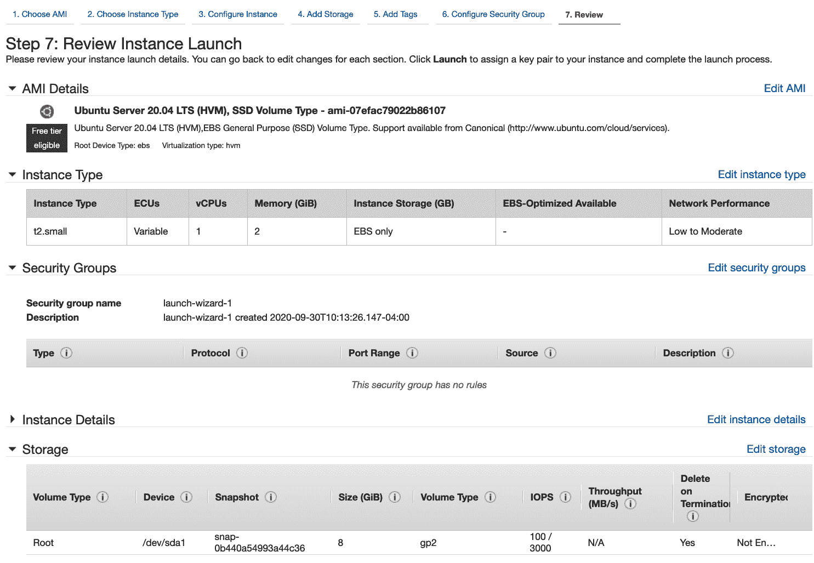

    图 17.4–初始配置屏幕

    现在，选择底部的**启动**按钮继续。

5.  Next, you will see the following prompt:

    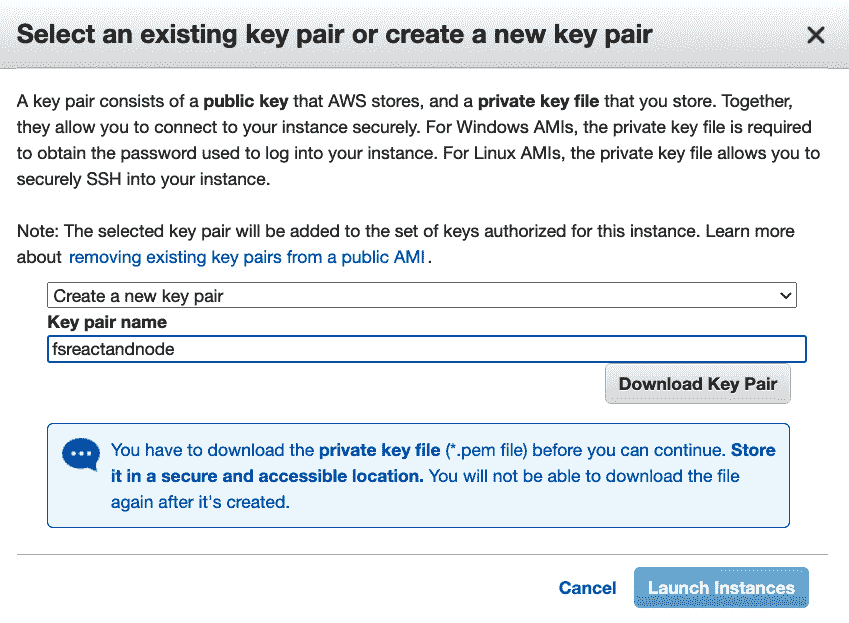

    图 17.5–选择现有密钥对对话框

    此屏幕创建了一组加密密钥，用于 SSH，一个用于您，一个用于 AWS，因此我们可以将远程终端插入 VM。下载这些文件并确保其安全。点击**启动实例**按钮继续。

    警告

    您必须将 pem 文件保存在安全和可访问的地方。您将无法再次下载它。

6.  Once complete, you should see the **Launch Status** screen. Just click on the **View Instances** button at the bottom to continue to the portal:

    

    图 17.6–虚拟机设置完成屏幕

7.  This will be your VM instance portal:

    

    图 17.7–虚拟机门户

8.  Click on **Instance ID** and you will get the **Instance summary** screen:

    

    图 17.8–实例摘要

    您可以快速查看事实，例如正在运行的实例状态、公共 IP 地址和公共 DNS 名称。

9.  Near the top-right corner of this screen, you will see the **Connect** button. Click it to get the **Connect to instance** screen:

    

    连接到屏幕 17.9 的实例

    第一个页签为**EC2 实例连接**，是 AWS 提供给我们的终端。点击**连接**按钮，我们将在浏览器中看到 Ubuntu 服务器的终端，如下所示：

    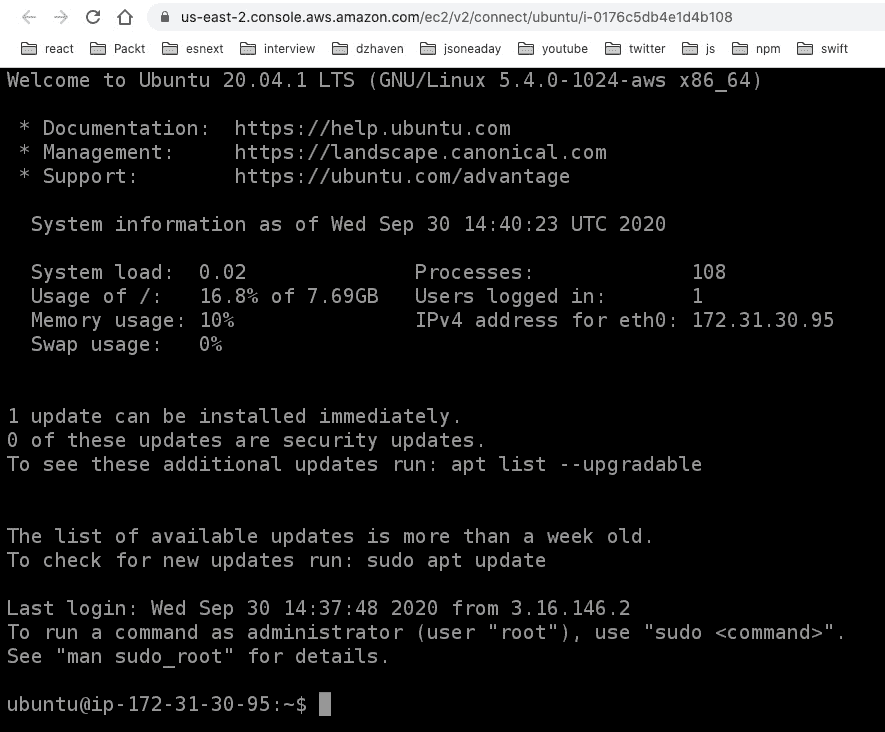

    图 17.10–AWS EC2 实例连接

    这是一个可选接口，如果 SSH 由于某种原因无法工作，我们可以使用它。对于本演示，我将使用 SSH 接口。

10.  Go back to your **Connect to instance** screen and select the third tab, **SSH client**. You should see something like this. Of course, your values will be unique:

    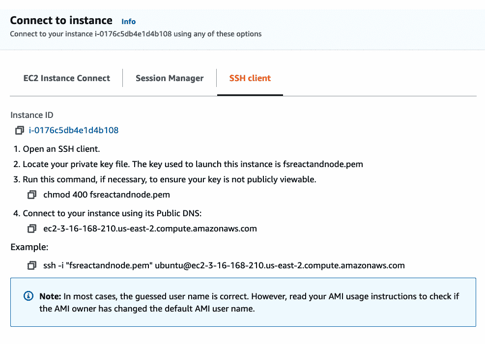

    图 17.11–SSH 操作说明

11.  以下是我如何在自己的终端上运行这些指令的示例：


图 17.12–第一个 SSH 终端

首先，我按照 AWS 的说明更改了我的本地 pem 文件的权限。然后，我运行 SSH，如图所示。注意，我使用了`ubuntu`作为用户名，您的 VM 也应该是相同的，我使用`DNS name`作为我的服务器。

笔记

如果这对您不起作用，请尝试打开您的网络入站规则，使 SSH 成为**源 Anywhere**。如果这也不起作用，您也可以恢复使用 AWS 提供的终端，如前所示。

这就完成了我们的 Ubuntu Linux 设置。接下来让我们安装 Redis。

# 在 Ubuntu 上设置 Redis、Postgres 和 Node

在部分中，我们将我们的主要需求安装到我们的 Linux 服务器上。我们已经在[*第 13 章*](13.html#_idTextAnchor208)*中介绍了 Redis 的设置和配置，*使用 Express 和 Redis*设置会话状态，但是让我们做最后一次，因为我们现在都拥有相同的底层操作系统。*

## 建立 Redis

在本节中，我们将安装我们的 Redis 服务器，并为我们的应用配置它：

1.  On your terminal, log in to the server and run these two commands:

    ```js
    sudo apt update
    sudo apt install redis-server
    ```

    `Apt`是一个用于 Linux 发行版（如 Ubuntu 和 Debian）的软件依赖性打包工具。它与 NPM 大致相当。所以在这里，我们正在更新我们的`apt`到最新版本，然后用它来安装 Redis。

2.  安装完成后，按如下方式打开`redis.conf`文件：

    ```js
    sudo nano /etc/redis/redis.conf
    ```

3.  Find the `requirepass` entry, uncomment it, and then add your own password.

    警告

    源代码文件夹的`super-forum-server/dev-config/.env`文件中`REDIS_PASSWORD`变量的密码必须与您在`redis.conf`文件中输入的密码匹配。我们将在稍后进行部署时将这些文件包括在`dev-config`文件夹中。

4.  接下来，找到`supervised`条目并将其设置为`systemd`的值。这允许 Ubuntu 通过其`init`系统控制 Redis，该系统使用一个名为`systemctl`的命令。现在，保存并退出。
5.  Now, let's restart our Redis server to take the new settings:

    ```js
    sudo systemctl restart redis.service
    ```

    如果要停止服务，可以运行以下命令：

    ```js
    sudo systemctl stop redis.service
    ```

    如果要启动服务，请运行以下命令：

    ```js
    sudo systemctl start redis.service
    ```

6.  If you run this command, it will show whether Redis is running properly:

    ```js
    sudo systemctl status redis
    ```

    您应该看到如下内容：

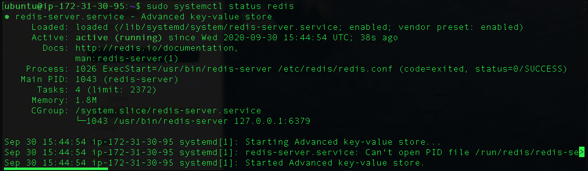

图 17.13–Redis 状态

在本节中，我们将 Redis 安装到 Ubuntu 服务器上，并根据需要启动和停止服务器。我们现在将继续安装 Postgres。

## 设立博士后

现在，让我们为我们的应用安装 Postgres：

1.  我们将再次使用`apt`。运行此命令：

    ```js
    sudo apt install postgresql
    ```

2.  Let's check that it's working by running the command shown in this screenshot:

    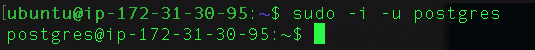

    图 17.14–psql 命令

    命令中显示的`postgres`角色是 Postgres 中默认创建的全局管理员帐户。我们基本上是通过在命令中使用`-i`来让登录的 Linux 帐户暂时充当`postgres`帐户。`-u`表示我们正在使用的角色。

    笔记

    我们不使用`pgAdmin`，因为我们使用`psql`命令-line 工具获得相同的功能，并且使用 AWS 启用`pgAdmin`既麻烦又困难。

3.  So, now we are running as the `postgres@<your ip>` user, as was shown in the screenshot. If we were not running as Postgres, we would need to prefix any Postgres commands with `sudo -u postgres`. But since we are running as the role of Postgres, we can just run the command as shown in *Figure 17.13*.

    `createuser –-interactive`命令根据一系列提示创建新用户。运行此命令并回答提示，如图所示：

    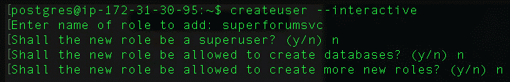

    图 17.15–createuser

    我已将用户名设置为`superforumsvc`。

4.  Now, we'll give our new user a password like this:

    

    图 17.16–设置新用户密码

    首先，我启用命令行工具`psql`。然后我输入一个 SQL 查询来更改`superforumsvc`用户的密码。

    请注意，我在关键字 password 后面剪掉了尾端，它显示了密码是什么，但它应该是这样的单引号，**<您的密码>**。显然，您需要创建自己的密码。

5.  Now, let's create the database for the app. First, exit the `psql` command and then create the database like this:

    ```js
    \q
    createdb -O superforumsvc SuperForum
    ```

    此命令创建数据库并使`superforumsvc`角色成为新数据库的所有者。

6.  现在让我们将`ThreadCategory`默认值添加到数据库中。在`super-forum-server`项目中，您将找到`utils/InsertThreadCategories.txt`文件。这是我们一直在使用的`Categories`。当然，如果您愿意，也可以添加您自己的`Categories`。以下是我尝试插入类别的示例：


图 17.17–插入螺纹类别

正如您所看到的，它最初几次都失败了。那么，让我们深入了解一下。首先，您必须在正确的数据库上。所以，再次使用`\c`来实现这一点。请注意，数据库名称区分大小写。然后，确保表名和字段名周围有双引号。对于`psql`命令行，不要使用**公共**前缀；这只供`pgAdmin`使用。

这就是我们的 Postgres 设置。接下来，让我们设置节点。

## 设置节点

现在我们安装节点：

1.  运行以下命令：

    ```js
    sudo apt install nodejs 
    ```

2.  Now, run this to check and you should see the version number of your Node installation:

    ```js
    node -v
    ```

    您的节点版本应至少为*版本 12 或更高版本。如果没有，则需要运行以下命令：*

    ```js
    curl -sL https://deb.nodesource.com/setup_12.x | sudo -E bash -
    ```

    然后再次运行此命令：

    ```js
    sudo apt install nodejs
    ```

3.  现在，让我们通过运行以下命令来安装 NPM:[T0]
4.  现在我们需要安装一种管理节点服务器的方法，即关闭它并自动重新启动它。因此，我们将使用`pm2`，这是目前最流行的节点管理方式之一。请注意，我们使用`-g`开关全局安装它：

    ```js
    sudo npm install -g pm2
    ```

在本节中，我们回顾了如何设置核心服务依赖项：Redis、Postgres 和 Node。我们现在已经准备好开始使用 NGINX 设置实际的服务器。

# 在 NGINX 上设置和部署我们的应用

在本节中，我们将安装并配置我们的应用以使用 NGINX。NGINX 是非常流行的高性能 web 服务器、反向代理和负载均衡器。它因其强大的性能和处理使用多台服务器的站点的不同配置的能力而备受推崇。

我们将使用它为两个站点提供服务。一个将服务于我们的 React 客户端，另一个将服务于我们的 GraphQL Express 服务器。我们所有的站点流量将首先进入 NGINX，然后将这些请求重定向到应用的适当部分。让我们从安装 NGINX 开始：

1.  SSH 进入您的服务器，如前面在 AWS 云上*设置 Ubuntu Linux*部分中所示，并运行以下命令来安装 NGINX:

    ```js
    sudo apt update
    sudo apt install nginx
    ```

2.  Now that NGINX is installed, let's create a folder to store our server files:

    ```js
    sudo mkdir /var/www/superforum
    sudo mkdir /var/www/superforum/server
    ```

    顾名思义，`/var/www`目录是 web 文件的默认位置。

## 设置超级论坛服务器

在本节中，我们将为服务器代码创建构建和部署过程。有一个标准化的部署流程是很好的，这样您的部署是一致和可靠的：

1.  Before we can start copying our files, we need to do some basic setup and a build of our server project. Open the `super-forum-server` project in VSCode. If you look at the `package.json` file's scripts section, you will see that we have a new script called `build`. This will compile our server code and package it appropriately for distribution into the `dist` folder. Now, in order to get this command to work, we will need to install some NPM packages globally first. Run the following command on your developer machine, *not the Ubuntu server*:

    ```js
    sudo npm i -g del-cli cpy-cli
    ```

    `del-cli`包是一个通用命令行`delete`命令。这意味着，无论您的开发机器是 Linux、Mac 还是 Windows，此命令的工作方式都是相同的。类似地，`cpy-cli`包允许文件和文件夹的通用复制。我们使用这些命令，这样我们就可以有一个 NPM 脚本命令，它在所有开发人员操作系统中都可以工作。

    让我们解释一下这个脚本。构建脚本首先删除`dist`文件夹，以便我们每次都重新开始。然后将`dev-config`的内容复制到`dist`中，并将`.env`文件单独复制到`dist`中。最后，它运行 TypeScript 编译器。

    因此，请注意我们还有一个名为`dev-config`的新文件夹。此文件夹将保存与配置相关的文件，这些文件最终将由构建脚本复制到我们的`dist`文件夹中。此文件夹中的文件为`.env`文件，用于全局配置，`ormconfig.js`文件，用于 TypeForm 配置，以及我们的`package.json`文件。

    笔记

    您在`dev-config`文件夹中的`.env`文件必须具有*您的*服务器的工作配置。这包括您正在使用的密码、帐户名和 IP 地址。它们必须根据*您的*配置正确设置。如果您在使服务器正常工作时遇到问题，请首先查看此文件。

2.  Unfortunately, there seems to be some sort of bug with the latest Express NPM packages, so we will need to install one more NPM package dependency. Run this command on your development machine:

    ```js
    npm i -D @types/express-serve-static-core
    ```

    在安装`@types/express`时，实际上已经安装了此依赖项，但我们正在确保最新版本已经存在。如果您想了解有关此错误的更多信息，请参阅此链接：[https://github.com/DefinitelyTyped/DefinitelyTyped/issues/47339](https://github.com/DefinitelyTyped/DefinitelyTyped/issues/47339) 。

3.  Note one thing. In the `super-forum-server/src/index.ts` file, I've added a new function, `loadEnv`, near the top of the file. This file will deal with relative path differences of the `.env` file between your development and server environments, using the Node `__dirname` variable.

    我还调整了`super-forum-server/dev-config/ormconfig.js`文件，以便它使用`__dirname`作为类型化实体的路径。

    警告

    我们已将`ormconfig.js`中的`synchronize`字段设置为`true`。此设置仅适用于开发部署。不要在生产环境中使用此设置，因为它会触发不需要的数据库更改。对于生产，您应该使用一个预先制作好的数据库，然后直接部署它，`synchronize`设置为`false`。

4.  OK. Let's now try running our build script. Run this command on your development machine:

    ```js
    npm run build 
    ```

    运行此操作将创建`dist`文件夹，如以下屏幕截图所示：

    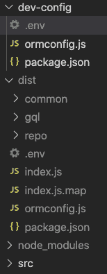

    图 17.18–dist 文件夹

5.  Now, let's try copying our `dist` folder to our server. On the terminal of your development machine, run this command with configurations appropriate to you:

    ```js
    scp -i <your pem path> -r <source folder>/* <username>@<ip>:<dest folder>
    ```

    请注意，在 Windows 上，该命令将使用`pscp`。

    现在，当我在我的机器上运行时，我得到以下结果：

    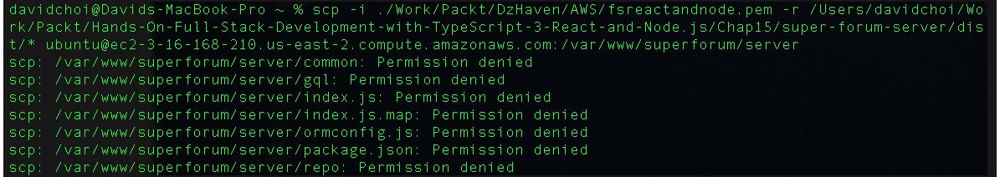

    图 17.19–尝试远程复制失败

    所以，很明显，这是失败的。此故障是由于对 Ubuntu 服务器上的目标文件夹缺乏权限造成的。我们现在来解决这个问题。

6.  Log back in to your Ubuntu SSH session and run the following command:

    ```js
    sudo chmod -R 777 /var/www/superforum/server
    ```

    此命令将临时打开所有访问权限，以便我们可以复制文件。我们将在拷贝发生后关闭备份，以降低安全风险。

7.  Now, copy the files by using the same `scp` command from your development terminal. For example, here's my command, run from my developer machine, after opening permissions:

    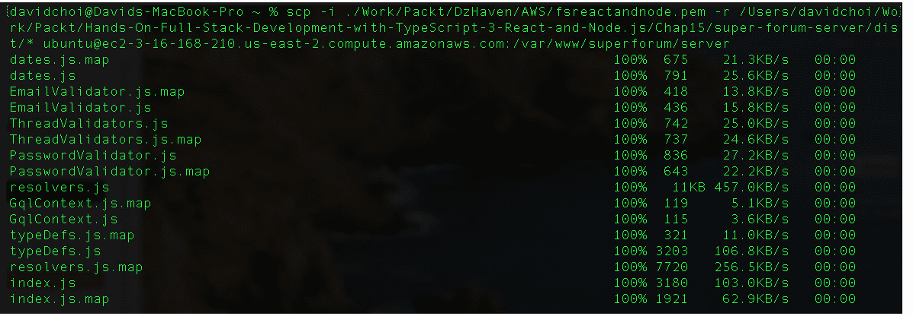

    图 17.20–Scp 副本

8.  Now, check that all the configuration files were copied onto the server by looking in the `server` folder, as follows:

    

    图 17.21–服务器文件夹检查

    如果`.env`文件丢失，必须使用以下命令手动复制。注意，这是 Mac 的一个问题，因为某些原因，`.env`文件不可见：

    ```js
    scp -i <your pem path> <your path>/.env <username><yourserverpath>/.env
    ```

    同样，精确的路径对于您的机器将是不同的。

    现在，我们应该使用以下命令再次关闭权限备份：

    ```js
    sudo chmod -R 755 /var/www/superforum/server
    ```

    此权限授予所有者完全访问权限，但仅授予其他人执行和读取权限。

    笔记

    如果我们掉进了安全优化的兔子洞，我们最终可能会写另一本书。由于这将是一个可能会被丢弃的开发服务器，所以现在让我们关注主要任务。一旦你准备好用你价值数十亿美元的应用投入生产，你就需要在安全方面进行一些尽职调查，或者，更好的是，雇佣至少有 10 年经验的人。

9.  Now, on our SSH terminal session on the Ubuntu server, cd into the `/var/www/superforum/server` folder and then run this command:

    ```js
    npm install 
    ```

    当然，这将为我们的节点应用服务器安装所有依赖项。

10.  Now, we need to set up our `pm2` system so that it will control our Node server. Run this command:

    ```js
    pm2 startup
    ```

    此命令告诉我们当前用户需要的具体设置，以便配置使用`pm2`和`systemd`并在重新启动服务器时启动我们的节点服务器。`Systemd`再次是我们的 Ubuntu 服务控制器。运行该命令后，您应该会看到类似的内容：

    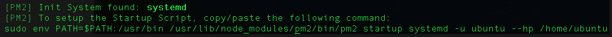

    图 17.22–pm2 启动

11.  So, copy and paste this command starting at `sudo`, and then run it on your SSH session of your Ubuntu server. Once run, you should see something like this:

    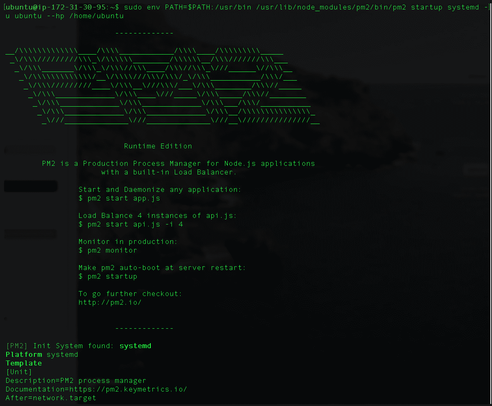

    图 17.23–pm2 启动运行结果

12.  Next, we want to start our Node server as follows:

    

    图 17.24–节点服务器已启动

13.  We can now save this as part of pm2's startup list by running this command:

    ```js
    pm2 save 
    ```

    运行后，您将看到以下内容：

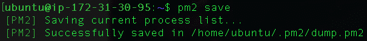

图 17.25–pm2 保存运行

通过执行此保存操作，我们的节点服务器现在将在服务器重新启动时自动启动。

在本节中，我们创建了一个流程来构建、部署和启动节点服务器。配置好这个设置后，我们可以确保在将来更新代码时它是可重复的。

## 建立超级论坛客户端

好的，现在我们必须为我们的客户端项目做一个类似的过程。您应该已经将`super-forum-client`复制到您的`Chap17`文件夹中，因为这是我们在本章开头所做的第一件事：

1.  现在，回到 Ubuntu 服务器上的 SSH 终端会话，为客户端项目创建如下文件夹：

    ```js
    sudo mkdir /var/www/superforum/client
    ```

2.  现在，回到`super-forum-client`项目文件夹中的开发终端，这样我们就可以进行客户端构建和部署。首先，我们需要对我们的项目做一些小的调整。您看到我们的服务器项目使用`.env`文件进行设置。我们不需要任何涉及我们客户项目的东西。但是，我们至少应该能够根据需要设置 GraphQL 服务器 URL，具体取决于部署环境。因此，请执行以下步骤：
    *   Open `index.ts` with VSCode and update the `ApolloClient` code like this:

        ```js
        const client = new ApolloClient({
          uri: process.env.REACT_APP_GQL_URL,
          credentials: "include",
          cache: new InMemoryCache({
            resultCaching: false,
          }),
        });
        ```

        正如您所看到的，我们添加了一个名为`REACT_APP_GQL_URL`的环境变量，就像我们在服务器上所做的一样。但是这个变量是从哪里来的呢？我现在就展示给大家看。

    *   打开`package.json`文件，查看脚本部分。您应该会看到一个名为`build-dev`的新脚本，它设置了`REACT_APP_GQL_URL`变量。您可以根据自己的需要使用不同的变量值随意创建此脚本的多个版本。
3.  So, now let's run the `build-dev` script:

    ```js
    npm run build-dev 
    ```

    客户端项目中的构建脚本已经作为`create-react-app`的一部分为我们创建，但我们通过添加环境变量对其进行了调整。完成后，您将看到名为**构建**的文件夹：

    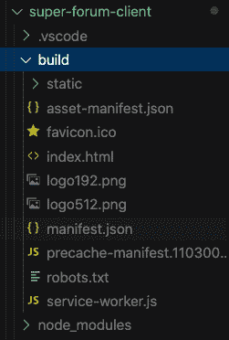

    图 17.26–超级论坛客户端构建文件夹

    笔记

    关于 React 环境变量，需要了解两件事：

    1.React 中的环境变量必须始终以`REACT_APP_`开头。如果缺少此前缀，将忽略该变量。

    2.它们在构建时被插入到我们的代码中，值作为我们的客户端脚本代码的一部分进行部署。这意味着用户将能够搜索浏览器脚本并查看此数据。因此，**从不**在这些环境变量中包含敏感信息。

4.  现在，我们只需要暂时打开服务器的客户机文件夹，以便进行复制。运行以下命令：

    ```js
    sudo chmod -R 777 /var/www/superforum/client
    ```

5.  Now we can deploy our client-side build files. From your development terminal, run this command, with your own proper paths of course:

    ```js
    scp -i <your pem path> -r <your path>/* <username><yourserverpath>
    ```

    结果如下所示：

    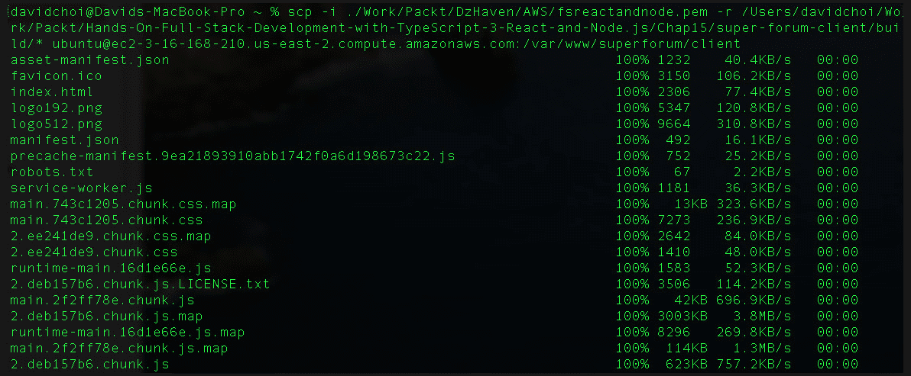

    图 17.27–将客户端文件复制到服务器

6.  现在，按如下方式撤消权限：

    ```js
    sudo chmod -R 755 /var/www/superforum/client
    ```

### 配置 NGINX

好吧我们已经对我们的服务器构建进行了大量配置，因此现在我们可以继续配置我们安装的 NGINX 服务器：

1.  We need to have NGINX start when starting the system in our Ubuntu server. Run the command shown on your SSH terminal and then authenticate as shown:

    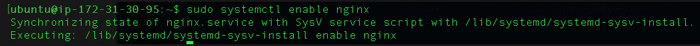

    图 17.28–在系统引导时启用 NGINX 启动

2.  Now, check that NGINX is running with the `status` command shown here:

    

    图 17.29–NGINX 状态

3.  Now, we need to open Port 80 on our AWS VM firewall. Open the browser to the AWS portal and then select **Security Groups**, under the **Network & Security** menu. Then you'll see this:

    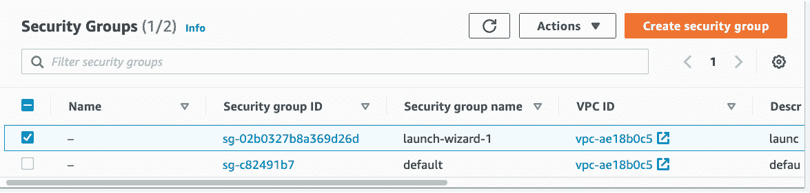

    图 17.30–安全组

4.  Now, select the non-default group and you'll see the screen shown in the following screenshot. Notice **Inbound rules** near the bottom:

    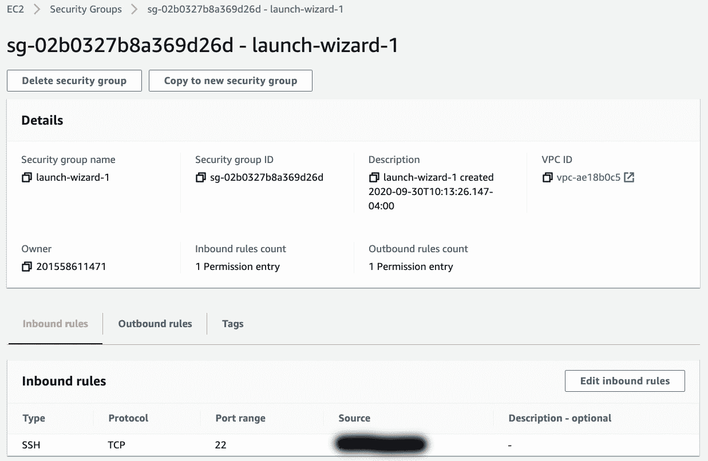

    图 17.31–网络选项卡；添加入站端口规则

5.  Select the **Edit inbound rules** button and then, on that next screen, click the **Add rule** button.

    选择该选项后，您应该会看到*图 17.32*中所示的屏幕。添加 HTTP 的新入站规则，如以下屏幕截图所示：

    

    图 17.32–新的 HTTP 入站规则

    通过选择**0.0.0.0/0**作为源，您允许任何 IP 地址，这是我们想要的。现在，点击**保存规则**按钮保存规则。

6.  Usually, the local Ubuntu firewall is not enabled. However, if it is enabled, we also need to let traffic through to NGINX on the firewall. If necessary, run the following command:

    ```js
    sudo ufw allow 'Nginx HTTP'
    sudo ufw status
    ```

    运行上述命令应产生以下结果：

    

    图 17.33-NGINX 的 Ufw 开放式防火墙

    现在，如果我们使用浏览器访问我们的 URL，在我的例子中，它是`ec2-3-16-168-210.us-east-2.compute.amazonaws.com`，您的 URL 将不同，您可以在 VM 实例屏幕上再次找到它，您应该看到：

    

    图 17.34–默认 NGINX 加载屏幕

7.  So, clearly our NGINX is installed and working. So now we need to make it serve up our site. Note that there appears to be a bug in NGINX for dealing with very long domain names, like the one I received after registering on AWS. Therefore, for our website, we will use the IP address instead.

    NGINX 有两个设置站点的选项。一个允许我们使用`/etc/nginx/conf.d`文件夹中的配置文件。另一个称为服务器块，使用`/etc/nginx/sites-available`文件夹。我们将使用`conf.d`方法。

    运行以下命令：

    ```js
    sudo nano /etc/nginx/conf.d/superforum.conf
    ```

8.  Now this is what your file should contain, again with your own folder paths and domain name:

    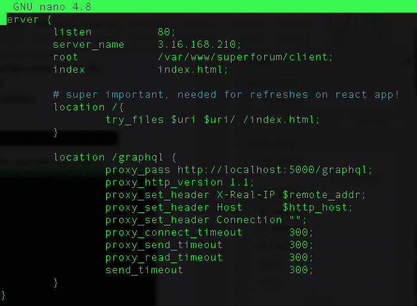

    图 17.35–新的 NGINX conf 文件

    以下是一些需要注意的事项：

    不要忘记每行的结尾分号。没有它，你会出错。

    `server_name`是域名或 IP 地址。

    `root`是包含我们的 HTML 文件的文件夹。

    `location / is`我们网站的根。

    `location /graphql`是我们的 GraphQL 服务器所在的位置。我们正在使用`proxy_pass`将对`http://<domain or ip>/graphql`的呼叫重定向到我们的`http://localhost:5000/graphql`服务器（我们的节点服务器）。

    `<prefix>_timeout`字段用于防止错误 503 网关超时问题，NGINX 有时会出现这种情况。

9.  Next, we need to test that our config changes are OK by running the following command:

    ```js
    sudo nginx -t
    ```

    您应该看到：

    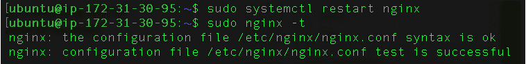

    图 17.36–NGINX 配置文件状态

    如果没有错误，我们可以使用以下命令重新启动 NGINX 服务器：

    ```js
    sudo systemctl restart nginx
    ```

10.  Let's now see whether our app on the browser comes up. First, let's stop our Node server and restart it without using `pm2`, so that we can see any errors that might be occurring. Run these commands on your Ubuntu SSH terminal:

    ```js
    pm2 stop index
    node /var/www/superforum/server/index.js
    ```

    您应该看到如下内容：

    

    图 17.37–节点服务器的首次运行

    同样，您的 IP 地址会有所不同，如果您更改了它们，您的路径可能也会有所不同。如果您看到错误，请稍后转到疑难解答部分。

11.  Now, open your browser and go to your IP address as given by AWS. Then, click on the **Register** button and let's register a new user, as shown next:

    

    图 17.38-注册新用户测试

    填写您认为合适的值，然后单击**注册**按钮。您应该看到如下内容：

    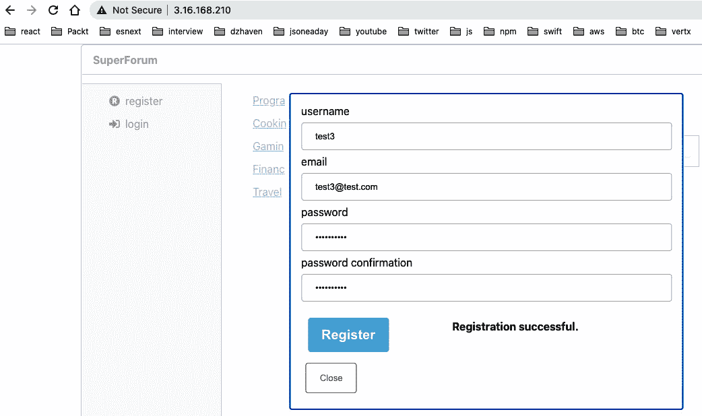

    图 17.39–注册成功

12.  Now we need to confirm our new user. Run these commands on the Ubuntu SSH terminal:

    ```js
    sudo -u postgres psql
    \c SuperForum
    Update "Users" set "Confirmed" = true;
    ```

    让我们确认所有用户都已注册。确认完成后，您将看到以下命令：

    

    图 17.40–确认注册用户

13.  Now, let's try and log in with our new user:

    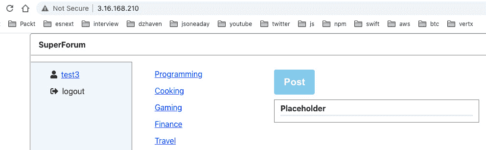

    图 17.41–登录 test3 用户

14.  当然，目前我们没有数据，所以现在我们将添加一个线程帖子，如下所示：


图 17.42——第一个员额

这现在是我们的主页：

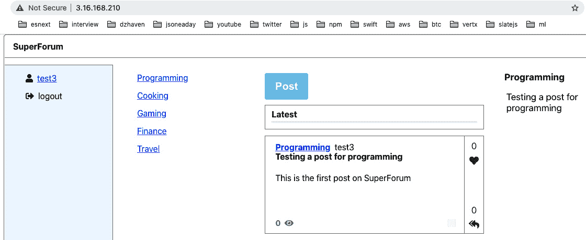

图 17.43–第一篇文章之后的主屏幕

就这样。我们完了！

在本节中，我们使用 NGINX 和所有其他服务完成了应用的设置。祝贺你已经完成了一项非凡的工作，并且通过了大量的高技术材料。

## 故障排除

设置和使用云服务比仅仅在自己的网络上使用服务器要复杂得多。以下是一些处理问题的基本技巧：

*   无论何时更新客户端文件，都必须重新启动 NGINX。
*   无论何时更新服务器文件，都必须重新启动节点服务器。
*   始终验证您的`.env`设置是否正确，并与您在设置过程中选择的名称相匹配；例如，Postgres 数据库的名称、用户名和密码。还要确保您的`.env`文件的路径正确，并且由节点服务器拾取。
*   Make sure the `PG_ENTITIES` and `PG_ENTITIES_DIR` variables have the correct paths. For our current app, this would be the following:

    `PG_ENTITIES="/repo/**/*.*"`

    `PG_ENTITIES_DIR="/repo"`

    如果这些设置不正确，可能会出现错误，如`No repository for <Entity Name> was found`。

*   如果您在服务器上编辑您的`.env`文件，请确保在部署过程中**未被**覆盖。换句话说，不要在服务器上编辑您的文件！
*   在更新 NGINX 的任何`.conf`文件后，始终使用`sudo nginx -t`命令，然后在配置更改完成后重新启动 NGINX 服务。如果确实出现错误，请确保所有配置行都以分号结尾。
*   如果您正在对开发环境进行更改并在那里进行测试，请确保已将`NODE_ENV`环境变量设置为 development。您需要将其永久设置，否则它将在重新启动时消失。
*   NGINX 有一个常见错误`504 Gateway Timeout`。确保您的超时配置足够。你得和他们一起玩。
*   请注意，非常长的域名似乎是 NGINX 中的一个问题。出于测试目的，请查看使用 IP 地址是否有效。如果有，而域名没有，那么你就知道你的问题了。

# 总结

在本章中，我们通过最终将应用部署到云中，巩固了我们对 React、Node 和 GraphQL 的 web 开发知识。学习如何将我们的应用部署到 AWS 云上是非常有价值的，因为它是目前最流行和最广泛使用的云服务。此外，使用 NGINX 进行此操作是正确的，因为 NGINX 在节点社区中非常出色且非常流行。

非常感谢你加入我的旅程。作为一名开发人员，总有一些新的东西需要学习和尝试。但是，通过了解一些最重要和关键的 web 技术，您已经迈出了一大步。现在，您已经拥有了创建真正的、完整的堆栈、尖端 web 应用所需的所有工具。再次祝贺你！

我祝你继续成功。