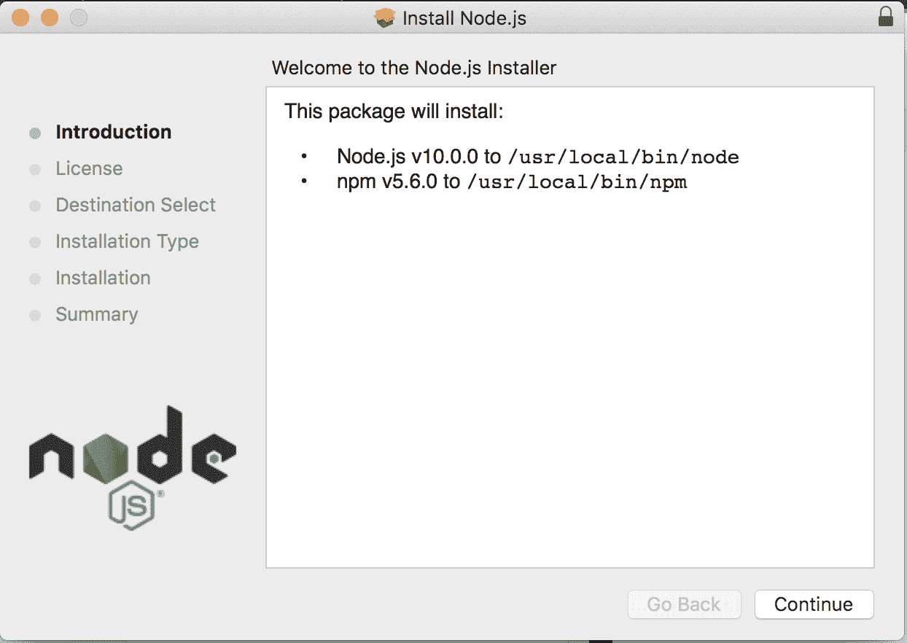
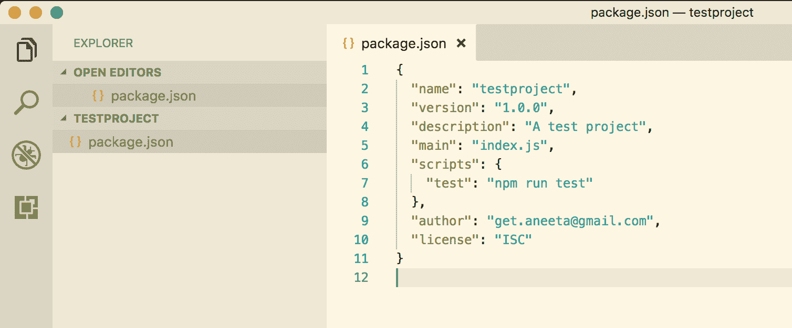
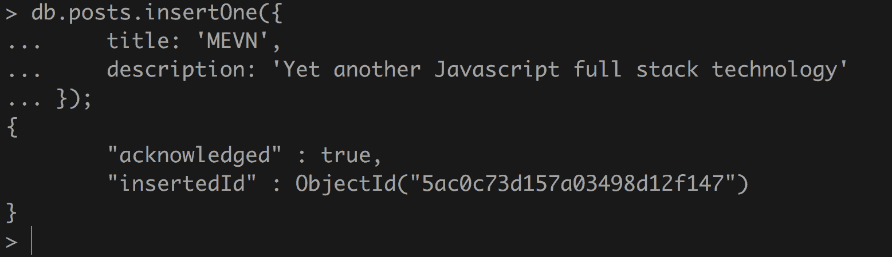
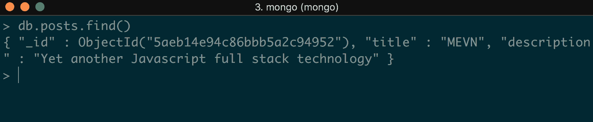

# 一、MEVN 简介

**Mongo,表达、Vue.js 和 node . js**(**MEVN)是一家集 JavaScript 技术就像**MongoDB**,**表达**、【显示】角,和**node . js(【病人】的意思是**),就像**【t16.1】MongoDB,**表达**,**反应, **Node.js**(**MERN**)。 它是一个全栈解决方案，用于构建基于 web 的应用，使用 MongoDB 作为数据存储，Express.js 作为后端框架(构建在 Node.js 之上)，Vue.js 作为前端 JavaScript 框架，Node.js 作为后端主引擎。******

 ****这本书是为那些有兴趣学习使用 MongoDB, Express.js, Vue.js 和 Node.js 构建全栈 JavaScript 应用的 web 开发人员编写的。 它适合具有 HTML、CSS 和 JavaScript 基本知识的初学者和中级开发人员。

MEVN 这个术语可能是新的，但它所使用的技术并不是新的。 这里唯一引入的新技术是 Vue.js。 Vue.js 是一个开源 JavaScript 框架，它的流行度正在迅速增长。 Vue.js 没有太多的学习曲线，而且它也是 AngularJS 和 ReactJS 等其他 JavaScript 框架的激烈竞争对手。

现代 web 应用需要快速且易于扩展。 在过去，只有当需要添加一些普通 HTML 和 CSS 无法实现的视觉效果或动画时，才会在 web 应用中使用 JavaScript。 但是今天，JavaScript 已经发生了变化。 今天，JavaScript 几乎被用于所有基于 web 的应用，从小型到大型的应用。 当应用需要更快和更具交互性时，就会选择 JavaScript。

使用 JavaScript 作为唯一的编程语言来构建一个完整的应用有它自己的好处:

*   如果你刚开始学习编程，你只需要掌握一门语言:JavaScript。
*   全栈工程师的需求很高。 成为一名全栈开发人员意味着你知道数据库是如何工作的，你知道如何构建后端和前端，你还拥有 UI/UX 的技能。

在本书中，我们将使用这些技术栈构建应用。

本章将涵盖以下主题:

*   介绍了 MEVN 技术栈
*   介绍 Node.js 及其在 Windows、Linux 和 macOS 上的安装
*   概述`npm`及其安装
*   介绍 MongoDB 及其安装和在 MongoDB 中使用的一些基本命令
*   介绍 GitHub 版本控制，以及它如何帮助软件工程师方便地访问代码历史和协作

# JavaScript 技术栈的演变

JavaScript 是当今最重要的编程语言之一。 由 Brendan Eich 于 1995 年创立，它做得非常好，不仅在维持其地位方面，而且在超越所有其他编程语言方面。

JavaScript 的流行程度一直在增长，看不到尽头。 使用 JavaScript 作为唯一的编程语言来构建 web 应用一直很流行。 随着这种快速增长的步伐，对软件工程师掌握 JavaScript 知识的需求只会与日俱增。 无论您选择哪种编程语言，JavaScript 总是会以某种方式与其他编程语言结合在一起。

在开发应用时，前端和后端有很多技术可供选择。 虽然本书使用 Express.js 作为后端，但也有其他框架，如果你想学习的话，你可以学习它们。

其他可用的后端框架有**Meteor.js**、**Sails.js**、**Hapi.js**、**Mojito**、**Koa.js**等。

同样，对于前端，技术包括**Vue.js**、**React**、**Angular**、**Backbone**等。

对于数据库，除了 MongoDB，还有**MySQL**，**PostgreSQL**，**Cassandra**等。

# 引入 MEVN

JavaScript 框架的数量和使用量都在日益增加。 JavaScript 过去只用于客户端逻辑，但随着时间的推移，它有了显著的增长，现在它同时用于前端和后端。

MEVN 栈中的 Express.js 用于管理所有与后端相关的东西，Vue.js 处理所有与视图相关的东西。 使用 MEVN 堆栈的优点如下:

*   整个应用都使用一种语言，这意味着您只需要知道 JavaScript 语言
*   用一种语言理解客户端和服务器端非常容易
*   它非常快速和可靠的应用与非阻塞 I/O 的 Node.js
*   这是一种保持 JavaScript 生态系统不断更新的好方法

# 安装 node . js

首先，我们需要添加一个 MEVN 堆栈应用所需的所有依赖项。 关于如何在任何操作系统中安装 Node.js，我们也可以参考官方网站的文档([https://nodejs.org/](https://nodejs.org/))。

# 在 macOS 上安装 Node.js

在 macOS 上安装 Node.js 有两种方法:使用安装程序或使用 bash。

# 使用安装程序安装 Node.js

要使用安装程序安装 Node.js，请执行以下步骤:

1.  安装安装程序:我们可以在官网下载页面([https://nodejs.org/en/#download](https://nodejs.org/en/#download))下载 macOS 的安装程序。 我们将安装最新的`node`版本，也就是`10.0.0`。 您可以安装任何您想要的`node`版本，但是我们将在本书中构建的应用将需要`node`版本`>= 6.0.0`。 运行安装程序并按照给出的说明操作。 当我们下载并运行安装程序时，会出现以下对话框:



2.  只需点击 Continue，直到安装完成。 安装完成后，我们将看到如下对话框:


只要点击关闭，我们就完成了。

# 使用 bash 安装 Node.js

Node.js 可以很容易地在 macOS 中使用 Homebrew 安装。 Homebrew 是一个免费的开源软件包管理器，用于在 macOS 上安装软件。 我个人更喜欢 Homebrew，因为它可以让你很容易地在 Mac 上安装不同的软件:

1.  要安装`Homebrew`，输入以下命令:

```js
$ /usr/bin/ruby -e "$(curl -fsSL https://raw.githubusercontent.com/Homebrew/install/master/install)"
```

2.  现在，使用`Homebrew`用以下命令安装 Node.js:

```js
$ brew install node
```

# 在 Linux 上安装 Node.js

对于 Linux，我们可以安装 Node.js 的默认发行版，也可以从 NodeSource 下载它以使用最新版本。

# 从默认发行版安装 Node.js

要从默认发行版安装，我们可以使用以下命令在 Linux 上安装 Node.js:

```js
$ sudo apt-get install -y nodejs
```

# 从 NodeSource 安装 Node.js

要从 NodeSource 安装 Node.js，执行以下步骤:

1.  首先从 NodeSource 下载最新版本的 Node.js:

```js
$ curl -sL https://deb.nodesource.com/setup_9.x | sudo -E bash 
```

2.  然后，使用以下命令安装 Node.js:

```js
$ sudo apt-get install -y nodejs
```

The `apt` is a short form of Advanced Package Tool that is used to install software on Debian and Linux distributions. Basically, this is equivalent to the Homebrew command in macOS.

# 在 Windows 上安装 Node.js

我们可以通过以下步骤在 Windows 上安装 Node.js:

1.  从官方网站([https://nodejs.org/en/download/](https://nodejs.org/en/download/))下载 Node.js 安装包。
2.  运行安装程序并遵循给定的说明。
3.  点击关闭/完成按钮。

通过安装程序在 Windows 上安装 Node.js 与在 macOS 上安装 Node.js 几乎相同。 下载并运行安装程序后，会出现一个对话框。 只需单击 Continue，直到安装完成。 当我们最终看到一个带有确认的对话框时，我们点击 Close。 Node.js 将被安装!

# Introducing NVM

**NVM**代表**Node Version Manager**。 **NVM 可以跟踪所有我们安装的`node`版本，也可以让我们在不同的版本之间切换。 当我们为 Node.js 的一个版本构建的应用与其他版本不兼容时，这是很方便的，我们需要特定的`node`版本来运行。 NVM 允许我们轻松地管理这些版本。 当我们需要升级或降级`node`版本时，这也是非常有用的。**

 **# 从 NVM 安装 Node.js

1.  下载 NVM，使用如下命令:

```js
$ curl -o- https://raw.githubusercontent.com/creationix/nvm/v0.33.0/install.sh | bash
```

2.  我们也可以使用下面的命令:

```js
$ wget -qO- https://raw.githubusercontent.com/creationix/nvm/v0.33.6/install.sh | bash
```

3.  使用如下命令检查`nvm`是否安装成功。

```js
$ nvm --version 
```

4.  现在，要通过`nvm`安装`node`，使用以下命令:

```js
$ nvm install node
```

# 引入 npm

npm 是**Node Package Manager**的缩写。 基本上，它是一个负责为 Node.js 安装的所有包的工具。 我们可以在官网([https://www.npmjs.com/](https://www.npmjs.com/))找到所有现有的套餐。 `npm`使得开发人员可以很容易地保持他们的代码更新，并重用许多其他开发人员共享的代码。

开发人员经常被软件包和模块这两个术语搞糊涂。 然而，这两者之间有一个明显的区别。

# 模块

模块可以由 Node.js 用`require`命令加载，并且有名称空间。 一个模块有一个与其相关联的`package.json`文件。

# 包

一个`package`只是一个或一组能够独立运行的文件。 每个包都有一个包含描述该包的所有元数据相关信息的`package.json`文件。 模块的组合构成了一个`node`包。

# 安装 npm

当我们从安装程序本身安装 Node.js 时，`npm`会作为`node`的一部分被安装。 我们可以使用以下命令检查`npm`是否安装:

```js
$ npm --version
```

如果没有安装`npm`，该命令将显示一个错误，而如果安装了，则只打印安装的`npm`的版本。

# 使用 npm

`npm`用于在应用中安装不同的包。 有两种安装包的方法:本地安装和全局安装。 当我们希望安装特定于应用的某个包时，我们希望在本地安装该包。 然而，如果我们想使用某个包作为命令行工具，或者也能够在应用之外访问它，我们将希望将它安装为一个全局包。

# 在本地安装 npm 包

要安装一个只针对我们的应用的包，我们可以使用这个命令:

```js
$ npm install <package_name> --save
```

# 全局安装 npm 包

要全局安装一个包，可以使用以下命令:

```js
 $ npm install -g <package_name>
```

# 引入 package.json

所有的`node`包和模块都由一个名为`package.json`的文件组成。 该文件的主要功能是携带与该包或模块相关联的所有元信息。 `package.json`文件要求内容为 JSON 对象。

至少，一个`package.json`文件包含以下内容:

*   **名称**:**包装名称。 这是`package.json`文件的重要部分，因为它是区别于其他包的主要因素，因此，它是一个必需字段。**
***   **version**:**软件包的版本。 这也是一个必需的字段。 为了能够安装我们的包，需要提供`name`和`version`字段。*****   **description**:包装的简短总结。*   **main**:**这是查找包的主要入口点。 基本上，它是一个文件路径，所以当用户安装这个包时，它知道从哪里开始寻找模块。*****   **scripts**:**该字段包含可以在应用的各种状态下运行的命令。 它有一个键-值对。 `key`是应该运行命令的事件，`value`是实际的命令。*****   **author/contributor(作者/贡献者):The author and contributor are The people。 它包含一个人的标识符。 作者是一个人，而贡献者可以是一群人。***   **license**:license 字段，当提供时，便于用户使用我们的包。 这有助于在使用包时识别权限和限制。********

 ****# 创建一个包。 json 文件

我们可以手动创建一个`package.json`文件并自己指定选项，或者我们可以使用一个命令从命令提示符交互式地创建它。

让我们使用`npm`用`package.json`初始化一个示例应用。

首先，在你的项目目录中使用命令创建一个文件夹:

```js
$ mkdir testproject
```

要创建一个`package.json`文件，在我们创建的应用中运行以下命令:

```js
$ npm init
```

运行这个命令会问我们一堆问题，我们可以从命令行交互式地回答这些问题:


最后，它将创建一个`package.json`文件，该文件将包含以下内容:



# 安装 MongoDB

MongoDB 是 MEVN 栈中技术的第一部分。 MongoDB 是一个免费的、开源的、基于文档的数据库，在 GNU 许可下发布。 它是一个 NoSQL 数据库，这意味着它是非关系数据库。 与使用表和行表示数据的关系数据库不同，MongoDB 使用集合和文档。 MongoDB 将数据表示为 JSON 文档集合。 它为我们提供了以任何我们想要的方式添加字段的灵活性。 单个集合中的每个文档可以具有完全不同的结构。 除了添加字段外，它还提供了以任何我们想要的方式在文档之间更改字段的灵活性，这在关系数据库中是一项麻烦的任务。

# MongoDB 与关系数据库管理系统(RDBMS)相比的优点

与关系数据库管理系统相比，MongoDB 提供了很多好处:

*   无模式架构:MongoDB 不需要我们为它的集合设计特定的模式。 一个文档的模式可能不同，而另一个文档则完全不同。
*   每个文档都以 json 结构的格式存储。
*   MongoDB 的查询和索引非常简单。
*   MongoDB 是一个免费的开源程序。

# 在 macOS 上安装 MongoDB

有两种方式安装 MongoDB。 我们可以从 MongoDB 官方网站([https://www.mongodb.org/downloads#production](https://www.mongodb.org/downloads#production))下载，也可以使用家酿软件安装。

# 下载安装 MongoDB

1.  从[https://www.mongodb.com/download-center#production 下载你想要的 MongoDB 版本](https://www.mongodb.com/download-center#production)
2.  将下载的 gzip 文件复制到根文件夹。 将它添加到根文件夹将允许我们全局使用它:

```js
 $ cd Downloads $ mv mongodb-osx-x86_64-3.0.7.tgz ~/
```

3.  解压缩 gzip 文件:

```js
 $ tar -zxvf mongodb-osx-x86_64-3.0.7.tgz
```

4.  创建一个目录，将用于 Mongo 保存数据:

```js
 $ mkdir -p /data/db
```

5.  现在，要检查安装是否成功，请启动 Mongo 服务器:

```js
 $ ~/mongodb/bin/mongod
```

这里，我们已经成功安装并启动了`mongo`服务器。

# 通过 Homebrew 安装 MongoDB

安装 MongoDB 在 macOS 从家酿，遵循这些步骤:

1.  有了家酿，我们只需要一个命令就可以安装 MongoDB:

```js
$ brew install mongodb
```

2.  创建一个目录，将用于 Mongo 保存数据:

```js
 $ sudo mkdir -p /data/db
```

3.  启动 Mongo 服务器:

```js
 $ ~/mongodb/bin/mongod 
```

因此，最终安装了 MongoDB。

# Linux 安装 MongoDB

在 Linux 上安装 MongoDB 也有两种方法:我们可以使用`apt-get`命令，或者下载 tarball 并提取它。

# 使用 apt-get 安装 MongoDB

使用`apt-get`安装 MongoDB，请执行以下步骤:

1.  使用如下命令安装最新版本的 MongoDB。

```js
 $ sudo apt-get install -y mongodb-org
```

2.  验证`mongod`是否已成功安装，请运行以下命令:

```js
 $ cd /var/log/mongodb/mongod.log
```

3.  要启动`mongod`进程，请在终端中执行如下命令:

```js
 $ sudo service mongod start
```

4.  查看日志文件中是否有一行表示 MongoDB 连接成功:

```js
 $ [initandlisten] waiting for connections on port<port>
```

5.  停止`mongod`进程。

```js
 $ sudo service mongod stop
```

6.  重新启动`mongod`进程。

```js
 $ sudo service mongod restart
```

# 使用 tarball 安装 MongoDB

1.  从[https://www.mongodb.com/download-center?_ga=2.230171226.752000573.1511359743-2029118384.1508567417](https://www.mongodb.com/download-center?_ga=2.230171226.752000573.1511359743-2029118384.1508567417)下载二进制文件。 使用这个命令:

```js
 $ curl -O https://fastdl.mongodb.org/linux/mongodb-linux-x86_64-
 3.4.10.tgz
```

2.  解压下载的文件:

```js
 $ tar -zxvf mongodb-linux-x86_64-3.4.10.tgz
```

3.  复制并解压到目标目录:

```js
 $ mkdir -p mongodb $ cp -R -n mongodb-linux-x86_64-3.4.10/ mongodb
```

4.  设置二进制文件在 PATH 变量中的位置:

```js
 $ export PATH=<mongodb-install-directory>/bin:$PATH
```

5.  创建 Mongo 用于存储所有数据库相关数据的目录:

```js
 $ mkdir -p /data/db
```

6.  启动`mongod`进程:

```js
 $ mongod
```

# 在 Windows 上安装 MongoDB

从安装程序安装 MongoDB 就像在 Windows 上安装任何其他软件一样简单。 就像我们对 Node.js 所做的一样，我们可以从官方网站([https://www.mongodb.com/download-center#atlas](https://www.mongodb.com/download-center#atlas))下载 MongoDB 的 Windows 安装程序。 这将下载一个可执行文件。

下载了可执行文件后，运行安装程序并遵循说明。 仔细阅读对话框中的说明。 安装完成后，只需单击关闭按钮，就完成了。

# 使用 MongoDB

让我们更深入地了解 MongoDB。 正如前面提到的，Mongo 由一个包含集合(表/数据组)和文档(行/条目/记录)的数据库组成。 我们将使用 MongoDB 提供的一些命令来创建、更新和删除文档:

首先，用下面的命令启动 Mongo 服务器:

```js
$ mongod
```

然后，用这个命令打开 Mongo shell:

```js
$ mongo
```

# 创建或使用 MongoDB 数据库

在这里，我们可以看到所有的数据库、集合和文档。
要显示我们拥有的数据库列表，我们可以使用以下方法:

```js
> show dbs
```

现在，这个命令应该列出所有现有的数据库。 要使用我们想要的数据库，我们可以简单地运行以下命令:

```js
> use <database_name>
```

但是如果没有列出数据库，也不用担心。 MongoDB 为我们提供了一个功能，当我们运行前面的命令时，即使那个数据库不存在，它也会自动为我们创建一个具有给定名称的数据库。

所以，如果我们已经有了想要使用的数据库，我们只需运行该命令，如果还没有数据库，我们使用下面的命令创建一个:

```js
> use posts
```

当我们运行这个命令时，将创建一个名为`posts`的数据库。

# 创建文档

现在，让我们快速回顾一下 MongoDB 中使用的命令。 `insert`命令用于在 MongoDB 的集合中创建新文档。 让我们向刚刚创建的数据库添加一个名为`posts`的新记录。

这里也是一样，为了向集合添加文档，我们首先需要一个集合，而我们还没有这个集合。 但是 MongoDB 允许我们通过运行`insert`命令轻松地创建集合。 同样，如果集合存在，它将把文档添加到给定的集合，如果集合不存在，它将简单地创建一个新集合。

现在，在 Mongo shell 中，运行以下命令:

```js
> db.posts.insertOne({
 title: 'MEVN',
 description: 'Yet another Javascript full stack technology'
});
```

该命令将在`posts`数据库中创建一个名为`posts`的新集合。 该命令的输出如下所示:



它将返回一个 JSON 对象，该对象包含我们刚刚在`insertedId`键中创建的文档的 ID，以及接收事件为`acknowledged`的标志。

# 获取文件

当我们想从一个集合中获取记录时，使用这个命令。 我们也可以通过传递参数来获取所有记录或特定文档。 我们可以在`posts`数据库中添加更多的文档，以便更好地学习该命令

# 获取所有文档

需要从`posts`集合中获取所有记录，使用如下命令:

```js
> db.posts.find()
```

这将返回我们在`posts`集合中拥有的所有文档:



# 获取特定文档

让我们找一篇标题为`MEVN`的文章。 为此，我们可以运行:

```js
> db.posts.find({ 'title': 'MEVN' }) 
```

该命令只返回标题为`MEVN`的文档:


# 更新文档

当我们想要更新集合的某个部分时，使用此命令。 假设我们想要更新标题为`Vue.js`的文章的描述; 我们可以运行以下命令:

```js
> db.posts.updateOne(
 { "title" : "MEVN" },
 { $set: { "description" : "A frontend framework for Javascript programming language" } }
 )
```

这个命令的输出将是:


我们在这里可以看到，`matchedCount`是`1`，这意味着对于我们发送来更新标题为`MEVN`的记录的参数，`posts`集合中有一个文档与查询匹配。

另一个名为`modifiedCount`的键给出了被更新的文档的计数。

# 删除文件

`delete`命令用于从集合中删除文档。 从 MongoDB 中删除文档有几种方法。

# 删除符合给定条件的文档

要删除具有特定条件的所有文档，可以运行:

```js
> db.posts.remove({ title: 'MEVN' })
```

该命令将从`posts`集合中删除标题为`MEVN`的所有文档。

# 删除匹配给定条件的单个文档

要只删除满足给定条件的第一条记录，可以使用:

```js
> db.posts.deleteOne({ title: 'Expressjs' })
```

# 删除所有记录

要删除集合中的所有记录，可以使用:

```js
> db.posts.remove({})
```

# Introducing Git

Git 是一个版本控制系统，用于跟踪应用中的代码更改。 它是一个免费的开源软件，用于在构建应用时跟踪和协调多个用户。

要开始使用这个软件，我们需要先安装它。 有一种非常简单的方法可以在每个操作系统上安装它。

# 在 Windows 上安装 Git

我们可以在[https://gitforwindows.org/找到 Git for Windows 的安装程序。](https://gitforwindows.org/)

下载 Windows 的可执行安装程序文件，并遵循相应的步骤说明。

# 在 Mac 上安装 Git

我们可以通过自制程序轻松地在 Mac 上安装 Git。 只需在命令行中输入以下命令就可以在 Mac 上安装 Git:

```js
$ brew install git 
```

# 在 Linux 上安装 Git

在 Linux 中安装 Git 就像在 macOS 上安装 Git 一样简单。 只需输入以下命令并按回车键，就可以在 Linux 上安装 Git:

```js
$ sudo apt-get install git
```

# 引入 GitHub

GitHub 是一个版本控制服务。 它是一个源代码管理工具，专门设计用于跟踪对代码的更改。 GitHub 还提供了社交网络的功能，比如添加评论和显示 feed，这使得它更加强大，因为多个开发人员可以在一个应用中同时协作。

# 为什么 GitHub ?

GitHub 是软件工程师的救世主。 GitHub 提供了一些值得使用的优点。 这里列出了 GitHub 提供的一些好处:

*   :GitHub 帮助跟踪代码的变化，这意味着它维护了我们的代码的历史。 这使我们能够查看在任何时期内对代码库所做的修订。
*   **文档**:GitHub 提供了向代码基中添加文档、wiki 等的功能，这些功能可以使用简单的 markdown 语言编写。
*   图表和报告:GitHub 提供了对各种指标的洞察，包括对代码进行了多少添加和删除，谁是最重要的贡献者，谁提交的次数最多。
*   **Bug 跟踪**:由于 GitHub 跟踪在每个时间点所做的所有活动，当某些东西中断时，我们可以很容易地回溯到破坏代码的点。 我们还可以集成诸如 Travis 这样的第三方工具来进行持续集成，这有助于我们轻松地跟踪和识别 bug。
*   **协作很简单**:Github 跟踪每个合作者在项目中所做的每一项活动，并发送相同的电子邮件通知。 它还提供社交媒体功能，如提要、评论、表情符号和提及。
*   **托管我们自己的网站**:我们也可以使用一个名为 GitHub 页面的功能来托管我们自己的网站。 我们只需要为我们自己的项目创建一个 repo，并使用 Github 页面托管它，这将使网站适用于 URL:`https://<username>.github.io`。

# 使用 GitHub

GitHub 非常容易使用。 然而，要开始使用 GitHub，我们至少需要知道一些 GitHub 中使用的术语:

*   **Repository/Repo**:Repository 是存储所有代码库的地方。 存储库可以是私有的，也可以是公共的。

*   **ssh-key**:ssh-key 是 GitHub 中的一种授权方式。 它储存了我们的身份。
*   **分支**:分支可以定义为存储库的多个状态。 任何存储库的主要分支都是`master`分支。 多个用户可以在不同的分支上并行工作。
*   **Commit**:Commit 可以很容易地区分给定时间内文件的不同状态。 当我们做一个提交时，一个唯一的标识符被分配给那个提交所以很容易检查那个提交中做了什么改变。 提交以消息作为参数，描述正在进行的更改的类型。
*   **Push**:Push 将提交发送回存储库。
*   **Pull**:与 push 不同，Pull 是从远程存储库获取提交到本地项目。

*   **合并**:合并基本上是在多个分支之间完成的。 它用于将更改从一个分支应用到另一个分支。
*   **Pull requests**:创建`pull request`基本上就是将我们对代码库所做的更改发送给其他开发人员审批。 我们可以开始讨论`pull request`来检查代码的质量，并确保更改不会破坏任何东西。

To learn more about the vocabulary used in GitHub, visit [https://help.github.com/articles/github-glossary/](https://help.github.com/articles/github-glossary/).

# 设置 GitHub 存储库

现在我们知道了 GitHub 的基础知识，让我们开始为我们想要构建的项目创建一个 GitHub 存储库:

1.  首先，在根文件夹中为应用创建一个文件夹。 让我们将此应用命名为`blog`:

```js
 $ mkdir blog
```

2.  在 GitHub 上创建一个帐户[https://github.com/](https://github.com/)。
3.  打开你的个人资料。 在 Repositories 选项卡下，单击 New，如下所示:


4.  将此存储库命名为`blog`。
5.  现在，在终端上，转到这个应用的位置，用下面的命令初始化一个空存储库:

```js
 $ cd blog $ git init
```

6.  现在，让我们创建一个名为`README.md`的文件，为应用写一个描述，然后保存它:

```js
 $ echo 'Blog' > README.md 
```

7.  将这个文件添加到 GitHub 中:

```js
 $ git add README.md
```

8.  添加一个`commit`，这样我们就有了这个代码更改的历史:

```js
 $ git commit -m 'Initial Commit'
```

9.  现在，要将本地应用与 GitHub 中的`remote`存储库链接，使用下面的命令:

```js
$ git remote add origin https://github.com/{github_username}/blog.git
```

10.  最后，我们需要`push`this`commit`to GitHub:

```js
 $ git push -u origin master
```

当它完成后，访问 GitHub 存储库，在那里你会发现提交到我们的存储库的历史，如下所示:


就是这样。 现在，当我们想要编写更改时，我们将首先创建一个分支并将更改推送到该分支。

# 总结

在本章中，我们学习了什么是 MEVN 栈。 我们了解了 Node.js, npm 和 MongoDB，以及 GitHub 的简要总结，以及它如何帮助软件工程师轻松访问代码历史和协作。

在下一章，我们将学习更多关于 Node.js 和 Node.js 模块的内容。 我们将学习 MVC 架构，以及如何通过使用 Express.js 构建应用来实现它。**********