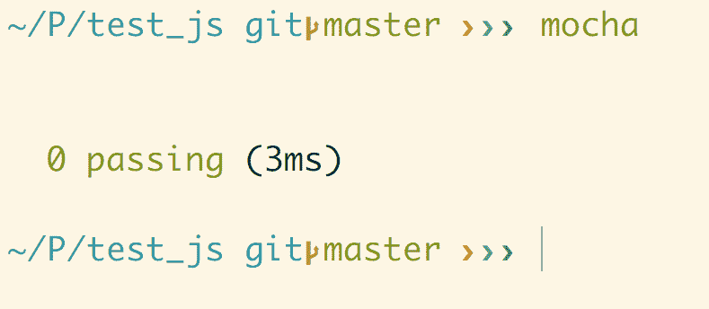
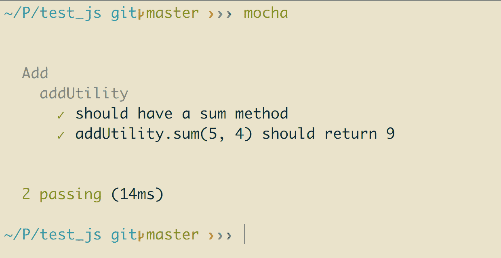
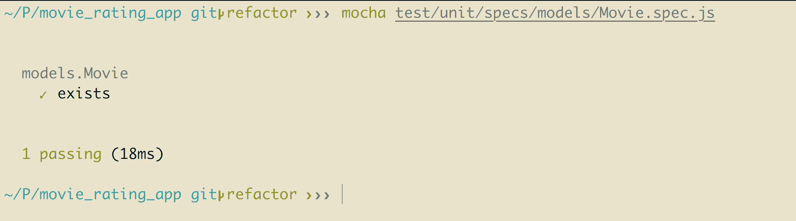
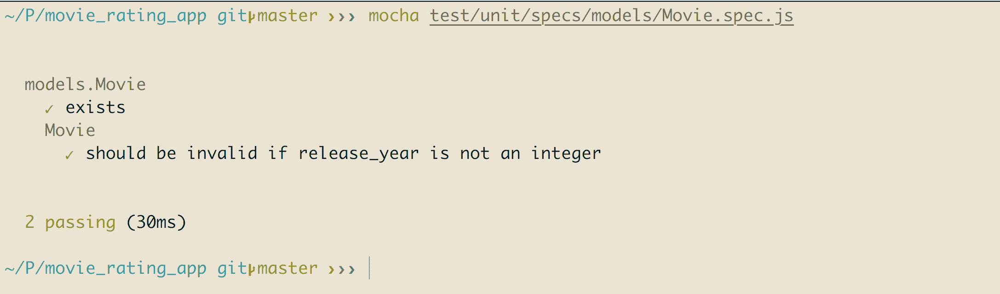
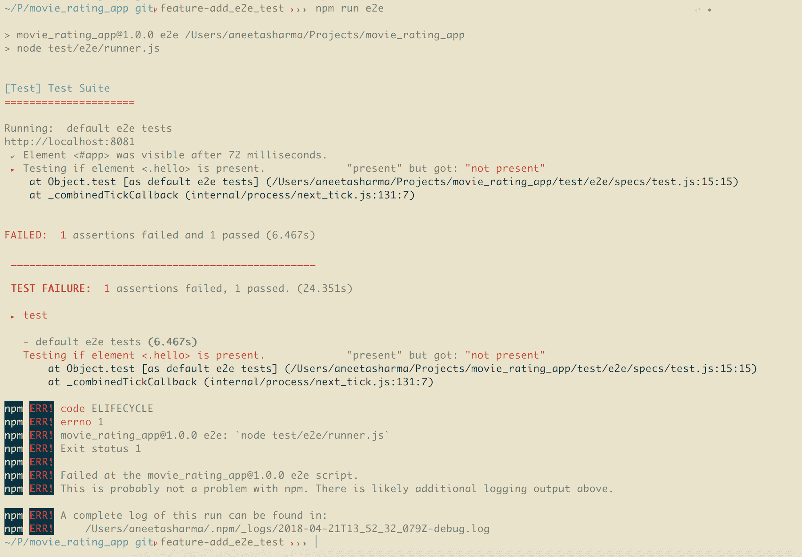

# 九、测试 MEVN 应用

让我们快速回顾一下到目前为止我们在前几章中所做的工作:

*   我们为不同的页面创建了不同的 Vue 组件
*   我们为 Vue.js 应用实现了 vue 集中式的状态管理，并为组件定义了状态、getter、突变和动作
*   我们创建了控制器和模型来与 Node.js 后端交互

在本章中，我们将讨论如何编写测试代码，以确保应用中的一切工作正常。 编写测试代码是任何应用不可分割的一部分。 它有助于确保我们所编写的功能不会被破坏，并保持我们所编写代码的质量。

在编写测试时可以遵循不同的实践。 在编写实际代码之前，先编写测试代码总是一个好的做法。 编写测试可以确保我们的应用不会崩溃，一切都将按照预期工作。

这有助于我们编写更好的代码，也有助于在潜在问题出现之前发现它们。

# 编写测试的好处

在开发应用时编写测试代码有很多好处。 其中一些建议如下:

*   **确保代码按预期工作**:它有助于确保我们在应用中编写的每一项功能都完全按预期工作。
*   **提高代码质量**:提高代码质量 因为编写测试代码有助于预先预防可能出现的缺陷，在我们编写实际代码之前，它提高了代码的质量。
*   **预先识别错误**:帮助在早期阶段识别错误。 因为测试代码是针对每个功能编写的，所以可以及早发现 bug 和问题。
*   **作为新开发人员的文档**:测试代码类似于文档。 如果我们需要新的开发人员开始处理相同的应用，测试代码可以帮助他们理解应用如何工作，而不是遍历所有的应用代码。
*   **有测试代码的应用开发更快**:如果我们写的代码没有测试代码，我们会写得更快。 然而，如果我们跳过这个过程，我们将在稍后花费大部分时间来修复将开始爬进来的错误，这些错误可以在测试代码中更早地被识别出来。
*   **应用不需要运行**:编写测试代码并运行它不需要应用启动和运行。 它也不需要构建应用。 这大大减少了开发时间。

因此，在本章中，我们将讨论以下主题:

*   了解为什么以及如何编写单元测试和端到端测试
*   了解为 Vue.js 和 Node.js 应用编写测试代码的技术
*   修改应用的结构以实现单元和端到端代码
*   为 Vue 组件编写测试代码

# 单元测试简介

单元测试是一个软件开发过程，在这个过程中，对应用的最小功能进行测试和检查，以检查它是否按照预期工作。 单元是任何应用中最小的部分。 为应用的一个单元编写的每个测试代码都是相互独立的。 单元测试本身的目标是执行单个测试，并确保每个部分都是正确的。

# 编写单元测试的约定

如果您在编写单元测试时遵循了某些指导原则和原则，那么您的代码将变得可维护和可读。 以下是我们在为任何应用编写单元测试时可以使用的一些技术:

*   单元测试应该在小单元中进行——对于单个类或方法。
*   单元测试应该独立执行，这意味着单元测试不应该依赖于任何其他类或方法，这是通过模仿这些依赖项来实现的。
*   因为单元测试是在更小的部分中完成的，所以它们应该是非常轻量级的，这使得测试运行得更快。
*   单元测试应该测试应用单元的行为。 它应该期望某个值并返回某个输出。
*   由于单元测试是独立进行的，所以对不同单元进行测试的顺序不会产生问题。
*   **Do not Repeat Yourself**(**DRY**); 代码不应该是可重复的。
*   在可以的地方添加注释，解释测试的“为什么”部分，使其易于理解。

# 端到端测试介绍

端到端测试是对应用从头到尾的测试。 单元测试测试应用的功能是独立工作还是非端到端测试检查应用流是否按预期执行。 通常，端到端测试确保所有用户交互都按照预期的方式进行。 端到端测试确保应用流按预期工作。

# 编写端到端测试的约定

在编写端到端测试时，需要遵循某些准则:

*   编写测试用例时应该考虑最终用户和真实场景
*   应该为不同的场景创建多个测试用例
*   应该收集涉及到的所有软件或应用的需求
*   对于每个需求，收集尽可能多的条件或场景
*   为每个场景编写单独的测试用例

# 我们将使用的技术

下面是我们将使用的一些包来为我们的应用编写测试:

*   **Mocha**:编写单元测试的 JavaScript 测试框架([https://mochajs.org/](https://mochajs.org/))
*   **Chai**:Node.js 框架的断言库([http://chaijs.com/](http://chaijs.com/))
*   **Sinon**:`sinon`用于测试间谍、存根和 mock([http://sinonjs.org/](http://sinonjs.org/))
*   **Nightwatch**:用于编写端到端测试的 JavaScript 库([http://nightwatchjs.org/](http://nightwatchjs.org/))
*   **Karma**:`karma`是 JavaScript 的测试运行器([https://karma-runner.github.io/2.0/index.html](https://karma-runner.github.io/2.0/index.html))

我们将在后面讨论每一种技术。

# 引入摩卡

让我们创建一个单独的工作目录来学习如何编写测试。 创建一个名为`test_js`的文件夹，并切换到`test_js`目录:

```js
> mkdir test_js
> cd test_js
```

让我们在`test_js`文件夹中为`test`创建一个单独的文件夹:

```js
> mkdir test
```

要访问`mocha`，你必须在全球范围内安装它:

```js
$ npm install mocha -g --save-dev
```

让我们在`mocha`中编写一个简单的测试代码。 我们将为一个简单的函数编写一个测试，该函数接受两个参数并返回参数的和。

让我们在`test`文件夹中创建一个名为`add.spec.js`的文件，并添加以下代码:

```js
const addUtility = require('./../add.js');
```

然后在`test_js`文件夹下执行如下命令:

```js
$ mocha
```

该测试将失败，我们将需要一个名为`add.js`的实用程序，但这个实用程序并不存在。 它显示以下错误:


让我们继续编写足以通过测试的代码。 在`test_js`项目的根目录中创建一个名为`add.js`的文件，并再次运行代码，它应该通过:



让我们继续将逻辑添加到测试代码中，以检查我们的`add`函数。 在`add.spec.js`中，添加以下代码行:

```js
var addUtility = require('./../add.js');

describe('Add', function(){
 describe('addUtility', function(){
 it('should have a sum method', function(){
 assert.equal(typeof addUtility, 'object');
 assert.equal(typeof addUtility.sum, 'function');
 })
 })
});
```

现在有了`assert`库。 库帮助检查传递的表达式是对还是错。 这里，我们将使用 Node.js 的内置断言库。

为了包含`assert`库，让我们在`add.spec.js`中添加以下代码行:

```js
var assert = require("assert")
var addUtility = require("./../add.js");

describe('Add', function(){
  describe('addUtility', function(){
    it('should have a sum method', function(){
      assert.equal(typeof addUtility, 'object');
      assert.equal(typeof addUtility.sum, 'function');
    })
  })
});
```

让我们重新运行`mocha`。 这应该会再次失败，因为我们还没有向模块添加方法。 让我们来做一下。 在`add.js`中，我们添加以下代码:

```js
var addUtility = {}

addUtility.sum = function () {
 'use strict';
 return true;
}

module.exports = addUtility;
```

让我们重新运行`mocha`。 现在该规范应该通过了:


现在，让我们将函数部分添加到求和方法中。 在`add_spec.js`中添加以下代码:

```js
var assert = require("assert")
var addUtility = require("./../add.js");

describe('Add', function(){
  describe('addUtility', function(){
    it('should have a sum method', function(){
      assert.equal(typeof addUtility, 'object');
      assert.equal(typeof addUtility.sum, 'function');
    })

    it('addUtility.sum(5, 4) should return 9', function(){
 assert.deepEqual(addUtility.sum(5, 4), 9)
```

```js
 })
  })
});
```

然后，看一看考试; 它失败。 然后，将逻辑添加到我们的模块:

```js
var addUtility = {}

addUtility.sum = function (a, b) {
  'use strict';
  return a + b;
}

module.exports = addUtility;
```

然后，重新运行`mocha`，测试应该通过。 就是这样! ：



您可以继续向测试中添加更多的用例，以确保没有中断。

# 介绍茶

让我们讨论一下`chai`。 `chai`是一个断言库，与`mocha`一起使用。 我们也可以使用本地的`assertion`库，但是`chai`增加了很多灵活性。

`chai`使得编写测试定义变得容易得多。 让我们安装`chai`并修改前面的测试，使其看起来更简单易懂:

```js
$ npm install chai -g
```

我们通过了`-g`选项来全局安装它，因为我们没有`package.json`配置。

我们在前面的测试中使用`chai`。 在`add.spec.js`中，添加以下代码行:

```js
var expect = require('chai').expect;
var addUtility = require("./../add.js");

describe('Add', function(){
  describe('addUtility', function(){
    it('should have a sum method', function(){
      expect(addUtility).to.be.an('object');
 expect(addUtility).to.have.property('sum');
    })

    it('addUtility.sum(5, 4) should return 9', function(){
      expect(addUtility.sum(5, 4)).to.deep.equal(9);
    })

    it('addUtility.sum(100, 6) should return 106', function(){
      expect(addUtility.sum(100, 6)).to.deep.equal(106);
    })
  })
});
```

我们用`chai``expect()`方法替换了`assertion`库，这使得代码非常简单易懂。

# 介绍西农

`sinon`用于测试间谍、存根和 JavaScript 测试的 mock。 要了解这些，让我们继续看我们在`controller`文件`controller/movies.js`中的电影评级应用:

```js
const Movie = require("../models/Movie");
const passport = require("passport");

module.exports.controller = (app) => {
  // fetch all movies
  app.get("/movies", function(req, res) {
    Movie.find({}, 'name description release_year genre', function 
    (error, movies) {
      if (error) { console.log(error); }
       res.send({
        movies: movies
      })
    })
  })

  // add a new movie
  app.post('/movies', (req, res) => {
    const movie = new Movie({
      name: req.body.name,
      description: req.body.description,
      release_year: req.body.release_year,
      genre: req.body.genre
    })

    movie.save(function (error, movie) {
      if (error) { console.log(error); }
      res.send(movie)
    })
  })
}               
```

在前面的代码中，每个 API 调用都需要一个请求和一个响应对象，我们需要对其进行模拟。 为此，我们有`sinon`。 `sinon`为我们提供了处理`stub`和`mock`请求的机制。

`sinon`提供的三种主要方法是间谍、存根和 mock:

*   **间谍**:间谍帮助创建虚假的功能。 我们可以使用间谍来跟踪函数是否被执行。
*   存根:存根帮助我们使函数返回我们想要的任何东西。 当我们想要测试给定函数的不同场景时，这很有用。
*   **mock**:mock 用于伪造网络连接。 它们有助于创建一个虚拟类实例，这有助于设置预先确定的期望。

让我们为`movies`控制器中的`get`调用编写一个测试:

```js
// fetch all movies
  app.get("/movies", function(req, res) {
    Movie.find({}, 'name description release_year genre', function 
    (error, movies) {
      if (error) { console.log(error); }
       res.send({
        movies: movies
      })
    })
  })
```

让我们在`test/units`文件夹中创建一个名为`movies.spec.js`的新文件:

```js
var movies = require("./../../../controllers/movies.js");
var expect = require('chai').expect;

describe('controllers.movies.js', function(){
 it('exists', function(){
 expect(movies).to.exist
 })
})
```

这个测试代码只是检查`controller`是否存在，当我们运行以下命令时，它应该通过:

```js
$ mocha test/unit/controllers/movies.spec.js
```

该命令运行我们的`controller/movies.js`的测试，并通过以下输出:


让我们首先为一个简单的方法编写一个测试。 让我们创建一个请求，它只响应一个带有名称的对象。 在`movies.js`中，让我们添加以下代码来创建一个虚拟 API:

```js
const Movie = require("../models/Movie");
const passport = require("passport");

module.exports.controller = (app) => {
 // send a dummy test
 app.get("/dummy_test", function(req, res) {
 res.send({
 name: 'John'
 })
 })
```

在前面的代码中，我们有一个返回对象的简单方法。

让我们继续添加功能测试部分。 我们将为`/dummy_test`方法编写测试。

在`movies.spec.js`中，我们添加以下代码行:

```js
var controller = require("./../../../controllers/movies.js");
let chaiHttp = require('chai-http');
let chai = require('chai');
var expect = chai.expect;
var should = chai.should();
var express = require("express");
let server = require('./../../../server.js');
var app = express();
chai.use(chaiHttp);

function buildResponse() {
 return http_mocks.createResponse({eventEmitter: require('events').EventEmitter})
}

describe('controllers.movies', function(){
 it('exists', function(){
 expect(controller).to.exist
 })
})

describe('/GET dummy_test', () => {
 it('it should respond with a name object', (done) => {
 chai.request(server)
 .get('/dummy_test')
 .end((err, res) => {
 res.should.have.status(200);
 res.body.should.be.an('object');
 done();
 });
 });
});
```

在前面的代码中，我们添加了一个名为`chai-http`的新包，它用于模拟请求。 让我们安装这个包，如下:

```js
$ npm install chai-http --save
```

现在让我们用以下命令运行测试:

```js
$ mocha test/unit/controllers/movies.spec.js
```

前面的命令应该会给我们以下输出:


# 为 Node.js 服务器编写测试

让我们开始为我们为`node`服务器的后端部分构建的应用编写测试。

我们将使用以下文件夹结构:


在`test`文件夹中有两个文件夹。 一个用于单元测试，称为`unit`，另一个用于端到端测试，称为`e2e`。 我们将从编写单元测试开始，它位于`unit`目录下。 命名约定是将`.spec`部分附加到我们要为其编写测试的每个文件的文件名。

# 为控制器编写测试

让我们开始为添加的控制器编写测试。 在`test/unit/specs`中创建一个名为`controllers`的文件夹，并在其中创建一个名为`movies.spec.js`的新文件。 这将是我们在为任何组件(控制器、模型或 Vue 组件)创建测试文件时遵循的命名约定——`.spec.js`后面的实际文件名。 这有助于维护代码的可读性。

首先让我们回顾一下`movies.js`文件中的内容:

```js
var Movie = require("../models/Movie");

module.exports.controller = (app) => {
  // fetch all movies
  app.get("/movies", function(req, res) {
    Movie.find({}, 'name description release_year genre', function  
    (error, movies) {
      if (error) { console.log(error); }
       res.send({
        movies: movies
      })
    })
  })

  // add a new movie
  app.post('/movies', (req, res) => {
    const movie = new Movie({
      name: req.body.name,
      description: req.body.description,
      release_year: req.body.release_year,
      genre: req.body.genre
    })

    movie.save(function (error, movie) {
      if (error) { console.log(error); }
      res.send(movie)
    })
  })
}
```

该控制器有两个方法—一个 GET 请求和一个 POST 请求。 GET 请求用于从数据库中获取所有电影，POST 请求将具有给定参数的电影保存到数据库中。

让我们先来添加 GET 请求的规范。 在我们刚刚创建的`movies.spec.js`文件中添加以下内容:

```js
const controller = require("./../../../../controllers/movies.js");
const Movie = require("./../../../../models/Movie.js");
let server = require('./../../../../server.js');
let chai = require('chai');
let sinon = require('sinon');
const expect = chai.expect;
let chaiHttp = require('chai-http');
chai.use(chaiHttp);
const should = chai.should();
```

前两行需要`Movie`组件对应的控制器和模型，我们将在后面用到。 我们还需要服务器文件。

断言需要其他包，如`chai`、`sinon`、`expect`和`should`。

我们需要向服务器发出请求的下一件事是一个名为`chai-http`的包。 这个包将用于 HTTP 请求断言。 所以，让我们先用下面的命令来安装这个包:

```js
$ npm install chai-http --save
```

现在，我们可以开始添加第一个测试了。 将`movies.spec.js`中的内容替换为以下代码:

```js
const controller = require("./../../../../controllers/movies.js");
const Movie = require("./../../../../models/Movie.js");
let server = require('./../../../../server.js');
let chai = require('chai');
let sinon = require('sinon');
const expect = chai.expect;
let chaiHttp = require('chai-http');
chai.use(chaiHttp);
const should = chai.should();

describe('controllers.movies', function(){
 it('exists', function(){
```

```js
 expect(controller).to.exist
 })
})
```

以上方法以`movies`控制器为例进行说明。 它只是检查我们描述的控制器是否存在。

为了确保我们拥有了`node`服务器的连接，让我们从`server.js`导出服务器。 在`server.js`中添加如下代码:

```js
...
const port = process.env.API_PORT || 8081;
app.use('/', router);
var server = app.listen(port, function() {
  console.log(`api running on port ${port}`);
});

module.exports = server
```

现在，让我们使用以下命令运行测试:

```js
$ mocha test/unit/specs/controllers/movies.spec.js
```

测试应该会通过。

让我们继续为 GET 请求添加测试。 在`movies.js`中，我们有以下代码:

```js
var Movie = require("../models/Movie");

module.exports.controller = (app) => {
  // fetch all movies
  app.get("/movies", function(req, res) {
 Movie.find({}, 'name description release_year genre', function 
    (error, movies) {
 if (error) { console.log(error); }
 res.send({
 movies: movies
 })
 })
 })  ...
}
```

由于此方法从数据库中获取所有现有影片，因此我们首先需要在这里构建模拟影片来实际测试它。 让我们用以下代码替换`movies.spec.js`的内容:

```js
const controller = require("./../../../../controllers/movies.js");
const Movie = require("./../../../../models/Movie.js");
let server = require('./../../../../server.js');
let chai = require('chai');
let sinon = require('sinon');
const expect = chai.expect;
let chaiHttp = require('chai-http');
chai.use(chaiHttp);
const should = chai.should();

describe('controllers.movies', function(){
  it('exists', function(){
    expect(controller).to.exist
  })

  describe('/GET movies', () => {
 it('it should send all movies', (done) => {
 var movie1 = {
 name: 'test1',
 description: 'test1',
 release_year: 2017,
 genre: 'test1'
 };
 var movie2 = {
 name: 'test2',
 description: 'test2',
 release_year: 2018,
 genre: 'test2'
 };
 var expectedMovies = [movie1, movie2];
 sinon.mock(Movie)
 .expects('find')
 .yields('', expectedMovies);
 chai.request(server)
 .get('/movies')
 .end((err, res) => {
 res.should.have.status(200);
 res.body.should.be.an('object');
 expect(res.body).to.eql({
 movies: expectedMovies
 });
 done();
 });
 });
 });
})
```

让我们一步一步地学习我们在这里所做的:

*   我们制作了几部带有`sinon`mock 的电影
*   使用`chai`创建 HTTP GET 请求
*   我们有三个期望:
    *   请求的状态应为`200`
    *   请求响应应该是一个对象
    *   响应应该包含我们用 mock 创建的电影列表

让我们使用以下命令再次运行测试:

```js
$ mocha test/unit/specs/controllers/movies.spec.js 
```

测试应该会通过。

现在让我们继续为`movies.js`的 POST 请求添加测试。 在`movies.js`中，以下是我们目前所掌握的内容:

```js
var Movie = require("../models/Movie");

module.exports.controller = (app) => {
  ...

  // add a new movie
  app.post('/movies', (req, res) => {
    const movie = new Movie({
      name: req.body.name,
      description: req.body.description,
      release_year: req.body.release_year,
      genre: req.body.genre
    })

    movie.save(function (error, movie) {
      if (error) { console.log(error); }
      res.send(movie)
    })
  })
}
```

POST 方法接受电影的前面四个属性，并将它们保存到数据库中。 让我们为这个 POST 请求添加测试。 将`movies.spec.js`的内容替换为以下代码:

```js
const controller = require("./../../../../controllers/movies.js");
const Movie = require("./../../../../models/Movie.js");
let server = require('./../../../../server.js');
let chai = require('chai');
let sinon = require('sinon');
const expect = chai.expect;
let chaiHttp = require('chai-http');
chai.use(chaiHttp);
const should = chai.should();

describe('controllers.movies', function(){
  it('exists', function(){
    expect(controller).to.exist
  })

  describe('/GET movies', () => {
    it('it should send all movies', (done) => {
      var movie1 = {
        name: 'test1',
        description: 'test1',
        release_year: 2017,
        genre: 'test1'
      };
      var movie2 = {
        name: 'test2',
        description: 'test2',
        release_year: 2018,
        genre: 'test2'
      };
      var expectedMovies = [movie1, movie2];
      sinon.mock(Movie)
        .expects('find')
        .yields('', expectedMovies);
      chai.request(server)
        .get('/movies')
        .end((err, res) => {
          res.should.have.status(200);
          res.body.should.be.an('object');
          expect(res.body).to.eql({
            movies: expectedMovies
          });
          done();
      });
    });
  });

  describe('POST /movies', () => {
 it('should respond with the movie that was added', (done) => {
 chai.request(server)
 .post('/movies')
 .send({
 name: 'test1',
 description: 'test1',
 release_year: 2018,
 genre: 'test1'
 })
 .end((err, res) => {
 should.not.exist(err);
 res.status.should.equal(200);
        res.body.should.be.an('object');
 res.body.should.include.keys(
 '_id', 'name', 'description', 'release_year', 'genre'
 );
 done();
 });
 });
 });
})
```

这里，在前面的代码块中，我们对 POST 请求所做的是:

*   我们正在发送带有电影参数的 POST 请求:`name`、`description`、`release_year`和`genre`
*   我们有三个期望:
    *   请求的状态应为`200`
    *   请求响应应该是一个对象
    *   响应应该包含所有四个属性，以及电影
        的 ID

如果我们再做一次测试，应该都能通过。

类似地，我们也可以为其他控制器添加测试。

# 为模型编写测试

让我们继续为已经定义的模型添加测试。 让我们在`test/unit/specs`中创建一个名为`models`的文件夹，并为`Movie.js`模型创建一个测试文件。 因此，规范文件的名称将是`Movie.spec.js`。

让我们先来看看我们的`Movie.js`有什么:

```js
const mongoose = require('mongoose');
const Schema = mongoose.Schema
const MovieSchema = new Schema({
  name: String,
   description: String,
   release_year: Number,
   genre: String
})

const Movie = mongoose.model('Movie', MovieSchema)
module.exports = Movie
```

这里只定义了一个`Schema`，它定义了`Movie`集合的数据类型。

让我们添加这个模型的规格。 在`Movie.spec.js`中添加以下内容:

```js
var Movie = require("./../../../../models/Movie.js");
let chai = require('chai');
var expect = chai.expect;
var should = chai.should();
```

我们不需要添加到控制器测试中的所有组件。 这里我们只有简单的断言测试，因此我们需要`Movie`模型和`chai`方法。

让我们添加对`Movie`存在性的测试，就像我们对控制器所做的那样。 将`Movie.spec.js`中的内容替换为以下代码:

```js
var Movie = require("./../../../../models/Movie.js");
let chai = require('chai');
var expect = chai.expect;
var should = chai.should();

describe('models.Movie', function(){
 it('exists', function(){
 expect(Movie).to.exist
 })
})
```

这个测试检查我们所描述的`Model`是否存在。 让我们使用以下命令运行测试:

```js
$ mocha test/unit/specs/models/Movie.spec.js
```

测试应该通过，输出如下:



让我们继续在发送`Movie`的`release_year`属性时添加一个测试。 因为我们对`release_year`属性进行了验证，所以向它发送字符串值应该会抛出错误。

将`Movie.spec.js`中的内容替换为以下代码:

```js
var Movie = require("./../../../../models/Movie.js");
let chai = require('chai');
var expect = chai.expect;
var should = chai.should();

describe('models.Movie', function(){
  it('exists', function(){
    expect(Movie).to.exist
  })

  describe('Movie', function() {
 it('should be invalid if release_year is not an integer', 
    function(done){
 var movie = new Movie({
 name: 'test',
 description: 'test',
 release_year: 'test',
 genre: 'test'
 });

 movie.validate(function(err){
 expect(err.errors.release_year).to.exist;
 done();
 })
 })
 })
})
```

这里，我们已经准备了一个带有`release_year`且无效值的影片对象。 我们在这里的期望是，在验证模型时，它应该发送一个错误。

让我们运行测试，它应该通过以下输出:



同样，我们也可以为其他模型添加测试。

# 为 Vue.js 组件编写测试

让我们继续为我们的 Vue.js 组件编写测试规范。 我们将从最简单的组件开始，即`Contact.vue`页面。

这是我们目前在`Contact.vue`页面中所拥有的内容:

```js
<template>
  <v-layout>
    this is contact
  </v-layout>
</template>
```

让我们稍微修改一下组件，使测试更容易理解。 将`Contact.vue`中的内容替换为以下代码:

```js
<template>
 <div class="contact">
 <h1>this is contact</h1>
 </div>
</template>
```

现在，让我们首先创建必要的文件夹和文件来编写我们的测试。 在`test/unit/specs`目录下创建一个名为`Contact.spec.js`的文件，并添加以下内容:

```js
import Vue from 'vue';
import Contact from '@/components/Contact';

describe('Contact.vue', () => {
 it('should render correct contents', () => {
 const Constructor = Vue.extend(Contact);
 const vm = new Constructor().$mount();
 expect(vm.$el.querySelector('.contact h1').textContent)
 .to.equal('this is contact');
 });
});
```

在前面的代码中，我们添加了一个测试来检查`vue`组件`Contact.vue`是否呈现正确的内容。 我们希望有一个带有`contact`类的`div`元素，在它里面应该有一个`h1`标记，该标记应该包含`this is contact`内容。

现在，为了确保我们的测试能够运行，让我们验证一下我们是否已经设置了正确的脚本来运行`package.json`中的单元测试:

```js
...
"scripts": {
    "dev": "webpack-dev-server --inline --progress --config build/webpack.dev.conf.js",
    "start": "nodemon server.js",
    "unit": "cross-env BABEL_ENV=test karma start test/unit/karma.conf.js --single-run",
    "e2e": "node test/e2e/runner.js",
 "test": "npm run unit && npm run e2e",
    "lint": "eslint --ext .js,.vue src test/unit test/e2e/specs",
    "build": "node build/build.js",
    "heroku-postbuild": "npm install --only=dev --no-shrinkwrap && npm run build"
  },
...
```

现在，让我们用以下命令运行测试:

```js
$ npm run unit
```

测试应该通过，输出如下:


让我们继续为名为`AddMovie.vue.`的组件添加规格，在`test/unit/specs`中创建一个名为`AddMovie.spec.js`的文件，并添加以下内容:

```js
import Vue from 'vue';
import AddMovie from '@/components/AddMovie';

describe('AddMovie', () => {
 let cmp, vm;

 beforeEach(() => {
 cmp = Vue.extend(AddMovie);
 vm = new cmp({
 data: {
 years: ['2018', '2017', '2016', '2015']
 }
 }).$mount()
 })

 it('equals years to ["2018", "2017", "2016", "2015"]', () => {
 console.log(vm.years);
```

```js
 expect(vm.years).to.eql(['2018', '2017', '2016', '2015'])
 })
})
```

这个测试表明，`years`变量应该具有给定的值`['2018', '2017', '2016', '2015']`。

让我们添加另一个测试，以检查所需的方法是否存在于我们的`vue`组件`AddMovie.js`中。 将`AddMovie.spec.js`中的内容替换为以下代码:

```js
import Vue from 'vue';
import AddMovie from '@/components/AddMovie';

describe('AddMovie', () => {
  let cmp, vm;

  beforeEach(() => {
    cmp = Vue.extend(AddMovie);
    vm = new cmp({
      data: {
        years: ['2018', '2017', '2016', '2015']
      }
    }).$mount()
  })

  it('equals years to ["2018", "2017", "2016", "2015"]', () => {
    console.log(vm.years);
    expect(vm.years).to.eql(['2018', '2017', '2016', '2015'])
  })

  it('has a submit() method', () => {
 assert.deepEqual(typeof vm.submit, 'function')
 })

 it('has a clear() method', () => {
 assert.deepEqual(typeof vm.clear, 'function')
 })
})
```

现在，让我们用以下命令运行测试:

```js
$ npm run unit
```

测试应该会通过。

最后，要运行所有测试，我们只需运行以下命令:

```js
$ npm run test 
```

# 编写 e2e 测试

用`vue-cli`命令创建的 vue.js 应用包含了使用`Nightwatch`的端到端测试支持。 `Nightwatch`是一个非常容易编写端到端测试的框架。 `Nightwatch`使用`Selenium`命令运行 JavaScript。

# 安装守夜

如果您还没有为`e2e`设置应用，那么让我们首先安装运行`e2e`测试所需的包:

```js
$ npm install nightwatch --save
```

# 配置守夜

现在，我们需要一个配置文件来运行测试。 在`test`文件夹中创建一个名为`e2e`的文件夹。 添加`nightwatch.conf.js`文件，并添加以下内容:

```js
require('babel-register')
var config = require('../../config')

// http://nightwatchjs.org/gettingstarted#settings-file
module.exports = {
 src_folders: ['test/e2e/specs'],
 custom_assertions_path: ['test/e2e/custom-assertions'],

 selenium: {
 start_process: true,
 server_path: require('selenium-server').path,
 host: '127.0.0.1',
 port: 4444,
 cli_args: {
 'webdriver.chrome.driver': require('chromedriver').path
 }
 },

 test_settings: {
 default: {
 selenium_port: 4444,
 selenium_host: 'localhost',
 silent: true,
 globals: {
 devServerURL: 'http://localhost:' + (process.env.PORT || config.dev.port)
 }
 },

 chrome: {
 desiredCapabilities: {
 browserName: 'chrome',
 javascriptEnabled: true,
 acceptSslCerts: true
 }
 },

 firefox: {
 desiredCapabilities: {
 browserName: 'firefox',
 javascriptEnabled: true,
 acceptSslCerts: true
 }
 }
 }
}
```

在前面的代码中，在`test_settings`属性内部的设置中，我们可以看到不同浏览器的不同设置。 在本例中，Chrome、Firefox 以及在浏览器上运行的开发环境的主机和端口设置。

同样，在前面的代码中，我们指定了两个文件夹:`specs`和`custom-assertions`。

*   文件夹包含应用的主要测试代码
*   `custom-assertion`包含一个脚本，其中包含在命令行上运行断言测试时显示的自定义消息

让我们先设置我们的`custom-assertions`。 在`custom-assertions`中创建一个名为`elementCount.js`的文件，并添加以下内容:

```js
// A custom Nightwatch assertion.
// The assertion name is the filename.
// Example usage:
//
// browser.assert.elementCount(selector, count)
//
// For more information on custom assertions see:
// http://nightwatchjs.org/guide#writing-custom-assertions

exports.assertion = function (selector, count) {
 this.message = 'Testing if element <' + selector + '> has count: ' + count
 this.expected = count
 this.pass = function (val) {
 return val === this.expected
 }
 this.value = function (res) {
 return res.value
 }
 this.command = function (cb) {
 var self = this
 return this.api.execute(function (selector) {
 return document.querySelectorAll(selector).length
 }, [selector], function (res) {
 cb.call(self, res)
 })
 }
}
```

如果您在创建此应用时选中了`e2e`选项，则还应该有`test/e2e/specs/test.js`文件。 如果没有，继续创建这个文件，并添加以下内容:

```js
// For authoring Nightwatch tests, see
// http://nightwatchjs.org/guide#usage

module.exports = {
 'default e2e tests': function test(browser) {
 // automatically uses dev Server port from /config.index.js
 // default: http://localhost:8080
 // see nightwatch.conf.js
 const devServer = browser.globals.devServerURL;
 console.log(devServer);

 browser
 .url(devServer)
 .waitForElementVisible('#app', 5000)
 .assert.elementPresent('.hello')
 .assert.containsText('h1', 'Welcome to Your Vue.js App')
 .assert.elementCount('img', 1)
```

```js
 .end();
 },
};
```

这是主文件，我们将在其中添加应用的测试用例。

端到端测试确保应用的所有流都按预期执行。 当我们运行`e2e`测试时，我们希望应用的某些部分被单击，并以它应该的方式运行。 这可以描述为测试应用的行为。

为了能够运行`e2e`测试，我们需要启动`selenium-server`。 如果我们看一下`test/e2e/nightwatch.conf.js`文件，我们可以找到这样一行:

```js
...
selenium: {
 start_process: true,
    server_path: require('selenium-server').path,
    host: '127.0.0.1',
    port: 4444,
    cli_args: {
      'webdriver.chrome.driver': require('chromedriver').path
    }
  },
...
```

这意味着当我们运行`e2e`测试时，一个`selenium-server`会自动启动，我们不需要运行一个单独的服务器。 端口定义了`selenium-server`要使用的端口。 您可以让它保持原样并运行测试，或者您可以更改值并自己配置它。

最后，我们需要为`Nightwatch`提供一个`runner`文件来运行测试。 在`e2e`文件夹中创建一个名为`runner.js`的文件，并添加以下内容:

```js
// 1\. start the dev server using production config
process.env.NODE_ENV = 'testing'

const webpack = require('webpack')
const DevServer = require('webpack-dev-server')

const webpackConfig = require('../../build/webpack.prod.conf')
const devConfigPromise = require('../../build/webpack.dev.conf')

let server

devConfigPromise.then(devConfig => {
 const devServerOptions = devConfig.devServer
 const compiler = webpack(webpackConfig)
 server = new DevServer(compiler, devServerOptions)
 const port = devServerOptions.port
 const host = devServerOptions.host
 return server.listen(port, host)
})
.then(() => {
 // 2\. run the nightwatch test suite against it
 // to run in additional browsers:
 // 1\. add an entry in test/e2e/nightwatch.conf.js under "test_settings"
 // 2\. add it to the --env flag below
 // or override the environment flag, for example: `npm run e2e -- --env chrome,firefox`
 // For more information on Nightwatch's config file, see
 // http://nightwatchjs.org/guide#settings-file
 let opts = process.argv.slice(2)
 if (opts.indexOf('--config') === -1) {
 opts = opts.concat(['--config', 'test/e2e/nightwatch.conf.js'])
 }
 if (opts.indexOf('--env') === -1) {
 opts = opts.concat(['--env', 'chrome'])
 }

 const spawn = require('cross-spawn')
 const runner = spawn('./node_modules/.bin/nightwatch', opts, { stdio: 'inherit' })

 runner.on('exit', function (code) {
 server.close()
 process.exit(code)
 })

 runner.on('error', function (err) {
 server.close()
 throw err
 })
})
```

我们将为这个应用使用一个独立的 Selenium 服务器和端口`5555`。 为此，我们需要首先安装独立服务器:

```js
$ npm install selenium-standalone
```

让我们用下面的命令来运行这个包:

```js
$ npx selenium-standalone start -- -port 5555
```

`npx`是运行 npm 包的命令。
由于我们正在使用`5555`端口，我们也需要在`nightwatch.conf.js`文件中更新它。

用以下代码更新`nightwatch.conf.js`中的 Selenium 配置:

```js
...
selenium: {
    start_process: false,
    server_path: require('selenium-server').path,
    host: '127.0.0.1',
    port: 5555,
    cli_args: {
      'webdriver.chrome.driver': require('chromedriver').path
    }
  },

  test_settings: {
    default: {
      selenium_port: 5555,
      selenium_host: 'localhost',
      silent: true,
      globals: {
 devServerURL: 'http://localhost:8081'
      }
    },
...
```

因为我们使用`8081`端口来运行`node`服务器，所以要确保也更新`devServerURL`属性，就像在前面的代码中所做的那样。

现在，我们已经准备好使用以下命令运行测试:

```js
$ npm run e2e
```

测试应该失败，输出如下:



测试失败是因为在我们的应用中没有与`.hello`类一起存在的元素。 因此，为了让测试通过，我们首先需要向元素添加一个标识符，我们将按照以下步骤将其作为`e2e`测试的一部分来执行。

以下是我们希望通过`e2e`测试捕获的内容:

1.  使用`http://localhost:8081`打开浏览器
2.  检查 ID 为`#inspire`的元素是否存在。 我们在`App.vue`中定义了以下代码:

```js
<template>
  <v-app id="inspire">
    <v-navigation-drawer
      fixed
      v-model="drawer"
      app
    >
```

3.  检查侧边栏是否由`Home`和`Contact`页面链接组成
4.  点击`Contact`页面
5.  联系页面应该包含文本`this is contact`
6.  单击登录页面以确保登录工作正常
7.  添加一个电影到我们的应用
8.  的电影
9.  最后，添加用户退出应用的功能

这些是我们应用的重要部分。 因此，我们需要向前面的所有组件添加一个标识符。 向元素添加标识符的最佳实践是在构建应用本身时定义`class`或`id`。 但是，我们将为 now 分配一个标识符。

在`App.vue`中，用以下代码更新突出显示的部分:

```js
<template>
  <v-app id="inspire">
    <v-navigation-drawer
      fixed
      v-model="drawer"
      app
    >
      <v-list dense>
        <router-link v-bind:to="{ name: 'Home' }" class="side_bar_link">
          <v-list-tile>
            <v-list-tile-action>
              <v-icon>home</v-icon>
            </v-list-tile-action>
            <v-list-tile-content id="home">Home</v-list-tile-content>
          </v-list-tile>
        </router-link>
        <router-link v-bind:to="{ name: 'Contact' }" class="side_bar_link">
          <v-list-tile>
            <v-list-tile-action>
              <v-icon>contact_mail</v-icon>
            </v-list-tile-action>
            <v-list-tile-content id="contact">Contact</v-list-tile-content>
          </v-list-tile>
        </router-link>
      </v-list>
    </v-navigation-drawer>
    <v-toolbar color="indigo" dark fixed app>
      <v-toolbar-side-icon id="drawer" @click.stop="drawer = !drawer"></v-toolbar-side-icon>
      <v-toolbar-title>Home</v-toolbar-title>
      <v-spacer></v-spacer>
      <v-toolbar-items class="hidden-sm-and-down">
        <v-btn id="add_movie_link" flat v-bind:to="{ name: 'AddMovie' }"
          v-if="current_user && current_user.role === 'admin'">
          Add Movie
        </v-btn>
        <v-btn id="user_email" flat v-if="current_user">{{ current_user.email }}</v-btn>
        <v-btn flat v-bind:to="{ name: 'Register' }" v-if="!current_user" id="register_btn">
          Register
        </v-btn>
        <v-btn flat v-bind:to="{ name: 'Login' }" v-if="!current_user" id="login_btn">Login</v-btn>
        <v-btn id="logout_btn" flat v-if="current_user" @click="logout">Logout</v-btn>
      </v-toolbar-items>
    </v-toolbar>
    <v-content>
      <v-container fluid>
        <div id="app">
          <router-view/>
        </div>
      </v-container>
    </v-content>
    <v-footer color="indigo" app>
      <span class="white--text">&copy; 2017</span>
    </v-footer>
  </v-app>
</template>

<script>
import axios from 'axios';

import img/stylesheets/main.css';
import bus from './bus';

export default {
  name: 'app',
  data: () => ({
    drawer: null,
    current_user: null,
  }),
  props: {
    source: String,
  },
  mounted() {
    this.fetchUser();
    this.listenToEvents();
  },
  methods: {
    listenToEvents() {
      bus.$on('refreshUser', () => {
        this.fetchUser();
      });
    },
    async fetchUser() {
      return axios({
        method: 'get',
        url: '/api/current_user',
      })
        .then((response) => {
          this.current_user = response.data.current_user;
        })
        .catch(() => {
        });
    },
    logout() {
      return axios({
        method: 'get',
        url: '/api/logout',
      })
        .then(() => {
          bus.$emit('refreshUser');
 this.$router.push({ name: 'Home' });
        })
        .catch(() => {
        });
    },
  },
};
</script>

```

另外，让我们更新`AddMovie.vue`中的`id`:

```js
<template>
  <v-form v-model="valid" ref="form" lazy-validation>
    <v-text-field
      label="Movie Name"
      v-model="name"
      :rules="nameRules"
      id="name"
      required
    ></v-text-field>
    <v-text-field
      name="input-7-1"
      label="Movie Description"
      v-model="description"
      id="description"
      multi-line
    ></v-text-field>
    <v-select
      label="Movie Release Year"
      v-model="release_year"
      required
      :rules="releaseRules"
      :items="years"
      id="release_year"
    ></v-select>
    <v-text-field
      label="Movie Genre"
      v-model="genre"
      id="genre"
      required
      :rules="genreRules"
    ></v-text-field>
    <v-btn
      @click="submit"
      :disabled="!valid"
      id="add_movie_btn"
    >
      submit
    </v-btn>
    <v-btn @click="clear">clear</v-btn>
  </v-form>
</template>
```

同样，在`Login.vue`中，我们为表单字段添加相应的`id`:

```js
<template>
  <div>
    <div class="login">
      <a href="/login/facebook">Facebook</a>
      <a href="/login/twitter">Twitter</a>
      <a href="/login/google">Google</a>
      <a href="/login/linkedin">Linkedin</a>
    </div>
    <v-form v-model="valid" ref="form" lazy-validation>
      <v-text-field
        label="Email"
        v-model="email"
        :rules="emailRules"
        id="email"
        required
      ></v-text-field>
      <v-text-field
        label="Password"
        v-model="password"
        :rules="passwordRules"
        id="password"
        required
      ></v-text-field>
      <v-btn
        @click="submit"
        :disabled="!valid"
        id="login"
      >
        submit
      </v-btn>
      <v-btn @click="clear" id="clear_input">clear</v-btn><br/>
    </v-form>
  </div>
</template>
```

在`Movie.vue`中，用以下方法更新`Rate this Movie`的`id`:

```js
<template>
  <v-layout row wrap>
    <v-flex xs4>
      <v-card>
        <v-card-title primary-title>
          <div>
            <div class="headline">{{ movie.name }}</div>
            <span class="grey--text">{{ movie.release_year }} ‧ {{ movie.genre }}</span>
          </div>
        </v-card-title>
        <h6 class="card-title" id="rate_movie" v-if="current_user" @click="rate">
          Rate this movie
        </h6>
        <v-card-text>
          {{ movie.description }}
        </v-card-text>
      </v-card>
    </v-flex>
  </v-layout>
</template>
```

我们已经为所有组件添加了必要的标识符。 现在，让我们为前面提到的场景添加`e2e`测试。

将`test/e2e/specs/test.js`的内容替换为以下代码:

```js
// For authoring Nightwatch tests, see
// http://nightwatchjs.org/guide#usage

module.exports = {
  'default e2e tests': function test(browser) {
    // automatically uses dev Server port from /config.index.js
    // default: http://localhost:8080
    // see nightwatch.conf.js
    const devServer = browser.globals.devServerURL;
    console.log(devServer)

    browser
 .url(devServer)
 .waitForElementVisible('#inspire', 9000)
 .assert.elementPresent('.list')
 .assert.elementPresent('.list .side_bar_link')
 .assert.elementPresent('.side_bar_link #home')
 .assert.elementPresent('.side_bar_link #contact')
 .click('#drawer')
 .pause(1000)
 .click('#contact')
 .pause(1000)
 .assert.elementPresent('#inspire .contact')
 .assert.containsText('#inspire .contact h1', 'this is contact')
 .pause(1000)
 .click('#login_btn')
 .pause(1000)
 .assert.elementCount('input', 2)
 .setValue('input#email', 'get.aneeta@gmail.com')
 .setValue('input#password', 'secret')
 .pause(1000)
 .click('#login')
 .pause(1000)
 .click('.swal-button--confirm')
 .pause(1000)
 .assert.containsText('#user_email', 'GET.ANEETA@GMAIL.COM')
 .click('#add_movie_link')
 .pause(2000)
 .assert.elementCount('input', 3)
 .assert.elementCount('textarea', 1)
 .setValue('input#name', 'Avengers: Infinity War')
 .setValue('textarea#description', 'Iron Man, Thor, the Hulk and the rest of the Avengers unite 
      to battle their most powerful enemy yet -- the evil Thanos. On a mission to collect all six 
      Infinity Stones, Thanos plans to use the artifacts to inflict his twisted will on reality.')
 .click('.input-group__selections')
 .pause(1000)
 .click('.list a ')
 .setValue('input#genre', 'Fantasy/Science fiction film')
 .click('#add_movie_btn')
 .pause(1000)
 .click('.swal-button--confirm')
 .pause(1000)
 .click('.headline:nth-child(1)')
 .pause(1000)
 .assert.containsText('#rate_movie', 'Rate this movie')
 .click('#rate_movie')
 .pause(1000)
 .click('.vue-star-rating span:nth-child(3)')
 .pause(1000)
 .click('.swal-button--confirm')
 .pause(1000)
 .click('.swal-button--confirm')
 .pause(1000)
 .click('#logout_btn')
 .end();
  },
};
```

要运行`e2e`脚本，请确保我们在`package.json`中设置了正确的命令:

```js
...
"scripts": {
    "dev": "webpack-dev-server --inline --progress --config build/webpack.dev.conf.js",
    "start": "nodemon server.js",
    "unit": "cross-env BABEL_ENV=test karma start test/unit/karma.conf.js --single-run",
    "e2e": "node test/e2e/runner.js",
    "test": "npm run unit && npm run e2e",
    "lint": "eslint --ext .js,.vue src test/unit test/e2e/specs",
    "build": "node build/build.js",
    "heroku-postbuild": "npm install --only=dev --no-shrinkwrap && npm run build"
  },
...
```

在添加了`e2e`脚本之后，我们应该能够使用以下命令运行测试:

```js
$ npm run e2e 
```

现在，所有的测试都应该通过了，输出应该是这样的:


# 总结

在本章中，您学习了如何编写单元测试，并讨论了可用于编写单元测试的不同技术，如`chai`、`mocha`和`sinon`。 您还学习了为控制器、模型和 Vue 组件编写测试。

在下一章，你将学习持续集成，以及如何使用 GitHub 将应用部署到 Heroku。