# 三、Node 基础——第 2 部分

在本章中，我们将继续讨论更多的 Node 基础知识。我们将探索 yargs，并将了解如何使用`process.argv`和 yargs 解析命令行参数。之后，我们将探索 JSON。JSON 只不过是一个看起来有点像 JavaScript 对象的字符串，其显著区别在于它使用双引号而不是单引号，并且所有属性名（如`name`和`age`）都需要在其周围加引号。我们将研究如何将对象转换为字符串，然后定义该字符串，使用它，并将其转换回对象。

完成后，我们将填写`addNote`函数。最后，我们将研究重构，将功能移动到单个功能中并测试功能。

更具体地说，我们将介绍以下主题：

*   雅格斯
*   JSON
*   添加注释
*   重构

# 雅格斯

在本节中，我们将使用 yargs（第三方 npm 模块）来简化解析过程。它将允许我们访问诸如标题和正文信息之类的内容，而无需编写手动解析器。这是一个很好的例子，说明了什么时候应该寻找 npm 模块。如果我们不使用模块，那么 Node 应用使用经过测试和彻底审查的第三方模块将更有效率。

首先，我们将安装模块，然后将其添加到项目中，解析诸如正文标题之类的内容，并调用将在`notes.js`中定义的所有函数。如果命令是`add`，我们将调用`add note`，依此类推。

# 安装桩

现在，让我们查看 yargs 的文档页面。了解自己的处境总是个好主意。如果你在谷歌上搜索`yargs`，你应该找到 GitHub 页面作为你的第一个搜索结果。如以下屏幕截图所示，我们有 yargs 库的 GitHub 页面：

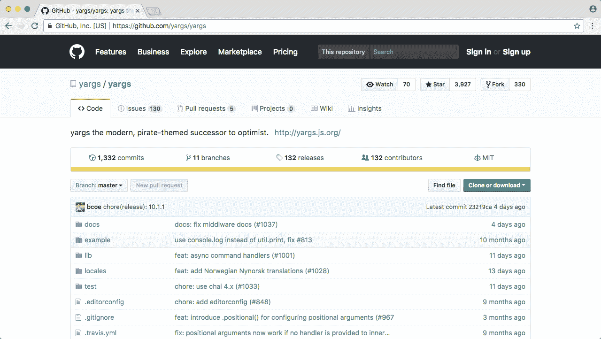

现在，雅格斯是一个非常复杂的图书馆。它有大量的功能来验证各种输入，并且有不同的方式来格式化输入。我们将从一个非常基本的示例开始，尽管在本章中我们将介绍更复杂的示例。

If you want to look at any other features that we don't discuss in the chapter, or you just want to see how something works that we have talked about, you can always find it in the [yarg documents](http://yargs.js.org/docs/).

现在我们将进入终端，在应用中安装此模块。为此，我们将使用`npm install`后跟模块名`yargs`，在本例中，我将使用`@`符号指定我要使用的模块的具体版本 11.0.0，这是撰写本文时的最新版本。接下来，我将添加`save`标志，正如我们所知，它将更新`package.json`文件：

```js
npm install yargs@11.0.0 --save
```

If I leave off the `save` flag, yargs will get installed into the `node_modules` folder, but if we wipe that `node_modules` folder later and run `npm install`, yargs won't get reinstalled because it's not listed in the `package.json` file. This is why we use the `save` flag.

# 流苏

现在我们已经安装了 yargs，我们可以进入 Atom，在`app.js`的内部，开始使用它。yargs 的基本功能是其功能集的核心，很容易利用。我们要做的第一件事就是`require`升级，就像我们在上一章中对`fs`和`lodash`所做的一样。让我们做一个常量，并将其命名为`yargs`，将其设置为`require('yargs')`，如下所示：

```js
console.log('Starting app.js');

const fs = require('fs');
const _ = require('lodash');
const yargs = require('yargs');

const notes = require('./notes.js');

var command = process.argv[2];
console.log('Command:', command);
console.log(process.argv);

if (command === 'add') {
  console.log('Adding new note');
} else if (command === 'list') {
  console.log('Listing all notes');
} else if (command === 'read') {
  console.log('Reading note');
} else if (command === 'remove') {
  console.log('Removing note');
} else {
  console.log('Command not recognized');
}
```

从这里，我们可以在 yargs 解析参数时获取参数。它将采用我们在前一章中讨论过的相同的`process.argv`数组，但它会在幕后对其进行解析，为我们提供比 Node 提供的有用得多的东西。在`command`变量的正上方，我们可以制作一个名为`argv`的`const`变量，将其设置为`yargs.argv`，如下所示：

```js
console.log('Starting app.js');

const fs = require('fs');
const _ = require('lodash');
const yargs = require('yargs');

const notes = require('./notes.js');

const argv = yargs.argv;
var command = process.argv[2];
console.log('Command:', command);
console.log(process.argv);

if (command === 'add') {
  console.log('Adding new note');
} else if (command === 'list') {
  console.log('Listing all notes');
} else if (command === 'read') {
  console.log('Reading note');
} else if (command === 'remove') {
  console.log('Removing note');
} else {
  console.log('Command not recognized');
}
```

`yargs.argv`模块是 yargs 库存储应用运行时使用的参数版本的地方。现在我们可以使用`console.log`打印它，这将让我们看看`process.argv`和`yargs.argv`变量；我们还可以比较它们，看看 yargs 有什么不同。对于使用`console.log`打印`process.argv`的命令，我将第一个参数设置为一个名为`Process`的字符串，以便在终端中区分它。我们会再打`console.log`。第一个参数是`Yargs`字符串，第二个参数是实际的`argv`变量，它来自 yargs：

```js
console.log('Starting app.js');

const fs = require('fs');
const _ = require('lodash');
const yargs = require('yargs');

const notes = require('./notes.js');

const argv = yargs.argv;
var command = process.argv[2];
console.log('Command:', command);
console.log('Process', process.argv);
console.log('Yargs', argv);

if (command === 'add') {
  console.log('Adding new note');
} else if (command === 'list') {
  console.log('Listing all notes');
} else if (command === 'read') {
  console.log('Reading note');
} else if (command === 'remove') {
  console.log('Removing note');
} else {
  console.log('Command not recognized');
}
```

现在，我们可以以几种不同的方式运行我们的应用（参考前面的代码块），看看这两个`console.log`语句有何不同。

首先，我们将使用`add`命令在`node app.js`处运行，我们可以运行这个非常基本的示例：

```js
node app.js add
```

我们已经从上一章中了解了`process.argv`数组的外观。有用的信息是数组中的第三个字符串，即“add”。在第四个字符串中，Yargs 给了我们一个看起来非常不同的对象：

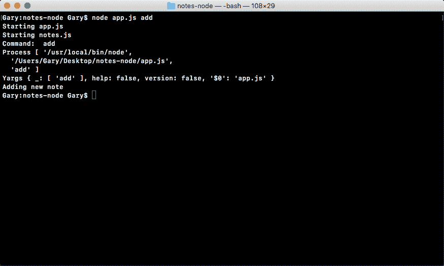

如前面的代码输出所示，首先存储下划线属性，然后存储 add 等命令。

如果我要添加另一个命令，比如说`add`，然后我要添加一个修饰符，比如`encrypted`，你会看到 add 将是第一个参数，加密了第二个参数，如下所示：

```js
node app.js add encrypted
```


到目前为止，yargs 还没有发光。这并不比上一个示例中的有用多少。当我们开始以键值对进行传递时，这才是真正的亮点，例如我们在[第 2 章](02.html)中*Node 基础知识第 1 部分*的*获取输入*部分中使用的标题示例。我可以将我的`title`标志设置为`secrets`，按下*回车*，这一次，我们得到了更有用的东西：

```js
node app.js add --title=secrets
```

在下面的代码输出中，我们需要解析第三个字符串以获取值和键，而在第四个字符串中，我们实际上有一个值为 secrets 的 title 属性：

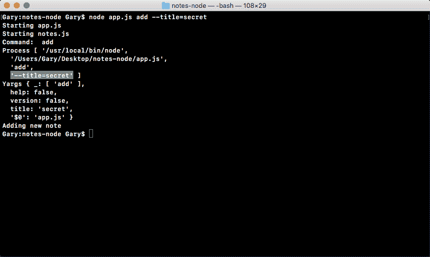

您还可以为所有的解析指定不同的方式。

我们可以在`title`之后插入一个空格，它仍然会像以前一样工作；我们可以在`secrets`周围加引号，也可以在`secrets from Andrew`附近加其他单词，但它仍然会正确解析，将`title`属性设置为`secrets from Andrew`字符串，如下所示：

```js
node app.js add --title "secrets from Andrew"
```

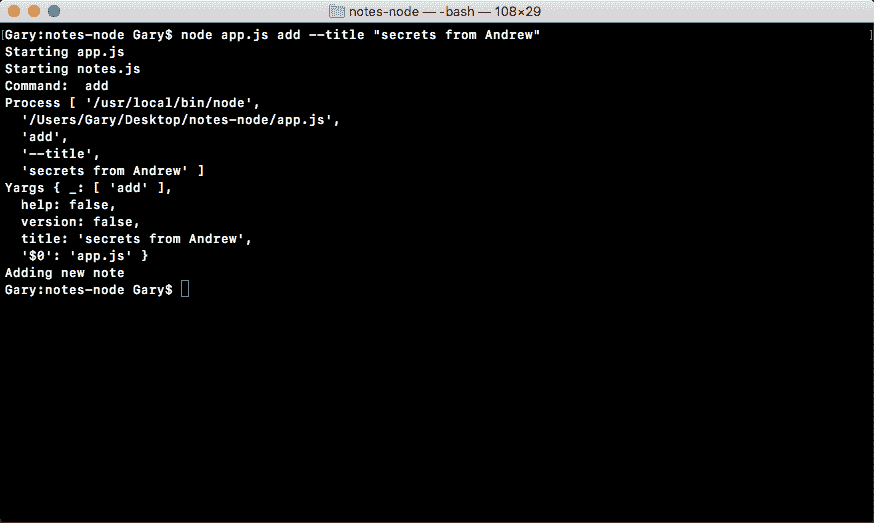

这就是 yargs 真正闪耀的地方！它使解析参数的过程变得容易得多。这意味着在我们的应用中，我们可以利用解析并调用适当的函数。

# 使用 add 命令

例如，让我们使用`add`命令来解析参数和调用函数。一旦调用了`add`命令，我们希望调用`notes`中定义的函数，该函数将负责实际添加注释。`notes.addNote`功能将完成工作。现在，我们想把什么传递给`addNote`函数？我们想要传递两件事：标题，可以在`argv.title`上访问，正如我们在前面的示例中看到的那样；而身体，`argv.body`：

```js
console.log('Starting app.js');

const fs = require('fs');
const _ = require('lodash');
const yargs = require('yargs');

const notes = require('./notes.js');

const argv = yargs.argv;
var command = process.argv[2];
console.log('Command:', command);
console.log('Process', process.argv);
console.log('Yargs', argv);

if (command === 'add') {
  console.log('Adding new note');
  notes.addNote(argv.title, argv.body);
} else if (command === 'list') {
  console.log('Listing all notes');
} else if (command === 'read') {
  console.log('Reading note');
} else if (command === 'remove') {
  console.log('Removing note');
} else {
  console.log('Command not recognized');
}
```

Currently, these command-line arguments, `title` and `body`, aren't required. So technically, the user could run the application without one of them, which would cause it to crash, but in future, we'll be requiring both of these.

现在我们已经准备好了`notes.addNote`，我们可以删除`console.log`语句，它只是一个占位符，我们可以进入 notes 应用`notes.js`。

在`notes.js`中，我们将首先创建一个与我们在`app.js`和`addNote`上使用的方法同名的变量，并将其设置为一个匿名箭头函数，如下所示：

```js
var addNote = () => {

};
```

现在，仅此一项并不太有用，因为我们没有导出`addNote`函数。在变量下面，我们可以用稍微不同的方式定义`module.exports`。在前面的部分中，我们将属性添加到`exports`以导出它们。我们实际上可以定义一个设置为`exports`的整个对象，在这种情况下，我们可以将`addNote`设置为等于前面代码块中定义的`addNote`函数：

```js
module.exports = {
  addNote: addNote
};
```

In ES6, there's actually a shortcut for this. When you're setting an object attribute and a value that's a variable and they're both exactly the same, you can actually leave off the colon and the value. Either way, the result identical.

在前面的代码中，我们将一个对象设置为`module.exports`，该对象有一个属性`addNote`，它指向我们在前面的代码块中定义为变量的`addNote`函数。

同样，`addNote:`和`addNote`在 ES6 内部是相同的。在本书中，我们将对所有内容使用 ES6 语法。

现在我可以接受我的两个参数，`title`和`body`，并实际处理它们。在本例中，我们将调用`console.log`和`Adding note`，将这两个参数作为第二个和第三个参数传递给`console.log`、`title`和`body`，如下所示：

```js
var addNote = (title, body) => {
  console.log('Adding note', title, body);
};
```

现在我们可以很好地运行带有`title`和`body`的`add`命令，看看我们是否得到了预期的结果，这就是前面代码中显示的要打印的`console.log`语句。

在终端上，我们可以用`node app.js`运行应用，然后指定文件名。我们将使用`add`命令；它将运行相应的函数。然后，我们将传入`title`，将其设置为`secret`，然后我们可以传入`body`，这将是我们的第二个命令行参数，将其设置为字符串`This is my secret`：

```js
node app.js add --title=secret --body="This is my secret"
```

在这个命令中，我们指定了三件事：`add`命令`title`参数，设置为`secret`；还有`body`参数，设置为`"This is my secret"`。如果一切顺利，我们会得到适当的日志。让我们运行命令。

在下面的命令输出中，您可以看到添加 note secret，即标题；这是我的秘密，那就是身体：


有了这个，我们现在就有了一个方法，可以开始了。接下来我们要做的是转换其他命令，我们有`list`、`read`和`remove`命令。让我们再研究一个命令，然后你自己做另外两个作为练习。

# 使用 list 命令

现在，通过`list`命令，我将删除`console.log`语句并调用`notes.getAll`，如下所示：

```js
console.log('Starting app.js');

const fs = require('fs');
const _ = require('lodash');
const yargs = require('yargs');

const notes = require('./notes.js');

const argv = yargs.argv;
var command = process.argv[2];
console.log('Command:', command);
console.log('Process', process.argv);
console.log('Yargs', argv);

if (command === 'add') {
  notes.addNote(argv.title, argv.body);
} else if (command === 'list') {
  notes.getAll();
} else if (command === 'read') {
  console.log('Reading note');
} else if (command === 'remove') {
  console.log('Removing note');
} else {
  console.log('Command not recognized');
}
```

在某个时刻，`notes.getAll`将返回所有的注释。现在，`getAll`不接受任何参数，因为它将返回所有注释，而不考虑标题。`read`命令需要一个标题，`remove`还需要您要删除的便笺的标题。

现在，我们可以创建`getAll`函数。在`notes.js`中，我们将再次经历该过程。我们将首先创建一个变量，调用它`getAll`，并将其设置为一个箭头函数，我们以前使用过这个函数。我们从参数`list`开始，然后设置箭头（`=>`，它是等号和大于号。接下来，我们指定要运行的语句。在我们的代码块中，我们将运行`console.log(Getting all notes)`，如下所示：

```js
var getAll = () => {
  console.log('Getting all notes');
};
```

添加分号后流程的最后一步是将`getAll`添加到`exports`中，如下代码块所示：

```js
module.exports = {
  addNote,
  getAll
};
```

Remember that in ES6, if you have a property whose name is identical to the value, which is a variable, you can simply remove the value variable and the colon.

现在我们已经在`notes.js`中安装了`getAll`，并且我们已经在`app.js`中连接了它，我们可以在终端中运行东西。在本例中，我们将运行`list`命令：

```js
node app.js list
```


在前面的代码输出中，您可以在底部看到，将所有注释打印到屏幕上。现在我们已经准备好了，我们可以从`app.js`中的`command`变量中删除`console.log('Process', process.argv)`。生成的代码将类似于以下代码块：

```js
console.log('Starting app.js');

const fs = require('fs');
const _ = require('lodash');
const yargs = require('yargs');

const notes = require('./notes.js');

const argv = yargs.argv;
var command = process.argv[2];
console.log('Command:', command);
console.log('Yargs', argv);

if (command === 'add') {
  notes.addNote(argv.title, argv.body);
} else if (command === 'list') {
  notes.getAll();
} else if (command === 'read') {
  console.log('Reading note');
} else if (command === 'remove') {
  console.log('Removing note');
} else {
  console.log('Command not recognized');
}
```

由于本章我们将探索使用 yargs 的其他方式和方法，因此我们将记录 yargs。

现在我们有了`list`命令，接下来，我希望您为`read`和`remove`命令创建一个方法。

# read 命令

当使用`read`命令时，我们要调用`notes.getNote`，传入`title`。现在，`title`将被传入并使用 yargs 解析，这意味着我们可以使用`argv.title`获取它。在调用函数时，我们所要做的就是：

```js
console.log('Starting app.js');

const fs = require('fs');
const _ = require('lodash');
const yargs = require('yargs');

const notes = require('./notes.js');

const argv = yargs.argv;
var command = process.argv[2];
console.log('Command:', command);
console.log('Yargs', argv);

if (command === 'add') {
  notes.addNote(argv.title, argv.body);
} else if (command === 'list') {
  notes.getAll();
} else if (command === 'read') {
  notes.getNote(argv.title);
} else if (command === 'remove') {
  console.log('Removing note');
} else {
  console.log('Command not recognized');
}
```

下一步是定义`getNote`，因为它目前不存在。在`notes.js`中，在`getAll`变量的正下方，我们可以创建一个名为`getNote`的变量，它将是一个函数。我们将使用 arrow 函数，它将接受一个参数；它将采用`note`标题。`getNote`函数获取标题，然后返回该注释的正文：

```js
var getNote = (title) => {

};
```

在`getNote`内部，我们可以使用`console.log`打印类似`Getting note`的内容，后面是您将获取的便笺的标题，这将是`console.log`的第二个参数：

```js
var getNote = (title) => {
  console.log('Getting note', title);
};
```

这是第一个命令，我们现在可以测试它，然后再继续第二个命令，即`remove`。

在终端，我们可以使用`node app.js`来运行文件。我们将使用新的`read`命令，传入`title`标志。我将使用不同的语法，`title`被设置为等于引号之外的值。我将使用类似于`accounts`的内容：

```js
node app.js read --title accounts
```

该`accounts`值将在将来读取账户注释，并将其打印到屏幕上，如下所示：


正如您在前面的代码输出中所看到的，我们得到了一个错误，我们现在将对其进行调试。

# 处理解析命令中的错误

犯错误并不是世界末日。得到一个错误通常意味着你有一个小的打字错误或你忘记了过程中的一个步骤。因此，我们首先要弄清楚如何解析这些错误消息，因为在代码输出中得到的错误消息可能会让人望而生畏。让我们在这里参考代码输出错误：


如您所见，第一行显示了错误发生的位置。它在我们的`app.js`文件中，冒号后面的数字 19 是行号。它准确地告诉你事情的发展方向。`TypeError: notes.getNote is not a function`行非常清楚地告诉您，您尝试运行的`getNote`函数不存在。现在我们可以获取这些信息并调试我们的应用。

在`app.js`中，我们看到我们称之为`notes.getNote`。一切看起来都很好，但当我们进入`notes.js`时，我们意识到我们从未真正出口过`getNote`。这就是为什么当我们试图调用函数时，我们得到了`getNote is not a function`。我们所要做的就是修复该错误消息导出`getNote`，如下所示：

```js
module.exports = {
  addNote,
  getAll,
  getNote
};
```

现在，当我们保存文件并从终端重新运行应用时，我们将得到我们期望的结果，即获得注释，后面是标题，即帐户，如下所示：

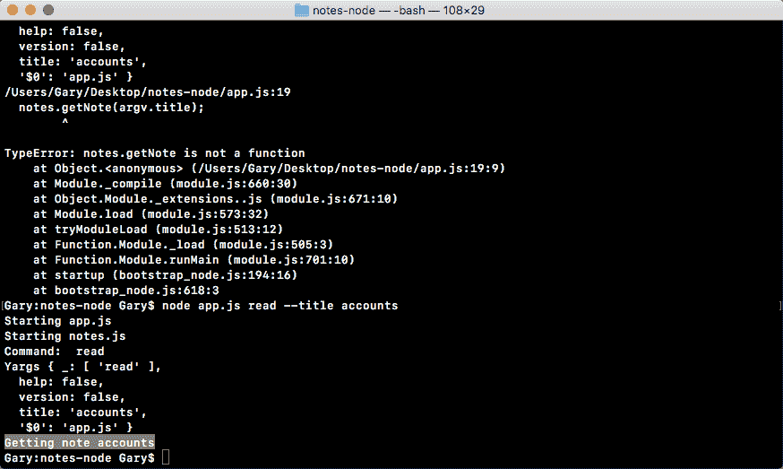

这就是我们调试错误消息的方法。错误消息包含非常有用的信息。在大多数情况下，前几行是您编写的代码，其他几行是内部 Node 代码或第三方模块。在我们的例子中，堆栈跟踪的第一行很重要，因为它准确地显示了错误发生的位置。

# 删除命令

现在，由于`read`命令正在工作，我们可以继续讨论最后一个，即`remove`命令。在这里，我会打电话给`notes.removeNote`，传递标题，我们知道可以在`argv.title`中找到：

```js
console.log('Starting app.js');

const fs = require('fs');
const _ = require('lodash');
const yargs = require('yargs');

const notes = require('./notes.js');

const argv = yargs.argv;
var command = process.argv[2];
console.log('Command:', command);
console.log('Yargs', argv);

if (command === 'add') {
  notes.addNote(argv.title, argv.body);
} else if (command === 'list') {
  notes.getAll();
} else if (command === 'read') {
  notes.getNote(argv.title);
} else if (command === 'remove') {
  notes.removeNote(argv.title);
} else {
  console.log('Command not recognized');
}
```

接下来，我们将在 notes API 文件的内部定义`removeNote`函数，就在`getNote`变量的正下方：

```js
var removeNote = (title) => { 
 console.log('Removing note', title);
};
```

现在，`removeNote`的工作方式与`getNote`基本相同。它所需要的只是标题；它可以使用此信息查找注释并将其从数据库中删除。这将是一个接受`title`参数的 arrow 函数。

在本例中，我们将打印`console.log`语句`Removing note`；然后，作为第二个参数，我们将简单地将`title`打印回屏幕，以确保它成功地完成了整个过程。这一次，我们将导出我们的`removeNote`功能；我们将使用 ES6 语法定义它：

```js
module.exports = {
  addNote,
  getAll,
  getNote,
  removeNote
};
```

最后要做的是测试它并确保它工作正常。我们可以使用向上箭头键重新加载最后一个命令。我们把`read`改为`remove`，这就是我们所需要做的。我们仍在传递`title`论点，这很好，因为这正是`remove`需要的：

```js
node app.js remove --title accounts
```

当我运行这个命令时，我们得到的正是我们所期望的。删除便笺会打印到屏幕上，如下面的代码输出所示，然后我们会得到应该删除的便笺的标题，即 accounts：


这看起来很棒！这就是使用 yargs 解析您的参数所需要的全部。

有了它，我们现在有了一个地方来定义所有这些功能，用于保存、阅读、列出和删除注释。

# 抓取命令

在结束本节之前，我想讨论的最后一件事是如何获取`command`。

正如我们所知，`command`作为第一项也是唯一一项在`_`属性中可用。这意味着在`app.js`、`var command`语句中，我们可以设置`command`等于`argv`，然后设置`._`，然后使用`[]`抓取数组中的第一项，如下代码所示：

```js
console.log('Starting app.js');

const fs = require('fs');
const _ = require('lodash');
const yargs = require('yargs');

const notes = require('./notes.js');

const argv = yargs.argv;
var command = argv._[0];
console.log('Command:', command);
console.log('Yargs', argv);

if (command === 'add') {
  notes.addNote(argv.title, argv.body);
} else if (command === 'list') {
  notes.getAll();
} else if (command === 'read') {
  notes.getNote(argv.title);
} else if (command === 'remove') {
  notes.removeNote(argv.title);
} else {
  console.log('Command not recognized');
}
```

有了这个，我们现在有了相同的功能，但我们将在任何地方使用 yargs。如果我重新运行最后一个命令，我们可以测试该功能是否仍然有效。的确如此！如以下命令输出所示，我们可以看到命令：remove 显示：

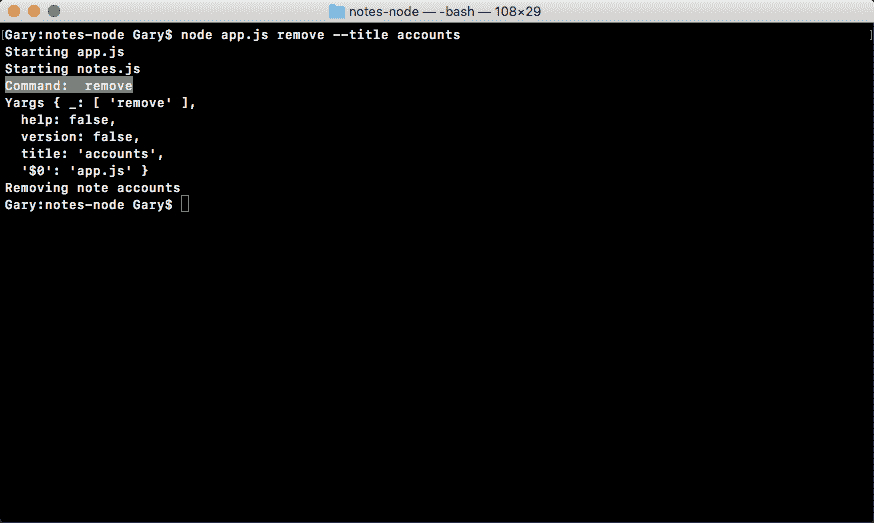

接下来，我们将研究如何填写各个函数。我们将首先了解如何使用 JSON 在文件系统中存储注释。

# JSON

现在您已经知道如何使用`process.argv`和 yargs 解析命令行参数，您已经解决了`notes`应用的第一个难题。现在，我们如何从用户那里获得唯一的输入？第二个难题是解决我们如何存储这些信息。

当有人添加新便笺时，我们希望将其保存在某个地方，最好保存在文件系统上。因此，下次他们试图取回、移除或阅读便条时，他们实际上会取回便条。为此，我们需要引入一种叫做 JSON 的东西。如果您已经熟悉 JSON，您可能知道它非常流行。它代表**JavaScript 对象表示法**，是一种使用字符串表示 JavaScript 数组和对象的方法。现在，你为什么要这么做？

嗯，您可能想这样做，因为字符串只是文本，这在任何地方都几乎受支持。我可以将 JSON 保存到一个文本文件中，然后我可以稍后读取它，将其解析回 JavaScript 数组或对象，并对其进行处理。这正是我们将在本节中看到的。

为了探索 JSON 及其工作原理，让我们在项目中创建一个名为`playground`的新文件夹。

Throughout the book, I'll create the `playground` folders and various projects, which store simple one-off files that aren't a part of the bigger application; they're just a way to explore a new feature or learn a new concept.

在`playground`文件夹中，我们将创建一个名为`json.js`的文件，在这里我们可以探索 JSON 是如何工作的。首先，让我们制作一个非常简单的对象。

# 将对象转换为字符串

让我们首先创建一个名为`obj`的变量，将其设置为一个对象。在这个对象上，我们只定义一个属性`name`，并将其设置为您的名字；我将这个设置为`Andrew`，如下所示：

```js
var obj = {
  name: 'Andrew'
};
```

现在，让我们假设我们想要获取这个对象并对其进行处理。比方说，我们希望在服务器之间以字符串形式发送它，并将其保存到文本文件中。为此，我们需要调用一个 JSON 方法。

让我们花一点时间来定义一个变量来存储结果，AuthT0}，我们将把它设置成等于 T1 T1，如下面所示：

```js
var stringObj = JSON.stringify(obj);
```

`JSON.stringify`方法获取您的对象，在本例中为`obj`变量，并返回 JSON 字符串化版本。这意味着`stringObj`中存储的结果实际上是一个字符串。它不再是一个对象，我们可以使用`console.log`来查看它。我会用`console.log`两次。首先，我们将使用`typeof`操作符打印字符串对象的类型，以确保它实际上是一个字符串。因为`typeof`是一个运算符，所以它是用小写字母输入的，没有驼峰式大小写。然后，传入要检查其类型的变量。接下来，我们可以使用`console.log`打印字符串本身的内容，打印出`stringObj`变量，如下所示：

```js
console.log(typeof stringObj);
console.log(stringObj);
```

我们在这里做的是获取一个对象，将其转换为 JSON 字符串，并将其打印到屏幕上。在终端中，我将使用以下命令导航到`playground`文件夹：

```js
cd playground
```

For now, it doesn't matter where you run the command, but in future it will matter when we are in the `playground` folder, so take a moment to navigate into it.

我们现在可以使用`node`来运行我们的`json.js`文件。运行文件时，我们会看到两件事：

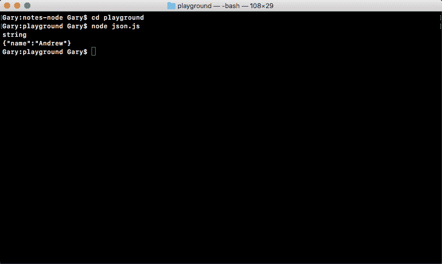

如前面的代码输出所示，首先，我们将得到我们的类型，它是一个字符串，这很好，因为请记住，JSON 是一个字符串。接下来，我们将得到我们的对象，它看起来非常类似于 JavaScript 对象，但有一些不同。这些差异如下：

*   首先，JSON 的属性名将自动用双引号括起来。这是 JSON 语法的一个要求。
*   接下来，您会注意到字符串也用双引号括起来，而不是单引号。

现在，JSON 不仅支持字符串值，还可以使用数组、布尔值、数字或其他任何东西。所有这些类型在 JSON 中都是完全有效的。在本例中，我们有一个非常简单的示例，其中我们有一个`name`属性，它被设置为`"Andrew"`。

这是获取对象并将其转换为字符串的过程。接下来，我们将定义一个字符串，并将其转换为一个可以在应用中实际使用的对象。

# 定义字符串并将应用内用作对象

让我们首先创建一个名为`personString`的变量，我们将使用单引号将其设置为一个字符串，因为 JSON 在其内部使用双引号，如下所示：

```js
var personString = '';
```

然后我们将在引号中定义 JSON。我们先打开和关闭一些花括号。我们将使用双引号创建第一个属性，我们将其称为`name`，并将该属性设置为`Andrew`。这意味着在结束报价后，我们将添加`:`；然后我们将再次打开和关闭双引号，并键入值`Andrew`，如下所示：

```js
var personString = '{"name": "Andrew"}';
```

接下来，我们可以添加另一个属性。在值`Andrew`之后，我将在逗号之后创建另一个属性，称为`age`，它将被设置为等于一个数字。我可以使用冒号，然后定义不带引号的数字，在本例中，`25`：

```js
var personString = '{"name": "Andrew","age": 25}';
```

显然，你可以继续使用你的名字和年龄，但要确保其他的看起来与你在这里看到的一模一样。

现在，假设我们从服务器获取先前定义的 JSON，或者从文本文件获取它。目前，它是无用的；如果我们想要得到`name`值，没有好的方法，因为我们使用的是字符串，所以`personString.name`不存在。我们需要做的是将字符串转换回一个对象。

# 将字符串转换回对象

要将字符串转换回 object，我们将使用`JSON.stringify`的反面，即`JSON.parse`。让我们创建一个变量来存储结果。我将创建一个`person`变量，它将被设置为`JSON.parse`，作为您想要解析的字符串的唯一参数传入，在本例中，是`person`字符串，我们之前定义过：

```js
var person = JSON.parse(personString);
```

现在，这个变量获取 JSON 并将其从字符串转换回其原始形式，可以是数组或对象。在我们的例子中，它将其转换回一个对象，我们将`person`变量作为一个对象，如前面的代码所示。另外，我们可以用`typeof`操作符证明它是一个对象。我将使用`console.log`两次，就像我们以前使用的一样。

首先打印`typeof person`，然后打印实际的`person`变量`console.log(person)`：

```js
console.log(typeof person);
console.log(person);
```

有了它，我们现在可以在终端中重新运行命令；我将实际启动`nodemon`并传入`json.js`：

```js
nodemon json.js 
```

如以下代码输出所示，您现在可以看到我们正在处理一个对象，这非常好，我们有一个常规对象：


我们知道`Andrew`是一个对象，因为它没有用双引号括起来；这些值没有任何引号，我们对`Andrew`使用单引号，这在 JavaScript 中有效，但在 JSON 中无效。

这是获取一个对象，将其转换为字符串，然后获取字符串并将其转换回对象的整个过程，这正是我们在`notes`应用中要做的。唯一的区别是，我们将获取以下字符串并将其存储在文件中，然后，我们将使用`JSON.parse`从文件中读取该字符串以将其转换回对象，如以下代码块所示：

```js
// var obj = {
//  name: 'Andrew'
// };
// var stringObj = JSON.stringify(obj);
// console.log(typeof stringObj);
// console.log(stringObj);

var personString = '{"name": "Andrew","age": 25}';
var person = JSON.parse{personString};
console.log(typeof person);
console.log(person);
```

# 将字符串存储在文件中

有了这些基础知识，让我们再进一步，也就是说，将字符串存储在一个文件中。然后，我们希望使用`fs`模块读取该文件的内容，并从中打印一些属性。这意味着我们需要使用`JSON.parse`将从`fs.readfilesync`返回的字符串转换为对象。

# 在游乐场文件夹中写入文件

让我们继续，注释掉目前为止所有的代码，从头开始。首先，让我们继续加载`fs`模块。`const`变量`fs`将设置为`require`，我们将传递过去使用过的`fs`模块，如下图：

```js
// var obj = {
//  name: 'Andrew'
// };
// var stringObj = JSON.stringify(obj);
// console.log(typeof stringObj);
// console.log(stringObj);

// var personString = '{"name": "Andrew","age": 25}';
// var person = JSON.parse(personString);
// console.log(typeof person);
// console.log(person);

const fs = require('fs');
```

接下来我们要做的是定义对象。该对象将存储在我们的文件中，然后将被读回并解析。这个对象将是一个名为`originalNote`的变量，我们将其称为`originalNote`，因为稍后，我们将加载它并调用该变量`Note`。

现在，`originalNote`将是一个具有两个属性的常规 JavaScript 对象。我们将有`title`属性，我们将其设置为等于`Some title`，以及`body`属性，我们将其设置为等于`Some body`，如下所示：

```js
var originalNote = {
  title: 'Some title',
  body: 'Some body'
};
```

您需要做的下一步是记下原始注释，创建一个名为`originalNoteString`的变量，并将该变量设置为前面定义的对象的 JSON 值。这意味着您需要使用本节前面使用的两种 JSON 方法之一。

现在，一旦你有了`originalNoteString`变量，我们就可以向文件系统写入一个文件。我会为你写这句话，`fs.writeFileSync`。我们以前使用的`writeFileSync`方法有两个参数。一个是文件名，因为我们使用的是 JSON，所以使用 JSON 文件扩展名很重要。我把这个文件称为`notes.json`。其他参数将是文本内容`originalNoteString`，尚未定义，如此代码块所示：

```js
// originalNoteString
fs.writeFileSync('notes.json', originalNoteString);
```

这是过程的第一步；这就是我们将该文件写入`playground`文件夹的方式。该过程的下一步是读取内容，使用前面的 JSON 方法对其进行解析，并将其中一个属性打印到屏幕上，以确保它是一个对象。在本例中，我们将打印标题。

# 读取文件中的内容

打印标题的第一步是使用我们尚未使用的方法。我们将使用文件系统模块上可用的`read`方法来读取内容。让我们创建一个名为`noteString`的变量。`noteString`变量将被设置为等于`fs.readFileSync`。

现在，`readFileSync`与`writeFileSync`类似，只是它不接受文本内容，因为它会为您取回文本内容。在本例中，我们将只指定第一个参数，即文件名`notes.JSON`：

```js
var noteString = fs.readFileSync('notes.json');
```

现在我们有了字符串，您的工作就是获取该字符串，使用前面的方法之一，并将其转换回对象。您可以将该变量称为`note`。下一步，唯一要做的就是通过`console.log(typeof note)`的帮助进行打印，测试事情是否按预期进行。这个标题，我们用下面的`note.title`来打印：

```js
// note
console.log(typeof note);
console.log(note.title);
```

现在，在终端中，您可以看到（参考下面的屏幕截图），我已将文件保存在断开状态，文件崩溃，这是您使用`nodemon`时所期望的：

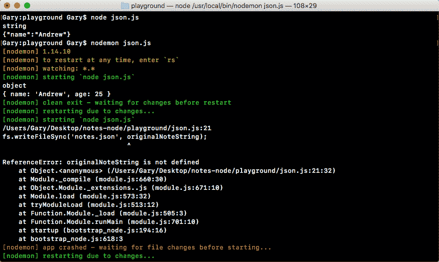

为了解决这个问题，我要做的第一件事就是填写`originalNoteString`变量，我们之前已经注释过了。现在它将是一个名为`originalNoteString`的变量，我们将其设置为等于`JSON.stringify`的返回值。

现在，我们知道`JSON.stringify`接受我们的常规对象，并将该对象转换为字符串。在本例中，我们将获取`originalNote`对象并将其转换为字符串。我们已经填写的下一行将把 JSON 值保存到`notes.JSON`文件中。然后我们将读出该值：

```js
var originalNoteString = JSON.stringify(originalNote);
```

下一步将创建`note`变量。`note`变量将被设置为等于`JSON.parse`。

`JSON.parse`方法获取字符串 JSON 并将其转换回常规 JavaScript 对象或数组，具体取决于您保存的内容。这里我们将传入`noteString`，我们将从文件中获得：

```js
var note = JSON.parse(noteString);
```

有了这些，我们现在就完成了。当我保存此文件时，`nodemon`将自动重新启动，我们希望不会看到错误。相反，我们希望看到对象类型以及注释标题。在终端内部，我们有对象和一些标题打印到屏幕上：

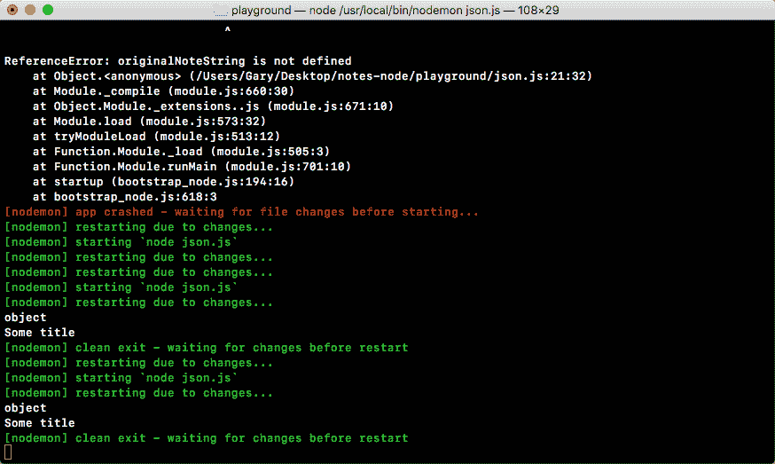

有了这些，我们成功地完成了挑战。这正是我们保存笔记的方式。

当有人添加新便笺时，我们将使用以下代码保存它：

```js
var originalNote = {
  title: 'Some title',
  body: 'Some body'
};
var originalNoteString = JSON.stringify(originalNote);
fs.writeFileSync('notes.json', originalNoteString);
```

当有人想要阅读他们的便条时，我们将使用以下代码来阅读：

```js
var noteString = fs.readFileSync('notes.json');
var note = JSON.parse(noteString);
console.log(typeof note);
console.log(note.title);
```

现在，如果有人想加一张便条怎么办？这将要求我们首先读取所有 notes，然后修改 notes 数组，然后使用代码（参考前面的代码块）将新数组保存回文件系统。

如果您打开该`notes.JSON`文件，您可以在这里看到我们的 JSON 代码在文件中：

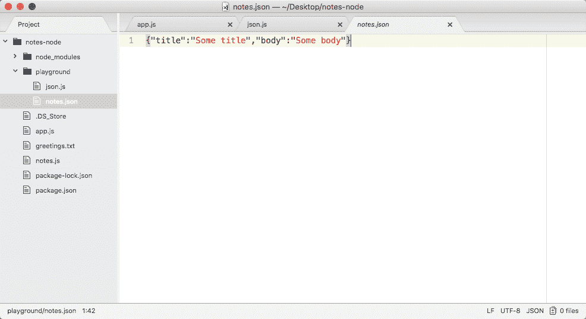

`.json`实际上是一种大多数文本编辑器都支持的文件格式，所以我实际上已经内置了一些漂亮的语法高亮显示。现在，在下一节中，我们将使用与本节中使用的完全相同的逻辑来填充`addNote`函数。

# 添加和保存注释

在上一节中，您学习了如何在 Node.js 中使用 JSON，这正是我们将用于`notes.js`应用的格式。当您第一次运行命令时，我们将加载所有可能已经存在的注释。然后我们将运行该命令，无论是添加、删除还是阅读笔记。最后，如果我们更新了数组，就像添加和删除注释时一样，我们将把这些新注释保存回 JSON 文件中。

现在，这一切都将发生在`addNote`函数内部，我们在`notes.js`应用中定义了该函数，并且我们已经连接了该函数。在前面的部分中，我们运行了 app`add`命令，该函数使用`title`和`body`参数执行。

# 添加注释

首先，我们将使用方括号来创建一个空的数组，我们将使用一个空的方括号来创建它：

```js
var addNote = (title, body) => {
  var notes = [];
};
```

现在我们有了空数组，我们可以继续创建一个名为`note`的变量，它是单独的音符。这将代表新的说明：

```js
var addNote = (title, body) => {
  var notes = [];
  var note = {

  }
};
```

在这一点上，我们将有两个属性：a`title`和 a`body`。现在，`title`可以设置为等于`title`变量，但是，正如我们所知，在 ES6 内部，当两个值相同时，我们可以简单地删除它；因此我们将添加`title`和`body`，如下所示：

```js
var addNote = (title, body) => {
  var notes = [];
  var note = {
    title,
    body
  };
};
```

现在我们有了`note`和`notes`阵列。

# 将注释添加到注释数组

添加注释过程的下一步是将`note`添加到`notes`数组中。`notes.push`方法可以让我们做到这一点。数组上的`push`方法允许您传入一个项，该项被添加到数组的末尾，在本例中，我们将传入`note`对象。因此，我们有一个空数组，并添加一项，如下面的代码所示；接下来，我们将其推入，这意味着我们有一个包含一项的数组：

```js
var addNote = (title, body) => {
  var notes = [];
  var note = {
    title,
    body
  };

  notes.push(note);
};
```

该过程的下一步是更新该文件。现在，我们没有文件，但是我们可以加载一个`fs`函数并开始创建文件。

在`addNote`函数上方，让我们加载`fs`模块。我将创建一个名为`fs`的`const`变量，并将其设置为等于`require`的返回结果，我们将需要`fs`模块，它是一个核心 Node 模块，因此无需使用 NPM 进行安装：

```js
const fs = require('fs');
```

有了这个，我们可以利用`addNote`函数中的`fs`。

在我们将物品推送到`notes`阵列后，我们将调用`fs.writeFileSync`，我们以前使用过它。我们知道需要传入两件事：文件名和要保存的内容。对于该文件，我将调用`notes-data.JSON`，然后传入要保存的内容，在本例中为`stringify`notes 数组，这意味着我们可以调用`JSON.stringify`传入`notes`：

```js
notes.push(note);
fs.writeFileSync('notes-data.json', JSON.stringify(notes));
```

We could have broken `JSON.stringfy(notes)` out into its own variable and referenced the variable in the above statement, but since we'll only be using it in one place, I find this is the better solution.

此时，当我们添加新注释时，它将更新`notes-data.JSON`文件，该文件将在机器上创建，因为它不存在，并且注释将位于其中。现在，重要的是要注意，当前每次添加新注释时，它都会删除所有现有注释，因为我们从未加载现有注释，但我们可以开始测试该注释是否按预期工作。

我将保存该文件，在终端内部，我们可以使用`node app.js`运行该文件。因为我们想要添加一个`note`，我们将使用我们设置的`add`命令，然后我们将指定我们的标题和身体。`title`标志可以设置为等于`secret`，对于`body`标志，我将其设置为等于`Some body here`字符串，如下所示：

```js
node app.js add --title=secret --body="Some body here"
```

现在，当我们从终端运行此命令时，我们将看到我们所期望的：

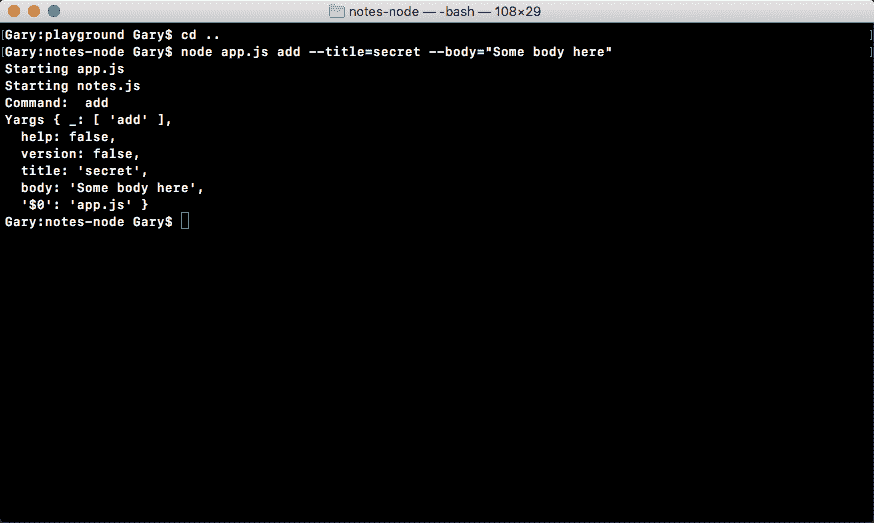

如前一个屏幕截图所示，我们看到了我们添加的两个文件命令：我们看到执行了`add`命令，我们有 Yargs 参数。标题和正文参数也会显示出来。在 Atom 内部，我们还看到了一个新的`notes-data.json`文件，在下面的屏幕截图中，我们看到了我们的注释，带有`secret`标题和`Some body here`正文：


这是连接`addNote`功能的第一步。我们有一个现有的`notes`文件，我们确实希望利用这些笔记。如果便笺已经存在，我们不希望每次有人添加新便笺时都简单地擦除它们。这意味着在`notes.js`中，在`addNote`函数的前面，我们将获取这些注释。

# 获取新笔记

我将添加获取新便笺的代码，其中定义了`notes`和`note`变量。如下面的代码所示，我们将使用`fs.readFileSync`，这是我们已经研究过的。在我们的例子中，这将采用文件名`notes-data.JSON`。现在，我们要将来自`readFileSync`的返回值存储在一个变量上；我将这个变量称为`notesString`：

```js
var notesString = fs.readFileSync('notes-data.json');
```

因为这是字符串版本，所以我们没有通过`JSON.parse`方法传递它。因此，我可以将`notes`（我们之前在`addNote`函数中定义的变量）设置为等于`JSON.parse`方法的返回值。然后`JSON.parse`将从我们读取的文件中获取字符串，并将其解析为一个数组；我们可以这样通过`notesString`：

```js
notes = JSON.parse(notesString);
```

这样，添加一个新的注释就不会再删除所有已经存在的注释。

在终端中，我将使用向上箭头键加载最后一个命令，然后导航到`title`标志并将其更改为`secret2`并重新运行该命令：

```js
node app.js add --title=secret2 --body="Some body here"
```

在 Atom 中，这次您可以看到我们的文件中有两个注释：


我们有一个包含两个对象的数组；第一个标题为`secret`，第二个标题为`secret2`，太棒了！

# 尝试并捕获代码块

现在，如果`notes-data.json`文件不存在，当用户第一次运行命令时，它将不存在，程序将崩溃，如下面的代码输出所示。我们可以通过删除`note-data.JSON`文件后重新运行最后一个命令来证明这一点：


在这里，你可以看到我们实际上得到了一个 JavaScript 错误，没有这样的文件或目录；它试图打开`notes-data.JSON`文件，但没有多大成功。为了解决这个问题，我们将使用 JavaScript 中的`try`-`catch`语句，希望您在过去已经看到过。为了复习这个，让我们快速复习一下。

要创建一个`try`-`catch`语句，只需键入`try`，这是一个保留关键字，然后打开和关闭一组大括号。大括号内是将要运行的代码。这是可能引发或不引发错误的代码。接下来，您将指定`catch`块。现在，`catch`块将接受一个参数，一个错误参数，并且它还有一个运行的代码块：

```js
try{

} catch (e) {

}
```

当且仅当`try`中的一个错误实际发生时，此代码才会运行。因此，如果我们使用`readFileSync`加载文件，并且文件存在，那么`catch`块将永远不会运行。如果失败，`catch`块将运行，我们可以采取措施从错误中恢复。有了它，我们所要做的就是将`noteString`变量和`JSON.parse`语句移到`try`中，如下所示：

```js
try{
  var notesString = fs.readFileSync('notes-data.json');
  notes = JSON.parse(notesString);
} catch (e) {

}
```

就这样,；没有其他事情需要发生。我们不需要在`catch`中放入任何代码，尽管您确实需要定义`catch`块。现在，让我们来看看当我们运行整个代码时会发生什么。

发生的第一件事是，我们创建静态变量，没有什么特别的，然后我们尝试加载到文件中。如果`notesString`函数失败，这是可以的，因为我们已经将`notes`定义为空数组。如果文件不存在并且失败了，那么我们可能希望为`notes`创建一个空数组，因为显然没有`notes`，也没有文件。

接下来，我们将把这些数据解析为注释。如果`notes-data.JSON`文件中存在无效数据，则此操作可能会失败，因此这两行可能会出现问题。通过将它们放在`try`-`catch`中，我们基本上可以保证程序不会意外工作，不管文件是否存在，但它包含损坏的数据。

有了这个，我们现在可以保存`notes`并重新运行之前的命令。请注意，我没有准备好`notes-data`文件。当我运行命令时，我们没有看到任何错误，一切似乎都按预期运行：


当您现在访问 Atom 时，您可以看到`notes-data`文件确实存在，并且其中的数据看起来很棒：

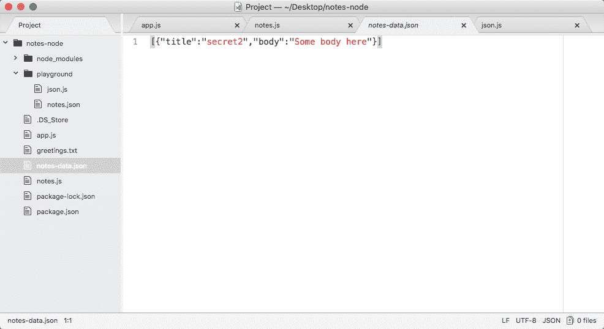

这就是我们获取注释、使用新注释更新注释以及最终将注释保存到屏幕所需的全部操作。

现在，`addNote`还有一个小问题。目前，`addNote`允许重复标题；我可能已经在 JSON 文件中有了一个标题为`secret`的注释。我可以来尝试添加一个标题为`secret`的新便笺，它不会抛出错误。我想做的是使标题唯一，这样，如果已经有一个具有该标题的注释，它将抛出一个错误，让您知道您需要创建一个具有不同标题的注释。

# 使标题独一无二

使标题唯一的第一步是在加载所有注释后循环查看它们，并检查是否有重复的注释。如果存在重复项，我们将不调用以下两行：

```js
notes.push(note);
fs.writeFileSync('notes-data.json', JSON.stringify(notes));
```

如果没有重复项，那么就可以了，我们将调用前面代码块中显示的两行代码，更新`notes-data`文件。

现在，我们将重构这个函数。事情变得有点不稳定，有点失控，但目前，我们可以将此功能添加到函数中。让我们继续做一个名为`duplicateNotes`的变量。

`duplicateNotes`变量最终将存储一个数组，其中包含`notes`数组中已存在的所有注释，这些注释的标题为您试图创建的注释。现在，这意味着如果`duplicateNotes`数组中有任何项目，那就糟糕了。这意味着注释已经存在，我们不应该添加注释。`duplicateNotes`变量将被设置为调用`notes`，这是我们的`notes.filter`数组：

```js
var duplicateNotes = notes.filter();
```

`filter`方法是接受回调的数组方法。我们将使用一个 arrow 函数，该回调函数将被参数调用。在这种情况下，它将是单数版本；如果我有一个注释数组，它将被单独的注释调用：

```js
var duplicateNotes = notes.filter((note) => {

});
```

该函数对数组中的每个项调用一次，您有机会返回 true 或 false。如果您返回 true，它将在数组中保留该项，该项最终将保存到`duplicateNotes`中。如果返回 false，它生成的新数组将不会在`duplicateNotes`变量中包含该项。如果标题匹配，我们只想返回 true，这意味着我们可以返回`note.title === title`，如下所示：

```js
var duplicateNotes = notes.filter((note) => {
  return note.title === title;
});
```

如果标题相等，则前面的`return`语句将结果为 true，并且该项将保留在数组中，这意味着存在重复的注释。如果标题不相等（很可能是这种情况），则该声明将被视为虚假，这意味着没有重复的注释。现在，我们可以使用箭头函数将其简化一点。

Arrow functions actually allow you to remove the curly braces if you only have one statement.

我将使用箭头函数，如下所示：

```js
var duplicateNotes = notes.filter((note) => note.title === title);
```

在这里，我删除了除`note.title === title`之外的所有内容，并将其添加到箭头函数语法之前。

这在使用 ES6 箭头函数时非常有效。在左边有参数，箭头，在右边有一个表达式。表达式不带分号，它会自动作为函数结果返回。这意味着我们这里的代码与前面的代码完全相同，只是更简单，只占用一行。

现在我们已经准备好了，我们可以继续检查`duplicateNotes`变量的长度。如果`duplicateNotes`的长度大于`0`，这意味着我们不想保存注释，因为已经存在具有该标题的注释。如果是`0`，我们将保存便条。

```js
if(duplicateNotes.length === 0) {

}
```

这里，在`if`条件内，我们将音符长度与数字 0 进行比较。如果它们相等，那么我们确实希望将注释推送到`notes`数组并保存文件。我将剪切以下两行：

```js
notes.push(note);
fs.writeFileSync('notes-data.json', JSON.stringify(notes));
```

让我们将它们粘贴到`if`语句的内部，如下所示：

```js
if(duplicateNotes.length === 0) {
  notes.push(note);
  fs.writeFileSync('notes-data.json', JSON.stringify(notes));
}
```

如果他们不平等，那也没关系；那样的话，我们什么也不做。

有了它，我们现在可以保存文件并测试此功能。我们有我们的`notes-data.json`文件，这个文件已经有一个标题为`secret2`的注释。让我们重新运行上一个命令，尝试添加具有相同标题的新便笺：

```js
node app.js add --title=secret2 --body="Some body here"
```

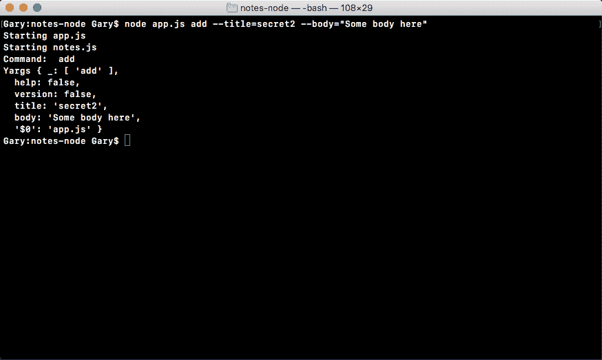

您在终端，所以我们将返回 JSON 文件。你可以在这里看到，我们还有一个注意事项：


现在，我们应用中的所有标题都是唯一的，因此我们可以使用这些标题来获取和删除注释。

让我们继续测试是否还可以添加其他注释。我将`title`标志从`secret2`更改为`secret`，并运行该命令：

```js
node app.js add --title=secret --body="Some body here"
```

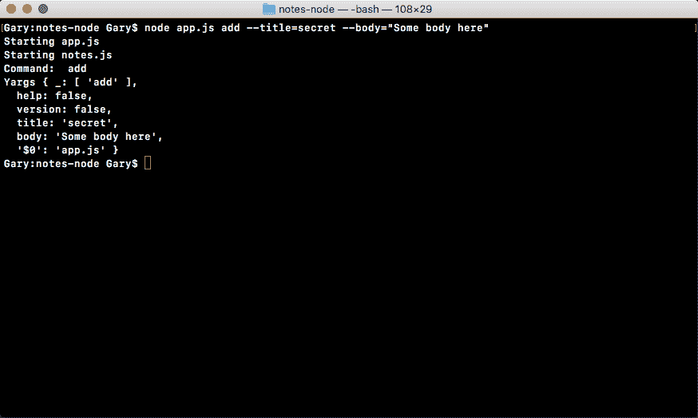

在我们的`notes-data`文件中，您可以看到两个注释显示：


正如我前面提到的，接下来我们将进行一些重构，因为加载文件的代码和保存文件的代码都将用于我们已经定义和/或将要定义的大多数函数（即，`getAll`、`getNote`和`removeNote`函数）。

# 重构

在上一节中，您创建了`addNote`函数，该函数运行良好。它首先创建一些静态变量，然后我们获取任何现有的注释，检查重复的注释，如果没有，我们将其推到列表上，然后将数据保存回文件系统。

唯一的问题是，对于每种方法，我们都会一遍又一遍地重复这些步骤。例如，使用`getAll`，我们的想法是获取所有笔记，并将它们发送回`app.js`，以便它可以为用户将它们打印到屏幕上。在`getAll`语句中，我们要做的第一件事是使用相同的代码；我们将使用我们的`try`-`catch`区块来获取现有票据。

现在，这是一个问题，因为我们将在整个应用中重复代码。最好将抓取笔记和保存笔记分离成单独的函数，我们可以在多个位置调用这些函数。

# 将功能移动到单个功能中

为了解决这个问题，我想先创建两个新函数：

*   `fetchNotes`
*   `saveNotes`

第一个函数`fetchNotes`将是一个箭头函数，它将不接受任何参数，因为它将从文件系统获取注释，如下所示：

```js
var fetchNotes = () => {

};
```

第二个函数`saveNotes`需要接受一个参数。它需要将要保存到文件系统的`notes`数组。我们将它设置为一个箭头函数，然后我们将提供我们的参数，我将其命名为`notes`，如下所示：

```js
var saveNotes = (notes) => {

};
```

现在我们有了这两个功能，我们可以继续并开始将一些功能从`addNote`向上移动到各个功能中。

# 使用 fetchNotes

首先，我们来做`fetchNotes`，它需要下面的`try`-`catch`块。

我会将它从`addNote`中剪切出来，粘贴到`fetchNotes`函数中，如下所示：

```js
var fetchNotes = () => {
  try{
    var notesString = fs.readFileSync('notes-data.json');
    notes = JSON.parse(notesString);
  } catch (e) {

}
};
```

这还不够，因为目前我们没有从函数返回任何内容。我们要做的是把钞票还回去。这意味着，我们不需要将来自`JSON.parse`的结果保存到`notes`变量上（我们还没有定义），而只需将其返回给调用函数，如下所示：

```js
var fetchNotes = () => {
  try{
    var notesString = fs.readFileSync('notes-data.json');
    return JSON.parse(notesString);
  } catch (e) {

}
};
```

因此，如果我在`addNote`函数中调用`fetchNotes`，如下所示，我将得到`notes`数组，因为前面代码中有`return`语句。

现在，如果没有笔记，可能根本就没有文件；或者有一个文件，但数据不是 JSON，我们可以返回一个空数组。我们将在`catch`中添加一个`return`语句，如下面的代码块所示，因为记住，`try`中的任何内容失败时，`catch`将运行：

```js
var fetchNotes = () => {
  try{
    var notesString = fs.readFileSync('notes-data.json');
    return JSON.parse(notesString);
  } catch (e) {
    return [];
}
};
```

现在，这让我们进一步简化`addNote`。我们可以删除空的空格，我们可以取我们在`notes`变量上设置的数组并删除它，然后调用`fetchNotes`，如下所示：

```js
var addNote = (title, body) => {
  var notes = fetchNotes();
  var note = {
      title,
      body
};
```

有了这个，我们现在拥有了与以前完全相同的功能，但我们有一个可重用的功能，`fetchNotes`，我们可以在`addNote`函数中使用它来处理我们的应用将支持的其他命令。

我们不再复制代码并将其放在文件中的多个位置，而是将其拆分为一个位置。如果我们想更改此功能的工作方式，无论是更改文件名还是某些逻辑，例如`try`-`catch`块，我们都可以更改一次，而不必在我们拥有的每个函数中都更改它。

# 使用 saveNotes

现在，`saveNotes`的情况与`fetchNotes`函数的情况相同。`saveNotes`函数将接受`notes`变量，并使用`fs.writeFileSync`表示。我将在`addNote`中剪下这一行（即`fs.writeFileSync('notes-data.json', JSON.stringfy(notes));`并粘贴到`saveNotes`功能中，如下所示：

```js
var saveNotes = (notes) => {
  fs.writeFileSync('notes-data.json', JSON.stringify(notes));
};
```

现在，`saveNotes`不需要归还任何东西。在这种情况下，我们将复制`saveNotes`中的行，然后在`addNote`函数的`if`语句中调用`saveNotes`，如下代码所示：

```js
if (duplicateNotes.length === 0) {
  notes.push(note);
  saveNotes();
}
```

这似乎有些过分，我们基本上只使用了一行代码，用另一行代码替换了它，但是开始养成创建可重用函数的习惯是个好主意。

现在，在没有数据的情况下调用`saveNotes`是行不通的，我们想传入`notes`变量，这是我们前面在`saveNotes`函数中定义的`notes`数组：

```js
if (duplicateNotes.length === 0) {
  notes.push(note);
  saveNotes(notes);
}
```

有了这个功能，`addNote`函数现在应该可以像我们进行任何重构之前一样工作了。

# 测试功能

在下一个步骤中，将创建新注释。我们已经有了两个注释，`notes-data.json`中的标题是`secret`和`secret2`，让我们使用终端中的`node app.js`命令制作第三个注释。我们将使用`add`命令并传入一个标题`to buy`和一个正文`food`，如下所示：

```js
node app.js add --title="to buy" --body="food"
```

这将创建一个新的注释，如果我运行该命令，您可以看到我们没有任何明显的错误：


在我们的`notes-data.json`文件中，如果我向右滚动，我们有一个全新的注释，标题为`to buy`，正文为`food`：


因此，尽管我们已经重构了代码，但一切都按预期进行。现在，我想在`addNote`中做的下一件事是花点时间返回正在添加的便条，这将在`saveNotes`返回后立即发生。那么我们将返回`note`：

```js
if (duplicateNotes.length === 0) {
  notes.push(note);
  saveNotes(notes);
  return note;
}
```

这个`note`对象将返回给调用函数的人，在这种情况下，它将返回到`app.js`，我们在`app.js`文件中`add`命令的`if else`块中调用它。我们可以创建一个变量来存储此结果，我们可以将其称为`note`：

```js
if (command === 'add')
  var note = notes.addNote(argv.title, argv.body);
```

如果`note`存在，那么我们知道便笺是创建的。这意味着我们可以继续打印一条消息，比如`Note created`，我们可以打印`note`标题和`note`正文。现在，如果`note`不存在，如果它未定义，这意味着有一个副本，并且该标题已经存在。如果是这种情况，我希望您打印一条错误消息，如`Note title already in use`。

There's a ton of different ways you could do this. The goal, though, is to print two different messages depending on whether or not a note was returned.

现在，在`addNote`内部，如果`duplicateNotes``if`语句从未运行，我们就没有显式的返回调用。但正如您所知，在 JavaScript 中，如果您不调用`return`，那么`undefined`将自动返回。这意味着如果`duplicateNotes.length`不等于零，将返回 undefined，我们可以将其作为语句的条件。

这里我要做的第一件事是创建一个`if`语句，就在`app.js`中定义的`note`变量旁边：

```js
if (command === 'add') {
  var note = notes.addNote(argv.title, argv.body);
  if (note) {

  }
```

如果事情进展顺利，这将是一个对象，如果事情进展不顺利，这将是一个未定义的对象。这里的代码只有在它是对象时才会运行。`Undefined`结果将不符合 JavaScript 内部的条件。

现在，如果`note`创建成功，我们将使用以下`console.log`语句在屏幕上打印一条小消息：

```js
if (note) {
  console.log('Note created');
}
```

如果情况不好，在`else`子句中，我们可以调用`console.log`，我们可以打印类似`Note title taken`的内容，如下所示：

```js
if (note) {
  console.log('Note created');
} else {
  console.log('Note title taken');
}
```

现在，如果一切顺利，我们想做的另一件事是打印`notes`内容。我将首先使用`console.log`打印几个连字符。这将在我的笔记上方创建一个小空间。然后我可以使用`console.log`两次：第一次打印标题时，我将添加`Title:`作为字符串，以显示您看到的内容，然后我可以连接标题，我们可以在`note.title`中访问该标题，如以下代码所示：

```js
if (note) {
  console.log('Note created');
  console.log('--');
  console.log('Title: ' + note.title);
```

现在，前面的语法使用 ES5 语法；我们可以用 ES6 语法替换它，使用我们已经讨论过的：模板字符串。我们将添加一个冒号`Title`，然后我们可以使用带花括号的美元符号来注入`note.title`变量，如下所示：

```js
console.log(`Title: ${note.title}`);
```

类似地，我将在这之后添加`note.body`以打印注释的正文。这样，代码应该如下所示：

```js
if (command === 'add') {
  var note = note.addNote(argv.title, argv.body);
  if (note) {
    console.log('Note created');
    console.log('--');
    console.log(`Title: ${note.title}`);
    console.log(`Body: ${note.body}`);
  } else {
    console.log('Note title taken');
}
```

现在，我们应该能够运行我们的应用，并看到打印的标题和正文说明。在终端中，我将重新运行上一个命令。这将尝试使用 to buy 创建一个便笺，该便笺已存在，因此我们将收到一条错误消息，您可以在此处看到便笺标题：


现在，我们可以重新运行该命令，将标题更改为其他内容，例如`to buy from store`。这是一个独特的`note`标题，因此创建注释时应该没有任何问题：

```js
node app.js add --title="to buy from store" --body="food"
```

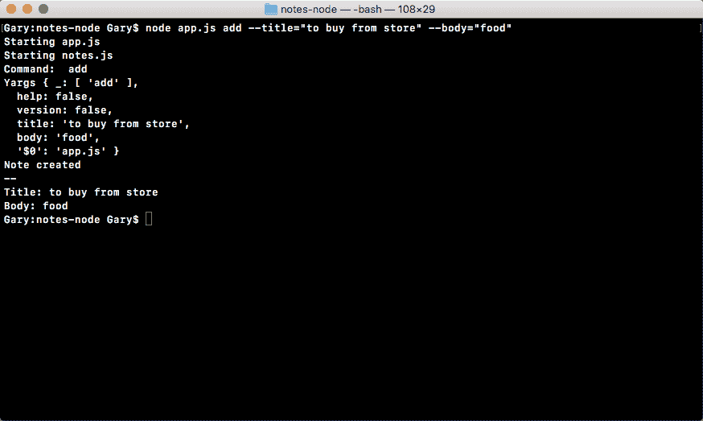

如前面的输出所示，您可以看到我们得到的只是：我们有我们的便笺创建的消息、我们的小间隔符和标题以及正文。

`addNote`命令现在完成。当命令实际完成时，我们有一个输出，我们有在后台运行的所有代码，用于将注释添加到存储在文件中的数据中。

# 总结

在本章中，您了解到在`process.argv`中解析可能是一件非常痛苦的事情。我们必须编写大量手动代码来解析那些连字符、等号和可选引号。然而，yargs 可以为我们做所有这些，它把它放在一个我们可以访问的非常简单的对象上。您还学习了如何在 Node.js 中使用 JSON。

接下来，我们填写了`addNote`函数。我们可以使用命令行添加注释，并且可以将这些注释保存到 JSON 文件中。最后，我们将大量的代码从`addNote`中提取出来，放入单独的函数`fetchNotes`和`saveNotes`，现在这两个函数是分开的，它们可以在整个代码中重用。当我们开始填写其他方法时，我们可以简单地调用`fetchNotes`和`saveNotes`，而不必一遍又一遍地将内容复制到每个新方法中。

在下一章中，我们将继续学习 Node 基础知识。我们将探讨更多与 Node 相关的概念，例如调试；我们将处理`read`和`remove`notes 命令。除此之外，我们还将了解 yargs 的高级功能和箭头功能。