# 九、将应用部署到 Web

在本章中，我们将担心添加版本控制和部署应用，因为在创建真实世界的 Node 应用时，将应用部署到 Web 显然是其中相当重要的一部分。现在在现实世界中，每个公司都使用某种形式的版本控制。它对软件开发过程至关重要，而且他们中的大多数人都没有使用 Git。Git 已经变得非常流行，在版本控制方面占据了市场份额。Git 也是免费的、开源的，并且有大量优秀的教育材料。他们有一本关于如何学习 Git 的书。它是免费的，堆栈溢出充满了 Git 特有的问题和答案。

我们将使用 Git 来保存我们的项目。我们还将使用它将我们的工作备份到一个名为 GitHub 的服务，最后我们将使用 Git 将我们的 project live 部署到 Web 上。因此，我们将能够使用我们的 web 服务器并将其部署给任何人访问。它不仅仅在本地主机上可用。

具体来说，我们将研究以下主题：

*   设置和使用 Git
*   设置 GitHub 和 SSH 密钥
*   将 Node 应用部署到 web
*   整个开发生命周期的工作流

# 添加版本控制

在本节中，我们将学习如何设置和使用 Git，这是一个版本控制系统。Git 将让我们跟踪项目随时间的变化。当出现问题时，这非常有用，我们需要恢复到项目中以前的工作状态。它对于支持我们的工作也非常有用。

# 安装 Git

首先，我们需要在计算机上安装 Git，但幸运的是，这是一个非常简单的安装过程。这是一个安装程序，我们只需通过几个步骤点击 Next 按钮。那么让我们继续做吧。

1.  我们可以通过进入浏览器并进入[git-scm.com](http://git-scm.com)获取安装程序。

Before we go ahead and install it, I want to show you the link to the book called Pro Git ([https://git-scm.com/book/en/v2](https://git-scm.com/book/en/v2)). It is a free book and also available for online reading. It covers everything that Git has to offer. We'll be looking at some of the more basic features in this chapter, but we could easily create an entire course on Git. There actually are Udemy courses just on Git and GitHub, so if you want to learn more than what we cover in this book, I'd recommend reading this book or checking out a course, whatever your preferred learning method is.

2.  对于所有操作系统，无论是 Windows、Linux 还是 macOS，单击主页右侧的下载按钮。这将带我们到安装程序页面，我们应该能够让安装程序自动下载。如果您发现[SourceForge.net](http://SourceForge.net)有任何问题，那么我们可能需要实际点击它手动下载才能开始下载。

3.  一旦下载了安装程序，我们就可以简单地运行它。
4.  接下来，浏览安装程序：


5.  单击“继续”并安装软件包：

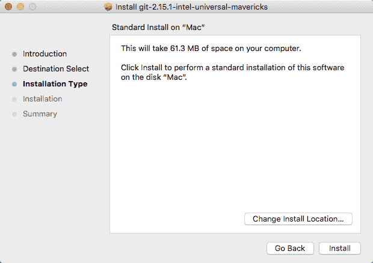

6.  完成后，我们可以继续实际测试是否成功安装：

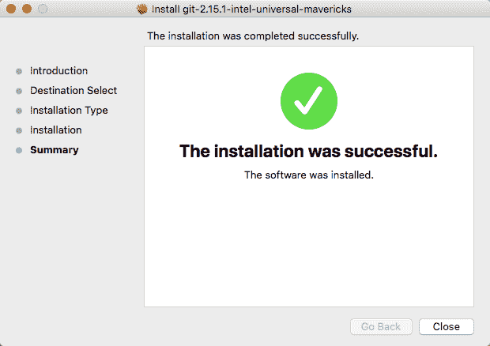

# macOS 上的 Git

如果您使用的是 macOS，则需要启动软件包安装程序，您可能会收到以下消息框，说明它来自身份不明的开发人员：


这是因为它是通过第三方分发的，而不是在 macOS 应用商店中。我们可以继续，右键单击包，然后单击打开按钮，确认确实要打开它。

一旦你进入安装程序，这个过程将会非常简单。基本上，您可以在每个步骤中单击“继续”和“下一步”。

# Windows 上的 Git

如果您使用的是 Windows，则有一个重要的区别。在安装程序中，您将看到如下屏幕：


安装 Git Bash 非常重要，如屏幕截图所示。Git Bash 是一个模拟 Linux 类型终端的程序，在下一节中创建 SSH 密钥以唯一标识机器时，它将非常重要。

# 测试安装

现在，让我们进入终端测试安装。从终点站我们可以继续运行`git --version`。这将打印我们安装的 Git 的新版本：

```js
git --version
```

如下面的屏幕截图所示，我们可以看到我们有 git 版本 2.14.3：

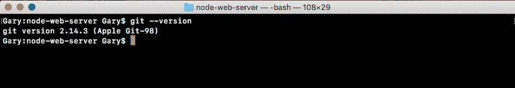

Now if you have your Terminal still open and you're getting an error like git command not found, I'd recommend trying to restart your Terminal. Sometimes that is required when you're installing new commands such as the `git` command, which we just installed.

# 将 Node web 服务器目录转换为 Git 存储库

随着 Git 的成功安装，我们现在准备将`node-web-server`目录转换为 Git 存储库。为此，我们将使用以下命令：

```js
git init
```

`git init`命令需要从项目的根目录执行，该文件夹包含我们想要跟踪的所有内容。在我们的例子中，`node-web-server`就是那个文件夹。它有我们的`server.js`文件、我们的`package.json`文件和我们所有的目录。因此，我们将从服务器文件夹运行`git init`：


这将在该文件夹中创建一个`.git`目录。我们可以通过运行`ls -a`命令来证明：

```js
ls -a
```

如下面的屏幕截图所示，我们得到了所有目录，包括隐藏的目录，在这里我确实有.git：


For Windows, go ahead and run these commands from the Git Bash.

现在，我们不应该手动更新此目录。我们将使用来自终端的命令来更改 Git 文件夹。

You don't want to be going in there manually messing around with things because there's a pretty good chance you're going to corrupt the Git repository and all of your hard work is going to become useless. Now obviously if it's backed up, it's not a big deal, but there really is no reason to go into that Git folder.

让我们使用`clear`命令清除终端输出，现在我们可以开始了解 Git 的工作原理。

# 使用 Git

如前所述，Git 负责跟踪项目的更改，但默认情况下，它实际上并不跟踪我们的任何文件。我们必须准确地告诉 Git 我们希望它跟踪哪些文件，这是有充分理由的。每个项目中都有我们最不想添加到 Git 回购中的文件，稍后我们将讨论哪些文件以及为什么要添加这些文件。现在，让我们继续运行以下命令：

```js
git status
```

现在，所有这些命令都需要从项目根目录内部执行。如果您尝试在存储库之外运行此操作，您将得到一个错误，如 git repository not found。这意味着 Git 无法找到`.git`目录以实际获取存储库的状态。

当我们运行此命令时，将得到如下输出：

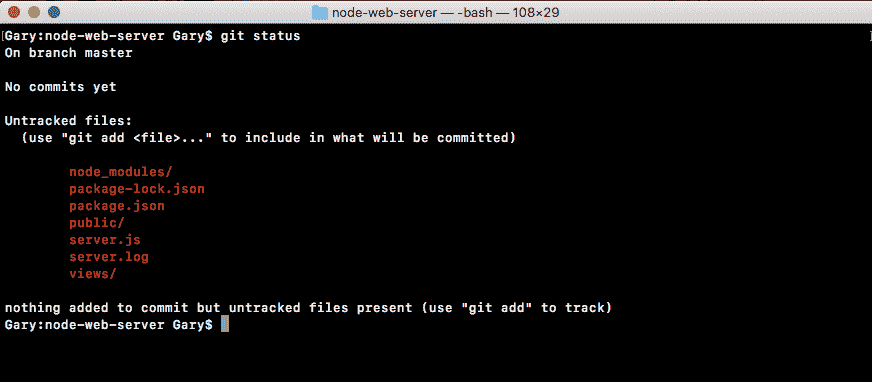

现在最重要的部分是 untrackedfiles 头和它下面的所有文件。这些都是 Git 截获的文件和文件夹，但它目前没有跟踪。Git 不知道您是想跟踪这些文件的更改，还是想从存储库中忽略它们。

例如，`views`文件夹就是我们绝对想要跟踪的东西。这将是项目的关键，我们希望确保每当有人下载存储库时，他们都会得到`views`文件夹。另一方面，日志文件实际上不需要包含在 Git 中。一般来说，我们不会提交日志文件，因为它们通常包含特定于服务器运行时某个时间点的信息。

如前面的代码输出所示，我们有`server.js`、我们的公用文件夹和`package.json`。这些都是执行应用过程中必不可少的。这些肯定会添加到我们的 Git 存储库中，上面的第一个就是`node_modules`文件夹。`node_modules`文件夹称为生成文件夹。

通过运行命令可以轻松生成生成的文件夹。在我们的例子中，我们可以使用`npm install`重新生成整个目录。我们不想将 Node 模块添加到 Git 存储库中，因为它的内容因您安装的 npm 版本和所使用的操作系统而异。最好不要使用 Node 模块，让每个使用您的存储库的人在实际运行应用的机器上手动安装模块。

# 添加要提交的未跟踪文件

现在我们已经列出了这六个文件夹和文件，所以让我们继续添加要保留的四个文件夹和文件。首先，我们将使用任何`git add`命令。`git add`命令让我们告诉 Git 我们想要跟踪某个文件。让我们键入以下命令：

```js
git add package.json
```

这样做之后，我们可以再次运行它`git status`，这次我们得到了非常不同的结果：

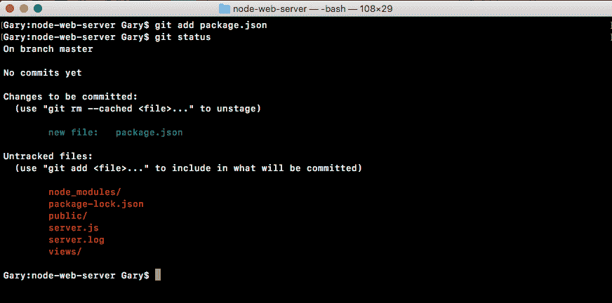

现在我们有了一个初始提交头。这是新的，我们有旧的未跟踪文件头。请注意，在未跟踪文件下，我们不再有`package.json`。将上移到初始提交头。这些是我们第一次提交时要保存的所有文件，也称为提交文件。现在我们可以继续添加其他 3 个。我们将再次使用`git add`命令告诉 Git 我们要跟踪公共目录。我们可以运行一个`git status`命令来确认它是按预期添加的：

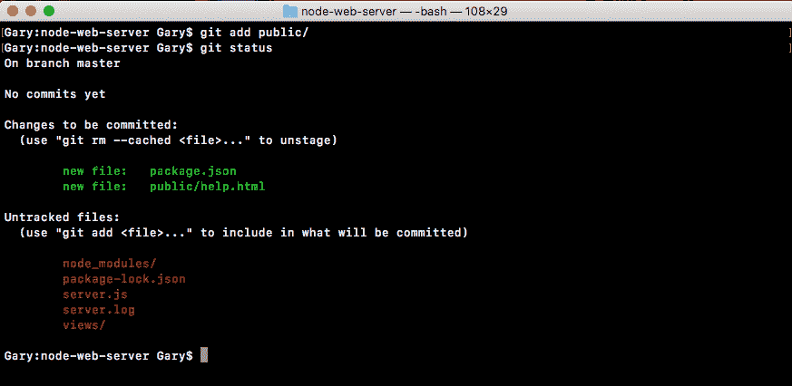

如前面的屏幕截图所示，我们可以看到 public/help.html 文件现在将在运行 commit 后提交到 Git。

接下来我们可以用`git add server.js`添加`server.js`，也可以用`git add views`添加`views`目录，如下图：

```js
git add server.js

git add views/
```

我们将运行`git status`命令来确认：


一切看起来都很好。现在，未跟踪的文件将被搁置在这里，直到我们执行以下两项操作之一：要么将它们添加到 Git 存储库，要么使用将在 Atom 内部创建的自定义文件忽略它们。

在 Atom 内部，我们希望在项目的根目录中创建一个名为`.gitignore`的新文件。`gitignore`文件将成为我们 Git 存储库的一部分，它告诉 get 您想要忽略哪些文件夹和文件。在这种情况下，我们可以继续忽略`node_modules`，如下所示：


当我们保存`gitignore`文件并从终端重新运行`git status`时，我们现在将得到一个完全不同的结果：

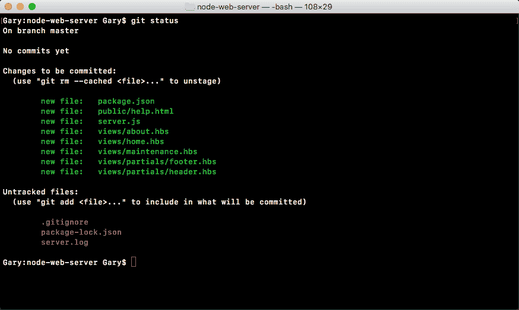

如图所示，我们可以看到有一个新的未跟踪文件-`.gitignore`-`node_modules`目录不见了，这正是我们想要的。我们希望完全删除它，确保它永远不会被添加到 Git 回购中。下一步，我们可以通过键入其名称`server.log`忽略该`server.log`文件：

```js
node modules/
server.log
```

我们将保存`gitignore`，再次从终端运行`git status`，并确保一切看起来都很好：

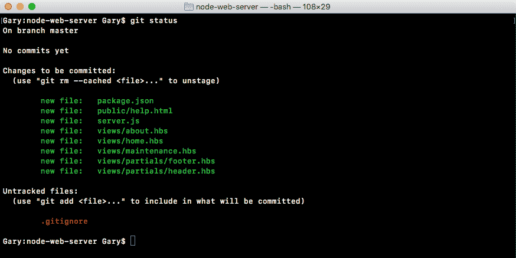

如图所示，我们有一个`gitignore`文件作为唯一未跟踪的文件。`server.log`文件和`node_modules`都看不见了。

现在我们有了`gitignore`，我们将使用`git add .gitignore`将其添加到 Git 中，当我们运行`git status`时，我们应该能够看到显示的所有文件都在初始提交下：

```js
git add .gitignore

git status
```


所以现在是时候做出承诺了。提交实际上只需要两件事。它需要在存储库中进行一些更改。在本例中，我们正在教 Git 如何跟踪大量新文件，因此我们确实在更改某些内容，这需要一条消息。我们已经处理了文件部分的事情。我们已经告诉 Git 我们想要保存什么，但实际上我们还没有保存它。

# 作出承诺

为了进行第一次提交并将第一件事保存到 Git 存储库中，我们将运行`git commit`并提供一个标志，`m`标志，即短消息。在内部引用之后，我们可以指定要用于此提交的消息。使用这些消息非常重要，因此当有人在查看提交历史记录时，可以看到项目所有更改的列表，这实际上很有用。在这种情况下，`Initial commit`对于您的第一次提交总是一个好消息：

```js
git commit -m 'Initial commit'
```

我将继续并点击*回车*，如以下屏幕截图所示，我们可以看到回购协议发生的所有变化：


我们在 Git 存储库中创建了一堆新文件。这些都是我们告诉 Git 我们想要跟踪的文件，这太棒了。

我们现在有了第一次提交，这基本上意味着我们已经保存了项目的当前状态。如果我们对`server.js`做了一个大的改变，把事情搞得一团糟，弄不清楚如何让它恢复原状，我们总是可以让它恢复原状，因为我们做了一个 Git 提交。现在，我们将在后面的部分中探索一些更奇特的 Git 内容。我们将讨论如何使用 Git 完成大部分您想做的事情，包括部署到 Heroku 和推送到 GitHub。

# 设置 GitHub 和 SSH 密钥

现在您已经有了一个本地 Git 存储库，我们将研究如何获取该代码并将其推送到名为 GitHub 的第三方服务。GitHub 将允许我们远程托管我们的 Git 存储库，因此，如果我们的机器发生故障，我们可以收回我们的代码，而且它还具有强大的协作工具，因此我们可以开放项目的源代码，让其他人使用我们的代码，或者我们可以把它保密，这样只有我们选择合作的人才能看到源代码。

现在，为了在我们的机器和 GitHub 之间进行真正的通信，我们必须创建一个称为 SSH 密钥的东西。SSH 密钥设计用于在两台计算机之间安全通信。在本例中，它将是我们的机器和 GitHub 服务器。这将让我们确认 GitHub 就是他们所说的那个人，也将让 GitHub 确认我们确实有权访问我们试图修改的代码。这一切都将通过 SSH 密钥完成，我们将首先创建它们，然后配置它们，最后将代码推送到 GitHub。

# 设置 SSH 密钥

设置 SSH 密钥的过程可能是一个真正的负担。这是其中一个错误空间非常小的主题。如果您键入了任何错误的命令，事情就不会像预期的那样正常工作。

现在，如果您使用的是 Windows，那么您将需要从 Git Bash 而不是常规命令提示符执行本节中的所有操作，因为我们将使用一些 Windows 上不可用的命令。但是，它们可以在 Linux 和 macOS 上使用。因此，如果您正在使用这些操作系统中的任何一种，您可以继续使用您在本书中一直使用的终端。

# SSH 密钥文档

在我们深入了解这些命令之前，我想向您展示一个在线的快速指南，以防您遇到困难或有任何问题。您可以通过谷歌搜索 GitHub SSH 密钥，这将链接到一篇名为生成 SSH 密钥的文章：[https://help.github.com/articles/connecting-to-github-with-ssh/](https://help.github.com/articles/connecting-to-github-with-ssh/) 。在这里，您可以单击 SSH breadcrumb，这将带您回到他们关于 SSH 密钥的所有文章：


在这些文章中，嵌套的四篇是我们将重点检查是否有密钥、生成新密钥、将密钥添加到 GitHub，以及最终测试一切是否按预期工作的文章。如果您在这些步骤中遇到任何问题，您可以随时单击该步骤的指南，然后选择您正在使用的操作系统，以便查看适用于该操作系统的相应命令。既然你知道这是存在的，让我们一起去做吧。

# 处理命令

我们将从终端运行的第一个命令是检查我们是否有一个现有的 SSH 密钥。如果你不这样做，那没关系。我们将继续创建一个。如果您有或不确定是否有，您可以运行以下命令来确认是否有：`ls`带有`al`标志。这将打印给定目录中的所有文件，默认情况下，您机器上存储 SSH 密钥的目录将位于用户目录，您可以使用（`~`作为`/.ssh`的快捷方式：

```js
ls -al ~/.ssh
```

运行该命令时，您将看到该 SSH 目录中的所有内容：

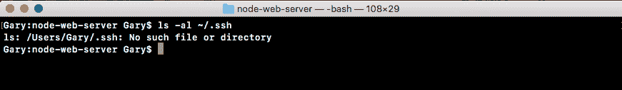

在本例中，我删除了所有 SSH 密钥，因此目录中没有任何内容。我只有当前目录和上一个目录的路径。现在我们已经准备好了，并且我们已经确认我们没有密钥，我们可以继续生成一个。如果您已经有一个密钥，一个类似于`id_rsa`的文件，您可以继续并跳过生成密钥的过程。

# 生成密钥

要制作一把钥匙，我们将使用`ssh-keygen`命令。现在，`ssh-keygen`有三个参数。我们将通过`t`设置为`rsa`。我们将传入用于字节的`b`，将其设置为`4096`。确保这些参数完全匹配，我们将设置一个大写`C`标志，该标志将被设置为与您的电子邮件相同：

```js
ssh-keygen -t rsa -b 4096 -C 'garyngreig@gmail.com'
```

Now the scope of what's actually happening behind the scenes is not part of this book. SSH keys and setting up security, that could be an entire course in and of itself. We'll be using this command to simplify the entire process.

现在我们可以继续并点击*输入*，这将在我们的`.ssh`文件夹中生成两个新文件。当您运行这个命令时，您将看到一些步骤。我希望您对所有这些选项都使用默认值：

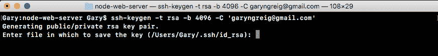

在这里，他们想问您是否要自定义文件名。我不建议这样做。点击*进入*即可：


接下来他们会问你一个密码短语，我们不会用。如果没有密码，我会点击*输入*，然后我需要确认密码，所以我会再次点击*输入*：


如图所示，我们得到一个小消息，说明 SSH 密钥已正确创建，并且确实已保存在我们的文件夹中。

有了这个，我现在可以循环使用我以前运行的`ls`命令，我得到了什么？

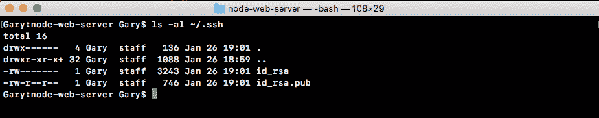

我们得到`id_rsa`，我得到`id_rsa.pub`文件。`id_rsa`文件包含私钥。这是你不应该给任何人的钥匙。它只存在于您的机器上。`.pub`文件，即公共文件。这是您将提供给第三方服务（如 GitHub 或 Heroku）的服务，我们将在接下来的几节中进行介绍。

# 启动 SSH 代理

既然已经生成了密钥，我们需要做的最后一件事就是启动 SSH 代理并添加这个密钥，以便它知道它存在。我们将通过运行两个命令来实现这一点。这些是：

*   `eval`
*   `ssh-add`

首先我们将运行`eval`，然后我们将打开一些引号，在引号内，我们将使用美元符号，并打开和关闭一些括号，如下所示：

```js
eval "$()"
```

在括号内，我们将键入带有`s`标志的`ssh-agent`：

```js
eval "$(ssh-agent -s)"
```

这将启动 SSH 代理程序，它还将打印进程 ID 以确认它确实正在运行，如图所示，我们得到代理 pid 1116：


过程 ID 显然对每个人都是不同的。只要你能得到这样的东西，你就可以走了。

接下来，我们必须告诉 SSH 代理这个文件所在的位置。我们将使用`ssh-add`来实现这一点。这将获取我们在用户目录`/.ssh/id_rsa`中的私钥文件的路径：

```js
ssh-add ~/.ssh/id_rsa
```

当我运行此操作时，应该会收到一条消息，如添加了 identity：

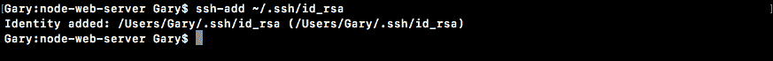

这意味着本地计算机现在知道这个公钥/私钥对，并且在与第三方服务（如 GitHub）通信时将尝试使用这些凭据。现在我们已经准备好了，可以配置 GitHub 了。我们将创建一个帐户，设置它，然后我们将返回并测试一切是否按预期工作。

# 配置 GitHub

要配置 GitHub，请执行以下步骤：

1.  首先进入浏览器，进入[github.com](https://github.com/)。
2.  在这里登录到您现有的帐户或创建一个新帐户。如果你需要一个新的，注册 GitHub。如果您已有一个，请继续并登录。
3.  登录后，您将看到以下屏幕。这是您的 GitHub 仪表板：


4.  从这里，导航到配置文件图片左侧上方的设置。转到设置| SSH 和 GPG 密钥| SSH 密钥：


5.  从这里我们可以添加公钥，让 GitHub 知道我们想要使用 SSH 进行通信。

6.  添加新的 SSH 密钥：

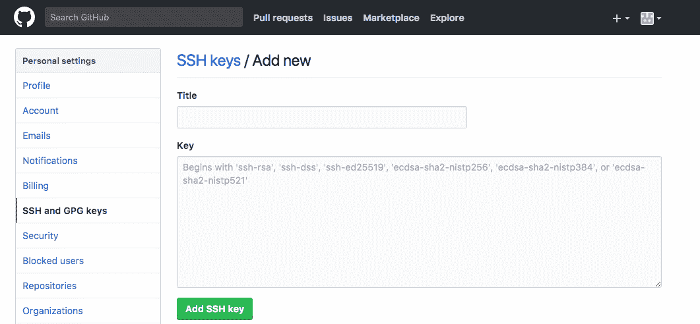

在这里，您需要做两件事：给它一个名称，并添加密钥。

首先添加名称。名字可以是你喜欢的任何东西。例如，我通常使用一个唯一标识我的计算机，因为我有一对夫妇。我会用`MacBook Pro`，就像这样。


接下来，添加密钥。

要添加密钥，我们需要获取前面小节中生成的`id_rsa.pub`文件的内容。该文件包含 GitHub 在我们的机器和他们的机器之间安全通信所需的信息。有不同的方法来获取密钥。在浏览器中，我们有一篇向 GitHub 帐户文章添加新 SSH 密钥的文章供我们参考。

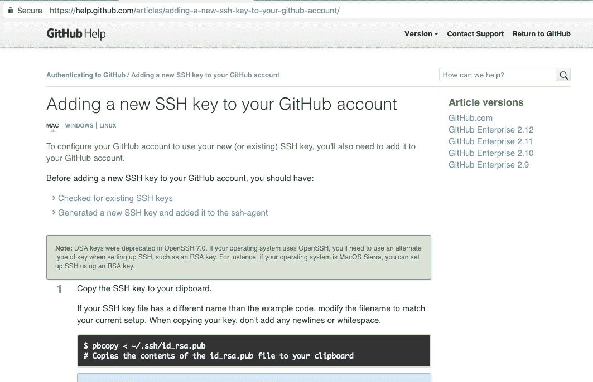

7.  这包含一个命令，您可以使用该命令将该文件的内容从终端内部复制到剪贴板。现在很明显，对于操作系统、macOS、Windows 和 Linux，它是不同的，所以请为您的操作系统运行该命令。

8.  使用适用于 macOS 的`pbcopy`命令。

然后，进入终端并运行它。

```js
 pbcopy < ~/.ssh/id_rsa.pub
```

这会将文件内容复制到剪贴板。您还可以使用常规文本编辑器打开该命令并复制文件的内容。我们可以使用任何方法复制文件。你怎么做并不重要。重要的是你做什么。

9.  现在回到 GitHub，单击文本区域并粘贴它。

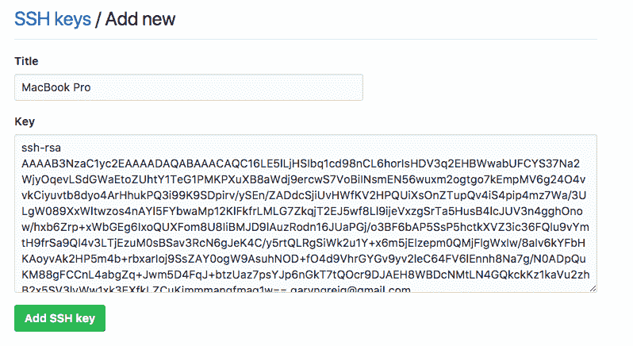

`id_rsa.pub`的内容应以`ssh-rsa`开头，并以您使用的电子邮件结尾。

10.  完成后，继续并单击 AddSSHKey。

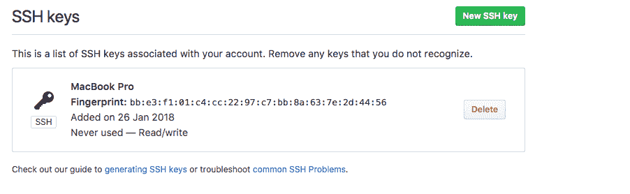

现在，我们可以通过从终端运行一个命令来测试工作是否正常。同样，此命令可以在计算机上的任何位置执行。您不需要在项目文件夹中执行此操作。

# 测试配置

为了测试 GitHub 配置的工作情况，我们将使用`ssh`，它尝试建立连接。我们将使用`T`标志，后面是我们要连接到您的 URL，网址为`git@github.com`：

```js
ssh -T git@github.com
```

这将测试我们的连接。它将确保 SSH 密钥设置正确，并且我们可以安全地与 GitHub 通信。当我运行该命令时，我收到一条消息说无法确定主机“github.com（192.30.253.113）”的真实性。

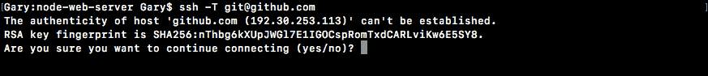

我们知道我们想与[github.com](http://www.github.com)交流。我们期待着沟通的发生，所以我们可以继续进入`yes`：


从这里，我们从 GitHub 服务器获得一条消息，如前面的屏幕截图所示。如果你用你的用户名看到这条消息，那么你就完成了。您已经准备好创建第一个存储库并向上推送代码。

Now if you don't see this message, something went wrong along the way. Maybe the SSH key wasn't generated correctly or it's not getting recognized by GitHub.

接下来，我们将进入 GitHub，返回主页，并创建一个新的存储库。

# 创建新存储库

要创建新存储库，请执行以下步骤：

1.  在 GitHub 主页的右角，导航到 New repository 按钮，该按钮应如下所示（如果是新项目，请单击 Start New Project）：

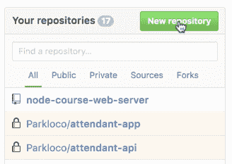

这将引导我们进入新的存储库页面：

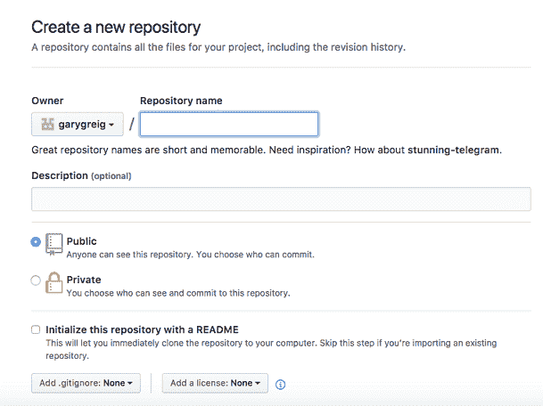

2.  在这里，我们需要做的就是给它起个名字。我将称之为`node-course-2-web-server`：


一旦你有了一个名字，你可以给它一个可选的描述，你可以选择你想使用公共还是私有的存储库。

Now private repositories do put you on a $7 plan. I do recommend that if you're creating projects with other companies.

3.  不过，在本例中，我们创建的是非常简单的项目，如果其他人找到了代码，这其实并不重要，所以请点击该选项使用公共存储库。


4.  完成这两项内容后，单击创建存储库按钮：


这将被带到您的存储库页面：


它将为您提供一些设置，因为目前没有代码可供查看，因此它将根据您所处的情况为您提供一些说明。

# 设置存储库

现在，在前面的三个设置说明中，我们不需要创建新存储库的说明。我们不打算使用它从其他 URL 导入代码。我们拥有的是一个现有的存储库，我们希望从命令行推送它。

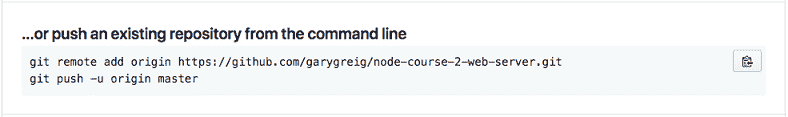

我们将从项目内部运行以下两个命令：

*   第一个为我们的 Git 存储库添加了一个新的 remote
*   第二个命令将把它推送到 GitHub

Remotes 让 Git 知道要与哪些第三方 URL 同步。也许我想把我的代码推送到 GitHub，与我的同事交流。也许我也想推到 Heroku 来部署我的应用。这意味着你需要两个遥控器。在本例中，我们只添加一个，因此我将复制此 URL，移动到终端，粘贴它，然后点击*输入*：

```js
git remote add origin https://github.com/garygreig/node-course-2-web-server.git
```

现在我们已经添加了`git remote`，我们可以继续运行第二个命令了。我们将在本书中广泛使用第二个命令。在终端中，我们可以复制粘贴第二个命令的代码，并运行它：

```js
git push -u origin master
```

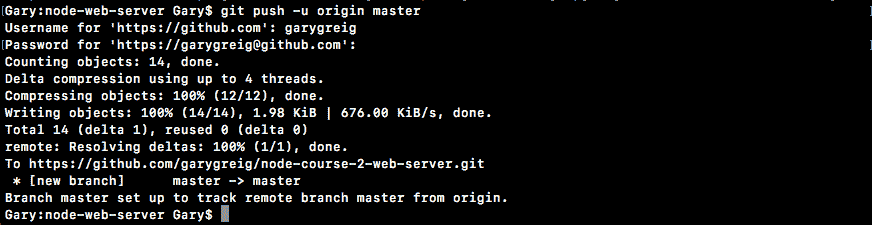

如前面的截图所示，我们可以看到一切都很顺利。我们能够成功地将所有数据写入 GitHub，如果我们返回浏览器并刷新页面，我们将不再看到这些设置说明。相反，我们将看到我们的存储库，有点像树状视图：


在这里我们可以看到我们的`server.js`文件，非常棒。我们没有看到日志文件或`node_module`文件，这很好，因为我们忽略了这一点。我有我的公用目录。一切都很顺利。我们也有问题跟踪，拉请求。您可以创建一个 Wiki 页面，用于设置存储库的说明。GitHub 提供了很多非常棒的特性。我们将只使用最基本的功能。

在我们的存储库中，我们可以看到我们有一个提交，如果我们单击这个提交按钮，您实际上可以转到提交页面，在这里我们可以看到我们键入的初始提交消息。我们在上一节中做出了承诺：

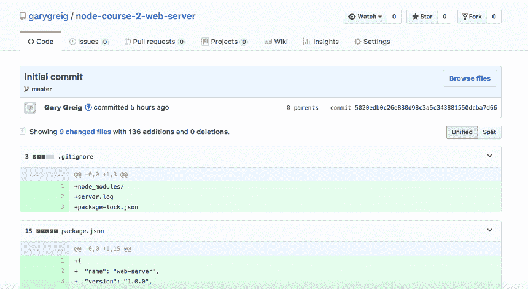

这将使我们能够跟踪所有代码，在进行不必要的更改时进行恢复，并管理存储库。现在我们的代码已经升级了，我们完成了。

# 将 Node 应用部署到 Web

在本节中，您将使用 Heroku 将 Node 应用实时部署到 Web。在本节结束时，您将拥有可以提供给任何人的 URL，他们将能够在浏览器中访问该 URL 以查看应用。我们将通过 Heroku 完成这项工作。

Heroku 是一个网站。它是一个用于管理云中托管的 web 应用的 web 应用。这是一个非常好的服务。它们使得创建新的应用、部署应用、更新应用以及添加诸如日志记录和错误跟踪等很酷的附加功能变得几乎毫不费力，所有这些都是内置的。现在 Heroku 和 GitHub 一样，不需要信用卡就可以注册，并且有一个免费的层，我们将使用它。他们已经为几乎所有的事情支付了计划，但是我们可以在本节中为我们将要做的所有事情使用免费层。

# 安装 Heroku 命令行工具

首先，我们将打开浏览器并访问[heroku.com](https://www.heroku.com/)。在这里，我们可以继续注册一个新帐户。花点时间登录到现有的或注册一个新的。登录后，它将显示仪表板。现在，您的仪表板将如下所示：

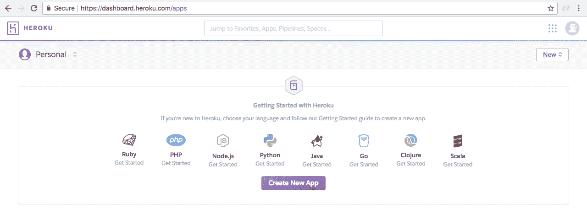

尽管可能会有一个问候语告诉您创建一个新的应用，但您可以忽略它。我有很多应用。你可能没有这些。那很好。

接下来我们要做的是安装 Heroku 命令行工具。这将使我们能够创建应用、部署应用、打开应用，并从终端执行各种非常酷的操作，而无需进入 web 应用。这将节省我们的时间，使开发更加容易。我们可以访问[toolbelt.heroku.com](https://devcenter.heroku.com/articles/heroku-cli)获取下载。


在这里，我们可以为您运行的任何操作系统获取安装程序。那么，让我们开始下载。这是一个非常小的下载，所以它应该发生得很快。

完成后，我们可以继续并运行整个流程：

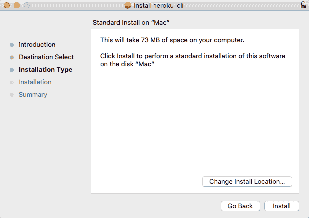

这是一个简单的安装程序，您只需单击 Install。不需要定制任何东西。您不必输入有关 Heroku 帐户的任何特定信息。让我们继续并完成安装程序。

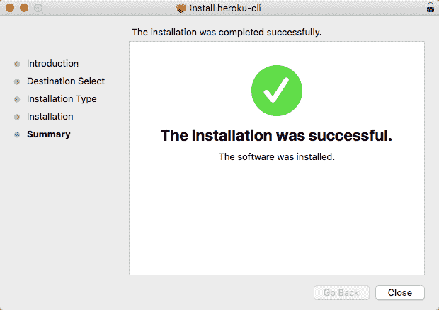

这将从终端给我们一个新的命令，我们可以执行。在此之前，我们必须在终端本地登录，这正是我们下一步要做的。

# 在本地登录 Heroku 帐户

现在我们从终点站出发。如果已经在运行该命令，则可能需要重新启动它，以便操作系统能够识别新命令。您可以通过运行以下命令来测试它是否已正确安装：

```js
heroku --help
```

运行此命令时，您将看到它是第一次安装 CLI，然后我们将获得所有帮助信息。这将告诉我们可以访问哪些命令以及它们的具体工作方式：

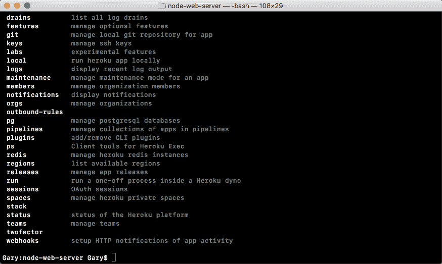

现在我们需要在本地登录 Heroku 帐户。这个过程非常简单。在前面的代码输出中，我们有所有可用的命令，其中一个恰好是 login。我们可以这样运行`heroku login`来启动流程：

```js
heroku login
```

我将运行`login`命令，现在我们只使用之前设置的电子邮件和密码：


我会输入我的电子邮件和密码。键入密码是隐藏的，因为它是安全的。当我这样做时，您会看到登录为 garyngreig@gmail.com 出现了，这太棒了：


现在我们已经登录，并且能够成功地在机器的命令行和 Heroku 服务器之间进行通信。这意味着我们可以开始创建和部署应用。

# 获取 Heroku 的 SSH 密钥

现在，在继续之前，我们将使用`clear`命令清除终端输出并在 Heroku 上获取 SSH 密钥，就像我们在 GitHub 上所做的一样，只有这次我们可以通过命令行来完成。所以这会容易得多。为了向 Heroku 添加本地密钥，我们将运行`heroku keys:add`命令。这将扫描 SSH 目录并添加密钥：

```js
heroku keys:add
```

在这里你可以看到它找到了一个密钥`id_rsa.pub`文件：你想把它上传到 Heroku 吗？。


键入`Yes`并点击*进入*：

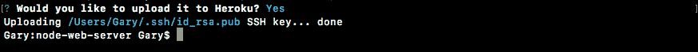

现在我们上传了我们的钥匙。就这么多了。比使用 GitHub 配置要容易得多。从这里，我们可以使用`heroku keys`命令打印我们帐户上当前的所有密钥：

```js
heroku keys
```

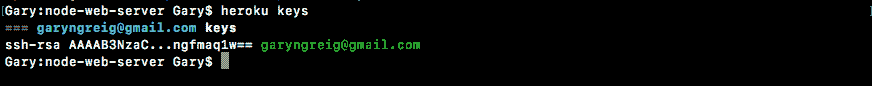

我们总是可以使用`heroku keys:remove`命令和与该密钥相关的电子邮件来删除它们。在这种情况下，我们将保留现有的 Heroku 密钥。接下来，我们可以使用带有`v`标志和`git@heroku.com`的 SSH 测试我们的连接：

```js
ssh -v git@heroku.com
```

这将与 Heroku 服务器通信：

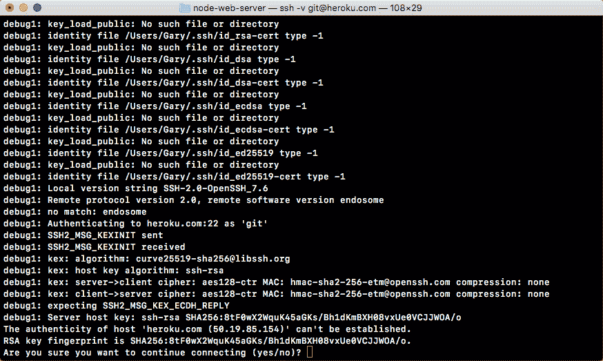

如图所示，我们可以看到它提出了同样的问题：无法确定主机“heroku.com”的真实性，您确定要继续连接吗？输入`Yes`。

您将看到以下输出：


现在，当您运行该命令时，您将获得大量神秘的输出。您要查找的是身份验证成功，然后是括号中的公钥。如果事情进展不顺利，您将看到括号中带有公钥的权限被拒绝消息。在本例中，身份验证成功，这意味着我们可以继续了。我将再次运行清除，清除终端输出。

# 在 Heroku 的应用代码中设置

现在我们可以将注意力转向应用代码，因为在部署到 Heroku 之前，我们需要对代码进行两个更改。这些是 Heroku 希望你的应用能够正常运行的东西，因为 Heroku 会自动完成很多事情，这意味着你必须为 Heroku 设置一些基本的东西才能正常工作。它不太复杂一些非常简单的更改，几个一行。

# server.js 文件中的更改

首先在`server.js`文件的最底部，我们有端口和`app.listen`静态编码在`server.js`中：

```js
app.listen(3000, () => {
  console.log('Server is up on port 3000');
});
```

我们需要使这个端口动态，这意味着我们要使用一个变量。我们将使用 Heroku 将要设置的环境变量。Heroku 将告诉您的应用使用哪个端口，因为该端口将在您部署应用时更改，这意味着我们将使用该环境变量，因此我们不必在每次需要部署时都交换代码。

使用环境变量，Heroku 可以在操作系统上设置变量。您的 Node 应用可以读取该变量，并将其用作端口。现在所有的机器都有环境变量。通过在 Linux 或 macOS 上运行`env`命令，或者在 Windows 上运行`set`命令，您实际上可以查看计算机上的。

当您这样做时，您将得到一个非常长的键值对列表，这就是所有环境变量：


这里，我们将 LOGNAME 环境变量设置为 Andrew。我在我的主目录中设置了一个主环境变量，在我的操作系统中有各种各样的环境变量。

Heroku 将要设置的其中一个变量名为`PORT`，这意味着我们需要继续获取`port`变量，并在`server.js`中使用它，而不是在 3000 中。在`server.js`文件的最顶端，我们需要创建一个名为`port`的常量，它将存储我们将用于应用的端口：

```js
const express = require('express');.
const hbs = require('hbs');
const fs = require('fs');

const port
```

现在我们要做的第一件事是从`process.env`抓取一个端口。`process.env`是一个将所有环境变量存储为键值对的对象。我们正在寻找 Heroku 将要设置的一个名为`PORT`：

```js
const port = process.env.PORT;
```

这对 Heroku 来说非常有用，但是当我们在本地运行应用时，`PORT`环境变量将不存在，因此我们将在这条语句中使用 OR（`||`运算符设置默认值。如果`process.env.port`不存在，我们将端口设置为`3000`：

```js
const port = process.env.PORT || 3000;
```

现在我们有了一个应用，它被配置为与 Heroku 一起工作，并且仍然在本地运行，就像以前一样。我们所要做的就是使用`PORT`变量，并在`app.listen`中使用它，而不是`3000`。如图所示，我将引用`port`，在我们的消息中，我将把它换成模板字符串，现在我可以用注入的端口变量替换`3000`，该变量将随时间变化：

```js
app.listen(port, () => {
  console.log(`Server is up on port ${port}`);
});
```

现在，我们已经解决了应用的第一个问题。我现在将从终端运行`node server.js`，就像我们在上一章中所做的那样：

```js
node server.js
```

我们仍然收到完全相同的消息：服务器在端口 3000 上运行，因此您的应用仍将按预期在本地工作：

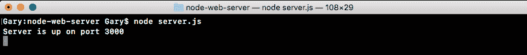

# package.json 文件中的更改

接下来，我们必须在`package.json`中指定一个脚本。在`package.json`里面，你可能已经注意到我们有一个`scripts`对象，在那里我们有一个`test`脚本。

默认情况下，将为 npm 设置此选项：


我们可以在`scripts`对象中创建各种各样的脚本，它们可以执行我们喜欢的任何操作。我们可以把它从 T1 变成一个脚本，我们可以把它变成一个脚本。

在`scripts`对象中，我们将添加一个新脚本。该脚本需要调用`start`：


这是一个非常特定的内置脚本，我们将其设置为启动应用的命令。在这种情况下，它将是`node server.js`：

```js
"start": "node server.js"
```

这是必要的，因为当 Heroku 尝试启动我们的应用时，它不会使用您的文件名运行 Node，因为它不知道您的文件名叫什么。相反，它将运行启动脚本，启动脚本将负责执行正确的操作；在本例中，启动该服务器文件。

现在，我们可以使用以下命令从终端使用该`start`脚本运行我们的应用：

```js
npm start
```

当我这样做时，我们会得到一点与 npm 相关的输出，然后我们会得到服务器在端口 3000 上，如果我们在浏览器中访问应用，一切都会像前一章中一样正常工作：

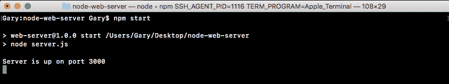

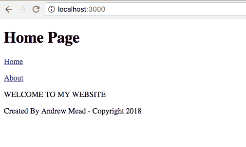

最大的区别是，我们现在已经为 Heroku 做好了准备。我们还可以使用终端`npm test`运行测试脚本：

```js
npm test
```

现在，我们没有指定测试，预计：


# 在 Heroku 作出承诺

该过程的下一步将是进行提交，然后我们最终可以开始在 Web 上进行提交。在终端上，我们将使用本章前面介绍的一些 Git 命令。首先，`git status`。当我们运行`git status`时，我们有了一些新的东西：


我们在这里修改了文件，而不是新文件，如这里的代码输出所示。我们有一个修改过的`package.json`文件和一个修改过的`server.js`文件。如果我们刚刚运行一个`git commit`，这些将不会被承诺；我们仍然需要使用`git add`。我们将使用点作为下一个参数运行`git add`。Dot 将添加所有显示的内容，并在下一次提交时获取状态。

现在我只建议使用`Changes not staged for commit`标题中列出的所有内容的语法。这些是你真正想要做的事情，在我们的例子中，这确实是我们想要的。如果我运行`git add`然后重新运行`git status`，我们现在可以看到接下来要提交的内容，在要提交的更改标题下：

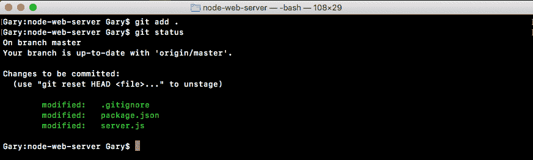

这是我们的`package.json`文件和`server.js`文件。现在我们可以做出承诺。

我将运行一个带有`m`标志的`git commit`命令，这样我们就可以指定我们的消息，对于这个提交来说，一个好消息应该是类似`Setup start script and heroku port`的东西：

```js
git commit -m 'Setup start script and heroku port'
```

现在，我们可以继续运行该命令，这将使提交。

现在我们可以继续使用`git push`命令将其推送到 GitHub，我们可以关闭`origin`遥控器，因为原点是默认遥控器。我将继续运行以下命令：

```js
git push
```

这将把它推到 GitHub，现在我们已经准备好实际创建应用，推送我们的代码，并在浏览器中查看它：

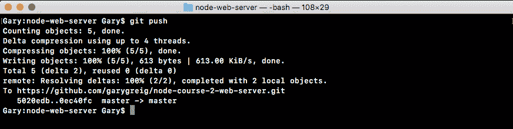

# 运行 Heroku create 命令

该过程的下一步是从终端运行名为`heroku create`的命令。`heroku create`需要从应用内部执行：

```js
heroku create
```

就像我们运行 Git 命令一样，当我运行`heroku create`时，会发生两件事：

*   首先，它将在 Heroku web 应用中创建一个真正的新应用
*   它还将向您的 Git 存储库添加一个新的远程服务器

现在请记住，我们有一个 originremote，它指向我们的 GitHub 存储库。我们将有一个 Heroku remote，它指向我们的 Heroku Git 存储库。当我们部署到 Heroku Git 存储库时，Heroku 将看到这一点。它将接受这些更改，并将它们部署到 Web 上。当我们运行 Heroku create 时，所有这些都会发生：

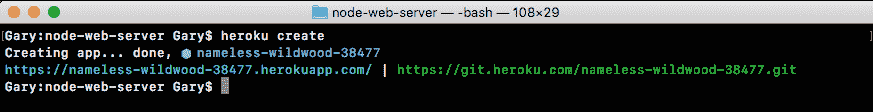

现在我们仍然需要向上推到这个 URL 才能真正完成部署过程，我们可以使用`git push`和`heroku`来完成：

```js
git push heroku
```

刚刚添加了全新的遥控器，因为我们运行了`heroku create`。现在，这次推动它将通过正常的过程。然后，您将开始看到一些日志。

这些是 Heroku 返回的日志，让您了解应用的部署情况。它将贯穿整个过程，向您展示过程中发生的事情。这将需要大约 10 秒的时间，最后我们会收到一条成功消息，验证部署。。。完成：

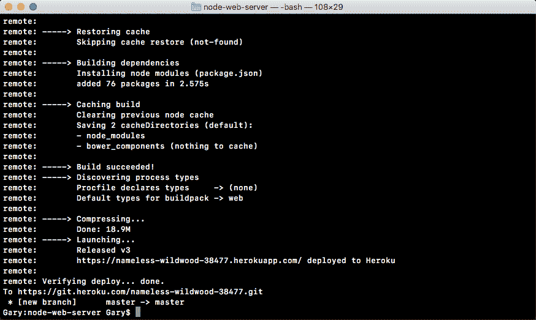

它还验证了该应用已成功部署，并且确实通过了测试。从这里我们可以访问一个 URL（[https://sleepy-retreat-32096.herokuapp.com/](https://sleepy-retreat-32096.herokuapp.com/) ）。我们可以获取、复制并粘贴到浏览器中。我将改为使用以下命令：

```js
heroku open
```

`heroku open`将在默认浏览器中打开 Heroku 应用。当我运行此程序时，它将切换到 Chrome，我们的应用将按预期显示：


我们可以在页面之间切换，一切都可以像本地一样工作。现在我们有了一个 URL，这个 URL 是 Heroku 给我们的。这是 Heroku 生成应用 URL 的默认方式。如果您有自己的域注册公司，您可以继续并配置其 DNS 以指向此应用。这将允许您为 Heroku 应用使用自定义 URL。要做到这一点，您必须参考域名注册商的具体说明，但这确实是可以做到的。

现在我们已经准备好了，我们已经成功地将我们的 Node 应用实时部署到 Heroku，这真是太棒了。为了做到这一点，我们所要做的就是承诺更改代码并将其推送到新的 Git remote。部署我们的代码再容易不过了。

您还可以通过返回 Heroku 仪表板来管理应用。如果你给它一个刷新，你应该在仪表板的某个地方看到这个全新的 URL。记得我的是困倦的退却。你的会是另一种东西。如果我单击“睡眠静修”，我可以查看应用页面：


在这里，我们可以进行很多配置。我们可以管理活动和访问，以便与他人协作。我们有指标，我们有资源，各种非常酷的东西。有了这些，我们现在就完成了基本部署部分。

在下一节中，您的挑战将是再次经历该过程。您将向 Node 应用添加一些更改。您将提交、部署它们，并在 Web 上实时查看它们。我们将从创建本地更改开始。这意味着我将在这里使用`app.get`注册一个新的 URL。

我们将创建一个新的页面/项目，这就是为什么我将其作为 HTTP get 处理程序的路由。在第二个参数中，我们可以指定我们的`callback`函数，它将通过请求和响应被调用，就像我们对上面的其他路由，根路由和关于路由所做的一样，我们将调用`response.render`来呈现我们的模板。在 render arguments 列表中，我们将提供两个参数。

第一个是文件名。该文件不存在，但我们仍可以继续并拨打`render`。我将其命名为`projects.hbs`，然后我们可以指定要传递给模板的选项。在本例中，我们将设置页面标题，将其设置为带大写字母 P 的`Projects`，非常好！至此，服务器文件已全部完成。那里没有更多的变化。

我要做的是继续并转到`views`目录，创建一个名为`projects.hbs`的新文件。在这里，我们将能够配置我们的模板。首先，我将从 about 页面复制模板。既然它真的很相似，我就复制它。关闭，将其粘贴到项目中，我将把这个文本更改为项目页面，文本将显示在这里。然后我们可以保存文件并进行最后一次更改。

我们要做的最后一件事是更新标题。我们现在有一个全新的项目页面，位于`/projects`。因此，我们希望继续并将其添加到标题链接列表中。在这里，我将创建一个新的段落标记，然后创建一个锚定标记。链接的文本将是带有大写字母 P 的`Projects`和`href`，这是单击该链接时要访问的 URL。我们将其设置为`/projects`，就像我们在大约年中所做的一样，我们将其设置为`/about`。

现在我们已经准备好了，所有的更改都完成了，我们准备在本地进行测试。我将使用`server.js`作为文件的 Node 在本地启动应用。首先，我们使用的是 localhost 3000。因此，在浏览器中，我可以移动到 localhost 选项卡，而不是 Heroku 应用选项卡，然后单击 Refresh。就在这里，我们有家，这是家，我们有关于，这是关于，我们有项目，确实去到`/projects`，呈现项目页面。项目页面文本将转到此处。有了这个，我们现在就可以在本地完成了。

我们已经有了改变，我们已经测试了它们，现在是时候继续并做出承诺了。这将发生在终端内部。我将关闭服务器并运行 Git status。这将显示自上次提交以来对存储库的所有更改。我有两个修改过的文件：服务器文件和头文件，还有我全新的项目文件。所有这些看起来都很棒。我想将所有这些添加到下一次提交中，这样我就可以使用带有`.`的 Git add 来完成这项工作。

现在，在我真正进行提交之前，我确实喜欢测试通过运行 Git status 添加的正确内容。就在这里，我可以看到我要提交的更改以绿色显示。一切看起来都很好。下一步，我们将运行 Git commit 来实际进行提交。这将把所有更改保存到 Git 存储库中。这条消息类似于添加一个项目页面。

完成提交后，接下来需要做的就是将其推送到 GitHub。这将备份我们的代码，并让其他人进行协作。我将使用 gitpush 来实现这一点。请记住，我们可以关闭 origin 遥控器，因为 origin 是默认遥控器，因此，如果您关闭遥控器，它仍将使用该遥控器。

我们用 Git 将 Hub 推到最后，用 Heroku 将 Git 推到最后。当我们这样做时，Heroku 服务器在安装 npm 模块、构建应用以及实际部署应用的过程中，会得到一长串日志。完成后，我们会像在这里一样回到终端，然后我们可以在浏览器中打开 URL。现在我可以从这里复制它或运行 Heroku open。因为我已经打开了一个带有 URL 的选项卡，所以我只需要刷新一下。现在，在刷新应用时，您可能会有一点延迟。有时在部署新应用后立即启动应用可能需要 10 到 15 秒。这只会在你第一次访问它时发生。其他时候，当你点击刷新按钮时，它会立即重新加载。

现在我们有了项目页面，如果我访问它，一切看起来都很棒。导航栏工作正常，项目页面确实在`/projects`呈现。有了这些，我们现在就完成了。我们已经完成了添加新特性、本地测试、Git 提交、将其推送到 GitHub 以及将其部署到 Heroku 的过程。我们现在有了一个使用 Node.js 构建真实世界 web 应用的工作流。这也使本节的内容更加接近。

# 总结

您还了解了 Git、GitHub 和 Heroku。这些是我在创建应用时更喜欢使用的工具。我喜欢使用 Git，因为它非常流行。这基本上是当今唯一的选择。我喜欢使用 GitHub，因为它有很好的用户界面。它有很多很棒的特性，几乎每个人都在使用它。这里有一个很棒的社区。我喜欢使用 Heroku，因为部署应用的新版本非常简单。您可以将这些工具中的任何一个与任何其他工具交换。您可以使用 AmazonWeb 服务等服务作为主机。您可以使用 Bitbucket 作为 GitHub 的替代方案。这些都是完美的解决方案。真正重要的是，你有一些为你工作的工具，你有一个备份在某处的 Git 存储库，无论是 GitHub 还是 Bitbucket，你有一个简单的部署方法，因此你可以快速地进行更改，并将它们快速发布给你的用户。

在不同的部分中，我们研究了如何向 Git 添加文件以及如何进行第一次提交。接下来，我们设置了 GitHub 和 Heroku，然后研究了如何推送和部署代码。然后，我们研究了如何与 Heroku 通信以部署代码。然后，我们研究了一些真实世界的工作流，用于创建新提交、推送到 GitHub 以及部署到 Heroku。

在下一章中，我们将研究如何测试我们的应用。