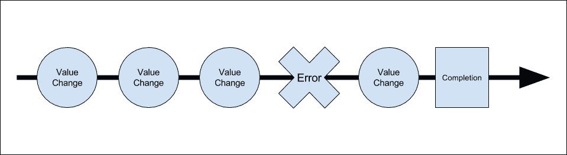

# 八、创建 MEAN CRUD 模块

在前面的章节中，您学习了如何设置每个框架以及如何将它们连接在一起。 在本章中，您将实现 MEAN 应用的基本操作构建块，即 CRUD 模块。 CRUD 模块由一个基本实体组成，该实体具有创建、读取、更新和删除实体实例的基本功能。 在 MEAN 应用中，CRUD 模块是由服务器端 Express 组件和 Angular 客户端模块构建的。 在本章中，我们将涵盖以下主题:

*   建立 Mongoose 模型
*   创建 Express 控制器
*   连接快运线路
*   创建和组织 Angular 模块
*   了解角形式
*   介绍 Angular`http`客户端
*   实现 Angular 的模块服务
*   实现 Angular 模块组件

# 介绍 CRUD 模块

CRUD 模块是 MEAN 应用的基本构建块。 每个 CRUD 模块由两个支持 Express 和 Angular 功能的结构组成。 Express 部分建立在一个 Mongoose 模型、一个 Express 控制器和一个 Express 路由文件的基础上。 Angular 模块要复杂一些，它包含一组模板、一些 Angular 组件、服务和路由配置。 在本章中，您将学习如何组合这些组件，以构建示例`Article`CRUD 模块。 本章的例子将直接从前几章继续，所以从[第七章](07.html "Chapter 7. Introduction to Angular")，*Angular 简介*复制最后一个例子，让我们从那里开始。

# 设置 Express 组件

让我们从模块的 Express 部分开始。 首先，您将创建一个 Mongoose 模型，用于保存和验证您的文章。 然后，您将转向 Express 控制器，它将处理模块的业务逻辑。 最后，您将连接 Express 路由来为您的控制器方法生成 RESTful API。 我们将从 Mongoose 模型开始。

## 创建 Mongoose 模型

Mongoose 模型将由四个简单的属性组成，它们将代表我们的`Article`实体。 让我们首先在`app/models`文件夹中创建 Mongoose 模型文件; 创建一个名为`article.server.model.js`的新文件，其中包含以下代码片段:

```js
const mongoose = require('mongoose');
const Schema = mongoose.Schema;

const ArticleSchema = new Schema({
  created: {
    type: Date,
    default: Date.now
  },
  title: {
    type: String,
    default: '',
    trim: true,
    required: 'Title cannot be blank'
  },
  content: {
    type: String,
    default: '',
    trim: true
  },
  creator: {
    type: Schema.ObjectId,
    ref: 'User'
  }
});

mongoose.model('Article', ArticleSchema);
```

您应该熟悉这个代码片段，所以让我们快速地了解一下这个模型。 首先，您包含了您的模型依赖关系，然后您使用 Mongoose`Schema`对象来创建一个新的`ArticleSchema`。 `ArticleSchema`定义了四个模型字段:

*   `created`:这是一个日期字段，表示文章创建的时间
*   `title`:这是一个字符串字段，表示文章标题; 请注意如何使用必需的验证来确保所有文章都有标题
*   `content`:这个是一个表示文章内容的字符串字段
*   `creator`:这个是一个引用对象，它表示创建文章的用户

最后，您注册了`Article`Mongoose 模型，可以在`Articles`Express 控制器中使用它。 接下来，你需要确保你的应用正在加载模型文件，所以回到`config/mongoose.js`文件，并按如下方式更改它:

```js
const config = require('./config');
const mongoose = require('mongoose');

module.exports = function() {
  const db = mongoose.connect(config.db);

  require('../app/models/user.server.model');
  require('../app/models/article.server.model');

  return db;
};
```

这将加载您的新模型文件，并确保您的应用可以使用您的`Article`模型。 一旦您配置好模型，您就可以创建您的`Articles`控制器。

## 设置 Express 控制器

Express 控制器负责服务器端物品相关功能的管理。 构建它是为了提供基本的 CRUD 操作来操作 MongoDB 文章文档。 要开始编写 Express 控制器，请转到您的`app/controllers`文件夹并创建一个名为`articles.server.controller.js`的新文件。 在新创建的文件中，添加以下依赖项:

```js
const mongoose = require('mongoose');
const Article = mongoose.model('Article');
```

在前面的代码行中，您基本上只包含了您的`Article`Mongoose 模型。 现在，在开始创建 CRUD 方法之前，建议您为验证和其他服务器错误创建一个错误处理方法。

### Express 控制器的错误处理方法

为了处理 Mongoose 错误，最好编写一个简单的错误处理方法，该方法将负责从 Mongoose 错误对象中提取一个简单的错误消息，并将其提供给控制器方法。 回到你的`app/controllers/articles.server.controller.js`文件，添加以下代码行:

```js
function getErrorMessage (err) {
  if (err.errors) {
    for (let errName in err.errors) {
      if (err.errors[errName].message) return err.errors[errName].message;
    }
  } else {
    return 'Unknown server error';
  }
};
```

`getErrorMessage()`方法获取作为参数传递的 Mongoose 错误对象，然后遍历错误集合并提取第一个消息。 这样做是因为您不想让用户一次收到多个错误消息。 现在已经设置了错误处理，现在是编写第一个控制器方法的时候了。

### Express 控制器的 create()方法

Express 控制器的`create()`方法将提供基本的功能来创建新的文章文档。 它将使用 HTTP 请求体作为文档的 JSON 基对象，并使用模型`save()`方法将其保存到 MongoDB。 要实现`create()`方法，请在`app/controllers/articles.server.controller.js`文件中追加以下代码行:

```js
exports.create = function(req, res) {
  const article = new Article(req.body);
  article.creator = req.user;

  article.save((err) => {
    if (err) {
      return res.status(400).send({
        message: getErrorMessage(err)
      });
    } else {
      res.status(200).json(article);
    }
  });
};
```

让我们回顾一下`create()`方法代码。 首先，您使用 HTTP 请求主体创建了一个新的`Article`模型实例。 接下来，您将经过身份验证的`passport`用户添加为文章`creator`。 最后，使用 Mongoose 实例`save()`方法保存文章文档。 在`save()`回调函数中，值得注意的是您如何返回一个错误响应和一个适当的 HTTP 错误代码，或者新的`article`对象作为 JSON 响应。 一旦您完成了`create()`方法，您将继续执行读操作。 读取操作由两个方法组成:一个方法检索项目列表，另一个方法检索特定的项目。 让我们从列出一系列文章的方法开始。

### Express 控制器的 list()方法

Express 控制器的`list()`方法将提供检索现有文章列表的基本功能。 它将使用模型的`find()`方法检索文章集合中的所有文档，然后输出该列表的 JSON 表示。 要实现`list()`方法，请在`app/controllers/articles.server.controller.js`文件中追加以下代码行:

```js
exports.list = function(req, res) {
  Article.find().sort('-created').populate('creator', 'firstName lastName fullName').exec((err, articles) => {
    if (err) {
      return res.status(400).send({
        message: getErrorMessage(err)
      });
    } else {
      res.status(200).json(articles);
    }
  });
};
```

在这个控制器方法中，注意如何使用 Mongoose 的`find()`函数来获取文章文档集合，虽然我们可以添加某种类型的 MongoDB 查询，但现在，我们将检索集合中的所有文档。 接下来，注意如何使用`created`属性对文章集合进行排序。 然后，您可以看到如何使用 Mongoose 的`populate()`方法向`articles`对象的`creator`属性添加一些用户字段。 在本例中，您填充了`creator`用户对象的`firstName`、`lastName`和`fullName`属性。

CRUD 操作的其余部分涉及对单个现有文章文档的操作。 当然，您可以在每个方法中单独实现对文章文档的检索，基本上重复这个逻辑。 然而，Express 路由有一个处理路由参数的出色特性，因此在实现 Express CRUD 功能的其余部分之前，您首先要了解如何利用路由参数中间件来节省一些时间和代码冗余。

### Express 控制器的 read()中间件

Express 控制器的`read()`方法将提供从数据库中读取现有文章文档的基本功能。 由于您正在编写一种 RESTful API，因此这种方法的常见用法将通过将文章的 ID 字段作为路由参数传递来处理。 这意味着您对服务器的请求将在其路径中包含一个`articleId`参数。

幸运的是，Express 路由提供了`app.param()`方法来处理路由参数。 这种方法允许您为包含`articleId`路由参数的所有请求附加一个中间件。 然后，中间件本身将使用提供的`articleId`来查找正确的 MongoDB 文档，并将检索到的`article`对象添加到请求对象中。 这将允许操作现有项目的所有控制器方法从 Express 请求对象中获取`article`对象。 为了更清楚地说明这一点，让我们实现路由参数中间件。 转到你的`app/controllers/articles.server.controller.js`文件并添加以下代码行:

```js
exports.articleByID = function(req, res, next, id) {
  Article.findById(id).populate('creator', 'firstName lastName fullName').exec((err, article) => {
    if (err) return next(err);
    if (!article) return next(new Error('Failed to load article ' + id));

    req.article = article;
    next();
  });
};
```

如您所见，中间件功能签名包含所有 Express 中间件参数和一个`id`参数。 然后使用`id`参数查找文章并使用`req.article`属性引用它。 注意如何使用 Mongoose 模型的`populate()`方法将一些用户字段添加到`article`对象的`creator`属性中。 在本例中，您填充了`creator`用户对象的`firstName`、`lastName`和`fullName`属性。

当您连接 Express 路由时，您将学习如何将`articleByID()`中间件添加到不同的路由中，但是现在，让我们添加 Express 控制器的`read()`方法，该方法将返回一个`article`对象。 要添加`read()`方法，请在`app/controllers/articles.server.controller.js`文件中添加以下代码:

```js
exports.read = function(req, res) {
  res.status(200).json(req.article);
};
```

很简单，不是吗? 这是因为您已经在`articleByID()`中间件中处理了获取`article`对象的问题，所以现在您所要做的就是将`article`对象作为 JSON 表示输出。 我们将在下一节中连接中间件和路由，但在此之前，让我们先完成 Express 控制器 CRUD 功能的实现。

### Express 控制器的 update()方法

Express 控制器的的`update()`方法将提供基本的操作来更新现有的文章文档。 它将使用现有的`article`对象作为基础对象，然后使用 HTTP 请求体更新`title`和`content`字段。 它还将使用模型`save()`方法将更改保存到数据库中。 要实现`update()`方法，请转到你的`app/controllers/articles.server.controller.js`文件，并追加以下代码行:

```js
exports.update = function(req, res) {
  const article = req.article;

  article.title = req.body.title;
  article.content = req.body.content;

  article.save((err) => {
    if (err) {
      return res.status(400).send({
        message: getErrorMessage(err)
      });
    } else {
      res.status(200).json(article);
    }
  });
};
```

如您所见，`update()`方法还假设您已经在`articleByID()`中间件中获得了`article`对象。 因此，您所要做的就是更新`title`和`content`字段，保存文章，然后以 JSON 表示形式输出更新的`article`对象。 在发生错误时，它将使用您之前编写的`getErrorMessage()`方法输出适当的错误消息和一个 HTTP 错误代码。 剩下的最后一个 CRUD 操作是`delete()`方法; 所以让我们看看如何向 Express 控制器添加一个简单的`delete()`方法。

### Express 控制器的 delete()方法

Express 控制器的`delete()`方法将提供基本操作来删除现有的文章文档。 它将使用模型`remove()`方法从数据库中删除现有的文章。 要实现`delete()`方法，请转到你的`app/controllers/articles.server.controller.js`文件并追加以下代码行:

```js
exports.delete = function(req, res) {
  const article = req.article;

  article.remove((err) => {
    if (err) {
      return res.status(400).send({
        message: getErrorMessage(err)
      });
    } else {
      res.status(200).json(article);
    }
  });
};
```

同样，您可以看到`delete()`方法如何利用`articleByID()`中间件已经获得的`article`对象。 因此，您所要做的就是调用 Mongoose 模型的`remove()`方法，然后将删除的`article`对象作为 JSON 表示输出。 在出现错误的情况下，它将使用您之前编写的`getErrorMessage()`方法输出适当的错误消息，并取而代之的是一个 HTTP 错误代码。

恭喜你! 您刚刚实现了 Express 控制器的 CRUD 功能。 在继续连接将调用这些方法的 Express 路由之前，让我们花些时间实现两个授权中间件。

### 实现认证中间件

在构建 Express 控制器时，可能会注意到大多数方法都需要对用户进行身份验证。 例如，如果没有分配`req.user`对象，`create()`方法就不能运行。 虽然可以在方法中检查这个赋值，但这将迫使您一再实现相同的验证代码。 相反，您可以只使用 Express 中间件链接来阻止未授权的请求执行您的控制器方法。 您应该实现的第一个中间件将检查用户是否经过身份验证。 由于这是一个与身份验证相关的方法，最好在 Express`users`控制器中实现它，因此转到`app/controllers/users.server.controller.js`文件并附加以下代码行:

```js
exports.requiresLogin = function(req, res, next) {
  if (!req.isAuthenticated()) {
    return res.status(401).send({
      message: 'User is not logged in'
    });
  }

  next();
};
```

`requiresLogin()`中间件使用 Passport-initiated`req.isAuthenticated()`方法检查用户当前是否通过身份验证。 如果它发现用户确实登录了，它将调用链中的下一个中间件; 否则，它将响应一个身份验证错误和一个 HTTP 错误代码。 这个中间件很好，但是如果您想检查某个特定用户是否被授权执行某个操作，那么您将需要实现特定于文章的授权中间件。

### 实现授权中间件

在 CRUD 模块中，有两个方法可以编辑现有的文章文档。 通常，应该限制`update()`和`delete()`方法，只有创建文章的用户才能使用它们。 这意味着您需要授权向这些方法发出的任何请求，以验证当前文章的创建者是否正在编辑它。 要做到这一点，你需要在你的`Articles`控制器中添加一个授权中间件，所以转到`app/controllers/articles.server.controller.js`文件并添加以下代码行:

```js
exports.hasAuthorization = function(req, res, next) {
    if (req.article.creator.id !== req.user.id) {
        return res.status(403).send({
            message: 'User is not authorized'
        });
    }

    next();
};
```

`hasAuthorization()`中间件使用`req.articl`e 和`req.user`对象来验证当前用户是否是当前文章的创建者。 这个中间件还假设它只对包含`articleId`route 参数的请求执行。 现在您已经准备好了所有的方法和中间件，现在是时候连接支持它们执行的路由了。

## 快速线路布线

在我们开始连接 Express 路线之前，让我们快速概述一下 RESTful API 架构设计。 RESTful API 提供了一个一致的服务结构，它表示可以在应用资源上执行的一组操作。 这意味着 API 使用预定义的路由结构和 HTTP 方法名来为 HTTP 请求提供上下文。 虽然 RESTful 架构可以以不同的方式应用，但 RESTful API 通常遵循一些简单的规则:

*   每个资源的基本 URI，在本例中为`http://localhost:3000/articles`
*   在请求体中传递的数据结构，通常为 JSON
*   标准 HTTP 方法的使用(如:`GET`、`POST`、`PUT`、`DELETE`)

使用这三个规则，您将能够正确地路由 HTTP 请求以使用正确的控制器方法。 所以，你的文章 API 将包括五个路线:

*   `GET http://localhost:3000/articles`:这将返回一个文章列表
*   `POST http://localhost:3000/articles`:这将创建并返回一个新文章
*   `GET http://localhost:3000/articles/:articleId`:这将返回一个现有的项目
*   `PUT http://localhost:3000/articles/:articleId`:这将更新并返回一个现有的文章
*   `DELETE http://localhost:3000/articles/:articleId`:这将删除并返回单个文章

您可能已经注意到，这些路由已经有相应的控制器方法。 您甚至已经实现了`articleId`路由参数中间件，所以剩下要做的就是实现 Express 路由。 为此，转到`app/routes`文件夹并创建一个名为`articles.server.routes.js`的新文件。 在新创建的文件中，粘贴以下代码片段:

```js
const users = require('../../app/controllers/users.server.controller');
const articles = require('../../app/controllers/articles.server.controller');

module.exports = function(app) {
  app.route('/api/articles')
     .get(articles.list)
     .post(users.requiresLogin, articles.create);

  app.route('/api/articles/:articleId')
     .get(articles.read)
     .put(users.requiresLogin, articles.hasAuthorization, articles.update)
     .delete(users.requiresLogin, articles.hasAuthorization, articles.delete);

  app.param('articleId', articles.articleByID);
};
```

在前面的代码片段中，您做了几件事。 首先，您需要`users`和`articles`控制器，然后使用 Express`app.route()`方法为您的 CRUD 操作定义基本路由。 您使用 Express 路由方法将每个控制器方法连接到特定的 HTTP 方法。 您可能还注意到`POST`方法是如何使用`users.requiresLogin()`中间件的，因为用户在创建新文章之前需要登录。 同样，`PUT`和`DELETE`方法同时使用`users.requiresLogin()`和`articles.hasAuthorization()`中间件，因为用户只能编辑和删除他们创建的文章。 最后，使用`app.param()`方法确保具有`articleId`参数的每个路由首先调用`articles.articleByID()`中间件。 接下来，您需要配置 Express 应用来加载新的`Article`模型和路由文件。

## 配置 Express 应用

为了使用新的 Express 资产，您必须配置 Express 应用来加载您的路由文件。 要做到这一点，回到您的`config/express.js`文件并更改它，如下所示:

```js
const path = require('path');
const config = require('./config');
const express = require('express');
const morgan = require('morgan');
const compress = require('compression');
const bodyParser = require('body-parser');
const methodOverride = require('method-override');
const session = require('express-session');
const flash = require('connect-flash');
const passport = require('passport');

module.exports = function() {
  const app = express();

  if (process.env.NODE_ENV === 'development') {
    app.use(morgan('dev'));
  } else if (process.env.NODE_ENV === 'production') {
    app.use(compress());
  }

  app.use(bodyParser.urlencoded({
    extended: true
  }));
  app.use(bodyParser.json());
  app.use(methodOverride());

  app.use(session({
    saveUninitialized: true,
    resave: true,
    secret: config.sessionSecret
  }));

  app.set('views', './app/views');
  app.set('view engine', 'ejs');

  app.use(flash());
  app.use(passport.initialize());
  app.use(passport.session());

  app.use('/', express.static(path.resolve('./public')));
  app.use('/lib', express.static(path.resolve('./node_modules')));

  require('../app/routes/users.server.routes.js')(app);  
  require('../app/routes/articles.server.routes.js')(app);
  require('../app/routes/index.server.routes.js')(app);

  return app;
}; 
```

这是它; 你的文章的 RESTful API 已经准备好了! 接下来，你将学到使用`HTTP`客户端让你的 Angular 组件与它通信是多么简单。

# 使用 HTTP 客户端

在[第 7 章](07.html "Chapter 7. Introduction to Angular")、*Angular 简介*中，我们提到了`http`客户端作为 Angular 2 应用和后端 API 之间的通信工具。 由于 REST 架构结构良好，所以为我们的 Angular 模块实现服务会非常容易，我们会为组件提供 API，以便与服务器通信。 为了做到这一点，Angular 的 http 客户端利用 Observable 模式来处理它的异步特性，所以在我们继续之前，最好先快速回顾一下这个强大的模式。

## 响应式编程和可观察对象

在编程中，我们通常希望事情以串行方式运行，即所有的指令按顺序发生。 唉，从一开始，web 应用开发就缺乏同步性。 这在处理数据(在本例中更具体地说是从服务器检索的数据)时尤其是个问题。 为了解决这个问题，我们创建了各种不同的模式，现在我们主要使用回调和承诺模式。 在 JavaScript 的大部分生命周期中，回调都是首选，最近，承诺开始获得一些关注。 然而，承诺的寿命很短，只有一次。 更准确地说，可以设置 Promise，然后只能有一次不同，但我们的数据可以随时间变化，所以我们需要创建越来越多的 Promise。 例如，我们想要跟踪对文本字段所做的所有更改，并实现“撤销”功能; 要做到这一点，我们可以使用一个回调到我们的文本更改事件，然后记录所有的更改，并对它做一些事情。 这看起来可能很简单，但如果我们有数百个对象，或者文本字段值通过编程更改了，又会怎样呢? 这是一个非常简单的示例，但是这个场景在现代应用开发中以各种方式重复出现，为了解决这个问题，出现了一种新的方法，称为响应式编程的方法。 您可能听说过响应式编程，也可能没听说过，但理解它的最简单方法是认识到它是关于跟踪随时间变化的异步数据的，而实现这一点的方法是使用可观察对象。 可观察对象是可以被一个或多个观察者观察到的数据流。 Observable 会随着时间的推移发出值，并用一个新值、一个错误或一个完成事件通知“订阅的”观察者。 这一机制的直观表现如下图所示:



在这张图中，你可以看到 Observable 不断发出值变化、一个错误、另一个值变化，然后在 Observable 结束生命周期时发出一个完成事件。 响应式编程可能看起来很复杂，但是幸运的是，ReactiveX 库允许我们以一种非常简单的方式处理可见对象。

### 注意事项

建议您继续阅读响应式编程，因为它正在迅速成为现代 web 应用开发的主要方法。

# ReactiveX 库

Rx 库是一个跨平台的库，它使用观察者模式来帮助开发人员管理异步数据随时间的变化。 简单地说，ReactiveX 是一个允许我们创建和操作 Observable 对象的库。 在 Angular 2 项目中，我们使用 RxJS 库，它基本上是 ReactiveX 库的 JavaScript 版本。 如果您仔细查看前一章，就会发现我们已经设置了它，甚至在我们的身份验证服务中使用了它。 我们通过使用`npm`安装它:

```js
...
"rxjs": "5.0.0-beta.12",
...

```

我们将其导入我们的实体如下:

```js
...
import 'rxjs/Rx';

```

我们必须这么做，因为 Angular 团队广泛地使用了 observable。 我们第一次接触它是使用 http 客户端。

## 使用 http 客户端

`http`模块为我们提供了一种与 RESTful 端点通信的标准化方式。 要使用`http`客户端，我们必须将其导入并注入到实体中，然后使用`http`客户端实例执行不同的 HTTP 请求。 一个使用 http 客户端执行 POST 请求的简单例子在[第 7 章](07.html "Chapter 7. Introduction to Angular")，*Angular 简介*中，我们在我们的登录方法中使用了 http:

```js
signin(credentials: any): Observable<any> {
      let body = JSON.stringify(credentials);
      let headers = new Headers({ 'Content-Type': 'application/json' });
      let options = new RequestOptions({ headers: headers });

  return this.http.post(this._signinURL, body, options)
                        .map(res => this.user = res.json())
                        .catch(this.handleError)
  }

```

如您所见，在调用`http`客户端`post()`方法之前，我们创建了一个 JSON 字符串，并使用`RequestOptions`对象设置请求头。 客户端方法返回一个跟踪 HTTP Response 对象的 Observable 对象。 但是由于我们希望我们的服务提供数据，我们使用了`map()`方法来提取响应 JSON 对象。

### 注意事项

我们需要使用`json()`方法，因为 Angular 遵循了 ES2015 规范的 HTTP 响应对象。

注意，我们还使用我们的`handleError()`方法捕获任何错误。 那么如何使用这个方法返回的 Observable 对象呢? 如果你回头看看我们的`signin`组件，你会看到我们是如何使用我们的认证服务的:

```js
signin() {
    this._authenticationService.signin(this.credentials).subscribe(
    result  => this._router.navigate(['/']), 
    error =>  this.errorMessage = error );
  }
}

```

在这个方法中，我们调用了认证服务的 signin 方法，然后订阅了返回的 Observable。 然后，我们用第一个箭头函数处理任何值事件，用第二个箭头函数处理任何错误。 这就是我们工作 HTTP 客户端的基本方式!

HTTP 客户端提供了各种方法来处理不同的 HTTP 请求:

*   `request(url, options)`:该方法允许我们执行 options 对象定义的任何 HTTP 请求。
*   `get()`:执行`GET`HTTP 请求。
*   `post()`:执行`POST`HTTP 请求。
*   `put()`:执行`PUT`HTTP 请求。
*   `delete()`:执行`DELETE` HTTP 请求。

所有这些方法都返回一个可以订阅或操作的 Response Observable 对象。

### 注意事项

需要注意的一件重要的事情是，HTTP 客户端总是返回一个“冷”可观察对象。 这意味着请求本身不会被发送，直到有人订阅了这个可观察对象。

在下一节中，您将学习如何使用`http`客户机与 Express API 通信。

# 实现 Angular 模块

你的 CRUD 模块的第二部分是 Angular 模块。 本模块将包含一个 Angular 服务，它将使用`http`客户端与 Express API 通信，这是一个 Angular Article 组件，它将包含四个子组件，这些子组件带有一组模板，为用户提供一个执行 CRUD 操作的接口。 在开始创建 Angular 实体之前，让我们先创建初始模块结构。 转到应用的`public/app`文件夹，创建一个名为`articles`的新文件夹。 在这个新文件夹中，创建名为`articles.module.ts`的模块文件，并粘贴以下代码行:

```js
import { NgModule }       from '@angular/core';
import { CommonModule }   from '@angular/common';
import { FormsModule }    from '@angular/forms';
import { RouterModule } from '@angular/router';

import { ArticlesRoutes } from './articles.routes';
import { ArticlesComponent } from './articles.component';
import { CreateComponent } from './create/create.component';
import { ListComponent } from './list/list.component';
import { ViewComponent } from './view/view.component';
import { EditComponent } from './edit/edit.component';

@NgModule({
  imports: [
    CommonModule,
    FormsModule,
    RouterModule.forChild(ArticlesRoutes),
  ],
  declarations: [
    ArticlesComponent,
    CreateComponent,
    ListComponent,
    ViewComponent,
    EditComponent,
  ]
})
export class ArticlesModule {}
```

正如你所看到的，我们只是从 Angular 的包以及新模块的组件、服务和路由定义中导入了我们需要的模块。 接下来，我们创建了一个新的 Angular 模块，它将 Angular 模块和路由配置作为子路由导入，然后声明我们的新模块组件。 现在，我们可以继续创建主组件文件。 要实现，在 `public/app`文件夹中创建一个名为`articles.component.ts` 的文件，并粘贴以下代码行:

import { Component } from '@angular/core';

```js
import { ArticlesService } from './articles.service';

@Component({
  selector: 'articles',
  template: '<router-outlet></router-outlet>',
  providers: [ArticlesService]
})
export class ArticlesComponent {}

```

在这个文件中，我们导入了 Angular 的基本模块和我们将很快创建的 articles 服务。 然后，我们创建了一个使用`router-outlet`并注入服务的新组件。 接下来，我们需要为`articles`组件创建路由配置。 为此，创建一个名为`articles.routes.ts` 的文件，并粘贴以下代码行:

```js
import { Routes } from '@angular/router';

import { ArticlesComponent } from './articles.component';
import { CreateComponent } from './create/create.component';
import { ListComponent } from './list/list.component';
import { ViewComponent } from './view/view.component';
import { EditComponent } from './edit/edit.component';

export const ArticlesRoutes: Routes = [{
  path: 'articles',
  component: ArticlesComponent,
  children: [
    {path: '', component: ListComponent},
    {path: 'create', component: CreateComponent},
    {path: ':articleId', component: ViewComponent},
    {path: ':articleId/edit', component: EditComponent}
  ],
}];

```

如您所见，我们只是为组件及其子组件创建了一个路由配置。 代码应该很熟悉，因为它类似于我们在前一章中实现的身份验证路由。 而且，在我们的更新路径和视图路径中，我们以的形式定义了一个 URL 参数，冒号后面是参数的名称，在本例中是`articleId`参数。

接下来，需要在应用模块配置中导入 articles 模块。 要做到这一点，回到您的`public/app/app.module.ts`文件，并按如下方式更改它:

```js
import { NgModule }       from '@angular/core';
import { BrowserModule }  from '@angular/platform-browser';
import { FormsModule }    from '@angular/forms';
import { RouterModule }   from '@angular/router';
import { HttpModule, RequestOptions } from '@angular/http';
import { LocationStrategy, HashLocationStrategy } from '@angular/common';

import { AppComponent }       from './app.component';
import { AppRoutes }       from './app.routes';

import { HomeModule } from './home/home.module';
import { AuthenticationService } from './authentication/authentication.service';
import { AuthenticationModule } from './authentication/authentication.module';
import { ArticlesModule } from './articles/articles.module';

@NgModule({
  imports: [
    BrowserModule,
    HttpModule,
    FormsModule,
    AuthenticationModule,
    HomeModule,
    ArticlesModule,
    RouterModule.forRoot(AppRoutes),
  ],
  declarations: [
    AppComponent
  ],
  providers: [
    AuthenticationService
  ],
  bootstrap: [AppComponent]
})
export class AppModule { }
```

这就是我们新模块的配置。 现在，我们可以继续创建模块实体。 我们将从模块服务开始。

## 创建 Angular 的模块服务

为了让你的 CRUD 模块能够轻松地与 API 端点通信，建议你使用单一的 Angular 服务来使用`http`客户端方法。 为此，转到你的`public/app/articles`文件夹并创建一个名为`articles.service.ts`的新文件，其中包含以下代码行:

```js
import 'rxjs/Rx';
import {Observable} from 'rxjs/Observable';

import {Injectable} from '@angular/core';
import {Http, Headers, Request, RequestMethod, Response} from '@angular/http';

@Injectable()
export class ArticlesService {
  private _baseURL = 'api/articles';

  constructor (private _http: Http) {}

  create(article: any): Observable<any> {
    return this._http
      .post(this._baseURL, article)
      .map((res: Response) => res.json())
      .catch(this.handleError);
    }

  read(articleId: string): Observable<any> {
    return this._http
      .get(`${this._baseURL}/${articleId}`)
      .map((res: Response) => res.json())
      .catch(this.handleError);
  }

  update(article: any): Observable<any> {
    return this._http
      .put(`${this._baseURL}/${article._id}`, article)
      .map((res: Response) => res.json())
      .catch(this.handleError);
    }

  delete(articleId: any): Observable<any> {
    return this._http
      .delete(`${this._baseURL}/${articleId}`)
      .map((res: Response) => res.json())
      .catch(this.handleError);
  }  

  list(): Observable<any> {
    return this._http
      .get(this._baseURL)
      .map((res: Response) => res.json())
      .catch(this.handleError);
  }

  private handleError(error: Response) {
    return Observable.throw(error.json().message || 'Server error');
  }
}
```

让我们回顾一下这一点。 首先，我们导入了`Observable`和`rxjs`库模块。 你可能注意到了，我们导入了整个库，因为我们需要对 Observable 对象使用各种操作符，例如`map()`方法。

接下来，我们从 Angular 库中导入所需的模块，并使用`@Injectable`装饰器创建可注入的服务。 我们的服务有一个属性来保存 API 基 URL，还有一个构造函数来注入 HTTP 客户端。 它包含一个处理服务器错误的错误处理方法。 我们的其他方法很容易理解:

*   `create()`:接收文章对象，并使用 HTTP POST 请求将其发送到服务器
*   `read()`:接受`article ID`字符串并使用 HTTP GET 请求从服务器请求文章对象
*   `update ()`:接收文章对象，并使用 HTTP PUT 请求将其发送到服务器进行更新
*   `delete()`:接受一个`article ID`字符串，并尝试使用 HTTP delete 请求删除它
*   `list()`:使用 HTTP GET 请求对文章对象数组的请求

请注意我们如何将响应对象映射为只发送 JSON 对象，以及如何捕捉任何错误来修改响应，以便我们的组件只需要处理数据本身。

就是这样! 我们的模块基础结构已经为子组件做好了准备。 在下一节中，您将看到使用前面的准备工作，实现变得多么容易。

## 实现 Create 子组件

我们的“Create”子组件将负责创建新条目。 首先在您的`public/app/articles`文件夹中创建一个名为`create`的新文件夹。 在这个文件夹中，创建一个名为`create.component.ts`的新文件，并粘贴以下代码:

```js
import { Component } from '@angular/core';
import { Router } from '@angular/router';

import { ArticlesService } from '../articles.service';

@Component({
  selector: 'create',
  templateUrl: 'app/articles/create/create.template.html'
})
export class CreateComponent {
  article: any = {};
  errorMessage: string;

  constructor(private _router:Router,
        private _articlesService: ArticlesService) {}

  create() {
    this._articlesService
      .create(this.article)
      .subscribe(createdArticle => this._router.navigate(['/articles', createdArticle._id]),
               error =>  this.errorMessage = error);
  }
}

```

让我们回顾一下这个。 我们首先从 Angular 库中连同我们的`ArticlesService`一起导入我们需要的模块。 然后，我们用一个空的文章和`errorMessage`对象创建组件。 注意组件的构造函数是如何注入`Router`和`ArticlesService`服务的。 然后，我们创建了一个使用`ArticlesService`创建新文章对象的`create()`方法。 在我们的可观察订阅中，我们使用`Router`服务导航到新创建的`article ID`视图组件。 在发生错误的情况下，我们将组件的`errorMessage`属性设置为消息。 为了完成我们的子组件，我们需要创建它的模板。

### 添加模板

`create`模板将为用户提供创建新文章的界面。 它将包含一个 HTML 表单，并使用组件的`create`方法来保存新文章。 要创建模板，请转到`public/app/articles/create`文件夹并创建一个名为`create.template.html`的新文件。 在你的新文件中，粘贴以下代码片段:

```js
<h1>New Article</h1>
<form (ngSubmit)="create()" novalidate>
  <div>
    <label for="title">Title</label>
    <div>
      <input type="text" required [(ngModel)]="article.title" name="title" placeholder="Title">
    </div>
  </div>
  <div>
    <label for="content">Content</label>
    <div>
      <textarea type="text" required cols="30" rows="10" [(ngModel)]="article.content" name="content" placeholder="Content"></textarea>
    </div>
  </div>
  <div>
    <input type="submit">
  </div>

  <strong id="error">{{errorMessage}}</strong>
</form>

```

`create`模板包含一个简单的表单，其中有两个文本输入字段和一个提交按钮。 文本字段使用`ngModel`指令将用户输入绑定到组件的属性。 同样重要的是要注意您放置在`form`元素中的`ngSubmit`指令。 这个指令告诉 Angular 在表单提交时调用一个特定的组件方法。 在这种情况下，表单提交将执行组件的`create()`方法。 您应该注意到的最后一件事是，在出现任何错误时，表单末尾将显示的错误消息。 接下来，我们将实现 View 子组件。

## 实现 View 子组件

我们的“视图”子组件将负责呈现单个文章。 我们的组件还将包含一组仅对文章创建者可见的按钮，这些按钮将允许创建者删除文章或导航到`edit`路由。 首先在您的`public/app/articles`文件夹中创建一个名为`view`的新文件夹。 在此文件夹中，创建一个名为`view.component.ts`的新文件，并粘贴以下代码:

```js
import { Component } from '@angular/core';
import { Router, ActivatedRoute } from '@angular/router';
import { AuthenticationService } from '../../authentication/authentication.service';
import { ArticlesService } from '../articles.service';

@Component({
  selector: 'view',
  templateUrl: 'app/articles/view/view.template.html',
})
export class ViewComponent {
  user: any;
  article: any;
  paramsObserver: any;
  errorMessage: string;
  allowEdit: boolean = false;

  constructor(private _router:Router, 
        private _route: ActivatedRoute, 
        private _authenticationService: AuthenticationService, 
        private _articlesService: ArticlesService) {}

  ngOnInit() {
    this.user = this._authenticationService.user

    this.paramsObserver = this._route.params.subscribe(params => {
      let articleId = params['articleId'];

      this._articlesService
        .read(articleId)
        .subscribe(
          article => {
            this.article = article;
            this.allowEdit = (this.user && this.user._id === this.article.creator._id);
           },
          error => this._router.navigate(['/articles'])
        );
    });
  }

  ngOnDestroy() {
    this.paramsObserver.unsubscribe();
  }

  delete() {
    this._articlesService.delete(this.article._id).subscribe(deletedArticle => this._router.navigate(['/articles']),
                                 error => this.errorMessage = error);
  }
}
```

我们首先从 Angular 库中导入我们需要的模块以及`ArticlesService`和`AuthenticationService`。 然后，我们用一个 article 属性、一个`currentUser`属性、一个`paramsObserver`属性、一个`allowEdit`标志和一个`errorMessage`属性创建了我们的组件。 请注意组件的构造函数是如何注入`Router`、`RouteParams`以及`ArticlesService`和`AuthenticationService`服务的。 构造函数还使用`AuthenticationService`实例设置`currentUser`属性。 在组件初始化时调用的`ngOnInit`方法中，我们从路由参数中读取`article ID`参数，然后使用`ArticlesService`来获取现有的文章。 我们使用`ActivatedRoute`来完成这个操作，它为我们提供了一个`params`Observable。 我们在组件的`ngOnDestroy`方法上取消订阅这个 Observable。 在我们的 Observable 订阅中，我们设置组件的`article`属性，并决定当前用户是否可以编辑文章。 在出现错误的情况下，我们使用`Router`服务导航回`List`路由。 最后，我们实现了一个`delete()`方法，使用`ArticlesService`删除已浏览的文章并返回到文章列表。 为了完成子组件，我们需要创建它的模板。

### 添加模板

`view`模板将为您的用户提供到`view`现有文章的界面。 您的模板还将包含一组仅对文章创建者可见的按钮，这将允许创建者删除文章或导航到`edit`路径。 要创建模板，请转到`public/app/articles/view`文件夹并创建一个名为`view.template.html`的新文件。 在你的新文件中，粘贴以下代码片段:

```js
<section *ngIf="article && article.creator">
  <h1>{{article.title}}</h1>

  <div *ngIf="allowEdit">
      <a [routerLink]="['/articles', article._id, 'edit']">edit</a>
      <button (click)="delete()">delete</button>
  </div>
  <small>
      <em>Posted on {{article.created}} by {{article.creator.fullName}}</em>
  </small>

  <p>{{article.content}}</p>
</section>
```

`view`模板包含一组简单的 HTML 元素，这些元素使用`double curly braces`语法表示文章信息。 还需要注意的是，如何使用`ngIf`指令只向文章的创建者显示文章的编辑链接和删除按钮。 编辑链接将用户引导到`edit`子组件，而删除按钮将调用控制器的`delete()`方法。 接下来，我们将实现编辑组件。

## 实现 Edit 子组件

我们的“Edit”子组件将负责编辑现有的文章。 首先在`public/app/articles`文件夹中创建一个名为`edit`的新文件夹。 在这个文件夹中，创建一个名为`edit.component.ts`的新文件，并粘贴以下代码:

```js
import { Component } from '@angular/core';
import { Router, ActivatedRoute } from '@angular/router';

import { ArticlesService } from '../articles.service';

@Component({
  selector: 'edit',
  templateUrl: 'app/articles/edit/edit.template.html'
})
export class EditComponent {
  article: any = {};
  errorMessage: string;
  paramsObserver: any;

  constructor(private _router:Router, 
        private _route: ActivatedRoute, 
        private _articlesService: ArticlesService) {}

  ngOnInit() {
    this.paramsObserver = this._route.params.subscribe(params => {
      let articleId = params['articleId'];

      this._articlesService.read(articleId).subscribe(article => {
                                this.article = article;
                               },
                              error => this._router.navigate(['/articles']));
    });
  }

  ngOnDestroy() {
    this.paramsObserver.unsubscribe();
  }

  update() {
    this._articlesService.update(this.article).subscribe(savedArticle => this._router.navigate(['/articles', savedArticle._id]),
                                  error =>  this.errorMessage = error);
  }
}
```

同样，我们从从 Angular 库中导入需要的模块开始，同时导入`ArticlesService`模块。 然后，我们创建了带有 article 属性和`errorMessage`属性的组件。 在我们的构造函数中，我们从路由参数中读取`article ID`，然后使用`ArticlesService`来获取一个现有的条目。 在 observable 订阅中，我们设置了组件的 article 属性，在出现错误的情况下，我们使用`Router`服务导航回 List 路由。 最后，我们实现了一个`update()`方法，使用`ArticlesService`更新已浏览的文章并返回 View 路径。 为了完成子组件，我们需要创建它的模板。

### 添加模板

`edit`模板将为用户提供一个更新现有文章的界面。 它将包含一个 HTML 表单，并使用组件的`update()`方法保存更新后的文章。 要创建此模板，请转到`public/app/articles/edit`文件夹并创建一个名为`edit.template.html`的新文件。 在你的新文件中，粘贴以下 HTML 代码:

```js
<h1>Edit Article</h1>
<form (ngSubmit)="update()" novalidate>
    <div>
        <label for="title">Title</label>
        <div>
            <input type="text" required [(ngModel)]="article.title" name="title" placeholder="Title">
        </div>
    </div>
    <div>
        <label for="content">Content</label>
        <div>
            <textarea type="text" required cols="30" rows="10" [(ngModel)]="article.content" name="content" placeholder="Content"></textarea>
        </div>
    </div>
    <div>
        <input type="submit" value="Update">
    </div>

    <strong>{{errorMessage}}</strong>
</form>
```

`edit`模板包含一个简单的表单，其中有两个文本输入字段和一个提交按钮。 文本字段使用`ngModel`指令将用户输入绑定到组件的`article`属性。 同样重要的是要注意您在`form`元素中放置的`ngSubmit`指令。 这一次，该指令告诉 Angular，表单提交应该执行组件的`update()`方法。 您应该注意到的最后一件事是表单末尾的错误消息，它将在编辑错误的情况下显示。 最后一个子组件是 List 子组件。

## 实现 List 子组件

我们的“List”子组件将负责呈现文章列表。 我们首先在`public/app/articles`文件夹中创建一个名为`list`的新文件夹。 在此文件夹中，创建一个名为 `list.component.ts`的新文件，并粘贴以下代码:

```js
import { Component } from '@angular/core';
import { ArticlesService } from '../articles.service';

@Component({
  selector: 'list',
  templateUrl: 'app/articles/list/list.template.html'
})
export class ListComponent{
  articles: any;
  errorMessage: string;

  constructor(private _articlesService: ArticlesService) {}

  ngOnInit() {
    this._articlesService.list().subscribe(articles  => this.articles = articles);
  }
}
```

我们首先从 Angular 库中连同我们的`ArticlesService`一起导入我们需要的模块。 然后，我们创建了带有 articles 属性和`errorMessage`属性的组件。 请注意组件的构造函数是如何注入`ArticlesService`并使用它来获取文章列表的。 在 observable 订阅中，我们设置了组件的 articles 属性。 现在，剩下要做的就是实现组件的模板。

### 添加模板

`list`模板将为用户提供一个查看现有文章列表的界面。 我们的模板将使用`ngFor`指令来呈现 HTML 元素列表，每个元素代表一篇文章。 如果没有任何现有的文章，该视图将提供给用户导航到`create` 路线。 要创建视图，请转到`public/app/articles/list` 文件夹并创建一个名为`list.template.html`的新文件。 在你的新文件中，粘贴以下代码片段:

```js
<h1>Articles</h1>
<ul>
  <li *ngFor="let article of articles">
    <a [routerLink]="['/articles', article._id]">{{article.title}}</a>
    <br>
    <small>{{article.created}}/{{article.creator.fullName}}</small>
    <p>{{article.content}}</p>
  </li>
</ul>

<div *ngIf="articles && articles.length === 0">
  No articles yet, why don't you <a [routerLink]="['/articles/create']">create one</a>? 
</div>
```

模板`list`包含一组简单的重复 HTML 元素，它们表示文章列表。 它使用`ngFor`指令为集合中的每个项目复制列表项，并显示每个项目的信息。 然后使用`routerLink`链接到单个文章视图。 同样重要的是要注意，我们如何使用`ngIf`指令来要求用户创建一个新项目，以防没有现有的项目。

通过实现你的 Angular 子组件，你实际上完成了你的第一个 CRUD 模块! 剩下要做的就是为用户提供到新路由的链接。

# 收尾工作

为了完成我们的实现，最好向用户提供指向新的 CRUD 模块路由的链接。 要做到这一点，请转到您的`public/app/home/home.template.html`文件并更改它，如下所示:

```js
<div *ngIf="user">
  <h1>Hello {{user.firstName}}</h1>
  <a href="/api/auth/signout">Signout</a>
  <ul>
    <li><a [routerLink]="['/articles']">List Articles</a></li>
 <li><a [routerLink]="['/articles/create']">Create Article</a></li>
 </ul>
</div>

<div *ngIf="!user">
  <a [routerLink]="['/authentication/signup']">Signup</a>
  <a [routerLink]="['/authentication/signin']">Signin</a>
</div>

```

这个更改将只在用户登录时显示到新的`Articles`组件路由的链接，在用户未登录时将其隐藏。 这是它! 测试新 CRUD 模块的一切准备就绪。 使用命令行工具并导航到 MEAN 应用的根文件夹。 然后，运行你的应用:

```js
$ npm start

```

应用运行后，使用浏览器并导航到`http://localhost:3000`。 您将看到注册和登录链接; 尝试登录并查看主视图如何更改。 然后，尝试导航到`http://localhost:3000/articles`URL，看看`list`组件如何建议您创建一篇新文章。 继续创建一篇新文章，并尝试使用前面创建的组件编辑和删除它。 您的 CRUD 模块应该是完全可操作的。

# 小结

在本章中，您学习了如何构建您的第一个 CRUD 模块。 您首先定义了 Mongoose 模型和 Express 控制器，并学习了如何实现每个 CRUD 方法。 您还使用 Express 中间件授权您的控制器方法。 然后，为模块方法定义一个 RESTful API。 您了解了一些关于响应式编程和观察者模式的知识。 您使用 HTTP 客户机与 API 通信。 然后，你创建了你的 Angular 组件并实现了 Angular 的 CRUD 功能。 在连接了 MEAN 应用的四个部分并创建了您的第一个 CRUD 模块之后，在下一章中，您将使用 Socket。 以便在服务器和客户端应用之间添加实时连接。