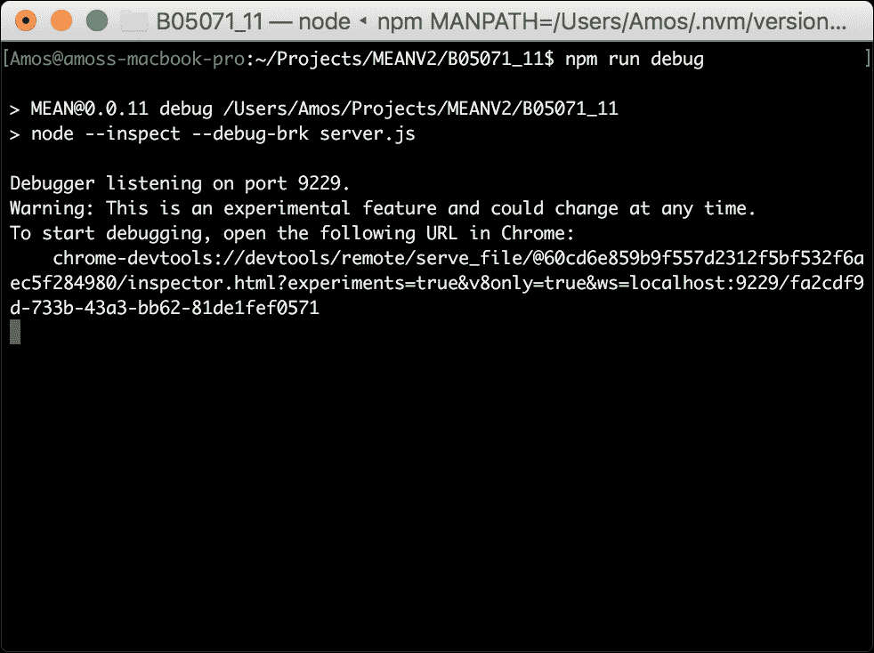
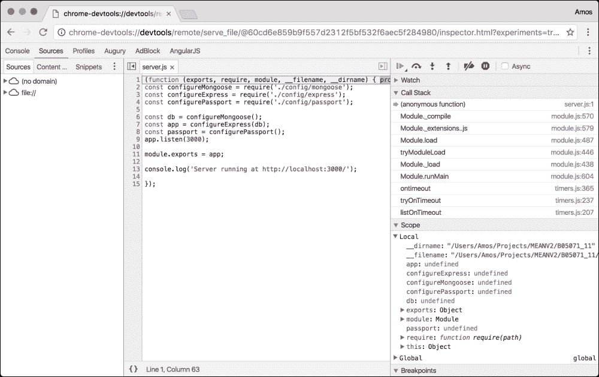
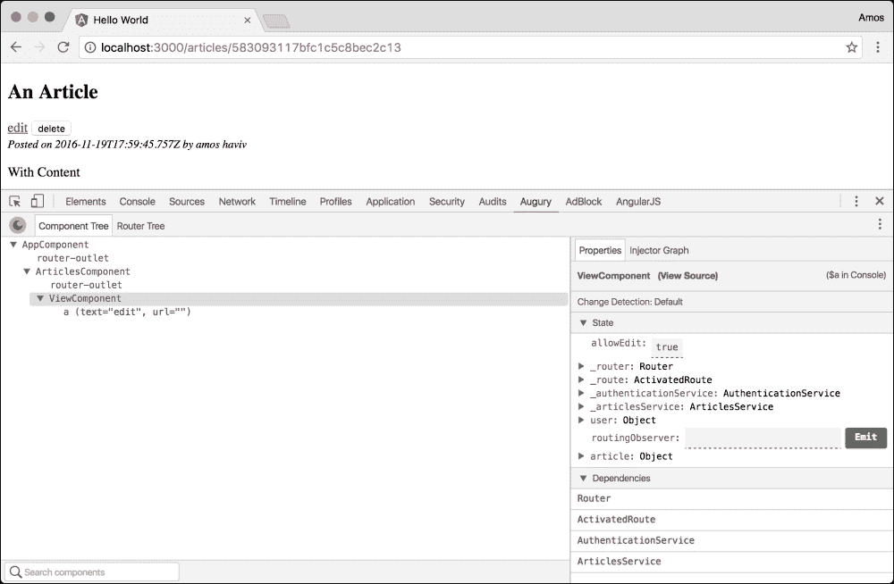
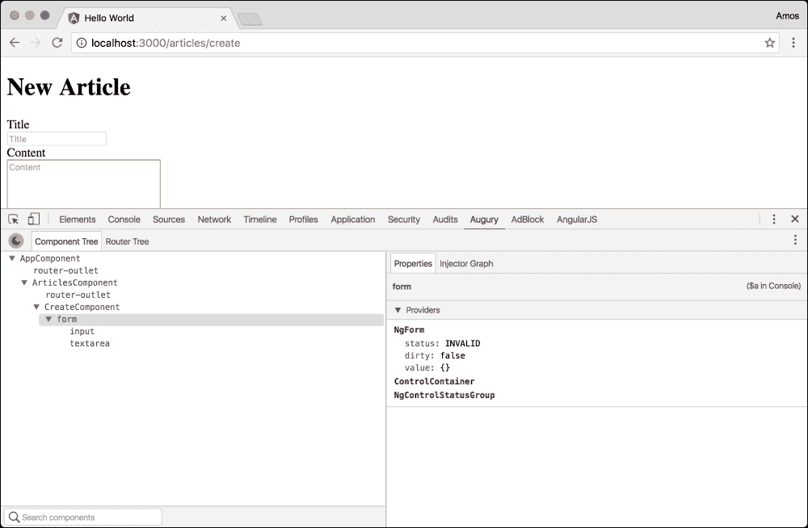
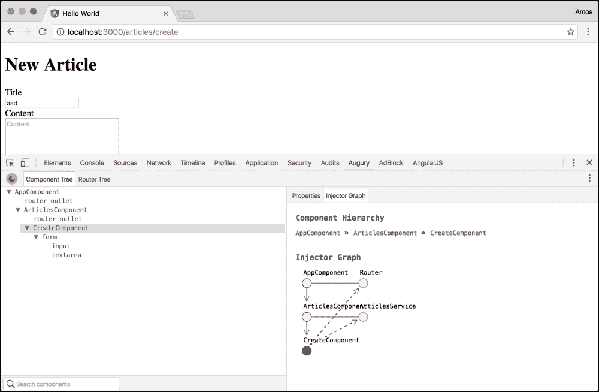

# 十一、自动化和调试 MEAN 应用

在前面的章节中，您学习了如何构建和测试实时 MEAN 应用。 您学习了如何连接所有 MEAN 组件以及如何使用测试框架来测试您的应用。 虽然您可以使用前面章节中使用的相同方法继续开发应用，但您还可以使用支持工具和框架加快开发周期。 这些工具将通过自动化和抽象为您提供一个坚实的开发环境。 在本章中，您将学习如何使用不同的社区工具来加速您的 MEAN 应用的开发。 我们将涵盖以下主题:

*   使用 NPM 脚本
*   引入 Webpack
*   引入 ESLint
*   引入 Nodemon
*   使用 V8 检查器调试你的 Express 应用
*   使用 Angular Augury 调试你的 Angular 应用的内部

# 使用 NPM 脚本

正如您可能已经注意到的，开发我们的应用涉及多个任务的操作。 例如，为了运行我们的应用，我们需要编译 Angular 文件，然后运行我们的 Express 应用。 这个模式会不断重复，甚至变得更加复杂。 为了解决这个问题，开发人员倾向于自动化一些应用功能，并使用支持工具来加速他们的工作。 一些开发人员更喜欢使用第三方工具，如 Grunt 或 Gulp(也称为任务运行器); 然而，我们已经使用了一个允许我们运行脚本的工具，这个工具叫做 NPM。 为了更好地理解这一点，看看你的`package.json`文件的`scripts`属性:

```js
...
"scripts": {
  "tsc": "tsc",
  "tsc:w": "tsc -w",
  "app": "node server",
  "start": "concurrently \"npm run tsc:w\" \"npm run app\" ",
  "postinstall": "typings install",
},
...
```

正如您可以看到的，您已经有了 5 个脚本来管理应用开发。 在接下来的章节中，我们将学习如何添加更多的脚本，以及如何使用这个 NPM 特性来帮助您自动化您的日常工作。 我们将从 Webpack 模块绑定器开始。

# 介绍 Webpack

Webpack 是由 Tobias Koppers 创建的一个流行的模块捆绑程序。 它已经占领了 javascript 的世界，并已成为我们生态系统中最常用的工具之一。 作为其他模块绑定器(如 SystemJS)的替代方案，它有一个非常直接的动机:简化代码绑定、对大型应用进行模块化和代码拆分。 然而，经过几年的积极开发，它现在可以做更多的事情，包括资产绑定、预处理和优化等功能。 不过，在我们的简单介绍中，我们将学习如何简单地替换 SystemJS 来打包和加载 Angular 模块。

### 注意事项

强烈建议您通过访问官方项目页面[https://webpack.github.io/](https://webpack.github.io/)了解更多关于 Webpack 的内容。

## 安装 Webpack

在开始配置 Webpack 实现之前，我们需要使用`npm`来安装 Webpack 的依赖项。 为此，更改您的`package.json`文件，如下所示:

```js
{
  "name": "MEAN",
  "version": "0.0.11",
  "scripts": {
    "tsc": "tsc",
    "tsc:w": "tsc -w",
    "app": "node server",
 "start": "concurrently \"npm run webpack\" \"npm run app\" ",
    "postinstall": "typings install",
 "webpack": "webpack --watch"
  },
  "dependencies": {
    "@angular/common": "2.1.1",
    "@angular/compiler": "2.1.1",
    "@angular/core": "2.1.1",
    "@angular/forms": "2.1.1",
    "@angular/http": "2.1.1",
    "@angular/platform-browser": "2.1.1",
    "@angular/platform-browser-dynamic": "2.1.1",
    "@angular/router": "3.1.1",
    "body-parser": "1.15.2",
    "core-js": "2.4.1",
    "compression": "~1.6.0",
    "connect-flash": "0.1.1",
    "connect-mongo": "1.3.2",
    "cookie-parser": "1.4.3",
    "ejs": "2.5.2",
    "es6-promise": "4.0.5",
    "express": "4.14.0",
    "express-session": "1.14.1",
    "method-override": "2.3.6",
    "mongoose": "4.6.5",
    "morgan": "1.7.0",
    "passport": "0.3.2",
    "passport-facebook": "2.1.1",
    "passport-google-oauth": "1.0.0",
    "passport-local": "1.0.0",
    "passport-twitter": "1.0.4",
    "phantomjs-prebuilt": "2.1.13",
    "reflect-metadata": "0.1.8",
    "rxjs": "5.0.0-beta.12",
    "socket.io": "1.4.5",
    "systemjs": "0.19.39",
    "zone.js": "0.6.26"
  },
  "devDependencies": {
 "awesome-typescript-loader": "2.2.4",
    "concurrently": "3.1.0",
    "jasmine": "2.5.2",
    "jasmine-core": "2.5.2",
    "karma": "1.3.0",
    "karma-jasmine": "1.0.2",
    "karma-phantomjs-launcher": "1.0.2",
    "should": "11.1.1",
    "supertest": "2.0.1",
    "traceur": "0.0.111",
    "typescript": "2.0.3",
    "typings": "1.4.0",
 "webpack": "1.13.3"
  }
}
```

如你所见，你在你的`devDependencies`属性中添加了 Webpack 和 TypeScript 加载器。 我们还添加了一个 Webpack 脚本，以“Watch”模式运行 Webpack，这样每次对文件的更改都会自动更新。 然后，我们将 NPM 的启动脚本改为使用 Webpack，而不是使用 TypeScript 命令行工具来编译 Angular 的文件。 要安装新的依赖项，请转到应用的根文件夹，并在命令行工具中发出以下命令:

```js
$ npm install

```

这将在项目的`node_modules`文件夹中安装指定版本的 Webpack 和 TypeScript 加载器。 当安装过程成功完成后，你就可以使用这些模块来运行 Webpack 并绑定 TypeScript 模块。 接下来，您将学习如何配置 Webpack。

## Webpack 配置

为了控制 Webpack 的执行，你需要使用一个特殊的配置文件来配置 Webpack，这个配置文件位于你的应用的根文件夹中。 当执行时，Webpack 将自动在应用的根文件夹中寻找名为`webpack.config.js`的默认配置文件。 您也可以使用命令行标志指示配置文件名，但为了简单起见，我们将使用默认文件名。 要开始配置 Webpack，请在应用根文件夹中创建一个新文件，并将其命名为`webpack.config.js`。 在你的新文件中，粘贴以下代码片段:

```js
const webpack = require('webpack');

module.exports = {
  entry: {
    'polyfills': './public/polyfills',
    'vendor': './public/vendor',
    'bootstrap': './public/bootstrap'
  },
  devtool: 'source-map',
  resolve: {
    extensions: ['', '.js', '.ts']
  },
  output: {
    path: 'public/build',
    filename: '[name].js',
  },
  module: {
    loaders: [
      {
        test: /\.ts$/,
        loaders: ['awesome-typescript-loader']
      }
    ]
  },
  plugins: [
    new webpack.optimize.CommonsChunkPlugin({
      name: ['bootstrap', 'vendor', 'polyfills']
    })
  ]
};
```

正如你所看到的，Webpack 的配置文件是用来设置 Webpack 构建模块的方式的。 在本例中，我们使用了以下设置:

*   `entry`:这告诉 Webpack 我们应用的入口点是什么。 如果您不认识这些文件，也不要担心; 我们将在下一步中创建它们。 你需要理解的是,我们包应用分为三个不同的文件:我们 polyfills 文件,其中将包括所有的 polyfills-related 模块,我们的供应商文件,包括所有的第三方模块作为角核心模块和应用文件,包括我们的角度应用文件。
*   `devtool`:告诉 Webpack 使用哪个开发工具; 在本例中，我们希望 Webpack 为编译后的应用文件创建映射文件。
*   `resolve`:它告诉 Webpack 要解析什么样的模块扩展; 在本例中，它将包含不带扩展名的模块导入、TypeScript 和 JavaScript 文件。
*   `output`:设置 Webpack 保存输出文件的方式。 这里，我们告诉它，我们想要在一个带有 JavaScript 文件扩展名的`public/build`文件夹中创建绑定文件。
*   `module`:这是 Webpack 将使用的模块列表。 在我们的例子中，我们告诉 Webpack 使用我们之前安装的 TypeScript 加载器来加载所有的 TypeScript 文件。
*   `optimize`:这设置了 Webpack 优化模块绑定的方式。 在我们的例子中，我们希望 Webpack 将每个模块捆绑一次。 这意味着，如果 Webpack 在 Bootstrap 文件和 Vendor 文件中找到一个公共模块导入，它将只在 Vendor 文件中打包一次。

请注意这些属性是面向项目的，这意味着它将根据您的需求进行更改。 我们将继续创建丢失的文件。 首先，转到您的`public`文件夹并创建一个名为`polyfills.ts`的文件。 在这个文件中，粘贴以下代码:

```js
import 'core-js/es6/symbol';
import 'core-js/es6/object';
import 'core-js/es6/function';
import 'core-js/es6/parse-int';
import 'core-js/es6/parse-float';
import 'core-js/es6/number';
import 'core-js/es6/math';
import 'core-js/es6/string';
import 'core-js/es6/date';
import 'core-js/es6/array';
import 'core-js/es6/regexp';
import 'core-js/es6/map';
import 'core-js/es6/set';
import 'core-js/es6/weak-map';
import 'core-js/es6/weak-set';
import 'core-js/es6/typed';
import 'core-js/es6/reflect';
import 'core-js/es7/reflect';
import 'zone.js/dist/zone';
import 'zone.js/dist/long-stack-trace-zone';
```

如你所见，我们包含了所有的 polyfills 库。 接下来，我们将创建一个名为`vendor.ts`的文件; 在这个文件中，粘贴以下代码:

```js
import '@angular/common';
import '@angular/compiler';
import '@angular/core';
import '@angular/forms';
import '@angular/http';
import '@angular/router';
import '@angular/platform-browser';
import '@angular/platform-browser-dynamic';
import 'rxjs';
```

如你所见，我们包含了 Angular 和 RXJS 库中所有的核心模块。 最后，我们将之前的`bootstrap.ts`文件复制到`public`文件夹中。 为此，转到`public`文件夹并创建一个名为`bootstrap.ts`的文件。 在这个文件中，粘贴以下代码:

```js
import { platformBrowserDynamic } from '@angular/platform-browser-dynamic';
import { AppModule } from './app/app.module';

platformBrowserDynamic().bootstrapModule(AppModule);
```

正如你所看到的，这是前面章节中我们的应用引导文件。 我们所要做的就是更改我们的主应用页面。 要做到这一点，请转到`app/views/index.ejs`文件并进行以下更改:

```js
<!DOCTYPE html>
<html>
<head>
  <title><%= title %></title>
  <base href="/">
</head>
<body>
  <mean-app>
    <h1>Loading...</h1>
  </mean-app>

  <script type="text/javascript">
    window.user = <%- user || 'null' %>;
  </script>

  <script src="/socket.io/socket.io.js"></script>

 <script src="build/polyfills.js"></script>
 <script src="build/vendor.js"></script>
 <script src="build/bootstrap.js"></script>
</body>
</html>
```

如您所见，我们只是用新的绑定脚本文件替换了旧脚本。 一旦你完成了这些更改，你的 Webpack 配置就可以使用了! 使用命令行工具并导航到 MEAN 应用的根文件夹。 然后，输入以下命令运行应用:

```js
$ npm start

```

一旦你的应用运行并且 Webpack 完成了对你的代码的捆绑，导航到`http://localhost:3000/`并测试你的应用。 当然，这只是一个基本的设置，所以强烈建议您继续学习 Webpack 的其他特性。

# 介绍 ESLint

在软件开发中，检测是使用专用工具识别可疑代码的使用情况。 在 MEAN 应用中，linting 可以帮助你避免日常开发周期中的常见错误和编码错误; 此外，它还允许您在整个团队中设置统一的代码样式。 在我们的生态系统中，最常用的检测工具是 ESLint。 ESLint 是由 Nicholas C. Zakas 在 2013 年创建的一个可插拔的 lint 实用程序。 它允许我们使用一组规则和预置配置来检测 JavaScript 代码。 我们首先在应用中安装 ESLint 包。

### 注意事项

强烈建议你通过访问官方项目页面[http://eslint.org/](http://eslint.org/)来了解更多关于 ESLint 的信息。

## 安装 ESLint

在开始配置 ESLint 执行之前，我们需要使用`npm`来安装 ESLint 包。 要做到这一点，请更改您的`package.json`文件如下:

```js
{
  "name": "MEAN",
  "version": "0.0.11",
  "scripts": {
    "tsc": "tsc",
    "tsc:w": "tsc -w",
    "app": "node server",
    "start": "concurrently \"npm run webpack\" \"npm run app\" ",
    "postinstall": "typings install",
    "webpack": "webpack --watch",
 "lint": "eslint --ext .js ./config ./app ./*.js"
  },
  "dependencies": {
    "@angular/common": "2.1.1",
    "@angular/compiler": "2.1.1",
    "@angular/core": "2.1.1",
    "@angular/forms": "2.1.1",
    "@angular/http": "2.1.1",
    "@angular/platform-browser": "2.1.1",
    "@angular/platform-browser-dynamic": "2.1.1",
    "@angular/router": "3.1.1",
    "body-parser": "1.15.2",
    "core-js": "2.4.1",
    "compression": "~1.6.0",
    "connect-flash": "0.1.1",
    "connect-mongo": "1.3.2",
    "cookie-parser": "1.4.3",
    "ejs": "2.5.2",
    "es6-promise": "4.0.5",
    "express": "4.14.0",
    "express-session": "1.14.1",
    "method-override": "2.3.6",
    "mongoose": "4.6.5",
    "morgan": "1.7.0",
    "passport": "0.3.2",
    "passport-facebook": "2.1.1",
    "passport-google-oauth": "1.0.0",
    "passport-local": "1.0.0",
    "passport-twitter": "1.0.4",
    "phantomjs-prebuilt": "2.1.13",
    "reflect-metadata": "0.1.8",
    "rxjs": "5.0.0-beta.12",
    "socket.io": "1.4.5",
    "systemjs": "0.19.39",
    "zone.js": "0.6.26"
  },
  "devDependencies": {
    "awesome-typescript-loader": "2.2.4",
    "concurrently": "3.1.0",
 "eslint": "3.10.2",
    "jasmine": "2.5.2",
    "jasmine-core": "2.5.2",
    "karma": "1.3.0",
    "karma-jasmine": "1.0.2",
    "karma-phantomjs-launcher": "1.0.2",
    "should": "11.1.1",
    "supertest": "2.0.1",
    "traceur": "0.0.111",
    "typescript": "2.0.3",
    "typings": "1.4.0",
    "webpack": "1.13.3"
  }
}
```

如你所见，你在你的`devDependencies`属性中添加了 ESLint 包。 你还添加了一个`lint`脚本来运行 ESLint 和一个放在`app`和`config`文件夹中的 lint JavaScript 文件。 要安装新的依赖项，请转到应用的根文件夹，并在命令行工具中发出以下命令:

```js
$ npm install

```

这将在项目的`node_modules`文件夹中安装指定版本的 ESLint 包。 接下来，你将学习如何配置 ESLint。

## 配置 ESLint

在中，为了控制 ESLint 的执行，你需要在你的应用的根文件夹中使用一个特殊的配置文件来配置它。 当执行时，ESLint 会自动在应用的根文件夹中寻找名为`.eslintrc`的默认配置文件。 在应用的根文件夹中创建一个新文件并将其命名为`.eslintrc`。 在你的新文件中，粘贴以下 JSON 对象:

```js
{
  "parserOptions": {
    "ecmaVersion": 6
  }
}
```

正如你所看到的，这个简单的配置基本上告诉 ESLint 我们的代码是用 ECMAScript 6 编写的。 然而，ESLint 可以做的更多; 例如，你可以告诉 ESLint 通过改变配置来验证我们的代码缩进:

```js
{
  "parserOptions": {
    "ecmaVersion": 6
  },
  "rules": {
    "indent": ["error", 2]
  }
}
```

这将告诉 ESLint 在我们的代码文件中期望有两个空格的缩进。 此外，通常，您将使用`extend`属性扩展现有的配置文件，如下所示:

```js
{
  "extends": "eslint:recommended",
  "parserOptions": {
    "ecmaVersion": 6
  }
}
```

这将扩展 ESLint 推荐的规则集。 然而，这些只是简单的例子，所以建议你继续学习 ESLint，以便为你的项目找到最好的配置。 要运行 lint 任务，请进入命令行工具并执行以下命令:

```js
$ npm run lint

```

测试的结果应该在你的命令行工具中报告，并且会像下面的截图所显示的那样:


ESLint 结果

ESLint 是一个强大的工具。 但是，在这种形式下，您需要手动运行`lint`任务。 更好的方法是在修改文件时自动运行 lint 任务。

# 使用 Nodemon

使用 Node 的命令行工具运行应用可能看起来不像是一个冗余任务。 但是，在持续开发应用时，您很快就会注意到您经常停止和启动应用服务器。 为了帮助完成这项任务，有一个叫做 Nodemon 的通用工具。 Nodemon 是一个 node .js 命令行工具，它充当简单的节点命令行工具的包装器，但它会监视应用文件中的更改。 当 Nodemon 检测到文件更改时，它会自动重启节点服务器以更新应用。 要使用 Nodemon，您需要修改项目的`package.json`文件，如下所示:

```js
{
  "name": "MEAN",
  "version": "0.0.11",
  "scripts": {
    "tsc": "tsc",
    "tsc:w": "tsc -w",
    "app": "node server",
 "app:dev": "npm run lint && npm run app",
 "nodemon": "nodemon -w app -w config -w server.js --exec npm run app:dev",
 "start": "concurrently \"npm run webpack\" \"npm run nodemon\",
    "postinstall": "typings install",
    "webpack": "webpack --watch",
    "lint": "eslint --ext .js ./config ./app ./*.js"
  },
  "dependencies": {
    "@angular/common": "2.1.1",
    "@angular/compiler": "2.1.1",
    "@angular/core": "2.1.1",
    "@angular/forms": "2.1.1",
    "@angular/http": "2.1.1",
    "@angular/platform-browser": "2.1.1",
    "@angular/platform-browser-dynamic": "2.1.1",
    "@angular/router": "3.1.1",
    "body-parser": "1.15.2",
    "core-js": "2.4.1",
    "compression": "~1.6.0",
    "connect-flash": "0.1.1",
    "connect-mongo": "1.3.2",
    "cookie-parser": "1.4.3",
    "ejs": "2.5.2",
    "es6-promise": "4.0.5",
    "express": "4.14.0",
    "express-session": "1.14.1",
    "method-override": "2.3.6",
    "mongoose": "4.6.5",
    "morgan": "1.7.0",
    "passport": "0.3.2",
    "passport-facebook": "2.1.1",
    "passport-google-oauth": "1.0.0",
    "passport-local": "1.0.0",
    "passport-twitter": "1.0.4",
    "phantomjs-prebuilt": "2.1.13",
    "reflect-metadata": "0.1.8",
    "rxjs": "5.0.0-beta.12",
    "socket.io": "1.4.5",
    "systemjs": "0.19.39",
    "zone.js": "0.6.26"
  },
  "devDependencies": {
    "awesome-typescript-loader": "2.2.4",
    "concurrently": "3.1.0",
    "eslint": "3.10.2",
    "jasmine": "2.5.2",
    "jasmine-core": "2.5.2",
    "karma": "1.3.0",
    "karma-jasmine": "1.0.2",
    "karma-phantomjs-launcher": "1.0.2",
 "nodemon": "1.11.0",
    "should": "11.1.1",
    "supertest": "2.0.1",
    "traceur": "0.0.111",
    "typescript": "2.0.3",
    "typings": "1.4.0",
    "webpack": "1.13.3"
  }
}
```

正如您可以看到的，我们将 Nodemon 包添加到开发依赖项中。 我们还添加了两个新脚本，并更改了我们的`start`脚本。 我们添加的第一个脚本是`app:dev`，它运行`lint`和`app`脚本。 接下来，我们创建了一个`nodemon`脚本，该脚本监视所有的服务器 JavaScript 文件，并在文件被修改时运行`app:dev`脚本。 在我们的`start`脚本中，我们只是同时执行 Webpack 和 Nodemon 脚本。 这是它! 你剩下要做的就是通过进入你的应用根目录并在你的命令行工具中发出以下命令来安装 Nodemon 包:

```js
$ npm install

```

然后，使用常规的`start`命令运行应用:

```js
$ npm start

```

这将以新的设置启动应用。 尝试改变你的 Angular 或 Express 应用文件; 注意，如果你改变了一个服务器文件，你的应用就会重新启动，而且当你改变一个 Angular 文件时，Webpack 会自动编译你的代码。

# 用 V8 检查器调试 Express

调试 MEAN 应用的 Express 部分可能是一项复杂的任务。 幸运的是，有一个很棒的工具解决了这个问题，叫做 V8 检查器。 V8 Inspector 是一个使用 Blink(一个 WebKit Fork)开发工具的调试工具。 事实上，开发者使用谷歌的 Chrome 浏览器已经熟悉它，在形式的 Chrome 开发工具界面。 V8 检查器支持一些非常强大的调试特性:

*   源代码文件导航
*   断点操纵
*   跨步，跨步，跨步，然后继续执行
*   变量和属性检查
*   住代码编辑

为了调试你的应用，你需要使用一个兼容的 web 浏览器访问 V8 检查器接口。 然后，您将能够使用它来调试您的应用代码使用 Chrome 开发人员工具界面。 要做到这一点，你所要做的就是添加一个调试脚本到你的`package.json`文件，如下所示:

```js
{
  "name": "MEAN",
  "version": "0.0.11",
  "scripts": {
    "tsc": "tsc",	
    "tsc:w": "tsc -w",
    "app": "node server",
    "app:dev": "npm run lint && npm run app",
    "nodemon": "nodemon -w app -w config -w server.js --exec npm run app:dev",
    "start": "concurrently \"npm run webpack\" \"npm run nodemon\",
 "debug": "node --inspect --debug-brk server.js",
    "postinstall": "typings install",
    "webpack": "webpack --watch",
    "lint": "eslint --ext .js ./config ./app ./*.js"
  },
  "dependencies": {
    "@angular/common": "2.1.1",
    "@angular/compiler": "2.1.1",
    "@angular/core": "2.1.1",
    "@angular/forms": "2.1.1",
    "@angular/http": "2.1.1",
    "@angular/platform-browser": "2.1.1",
    "@angular/platform-browser-dynamic": "2.1.1",
    "@angular/router": "3.1.1",
    "body-parser": "1.15.2",
    "core-js": "2.4.1",
    "compression": "~1.6.0",
    "connect-flash": "0.1.1",
    "connect-mongo": "1.3.2",
    "cookie-parser": "1.4.3",
    "ejs": "2.5.2",
    "es6-promise": "4.0.5",
    "express": "4.14.0",
    "express-session": "1.14.1",
    "method-override": "2.3.6",
    "mongoose": "4.6.5",
    "morgan": "1.7.0",
    "passport": "0.3.2",
    "passport-facebook": "2.1.1",
    "passport-google-oauth": "1.0.0",
    "passport-local": "1.0.0",
    "passport-twitter": "1.0.4",
    "phantomjs-prebuilt": "2.1.13",
    "reflect-metadata": "0.1.8",
    "rxjs": "5.0.0-beta.12",
    "socket.io": "1.4.5",
    "systemjs": "0.19.39",
    "zone.js": "0.6.26"
  },
  "devDependencies": {
    "awesome-typescript-loader": "2.2.4",
    "concurrently": "3.1.0",
    "eslint": "3.10.2",
    "jasmine": "2.5.2",
    "jasmine-core": "2.5.2",
    "karma": "1.3.0",
    "karma-jasmine": "1.0.2",
    "karma-phantomjs-launcher": "1.0.2",
    "nodemon": "1.11.0",
    "should": "11.1.1",
    "supertest": "2.0.1",
    "traceur": "0.0.111",
    "typescript": "2.0.3",
    "typings": "1.4.0",
    "webpack": "1.13.3"
  }
}
```

在新的脚本中，您所做的就是使用两个命令行标志运行应用。 `inspect`标志允许附加 Chrome 开发工具到我们的 Node.js 实例，和`debug-brk`标志阻止 Node.js 在你附加调试器之前运行你的代码。 接下来，我们将使用新脚本运行应用，并看看如何调试它。

# 调试您的应用

要使用你的新`debug`脚本，导航到你的应用的根文件夹，并在你的命令行工具中发出以下命令:

```js
$ npm run debug

```

这将在调试模式下运行应用，并等待您附加 Chrome 开发人员工具调试器。 命令行工具中的输出应该类似于下面的截图:



在调试模式下运行

如您所见，`debug`脚本邀请您通过使用兼容浏览器访问`chrome-devtools://…`来开始调试应用。 在谷歌 Chrome 中打开这个 URL，你应该会看到如下截图所示的界面:



使用 V8 检查器进行调试

如您所见，您将在左侧面板中获得项目文件列表，在中间面板中获得文件内容查看器，在右侧面板中获得调试仪表板。 这意味着您的`debug`脚本正在正常运行，并且正在标识您的 Express 项目。 可以通过设置一些断点并测试应用的行为来开始调试项目。

### 注意事项

节点检查仅适用于使用 Blink 引擎的浏览器，如谷歌 Chrome 或 Opera。 此外，该特性仍处于试验阶段。 因此，建议您保持对官方 Node.js 文档的更新。

# 用 Angular 预兆调试 Angular 应用

MEAN 应用的大部分 Angular 部分的调试通常是在浏览器中完成的。 然而，调试 Angular 的内部操作可能会有点棘手。 为此，来自谷歌和 Rangle 的联合团队。 io 创建了一个名为 Angular Augury 的 Chrome 扩展。 Angular Augury 用一个新标签扩展了 Chrome 开发者工具，在这里你可以调试 Angular 应用的不同方面。 安装 Angular Augury 非常简单。 所有的你必须做的是访问 Chrome 网络商店在[https://chrome.google.com/webstore/detail/augury/elgalmkoelokbchhkhacckoklkejnhcd](https://chrome.google.com/webstore/detail/augury/elgalmkoelokbchhkhacckoklkejnhcd)和安装 Chrome 扩展。

### 注意事项

Angular Augury 只能在谷歌 Chrome 浏览器上运行。

## 使用 Angular 占卜

当你完成安装 Angular Augury 后，使用 Chrome 导航到你的应用 URL。 然后，打开 Chrome 开发人员工具面板，你应该会看到一个**Angular**标签。 点击它，一个类似如下截图所示的面板就会打开:


角占卜

## 组件树

我们的 Angular 应用被构建为一棵组件树。 占卜允许我们以分层的方式检查这些组件; 为了更好地理解这一点，看看下面的截图:



占卜组件树

如你所见，我们正在检查我们的文章模块中的`ViewComponent`。 由于我们的组件路由基于一个简单的层次结构，您可以注意到我们也看到了`AppComponent`和`ArticlesComponent`。 在右边你可以注意到我们有两个标签:**属性**和**喷射器图**。 在**属性**选项卡中，您会发现组件状态包括`article`和`user`属性以及组件依赖项。 该状态是可编辑的，因此它允许您更改组件状态并查看对`ViewComponent`呈现的影响。 此外，如果我们检查`CreateComponent`，你将能够看到如何使用表单占卜:



占卜与形式

如您所见，您可以检查表单状态并了解其内部状态。 如果您编辑表单输入的值，您还可以在右窗格中看到它的状态实时更新。 如果你点击**注入器图**选项，你就能看到 Angular 的注入器是如何工作的，以及当前组件中被注入的提供商:



占卜喷射器图

注意`Router`和`ArticlesService`提供者是如何注射到`CreateComponent`的。 在大型应用中，这将使您更好地了解项目状态。

## 路由树

要探索你的 Angular 应用路由，你可以点击**Router Tree**标签。 在你这么做之前，你需要把路由提供者注入到你的应用组件中，如下所示:

```js
import { Component } from '@angular/core';
import { AuthenticationService } from './authentication/authentication.service';
import { Router } from '@angular/router';

@Component({
  selector: 'mean-app',
  template: '<router-outlet></router-outlet>',
})
export class AppComponent {
  constructor(private _authenticationService: AuthenticationService,
 private router: Router) {}
}
```

一旦你做了，你将能够看到类似于如下截图所示的面板:


占卜路由树

如您所见，**路由树**选项卡允许您在一个易于理解的图表中理解您的应用路由方案。

Angular 占卜是一个简单而强大的工具。 如果使用得当，它可以为您节省大量的时间，不必没完没了地查看和使用控制台日志记录。 确保您理解了每个选项卡，并尝试自己探索应用。

# 小结

在本章中，你学习了如何自动化你的 MEAN 应用的开发，以及如何调试你应用中的 Express 和 Angular 部分。 我们首先简要介绍了 NPM 脚本。 然后我们讨论了 Webpack 及其强大的特性，并学习了如何自动重启和检测应用。 然后，您学习了如何使用 V8 检查器工具来调试 Express 代码。 在本章的最后，你了解了 Angular Augury Chrome 扩展。 你浏览了 Angular Augury 的特性，并发现了如何调试 Angular 的内部组件。

由于这是本书的最后一章，您现在应该知道如何构建、运行、测试、调试和轻松开发您的 MEAN 应用。

下一步就看你了。