# 九、使用 Node-RED 创建一个 ToDo 应用

在本章中，我们将在 Node-RED 中创建一个简单的 ToDo 应用。 这篇文章简单明了，是关于在 Node-RED 中创建应用(流)的很好的教程。 我们将使用在前一章中解释的项目特性，因此本章也将作为对该功能的回顾。

让我们从以下四个主题开始:

*   为什么你应该在 web 应用中使用 Node-RED
*   创建一个数据库
*   如何连接到数据库
*   运行应用

在本章结束时，您将掌握如何在 Node-RED 上使用数据库制作一个简单的 web 应用。

# 技术要求

要读完本章，你需要具备以下条件:

*   node . js 12。 [https://nodejs.org/](https://nodejs.org/)
*   CouchDB 3。 x([https://couchdb.apache.org/](https://couchdb.apache.org/))。
*   GitHub 账号，可从[https://github.com/](https://github.com/)获取。
*   本章使用的代码可在**第九章**[https://github.com/PacktPublishing/-Practical-Node-RED-Programming](https://github.com/PacktPublishing/-Practical-Node-RED-Programming)中找到。

# 为什么你应该在 web 应用中使用 Node-RED

到目前为止，本书已经解释了 Node-RED 对于**物联网**(**物联网**)是一个易于使用的工具。 在物联网领域，Node-RED 作为解决方案使用的情况很多。

然而，最近，Node-RED 已被公认为创建 web 应用和物联网的工具。

我认为其中一个原因是*无代码*和*低代码*的思想在世界范围内广泛传播。 如今，了解基于流的编程工具和可视化编程工具的人越来越多，并且它们正在各个领域中得到应用。

Node-RED 是用 Node.js 制作的，用于 web 应用是很自然的。

我们在前一章中学习的项目功能，与 Git/GitHub 合作，也可能是 web 应用开发文化的一部分。

在本章中，我们将创建一个 ToDo 应用，它非常适合作为一个开发教程。

要创建的应用的总体情况如下:

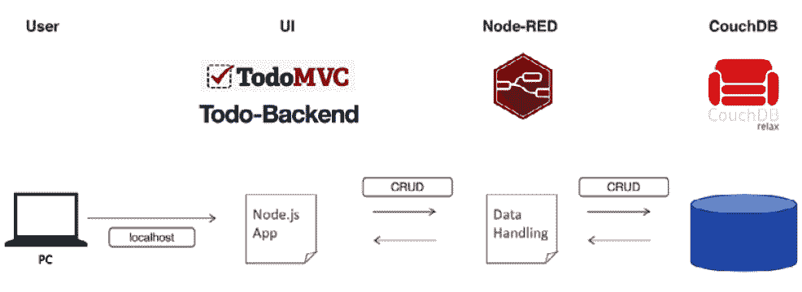

图 9.1 -我们将创建的应用的概述

图 9.1 概述了应用的概述。 应用将从客户端 PC 浏览器访问。 该应用的用户界面采用 Node.js 框架，**TodoMVC**，**Todo-Backend**。 数据处理编程构建在 Node-RED 上，方法是将 CouchDB 连接起来作为该数据的存储。

在这个应用中，用户界面和后端应用不是在 Node-RED 上构建的。

应用是在本地主机上作为 Node.js 应用直接实现的。 我们将在后面的步骤中讨论这个问题，在访问 Node-RED 运行的 localhost 端口时，将它设置为重定向到 localhost Node.js 应用。

在开始实践示例之前，我们应该了解这个应用使用的两个框架。 在本教程中，我们将使用 Node-RED 创建 ToDo 应用。 应用是通过这两个 Node.js 框架实现的:

*   :[http://todomvc.com/](http://todomvc.com/)

Figure 9.2 – TodoMVC

*   **todo 后端**:[https://todobackend.com/](https://todobackend.com/)

现在仔细看

正如你从中所看到的，通过链接 web 应用框架可以创建 Node-RED 流，Node-RED 与用 Node.js 实现的 web 应用以及围绕它的框架工作得非常好。 本实践教程将帮助您理解为何 Node-RED 在无代码/低代码模式的 web 应用开发中如此流行。

接下来，我们将进入实际操作步骤。

# 创建数据库

我们在前一节介绍了应用的总体情况，但更具体地说，该应用使用 CouchDB 作为数据库。 在本教程中，我们将创建一个在本地主机上运行 Node-RED 的应用。 因此，您还需要在自己的本地机器上安装 CouchDB。

让我们按照以下步骤安装它:

1.  Access the CouchDB website at [https://couchdb.apache.org/](https://couchdb.apache.org/) and then click the **DOWNLOAD** button:

    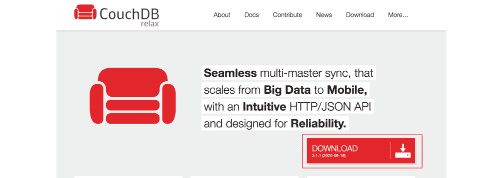

    图 9.4 -单击 DOWNLOAD 按钮

2.  Select a file depending on the system running on local machine:

    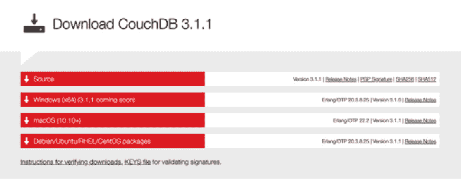

    图 9.5 -选择文件

3.  Expand the ZIP file you downloaded and run the application file to start CouchDB once the file has finished downloading:

    

    图 9.6 -启动 CouchDB

4.  Running the CouchDB application file launches a browser and opens the CouchDB management console. If it doesn't open automatically, you can also open it manually from the application menu:

    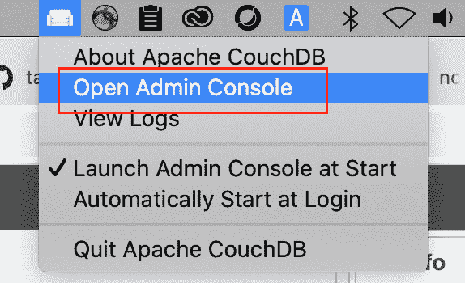

    图 9.7 -打开 CouchDB 管理控制台

5.  In the CouchDB management console, create a new database. Create it with the name **todos**. No partition is needed. Finally, click the **Create** button to complete:

    

    图 9.8 -创建名为“todos”的新数据库

    现在，您可以在 CouchDB 管理控制台上看到名为**todos**的数据库:

    

    图 9.9 -检查您创建的数据库

6.  Create an admin user to access this database from your application. To do this, access **User Management** from the side menu of the CouchDB Management Console, select the **Create Server Admin** tab, and set the user account and password.

    其中，**admin**设置为用户名，**adminpass**设置为密码:

图 9.10 -创建一个服务器管理用户帐户

这样就完成了与 CouchDB 相关的所有设置。 接下来，让我们继续设置我们的 Node-RED 端。

# 如何连接数据库

现在数据库已经实际创建好了，我们将转向实践教程，在这里我们将从 GitHub 克隆 Node-RED 流，并从 Node-RED 流实现到该数据库的连接。 使用您在前一章学到的项目特性连接到您的 GitHub 存储库，加载准备好的流定义文件，并在本地环境中的 Node-RED 上实现它。 因为您已经在前一章中完成了这一点，所以这次没有必要创建一个新的流。

## 配置 Node-RED

您需要做的第一件事是更改 Node-RED 流编辑器的本地主机路径(URL)。 目前,您可以访问流编辑器在**localhost: 1880**,但是为了更改路径(URL)的 web 应用创建的这个实践教程**localhost: 1880**,我们需要改变流编辑器的路径**localhost: 1880 / admin**。

这是因为您必须移动 Node-RED 流编辑器的根路径，才能访问运行在本地主机上相同端口上的 Node.js ToDo 应用。

要配置 Node-RED，请遵循以下步骤:

1.  打开设置文件(**~/.node-red/settings.js**)。
2.  Find the **httpAdminRoot** setting in the **settings.js** file you opened.

    这将更改您访问 Node-RED 流编辑器的路径。 默认情况下，它使用根路径**/**，然而，我们希望在我们的应用中使用它，所以我们可以使用这个设置来移动编辑器。 默认情况下，它被注释掉了，所以通过删除该行开头的**//**来取消注释:

    

    图 9.11 -取消 httpAdminRoot 注释以启用流编辑器路径

3.  您现在已经将流编辑器移动到**/admin**。 在本地机器上重新启动 Node-RED 并访问**http://localhost:1880/admin**URL 来运行 Node-RED 流编辑器。

接下来，让我们克隆这个项目。

## 克隆 Node-RED 项目

本实用教程提供了一个 Node-RED 项目的示例供您使用。 在将其克隆到本地 Node-RED 实例之前，您应该首先 fork 该项目，以便使用自己的副本。

fork 之后，需要将项目克隆到 Node-RED 实例中。

要克隆你的项目，遵循以下步骤:

1.  在[https://github.com/taijihagino/node-red-todo-app](https://github.com/taijihagino/node-red-todo-app)打开示例项目。
2.  单击**fork**按钮来创建您自己的存储库副本。
3.  复制您派生的存储库的 URL。
4.  通过**http://127.0.0.1:1880/admin/**访问 Node-RED 编辑器。
5.  Click the **Clone Repository** button in the **Projects Welcome** screen. If you've already closed that screen, you can reopen it with **Projects | New** from the main menu:

    

    图 9.12 -在 Projects 菜单下点击 New 来克隆 repo

6.  On the **Projects** screen, provide your repository URL, your username, and password. These are used when committing changes to the project. If your local Git client is already configured, it will pick those values. It is fine to leave the **Credentials encryption key** field blank:

    

    图 9.13 -提供你的 GitHub 存储库信息

7.  This will clone the repository into a new local project and start running it. In the workspace, you can see flows that implement each part of the application's REST API.

    您将在所有的**云**节点上看到一些错误，但是产生这些错误的原因来自连接设置。 这些设置将在后面的步骤中进行，所以现在不是一个问题:

    

    图 9.14 -你克隆的流程概览

8.  The project also includes some static resources that need to be served by the runtime. To do this, some changes to how you access this web application need to be made in your settings file.

    首先，必须在本地文件系统中定位新克隆的项目。 它将在**<node-red root>/projects/<name-of-project>**中。 在该文件夹中，您将发现一个名为**public**的文件夹。 它包含了这个 ToDo 应用的项目的静态资源，例如如下所示:

    / Users /太地町/ .node-red /威廉姆斯/ node-red-todo-app

    下面的图片就是一个例子。 当检查自己的文件路径时，请使用它作为参考:

    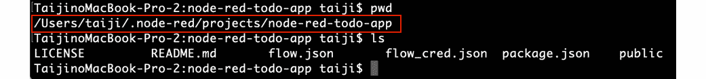

    图 9.15 - ToDo 应用项目文件夹

9.  Edit your settings file (**~/.node-red/settings.js**) and find the **httpStatic** property in this file. Uncomment it by removing the **//** at the start of the line and set its value using the absolute path to the **public** folder. The path in the following image is just an example; please replace it with your path:

    

    图 9.16 -取消 httpStatic 注释并设置应用项目路径

10.  重启 Node-RED。

通过重启 Node-RED，更改的**settings.js**内容将被重新加载并应用。

接下来，让我们配置 Node-RED 和 CouchDB 连接。

## 配置 Node-RED 和 CouchDB 连接

正如所知，我们正在使用**云**节点连接到 CouchDB，对吗?

Cloudant 是一个基于 Apache CouchDB 的 JSON 数据库。 Cloudant 具有 CouchDB 风格的复制和同步功能，因此您可以使用 node - red 提供的**云**节点连接到 CouchDB。

如前所述，node - red 上的**云**节点出现错误。 这是因为从 GitHub 克隆到本地系统上 CouchDB 的连接信息没有正确设置。

在这里，我们将更正 node - red 上的**云**节点的设置。

现在按以下步骤执行设置:

1.  Double-click any **cloudant** node to open the settings screen. If you set one of the **cloudant** nodes there, the settings of all **cloudant** nodes on the same flow will be updated, so it doesn't matter which **cloudant** node you choose:

    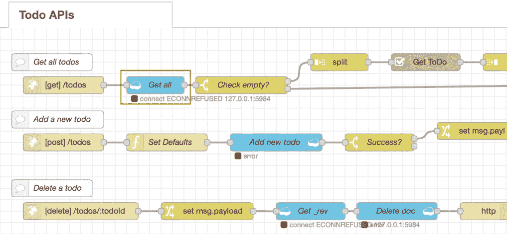

    图 9.17 -双击任意一个云节点打开设置界面

2.  Click the **pencil mark** button on the right side of **Server** on the **cloudant** node settings screen to open the connection information settings screen for CouchDB:

    

    图 9.18 -点击铅笔标记按钮

3.  当连接信息设置屏幕 CouchDB 打开,去**主机**和**设置为 http://localhost: 5984**(如果安装了 CouchDB 在一个不同的港口,适当的取代它)和设置**用户名**的 CouchDB 服务器管理员用户组。 **Password**输入服务器的 admin 密码。
4.  After entering all of this, click the **Update** button on the upper right to return to the previous screen:

    

    图 9.19 -设置 CouchDB URL 和服务器管理用户/密码

5.  单击**Done**按钮并返回到 Node-RED 流编辑器的工作空间。 您将看到一个绿色方块旁边的所有**云**节点上的**连接**消息:

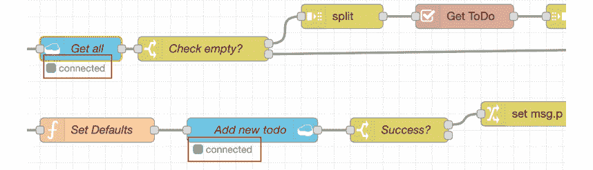

图 9.20 -检查所有的云节点都没有错误

很好，您已经成功地配置了在 Node-RED 中启动 ToDo 应用的设置。 接下来，让我们运行这个 ToDo 应用。

# 运行应用

如果一切正常，您应该能够在浏览器中打开**http://localhost:1880**并看到应用。

现在，让我们通过以下步骤来确认 ToDo 应用是否工作:

1.  Access **http://localhost:1880** to open your ToDo application.

    如果您在打开**localhost:1880**时得到 Node-RED 流编辑器，则设置**httpAdminRoot**未启用，因此请再次检查您的**settings.js**文件。

    当你访问这个 URL 时，应该显示以下屏幕:

    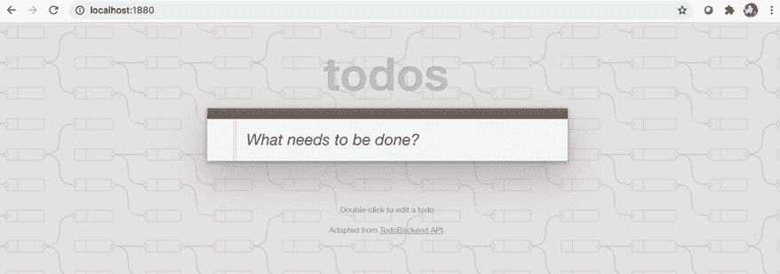

    图 9.21 -打开 ToDo 应用

2.  Any ToDo item is fine for this test, so enter any words as a sample task. Here, I typed **Report my tasks**:

    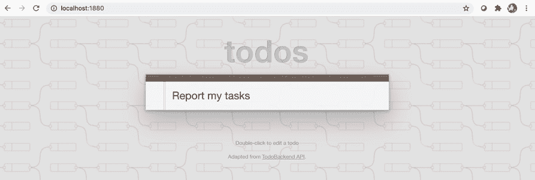

    图 9.22 -输入一个 ToDo 项目样本

3.  If you press the *Enter* key while entering a value in the text box, that value will be registered as a ToDo item. In the following screenshot, we can see that it looks like it has been registered in the application:

    

    图 9.23 -你输入的 ToDo 条目已经注册

    让我们检查屏幕上显示为已注册的 ToDo 项是否已在数据库中注册。

4.  Open the CouchDB admin console.

    如果忘记如何打开它，可以使用 CouchDB 应用菜单中的**open Admin Console**选项来打开它。 如果重新打开管理控制台，或者时间已过，可能会要求您登录。 在这种情况下，使用您设置的服务器管理用户名和密码登录。

5.  Select **Database** option in the side menu, and click **todos**. You will see the record you registered on your ToDo application. Click the record to show more details:

    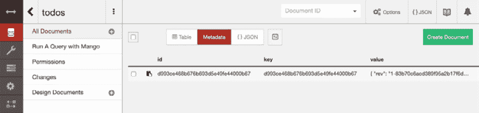

    图 9.24 -检查 todos 数据库中的记录

6.  您将看到所选记录的详细信息。 数据是您通过 ToDo 应用注册的确切项目，即**Report my tasks**:

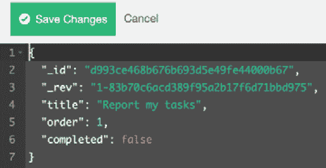

图 9.25 -检查结果

恭喜你! 此完成了从 GitHub 克隆 ToDo 应用并在 Node-RED 中实现它的实践教程。

本教程的重点是使用 Node-RED 的项目功能从 GitHub 存储库克隆和执行应用项目。

这个动手教程帮助我们了解到，在使用 Node-RED 制作的 web 应用中，我们不一定要实现用户界面和服务器端业务逻辑。 我们看到了 Node-RED 的一个特性是，我们构建的 web 应用的用户界面和服务器端业务逻辑位于 Node-RED 之外，而只有数据处理功能(如访问数据库)是由 Node-RED 内部完成的。

我们使用的 GitHub 存储库包含两个东西，即处理数据的 Node-RED 流和运行在 Node-RED 之外的 ToDo 应用。 这里的要点是使用 Node-RED 的项目功能从 GitHub 存储库克隆和执行应用项目。

# 小结

在本章中，以实践教程的形式，我们体验了如何使用项目特性在 Node-RED 上实际运行一个 web 应用。 当然，这只是在 node - red 上创建 web 应用(包括 UI、使用模板节点等等)的一种方法。 然而，记住这个模式对您将来的开发任务肯定是有用的。

在下一章中，我们将看看一个实际操作的场景，我们将使用 Node-RED 从边缘设备发送传感器数据到服务器端(云)。