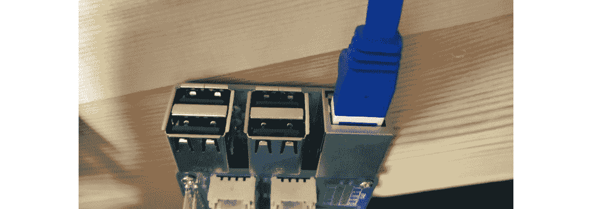
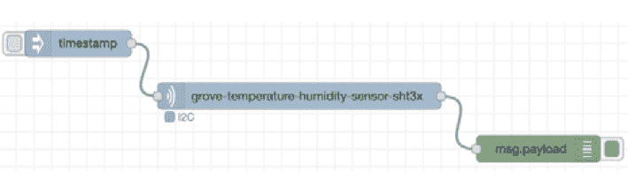
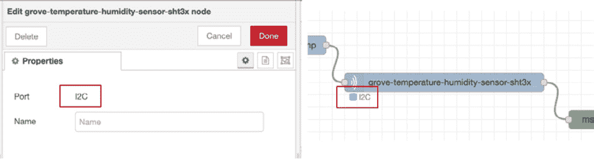
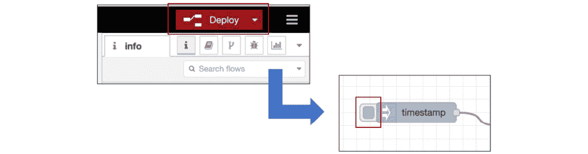
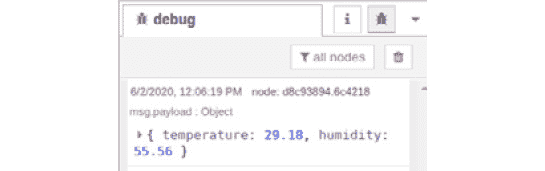
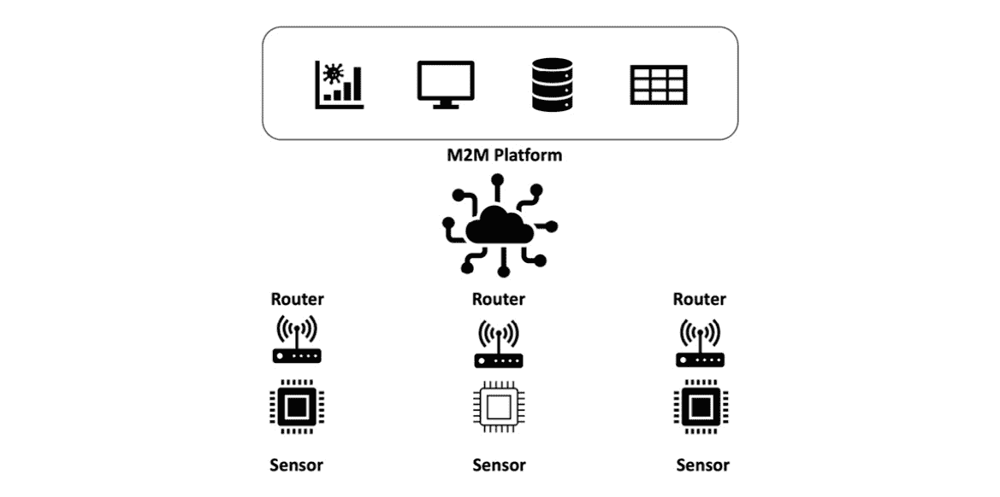
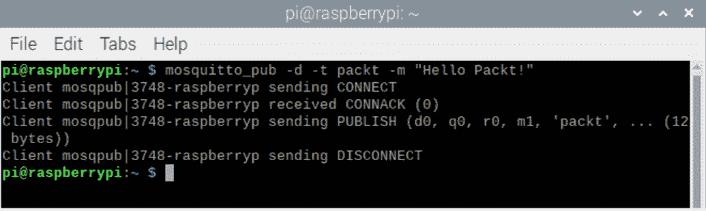
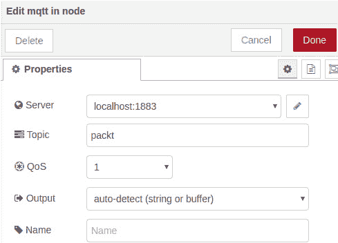
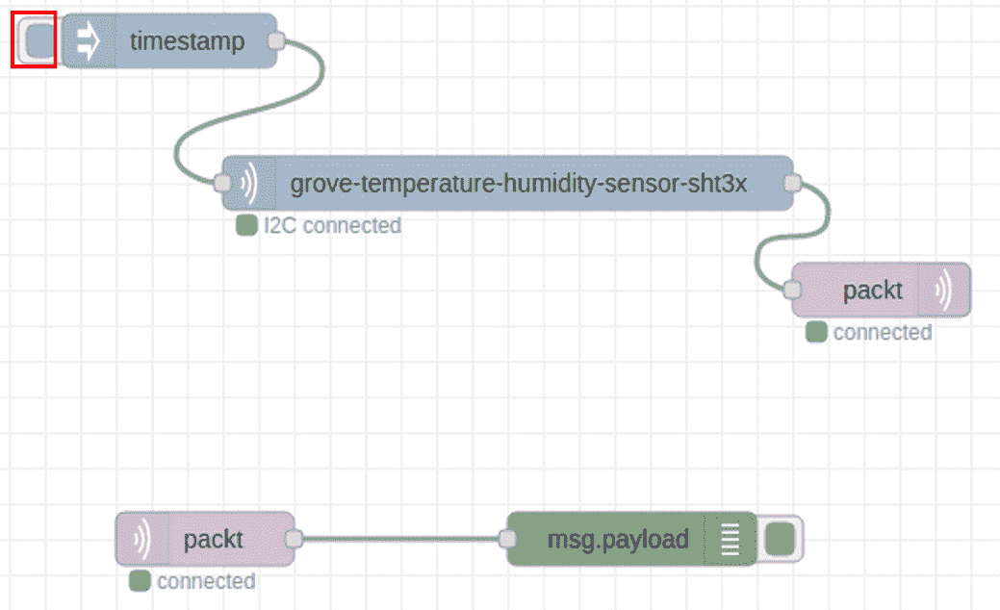

# 十、处理树莓派的传感器数据

在本章中，我们将学习如何处理来自边缘设备的数据发生在**物联网**(**物联网**)使用 Node-RED。 我们不仅将讨论数据处理，还将讨论从边缘设备向服务器应用发送数据。 至于设备，我想用树莓派。 完成本章的教程后，您将能够处理边缘设备获取的传感器数据。

让我们从以下四个主题开始:

*   从树莓派的传感器模块获取传感器数据
*   学习 MQTT 协议并使用 MQTT 节点
*   连接到 MQTT 代理
*   检查本地主机数据状态

# 技术要求

要在本章取得进展，你需要具备以下条件:

*   树莓派:[https://www.raspberrypi.org/](https://www.raspberrypi.org/ )
*   本章使用的代码可在[https://github.com/PacktPublishing/-Practical-Node-RED-Programming](https://github.com/PacktPublishing/-Practical-Node-RED-Programming)的**第 10 章**文件夹中找到。

# 从树莓派上的传感器模块获取传感器数据

在本章中，我们将学习如何使用 Raspberry Pi 上的 Node-RED 处理从传感器设备获取的数据，并将数据发布到 MQTT 代理。

对于传感器设备，我们将使用[*第五章*](05.html#_idTextAnchor062)、*中使用的温湿度传感器*实现 Node-RED local。 请参见[*第 5 章*](05.html#_idTextAnchor062)、*实现 Node-RED local*中的每个步骤，了解 Raspberry Pi 上传感器设备的连接和使能方法。

准备将温度/湿度传感器连接到树莓派上。 这是边缘装置。 您已经在[*第 5 章*](05.html#_idTextAnchor062)*实现 Node-RED 本地*中购买并配置了您的边缘设备。 本章不使用光传感器:

*   **树莓派 3**(https://www.raspberrypi.org/)
*   传感器模块:**林基地帽覆盆子π,格罗夫温度和湿度传感器(SHT31)**([https://www.seeedstudio.com/Grove-Base-Hat-for-Raspberry-Pi.html](https://www.seeedstudio.com/Grove-Base-Hat-for-Raspberry-Pi.html),[https://www.seeedstudio.com/Grove-Temperature-Humidity-Sensor-SHT31.html](https://www.seeedstudio.com/Grove-Temperature-Humidity-Sensor-SHT31.html))

## 准备设备

请准备设备来收集您树莓派上的温度/湿度传感器数据，如下:

1.  Connect the sensor module to your Raspberry Pi.

    当所有设备准备就绪后，连接树莓 Pi 和 Grove Base HAT，将 Grove 温湿度传感器(SHT31)连接到 I2C 端口(任何 I2C 端口都可以):

    

    图 10.1 -将温度/湿度传感器连接到树莓派上

2.  Connect your Raspberry Pi to the internet.

    我们将继续从树莓派连接到服务器端，所以请确保您通过 Wi-Fi 连接到互联网。 当然，你也可以通过网线连接到调制解调器来访问互联网。 树莓派默认有一个网线接口，所以你要做的就是插入网线:

图 10.2 -连接树莓派到互联网

这就是我们接下来要做的。 接下来，我们将了解如何从传感器节点获取数据。

## 检测 Node-RED 从传感器设备获取数据

正如你在[*第 5 章*](05.html#_idTextAnchor062)，*实现 Node-RED 本地*中学到的，从 Grove Base 温湿度传感器模块获取数据应该很容易。

从传感器节点获取数据的步骤如下:

1.  制作一个简单的流程来获取数据。 选择三个节点,也就是说,一个**注入节点,一个**grove-temperature-humidity-sensor-sht3x 节点,**和**调试节点,从面板左侧的流编辑器和拖拽到工作区中放置它们。****
***   After placing them, please wire them sequentially as shown in the following diagram:

    

    图 10.3 -放置和连接节点

    *   Check the settings of the **grove-temperature-humidity-sensor-sht3x** node. To check the settings, double-click the **grove-temperature-humidity-sensor-sht3x** node to bring up the settings screen.

    在此设置屏幕上没有要设置的值或项。 您只需要确保将端口指示为**I2C**。 检查完成后，关闭设置界面。

    确保在**凹槽-温湿度传感器-sht3x**节点下方看到一个蓝色方形图标和文本**I2C**。 这表示 Grove Base 温湿度传感器模块已成功连接到您的树莓派上。 如果此图标变为红色，说明模块未正确连接**I2C**端口，请重新正确连接硬件:

    

    图 10.4 -检查端口设置为 I2C

    *   执行流并单击流编辑器右上角的**Deploy**按钮检查结果，以完成部署。*   部署成功后，点击**inject**节点上的开关，启动流:**

 **

图 10.5 -部署并单击注入节点上的按钮

如果可以确认采集到的传感器数据值在流编辑器的**调试**选项卡中以 JSON 形式显示，则工作成功。 这样就可以从传感器模块中获得数据:

图 10.6 -确保数据从传感器模块可见

现在我们知道树莓派上的 Node-RED 可以处理传感器数据。 让我们学习将该数据发布到 MQTT 代理的过程。

# 学习 MQTT 协议并使用 MQTT 节点

现在已经成功地获取了传感器数据，让我们将数据发送到服务器。

我们通常选择适合所传输内容的协议; 例如，当交换邮件时，我们使用 SMTP。 目前，HTTP 被用作 internet 上的通用协议。

例如，HTTP 用于互联网上的各种通信，例如在浏览器中显示网页和在服务器之间交换数据。 HTTP 是一种用于在 internet 上交换内容的协议。 在很多情况下，internet 上设置的路由、防火墙等网络设备允许 HTTP 通信用于各种目的，并且 HTTP 与 internet 兼容。

在物联网领域，MQTT 经常被用作通用协议，而不是 HTTP。 这意味着 MQTT 协议是物联网世界的标准，就像 HTTP 协议是 web 世界的标准一样。

**MQTT**(简称**MQ 遥测传输**)是由 IBM 和 Eurotech 于 1999 年首次创建的一种通信协议。 2013 年，国际标准化组织 OASIS 推动了该协议的标准化。

MQTT 打算在 TCP/IP 上使用。 简而言之，它专门从事**机对机**(**M2M**)的 internet 通信，以及 internet 上机器与其他资源之间的通信。 这里提到的*机器*是微型计算机板，如 pc 和小型 Linux 板(包括树莓派)。

自 1999 年以来，M2M 已经发展了多年，出现了**IoT**这个词，而当传统机器通过互联网进行通信时，现在常常采用 MQTT。 因此，MQTT 是物联网的最佳协议。 MQTT 之所以重要的原因之一是它提供了一种轻量级的协议来处理窄带网络和低性能设备上的数据:

图 10.7 -典型 M2M 通信概念图

从上面的信息中，您可以看到为什么在物联网中使用 MQTT 协议。 现在让我们考虑 Node-RED 如何使用 MQTT 协议传输数据。

Node-RED 默认提供以下两个与 MQTT 相关的节点:

*   中的**mqtt:**节点中的**mqtt 连接到 mqtt 代理并订阅关于指定主题的消息。**
*   **mqtt out**:**mqtt out**节点连接到 mqtt 代理并发布消息:

图 10.8 - mqtt in 节点和 mqtt out 节点

您可以在 Node-RED 流编辑器的侧面板上的**网络**类别下找到这些内容。

如果您想为 MQTT 代理设置服务器地址和主题并使用发布和订阅，那么可以使用这两个节点。

现在让我们尝试将传感器数据发送到本地 MQTT 代理。

# 连接到 MQTT 代理

现在，让我们通过 Node-RED 将 Raspberry Pi 上的传感器数据发送到 MQTT 代理。 这里我们将使用流行的 MQTT 代理**mosquito to**。 在本章中，我们将进一步准备设备，以便将设备数据发送到服务器。 在服务器端实际接收和处理数据的任务将在下一章中通过一个亲身实践的例子来演示。 因此，在这里我们将使用蚊子只是为了检查数据传输是否正确执行。

## 【工人】Mosquitto

mosquito to 是在开源 BSD 许可下发布的，并为 MQTT V3.1/v3.1.1 提供代理功能。

它适用于主要的 Linux 发行版，如 RedHat Enterprise Linux, CentOS, Ubuntu 和 OpenSUSE，以及 Windows。 它也可以在像树莓派这样的小型计算机上运行。

在本章中，我们将验证边缘设备的传感器数据可以通过 MQTT 代理发送到 Raspberry Pi 的本地主机。 这很简单。 我相信，如果我们能够以这种方式将数据发送到 MQTT 代理，我们将能够立即在服务器端看到边缘设备的传感器数据。

以下是一个总体配置图，展示了一个使用蚊子的例子:

图 10.9 -蚊子概况

在本章中，我们将从边缘设备实现 Node-RED 流，将数据发送到你家树莓派的。 使用 IBM Cloud 的数据可视化将在下一章中实现。

重要提示

mosquito to 是一个非常重要和有用的工具，是一个在 Node-RED 中实现物联网机制的平台。 加深对蚊子的理解将帮助您更广泛地使用 Node-RED。

你可以在[https://mosquitto.org/](https://mosquitto.org/)了解更多关于的信息。

现在，让蚊子在你的树莓派上。

## 准备蚊子在你的树莓派

在这一部分，我们将使蚊子，以便它可以运行在树莓派。 流程很简单。 只需安装 mosquito to 并启动服务。 按照和的步骤来准备树莓派:

1.  To install Mosquitto, execute this command on the terminal:

    **$ sudo apt install 蚊**

2.  To start the Mosquitto service, execute this command on the terminal:

    **sudo systemctl start mosquito to**

    启动完成后，可以通过以下命令查看蚊子服务状态:

    **sudo systemctl status mosquito to**

    这是它在航站楼的样子:

    

    图 10.10 -蚊子进入运行状态

3.  To install the Mosquitto client tool, execute this command on the terminal:

    **$ sudo apt 安装蚊子**

4.  To check the publish and subscribe functionality, run **Subscriber** on your Raspberry Pi with the following command. Here we set **packt** as the **topic**:

    $ sudo apt 安装蚊子到客户端

    $ mosquito - sub -d -t 包

    这是它在航站楼的样子:

    

    图 10.11 -开始订阅带有主题包的 mosquito to

5.  Publish some text to this broker with the following command on another terminal:

    $ mosquito _pub -d -t pack -m“Hello packet !”

    这是它在航站楼的样子:

图 10.12 -发布带有主题包的消息到 mosquito

您将看到您在终端订阅上发布的消息。

你现在准备好使用蚊子。 接下来，我们将在树莓派的 Node-RED 上实现 Pub/Sub。

## 制作一个流来获取传感器数据并将其发送到 MQTT 代理

现在，在树莓派上启动 Node-RED 流编辑器，按照以下步骤创建流:

1.  Place the **mqtt out** node after the **grove-temperature-humidity-sensor-sht3x** node on the flow that you created in the previous *Checking Node-RED can get the data from the sensor device* section, and place the **mqtt in** node and **debug** node separate from **mqtt out flow**. Please wire them as shown in the following figure:

    

    图 10.13 -放置这些节点并连接它们

2.  编辑**mqtt 由**节点双击,设置**属性中的值**选项卡如下连接到**Mosquitto mqtt 代理运行:

    *   服务器:**localhost**
    *   Port: **1883**

        通过点击*铅笔*图标，可以编辑**服务器**和**端口**值。

    *   **Topic**:**pack**
    *   **Qos**:**1**
    *   **Retain**: **true**

        设置窗口应该是这样的:** 

 **

图 10.14 -设置 mqtt out 节点的属性

1.  通过双击节点编辑**mqtt，使出现设置窗口。 在**属性**选项卡上设置如下值，以便将**蚊子中的主题订阅到您运行的**MQTT 代理:**
    *   **服务器**:**本地主机**
    *   **Port**: **1883**

        通过点击*铅笔*图标，可以编辑**服务器**和**端口**值。

    *   **Topic**:**pack**
    *   **Qos**:**1**
    *   **Output**: **auto-detect (string or buffer)**

        设置窗口应该是这样的:

图 10.15 -设置节点中的 mqtt 的属性

至此，我们已经完成了通过**mosquito 向**MQTT 代理订阅并发布主题**包**的流程，在您的树莓派本地宿主上。 接下来，我们将检查本地主机上数据的状态。

# 检查本地主机数据状态

在本节中，我们将通过以下步骤，检查蚊子是否可以通过你的树莓派 i 上的 Node-RED 接收到你的树莓派发送的传感器数据:

1.  在树莓派上的 Node-RED 实例上运行上一节中创建的流。
2.  Click the switch of the **inject** node to run this flow and publish the Grove temperature and humidity sensor data:

    

    图 10.16 -运行流来发布数据

3.  Check that the data was subscribed.

    在这个 Node-RED 实例中目前有两个流。 一个是将数据发布到 mosquito 到 MQTT 代理的流，另一个是订阅来自该代理的数据的流。 订阅的流通常处于待机状态，因此当数据发布时，订阅的数据会自动输出到**调试**选项卡。

4.  检查**debug**选项卡。 你应该看看你发布的数据:

图 10.17 -检查发布和订阅\的结果

恭喜你! 现在您知道了如何处理边缘设备上的 Raspberry Pi 和 Grove Base 传感器模块获取的传感器数据，并将其发送到 MQTT 代理。

# 小结

在本章中，以实践教程的形式，我们体验了如何处理边缘设备上的传感器数据并将其发送到 MQTT 代理。 这是使用 Node-RED 为物联网创建边缘设备端应用的方法之一。

在下一章中，我们将看到一个实际的例子，接收传感器数据并通过 Node-RED 将其可视化到服务器端(云)。****