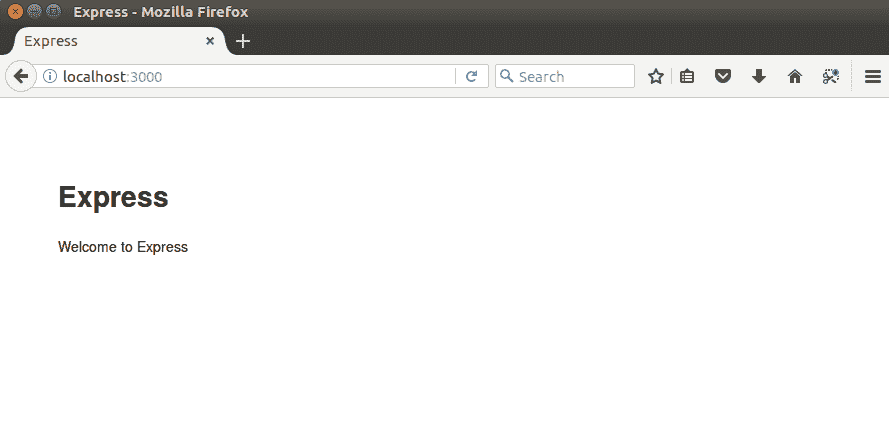
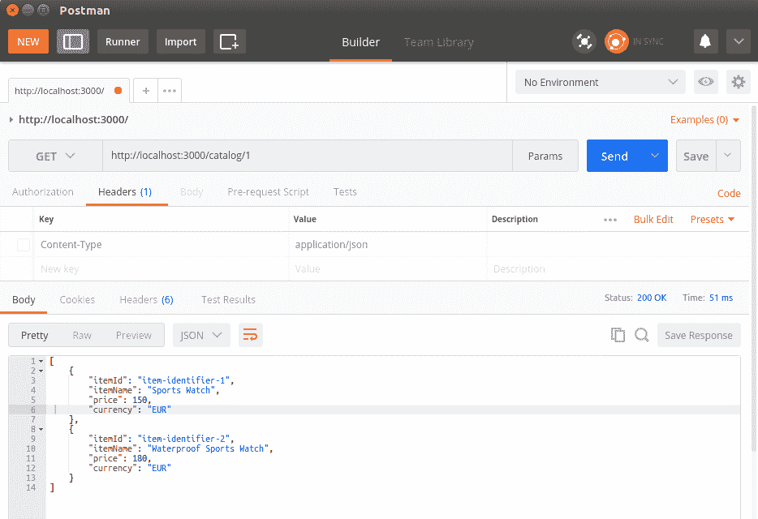
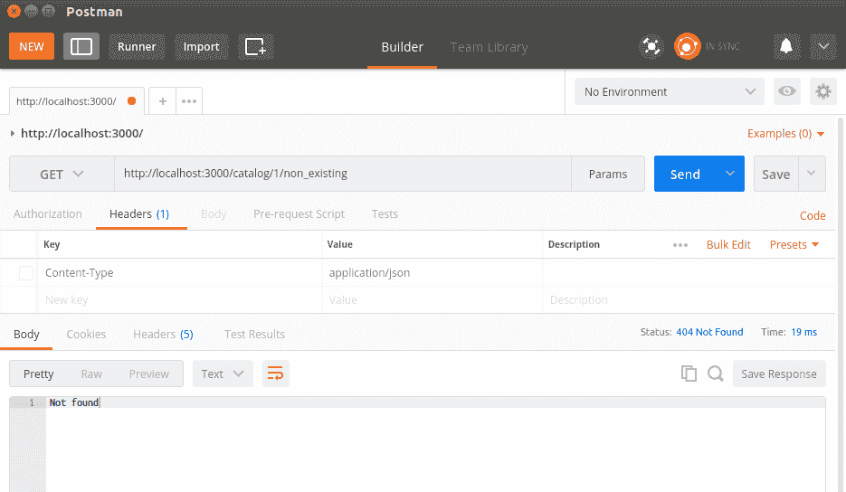

# 三、构建典型的 WebAPI

我们的 API 初稿将是只读版本，不支持像实际应用那样在目录中创建或更新项。相反，我们将集中讨论 API 定义本身，并在稍后讨论数据存储。当然，对暴露给数百万用户的数据使用文件存储绝不是一种选择，因此在我们研究了现代 NoSQL 数据库解决方案之后，本书将进一步为我们的应用提供数据库层。

我们还将讨论内容协商的主题，这是一种允许消费者指定所请求数据的预期格式的机制。最后，我们将研究几种公开服务不同版本的方法，以防它以向后不兼容的方式发展。

总之，在本章中，您将学习以下内容：

*   如何指定 web API
*   如何实施路线
*   如何查询您的 API
*   内容协商
*   API 版本控制

在本章之后，您应该能够完全指定 RESTful API，并且几乎可以开始实现现实生活中的 Node.js RESTful 服务了。

# 指定 API

项目通常首先要定义 API 将公开的操作。根据 REST 原则，操作通过 HTTP 方法和 URI 公开。每个操作执行的操作不应与其 HTTP 方法的自然含义相矛盾。下表详细说明了我们 API 的操作：

| **方法** | **URI** | **说明** |
| `GET` | `/category` | 检索目录中的所有可用类别。 |
| `GET` | `/category/{category-id}/` | 检索特定类别下的所有可用项。 |
| `GET` | `/category/{category-id}/{item-id}` | 根据特定类别下的项目 ID 检索项目。 |
| `POST` | `/category` | 创建一个新类别；如果它存在，它将更新它。 |
| `POST` | `/category/{category-id}/`
 | 在指定类别中创建新项目。如果该项存在，它将更新它。 |
| `PUT` | `/category/{category-id}` | 更新类别。 |
| `PUT` | `/category/{category-id}/{item-id}` | 更新指定类别中的项目。 |
| `DELETE` | `/category/{category-id}` | 删除现有类别。 |
| `DELETE` | `/category/{category-id}/{item-id}` | 删除指定类别中的项目。 |

第二步是为目录应用的数据选择适当的格式。JSON 对象本机由 JavaScript 支持。在应用的发展过程中，它们很容易扩展，几乎任何可用的平台都可以使用它们。因此，JSON 格式似乎是我们的逻辑选择。以下是本书中将使用的项目和类别对象的 JSON 表示：

```js
{ 
    "itemId": "item-identifier-1", 
    "itemName": "Sports Watch", 
    "category": "Watches", 
    "categoryId": 1,
    "price": 150, 
    "currency": "EUR"
} 

{
    "categoryName" : "Watches",
    "categoryId" : "1",
    "itemsCount" : 100,
    "items" : [{
            "itemId" : "item-identifier-1",
            "itemName":"Sports Watch",
            "price": 150,
            "currency" : "EUR"    
     }]
}
```

到目前为止，我们的 API 已经定义了一组操作和要使用的数据格式。下一步是实现一个模块，该模块将导出为路由中的每个操作服务的函数。

首先，让我们创建一个新的 Node.js Express 项目。选择存储项目的目录，并从 shell 终端执行`express chapter3`。如果您使用的是 Windows，则需要在生成项目之前安装`express-generator`模块。`express-generator`将在所选目录中创建您的初始 express 项目布局。此布局为您提供默认项目结构，确保 Express 项目遵循标准项目结构。它使您的项目更容易导航。

下一步是将项目导入 Atom IDE。右键单击“项目”选项卡中的任意位置，选择“添加项目文件夹”，然后选择为您生成的目录 Express。

如您所见，Express 为我们做了一些背景工作，并为我们的应用创建了一个起点：`app.js`。它还为我们创建了`package.json`文件。让我们看看每一个文件，从 Po.T2A:

```js
{
  "name": "chapter3",
  "version": "1.0.0",
  "description": "",
  "main": "app.js",
  "scripts": {
    "test": "test"
  },
  "author": "",
  "license": "ISC",
  "dependencies": {
 "dependencies": {
    "body-parser": "~1.13.2",
    "cookie-parser": "~1.3.5",
    "debug": "~2.2.0",
    "express": "~4.16.1",
    "jade": "~1.11.0",
    "morgan": "~1.6.1",
    "serve-favicon": "~2.3.0"

  }
}
```

由于我们创建了一个 blank Node.js Express 项目，我们最初只依赖于 Express 框架、一些中间件模块，如`morgan`、`body-parser`、`cookie-parser`以及 Jade 模板语言。Jade 是一种简单的模板语言，用于在模板中生成 HTML 代码。如果您对它感兴趣，您可以在[找到更多关于它的信息 http://www.jade-lang.com](http://www.jade-lang.com/) 。

撰写本文时，Express framework 的当前版本为 4.16.1；要更新它，请从`chapter3`目录执行`npm install express@4.16.1 --save`。此命令将应用的依赖项更新为所需版本。`--save`选项将更新并保存项目`package.json`文件中依赖项的新版本。

When you introduce new module dependencies, it is up to you to keep the `package.json` file up to date in order to maintain an accurate state of the modules your application depends on. 

我们将在本章稍后讨论什么是中间件模块。

现在，我们将忽略`public`和`view`目录的内容，因为它与我们的 RESTful 服务无关。它们包含自动生成的样式表和模板文件，如果我们决定在以后的阶段开发基于 web 的服务使用者，它们可能会有所帮助。

我们已经提到，Express 项目在`app.js`中为我们的 web 应用创建了一个起点。让我们深入研究一下：

```js
var express = require('express');
var path = require('path');
var favicon = require('serve-favicon');
var logger = require('morgan');
var cookieParser = require('cookie-parser');
var bodyParser = require('body-parser');

var routes = require('./routes/index');
var users = require('./routes/users');

var app = express();

// view engine setup
app.set('views', path.join(__dirname, 'views'));
app.set('view engine', 'jade');

// uncomment after placing your favicon in /public
//app.use(favicon(path.join(__dirname, 'public', 'favicon.ico')));
app.use(logger('dev'));
app.use(bodyParser.json());
app.use(bodyParser.urlencoded({ extended: false }));
app.use(cookieParser());
app.use(express.static(path.join(__dirname, 'public')));

app.use('/', routes);
app.use('/users', users);

// catch 404 and forward to error handler
app.use(function(req, res, next) {
  var err = new Error('Not Found');
  err.status = 404;
  next(err);
});

// error handlers

// development error handler
// will print stacktrace
if (app.get('env') === 'development') {
  app.use(function(err, req, res, next) {
    res.status(err.status || 500);
    res.render('error', {
      message: err.message,
      error: err
    });
  });
}

// production error handler
// no stacktraces leaked to user
app.use(function(err, req, res, next) {
  res.status(err.status || 500);
  res.render('error', {
    message: err.message,
    error: {}
  });
});

module.exports = app;
```

显然，Express generator 为我们做了很多工作，因为它实例化了 Express 框架，并为其分配了一个完整的开发环境。它做了以下工作：

*   配置了要在我们的应用中使用的中间件，`body-parser`，默认路由，以及我们开发环境的错误处理中间件
*   注入了 morgan 中间件模块的记录器实例
*   已配置 Jade 模板，因为它已被选为应用的默认模板
*   配置了 Express 应用将侦听的默认 URI、`/`和`/users`，并为它们创建了虚拟句柄函数

您必须安装`app.js`中使用的所有模块，才能成功启动生成的应用。此外，请确保在安装`package.json`文件后使用`--save`选项更新它们的依赖项。

Express 生成器还为应用创建了一个启动脚本。它位于您项目的`bin/www`**目录下，看起来像下面的片段：**

```js
#!/usr/bin/env node

/**
 * Module dependencies.
 */

var app = require('../app');
var debug = require('debug')('chapter3:server');
var http = require('http');

/**
 * Get port from environment and store in Express.
 */

var port = normalizePort(process.env.PORT || '3000');
app.set('port', port);

/**
 * Create HTTP server.
 */

var server = http.createServer(app);

/**
 * Listen on provided port, on all network interfaces.
 */

server.listen(port);
server.on('error', onError);
server.on('listening', onListening);

/**
 * Normalize a port into a number, string, or false.
 */

function normalizePort(val) {
  var port = parseInt(val, 10);

  if (isNaN(port)) {
    // named pipe
    return val;
  }

  if (port >= 0) {
    // port number
    return port;
  }

  return false;
}

/**
 * Event listener for HTTP server "error" event.
 */

function onError(error) {
  if (error.syscall !== 'listen') {
    throw error;
  }

  var bind = typeof port === 'string'
    ? 'Pipe ' + port
    : 'Port ' + port;

  // handle specific listen errors with friendly messages
  switch (error.code) {
    case 'EACCES':
      console.error(bind + ' requires elevated privileges');
      process.exit(1);
      break;
    case 'EADDRINUSE':
      console.error(bind + ' is already in use');
      process.exit(1);
      break;
    default:
      throw error;
  }
}

/**
 * Event listener for HTTP server "listening" event.
 */

function onListening() {
  var addr = server.address();
  var bind = typeof addr === 'string'
    ? 'pipe ' + addr
    : 'port ' + addr.port;
  debug('Listening on ' + bind);
}
```

要启动应用，请执行`node bin/www`；这将执行上面的脚本并启动 Node.js 应用。因此，在浏览器中请求`http://localhost:3000`将导致调用默认的`GET`处理程序，这会给出热烈欢迎的响应：



Default welcome message from an Express application

生成器创建了一个虚拟的`routes/users.js`；它公开了一条链接到`/users`位置可用的虚拟模块的路由。请求它将导致调用用户路由的`list`功能，该功能输出静态响应：`respond with a resource`。

我们的应用将不使用模板语言和样式表，所以让我们去掉在应用配置中设置视图和视图引擎属性的行。此外，我们将实施我们自己的路线。因此，我们的应用不需要`/`和`/users`URI 的绑定，也不需要`user`模块；相反，我们将使用一个`catalog`模块，并从一条路线：

```js
var express = require('express');
var path = require('path');
var favicon = require('serve-favicon');
var logger = require('morgan');
var cookieParser = require('cookie-parser');
var bodyParser = require('body-parser');

var routes = require('./routes/index');
var catalog = require('./routes/catalog')
var app = express();

//uncomment after placing your favicon in /public
//app.use(favicon(path.join(__dirname, 'public', 'favicon.ico')));
app.use(logger('dev'));
app.use(bodyParser.json());
app.use(bodyParser.urlencoded({ extended: false }));
app.use(cookieParser());
app.use(express.static(path.join(__dirname, 'public')));

app.use('/', routes);
app.use('/catalog', catalog);

// catch 404 and forward to error handler
app.use(function(req, res, next) {
  var err = new Error('Not Found');
  err.status = 404;
  next(err);
});

//development error handler will print stacktrace
if (app.get('env') === 'development') {
  app.use(function(err, req, res, next) {
    res.status(err.status || 500);
    res.render('error', {
      message: err.message,
      error: err
    });
  });
}

// production error handler no stacktraces leaked to user
app.use(function(err, req, res, next) {
  res.status(err.status || 500);
  res.render('error', {
    message: err.message,
    error: {}
  });
});

module.exports = app;

```

因此，在这次清理之后，我们的应用看起来更干净了，我们准备继续前进。

Before doing that, though, there is one term that needs further explanation: middleware. It is a subset of chained functions called by the `Еxpress.js` routing layer before а user-defined handler is invoked. Middleware functions have full access to the `request` and `response` objects and can modify either of them. The middleware chain is always called in the exact order in which it has been defined, so it is vital for you to know exactly what a specific piece of middleware is doing. Once a middleware function finishes, it calls the next function in the chain by invoking its next argument as a function. After the complete chain gets executed, the user-defined request handler is called.

以下是适用于中间件链的基本规则：

*   中间件函数具有以下签名：`function (request, response, next)`。
*   中间件功能按照它们添加到应用链中的确切顺序执行。这意味着，如果希望在特定路由之前调用中间件函数，则需要在声明路由之前添加它。
*   中间件函数使用它们的第三个参数`next`作为一个函数，表示它们已完成工作并退出。调用链中最后一个函数的`next()`参数后，链执行完成，`request`和`response`对象到达定义的处理程序，处于中间件设置的状态。

现在我们知道了什么是中间件功能，让我们澄清一下当前使用的中间件功能为我们的应用提供了什么。`body-parser`中间件是构建在解析器中的 Express 框架。中间件执行完成后，解析`request`主体并填充`request`对象，即提供 JSON 负载处理。

现在是时候继续并实现将映射到 URI 的用户模块了。该模块将命名为`modules/catalog.js`：

```js
var fs = require('fs');

function readCatalogSync() {
   var file = './data/catalog.json';
   if (fs.existsSync(file)) {
     var content = fs.readFileSync(file);
     var catalog = JSON.parse(content);
     return catalog;
   }
   return undefined;
 }

exports.findItems = function(categoryId) {
  console.log('Returning all items for categoryId: ' + categoryId);
  var catalog = readCatalogSync();
  if (catalog) {
    var items = [];
    for (var index in catalog.catalog) {
        if (catalog.catalog[index].categoryId === categoryId) {
          var category = catalog.catalog[index];
          for (var itemIndex in category.items) {
            items.push(category.items[itemIndex]);
          }
        }
    }
    return items;
  }
  return undefined;
}

exports.findItem = function(categoryId, itemId) {
  console.log('Looking for item with id' + itemId);
  var catalog = readCatalogSync();
  if (catalog) {
    for (var index in catalog.catalog) {
        if (catalog.catalog[index].categoryId === categoryId) {
          var category = catalog.catalog[index];
          for (var itemIndex in category.items) {
            if (category.items[itemIndex].itemId === itemId) {
              return category.items[itemIndex];
            }
          }
        }
    }
  }
  return undefined;
}

exports.findCategoryies = function() {
  console.log('Returning all categories');
  var catalog = readCatalogSync();
  if (catalog) {
    var categories = [];
    for (var index in catalog.catalog) {
        var category = {};
        category["categoryId"] = catalog.catalog[index].categoryId;
        category["categoryName"] = catalog.catalog[index].categoryName;

        categories.push(category);
    }
    return categories;
  }
  return [];
}
```

目录模块围绕`catalog.json`文件构建，存储在`data`目录中。在`readCatalogSync`功能中，使用文件系统模块`fs`同步读取源文件的内容。文件系统模块提供多种有用的文件系统操作，如创建、重命名或删除文件或目录的功能；截断；连接；`chmod`功能；以及用于读写数据的同步和异步文件访问。在我们的示例应用中，我们的目标是使用最简单的方法，因此我们通过使用文件系统模块的`readFileSync`功能来实现读取`catalog.json`文件的功能。它在同步调用中以字符串形式返回文件内容。导出模块的所有其他功能，并可用于根据不同条件查询源文件的内容。

目录模块导出以下功能：

*   `findCategories`：返回包含`catalog.json`文件中所有类别的 JSON 对象数组
*   `findItems (categoryId)`：返回一个数组 JSON 对象，表示给定类别中的所有项

*   `findItem(categoryId, itemId)`：返回一个 JSON 对象，表示给定类别中的单个项

现在我们有了三个完整的函数，让我们看看如何将它们绑定到 Express 应用。

# 实施路线

在 Node.js 术语中，路由是 URI 和函数之间的绑定。Express 框架提供了对路由的内置支持。`express`对象实例包含以每个 HTTP 谓词命名的函数：`get`、`post`、`put`和`delete`。它们具有以下语法：`function(uri, handler);`。它们用于将处理程序函数绑定到通过 URI 执行的特定 HTTP 操作。处理函数通常有两个参数：`request`和`response`。让我们通过一个简单的`Hello route`应用来了解它：

```js
var express = require('express'); 
var app = express(); 

app.get('/hello', function(request, response){ 
  response.send('Hello route'); 
}); 

app.listen(3000); 
```

在本地主机上运行此示例并访问`http://localhost:3000/hello`将导致调用您的处理程序函数，它将响应为`Hello route`，但路由可以为您提供更多。它允许您使用参数定义 URI；例如，让我们使用`/hello/:name`作为路由字符串。它告诉框架所使用的 URI 由两部分组成：静态部分（`hello`和可变部分（`name`参数）。

此外，当路由字符串和 handler 函数根据 Express 实例的`get`函数定义时，handler 函数的`request`参数中会直接提供一个参数集合。为了演示这一点，让我们稍微修改一下前面的示例：

```js
var express = require('express'); 
var app = express(); 

app.get('/hello:name', function(request, response){ 
  response.send('Hello ' + request.params.name); 
}); 

app.listen(3000); 
```

正如您在前面的代码片段中所看到的，我们使用冒号（`:`）将 URI 的参数部分与静态部分分开。一条快速路线中可以有多个参数；例如，`/category/:category-id/items/:item-id`**定义了用于显示属于某一类别的项目的路由，`category-id`和`item-id`是参数。**

 **现在让我们试试看。请求`http://localhost:3000/hello/friend`将导致以下输出：

```js
hello friend
```

这就是我们如何使用 Express 提供参数化 URI 的方法。这是一个很好的特性，但通常还不够。在 web 应用中，我们习惯于使用`GET`参数提供附加参数。

不幸的是，Express 框架对于`GET`参数不是很好。因此，我们必须利用`url`模块。它内置于 Node.js 中，提供了一种使用 URL 解析的简单方法。让我们再次将我们的`hello`结果与应用中的其他参数一起使用，但扩展的方式是，当请求`/hello`时，它输出`hello all`，当请求的 URI 为`/hello?name=friend`时，它输出`hello friend`：

```js
var express = require('express'); 
var url = require('url'); 
var app = express(); 

app.get('/hello', function(request, response){ 
   var getParams = url.parse(request.url, true).query; 

   if (Object.keys(getParams).length == 0) {       
      response.end('Hello all');    
   } else {
      response.end('Hello ' + getParams.name); 
   }    
}); 

app.listen(3000); 
```

这里有几件事值得一提。我们使用了`url`模块的函数`parse`。它将 URL 作为第一个参数，布尔值作为可选的第二个参数，用于指定是否应解析查询字符串。`url.parse`函数返回一个关联对象。我们使用`Object.keys`将这些关联对象中的键转换为数组，以便检查其长度。这将帮助我们检查是否使用`GET`参数调用了 URI。除了以每个 HTTP 谓词命名的路由函数外，还有一个名为`all`的函数。使用时，它将所有 HTTP 操作路由到指定的 URI。

现在我们已经了解了 Node.js 和 Express 环境中的路由和`GET`参数是如何工作的，我们准备为`catalog`模块定义一条路由，并将其绑定到我们的应用中。以下是`routes/catalog.js`中定义的路线

```js
var express = require('express');
var catalog = require('../modules/catalog.js')

var router = express.Router();

router.get('/', function(request, response, next) {
  var categories = catalog.findCategoryies();
  response.json(categories);
});

router.get('/:categoryId', function(request, response, next) {
  var categories = catalog.findItems(request.params.categoryId);
  if (categories === undefined) {
    response.writeHead(404, {'Content-Type' : 'text/plain'});
    response.end('Not found');
  } else {
    response.json(categories);
  }
});

router.get('/:categoryId/:itemId', function(request, response, next) {
  var item = catalog.findItem(request.params.categoryId, request.params.itemId);
  if (item === undefined) {
    response.writeHead(404, {'Content-Type' : 'text/plain'});
    response.end('Not found');
  } else {
  response.json(item);
  }
});
module.exports = router;

```

首先，从 Express 模块创建一个`Router`实例。下面的表格很好地描述了我们刚刚实现的路由。这将有助于我们以后测试 API：

| **HTTP 方式** | **路线** | **目录模块功能** |
| `GET` | `/catalog` | `findCategories()` |
| `GET` | `/catalog/:categoryId` | `findItems(categoryId)`  |
| `GET` | `/catalog/:categoryId/:itemId` | `findItem(categoryId, itemId)`  |

# 使用测试数据查询 API

我们需要一些测试数据来测试我们的服务，所以让我们使用我们项目的`data`目录中的`catalog.json`文件。这些数据将允许我们测试所有三个函数，但要做到这一点，我们需要一个可以针对端点发送 REST 请求的客户端。如果您还没有创建用于测试应用的 Postman 项目，那么现在是创建它的适当时机。

请求`/catalog`应返回`test`文件中的所有类别：


因此，请求`/catalog/1`应导致返回一个包含`Watches`类别下所有项目的列表：



最后，请求`http://localhost:3000/catalog/1/item-identifier-1`将仅显示由`item-identifier-1`标识的项目，请求不存在的项目将导致状态代码为`404`的响应：



# 内容协商

到目前为止，catalog 服务仅支持 JSON 格式，因此仅适用于媒体类型`application/json`。假设我们的服务必须提供不同格式的数据，例如 JSON 和 XML。然后，消费者需要明确定义他们需要的数据格式。长期以来，在 REST 中进行内容协商的最佳方式一直是一个非常有争议的话题。

在关于正确实施内容协商的著名讨论中，Roy Fielding 陈述了以下内容：

All important resources must have URIs.

但是，这在如何以不同的数据格式公开相同的资源方面留下了差距，因此 Roy 继续进行以下工作：

Agent-driven negotiation is far more effective, but there was a huge disagreement between myself and the chair of the HTTP working group and my original agent-driven design for HTTP/1.1 was effectively buried in committee. To do negotiation right, the client needs to be aware of all the alternatives and what it should use as a bookmark.

尽管我们仍然可以通过提供定制的`GET`参数来选择坚持 URI 驱动的协商，但其他社区已经选择坚持 Roy 关于代理驱动协商的建议。自从这场争论开始至今已经将近十年了，事实证明他们做出了正确的决定。代理驱动的协商使用`Accept`HTTP 头。

`Accept`HTTP 头指定使用者愿意处理的资源的媒体类型。除了`Accept`标题外，消费者还可以使用`Accept-Language`和`Accept-Encoding`标题来指定应以何种语言和编码提供结果。如果服务器未能以预期格式提供结果，则可以返回默认值或使用`HTTP 406 Not acceptable`，以免在客户端造成数据混淆错误。

Node.js HTTP`response`对象包含一个方法`format`，如果在`request`对象中设置了`Accept`HTTP 头，则该方法将基于`Accept`HTTP 头执行内容协商。它使用内置的`request.accepts()`为请求选择合适的处理程序。如果找不到，服务器将调用默认处理程序，该处理程序以`HTTP 406 Not acceptable`响应。让我们创建一个演示如何在我们的一条路线中使用`format`方法。为此，假设我们在`catalog`模块中实现了一个名为`list_groups_in_xml`的函数，该函数以 XML 格式提供组数据：

```js
app.get('/catalog', function(request, response) { 
    response.format( { 
      'text/xml' : function() { 
         response.send(catalog.findCategoiesXml()); 
      }, 
      'application/json' : function() { 
         response.json(catalog.findCategoriesJson()); 
      }, 
      'default' : function() {. 
         response.status(406).send('Not Acceptable'); 
      }    
    }); 
}); 
```

这就是如何以清晰、直接的方式实现内容协商。

# API 版本控制

所有应用 API 的发展都是一个不可避免的事实。然而，消费者数量未知的公共 API（如 RESTful 服务）的发展是一个敏感的话题。由于消费者可能无法正确处理修改后的数据，并且无法通知所有用户，因此我们需要尽可能保持 API 向后兼容。一种方法是对应用的不同版本使用不同的 URI。目前，我们的目录 API 可在`/catalog`上获得。

当一个新版本（例如，版本 2）的时机成熟时，我们可能需要在另一个 URI 中保持以前的版本可用，以实现向后兼容性。最佳做法是在 URI 中编码版本号，如`/v1/catalog`，并将`/catalog`映射到最新版本。因此，请求`/catalog`将导致重定向到`/v2/catalog`，并将利用 HTTP`3xx`状态代码指示重定向到最新版本。

版本控制的另一个选项是保持 API 的 URI 稳定，并依赖将指定版本的自定义 HTTP 头。但这不是一种非常稳定的向后兼容性方法，因为在应用中修改请求的 URL 比修改请求中发送的头要自然得多。

# 自测题

要获得额外的信心，请检查这组陈述，并说明它们是否正确：

1.  启用 REST 的端点必须支持与 REST 原则相关的所有 HTTP 方法
2.  当内容协商失败时，由于不支持的媒体类型作为 accepts 标头的值传递，301 是适当的状态代码。
3.  使用参数化路由时，开发人员可以指定参数的类型，例如，它是数值类型还是文字类型。

# 总结

在这一章中，我们深入讨论了一些更复杂的话题。让我们总结一下我们所涵盖的内容。我们从指定 web API 的操作开始，并定义操作是 URI 和 HTTP 操作的组合。接下来，我们实现了路由并将它们绑定到一个操作。然后，我们使用 Postman REST 客户端请求每个操作，以请求我们路由的 URI。在内容协商部分，我们处理了`Accept`HTTP 头，以消费者要求的格式提供结果。最后，我们讨论了 API 版本的主题，它允许我们开发向后兼容的 API。

在本章中，我们使用老式的文件系统存储数据。这不适用于 web 应用。因此，我们将在下一章研究现代、可扩展和可靠的 NoSQL 存储。****