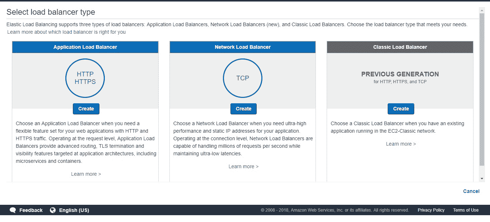
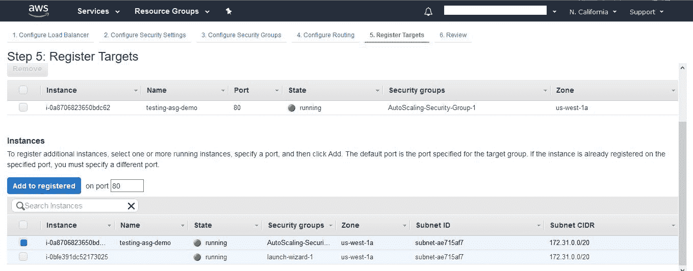

# 十、加固您的应用

要获得正确的安全性是非常困难的。 似乎总有一些敞开的门，让入侵者偷偷溜进来。 安全错误一直都在发生，比如著名的**WannaCry 勒索软件攻击**(造成 50 亿美元的损失)，**以太坊盗窃**(3200 万美元的抢劫)，等等。 这样的攻击总是让我们采取额外的安全措施来避免这样的灾难。 由于微服务是动态的，任何实例都可能导致业务损失。

本章的重点是处理安全性和自动伸缩，探讨了一些安全基础和微服务的最佳实践，以使系统更安全、更健壮，并使它更容易处理任何数量的流量。 随着容器的出现，我们也将在容器级别和应用级别上研究安全性。 本章还关注于自动伸缩，目的是让应用在任何时候都可以处理任何负载，在新部署期间零停机。 本章涵盖以下内容:

*   应用安全机制时应该问的问题
*   个别服务/应用的安全最佳实践
*   容器的安全最佳实践
*   扩展您的应用

# 应用安全性时应该问的问题

在一个不断发展的世界里，我们不可能有一套预定义的规则来应用于微服务设计。 相反，我们可以有一些预定义的问题，我们可以问自己来评估整个系统和过程。 以下部分列出了不同级别的所有标准问题，我们可以将其用作评估清单。 稍后，我们将升级我们的安全作为解决这些问题的办法。

# 核心应用/核心 microservice

我们将从核心开始——我们的微服务。 每当我们编写满足任何业务功能的微服务时，一旦设计完成，我们就需要注意服务是否暴露于任何漏洞。 可以问以下问题来了解应用级别的安全性:

*   系统是否在所有地方都有适当的安全保护，还是仅仅在边界处?
*   如果入侵者偷偷潜入，系统是否足够强大，能够探测到入侵者并将其赶出去?
*   入侵者通过模仿通常的行为、访问流量或过载流量进入网络有多容易?
*   是否每个微服务都信任其他微服务，即使它们调用它们太多?
*   您的服务契约有身份验证吗?还是由网络处理身份验证?
*   呼叫者的身份是传递给每个微服务，还是只是在网关丢失了?
*   有哪些措施可以确保 SQL 注入不会发生?
*   系统是否更新足够以加密形式存储密码?
*   如果我们需要升级任何密码存储算法，能否在不对用户造成大规模干扰的情况下完成?
*   系统如何处理私人及敏感数据?
*   您的日志记录解决方案能够检测和分析安全漏洞吗?

# 中间件

下一个级别是我们的**中间件**。 它是中心或起点，所有服务都要经过这里。 我们需要确保中间件是安全的，不会暴露于任何风险中，因为它有各种参数，比如消息传递中间件、配置的数据库访问，等等:

*   我们是否拥有最小特权原则(即，跨所有服务使用单一数据库登录)?
*   每个服务是否只能访问它需要的数据?
*   如果入侵者能够访问服务数据库凭证，那么他们能够访问多少数据?
*   我们是否有跨所有服务的单一消息传递中间件?
*   消息传递中间件或服务总线是否具有登录凭据?
*   遗留系统是否将微服务系统置于危险之中?

# API Gateway

下一层是我们的 API 网关。 网关在微服务中扮演着重要的角色，因为它是任何请求的起点，并被所有微服务用作它们之间的通信手段。 因此，它不应暴露于任何其他安全漏洞:

*   是否有 TLS 实现?
*   TLS 实现是否删除降级攻击或弱密码攻击?
*   如何确保内部网站和管理 url 被抽象到互联网上?
*   哪些信息通过网关服务的身份验证 api 传播?
*   其余的服务是否过于信任网关，或者它们是否能够发现网关何时被破坏?

# 团队和业务活动

最后一个阶段是团队和操作活动。 在自然界中，每个团队都是独立工作的。 在这种情况下，每个团队都有足够的安全培训成为一个必要的先决条件。 以下问题可帮助我们评估运作层面的安全:

*   安全活动是如何融入到每个开发团队中的?
*   如何确保每个人都了解通用的安全原则?
*   你给团队提供了什么安全培训，你是否更新他们的任何漏洞?
*   您使用何种自动化级别来确保安全控制始终到位?

在下一节中，我们将研究如何加强应用和容器，并讨论各种安全最佳实践。

# 个别服务/应用的安全最佳实践

微服务体系结构围绕复杂性进行转变。 这里没有一个非常复杂的系统，而是有一堆具有复杂交互的简单服务。 我们的目标是确保复杂性得到控制并在界限之内。 安全真的很难做到。 有无数的方法可以进入应用。 Node.js 也不例外。 在本节中，我们将研究防止安全漏洞的技术。 本节的目的是作为一个基本检查清单，以确保我们的微服务解决一些最大的安全威胁。 让我们开始吧。

# 检查已知的安全漏洞

由于`npm`中有大量可用的模块，我们可以直接在应用上工作，并依靠生态系统提供现成的解决方案。 然而，由于巨大的模块，即使对于成熟的流行框架，更大的安全漏洞也可能随时发生。 在这一节中，我们将看看一些有价值的工具，这些工具可以确保应用所依赖的包中没有漏洞，甚至在更新时也没有:

# Auditjs

一个简单的实用程序，使用 OSS 索引 v2 REST API 审计一个`npm`项目，以识别已知的漏洞和过时的包版本。

使用这个非常简单:

1.  将其安装为`dev`依赖项`npm install auditjs --save-dev`。
2.  在`npm`脚本中添加审计脚本:

```js
scripts:{ … "audit":"auditjs" ...}
```

3.  执行`npm run audit`命令。 完整的示例可以在`chapter 10/auditjs`文件夹下的解压文件夹中看到。

For more information you can visit the link [https://www.npmjs.com/package/auditjs](https://www.npmjs.com/package/auditjs) .

# Snyk.io

这是另一个模块，我们可以使用它来针对`synk.io`维护的漏洞数据库审查任何模块。 这个模块的主要优点是，我们不需要安装它进行审核。 该模块可以作为使用任何第三方模块前的预检查:

1.  全球安装-`npm install snyk -g`
2.  安装后，您需要通过点击`snyk auth`对其进行认证。
3.  一旦设置了`snyk`，您现在可以使用`synk test <module_name>`检查任何模块

For more information you can visit the link [https://www.npmjs.com/package/snyk](https://www.npmjs.com/package/snyk).

下面是一些有用的命令:

| `snyk wizard` | 查找并修复项目中已知的漏洞 |
| `snyk protect` | 应用补丁并抑制漏洞 |
| `snyk monitor` | 记录依赖关系的状态，以便每当新的漏洞或补丁被启动时，我们都能收到警报 |

以下是一些进一步的阅读:

*   还有很多其他可用的模块(我们在前面看到了节点安全性)
*   `retire.js`([https://retirejs.github.io/retire.js/)是另一个模块,类似的漏洞检查,它甚至可以作为一个命令行扫描仪,`grunt`/`gulp`插件,Chrome 和 Firefox 扩展,等等](https://retirejs.github.io/retire.js/)

# 通过添加速率限制器防止暴力攻击或泛洪攻击

蛮力攻击是常见的，经常作为黑客的最后手段。 他们系统地列举出解决方案的所有可能的候选人，并检查每个候选人是否满足问题陈述。 为了防止这种攻击，我们必须实现某种速率限制算法，它将有效地阻止一个 IP 地址发出大量请求，从而阻止意外崩溃应用的可能性。

你可以在`Chapter 10/rate-limiter`文件夹下找到速率限制实现，我们在 Redis 数据库中使用了速率限制算法。

现在，让我们遵循以下步骤:

1.  安装`express-limiter`和`redis`:

```js
npm install express-limiter redis --save
```

2.  创建 redis 客户端并设置 express-limit:

```js
let client = require('redis').createClient()
..
let limiter = require('express-limiter')(this.app, client)
..
//limits requests to 100 per hour ip ip address
    limiter({
        lookup:['connection.remoteAddress'],
        total:100,
        expire:1000*60*60
    });
```

3.  现在，运行程序。 它将每小时的请求限制为`100`请求，之后将开始抛出`429: Too Many Requests`。

# 防止邪恶的正则表达式

最常见的漏洞之一是格式不佳的正则表达式。 如果将正则表达式应用于不匹配的输入需要指数级的时间，那么它就被称为邪恶的正则表达式，应该加以阻止。 一个邪恶的正则表达式包含重复的分组、重叠的更改和重复组中的单词。 让我们看一个例子`Regex : (b+)+, ([a-zA-Z]+)*,(a|aa)+`，等等。

所有这些正则表达式都暴露在输入`bbbbbbbbbbbbbbbbbbbbbbbbbbbbbbbbbbbb!`中。 这些重复可能是一个障碍，因为它可能需要几秒钟甚至几分钟才能完成。 由于 Node.js 的事件循环，执行不会继续，这将有效地导致服务器冻结，因为应用完全停止运行。 为了防止这样的灾难，我们应该使用 safe-regex 工具([https://www.npmjs.com/package/safe-regex](https://www.npmjs.com/package/safe-regex))。 它检测潜在的灾难性指数时间正则表达式。

您可以在`safe-regex`文件夹中查看源代码。 您可以通过键入`node safe.js '<whatever-my-regex>'`来检查正则表达式。

# 阻止跨站请求伪造

入侵应用的一种常见方法是通过不安全的站点，通过一种常见的称为跨站点请求伪造的钓鱼技术，将数据放入应用。 进行钓鱼尝试的入侵者可以通过表单或其他输入发起请求，这些表单或输入通过应用公开的输入为应用创建请求。

为了增强应用，防止这种攻击，我们可以使用 CSRF 令牌实现。 每次用户发出请求时，都会生成一个新的 CSRF 令牌，并将其添加到用户的 cookie 中。 这个令牌应该作为一个值添加到应用模板的输入中，它将根据 CSRF 库在用户发送信息时生成的令牌进行验证。 NPM 提供了`csurf`模块([https://www.npmjs.com/package/csurf](https://www.npmjs.com/package/csurf))，可以直接在 express 中间件中使用，我们可以使用`csurf`令牌进行相应的游戏。

# 加强会话 cookie 和有效的会话管理

在应用中，不能低估安全使用 cookie 的重点。 这尤其适用于需要跨无状态协议(如 HTTP)维护状态的有状态服务。 Express 有一个默认的 cookie 设置，可以通过配置或手动收紧来增强安全性。 有多种选择:

*   `secret`:用来腌制饼干的秘密字符串。
*   `name`:cookie 的名称。
*   `httpOnly`:这基本上是标志 cookie，这样它们就可以通过发布一个 web 服务器来访问，以防止会话劫持。
*   `secure`:这要求 TLS/SSL 允许 cookie 只在 HTTPS 请求中使用。
*   `domain`:只指定可以访问 cookie 的特定域。
*   `path`:接受来自应用域的路径 cookie。
*   `expires`:正在设置的 cookie 的截止日期。 如果没有及时过期，资源消耗将非常高，资源将永远不会被释放。

在下面的示例中，我们将使用 express-session 安全地设置 cookie，从而实现有效的会话管理。 您可以遵循下面的示例`typescript-express-session`:

1.  从[Chapter 2](02.html)，*gearup for the Journey*中克隆`first-microservice`，安装`express-session`，`@types/express-session`。
2.  在`express.ts`中，添加以下代码，这将使我们的应用使用具有以下安全参数的 cookie:

```js
this.app.use(
  session({
    secret: 'mySecretCookieSalt',
    name: 'mycookieSessionid',
    saveUninitialized: true,
    resave: false,
    cookie: {
      httpOnly: true,
      secure: true,
      domain: 'typescript-microservices.com',
      path: '/hello-world',
      expires: new Date(Date.now() + 60 * 60 * 1000)
    }
  }))
```

该模块通过提供各种选项(如 cookie 标志、cookie 范围等)，有效地帮助我们处理有状态会话。

# 添加头盔以配置安全头

`helmet`模块([https://www.npmjs.com/package/helmet](https://www.npmjs.com/package/helmet))是 11 个安全模块的集合，用于防止针对快速微服务的不同数量的攻击。 它很容易使用，因为我们只需要添加两行代码。 添加一些基本配置可以帮助保护应用免受可能的安全问题。 你可以通过简单的添加来使用头盔:

```js
this.app.use(helmet())
```

The source code for this can be found in `chapter-10/typescript-express-session`.

`helmet`模块有多达 12 个包，它们充当一些中间件，阻止恶意方破坏或使用应用。 这些头文件包括头信息`helmet-csp`(标题内容安全政策 HTTP 头),`dns-prefetch`协议,`frameguards`,`hide-powered-by`,`hpkp`,`hsts`,`ienoopen`,【显示】,`dont-sniff-mimetype`,`referrer-policy`,`x-xss protections`,【病人】为了防止`clickjackings`,等等。

保护头信息的另一个选项是`lusca`([https://www.npmjs.com/package/lusca](https://www.npmjs.com/package/lusca))，它可以与 express-session 结合使用。 可以在`chapter-10 /express-lusca`目录中找到一个示例。

# 避免污染参数

在 Node.js 中，如果没有定义的标准来处理多个同名的参数，事实上的标准是将这些值视为一个数组。 这非常有用，因为对于单个名称，当预期结果是字符串时，如果传递了多个具有相同名称的参数，它的类型将更改为数组。 如果在查询处理中没有考虑到这一点，应用将崩溃，并导致整个系统崩溃，从而使它成为一个可能的 DoS 向量。 例如，检查这个链接:`http://whatever-url:8080/my-end-point?name=parth&name=ghiya`。 [](http://whatever-url:8080/my-end-point?name=parth&name=ghiya) 

在这里，当我们试图读取`req.query.name`时，我们希望它是一个字符串，但我们得到的是一个数组`['parth','ghiya']`，如果不小心处理，将导致应用崩溃。 为了确保应用不会失败，我们可以做以下事情:

*   不同的政策对污染机制的执行是不同的; 例如，有些人可能选择第一个出现，有些人可能选择最后一个出现
*   使用 TypeScript 类型来验证请求。 如果类型失败，通过给出参数错误来停止请求
*   确保对 HTTP GET、PUT 或 POST 中的参数进行编码。
*   在 URL 重写中必须遵循严格的 Regexp。

您可以在[https://www.owasp.org/index.php/Testing_for_HTTP_Parameter_pollution_(OTG-INPVAL-004)](https://www.owasp.org/index.php/Testing_for_HTTP_Parameter_pollution_(OTG-INPVAL-004))查看完整的列表以及如何处理它。

# 确保传输

如果应用有任何移动部分(如 POST、PUT 和 DELETE 等 HTTP 方法)，其中包括记录或发送改变客户端信息的 tweet，那么使用 HTTPs 是确保信息在传输过程中不被修改的重要实现。 成本是不投资 SSL 证书的一个简单的理由。 但现在出现了全新的、完全免费的 SSL 证书资源，如**Let’s Encrypt**([https://letsencrypt.org/](https://letsencrypt.org/))。 此外，Node.js 应用不应该直接暴露在互联网上，SSL 终止应该在请求到达 Node.js 之前处理。 使用 NGINX 来完成这一点是一个非常推荐的选项，因为它是专门设计来比 Node.js 更有效地终止 SSL 的。 要有效地在代理后面设置一个快速应用，请参考以下内容:[http://expressjs.com/en/4x/api.html#trust.proxy.options.table](http://expressjs.com/en/4x/api.html#trust.proxy.options.table)。 建立 HTTP 后，可以使用`nmap`、`sslyze`或`OpenSSL`测试 HTTP 证书传输。

# 防止命令注入/SQL 注入

当入侵者利用解释器的语法发送基于文本的攻击时，就可能发生注入攻击。 SQL 注入包括通过用户输入注入部分或完整的 SQL 查询，这可能暴露敏感信息，也可能具有破坏性。 类似地，命令注入是一种技术，攻击者可以使用它在远程 web 服务器上运行操作系统命令。 通过这种方法，甚至密码也可能被暴露。 为了过滤这些类型的攻击，我们应该总是过滤和净化用户的输入。 使用 eval 这样的 JavaScript 语句也是为注入攻击打开大门的另一种方式。 为了防止这些攻击，如果您正在使用`postgres`([https://www.npmjs.com/package/pg](https://www.npmjs.com/package/pg))，我们可以使用`node-postgres`，它提供位置查询参数。 预防注射的常用方法包括:

*   要转义 SQL 注入，可以使用的技术之一是转义用户输入。 许多库提供了开箱即用的功能。
*   将 SQL 查询参数化是避免 SQL 注入的另一种方法，在这种方法中，您使用位置查询参数创建一个查询，并用值填充位置查询参数。
*   与用户输入一起使用`eval()`是注入命令的一种方法，根本不应该使用(在下一节中，我们将编写`linter`，它将避免这种情况)。
*   类似地，express 应用也容易受到 MongoDB 攻击。 不显式设置查询选择器将导致我们的数据容易受到简单查询的攻击。

我们有`db.users.find({user: user, pass: pass})`，其中`user`和`pass`来自 POST 请求主体。 现在由于没有类型，我们可以简单地在这个查询中传递查询参数，例如`{"user": {"$gt": ""},"pass": {"$gt": ""}}`，它将返回所有用户及其密码。 为了解决这个问题，我们需要显式地传递查询选择器，这将使查询变为`db.users.find({user: { $in: [user] }, pass: { $in: [pass] }})`。

# TSLint /静态代码分析器

在本节中，我们将研究一种分析所有编写代码的方法，并根据安全漏洞列表对其进行检查。 我们将把这作为部署计划的一个阶段。 我们将编写一个`linter`，有一个`.tslint`文件，其中提到了所有要检查的规则，然后我们将运行 lint。 让我们开始吧。 TsLint 是一种检查和验证源代码的方法。 它是一个运行在 Node.js 上的静态分析代码工具，以保持你的源代码干净，发现可能的 bug，发现安全问题，并在所有团队中执行一致的风格:

1.  从[第 2 章](02.html)，*整装出发*中克隆出我们的`first-typescript-microservices`，并在其中添加以下命令:

```js
npm install tslint --save
npm install tslint-microsoft-contrib --save
```

2.  接下来，我们将编写`tslint.json`，其中包含我们想要评估它的基本规则。 复制[https://github.com/Microsoft/tslint-microsoft-contrib/blob/master/recommended_ruleset.js](https://github.com/Microsoft/tslint-microsoft-contrib/blob/master/recommended_ruleset.js)规则。
3.  接下来，我们将编写一个初始化脚本:

```js
 "analyze":"node ./node_modules/tslint/bin/tslint 
            -r node_modules/tslint-microsoft-contrib/
            -c tslint.json
            -s src/**/*.ts"
```

4.  现在，我们可以在任何地方利用这个脚本，因为当我们运行这个脚本时，它将抛出在对该规则集进行评估时发现的所有错误的输出。
5.  我们可以在前面的脚本中添加一个`--fix`标志，它会在大多数情况下自动采取必要的措施。

您可以在`chapter 10/tslinter`文件夹下找到源代码。 在本节中，我们讨论了在加强应用以抵御各种可能的攻击时需要做的一些事情。 在下一节中，我们将研究一些可以应用的容器级安全。

# 容器的安全最佳实践

随着容器的出现，云本地应用和基础设施需要一种完全不同的安全方法。 让我们来看看最佳实践。 现在是**云原生**方法的时代。 云原生方法指的是将软件打包在称为容器的标准单元中，并将这些单元安排在相互通信以形成应用的微服务中。 它确保运行的应用是完全自动化的，以获得更好的标准速度、敏捷性和可伸缩性。 让我们看一下需要解决的安全问题，以拥有一个全面的安全程序。

# 确保容器构建和标准化部署

此阶段的重点是将控制应用于开发人员工作流和持续集成和部署管道，以减轻容器启动后可能出现的安全问题。 下面是一套标准的实践:

*   甚至在容器级别应用单个责任规则。 容器映像应该只有必要的软件和应用代码，以最小化从映像启动的每个容器的攻击面。
*   图像应该扫描已知的漏洞和曝光。 有一个常见的漏洞和暴露数据库(就像应用级别一样)，我们可以在其上验证映像([https://github.com/arminc/clair-scanner](https://github.com/arminc/clair-scanner))。
*   图像一旦建立，就应该进行数字签名。 **签名图片**([https://docs.docker.com/datacenter/dtr/2.4/guides/user/manage-images/sign-images/ initialize-the-trust-metadata](https://docs.docker.com/datacenter/dtr/2.4/guides/user/manage-images/sign-images/#initialize-the-trust-metadata))与私有密钥提供保证每个图像用于启动一个容器是由一个可信的聚会。
*   由于运行在主机上的容器共享相同的操作系统，因此最重要的是它们从一组有限的功能开始。 使用 SELinux 之类的模块。
*   使用秘密管理技术(通过这种技术，机密(如敏感数据)只在需要时分发给使用它们的容器)。

# 在运行时保护容器

对于运行时阶段安全性，我们需要检查以下内容—可见性、检测、响应、预防、停止违反策略的容器，等等。 以下是一些需要注意的重要因素:

*   分析微服务和容器的行为
*   关联分布式威胁指标，并确定是否单个容器受到污染，或它扩散到多个容器
*   拦截以阻止未经授权的集装箱引擎命令
*   为响应自动化操作

这些是我们需要做的一些基本工作，以确保我们的容器免受任何漏洞的伤害。 在下一节中，我们将看到在整个微服务开发阶段可以使用的通用清单。

# 安全检查表

微服务开发是一个标准工具与许多支持工具相结合的平台，一切都在发展中。 在本节中，我们将查看一个总体检查表，我们可以使用它来验证我们的开发，或者它可以给我们一个关于微服务开发的总体概念。

# 服务生活必需品

发展的第一和首要层次是个体微服务的发展，满足一定的业务能力。 以下清单可用于开发微服务:

*   服务应该独立开发和部署
*   服务不应该共享数据; 他们应该有自己的私人数据
*   服务应该是足够小的，它们是有重点的，可以增加很大的价值
*   数据应该存储在数据库中，而不应该存储服务实例
*   只要可能，就应该将工作卸载给异步工作者
*   应该引入负载平衡器来分配工作
*   安全应该分层，我们不需要重新发明轮子; 例如，OAuth 可以用来维护用户身份和访问控制
*   安全更新应该是自动化的
*   应该使用具有集中控制的分布式防火墙(例如 Project Calico)
*   应该使用监控工具，比如 Prometheus
*   容器应该使用安全扫描仪

# 服务交互

下一个层次是微服务之间的通信。 当微服务之间进行通信时，应该遵循一个清单。 这个检查表有助于确保如果任何服务出现故障，那么故障将被包含在内，并且不会扩散到整个系统:

*   数据应该以序列化的格式传输，比如 JSON 或 protobuf
*   错误代码应谨慎使用，并应采取相应的行动。
*   api 应该简单、有效，合同也应该清晰
*   应该实现服务发现机制以方便地查找其他服务
*   应该优先考虑分散的交互而不是集中的编排器
*   api 应该进行版本控制
*   断路器有助于阻止错误在整个系统中传播
*   服务交互应该只通过公开的端点
*   对所有 api 进行身份验证并通过中间件传递它们，可以更清楚地了解使用模式
*   连接池可以减少下游的影响，而不是突然的请求峰值

# 开发阶段

下一个需要注意的阶段是在开发期间。 这个清单遵循 12 个因素标准。 以下是一些开发标准，有助于更顺畅的开发过程:

*   应该使用一个通用的源代码控制平台
*   应该有独立的 prod 环境
*   一个发布少，发布快的原则应该遵循
*   维护共享库很痛苦
*   简单的服务易于替换

# 部署

部署检查表主要关注部署时代。 它说明了容器和映像如何帮助更快地部署。 它对关键值和属性配置提出建议，以管理不同环境中的部署:

*   应该使用图像和容器
*   配置一种机制，在任何环境上部署任何服务的任何版本(CI/CD 加上适当的 Git 分支和标记)
*   配置应该在部署包之外进行管理，例如环境变量、键值存储、外部 URL 链接等等

# 操作

操作检查表包含操作级别的最佳实践列表，以简化系统发布后的生命周期。 它建议使用集中式日志、监控软件等等。 它展示了自动化如何让生活更轻松:

*   所有日志应放在一个地方(ELK 堆栈)
*   所有服务的通用监控平台
*   无状态服务可以很容易地进行自动伸缩，因为我们不需要到处复制会话
*   自动化是快速发展的关键

差不多就是这样了! 在下一节中，我们将讨论可伸缩性，并在结束本书之前查看一些可用的可伸缩性工具。

# 可伸缩性

今天，在竞争市场的世界里，一个组织的关键是建立和运行他们的系统。 任何故障或停机直接影响业务和收入; 因此，高可用性是一个不容忽视的因素。 由于技术的深入使用和我们使用它的多种方式，信息量与日俱增。 正因为如此，平均荷载超过了屋顶。 每天，数据都在呈指数增长。

在某些情况下，数据不能超过某个限制或各种用户不会越界是不可预测的。 可伸缩性是在任何时候处理和满足意外需求的最佳解决方案。 可伸缩性可以水平扩展(我们通过向资源池添加更多的机器来扩展)，也可以垂直扩展(我们通过向现有机器添加更多的 CPU/RAM 来扩展)。 在数据方面，跨越数据库和多个服务器上的应用查询负载。 我们可以添加实例来处理负载，在一段时间后缩放，等等。 增加集群能力来处理负载很容易。 集群服务器立即处理故障，并管理故障转移部分，以保持系统几乎所有时间都可用。 如果一个服务器宕机，它将把用户的请求重定向到另一个节点，并执行请求的操作。 在本节中，我们将研究两个最著名的工具—kubernetes 和 AWS 负载均衡器。

# AWS 负载均衡器

对于负载平衡，我们应该理解**Amazon Web Services Elastic load Balancer**(**ELB**)，它可以帮助我们利用负载平衡。 我们应该具体理解 AWS ELB; 但是，对于其他可用的负载平衡备选方案，大多数概念都是相同的。 有各种可用于实现负载平衡的替代方案。 其中有 HAProxy, Apache Web Server, NGINX Http Server, Pound，谷歌 Cloud Load balancing, F5 Load Balancer, Barracuda Load Balancer 等等。 一般来说，以下是描述负载均衡流程的架构:


Load balancer

ELB 是许多可用的 AWS 服务之一，它的工作是将传入的网络流量或应用流量自动分配到网络中可用的 EC2 实例。 ELB 还关注 EC2 实例的运行状况，通过自动添加或删除 EC2 实例为应用提供高可用性。 它只将通信发送到可用且处于正常状态的实例。 ELB 既可以用于内部负载分担，也可以用于面向公众的负载分担。 无论您的应用驻留在哪里，ELB 都成为 EC2 实例的表面。 根据实例的状态或可用性，运行状况检查将将其标记为`InService`(如果处于健康状态)，或`OutOfService`(如果处于不健康状态)。 负载平衡器将只将流量路由到健康的实例。 在这种健康检查的帮助下，负载平衡器为我们提供了容错证明应用，并根据我们配置的参数(高流量、高资源利用率等)确保应用 24/7 的高可用性。

# 使用负载均衡器的好处

负载平衡器帮助我们提供容错应用、更好的高可用性、应用的灵活性以及安全性，因为我们不会直接将后端系统暴露给用户。 让我们快速浏览一下使用负载均衡器的一些好处。

# 容错

负载平衡器有助于监控后端实例的运行状况。 如果其中一个实例不可用，它将被标记为不可用。 类似地，如果实例是健康的，则可以使用它来处理请求。 流量将只路由到可用的健康实例。 这提供了一个容错应用，因此当后端实例不可用时，到达应用的流量不会受到影响。 但是，如果在后端没有一个系统不可用来服务请求，则负载平衡器将所有实例标记为不健康，用户将受到不可用应用的影响。

# 高可用性

如果我们有一个没有负载均衡器的应用在运行该怎么办? 如果应用的请求数量增加，我们的实例可能无法处理请求的负载，应用的性能将会恶化。 不仅如此，它还可能影响应用的可用性。 如果我们有一个负载均衡器，它可以基于轮循方法将流量路由到所有实例，并可以轻松地在实例之间分发负载。 这有助于克服高可用性的情况，而不是限制有限的实例被可能影响业务的意外峰值淹没。

# 灵活性

尽管我们讨论了对假定实例的容错和高可用性，但我们的请求可能超出了应用的预期限制。 事实上，它们也可以低于限额。 这两种情况都可能导致业务损失，即运行实例的额外成本或降低应用性能。 为了管理这些场景中的任何一个，许多负载平衡器，特别是在公共云(如 AWS ELB、谷歌云负载平衡等)中，提供了基于特定标准(如内存或 CPU 利用率)自动伸缩实例的灵活性，这可以: 当负载均衡器向上或向下扩展时，在它中添加或删除许多实例。 使用这些特性进行负载平衡有助于确保管理效率高或低的意外峰值。

# 安全

负载均衡器不仅可以配置为面向公共的实例; 也可以将它们配置为面向私有的实例。 这在有安全网络或站点到站点 VPN 隧道的情况下很有帮助。 这有助于保护我们的实例不受公共接口的影响，并将它们限制在专用网络中。 在面向私有的负载均衡器的帮助下，我们还可以配置后端系统的内部路由，而不必将它们暴露给互联网。 【t】【t】

负载均衡器具有多种特性，如配置协议、会话保持、连接引流、空闲连接超时、度量、访问日志、基于主机路由、基于路径路由、负载均衡到同一实例的多个端口，以及支持 HTTP/2。

我们已经了解了负载平衡器的许多特性，但是还有一个更重要的特性需要了解。 是的，你说得对; 这是健康检查 运行状况检查作为负载平衡器和应用的心跳。 让我们更详细地了解一下健康检查，以理解为什么它们是负载均衡器的心跳。

# 健康检查参数

为了发现和维护 EC2 实例的可用性，负载均衡器定期发送 ping(尝试的连接)或向测试 EC2 实例发送测试请求。 这些检查称为健康检查参数。 以下是所有健康检查参数的列表。 运行状况检查帮助我们确定实例是否正常。 让我们看看在大多数负载平衡器的运行状况检查中可用的几个常见配置选项。 不同的负载均衡器的配置选项命名约定会有所不同; 但是，从概念上讲，以下配置参数是可用的。

# 不健康的阈值

在不健康的尝试中，负载均衡器没有从后端得到积极响应的次数是预期的。 例如，如果我们配置了一个值为 5 次不健康尝试，那么只有当实例没有收到 5 次健康响应时，负载平衡器才会将实例标记为不健康。

# 健康的阈值

这与不健康的尝试恰恰相反; 它被期望通过负载均衡器从后端得到积极响应的次数来验证。 例如，如果我们配置了两个健康尝试的值，负载平衡器将只在从实例获得两个健康响应时才标记该实例可用。

# 超时

可以将运行状况检查配置为检查 URI。 假设负载均衡器应该检查`/login.html`是否有正常响应，但在超时指定的时间内没有响应。 这将被视为一种不健康的反应。 如果有一个实例可能由于有限的系统资源可用性而受到影响，并且没有按照预期的时间响应，那么这个配置将帮助我们。 理想情况下，建议将超时配置为接近实例的实际响应时间，以便有效使用。

# 健康检查协议

我们可以通过多种方式配置健康协议类型。 我们可以基于 HTTP 响应、HTTPS 响应、TCP 响应或 HTTP/HTTPS 体响应进行健康检查。 这些是最常用的运行状况检查类型，在大多数负载平衡器中都可用。

# 健康检查端口

我们还可以配置健康检查端口。 我们可以基于各种协议配置健康检查，正如我们刚才讨论的那样，但是如果我们为应用配置了自定义端口，负载均衡器就可以相应地配置。 例如，如果后端实例中有一个 HTTP 服务器运行在端口`81`而不是默认端口`80`上，我们可以将 HTTP 配置为健康检查协议，并在健康检查端口中定义自定义端口`81`。

# 时间间隔

此配置参数确定健康检查应该为后端实例计算心跳次数的时间。 通常，它以秒为单位进行配置，因此如果我们将间隔设置为 10 秒，负载均衡器将每 10 秒重复一次检查。

# 配置负载均衡器

现在我们知道了健康检查参数，让我们配置一个负载平衡器。 你需要在 AWS 上创建一个账户，并启动一个实例:

1.  打开实例，然后转到负载平衡|负载平衡器选项卡。
2.  创建负载均衡器。 您可以从应用负载均衡器、网络负载均衡器或经典负载均衡器中进行选择。 它们的用法如下面的截图所示:



Types of load balancer

3.  下一步是配置负载均衡器并根据您的需求添加运行状况检查。 所有步骤如下截图所示:


Configuring the ELB Load Balancer

5.  您可以根据所讨论的理论指定健康参数。 运行状况检查确保请求流量从失败的实例转移。

# 自动缩放—实际操作 AWS

现在，我们将使用*AWS 自动伸缩组*、一个负载平衡器和配置属性来执行**自动伸缩**。 让我们开始吧。 以下是我们将要遵循的整个过程:

1.  创建一个启动配置，运行第 2 章、*中的`first-typescript microservice`，启动 HTTP 服务器*
2.  创建自伸缩组

3.  创建一个自动伸缩策略，当 CPU 负载在一分钟内大于 20%时增加两个实例
4.  添加删除自动缩放组的条件。
5.  Auto-terminate 实例

所以，让我们动手吧。

# 创建启动配置

登录 AWS 控制台并导航到 EC2 仪表板。 选择启动配置以启动向导。 根据向导创建启动配置:


Launch configuration

我们应该准备好 EC2 实例来托管我们的`first-typescript-microservices`应用。

# 创建一个自动伸缩组，并用自动伸缩策略对其进行配置

现在我们已经有了一个蓝图，我们需要构建基础，即我们的自动缩放组。 创建一个自动伸缩组，将出现以下实例。 输入适当的值:


Creating an autoscaling group

下面是向导如何配置扩展和缩小策略:


Autoscaling and auto terminating policies

检查之后，单击 OK，您的 AWS 伸缩组就准备好了。

# 创建应用负载均衡器并添加目标组

下一步是创建应用负载平衡器并将目标组附加到它。 因此，创建一个新的 ELB(我们可以使用前面为健康检查配置创建的 ELB)。 为目标组添加一个名称，在图的第 5 步(配置 ELB 负载均衡器)中，注册由自动伸缩组启动的实例:



Attaching instances to load balancers

下一步是将这个目标组与我们的自动缩放组关联起来。 为此，编辑您的自动缩放组，并按名称添加目标组(应该有一个自动完成下拉列表)。 我们已经完成了 AWS 的配置。

# 时间测试

要进行负载测试，我宁愿使用一个简单的负载测试模块([https://www.npmjs.com/package/loadtest](https://www.npmjs.com/package/loadtest))，而不是设置整个 Jmeter。 只需安装`npm install loadtest -g`即可安装模块。

接下来，为了运行压力测试，我们可以点击以下命令:

```js
loadtest -c 100 --rps 250 <my-aws-load-balancer-url>
```

这里，`-c`表示并发请求，`--rps`表示每个客户端的每秒请求数。 这将触发一个警报，使 CPU 计数增加 2。 在警报时间/等待期结束后，转到 AWS 控制台检查新创建的实例。 当负载增加时，您将能够看到实例，当负载减少时，它将自动开始耗尽并终止。

我们成功地根据策略自动伸缩实例。

AWS has an interesting terminology—spot instances. These enables us to reuse unused EC2 instances, which can lower our EC2 instances significantly. Since the span of autoscaled instance is not that large, using a spot instance while scaling up is highly advantageous, and beneficial from a monetary perspective too.

# 扩展与 Kubernetes

Kubernetes 是一个开源系统，用于自动化部署、扩展和管理容器化应用。 在写这本书的时候，Kubernetes 版本是**1.9.2**。 在本节中，我们将了解 Kubernetes 提供的一些基本特性以及其中使用的术语。 让我们开始吧。

# Kubernetes 解决了什么问题?

在 Docker 中，我们有诸如`docker run`、`docker build`或`docker stop`这样的命令。 与这些在单个容器上执行操作的命令不同，没有像 docker deploy 这样的命令来将新映像推送到一组主机。 要解决这个问题，Kubernetes 是最有前途的工具之一。 Kubernetes 提供了强大的抽象，可以完全解耦应用操作，例如部署和扩展。 Kubernetes 将底层基础设施视为计算机海洋，我们可以在其中放置容器。

# Kubernetes concepts

Kubernetes 有一个客户机-服务器架构，其中 Kubernetes 服务器运行在我们部署应用的集群上。 我们使用*kubectl CLI*与 Kubernetes 服务器交互:

*   **Pods:**我们运行的包含环境变量(如磁盘)的容器化应用。 豆荚的诞生和消亡都很快，比如在部署时。
*   **节点:**节点是运行 Kubernetes 的物理或虚拟机，可以在其上调度豆荚。
*   **Secret:**我们从环境变量中分离出我们的凭证。
*   **服务:**这通过将我们的运行舱标记到其他应用或在所需 IP 和端口上的外部世界来暴露它们。
*   Kubernetes 的过程

For development purposes, we can use *minikube* and *kubectl*. At the production level, the ideal way is to use **GCP's** (**Google Cloud Platform's**) inbuilt Kubernetes. Trying to run `minikube` and `kubectl` inside VMBox wont be possible as it would become nested virtualization. You can download Kubernetes on NativeOS as per instructions found here [https://kubernetes.io/docs/setup/](https://kubernetes.io/docs/setup/).

在本节中，我们将在结束之前使用 Kubernetes 运行应用。 在这个练习中，您需要一个谷歌云平台帐户。 谷歌提供一个 300 美元的信用免费等级。 让我们开始吧:

1.  Kubectl 是一个命令行工具，用于在 Kubernetes 上运行命令，我们需要谷歌云 SDK。 安装谷歌 Cloud SDK 和 Kubectl，并使用`gcloud init`命令初始化 SDK。
2.  下一步是设置一个项目，所以在 web UI 中创建一个项目，并在 CLI 中工作时设置默认的项目 ID，运行如下命令:

```js
 gcloud config set project <project_id>
```

3.  重温[第二章](02.html)，*整装上马*，在本地收集`docker build`和`docker run`命令:

```js
sudo docker build -t firstypescriptms
sudo docker run -p 8080:3000 -d firsttypescriptms:latest
```

4.  接下来，我们将创建一个包含三个实例的集群，我们将在其中部署应用:

```js
gcloud container clusters create <name> --zone <zone>
```

例如，`gcloud container clusters create hello-world-cluster --zone us-east1-b --machine-type f1-micro`。 `F1-mico`是可用的最小单位。 我们可以通过以下方式连接`kubectl`客户端 Kubernetes 服务器:

```js
gcloud container clusters get-credentials hello-world-cluster --zone us-east1-b
```

5.  现在我们有了一个 Docker 映像和服务器集群，我们希望在其中部署映像并启动容器。 因此，构建然后使用以下代码上传图像:

```js
docker build -t gcr.io/<PROJECT_ID>/hello-world-image:v1 .
gcloud docker -- push gcr.io/<PROJECT_ID>/hello-world-image:v1
```

6.  要部署，请从以下`gist`([https://gist.github.com/insanityrules/ef1d556721173b7815e09c24bd9355b1](https://gist.github.com/insanityrules/ef1d556721173b7815e09c24bd9355b1))中创建以下`deployment.yml`文件，这将创建两个 pod。 要应用此命令，运行以下命令:

```js
kubectl create -f deployment.yml --save-config
```

现在，当你做`kubectl get pods`，你将得到三个豆荚。 可以点击`kubectl logs {pod-name}`查看系统日志。

要将其公开到互联网上并增加负载均衡器的可伸缩性，请点击以下命令:

```js
kubectl expose deployment hello-world-deployment --type="LoadBalancer"
```

在本节中，我们使用三个副本在 Kubernetes 上部署应用，我们可以在这些副本上自动伸缩或关闭不需要的实例，就像 AWS 一样。

# 总结

在本章中，我们讨论了硬化层。 我们查看了我们的服务面临的所有漏洞，并了解了如何解决它们。 我们了解了一些基本原理，例如速率限制、会话处理、如何防止参数污染等等。 我们熟悉了容器级别的安全性，并在转向可伸缩性之前了解了处理微服务安全性的所有最佳实践。 我们研究了 Kubernetes 和 Amazon 负载平衡器，并对两者都进行了实践。

到目前为止，您已经学习了如何在 Node.js 平台上使用 TpeScript 构建微服务，并了解了微服务开发的所有方面，包括开发、API 网关、服务注册、发现、服务间通信、Swagger、部署和测试。 这本书的目的是给你一个实用的实践指南的微服务开发和了解基本方面，让你启动和运行。 我真的希望这本书涵盖了 Node.js 社区与 Spring Cloud 和 Java 社区相比所缺失的空白。