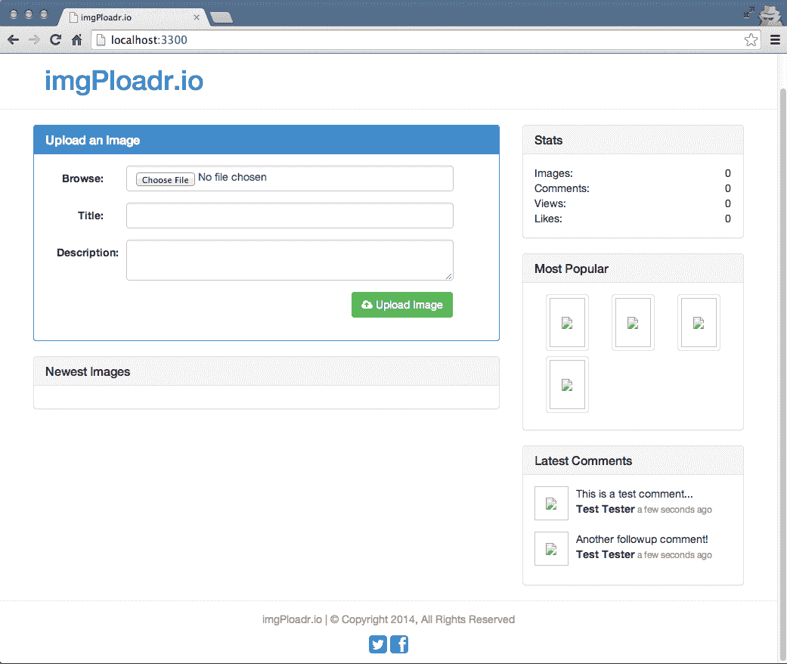
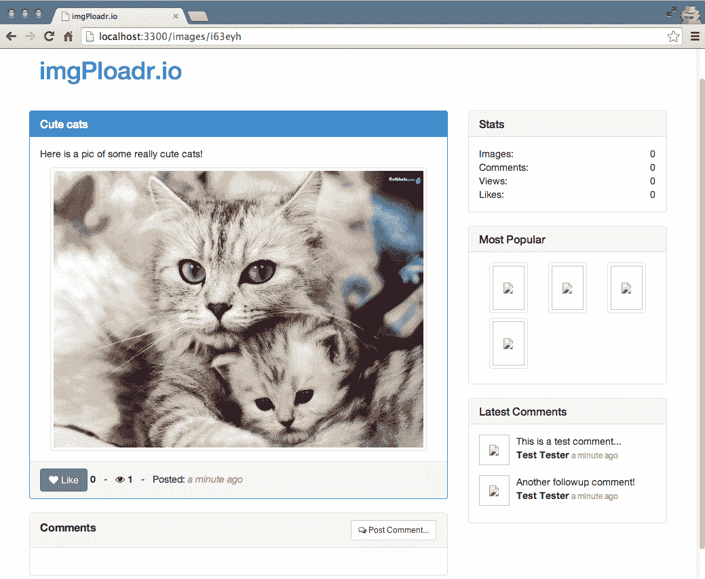
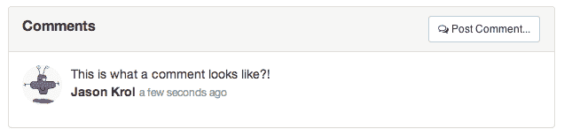

# 七、使用 MongoDB 持久化数据

如今，几乎所有为 web 编写的应用，如果用户之间的交互没有永久保存，那么高度交互的应用的价值是有限的。 为了解决这个问题，必须将应用与适当的数据库集成。 假设应用的所有数据(注册用户、订单事务和社交互动)都存储在运行应用的服务器的临时内存中。 当服务器关闭或重新启动时，所有应用数据都将丢失。 依赖数据库永久地存储这些数据对于任何动态应用都是至关重要的。

本章将涵盖以下主题:

*   连接 MongoDB
*   介绍猫鼬
*   模式和模型
*   将 CRUD 添加到控制器中

在前一章中，我们编写并解释了应用的实际逻辑。 构建应用的下一步是将其连接到数据库，以便永久保存和检索用户的交互和数据。 从技术上讲，我们可以通过在内存中存储数据来解决这个问题，但一旦我们的网络服务器重启或崩溃，所有的数据都会丢失。 如果不将我们的应用连接到数据库服务器来持久化数据，每个由访问者交互的输入都将过时。 如果没有某种数据库服务器来存储我们的数据，我们每天接触的大多数网站都不会存在。

以下是我们的数据将如何在我们的应用中的每个访问者交互中被持久化的大致分解:


考虑前面的图表，它反映了一个 web 应用请求的典型生命周期:

1.  访问者通过他们的 web 浏览器提交一个请求来查看我们应用中的一个页面。
2.  Node.js 服务器接收这个请求并向 MongoDB 服务器查询任何数据。
3.  MongoDB 服务器将查询的数据返回给我们的 Node.js 服务器。
4.  Node.js 服务器获取该数据，将其构建到视图模型中，然后将呈现的 HTML 页面发送回浏览器。
5.  web 浏览器接收来自 Node.js 服务器的响应并渲染 HTML。
6.  每个访问者的每次交互都会重复这个循环。

出于本书的目的，我们使用 MongoDB 作为我们的主要数据存储，但实际上我们可以使用以下任何一种存储数据:MySQL, PostgreSQL, MS SQL，文件系统，等等。

# 使用 MongoDB 与 Node.js

在我们正式将 MongoDB 实现到我们的实际应用之前，让我们先看一些基本的例子，从 Node.js 连接到 MongoDB 服务器。

创建一个新的项目文件夹来存储一些用于实验的示例代码。 我将文件夹命名为`mongotest`。 在这个文件夹中，创建一个名为`test.js`的新文件。 在这个文件中，我们将使用一些代码来测试如何连接到 MongoDB 以及如何插入和检索一些数据。 为了从 Node.js 连接到 MongoDB 服务器，我们需要做的第一件事是需要一个`mongodb`模块。

首先，将目录更改为新的`mongotest`文件夹，并使用`npm`安装`mongodb`模块:

```js
    $ cd mongotest
    $ npm install mongodb
```

Don't be confused by the module's name. The `mongodb` npm module isn't MongoDB itself, but rather a third-party npm module that facilitates communicating to a MongoDB server from within Node.js. Also, because this is just a sample project to experiment with, we don't require the `--save` flag with `npm install`, since we aren't maintaining a `package.json` file.

# 连接 MongoDB

既然已经安装了`mongodb`模块，我们就可以在实验文件中使用它了。 启动编辑器并创建一个名为`test.js`的文件。 将以下代码块插入其中:

```js
const MongoClient = require('mongodb').MongoClient;

MongoClient.connect('mongodb://localhost:27017/mongotest',
  (err, db)=>{
      console.log('Connected to MongoDB!');
      db.close();
  });
```

执行前面的代码应该会记录 Connected to MongoDB! 你的屏幕。

首先你会注意到，我们需要`mongodb`模块，但我们专门使用模块的`MongoClient`组件。 这个组件是我们用来主动打开到 MongoDB 服务器的连接的实际接口。 使用`MongoClient`，我们将`mongodb://localhost:27017/mongotest`字符串 URL 作为第一个参数传递给本地服务器。 注意，URL 中的路径指向服务器，然后指向数据库本身的名称。

记住，在本章的学习期间，确保您的本地 MongoDB 服务器实例在另一个终端上运行。 为此，打开一个命令行终端窗口并执行`$ mongod`。 您的服务器应该启动并将信息记录到屏幕上，以`[initandlisten] waiting for connections on port 27017`结尾。

You might find that when you run your application, you receive a stack trace error with something like the following code:
`events.js:72`
`thrower; // Unhandled 'error' event`
`^Error: failed to connect to [localhost:27017]`If this happens, you should realize that it failed to connect to the `localhost` on port `27017`, which is the port that our local `mongod` server runs under.

一旦我们连接到数据库服务器，就好像我们在运行 Mongo shell 命令。 MongoClient 回调函数返回一个数据库连接对象(我们在代码中将其命名为`db`，但可以命名为任何对象)，这与我们在 Mongo shell 中执行`use <databasename>`时使用的对象完全相同。 知道了这一点，我们可以使用`db`对象来做任何我们可以通过 Mongo shell 来做的事情。 语法略有不同，但思想大体上是相同的。

# 插入文档

让我们通过向集合中插入一条记录来测试我们的新`db`对象:

```js
const MongoClient = require('mongodb').MongoClient;

MongoClient.connect('mongodb://localhost:27017/mongotest', (err, db)=>{
    console.log('Connected to MongoDB!');

    var collection = db.collection('testing');
    collection.insert({'title': 'Snowcrash'}, (err, docs)=>{
        /**
        * on successful insertion, log to the screen
        * the new collection's details: 
        **/
        console.log(`${docs.ops.length} records inserted.`);
        console.log(`${docs.ops[0]._id} - ${docs.ops[0].title}`);

        db.close();

    });
});
```

在前面的代码中，我们建立到数据库的连接，并在连接完成后执行`callback`。 `callback`接收两个参数，第二个参数是`db`对象本身。 使用`db`对象，我们可以得到我们想要处理的集合。 在本例中，我们将该集合保存为一个变量，以便在余下的代码中更容易地使用它。 使用`collection`变量，我们执行一个简单的`insert`命令，并将我们想要插入到数据库中的 JSON 对象作为第一个参数。

`callback`函数在`insert`接受两个参数后执行，第二个参数是受该命令影响的文档数组; 在本例中，它是我们插入的一个文档数组。 一旦`insert`完成，我们进入`callback`函数，我们记录一些数据。 您可以看到，`docs.ops`数组的长度是`1`，因为我们只插入了一个文档。 此外，您可以看到数组中的单个文档就是我们插入的文档，尽管现在它有一个额外的`_id`字段，因为 MongoDB 会自动处理该字段。

# 检索一个文档

让我们通过添加`findOne`函数调用来查找刚刚插入的文档来进一步证明我们的代码。 更改`test.js`中的代码以匹配以下示例:

```js
const MongoClient = require('mongodb').MongoClient;

MongoClient.connect('mongodb://localhost:27017/mongotest', (err, db)=>{
    console.log('Connected to MongoDB!');

    var collection = db.collection('testing');
    collection.insert({'title': 'Snowcrash'}, (err, docs)=>{
        console.log(`${docs.ops.length} records inserted.`);
        console.log(`${docs.ops[0]._id} - ${docs.ops[0].title}`);

        collection.findOne({title: 'Snowcrash'}, (err, doc)=>{
            console.log(`${doc._id} - ${doc.title}`);
            db.close();
        });
    });
});
```

在这段代码中，我们以完全相同的方式插入一个记录; 只是这次
我们对`title`执行`findOne`。 `findOne`函数接受一个`JSON`对象作为其第一个参数进行匹配(可以根据需要精确或松散)。 在`findOne`之后执行的`callback`函数将包含作为其第二个参数找到的单个文档。 如果我们执行一个`find`操作，我们将收到一个基于搜索条件的匹配文档数组。

最后提到的代码的输出应该是:

```js
    $ node test.js
    Connected to MongoDB!
    1 record inserted.
    538bc3c1a39448868f7013b4 - Snowcrash
    538bc3c1a39448868f7013b4 - Snowcrash
```

在输出中，您可能会注意到在`insert`上报告的`_id`参数与`findOne`中的参数不匹配。 这可能是多次运行代码的结果，这会导致插入多个具有相同标题的记录。 `findOne`函数将以没有特定顺序返回找到的第一个文档，因此返回的文档可能不是最后插入的文档。

现在，您已经基本了解了如何通过 Node.js 轻松地连接和通信 MongoDB 服务器，让我们看看如何以一种不那么原始的方式使用 MongoDB。

# 介绍猫鼬

虽然直接使用`mongodb`模块很棒，但它也有点原始，缺乏我们在 Node.js 中使用 Express 等框架时所期望的任何开发者友好感。 **Mongoose**是一个很棒的第三方框架，它使 MongoDB 的工作变得轻而易举。 它为 Node.js 提供了一个优雅的`mongodb`对象建模。

这基本上意味着，Mongoose 使我们能够使用模式(也称为模型定义)来组织数据库，并为我们的模型提供强大的特性，例如验证、虚拟属性等等。 Mongoose 是一个很棒的工具，因为它使 MongoDB 中使用集合和文档显得更加优雅。 原来的`mongodb`模块是猫鼬的依赖,所以你可以把猫鼬是一个包装器`mongodb`,就像表达是 node . js 的包装上,抽象很多原始的感觉,给你直接工具更容易处理。

需要注意的是，Mongoose 仍然是 MongoDB，所以所有你熟悉的和习惯的工作方式几乎都是一样的; 只是语法稍有变化。 这意味着我们从 MongoDB 了解和喜爱的查询、插入和更新都可以与 Mongoose 完美地工作。

我们需要做的第一件事就是安装 Mongoose，这样它就可以在我们的`mongotest`项目中使用:

```js
    $ npm install mongoose
```

安装完成后，让我们看看 Mongoose 必须提供的一些特性，在开发严重依赖 MongoDB 数据库的应用时，我们将利用这些特性来简化我们的生活。

# 模式

在 Mongoose 中，模式是我们用来定义模型的。 将模式可视化为用于创建模型的蓝图。 使用模式，您可以定义更多 MongoDB 模型的简单蓝图。 您还可以利用 Mongoose 默认提供的内置验证，添加静态方法、虚拟属性等。

在为模型定义模式时，我们要做的第一件事是为我们认为将需要用于特定文档的每个字段构建一个列表。 字段是由类型定义的，您期望的标准数据类型是可用的，以及其他一些:

*   *String*:存储字符串值。
*   *Number*:存储数字值，有一定的限制。
*   *Date*:该类型包含一个`date`和`time`对象。
*   *Buffer*:这种类型提供二进制数据的存储。 例如，它可以包含图像或任何其他文件。
*   *布尔值*:该类型用于存储布尔值(true/ false)。
*   *Mixed*:这基本上是一个可以包含任何内容的非结构化对象。 在存储 JSON 类型数据或任意数据(
    字面上可以是任何 JSON 表示)时，请考虑这一点。 它不需要预先定义。
*   *ObjectID*:这通常用于当你想在一个字段中存储另一个文档的 ObjectID，例如，当定义一个关系时。
*   *数组*:这是其他模式(模型)的集合。

下面是一个基本的 Mongoose 模式定义示例:

```js
const mongoose = require('mongoose'),
    Schema = mongoose.Schema;

var Account = new Schema({
    username: { type: String },
    date_created: { type: Date, default: Date.now },
    visits: { type: Number, default: 0 },
    active: { type: Boolean, default: false }
}); 
```

这里，我们定义了一个`Account`集合的模式。 我们要做的第一件事是`require`Mongoose，然后在模块中使用`mongoose.Schema`定义一个`Schema`对象。 我们通过使用定义模式的构造函数对象创建一个新的`Schema`实例来定义模式。 定义中的每个字段都是一个基本的 JavaScript 对象及其类型，然后是一个可选的默认值。

# 模型

Mongoose 中的模型是一个可以实例化的类(由模式定义)。
使用模式，我们定义`models`，然后将其作为常规 JavaScript 对象使用。
好处是，`model`对象有额外的奖励是由 Mongoose 支持，所以它还包括功能，如保存，查找，创建和删除。 让我们看看如何使用模式定义模型，然后实例化模型并使用它。 添加另一个名为`test2.js`的文件到你的实验文件夹`mongotest/test2.js`，并在其中包含以下块:

```js
const mongoose = require('mongoose'),
    Schema = mongoose.Schema;

mongoose.connect('mongodb://localhost:27017/mongotest');
mongoose.connection.on('open', function() {
    console.log('Mongoose connected.');
});

var Account = new Schema({
    username: { type: String },
    date_created: { type: Date, default: Date.now },
    visits: { type: Number, default: 0 },
    active: { type: Boolean, default: false }
});

var AccountModel = mongoose.model('Account', Account);
var newUser = new AccountModel({ username: 'randomUser' });
console.log(newUser.username);
console.log(newUser.date_created);
console.log(newUser.visits);
console.log(newUser.active);
```

运行前面的代码应该会得到类似如下的结果:

```js
    $ node test2.js
    randomUser
    Mon Jun 02 2014 13:23:28 GMT-0400 (EDT)
    0
    false
```

创建一个新模型是伟大的，当你正在处理新文档，你想要一种方法来创建一个新实例，填充它的值，然后保存到数据库:

```js
var AccountModel = mongoose.model('Account', Account);
var newUser = new AccountModel({
    username: 'randomUser'
});
newUser.save();
```

在`mongoose`模型上调用`.save`将触发 MongoDB 命令，
将执行必要的`insert`或`update`语句来更新服务器。 当你切换到你的 mongo shell，你可以看到新用户确实被保存到数据库:

```js
> use mongotest
switched to db mongotest
> db.accounts.find()
{ "username" : "randomUser", "_id" : ObjectId("538cb4cafa7c430000070f66"), "active" : false, "visits" : 0, 
"date_created" : ISODate("2014-06-02T17:30:50.330Z"), "__v" : 0 }
```

Without calling `.save()` on the model, the changes to the model won't actually be persisted to the database. Working with Mongoose models in your Node code is just that--code. You have to execute MongoDB functions on a model for any actual communication to occur with the database server.

您可以使用`AccountModel`执行`find`操作，并根据从 MongoDB 数据库检索结果的一些搜索条件返回一个`AccountModel`对象数组:

```js
// assuming our collection has the following 4 records: 
// { username: 'randomUser1', age: 21 } 
// { username: 'randomUser2', age: 25 } 
// { username: 'randomUser3', age: 18 } 
// { username: 'randomUser4', age: 32 } 

AccountModel.find({ age: { $gt: 18, $lt: 30 } }, function(err, accounts) {
    console.log(accounts.length); // => 2 
    console.log(accounts[0].username); // => randomUser1 
    mongoose.connection.close();
});
```

在这里，我们使用标准 MongoDB 命令`$gt`和`$lt`作为年龄的值，传入查询参数来查找文档(即查找年龄在 18 岁以上和 30 岁以下的任何文档)。 在`find`之后执行的回调函数引用了一个`accounts`数组，该数组是查询返回给 MongoDB 的`AccountModel`对象的集合。 作为良好的内务管理的一般方法，我们在完成之后关闭与 MongoDB 服务器的连接。

# 内置的验证

Mongoose 的核心概念之一是，它在
无模式设计(如 MongoDB)之上强制执行一个模式。 通过这样做，我们获得了许多新特性，包括内置验证。 默认情况下，每个模式类型都有一个内置的必需验证器。 此外，数字有`min`和`max`验证器，字符串有枚举和匹配验证器。 定制验证器也可以通过模式定义。 让我们简单看一下前面例子模式中添加的一些验证:

```js
var Account = new Schema({
    username: { type: String, required: true },
    date_created: { type: Date, default: Date.now },
    visits: { type: Number, default: 0 },
    active: { type: Boolean, default: false },
    age: { type: Number, required: true, min: 13, max: 120 }
}); 
```

我们添加到模式中的验证是:现在需要`username`参数，并且我们包含了一个名为`age`的新字段，这是一个必须在`13`和`120`(年份)之间的数字。 如果任何一个值都不匹配验证需求(即，`username`为空或者`age`小于`13`或大于`120`)，就会抛出一个错误。

当一个模型的`.save()`函数被调用时，验证将自动启动; 但是，您也可以通过使用`callback`调用模型的`.validate()`函数来手动验证，以处理响应。 在这个示例的基础上，添加以下代码，它将从定义的模式创建一个新的`mongoose`模型:

```js
var AccountModel = mongoose.model('Account', Account);
var newUser = new AccountModel({ username: 'randomUser', age: 11 });
newUser.validate(function(err) {
    console.log(err);
});
// the same error would occur if we executed: 
// newUser.save(); 
```

运行上述代码应该会在屏幕上记录以下错误:

```js
{
 message: 'Validation failed',
 name: 'ValidationError',
 errors: {
 age: {
 message: 'Path '
 age ' (11) is less than minimum allowed value (13).', 
 name: 'ValidatorError',
 path: 'age',
 type: 'min',
 value: 11
 }
 }
} 
```

可以看到，从`validate`返回的`error`对象非常有用，它提供了大量信息，有助于验证模型并将错误消息返回给用户。

验证是一个很好的例子，说明了为什么始终接受`error`对象作为 Node 中任何`callback`函数的第一个参数是如此重要。 同样重要的是检查`error`对象并适当地处理它。

# 静态方法

`Schema`s 足够灵活，因此您可以轻松地向其添加您自己的自定义静态方法，然后这些方法将可用于由`Schema`定义的所有模型。 静态方法对于添加您知道将在大多数模型中使用的辅助工具和函数非常有用。 让我们以前面的简单年龄查询为例，对其进行重构，使其成为一个静态方法，并且更加灵活:

```js
var Account = new Schema({
    username: { type: String },
    date_created: { type: Date, default: Date.now },
    visits: { type: Number, default: 0 },
    active: { type: Boolean, default: false },
    age: { type: Number, required: true, min: 13, max: 120 }
});

Account.statics.findByAgeRange = function(min, max, callback) {
    this.find({ age: { $gt: min, $lte: max } }, callback);
};

var AccountModel = mongoose.model('Account', Account);

AccountModel.findByAgeRange(18, 30, function(err, accounts) {
    console.log(accounts.length); // => 2 
});
```

静态方法非常容易实现，一旦你开始充分利用它们，它将使你的模型更加强大!

# 虚拟属性

虚拟属性就像它们听起来的那样——假属性，它实际上不存在于您的 MongoDB 文档中，但您可以通过组合其他真实属性来伪造。 `virtual`属性最明显的例子是`fullname`的字段，而 MongoDB 集合中只有`firstname`和`lastname`是实际的字段。 对于`fullname`，你只需要简单地说，返回模型的姓和名，并将其标记为`fullname`:

```js
// assuming the Account schema has firstname and lastname defined: 

Account.virtual('fullname')
    .get(function() {
        return this.firstname + ' ' + this.lastname;
    })
    .set(function(fullname) {
        var parts = fullname.split(' ');
        this.firstname = parts[0];
        this.lastname = parts[1];
    });
```

我们称之为`.get()`和`.set()`函数。 不需要同时提供这两种功能，尽管这是相当常见的。

在本例中，我们的`get()`函数只是执行基本的字符串拼接并返回一个新值。 我们的`.set()`函数在一个空格上执行字符串的反向拆分，然后为每个结果分配模型的`firstname`和`lastname`字段值。 您可以看到，如果有人试图将模型的`fullname`设置为一个值，比如 Dr. Kenneth Noisewater，那么`.set()`实现就有点不稳定了。

重要的是要注意，虚拟属性不是持久化到 MongoDB 的，因为它们不是文档或集合中的实际字段。

你可以用猫鼬做更多的事情，而我们仅仅只是触及了表面。 幸运的是，它有一个相当深入的指南，您可以参考以下链接:[http://mongoosejs.com/docs/guide.html](http://mongoosejs.com/docs/guide.html)。

一定要花些时间查看 Mongoose 文档，以便熟悉所有可用的强大工具和选项。

以上就是我们对 Mongoose 模型、模式和验证的介绍。 接下来，让我们回到主应用，并编写将用于替换现有示例`ViewModels`和连接 Mongoose 的模式和模型。

# 方法的上下文(this)

在开始我们的下一部分之前，读者可能已经注意到我们并没有在所有情况下使用一个胖箭头函数来替代`callbacks`。 这是因为我们将广泛地使用函数`(this)`的上下文。 当涉及到上下文时，平面箭头函数和常规函数的实现是不同的。 微分语句是:函数`(this)`的上下文不取决于声明它的位置，而是取决于调用它的位置。 为了理解这一点，让我们考虑以下例子:

```js
function getData() {
    console.log(this.a); // global 
}
getData.a = 'hello';
var a = 'world';
getData(); 
```

在运行前面的代码片段时，我们将得到输出`'world'`; 这是因为 foo 函数是在全局作用域中调用的，因此上下文是全局的，我们接收到全局变量的值。 为了限制这种行为，我们可以使用`bind`方法或 es6 箭头函数。
现在我们将前面的`get virtual`方法转换为:

```js
Account.virtual('fullname') 
.get(()=>{ 
return this.firstname + ' ' + this.lastname; 
}) 
```

The context inside the preceding `arrow` function won't refer to the `Account` schema, and will thus get undefined. To avoid this behavior, we will continue with regular functions. Get to know more about the lexical scoping mechanism of the `arrow` function in the following link: [https://goo.gl/bXvFRM](https://goo.gl/bXvFRM). More details on how to handle this issue with different methods are posted in the following link: [https://github.com/Automattic/mongoose/issues/5057](https://github.com/Automattic/mongoose/issues/5057).

# 与猫鼬

使用 Mongoose 连接到 MongoDB 服务器的行为几乎与我们之前使用`mongodb`模块时使用的方法相同。

首先，我们需要确保安装了 Mongoose。 此时，我们将在主应用中使用 Mongoose，因此我们希望将其安装在主项目目录中，并更新`package.json`文件。 使用您的命令行终端程序，更改位置到您的`projects`文件夹，并通过`npm`安装 Mongoose，确保使用`--save`标志，以更新`package.json`文件:

```js
    $ cd ~/projects/imgPloadr
    $ npm install mongoose --save
```

安装了 Mongoose 并为项目更新了`package.json`文件后，我们准备打开 MongoDB 服务器的连接。 对于我们的应用，一旦应用本身启动，我们将打开一个到 MongoDB 服务器的连接，并在应用的生命周期内保持一个到数据库服务器的开放连接。 让我们编辑`server.js`文件以包含我们需要的连接代码。

首先，将猫鼬包含在应用中，要求它位于文件的最顶端:

```js
cons express = require('express'), 
config = require('./server/configure'), 
mongoose = require('mongoose'); 
var app = express(); 
```

然后，在`app = config(app);`行之后插入以下代码:

```js
mongoose.connect('mongodb://localhost/imgPloadr', { 
    useMongoClient : true 
}); 
mongoose.connection.on('open',()=>{ 
    console.log('Mongoose connected.'); 
}); 
```

就是这样! 只需几行简单的代码就可以打开 MongoDB 服务器的连接，我们的应用就可以开始与数据库通信了。 我们传递给 Mongoose 的`connect`函数的参数是一个指向本地运行的 MongoDB 服务器的 URL 字符串，其中包含我们想要使用的集合的路径。 ``useMongoClient``用于选择新的连接方法作为默认方法，但一旦我们开始使用 Mongo 4.11.0 及以上版本，它将被弃用。 此外，我们向`mongoose.connection`对象的`open`事件添加一个事件监听器，当触发该事件时，我们只需记录一条数据库服务器已连接的输出消息。

# 定义模式和模型

出于构建应用的目的，我们将只有两个不同的、唯一的模式和关联的模型:一个`Image`模型和一个`Comment`模型。 如果我们要将这个应用投入生产，并真正用所有必要的特性来构建它，我们预计还会有更多的模型。

首先，在项目中创建一个名为`models`的新目录，我们将在这里存储每个模型的 Node.js 模块。 在此目录下创建三个文件`image.js`、`comment.js`、`index.js`。 让我们先来看看`Image`模型。 复制以下代码块到`models/image.js`文件:

```js
const mongoose = require('mongoose'),
    Schema = mongoose.Schema,
    path = require('path');

const ImageSchema = new Schema({
    title: { type: String },
    description: { type: String },
    filename: { type: String },
    views: { type: Number, 'default': 0 },
    likes: { type: Number, 'default': 0 },
    timestamp: { type: Date, 'default': Date.now }
});

ImageSchema.virtual('uniqueId')
.get(function() {
    return this.filename.replace(path.extname(this.filename), '');
});

module.exports = mongoose.model('Image', ImageSchema); 
```

首先，我们定义我们的`ImageSchema`，其中包含我们将在 MongoDB 中为每个映像存储的各个字段。 我们创建了`uniqueId`的`virtual`属性，它只是删除了文件扩展名的文件名。 因为我们希望我们的`Image`模型在应用的其余部分都可用，所以我们使用`module.exports`导出它。 注意，我们导出的是模型，而不是模式(因为模式本身对我们没什么用处)。 让我们为注释建立一个类似的模型。 复制以下代码块到`models/comment.js`文件:

```js
const mongoose = require('mongoose'), 
    Schema = mongoose.Schema, 
    ObjectId = Schema.ObjectId; 

const CommentSchema = new Schema({ 
image_id:   { type: ObjectId }, 
email:      { type: String }, 
name:       { type: String }, 
gravatar:   { type: String }, 
comment:    { type: String }, 
timestamp:  { type: Date, 'default': Date.now } 
}); 

CommentSchema.virtual('image') 
.set(function(image){ 
    this._image = image; 
})
.get(function() { 
    return this._image; 
}); 

module.exports = mongoose.model('Comment', CommentSchema);
```

对于这个模型，有几件重要的事情需要注意。 首先，我们有一个标记为`image_id`的字段
，它有一个`ObjectId`类型。 我们将使用这个
字段来存储它被发布到的`comment`和`image`之间的关系。
存储在该字段中的`ObjectId`是 MongoDB 相关图像文档的`_id`。

我们还在标记为`image`的`comment`模式上定义了`virtual`，并为其提供了一个 getter 和 setter。 当我们稍后在控制器中检索注释时，虚拟属性将用于附加相关图像。 对于每个注释，我们将遍历并查找其关联的图像，并将`image`对象附加为注释的属性。

Handling the name of collections
You name your models using singular terms, and Mongoose will recognize this and create your collections using pluralized model names. So, a model defined as `Image` will have a collection in MongoDB named `images`. Mongoose tries to be smart about this; however, a model defined as `Person` will have a corresponding collection named `people`, and so on. (And yes, octopus will result in octopi!)

# 模型索引文件

在`models`文件夹中还有最后一个文件，我们在项目中还没有涉及到它。 Node.js 中任意文件夹中的`index.js`文件作为其中模块的`index`文件。 这是约定俗成的，如果你不愿意，你可以不遵守。

由于我们的`models`文件夹将包含许多不同的文件，每个文件都是一个模型的唯一模块，所以如果我们能在单个`require`语句中包含所有的模型就更好了。 使用`index.js`文件，我们也可以很容易地做到这一点。 将以下代码块复制到`models/index.js`文件中:

```js
module.exports = { 
    'Image': require('./image'), 
    'Comment': require('./comment') 
};
```

`models`目录中的`index.js`文件简单地定义了一个 JavaScript 对象，该对象由目录中的每个模块的名称-值对组成。 我们手动维护这个对象，但这是该概念最简单的实现。 现在，多亏了这个基本文件，我们可以在应用的任何地方执行`require('./models')`，并且知道通过该模块我们有了每个模型的字典。 要在该模块中引用特定的模型，我们只需将特定的模型作为模块的属性来引用。 如果我们只是想在应用中要求特定的模型，我们可以简单地执行`require('./models/image')`! 稍后你会看到更多，它会变得更清楚。

因为我们的两个模型是如此密切相关，我们通常总是需要在整个应用中使用`require('./models')`字典。

# 向控制器添加 CRUD

**CRUD**表示创建、读取、更新和删除。 既然已经定义了模式，也准备好了模型，我们就需要开始在整个应用中使用它们，方法是在必要时使用各种 CRUD 方法更新控制器。 到目前为止，我们的控制器只包含 fixture 或假数据，所以我们可以证明控制器是工作的，视图模型连接到模板上。 我们开发的下一个逻辑步骤是直接使用 MongoDB 的数据填充我们的视图模型。 如果我们可以直接将我们的 Mongoose 模型作为`viewModel`本身传递给我们的模板，那就更好了。

# 主控制器

从*如果你还记得更新主控制器*的[第六章](06.html),*控制器和视图模型,我们最初创建`viewModel`,由 JavaScript 对象的一个数组只是占位符夹具数据在我们家里控制器:*

```js
var viewModel = { 
images: [ 
        { 
uniqueId:       1, 
title:          'Sample Image 1', 
description:    '', 
filename:       'sample1.jpg', 
views:          0, 
likes:          0, 
timestamp:      Date.now() 
        }, { 
uniqueId:       2, 
title:          'Sample Image 2', 
description:    '', 
filename:       'sample2.jpg', 
views:          0, 
likes:          0, 
timestamp:      Date.now() 
        }, { 
uniqueId:       3, 
title:          'Sample Image 3', 
description:    '', 
filename:       'sample3.jpg', 
views:          0, 
likes:          0, 
timestamp:      Date.now() 
        }, { 
uniqueId:       4, 
title:          'Sample Image 4', 
description:    '', 
filename:       'sample4.jpg', 
views:          0, 
likes:          0, 
timestamp:      Date.now() 
        } 
    ] 
}; 
```

我们将用一个非常简化的版本来代替`viewModel`，然后用我们的猫鼬模型中的真实数据填充这个版本:

```js
var viewModel = {
    images: []
}; 
```

在用真实数据填充`viewModel`之前，我们首先需要确保我们的家庭控制器可以使用我们的模型。 为此，我们必须需要`models`模块。 将其包含在`controllers/home.js`文件的最顶部:

```js
const sidebar = require('../helpers/sidebar'), 
ImageModel = require('../models').Image;
```

我们可能需要完整的`models`模块，并且可以访问`Comment`模型和`Image`模型; 然而，对于主页，我们真的只需要使用`Image`模型。 现在，我们的主控制器可以使用`Image`的`mongoose`模型，我们可以执行`find`操作来检索要在主页上显示的最新图像列表。 用以下更新版本的代码替换主控制器中现有的`sidebar()`调用:

```js
ImageModel.find({}, {}, { sort: { timestamp: -1 } },
    (err, images) => {
        if (err) { throw err; }

        viewModel.images = images;
        sidebar(viewModel, (viewModel) => {
            res.render('index', viewModel);
        });
    }); 
```

使用`ImageModel`，我们执行一个 MongoDB`find`查询，但是我们没有为实际的查询提供任何细节(一个空白的 JavaScript 对象)，这意味着它将返回每个文档。 第二个参数也是一个空白 JavaScript 对象，这意味着我们没有指定如何映射结果，因此将返回完整的模式。 第三个参数是一个`options`对象，我们可以在其中指定`sort`字段和顺序等内容。 在这个特定的查询中，我们检索了按`timestamp`降序排序的图像集合中的每一张图像(升序的值为`1`而不是`-1`)。

成功查询 MongoDB 数据库服务器的`find`后执行的`callback`函数将返回`error`对象和匹配模型的`images`数组; 在我们的例子中，它与数据库中的每个映像有关。 使用从查询返回的数组，我们只需通过其`images`属性将其附加到`viewModel`。 然后，像前面那样调用`sidebar`函数。

此时，我们不再使用 fixture 数据填充`viewModel`，而是使用使用我们的 Mongoose`Image`模型执行基本`find`查询时从数据库返回的数据填充`viewModel`。 应用的主页是正式的数据驱动的。 以下是整个`controllers/home.js`文件的概要:

```js
const sidebar = require('../helpers/sidebar'), 
    ImageModel = require('../models').Image; 

module.exports = { 
    index: (req, res)=>{ 
        var viewModel = { 
            images: [] 
        }; 

        ImageModel.find({}, {}, { sort: { timestamp: -1 }}, (err, images)=>{ 
            if (err) { throw err; } 

            viewModel.images = images; 
            sidebar(viewModel, (viewModel)=>{ 
                res.render('index', viewModel); 
            }); 
        }); 

    } 
}; 
```

如果你运行应用并在浏览器中打开它，你不会在主页上看到任何东西。 那是因为我们还没有插入任何数据。 这是接下来要讲的。 但是，请注意页面本身仍然可以工作，您不会得到任何错误。 这是因为 MongoDB 只是从`ImageModel`上的`find`返回一个空数组，Handlebars 主页模板处理得很好，因为它对一个空数组执行`each`操作，所以主页上显示的图像为零。

# 图像控制器

到目前为止，`image`控制器是我们应用中最大的组件。 它包含了驱动我们应用的大部分(如果不是全部)逻辑。这包括显示图像的所有细节，处理图像的上传，以及处理点赞和评论。 在这个控制器中有很多内容需要介绍，所以让我们按每个部分进行分解。

# 索引-检索一个图像模型

在我们的`image`控制器中`index`函数的主要职责是检索单个特定图像的详细信息，并通过其`viewModel`显示该图像。 除了实际图像的详细信息外，图像的注释也以列表的形式显示在页面上。 每当查看图像时，我们还需要更新图像的视图计数，并将其增加 1。

首先编辑`controllers/image.js`文件，并更新顶部所需模块的列表，以包括我们的`models`模块:

```js
const fs = require('fs'), 
path = require('path'), 
sidebar = require('../helpers/sidebar'), 
Models = require('../models');
```

我们还希望将`viewModel`剥离到最基本的形式，就像我们在主控制器中所做的那样。 用这个新的、更轻的版本替换现有的`viewModel`对象变量:

```js
var viewModel = { 
image: {}, 
comments: [] 
}; 
```

在定义一个空白的`viewModel`之后，让我们在`Image`模型上包含一个`find`调用，这样我们就可以通过它的`filename`来查找图像:

```js
Models.Image.findOne({
        filename: { $regex: req.params.image_id }
    },
    (err, image) => {
        if (err) { throw err; }
        if (image) {
            // to do... 
        } else {
            res.redirect('/');
        }
    }); 
```

在前面的代码中,我们使用的是`Image``Models`模块的模型和执行`findOne`,`find`是相同的,除了它将只返回一个文档(匹配),而不是像`find`返回数组。 按照惯例，我们在回调函数的第二个参数中使用单数变量名，而不是复数变量名，这样作为开发人员，我们可以很容易地判断我们是在处理单个对象还是一个数组/对象集合。

我们提供的`query`对象作为第一个参数匹配图像文档的`filename`字段使用 MongoDB 的`regex`过滤器和比较这`req.params.image_id`,在 URL 参数的值作为我们的`routes`文件中定义。 图像页面的 URL 将始终是`http://localhost:3300/images/abcdefg`，其中`abcdefg`将是`req.params.image_id`的值。 如果您还记得，当上传图像时，我们在`create`函数中随机生成这个值。

在检查了`err`对象不为空之后，我们检查了`image`对象也不为空。 如果它不是 null，这意味着一个模型从 MongoDB 返回; 所以，我们找到了我们的图像，我们可以开始了。 如果没有返回`image`模型，因为我们尝试通过不存在的文件名搜索图像，我们简单地将用户重定向回主页。

现在，让我们通过在有`// to do...`占位符注释的区域插入以下行来填充`viewModel`:

```js
image.views = image.views + 1; 
viewModel.image = image; 
image.save(); 
```

我们将从`findOne`返回的`image`模型附加到`viewModel.image`属性，但不是在将该模型的`views`属性增加`1`之前(以便在加载页面时表示实际的+一个视图)。 由于我们修改了模型(通过增加它的视图计数)，我们需要确保它被保存回 MongoDB，所以我们调用模型的`save`函数。

既然已经用`image`模型更新了`viewModel`，并且视图
计数已经增加并保存，我们需要检索与图像相关的注释列表。 让我们包含更多的代码来查询`Comment`模型并找到属于该图像的任何注释。 在前面的`image.save();`后面插入下面的代码块:

```js
Models.Comment.find({ image_id: image._id }, {}, {
        sort: {
            'timestamp': 1
        }
    },
    (err, comments) => {
        if (err) { throw err; }

        viewModel.comments = comments;

        sidebar(viewModel, (viewModel) => {
            res.render('image', viewModel);
        });
    }
);
```

在我们的`Comment`模型上使用`find`，我们可以传入一个包含查询的对象作为第一个参数; 在本例中，我们指定我们想要的所有注释中，`image_id`字段等于前面附加在`viewModel`上的主`image`模型
的`_id`属性。

这些代码看起来可能有点奇怪，所以让我们详细说明一下。 请记住，从原始`Models.Image.findOne()`调用返回的`image`对象在`callback`函数的整个作用域内都是可用的。 无论我们将`callback`函数嵌套得多深，我们总是能够访问原始的`image`模型。 因此，我们可以在`Model.Comment.find()`执行后触发的`callback`函数中访问它及其属性。

一旦进入`Comment`的`find`回调,我们把数组返回`comments``viewModel`,然后调用我们的`sidebar`功能完全是当我们第一次打开控制器,开始编辑这个`index`功能。

作为回顾，这里是在`controllers/image.js`文件中被完全更新后的整个`index`函数:

```js
index: (req, res)=>{ 
        var viewModel = { 
            image: {}, 
            comments: [] 
        }; 

        Models.Image.findOne({ filename: { $regex: req.params.image_id } }, 
            (err, image)=>{ 
                if (err) { throw err; } 
                if (image) { 
                    image.views = image.views + 1; 
                    viewModel.image = image; 
                    image.save(); 

                    Models.Comment.find( 
                        { image_id: image._id}, 
                        {}, 
                        { sort: { 'timestamp': 1 }}, 
                        (err, comments)=>{ 
                            viewModel.comments = comments; 
                            sidebar(viewModel, (viewModel)=>{ 
                                res.render('image', viewModel); 
                            }); 
                        } 
                    ); 
                } else { 
                    res.redirect('/'); 
                } 
            }); 
    }
```

让我们快速回顾一下所有的`index`控制器的职责和任务:

1.  创建一个新的空的`viewModel`对象。
2.  创建`findOne imagefindOneimage`模型，其中文件名是与 URL`image_id`参数匹配的正则表达式。
3.  将找到的`image`视图增加 1。
4.  将找到的`image`模型附加到`viewModel`上。
5.  保存`image`模型，因为其`view`s 已被更新。
6.  找到所有属性等于原`image`模型
    中的`_id`的注释。
7.  将找到的`comments`数组附加到`viewModel`。
8.  使用`sidebar`渲染页面，传入`viewModel`和
    `callback`函数。

# 创建-插入一个图像模型

在我们的`create`函数中已经有了处理随机命名和上传图像文件的功能。 现在，我们需要为上传的图像保存该信息到 MongoDB。

让我们更新`controllers/images.js:create`中原来的`saveImage`函数，并包含将其绑定到数据库的功能。

我们使用`saveImage`函数的目的有两个。 首先，我们要确保
不会将随机生成的文件名与已经存在的映像保存到数据库中。 其次，我们希望确保只在映像成功上传、重命名并保存到文件系统之后才将其插入数据库。 我们将对现有代码进行两次修改以实现这一点。

第一个修改是包装的大部分逻辑与`find`对随机生成的文件名,如果从 MongoDB 文档作为匹配返回,开始,重复这个过程根据需要多次,直到我们达到一个真正独特的文件名。 执行搜索的代码如下:

```js
Models.Image.find({ filename: imgUrl }, (err, images)=>{ 
if (images.length> 0) { 
saveImage(); 
    } else { 
        // do all the existing work... 
    } 
});
```

如果从`find`返回的`images`数组的长度大于零，这意味着至少有一个图像具有与随机`for`循环生成的相同的文件名。 如果是这种情况，我们想再次调用`saveImage`，这将重复整个过程(随机生成一个新名称，并在数据库上为该新名称执行`find`)。 我们通过之前将`saveImage`函数定义为变量来实现这一点，这样在`saveImage`函数本身中，我们可以通过调用原始变量作为函数来再次执行它。

A function that calls itself is called a **recursive** function.

最初，`create`函数的最后一步是将访问者重定向到文件系统重命名完成后触发的`callback`内的图像页面。 这就是我们要创建一个新的猫鼬`image`模型的地方。 只有当数据库服务器完成保存映像(同样依赖于`callback`函数)时，我们才应该重定向。 考虑下面的线在最初的功能:假设没有图像从`find`回来,这意味着我们有生成一个真正独特的文件名对于我们的形象,我们是安全的重命名文件并上传到服务器,以及记录保存到数据库:

```js
res.redirect('/images/${ imgUrl}'); 
```

用这个新的代码块替换它:

```js
var newImg = new Models.Image({
    title: req.body.title,
    description: req.body.description,
    filename: imgUrl + ext
});
newImg.save((err, image) => {
    console.log('Successfully inserted image: ' + image.filename);
    res.redirect(`/images/${image.uniqueId}`);
}); 
```

在这里，我们创建了一个全新的`Image`模型，并通过其构造函数传入默认值。 `title`和`description`字段通过使用`req.body`和`.title`表单名称(`.description`)通过 HTML 表单传入的值来设置。 `filename`参数的构建方式与我们最初为重命名设置它的目的地时相同，只是我们不包含路径和目录名，只包含随机生成的文件名和图像的原始扩展名。

我们调用模型的`.save()`函数(就像前面在`index controller`函数中更新图像的`views`属性时所做的那样)。 `save`函数在其`callback`中接受第二个参数，这将是其自身的更新版本。 完成`save`并将映像插入到 MongoDB 数据库后，我们将重定向到映像的页面。 `callback`返回其更新版本的原因是 MongoDB 自动包含额外的信息，比如`_id`。

以下是`controllers/image.js:create`中`saveImage`函数的完整代码，新代码行被清晰地突出显示:

```js
var saveImage = function() {
    var possible = 'abcdefghijklmnopqrstuvwxyz0123456789',
        imgUrl = '';
    for (var i = 0; i < 6; i += 1) {
        imgUrl += possible.charAt(Math.floor(Math.random() *
            possible.length));
    }
    /* Start new code: */
    // search for an image with the same filename by performing a find: 
    Models.Image.find({ filename: imgUrl }, (err, images) => {
        if (images.length > 0) {
            // if a matching image was found, try again (start over): 
            saveImage();
        } else {
            /* end new code:*/
            var tempPath = req.files.file.path,
                ext = path.extname(req.files.file.name).toLowerCase(),
                targetPath = path.resolve(`./public/upload/${imgUrl}${ext}`);

            if (ext === '.png' || ext === '.jpg' || ext === '.jpeg' || ext ===
                '.gif') {
                fs.rename(tempPath, targetPath, (err) => {
                    if (err) { throw err; }

                    /* Start new code: */
                    // create a new Image model, populate its details: 
                    var newImg = new Models.Image({
                        title: req.body.title,
                        filename: imgUrl + ext,
                        description: req.body.description
                    });
                    // and save the new Image 
                    newImg.save((err, image) => {
                        res.redirect(`/images/${image.uniqueId}`);
                    });
                    /* End new code: */
                });
            } else {
                fs.unlink(tempPath, () => {
                    if (err) { throw err; }

                    res.json(500, { error: 'Only image files are allowed.' });
                });
            }
            /* Start new code: */
        }
    });
    /* End new code: */
};

saveImage();
```

不要忘记在函数定义之后立即执行`saveImage()`; 否则，什么也不会发生!

# 测试目前为止的一切

在这一点上，我们已经有了 MongoDB 集成的大部分关键功能，我们的应用应该真的感觉它在一起。 让我们对它进行测试运行，并确保到目前为止所有端点都在工作。 启动应用并在浏览器中打开它:

```js
    $ node server.js
    Server up: http://localhost:3300
    Mongoose connected.
```

打开一个浏览器，指向`http://localhost:3300`，你应该看到你的应用启动并运行，如下图所示:



继续，使用主页上的表单在计算机上搜索一个图像文件并选择它。 输入 Title 和 Description，然后点击 Upload Image 按钮。 你应该直接进入图片页面，并显示你上传的图片的详细信息:



回到主页，你现在应该看到你的新图像显示在最新图像部分:


# 点赞按钮和更新图像模型

接下来，让我们添加对 Like 按钮的支持。 记住，我们的“喜欢”按钮的工作方式略有不同。 它使用 AJAX 和 jQuery，这样就可以实时发送和接收数据，而无需重新加载整个页面。 用户的体验是无缝的，令人愉快的，因为他们不会失去页面上的滚动位置，也不会遇到任何其他不和谐的 ui 相关问题。

端点喜欢按钮点击`/images/:image_id/like`,所以我们要使用的 URL 中的价值`image_id`在 MongoDB 查找和检索图像,增加了`1`的`likes`的价值,然后返回的新`likes`总数形象(以便 UI 更新新值)。

目前，`controllers/image.js`中的`like`函数只执行一个简单的 JSON 响应，其硬编码值为`1`:

```js
res.json({likes: 1}); 
```

让我们用使用 Mongoose`Image`模型的新代码替换原始代码，以找到一个文件名与通过 URL 传入的`image_id`相匹配的图像:

```js
Models.Image.findOne({
        filename: { $regex: req.params.image_id }
    },
    (err, image) => {
        if (!err && image) {
            image.likes = image.likes + 1;
            image.save((err) => {
                if (err) {
                    res.json(err);
                } else {
                    res.json({ likes: image.likes });
                }
            });
        }
    }); 
```

假设`callback`函数从查询中接收到一个有效的`image`模型响应，我们将增加其`likes`属性，并且由于模型随后被修改，我们需要执行其`save`函数。 在`save`函数的`callback`中，我们向浏览器发送一个 JSON 响应，其中包含图像 likes 的实际当前值。

Sometimes, we will use shorthand in JavaScript and write something similar to the following:
`if (!err && image)`
In the `if` statement in the preceding example, we are saying, if the `err` object is `false` (that is `null`) and the `image` object is `true` (that is not `null`), then we're good to go!

有了这些代码，您可以再次运行应用，并通过查看您之前上传的图像并简单地单击 Like 来测试 Like 按钮。 如果有效，按钮旁边的计数器应该增加 1。 刷新页面，“喜欢”计数应该保持为新值。

# 注释——插入注释模型

插入评论将工作几乎完全相同的方式为一个图像喜欢。 唯一的区别是我们创建了一个新的`comment`模型，而不是更新一个`image`模型。 我们在`comment`函数中的原始代码是:

```js
res.send('The image:comment POST controller'); 
```

让我们用一些代码替换它，它将在 URL 中再次找到图片`image_id`，但这次，不是更新它的喜欢， 我们将创建一个新的评论，并将评论的`image_id`值与我们当前正在查看的图像的`_id`赋值(这是将一个关系附加到评论，以便它实际上属于一个图像)。 用以下代码块替换`controllers/image.js`中的整个`comment`函数:

```js
Models.Image.findOne({
        filename: { $regex: req.params.image_id }
    },
    (err, image) => {
        if (!err && image) {
            var newComment = new Models.Comment(req.body);
            newComment.gravatar = md5(newComment.email);
            newComment.image_id = image._id;
            newComment.save((err, comment) => {
                if (err) { throw err; }

                res.redirect(`/images/${image.uniqueId}#${comment._id}`);
            });
        } else {
            res.redirect('/');
        }
    }); 
```

在这里，您可以看到我们使用了与`like`函数相同的代码来查询 MongoDB，并从 URL 中找到与`filename`匹配的图像。

假设返回的是一个匹配的有效图像，我们创建一个名为`newComment`的新`comment`对象，并将整个 HTML 表单主体传递给构造函数。 这有点像作弊，因为我们的 HTML 表单使用了`form`字段，它们的名称和结构与`comment`模型相同，这是一个巧合。 如果您要对`req.body`对象执行`console.log`操作，您将看到如下内容:

```js
{ 
name: 'Jason Krol', 
email: 'jason@kroltech.com', 
comment: 'This is what a comment looks like?!' 
} 
```

这和我们手动构建的东西是一样的，所以我们只是采取了一个快捷方式，并按原样传递整个东西! 之后，我们更新了`newComment`模型上的一些属性。 首先，我们手动设置一个`gravatar`属性，在这个属性中，我们将存储评论者电子邮件地址的 MD5 哈希值，以便我们可以检索他们的 Gravatar 头像。 Gravatar 是一种通用的头像服务，根据用户的电子邮件地址存储头像图片。 然而，他们为每个配置文件使用的唯一 ID 是一个 MD5 哈希值，这就是为什么我们必须存储该值。

由于我们依赖于第三方 MD5 模块，我们需要确保它已经安装在我们的项目中，并作为一个依赖项保存到我们的`package.json`文件中。 从项目的根文件夹中，执行以下命令:

```js
    $ npm install md5 --save
```

此外，我们需要在
最上面的`controllers/image.js`文件中要求模块，以及我们需要的其他模块:

```js
const fs = require('fs'), 
path = require('path'), 
sidebar = require('../helpers/sidebar'), 
Models = require('../models'), 
md5 = require('md5'); 
```

最后，我们将`newComment`的`image_id`属性设置为我们在函数开始处找到的图像的`_id`属性。 然后调用`comment`模型的`.save()`函数，将用户重定向回图像页面。 为了方便起见，我们在 URL 的新评论的`_id`附加了一个书签，这样当页面加载时，它会自动向下滚动到刚刚发布的用户评论。

有了这个功能，就可以启动应用并在浏览器中打开它。 访问你上传的任何图片的图片页面，并发表评论。 一旦评论帖子和页面重新加载，你应该看到如下截图的图片:



We could have chosen to handle comments using jQuery and AJAX, the same way we handled the Like button. However, this introduces a bit more complexity, because if we were to do that, we would have needed a slightly more sophisticated way to display that inserted comment to the screen. This would have involved relying heavily on jQuery to do some advanced DOM manipulation to display the comment after it was posted using AJAX.
In a later chapter, when we review Single Page Applications, we will take a brief look at some JavaScript frameworks that perform this kind of functionality and a lot of other advanced features that concludes the code and functionality for the `image` controller.

# 包装起来

让我们快速回顾一下我们对这个控制器所做的所有更改:

*   我们更新了`index`函数来从 MongoDB 检索图像，并使用`image`模型的细节填充`viewModel`。 我们还找到了
    所有与该图像相关的评论，并将这些评论的数组也附加到`viewModel`。
*   我们调整了`create`函数，以便在成功重命名并保存到文件系统后，将新的`image`模型插入到数据库中。
*   更新了`like`函数，以实际增加图像的`likes`属性的值，并将该值保存到数据库中，同时通过 JSON 响应返回新值。
*   现在可以通过`comment`函数为特定的图像插入注释。 将`comment`模型插入到数据库中，并找到相应的图像，将`image`模型的`_id`值附加到评论中，以巩固关系。

# 助手

最后一块拼图，也是我们需要连接到 MongoDB 的最后一个领域是侧边栏。 为此，我们将需要更新前面创建的每个帮助程序。 我们为之编写代码的大多数助手将使用本章中已经介绍过的概念和功能。 然而，在我们看代码之前，我想重点介绍一个新概念。

# 介绍异步模块

由于 JavaScript 本质上是异步的，毫无疑问，我们将需要一种方法来同时执行多个不同的异步函数。 这里的大问题是，如果我们尝试在一个 MongoDB 服务器上执行三个不同的查询，例如，我们如何知道当所有三个查询完成之前，我们继续和工作的结果? 到目前为止，我们只是简单地依赖于单个`callback`函数，它对于单个调用非常有效。 如何将一个`callback`函数分配给多个异步调用?

答案是，我们不能直接。 您可以使用大量嵌套的`callbacks`来实现这一点，但这通常被认为是一种糟糕的实践，并且会显著降低代码的可读性。 不过，您可以使用第三方模块，该模块是专门为这种需求设计的。 `async`是一个功能强大的 Node 模块，可以通过`npm`下载和安装，它提供了许多非常有用的实用函数，所有这些设计都是为了在使用一系列异步函数时提供帮助。 本章中我们将使用的两个函数是`series`和`parallel`。 `series`函数允许我们按顺序执行异步函数，每个函数都要等到前一个函数结束后再执行一个`callback`函数。 `parallel`函数允许我们做相反的事情——同时执行多个异步函数，直到它们全部完成，然后在最后一个函数完成时执行单个`callback`函数。

您可能会问，一个单一的`callback`函数如何处理许多不同异步函数的响应? 答案是:

通过接受每个函数的响应数组作为参数!

因为我们将在项目中使用`async`，所以让我们通过`npm`来安装它，并确保`package.json`文件也被更新了。 在你的`project`文件夹的根目录下，从命令行执行以下命令:

```js
    $ npm install --save async
```

# 评论的助手

让我们看看在我们的助手之一`comments`中，`async`的第一次使用。 最初，`helpers/comments.js`是一个具有`newest`函数的模块，该函数返回一个带有一些示例注释的 fixture 数据数组。
我们将完全删除这段代码，而是查询 MongoDB 的`newest`注释，并将其作为数组返回。 首先清除`comment`helper 模块，然后从头开始(注意，我们在`newest`函数中加入了一个新的`callback`参数):

```js
var models = require('../models'), 
async = require('async'); 
module.exports = { 
newest: (callback)=>{ 
        // to do... 
    } 
}; 
```

注意，我们在文件的顶部为我们的`models`和`async`添加了额外的`require`语句。 在`newest`函数中，让我们用代码替换`// to do...`注释，以查询 MongoDB 并找到 5 个最近的注释:

```js
models.Comment.find({}, {}, {
        limit: 5,
        sort: { 'timestamp': -1 }
    },
    (err, comments) => {
        // to do - attach an image to each comment... 
    }); 
```

注意，`find`查询中的第一个参数是一个空 JavaScript 对象，这意味着我们将检索数据库中的每一条注释。 然而，对于第三个参数，我们使用了`limit`和`sort`，以便将返回的记录数量限制为 5 条，并按`timestamp`降序对查询排序。

现在我们有了一个注释数组，理想情况下，每个注释所属的图像也会被返回。 通常，这可以通过使用 MongoDB 中的`aggregate`查询将不同的集合连接在一起(例如 SQL 中的`JOIN`)来实现。 我们将在下一章更详细地看到`aggregate`。
为了实现我们的代码，我们将为每个注释分别查询 MongoDB，并检索与注释的`image_id`值相关联的图像。

首先，让我们定义一个函数来查询 MongoDB，检索并将`image`模型附加到`comment`模型上:

```js
var attachImage = (comment, next) => {
    models.Image.findOne({ _id: comment.image_id },
        (err, image) => {
            if (err) throw err;
            comment.image = image;
            next(err);
        });
}; 
```

这个函数将接受一个`comment`模型作为第一个参数，而一个`callback`函数(命名为`next`)作为第二个参数。 将`next`回调作为第二个参数非常重要，因为它是`async`如何工作的关键。 想象下一个`callback`就像一个链环。 由于将对集合中的每个项调用相同的函数，因此需要有一种方法将这些调用串联在一起。 这是通过`callback`执行的。

基本上,每一次`callback`被称为数组中的一个条目,它执行其工作,然后执行相同的`callback`数组中的下一个项目,等等等等,这就是为什么我们叫回调函数参数`next`。

该函数需要指出的另一个重要元素是，当我们将`image`模型附加到注释的`image`属性时，我们使用的是前面在主注释的模式中设置的`virtual`属性。 如果您还记得，在设置`image`属性时，我们实际上是在设置私有的`_image`属性。 同样地，当我们获得`image`属性时，我们实际上是在检索私有的`_image`属性。

定义了`attachImage`函数后，需要使用`async`的`each`函数将该函数应用到`comments`集合中的每个项:

```js
async.each(comments, attachImage,
    (err) => {
        if (err) throw err;
        callback(err, comments);
    });
```

`async`的`each`函数将在第一个参数中循环遍历集合中的每个项，并将每个项作为参数发送给第二个参数中的`callback`函数。 第三个参数是`final callback`函数，该函数在整个系列用集合完成后执行。 在这种情况下，注释数组中的每个注释都将单独传递给`attachImage`函数。 当遍历整个集合时，`final callback`将执行，这基本上会触发作为其唯一参数传递给`newest`函数的第一个`callback`函数。 好家伙，真够拗口的! 让我们试着进一步分解，这样更有意义:

*   `comment`辅助模块的`newest`函数接受一个名为`callback`-的参数，这个函数在整个函数的所有工作完成后将被调用
    。
*   `newest`函数做的第一件事是找到最近的 5 条注释
    并将它们作为数组返回给匿名定义的内联函数。
*   首先，我们定义一个函数并将其存储在名为`attachImage`的变量中。
*   `attachImage`函数接受两个参数:一个单独的注释模型和一个我们命名为`next`的回调函数。
*   `attachImage`函数将查询 MongoDB，以查找具有
    `_id`值的映像，该值与作为第一个参数传递给它的`comment`
    的`image_id`属性相同。
*   一旦找到该图像，就通过其`image`属性将其附加到注释上，然后执行下一个`callback`函数。
*   我们使用`async.each`来循环遍历作为第一个参数传递给`each`的`comments`数组中的每一个注释。
*   传递`attachImage`函数作为第二个参数，该函数将被注释数组中的每个注释调用。
*   最后，定义一个内联匿名函数，迭代完 comments 集合中的最后一项后执行该函数。 这个内联函数本身只接受一个`error`对象作为其参数。 假设`comments`集合的每一次迭代都成功，则该函数将无错误地执行。 在这个函数中，我们执行原始的`callback`函数，它是`newest`函数的唯一参数，而`callback`函数是用最新更新的注释数组作为第二个参数调用的。

好了，最难的部分结束了! 你在`async`模组的速成课上幸存下来，并且出来了，希望你毫发无损! 为了安全起见，下面是`helpers/comments.js`模块文件的完整代码:

```js
/* jshint node: true */ 
"use strict" 

var models = require('../models'), 
    async = require('async'); 

module.exports = { 
    newest: (callback)=>{ 
        models.Comment.find({}, {}, { limit: 5, sort: { 'timestamp': -1 } }, 
            (err, comments)=>{ 
                //console.log("COCOCO"); 
                //console.log(comments); 
                var attachImage = (comment, next)=>{ 
                    models.Image.findOne({ _id : comment.image_id}, 
                        (err, image)=>{ 
                            if (err) throw err; 

                            comment.image = image; 
                            next(err); 
                        }); 
                }; 

                async.each(comments, attachImage, 
                    (err)=>{ 
                        if (err) throw err; 
                        callback(err, comments); 
                    }); 
            }); 
    } 
};
```

Callbacks, callbacks, callbacks everywhere!
At this point, it's probably getting a little confusing with the number of `callbacks` we've been dealing with. A part of the problem is the terminology we've been using. Any function that is passed as a parameter and only executed after certain conditions are met, typically as the end result of the original function, is referred to as a `callback`. The popular convention with JavaScript is to label a `callback` function in a parameter literally with the variable name `callback`, so that it's obvious. This works great when you are reading code, but not so much when you are explaining code and referring to a function named `callback` that's also known as the `callback`!

# 侧边栏辅助

好吧! 所以当然，这里有一个陷阱，对吧!? 嗯,有点。 既然我们在`Comments`helper 模块中引入了`async`，现在我们需要在`sidebar`helper 模块中引入它。 这是因为我们的`Comments`助手现在实际上是异步的，所以任何使用`Comments`模块的东西都需要处理这个问题。 由于我们的`sidebar`模块目前存在，它只是期望`comments`helper 模块立即返回一个数组; 它不需要等待实际的数据。 因此，如果我们按原样运行代码，我们的`comments`侧边栏将保持空白(因为侧边栏将在`comments`模块中完成 MongoDB 调用之前呈现页面)。 让我们通过更新我们的`sidebar`helper 模块来修复这个问题，让它也使用`async`。

首先，让我们编辑`helpers/sidebar.js`文件，并将其全部内容替换为这个稍微修改过的使用`async.parallel`的版本:

```js
const Stats = require('./stats'),
    Images = require('./images'),
    Comments = require('./comments'),
    async = require('async');

module.exports = (viewModel, callback) => {
    async.parallel([
        (next) => {
            next(null, Stats());
        },
        (next) => {
            next(null, Images.popular());
        },
        (next) => {
            Comments.newest(next);
        }
    ], (err, results) => {
        viewModel.sidebar = {
            stats: results[0],
            popular: results[1],
            comments: results[2]
        };

        callback(viewModel);
    });
};
```

我们做的第一件事是确保`async`作为一个必需的模块包含在文件的顶部。 在主要的`exports`函数中，我们基本上封装了现有的代码并将其集成到`async.parallel`中，以便稍后在更新`sidebar`助手的每个部分时可以轻松地对其进行一些调整。 由于到目前为止我们只完成了`comments`helper 模块，这是唯一实际更改的模块。 其他的`Stats`和`Images.popular`调用被强制与`async.parallel`一起使用，尽管现在这样做没有意义。 一旦这两个部分在下一节中变得更加异步，它就会。

`async`的`parallel`函数的工作方式与我们前面使用的`each`函数类似。 主要的区别在于，`parallel`并不是在通过集合的循环中执行相同的函数，而是同时执行一系列独特的函数。 如果仔细观察，可以发现`parallel`的第一个参数实际上是一个数组，数组中的每一项都是一个惟一的函数。 数组中的每个函数都接受一个`next`回调参数函数，该函数在每个函数结束时执行。 `next`回调中的第二个参数是在函数本身中执行的工作的结果。 在`Stats`和`Images.popular`的情况下，这两个函数只是立即返回值，没有对其他任何函数进行异步调用，所以我们只期望通过直接执行它们返回结果。

然而，正如您在`Comments.newest`部分所看到的，我们将`next`回调函数作为参数传入，因为我们希望它的执行延迟到最后一秒(直到`Comments.newest`完成所有工作)。 一旦调用了`next`回调函数，就会将其所有工作的结果传递给它。

`parallel`函数的最后一个参数是一个内联函数，它接受一个结果数组作为第二个参数。 这个数组是第一个参数数组中每个函数返回的结果的集合。 你可以看到，当我们现在构建`viewModel`时，我们是在引用`results`数组中的索引。 索引顺序是函数在原始数组中定义的顺序。 我们知道，第一个函数是检索`Stats`，第二个函数是检索`Images.popular`，第三个函数是检索`Comments.newest`。 因此，我们可以可靠地将`results[0]`分配给`viewModel.Stats`，以此类推。 作为参考，以下是`sidebar`模块中`viewModel`的定义最初的样子:

```js
viewModel.sidebar = {
    stats: Stats(),
    popular: Images.popular(),
    comments: Comments.newest()
}; 
```

您可以将此与使用`async`的更新版本进行比较:

```js
viewModel.sidebar = {
    stats: results[0],
    popular: results[1],
    comments: results[2]
}; 
```

现在，侧栏已设置为正确处理异步(最终将是)的帮助器模块，我们可以运行应用并对其进行测试，以确保我们的侧栏正确地显示了网站上最近的前 5 条评论。 运行应用并在浏览器中启动它。 如果您还没有对某个图像发布任何评论，那么现在就发布吧，这样您就可以在侧边栏中看到这些评论以及它们所属的图像的缩略图。

# 故障排除

至此，我们已经介绍并实现了对应用的大量更改。 我们可以理解有些东西可能会损坏，所以让我们快速检查一下清单，以确保我们没有漏掉任何可能阻碍应用正常运行的问题点:

*   确保安装了本章所需的所有模块，并将它们保存到您的`package.json`文件中。 包括`mongoose`、`async`和`md5`。
*   确保在使用依赖模块的每个模块文件的顶部都需要适当的依赖模块。
*   确保在运行应用时在另一个终端实例中启动`mongod`。
*   如果有疑问，请注意 Node 在终端失败时给您的栈跟踪输出，因为通常很明显哪里出了问题。
    它还会给你问题模块的文件名和行号。
*   当所有其他方法都失败时，处处执行`console.log`!

接下来，让我们更新`stats`helper 模块，以并行地使用它，这样我们就可以获得应用的一些真实数据。

# 统计的助手

helper 模块的主要职责是为我们的应用收集汇总数据。 这些`stats`表示上传图片的总数、评论的总数、所有图片合并后的总浏览量、以及所有图片合并后的总赞量。 您的第一个倾向可能是假设我们将对所有图像查询 MongoDB，并遍历每个图像以跟踪所有视图和总数。 这是一种方法，但效率很低。 幸运的是，MongoDB 有一些内置的功能，这使得生成这些类型的值非常容易。

由于我们将对 MongoDB 进行大量调用，我们将再次依赖`async.parallel`函数
，就像我们在`sidebar`模块中所做的那样。 原来的`helpers/stats.js`文件非常简单，所以让我们用这个新版本完全替换这个文件，它使用了`parallel`:

```js
const models = require('../models'),
    async = require('async');

module.exports = (callback) => {
    async.parallel([
        (next) => {
            next(null, 0);
        },
        (next) => {
            next(null, 0);
        },
        (next) => {
            next(null, 0);
        },
        (next) => {
            next(null, 0);
        }
    ], (err, results) => {
        callback(null, {
            images: results[0],
            comments: results[1],
            views: results[2],
            likes: results[3]
        });
    });
}; 
```

这段代码完全执行了模块最初的操作，只是稍微冗长了一点! 我很确定我们并不想永远返回`0`去获取我们所有的数据，因为这是毫无用处的，至少可以说是毫无意义的! 让我们更新`each`函数来正确查询 MongoDB 并获得一些统计数据。 看看上一个函数中回调函数返回的对象，我们可以看到我们已经定义了并行执行的函数的顺序。 让我们从图像开始。 用下面的代码片段替换第一个函数中的`next(null, 0);`行:

```js
models.Image.count({}, next); 
```

简单! 只需使用 MongoDB 的`count`方法来查找匹配任何条件(第一个参数)的图像集合中的文档总数。 然后，我们只需将`next`函数作为`callback`传递，因为非常巧合的是，参数签名匹配。 如果我们不想在这里使用速记，我们可以这样写:

```js
models.Image.count({}, (err, total) => {
    next(err, total);
}); 
```

然而，当你不需要打字的时候，谁会喜欢打字呢! 让我们对并行数组中的第二个函数做同样的事情。 用以下代码行替换第二个函数中的`next(null, 0);`行:

```js
models.Comment.count({}, next); 
```

再说一遍，这是小菜一碟!

下面两个函数会有一些不同，但它们几乎是相同的。 对于`next`，我们要做的是得到每张图像的`views`和`likes`之和。 我们不能使用 MongoDB 的`count`方法，因为它只计算集合中的单个文档。 我们需要使用 MongoDB 的`aggregate`功能。

使用`aggregate`，我们可以执行一个数学运算，如`$sum`，来为我们统计结果。 用下面的代码片段替换第三个函数中的`next(null, 0);`行:

```js
models.Image.aggregate({
    $group: {
        _id: '1',
        viewsTotal: { $sum: '$views' }
    }
}, (err, result) => {
    var viewsTotal = 0;
    if (result.length > 0) {
        viewsTotal += result[0].viewsTotal;
    }
    next(null, viewsTotal);
}); 
```

使用 MongoDB 的`aggregate`功能，我们告诉 MongoDB 将每个文档分组在一起，并将所有的视图汇总到一个名为`viewsTotal`的新字段中。 返回到`callback`函数的结果集合是带有`_id`和`viewsTotal`字段的文档数组。 在本例中，结果数组将只包含一个包含总金额的文档，因为我们的`aggregate`功能并不复杂。 如果集合中根本没有任何图像，我们需要处理并进行相应的检查。 最后，使用`viewsTotal`的实际值调用`next`回调函数。

让我们使用相同的功能来合计所有图像的`likes`。 更换`next(null, 0)`; 第四个也是最后一个函数的代码行与下面的代码片段并行:

```js
models.Image.aggregate({
    $group: {
        _id: '1',
        likesTotal: { $sum: '$likes' }
    }
}, (err, result) => {

    var likesTotal = 0;
    if (result.length > 0) {
        likesTotal += result[0].likesTotal;
    }
    next(null, likesTotal);
});
```

现在，`sidebar`helper 模块已经更新并完成了`async.parallel`功能，让我们对`sidebar`模块做一个小调整，以确保正确调用`Stats`模块，使其正确异步。 `helpers/sidebar.js`中的原始线为:

```js
next(null, Stats()); 
```

用以下稍微不同的版本替换这行代码:

```js
Stats(next); 
```

最后但并非最不重要的是，让我们来关注图像侧边栏中最流行的帮助模块。

# 流行的图像助手

同样，原始的`helpers/images.js`文件中大部分都是无用的 fixture 数据和占位符代码。 让我们用这个新版本替换整个文件，与其他所有帮助模块相比，这个新版本实际上相当平淡:

```js
var models = require('../models');

module.exports = {
    popular: (callback) => {
        models.Image.find({}, {}, { limit: 9, sort: { likes: -1 } },
            (err, images) => {
                if (err) throw err;

                callback(null, images);
            });
    }
};
```

现在，您应该非常熟悉这段代码。 我们只需要查询 MongoDB，通过对图片进行总排序(比如按数量降序排序)，找到最受欢迎的 9 张图片，然后将结果限制为 9 个文档。

让我们再次编辑`helpers/sidebar.js`文件，以包含对`Images.popular`函数的更新调用。 考虑原始代码:

```js
next(null, Images.popular()); 
```

替换为以下稍微更新的版本:

```js
Images.popular(callback);
```

现在侧边栏完全完成了，而且完全是动态的。 没有更多的 fixture 数据或占位符变量。 运行应用应该产生一个功能齐全的网站，所有的功能，我们设定实现完美的工作! 旋转一下，确保它正常工作。

# 通过添加图像移除功能来迭代

在这一点上，我认为我们的应用非常棒，但仍有一些不足之处困扰着我。 在测试期间，我创建了各种各样的新图片，并将它们上传到应用中，但它开始变得有点混乱。
我突然意识到，最明显的缺失就是删除图片的能力!

实际上，我故意省略了这个特性，这样我们就可以利用这个机会整合一个涉及应用几乎所有领域的全新功能。 这个看似简单的添加实际上需要以下更改:

*   更新`routes.js`以包含一个新的路由来处理`Delete`请求
*   更新`controllers/image.js`以包含路由的新功能
*   这不仅应该从数据库中删除图像，还应该删除文件和所有相关评论
*   更新`image.handlebars`HTML 模板以包含一个 Remove 按钮
*   用 AJAX 处理程序更新`public/js/scripts.js`文件的 Remove 按钮

# 添加一个路线

为了添加这个新功能，我们首先需要更新的是主要的`routes`列表。 这里，我们将添加一个新端点，它处理`delete`函数并指向`image`控制器中的一个函数。 编辑`server/routes.js`文件，插入以下新代码行:

```js
router.delete('/images/:image_id', image.remove);
```

# 添加控制器处理程序

现在我们已经添加了一个新的路由，我们需要创建控制器函数，它将其用作其`callback`(`image.remove`)。 编辑`controllers/image.js`，并在现有的`comment: function(req, res){}`操作之后添加以下新函数代码(不要忘记在`comment`函数后面添加一个逗号，因为您正在添加一个新函数):

```js
remove: (req, res) => {
    Models.Image.findOne({
            filename: { $regex: req.params.image_id }
        },
        (err, image) => {
            if (err) { throw err; }

            fs.unlink(path.resolve(`./public/upload/${image.filename}`),
                (err) => {
                    if (err) { throw err; }

                    Models.Comment.remove({ image_id: image._id },
                        (err) => {
                            image.remove((err) => {
                                if (!err) {
                                    res.json(true);
                                } else {
                                    res.json(false);
                                }
                            });
                        });
                });
        });
} 
```

这个函数执行四个主要函数(因此，用`callbacks`嵌套四层——这里我们可以使用 async 的`series`方法来防止嵌套的疯狂数量)。 第一个任务是找到我们试图删除的图像。 一旦找到该图像，就应该删除与该图像相关的文件。 接下来，找到与图像相关的注释并删除它们。 一旦它们被移除，最后一步就是移除图像本身。 假设所有这些都成功了，只需向浏览器发送一个`true`布尔 JSON 响应即可。

# 更新 Handlebars 图像页面模板

现在我们有了`route`和`controller`函数来支持删除图像，我们需要 UI 发送请求的方法。 最明显的解决方案是在页面的某个地方添加一个删除按钮。 编辑`views/image.handlebars`文件，在现有的 HTML 之后，我们有一个 Like 按钮，为一个 Delete 按钮添加新的 HTML:

```js
<div class="col-md-8"> 
<button class="btnbtn-success" id="btn-like" ... 
    // existing HTML for Like button and misc details 
</div> 
<div class="col-md-4 text-right"> 
<button class="btnbtn-danger" id="btn-delete" data-id="{{ 
 image.uniqueId }}"> 
<i class="fafa-times"></i> 
</button> 
</div> 
```

这里，我们只包含一个新的`div`，它使用 Bootstrap 设置为四个右对齐的列。 这里的 UI 是“喜欢”按钮和统计信息位于该行最左边，而“删除”按钮(一个来自 Font Awesome 的 X 图标)则位于同一行的最右边(并且是红色，因为我们使用了 Bootstrap 的危险颜色类)。

# 更新 jQuery

最后，我们将通过实现类似于 Like 按钮的代码将它们联系在一起，在该代码中，当按钮被单击时，我们将一个带有 URL 和图像 ID 的 AJAX`delete`方法发送给服务器。 为了安全起见，我们显示了一个标准的 JavaScript 确认对话框，以确保按钮没有被意外单击。

假设服务器以`true`值响应，我们将按钮变为绿色，并将图标更改为带有单词 Deleted! 在的地方。 编辑`public/js/scripts.js`并在现有代码之后插入以下代码块(确保在`$(function(){ ... })`jQuery 函数中插入新代码):

```js
$('#btn-delete').on('click', function(event) {
    event.preventDefault();
    var $this = $(this);

    var remove = confirm('Are you sure you want to delete this image ? ');
    if (remove) {
        var imgId = $(this).data('id');
        $.ajax({
            url: '/images/' + imgId,
            type: 'DELETE'
        }).done(function(result) {
            if (result) {
                $this.removeClass('btn-danger').addClass('btn-success ');
                $this.find('i').removeClass('fa -times ').addClass('fa - check ');
                $this.append('<span> Deleted!</span>');
            }
        });
    }
}); 
```

让我们通过启动应用，在浏览器中加载它，找到我们不再需要的图像，并查看它的图像页面来测试这个全新的功能。
删除按钮现在应该出现在适当的位置。

# 重构和改善

至此，我们构建的应用已经基本完成了! 在我们对项目进行迭代并继续构建它并为生产做好准备之前，我们可能应该考虑一些重构和/或一般性改进。 以下是我个人考虑重构和/或重写以提高应用性能和整体完整性的一些方面:

*   我可能会重新考虑直接使用控制器中的模型，而不是创建一个实用程序，我可以将许多杂音封装在其中，并依赖于对模型的更基本的 CRUD 调用，并仅为每个模型提供一个`callback`。 这在`image`控制器中最为明显，分别为`like`、`comment`和`remove`。
*   在我们编写的项目中实际上没有验证，这主要是为了简洁。 实际上，我们应该在用户界面上的任何输入字段上都包含验证。 验证应该在前端通过 jQuery 或普通的 JavaScript 提供，在后端通过 Node 提供。 验证应该保护用户不提交无效和/或恶意代码(即跨站脚本)。
*   现在，我们的应用是对公众开放的，这意味着任何访问者都可以上传和删除图片! 在我们的应用中包含一个用户身份验证过程是相当简单的。 Passport.js 是一个很棒的第三方模块，可以将用户身份验证集成到 Node.js 应用中。
*   我们应该考虑使用 MongoDB 创建一个更健壮的聚合查询，以检索包含 MongoDB 直接提供的图像的混合注释集合，而不是将图像附加到侧边栏的注释中。

# 总结

本章是一个怪物，但也是完成我们的应用的最后一块拼图，并拥有一个完全动态的、数据库驱动的使用 MongoDB 的 Node.js 应用。 恭喜你坚持到现在! 您正在成为真正的全栈 JavaScript 开发人员。

在下一章中，我们将暂时离开我们的应用，看看如何使用 Node.js 来处理 REST api。*