# 生成新消息和新位置消息

在前一章中，我们研究了 Socket.io 和 WebSockets，以实现服务器和客户端之间的双向通信。在本章中，我们将讨论如何生成文本和地理定位消息。我们研究了生成`newMessage`和`newLocationMessage`对象，然后为这两种类型的消息编写测试用例。

# 消息生成器和测试

在本节中，您将把当前在`server.js`中的一些功能分解到一个单独的文件中，我们还将设置我们的测试套件，以便我们可以验证这些实用程序功能是否如预期的那样工作。

目前，我们的目标是创建一个函数来帮助我们生成`newMessage`对象。不需要每次都定义对象，我们只需向函数传递两个参数，名称和文本，它就会生成对象，这样我们就不必做这项工作。

# 使用实用函数生成新消息对象

为了生成`newMessage`，我们将制作一个单独的文件，用我们调用的方法加载到`server.js`中，而不是定义对象。在`server`文件夹中，我们将创建一个名为`utils`的新目录。

在`utils`里面我们会制作一个名为`message.js`的文件。这将存储我们与消息传递相关的实用功能，在我们的例子中，我们将创建一个名为`generateMessage`的新功能。让我们做一个名为`generateMessage`的变量。这将是一个函数，将采用我之前谈到的两个参数:`from`和`text`:

```js
var generateMessage = (from, text) => {

};
```

然后，它将返回一个对象，就像我们在`server.js`中作为第二个参数发出的对象一样。现在我们只需要`return`一个对象，指定`from`作为 from 参数，`text`作为 text 参数，`createdAt`通过调用`new Date`并调用其`getTime`方法来生成:

```js
var generateMessage = (from, text) => { 
  return { 
    from, 
    text, 
    createdAt: new Date().getTime() 
  }; 
}; 
```

有了这些，我们的实用功能就完成了。我们需要做的就是把它导出到下面，`module.exports`。我们将它设置为一个对象，该对象的`generateMessage`属性等于我们定义的`generateMessage`变量:

```js
var generateMessage = (from, text) => { 
  return { 
    from, 
    text, 
    createdAt: new Date().getTime() 
  }; 
}; 

module.exports = {generateMessage}; 
```

我们最终能够将其集成到`server.js`中，但是在此之前，让我们继续编写一些测试用例，以确保它如预期那样工作。这意味着我们将需要安装 Mocha，并且我们还需要安装 Expect 断言库。然后我们将设置我们的`package.json`脚本并编写测试用例。

# 编写测试用例

首先，在终端内部，我们将使用`npm install`安装两个模块。我们需要 Expect，这是我们的断言库，`@1.20.2`和`mocha`在版本`5.0.5`上运行我们的测试套件。然后我们将使用`--save-dev`标志来添加这些作为开发依赖项:

```js
npm install expect@1.20.2 mocha@5.0.5 --save-dev
```

让我们继续运行这个命令，一旦完成，我们就可以进入`package.json`并设置那些测试脚本。

They're going to be identical to the ones we used in the last project in the previous chapter.

在`package.json`内部，我们现在有了两个`dev`依赖项，在脚本内部，我们可以通过移除旧的测试脚本来开始。我们将添加这两个脚本，`test`和`test-watch`:

```js
"scripts": {
  "start": "node server/server.js",
  "test": "echo "Error: no test specified" && exit 1",
  "test-watch": ""
},
```

# 添加测试监视脚本

让我们继续，首先填写基本信息。我们暂时将`test`设置为空字符串，`test-watch`。`test-watch`剧本，我们知道，简单的叫`nodemon`，叫`npm test`剧本，`nodemom --exec`，然后`npm test`里面单引号:

```js
"scripts": {
  "start": "node server/server.js",
  "test": "",
  "test-watch": "nodemon --exec 'npm test'"
},
```

这将完成工作。现在当我们在这里运行`nodemon`时，我们实际上是在运行全球安装的`nodemon`；我们也可以在本地安装它来解决这个问题。

为了做到这一点，我们要做的就是运行`npm install nodemon`，添加最新版本，也就是版本`1.17.2`，并使用`--save-dev`标志来安装它:

```js
npm install nodemon@1.17.2 --save-dev
```

现在，当我们像这样安装`nodemon`时，我们的应用程序不再依赖于那个全局`nodemon`安装。因此，如果其他人从 GitHub 获得这个，他们将能够开始使用，而不需要在全球范围内安装任何东西。

# 添加测试脚本

接下来是`test`脚本。它首先必须设置我们将要配置的环境变量；我们以后再做。现在，我们要做的就是运行`mocha`，为我们想要测试的文件传入模式。

我们要测试的文件在那个`server`目录下。它们可以在任何子目录中，所以我们将使用`**`，并且这些文件，不管它们的名称如何，都将以`test.js`结尾:

```js
"scripts": {
  "start": "node server/server.js",
  "test": "mocha server/**/*.test.js",
  "test-watch": "nodemon --exec 'npm test'"
},
```

有了这些，我们就完了。我们现在可以运行我们的测试套件了。

# 运行消息实用程序的测试套件

在终端中，如果我运行`npm test`，我们将看到的是我们没有测试:

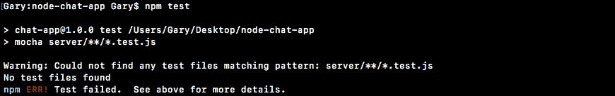

这里我们有`server-test`文件球化模式；它无法解析任何文件。我们可以通过简单地添加一个测试文件来解决这个问题。我将为消息实用程序`message.test.js`添加一个测试文件。现在我们可以继续运行`npm test`命令了。这一次，它确实找到了一个文件，我们看到我们没有通过测试，这是一个很好的起点:

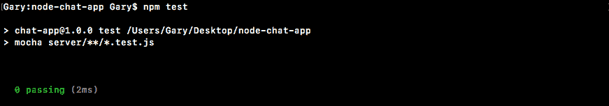

在`message.test.js`内部，我们需要为我们刚刚定义的消息函数添加一个测试。现在这个测试将验证我们得到的对象是我们所期望的，给定我们传入的参数。我们将一起建立测试文件的基本结构，您将编写单独的测试用例。

首先，我们需要使用`var expect = require('expect')`加载 Expect。这将让我们断言`generateMessage`函数的返回值:

```js
var expect = require('expect');
```

接下来我们要做的是添加一个`describe`块。这里，我们将为函数`generateMessage`添加一个`describe`块，在回调函数中，我们将拥有该函数的所有测试用例:

```js
describe('generateMessage', () => {

});
```

在我们实际创建测试用例并填写之前，我们确实需要加载我们正在测试的模块。我将创建一个变量并使用 ES6 析构。我们将关闭`generateMessage`，然后我们可以继续使用`require`要求它，指定本地路径，`./message`:

```js
var expect = require('expect');
var {generateMessage} = require('./message');

describe('generateMessage', () => {

});
```

它与我们当前所在的测试文件在同一个目录中，因此没有理由进行任何目录移动。有了这些，我们现在可以添加单独的测试用例`it ('should generate the correct message object')`。这将是一个同步测试，所以不需要提供 done。你所需要做的就是用两个值调用`generateMessage`，`from`和`text`。您将获得响应，并将响应存储在变量中:

```js
describe('generateMessage', () => {
  it('should generate correct message object', () => {
    //store res in variable
  });
});
```

然后，您将对响应做出一些断言。首先，断言 from 是正确的，断言 from 与您传入的值匹配。您还将断言文本匹配，最后您将断言`createdAt`值是一个数字:

```js
var expect = require('expect');
var {generateMessage} = require('./message');

describe('generateMessage', () => {
  it('should generate correct message object', () => {
    // store res in variable
    // assert from match
    // assert text match
    // assert createdAt is number
  });
});
```

它是什么数字并不重要；您将使用`toBeA`方法检查类型并断言`createdAt`是数字。要做到这一点，我首先要做的是定义一些变量。

首先，我将创建一个 from 变量来存储 from 值。我会继续使用`Jen`。我还将创建一个`text`变量来存储文本值，`Some message`。现在我要做的是使我的最终变量，它将存储响应，从`generateMessage`函数返回的`message`，这正是我要调用的。我将调用`generateMessage`传递两个必要的参数，即`from`参数和`text`参数:

```js
describe('generateMessage', () => {
  it('should generate correct message object', () => {
    var from = 'Jen';
    var text = 'Some message';
    var message = generateMessage(from, text);
```

接下来，也是最后一件事，我们需要做的是对这个返回的对象进行断言。我预计`message.createdAt`是一个使用`toBeA`并传入类型`number`的数字:

```js
describe('generateMessage', () => {
  it('should generate correct message object', () => {
    var from = 'Jen';
    var text = 'Some message';
    var message = generateMessage(from, text);

    expect(message.createdAt).toBeA('number');
```

这是验证属性是否正确所需的第一个断言。接下来，我们将进入`expect`消息内部具有某些属性。我们将使用`toInclude`断言来实现这一点，尽管您可以创建两个单独的语句:一个用于`message.from`，另一个用于`message.text`。所有这些都是有效的解决方案。我将只使用`toInclude`并指定消息应该包括的一些内容:

```js
expect(message.createdAt).toBeA('number');
expect(message).toInclude({

});
```

首先，它应该有一个等于变量的属性。我们可以继续使用 ES6 来定义它；同样的事情也将发生在`text`，`text`应该等于`text`，我们将使用 ES6 来设置它。我们甚至可以使用`from, text`进一步简化:

```js
expect(message.createdAt).toBeA('number');
expect(message).toInclude({from, text});
```

有了这个地方，我们的测试用例就完成了，我们可以继续删除这些注释的大纲，您需要做的最后一件事是通过运行`npm test`从终端运行测试套件。当我们这样做的时候，我们得到了什么？我们在`generateMessage`下得到我们的一个测试，应该生成正确的消息对象，而且确实是通过了，这太棒了:


现在我们已经有了一些测试来验证我们的函数是否如预期的那样工作，让我们继续，通过进入`server.js`并将我们传递给 emit 函数的所有对象替换为对我们的新函数的调用，将它集成到我们的应用程序中。

# 将实用程序功能集成到我们的应用程序中

这个过程的第一步是导入我们刚刚创建的函数。我将在`server.js`中创建一个常数。我们将使用 ES6 析构来抓取`generateMessage`，我们将从对`require`的调用中抓取它。现在我们需要一个不同目录中的本地文件。我们将从`./`开始，进入`utils`目录，因为我们当前在`server`目录中，然后通过指定它来抓取文件消息:

```js
const socketIO = require('socket.io');

const {generateMessage} = require('./utils/message');
```

现在我们可以访问`generateMessage`，而不是创建这些对象，我们可以称之为`generateMessage`。在`socket.emit`中，我们将用参数`generateMessage ('Admin', 'Welcome to the chat app')`替换`Welcome to the chat app`和`Admin`变量:

```js
socket.emit('newMessage', generateMessage('Admin', 'Welcome to the chat app'));
```

我们有完全相同的功能，但现在我们使用一个函数来为我们生成该对象，这将使扩展变得更加容易。这也将使更新消息内部内容变得更加容易。接下来，我们可以为加入的*新用户更改下面的设置。我们将继续，并用对`generateMessage`的调用来代替它。*

这一个还是来自`Admin`所以第一个参数是字符串`Admin`，第二个参数是文本`New user joined`:

```js
socket.emit('newMessage', generateMessage('Admin', 'Welcome to the chat app'));
```

这个也做了，最后一个是一个用户真正发给用户的，也就是说我们有`message.from`和`message.text`；这些将是我们的论点。我们用这两个论点来称呼`generateMessage``message.from`，把`message.text`作为第二个论点:

```js
socket.on('createMessage', (message) => {
  console.log('createMessage', message);
  io.emit('newMessage', generateMessage('Admin', 'New user joined'));                                
```

有了这些，我们就完了。这个部分最后要做的事情是测试它是否如预期的那样工作。我将使用`nodemon`启动服务器，在`node`和`mon`、`server/server.js`之间没有空格:

```js
nodemon server/server.js
```

一旦服务器启动，我们就可以通过打开开发人员工具打开几个选项卡来进行测试。

对于第一个标签，我将访问`localhost:3000`。在控制台中，我们应该可以看到新的消息打印，即使现在是由函数生成的，对象看起来也是一样的，我们可以通过打开第二个选项卡并打开它的开发工具来测试其他一切是否也如预期的那样工作:


这一次在第一个标签页附近应该会看到一条新消息，这里有一条`New user joined`文本，仍然有效。如果我们从第二个选项卡发出自定义消息，它应该会显示在第一个选项卡中。我将使用向上箭头键运行我们之前的一个`createMessage`事件发射器。

我将启动该功能，如果我转到第一个选项卡，我们确实会收到消息，这太棒了:


这应该可以工作，打印在第一个标签页，也打印在第二个标签页，因为我们调用的是`io.emit`而不是广播方法。

既然一切都在运转，我们就完了；我们可以提交并包装这一部分。我要从终端打电话`git status`。这里我们有新文件和修改过的文件，这意味着我们要调用`git add .`。接下来，我们可以用消息标志`create generateMessage utility`呼叫`git commit`:

```js
git commit -m 'create generateMessage utility'
```

我要把这个推上 GitHub，这就是这个。在下一节中，我们将看一下`Socket.io`致谢。

# 事件确认

在本节中，您将学习如何使用事件确认。这是`Socket.io`里面一个很棒的功能。为了准确说明它们是什么，以及您为什么想要使用它们，我们将快速浏览聊天应用程序的图表。这是我们的应用程序中实际存在的两个事件，如果您还记得第一个事件是 newMessage 事件，它由服务器发出并被客户端监听，它通过 from、text 和 createdAt 属性发送，所有这些都是将消息呈现到屏幕上所必需的:


现在我们要更新的事件是创建消息事件。这个由客户端发出，由服务器监听:

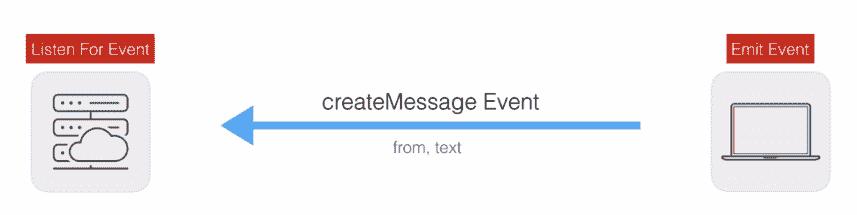

我们再一次发送一些数据。现在，我们的 createMessage 事件的问题在于数据是单向流动的。数据来自浏览器中的一个表单。然后它被发送到服务器，服务器有点卡住了。当然，数据可能是有效的，从和文本字段可能设置正确。在这种情况下，我们可以发出一个新的消息事件，将其呈现给连接到服务器的每个浏览器，但是如果服务器接收到无效数据，它就无法让客户端知道出了问题。

我们需要的是一种方式来确认我们收到了请求，并可以选择发回一些数据。在这种情况下，我们将为 createMessage 添加一个确认。如果客户端发出一个具有有效 from 和 text 属性的有效请求，我们将确认它，不发回错误消息。如果从客户端发送到服务器的数据是无效的，我们将确认它发回了错误，因此客户端确切地知道它需要做什么来发送有效的请求。现在结果看起来有点像这样，从服务器到客户端的数据流将通过回调完成:

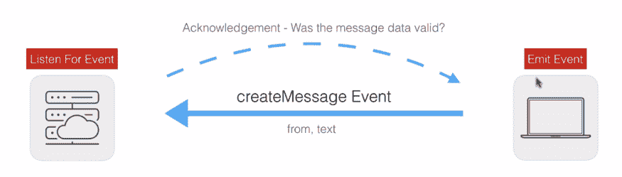

你的感谢可以是你喜欢的任何东西。在我们的案例中，可能是消息数据有效吗？如果您正在创建一个电子邮件应用程序，您可能只有在电子邮件成功发送后才会将确认信息发送回客户端。您不需要发送数据，这是我们在通过管道发送有效数据时要做的事情。我们只是简单地说，嘿，我们收到了信息，一切都很好，客户可以对此做出回应。

现在我们已经完成了这些，让我们继续将其实现到我们的应用程序中。

# 设置确认

如果你已经有了一个听众，设置确认真的没那么糟糕。你所要做的就是对听者做一个快速的改变，对发射者做一个快速的改变，一切都会如预期的那样进行。

在这种情况下，侦听器恰好在服务器上，而发送器将在客户端上，但是确认也在另一个方向工作。我可以从服务器发出一个事件，也可以从客户端确认它。

为了设置这一点，我们将使用`socket.emit`在`index.js`内部发出`createMessage`事件，并且我们将传递与否则会传递的相同的参数。第一个是事件名称`createMessage`，我们将传递一些有效的数据，一个具有这两个属性的对象。我们可以将`from`设置为类似于`Frank`的值，并且可以将`text`属性设置为类似于`Hi`的值:

```js
socket.emit('createMessage', {
  from: 'Frank',
  text: 'Hi'
});
```

现在有了这个，我们有了一个标准的事件发射器和一个标准的事件监听器。我可以继续使用`nodemon`启动应用程序，我们可以确保一切都按预期运行，`nodemon server/server.js`:

```js
nodemon server/server.js
```

一旦服务器启动，我们就可以在浏览器中访问它，我也将打开开发工具。然后我们去`localhost:3000`，你可以看到在终端里面我们有`createMessage`出现，我们也有`newMessage`出现在这里。我们有`newMessage`作为我们的小`Welcome to the chat app`问候，我们有`Frank`发出的`newMessage`:


现在这里的目标是从服务器向客户端发送一个确认，确认我们得到了数据。

# 从服务器向客户端发送确认

为了做到这一点，我们必须对监听器和发射器进行更改。如果你只改变一个，它不会像预期的那样起作用。我们将从事件发射器开始。我们需要一种方法，在确认从服务器发送回客户端时运行一些代码。

# 更新事件发射器

为了向客户端发送确认`d=from`服务器，我们将添加第三个参数，它将是一个回调函数。当确认到达客户端时，这个函数将会启动，我们可以做任何我们喜欢的事情。现在我们只使用`console.log('Got it')`打印:

```js
socket.emit('createMessage', { 
  from: 'Frank', 
  text: 'Hi' 
}, function () { 
  console.log('Got it'); 
}); 
```

现在，这就是我们需要做的所有事情，以向客户添加一个确认。

# 更新事件侦听器

在服务器上也很简单；我们将在`callback`参数列表中添加第二个参数。第一个仍然是发出的数据，第二个仍然是我们称之为`callback`的函数。我们可以在`socket.on`的任何地方打电话确认我们收到了请求:

```js
socket.on('createMessage', (message, callback) => {
  console.log('createMessage', message);
  io.emit('newMessage', generateMessage(message.from, message.text));
  callback();
```

当我们调用这个函数时，就像我们将在这里调用它一样，它反过来将事件发送回前端，并且它将调用我们在`index.js`中的事件发射器中拥有的函数。

这意味着，如果我保存了这两个文件，我们可以在浏览器中进行确认。我要刷新应用程序，我们会得到什么？我们明白了。


这意味着我们的数据成功地进入了服务器；我们可以证明，通过在终端中看到`console.log`语句，服务器确认它通过调用回调获得了数据:


在开发者工具中，得到了打印。

现在，确认非常有用，但是当您发回数据时，它们甚至更有用。例如，如果消息的数据无效，我们可能会想要发回一些错误，稍后我们会做一些事情。不过现在，我们可以通过发送我们想要的任何东西来确认。

我们通过向回调提供一个参数来发回数据，如果您想添加多个东西，只需指定一个对象，添加任意多的属性。然而，在我们的例子中，我们可以发送一个字符串作为`callback`的唯一参数。我将把我的字符串设置为`This is from the server`:

```js
socket.on('createMessage', (message, callback) => {
  console.log('createMessage', message);
  io.emit('newMessage', generateMessage(message.from, message.text));
  callback('This is from the server.');
});
```

这个字符串将被传递到回调中，并在`index.js`中结束在我们的回调中。这意味着我可以为这个值创建一个变量，我们可以称之为`data`或任何你喜欢的东西，我们可以把它打印到屏幕上或用它做一些事情。现在，我们将把它打印到屏幕上:

```js
socket.emit('createMessage', {
  from: 'Frank',
  text: 'Hi'
}, function (data) {
  console.log('Got it', data);
});
```

如果我保存`index.js`，我们可以测试一切都如预期的那样工作。我将继续刷新应用程序，我们会看到什么？


我们看到得到了，这意味着我们得到了确认，我们看到了数据，从服务器发送到客户端的数据。

确认在实时应用中起着重要的作用。让我们回到电子邮件应用程序的例子，想象一下，当我发送电子邮件时，我输入了一些值，如 to 值和文本值。我想得到一个回复，要么邮件发送成功，要么邮件没有发送，在这种情况下我想知道为什么；也许这是一个表单错误，我可以向用户显示一些错误消息，或者服务器因维护或类似原因而停机。

无论哪种方式，确认都允许请求侦听器向请求发送器发回一些东西。现在我们知道如何使用确认，我们将把它们集成到我们的应用程序中。这将在下一节中出现，因为我们在`index.html`文件中添加了一个实际的表单字段，用户可以在其中提交新消息并查看它们。

# 消息表单和 jQuery

在本节中，您将向您的`index.html`文件添加一个表单域。这将在屏幕上呈现一个输入字段和一个按钮，用户将能够与之交互，而不是必须从开发工具中调用`socket.emit`，这对于真正的用户来说不是一个可持续的选项。这仅适用于美国开发人员。

现在为了开始，我们将编辑`index.html`，然后我们将进入`index.js`。我们将添加一个等待表单提交的侦听器，在该侦听器回调中，我们将使用字段中键入的数据来触发`socket.emit`。我们还将花一些时间将所有传入的消息呈现到屏幕上。在这一节的最后，我们将有一个丑陋的，但工作，聊天应用程序。

# 使用 jQuery 库

在我们做任何事情之前，我们将使用一个名为 jQuery 的库来进行 DOM 操作，这意味着我们希望能够用我们呈现的 HTML 做一些事情，但是我们希望能够从我们的 JavaScript 文件中做这些事情。我们将使用 jQuery 来简化跨浏览器兼容性。要获取这个库，我们将前往谷歌浏览器，转到[jquery.com](http://jquery.com/)，您可以获取最新版本。版本在这里无关紧要，因为我们使用的是所有版本都有的基本功能:

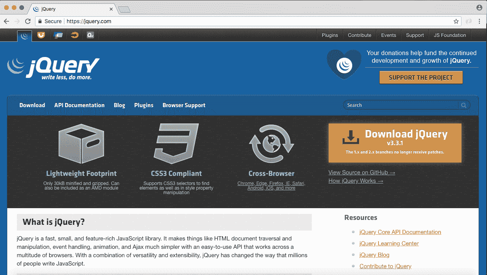

我会抓取最新的 3.3.1 版本。然后，我将继续下载压缩的生产版本，方法是右键单击并在新选项卡中打开它:

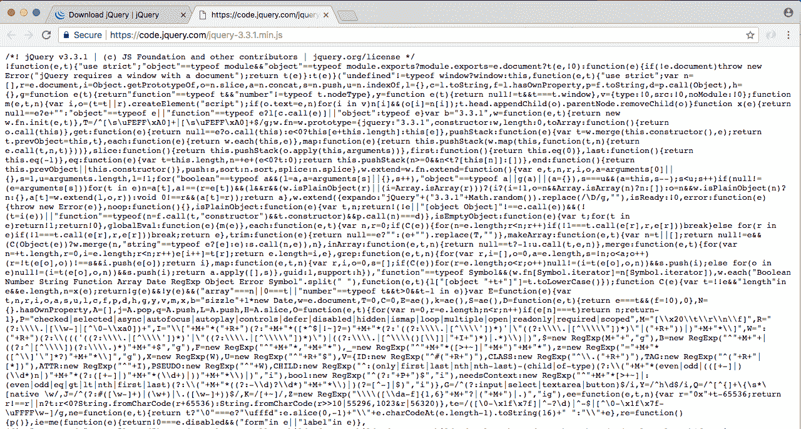

这里我们有实际的 JavaScript，我们想要加载到我们的应用程序中，这意味着我们可以右键单击某种空白区域，单击另存为，并进入我们的项目文件夹，`Desktop` | `node-chat-app` | `public` | `js`。在`js`内部，我将创建一个名为`libs`的新目录，我们将在其中存储第三方 JavaScript。在本节中，我们将使用更多的客户端 JavaScript 库，所以创建一个文件夹来保持组织是很好的。我将把它保存在那里，关闭标签和下载区，现在我们可以继续加载到`index.html`并添加我们的表单。

# 在 index.html 添加表单域

就在`socket.io`和`index.js`之间，我们将添加一个新的脚本标签来加载到 jQuery 中。我们必须用文件`/js/libs`的路径指定`src`属性，后跟正斜杠和文件名`jquery-3.3.1.min.js`:

```js
<script src="/socket.io/socket.io.js"></script>
<script src="/js/libs/jquery-3.3.1.min.js"></script>
<script src="/js/index.js"></script>
```

现在让我们开始设置我们的`form`标签；这将向浏览器呈现我们的表单域。如果你不熟悉这些标签，那很好，只要跟着我，我会边走边解释。

# 设置表单标签

第一步，我们需要一个`form`标签；这将创建一个可由用户提交的表单。这正是我们要用来提交信息的东西。在这个`form`标签上，我们将添加一个属性；正是`id`属性让我们给这个元素一个唯一的标识符，使得稍后用我们的 JavaScript 定位变得非常容易:

```js
<form id>

</form>
```

Remember, we're going to want to add a listener to this element. When the form gets submitted, we're going to want to do something in our JavaScript file. Notably what we're going to want to do is call `socket.emit`.

我将设置`id`等于，在引号内，`message-form`:

```js
<form id="message-form">

</form>
```

现在我们已经完成了表单标签，我们可以在其中添加一些标签。首先，我们要添加一个`button`，它将出现在`form`的`bottom`上。这个`button`点击就要提交了`form`。我正在打开和关闭我的标签，在里面我可以输入任何我想出现在`button`上的文本。我要用`Send`了:

```js
<form id="message-form">
  <button>Send</button>
</form>
```

# 添加文本字段

现在我们已经准备好了`button`，我们唯一需要做的就是添加小文本字段。这将是用户输入消息的文本字段。这将要求我们使用一个`input tag`，而不是打开和关闭一个`input`标签，我们将使用自关闭语法:

```js
<form id="message-form">
  <input/>
  <button>Send</button>
</form>
```

因为我们不需要像对`button`或`form`那样在里面放入任何东西，我们将在输入中添加相当多的属性，首先是名称，我们想给这个字段一个唯一的名称，类似`message`的东西将完成工作。我们还想继续设置类型。`input`标签有很多不同的类型。类型可以包括像复选框这样的东西，或者在我们的例子中，我们将在引号内使用的类型是`text`:

```js
<input name="message" type="text"/>
```

我们要添加到`input`的最后一个属性叫做`placeholder`。我们将这个值设置为，在引号内，一个字符串。在用户真正输入一个值之前，这个字符串将以浅灰色呈现在字段中。我要告诉用户这是他们的`Message`去的地方:

```js
<form id="message-form">
  <input name="message" type="text" placeholder="Message"/>
  <button>Send</button>
</form>
```

有了这个，我们实际上可以测试我们表单的渲染。

# 测试表单的呈现

我们可以从服务器开始使用`nodemon`进行测试:

```js
nodemon server/server.js
```

服务器开了，我要去谷歌 Chrome，去`localhost:3000`。你会注意到一些很酷的东西，我实际上还没有访问过这个网址，但是你可以看到连接已经发生了。Chrome 做了一些懒加载，如果它认为你要去一个网址，它实际上会发出请求；所以当我访问它时，它的加载速度会更快。现在如果我访问`localhost:3000`我们会得到什么？

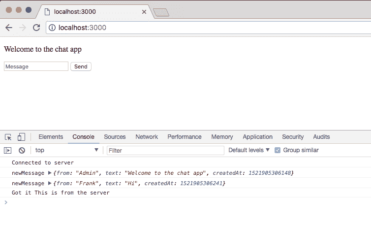

我们得到了我们的小表格，我们可以输入类似`Test`的信息，然后发送出去。现在默认形式都是很老派的。如果我尝试提交这个表单，它实际上会经历一次完整的页面刷新，然后它会添加数据，就像我们的消息文本一样，作为 URL 上的查询字符串。这不是我们想做的，我们想在表单提交时运行一些自定义的 JavaScript。因此，我们将附加一个自定义事件侦听器，并覆盖默认行为。为了做到这一点，我们必须使用 jQuery，我们需要选择这个`form`字段。

# 使用 jQuery 选择元素

在我们进入`index.js`之前，让我们花一点时间来谈谈如何使用`jQuery`来选择元素。可通过`jQuery`变量访问的`jQuery`将您的选择器作为其参数。然后，我们将添加一个字符串，我们可以选择我们的元素。例如，如果我们想选择屏幕上的所有段落标记，我们可以在引号中键入`p`:

```js
jQuery('p');
```

如果你熟悉的话，它们和 CSS 选择器非常相似，如图所示，我们已经选择了段落标签。

我也可以选择我的程序中的所有`div`，或者我可以按 ID 或类选择元素，这就是我们要做的。为了通过 ID 选择一个元素，我们首先以井号(`#`)开始，然后输入名称。在我们的例子中，我们有一个名为`message-form`的`form`，如果我把它发射出去，我们确实会得到它:

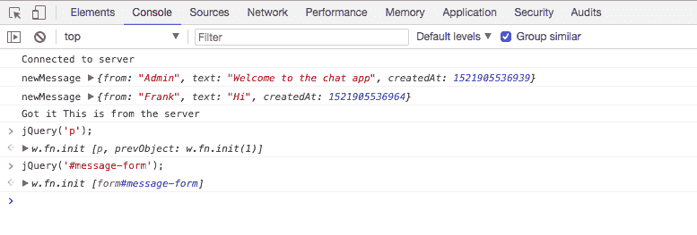

这将允许我们添加一个事件监听器。

# 将选择器元素添加到 index.js

在`index.js`内部，我们将在底部附近添加完全相同的选择器`jQuery`，用我们的选择器`#message-form`来调用它。现在我们将添加一个事件侦听器，该事件侦听器看起来与我们的`Socket.io`事件侦听器非常相似。我们将调用并提供这两个参数，引号内的事件名称，`submit`，以及一个`function`，当用户试图提交`form`时将会触发:

```js
jQuery('#message-form').on('submit', function(){

});
```

现在不同于我们的`Socket.io`事件监听器，我们将在`function`中得到一个参数，一个`e`事件参数，我们需要访问这个。我们需要访问这个事件参数，以便覆盖导致页面刷新的默认行为。就在这里，我们将呼叫`e.preventDefault`:

```js
jQuery('#message-form').on('submit', function(){
  e.preventDefault();
});
```

`preventDefault`方法防止事件的默认行为，默认情况下，提交事件会经历页面刷新过程。

我们可以通过进入谷歌浏览器，给页面一次刷新，来测试一切是否正常。我还将从 URL 中删除查询字符串。现在我们可以输入类似`test`的信息，点击发送，你可以看到什么都没有发生。因为我们覆盖了默认行为，所以什么都没有发生，我们所需要做的就是调用`index.js`中的`socket.emit`。我们要发射`createMessage`:

```js
jQuery('#message-form').on('submit', function(){
  e.preventDefault();

  socket.emit('createMessage', {

  });
});
```

然后，我们将继续提供我们的数据。现在名称`from`字段将会是大写的`User`。我们将暂时保持匿名，尽管我们稍后会更新。现在对于文本字段，这将来自`form`。我们想要添加一个选择器，并取回值。让我们继续使用`jQuery`进行操作:

```js
  socket.emit('createMessage', { 
    from: 'User', 
    text: jQuery('')
  })
});
```

我们将再次调用`jQuery`，我们将选择`index.html`文件中的输入。我们可以选择它的名字`name="message"`:

```js
<input name="message" type="text" placeholder="Message"/> 
```

为了做到这一点，我们将在`index.js`中的`socket.emit`处打开括号，将`name`设置为`message`。这将选择任何具有等于`message`的`name`属性的元素，这只是我们的一个元素，我们可以使用`.val`方法获得它的值:

```js
  socket.emit('createMessage', { 
    from: 'User', 
    text: jQuery('[name=message]').val();
  })
});
```

不需要分号，因为我们在对象创建内部。有了这些，我们现在可以继续添加我们的回调函数进行确认了。就目前而言，它并没有真正做什么，但这很好。我们必须添加它，以实现我们目前已有的确认设置:

```js
jQuery('#message-form').on('submit', function (e) {
  e.preventDefault();

  socket.emit('createMessage', {
    from: 'User',
   text: jQuery('[name=message]').val()
  }, function () {

  })
});
```

现在我们已经设置好了事件侦听器，让我们继续测试一下。

# 测试更新事件侦听器

我将返回 Chrome，刷新页面，输入类似`This should work`的消息，当我们提交表单时，我们会看到它以新消息的形式出现在这里:


我要把它发送出去，你可以看到就在终端内部，我们有一个用户发送`This should work`，它也显示在 Chrome 中:

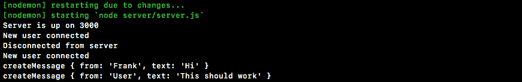

如果我打开第二个连接，我将打开开发人员工具，这样我们就可以确切地看到幕后发生的事情。我要输入一些类似`From tab 2`的信息，发送出去:


我们应该在表 1 中看到，我们做到了:

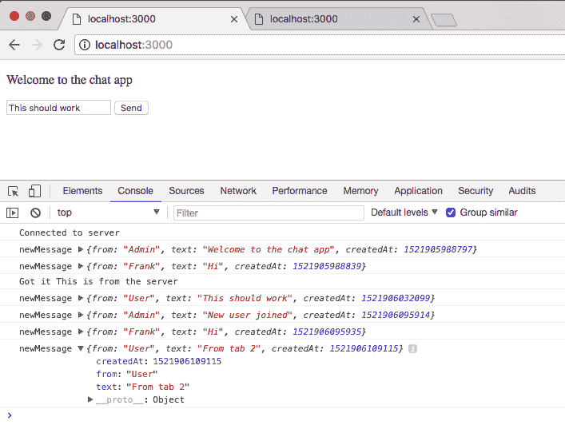

太好了，一切都在按预期进行。现在显然设置还没有完成；我们希望在发送消息后清除表单值，并希望处理一些其他与 UI 相关的事情，但目前它运行得相当好。

有了基本的表单，我们要做的第二件事是将传入的消息呈现到屏幕上。现在它又一次看起来很丑，但它会完成工作。

# 将传入消息呈现在屏幕上

为了做到这一点，我们必须在我们的 DOM 中创建一个位置，在我们的`index.html`文件中，我们可以在那里呈现消息。我们将再次给这个元素一个我们可以在`index.js`中轻松访问的标识，这样我们就可以呈现这些消息。

# 创建有序列表以呈现消息

首先，我们要做的是通过创建一个`ol`标签来创建一个有序列表，如下所示:

```js
<body>
  <p>Welcome to the chat app</p>
  <ol></ol>
```

这个列表将让我们向其中添加项目，这些项目将是单独的消息。现在我们将赋予它一个`id`属性。我要打电话给`id`，在这种情况下，`messages`:

```js
<ol id="messages"></ol>
```

现在这就是我们在`index.html`所需要做的，所有的重担都将发生在`index.js`内部。当一条新消息进来时，我们希望在有序列表中添加一些东西，以便呈现在屏幕上。

在`index.js`内部，当新消息到达时，我们可以通过修改回调函数来实现这一点。

# 使用 jQuery 在 index.js 中创建元素

我们要做的第一件事是创建一个列表项，我们将使用 jQuery 再次这样做。我们将制作一个变量，这个变量将被称为`li`，我们将继续使用稍微不同的 jQuery:

```js
socket.on('newMessage', function (message) {
  console.log('newMessage', message);
  var li = jQuery();
});
```

我们将使用`jQuery`创建一个元素，而不是使用`jQuery`选择一个元素，然后我们可以修改该元素并将其添加到标记中，使其可见。在报价中，我们将打开和关闭一个`li`标签，就像在`index.html`中一样:

```js
socket.on('newMessage', function (message) {
  console.log('newMessage', message);
  var li = jQuery('<li></li>');
});
```

现在我们已经准备好了，我们必须继续设置它的文本属性，我将设置`li.text`，通过用我想要使用的值调用`li.text`。

在这种情况下，文本将要求我们设置一个小模板字符串，在模板字符串中，我们将继续使用返回的数据。现在我们将使用`from`属性和`text`属性。让我们从谁是`from`开始，然后我们将添加一个小冒号和一个空格来将其与实际的`message`分开，最后，我们将在最后注入`message.text`:

```js
var li = jQuery('<li></li>');
li.text(`${message.from}: ${message.text}`);
```

现在，我们已经创建了一个元素，但是还没有将其渲染到 DOM 中。我们要做的是使用`jQuery`来选择我们创建的全新元素，我们给它一个`messages`的 ID，我们要通过调用`append`方法来给它`append`一些东西:

```js
var li = jQuery('<li></li>');
li.text(`${message.from}: ${message.text}`);

jQuery('#messeges').append
```

这将添加它作为它的最后一个子项目，所以列表中已经有三个项目；最新的一个将显示在这三个下面，作为我们订单中的第四个项目。我们所要做的就是调用`append`作为函数，传入我们的列表项:

```js
var li = jQuery('<li></li>');
li.text(`${message.from}: ${message.text}`);

jQuery('#messeges').append(li);
});
```

有了这些，我们就完了。如果你不熟悉`jQuery`的话，这可能会有点让人不知所措，但是我保证我们在这里使用的技巧会贯穿全书。最终，你会更容易选择和创建元素。

# 测试传入消息

让我们继续在谷歌浏览器中测试一下。我将刷新选项卡 1，当我刷新时，您可以看到我们的两条消息，欢迎使用聊天应用程序出现，弗兰克说嗨:

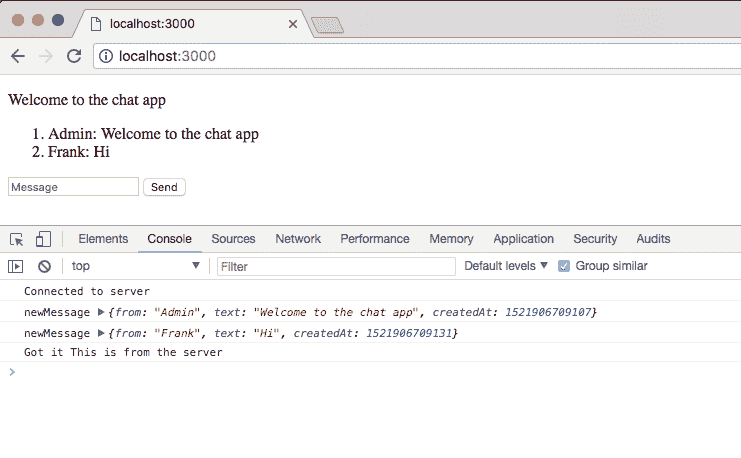

现在欢迎来到聊天应用程序应该会出现。弗兰克嗨消息来自`index.js`内部的`socket.emit`:

```js
socket.emit('createMessage', { 
  from: 'Frank', 
  text: 'Hi' 
}, function (data) { 
  console.log('Got it', data); 
}); 
```

我们实际上可以继续删除它，我们不再需要自动发出消息，因为我们已经设置了一个`form`来完成它。我们可以再次保存文件，刷新浏览器，这次我们有了一个不错的小设置，欢迎来到聊天应用:


我将为我们的第二个标签做同样的事情。这一次，我们获得了聊天应用程序的欢迎，在第一个选项卡中，我们获得了新用户的加入；这太棒了:


现在真正的测试将是从一个选项卡向另一个选项卡发送消息，`This should go to tab 2`。我将把这个发送出去，当我点击这个按钮时，它将发出一个事件，这个事件将被发送到服务器，服务器将把它发送给所有连接的人:

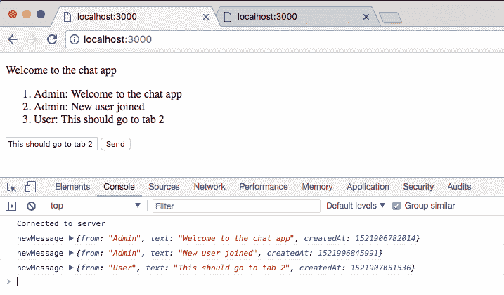

在这里，我可以看到这应该转到选项卡 2 渲染，在我的第二个选项卡中，我们也得到消息:


现在我们还没有完全完成用户界面或实际的用户体验；自定义名称和时间戳即将出现，但我们确实有了一个奇妙的开始。我们现在有了一个表单，我们可以在其中提交消息，并且可以在浏览器中看到所有传入的消息，这意味着我们不再需要在开发工具中执行任何发送或读取消息的操作。这一次就这样了，现在我们有了一些工作上的变化，让我们通过提交来总结一下。

# 提交消息表单

我将关闭服务器，清除输出，并运行`git status`以便我们可以再次检查所有的更改；这里一切看起来都很好:

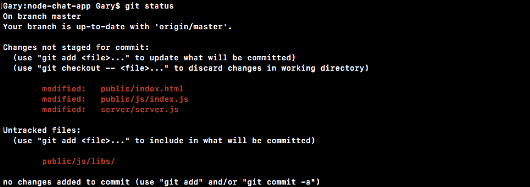

我将使用`git add`将所有文件添加到 repo 中，包括我未跟踪的 jQuery 文件。然后我用`git commit`做了`commit`。我将在这里使用`-m`标志，这个标志的一个好消息是`Add form for messages and show incoming messages in browser`:

```js
git commit -m 'Add form for messages and show incoming messages in browser'
```

一旦我们有了这个，我们就可以继续把这个上传到 GitHub。我将花一点时间部署到 Heroku，现在我们有一些真实的、可见的和有形的东西可以使用；`git push heroku master`要做到这一点:

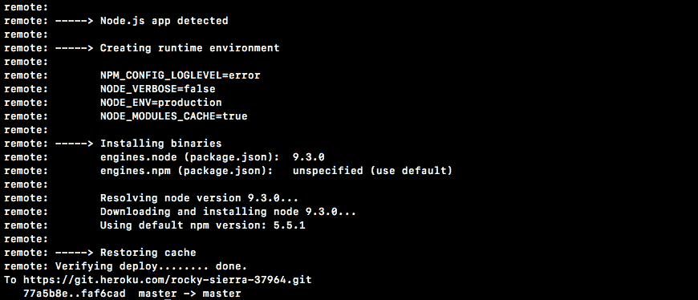

一旦完成，我们将能够在浏览器中访问它。正如你在我的控制台里面看到的，`Socket.io`正在尝试重新连接到服务器。不幸的是，我们不会将它恢复，所以它会尝试更长一点的时间。

我们在这里，我们正在验证部署，一切正常运行。你可以运行`heroku open`或者直接复制网址。我将关闭我的两个本地主机选项卡，并打开真正的 Heroku 应用程序。

就在这里，我们确实收到了欢迎加入聊天应用程序的消息，我们确实收到了我们的表单；到目前为止，一切看起来都很好。我将继续打开一个不同的浏览器，比如 Safari。我也要去聊天应用，我们要把这些窗口并排放在一起。在 Safari 中，我将输入一条小消息，`This is live on Heroku`，点击发送或点击*输入*键，它会立即显示在另一个标签中的另一个浏览器中。这是因为我们的实时套接字服务器正在传输这些数据:


这可能发生在世界上的任何计算机之间，你不需要在我的机器上，因为我们使用的是一个真正的英雄库网址。既然 Heroku 的一切都在进行中，我们就完成了。

# 地理定位

在本节中，您将开始地理定位两部分系列的第一部分。我们不只是来回发送文本，我们还将设置它，这样我就可以将我的实际坐标、经度和纬度发送给连接到聊天应用程序的其他人。然后我们可以渲染一个链接，这个链接可以去任何我们想去的地方；在我们的例子中，我们将设置它来拉一个谷歌地图页面，在那里发送他们位置的用户的实际位置被标记。

现在要真正获取用户的位置，我们将使用地理定位应用编程接口，它在您的客户端 JavaScript 中可用，并且它实际上是一个非常受支持的应用编程接口。它可以在所有现代浏览器上使用，无论是移动浏览器还是桌面浏览器，通过谷歌`geolocation api`和寻找 MDN 文档页面可以找到文档。

MDN 文档，或 Mozilla 开发者网络，是我最喜欢的客户端技术文档，例如您的网络应用编程接口、您的 CSS 和您的 HTML 指南:

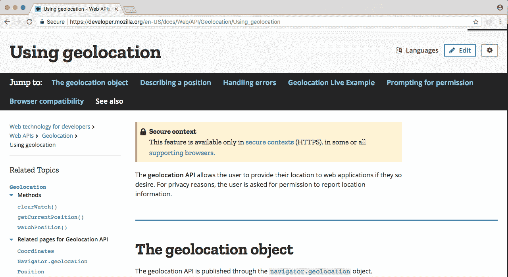

正如我提到的，这是一个很受支持的功能，除了旧版本的 Internet Explorer 和 Opera Mini 浏览器，你几乎可以在任何地方使用它。但是你所有主要的桌面和移动浏览器都将支持这一点，如果浏览器是旧的，我们将设置一条小消息，让他们知道他们的浏览器不支持地理定位。如果您想了解更多关于地理定位的信息，或者探索我们在本节中没有涉及的功能，您可以参考本页，尽管我们将使用地理定位提供的大部分功能。

# 向应用程序添加“发送位置”按钮

首先，我们要做的是在应用程序中添加一个新按钮。它将位于“发送”旁边，并会显示类似“发送位置”的内容。当用户点击发送位置按钮时，我们将使用地理定位应用编程接口。通常，这将需要用户确认他们想要在浏览器中与这个选项卡共享他们的位置，弹出框将会出现，它将由浏览器触发，没有办法。

你需要确保用户确实想分享他们的位置。一旦你有了坐标，你将发出一个事件，它将被发送到服务器，服务器将把它发送给所有其他连接的用户，我们将能够在一个漂亮的链接中呈现这些信息。

为了开始，我们将添加那个按钮，这将是启动整个过程的按钮。在 Atom 内部，在`index.html`内部，我们将在`form`标签的正下方添加一个按钮。它将在我们现有的形式之外。我们将添加`button`标签，并给它一个`send-location`的 ID。现在，对于可见的`button`文本，我们可以继续使用`Send` `Location`作为我们的字符串，并保存文件:

```js
  <form id="message-form"> 
    <input name="message" type="text" placeholder="Message"/> 
    <button>Send</button> 
  </form> 
  <button id="send-location">Send Location</button> 
```

如果我们继续在浏览器中刷新我们的应用程序，我们现在应该会看到我们的“发送位置”按钮出现了:


我们将在稍后添加默认样式时修复所有这些问题，但目前这确实完成了工作。

现在点击这个按钮目前不会做任何事情，它没有绑定到一个`form`所以它不会做任何奇怪的`form`提交或页面重载。我们只需要在这个按钮上添加一个`click`监听器，我们就可以运行任何我们喜欢的代码。在我们的例子中，我们将运行地理定位代码。

# 向“发送位置”按钮添加点击监听器

我们将在 Atom 内部`index.js`内部添加一个`click`监听器，我们将在底部附近添加一些代码。

现在我要做的第一件事就是创建一个变量，我要把这个变量叫做`locationButton`；这将存储我们的选择器。这是针对我们刚刚创建的按钮的 jQuery 选择器，因为我们需要多次引用它，并且将它存储在一个变量中，这样就不需要再次进行这些调用。我们将像调用其他选择器一样调用`jQuery`，传递一个参数，一个字符串，我们通过 ID 选择一些东西，这意味着我们必须从那个散列符号(`#`)开始，实际的 ID 是`send-location`:

```js
var locationButton = jQuery('#send-location');
```

既然我们已经准备好了，我们可以继续做我们喜欢做的事情。在我们的例子中，我们要做的是添加一个点击事件，当有人点击那个按钮时，我们要做一些事情。为了完成这项工作，我们将进入`locationButton.on`:

```js
var locationButton = jQuery('#send-location');
locationButton.on
```

This is identical to doing the `jQuery`, selecting the ID `send-location`, both of these are going to do the same thing. The benefit of the first solution is that we have a reusable variable,, which we are going to reference later on. Making two jQuery calls to the same selector, wastes time because it is going to require jQuery to manipulate the DOM, fetching that information, and that's expensive.

`locationButton.on`将成为我们的事件倾听者。我们正在收听`click`事件，第一个论点的内部引用，第二个论点将一如既往地是我们的`function`:

```js
var locationButton = jQuery('#send-location');
locationButton.on('click', function () {

});
```

当有人点击按钮时，这个函数就会被调用。

# 检查对地理定位应用编程接口的访问

现在我们要做的就是检查用户是否可以访问地理定位应用编程接口。如果他们没有，我们想打印一条信息。

我们将创建一个`if`语句。地理定位 API 存在于`navigator.geolocation`上，如果不存在，我们想运行一些代码:

```js
var locationButton = jQuery('#send-location');
locationButton.on('click', function () {
  if(navigator.geolocation){

  }
});
```

所以我们要翻转它。如果导航器上没有地理定位对象，我们想做点什么。我们将使用`return`来阻止函数的其余部分执行，我们将调用所有浏览器中可用的`alert`函数，该函数会弹出一个默认的警告框，让您单击确定:

```js
if(navigator.geolocation){
  return.alert()
}
```

我们将使用这个，而不是一个更高级的模式。如果您正在使用类似 Bootstrap 或 Foundation 的东西，您可以实现它们的内置工具之一。

不过，现在我们将使用`alert`，它只接受一个参数(一个字符串，您的消息)`Geolocation not supported by your browser`:

```js
var locationButton = jQuery('#send-location');
locationButton.on('click', function ()
  if (!navigator.geolocation) {
    return alert('Geolocation not supported by your browser.');
  }
```

现在，不支持这一点的用户将会看到一点消息，而不是怀疑是否真的发生了什么。

# 获取用户的位置

为了真正获取用户的位置，我们将使用地理定位上可用的函数。为了访问它，我们将在`if`语句旁边的`locationButton.on`函数中添加`navigator.geolocation.getCurrentPosition`。`getCurrentPosition`功能是启动流程的功能。它会主动为用户获取坐标。在这种情况下，它将基于浏览器找到坐标，这需要两个函数。第一个是你的`success`功能，在这里我们可以添加我们的第一个回调。这将被称为位置信息，我们将命名这个参数`position`:

```js
  navigator.geolocation.getCurrentPosition(function (position) { 
  } 
}); 
```

`getCurrentPosition`的第二个参数是如果出现问题，我们的错误处理程序。我们将创建一个`function`，当我们无法使用`alert`获取位置时，我们将向用户提示一条消息。让我们继续第二次呼叫`alert`，打印类似`Unable to fetch location`的信息:

```js
  navigator.geolocation.getCurrentPosition(function (position) { 

  }, function() {
    alert('Unable to fetch location.');
  });
});
```

这将打印`if`有人被提示与浏览器共享他们的位置，但他们点击了拒绝。我们要说`Hey, we can't fetch the location if you don't give us that permission`。

现在只剩下成功案例了。这就是我们要去的地方。但在此之前，让我们先把它记录到屏幕上，这样我们就可以看一看`position`参数内部发生了什么:

```js
  navigator.geolocation.getCurrentPosition(function (position) {
    console.log(position);
      }, function () {
    alert('Unable to fetch location.');
  });
});
```

我将把这个记录到屏幕上，我们的服务器将重新启动，在谷歌浏览器中，我们可以打开开发者工具，刷新页面，并点击发送位置按钮。现在这将适用于桌面和移动设备。一些移动浏览器会要求你在 HTTPS，这是我们为 Heroku 设置的，因为你知道 Heroku 的网址是安全的，这意味着它不能在本地主机上工作。您可以通过将应用程序部署到 Heroku 并在那里运行来测试您的移动浏览器。不过现在，我可以点击发送位置。这将继续并开始这个过程；该过程可能需要一秒钟:

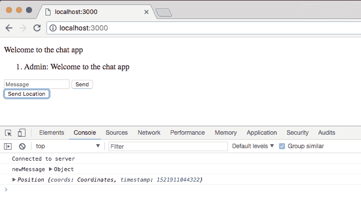

如你所见，我得到了我的地理位置。但我从未被提示是否要分享我的位置；那是因为我已经允许了。在右上角，我可以继续点击清除这些设置，以便将来访问，这意味着我需要重新授权。如果我刷新页面并再次单击发送位置，您将看到这个小框，它可能会为您显示。你可以阻止它，如果我阻止它，它将打印无法获取位置；或者你可以接受。

我将再次清除这些设置，刷新页面，这次我将接受位置共享，我们将在控制台中打印地理位置:

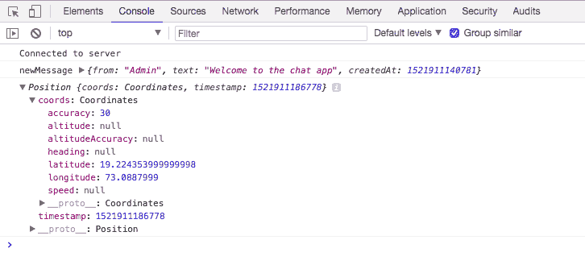

现在，一旦我们得到了它，我们就可以开始深入研究了，对象本身非常简单，我们有一个确切的获取数据时间的时间戳，如果您正在跟踪一个用户，而我们没有这样做，这是非常有用的。我们也有我们的坐标，我们有各种我们不打算使用的属性，比如`accuracy`、`altitude`，它们不存在，还有其他相关的属性。我们还有`speed`也就是`null`。我们唯一要在这个物体上使用的两个是`latitude`和`longitude`，它们确实存在。

这是我们想要传递给服务器的信息，这样服务器就可以把它发送给其他人。这意味着我们要进入`position`对象，进入`coords`对象，抓住那两个。

# 在用户位置添加坐标对象

让我们在 Atom 内部继续这样做，我们将把`socket.emit`和`emit`称为一个全新的事件，一个我们还没有注册的事件。我们将这个叫做`createLocationMessage`:

```js
navigator.geolocation.getCurrentPosition(function (position) {
  socket.emit('createLocationMessage', {
  });
});
```

`createLocationMessage`事件不打算拿标准文本；相反，它将采用那些`longitude`和`latitude`坐标。我们将从`latitude`开始指定两者；我们想将`latitude`设为等于`position.coords.latitude`。这是我们在控制台内部探索的变量，我们将对`longitude`做同样的事情，将其设置为`position.coords.longitude`:

```js
navigator.geolocation.getCurrentPosition(function (position) {
  socket.emit('createLocationMessage', {
    latitude: position.coords.latitude,
    longitude: position.coords.longitude
  });
```

现在我们已经准备好了，我们实际上可以继续在服务器上监听这个事件，当我们得到它时，我们要做的是将上面的数据传递给所有连接的用户。

# 与连接的用户传递坐标数据

让我们继续在`server.js`内完成，注册一个新的事件监听器。我将删除`createMessage`中不再需要的旧的注释掉的广播呼叫。就在`createMessage`下面，我们将再次调用`socket.on`，为这个事件指定一个监听器`createLocationMessage`，就像我们在`index.js`里面定义的那样。现在我们使用 ES6，因为我们在节点中，这意味着我们可以继续设置我们的箭头功能。我们将有一个论点，这将是`coords`，我们可以继续完成箭头功能。

```js
  socket.on('createMessage', (message, callback) => { 
    console.log('createMessage', message); 
    io.emit('newMessage', generateMessage(message.from, message.text)); 
    callback('This is from the server.'); 

}); 

  socket.on('createLocationMessage', (coords) => { 

}); 
```

在这里，我们可以运行任何我们喜欢的代码。目前，我们所要做的就是`emit`一个`newMessage`事件传递坐标，尽管在本章的后面，我们会让它变得更好，为谷歌地图设置那个网址。不过，现在我们将把`io.emit`、`emit`称为`newMessage`事件，并通过调用`generateMessage`提供必要的数据:

```js
socket.on('createLocationMessage', (coords) => {
  io.emit('newMessage', generateMessage)
});
```

现在`generateMessage`将获取一些假的用户名，我将继续输入`Admin`，我们将设置文本，现在我们将简单地将其设置为坐标。让我们继续使用模板字符串来设置它。我们将首先注入`latitude`，在`coords.latitude`上可用，然后我们将继续添加逗号、空格，我们将注入`longitude`、`coords.longitude`:

```js
socket.on('createLocationMessage', (coords) => {
  io.emit('newMessage', generateMessage('Admin', `${coords.latitude}, ${coords.longitude}`));
});
```

现在我们有了这个调用，位置信息将在用户之间来回传递，我们可以继续并实际证明这一点。

在浏览器内部，我将刷新这个页面，我还将打开第二个选项卡。在第二个选项卡中，我将单击发送位置。它不会提示我是否要共享我的位置，因为我已经告诉它我确实要与此选项卡共享我的位置。你可以看到我们有我们的管理信息，我们有我们的`latitude`，和`longitude`:

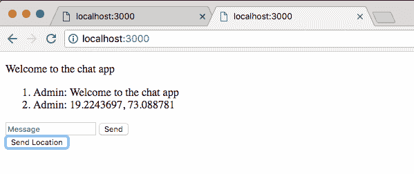

我们也把它放在第二个标签里面。如果我获取这些信息，我们实际上可以在谷歌上搜索它，并证明它如预期的那样工作。在本章的后面，我们将设置一个很好的链接，这样这些信息就不可见了；它会在那里，但用户并不真的需要知道坐标，他们真正想要的是一个地图的链接。这就是我们要设置的，但是现在我们可以把它放在谷歌，谷歌会告诉我们它到底在哪里，坐标确实是正确的。我在费城，这意味着这些本地主机标签的位置是正确的。

# 呈现可点击链接代替文本坐标

到目前为止，我们已经让数据流动起来，现在我们要让它更有用一点。我们将呈现一个可点击的链接，而不是将`latitude`和`longitude`信息呈现为文本。用户将能够点击该链接；当他们从别人那里收到位置时，这将把他们带到谷歌地图上，他们将能够准确地查看另一个用户的位置。这将比吐出文字`latitude`和`longitude`有用得多。

为了做到这一点，我们需要调整传输坐标数据的方式。我们发送数据的方式在`index.js`里面还是没问题的，我们还是要去`emit`、`createLocationMessage`。但是在`server.js`内部，我们需要的不是发出新的信息，而是完全不同的东西。我们将设置一个名为`newLocationMessage`的新事件，我们将去`emit`那里，然后在`index.js`里面我们将为`newLocationMessage`编写一个类似于`newMessage`但明显不同的处理程序。它将帮助我们呈现一个链接，而不是呈现一些文本。

# 整理网址结构

现在，为了在我们做任何事情之前开始，我们必须弄清楚我们将使用什么样的网址结构来获取数据，`latitude`和`longitude`信息，在谷歌地图中正确显示。实际上有一种非常统一的方法来设置网址，这将使这变得非常容易。

为了向您展示我们将使用的确切网址，让我们打开一个新的选项卡。网址将转到`https://www.google.com/maps`。现在，我们将从这里提供一个查询参数，查询参数将指定；叫做`q`:

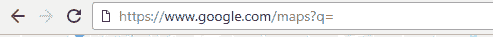

它希望`latitude`和`longitude`是用逗号分隔的值。现在我们实际上已经在`localhost:3000`标签上看到了。虽然逗号之间会有一点点空格，但无论哪种方式，我们都可以复制该值，返回到另一个选项卡，粘贴进去，然后删除空格。

有了这个，我们现在有了一个可以在应用程序中使用的网址。现在当我点击*进入*的时候，我们要在正确的位置查看一张地图，但是你会注意到网址的变化。那很好；只要我们将用户发送到这个 URL，它最终变成什么并不重要。我要打*进入*；你可以马上看到我们得到了一张谷歌地图，随着页面加载，网址确实会发生变化。

现在我们看到的东西与我们输入的完全不同，但是实际的 pin，红色 pin，在几个房子里是正确的。现在有了这些知识，我们可以生成一个遵循相同格式的网址，在网站内部发布出来，我们将有一个可点击的链接，在那里有人可以查看其他人的位置。

# 发出新消息

首先，让我们进入 Atom 进入`server.js`，而不是发出`newMessage`事件，我们将发出`newLocationMessage`:

```js
socket.on('createLocationMessage', (coords) => { 
  io.emit('newLocationMessage', generateMessage('Admin', `${coords.latitude}, ${coords.longitude}`)); 
});
```

现在我们在`index.js`中没有处理程序，但是这很好，我们将在后面的部分中设置。现在我们也需要改变我们发送的数据。目前，我们发送纯文本数据；我们要做的是生成一个 URL。我们实际上要创建一个完全独立的函数来生成位置消息，我们称之为`generateLocationMessage`。

```js
io.emit('newLocationMessage', generateLocationMessage('Admin', `${coords.latitude}, ${coords.longitude}`));
```

现在这个函数将接受一些参数来生成数据；就像我们对`generateMessage`函数一样，我们将从 from 名称开始，然后进入该函数的特定数据，这将是`latitude`和`longitude`。

我将删除我们的模板字符串，我们将传递原始值。第一个值为`coords.latitude`，第二个值为`coords.longitude`。现在它是第二个坐标值，但它确实是第三个参数:

```js
io.emit('newLocationMessage', generateLocationMessage('Admin', coords.latitude, coords.longitude));
```

有了这个参数列表，我们实际上可以继续定义`generateLocation`。我们将能够导出它，在这个文件中要求它，然后一切都将按预期进行。让我们在实际将它添加到消息文件之前，将它加载到顶部。我们将在`generateMessage`旁边装载`generateLocationMessage`:

```js
const {generateMessage, generateLocationMessage} = require('./utils/message');
```

让我们保存`server.js`并进入我们的`message`文件。

# 在 message.js 文件中添加 generateLocationMessage

现在我们将要创建的函数看起来非常类似于这个，我们将获取一些数据并返回一个对象。最大的区别是我们也将生成那个网址。代替`from`、`text`和`createdAt`，我们将有`from`、`URL`和`createdAt`。

我们可以做一个新的变量，我们可以把这个变量叫做`generateLocationMessage`，我们可以把它设置成一个函数，这个函数接受这三个参数`from`、`latitude`和`longitude`:

```js
var generateLocationMessage = (from, latitude, longitude)
```

现在我们可以完成箭头函数(`=>`)添加箭头和我们的花括号，在这里我们可以从返回空对象开始:

```js
var generateLocationMessage = (from, latitude, longitude) => {
  return {

  };
};
```

现在我们将从属性、URL 属性和`createdAt`设置这三个属性。这里`from`就要轻松了；就像我们对`generateMessage`所做的一样，我们只是简单地引用这个论点。网址一会有点棘手；现在，我们将把它设置为一个空的模板字符串，稍后我们将回到它。最后，`createdAt`，我们之前也做过；我们将通过获取一个`new Date`并调用`getTime`将其设置为一个时间戳:

```js
var generateLocationMessage = (from, latitude, longitude) => {
  return {
    from,
    from,
    url: ``,
    createdAt: new Date().getTime()
  };
};
```

现在，对于网址，我们需要使用与刚才在浏览器中输入的格式完全相同的格式，即[https://www.google.com/maps](https://www.google.com/maps)。然后我们必须设置我们的查询参数，添加我们的问号和我们的`q`参数，设置它等于`latitude`后跟逗号，再后跟`longitude`。我们要注入`latitude`，加个逗号，然后注入`longitude`:

```js
var generateLocationMessage = (from, latitude, longitude) => { 
  return { 
    from, 
    url: `https://www.google.com/maps?q=${latitude},${longitude}`, 
    createdAt: new Date().getTime() 
  }; 
}; 
```

现在我们完成了！`generateLocationMessage`将如预期的那样工作，尽管稍后您将编写一个测试用例。现在我们可以简单地导出它。我要导出`generateLocationMessage`，像这样:

```js
var generateLocationMessage = (from, latitude, longitude) => { 
  return { 
    from, 
    url: `https://www.google.com/maps?q=${latitude},${longitude}`, 
    createdAt: new Date().getTime() 
  }; 
}; 

module.exports = {generateMessage, generateLocationMessage}; 
```

现在数据将通过调用`emit`从客户端流出，传入`generateLocationMessage`。我们将得到`latitude`和`longitude`。在`server.js`内部，我们将进入`emit``newLocationMessage`事件，我们刚刚在`generateLocationMessage`内部定义了对象:

```js
socket.on('createLocationMessage', (coords) => {
  io.emit('newLocationMessage', generateLocationMessage('Admin', coords.latitude, coords.longitude));
});
```

# 为新位置消息添加事件侦听器

真正实现这一切的最后一块拼图是为`newLocationMessage`事件添加一个事件监听器。在`index.js`中，我们可以这样称呼`socket.on`。我们将提交我们的两个论点。首先是我们想听的事件名称，`newLocationMessage`，第二个也是最后一个论点是我们的`function`。一旦事件发生，这将被称为`message`信息:

```js
socket.on('newLocationMessage', function (message) { 

}); 
```

现在我们有了这个，我们可以开始生成我们想要向用户吐出的 DOM 元素，就像我们上面做的那样，我们将制作一个列表项，我们将添加我们的锚标签，我们在其中的链接。

我们将制作一个名为`list item`的变量，并使用`jQuery`制作一个新元素。作为第一个参数，我们将传入字符串，并将其设置为列表项:

```js
socket.on('newLocationMessage', function (message) {
  var li = jQuery('<li></li>');
});
```

接下来，我们可以创建我们需要的第二个元素。我要做一个变量，为锚点标签调用这个变量`a`，并再次设置它等于返回值为对`jQuery`的调用。这次我们将创建锚标签。现在锚点标签使用`a`标签，标签里面的内容，就是链接文本；在我们的案例中，我们将使用`My current location`:

```js
socket.on('newLocationMessage', function (message) {
  var li = jQuery('<li></li>');
  var a = jQuery('<a>My current location</a>');
});
```

现在我们将在锚标签上指定一个属性。这将是一个非动态属性，意味着它不会来自消息对象，这一个将被称为`target`，我们将设置`target`等于`" _blank"`:

```js
var a = jQuery('<a target="_blank">My current location</a>');
```

当您将目标设置为`_blank`时，它会告诉浏览器在新选项卡中打开网址，而不是重定向当前选项卡。如果我们重定向当前标签，我会被踢出聊天室。如果我点击了其中一个目标设置为`blank`的链接，我们将简单地打开一个新的选项卡来查看谷歌地图信息:

```js
socket.on('newLocationMessage', function (message) { 
  var li = jQuery('<li></li>'); 
  var a = jQuery('<a target="_blank">My current location</a>'); 

}); 
```

接下来，我们将继续设置这些属性的一些属性。我们将使用`li.text`设置文本。这将让我们设置这个人的名字以及那个冒号。就在模板字符串内部，我们将注入值`message.from`。在该值之后，我们将添加一个冒号和一个空格:

```js
var a = jQuery('<a target="_blank">My current location</a>');

li.text(`${message.from}: `);
```

接下来，我们将继续更新我们的锚点标签`a.attr`。您可以使用这个方法在 jQuery 选择的元素上设置和获取属性。如果您提供一个参数，如`target`，它将获取值，在这种情况下，它将返回字符串`_blank`。如果指定两个参数，它实际上会设置值。在这里，我们可以将`href`值设置为等于我们的网址，我们在`message.url`下有:

```js
li.text(`${message.from}: `);
a.attr('href', message.url)
```

现在您会注意到，对于所有这些动态值，我不是简单地将它们添加到模板字符串中。相反，我正在使用这些安全的方法，比如`li.text`和`a.attribute`。这可以防止任何恶意行为；如果有人试图注入 HTML，他们不应该使用这些代码注入。

有了这个，我们现在可以继续，将锚点标签附加到列表项的末尾，这将在我们刚刚使用`li.append`设置的文本之后添加它，并且我们将附加锚点标签。现在我们可以在`newMessage`事件侦听器的情况下，使用完全相同的语句将所有这些添加到 DOM 中。我将复制并粘贴到`newLocagtionMesaage`事件监听器中:

```js
socket.on('newLocationMessage', function (message) {
  var li = jQuery('<li></li>');
  var a = jQuery('<a target="_blank">My current location'</a>);

  li.text(`${message.from}: `);
  a.attr('href', message.url);
  li.append(a);
  jQuery('#messages').append(li);
});
```

有了这些，我们就完了。现在我要保存`index.js`并在浏览器中重新开始。我们做了相当多的修改，所以如果你有几个错别字也没关系；只要你能找到他们，没什么大不了的。

我将在 Chrome 中刷新我的两个标签；这将使用最新的客户端代码启动并运行新的连接，为了开始工作，我将从第二个选项卡向第一个选项卡发送一条简单的消息。它显示在第二个选项卡中，如果我转到第一个选项卡，我们会看到用户:测试。现在我可以点击发送位置，这将需要大约 1 到 3 秒的时间来实际获取位置。然后它会通过`Socket.io`链，我们会得到什么？我们获得链接“我的当前位置”显示给用户一:


对于用户二也是如此。现在，如果我点击那个链接，它应该会打开一个全新的标签页，里面有正确的网址、`latitude`和`longitude`信息。

就在这里，我们有点击发送位置按钮的用户的位置。有了这个，我们就有了一个奇妙的地理定位功能。你所做的就是点击按钮；无论你在哪里，它都会获取你的当前位置，并呈现一个可点击的链接，这样其他任何人都可以在谷歌地图中查看它。在我们开始之前，我想让你为这个全新的`generateLocationMessage`函数添加一个测试用例。

# 为 generateLocationMessage 添加测试用例

在终端内部，我可以关闭服务器并使用`clear`清除输出。如果我使用`npm test`运行我们的测试套件，我们会看到我们有一个测试，它通过了:


你的工作将是在`message.test.js`内部增加第二个测试用例。

我们一起开始。就在这里，我们将添加一个`describe`块，描述`generateLocationMessage`函数，您将负责在回调内部添加一个测试用例:

```js
describe('generateLocationMessage', () => {

});
```

在这里，你要叫`it ('should generate correct location object')`。接下来，我们可以继续添加我们的函数，这将是一个同步测试，因此不需要添加 done 参数:

```js
describe('generateLocationMessage', () => {
  it('should generate correct location object', () => {

  });
});
```

现在，我们将为`generateMessage`事件编写一个非常类似的测试用例，尽管您将通过`from`、`latitude`和`longitude`而不是通过`from`和`text`。然后你要对你得到的价值做一些断言。然后我们将运行测试用例，并确保终端内的一切都通过。

# 为测试用例添加变量

首先，我要做两个变量。我将创建一个`from`变量，并将其设置为类似`Deb`的值。然后我们可以创建一个`latitude`变量，我将把它设置为`15`。我们可以继续创建一个变量`longitude`设置，等于类似`19`的值:

```js
describe('generateLocationMessage', () => {
  it('should generate correct location object', () => {
    var from = 'Deb';
    var latitude = 15;
    var longitude = 19;
  });
});
```

然后我可以继续，最后创建一个`url`变量。`url`变量将是最终结果，我期望得到的网址。现在该网址将在引号[https://www.google.com/maps](https://www.google.com/maps)内，然后我们将添加适当的查询参数，给出我们要传递的信息。如果纬度是`15`，我们会期望等号后的`15`，如果经度是逗号后的`19`，我们会期望`19`:

```js
describe('generateLocationMessage', () => {
  it('should generate correct location object', () => {
    var from = 'Deb';
    var latitude = 15;
    var longitude = 19;
    var url = 'https://www.google.com/maps?q=15,19';
  });
});
```

现在我们已经准备好了，我们可以直接调用存储响应的函数。我将创建一个名为`message`的变量，然后我们将继续调用`generateLocationMessage`，这目前不是必需的，我们可以在一秒钟内完成。我们将传递我们的三个论点`from`、`latitude`和`longitude`:

```js
describe('generateLocationMessage', () => {
  it('should generate correct location object', () => {
    var from = 'Deb';
    var latitude = 15;
    var longitude = 19;
    var url = 'https://www.google.com/maps?q=15,19';
    var message = generateLocationMessage(from, latitude, longitude);
  });
});
```

现在让我们继续，也把`generateLocationMessage`和`generateMessage`一起拉下来:

```js
var expect = require('expect');

var {generateMessage, generateLocationMessage} = require('./message');
```

现在唯一剩下要做的就是做出我们的断言。

# 为 generateLocationMessage 生成断言

我们将以同样的方式开始。我实际上将这两行从`generateMessage`复制到`generateLocationMessage`测试用例中:

```js
expect(message.createdAt).toBeA('number');
expect(message).toInclude({from, text});
```

我们期望`message.createdAt`属性是一个它应该是的数字，然后我们期望消息包含一个等于`Deb`的`from`属性，并且我们期望它有一个等于我们定义的`url`字符串的`url`属性:

```js
describe('generateLocationMessage', () => {
  it('should generate correct location object', () => {
    var from = 'Deb';
    var latitude = 15;
    var longitude = 19;
    var url = 'https://www.google.com/maps?q=15,19';
    var message = generateLocationMessage(from, latitude, longitude);

    expect(message.createdAt).toBeA('number');
    expect(message).toInclude({from, url});
  });
});
```

如果这两个断言都通过了，那么我们就知道从`generateLocationMessage`返回的对象是正确的。

# 运行 generateLocationMessage 的测试用例

我将在终端内部重新运行测试套件，一切都将按预期运行:


这次就这样了！我们已经建立了地理定位，我们已经渲染了我们的链接，我们的状态很好，可以继续。我将继续在终端内添加一个`commit`。我将运行`clear`命令来清除`Terminal`输出，然后我们将运行`git status`来查看我们所有已更改的文件，并且我们可以使用带有`-am`标志的`git commit`来为这个添加消息，`Add geolocation support via geolocation api`:

```js
git commit -am 'Add geolocation support via geolocation api'
```

我将继续提交并将其推送到 GitHub，我们也可以花一点时间使用`git push heroku master`将其部署到 Heroku。

这将部署我们最新的代码，其中内置了地理定位的东西。我们将能够运行这个，并且这些代码将在像 Chrome 移动浏览器这样的东西上运行，因为我们将在 HTTPS。谷歌 Chrome 在手机和其他手机浏览器上的浏览器对于何时发送地理位置信息有非常严格的安全指南。这将需要通过 HTTPS 连接，这正是我们在这里。我将在几个选项卡中打开我们的 Heroku 应用程序。我们将在第一个选项卡中打开它，我们还将在第二个选项卡中打开它。我将点击发送位置按钮。我确实需要批准这一点，因为这是一个不同的网址，是的，我确实希望他们能够使用我的位置。它会抓取位置，发送出去，第一个标签会得到链接。我点击链接，希望我们能找到相同的位置。

# 摘要

在本章中，我们致力于生成文本和位置消息。我们研究了生成`newMessage`对象，然后为其编写测试用例。然后，我们学习了如何使用事件确认。然后，我们添加了消息表单字段，并在屏幕上呈现了输入字段和按钮。我们还讨论了 jQuery 的概念，并使用它来选择和创建传入的消息元素。

在地理动作部分，我们给了用户一个新按钮。这个新按钮允许用户发送他们的位置。我们为“发送位置”按钮设置了一个`click`监听器，这意味着每次用户点击它时，我们都会根据他们对地理动作 API 的访问来做一些事情。如果他们无法访问地理定位应用编程接口，我们只需打印一条消息。如果他们有权限，我们会试着去找那个地方。

在下一章中，我们将研究如何设计我们的聊天页面，让它看起来更像一个真正的网络应用程序。