# 连接页面和传递房间数据

在前一章中，我们研究了如何将我们的聊天页面设计得更像一个真实的网络应用程序，而不像一个没有样式的 HTML 页面。在本章中，我们将继续讨论聊天页面，并查看加入页面和传递房间数据。我们将更新我们的 HTML 文件，并为聊天页面添加表单域。

我们将获取名称和房间值，并将它们从客户端传递到服务器，以便服务器可以跟踪谁在哪个房间，并且我们可以建立私人通信。我们还将为数据验证创建测试用例。

# 添加联接页

这一部分的目标是添加一个加入页面，就像您在下面的截图中看到的一样，您提供了一个名称，并提供了您想要加入的房间名称。

然后，您将能够加入给定的房间，与该房间中的任何其他人交谈，并且无法与其他房间中的其他人交流:

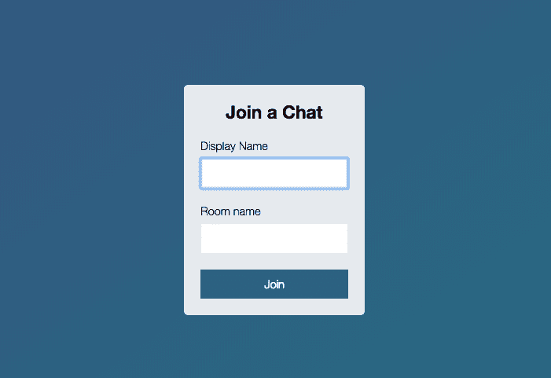

这意味着，当您点击此表单时，您将点击加入，我们将把一些自定义信息传递到我们所知的聊天应用程序的网址中，如下所示:


# 更新超文本标记语言文件

为了做到这一点，我们要做的第一件事是调整当前的 HTML 文件。现在，`index.html`将首先加载。我们实际上不希望这样，当我们进入`localhost:3000`时，我们希望显示我们的新加入页面。所以我要做的是通过重命名来移动这个页面。我们将把`index.html`改名为`chat.html`。我将对`index.js`做同样的事情，将其改名为`chat.js`。

最后但同样重要的是，我将更新脚本中的引用，我们在其中加载`index.js`；相反，我们将加载`chat.js`。既然我们已经做好了这些；我们不再有你访问网站时会加载的 HTML 页面。如果我尝试去`localhost:3000`，我们会得到一个错误，说我们不能得到那个路线，没有任何东西从服务器返回:


为了解决这个问题，我们将创建一个全新的页面`index.html`。这将是当用户访问应用程序时加载的。现在我们将从一个非常基本的模板开始，指定我们以前做过的事情，比如`DOCTYPE`，将其设置为 HTML5，然后我们将添加我们的`html`标签。在这里，我们可以添加我们的`head`和`body`标签:

```js
<!DOCTYPE html>
<html>
  <head>
  </head>
  <body>
  </body>
</html>
```

# 在 HTML 文件中添加标题标签

我先添加我的`head`标签，然后我可以继续添加我的`body`标签。然后，我们将通过在头部添加一些标签(如`meta`)来开始工作，这样我们就可以设置我们的字符集，它的值将为`utf-8`。我们还将设置一些其他属性:

```js
<head>
  <meta charset="utf-8">

</head>
```

我将设置一个`title`标签，这将显示在标签的内部作为标签的`title`，我们可以将我们的设置为`Join`，然后我们可以使用`|`添加一个空格、一条垂直线和我们的应用程序的名称，类似于`ChatApp`:这将显示任何标签标题。然后，我们可以像对`chat.html`一样，在样式表中进行链接。我将从`chat.html`中获取样式表引用，将其复制到头部:

```js
<head>
  <meta charset="utf-8">
  <title>Join | ChatApp</title>
  <link rel="stylesheet" href="/css/styles.css">
</head>
```

我要给`chat.html`加一个`title`标签。在`chat.html`中，我们可以指定标题，就像在`index.html`中一样。我们可以给它一个`Chat`的页面，有一个被空格包围的栏，我们也会给它一个相同的应用名称，`ChatApp`:

```js
<!DOCTYPE html>

<html>

<head>
  <meta charset="utf-8">
  <title>Chat | ChatApp</title>
  <link rel="stylesheet" href="/css/styles.css">
</head>
```

现在我们已经准备好了，在我们开始更新`body`之前，还有一件事我想做，这就是设置一个`viewport`标签。`viewport`标签可以让你指定某些关于你的网站应该如何呈现的事情。我将要添加的`viewport`标签将使我们的网站在手机上显示得更好。它不会真的缩小，而是适合你的手机、平板电脑或任何其他设备的宽度。

完成后，我们将把这个标签从`index.html`复制到`chat.html`，但是现在我们将通过添加一个`meta`标签来开始。

这一次，我们不再像过去那样指定字符集，而是将它命名为`viewport`:

```js
<head> 
  <meta charset="utf-8"> 
  <title>Join | ChatApp</title> 
  <meta name="viewport" content=""> 
  <link rel="stylesheet" href="/css/style.css"> 
</head> 
```

现在我们可以继续添加一些选项来决定我们想要做什么。所有这些都将发生在内容内部。这将是一个逗号分隔的键值对列表，例如`width`将是`device-width`。这告诉你的浏览器使用设备的`width`作为网页的`width`，然后我们可以添加一个逗号，一个空格，并指定我们的下一个键值对。我将使用`initial-scale`并将其设置为`1`。这将适当缩放网站，使其看起来不会全部缩小，最后`user-scalable`将设置为等于`no`:

```js
<head>
  <meta charset="utf-8">
  <title>Join | ChatApp</title>
  <meta name="viewport" content="width=device-width, initial-scale=1, user-scalable=no">
  <link rel="stylesheet" href="/css/styles.css">
</head>
```

我们有适当的样式来使文本更大，并确保用户总是可以看到一切，所以没有理由给用户缩放的能力。如前所述，我们将获取这个`meta`标签，将其复制到剪贴板，并将其添加到`chat.html`中。既然我们有了`head`标签，为`index.html`设置好了，我们就可以继续研究身体了。

# 在 HTML 文件中添加正文标签

我们将使用一组类似的类来处理这个页面。为了启动`body`标签，我们将添加一个`centered-form`类:

```js
  <body class="centered-form">
  </body>
</html>
```

这将在屏幕中心的形式，给整个网站的蓝色背景与梯度。接下来，我们可以继续提供这个小盒子。这将是中间的白色盒子，里面有我们的形状。这将通过`div`进行，我们将为这个`div`上课。我们将把这个类设置为，在引号内，`centered-form__form`:

```js
<!DOCTYPE html>
<html>

<head>
  <meta charset="utf-8">
  <title>Join | ChatApp</title>
  <meta name="viewport" content="width=device-width, initial-scale=1, user-scalable=no">
  <link rel="stylesheet" href="/css/styles.css">
</head>

<body class="centered-form">
  <div class="centered-form__form">
  </div>
</body>

</html>
```

现在我们已经有了这两个类，我们准备好继续添加一些要放在白色框中的字段，从标题`Chat`开始。

# 为聊天页面添加表单域

为了做到这一点，我们要创造一些草皮。它们看起来都一样，所以我们将制作一次并复制它们。我们要增加一个等于`form-field`的类。现在我们将使用这个四次:标题、名称、房间名称和按钮。为了做到这一点，我们要做的就是简单地复制该行并粘贴四次:

```js
<body class="centered-form">
  <div class="centered-form__form">
    <div class="form-field"></div>
    <div class="form-field"></div>
    <div class="form-field"></div>
    <div class="form-field"></div>
  </div>
```

现在所有这些都需要进入一个`form`标签。这个页面的整个目标是获取数据并提交它，将用户重定向到聊天页面，然后我们可以使用他们提供的名称将他们带到特定的聊天室。这意味着我们希望将这些`form`字段包装在一个`form`标签中，方法是在`div`标签的正上方将其打开，在下方将其关闭，如下所示:

```js
<body class="centered-form">
  <div class="centered-form__form">
    <form>
      <div class="form-field"></div>
      <div class="form-field"></div>
      <div class="form-field"></div>
      <div class="form-field"></div>
    </form>
  </div>
</body>
```

之前我们看到`form`标签的默认行为是重新加载当前页面，将数据作为查询字符串发布。相反，我们要做的是指定一个`action`属性，让我们自定义要转到哪个页面。在这种情况下，我们将转到`/chat.html`，我们刚才设置的页面。这意味着当有人填写完表单字段后，他们将被重定向到`chat`页面，下面的数据也将被传递。

现在标题`div`很简单，我们要做的是添加一个`h3`标签，你想要什么标题都可以；你可以说`Chat`或者`Join a Chat`。然后，我可以继续关闭我的`h3`:

```js
<form action="/chat.html">
  <div class="form-field">
    <h3>Join a Chat</h3>
  </div>
```

然后，我可以继续下一个表单域，它将成为显示名称。我将使用一个标签，一个标签将描述一个字段，这个将是`Display name`，所以我们将像这样打开和关闭`label`标签:

```js
<div class="form-field">
  <label>Display name</label>
</div>
```

接下来，我们可以添加一个`input`。我们将添加一个`input`，就像我们在信息`form`中为`input`所做的那样。我们将指定`type`等于`text`。我们希望用户能够输入一些文本。我们也会给它一个等于 T7 的 T6。我们要用`autofocus`；这将再次确保当用户第一次访问应用程序时，他们的光标位于名称字段内:

```js
<div class="form-field">
  <label>Display name</label>
  <input type="text" name="name" autofocus/>
</div>
```

接下来是房间名称的字段，它看起来非常类似于上面的字段，我们将再次从`label`开始。这个`label`将是一个字符串，类似于`Room name`，我们还将添加一个输入，这样用户就可以指定房间名称`type="text"`，而`name`将等于`room`:

```js
<div class="form-field">
  <label>Room name</label>
  <input type="text" name="room"/>
</div>
```

这个不需要`autofocus`，因为在前面的代码中我们已经有了`autofocus`的输入。

现在我们已经准备好了，我们可以继续填写最后的`form`字段，这将是我们表单的提交按钮，只需创建`button`标签，并给它一个文本值。我们可以将我们的设置为`Join`:

```js
<div class="form-field">
  <button>Join</button>
</div>
```

有了这些，我们的`index.html`文件实际上就完成了。我们可以在浏览器中加载它。我们的服务器已自动重启，因此快速刷新会显示我们的页面加入聊天应用程序:


目标是将其设置为取一个类似`Andrew`的名称和一个类似`Node Course Students`的房间名称:


您单击“加入”，它会以此名称将您加入此房间。现在，它所要做的就是将我们重定向到`chat.html`，但是正如您将看到的，它确实传递了数据:

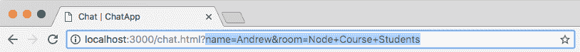

这里`name`等于`Andrew`，我们`room`的名字等于`Node Course Students`，就像我们在`index.html`里面指定的一样。有了这些，我们现在准备开始讨论如何加入`Socket.io`内的特定房间，确保我们发出的事件只发送给与该房间相连的其他人。我们已经准备好了完成这项工作的材料，所以我们将在下一节开始讨论所有这些内容。

现在我们有一个非常漂亮的连接页面，在这里我们可以连接一个房间。让我们用提交来结束这个过程，提交我们的更改。

# 致力于 index.html 的变革

如果我运行`git status`，你会看到我们有一个修改过的文件`index.html`，它还认为我们删除了`index.js`，虽然我们在下面添加了一些东西，但是当我们运行`git add .`并重新运行`git status`时，它会完全理解发生了什么:

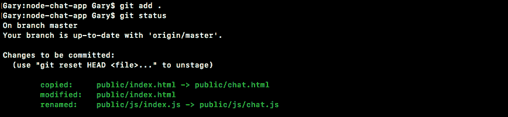

在这里，你可以看到我们把`index.html`复制到了`chat.html`，然后我们修改了`index.html`，把`index.js`改名为`chat.js`，这正是我们所做的。我将继续使用带有`-m`标志的`git commit`进行提交:

```js
git commit -m 'Add join page that submits to chat.html'
```

然后我们可以提交，把它推送到 GitHub，就这样了。

# 传递房间数据

在最后一部分，我们创建了一个小聊天页面。我们可以输入一个类似`Andrew`的名字和一个类似`Node Course`的房间，然后加入那个房间:

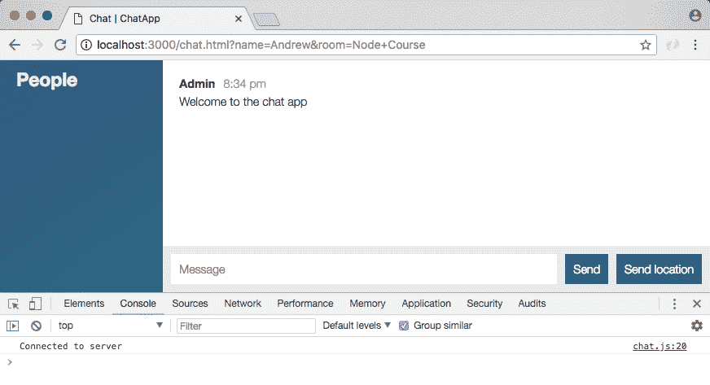

现在，当我们这样做的时候，我们被带到聊天页面，但是在幕后实际上没有发生任何事情来使用这些值，它们出现在网址中，但仅此而已。本节的目标是获取这些值，并将它们从客户端传递到服务器，这样服务器就可以跟踪谁在哪个房间，并且我们可以建立这种私人通信。目前，如果用户 1 在“节点”课程中，而用户 2 在“反应”课程中，则两个人都可以相互交谈，因为没有使用这些数据。

# 向服务器获取数据

现在，将这些数据发送到服务器的第一步是弄清楚它的位置；这实际上生活在`location`对象中。我们将使用控制台来玩它。

`location`是一个由你的浏览器提供的全局对象，在它上面我们有一大堆非常有趣的东西，比如`host`、`hostname`、`href`、`origin`和`pathname`。我们将要使用的是`search`。

在下面的截图中可以看到，`search`是查询字符串，从问号到单词课程结束的所有内容，我在这里重点介绍了:


目标是把它变成更有用的格式。现在我们只有字符串，我们需要解析它。既然我们知道了它住在哪里，我们实际上要用一个图书馆来做这件事。我们可以访问`window.location.search`获取该值:


我在`location.search`前面添加了一个窗口，只是为了确保我们访问的是全局位置属性，而不是一个局部变量，这个变量可能存在，也可能不存在，叫做位置。这将是获取查询字符串最简单的方法。

# 参数和部门

现在我们要做的下一件事是谈论参数和部门。在 jQuery 内部，我们实际上可以访问一个函数，我们可以通过调用`jQuery.param`来访问它，我们可以传入一个对象。我们将把`name`设置为您的名字，我将把它设置为`Andrew`，我们将把`age`设置为类似于`25`的东西。现在，当我运行此语句时，jQuery 将获取该对象，并将其转换为一组可以添加到 URL 上的参数:

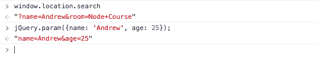

这里可以看到我们有`name=Andrew`和`age=25`。这类似于我们在网址中设置的格式，减去问号。我们所要做的就是在开头添加一个，这样我们就有了一个完整的搜索字符串。现在 jQuery 的问题是它不能在另一个方向上做；这意味着它不能接受字符串并将其转换回对象，这正是我们想要的。

我们希望能够轻松访问这些数据，但目前这是不可能的。还有像编码和`+`字符这样的怪癖。这原本是一个空间，但被形态转换成了`a +`。我们也想解码所有这些。幸运的是，我们可以包含一个简单的库，我们可以通过前往[links.mead.io/deparam](https://gist.github.com/andrewjmead/b71e03d8df237983285892f9a265d401)来获取它:

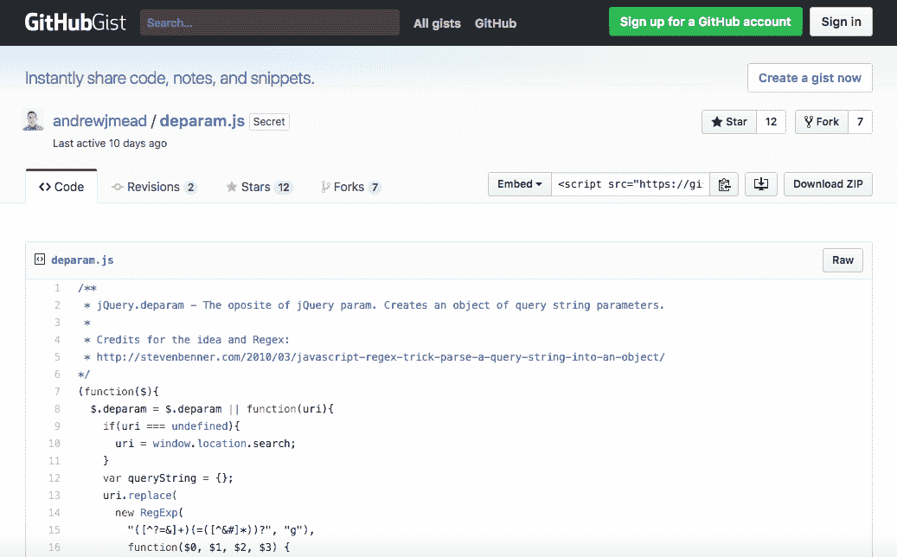

`param`取你的对象并返回字符串，`deparam`取字符串并返回一个对象。在前面的截图中，我们有一个简单的要点。这是一个非常短的功能，我们将添加到我们的项目中。让我们转到本页的原始版本。我们将使用右键单击、另存为来保存它，并将它直接添加到项目中。我们有`public`、`js`和`libs`文件夹。在`libs`文件夹中，我们将简单地将其保存为`deparam.js`:


现在，一旦我们保存了该文件，我们就可以包含它了。这将使处理搜索数据变得更加容易。在原子内部，我将前往`chat.html`。我们在`index.html`中不需要这个，但是在`chat.html`中，我们将把它加载到`mustache.js`脚本下面。我们将制作一个新的`script`标签，并且我们将继续设置`src`等于，内部引号，`/js/libs/deparam.js`:

```js
<script src="/socket.io/socket.io.js"></script>
<script src="/js/libs/jquery-3.3.1.min.js"></script>
<script src="/js/libs/moment.js"></script>
<script src="/js/libs/mustache.js"></script>
<script src="/js/libs/deparam.js"></script>
<script src="/js/chat.js"></script>
```

现在，当我们保存`chat.html`并返回浏览器时，我们实际上可以刷新页面并在控制台中使用它，然后再将其添加到我们的代码中。我们现在可以访问`jQuery.deparam`。如果我运行这个语句，我们将返回我们的函数，确认它确实存在，我们需要做的就是传入字符串，这是搜索字符串，`window.location.search`:

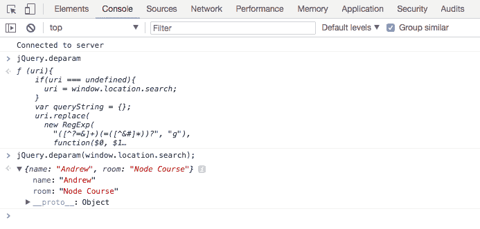

所以我们把搜索字符串传入`deparam`，得到的对象正是我们想要的。我们有相当于`Andrew`的`name`财产，我们有相当于`Node Course`的`room`财产。所有那些特殊字符，如`&`符号、问号和`+`字符，都已被移除，并被这个格式良好的对象所取代。这就是我们将在客户端代码中使用的方法来获取值并将其传递给服务器，这也是我们现在要做的。

在原子内部，这一切都将在`chat.js`发生。在这个文件中，我们有我们的`connect`回调函数。这发生在我们第一次连接时，当我们连接时，我们将发出一个事件，开始加入房间的过程:

```js
socket.on('connect', function () {
  console.log('Connected to server');
});
```

现在`Socket.io`已经内置了对房间概念的支持，创造了只有特定的人才能发射和听到事件的小孤立区域。所有这些都是在服务器上设置的，这意味着就在这个函数中。当我们连接到服务器时，我们要做的就是发出一个名为 join 的事件；这将开始这个过程。

首先，让我们继续获取我们的参数，我们刚刚学习了如何在控制台`var params = jQuery.deparam`内`deparam`的参数，我们将传递`window.location.search`，就像我们之前在开发人员控制台中所做的那样。现在我们有了我们的目标，我们可以继续发射一个事件。接下来，我们将调用`socket.emit`，我们将要发出的事件将是我们将要创建的自定义事件，它将被称为`join`:

```js
socket.on('connect', function () {
  var params = jQuery.deparam(window.location.search);

  socket.emit('join')
});
```

这将从客户端发出，并被服务器监听。当服务器听到这个`join`事件时，它将经历设置房间的过程。现在，这一部分中不会发生所有这些，但我们可以开始了。我们要发送的数据将成为`params`对象:

```js
socket.emit('join', params)
```

它可能包含也可能不包含我们需要的一切。我们将在服务器上做一点验证，最后但同样重要的是，我们将为此设置确认。

如果有人加入我们的房间，我们想知道。如果有人没有，我们也想。这是因为如果他们不加入房间，很可能是因为他们提供了无效的数据，这意味着我们希望将他们踢回该连接形式，迫使他们提供名称和房间名称。我们可以开始设置我们的`function`，这个`function`可以接受一个论点。我们将自己设置它，所以我们可以决定它是否需要一个论点，并且它确实有意义。在这种情况下，我们将继续提供任何错误。如果有错误，没关系，我们可以处理。如果没有错误，那也很好；我们将继续做别的事情:

```js
socket.on('connect', function () {
  var params = jQuery.deparam(window.location.search);

  socket.emit('join', params, function (err) {
  });
});
```

在函数中，如果有错误，我们可以使用`if (err)`来做一些事情。我们也可以增加一个`else`条款；如果没有错误，我们想做一件不同的事情:

```js
socket.on('connect', function () {
  var params = jQuery.deparam(window.location.search);

  socket.emit('join', params, function (err) {
    if(err) {

   } else {

  });
});
```

现在我们不打算填写这个，我们在这个时间点要做的是继续，实际上在`server.js`内部设置监听器进行加入。

# 在 server.js 中设置侦听器

这将在`server.js`发生。我们可以把它作为第一个发生在`createMessage``socket.on('join')`的事件:

```js
socket.on('join');
```

现在我们已经知道，我们将在回调函数中接受一些参数。我们会得到我们的参数。我们可以调用这些`params`，并得到`callback`函数，因为我们正在设置确认:

```js
socket.on('join', (params, callback) => {

});
```

在`join`功能中，我们要做的第一件事是验证通过的数据，包括姓名和房间。这些都是`params`的潜在属性。我们真正关心的是它们不是空字符串；这意味着它不仅仅是一个空格，不仅仅是一个空字符串，也不是像数字或对象这样的非字符串类型。

# 定义 ISR screening 函数

为了设置这个验证，我们也将在其他地方进行验证，比如`createMessage`，我们将创建一个单独的`utils`文件。在这里，我将称之为`validation.js`，在这里我们可以放置一些我们在整个项目中需要的验证器。

在本节中，我们将创建一个名为`isRealString`的。这将验证一个值是类型字符串，并且它不仅仅是一堆空格；它里面其实有真实的角色。我们将把它设置为一个接受字符串的函数。这将是我们验证的字符串，实际上不会非常困难。我们要去`return`和我们要去`return`以下条件。如果是真弦，它会返回`true`，如果不是真弦，它会返回`false`。首先，我们将使用`typeof`。这将得到字符串变量的类型，这需要等于，在引号中，`string`:

```js
var isRealString = (str) => {
  return typeof str === 'string';
};
```

目前，这将为任何字符串返回`true`，为任何非字符串值返回`false`，但不考虑空格。我们要做的是使用弦上可用的`trim`方法，它取一根这样的弦:

```js
''
```

并将其转换成这样的字符串，删除所有空白:

```js
'   '
```

如果你传入一个像这样的字符串，它会转换成一个像这样的字符串:

```js
' f  '
```

仅修剪前导和尾随空白:

```js
'f'
```

它不会修剪任何内部间距，所以如果我有这样的`f`空间`r`:

```js
' f r  '
```

我仍然会得到`f`和`r`之间的空间，但是所有的前导和尾随空格都被删除了:

```js
'f r'
```

我们将这样使用它:

```js
var isRealString = (str) => {
  return typeof str === 'string' && str.trim().length > 0;
};
```

在我们调用`trim`之后，我们确实需要一个大于`0`的长度，否则我们有一个空字符串。这将是我们的`isRealString`功能，我们将继续快速导出它，`module.exports`，将其设置为一个对象，我们将`isRealString`设置为`isRealString`功能:

```js
var isRealString = (str) => {
  return typeof str === 'string' && str.trim().length > 0;
};

module.exports = {isRealString};
```

现在我可以保存这个文件了。我也将继续在`server.js`内部调用函数。

# 在 server.js 中调用 isRealString 函数

我们需要先导入`isRealString`函数，然后才能实际验证这两个属性。我们可以在`generateMessage`常量的正下方做一个`const`，用 ES6 破坏来抓取`isRealString`，我们要用`require`来抓取。我们需要一个本地文件`./`。就在`utils`目录下，文件名是`validation`，就这样:

```js
const {generateMessage, generateLocationMessage} = require('./utils/message');
const {isRealString} = require('./utils/validation');
```

现在我们可以在`join`里面调用`isRealString`；这正是我们要做的。我们将检查它们是否不是真正的字符串。如果一个或多个不是真正的字符串，我们将调用传递错误的`callback`。我们将添加`if (params.name)`作为第一个，并将其传递到`isRealString(params.name)`:

```js
socket.on('join', (params, callback) => {
  if(isRealString(params.name))
});
```

现在我们要检查它是否是一个真正的字符串。所以我们要翻转它，或者(`||`)，然后我们要检查另一个属性，房间名，是否不是一个真正的字符串。现在在查询字符串内部，房间名称属性被称为`room`。因此，如果不是`isRealString`传入了正确的值`params.room`，那么这也将是一个错误:

```js
socket.on('join', (params, callback) => {
  if(!isRealString(params.name) || !isRealString(params.room))
});
```

接下来，我们可以通过添加错误处理函数来处理这个错误。为此，我要做的是用一个小字符串消息`Name and room name are required`调用`callback`:

```js
socket.on('join', (params, callback) => {
  if(!isRealString(params.name) || !isRealString(params.room)) {
    callback('Name and room name are required.');
  }
});
```

如果情况不是这样，我们仍然希望调用`callback`，但是我们不想传递任何参数:

```js
socket.on('join', (params, callback) => {
  if(!isRealString(params.name) || !isRealString(params.room)) {
    callback('Name and room name are required.');
  }

  callback();
});
```

因为记住我们在`chat.js`中设置的第一个参数是错误参数，如果两个参数都有效，我们不想传递任何错误。在`server.js`内部，我们现在已经设置了一些非常基本的验证，在我们实际在这里做任何事情之前，这将在接下来的部分中进行。

# 在 chat.js 中添加错误处理案例

我们要做的是在这里添加几个案例，在`chat.js`中:

```js
socket.on('connect', function () {
  var params = jQuery.deparam(window.location.search);

  socket.emit('join', params, function (err) {
    if(err) {

    } else {

    } 
  });
});
```

如果这是一个错误，这是一个相当大的问题，我们将希望通过更改 location 下的一个属性`window.location.href`，将用户发送回应用程序的根目录。在这里，我们可以操作用户在哪个页面上，本质上，我们将通过将正斜杠(`/`)值设置为`href`属性来将用户重定向回该根页面:

```js
socket.on('connect', function () {
  var params = jQuery.deparam(window.location.search);
  socket.emit('join', params, function (err) {
    if(err) {
      window.location.href = '/';
    } else {

    }
  });
});
```

现在，在我们这样做之前，我们可以做我们喜欢的任何事情，也许我们想使用我们选择的框架来显示一个模式，无论是基础、引导还是其他什么。为了简单起见，我们要做的就是调用`alert`传入错误，就像这样:

```js
if(err) {
  alert(err);
    window.location.href = '/';
  } else {
```

因此，用户会看到一个小的警告框，然后点击确定，他们会被重定向回主页。如果没有错误，我们现在要做的就是用`console.log`打印`No error`:

```js
socket.on('connect', function () {
  var params = jQuery.deparam(window.location.search);

  socket.emit('join', params, function (err) {
    if(err) {
      alert(err);    
      window.location.href = '/';    
    } else {
      console.log('No error');
    }
  });
});
```

有了这些，让我们继续测试事情是否如预期的那样运行。在浏览器中，我将刷新我当前的页面。现在，我们确实有了一个有效的名称和一个有效的房间，所以当我单击刷新按钮时，我们应该会在控制台中看到没有错误打印，这正是我们得到的结果:


我们通过的数据确实是有效的。现在我们可以前进到页面的根目录，尝试一些无效的数据。

为了演示这一点，我要做的就是单击连接，而不提供任何一个值。这将把我们带到聊天应用程序，你可以看到我们得到我们的小提醒框，名称和房间名称是必需的。我们单击确定，这是我们所能做的一切，我们会立即被重定向回加入聊天:

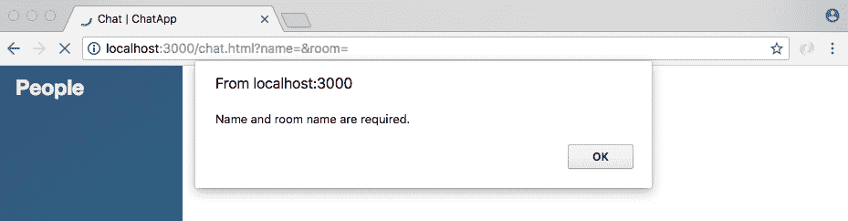

如果我确实提供了一些有效的数据，比如`Mike`的显示名称和`Developers`的房间名称，我们将被带到聊天页面，我们将看到没有错误显示，这太棒了:

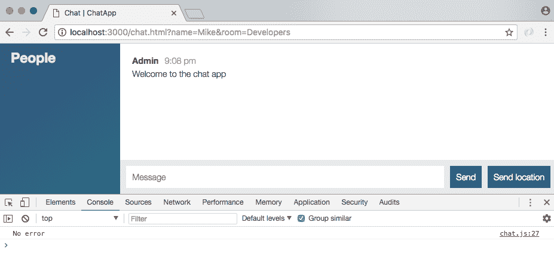

现在最后一次测试真的很快！如果我们只有空间，我将把房间名称改为一堆空间。现在我们点击连接，我们仍然会得到错误，即使我们在网址空间上面有一堆加号:


当我们通过`deparam`运行代码时，这些将被换成空格，错误仍然会发生。现在我们已经准备好了，我们处于一个非常好的位置，可以在下一部分中实际集成房间。

# 为新的验证函数添加测试用例

首先要做的是为我们刚刚创建的全新验证函数编写一些测试用例，这意味着我们将创建一个名为`validation.test.js`的新测试文件。

在这里，我们将加载一个期望，生成一个名为`expect`的变量。我们也可以使它成为常数。我们将把它设置为`require`并且我们将去`require``expect`图书馆:

```js
const expect = require('expect');
```

接下来，我们将加载`RealString`，导入`isRealString`，我们将添加三个测试用例。`describe`块应该类似于`isRealString`，三个测试用例如下:

*   第一个，`should reject non-string`值，在这种情况下我想让你传递一个数字对象或者其他任何东西到`isRealString`函数中，你应该得到假返回。
*   接下来，`should reject strings with only spaces`。如果我有一个字符串，它只是一堆不应该通过`isRealString`函数验证的空格。那也会失败；trim 将删除所有这些空间，长度将为 0。
*   最后一个，`should allow strings with non-space characters`。在这种情况下，你可以传入任何你喜欢的东西，某种有效值。你可以在《指环王》中使用 LOTR 空间，开始的空间会被修剪掉，所以这并不重要。你可以加上字母 a，任何有效的字符串都会通过这个。

继续设置这三个测试用例，确保正确的布尔值从`isRealString`返回。当您完成从终端运行`npm test`时，确保您的三个测试都通过了。

我们要做的第一件事是通过制造一个变量来导入`isRealString`。我们可以将它设为常量或变量，我将使用常量，我们将使用 ES6 析构来抓取`isRealString`，我们将从对本地文件`./validation`的 require 调用中抓取它，它就在当前文件`validation.test.js`旁边:

```js
const expect = require('expect');

  // import isRealString
  const {isRealString} = require('./validation');
```

现在我们可以从我们的`describe`块开始添加下面的内容。

# 测试用例 1–应该拒绝非字符串值

我们将进入`isRealString`功能。然后我们可以添加我们的箭头函数(`=>`)，在那里，我们可以继续提供我们的单独测试用例，`it`，我将直接复制它，`should reject non-string values`:

```js
describe('isRealString', () => {
  it('should reject non-string values')
});
```

这将是一个同步测试，因此没有理由添加`done`参数。在这里，我们将传递一个非字符串值。我会做一个名为 response 的变量，它会存储`isRealString`的返回结果。我们称之为传递某种非字符串值。什么都行，我要用一个数字，`98`:

```js
describe('isRealString', () => {
  it('should reject non-string values', () => {
    var res = isRealString(98);
```

现在，在下面，我们可以使用 expect 断言响应变量等于 false，事实应该如此。我们期待回应`toBe(false)`:

```js
describe('isRealString', () => {
  it('should reject non-string values', () => {
    var res = isRealString(98);
    expect(res).toBe(false);
  });
});
```

# 测试用例 2–应该拒绝只有空格的字符串

接下来，`it('should reject string with only spaces')`。我将完全复制那个文本，把它粘贴在我们的`it`名字里面。然后我们可以继续添加我们的箭头函数(`=>`)，对于这种情况，我们要做的是创建一个名为 response 的变量，传递某种只有空格的字符串。我们仍将呼叫`isRealString`，我们将通过一堆空间。现在我们要断言响应是`false`、`expect(res).toBe(false)`，这应该是因为我们没有有效的字符串:

```js
it('should reject string with only spaces', () => {
  var res = isRealString(' ');
  expect(res).toBe(false);
});
```

# 测试用例 3–应该允许带有非空格字符的字符串

下一个，最后一个测试用例，`it ('should allow strings with non-space characters')`。我将把它粘贴到`it`函数中，然后我们就可以实际设置测试用例了。你本可以提供一堆不同的价值观作为`isRealString`的论据。我们仍将使响应可变。我们还是要叫`isRealString`，但是就在这里，我要选择通过`(' Andrew ')`，这是有效的。`trim`功能将在验证过程中删除这些空格:

```js
it('should allow string with non-space characters', () => {
  var res = isRealString('  Andrew  ');
});
```

下面我们可以`expect`那个反应是真的，`toBe(true)`。这就是您所需要做的，我们可以继续并删除注释，因为我们已经有了实际的代码，最后要做的事情是运行测试用例，以确保我们的代码实际工作:

```js
const expect = require('expect');

const {isRealString} = require('./validation');

describe('isRealString', () => {
  it('should reject non-string values', () => {
    var res = isRealString(98);
    expect(res).toBe(false);
  });

  it('should reject string with only spaces', () => {
    var res = isRealString('    ');
    expect(res).toBe(false);
  });

  it('should allow string with non-space characters', () => {
    var res = isRealString('D');
    expect(res).toBe(true);
  });
});
```

`npm test`会完成的。这将运行我们的测试套件，就在这里，我们有三个`isRealString`的测试用例，它们都通过了，这太棒了:


正如我提到的，你可以在这里传递任何东西。字母`D`将作为有效的房间名称或用户名。如果我用`D`作为字符串重新运行测试套件，测试用例仍然通过。只要它有真正的非空间特征，你在这里传递什么并不重要。现在我们已经做好了。我们暂时不会提交，我们已经完成了一个特性的一半，一旦我们有了更多的特性，我们就会提交。

# 插座. io 室

在最后一节中，我们在服务器上设置了一个事件侦听器来侦听该联接事件，并做了一些验证。这至少保证了我们有`name`和`room`的名字，这两个名字都是必需的。

真正的下一步是实际使用`Socket.io`库加入房间，这不会让我们只是加入房间，但它也会给我们一套不同的方法。我们可以选择`emit`连接到服务器上的每个人，或者只连接到特定房间的人，这正是我们要做的。我们想把`emit`聊天信息发给同样在`room`的其他人。

现在为了加入，你做的就是你所谓的`socket.join`。`socket.join`带一个弦`name`，我们在`params.room`下面有一个`name`，就像我们上一节用的一样:

```js
socket.on('join', (params, callback) => {
  if(!isRealString(params.name) || !isRealString(params.room)) {
    callback('Name and room name are required.');
  }

  socket.join(params.room);

  callback();
});
```

我们现在有了一个特殊的地方，让处于同一状态的人可以交谈。现在这是一个字符串，所以它应该类似于`The Office Fans`或者其他任何东西，你必须通过字符串值来连接。然而，现在`params.room`将完成这项工作。

现在你也可以选择使用`socket.leave`离开房间。以名字`The Office Fans`为例，离开房间的`socket.leave`会把你踢出那个群，你不会收到那些私人信息，那些专门发给这个群的信息。现在，流程的下一步是找出如何真正利用这一点:

```js
socket.on('join', (params, callback) => {
  if(isRealString(params.name) || !isRealString(params.room)) {
    callback('Name and room name are required.');
  }

  socket.join(params.room);
  // socket.leave('The Office Fans');

  callback();
});
```

# 针对特定用户

将用户添加到房间中很好，但是如果我们不能将他们和房间中的其他人作为特定的目标，这就不是很有用了。事实证明，我们有几种方法可以做到这一点。为了说明我们如何针对特定用户，让我们看看我们在服务器上发出事件的所有方式。

我们已经使用了`io.emit`。这将它发送给每一个连接的用户，这就是我们目前正在做的事情，比如`createMessage`。一个新的信息进来了，我们把它发送给每一个相关的人。接下来，我们使用了`socket.broadcast.emit`。我们将它与`newMessage`一起使用，正如我们所知，这将消息发送给除当前用户之外的所有连接到套接字服务器的人。我们在`server.js`里面用的最后一个是`socket.emit`。这将专门向一个用户发出事件。现在，我们可以将这些事件转换成房间对应的事件。为了将它发送到特定的房间，我们将链接到 to 方法。

这看起来有点像这样。假设我们想向连接到一个房间的每个人发出一个事件，我们暂且称这个房间为`The Office Fans`。为此，我们将调用`io.to`。`.to`是一种方法，它采用的房间名称与加入呼叫中提供的名称完全相同。在我们的例子中，那将是`The Office Fans`，就像这样:

```js
socket.join(params.room);
// socket.leave('The Office Fans');

// io.emit ->io.to('The Office Fans')
```

然后我们会给`emit`挂一个电话。这将向连接到房间的每个人发送一个事件，`The Office Fans`:

```js
socket.join(params.room);
// socket.leave('The Office Fans');

// io.emit ->io.to('The Office Fans').emit
```

现在，我们也可以对广播做同样的事情，这意味着我们想向房间里的每个人发送一个事件，除了当前用户。为了做到这一点，我们将使用`socket.broadcast.to`。这就像前面定义的方法一样，`The Office Fans`将被传入，在这里我们称之为`emit`:

```js
socket.join(params.room); 
// socket.leave('The Office Fans'); 

// io.emit ->io.to('The Office Fans').emit
// socket.broadcast.emit -> socket.broadcast.to('The Office Fans') 
```

这将向`The Office Fans`房间中的每个人发送一个事件，除了当前用户，即实际呼叫`socket.broadcast`的用户。

现在我们使用的最后一种方式是`socket.emit`。当我们想向特定用户发送信息时，我们仍然会使用它。没有理由按房间来定位它们，因为我们只想定位它们:

```js
socket.join(params.room);
  // socket.leave('The Office Fans');
  // io.emit ->io.to('The Office Fans').emit
  // socket.broadcast.emit -> socket.broadcast.to('The Office Fans').emit
  // socket.emit
```

这是我们向特定房间排放的两种方式。现在，为了实际开始连接，我们可以做的是接下两个电话，我们可以将它们向下移动到`join`内，这意味着我们不会告诉某人有人加入了房间，直到他们通过呼叫`join`真正加入房间:

```js
socket.emit('newMessage', generateMessage('Admin', 'Welcome to the chat app'));

socket.broadcast.emit('newMessage', generateMessage('Admin', 'New user joined'));
```

我们也不会告诉用户他们已经加入了一个房间，直到电话实际接通。如果名称或房间名称等数据无效，它可能无法通过。让我们把这两个调用都去掉，我们只需要保持它们的原样，并把它们向下移动到 join。目前，我们可以将它们移到评论下方；我会把评论留在原地，这样你就可以把这些作为参考。现在在`socket.join`线的正下方，我们呼叫`socket.emit`并且我们`emit`一个新的消息，`Welcome to the chat app`:

```js
socket.emit('newMessage', generateMessage('Admin', 'Welcome to the chat app'));
```

这条线实际上会保持不变，我们仍然只是想针对任何特定的用户。

但是下一行将会改变。我们将使用`socket.broadcast.to`向刚刚加入的房间内的用户广播，而不是向每个连接的用户广播，传递`params.room`。我们将发出一条新消息，这将让每个人都知道一个新用户已经加入。

```js
socket.broadcast.to(params.room).emit('newMessage', generateMessage('Admin', 'New user joined'`));
```

我们实际上可以指定名称，而不是新用户。我们可以接触到它。就在这里，我将首先使用模板字符串注入名称，`params.name`，然后是`has joined`:

```js
socket.broadcast.to(params.room).emit('newMessage', generateMessage('Admin', `${params.name} has joined.`));
```

# 测试特定用户设置

现在我们已经有了这个，我们实际上可以测试一下了。我们要做的是加入一个房间，然后我们会有第二个用户加入，我们应该会在那里看到消息:**他们的名字已经加入**。我们还将在混合中添加第三个用户，以确保它实际上只向一个房间发送消息。

在浏览器内部，让我们从创建一个名为`User One`的用户开始。该用户将加入名为大写`A`的房间:


现在，我们将通过转到`localhost:3000`来创建第二个用户。这个可以叫做`User Two`，我们要加入房间`B`:

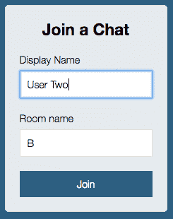

如果我在房间`A`和房间`B`之间，您可以看到没有打印加入消息，因为我们没有加入同一个房间。我们在完全不同的房间，所以我们不应该收到那些信息。

接下来我们要添加第三个用户，这个用户也要加入房间`A`，`User Three`，房间名称，房间`A`，我们要点击加入。当我们点击连接时，我们可以浏览选项卡并查看我们得到了哪些数据:

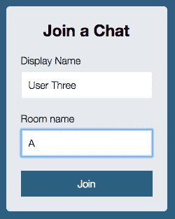

在这里，我们得到了预期的欢迎使用聊天应用程序。这只是因为我们已成功加入房间:


然后在第二个标签中，我们也可以看到欢迎使用聊天应用程序。没有问候那个用户的消息，因为那个用户加入了房间`A`，第一个标签有我们的用户三已经加入消息。这太棒了:

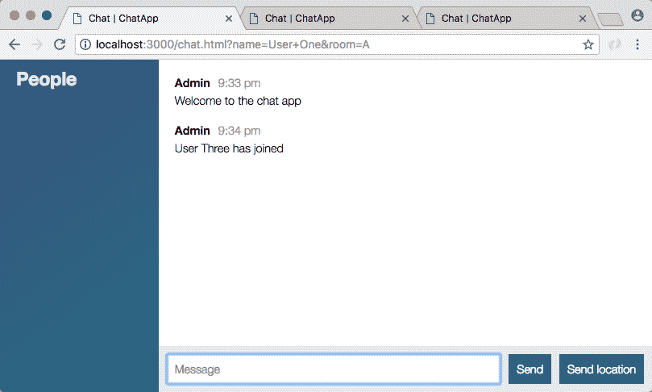

两个用户都在房间`A`中，所以当一个新用户加入时，这个用户应该会收到一条消息，并且我们已经按照预期在这里注入了名称。

# 摘要

在本章中，我们研究了添加聊天页面。我们将建立一个 HTML 文件，并根据我们的要求定义`head`和`body`标签。然后，我们继续传递房间数据。我们研究了`params`和`deparams`的概念，并创建了用于验证数据的测试用例。在最后一节，我们讨论了`socket.io`房间。我们针对聊天室的特定用户，测试了设置。

对于我们的`join`事件侦听器来说，事情相对容易，因为我们可以访问名称变量和房间变量。它们实际上是作为论据传入的。这对`createMessage`和`createLocationMessage`来说会困难得多。我们需要想出一个办法让给定插座的房间恢复原状，这样我们就可以`emit`回到那个房间。

我们还需要在左侧栏中设置人员列表。我们需要弄清楚如何使用那个`io`对象来获得按房间和姓名列出的所有人的列表。所有这些都将非常重要，因为目前我们`emit`的消息，例如一些消息，将显示给所有用户，不管他们在哪个房间。为了让这个工作，为了让那些私人房间就位，我们将保留这些数据，这将在下一章中讨论。