# ES7 类

正如我们在上一章中讨论的，我们有我们的套接字`join`监听器，但问题是监听器内部的信息。一旦回调完成，它就会丢失，比如用户名和房间名，它们不会被保存在任何地方。我们需要这些信息来完善我们的事件监听器。`createMessage`需要知道用户名和房间名才能将消息发送到特定的房间，而`createLocationMessage`也是如此。我们将在本章中讨论这一点。

我们将从学习 ES6 类语法开始，并在创建`users`类和一些其他方法中使用它。我们还将看到连接用户列表，当任何用户加入或离开聊天时更新人员列表。我们还将研究向特定房间发送消息，而不是向所有用户发送消息。

# 用 ES6 类存储用户—第一部分

我们无法访问`join`中的数据(用户名和房间名)，但我们可以访问一个常见的东西，那就是套接字标识。我们可以访问套接字变量`socket.id`，也可以在其他事件侦听器中访问它。这将是我们在将要创建的数据结构中使用的内容。当我们想要像在`createMessage`和`createLocationMessage`中一样查找用户时，我们将创建一个用户阵列，我们可以在其中存储这些信息。我们将简单地将 ID 传递给某个函数，获取名称和房间名称，并根据我们的需要发出事件。

为了做到这一点，我们将在`utils`中创建一个全新的文件。我们将这个文件称为`users.js`，这是我们要存储与该用户的数据结构相关的所有内容的地方。

它将是一个对象数组，在每个对象上，我们将有一个标识，它将是套接字标识，某种非常长的字符串:

```js
[{
  id: '/#12hjwjhwfcydg',

}]
```

我们也会有自己的名字。这是用户的显示名称，我的可能是`Andrew`；最后是用户加入的房间，可能类似于`The Office Fans`:

```js
[{
  id: '/#12hjwjhwfcydg',
  name: 'Andrew',
  room: 'The Office Fans'
}]
```

这是我们需要存储在数据结构中的所有信息，以便用户能够连接所有信息。

现在，真正的工作将进入我们将要创建的方法中，以操作数组。我们将有四种方法:

*   我们希望能够通过`addUser`方法添加用户；这需要三条信息，身份证、姓名和房间名。
*   我们还希望有一种方法可以在用户离开房间时将其移除；请记住，我们想更新聊天室左侧边栏中的联系人列表。我们将需要一种方法来删除和添加它们，`removeUser`，并且我们将通过套接字 ID 删除用户。
*   接下来，我们将有一种方法来获取用户，当我们试图像在`createMessage`监听器中那样发送消息时，这将会派上用场。为了启动`newMessage`事件，我们需要访问用户名和房间。这将通过`getUser`方法来实现，该方法将获取一个标识，并将返回我们在上面定义的对象。
*   我们要添加的最后一个是`getUserList`。`getUserList`方法是获取房间名称，准确计算出该房间中有哪些用户，并返回一组名称，然后将这些名称打印到客户端。

这四种方法是我们完成这项工作所需要的。现在我们有几种方法可以做到这一点。我们可以制作一个名为`users`的数组，将其设置为空数组，然后我们可以定义我们的函数。我们将添加`var addUser`并将其设置为一个函数，该函数包含`id`、`name`和`room`:

```js
var users = [];

var addUser = (id, name, room) => {

}
```

然后在函数内部，我们会做一些事情，比如用`users.push`操纵`users`数组，推某个对象。然后我们将使用`modules.export`导出它，将`addUser`函数导出为`addUsers`属性:

```js
var users = [];

var addUser = (id, name, room) => {
  users.push({});
}

modules.export = {addUsers};
```

然后我们会在`server.js`中调用`addUser`。这种方法很有效，但是我们不会使用这种方法。这里，我们有一个`users`阵列，我们可以操纵这个阵列。它确实完成了工作，但是我们要做的是使用 ES6 类语法。这将让我们创建一个`users`类。我们将能够创建该类的新实例，并启动我们将要定义的所有方法。

我将这样做，而不是创建只处理一条信息的特殊函数。现在要做到这一点，我们必须学习新的东西；我们将学习 ES6 课程。

# ES6 类语法

为了讨论 ES6 类，让我们继续并简单地创建一个。现在创建一个新类的语法开始看起来会有点奇怪，它是我们将要做的事情所特有的。但是我保证，一旦你创建了一两个类并添加了一些方法，你将真正习惯于定义方法和类本身。

# 为个人创建 ES6 课程

首先，我们将为一个人创建一个简单的类。这意味着我们正在制作一组数据和一组方法，用于操纵`Person`。现在为了开始，我们将使用`class`关键字，后跟类名，`Person`。我们将在类定义中使用大写的第一个字母，因为我们将使用 new 关键字创建它们的新实例。您不需要使用大写的 P；这只是 JavaScript 中常见的约定。如果一个函数打算和`new`一起使用，比如`new Person`、`new Object`或者其他什么，它应该有一个大写的首字母；这只是一个造型惯例。

现在，就在我们的名字后面，我们可以简单地打开和关闭一些大括号，就这样了:

```js
class Person {

}
```

我们有一个全新的类，我们甚至可以创建它的一个实例。我们可以制作一个名为`me`的变量，并将其设置为等于`new Person`，就像这样调用它作为一个函数:

```js
class Person {

}
var me = new Person();
```

现在我们有了这个类的一个新实例，我们可以用它做任何我们喜欢的事情。目前，它没有做任何事情，但是我们已经创建了一个实例。

# 构造函数

现在，一个类真正伟大的第一件事是添加构造函数的能力。构造函数是一种特殊的函数，它特定于类，自动激发，并允许您初始化类的实例。在这种情况下，我们想在创建`new Person`时做一些事情来定制一个人。

要定义一个构造函数，我们从名称`constructor`开始，但是不添加冒号或其他任何东西，我们只是直接进入我们的函数参数并进入花括号:

```js
class Person {
  constructor () {

  }
}
```

这是我们的函数，就像常规函数一样。里面的代码将被执行，括号是我们的参数，但是设置它的语法看起来确实与我们对对象或其他任何东西所做的非常不同。

现在这个`constructor`函数被默认调用。您不需要手动调用它，它实际上是用您在`Person`中正确指定的参数调用的，这意味着我们可以让我们的`Person`构造函数接受两个参数；也许我们想用`name`和`age`初始化一个新人。这意味着我们将传递姓名和年龄，我可以说姓名是一个字符串，我将把它设置为我的姓名和年龄是一个类似`25`的数字:

```js
class Person { 
   constructor (name, age){ 

   } 
} 

var me = new Person('Andrew', 25); 
```

现在将使用这些数据调用`constructor`函数，我们可以通过使用`console.log`打印出名称来证明这一点，第二个参数是年龄:

```js
class Person { 
  constructor (name, age){ 
    console.log(name, age); 
  } 
} 

var me = new Person('Andrew', 25); 
```

现在让我们继续运行这个文件，看看我们得到了什么；它坐在`server/utils`里。我将关闭`nodemon`并使用以下命令运行它:

```js
**node server/utiles/users.js** 
```

当我运行该文件时，我们得到`Andrew 25`，因为参数被正确地传递给了构造函数:


现在传入数据真的没有用，我们要做的是修改特定的实例。我们希望设置此人的姓名和年龄，而不是所有人的姓名和年龄。为了做到这一点，我们将使用`this`关键字。在类方法和构造函数中，`this`指的是实例，而不是类，这意味着我们可以在这个人身上设置一个属性，`this.name = name`，就像这样:

```js
class Person {
  constructor (name, age) {
    this.name = name;
  }
}
```

我们可以对年龄做同样的事情:

```js
class Person {
  constructor (name, age) {
    this.name = name;
    this.age = age;
  }
}
```

这就是我们定制单个实例的方式。现在我们有了一个对象，我们实际上可以访问这些属性。我们定义的`me`变量与`this`变量相同，这意味着我们实际上可以访问这些属性。我们将添加`console.log`，我将打印字符串`this.name`仅用于格式化，然后我将引用实际的`me.name`属性。我们可以对年龄做同样的事情；我们将打印我们作为`this.age`输入的内容，只是我们将通过`me.age`访问它:

```js
var me = new Person('Andrew', 25);
  console.log('this.name', me.name);
  console.log('this.age', me.age);
```

我们现在可以使用`nodemon server/utils/users.js`重新运行该文件，并得到我们所期望的结果:


个人已更新；`this.name`设置为`Andrew`，确实在显示。既然我们已经对如何初始化一个类有了一个基本的概念，让我们继续讨论方法。

# 方法功能

方法可以是任何函数，它们可以接受参数，也可能不接受参数，为了定义它们，我们所做的就是如下。没有添加逗号，类语法的另一个怪癖，我们指定我们的方法名。我要创建一个名为`getUserDescription`的:

```js
getUserDescription () {

}
```

这个不需要任何参数，所以我们可以将参数列表留空。在函数本身内部，我们将继续返回一个描述，因为该方法毕竟被称为`getUserDescription`。我们将使用一个模板字符串在其中注入一些值，一般的流程是`Jen is 1 year(s) old`:

```js
getUserDescription () {
  return `Jen is 1 year(s) old`;
}
```

这是我们想要打印的，但是我们想要为这个人使用那些特定的值，为此我们将再次访问这些属性。取而代之的是一个静态名称，我们要注入`this.name`；我们将注入年龄，而不是静态年龄`this.age`:

```js
getUserDescription () {
  return `${this.name} is ${this.age} year(s) old`;
}
```

现在，我们可以通过下面的调用来实际测试`getUserDescription`。我们可以制作一个名为`description`的变量，将其设置为等于`me.getUserDescription`，并且可以继续使用返回值做一些事情，比如使用`console.log`将其打印到屏幕上。在日志参数列表中，我将传递`description`:

```js
class Person {
  constructor (name, age){
    this.name = name;
    this.age = age;
  }
  getUserDescription() {
    return `${this.name} is ${this.age} year(s) old`;
  }
}

var me = new Person('Andrew', 25);
var description = me.getUserDescription();
console.log(description);
```

现在我们可以保存文件，我们应该在终端内看到我们的`description`；在这种情况下，`Andrew`和`25`、`Andrew is 25`岁。当我保存文件的时候`nodemon`将要重启，而就在这里我们得到的只是`Andrew is 25 year(s) old`打印到屏幕上:


这是类的基础，有很多类相关的特性我们还不会去探索，但是现在这给了我们开始学习所需要的一切。我们将创建一个`users`类，而不是`Person`类，我们将创建自定义方法，而不是像`getUserDescription`这样的方法。我们还将添加测试用例，以确保它们按预期工作。

# 添加用户类

首先，我们将开始添加`users`类和`then`。我们将把所有的方法加起来完成它。不过现在，我们可以开始定义类了，我要注释掉我们刚刚添加的`Person`类，因为我们确实希望它作为文档。但我们不会在应用程序中使用它。一旦我们更适应上课，我们将稍后删除它。

现在，我们将从使用`class`关键字`class Users`创建我们的`users`类开始。然后我们继续打开和关闭花括号，在这里我们可以指定任何我们喜欢的方法，比如`constructor`函数。我们将定义一个`constructor`函数，尽管它们在创建类时是完全可选的。我们将按名称设置我们的`constructor`函数，然后我们将有我们的参数列表，后跟开始和结束花括号:

```js
class Users {
  constructor () {

  }
}
```

现在用户的构造函数，不像 person，不会接受任何参数。当我们创建一个新的`users`实例时，我们只想从一个空的用户数组开始。当我们第一次启动应用程序时，我们将在`server.js`内部创建这个新实例，这将发生在代码之上。在下面，我们将实际使用当某人加入一个房间，离开一个房间，或者以他们想要的任何方式操纵一个房间时的方法。这意味着我们所需要做的就是设置`this.users`，`users`属性，等于一个空数组:

```js
class Users {
  constructor () {
    this.users = [];
  }
}
```

这将是我们在`users.js`文件顶部定义的数组。现在我们已经有了`constructor`函数，接下来我们要做的就是创建`addUser`方法。我们将在`constructor`函数的正下方创建它，就像我们为`getUserDescription`所做的那样定义它。我们将设置参数列表，这个将接受一些参数，稍后我们将指定这些参数，我们将打开和关闭实际函数代码的花括号:

```js
class Users {
  constructor () {
    this.users = [];
  }
  addUser () {

  }
}
```

我们需要的三个参数是`id`、`name`和`room`。为了向`users`阵列添加用户，我们需要这三条信息。一旦我们有了它们，实际上把它们添加到列表中就非常容易了。

我将从创建一个变量`user`开始，这样我们就可以创建一个对象来推进数组。在`users`中，我们将设置一个等于`id`参数的`id`属性，我们将对`name`和最后对`room`做同样的事情:

```js
  addUser (id, name, room) {
    var user = {id, name, room};
  }
}
```

现在我们有了一个具有这三个属性的`user`对象，我们可以将它放在数组`this.users.push`上，在末尾添加一个对象，我们将要添加到数组中的是`user`变量:

```js
addUser (id, name, room) {
  var user = {id, name, room};
  this.users.push(user);
}
```

现在我们已经做好了，我们基本上已经完成了。我要做的最后一件事是返回成功创建的用户，`return user just like this`:

```js
addUser (id, name, room) {
  var user = {id, name, room};
  this.users.push(user);
  return user;
}
```

就这样，`addUser`完成了。我们现在还不打算连接它，但是我们可以为`addUser`添加一个测试用例。

# 为添加用户添加测试用例

我们将把测试用例添加到一个名为`users.test.js`的全新文件中。在这里，我们将能够加载用户，测试它，并做任何其他我们可能需要做的事情。现在，第一步将是实际导出用户。

目前，在`user.js`文件中，我们已经定义了类，但是我们没有导出它。出口它将和出口其他任何东西一样，没有什么特别的。

我们将添加`module.exports`，我们将在花括号内导出一个对象，其中 users 属性等于我们拥有的`Users`类定义，确保匹配大小写:

```js
  addUser (id, name, room) {
    var user = {id, name, room};
    this.users.push(user);
    return user;
  }
}
module.exports = {Users};
```

现在我们已经准备好了，我们实际上可以要求我们的类在`users.test`文件中创建它的新实例。

# 在 users.test 文件中添加新实例

让我们从加载`expect`、`const expect = require('expect')`开始，我们也可以继续加载我们的用户文件，`const`。使用 ES6 破坏，我们将获取`Users`，并且我们将通过本地文件`./users`获得它:

```js
const expect = require('expect'); 

const {Users} = require('./users'); 
```

现在，我们将添加一个测试用例来添加一个用户。我们将进行快速的`describe`阻挡，大部分的重举将在本节稍后进行。我们将`describe`我们的`Users`类，然后我们可以添加我们的箭头函数，我们可以继续添加一个测试用例，`it`，内部引用，`should add new user`。我将继续设置这个函数。这将是一个同步函数，因此不需要`done`参数，我们可以创建一个新的用户实例`var users`，等于一个`new Users`:

```js
describe('Users', () => {
  it('should add new user', ()=> {
    var users = new Users();
  });
});
```

现在，由于我们在`constructor`函数中不接受任何参数，所以在实际创建实例时，我们不会传递任何参数。

接下来我们要做的是创建一个用户，然后我们将把它的属性传递给`addUser`以确保适当的东西最终出现。让我们继续制作一个变量`user`，并将其设置为一个对象:

```js
it('should add new user', ()=> {
  var users = new Users();
  var user = {

  }
});
```

我将在这个对象上设置三个属性，一个`id`相当于类似`123`的东西，一个`name`属性相当于类似`Andrew`的名字，你可以使用你的名字，例如`Andrew`，和一个房间名。我要用`The Office Fans`:

```js
describe('Users', () => {
  it('should add new user', ()=> {
    var users = new Users();
    var user = {
      id: '123',
      name: 'Andrew', 
      room: 'The office fans'
    };
  });
});
```

现在我们已经有了用户，我们可以继续调用我们刚刚创建的方法，带有三个必要参数的`addUser`方法，`id`、`name`和`room`。我将把响应存储在一个名为`resUser`的变量中，我们将它设置为等于`users.addUser`传递这三条信息，`user.id`、`user.name`和`user.room`作为第三个参数:

```js
describe('Users', () => {
  it('should add new user', ()=> {
    var users = new Users();
    var user = {
      id: '123',
      name: 'Andrew',
      room: 'The office fans'
    };
    var resUser = users.addUser(user.id, user.name, user.room);
  });
});
```

有了这个电话，我们现在可以开始做我们的断言了。

# 为用户调用做出断言

我们要做的一个断言是实际的`users`数组被更新了，应该是我们调用`this.users.push`的时候更新的。我会通过打电话给`expect`来期待这一点。我们对`users.users`有所期待:第一个用户引用`users`变量，第二个用户实际上访问`users`数组，如`users`文件中所定义的。那我们就叫`toEqual`。记住对于数组和对象，你必须使用`toEqual`而不是`toBe`。我们将把它变成只有一个项目的数组。该项目应该看起来像我们在代码中定义的`user`对象:

```js
var resUser = users.addUser(user.id, user.name, user.room);

expect(users.users).toEqual([user]);
```

如果这通过了，那么我们知道我们的用户确实被添加到了`users`数组中。我要继续保存文件并关闭`nodemon`。

# 运行添加用户测试用例

我将清除终端输出并运行`npm test`以确保我们全新的测试用例通过:

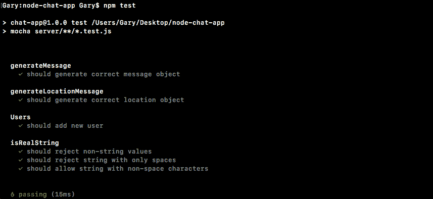

当我运行它时，它确实通过了。我们的`Users`区块和`should add new user`工作正常。

# 添加移除用户、获取用户和获取用户列表方法

在我们可以将用户集成到我们的应用程序中之前，让我们先完成构建。我们还有三种方法要添加和测试。第一个是`removeUser`，它要带一个参数，你要删除的用户的 ID。这也将返回刚刚删除的用户，所以如果我删除 ID 为 3 的用户，我想从列表中删除它，但我确实想返回对象。

我们会留下一个小纸条:

```js
removeUser (id) { 
  //return user that was removed 
} 
```

现在我们要填写的下一个方法是`getUser`。`getUser`方法将采用与`removeUser`完全相同的参数。我们将通过返回用户对象的 ID 来查找用户，但不会将其从阵列中删除:

```js
getUser (id) { 

} 
```

我们要创建的最后一个，如上所述，是一个名为`getUserList`的方法。这将获得所有用户的列表，只是他们的姓名和房间名称:

```js
getUserList (room){ 

} 
```

这意味着我们将遍历`users`数组，寻找其房间与指定房间匹配的所有用户。这将返回一个数组，类似于:`'Mike', 'Jen', 'Caleb'`，假设这些是房间里面的人:

```js
getUserList (room) {
  ['Mike', 'Jen', 'Caleb']
}
```

现在，请注意，我们没有指定房间或身份证属性；我们只是返回一个字符串数组。

# 为测试文件添加种子数据

现在让我们继续向测试文件中添加一件事。为了让这些方法发挥作用，我们将需要种子数据，我们将需要已经存在的用户，否则我们无法删除或获取一个，并且我们肯定无法获得这些不存在的用户所在房间的列表。

为了在`user.test.js`内部解决这个问题，我们将添加一个`beforeEach`调用，这是我们过去使用过的。正如我们所知，`beforeEach`调用将在每个测试用例之前被调用。它将帮助我们初始化一些数据。现在，我们要初始化的数据将被定义在`beforeEach`调用的正上方，在一个名为`users`的变量中:

```js
describe('Users', () => {
  var users;

  beforeEach(() => {

  });
```

我之所以在`beforeEach`之外定义它，是因为它在`beforeEach`内部是可访问的，在测试用例内部也是可访问的，我们已经在下面定义了。

在`beforeEach`内部，我们将设置`users`等于`new Users`，我们还将设置`users.users`数组。这里我们可以指定一个对象数组，这将让我们添加一些初始化数据:

```js
beforeEach(() => {
  users = new Users();
  users.users = [{

  }]
});
```

让我们继续提供三个对象。第一个将有一个等于`2`的`id`属性，我们将设置`name`属性等于类似`Mike`的东西，我们可以继续设置`room`属性等于我们喜欢的任何东西，我将继续使用一个房间名称`Node Course`:

```js
var users;

beforeEach(() => {
  users = new Users();
  users.users = [{
    id: '1',
    name: 'Mike',
    room: 'Node Course'
  }]
});
```

我们可以把这个物体再复制两次。我要加一个逗号，粘贴我刚才复制的内容，再做一遍，逗号后面跟着一个粘贴。我要把它改成第二个用户的 id`2`，我们会把名字改成类似`Jen`的东西，我们会把房间名字改成`React Course`。现在对于最后一个用户，我们将更改`id`和`name`，我们将使`id`等于`3`，我们将使名称类似于`Julie`，但是我们将把房间留为`Node Course`，这样我们就可以测试我们的`getUserList`函数确实返回了正确的结果:

```js
beforeEach(() => { 
  users = new Users(); 
  users.users = [{ 
    id: '1', 
    name: 'Mike', 
    room: 'Node Course' 
  },{ 
    id: '2', 
    name: 'Jen', 
    room: 'React Course' 
  },{ 
    id: '3', 
    name: 'Julie', 
    room: 'Node Course' 
  }] 
}); 
```

测试用例不需要使用这里定义的`users`变量。我们仍然可以定义一个自定义的，就像我们在添加新用户时定义的那样。如果我运行`test-watch script`、`npm run test-watch`，我们将看到我们的一个测试用例仍然通过:

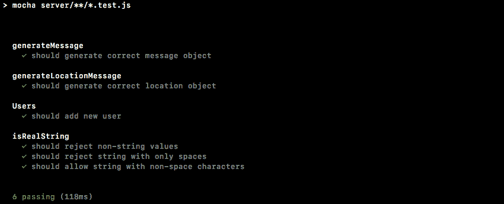

我将保存文件以重新运行测试套件，这里有 6 个通过测试的案例。不管我们是否使用这个，我们仍然可以使用一个定制的测试用例。

现在我们已经准备好了，我们可以开始填写其中的一些方法。我们一起填写`getUserList`，你负责`removeUser`和`getUser`。

# 填写获取用户列表

现在为了填写`getUserList`，我们将从查找其房间与指定的`room`参数匹配的所有用户开始。为了做到这一点，我们将在数组上使用`filter`方法，这是我们过去使用过的。让我们做一个变量，我们称之为`users`并将其设置为等于`this.users`，这是`users.filter`的数组:

```js
getUserList (room) {
  var users = this.users.filter((user) => {

  })
}
```

现在如果你还记得`filter`以一个函数作为它的自变量。每个用户都可以调用这个函数。我们可以返回`true`将该物品保留在阵列中，也可以返回`false`将其从阵列中移除。我将继续返回`user.room`，我们将使用三个等号来检查这是否等于`room`参数:

```js
getUserList (room) {
  var users = this.users.filter((user) => {
    return user.room === room;
  })
}
```

如果它们相等，`user.room === room`将导致`true`该值将被返回；如果它们不相等，将导致`false`并且用户不会被添加到上面的列表中。现在，我们可以继续使用 ES6 箭头功能的快捷方式。我们不添加`return`关键字并指定实际箭头，而是使用如下简写:

```js
getUserList (room){
  var users = this.users.filter((user) => user.room === room)
}
```

这是完全相同的功能，只是技术不同。现在我们有了一个符合标准的所有用户的列表。该过程的下一步是获取该对象数组，并将其转换为字符串数组。我们只关心拿到名单。为了做到这一点，我们将使用地图。我将创建一个名为`namesArray`的变量，我们将它设置为`users.map`:

```js
getUserList (room){
  var users = this.users.filter((user) => user.room === room);
  var namesArray = users.map
}
```

现在我们过去使用过`map`，我们知道`map`也有类似于`filter`的功能。它还被单独的项调用。在这种情况下，是单个用户，但是`map`让我们返回我们想要使用的值。所以我们要得到一个对象，它将拥有`id`属性、`room`属性和`name`属性，我们想要的只是`name`属性，所以我们要返回`user.name`。我们可以用箭头函数的简写来进一步简化。`user.name`将被隐式返回:

```js
var users = this.users.filter((user) => user.room === room); 
var namesArray = users.map((user) => user.name); 
```

现在我们有了`namesArray`数组，我们需要做的就是返回`namesArray`来返回它:

```js
getUserList (room){
  var users = this.users.filter((user) => user.room === room);
  var namesArray = users.map((user) => user.name);

  return namesArray;
}
```

现在这将完成工作，在我们进一步简化它之前，让我们继续编写一个测试用例来确保它能够工作。

# 为 getUserList 添加测试用例

在`users.test.js`里面，我们可以在我们的另一个测试用例`it ('should return names for node course')`下面添加测试用例。我们将编写一个案例，返回 Node 课程中的所有用户，我们应该让这两个用户返回，`Mike`和`Julie`。我们将制作一个变量，我们称之为变量`userList`，我们要做的是称之为已经定义的`users`变量:

```js
it('should return names for node course', () => {
  var userList = users
});
```

这是我们的种子数据。我们不需要像对另一个测试用例`users.getUserList`那样创建一个定制的测试用例。我们知道`getUserList`需要一个参数，你想要获取列表的房间的名字，这个叫做`Node Course`。确保你的大写对齐。然后我们可以继续，并在末尾添加一个分号:

```js
it('should return names for node course', () => {
  var userList = users.getUserList('Node Course');
});
```

最后要做的是添加我们的断言，确保我们得到的是预期的。我们将`expect``userList`等于，使用`toEqual`，下面的数组。这将是一个数组，其中第一项是`Mike`，第二项是`Julie`:

```js
it('should return names for node course', () => {
  var userList = users.getUserList('Node Course');

  expect(userList).toEqual(['Mike', 'Julie']);
});
```

如果该断言通过，我们知道`getUserList`如预期的那样工作，因为这正是我们在上面定义的。

现在我们可以继续复制这个测试用例了。对反应课程做同样的事情应该会返回`react`课程的名称，我们将`Node`改为`React`，我们将继续更新我们的`expect`。反应历程只有一个用户，该用户的`name`等于`Jen`:

```js
it('should return names for react course', () => {
  var userList = users.getUserList('React Course');

  expect(userList).toEqual(['Jen']);
});
```

这是一个非常好的测试案例。如果我们保存`users.test.js`，它将重新运行整个测试套件。我们应该看到我们在`users`描述块下有我们的三个测试，它们应该都通过了，事实确实如此:

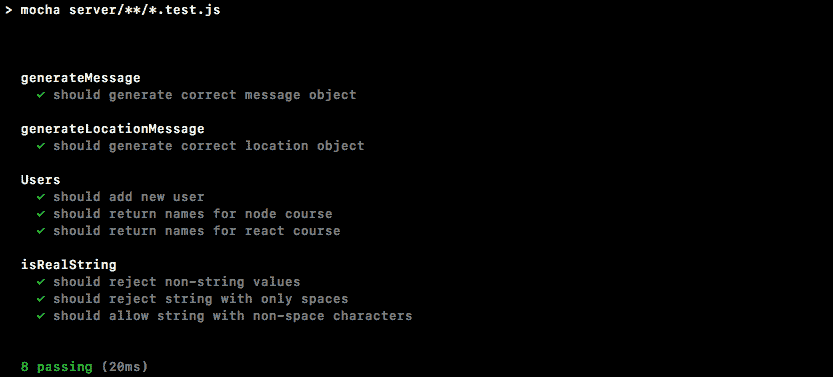

接下来我们将要创建的两种方法是`removeUser`和`getUser`。让我们一起为测试用例编写`it`语句，您将负责实际填写方法和测试用例:

```js
it('should remove a user', () => {

});
```

这个方法会取我们的一个种子用户的 ID，不管是 1，2 还是 3。它将把它传递给函数`removeUser`，你的工作将是断言用户确实被移除了。接下来，`it('should not remove user')`:

```js
it ('should not remove user', () => {

});
```

在这种情况下，我希望您传入一个不属于我们的种子`user`数组的 ID，这意味着类似 44，128，或者基本上不是 1，2 或 3 的任何字符串。在这种情况下，您应该断言数组没有改变；我们应该还有那三样东西。

这就是我们`removeUser`方法的两个测试用例，接下来是`getUser`。我们将添加两个类似的测试用例。首先，`it('should find user')`，你应该传入一个有效的 id，你应该把用户对象拿回来。另一个是`it ('should not find user')`，就像`it('should not remove a user')`一样。传入一个无效的标识，并确保您不会取回用户对象。

# 填充 getUser

我将从`getUser`开始，这里的目标是返回其 ID 与`getUser`中传递的参数 ID 相匹配的用户对象。为了做到这一点，我将使用`filter`。我们将从`this.users.filter`返回结果，我们将按 ID 过滤，这里我们按房间过滤。我们将使用表达式语法传入箭头函数，参数将是`user`，如果用户的`id`属性等于参数的标识，我们将继续并返回`true`。如果是这样的话，我们确实希望将这个`user`保留在数组中。最后，我们应该只有一个或 0 个用户，我们要做的就是返回第一项:

```js
getUser (id){
  return this.users.filter((user) => user.id === id)[0]
}
```

如果数组中有一个用户，我们将取回它的对象；如果没有用户，我们将得到未定义，这正是我们想要的。现在我们已经有了`getUser`我们可以为它编写测试用例。我们有两个测试用例，`it('should find user')`和`it('should not find user')`。

# 测试案例–应该找到用户

对于`it('should find user')`，我将从创建一个名为`userId`的变量开始，并将其设置为我想要使用的 ID。我需要一个有效的身份证，所以我将继续使用`2`。`1`、`2`或`3`会在这里工作:

```js
it('should find user', () => {
  var userId = '2';
});
```

接下来我将继续做一个`user`变量，这将是`getUser`的返回结果。我将它设置为`users.getUser`，我们将尝试通过传入`userId`来获取一个 ID 为`2`的用户:

```js
it('should find user', () => {
  var userId = '2';
  var user = users.getUser(userId);
});
```

现在我们要做的下一件事是断言我们得到了什么，我们应该已经得到了我们的对象，我们可以`expect``user.id`等于，使用`toBe`，和 ID，`userId`变量:

```js
it ('should find user', () => {
   var userId = '2';
   var user = users.getUser(userId);
   expect(user.id).toBe(userId);
});
```

我将继续保存测试套件，您可以看到我们所有的测试用例都还在通过，这太棒了。如果它不等于 ID，可能 ID 是`3`，你会看到测试用例失败，我们确实得到了一个非常明确的错误消息:


我们得到`Expected 2 to be 3`，显然不是这样。这是最后的测试用例，我们可以继续`it('should not find user')`。

# 测试用例-不应该找到用户

在这种情况下，我们将遵循一个非常相似的格式，就像应该找到用户一样，创建`userId`变量，并将其设置为一个内置用户中不存在的用户标识；类似`99`的东西可以完成工作:

```js
it('should not find user', () => {
  var userId = '99';
});
```

接下来，我们将制作一个`user`变量，再次存储来自`getUser`、`users.getUser`的返回结果，传入我们的`userId`:

```js
it('should not find user', () => {
  var userId = '99';
  var user = users.getUser(userId);
});
```

现在，在这种情况下，我们期望 undefined 返回，`filter`应该什么都不返回，如果您试图获取空数组中的第一项，您将得到 undefined。我们可以通过运行`node`在终端中证明这一点，在我们的小控制台中，我们可以创建一个空数组，我们可以访问第一个项目:

```js
**>[][0]** 
```

我们回来了。我将关闭它，重新启动我们的测试套件，在`inside users.test.js`文件中，我们将继续并做出我们的断言。我们要去`expect(user).toNotExist`:

```js
it ('should not find user', () => {
  var userId = '99';
  var user = users.getUser(userId);

  expect(user).toNotExist();
});
```

我将保存文件，并且我们所有的测试用例都应该通过:


太好了。接下来，我们需要编写`removeUser`方法，我们还需要填写测试用例。

# 填充 removeUser 方法

在`user.js`里面，我们可以从找到用户开始，如果有的话。这意味着，我们将使用类似于`getUser`方法的技术。我将从`getUser`方法中复制以下行，并将其粘贴到`removeUser`的正内部:

```js
return this.users.filter((user) => user.id === id) [0]
```

创建一个名为`user`的变量，将其设置为等于前一行。现在你也可以直接打电话给`getUser`。我可以打电话给`this.getUser`，就这样路过`id`:

```js
removeUser (id) {
  var user = this.getUser(id);
}
```

这两种解决方案都将如预期的那样发挥作用。接下来，如果有用户，我们要删除它，`if(user)`，我们要做一些特别的事情，不管用户是否存在，我们都要返回`user`值:

```js
removeUser (id) {
  var user = this.getUser(id);

  if (user) {

  }

  return user;
}
```

如果它不存在，我们将返回 undefined，这很好，如果它在我们删除用户后存在，我们将返回对象，也是我们想要的。我们需要做的就是想办法把它从名单上删除。

为此，我将把`this.users`设置为`this.users`，我们将调用`filter`查找所有 ID 与上面指定的不匹配的用户。我们将在我们的箭头函数中调用 filter passing，我们将获得单个的`user`，我们在箭头表达式语法中要做的就是添加`user.id`不等于`id`:

```js
if (user) {
  this.users = this.users.filter((user) => user.id !== id);
}
```

这将创建一个新的数组，将其设置为`this.users`，如果有的话，我们将移除该项目。如果没有项目，没关系；该语句永远不会运行，并将能够继续返回 undefined。

现在我们已经准备好了，我们可以继续编写一个测试用例，确保它能按预期工作。我将保存`user.js`并且就在`users.test`内部，我们将填充`it ('should remove a user')`和`it ('should not remove user')`测试用例。让我们从`should remove a user`开始。

# 测试用例–应该删除一个用户

我将创建一个变量`userId`来存储理想的 ID，它将是`1`、`2`或`3`，我将使用`1`，然后我们可以继续并实际移除它，将返回结果存储在一个`user`变量中。我要传入我的`userId`变量，也就是`1`来调用`users.removeUser`:

```js
it('should remove a user', () => {
  var userId = '1';
  var user = users.removeUser(userId); 
});
```

现在我们有了潜在的删除用户，我们应该能够继续断言一些东西。我们要去`expect`证明`user`物体的存在。我们还期望它的`id`等于我们上面的`id`，而用户移除的`expect`具有使用`toBe(userId)`的`id`属性:

```js
it('should remove a user', () => {
  var userId = '1';
  var user = users.removeUser(userId);

  expect(user.id).toBe(userId);
});
```

接下来，我们将确保用户已从阵列中移除。我们要去`expect(users.users.length).toBe)`在这种情况下`2`:

```js
it('should remove a user', () => {
  var userId = '1';
  var user = users.removeUser(userId);

  expect(user.id).toBe(userId);
  expect(users.users.length).toBe(2);
});
```

一开始应该是`3`，一旦我们移除了一个用户，应该是`2`。

# 测试用例–不应删除用户

在不应该删除用户的情况下，我们要做一些类似的事情，我们只是要调整`userId`。我实际上可以复制第一个测试用例的内容，粘贴到第二个测试用例中，我们只需要做一些调整。我要把 id 改成像`99`一样的无效 ID。我们还是要用身份证给`removeUser`打电话。在这种情况下，虽然不是期望`user`拥有`id`房产，但我们会期望`user`不存在使用`toNotExist`。接下来，我们将进行`expect`长度没有变化，我们将确保长度仍然等于`3`:

```js
it ('should not remove user', () => {
  var userId = '99';
  var user = users.removeUser(userId);

  expect(user).toBe(userId);
  expect(users.users.length).toBe(3);
});
```

现在我可以继续保存`users.test`文件了。这将重启`nodemon`内部的一切，我们应该得到的是一个通过的测试套件。看起来它确实已经运行了，尽管内容没有改变，所以很难判断是否发生了什么。我将关闭它并运行`npm test`来验证，在这里您可以看到所有 12 个测试用例都通过了:


我们现在有了跨不同事件侦听器持久化用户所需的所有方法；无论他们是在发送消息、位置消息，无论他们是在连接还是离开，我们都将能够跟踪他们，并将正确的东西发送给正确的人。

# 连接用户列表

在这一节中，我们将开始连接我们创建的用户类，为了开始，我们将连接`People`列表，这意味着当用户加入时，以及当用户离开时，我们需要做一些事情。我们希望保持列表的最新状态，每次更新时，我们都希望给客户一份新的列表副本。这意味着服务器将需要向客户端发出一个事件，然后客户端将监听该事件并更新标记。

现在，我们可以通过使用以下命令启动服务器来查看这将在哪里发生:

```js
**nodemon server/server.js** 
```

然后，我要去`localhost:3000`打开一个聊天页面。我将输入`Andrew`作为显示名称，输入`LOTR`作为房间名称。现在，一旦我们进入，我们就有了我们的人员列表，目前它应该会显示我们，因为我们在房间里，当新用户加入时，它应该会自动显示该用户:

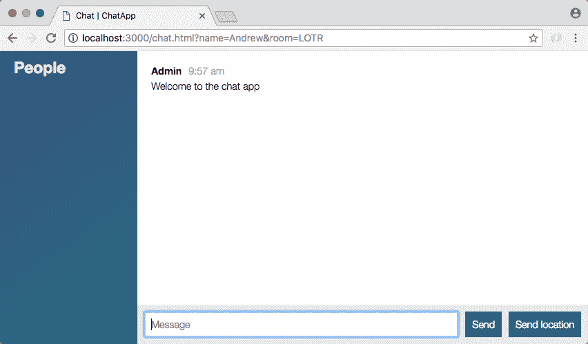

现在这一切都没有发生，但是随着我们新活动的进行，这一切都将发生。

# 在聊天室中添加联系人列表

现在我们要做的第一件事就是弄清楚这个事件会是什么样子。在`chat.js`里面，我们可以添加一个监听器，弄清楚什么对我们有用，客户真正需要什么来完成这个任务？然后，我们可以继续连接服务器来满足这些需求。

就在`chat.js`的内部，就在`disconnect`的下方，我们将添加一个新的收听者，`socket.on`，我们将收听一个全新的事件。这个要叫`updateUserList`:

```js
socket.on('disconnect', function() {
  console.log('Disconnected from server');
});

socket.on('updateUserList')
```

现在`updateUserList`需要传递一些信息。我们需要显示用户列表，而不是当前显示的列表，这意味着我们需要一个参数，一个`users`数组。这个`users`数组将会是一个名字数组，就像我们从`users`类里面的`getUserList`返回的一样。

回到`chat.js`内部，目前，我们要做的就是在列表通过时将它记录到屏幕上，`console.log('Users list')`，第二个参数将是实际的`users`数组:

```js
socket.on('updateUserList', function(users){
  console.log('Users list', users);
});
```

一旦我们连接好了，我们需要做的就是添加一些 jQuery 来更新 DOM。更难的是将更新的最新列表返回给客户。

# 添加 jQuery 来更新 DOM

在`server.js`内部，这个过程的第一步是导入我们一直努力创建的类。我将继续完成这项工作，就在我们载入`isRealString.`的位置下方

我们可以做一个常量，我将继续进行并去掉`users`属性，这是我们在`users.js`底部导出的属性，我们可以使用`require`导入它。我要要求本地文件`./`。在`utils`文件夹里，这个叫`users`:

```js
const {Users} = require('./utils/users');
```

现在我们已经有了`Users`我们可以创建一个新的实例。这将是`users`实例。我们需要一种方法来运行这些方法，所以就在我们的`io`变量下面，我们可以创建一个名为`users`的新变量，将其设置为等于`new Users`，就像这样:

```js
var users = new Users();
```

现在，我们将能够调用所有的用户方法来添加、移除、获取和操作这些数据。

# 将用户添加到用户列表

这个过程的第一步是在用户加入聊天室时将他们添加到列表中。我们可以在呼叫`socket.join`后立即这样做。我将删除旧的评论，尽管如果你发现它们是一个很好的参考，你可以选择保留你的评论。在`socket.join`的正下方，我们将调用`users.addUser`，添加我们的全新用户，我们需要传入这三条信息，插座 ID，`socket.id`是存储的位置，名称，在`params.name`上，最后我们将继续传入房间名称，`params.room`:

```js
socket.join(params.room);
users.addUser(socket.id, params.name, params.room);
```

现在，正如您注意到的，如果出现验证错误，这段代码不应该运行，这意味着没有提供名称或房间名称，但目前情况并非如此。我们实际上并没有停止函数执行，我将使用`return`来确保如果数据无效，下面的代码不会触发:

```js
socket.on('join', (params, callback) => {
  if(!isRealString(params.name) || !isRealString(params.room)){
    return callback('Name and room name are required.');
  }
});
```

# 添加具有唯一标识的用户

该过程的下一步将是确保已经没有具有相同标识的用户。我将调用`users.removeUser`来完成这个任务，传递唯一的参数需要`socket.id`就像这样:

```js
socket.join(params.room);
users.removeUser(socket.id);
users.addUser(socket.id, params.name, params.room);
```

这意味着用户加入房间，我们将他们从任何潜在的先前房间中移除。最后，我们将它们添加到新的。现在我们已经有了这个，我们可以开始发射那个事件了。

# 向客户端发出事件

我们将使用`users`数组发出客户端期望的事件`updateUserList`。如果我们不发出事件，客户端永远不会得到新的列表，我们只是更新了列表，所以我们肯定希望他们得到一个新的副本。这意味着我们希望通过`io.to`向聊天室的每个人发出事件。我们将传入房间名称，然后我们将调用`emit`，发出事件。

现在我们可以先填写，我们想传入房间名，`params.room`有那个信息，接下来我们想发出事件，我们刚刚在`chat.js`中定义的事件名是`updateUserList`。我们最不需要做的就是获取用户列表。我们已经有了，`users.getUserList`，传入我们想要获取列表的房间名称。`params.room`再一次，这将是我们传递的唯一论点:

```js
socket.join(params.room);
users.removeUser(socket.id);
users.addUser(socket.id, params.name, params.room);

io.to(params.room).emit('updateUserList', users.getUserList(params.room));
```

有了这个电话，我们应该能够在终端内实际查看。

我将保存这个文件，它将在终端中重新启动服务器。

# 测试聊天室中的用户列表

在浏览器中，我可以打开开发者工具来查看`console log`语句，我将对应用程序进行刷新。如果我刷新应用程序，我们会看到一个`Users`列表，并且我们会让`Andrew`打印两次:

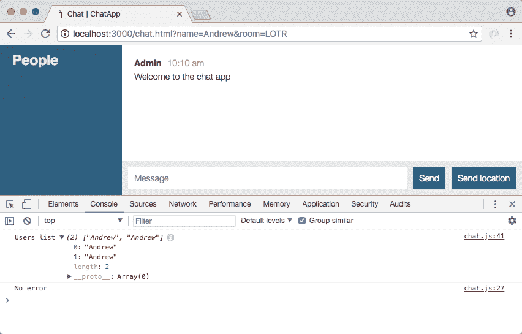

如果我第二次刷新页面，我们有三次`Andrew`打印:


如您所见，这是因为当用户离开聊天应用程序时，我们不会将他们从列表中删除。这是本节的第二个目标。我们目前有一个用户列表。我们所需要做的就是在用户离开时更新它，这将发生在`disconnect`监听器底部附近的 Atom 内部。

# 删除离开聊天室的用户

在断开侦听器中，我们希望删除用户，然后再次更新列表。我将通过做一些单独的事情来做到这一点。首先，我们将创建一个名为`user`的变量，用于存储任何可能被移除的用户，记住`removeUser`方法确实会返回被移除的用户，`users.removeUser`会传入 ID，`socket.id`:

```js
socket.io('disconnect', () => {
  var user = users.removeUser(socket.id);
});
```

现在我们只想做一些事情，如果我们真的删除了一个用户，如果这个人没有加入一个房间，就没有理由去做任何事情。如果一个用户被移除，我们将发出两个事件，并且我们将向连接到聊天室的每个人发出它们，这意味着我们将使用`io.to().emit`，就像我们在前面的代码中所做的那样。我们要做两次，所以我要复制这一行并粘贴它，像这样:

```js
socket.io('disconnect', () => {
  var user = users.removeUser(socket.id);

  if (user){
    io.to().emit();
    io.to().emit();
  }
});
```

# 当有人离开聊天室时更新用户列表

第一个是更新`user`列表，第二个是打印一条小消息，比如`Andrew has left the room`。第一个是将用户房间属性作为唯一的参数，`user.room`存储房间字符串，我们将为这两者提供，现在我们可以开始发出我们的事件。

我将首先发出`updateUserList`事件，内部引用，`updateUserList`，我们将继续调用我们在上面做的完全相同的方法，`users.getUserList`，在房间内传递，`user.room`:

```js
if (user){
  io.to(user.room).emit('updateUserList', users.getUserList(user.room));
  io.to(user.room).emit();
}
```

现在，当有人离开一个房间时，他们将被从列表中删除，我们将不会看到我们在 web 开发人员控制台中看到的那些副本。

# 发出自定义消息

接下来我们要做的是发出一条信息。我们将从管理员那里向每个人发出一条消息，就像我们在上面做的那样。我们向用户打招呼，并告诉所有其他用户有人加入，就在这里我们将进入`emit('newMessage')`，我们将像过去一样呼叫`generateMessage`。我们将通过这两个论点，第一个是`Admin`。这将是一条管理消息，第二条消息可以是一个模板字符串，我们将注入用户名`user.name`，然后我们将说用户已经离开:

```js
io.to(user.room).emit('updateUserList', users.getUserList(user.room)); 
io.to(user.room).emit('newMessage', generateMessage('Admin', `${user.name} has left.`)); 
```

既然我们已经做好了准备，一切都应该按预期进行。希望在 Chrome 里面我们不再有这些副本。我将刷新页面，我们看到只有一个用户的用户列表，`Andrew`:


如果我刷新页面，我们不再得到重复的，因为当我离开时，我被删除，当我回来时。当页面最终完成刷新时，我被添加。现在，如果我添加一个新用户，同样的事情也会发生。目前，我将切换浏览器，只占用屏幕一半的宽度。我将打开第二个选项卡，并将它拖到另一半，这样我们就可以并排查看这两个选项卡。我还将打开第二个选项卡的开发人员工具，我们将加入完全相同的房间。

去`localhost:3000`吧，我要加入成为`Mike`，房间名称也要一样，`LOTR`。现在，只要我点击加入，我应该会看到两个控制台的更新列表。我要点击加入。右浏览器窗口里面有`Andrew`、`Mike`，左浏览器窗口里面也有`Andrew`、`Mike`，太神奇了:

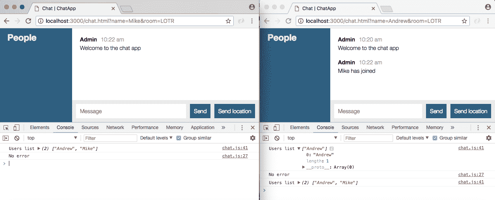

我还收到一条小消息，说迈克已经加入，那是早些时候的事了；真正的测试是当用户离开时会发生什么。我要把安德鲁踢出聊天室，在我们的另一个聊天窗口里，我们有安德鲁留在屏幕上打印，我们有只有一个用户的新用户列表，`Mike`:

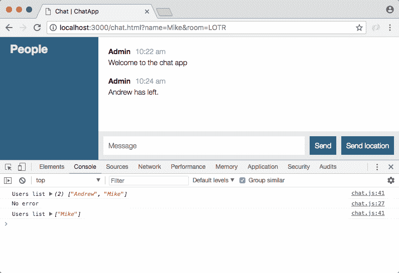

这太棒了。我们现在跟踪用户的来去，这让我们可以做一些非常酷的事情，比如打印定制消息和更新人员列表。

# 向聊天室呈现用户名

最后一件要做的事情是将名称真实地呈现在屏幕上。我们不仅仅是在控制台中打印它们，而是想把这些名字添加到列表中，这将在`server.js`中的事件监听器中发生。我们将像过去一样使用 jQuery。在`chat.js`里面，我们要用那些`users`做点什么。

# 添加 jQuery 将用户添加到列表中

首先，让我们创建一个新的 jQuery 元素。我们将制作一个名为`ol`的变量。这将使用 jQuery 存储一个新元素。我们将创建一个有序列表。我们将创建`ol`标签:

```js
socket.on('updateUserList', function(users){
  var ol = jQuery('<ol></ol>');
});
```

现在我们需要迭代每个用户与该用户一起做的事情，`users.forEach`将让我们完成它。我们将传递我们的函数，在该函数中，我们可以添加单个用户:

```js
socket.on('updateUserList', function(users){
  var ol = jQuery('<ol></ol>');

  users.forEach(function () {

  });
});
```

函数的参数是名称`user`字符串，我们要做的就是在上面的有序列表中添加一些东西。那将是`ol.append`:

```js
socket.on('updateUserList', function(users){
  var ol = jQuery('<ol></ol>');

  users.forEach(function () {
    ol.append();
  });
});
```

现在我们到底要追加什么？我们想要添加一个列表项，列表项将有一个等于名称的`text`属性，这将使一切呈现得恰到好处。我们可以使用 jQuery 通过打开和关闭我们的列表项标签来创建一个新的列表项。然后就在 jQuery 的右括号之后，我们将调用`text`，这样我们就可以安全地将`text`属性设置为与用户名相等:

```js
socket.on('updateUserList', function(users){
  var ol = jQuery('<ol></ol>');

  users.forEach(function (user) {
    ol.append(jQuery('<li></li>').text(user));
  });
});
```

现在我们有了一个更新的列表，但它实际上并没有呈现在屏幕上，最后一步是通过将其添加到 DOM 来呈现它。

# 呈现更新的人员列表

现在在里面`chat.html`我们确实有一个地方。它是带有`users`的`id`的`div`标签，这意味着我们可以选择它，`jQuery`，选择器将以哈希符号(`#`)开始，因为我们是通过标识选择的，我们选择`users`，然后我们可以继续并实际添加列表。我将把`html`属性设置为我们的有序列表`ol`，与使用 append 相反，我们不想更新列表，我们想完全擦除列表，用新版本替换它:

```js
socket.on('updateUserList', function(users){
  var ol = jQuery('<ol></ol>');

  users.forEach(function (user) {
    ol.append(jQuery('<li></li>').text(user));
  });

  jQuery('#users').html(ol);
});
```

现在我们可以保存`chat.js`并测试出来。

# 在聊天室测试用户名

在浏览器内部，我将继续关闭控制台，刷新页面，我们看到数字 1 后面跟着 Mike:

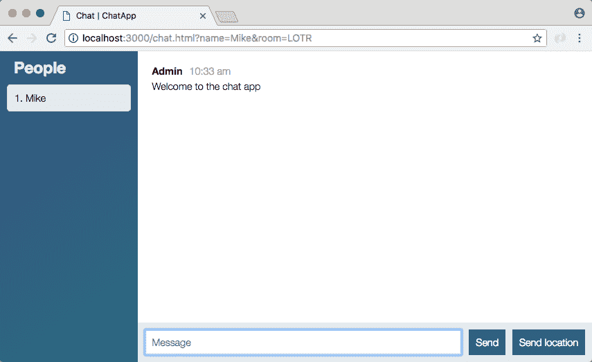

第一个是因为我们使用的是有序列表。如果我添加第二个用户，我们将看到第二个用户。让我们创建第二个用户，我们给它一个显示名称`Jen`，然后我们去同一个房间，`LOTR`，当我们加入时，我们得到一条小消息，我们得到我们的两个用户，同样的事情出现了:


现在我将转到第二个选项卡，并关闭第一个选项卡。当我这样做时，您的列表会自动更新，我们也会收到消息，说 Mike 已经离开了:


有了这些，我们离完成又近了一步。这些信息仍然会发送给每个人，它们并不是针对房间的，但这是我们将在下一节中处理的事情。现在我们结束了。我要做一个承诺，已经有一段时间了，我们确实有一个完整的功能，所以让我们继续做吧。

# 提交更新的用户列表

首先，我们将运行`git status`，我们有一些新的文件以及一些现有的文件，我将使用`git add .`将所有这些文件添加到下一个提交中。最后，我们可以使用`git commit`来实际进行提交，我将使用`-m`标志来添加我们的消息，并且就在引号`Add Users class and updateUserList event`的内部:

```js
git commit -m 'Add Users class and updateUserList event'
```

我们可以继续做这个承诺，并把它推给 GitHub，如果你想的话，请随意推给 Heroku，我会再拖一会儿，一切都应该在那里以及本地工作。

在下一部分中，我们将确保消息，无论是文本消息还是位置消息，只发送给房间里的人。

# 仅向房间发送消息

在最后一部分，我们连接了人员列表，以确保随着新用户的到来和离开，列表会得到更新。在这一部分，我们将确保我们的文本和位置信息只发送给同一房间的用户。目前，它被发送给每个人。我们可以证明，通过打开一个新的连接，我将使用`Mike`，我们将加入一个不同的房间，`The Office Fans works`。当我加入房间时，您可以看到人员列表确实是正确的，一个房间中的用户不会为另一个房间中的用户更新人员列表。但不同的是，短信不遵循这些规则，基于位置的信息也不遵循这些规则:


我们会有一条短信和一条位置信息，如果我去另一个房间的聊天应用程序，我们会得到这两个信息。这是一个问题。我们还有一个名字的问题，目前用户显示的是文本消息，管理员显示的是位置消息，我们希望确保使用实际用户的名字，无论是珍还是安德鲁。为了做到这一点，我们需要对两者进行一些修改。我们有`creatMessage`和`createLocationMessage`的事件监听器，我们还将在`chat.js`内部进行一些更新，这实际上是我们要开始的地方。

# 更新 chat.js 和 server.js 文件

目前，名称`User`，我们在浏览器内部看到的错误名称，来自于`chat.js`中的`socket.emit`功能:

```js
socket.emit('createMessage', {
  from: 'User',
  text: messageTextbox.val('')
}, function() {
  messageTextbox.val('')
});
```

客户端最初发送了名称，但现在不再是这样了，名称由服务器存储，因此我们将从`createMessage`中删除该名称作为必需的属性，我们将只发送文本。

```js
socket.emit('createMessage', {
  text: messageTextbox.val('')
}, function() {
  messageTextbox.val('')
});
```

现在有了这个，我们可以在`server.js`内部修改事件监听器。在`server.js`中，`createMessage`获取这两个属性，并将其直接填充到`generateMessage`中。相反，我们将使用`users.getUser`找到用户，并使用它做一些事情。

在`createMessage`中，我们可以删除`createMessage`的`console.log`语句，我们将创建一个可变用户，将其设置为`users.getUser`。这是我们在`users.js`、`getUser`中创建的方法，取`id`参数。我们可以传入 ID `socket.id like this`:

```js
socket.on('createMessage', (message, callback) => {
  var user = users.getUser(socket.id);

  io.emit('newMessage', generateMessage(message.from, message.text));
  callback();
});
```

现在我们可以用`user`做点什么了。我们只想在用户确实存在的情况下做一些事情，这意味着我们将使用`if`语句检查用户是否存在，并且我们还将确保传递的文本是真实的字符串，在`&&`、`isRealString`之后使用。然后我们将通过`message.text`:

```js
socket.on('createMessage', (message, callback) => {
  var user = users.getUser(socket.io);

  if(user && isRealString(message.text)){

  }

  io.emit('newMessage', generateMessage(message.from, message.text));
  callback();
});
```

这意味着如果有人试图发送一条空消息或一堆空格，它不会被发送给其他人。现在在`if`语句中，我们要做的就是发出消息。我们知道它是有效的，所以我们确实想发射一些东西，我们要取`io.emit`线，把它剪下来，粘贴在`if`声明中:

```js
if(user && isRealString(message.text)){
  io.emit('newMessage', generateMessage(message.from, message.text));
}
```

现在`io.emit`线向所有人发射，不仅仅是用户连接的房间，我们也使用`message.from`。我们真的想在用户身上使用`name`属性。我们现在将进行这两项更改，只向用户连接的房间发出此事件，并确保提供他们的姓名，而不是`message.from`。

# 向单个房间发出事件

首先，我们想要发射到一个特定的房间，我们知道我们可以在`io.emit`行中添加一个 to call 来完成，传递房间名称，访问`user`对象`user.room`上的名称。现在我们只发射到单个房间，我们也想改变我们使用的名称。我们将访问`user`对象`user.name`上的名称，而不是`message.from`，然后开始:

```js
io.to(user.room).emit('newMessage', generateMessage(user.name, message.text)); 
```

现在我们有了一个更好的系统来发送这些短信。我将刷新我的第一个选项卡和第二个选项卡，我们将发送一些短信。我将从我的第二个标签发送数字`1`，我们确实得到了安德鲁，我们确实看到了数字 1:


在我们的另一个标签页中，信息无处可寻，因为我们只是将它发送给`The Office Fans`房间中的用户:

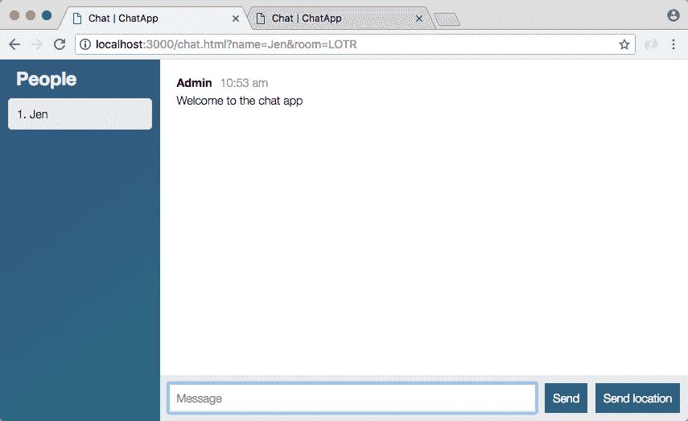

如果我尝试从第一个标签发送消息，我们会看到它的名字是 Jen，第二个标签看起来也不错；我们看不到珍的信息。

现在我可以继续加入一个房间了。我要用`Mike`这个名字，我们要再加入一次`The Office Fans`。当我进入房间时，我确实看到安德鲁和迈克都接通了:

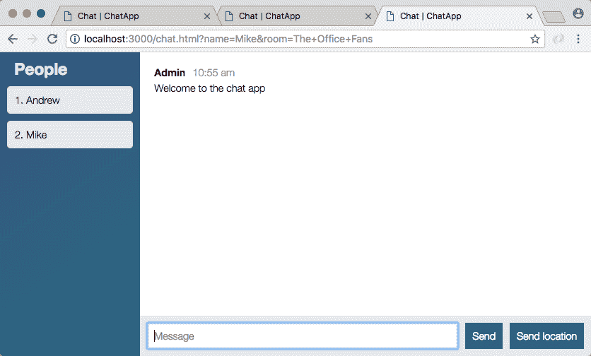

如果我发送类似`Should work`的消息，我会在那里看到它，我也会在连接到`The Office Fans`房间的另一个用户的标签中看到它。连接到不同房间的其他人也看不到它。这就是我们需要做的所有事情，让我们的信息正确发送。最后要做的事情是为`createLocationMessage`接线。

现在，正如我们刚刚看到的，我们也能够解决验证问题，如果我现在尝试点击*进入*，什么都不会发生。我没有被移出盒子，焦点没有改变，也没有消息发送，这很好。

# 连线创建单个房间的联系信息

现在我们要修复`createLocationMessage`。在创建消息的情况下，您会像上面一样想要找到用户。如果有一个用户，你会想把位置发送给同一个房间的人。除了提供`Admin`作为名称，您还需要使用用户的真实姓名。我们需要确保它仍然被发送给同一房间的用户，并确保它不会被发送给其他房间的用户。

为此，我将从获取用户开始，因为我们需要使用该对象的信息。我们要让一个变量用户调用`users.getUser`，我们要传入那个套接字 ID，`socket.id`。这与我们上面在`createMesssage`中使用的线条相同。现在我们只想在找到用户时发出一条消息，所以我要检查用户对象是否存在。如果是，我们可以取`io.emit`线，剪下来，抄在`if`声明里面。如果真的存在，我们要发射`newLocationMessage`:

```js
if(user){
  io.emit('newLocationMessage', generateLocationMessage('Admin', coords.latitude, coords.longitude));
}
```

现在，我们仍然需要通过添加对`to`的调用并传入房间名称来将它发送到特定的房间，`user.room`存储该信息，最后但同样重要的是，我们确实想要更新名称。我们将使用用户的真实姓名`user.name`，而不是发送静态的`Admin`姓名:

```js
io.to(user.room).emit('newLocationMessage', generateLocationMessage(user.name, coords.latitude, coords.longitude));
```

有了这个，现在`createLocationMessage`被连接成私有的，并传送正确的信息。在 Chrome 中，我将一次一个地浏览我的标签，给它们一个刷新，在第二个标签上，我将发送位置。这将只需要几秒钟就能真正获取它，我看到它就在那里，名称显示正确:


我们有安德鲁，我们有一个链接来查看谷歌地图内部的位置。现在如果我转到第二个选项卡，也连接到`The Office Fans`的用户，我会看到完全相同的位置消息:


如果我看第一条，你可以看到 Jen 无法访问这条消息，因为她在不同的房间:

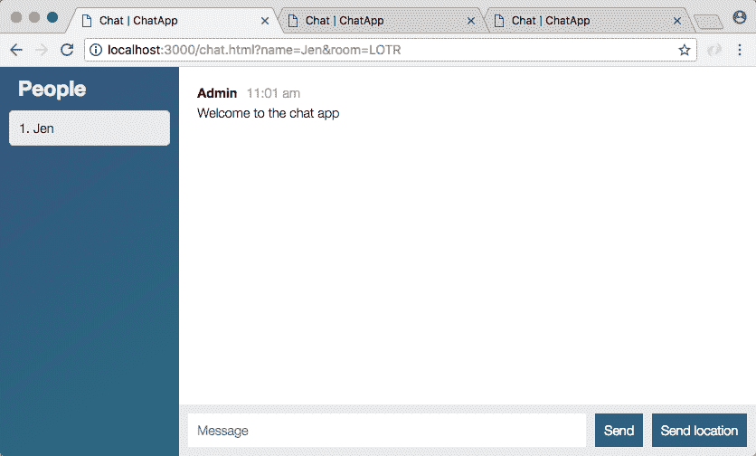

她总是可以和她房间里的任何人分享她的位置，碰巧没有人，这条信息不会出现在任何地方，因为没有其他人连接到`LOTR`。

有了这些，我们就大功告成了，我们的信息是保密的，只有同一个房间的人才能看到。让我们继续，通过提交我们的更改来结束这一次。

# 提交单个房间变更

我要关闭`nodemon`服务器，使用`clear`，我们可以运行`git status`看看我们有什么样的变化:

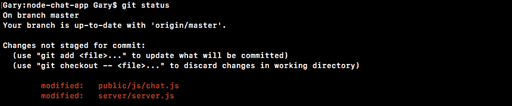

这里我们只有两个文件。它们被修改了，这意味着我们可以使用带有`-am`标志的`git commit`，无论是单独的还是相同的，它们都有相同的特征集，然后我们提供我们的消息字符串，`Send messages to only people in same room`:

```js
**git commit -am 'Send messages to only people in same room'** 
```

有了这个，我们可以继续使用`git push`将它推送到 GitHub，我也将继续使用`git push heroku master`部署到 Heroku。一旦它被部署在 Heroku 上，我们可以花一点时间来确保我们刚刚添加的所有这些功能仍然像预期的那样工作。我预计它们仍然会起作用，但这绝对值得一试，因为环境有点不同，总有可能出问题。

现在，如果出现问题，作为提醒，您可以随时使用`heroku logs`，这将向您显示服务器上的日志，通常有点神秘，但是当出现错误时，您将看到一个非常大的块。通常很容易发现，并且通常包含关于哪里出错的有用信息:


看起来我们的应用部署成功了，所以我可以用`heroku open`在我的浏览器里面打开它，一旦打开，我们实际上可以访问一些聊天室。我将关闭我的本地主机选项卡，我将作为`Andrew`加入，房间`Philadelphia`:


一旦我进入房间，我将发送一条消息，然后我将向房间添加第二个用户。我们想访问我们的 Heroku 应用网站。我要去参观那个，我们将作为`Vikram`加入房间，我们可以加入完全相同的房间`Philadelphia`。当我加入时，我会看到两者的人员列表更新，发送消息仍然有效:

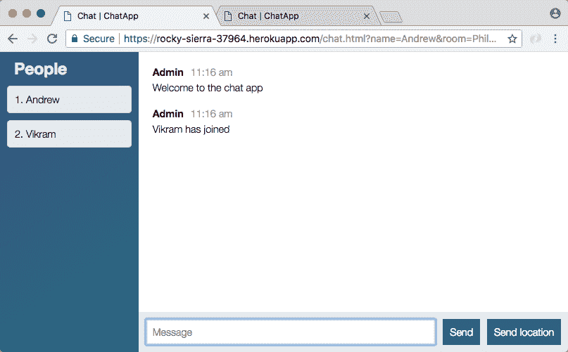

来自第二个选项卡的消息确实出现在第一个选项卡中，这很好。所有这些都是可能的，因为我们连接了`server.js`，随着时间的推移跟踪用户。当他们第一次加入时，我们将他们添加到列表中，当他们发送消息时，我们确保使用他们的信息，当他们离开时，我们将他们从列表中删除。这可以确保人员列表始终是最新的，并且消息只发送给同一房间的其他人。

# 新的特色创意

现在我们已经有了我们的联系人列表，我们的消息只发送给同一个聊天室的用户，我们完成了。但这并不意味着你必须停止开发聊天应用，学生总是喜欢添加新功能。

我想给你一些关于你现在能做什么的想法。添加这些功能时，您可能会陷入困境。这可能是一个真正令人头疼的问题，可能会持续很长时间，但我保证，当你独自做一些事情的时候，你会在一路上学到很多东西。现在，您已经掌握了完成这些功能的所有技能，所以让我们快速浏览一下列表。

*   一个很棒的想法是让聊天室不区分大小写。目前，如果我用小写的`r`去`LOTr`，我实际上和我的朋友不在同一个聊天室，他用大写的`LOTR``R`。如果无论如何我们都在同一个房间就好了。
*   接下来，我想让用户名独一无二。目前，我可以复制网址并粘贴到一个新的选项卡中，现在我有两个人的名字是朱尔斯:


*   拒绝与现有用户同名的新用户会很酷。
*   接下来，一个想法是在下面添加一个当前活跃聊天室的列表。这可能是一个选择下拉列表，它会像人民列表一样重新填充。
*   这是迄今为止最难的功能，但我认为它会非常酷。这意味着我会在“加入”按钮和“房间名称”输入框之间看到一个下拉列表，它会有两个当前活动的房间，`LOTr`和`LOTR`带有大写的 R，尽管希望如果您实现第一个功能，我们只会看到一个房间。然后，我可以从下拉列表中选择一个名字，输入一个名字并以这种方式加入，而不是输入一个`room`的名字。

这些只是一些关于如何继续使用聊天应用程序的想法。

# 摘要

在这一章中，我们研究了如何使用`class`关键字在 ES6 中创建类。我们制作了一个`Person`类，这只是一个例子，我们制作了我们的`Users`类，我们将在整本书中使用它。我们研究了添加自定义方法以及设置我们的`constructor`功能。然后，我们以类似的方式创建了`removeUser`、`getUser`和`getUserList`方法。

接下来，我们研究了当用户加入或离开聊天室时，如何连接我们创建的`users`类并更新`People`列表。然后，我们研究了向特定房间发送消息，而不是向所有用户发送消息。最后，我们添加了一些想法，您可以研究以增强聊天室的功能。

在本章中，我们将学习异步/等待项目设置。