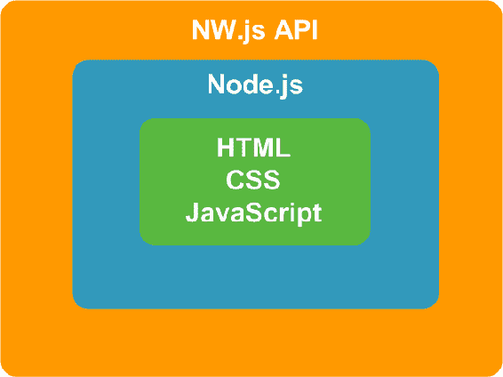
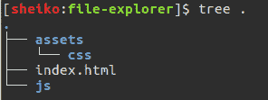
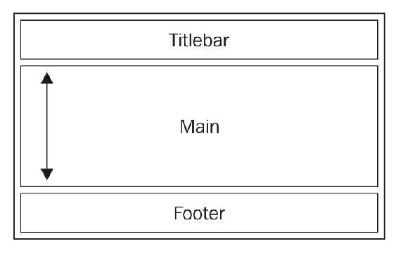
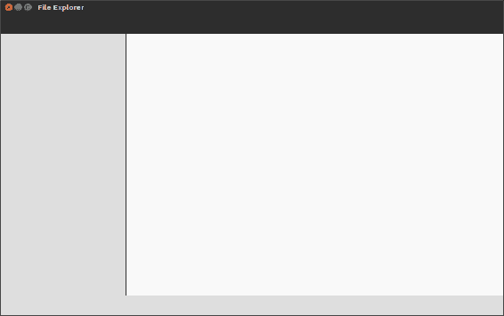
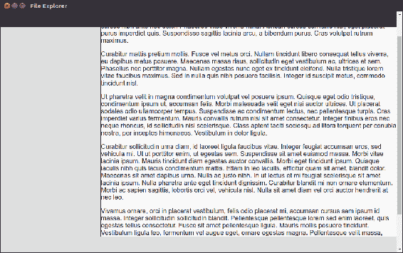
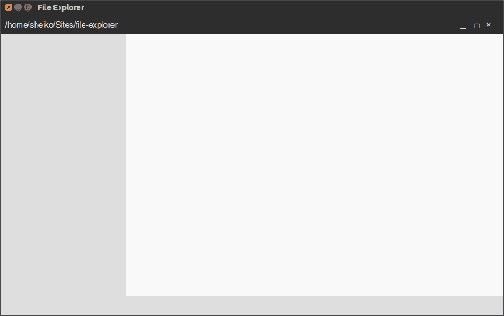
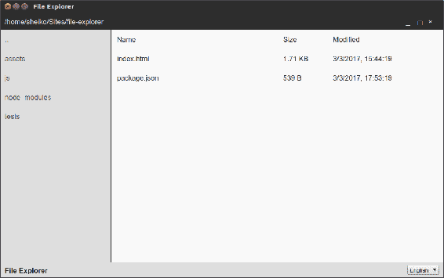

# 一、使用 nw .js 创建文件管理器——规划、设计和开发

如今，当谈到 HTML5 桌面应用程序开发时，就意味着**NW.js**或**Electron**。 第一种方法的学习曲线较短，这使得它成为初学者的更好选择。 我们的第一个应用程序将是一个文件管理器。 这类软件传统上被认为是经典的桌面应用程序。 我相信您会发现用 HTML、CSS 和 JavaScript 构建一个文件资源管理器是令人兴奋的。 本章不需要 JavaScript 框架的任何技能，因为我们将使用它们。 您所需要的只是 HTML、CSS 和普通 JavaScript(包括 Node.js)的基本知识。

那么，我们要做什么? 我们将计划并草拟这个项目。 我们将设置开发环境，创建一个静态原型，并使用 NW.js 运行它。 我们将实现基本的功能，准备在[第二章](2.html)，*中增强它，用 NW.js 增强和交付创建一个文件资源管理器*。

# 应用蓝图

File Explorer，我指的是一个小程序，它允许在文件系统中导航并对文件执行基本操作，可以用以下用户故事来表示:

*   作为用户，我可以看到当前目录的内容
*   作为用户，我可以浏览文件系统
*   作为一个用户，我可以在默认的关联程序中打开一个文件
*   作为一个用户，我可以删除一个文件
*   作为用户，我可以在剪贴板中复制一个文件，然后将其粘贴到新的位置
*   作为一个用户，我可以用系统文件管理器打开包含该文件的文件夹
*   作为用户，我可以关闭应用程序窗口
*   作为用户，我可以最小化应用程序窗口
*   作为一个用户，我可以最大化和恢复应用程序窗口
*   作为用户，我可以改变应用程序语言

以视觉的形式感知它会更容易，不是吗? 线框图在这里很有用。 Wireframe 是应用程序的骨架框架，它描述了应用程序内容的安排，包括 UI 元素和导航系统。 线框没有真正的图形，排版，甚至颜色。 它示意性地显示了应用程序的功能。 正如你所知道的，用铅笔在纸上画画是可能的，但这不是创建线框的最好方式; 我们需要的是一个原型工具。 今天，市场上有很多解决方案。 在这里，我使用了一个令人印象深刻，但价格低廉的工具**WireframeSketcher**([http://wireframesketcher.com/](http://wireframesketcher.com/))。 它允许您绘制 web、桌面和移动应用程序的草图(这正是我们所需要的)。 它也有一个丰富的模板、小部件、图标和模板的模型库，使原型制作快速和容易。 此外，线框看起来很粗略的风格:


我们在线框上看到的东西通常被称为**圣杯布局**。 在我们的例子中，标题作为窗口的标题栏。 在那里，我们保留窗口操作的控件，如关闭、最大化和最小化。 除此之外，在标题栏中，我们还显示了当前目录的路径。 在侧栏中，我们有文件系统导航。 主部分包含一个表示当前目录文件的表。 它有列——Name、Size 和 Modified。 右键单击文件会打开带有可用文件操作的上下文菜单。 页脚包括应用程序标题和语言选择器组合框。

# 建立一个 NW.js 项目

js 是一个用于构建 HTML、CSS 和 JavaScript 应用程序的开源框架。 你也可以把它看作是一个无头浏览器(基于 Chromium[https://www.chromium.org/](https://www.chromium.org/))，它包含 Node.js 运行时并提供桌面环境集成 API。 实际上，这个框架很容易开始使用。 我们所需要的只是一个开始页面 HTML 文件和项目清单文件(`package.json`)。



要查看它的运行情况，我们将在任意位置创建一个名为`file-explorer`的项目文件夹。 文件夹位置的选择由您决定，但我个人更喜欢将 web 项目放在 Linux/macOS 上的`/<username>/Sites`中，而在 Windows 上的`%USERPROFILE%Sites`中。

当我们进入这个目录时，我们为 JavaScript 和 CSS 源代码(`js`和`img/css`)创建占位符文件夹:



我们还放置了一个由几行组成的起始页 HTML(`index.html`):

```js
./index.html
<!DOCTYPE html>
<html>
 <body>
  <h1>File Explorer</h1>
 </body>
</html>

```

正如您所猜测的，当将该文件提供给浏览器时，我们将只看到这个文本——File Explorer。

现在，我们需要 Node.js manifest 文件(`package.json`)。 当使用`require`函数或从 npm 脚本调用时，嵌入框架中的 Node.js 将使用它来解析依赖包的名称。 此外，NW.js 还从中获取项目配置数据。

为什么不创建清单文件并使用 npm 工具将依赖项填充进去呢?

# 节点包管理器

如今，**节点包管理器**(**npm**)是 web 开发工具带中最受欢迎的工具之一。 它是一个连接到相应的在线包存储库的命令行实用程序，能够进行包安装、版本管理和依赖关系管理。 因此，当我们需要一个包(库、框架和模块)时，我们会检查它是否在 npm 存储库中可用，并运行 npm 将它带到我们的项目中。 它不仅下载包，还解决了它的依赖关系，而且做得相当聪明。 此外，npm 作为一个自动化工具非常方便。 我们可以设置各种命令行任务，通过名称引用任何本地安装的包。 npm 工具会在已安装的包中找到可执行包并运行它。

npm 工具是和 Node.js 一起发布的。 所以，你可以在 Node.js 下载页面([https://nodejs.org/en/download](https://nodejs.org/en/download))找到 Windows 或 macOS 的安装程序。 它也可以作为一个 APT 包，所以你可以使用`apt-get`工具为 Linux 安装它:

```js
sudo apt-get install npm

```

如果你已经安装了 npm，确保它是最新的:

```js
sudo npm install npm@latest -g

```

正如我已经说过的，我们可以用 npm 来安装包——例如，NW.js。 如果我们想全局执行，我们将运行以下命令:

```js
sudo npm install nw --global

```

或者，我们可以运行以下命令:

```js
sudo npm i nw -g

```

这将下载`{prefix}/lib/node_modules/`中的最新版本的 NW.js，并将可执行文件放在`{prefix}/bin`中。 它将二进制代码添加到`PATH`环境变量中，这样就可以在 shell 中的任何位置调用`nw`。

`{prefix}` In order to find out what `{prefix}` is one can run:
`npm config get prefix`. On Linux/macOS it will be `/usr/local`. On Windows `%APPDATA%npm`

通过这种方式，我们将在整个系统中拥有一个 NW.js 的单一实例，但如果应用程序需要特定版本的 NW.js 呢? 幸运的是，有了 npm，我们也可以本地安装一个包，因此，依赖于一个特定的版本来解决我们的应用程序。 此外，我们可以管理`package.json`文件中的本地依赖项。 只需一条命令，npm 就可以立即安装/更新所有的依赖项。

让我们看看它在我们的项目中是如何工作的。 我们进入项目根目录(`file-explorer`文件夹)并运行以下命令:

```js
npm init -y 

```

它生成一个`package.json`文件，内容如下:

```js
{ 
  "name": "file-explorer", 
  "version": "1.0.0", 
  "description": "", 
  "main": "main.js", 
  "scripts": { 
   "test": "echo "Error: no test specified" && exit 1" 
  }, 
  "keywords": [], 
  "author": "", 
  "license": "ISC" 
} 

```

这里，在`name`字段中，我们设置应用程序名称。 注意，NW.js 将使用提供的值来命名项目持久数据(`nw.App.dataPath`)的系统依赖路径中的目录。 因此，它必须是唯一的小写字母数字，但可能包含一些特殊符号，如`.`、`_`、`-`。

Field version 期望应用程序版本为字符串，符合语义版本标准([http://semver.org/](http://semver.org/))。 这一切都归结为一个复合产品版本的三个数字与点分开。 第一个数字(MAJOR)在我们进行不兼容的 API 更改时增加，第二个数字(MINOR)在我们引入新功能时增加，最后一个数字(PATCH)标识 bug 修复。

在`main`字段中，我们让 NW.js 知道在哪里可以找到我们的起始页面 HTML。 我们必须编辑清单以使用`index.html`:
`./package.json`更改其值

```js
{ 
  ... 
  "main": "index.html", 
  ... 
} 

```

字段`scripts`接受一个键值对象，该对象带有项目的自动化脚本。 默认情况下，它有一个用于测试的占位符。 现在，运行以下命令:

```js
npm run test

```

Shell 会响应一个错误消息，说没有指定测试，因为我们还没有测试。 但是，我们需要一个脚本来启动应用程序。 因此，我们再次编辑`package.json`，并在`scripts`字段中添加以下几行:

`package.json`

```js
{ 
  ... 
  "scripts": { 
    "start": "nw .", 
    "test": "echo "Error: no test specified" && exit 1" 
  }, 

  ... 
} 

```

现在，我们可以输入`npm run start`或`npm start`在项目根目录上运行 NW.js，但是我们还没有安装框架。 我们正要把它带进来。

Manifest fields--such as description/keywords and author--help other people to discover the application as a package. The `license` field tells people how they are permitted to use the package. You can find more about these fields and other possible options at [https://docs.npmjs.com/files/package.json](https://docs.npmjs.com/files/package.json).

在告诉 npm 安装框架之前，我们注意到 NW.js 的标准版本不包括 DevTools，这是我们在开发中绝对需要的。 因此，我们寻找一个特定的版本，即所谓的 SDK 风格。 为了找出 NW.JS 包(`nw`)可用的包版本，我们运行以下命令:

```js
npm view nw dist-tags

```

或者，我们可以运行以下命令:

```js
npm v nw dist-tags

```

这会收到以下输出:

```js
{
  latest: '0.20.3',
  alphasdk: '0.13.0-alpha4sdk',
  alpha5sdk: '0.13.0-alpha5sdk',
  alpha6sdk: '0.13.0-alpha6sdk',
  alpha7sdk: '0.13.0-alpha7sdk',
  sdk: '0.20.3-sdk' 
}

```

从这个有效负载中，我们可以假设撰写本文时的最新版本是`0.20.3`，并且伴随有`0.20.3-sdk`。 因此，我们可以安装框架，如下所示:

```js
npm install nw@0.20.3-sdk --save-dev

```

或者，我们也可以安装它，如下:

```js
npm i nw@0.20.3-sdk -D

```

实际上，既然我们知道包有一个叫做`sdk`的 dist 标签，我们也可以这样做:

```js
npm i nw@sdk -D

```

只要运行这些命令中的任何一个，我们就可以找到一个名为`node_modules`的新子目录。 在那里，npm 安装本地依赖。

您是否注意到我们应用了`--save-dev (-D)`选项? 这样，我们请求 npm 将包保存在我们的开发依赖列表中。 观察`package.json`变化:

```js
{ 
  "name": "file-explorer", 
  "version": "1.0.0", 
  "description": "", 
  "main": "index.html", 
  "scripts": { 
    "start": "nw .", 
    "test": "echo "Error: no test specified" && exit 1" 
  }, 
  "keywords": [], 
  "author": "", 
  "license": "ISC", 
  "devDependencies": { 
 "nw": "^0.20.3-sdk" 
 } 
} 

```

我们安装这个包作为开发依赖项，因为这个 SDK 版本只用于开发。 在[第 2 章](2.html)、*用 NW.js-Enhancement 和 Delivery 创建文件资源管理器*中，我们将检验分发和打包技术。 因此，您将看到我们如何将应用程序与特定于平台的 NW.js 产品构建捆绑在一起。

因为我们已经在清单文件中反映了我们的依赖关系，所以我们可以在任何时候通过运行以下命令来更新这个包和其他任何包:

```js
npm update

```

如果我们丢失了`node_modules`(例如，在从远程 GIT 存储库克隆项目之后，因为依赖文件夹通常在忽略列表中)，我们可以通过以下命令安装所有依赖:

```js
npm i

```

你注意到吗? 在`package.json`中，我们分配了带有 version 的`nw`包，即插入符号范围`^0.20.3-sdk`。 这意味着在安装/更新过程中，npm 将接受带有补丁和小更新的新版本，但不接受大版本。

The following are some useful npm commands:
`npm i pkg-name`: Installs the latest available version of a package
`npm i pkg-name@version`: Installs a concrete version of the package
`npm i pkg-name -S`: Installs package as a dependency and saves it in `package.json`
`npm i pkg-name -D`: Installs package as a development dependency and save in `package.json`
`npm i`: Installs all the dependencies (including development ones) enlisted in `package.json`
`npm i --production`: Installs dependencies but not development ones
`npm list`: Shows all the installed dependencies
`npm uninstall nw --save`: uninstalls a package and removes it from
`npm un nw -S`: shorter syntax
`package.json`

此时，框架实例和`package.json`指向`index.html`。 因此，我们可以运行到目前为止在清单文件中定义的唯一脚本:

```js
 npm start 

```

首先，在 Ubuntu 的 NW.JS 上运行它:


然后，在 windows 的 NW.JS 上运行它:


最后，在 macOS 中运行它:


js 创建了一个窗口并在其中渲染了`index.html`。 它采用默认的 Window 参数。 如果我们想定制它们，我们将需要编辑`package.json`。

首先，我们将添加`window`字段，该字段接受具有以下属性的对象:

*   `window.icon`:指定窗口图标的相对路径。
*   `window.show`:表示应用程序启动时窗口是否可见。 例如，您可以在清单中将其设置为 false，然后用 JavaScript 以编程方式更改它(`nw.Window.get().show( true )`)。
*   `window.frame`:当设置为`false`时，将使窗口无帧。
*   `window.width / window.height`:设置窗口的默认大小(像素)。
*   `window.min_width / window.min_height`:设置窗口的最小可接受大小。
*   `window.position`:这指定了窗口应该放置的位置。 取值为`null`、`center`、`mouse`。
*   `window.resizable`:当设置为`true`时，此属性使窗口可调整大小。

我们还将使用`chromium-args`字段来指定我们想要传递给 chromium 的命令行参数。 这里我们将其设置为`--mixed-context`，将 NW.js 切换到相应的模式。 因此，我们可以直接从 Node.js 模块访问浏览器和 NW.js API。 除了浏览器上下文之外，NW.js 还引入了 Node.js 上下文，并将它们分开。 在用 NWJS 元数据扩展它之后，清单看起来如下:
`./package.json`

```js
{ 
  ... 
  "chromium-args": "--mixed-context", 
  "window": { 
    "show": true, 
    "frame": true, 
    "width": 1000, 
    "height": 600, 
    "min_width": 800, 
    "min_height": 400, 
    "position": "center", 
    "resizable": true 
  } 
} 

```

这些只是为我们的简单应用程序设置的一些首选项。 所有可用的选项都可以在[https://github.com/nwjs/nw.js/wiki/manifest-format](https://github.com/nwjs/nw.js/wiki/manifest-format)找到。

# 一个 HTML 原型

我们已经到了可以开始模板化应用程序的阶段。 使用 HTML 和 CSS，我们将实现预期的外观和感觉。 稍后，我们将把 JavaScript 模块绑定到动作元素。

我们首先用以下代码替换`index.html`的内容:

`./index.html`

```js
<!DOCTYPE html> 
<html> 
  <head> 
   <title>File Explorer</title> 
   <meta charset="UTF-8"> 
   <meta name="viewport" content="width=device-width, initial-scale=1.0"> 
   <link href=img/css/app.css" rel="stylesheet" type="text/css"> 
  </head> 
  <body class="l-app"> 
   <header class="l-app__titlebar titlebar"> 
   </header> 
   <div class="l-app__main l-main"> 
   <aside class="l-main__dir-list dir-list"> 
   </aside> 
   <main class="l-main__file-list file-list"> 
   </main> 
   </div> 
   <footer class="l-app_footer footer"> 
   </footer> 
  </body> 
</html> 

```

在这里，我们只是用有语义意义的 HTML 标记定义了页面布局。 如您所见，我们引用将要创建的img/css/app.css`。

# 可维护的 CSS

在我们开始样式化之前，我想简要地谈谈 CSS 中可维护性的重要性。 尽管 CSS 是一种声明性语言，但它需要的勤勉程度并不比其他任何代码少。 当浏览一个公共存储库,如 GitHub,你仍然可以找到足够的项目,所有的风格都放在单个文件的代码味道(https://csswizardry.com/2012/11/code-smells-in-css/),也没有一致性的类命名。

好吧，这在一开始不会是一个很大的问题，但是 CSS 和其他代码一样会增长。 最终，您将得到数千行通常由不同的人编写的烂代码。

然后，您必须修复 UI 元素的外观，但是您意识到层叠中有几十个现有的 CSS 声明会影响这个元素。 你改变一个元素，样式就会不可预测地在其他元素上中断。 因此，您可能会决定添加覆盖现有样式的自己的规则。 在此之后，您可能会发现一些现有规则具有更高的特异性，您将不得不在级联中使用蛮力; 每一次都会变得更糟。

为了避免这种可维护性问题，我们必须将整个应用程序 UI 分解成组件，并设计 CSS 代码，以确保它们可重用、可移植和无冲突; 以下的启发式可能会派上用场:

*   将整个 CSS 代码分解为代表组件、布局和状态的模块
*   总是使用类进行样式化(而不是 id 或属性)
*   避免使用合格的选择器(带有`nav`、`ul`、`li`和`h2`等标签的选择器)
*   避免位置依赖(长选择符，如`.foo`，`.bar`，`.baz`，`article`)
*   保持简短的选择器
*   不使用`!important`React

有不同的方法可以帮助提高 CSS 的可维护性。 可能最流行的方法是**Blocks****Elements****Modifiers**(**BEM**)。 它引入了一个简单但强大的概念([https://en.bem.info/methodology/key-concepts/](https://en.bem.info/methodology/key-concepts/))。 它描述了一种鼓励可读性和可移植性的类名模式。 我认为最好的解释方式是举个例子。 假设我们有一个代表一篇博客文章的组件:

```js
<article class="post"> 
   <h2 class="post__title">Star Wars: The Last Jedi's red font is a 
    cause for concern/h2> 
   <time datetime="2017-01-23 06:00" class="post__time">Jan 23, 2017</time> 
</article> 

```

在 BEM 术语中，这个标记表示一个块，我们可以用类名`post`来定义它。 block 有两个元素——`post__title`和`post_time`。 元素是块的组成部分; 你不能在父块上下文之外使用它们。

现在想象一下，我们必须突出显示列表中的一个帖子。 因此，我们在 block 的类中添加一个`post--sponsored`修饰符:

```js
<article class="post post--sponsored"> 
.... 
</article> 

```

一开始，包含双破折号和下划线的类名可能会让您感到晕眩，但不久您就会习惯它。 BEM 命名约定通过显示缩进极大地帮助开发人员。 因此，当阅读您自己或别人的代码时，您可以通过类的名称快速找出类的目的是什么。

除了 BEM 命名约定之外，我们还将使用 Pragmatic CSS 样式指南([https://github.com/dsheiko/pcss](https://github.com/dsheiko/pcss))中的一些想法。 我们将为表示全局状态的类(例如，`is-hidden`和`has-error`)赋予前缀为`is-`和`has-`的名称; 我们将在与布局相关的类前面加上`l-`(例如`l-app`)。 最后，我们将合并所有的 CSS 文件在两个文件夹(`Component`和`Base`)。

# 定义基本规则

首先，我们将创建一个`Base`目录，并将重置样式放在那里:

img/css/Base/base.css`

```js
html { 
  -webkit-font-smoothing: antialiased; 
} 

* { 
  box-sizing: border-box; 
} 

nav > ul { 
  list-style: none; 
  padding: 0; 
  margin: 0; 
} 

body { 
  min-height: 100vh; 
  margin: 0; 
  font-family: Arial; 
} 

.is-hidden { 
  display: none !important; 
} 

```

对于 HTML 范围，我们将启用字体平滑以获得更好的字体呈现。

然后，我们将设置`border-box`中每个元素(`*`)的框大小。 默认的 CSS 框模型是`content-box`，其中设置为元素的宽度和高度不包括填充和边框。 然而，如果我们正在设置一个边栏宽度`250px`，我希望它覆盖这个长度。 在`border-box`模式下，盒子的大小始终与我们设置的大小一致，无论填充还是边框，但如果你问我，`border-box`模式感觉更自然。

我们将重置用于导航(`nav > ul`)的缩进和标记(对于无序列表)。 我们使 body 元素跨越整个视口(`min-height: 100vh`)的高度，删除默认的边距，并定义字体族。

我们还将引入一个全局状态`is-hidden`，它可以应用于任何元素，将其从页面流中删除。 顺便说一下，这是一个积极主动，因此是允许使用`!important`的好例子。 通过添加`is-hidden`类(使用 JavaScript)，我们声明想要隐藏元素，没有例外。 因此，我们永远不会遇到特异性问题。

# 定义的布局

这对于基本风格来说已经足够了; 现在，我们将开始布局。 首先，我们将安排标题栏，主要部分和页脚:



为了实现这个设计，我们最好使用 Flexbox。 如果您不熟悉这种布局模式，我推荐这篇文章:*Understanding Flexbox: Everything you need to know*([http://bit.ly/2m3zmc1](http://bit.ly/2m3zmc1))。 它提供了可能是最清晰和最容易跟上的方法来解释什么是 Flexbox，有哪些选项可用，以及如何有效地使用它们。

所以，我们可以这样定义应用的布局:

img/css/Component/l-app.css`

```js
.l-app { 
  display: flex; 
  flex-flow: column nowrap; 
  align-items: stretch; 
} 

.l-app__titlebar { 
  flex: 0 0 40px; 
} 

.l-app__main { 
  flex: 1 1 auto; 
} 

.l-app__footer { 
  flex: 0 0 40px; 
} 

```

我们使`.l-app`成为一个可伸缩容器，它沿着十字轴垂直地排列内部项目(`flex-flow: column nowrap`)。 另外，我们要求伸缩项填满容器的全部高度(`align-items: stretch`)。 我们总是将标题栏和页脚设置为固定的高度(`flex: 0 0 40px`)。 然而，主要部分可能会根据视口大小(`flex: 1 1 auto`)而收缩或增长。

既然我们已经有了一个应用布局，让我们来定义 main section 的内部布局:


我们需要做的是让项目——`dir-list`和`file-list`——依次水平排列:

img/css/Component/l-main.css`

```js
.l-main { 
  display: flex; 
  flex-flow: row nowrap; 
  align-items: stretch; 
} 

.l-main__dir-list { 
  flex: 0 0 250px; 
} 

.l-main__file-list { 
  flex: 1 1 auto; 
} 

```

在前面的代码中，我们使用`flex-flow: row nowrap`将伸缩项设置为沿主轴水平排列。 `l-main__dir-list`项目有一个固定的宽度，它的宽度取决于视口。

实际上，除非我们给组件添加一些颜色，否则很难看到我们工作的任何结果:

img/css/Component/titlebar.css`

```js
.titlebar { 
  background-color: #2d2d2d; 
  color: #dcdcdc; 
  padding: 0.8em 0.6em; 
} 

```

我们还着色`footer`成分:
img/css/Component/footer.css`

```js
.footer { 
  border-top: 1px solid #2d2d2d; 
  background-color: #dedede; 
  padding: 0.4em 0.6em; 
} 

```

和`file-list`组件:

img/css/Component/file-list.css`

```js
.file-list { 
  background-color: #f9f9f9; 
  color:  #333341; 
} 

```

最后是`dir-list`组件:

img/css/Component/dir-list.css`

```js
.dir-list { 
  background-color: #dedede; 
  color: #ffffff; 
  border-right: 1px solid #2d2d2d; 
} 

```

现在，我们只需要包含索引文件中的所有模块:

img/css/app.css`:

```js
@import url("./Base/base.css"); 
@import url("./Component/l-app.css"); 
@import url("./Component/titlebar.css"); 
@import url("./Component/footer.css"); 
@import url("./Component/dir-list.css"); 
@import url("./Component/file-list.css"); 

```

完成之后，我们使用以下命令启动应用程序:

```js
npm start

```

它启动应用程序并显示布局:



对于字体大小和相关参数(如填充)，我们使用相对单位(em)。 这意味着我们设置这些值相对于父字体大小:

`.component { font-size: 10px; } .component__part { font-size: 1.6em; /* computed font-size is 10*1.6=16px */ }`

这个技巧允许我们有效地扩展组件。 例如，当使用**响应式 Web 设计**(**RWD**)方法时，我们可能需要按比例减小字体大小和间距以获得更小的视口宽度。 当使用 ems 时，我们只需改变目标组件的字体大小，从属规则的值就会适应。

# 定义 CSS 变量

js 的发布非常频繁，基本上随着 Chromium 的每一个新版本而更新。 这意味着我们可以安全地使用最新的 CSS 特性。 我最感兴趣的一个是叫做**Custom Properties**([https://www.w3.org/TR/css-variables](https://www.w3.org/TR/css-variables))，它以前被称为 CSS 变量。

实际上，变量是 CSS 预处理器存在的主要原因之一。 使用 NW.js，我们可以在 CSS 中本地设置变量，如下所示:

```js
--color-text: #8da3c5; 
--color-primary: #189ac4; 

```

之后，我们可以在文档范围内的所有模块中使用该变量来代替实值:

```js
.post__title { 
  color: var(--color-primary); 
} 
.post__content { 
  color: var(--color-text); 
} 

```

因此，如果我们现在决定改变一个已定义的颜色，我们需要做一次，并且任何依赖于该变量的规则将接收到新值。 让我们在应用程序中采用这种技术。

首先，我们需要为模块创建定义:

img/css/Base/defenitions.css`

```js
:root { 
  --titlebar-bg-color: #2d2d2d; 
  --titlebar-fg-color: #dcdcdc; 
  --dirlist-bg-color: #dedede; 
  --dirlist-fg-color: #636363; 
  --filelist-bg-color: #f9f9f9; 
  --filelist-fg-color: #333341; 
  --dirlist-w: 250px; 
  --titlebar-h: 40px; 
  --footer-h: 40px; 
  --footer-bg-color: #dedede; 
  --separator-color: #2d2d2d; 
} 

```

这里，我们在根作用域中定义了表示颜色和固定大小的变量。 这个新文件被包含到 CSS 索引文件中:

img/css/app.css`:

```js
@import url("./Base/defenitions.css"); 
... 

```

然后，我们必须修改组件。 首先，我们来看看顶层的应用程序布局:

img/css/Component/l-app.css`

```js
.l-app { 
  display: flex; 
  flex-flow: column nowrap; 
  align-items: stretch; 
} 

.l-app__titlebar { 
  flex: 0 0 var(--titlebar-h); 
} 

.l-app__main { 
  flex: 1 1 auto; 
} 

.l-app_footer { 
  flex: 0 0 var(--footer-h); 
} 

```

然后，我们布局的主要部分，由两个列，dir 和文件列表:

img/css/Component/l-main.css`

```js
.l-main { 
  display: flex; 
  flex-flow: row nowrap; 
  align-items: stretch; 
} 

.l-main__dir-list { 
  flex: 0 0 var(--dirlist-w); 
} 

.l-main__file-list { 
  flex: 1 1 auto; 
} 

```

我们样式头:

img/css/Component/titlebar.css`

```js
.titlebar { 
  background-color: var(--titlebar-bg-color); 
  color: var(--titlebar-fg-color); 
  padding: 0.8em 0.6em; 
} 

```

和页脚:

img/css/Component/footer.css`

```js
.footer { 
  border-top: 1px solid var(--separator-color); 
  background-color: var(--footer-bg-color); 
  padding: 0.4em 0.6em; 
} 

```

我们还需要为主部分的子组件设置颜色。 所以样式化文件列表组件:

img/css/Component/file-list.css`

```js
.file-list { 
  background-color: var(--filelist-bg-color); 
  color: var(--filelist-fg-color); 
} 

```

和目录列表组件:

img/css/Component/dir-list.css`

```js
.dir-list { 
  background-color: var(--dirlist-bg-color); 
  color: var(--dirlist-fg-color); 
  border-right: 1px solid var(--separator-color); 
} 

```

我们可以运行应用程序来观察它看起来是一样的。 所有的颜色和大小都成功地从变量中推断出来。

# 粘贴标题栏和标题栏

没有任何内容的布局看起来很好，但如果接收的内容太长，布局会发生什么?


事实上，当滚动时，页眉和页脚会移出视图。 它看起来并不友好。 幸运的是，我们可以使用 CSS 中另一个新添加的**Sticky positioning**([https://www.w3.org/TR/css-position-3/#sticky-pos](https://www.w3.org/TR/css-position-3/#sticky-pos))轻松更改它。

我们所需要做的就是稍微修改标题栏组件:

img/css/Component/titlebar.css`

```js
.titlebar { 
  ... 
  position: sticky; 
  top: 0; 
} 

```

和页脚:

img/css/Component/footer.css`

```js
.footer { 
  ... 
  position: sticky; 
  bottom: 0; 
} 

```

在前面的代码中，我们声明标题栏将粘在顶部，而页脚粘在底部。 现在运行应用程序，你会注意到这两个框总是可见的，无论滚动:



# 样式化标题栏

说到视图内容，我们已经准备好填充布局槽。 我们将从标题栏开始:

`./index.html`

```js
<header class="l-app__titlebar titlebar"> 
  <span class="titlebar__path">/home/sheiko/Sites/file-explorer</span> 
  <a class="titlebar__btn"  >_</a> 
  <a class="titlebar__btn is-hidden" > </a> 
  <a class="titlebar__btn" ></a> 
  <a class="titlebar__btn" ></a> 
</header> 

```

基本上，我们希望当前路径显示在左边，窗口控件显示在右边。 这可以通过 Flexbox 来实现。 它是一个不会被重用的小布局，所以如果我们把它混合到组件模块中也不会有什么坏处:

img/css/Component/titlebar.css`

```js
.titlebar { 
  ... 
  display: flex; 
  flex-flow: row nowrap; 
  align-items: stretch; 
} 
.titlebar__path { 
  flex: 1 1 auto; 
} 
.titlebar__btn { 
  flex: 0 0 25px; 
  cursor: pointer; 
} 

```



# 样式化目录列表

目录列表将用于在文件系统中导航，所以我们将其包装为`nav > ul`结构:

`./index.html`

```js
<aside class="l-main__dir-list dir-list"> 
  <nav> 
    <ul> 
      <li class="dir-list__li">..</li> 
      <li class="dir-list__li">assets</li> 
      <li class="dir-list__li">js</li> 
      <li class="dir-list__li">node_modules</li> 
      <li class="dir-list__li">tests</li></ul> 
  </nav> 
</aside> 

```

为了用样式支持它，我们使用以下代码:

img/css/Component/dir-list.css`

```js
.dir-list__li { 
  padding: 0.8em 0.6em; 
  cursor: pointer; 
  white-space: nowrap; 
  overflow: hidden; 
  text-overflow: ellipsis; 
} 

.dir-list__li:hover { 
  background-color: var(--dirlist-bg-hover-color); 
  color: var(--dirlist-fg-hover-color); 
} 

```

注意，我们刚刚引入了几个变量。 让我们将它们添加到定义模块中:

img/css/Base/definitions.css`

```js
  --dirlist-bg-hover-color: #d64937; 
  --dirlist-fg-hover-color: #ffffff; 

```

当我们破坏应用程序时，我们可以观察目录列表中的新内容:


# 样式化文件列表

文件列表将表示为一个表，但我们将在无序列表中构建它。 `./index.html`文件包含以下代码:

```js
<main class="l-main__file-list file-list"> 
  <nav> 
    <ul> 
      <li class="file-list__li file-list__head"> 
      <span class="file-list__li__name">Name</span> 
      <span class="file-list__li__size">Size</span> 
      <span class="file-list__li__time">Modified</span> 
      </li> 
      <li class="file-list__li"> 
        <span class="file-list__li__name">index.html</span> 
        <span class="file-list__li__size">1.71 KB</span> 
        <span class="file-list__li__time">3/3/2017, 15:44:19</span> 
      </li> 
      <li class="file-list__li"> 
        <span class="file-list__li__name">package.json</span> 
        <span class="file-list__li__size">539 B</span> 
        <span class="file-list__li__time">3/3/2017, 17:53:19</span> 
      </li> 
    </ul> 
  </nav> 
</main> 

```

事实上，在这里**Grid Layout**([https://www.w3.org/TR/css3-grid-layout/](https://www.w3.org/TR/css3-grid-layout/))可能更适合; 然而，在写这篇文章的时候，这个 CSS 模块还没有在 NW.js 中可用。 所以，我们再来看看 Flexbox:

img/css/Component/file-list.css`

```js
.file-list { 
  background-color: var(--filelist-bg-color); 
  color: var(--filelist-fg-color); 
  cursor: pointer; 
} 

.file-list__li { 
  display: flex; 
  flex-flow: row nowrap; 
} 

.file-list__li:not(.file-list__head){ 
  cursor: pointer; 
} 
.file-list__li:not(.file-list__head):hover { 
  color: var(--filelist-fg-hover-color); 
} 
.file-list__li > * { 
  flex: 1 1 auto; 
  padding: 0.8em 0.8em; 
  overflow: hidden; 
} 

.file-list__li__name { 
  white-space: nowrap; 
  text-overflow: ellipsis; 
  width: 50%; 
} 
.file-list__li__time { 
  width: 35%; 
} 
.file-list__li__size { 
  width: 15%; 
} 

```

除了您可能不熟悉`pseudo-class :not()`之外，我相信前面的代码已经说明了一切。 我想改变颜色和鼠标光标悬停为所有文件列表项目，除了表头。 因此，我使用一个选择器来实现它，它可以像任何非`.file-list__head`的`.file-list__li`一样读取。

下面的赋值进入到定义文件中:

img/css/Base/definitions.css`

```js
--filelist-fg-hover-color: #d64937; 

```

当我们运行应用程序时，我们可以看到带有文件列表的表:


# 样式页脚

最终，我们到达了页脚:

`./index.html`

```js
... 
<footer class="l-app__footer footer"> 
  <h2 class="footer__header">File Explorer</h2> 
  <select class="footer__select"> 
    <option value="en-US">English</option> 
    <option value="de-DE">Deutsch</option> 
  </select> 
</footer> 

```

我们将应用程序标题安排在左边，语言选择器安排在右边。 我们用什么来布置呢? 显然,Flexbox:

img/css/Component/footer.css`

```js
.footer { 
 ... 
  display: flex; 
  flex-flow: row nowrap; 
  justify-content: flex-end; 
} 

.footer__header { 
  margin: 0.2em auto 0 0; 
  font-size: 1em; 
} 

```

这是一个特例。 我们将项目设置为右对齐，但将其重置为`.footer__header`项目，该项目紧靠`margin-right: auto`驱动的左侧边界:



在查看结果时，我认为最好强调一些带有图标的 UI 元素的功能意义。 我个人比较喜欢材质设计系统([https://material.io/icons/](https://material.io/icons/))的图标字体。 因此，正如在开发指南([http://google.github.io/material-design-icons/](http://google.github.io/material-design-icons/))中描述的，我们包括相应的谷歌 Web 字体`index.html`:
`./index.html`

```js
<link href="https://fonts.googleapis.com/icon?family=Material+Icons" 
      rel="stylesheet"> 

```

我建议你指定一个代表图标的组件，并用 Material Design 建议的规则集填充它:

img/css/Component/icon.css`

```js
.icon { 
  font-family: 'Material Icons'; 
  font-weight: normal; 
  font-style: normal; 
  font-size: 16px; 
  display: inline-block; 
  line-height: 1; 
  text-transform: none; 
  letter-spacing: normal; 
  word-wrap: normal; 
  white-space: nowrap; 
  direction: ltr; 
  -webkit-font-smoothing: antialiased; 
  text-rendering: optimizeLegibility; 
} 

```

现在，我们可以在 HTML 的任何地方添加一个图标，就像这样简单:

```js
<i class="material-icons">thumb_up</i> 

```

为什么不在目录列表中创建一个文件夹图标? ：

```js
<li class="dir-list__li"><i class="icon">folder</i>assets</li> 

```

我相信一个球体图标将与语言选择器很好地相处。 所以我们修改 HTML:

`./index.html`

```js
... 
<footer class="l-app__footer footer"> 
   <h2 class="footer__header">File Explorer</h2> 
   <label class="icon footer__label">language</label> 
          .... 

```

我们在 CSS 中添加了一个类:

img/css/Component/footer.css`

```js
... 
.footer__label { 
  margin-right: 0.2em; 
  font-size: 1.4em; 
  margin-top: 0.1em; 
} 

```

当我们运行应用程序时，我们可以看到一个图标呈现在语言选择器控件旁边:


如果应用程序在运行后出现问题，你可以调用开发人员工具——只需按*F12*:


# 实现功能需求

我们已经用 HTML 描述了应用程序的语义结构。 我们已经用 CSS 定义了 UI 元素的外观。 现在，我们将教应用程序如何检索和更新内容，以及如何响应用户事件。 实际上，我们将以下任务分配给几个模块:

*   `DirService`:提供对目录导航的控制
*   `FileService`:处理文件操作
*   `FileListView`:使用从 DirService 接收的数据更新文件列表，并使用 FileService 处理用户事件(打开文件、删除文件等等)
*   `DirListView`:使用从 DirService 接收的数据更新目录列表，并使用 DirService 处理导航事件
*   `TitleBarPath`:用从 DirService 接收到的路径更新当前位置
*   `TitleBarActions`:处理标题栏按钮的用户迭代
*   `LangSelector`:使用语言选择器处理用户迭代

然而，在我们开始编码之前，让我们看看我们的库中有什么。

js 与 Node.js 的最新稳定版本一起发布，它对 ES2015/ES2016([http://node.green](http://node.green))有很大的支持。 这意味着我们可以使用任何固有的 JavaScript 新特性，除了模块([http://bit.ly/2moblwB](http://bit.ly/2moblwB))。 Node.js 有自己的兼容 commonjs 的模块加载系统。 当我们通过路径(例如`require( "./foo" )`)请求模块时，运行时将搜索相应的文件(`foo.js`、`foo.json`或`foo.node`)或目录(`./foo/index.js`)。 然后，Node.js 计算模块代码并返回导出的类型。

例如，我们可以创建一个模块来导出一个字符串:

`./foo.js`

```js
console.log( "foo runs" ); 
exports.message = "foo's export"; 

```

另一个是从第一个模块导入的:

`./bar.js`

```js
const foo = require( "./foo" ); 
console.log( foo.message ); 

```

如果我们运行它，我们会得到以下结果:

```js
$node bar.js
foo runs
foo's export

```

这里需要注意的是，无论我们需要多少次模块，它都只执行一次，而且每次都从缓存中取出它的导出。

# 从 ES2015

正如我已经提到的，NW.js 提供了完整的 ES2015 和 ES2016 版本的 JavaScript 支持。 为了理解它的真正含义，我们需要对该语言的历史做一个简短的游览。 JavaScript 的标准规范于 1997 年首次发布(ECMA-262 第一版)。

从那以后，语言在 10 年里没有真正改变过。 2007 年提出的第四版要求进行重大修改。 然而，TC39 工作组(working group)未能就特性集达成一致。 有些提议被认为不适合 Web，但有些提议被一个名为 Harmony 的新项目采纳了。 该项目已成为语言规范的第 6 版，并于 2015 年以 ES2015 的官方名称发布。 现在，委员会每年都会发布一个新的规范。

新的 JavaScript 向后兼容以前的版本。 所以，你仍然可以使用 ECMAScript 第五版甚至第三版的语法来编写代码，但是为什么我们要失去使用新的高级语法和特性集的机会呢? 我认为，如果我们现在讨论一些将在应用程序中使用的新的语言方面，将会很有帮助。

# 范围

在过去，我们总是使用`var`语句来声明变量。 ES2015 引入了两个新的声明变量——`let`和`const`。 语句在函数作用域中声明了一个变量:

```js
(function(){ 
    var foo = 1; 
    if ( true ) { 
            var foo = 2; 
            console.log( foo ); 
    } 
    console.log( foo ); 
}()); 

```

```js
$ node es6.js
2
2

```

用`var`(`foo`)声明的变量跨越了整个函数作用域，这意味着每次通过名称引用它时，我们的目标都是同一个变量。 `let`和`const`都对块作用域(`if`语句，`for/while`循环，等等)进行操作，如下所示:

```js
 (function(){ 
    let foo = 1; 
    if ( true ) { 
            let foo = 2; 
            console.log( foo ); 
    } 
    console.log( foo ); 
}()); 

```

```js
$ node es6.js
2
1

```

正如你在前面的例子中看到的，我们可以在一个块中声明一个新变量，它将只存在于该块中。 语句`const`的工作原理与此相同，只是它定义了一个在声明后不能被重新赋值的常量。

# 类

JavaScript 暗示了一种基于原型的、面向对象的编程风格。 它不同于其他流行的编程语言(如 c++、c#、Objective-C、Java 和 PHP)中使用的基于类的 OOP。 这曾经让新手开发者感到困惑。 ES2015 在原型之上提供了一个语法糖，它看起来很像经典类:

```js

class Machine { 
    constructor( name ){ 
   this.name = name; 
  } 
} 
class Robot extends Machine { 
  constructor( name ){ 
   super( name ); 
  } 
  move( direction = "left" ){ 
   console.log( this.name + " moving ", Robot.normalizeDirection( direction ) ); 
  } 
  static normalizeDirection( direction ) { 
          return direction.toLowerCase(); 
  } 
} 

const robot = new Robot( "R2D2" ); 
robot.move(); 
robot.move( "RIGHT" ); 

```

```js
$ node es6.js
R2D2 moving  left
R2D2 moving  right

```

这里，我们声明了一个`Machine`类，它在实例化过程中为原型属性`name`赋值。 一个`Robot`类扩展`Machine`，因此继承原型。 在子类型中，可以使用`super`关键字调用父构造函数。

我们还定义了一个原型方法——`move`和一个静态方法——`normalizeDirection`。 `move`方法有一个所谓的**默认函数参数**。 因此，如果我们在调用 move 方法时省略 direction 参数，该参数将自动设置为`"left"`。

在 ES2015 中，我们可以对方法使用简短的语法，不需要在每个声明中重复 function 关键字。 它也可用于对象字面量:

```js

const R2D2 = { 
    name: "R2D2", 
    move(){ 
            console.log( "moving" ); 
    }, 
    fly(){       
            console.log( "flying" ); 
    } 
}; 

```

# 模板文字

JavaScript 的另一个很棒的功能是**模板文字**。 这些字符串字面值可以是多行的，可以包括插值表达式(``${expression}``)。 例如，我们可以重构 move 方法体，如下所示:

```js

console.log( ` 
    ${this.name} moving  ${Robot.normalizeDirection( direction )} 
` ); 

```

# getter 和 setter

在 ES5.1 中添加了 getter 和 setter。 在 ES2015 中，它被扩展为计算属性名，并与一个简短的方法表示法紧密相连:

```js

class Robot { 
  get nickname(){ 
   return "But you have to prove first that you belong to the Rebel 
         Alliance!"; 
  } 
  set nickname( nickname ){ 
   throw new Error( "Seriously?!" ); 
  } 
}; 

const robot = new Robot(); 
console.log( robot.nickname ); 
robot.nickname = "trashcan";  

```

```js
$ node es6.js
But you have to prove first that you belong to the Rebel Alliance!
Error: Seriously?!

```

# 箭头功能

函数声明也获得了语法上的糖。 我们现在用更短的语法来写它。 值得注意的是，以这种方式定义的函数(胖箭头函数)会自动拾取周围的上下文:

```js
class Robot extends Machine { 
    //... 
  isRebel(){ 
          const ALLOWED_NAMES = [ "R2D2", "C3PO" ]; 
          return ALLOWED_NAMES.find(( name ) => { 
                return name === this.name; 
          }); 
  } 
} 

```

当使用旧的函数语法时，传递给数组方法`find`的回调函数将失去`Robot`实例的上下文。 但是，箭头函数不创建它们自己的上下文，因此，外部上下文(`this`)进入闭包。

在这个特定的例子中，因为它经常与数组额外的，回调体非常短。 所以，我们可以使用更短的语法:

```js
return ALLOWED_NAMES.find( name => name === this.name ); 

```

# 解构

在新的 JavaScript 中，我们可以从数组和对象中提取特定的数据。 假设，我们有一个可以由外部函数构建的数组，我们想要它的第一个和第二个元素。 我们可以这么简单地提取它们:

```js
const robots =  [ "R2D2", "C3PO", "BB8" ]; 
const [ r2d2, c3po ] = robots; 
console.log( r2d2, c3po ); 

```

因此，在这里，我们声明了两个新常量——`r2d2`和`c3po`，并分别将第一个和第二个数组元素赋给它们。

我们可以对对象做同样的事情:

```js
const meta = { 
    occupation: "Astromech droid", 
    homeworld: "Naboo" 
}; 

const { occupation, homeworld } = meta; 
console.log( occupation, homeworld ); 

```

我们做了什么? 我们声明了两个常量——`occupation`和`homeworld`——它们接收来自相应命名的对象成员的值。

更重要的是，我们甚至可以在提取对象成员时别名:

```js
const { occupation: affair, homeworld: home } = meta; 
console.log( affair, home ); 

```

在上一个示例中，我们将对象成员的值——`occupation`和`homeworld`委托给新创建的常量——`affair`和`home`。

# 处理窗口操作

回到`file-explorer`，我们可以从`TitleBarActions`模块开始，该模块监听用户在标题栏按钮上的单击事件，并执行相应的窗口操作。 首先，我们需要在 HTML 中标记操作节点。 `./index.html`文件包含以下代码:

```js
<header class="l-app__titlebar titlebar" data-bind="titlebar"> 
  ... 
  <a class="titlebar__btn" data-bind="close" > ;</a> 
</header> 

```

在这里，我们指定边界框(`data-bind="titlebar"`)和关闭窗口按钮(`data-bind="close"`)。 让我们从唯一的按钮开始。 `./js/View/TitleBarActions.js`文件包含以下代码:

```js
class TitleBarActionsView { 

  constructor( boundingEl ){    
   this.closeEl = boundingEl.querySelector( "[data-bind=close]" ); 
          this.bindUi(); 
  } 

    bindUi(){ 
          this.closeEl.addEventListener( "click", this.onClose.bind( this ), false ); 
    } 

  onClose( e ) { 
   e.preventDefault(); 
   nw.Window.get().close(); 
  } 
} 

exports.TitleBarActionsView = TitleBarActionsView; 

```

这里，我们定义了一个接受 HTML 元素作为参数的`TitleBarActionView`类。 该元素表示视图边界框，这意味着该类的实例将只关心传入的 in 元素及其后代。 在构造过程中，类将搜索与标题栏的关闭窗口按钮`selector [data-bind=close]`匹配的包围框范围内的第一个元素。 在`bindUI`方法中，我们订阅关闭按钮上的点击事件。 当单击按钮时，在`TitleBarActionView`实例的上下文中调用`onClose`方法，因为我们在`bindUi`(`this.onClose.bind( this )`)中绑定了它。 `onClose`方法使用 NW.js 窗口 API([http://docs.nwjs.io/en/latest/References/Window/](http://docs.nwjs.io/en/latest/References/Window/))关闭窗口，即请求当前窗口对象`nw.Window.get()`并调用其 close 方法。

js 不为 API 提供模块，但在全局作用域中暴露了`nw`变量。

所以，我们有了第一个视图模块，可以在主脚本中使用它:

`./js/app.js`

```js
const { TitleBarActionsView } = require( "./js/View/TitleBarActions" ); 

new TitleBarActionsView( document.querySelector( "[data-bind=titlebar]" ) ); 

```

在这里，我们从`./js/View/TitleBarActions`模块导入`TileBarActionView`类并创建它的实例。 将第一个文档元素匹配选择器`[data-bind=titlebar]`传递给类构造函数。

你注意到我们在从模块导入时使用了解构吗? 特别地，我们将`TitleBarActionsView`类分别提取为常量。

现在，我们可以启动应用程序并观察，因为单击关闭按钮实际上关闭了窗口。

进一步说，我们要处理其他标题栏按钮。 因此，我们调整我们的`index.html`文件来为`data-bind`属性标识具有`unmaximize`、`maximize`和`minimize`值的按钮、节点。 然后，我们在`TileBarActionView`构造函数中收集对相应 HTML 元素的引用:

```js
this.unmaximizeEl = boundingEl.querySelector( "[data-bind=unmaximize]" ); 
this.maximizeEl = boundingEl.querySelector( "[data-bind=maximize]" ); 
this.minimizeEl = boundingEl.querySelector( "[data-bind=minimize]" ); 

```

当然，我们必须在`bindUi`模块中分别添加新的监听器:

```js
this.minimizeEl.addEventListener( "click", this.onMinimize.bind( this ), false ); 
this.maximizeEl.addEventListener( "click", this.onMaximize.bind( this ), false ); 
this.unmaximizeEl.addEventListener( "click", this.onUnmaximize.bind( this ), false ); 

```

最小化窗口按钮的处理程序看起来与我们前面已经检查过的处理程序几乎相同。 它只是使用了 NW.js 窗口 API 的相应方法:

```js
onMinimize( e ) { 
    e.preventDefault(); 
    nw.Window.get().minimize(); 
} 

```

对于最大化和最小化(恢复)窗口按钮，我们需要考虑这样一个事实，即当一个按钮是可见的时候，第二个按钮应该被隐藏起来。 这是我们通过`toggleMaximize`方法实现的:

```js
toggleMaximize(){ 
    this.maximizeEl.classList.toggle( "is-hidden" ); 
    this.unmaximizeEl.classList.toggle( "is-hidden" ); 
} 

```

这些按钮的事件处理程序调用这个方法到切换按钮视图:

```js

onUnmaximize( e ) { 
    e.preventDefault(); 
    nw.Window.get().unmaximize(); 
    this.toggleMaximize(); 
} 

onMaximize( e ) { 
    e.preventDefault(); 
    nw.Window.get().maximize(); 
    this.toggleMaximize(); 
} 

```

# 编写一个服务来导航目录

其他模块，如`FileListView`、`DirListView`和`TitleBarPath`，使用文件系统中的数据，如目录列表、文件列表和当前路径。 所以我们需要创建一个服务来提供这些数据:

`./js/Service/Dir.js`

```js
const fs = require( "fs" ), 
      { join, parse } = require( "path" ); 

class DirService  { 

  constructor( dir = null ){ 
    this.dir = dir || process.cwd(); 
  } 

  static readDir( dir ) { 
    const fInfoArr = fs.readdirSync( dir, "utf-8" ).map(( fileName ) => { 
      const filePath = join( dir, fileName ), 
            stats = DirService.getStats( filePath ); 
      if ( stats === false ) { 
        return false; 
      } 
      return { 
        fileName, 
        stats 
      }; 
    }); 
    return fInfoArr.filter( item => item !== false ); 
  } 

  getDirList() { 
    const collection = DirService.readDir( this.dir ).filter(( fInfo ) 
         => fInfo.stats.isDirectory() ); 
    if ( !this.isRoot() ) { 
      collection.unshift({ fileName: ".." }); 
    } 
    return collection; 
  } 

  getFileList() { 
    return DirService.readDir( this.dir ).filter(( fInfo ) => 
        fInfo.stats.isFile() ); 
  } 

  isRoot(){ 
    const { root } = parse( this.dir ); 
    return ( root === this.dir ); 
  } 

  static getStats( filePath ) { 
    try { 
      return fs.statSync( filePath ); 
    } catch( e ) { 
      return false; 
    } 
  } 

}; 

exports.DirService = DirService; 

```

首先，我们导入 Node.js 核心模块`fs`，它提供了对文件系统的访问。 我们还从`path`模块中提取函数`join`和`parse`。 我们将需要它们在文件/目录路径中进行操作。

然后，我们声明`DirService`类。 在构造时，它创建一个`dir`属性，该属性接受传入的值或当前工作目录(`process.cwd()`)。 我们向类添加一个静态方法——`readDir`，用于读取给定位置上的目录内容。 `fs.readdirSync`方法检索目录的内容，但是我们使用文件/目录统计信息(`https://nodejs.org/api/fs.html#fs_class_fs_stats`)扩展有效负载。 如果无法获得统计数据，我们将其数组元素替换为`false`。 为了避免在输出数组中出现这种间隙，我们将运行数组`filter`方法。 因此，在退出点上，我们有一个干净的文件名和文件统计数据数组。

`getFileList`方法请求`readDir`获取当前目录内容，并过滤列表以只保留其中的文件。

显然，`getDirList`方法只过滤目录列表。 此外，它在列表前加上一个`..`目录，用于向上导航，但前提是我们不在系统根目录中。

因此，我们可以从使用它们的模块中获得两个列表。 当位置改变并且新的目录和文件列表可用时，每个模块都必须更新。 要实现它，我们将使用观察模式:

`./js/Service/Dir.js`

```js
//.... 
const EventEmitter = require( "events" ); 

class DirService extends EventEmitter { 

  constructor( dir = null ){ 
   super(); 
   this.dir = dir || process.cwd(); 
  } 
  setDir( dir = "" ){ 
   let newDir = path.join( this.dir, dir ); 
   // Early exit 
   if ( DirService.getStats( newDir ) === false ) { 
   return; 
   } 
   this.dir = newDir; 
   this.notify(); 
  } 

  notify(){ 
   this.emit( "update" ); 
  } 
  //... 
} 

```

我们从事件、核心模块中导出`EventEmitter`类(`https://nodejs.org/api/events.html`)。 通过使用`DirService`扩展它，我们使服务成为事件发射器。 它让我们有可能进行消防服务活动，并订阅它们:

```js
dirService.on( "customEvent", () => console.log( "fired customEvent" )); 
dirService.emit( "customEvent" ); 

```

因此，每当调用`setDir`方法更改当前位置时，它都会触发一个`"update"`类型的事件。 如果消费模块已订阅，它们将通过更新其视图来响应事件。

# 单元测试服务

我们已经编写了一个服务，并假设它满足了功能需求，但我们还不确定它是否满足功能需求。 为了检查它，我们将创建一个单元测试。

到目前为止，我们还没有任何测试环境。 我建议使用**Jasmine**测试框架([https://jasmine.github.io/](https://jasmine.github.io/))。 我们将在我们的`tests/unit-tests`子文件夹中创建一个专用的 NW.js 项目，它将用于测试。 通过这种方式，我们获得了测试的运行时环境，与我们在应用程序中拥有的环境相同。

所以我们创建了测试项目清单:

`./tests/unit-tests/package.json`

```js
{ 
  "name": "file-explorer", 
  "main": "specs.html", 
  "chromium-args": "--mixed-context" 
} 

```

它指向 Jasmine 测试运行器页面，即我们放置在`package.json:`旁边的页面。

`./tests/unit-tests/specs.html`

```js
<!doctype html> 
<html> 
<head> 
    <meta charset="utf-8"> 
    <title>Jasmine Spec Runner</title> 
    <link rel="stylesheet" type="text/css" href="https://cdnjs.cloudflare.com/ajax/libs/jasmine/2.5.2/jasmine.css"> 
    <script src="https://cdnjs.cloudflare.com/ajax/libs/jasmine/2.5.2/jasmine.js"></script> 
    <script src="https://cdnjs.cloudflare.com/ajax/libs/jasmine/2.5.2/jasmine-
      html.js"></script> 
    <script src="https://cdnjs.cloudflare.com/ajax/libs/jasmine/2.5.2/boot.js"></script> 
</head> 
<body> 
  <div id="sandbox" style="display: none"></div> 
    <script> 
      // Catch exception and report them to the console. 
      process.on( "uncaughtException", ( err ) => console.error( err ) ); 
      const path = require( "path" ), 
            jetpack = require( "fs-jetpack" ), 
            matchingSpecs = jetpack.find( "../../js", { 
                matching: [ 
                  "*.spec.js", 
                  "!node_modules/**" 
                ] 
            }, "relativePath" ); 

      matchingSpecs.forEach(( file ) => { 
        require( path.join( __dirname, file ) ); 
      }); 
    </script> 
</body> 
</html> 

```

这个跑步者是做什么的? 它加载 Jasmine，并在`fs-jetpack`npm 模块([https://www.npmjs.com/package/fs-jetpack](https://www.npmjs.com/package/fs-jetpack))的帮助下，递归地遍历源目录，查找所有匹配`"*.spec.js"`模式的文件。 所有这些文件都添加到测试套件中。 因此，它假定我们将测试规范放在目标源模块旁边。

`fs-jetpack`是一个外部模块，我们需要安装这个包并将其添加到开发依赖列表中:

```js
npm i -D fs-jetpack

```

Jasmine 实现了一个广泛的前端开发测试范例**行为驱动开发**(**BDD**)，可以用以下模式描述:

```js

describe( "a context e.g. class or module", () => { 
  describe( "a context e.g. method or function", () => { 
    it( "does what expected", () => { 
       expect( returnValue ).toBe( expectedValue ); 
    }); 
  }); 
}); 

```

因为它在单元测试中被普遍接受，一个套件可能有设置和拆卸:

```js
beforeEach(() => { 
  // something to run before to every test 
}); 
afterEach(() => { 
  // something to run after to every test 
}); 

```

当测试一个接触文件系统、通过网络通信或与数据库对话的服务时，我们必须小心。 一个好的单元测试是独立于环境的。 因此，为了测试我们的`DirService`，我们必须模拟文件系统。 让我们测试一下服务类的`getFileList`方法，看看它是如何工作的:

`./js/Service/Dir.spec.js`

```js
const { DirService } = require( "./Dir" ), 
      CWD = process.cwd(), 
      mock = require( "mock-fs" ), 
      { join } = require( "path" ); 

describe( "Service/Dir", () => { 

  beforeEach(() => { 
    mock({ 
     foo: { 
        bar: { 
          baz: "baz", // file contains text baz 
          qux: "qux" 
        } 
     } 
    }); 
  }); 
  afterEach( mock.restore ); 

  describe( "#getFileList", () => { 
    it( "receives intended file list", () => { 
       const service = new DirService( join( "foo", "bar" ) ); 
       service.setDir( "bar" ); 
       let files = service.getFileList(); 
       expect( files.length ).toBe( 2 ); 
    }); 
    it( "every file has expected properties", () => { 
       const service = new DirService( join( "foo", "bar" ) ); 
       const files = service.getFileList(); 
       console.log( files ); 
       const [ file ] = files; 
       expect( file.fileName ).toBe( "baz" ); 
       expect( file.stats.size ).toBe( 3 ); 
       expect( file.stats.isFile() ).toBe( true ); 
       expect( file.stats.isDirectory() ).toBe( false ); 
       expect( file.stats.mtime ).toBeTruthy(); 
    }); 
  }); 
}); 

```

在运行测试之前，我们将`fs`方法指向一个包含`baz`和`qux`文件的文件夹`/foo/bar/`的虚拟文件系统。 在每次测试之后，我们恢复对原始文件系统的访问。 在第一个测试中，我们在`foo/bar`位置上实例化服务，并使用`getFileList()`方法读取内容。 我们断言找到的文件数量为`2`(正如我们在`beforeEach`中定义的那样)。 在第二个测试中，我们取列表的第一个元素，并断言它包含预期的文件名和 stats。

当我们使用一个外部的 npm 包([https://www.npmjs.com/package/mock-fs](https://www.npmjs.com/package/mock-fs))来模拟时，我们需要安装它:

```js
npm i -D mock-fs

```

当我们提出第一个测试套件时，我们可以修改我们的项目清单文件以获得适当的测试运行器脚本。 `./package.json`文件包含以下代码:

```js
{ 
  ... 
  "scripts": { 
    ... 
    "test": "nw tests/unit-tests" 
  }, 
  ... 
} 

```

现在我们可以进行测试了

```js
npm test

```

js 将加载并渲染以下屏幕:


理想情况下，单元测试覆盖上下文中所有可用的功能/方法。 我相信，从前面的代码中，您将了解如何编写测试。 然而，您可能会在测试`EventEmitter`界面时出错; 考虑一下这个例子:

```js

describe( "#setDir", () => { 
  it( "fires update event", ( done ) => { 
     const service = new DirService( "foo" ); 
     service.on( "update", () => { 
       expect( true ).toBe( true ); 
       done(); 
     }); 
     service.notify(); 
  }); 
}); 

```

异步工作。 当我们在测试体中有异步调用时，我们应该明确地通知 Jasmin 测试什么时候准备好，以便框架可以继续进行下一个测试。 当我们调用传递给它的函数的回调函数时，就会发生这种情况。 在前面的示例中，我们在服务上订阅`"update"`事件并调用`notify`以触发该事件。 一旦事件被捕获，我们就调用`done`回调。

# 编写视图模块

我们有服务，所以我们可以实现使用它的视图模块。 然而，首先我们必须在 HTML 中标记视图的边界框:

`./index.html`

```js
<span class="titlebar__path" data-bind="path"></span> 
.. 
<aside class="l-main__dir-list dir-list"> 
  <nav> 
    <ul data-bind="dirList"></ul> 
  </nav> 
</aside> 
<main class="l-main__file-list file-list"> 
  <nav> 
    <ul data-bind="fileList"></ul> 
  </nav> 
</main> 

```

# 目录模块

我们对`DirList`视图的需求是什么? 它呈现当前路径中的目录列表。 当用户从列表中选择一个目录时，它会更改当前路径。 随后，它更新列表以匹配新位置的内容:

`./js/View/DirList.js`

```js
class DirListView { 

  constructor( boundingEl, dirService ){ 
    this.el = boundingEl; 
    this.dir = dirService; 
    // Subscribe on DirService updates 
    dirService.on( "update", () => this.update( dirService.getDirList() ) ); 
  } 

  onOpenDir( e ){ 
    e.preventDefault(); 
    this.dir.setDir( e.target.dataset.file ); 
  } 

  update( collection ) { 
    this.el.innerHTML = ""; 
    collection.forEach(( fInfo ) => { 
      this.el.insertAdjacentHTML( "beforeend", 
        `<li class="dir-list__li" data-file="${fInfo.fileName}"> 
         <i class="icon">folder</i> ${fInfo.fileName}</li>` ); 
    }); 
    this.bindUi(); 
  } 

  bindUi(){ 
    const liArr = Array.from( this.el.querySelectorAll( "li[data-file]" ) ); 
    liArr.forEach(( el ) => { 
      el.addEventListener( "click", e => this.onOpenDir( e ), false ); 
    }); 
  } 
} 

exports.DirListView = DirListView; 

```

在类构造器中，我们订阅了`DirService``"update"`事件。 因此，每次触发事件时，视图都会更新。 方法更新执行视图更新。 它用从`DirService`接收的数据构建的列表项填充边界框。 这样做时，它调用`bindUi`方法来订阅`openDir`处理程序，用于在新创建的项上单击事件。 您可能知道，`Element.querySelectorAll`返回的不是一个数组，而是一个非活动的`NodeList`集合。 它可以在`for..of`循环中迭代，但我更喜欢`forEach`数组方法。 这就是为什么我将`NodeList`集合转换为数组的原因。

`onOpenDir`处理程序方法从`data-file`属性中提取目标目录名，并将其传递给`DirList`，以便更改当前路径。

现在，我们有了新的模块，所以我们需要在`app.js`中初始化它们:

`./js/app.js`

```js
const { DirService } = require( "./js/Service/Dir" ), 
      { DirListView } = require( "./js/View/DirList" ), 
      dirService = new DirService(); 

new DirListView( document.querySelector( "[data-bind=dirList]" ), dirService ); 

dirService.notify(); 

```

这里，我们需要新的代理类，创建一个服务实例，并将它与视图边界框元素一起传递给`DirListView`构造函数。 在脚本的最后，我们调用`dirService.notify()`来更新当前路径的所有可用视图。

现在，当我们在文件系统中导航时，可以运行应用程序并观察目录列表的更新:

```js
npm start 

```

# 对视图模块进行单元测试

看起来，我们不仅要为服务编写单元测试，还要为其他模块编写单元测试。 当测试一个视图时，我们必须检查它是否正确地响应指定的事件:

`./js/View/DirList.spec.js`

```js
const { DirListView } = require( "./DirList" ), 
      { DirService } = require( "../Service/Dir" ); 

describe( "View/DirList", function(){ 

  beforeEach(() => { 
    this.sandbox = document.getElementById( "sandbox" ); 
    this.sandbox.innerHTML = `<ul data-bind="dirList"></ul>`; 
  }); 

  afterEach(() => { 
    this.sandbox.innerHTML = ``; 
  }); 

  describe( "#update", function(){ 
    it( "updates from a given collection", () => { 
      const dirService = new DirService(), 
            view = new DirListView( this.sandbox.querySelector( "[data-bind=dirList]" ), dirService ); 
      view.update([ 
        { fileName: "foo" }, { fileName: "bar" } 
      ]); 
      expect( this.sandbox.querySelectorAll( ".dir-list__li" ).length ).toBe( 2 ); 
    }); 
  }); 
}); 

```

如果您还记得在测试运行器 HTML 中，我们有一个隐藏的`div`元素，其中`sandbox`表示 id。 在每次测试之前，我们用视图所期望的 HTML 片段填充该元素。 因此，我们可以将视图指向带有沙盒的边界框。

在创建一个视图实例之后，我们可以调用它的方法，为它们提供任意的输入数据(这里是要更新的集合)。 在测试结束时，我们断言该方法是否在沙箱中产生了预期的元素。

在前面的测试中，为了简单起见，我直接向视图的更新方法注入了一个 fixture 数组。 一般来说，最好使用**Sinon**库([http://sinonjs.org/](http://sinonjs.org/))来存根`DirService`的`getDirList`。 因此，我们还可以通过调用`DirService`的 notify 方法来测试视图行为——与在应用程序中发生的情况相同。

# 文件列表模块

处理文件列表的模块的工作原理与我们之前检查的模块非常相似:

`./js/View/FileList.js`

```js
const filesize = require( "filesize" ); 

class FileListView { 

  constructor( boundingEl, dirService ){ 
    this.dir = dirService; 
    this.el = boundingEl; 
    // Subscribe on DirService updates 
    dirService.on( "update", () => this.update( 
    dirService.getFileList() ) ); 
  } 

  static formatTime( timeString ){ 
    const date = new Date( Date.parse( timeString ) ); 
    return date.toDateString(); 
  } 

  update( collection ) { 
    this.el.innerHTML = `<li class="file-list__li file-list__head"> 
        <span class="file-list__li__name">Name</span> 
        <span class="file-list__li__size">Size</span> 
        <span class="file-list__li__time">Modified</span> 
      </li>`; 
    collection.forEach(( fInfo ) => { 
      this.el.insertAdjacentHTML( "beforeend", `<li class="file-
           list__li" data-file="${fInfo.fileName}"> 
        <span class="file-list__li__name">${fInfo.fileName}</span> 
        <span class="file-list__li__size">${filesize(fInfo.stats.size)}</span> 
        <span class="file-list__li__time">${FileListView.formatTime( 
             fInfo.stats.mtime )}</span> 
      </li>` ); 
    }); 
    this.bindUi(); 
  } 

  bindUi(){ 
    Array.from( this.el.querySelectorAll( ".file-list__li" ) 
    ).forEach(( el ) => { 
      el.addEventListener( "click", ( e ) => { 
        e.preventDefault(); 
        nw.Shell.openItem( this.dir.getFile( el.dataset.file ) ); 
      }, false ); 
    }); 
  } 

} 

exports.FileListView = FileListView; 

```

在前面的代码中，在构造函数中，我们再次订阅了`"update"`事件，当它被捕获时，我们在从`DirService`的`getFileList`方法接收到的集合上运行 update 方法。 它首先呈现文件表头，然后呈现带有文件信息的行。 传入的集合包含原始文件大小和修改时间。 所以，我们把它们格式化成人类可读的形式。 通过外部模块`filesize`([https://www.npmjs.com/package/filesize](https://www.npmjs.com/package/filesize))美化文件大小，并使用`formatTime`静态方法形成时间戳。

当然，我们应该在主脚本中加载并初始化新创建的模块:

`./js/app.js`

```js
const { FileListView } = require( "./js/View/FileList" ); 
new FileListView( document.querySelector( "[data-bind=fileList]" ), dirService ); 

```

# 标题栏路径模块

因此，我们有一个响应导航事件的目录和文件列表，但标题栏中的当前路径仍然不受影响。 为了修复它，我们将创建一个小视图类:

`./js/View/TitleBarPathView.js`

```js
class TitleBarPathView { 

  constructor( boundingEl, dirService ){ 
    this.el = boundingEl; 
    dirService.on( "update", () => this.render( dirService.getDir() ) ); 
  } 

  render( dir ) { 
    this.el.innerHTML = dir; 
  } 
} 

exports.TitleBarPathView = TitleBarPathView; 

```

可以注意到，该类只是订阅一个更新事件，并相应地将当前路径修改为`DirService`。

为了让它运行，我们将在主脚本中添加以下几行:

`./js/app.js`

```js
const { TitleBarPathView } = require( "./js/View/TitleBarPath" ); 
new TitleBarPathView( document.querySelector( "[data-bind=path]" ), dirService ); 

```

# 总结

所以我们已经达到了一个里程碑，现在有了一个提供基本功能的工作版本的文件资源管理器。 到目前为止，我们取得了什么成就?

我们一起遵循传统的开发流程:计划、绘制草图、设置、模板化、样式化和编程。 在此过程中，我们讨论了编写可维护和无冲突 CSS 的最佳实践。 我们发现，NW.js 支持最新的 CSS 和 JavaScript 规范的特性。 因此，在重构 CSS 代码时，我们利用了一些新的方面，比如自定义属性和位置粘性。 我们还了解了 ES2015 的基础知识，这帮助我们使用类、箭头函数、解构和块范围声明用更清晰的语法构建了 JavaScript 模块。

更重要的是，我们探索了一些通常在浏览器中不可用的好东西，比如 Node.js 的核心和外部模块，以及桌面环境集成 API。 因此，我们能够访问文件系统并实现窗口操作(关闭、最小化、最大化和恢复)。 我们创建了一个扩展 Node.js EventEmitter 的服务，并整合了基于事件的架构来满足我们的需求。

我们没有忘记单元测试。 我们建立了 Jasmine 测试运行器并讨论了 BDD 规范的要点。 在编写应用程序单元测试时，我们检查了一种模拟文件系统的方法和一种测试**文档对象模型**(**DOM**)操作的方法。

显然，第二章还有很多内容，我们将在第二章中增加现有的功能，深入研究 NW.js API，并完成预生产步骤。 但是，我希望您已经掌握了 NW.js 和 HTML5 桌面开发的基本知识。 看到了吗? 它与传统的 web 开发并没有太大的区别，只是打开了新的令人兴奋的可能性。