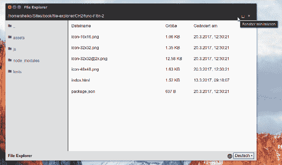
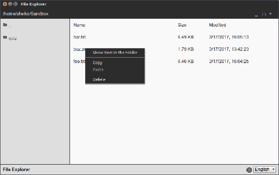
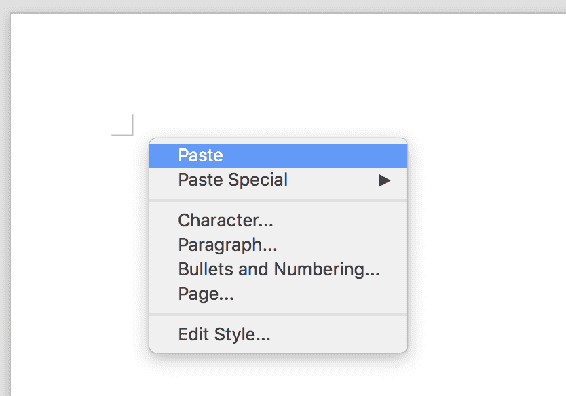
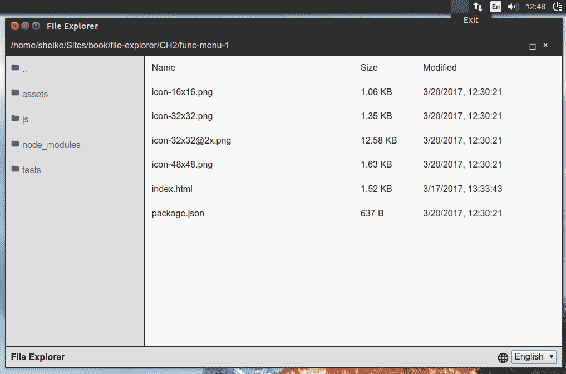
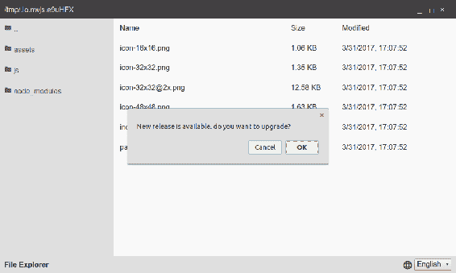
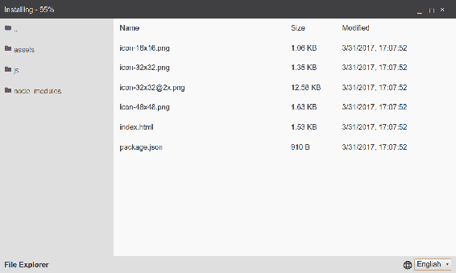

# 使用 NW.js 创建文件资源管理器-增强和交付

好吧，我们有一个工作版本的文件资源管理器，它可以用来导航文件系统并使用默认的相关程序打开文件。 现在，我们将扩展它以进行其他文件操作，例如删除和复制粘贴。 这些选项将保存在一个动态构建的上下文菜单中。 我们还将考虑 NW.js 使用系统剪贴板在不同应用程序之间传输数据的能力。 我们将使应用程序响应命令行选项。 我们还将提供对多种语言和地区的支持。 我们将通过将源代码编译为本地代码来保护它们。 我们会考虑包装和分销。 最后，我们将设置一个简单的发布服务器，并使文件资源管理器自动更新。

# 国际化和本地化

**国际化**，通常缩写为**i18n**，指一种能够适应目标本地市场需求的特殊软件设计。 换句话说，如果我们想将我们的应用程序分发到美国以外的市场，我们需要注意翻译、日期时间、数字、地址等的格式。

# 按国家分类的日期格式

国际化是一个横切的关注点。 当您更改区域设置时，它通常会影响多个模块。 因此，我建议采用我们在研究`DirService`:
`./js/Service/I18n.js`时已经检验过的观察者模式。

```js
const EventEmitter = require( "events" ); 

class I18nService extends EventEmitter { 
  constructor(){ 

   super(); 
   this.locale = "en-US"; 
  } 
  notify(){ 
   this.emit( "update" ); 
  } 
} 

exports.I18nService = I18nService;

```

如您所见，我们可以通过为`locale`属性设置一个新值来更改`locale`属性。 只要我们调用`notify`方法，所有订阅的模块就会立即响应。

然而，`locale`是公共财产，我们无法控制其访问和变异。 我们可以使用重载来修复它:

`./js/Service/I18n.js`

```js
//... 
  constructor(){ 
   super(); 
   this._locale = "en-US"; 
  } 
  get locale(){ 

  return this._locale; 
  } 
  set locale( locale ){ 
   // validate locale... 
   this._locale = 

locale; 
  } 
  //...

```

现在，如果我们访问`I18n`实例的`locale`属性，它将由 getter(`get locale`)传递。 当设置一个值时，它通过 setter(`set locale`)。 因此，我们可以添加额外的功能，例如对属性访问和变异进行验证和日志记录。

记住，我们有一个组合框用于在 HTML 中选择语言。 为什么不给它一个景观呢?

`./js/View/LangSelector.js`:

```js
class LangSelectorView { 
  constructor( boundingEl, i18n ){ 
   boundingEl.addEventListener( "change", 

this.onChanged.bind( this ), false ); 
   this.i18n = i18n; 
  } 
   onChanged( e ){ 
   const selectEl 

= e.target; 
   this.i18n.locale = selectEl.value; 
   this.i18n.notify(); 
  } 
} 

exports.LangSelectorView = LangSelectorView;

```

在前面的代码中，我们侦听组合框上的更改事件。

当事件发生时，我们使用传入的`I18n`实例更改`locale`属性，并调用`notify`通知订阅者:

`./js/app.js`

```js
const i18nService = new I18nService(), 
      { LangSelectorView } = require( "./js/View/LangSelector" ); 

new LangSelectorView( document.querySelector( "[data-bind=langSelector]" ), i18nService );

```

我们可以改变地点，触发事件。 那消费模块呢? 在`FileList`视图中，我们有`formatTime`静态方法，用于格式化`timeString`中传递的内容以便打印。 我们可以按照当前选择的`locale`进行格式化:

`./js/View/FileList.js`:

```js
constructor( boundingEl, dirService, i18nService ){ 
    //... 
    this.i18n = i18nService; 
    // 

Subscribe on i18nService updates 
          i18nService.on( "update", () => this.update( dirService.getFileList() ) 

); 
  } 
  static formatTime( timeString, locale ){ 
   const date = new Date( Date.parse( timeString ) ), 

         options = { 
         year: "numeric", month: "numeric", day: "numeric", 
         hour: 

"numeric", minute: "numeric", second: "numeric", 
         hour12: false 
         }; 
   return 

date.toLocaleString( locale, options ); 
  } 
 update( collection ) { 
        //... 

this.el.insertAdjacentHTML( "beforeend", `<li class="file-list__li" data-file="${fInfo.fileName}"> 

<span class="file-list__li__name">${fInfo.fileName}</span> 
         <span class="file-

list__li__size">${filesize(fInfo.stats.size)}</span> 
         <span class="file-list__li__time">

${FileListView.formatTime( fInfo.stats.mtime, this.i18n.locale )}</span> 
   </li>` ); 
        //... 

  } 
//...

```

在构造函数中，我们订阅了`I18n`更新事件，并在每次地区更改时更新文件列表。 `formatTime`静态方法将传递的字符串转换为`Date`对象，并使用`Date.prototype.toLocaleString()`方法根据给定的语言环境格式化 datetime。 该方法属于所谓的**ECMAScript 国际化 API**([http://norbertlindenberg.com/2012/12/ecmascript-internationalization- API /index.html](http://norbertlindenberg.com/2012/12/ecmascript-internationalization-api/index.html))。 这个 API 描述了用于格式化和比较本地化数据的内置对象`String`、`Date`和`Number`的方法。 然而，它真正做的是用英语(美国)地区(`en-US`)的`toLocaleString`格式化一个`Date`实例，并返回日期，如下所示:

```js
3/17/2017, 13:42:23

```

但是，如果我们将德语 locale(`de-DE`)输入到方法中，我们会得到一个完全不同的结果:

```js
17.3.2017, 13:42:23

```

为了将其付诸实践，我们为组合框设置了一个标识符。 `./index.html`文件包含以下代码:

```js
.. 
<select class="footer__select" data-bind="langSelector"> 
..

```

当然，我们必须创建一个服务的实例`I18n`，并在`LangSelectorView`和`FileListView`中传递它:

`./js/app.js`

```js
// ... 
const { I18nService } = require( "./js/Service/I18n" ), 
   { LangSelectorView } = require( 

"./js/View/LangSelector" ), 
   i18nService = new I18nService(); 

new LangSelectorView( 

document.querySelector( "[data-bind=langSelector]" ), i18nService ); 
// ... 
new FileListView( 

document.querySelector( "[data-bind=fileList]" ), dirService, i18nService );

```

现在我们开始申请。 是啊! 当我们在组合框中更改语言时，文件修改日期也会相应调整:


# 多语言支持

本地化日期和数字是一件好事，但提供多种语言的翻译将更令人兴奋。 我们在整个应用程序中有许多术语，即文件列表的列标题和窗口操作按钮上的工具提示(通过`title`属性)。 我们需要的是一本字典。 通常，它意味着一组映射到语言代码或地区的标记翻译对。 因此，当您向翻译服务请求一个术语时，它可以根据当前使用的语言/地区将其与匹配的翻译相关联。

在这里，我建议将字典变成一个静态模块，可以用所需的函数加载:

`./js/Data/dictionary.js`

```js
exports.dictionary = { 
  "en-US": { 
    NAME: "Name", 
    SIZE: "Size", 
    MODIFIED: 

"Modified", 
    MINIMIZE_WIN: "Minimize window", 
    RESTORE_WIN: "Restore window", 
    MAXIMIZE_WIN: 

"Maximize window", 
    CLOSE_WIN: "Close window" 
  }, 
  "de-DE": { 
    NAME: "Dateiname", 

SIZE: "Grösse", 
    MODIFIED: "Geändert am", 
    MINIMIZE_WIN: "Fenster minimieren", 

RESTORE_WIN: "Fenster wiederherstellen", 
    MAXIMIZE_WIN: "Fenster maximieren", 
    CLOSE_WIN: "Fenster 

schliessen" 
  } 
};

```

因此，我们有两个地区，每个术语都有翻译。 我们将把字典作为一个依赖注入到我们的`I18n`服务中:

`./js/Service/I18n.js`

```js
//... 
constructor( dictionary ){ 
    super(); 
    this.dictionary = dictionary; 

this._locale = "en-US"; 
 } 

translate( token, defaultValue ) { 
    const dictionary = 

this.dictionary[ this._locale ]; 
    return dictionary[ token ] || defaultValue; 
} 
//...

```

我们还添加了一个新方法 translate，它接受两个参数:`token`和`default`translation。 第一个参数可以是字典中的一个键，例如`NAME`。 第二个是在请求的令牌在字典中还不存在的情况下保护值。 因此，我们仍然可以得到有意义的文本，至少在英语中是这样。

让我们看看如何使用这个新方法:

`./js/View/FileList.js`

```js
//... 
update( collection ) { 
    this.el.innerHTML = `<li class="file-list__li file-list__head"> 
        <span class="file-list__li__name">${this.i18n.translate( "NAME", "Name" )}</span> 

<span class="file-list__li__size">${this.i18n.translate( "SIZE", "Size" )}</span> 
        <span 

class="file-list__li__time">${this.i18n.translate( "MODIFIED", "Modified" )}</span> 
      </li>`; 
//...

```

我们通过调用`I18n`实例的`translate`方法来更改`FileList`视图中硬编码的列标题，这意味着每次视图更新时，它都会接收到实际的翻译。 我们不应该忘记有窗口操作按钮的`TitleBarActions`视图:

`./js/View/TitleBarActions.js`

```js
constructor( boundingEl, i18nService ){ 
  this.i18n = i18nService; 
  //... 
  // Subscribe on 

i18nService updates 
  i18nService.on( "update", () => this.translate() ); 
} 

translate(){ 

 this.unmaximizeEl.title = this.i18n.translate( "RESTORE_WIN", "Restore window" ); 
  this.maximizeEl.title = 

this.i18n.translate( "MAXIMIZE_WIN", "Maximize window" ); 
  this.minimizeEl.title = this.i18n.translate( 

"MINIMIZE_WIN", "Minimize window" ); 
  this.closeEl.title = this.i18n.translate( "CLOSE_WIN", "Close window" ); 
}

```

这里我们添加了`translate`方法，它用实际的翻译更新按钮标题属性。 我们订阅了`i18n`更新事件，以在每次用户更改`locale`时调用方法:



# 上下文菜单

好吧，有了我们的应用程序，我们已经可以浏览文件系统并打开文件，但是人们可能期望更多的文件管理器。 我们可以添加一些与文件相关的操作，例如删除和复制/粘贴。 通常，这些任务通过上下文菜单可用，这给我们提供了一个很好的机会来检查如何使用`NW.js`制作它。 通过环境集成 API，我们可以创建一个系统菜单的实例([http://docs.nwjs.io/en/latest/References/Menu/](http://docs.nwjs.io/en/latest/References/Menu/))。 然后，我们组合代表菜单项的对象，并将它们附加到菜单实例([http://docs.nwjs.io/en/latest/References/MenuItem/](http://docs.nwjs.io/en/latest/References/MenuItem/))。 这个`menu`可以在任意位置显示:

```js
const menu = new nw.Menu(), 
      menutItem = new nw.MenuItem({ 
        label: "Say hello", 

click: () => console.log( "hello!" ) 
      }); 

menu.append( menu ); 
menu.popup( 10, 10 );

```

然而，我们的任务更加具体。 我们必须在光标的位置右击显示菜单，也就是说，我们通过订阅`contextmenu`DOM 事件的处理程序来实现:

```js
document.addEventListener( "contextmenu", ( e ) => { 
   console.log( `Show menu in position ${e.x}, ${e.y}` 
);   
});

```

现在，每当我们在应用程序窗口中右键单击时，就会显示菜单。 这不完全是我们想要的，对吧? 只有当游标驻留在一个特定的区域内时，例如，当游标悬浮在一个文件名上时，才需要它。 这意味着我们必须测试目标元素是否符合我们的条件:

```js
document.addEventListener( "contextmenu", ( e ) => { 
   const el = e.target; 
   if ( el instanceof 

HTMLElement && el.parentNode.dataset.file ) { 
     console.log( `Show menu in position ${e.x}, ${e.y}` );   

   } 
});

```

这里，我们将忽略该事件，直到游标停留在文件表行的任何单元格上，因为每一行都是由`FileList`视图生成的列表项，因此为数据文件属性提供了一个值。

这篇文章解释了如何构建一个系统菜单以及如何将它附加到文件列表中。 然而，在开始一个能够创建菜单的模块之前，我们需要一个服务来处理文件操作:

`./js/Service/File.js`

```js
const fs = require( "fs" ), 
      path = require( "path" ), 
      // Copy file helper 
      cp = ( 

from, toDir, done ) => { 
        const basename = path.basename( from ), 
              to = path.join( 

toDir, basename ), 
              write = fs.createWriteStream( to ) ; 

        fs.createReadStream( from 

) 
          .pipe( write ); 

        write 
          .on( "finish",  done ); 
      }; 

class FileService { 

  constructor( dirService ){ 
    this.dir = dirService; 

this.copiedFile = null; 
  } 

  remove( file ){ 
    fs.unlinkSync( this.dir.getFile( file ) ); 
    this.dir.notify(); 
  } 

  paste(){ 
    const file = this.copiedFile; 
    if ( 

fs.lstatSync( file ).isFile() ){ 
      cp( file, this.dir.getDir(), () => this.dir.notify() ); 
    } 

} 

  copy( file ){ 
    this.copiedFile = this.dir.getFile( file ); 
  }  

  open( file 

){ 
    nw.Shell.openItem( this.dir.getFile( file ) ); 
  } 

  showInFolder( file ){ 

nw.Shell.showItemInFolder( this.dir.getFile( file ) ); 
  } 
}; 

exports.FileService = 

FileService;

```

这是怎么回事? `FileService`接收一个`DirService`实例作为构造函数参数。 它使用实例按名称获取文件的完整路径(`this.dir.getFile( file )`)。 它还利用实例的`notify`方法请求所有订阅到`DirService`的视图进行更新。 `showInFolder`方法调用`nw.Shell`对应的方法，用系统文件管理器显示父文件夹中的文件。 您可以侦察到，`remove`方法将删除该文件。 至于复制/粘贴，我们采用以下技巧。 当用户单击 copy 时，我们将目标文件路径存储在`copiedFile`属性中。 因此，当用户下一次单击粘贴时，我们可以使用它将该文件复制到可能已更改的当前位置。 显然，`open`方法使用默认的关联程序打开文件。 这就是我们在`FileList`视图中直接做的事情。 实际上，这个动作属于`FileService`。 因此，我们调整视图以使用服务:

`./js/View/FileList.js`

```js
constructor( boundingEl, dirService, i18nService, fileService ){ 
   this.file = fileService; 
   //... 
} 
bindUi(){ 
  //... 
  this.file.open( el.dataset.file ); 
  //... 
}

```

现在，我们有一个模块来处理所选文件的上下文菜单。 该模块将订阅`contextmenu`DOM 事件，并在用户右键单击文件时构建菜单。 该菜单将包含“文件夹”、“复制”、“粘贴”和“删除”中的“显示项目”。 复制和粘贴与其他项目用分隔符分隔，粘贴将被禁用，直到我们使用 Copy 存储文件:

`./js/View/ContextMenu.js`

```js
class ConextMenuView { 
  constructor( fileService, i18nService ){ 
    this.file = fileService; 

this.i18n = i18nService; 
    this.attach(); 
  } 

  getItems( fileName ){ 
    const file = 

this.file, 
          isCopied = Boolean( file.copiedFile ); 

    return [ 
      { 

label: this.i18n.translate( "SHOW_FILE_IN_FOLDER", "Show Item in the 
                                                          Folder" ), 
        enabled: Boolean( fileName ), 

        click: () => file.showInFolder( fileName ) 
      }, 
      { 
        type: "separator" 

      }, 
      { 
        label: this.i18n.translate( "COPY", "Copy" ), 
        enabled: Boolean( 

              fileName ), 
        click: () => file.copy( fileName ) 
      }, 
      { 
        label: 

this.i18n.translate( "PASTE", "Paste" ), 
        enabled: isCopied, 
        click: () => file.paste() 

     }, 
      { 
        type: "separator" 
      }, 
      { 
        label: 

this.i18n.translate( "DELETE", "Delete" ), 
        enabled: Boolean( fileName ), 
        click: () => 

file.remove( fileName ) 
      } 
    ]; 
  } 

  render( fileName ){ 
    const menu = new 

nw.Menu(); 
    this.getItems( fileName ).forEach(( item ) => menu.append( new  
                                            nw.MenuItem( item ))); 

return menu; 
  } 

  attach(){ 
    document.addEventListener( "contextmenu", ( e ) => { 

  const el = e.target; 
      if ( !( el instanceof HTMLElement ) ) { 
        return; 
      } 

      if ( el.classList.contains( "file-list" ) ) { 
        e.preventDefault(); 
        this.render() 

        .popup( e.x, e.y ); 
      } 
      // If a child of an element matching [data-file] 
      if ( 

el.parentNode.dataset.file ) { 
        e.preventDefault(); 
        this.render( el.parentNode.dataset.file ) 

          .popup( e.x, e.y ); 
      } 

    }); 
  } 
} 

exports.ConextMenuView = ConextMenuView;

```

因此，在`ConextMenuView`构造函数中，我们接收到`FileService`和`I18nService`的实例。 在构造过程中，我们还调用了`attach`方法，该方法订阅了`contextmenu`DOM 事件，创建了菜单，并将其显示在鼠标光标的位置。 该事件将被忽略，除非光标停留在文件上或驻留在文件列表组件的空白区域。 当用户右击文件列表时，仍然会出现菜单，但除了 Paste 之外的所有项都被禁用(以防之前复制了文件)。 方法呈现以创建菜单实例，并使用`getItems`方法创建的`nw.MenuItems`填充该实例。 该方法创建一个表示菜单项的数组。 数组的元素是对象字面量。 `label`属性接受项目标题的翻译。 `enabled`属性定义了一个项目的状态，这取决于我们的案例(是否持有复制的文件)。 最后，`click`属性期望点击事件的处理程序。

现在我们需要在主模块中启用我们的新组件:

`./js/app.js`

```js
const { FileService } = require( "./js/Service/File" ), 
      { ConextMenuView } = require( 

"./js/View/ConextMenu" ), 
      fileService = new FileService( dirService ); 

new FileListView( 

document.querySelector( "[data-bind=fileList]" ), dirService, i18nService, fileService ); 
new ConextMenuView( 

fileService, i18nService );

```

现在，让我们运行应用程序，右键单击一个文件，瞧! 我们有上下文菜单和新文件操作:



# 系统剪贴板

通常，复制/粘贴功能涉及到系统剪贴板。 `NW.js`提供一个 API 来控制它([http://docs.nwjs.io/en/latest/References/Clipboard/](http://docs.nwjs.io/en/latest/References/Clipboard/))。 不幸的是，它非常有限; 我们不能在应用程序之间传输任意文件，这可能是文件管理器的要求。 然而，有些东西仍然是可用的。

# 将文本

为了检查剪贴板的文本传输，我们修改了`FileService`的方法 copy:

```js
copy( file ){ 
    this.copiedFile = this.dir.getFile( file ); 
    const clipboard = nw.Clipboard.get(); 

    clipboard.set( this.copiedFile, "text" ); 
}

```

它是做什么的? 一旦我们获得了文件的完整路径，我们就创建一个`nw.Clipboard`的实例并将该文件路径保存为文本。 现在，在文件管理器中复制一个文件后，我们可以切换到外部程序(例如，文本编辑器)，并从剪贴板中粘贴复制的路径:



# 将图形转移

看起来不太方便，不是吗? 如果我们能复制/粘贴一个文件会更有趣。 不幸的是，当涉及到文件交换时，`NW.js`并没有给我们提供很多选项。 然而，我们可以在`NW.js`应用程序和外部程序之间传输 PNG 和 JPEG 图像:

`./js/Service/File.js`

```js
//... 
  copyImage( file, type ){ 
    const clip = nw.Clipboard.get(), 
          // load file content 

as Base64 
          data = fs.readFileSync( file ).toString( "base64" ), 
          // image as HTML 

    html = ``; 

    // write both options 

(raw image and HTML) to the clipboard 
    clip.set([ 
      { type, data: data, raw: true }, 
      { type: 

"html", data: html } 
    ]); 
  } 

  copy( file ){ 
    this.copiedFile = this.dir.getFile( 

file ); 
    const ext = path.parse( this.copiedFile ).ext.substr( 1 ); 
    switch ( ext ){ 
      case 

"jpg": 
      case "jpeg": 
        return this.copyImage( this.copiedFile, "jpeg" ); 
      case "png": 
        return this.copyImage( this.copiedFile, "png" ); 
    } 
  } 
//...

```

我们使用`copyImage`私有方法扩展了`FileService`。 它读取给定文件，在 Base64 中转换其内容，并将结果代码传递到剪贴板实例中。 此外，它还创建带有图像标记的 HTML，图像标记包含数据**统一资源标识符**(**URI**)中的 base64 编码图像。 现在，在文件资源管理器中复制图像(PNG 或 JPEG)后，我们可以将其粘贴到外部程序中，比如图形编辑器或文本处理器。

# 接收文本和图形

我们已经学习了如何将文本和图形从我们的`NW.js`应用程序传递给外部程序，但是我们如何从外部接收数据呢? 如你所知，可以通过`nw.Clipboard`的`get`方法进行访问。 文本的检索方式如下:

```js
 const clip = nw.Clipboard.get(); 
console.log( clip.get( "text" ) );

```

当图形被放到剪贴板上时，我们只能用 NW.js 作为 base64 编码的内容或 HTML 获取它。 为了在实践中看到它，我们在`FileService`中添加了几个方法:

`./js/Service/File.js`

```js
//... 
  hasImageInClipboard(){ 
    const clip = nw.Clipboard.get(); 
    return 

clip.readAvailableTypes().indexOf( "png" ) !== -1; 
  } 

  pasteFromClipboard(){ 
    const clip = 

nw.Clipboard.get(); 
    if ( this.hasImageInClipboard() ) { 
      const base64 = clip.get( "png", true ), 
            binary = Buffer.from( base64, "base64" ), 
            filename = Date.now() + "--img.png"; 

fs.writeFileSync( this.dir.getFile( filename ), binary ); 
      this.dir.notify(); 
    } 
  } 
//...

```

方法检查剪贴板是否保留任何图形。 `pasteFromClipboard`方法将剪贴板中的图形内容作为 base64 编码的 PNG 格式; 它将内容转换为二进制代码，将其写入一个文件，并请求`DirService`订阅者更新它。

为了使用这些方法，我们需要编辑`ContextMenu`视图:

`./js/View/ContextMenu.js`

```js
getItems( fileName ){ 
    const file = this.file, 
          isCopied = Boolean( file.copiedFile ); 
       return [ 
     //... 
      { 
        label: this.i18n.translate( "PASTE_FROM_CLIPBOARD", "Paste 

image from clipboard" ), 
        enabled: file.hasImageInClipboard(), 
        click: () => 

file.pasteFromClipboard() 
      }, 
      //... 
    ]; 
  }

```

我们在菜单中添加了一个新项目`Paste image from clipboard`，该项目仅在剪贴板中有一些图形时启用。

# 菜单中的系统托盘

我们应用程序可用的三个平台都有一个所谓的系统通知区域，也被称为系统托盘。 这是用户界面的一部分(在 Windows 的右下角和其他平台的右上角)，即使应用程序图标不在桌面上，你也可以在这里找到它。 使用`NW.js`API([http://docs.nwjs.io/en/latest/References/Tray/](http://docs.nwjs.io/en/latest/References/Tray/))，我们可以在托盘中为应用程序提供一个图标和下拉菜单，但是我们还没有任何图标。 因此，我创建了带有文本`Fe`的`icon.png`图像，并将其保存在应用程序根目录中，大小为 32x32px。 它支持 Linux、Windows 和 macOS。 然而，在 Linux 中，我们可以使用更好的分辨率，所以我把 48x48px 的版本放在它旁边。

我们在托盘上的申请将由`TrayService`代表:

`./js/View/Tray.js`

```js
const appWindow = nw.Window.get(); 

class TrayView { 

  constructor( title ){ 

this.tray = null; 
    this.title = title; 
    this.removeOnExit(); 
    this.render(); 
  } 

  render(){ 
    const icon = ( process.platform === "linux" ? "icon-48x48.png" : "icon-32x32.png" ); 

    this.tray = new nw.Tray({ 
      title: this.title, 
      icon, 
      iconsAreTemplates: false 
    }); 

    const menu = new nw.Menu(); 
    menu.append( new nw.MenuItem({ 
      label: "Exit", 

      click: () => appWindow.close() 
    })); 
    this.tray.menu = menu; 
  } 

removeOnExit(){ 
    appWindow.on( "close", () => { 
      this.tray.remove(); 
      appWindow.hide(); 

// Pretend to be closed already 
      appWindow.close( true ); 
    }); 
    // do not spawn Tray instances 

on page reload
    window.addEventListener( "beforeunload", () => this.tray.remove(), false );
  } 

} 

exports.TrayView = TrayView;

```

它是做什么的? 这个类将托盘的标题作为构造函数参数，并在实例化期间调用`removeOnExit`和 render 方法。 第一个订阅窗口的`close`事件，确保当我们关闭应用程序时，托盘被移除。 方法 render 创建`nw.Tray`实例。 通过构造函数参数，我们传递带有标题的配置对象，它是图标的相对路径。 我们为 Linux 分配了`icon- 48x48.png`图标，为其他平台分配了`icon-32x32.png`图标。 默认情况下，macOS 尝试根据菜单主题调整图像，这要求图标在透明背景上包含清晰的颜色。 如果您的图标不符合这些限制，您宁愿将其添加到配置对象属性`iconsAreTemplates`，该属性被设置为`false`。

When launching our File Explorer in Ubuntu 16.x, it doesn't appear in the system tray due to the whitelisting policy. You can fix this by running `sudo apt-get install libappindicator1` in the Terminal.

`nw.Tray`接受`nw.Menu`实例。 因此，我们以与上下文菜单相同的方式填充菜单。 现在我们只需要在主模块中初始化`Tray`视图并运行应用程序:

`./js/app.js`

```js
const { TrayView } = require( "./js/View/Tray" ); 
new TrayView( "File Explorer" );

```

如果我们现在运行应用程序，我们可以在系统托盘中看到应用程序图标和菜单:



是的，唯一的菜单项退出看起来有点孤独。

让我们扩展`Tray`视图:

`./js/View/Tray.js`

```js
class TrayView { 

  constructor( title ){ 
    this.tray = null; 
    this.title = title; 
    // subscribe to window events 
    appWindow.on("maximize", () => this.render( false )); 

appWindow.on("minimize", () => this.render( false )); 
    appWindow.on("restore", () => this.render( true )); 

    this.removeOnExit(); 
    this.render( true ); 
  } 

  getItems( reset ){ 

  return [ 
      { 
        label: "Minimize", 
        enabled: reset, 
        click: () => 

appWindow.minimize() 
      }, 
      { 
        label: "Maximize", 
        enabled: reset, 

   click: () => appWindow.maximize() 
      }, 
      { 
        label: "Restore", 
        enabled: 

!reset, 
        click: () => appWindow.restore() 
      }, 
      { 
        type: "separator" 
      }, 
      { 
        label: "Exit", 
        click: () => appWindow.close() 
      } 

  ]; 
  } 

  render( reset ){ 
    if ( this.tray ) { 
      this.tray.remove(); 
    } 

    const icon = ( process.platform === "darwin" ? "macicon.png" : "icon.png" ); 

    this.tray = 

new nw.Tray({ 
      title: this.title, 
      icon, 
      iconsAreTemplates: true 
    }); 

    const menu = new nw.Menu(); 
    this.getItems( reset ).forEach(( item ) => menu.append( new nw.MenuItem( 

item ))); 

    this.tray.menu = menu; 
  } 

  removeOnExit(){ 
    appWindow.on( 

"close", () => { 
      this.tray.remove(); 
      appWindow.hide(); // Pretend to be closed already 

  appWindow.close( true ); 
    }); 
  } 

} 

exports.TrayView = TrayView;

```

现在，`render`方法接收一个布尔值作为参数，定义应用程序窗口是否处于初始模式; 该标志被传递给新的`getItems`方法，该方法产生一个菜单项元数组。 如果该标志为真，则所有菜单项都是启用的，除了恢复。 有意义的是在最小化或最大化后恢复开关窗口到初始模式。 表面上，当标志为`false`时，`Minimize`和`Maximize`项被禁用，但是我们如何知道窗口的当前模式? 在构造时，我们订阅窗口事件最小化、最大化和恢复。 当事件发生时，我们使用相应的标志调用`render`。 由于我们现在可以从`TitleBarActions`和`Tray`视图更改窗口模式，`TitleBarActions`的`toggle`方法不再是窗口模式的可靠来源。 相反，我们更愿意重构模块来依赖于窗口事件，就像我们在`Tray`视图中所做的那样:
`./js/View/TitleBarActions.js`

```js
const appWindow = nw.Window.get(); 

class TitleBarActionsView { 

  constructor( 

boundingEl, i18nService ){ 
    this.i18n = i18nService; 
    this.unmaximizeEl = boundingEl.querySelector( 

"[data-bind=unmaximize]" ); 
    this.maximizeEl = boundingEl.querySelector( "[data-bind=maximize]" ); 

this.minimizeEl = boundingEl.querySelector( "[data-bind=minimize]" ); 
    this.closeEl = boundingEl.querySelector( 

"[data-bind=close]" ); 
    this.bindUi(); 
    // Subscribe on i18nService updates 
    i18nService.on( 

"update", () => this.translate() ); 

    // subscribe to window events 
    appWindow.on("maximize", () 

=> this.toggleButtons( false ) ); 
    appWindow.on("minimize", () => this.toggleButtons( false ) ); 

appWindow.on("restore", () => this.toggleButtons( true ) ); 
  } 

  translate(){ 

this.unmaximizeEl.title = this.i18n.translate( "RESTORE_WIN", "Restore window" ); 
    this.maximizeEl.title = 

this.i18n.translate( "MAXIMIZE_WIN", "Maximize window" ); 
    this.minimizeEl.title = this.i18n.translate( 

"MINIMIZE_WIN", "Minimize window" ); 
    this.closeEl.title = this.i18n.translate( "CLOSE_WIN", "Close window" ); 
  } 

  bindUi(){ 
    this.closeEl.addEventListener( "click", this.onClose.bind( this ), false ); 
    this.minimizeEl.addEventListener( "click", this.onMinimize.bind( this ), false ); 

this.maximizeEl.addEventListener( "click", this.onMaximize.bind( this ), false ); 

this.unmaximizeEl.addEventListener( "click", this.onRestore.bind( this ), false ); 
  } 

toggleButtons( reset ){ 
    this.maximizeEl.classList.toggle( "is-hidden", !reset ); 

this.unmaximizeEl.classList.toggle( "is-hidden", reset ); 
    this.minimizeEl.classList.toggle( "is-hidden", !reset 

); 
  } 

  onRestore( e ) { 
    e.preventDefault(); 
    appWindow.restore(); 
  } 

  onMaximize( e ) { 
    e.preventDefault(); 
    appWindow.maximize(); 
  } 

onMinimize( e ) { 
    e.preventDefault(); 
    appWindow.minimize(); 
  } 

  onClose( e ) { 

    e.preventDefault(); 
    appWindow.close(); 
  } 
} 

exports.TitleBarActionsView = 

TitleBarActionsView;

```

这一次，当我们运行应用程序时，我们可以在系统托盘应用程序菜单中找到窗口操作:


# 命令行选项

其他文件管理器通常接受命令行选项。 例如，您可以在启动 Windows 资源管理器时指定一个文件夹。 它还能对各种开关做出响应。 让我们说，你可以给它开关`/e`，并且资源管理器将以扩展模式打开文件夹。

`NW.js`显示命令行选项为`nw.App.argv`中的字符串数组。 因此，我们可以在主模块中更改`DirService`初始化的代码:

`./js/app.js`

```js
const dirService = new DirService( nw.App.argv[ 0 ] );

```

现在，我们可以直接从命令行在文件资源管理器中打开指定的文件夹:

```js
npm start ~/Sandbox

```

在基于 unix 的系统中，波浪线表示用户主目录。 在 Windows 中对应的代码如下:

```js
npm start %USERPROFILE%Sandbox

```

我们还能做什么? 我建议实现`--minimize`和`--maximize`选项，分别在启动时切换应用程序窗口模式:`./js/app.js`

```js
const argv = require( "minimist" )( nw.App.argv ), 
         dirService = new DirService( argv._[ 0 ] ); 
 if ( argv.maximize ){ 
  nw.Window.get().maximize(); 
} 
if ( argv.minimize ){ 
  nw.Window.get().minimize(); 
}

```

当我们可以使用外部模块 minimist([https://www.npmjs.com/package/minimist](https://www.npmjs.com/package/minimist))时，手动解析`nw.App.argv`数组没有任何意义。 它导出一个函数，该函数将所有非选项或与选项相关的参数收集到`_`(下划线)属性中。 我们期望该类型的唯一参数是 startup directory。 当在命令行上提供`maximize`和`minimize`属性时，它还将其设置为 true。

需要注意的是，NPM 并没有将选项委托给正在运行的脚本，所以我们应该直接调用`NW.js`可执行文件:

```js
nw . ~/Sandbox/ --minimize

```

或

```js
nw . ~/Sandbox/ --maximize

```

# 本地的外观和感觉

现在，你可以找到很多带有半透明背景或圆角的本地桌面应用程序。 用`NW.js`能达到这样的效果吗? 相信我们可以! 首先，我们要编辑我们的应用程序清单文件:

`./package.json`

```js
... 
"window": { 
    "frame": false, 
    "transparent": true, 
    ... 
  }, 
...

```

通过将 frame 字段设置为`false`，我们指示`NW.js`不显示窗口框架，而是显示其内容。 幸运的是，我们已经实现了自定义窗口控件，因为默认的窗口控件将不再可用。 使用透明字段，我们可以移除应用程序窗口的不透明度。 为了看到它的实际效果，我们编辑 CSS 定义模块:

img/css/Base/definitions.css`

```js
:root { 
  --titlebar-bg-color: rgba(45, 45, 45, 0.7); 
  --titlebar-fg-color: #dcdcdc; 
  --dirlist-

bg-color: rgba(222, 222, 222, 0.9); 
  --dirlist-fg-color: #636363; 
  --filelist-bg-color: rgba(249, 249, 249, 

0.9); 
  --filelist-fg-color: #333341; 
  --dirlist-w: 250px; 
  --titlebar-h: 40px; 
  --footer-h: 

40px; 
  --footer-bg-color: rgba(222, 222, 222, 0.9); 
  --separator-color: #2d2d2d; 
  --border-radius: 

1em; 
}

```

通过 RGBA 颜色函数，我们将标题栏的不透明度设置为 70%，其他背景颜色设置为 90%。 我们还引入了一个新的变量，`--border-radius`，我们将在`titlebar`和`footer`组件中使用它，使顶部和底部形成圆角:

img/css/Component/titlebar.css`

```js
.titlebar { 
  border-radius: var(--border-radius) var(--border-radius) 0 0; 
}

```

img/css/Component/footer.css`

```js
.footer { 
  border-radius: 0 0 var(--border-radius) var(--border-radius); 
}

```

现在我们可以启动应用程序并享受我们的新外观。

On Linux, we need to use the `nw . --enable-transparent-visuals --disable-gpu` command-line option to trigger transparency.

# 源代码的保护

与本地应用程序不同，我们的源代码是不编译的，因此对所有人开放。 如果你对这一事实有任何商业用途，它不太可能适合你。 您至少可以做的是混淆源代码，例如，使用 j 扰码器([https://jscrambler.com/en/](https://jscrambler.com/en/))。 另一方面，我们可以将源代码编译成本地代码，然后用`NW.js`而不是 JavaScript 加载它。 为此，我们需要将 JavaScript 从应用程序包中分离出来。 让我们创建`app`文件夹并移动除`js`以外的所有内容。 `js`文件夹将被移动到一个新创建的目录`src`:

```js
    .
    ├── app
    │   

└── assets
    │       └── css

│           ├── Base
    │           └── 

Component
    └── src
        └── 

js
            ├── Data
            ├── 

Service
            └── View

```

我们的 JavaScript 模块现在已经超出了项目范围，我们无法在需要时访问它们。 然而，这些仍然是 Node.js 模块([https://nodejs.org/api/modules.html](https://nodejs.org/api/modules.html))，它们面临 CommonJS 模块定义标准。 因此，我们可以使用绑定器工具将它们合并到一个文件中，然后将其编译为本地代码。 我建议使用 Webpack([https://webpack.github.io/](https://webpack.github.io/))，这似乎是当今最流行的捆绑程序。 所以，我们把它放在根目录的 webpack 配置文件中，内容如下:

`webpack.config.js`

```js
const { join } = require( "path" ), 
      webpack = require( "webpack" ); 

module.exports = { 

 entry: join( __dirname, "src/js/app.js" ), 
  target: "node-webkit", 
  output: { 
      path: join( 

__dirname, "/src/build" ), 
      filename:  "bundle.js" 
  } 
};

```

这样，我们就指导 Webpack 将所有必需的模块(从`src/js/app.js`开始)转换为一个`src/build/bundle.js`文件。 然而，与`NW.js`不同的是，Webpack 需要与宿主文件相关的依赖(而不是项目根文件); 因此，我们必须从主模块的文件路径中删除`js/`:

`./src/js/app.js`

```js
// require( "./js/View/LangSelector" ) becomes 
require( "./View/LangSelector" )

```

对于编译 CommonJS 模块和编译原生代码中的派生文件，我们需要在 manifest 的 script 字段中执行一些任务:

`package.json`

```js
//... 
"scripts": { 
    "build:js": "webpack", 
    "protect:js": "node_modules/nw/nwjs/nwjc 

src/build/bundle.js app/app.bin", 
    "build": "npm run build:js && npm run protect:js", 
    //... 
  }, 
//...

```

在第一个任务中，我们让 webpack 把我们的 JavaScript 源代码编译成一个单独的文件。 第二种方法使用`NW.js`编译器对其进行编译。 最后一个同时做这两件事。

在 HTML 文件中，我们将调用主模块的代码替换为以下几行:

`app/index.html`

```js
<script> 
      nw.Window.get().evalNWBin( null, "./app.bin" ); 
</script>

```

现在我们可以运行应用程序并观察到实现的功能仍然面对我们的需求。

# 包装

好了，我们已经完成了我们的应用程序，现在是时候考虑分发了。 正如您所理解的，要求我们的用户安装`Node.js`并从命令行输入`npm start`将是不友好的。 用户期望一个可以像任何其他软件一样简单地启动的包。 因此，我们必须将我们的应用程序与`NW.js`绑定到每个目标平台上。 在这里，`nwjs-builder`派上用场([https://github.com/evshiron/nwjs-builder](https://github.com/evshiron/nwjs-builder))。

因此，我们安装了`npm i -D nwjs-builder`工具，并在清单中添加了一个任务:

`./package.json`

```js
//... 
"scripts": { 
    "package": "nwb nwbuild -v 0.21.3-sdk ./app -o ./dist  -p linux64, win32,osx64", 

    //...   
  },
 //...

```

在这里，我们一次指定了三个目标平台(`-p linux64, win32,osx64`)，因此，在运行这个任务(`npm run package`)之后，我们在`dist`目录中获得平台特定的子文件夹，其中包含以我们的应用程序命名的其他可执行文件:

```js
 dist 
├── file-explorer-linux-x64 
│   └── file-explorer 

├── file-explorer-osx-x64 
│   └── file-explorer.app 
└── file-explorer-win-x64 
    └── file-explorer.exe

```

`Nwjs-builder`接受多种选择。 例如，我们可以请求它以 ZIP 文件的形式输出包:

```js
nwb nwbuild -v 0.21.3-sdk ./app -o ./dist --output-format=ZIP

```

或者，我们可以让它在构建过程之后使用给定的选项运行包:

```js
nwb nwbuild -v 0.21.3-sdk ./app -o ./dist -r  -- --enable-transparent-visuals --disable-gpu

```

# Autoupdate

在持续部署的时代，经常会发布新版本。 作为开发者，我们必须确保用户能够透明地收到更新，而无需经过下载/安装程序。 对于传统的 web 应用程序，这是理所当然的。 用户点击页面并加载最新版本。 对于桌面应用程序，我们需要交付更新。 不幸的是，`NW.js`没有提供任何内置的工具来处理自动更新，但我们可以欺骗它; 让我们来看看。

首先，我们需要一个简单的发布服务器。 让我们给它一个文件夹(例如，`server`)并在那里创建清单文件:

`./server/package.json`

```js
{ 
  "name": "release-server", 
  "version": "1.0.0", 
  "packages": { 
    "linux64": { 
     "url": "http://localhost:8080/releases/file-explorer-linux-  
      x64.zip", 
      "size": 98451101 
    } 
  }, 
  "scripts": { 
    "start": "http-server ." 
  } 
}

```

该文件包含一个自定义字段`packages`，描述可用的应用程序版本。 这个简化的实现只接受每个平台的最新版本。 发布版本必须在清单版本字段中设置。 包对象的每个条目都包含一个可下载 URL 和包大小(以字节为单位)。

为了在`release`文件夹中为这个清单和包提供 HTTP 请求，我们将使用 HTTP 服务器([https://www.npmjs.com/package/http-server](https://www.npmjs.com/package/http-server))。 因此，我们安装包并启动 HTTP 服务器:

```js
npm i -S http-server
npm start

```

现在，我们将跳转回我们的客户端并修改应用程序清单文件:

`./client/package.json`

```js
{ 
  "name": "file-explorer", 
   manifestUrl": "http://127.0.0.1:8080/package.json", 
  "scripts": { 

    "package": "nwb nwbuild -v 0.21.3-sdk . -o ../server/releases --output-format=ZIP", 
    "postversion": "npm 

run package" 
  }, 
//... 
}

```

这里，我们添加了一个自定义字段`manifestUrl`，并将 URL 添加到服务器清单中。 启动服务器后，清单将在`http://127.0.0.1:8080/package.json`处可用。 我们指导`nwjs-builder`用 ZIP 打包应用包，放在`../server/release`中。 最终，我们设置了`postversion`挂钩; 因此，当修改包版本(例如`npm version patch`)时，NPM 每次都会自动构建并向服务器发送一个发布包。

我们可以从客户机读取服务器清单，并将其与应用程序进行比较。 如果服务器有一个新版本，我们下载与平台匹配的发布包并将其解包到一个临时目录中。 我们现在需要做的就是用下载的应用程序版本替换正在运行的应用程序版本。 但是，这个文件夹在应用程序运行之前是被锁定的，所以我们关闭正在运行的应用程序并启动下载的应用程序(作为一个分离的进程)。 它备份旧版本并将下载的包复制到初始位置。 所有这些都可以使用`nw- autoupdater`(`https://github.com/dsheiko/nw-autoupdater`)轻松完成，所以我们安装`npm i -D nw-autoupdater`包并创建一个新的服务来处理自动更新流:

`./client/js/Service/Autoupdate.js`

```js
const AutoUpdater = require( "nw-autoupdater" ), 
      updater = new AutoUpdater( nw.App.manifest ); 

async function start( el ){ 
  try { 
    // Update copy is running to replace app with the update 
    if 

( updater.isSwapRequest() ) { 
      el.innerHTML = `Swapping...`; 
      await updater.swap(); 

el.innerHTML = `Restarting...`; 
      await updater.restart(); 
      return; 
    } 

    // 

Download/unpack update if any available 
    const rManifest = await updater.readRemoteManifest(); 
    const 

needsUpdate = await updater.checkNewVersion( rManifest ); 
    if ( !needsUpdate ) { 
      return; 
    } 

    if ( !confirm( "New release is available. Do you want to upgrade?" ) ) { 
      return; 
    } 

    // Subscribe for progress events 
    updater.on( "download", ( downloadSize, totalSize ) => { 

 const procent = Math.floor( downloadSize / totalSize * 100 ); 
      el.innerHTML = `Downloading - ${procent}%`; 
    }); 
    updater.on( "install", ( installFiles, totalFiles ) => { 
      const procent = Math.floor( 

installFiles / totalFiles * 100 ); 
      el.innerHTML = `Installing - ${procent}%`; 
    }); 

const updateFile = await updater.download( rManifest ); 
    await updater.unpack( updateFile ); 

await updater.restartToSwap(); 
  } catch ( e ) { 
    console.error( e ); 
  } 
} 

exports.start = start;

```

这里，我们应用了 ES2016 的 async/await 语法。 通过在函数前面加上`async`，我们声明它是异步的。 之后，我们可以在任何 Promise(`https://mzl.la/1jLTOHB`)前面使用 await 来接收其解析值。 如果 Promise 拒绝它，该异常将在 try/catch 语句中被捕获。
这段代码到底做什么? 正如我们所同意的，它比较本地和远程清单版本。

如果发布服务器有更新的版本，它会使用 JavaScript 的确认函数通知用户。 如果用户对升级持肯定态度，它会下载最新版本并解包。 在下载和解包时，更新器对象会发出相应的消息; 所以，我们可以订阅并代表进展。 准备好后，服务将重新启动应用程序进行交换; 所以，现在它用下载的版本替换过时的版本，并重新启动。 在此过程中，服务通过写入传入的 HTML 元素(el)向用户报告。 根据设计，它期望在标题栏中表示路径容器的元素。

因此，我们现在可以在主模块中启用该服务:

`./client/js/app.js`

```js
const { start } = require( "./js/Service/Autoupdate" ), 
// start autoupdate 
setTimeout(() => { 

start( document.querySelector( "[data-bind=path]" ) ); 
}, 500 );

```

那我们怎么测试它呢? 我们跳转到客户端文件夹并构建一个发行包:

```js
npm run package

```

据推测，它会出现在服务器/发行版中。 我们解包到任意位置，例如`~/sandbox/`:

```js
unzip ../server/releases/file-explorer-linux-x64.zip -d ~/sandbox/

```

在这里，我们将找到可执行文件(对于 Linux，它将是`file-explorer`)并运行它。 文件资源管理器将像往常一样工作，因为发布服务器没有更新的版本，所以我们回到客户端文件夹并创建一个:

```js
npm version patch 

```

现在我们切换到服务器文件夹并编辑清单的版本以匹配刚刚生成的版本(1.0.1)。

然后，我们重启捆绑应用(例如`~/sandbox/file-explorer`)，观察提示:



点击 OK 后，我们可以在标题栏看到下载和安装的进度:



然后，应用程序重新启动并报告交换。 完成后，它将再次重启，现在已更新。

# 总结

在本章的开始，我们的文件资源管理器只能导航文件系统和打开文件。 我们扩展它以显示文件夹中的文件，并复制/粘贴和删除文件。 我们利用`NW.js`API 为文件提供动态构建的上下文菜单。 我们学会了使用系统剪贴板在应用程序之间交换文本和图像。 我们使文件资源管理器支持各种命令行选项。 我们提供了对内部化和本地化的支持，并检查了通过在本机代码中编译源代码的保护。 我们完成了包装过程，准备分发。 最后，我们设置了一个发布服务器，并使用一个用于自动更新的服务扩展了文件资源管理器。