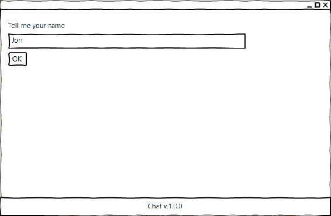
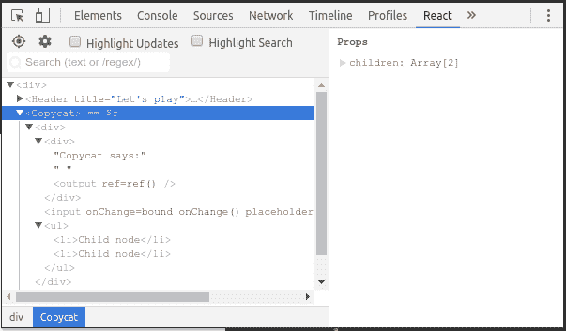

# 创建一个电子和反应聊天系统-规划、设计和开发

在前面的章节中，我们使用了 NW.js。 这是一个很棒的框架，但并不是市场上唯一的。 它的对手 Electron 在特性集上并不逊于 NW.js，并且拥有更大的社区。 为了做出最合适的选择，我假设必须尝试两种框架。 所以，我们的下一个示例应用程序将是一个简单的聊天系统，我们将使用 Electron 来实现它。 我们用纯 JavaScript 创建了文件管理器。 我们必须注意抽象的一致性、数据绑定、模板等等。 事实上，我们可以将这些任务委托给 JavaScript 框架。 在我写这篇文章的时候，这三个解决方案——React、Vue 和 Angular——排在了最前面，其中 React 似乎是最热门的。 我认为它最适合我们的下一个应用程序。 因此，我们将研究 React 的基本要素。 我们将为基于 react 的应用程序设置 Electron 和 webpack。 这次我们不会手动编写所有的 CSS 样式，但将使用 PhotonKit 标记组件。 最后，我们将使用 React 组件构建聊天静态原型，并准备好让它发挥作用。

# 应用蓝图

为了描述我们的应用需求，和之前一样，我们从用户故事开始:

*   作为一个用户，我可以在聊天中介绍自己
*   作为一个用户，我可以实时看到聊天参与者的列表
*   作为一个用户，我可以输入和提交一条消息
*   作为一个用户，我可以看到聊天参与者的消息，因为他们来了

如果把它放到线框中，第一个屏幕将是一个简单的用户名提示:



第二个屏幕包含了参与者的侧边栏和对话线程的主要区域，以及提交消息的表单:


第二个屏幕与第一个屏幕共享页眉和页脚，但主要部分由参与者列表(在左边)和聊天窗格(在右边)组成。 聊天窗格包括传入的消息和提交表单。

# 电子

我们已经熟悉了 NW.js。 正如你可能知道的，它有一个替代品，叫做 Electron([https://electron.atom.io/](https://electron.atom.io/))。 总的来说，两者都提供类似的特性集([http://bit.ly/28NW0iX](http://bit.ly/28NW0iX))。 另一方面，我们可以观察到 Electron 有一个更大、更活跃的群落([https://electron.atom.io/community/](https://electron.atom.io/community/))。

电子还被认为是著名开源项目背后的 GUI 框架，如 Visual Studio Code([https://code.visualstudio.com/](https://code.visualstudio.com/))和 Atom IDE([https://atom.io/](https://atom.io/))。

从开发人员的角度来看，所面临的第一个区别是 Electron 的入口点是 JavaScript，而不像 NW.js 中的 HTML。 当我们启动一个 Electron 应用程序时，框架首先运行指定的脚本(主进程)。 该脚本创建应用程序窗口。 Electron 将 API 拆分为模块。 其中一些仅对主进程可用，一些对渲染进程可用(由主脚本生成的网页所请求的任何脚本)。

让我们把它付诸实践。 首先，我们将创建`./package.json`清单文件:

```js
{ 
  "name": "chat", 
  "version": "1.0.0", 
  "main": "./app/main.js", 
  "scripts": { 
    "start": "electron ." 
  }, 
  "devDependencies": { 
    "devtron": "^1.4.0", 
    "electron": "^1.6.2", 
    "electron-debug": "^1.1.0" 
  } 
} 

```

总的来说，这个清单与我们在之前的章节中为 NW.js 创建的清单没有太大区别。 然而，我们在这里不需要`window`字段，并且在主流程脚本上不需要`main`字段。

至于依赖性,我们显然需要`electron`,此外,我们将使用`electron-debug`包,它激活热键*F12*和*F5 DevTools 并重新加载,分别(https://github.com/sindresorhus/electron-debug)。 我们还包括电子的 DevTools 扩展，称为 Devtron([https://electron.atom.io/devtron](https://electron.atom.io/devtron))。*

现在，我们可以编辑主进程脚本:

`./app/main.js`

```js
const { app, BrowserWindow } = require( "electron" ), 
      path = require( "path" ), 
      url = require( "url" ); 

let mainWindow; 

```

这里，我们从`electron`模块导入`app`和`BrowserWindow`。 第一个允许我们订阅应用程序生命周期事件。 使用第二种方法，我们创建并控制浏览器窗口。 我们还引用了 NPM 模块`path`和`url`。 第一个帮助创建平台无关的路径，第二个帮助构建有效的 URL。 在最后一行中，我们为浏览器窗口实例声明了一个全局引用。 接下来，我们将添加一个创建浏览器窗口的函数:

```js
function createWindow() { 
  mainWindow = new BrowserWindow({ 
    width: 1000, height: 600 
  }); 

  mainWindow.loadURL( url.format({ 
    pathname: path.join( __dirname, "index.html" ), 
    protocol: "file:", 
    slashes: true 
  }) ); 

  mainWindow.on( "closed", () => { 
    mainWindow = null; 
  }); 
} 

```

实际上，该函数只是创建一个窗口实例并在其中加载`index.html`。 当窗口关闭时，对窗口实例的引用将被销毁。 此外，我们订阅应用事件:

```js
 app.on( "ready", createWindow ); 

app.on( "window-all-closed", () => { 
  if ( process.platform !== "darwin" ) { 
    app.quit(); 
  } 
}); 

app.on( "activate", () => { 
  if ( mainWindow === null ) { 
    createWindow(); 
  } 
}); 

```

当 Electron 完成初始化时，触发应用程序事件`"ready"`; 然后我们创建浏览器窗口。

当所有窗口都关闭时触发`window-all-closed`事件。 对于 macOS 以外的任何平台，我们都会退出应用程序。 OS X 应用程序通常保持活跃状态，直到用户明确退出。

`activate`事件只在 macOS 上触发。 特别是当我们点击应用程序的停靠栏或任务栏图标时。 如果此时没有窗口存在，我们创建一个新的窗口。

最后，调用`electron-debug`来激活调试热键:

```js
require( "electron-debug" )(); 

```

如果我们现在启动 Electron，它将尝试加载`index.html`，我们必须首先创建:

`./app/index.html`

```js
<!DOCTYPE html> 
<html> 
  <head> 
    <meta charset="UTF-8"> 
    <title>Hello World!</title> 
  </head> 
  <body> 
    <ul> 
      <li id="app"></li> 
      <li id="os"></li> 
      <li id="electronVer"></li> 
    </ul> 
  </body> 
  <script src="./renderer.js"></script> 
</html> 

```

这里没有什么令人兴奋的事情发生。 我们刚刚声明了几个占位符，并加载了渲染器进程脚本:

`./app/renderer.js`

```js
const manifest = require( "../package.json" ); 

const platforms = { 
  win32: "Windows", 
  darwin: "macOS", 
  linux: "Linux" 
}; 

function write( id, text ){ 
  document.getElementById( id ).innerHTML = text; 
} 

write( "app", `${manifest.name} v.${manifest.version}` ); 
write( "os", `Platform: ${platforms[ process.platform ]}` ); 
write( "electronVer", `Electron v.${process.versions.electron}` ); 

```

在渲染器脚本中，我们将`package.json`读入`manifest`常数。 我们定义一个字典对象来将`process.platform`键映射到有意义的平台名称。 我们添加了一个助手函数`write`，它将给定的文本赋给匹配给定 ID 的元素。 使用这个函数，我们填充 HTML 的占位符。

在这一点上，我们希望有以下的文件结构:

```js
. 
├── app 
│   ├── index.html 
│   ├── main.js 
│   └── renderer.js 
├── node_modules 
└── package.json

```

现在，我们安装依赖项(`npm i`)并运行(`npm start`)示例。 我们将看到以下窗口:


# 反应

React 的势头正在增强。 根据 2016 年 Stack Overflow 开发者调查([http://stackoverflow.com/insights/survey/2016#technology](http://stackoverflow.com/insights/survey/2016#technology))，它是最流行的技术。 有趣的是，React 甚至不是一个框架。 它是一个用于构建用户界面的 JavaScript 库——非常干净、简洁和强大。 这个库实现了组件驱动的体系结构。 因此，我们创建组件(可重用的、可组合的和有状态的 UI 单元)，然后像使用乐高积木一样使用它们来构建预期的 UI。 React 将派生结构视为内存中的 DOM 表示(虚拟 DOM)。 当我们将它绑定到真正的 DOM 时，React 会保持两者同步，这意味着只要它的任何组件改变了它们的状态，React 就会立即反映 DOM 中视图的变化。

Besides that, we can convert virtual DOM in the HTML string ([http://bit.ly/2oVsjVn](http://bit.ly/2oVsjVn)) on the server side and send it with an HTTP response. The client side will automatically bind to the already existing HTML. Thus, we speed up page loading and allow search engines to crawl the content.

简而言之，组件是一个函数，它接受给定的属性并返回一个元素，其中元素是表示组件或 DOM 节点的普通对象。 或者，可以使用扩展`React.Component`的类，其`render`方法生成元素:


要创建 Element，可以使用 API。 然而，现在，作为规则，它不是直接使用，而是通过被称为**JSX**的句法糖。 JSX 用一个看起来像 HTML 模板的新类型扩展了 JavaScript:

```js
const name = "Jon", surname = "Snow"; 
const element = <header> 
  <h1>{name + " " + surname}</h1> 
</header>; 

```

基本上，我们用 JavaScript 直接写 HTML，用 HTML 写 JavaScript。 JSX 可以使用预置的`react`([https://babeljs.io/docs/plugins/preset-react/](https://babeljs.io/docs/plugins/preset-react/))巴别编译器翻译成普通 JavaScript。

大多数现代 ide 都直接支持 JSX 语法。

为了更好地理解，我们对 React 做了一点调整。 基于函数的组件可能看起来像这样:

```js
function Header( props ){ 
  const { title } = props; 
  return ( 
    <header> 
      <h1>{title}</h1> 
    </header> 
  ); 
} 

```

因此，我们声明一个`Header`组件，该组件生成一个元素，该元素表示一个标题，该标题由`title`属性填充。 我们也可以去上课。 因此，我们可以将组件相关的方法封装在类作用域中:

```js
 import React from "react"; 

class Button extends React.Component { 

  onChange(){ 
    alert( "Clicked!" ); 
  } 

  render() { 
    const { text } = this.props; 
    return <button onChange={this.onChange.bind( this )} >{text}</button>; 
  } 
} 

```

这个组件创建了一个按钮，并为其提供了一个极简的功能(当按钮被单击时，我们会得到一个带有“clicked !” 文本)。

现在，我们可以将组件附加到 DOM 上，如下所示:

```js
import ReactDOM from "react-dom"; 

ReactDOM.render(<div> 
  <Header  /> 
  <Button text="Click me" /> 
</div>, document.querySelector( "#app" ) );

```

正如您所注意到的，组件意味着单向流。 您可以将属性从父元素传递给子元素，但不能这样做。 属性是不可变的。 当我们需要和孩子沟通时，我们会提升状态:

```js
import React from "react"; 

class Item extends React.Component { 
  render(){ 
    const { onSelected, text } = this.props; 
    return <li onClick={onSelected( text )}>{text}</li>; 
  } 
} 

class List extends React.Component { 

  onItemSelected( name ){ 
    // take care of ... 
  } 

  render(){ 
    const names = [ "Gregor Clegane", "Dunsen", "Polliver" ]; 
    return <nav> 
        <ul>{names.map(( name ) => { 
            return <Item name={name} onSelected={this.onItemSelected.bind( this )} />; 
          })} 
        </ul> 
      </nav>; 
  } 
} 

```

在`List`组件的`render`方法中，我们有一个名称数组。 使用`map`数组原型方法，遍历名称列表。 该方法产生一个元素数组，JSX 很乐意接受这个数组。 在声明`Item`时，我们传入绑定到列表实例范围的当前`name`和`onItemSelected`处理程序。 `Item`组件呈现`<li>`并订阅传入的处理程序以单击事件。 因此，子组件的事件由父组件处理。

# 电子与反应

现在，我们对电子和反应都有了一个概念。 那么如何将它们结合起来使用呢? 为了了解它，我们将不从实际的应用程序开始，而是从一个简单的、类似的示例开始。 它将包括一些组件和一个表单。 应用程序将在窗口标题中反映用户输入。 我建议复制我们最后一个例子。 我们可以重用清单和主流程脚本。 然而，我们必须对清单进行以下更改:

`./package.json`

```js
{ 
  "name": "chat", 
  "version": "1.0.0", 
  "main": "./app/main.js", 
  "scripts": { 
    "start": "electron .", 
    "dev": "webpack -d --watch", 
    "build": "webpack" 
  }, 
  "dependencies": { 
    "prop-types": "^15.5.7", 
    "react": "^15.4.2", 
    "react-dom": "^15.4.2" 
  }, 
  "devDependencies": { 
    "babel-core": "^6.22.1", 
    "babel-loader": "^6.2.10", 
    "babel-plugin-transform-class-properties": "^6.23.0", 
    "babel-preset-es2017": "^6.22.0", 
    "babel-preset-react": "^6.22.0", 
    "devtron": "^1.4.0", 
    "electron": "^1.6.2", 
    "electron-debug": "^1.1.0", 
    "webpack": "^2.2.1" 
  } 
} 

```

在前面的示例中，我们添加了`react`和`react-dom`模块。 第一个是库核心，第二个是 React 和 DOM 之间的粘合剂。 `prop-types`模块为我们带来了类型检查能力(直到 React v.15.5，它是库的内置对象)。 除了特定于电子的模块外，我们还添加了`webpack`作为一种开发依赖。 Webpack 是一个模块绑定器，它接收不同类型的资产(源、图像、标记和 CSS)，并生成一个可以由客户端加载的包。 我们将使用 webpack 来捆绑我们的 React/ jsx 应用。

然而，webpack 本身并不能编译 JSX; 它使用巴别编译器(`babel-core`)。 我们还包括了连接 webpack 和 Babel 的`babel-loader`模块。 `babel-preset-react`模块是一个所谓的 Babel 预置(一组插件)，它允许 Babel 处理 JSX。 通过预设的`babel-preset-es2017`，我们让 Babel 将符合 es2017 标准的代码编译到 ES2016 中，这是 Electron 非常支持的。 更重要的是，我包含了`babel-plugin-transform-class-properties`Babel 插件来解锁称为 ES Class Fields&Static Properties([https://github.com/tc39/proposal-class-public-fields](https://github.com/tc39/proposal-class-public-fields))的提议的特性。 因此，我们将能够在没有构造函数的帮助下直接定义类属性，而构造函数还没有落到规范中。

在脚本部分中有两个额外的命令。 `build`命令为客户端捆绑 JavaScript。 `dev`命令将 webpack 设置为监视模式。 因此，每当我们更改任何源代码时，它都会自动绑定应用程序。

在使用 webpack 之前，我们需要对它进行配置:

`./webpack.config.js`

```js
const { join } = require( "path" ), 
      webpack = require( "webpack" ); 

module.exports = { 
  entry: join( __dirname, "app/renderer.jsx" ), 
  target: "electron-renderer", 
  output: { 
      path: join( __dirname, "app/build" ), 
      filename:  "renderer.js" 
  }, 
  module: { 
    rules: [ 
      { 
        test: /.jsx?$/, 
        exclude: /node_modules/, 
        use: [{ 
          loader: "babel-loader", 
          options: { 
            presets: [ "es2017", "react" ], 
            plugins: [ "transform-class-properties" ] 
          } 
        }] 
      } 
    ] 
  } 
}; 

```

我们设置`app/renderer.jsx`为切入点。 因此，webpack 将首先读取它，并递归地解析所有 met 依赖项。 编译后的包可以在`app/build/renderer.js`中找到。 到目前为止,我们已经设置 webpack 的唯一规则:每一个见过`.js`或`.jsx``node_modules`目录的文件除了巴别塔,这是配置`es2017`和`react`预设(`transform-class-properties`插件,精确)。 因此，如果我们现在运行，`npm run build`webpack 将尝试将`app/renderer.jsx`编译为`app/build/renderer.js`，我们将从 HTML 中调用它。

`./app/index.html`文件代码如下:

```js
<!DOCTYPE html> 
<html> 
  <head> 
    <meta charset="UTF-8"> 
    <title>Hello World!</title> 
  </head> 
  <body> 
    <app></app> 
  </body> 
  <script> 
   require( "./build/renderer.js" ); 
  </script> 
</html> 

```

主渲染器脚本可能如下所示:

`./app/renderer.jsx`

```js
import React from "react"; 
import ReactDOM from "react-dom"; 

import Header from "./Components/Header.jsx"; 
import Copycat from "./Components/Copycat.jsx"; 

ReactDOM.render(( 
<div> 
  <Header  /> 
  <Copycat> 
    <li>Child node</li> 
    <li>Child node</li> 
  </Copycat> 
</div> 
), document.querySelector( "app" ) );

```

在这里，我们导入两个组件——`Header`和`Copycat`，并在一个复合组件中使用它们，我们将其绑定到 DOM 自定义元素`<app>`。

下面是我们用函数描述的第一个组件:

`./app/Components/Header.jsx`

```js
import React from "react"; 
import PropTypes from "prop-types"; 

export default function Header( props ){ 
  const { title } = props; 
  return ( 
    <header> 
      <h3>{title}</h3> 
    </header> 
  ); 
} 

Header.propTypes = { 
  title: PropTypes.string 
}; 

```

前面代码中的函数接受一个属性`title`(我们将其传递给父组件`<Header />`)，并将其呈现为标题。

注意，我们使用`PropTypes`来验证`title`属性值。 如果我们碰巧将字符串以外的值设置为`title`，则 JavaScript 控制台中会显示一个警告。

下面的第二个组件是一个类:

`./app/Components/Copycat.jsx`

```js
import React from "react"; 
import { remote } from "electron";

export default class Copycat extends React.Component { 

  onChange( e ){ 
    remote.getCurrentWindow().setTitle( e.target.value ); 
  } 

  render() { 
    return ( 
      <div>         
        <input placeholder="Start typing here" onChange={this.onChange.bind( this )} /> 
        <ul> 
        {this.props.children} 
        </ul> 
      </div> 
    ) 
  } 
} 

```

该组件呈现一个输入字段。 在字段中键入的任何内容都会反映在窗口标题中。 在这里，我设置了一个目标来展示一个新概念:子组件/节点。

您还记得我们在父组件中声明了带有子节点的`Copycat`吗? 元素的代码如下:

```js
<Copycat> 
    <li>Child node</li> 
    <li>Child node</li> 
</Copycat> 

```

现在，我们在`this.props.children`中接收这些列表项，并在`<ul>`中呈现它们。

除此之外，我们还订阅了一个用于输入元素上的更改事件的`this.onChange`处理程序。 当它发生变化时，我们从电子的远程函数(`remote.getCurrentWindow()`)获得一个当前窗口实例，并用输入内容替换其标题。

为了看看我们得到了什么，我们使用`npm i`安装依赖项，使用`npm run build`构建项目，并使用`npm start`启动应用程序:


# 使 DevTools 扩展

我相信您在运行上一个示例时没有遇到任何问题。 然而，当我们需要跟踪 React 应用中的问题时，这可能会很棘手，因为 DevTools 向我们展示了真正的 DOM 发生了什么; 然而，我们也想知道关于虚拟的。 幸运的是，Facebook 为 DevTools 提供了一个名为 React Developer Tools([http://bit.ly/1dGLkxb](http://bit.ly/1dGLkxb))的扩展。

我们将安装这个扩展与 electronic -devtools-installer([https://www.npmjs.com/package/electron-devtools-installer](https://www.npmjs.com/package/electron-devtools-installer))。 该工具支持许多 DevTools 扩展，包括一些与 React 相关的扩展:React Developer Tools(`REACT_DEVELOPER_TOOLS`)，Redux DevTools Extension(`REDUX_DEVTOOLS`)，React Perf(`REACT_PERF`)。 我们现在只选择第一个。

首先我们安装包:

```js
npm i -D electron-devtools-installer

```

然后我们在主进程脚本中添加以下代码:

`./app/main.js`

```js
const { default: installExtension, REACT_DEVELOPER_TOOLS } = require( "electron-devtools-installer" );

```

我们从包`installExtension`函数和`REACT_DEVELOPER_TOOLS`常量中导入，它代表 React 开发人员工具。 现在只要应用程序准备好，我们就可以调用该函数。 在这个事件上，我们已经调用了`createWindow`函数。 因此，我们可以扩展函数，而不是再次订阅事件:

```js
function createWindow() {
   installExtension(REACT_DEVELOPER_TOOLS)
      .then((name) => console.log(`Added Extension: ${name}`))
     .catch((err) => console.log("An error occurred: ", err));
//..

```

现在，当我启动应用程序并打开`DevTools`(*F12*)时，我可以看到一个新的选项卡`React`，它将我带到相应的面板。 现在，我们可以在 React 组件树中导航，选择它的节点，并检查相应的组件，编辑它的道具和状态:



# 静态原型

现在，我们已经准备好开始使用聊天应用程序了。 但是，如果我们先创建一个静态版本，然后使用预期的功能对其进行扩展，就会更容易理解。 现在，开发人员通常不会从头开始编写 CSS，而是重用 HTML/CSS 框架的组件，比如 Bootstrap。 有一个框架专门为电子应用-**Photonkit**([http://photonkit.com](http://photonkit.com))。 这个框架为我们提供了构建块，比如布局、窗格、侧边栏、列表、按钮、表单、表格和按钮。 由这些块构建的 UI 看起来像 macOS 的风格，自动适应 Electron 并响应其视口大小。 理想情况下，我会用 React([http://react-photonkit.github.io](http://react-photonkit.github.io))构建 PhotonKit 组件，但我们将用 HTML 来做。 我想向你展示如何在 PhotonKit 的例子中合并一个任意的第三方 CSS 框架。

首先，我们用 NPM 安装它:

```js
npm i -S photonkit

```

我们真正需要的是从包是 CSS 和字体文件从`dist`子文件夹。 从应用程序访问包内容的唯一可靠方法是 require 函数([http://bit.ly/2oGu0Vn](http://bit.ly/2oGu0Vn))。 如何请求 JavaScript 或 JSON 文件是很清楚的，但如何请求其他类型的文件，例如 CSS? 有了 webpack，理论上我们可以捆绑任何内容。 我们只需要在 webpack 配置文件中指定相应的加载器:

`./webpack.config.js`

```js
... 
module.exports = { 
{  
 ... 
 module: { 
    rules: [ 
      ... 
      { 
        test: /\.css$/, 
        use: ["style-loader", "css-loader"] 
      } 
    ] 
  } 
}; 

```

我们用一个新的规则扩展了 webpack 配置，这个规则匹配所有扩展名为`css`的文件。 Webpack 会用`style-loader`和`css-loader`来处理这样的文件。 第一种方法读取请求的文件，并通过注入样式块将其添加到 DOM 中。 第二种方法将所有用`@import`和`url()`请求的资产都传递给 DOM。

启用该规则后，我们可以直接在 JavaScript 模块中加载 Photon 样式:

```js
import "photonkit/dist/css/photon.css";

```

然而，在这个 CSS 中使用的自定义字体仍然不可用。 我们可以通过进一步扩展 webpack 配置来修复它:

`./webpack.config.js`

```js
module.exports = { 
... 
  module: { 
    rules: [ 
      ...      
      { 
        test: /\.(eot|svg|ttf|woff|woff2)(\?v=[0-9]\.[0-9]\.[0-9])?$/, 
        use: [{ 
            loader: "file-loader", 
            options: { 
              publicPath: "./build/" 
            } 
        }] 
      } 
    ] 
  } 
}; 

```

该规则针对字体文件并利用`file-loader`，它从包中获取请求的文件，将其存储在本地，并返回新创建的本地路径。

所以，既然样式和字体是由 webpack 处理的，我们可以继续使用组件。 我们将有两个组件表示窗口的页眉和页脚。 对于主要部分，当用户还没有提供任何名称时，我们将使用`Welcome`，之后使用`ChatPane`。 第二种是`Participants`和`Conversation`组件的布局。 我们还将有一个根组件`App`，它将所有其他组件与未来的聊天服务连接起来。 实际上，这个组件的工作方式不像表示组件，而是作为一个容器([http://redux.js.org/docs/basics/UsageWithReact.html](http://redux.js.org/docs/basics/UsageWithReact.html))。 所以，我们要把它和其他的分开。

既然我们已经完成了架构，我们可以写下我们的起始脚本:

`./app/renderer.jsx`

```js
import "photonkit/dist/css/photon.css"; 
import React from "react"; 
import ReactDOM from "react-dom"; 

import App from "./Containers/App.jsx"; 

ReactDOM.render(( 
<App  /> 
), document.querySelector( "app" ) ); 

```

在这里，我们添加到 DOM PhotonKit 库的 CSS(`import "photonkit/dist/css/photon.css"`)，并绑定`App`容器到`<app>`元素。 接下来是下面这个容器:

`./app/js/Containers/App.jsx`

```js
import React from "react"; 
import PropTypes from "prop-types"; 
import ChatPane from "../Components/ChatPane.jsx"; 
import Welcome from "../Components/Welcome.jsx"; 
import Header from "../Components/Header.jsx"; 
import Footer from "../Components/Footer.jsx"; 

export default class App extends React.Component { 

  render() { 
    const name = "Name"; 
    return ( 
      <div className="window"> 
        <Header></Header> 
        <div className="window-content"> 
          { name ? 
            ( <ChatPane 
                /> ) : 
            ( <Welcome /> ) } 
        </div> 
        <Footer></Footer> 
      </div> 
    ); 
  } 
} 

```

在这个阶段，我们只是布局其他组件使用 PhotonKit 应用布局风格(`.window`和`.window-content`)。 正如我们所商定的，我们在页眉和页脚之间呈现`ChatPane`或`Welcome`，这取决于本地常量`name`的值。

顺便说一下，我们从 Photon 标记组件([http://photonkit.com/components/](http://photonkit.com/components/))构建的页眉和页脚都被称为**bar**。 除了简洁的样式，它还允许在桌面周围拖动应用程序窗口:

`./app/js/Components/Header.jsx`

```js
import React from "react"; 

export default class Header extends React.Component { 
  render() { 
    return ( 
      <header className="toolbar toolbar-header"> 
          <div className="toolbar-actions"> 
              <button className="btn btn-default pull-right"> 
                 <span className="icon icon-cancel"></span> 
             </button> 
          </div> 
       </header> 
    ) 
  } 
} 

```

你可以从`Header`组件(`.toolbar`和`.toolbar-header`)的 Photon CSS 类中看出，我们在窗口顶部渲染一个条。 工具条接受操作按钮(`.toolbar-actions`)。 目前，唯一可用的按钮是关闭窗口。

在`Footer`组件中，我们渲染一个位于底部的条(`.toolbar-footer`):

`./app/js/Components/Footer.jsx`

```js
import React from "react"; 
import * as manifest from "../../../package.json"; 

export default function Footer(){ 
    return ( 
      <footer className="toolbar toolbar-footer"> 
        <h1 className="title">{manifest.name} v.{manifest.version}</h1> 
     </footer> 
    ); 
} 

```

它包括清单中的项目名称和版本。

对于欢迎屏幕，我们有一个简单的表单，其中输入字段(`input.form-control`)用于名称和提交按钮(`button.btn-primary`):

`./app/js/Components/Welcome.jsx`

```js
import React from "react"; 

export default class Welcome extends React.Component { 

  render() { 
    return ( 
      <div className="pane padded-more"> 
        <form> 
          <div className="form-group"> 
            <label>Tell me your name</label> 
            <input required className="form-control" placeholder="Name"   
          /> 
          </div> 
          <div className="form-actions"> 
            <button className="btn btn-form btn-primary">OK</button> 
          </div> 
        </form> 
      </div> 
    ) 
  } 
} 

```

`ChatPane`组件将`Participants`放在左边，`Conversation`放在右边。 它几乎就是它现在所做的一切:

`./app/js/Components/ChatPane.jsx`

```js
import React from "react"; 

import Participants from "./Participants.jsx"; 
import Conversation from "./Conversation.jsx"; 

export default function ChatPane( props ){ 
  return ( 
    <div className="pane-group"> 
      <Participants /> 
      <Conversation /> 
    </div> 
  ); 

} 

```

在`Participants`组件中，我们使用侧栏类型(`.pane.pane-sm.sidebar`)的布局窗格:
`./app/js/Components/Participants.jsx`

```js
import React from "react"; 

export default class Participants extends React.Component { 
  render(){ 
    return ( 
      <div className="pane pane-sm sidebar"> 
        <ul className="list-group"> 
          <li className="list-group-item"> 
              <div className="media-body"> 
                <strong><span className="icon icon-user"></span>&nbsp;Name</strong> 
                <p>Joined 2 min ago</p> 
              </div> 
            </li> 
        </ul> 
      </div> 
    ); 
  } 
} 

```

它有一个聊天参与者的列表。 每个带有 Entype 图标前缀的名称都是由 Photon 提供的。

最后一个组件——`Conversation`——在列表(`.list-group`)和提交表单中呈现聊天消息:
`./app/js/Components/Conversation.jsx`

```js
import React from "react"; 

export default class Conversation extends React.Component { 

  render(){ 
    return ( 
        <div className="pane padded-more l-chat"> 
          <ul className="list-group l-chat-conversation"> 
            <li className="list-group-item"> 
                <div className="media-body"> 
                  <time className="media-body__time">10.10.2010</time> 
                  <strong>Name:</strong> 
                    <p>Text...</p> 
                </div> 
              </li> 
          </ul> 
          <form className="l-chat-form"> 
            <div className="form-group"> 
              <textarea required placeholder="Say something..." 
                className="form-control"></textarea> 
            </div> 
            <div className="form-actions"> 
              <button className="btn btn-form btn-primary">OK</button> 
            </div> 
          </form> 
        </div> 
    ); 
  } 
} 

```

这是我们第一次需要有几个定制风格:
`./aimg/css/custom.css`

```js
.l-chat { 
  display: flex; 
  flex-flow: column nowrap; 
  align-items: stretch; 
} 
.l-chat-conversation { 
  flex: 1 1 auto; 
  overflow-y: auto; 
} 
.l-chat-form { 
  flex: 0 0 110px; 
} 
.media-body__time { 
  float: right; 
} 

```

在这里，我们将形式`(.l-form`粘在底部。 它具有固定的高度(`110px`)，并且向上的所有可用空间采用消息列表(`.l-chat-conversation`)。 此外，我们将消息时间信息(`.media-body__time`)向右对齐，并将其移出流(`float: right`)。

`./index.html`

```js
<!DOCTYPE html> 
<html> 
  <head> 
    <meta charset="UTF-8"> 
    <title>Chat</title> 
    <link href=img/css/custom.css" rel="stylesheet" type="text/css"/> 
  </head> 
  <body> 
    <app></app> 
  </body> 
  <script> 
   require( "./build/renderer.js" ); 
  </script> 
</html> 

```

我们确保安装了所有依赖项(`npm i`)，然后构建(`npm run build`)并启动应用程序(`npm start`)。 当它完成后，我们可以看到以下预期的 UI:


# 总结

尽管我们还没有一个功能性的应用程序，只有一个静态的原型，但我们已经走了很长一段路。 我们讨论了 Electron GUI 框架。 我们将其与 NW.js 进行了比较，并了解了它的特点。 我们制作了一个简化的 Electron 演示应用程序，由一个主进程脚本、渲染器脚本和 HTML 组成。 我们介绍了 React 的基础知识。 我们主要关注组件和元素、JSX 和虚拟 DOM、道具和状态。 我们配置 webpack 来编译我们的 ES。 Next-compliant JSX 变成了一个 javascript 可接受的 JSX。 为了巩固我们的知识，我们制作了一个由 Electron 提供动力的小型演示 React 应用程序。 此外，我们还研究了如何在 Electron 中启用 DevTools 扩展(React Developer Tools)来跟踪和调试 React 应用程序。 我们已经简单熟悉了 PhotonKit 的前端框架，并使用 PhotonKit 的样式和标记为聊天应用程序创建了 React 组件。 最后，我们将组件捆绑在一起，并在 Electron 中呈现应用程序。