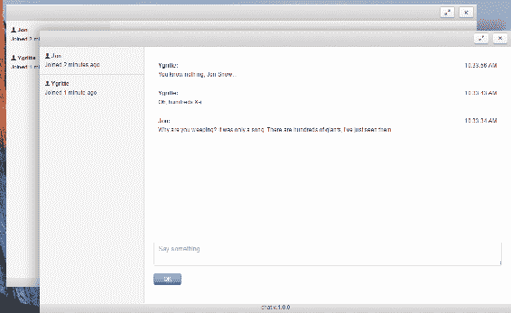
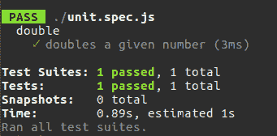
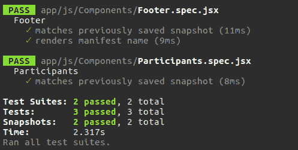
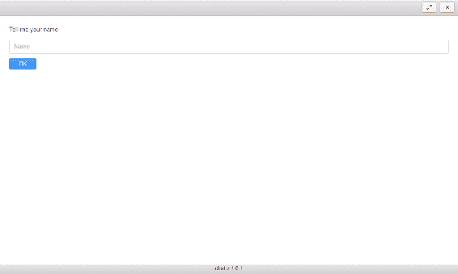

# 四、使用 Electron 和 React 创建一个聊天系统——改进，测试和交付

我们完成了最后一章的静态原型。 我们了解了 React，构建了组件，但没有为它们提供任何状态。 现在，我们将开始将应用程序窗口的状态绑定到 Header 组件。 随着状态概念的阐明，我们将转移到聊天服务。 在简单介绍了 WebSockets 技术之后，我们将同时实现服务器和客户机。 我们将服务事件绑定到应用程序状态。 最后，我们将有一个全面的工作聊天。 我们不会就此打住，但会处理技术债务。 因此，我们将设置 Jest 测试框架，并对无状态和有状态组件进行单元测试。 之后，我们将打包应用程序并通过一个基本的 HTTP 服务器发布版本。 我们将扩展应用程序，以便在有新版本时进行更新。

# 重新激活标题栏

直到现在，我们的标题栏都不是很有用。 感谢 Photon 框架，我们已经可以使用它作为一个柄拖拽窗口在 viewport，但我们缺少窗口操作，如关闭，最大化，和恢复窗口。

让我们实现它们:

`./app/js/Components/Header.jsx`

```js
import { remote } from "electron"; 
const win = remote.getCurrentWindow(); 

export default class 

Header extends React.Component { 
//.... 
 onRestore = () => { 
    win.restore(); 
  } 

  onMaximize = () => { 
    win.maximize(); 
  } 

  onClose = () => { 
    win.close(); 

  } 
//... 
} 

```

We do not go with methods, with properties keeping anonymous functions bound to the object scope. This trick is possible, thanks to `babel-plugin-transform-class-properties`, which we included in the manifest and Webpack configuration in [Chapter 3](3.html), *Creating a Chat System with Electron and React – Planning, Design, and Development*.

我们使用处理程序对组件进行了扩展，以关闭窗口、最大化窗口，然后恢复到原来的大小。 我们在 JSX 中已经有了一个`close`按钮，所以我们只需要使用`onClick`属性订阅`click`事件对应的处理方法:

```js
 <button className="btn btn-default pull-right" onClick={this.onClose}> 
     <span className="icon 

icon-cancel"></span> 
</button> 

```

然而，`maximize`和`restore`按钮是有条件地在 HTML 中呈现的，这取决于当前的窗口状态。 因为我们将使用状态，所以让我们定义它:

```js
 constructor( props ) { 
    super( props ); 
    this.state = { isMaximized: win.isMaximized() }; 
  } 

```

状态属性从当前窗口实例中接受相应的标志。 现在，我们可以从 JSX 的状态中提取这个值:

```js
..... 
render() { 
    const { isMaximized } = this.state; 
    return ( 
      <header 

className="toolbar toolbar-header"> 
          <div className="toolbar-actions"> 

<button className="btn btn-default pull-right" onClick={this.onClose}> 
                   <span 

className="icon icon-cancel"></span> 
               </button> 

               { 

isMaximized ? ( 
                 <button className="btn btn-default pull-right" onClick={this.onRestore}> 
                    <span className="icon icon-resize-small"></span> 
                 </button> ) 

: ( 
                 <button className="btn btn-default pull-right" onClick={this.onMaximize}> 

        <span className="icon icon-resize-full"></span> 
                 </button>) 

     } 

          </div> 
       </header> 
    ) 
  } 

```

因此，当`restore`按钮为 true 时，我们渲染`maximize`按钮，否则渲染`maximize`按钮。 我们还订阅了两个按钮上的`click`事件的处理程序，但是如何在窗口最大化或恢复后更改状态呢?

我们可以在组件呈现给 DOM 之前订阅相应的窗口事件:

```js
componentWillMount() { 
    win.on( "maximize", this.updateState ); 
    win.on( "unmaximize", 

this.updateState ); 
  } 

  updateState = () => { 
    this.setState({ 
      isMaximized: 

win.isMaximized() 
    }); 
  } 

```

当窗口改变其状态处理程序时，`updateState`调用并实现组件状态。

# Utilizing WebSockets

我们有一个静态原型，现在我们要让它发挥作用。 任何聊天都需要连接的客户端之间的通信。 通常，客户端不直接连接，而是通过服务器连接。 服务器注册连接并转发消息。 如何从客户端发送消息到服务器已经很清楚了，但是我们能从相反的方向发送消息吗? 在过去，我们必须处理长轮询技术。 这是可行的，但由于 HTTP 的开销，当我们指的是低延迟的应用程序时，它并不适合。 幸运的是，Electron 支持 WebSockets。 通过这个 API，我们可以在客户机和服务器之间打开一个全双工、双向的 TCP 连接。 与 HTTP 相比，WebSockets 提供了更高的速度和效率。 该技术将不必要的 HTTP 流量减少最多 500:1，延迟减少最多 3:1([http://bit.ly/2ptVzlk](http://bit.ly/2ptVzlk))。 你可以在我的书*JavaScript 解锁*([https://www.packtpub.com/web-development/javascript-unlocked](https://www.packtpub.com/web-development/javascript-unlocked))中找到更多关于 WebSockets 的信息。 在这里，我们将通过一个小演示来简要了解该技术。 我建议检查一个 echo 服务器和一个客户端。 每当客户机向服务器发送文本时，服务器就在所有连接的客户机上广播它。 因此，在加载了客户机的每个页面上，我们都实时接收消息。

当然，我们不会为服务器写一个协议实现，而是使用一个现有的 NPM 包——nodejs-websocket([https://www.npmjs.com/package/nodejs- websocket](https://www.npmjs.com/package/nodejs-websocket)):

```js
npm i -S nodejs-websocket 

```

使用包 API，我们可以快速地编写代码来提供来自客户端的传入消息:

`./server.js`

```js
const ws = require( "nodejs-websocket" ), 
      HOST = "127.0.0.1", 
      PORT = 8001; 

const 

server = ws.createServer(( conn ) => { 

  conn.on( "text", ( text ) => { 

server.connections.forEach( conn => { 
      conn.sendText( text ); 
    }); 
  }); 

conn.on( "error", ( err ) => { 
    console.error( "Server error", err ); 
  }); 

}); 

server.listen( PORT, HOST, () => { 
  console.info( "Server is ready" ); 
}); 

```

在这里，我们实例化一个表示 WebSockets 服务器(`server`)的对象。 在`createServer`工厂的回调中，我们将接收连接对象。 我们订阅`"text"`和`"error"`事件的每个连接。 第一个发生在数据帧从客户端发送到服务器端。 我们只是把它转发给每一个可用的连接。 当出现错误时触发第二个事件，因此我们报告错误。 最后，我们在给定的端口和主机中启动服务器，例如，我设置端口`8001`。 如果您的环境中有任何其他程序占用该端口，只需更改`PORT`常量的值。

我们可以将这个简化的聊天的客户端组成为一个单独的页面应用程序。 因此，创建以下 HTML:

`./index.html`

```js
<!DOCTYPE html> 
<html> 
  <head> 
    <title>Echo</title> 

<meta charset="UTF-8"> 
    <meta name="viewport" content="width=device-width, initial- 
    scale=1.0"> 

</head> 
  <body> 
    <form id="form"> 
      <input id="input" placeholder="Enter you 

message..." /> 
      <button>Submit</button> 
    </form> 
    <output 

id="output"></output> 

<script> 
const HOST = "127.0.0.1", 
      PORT = 8001, 

    form = document.getElementById( "form" ), 
      input = document.getElementById( "input" ), 
      output = 

document.getElementById( "output" ); 

const ws = new WebSocket( `ws://${HOST}:${PORT}` ); 

ws.addEventListener( "error", ( e ) => { 
  console.error( "Client's error: ", e ); 
}); 

ws.addEventListener( "open", () => { 
  console.log( "Client connected" ); 
}); 

ws.addEventListener( "message", e => { 
  output.innerHTML = e.data + "<br \>" + output.innerHTML; 
}); 

form.addEventListener( "submit", ( e ) => { 
  e.preventDefault(); 
  ws.send( input.value 

); 
}); 

</script> 
  </body> 
</html> 

```

在 HTML 中，我们放置了一个带有输入控件和输出容器的表单。 其目的是在表单上发送输入值，将其提交给服务器，并在输出元素中显示服务器响应。

在 JavaScript 中，我们存储一个对代理节点的引用，并创建一个 WebSockets 客户端的实例。 我们订阅了`error`、`open`和`message`客户机事件。 前两个主要报道正在发生的事情。 最后一个接收来自服务器的事件。 在我们的例子中，服务器发送文本消息，所以我们可以将它们作为`e.data`。 我们还需要处理来自客户机的输入。 因此，我们订阅了 form 元素上的`submit`。 我们使用 WebSockets 客户端的`send`方法将输入值分派给服务器。

要运行这个例子，我们可以使用`http-server`模块([https://www.npmjs.com/package/http-server](https://www.npmjs.com/package/http-server))为我们的`index.html`启动一个静态 HTTP 服务器:

```js
npm i -S http-server 

```

现在，我们可以将以下命令添加到`package.json`:

```js
{
  "scripts": {
    "start:client": "http-server . -o",
    "start:server": "node server.js"
  }

}

```

因此，我们可以这样运行服务器:

```js
 npm run start:server 

```

然后客户是:

```js
 npm run start:client

```


# 实现聊天服务

我相信现在 WebSockets 的工作原理已经很清楚了，我们可以将 API 应用到我们的聊天中。 然而，在实际的应用程序中，我们需要的不仅仅是回显发送的文本。 让我们将预期的事件场景写在纸上:

*   `Welcome`组件处理用户输入，并通过客户机将输入的用户名发送给`join`服务器事件
*   服务器接收到`join`事件，向集合中添加一个新用户，并使用更新的集合广播`participants`事件
*   客户端接收到`participants`事件，并将该事件集传递给`Participants`组件，该组件更新参与者的列表
*   `Conversation`组件处理用户输入，并通过客户端将输入的消息作为`text`事件发送给服务器，在有效负载中包含用户名、文本和时间戳
*   服务器接收到`text`事件并将其广播给所有聊天参与者

当我们处理事件消息时，我们需要一个统一的格式来发送和接收单一的真相来源。 因此，我们实现一个消息包装器——`./app/js/Service/Message.js`:

```js
class Message { 
  static toString( event, data ){ 
    return JSON.stringify({ 
      event, data 
    }); 
  } 
  static fromString( text ){ 
    return JSON.parse( text ); 
  } 
} 

exports.Message = Message; 

```

这个模块公开了两个静态方法。 一个是将给定的事件名称和有效负载转换为 JSON 字符串，可以通过 WebSockets 发送; 另一个将接收到的字符串转换为消息对象。

现在我们编写服务器——`./app/js/Service/Server.js`:

```js
import * as ws from "nodejs-websocket"; 
import { Message } from "./Message"; 

export default class 

Server { 

  constructor() { 
    this.server = ws.createServer(( conn ) => { 

conn.on( "error", ( err ) => { 
        console.error( "Server error", err ); 
      }); 
      conn.on( 

"close", ( code, reason ) => { 
        console.log( "Server closes a connection", code, reason ); 
      }); 

      conn.on( "connection", () => { 
        console.info( "Server creates a new connection" ); 

}); 
    }); 

  } 

  broadcast( event, data ){ 
    const text = Message.toString( 

event, data ); 
    this.server.connections.forEach( conn => { 
      conn.sendText( text ); 
    }); 
  } 

  connect( host, port ) { 
     this.server.listen( port, host, () => { 

console.info( "Server is ready" );      }); 
  } 
} 

```

与 echo 服务器一样，它订阅连接事件来报告正在发生的事情，并公开`broadcast`和`connect`方法。 为了让它处理传入的消息，我们扩展了`createServer`回调:

```js
constructor() { 

    this.server = ws.createServer(( conn ) => { 

      conn.on( "text", 

( text ) => { 
        const msg = Message.fromString( text ), 
              method = `on${msg.event}`; 
        if ( !this[ method ] ) { 
          return; 
        } 
        this[ method ]( msg.data, conn ); 

      }); 
      //... 
    }); 
    //... 
  } 

```

现在，当接收到消息时，服务器尝试调用与事件名称匹配的处理程序方法。 例如，当它收到`join`事件时，它调用`onjoin`:

```js
onjoin( name, conn ){ 
    const datetime = new Date(); 
    this.participants.set( conn, { 

name: name, 
      time: datetime.toString() 
    }); 

    this.broadcast( "participants", 

Array.from( this.participants.values() )); 
  } 

```

该方法接受事件有效负载(这里的用户名)作为第一个参数，并接受连接引用作为第二个参数。 它在`this.participant`地图中注册连接。 因此，我们现在可以通过连接确定关联的用户名和注册时间戳。 然后该方法将映射的值广播为一个数组(一组用户名和时间戳)。

但是，我们不应该忘记在类构造函数中将`this.participants`定义为一个映射:

```js

constructor() { 
    this.participants = new Map(); 
    //... 
} 

```

我们还为`text`事件添加了一个处理方法:

```js

ontext( data, conn ){ 
    const name = this.participants.get( conn ).name; 
    this.broadcast( 

"text", { name, ...data } ); 
  } 

```

该方法从`this.participants`中提取与给定连接关联的用户名，用它扩展消息有效负载，并广播派生消息。

现在，我们可以编写客户机——`./app/js/Service/Client.js`:

```js
const EventEmitter = require( "events" ), 
          READY_STATE_OPEN = 1; 
import { Message } from 

"./Message"; 

export default class Client extends EventEmitter { 

  connect( host, port ){ 

    return new Promise(( resolve, reject ) => { 
      this.socket = new WebSocket( `ws://${host}:${port}` ); 

      this.socket.addEventListener( "open", () => { 
        resolve(); 
      }); 

    this.socket.addEventListener( "error", ( e ) => { 
        if ( e.target.readyState > READY_STATE_OPEN ) { 

          reject(); 
        } 
      }); 

      this.socket.addEventListener( "message", e 

=> { 
        const msg = Message.fromString( e.data ), 
              method = `on${msg.event}`; 

 if ( !this[ method ] ) { 
          return; 
        } 
        this[ method ]( msg.data ); 
      }); 

    }); 
  } 

  onparticipants( data ){ 
    this.emit( "participants", data ); 
  } 

  ontext( data ){ 
    this.emit( "text", data ); 
  } 

 getParticipants(){ 

return this.participants; 
  } 

  join( userName ) { 
    this.userName = userName; 

this.send( "join", userName ); 
  } 

  message( text ) { 
    this.send( "text", { 

userName: this.userName, 
      text, 
      dateTime: Date.now() 
    }); 
  } 

  send( 

event, data ){ 
    this.socket.send( Message.toString( event, data ) ); 
  } 
} 

```

客户端通过处理程序方法实现了与服务器相同的技巧，但是这次，我们让`connect`方法返回 Promise。 因此，如果客户端连接服务器失败，我们可以调整执行流。 我们有两个指导老师:`onparticipants`和`ontext`。 它们都只是将接收到的消息绕过到应用程序。 由于`Client`类扩展了`EventEmitter`，所以我们可以使用`this.emit`来触发事件，并且任何订阅的应用程序模块都能够捕获该事件。 此外，客户公开了两种公共方法:`join`和`message`。 一个(`join`)将由`Welcome`组件使用，以便在服务器上注册提供的用户名，另一个(`message`)将由`Participants`组件调用，以便将提交的文本通信到服务器。 这两个方法都依赖于`send`私有方法，后者实际分发消息。

Electron 由 Node.js 运行时组成，因此允许我们运行服务器。 因此，为了简化它，我们将服务器包含到应用程序中。 为此，我们再次修改服务器代码:

```js

  connect( host, port, client ) { 
    client.connect( host, port ).catch(() => { 

this.server.listen( port, host, () => { 
        console.info( "Server is ready" ); 
        client.connect( 

host, port ).catch(() => { 
          console.error( "Client's error" ); 
        }); 
      }); 

 }); 
  } 

```

现在它运行提供的`client.connect`来建立与 WebSockets 服务器的连接。 如果它是运行应用程序的第一个实例，则还没有可用的服务器。 因此，客户端连接失败，执行流跳转到 catch 回调。 在那里，我们启动服务器并重新连接客户机。

# 为组件提供功能

现在，当我们拥有服务器和客户端服务时，我们可以在应用程序中启用它们。 最合适的地方是`App`容器——`./app/js/Containers/App.jsx`:

```js
import Server from "../Service/Server"; 
import Client from "../Service/Client"; 

const HOST = 

"127.0.0.1", 
      PORT = 8001; 

export default class App extends React.Component { 

constructor(){ 
    super(); 
    this.client = new Client(); 
    this.server = new Server(); 

this.server.connect( HOST, PORT, this.client ); 
  } 
//... 
} 

```

你还记得我们在静态原型中有条件地渲染`ChatPane`或`Welcome`组件吗? ：

```js
{ name ? 
            ( <ChatPane client={client} 
                /> ) : 
            ( 

<Welcome  onNameChange={this.onNameChange} /> ) } 

```

那时，我们硬编码了`name`，但它属于组件状态。 因此，我们可以像这样在类构造函数中初始化状态:

```js
constructor(){ 
    //... 
    this.state = { 
      name: "" 
    }; 
} 

```

嗯，在默认情况下，`name`是空的，因此我们将显示`Welcome`组件。 我们可以在那里输入一个新名字。 当它被提交时，我们需要以某种方式改变父组件的状态。 我们用一种叫做**提升状态**的技术来实现这个目标。 我们在`App`容器中声明了`name`变更事件的处理程序，并将其通过道具传递给`Welcome`组件:

```js

onNameChange = ( userName ) => { 
  this.setState({ name: userName }); 
  this.client.join( 

userName ); 
} 

render() { 
  const client = this.client, 
        name = this.state.name; 
  return ( 
    <div className="window"> 
      <Header></Header> 
      <div 

className="window-content"> 
        { name ? 
          ( <ChatPane client={client} 

/> ) : 
          ( <Welcome  onNameChange={this.onNameChange} /> ) } 
      </div> 

<Footer></Footer> 
    </div> 
  ); 
} 

```

因此，我们从状态中提取`name`并在表达式中使用它。 最初，`name`是空的，因此`Welcome`组件被渲染。 我们声明`onNameChange`处理程序并将其通过道具传递给`Welcome`组件。 处理程序接收提交的名称，在服务器上注册新的连接(`this.client.join`)，并更改组件状态。 因此，`ChatPane`元件取代了`Welcome`元件。

现在，我们将编辑`Welcome`组件——`./app/js/Components/Welcome.jsx`:

```js
import React from "react"; 
import PropTypes from "prop-types"; 

export default class Welcome extends 

React.Component { 

  onSubmit = ( e ) => { 
    e.preventDefault(); 
    this.props.onNameChange( 

this.nameEl.value || "Jon" ); 
  } 

  static defaultProps = { 
    onNameChange: () => {} 

} 

  static propTypes = { 
    onNameChange: PropTypes.func.isRequired 
  } 

  render() { 

    return ( 
      <div className="pane padded-more"> 
        <form onSubmit={this.onSubmit}> 

          <div className="form-group"> 
            <label>Tell me your name</label> 

        <input required className="form-control" placeholder="Name" 
              ref={(input) => { this.nameEl 

= input; }} /> 
          </div> 
          <div className="form-actions"> 

<button className="btn btn-form btn-primary">OK</button> 
          </div> 

</form> 
      </div> 
    ) 
  } 
} 

```

每当组件需要任何支柱时，这通常意味着我们必须应用`defaultProps`和`propTypes`静态方法。 这些属于`React.Component`API，在组件初始化时自动调用。 第一个为道具设置默认值，第二个验证它们。 在 HTML 中，我们订阅表单`submit`事件的`onSubmit`处理程序。 在处理程序中，我们需要访问一个输入值。 通过`ref`JSX 属性，我们添加了实例作为对输入元素的引用。 因此，从`onSubmit`处理程序中，我们可以获得输入值为`this.nameEl.value`。

好了，现在用户可以在聊天中注册了，我们需要显示聊天界面——`./app/js/Components/ChatPane.jsx`:

```js
export default function ChatPane( props ){ 
  const { client } = props; 
  return ( 
    <div 

className="pane-group"> 

      <Participants client={client} /> 

      <Conversation  

client={client} /> 

    </div> 
  ); 

} 

```

这是一个复合组件，它布局了`Participants`和`Conversation`子组件，并将`client`转发给它们。

第一个是用来显示参与者的列表——`./app/js/Components/Participants.jsx`:

```js
import React from "react"; 
import TimeAgo from "react-timeago"; 
import PropTypes from "prop-types"; 

export default class Participants extends React.Component { 

 constructor( props ){ 
    super( 
    props ); 
    this.state = { 
      participants: props.client.getParticipants() 
    } 

props.client.on( "participants", this.onClientParticipants ); 
  } 

  static defaultProps = { 
    client: null 
  } 

  static propTypes = { 
    client: PropTypes.object.isRequired 
  } 

onClientParticipants = ( participants ) => { 
    this.setState({ 
      participants: 

participants 
    }) 
  } 

  render(){ 
    return ( 
      <div className="pane pane-sm 
      sidebar"> 
        <ul className="list-group"> 
          {this.state.participants.map(( user ) => ( 

            <li className="list-group-item" key={user.name}> 
              <div className="media-
              body"> 
                <strong><span className="icon icon-user"></span>&nbsp;     
                {user.name}
                </strong> 
                <p>Joined <TimeAgo date={user.time} /></p> 
              </div> 
            </li> 
          ))} 
        </ul> 
      </div> 
    ); 
  } 
} 

```

这里，我们需要一些施工工作。 首先，我们定义状态，它包含来自道具的参与者列表。 我们还订阅客户端`participants`事件，并在每次服务器发送更新列表时更新状态。 在呈现列表的时候，我们也会显示参与者的注册时间，比如加入 5 分钟前。 为此，我们使用了由`react-timeago`NPM 包提供的第三方组件`TimeAgo`。

最后，我们来到了`Conversation`组件——`./app/js/Components/Conversation.jsx`:

```js
import React from "react"; 
import PropTypes from "prop-types"; 

export default class Conversation 

extends React.Component { 

  constructor( props ){ 
    super( props ); 
    this.messages = []; 

    this.state = { 
      messages: [] 
    } 
    props.client.on( "text",  this.onClientText ); 
  } 

  static defaultProps = { 
    client: null 
  } 

  static propTypes = { 
    client: PropTypes.object.isRequired 
  } 

onClientText = ( msg ) => { 
    msg.time = new 

Date( msg.dateTime ); 
    this.messages.unshift( msg ); 
    this.setState({ 
      messages: this.messages 

    }); 
  } 

 static normalizeTime( date, now, locale ){ 
    const isToday = ( 

now.toDateString() === date.toDateString() ); 
    // when local is undefined, toLocaleDateString/toLocaleTimeString 

use default locale 
    return isToday ? date.toLocaleTimeString( locale ) 
      : date.toLocaleDateString( 

locale ) + ` ` + date.toLocaleTimeString( locale ); 
  } 

  render(){ 
    const { messages } = 

this.state; 
    return ( 
        <div className="pane padded-more l-chat"> 
          <ul 

className="list-group l-chat-conversation"> 
            {messages.map(( msg, i ) => ( 

<li className="list-group-item" key={i}> 
                <div className="media-body"> 

    <time className="media-body__time">{Conversation.normalizeTime(  
    msg.time, new Date() )}</time> 

           <strong>{msg.userName}:</strong> 
                  {msg.text.split( "\n" ) .map(( line, 
                  inx ) => ( 
                    <p key={inx}>{line}</p> 
                  ))} 
              </div> 
              </li> 
            ))} 
          </ul> 
         </div> 
    ); 
  } 
} 

```

在构建过程中，我们订阅客户端`text`事件，并在`this.messages`数组中收集接收到的消息。 我们使用这些消息来设置组件状态。 在`render`方法中，我们从状态中提取消息列表并遍历它以呈现每个条目。 消息视图包括发送者的姓名、文本和时间。 我们按原样输出的名称。 我们将文本分成几行，并用段落元素将它们包装起来。 为了显示时间，我们使用了`normalizeTime`静态方法。 该方法将`Date`对象转换为一个较旧的长字符串(日期和时间)，否则转换为一个短字符串(日期)。

我们还需要一个窗体来发送消息到聊天。 理想的方法是将表单放入一个单独的组件中，但为了简洁起见，我们将它放在会话视图旁边:

```js
  render(){ 
    const { messages } = this.state; 
    return ( 
... 
        <form onSubmit=

{this.onSubmit} className="l-chat-form"> 
            <div className="form-group"> 

<textarea required placeholder="Say something..." 
                onKeyDown={this.onKeydown} 

className="form-control" ref={ el => { this.inputEl = el; }}></textarea> 
            </div> 

          <div className="form-actions"> 
              <button className="btn btn-form btn-

primary">OK</button> 
            </div> 
          </form> 
 ); 
} 
... 

```

与`Welcome`组件非常相似，我们对文本区域节点进行本地引用，并订阅表单`submit`事件的`onSubmit`处理程序。 为了方便用户使用，我们将`onKeydown`设置为在文本区域收听键盘事件。 当键入时按*Enter*，我们提交表单。 因此，我们现在必须向组件类中添加新的处理程序:

```js
const ENTER_KEY = 13; 
//... 
onKeydown = ( e ) => { 
    if ( e.which === ENTER_KEY && !

e.ctrlKey && !e.metaKey && !e.shiftKey ) { 
      e.preventDefault(); 
      this.submit(); 
    } 
  } 

  onSubmit = ( e ) => { 
    e.preventDefault(); 
    this.submit(); 

}  

  submit() { 
    this.props.client.message( this.inputEl.value ); 
    this.inputEl.value = ""; 

  } 

//.. 

```

当通过按下 OK 按钮或*输入*提交表单时，我们通过客户端的`message`方法将消息传递给服务器，并重置表单。

我不知道你是怎么想的，但我很想运行这个应用程序，看看它是怎么运行的。 我们有两个选择。 我们可以在同一台机器上启动多个实例，为每个实例注册不同的名称，然后开始聊天:



或者，我们在`App`容器中设置一个公共 IP，以使聊天在网络上可用。

# 编写单元测试

在实际生活中，我们使用单元测试来介绍应用程序功能。 说到 React，人们首先想到的是 Jest 测试框架。 该框架由 Facebook 和 React 共同开发。 玩笑不只是针对 React; 你可以测试任何 JavaScript。 为了看看它是如何工作的，我们可以建立一个新项目:

```js
npm init -y 

```

运行以下命令安装 Jest:

```js
npm i -D jest 

```

编辑`package.json`中的`scripts`部分:

```js
 "scripts": { 
    "test": "jest" 
  } 

```

放置要测试的示例单元:

`./unit.js`

```js
function double( x ){
  return x * 2;
}
exports.double = double;

```

这是一个简单的纯函数，它使任意给定的数翻倍。 我们现在需要做的是放置一个 JavaScript 文件的名称匹配`*.(spec|test).js`模式——`./unit.spec.js`:

```js
const { double } = require( "./unit" );
describe( "double", () => {
  it( "doubles a given number", () => {
    const x = 1;
    const res = double( x );
    expect( res ).toBe( 2 );
  });
});

```

如果您熟悉 Mocha 或者更好的是 Jasmine，那么阅读这个测试套件将没有问题。 我们描述一个方面(`describe()`)，声明我们的期望(`it()`)，并断言被测试的单元产生的结果满足需求(`expect()`)。 基本上，它的语法与我们在[第二章](2.html)，*用 NW.js 创建文件资源管理器——增强和交付*中使用的语法没有什么不同。

通过运行`npm test`，我们得到以下报告:



在我们的例子中，Jest 更受欢迎的原因是它非常接近 React 的理念，并包含了用于测试 React 应用程序的特定特性。 例如，Jest 由`toMatchSnapshot`断言方法组成。 因此，我们可以在虚拟 DOM 中构建一个组件，并生成并保存元素的快照。 然后，在重构之后，我们运行测试。 Jest 获取修改组件的实际快照，并将其与存储的快照进行比较。 这是一种常见的回归测试方法。 在将其付诸实践之前，我们必须为我们的环境设置笑话。 我们在`webpack.config.js`中指定了捆绑配置。 Jest 不会考虑这个文件。 我们必须单独编译 Jest 的源代码，我们可以用`babel-jest`来做:

```js
npm i -D babel-jest 

```

这个插件从 Babel 运行时配置的代码转换指令——`./.babelrc`:

```js
{ 
  "presets": [ 
     ["env", { 
      "targets": { "node": 7 }, 
      "useBuiltIns": true 
    }], 
    "react" 
  ], 

  "plugins": [ 
     "transform-es2015-modules-commonjs", 

 "transform-class-properties", 
     "transform-object-rest-spread" 
  ] 
} 

```

这里，我们使用预置的 env([https://babeljs.io/docs/plugins/preset-env/](https://babeljs.io/docs/plugins/preset-env/))，它会自动确定并加载目标环境(Node.js 7)所需要的插件。

```js
npm i -D babel-preset-env 

```

我们还应用`transform-class-properties`和`transform-class-properties`插件得到休息,传播,分别和 ES 类字段和静态属性语法(我们已经使用这些插件 Webpack 配置在第 3 章,*创建一个聊天系统与 Electron 和 React 计划、设计、和发展*)。

正如我们在`normalizeTime`测试示例中所做的那样，我们将修改清单——`./package.json`:

```js
{ 
 ... 
  "scripts": { 
     ... 
    "test": "jest" 
  }, 
  "jest": { 

"roots": [ 
      "<rootDir>/app/js" 
    ] 
  }, 
 ... 
} 

```

这一次，我们还显式地将 Jest 指向源目录`app/js`。

如前所述，我们将生成 React 组件的快照用于进一步的断言。 可以通过`react-test-renderer`包实现:

```js
npm i -D react-test-renderer 

```

现在我们可以编写第一个组件回归测试——`./app/js/Components/Footer.spec.jsx`:

```js
import * as React from "react"; 
import Footer from "./Footer"; 
import * as renderer from "react-test-

renderer"; 

describe( "Footer", () => { 
  it( "matches previously saved snapshot", () => { 

 const tree = renderer.create( 
      <Footer /> 
    ); 

    expect( tree.toJSON() 

).toMatchSnapshot(); 
  }); 
}); 

```

是啊，结果就这么简单。 我们使用`renderer.create`创建一个元素，并通过调用`toJSON`方法获得静态数据表示。 当我们第一次运行测试(`npm test`)时，它会创建`__snapshots__`目录，并在测试文件旁边创建快照。 随后的每一次，Jest 都将存储的快照与实际的快照进行比较。

如果要重置快照，只需运行``npm test -- -u``。

测试有状态组件是类似的——`./app/js/Components/Participants.spec.jsx`:

```js
import * as React from "react"; 
import Client from "../Service/Client"; 
import Participants from 

"./Participants"; 
import * as renderer from "react-test-renderer"; 

describe( "Participants", () => { 

  it( "matches previously saved snapshot", () => { 
    const items = [{ 
            name: "Jon", 
            time: new Date( 2012, 2, 12, 5, 5, 5, 5 ) } 
          ], 
          client = new Client(), 

        component = renderer.create( <Participants client={client} /> 
        ); 

    component.getInstance

().onClientParticipants( items ); 
    expect( component.toJSON() ).toMatchSnapshot(); 
  }); 
}); 

```

我们使用创建的元素的`getInstance`方法来访问组件实例。 因此，我们可以调用设置具体状态的实例的方法。 在这里，我们将参与者的 fixture 列表直接传递给`onClientParticipants`处理程序。 组件呈现列表，我们创建一个快照。

回归测试可以很好地检查组件在重构期间是否损坏，但它们不能保证组件的行为一开始就如预期的那样。 React 通过`react-dom/test-utils`模块([https://facebook.github.io/react/docs/test-utils.html](https://facebook.github.io/react/docs/test-utils.html))提供一个 API，我们可以使用它来断言组件确实呈现了我们所期望的一切。 有了第三方包酶，我们可以做更多([http://airbnb.io/enzyme/docs/api/shallow.html](http://airbnb.io/enzyme/docs/api/shallow.html))。 为了了解它，我们在`Footer`套件中添加了一个测试——`./app/js/Components/Footer.spec.jsx`:

```js
import { shallow } from "enzyme"; 
import * as manifest from "../../../package.json"; 

describe( 

"Footer", () => { 
  //... 
  it( "renders manifest name", () => { 
    const tree = shallow( 

   <Footer /> 
    ); 
    expect ( tree.find( "footer" ).length ).toBe( 1 ); 
    expect( tree.find( 

"footer" ).text().indexOf( manifest.name ) ).not.toBe( -1 ); 
  }); 
}); 

```

因此，我们假设该组件呈现一个 HTML 页脚元素(`tree.find( "footer" )`)。 我们还检查页脚是否包含清单中的项目名称:



# 包装和销售

当我们使用 File Explorer 和 NW.js 时，我们使用了`nwjs-builder`工具来打包应用程序。 Electron 有一个更复杂的工具——Electron 生成器([https://github.com/electron-userland/electron-builder](https://github.com/electron-userland/electron-builder))。 实际上，它构建了一个应用程序安装程序。 Electron 构建器支持的目标包格式范围令人印象深刻。 那么，为什么不尝试打包我们的应用程序呢? 首先，我们安装工具:

```js
npm i -D electron-builder 

```

我们添加了一个新的脚本到清单-`./package.json`:

```js
 "scripts": { 
    ...  
    "dist": "build" 
  }, 

```

我们还在字段 build 中为应用程序设置了一个任意 ID:

```js
 "build": { 
    "appId": "com.example.chat" 
  }, 

```

我们当然希望为应用程序提供一个图标，因此我们创建了`build`子目录，并将它们的`icon.icns`(适用于 macOS)和`icon.ico`(适用于 Windows)放在那里。 Linux 的图标将从`icon.icns`中提取。 或者，您可以将图标放在以其大小命名的`build/icons/`中——`64x64.png`。

事实上，我们还没有授予我们的应用程序窗口一个图标。 为了修复它，我们修改主流程脚本——`./app/main.js`:

```js
mainWindow = new BrowserWindow({ 
     width: 1000, height: 600, frame: false, 
     icon: path.join( 

__dirname, "icon-64x64.png 
" ) 
});

```

一切似乎都准备好了，所以我们可以运行以下程序:

```js
npm run dist

```

当流程完成时，我们可以在新创建的`dist`文件夹中找到以默认格式生成的包:

*   Ubuntu:`chat-1.0.0-x86_64.AppImage`
*   `*`Windows:`chat Setup 1.0.0.exe`
*   `*`MacOS:`chat-1.0.0.dmg`

当然，我们可以针对特定的目标格式:

```js
build -l deb 
build -w nsis-web 
build -m pkg 

```

注意，不同的包格式可能需要清单中的额外元数据([https://github.com/electron-userland/electron-builder/wiki/Options](https://github.com/electron-userland/electron-builder/wiki/Options))。 例如，在`.deb`中打包需要同时填充`homepage`和`author`字段。

# 部署和更新

内置的自动更新能力是 Electron 相对于 NW.js 最突出的优势之一。 Electron 的`autoUpdater`模块([http://bit.ly/1KKdNQs](http://bit.ly/1KKdNQs))利用了 Squirrel 框架([https://github.com/Squirrel](https://github.com/Squirrel))，这使得*静音*成为可能。 它与多平台发布服务器的现有解决方案配合得很好; 特别是，可以使用 GitHub 作为后端来运行 Nuts([https://github.com/GitbookIO/nuts](https://github.com/GitbookIO/nuts))。 我们也可以基于`electron-release-server`([https://github.com/ArekSredzki/electron-release-server](https://github.com/ArekSredzki/electron-release-server))快速搭建一个功能齐全的节点服务器，包括发布管理界面。

Electron-updater doesn't support Linux. The project maintainers recommend using the distribution's package manager to update the application.

为了简洁起见，我们将介绍一种简化的自动更新方法，它不需要真正的发布服务器，只需要通过 HTTP 访问静态发布。

我们从安装包开始:

```js
npm i -S electron-updater 

```

现在，我们在清单的`build`字段中添加——publish 属性:

```js
"build": { 
    "appId": "com.example.chat", 
    "publish": [ 
      { 
        "provider": 

"generic", 
        "url": "http://127.0.0.1:8080/" 
      } 
    ] 
  }, 
... 

```

在这里，我们声明我们的`dist`文件夹将在`127.0.0.1:8080`上公开，我们将继续使用`generic`提供商。 或者，提供商可以设置为 Bintray([https://bintray.com/](https://bintray.com/))或 GitHub。

我们修改主进程脚本以利用`electron-updater`API——`./app/main.js`:

```js
const { app, BrowserWindow, ipcMain } = require( "electron" ), 
          { autoUpdater } = require( "electron-

updater" ); 

function send( event, text = "" ) { 
  mainWindow && mainWindow.webContents.send( 

event, text ); 
} 

autoUpdater.on("checking-for-update", () => { 
  send( "info", "Checking for 

update..." ); 
}); 
autoUpdater.on("update-available", () => { 
  send( "info", "Update not available" ); 

}); 
autoUpdater.on("update-not-available", () => { 
  send( "info", "Update not available" ); 
}); 

autoUpdater.on("error", () => { 
  send( "info", "Error in auto-updater" ); 
}); 
autoUpdater.on

("download-progress", () => { 
  send( "info", "Download in progress..." ); 
}); 
autoUpdater.on

("update-downloaded", () => { 
  send( "info", "Update downloaded" ); 
  send( "update-downloaded" ); 
}); 

ipcMain.on( "restart", () => { 
  autoUpdater.quitAndInstall(); 
}); 

```

基本上，我们订阅了`autoUpdater`事件，并使用`send`函数将它们报告给渲染器脚本。 当`update-downloaded`被触发时，我们将`update- downloaded`事件发送给渲染器。 该事件的渲染器会向用户报告一个新下载的版本，并询问是否方便重新启动应用程序。 当确认后，渲染器将发送`restart`事件。 在主流程中，我们使用`ipcMain`([http://bit.ly/2pChUNg](http://bit.ly/2pChUNg))订阅它。 因此，当`reset`被触发时，`autoUpdater`重新启动应用程序。

注意，`electron-debug`在包装后是不可用的，所以我们必须将其从主流程中移除:

```js
// require( "electron-debug" )(); 

```

现在，我们对渲染器脚本做了一些更改——`./app/index.html`:

```js
<!DOCTYPE html> 
<html> 
  <head> 
    <meta charset="UTF-8"> 

<title>Chat</title> 
    <link href=img/css/custom.css" rel="stylesheet" type="text/css"/> 
  </head> 
  <body> 
    <app></app> 
    <i id="statusbar" 

class="statusbar"></i> 
  </body> 
  <script> 
   require( "./build/renderer.js" ); 

// Listen for messages 
const { ipcRenderer } = require( "electron" ), 
      statusbar = 

document.getElementById( "statusbar" ); 

ipcRenderer.on(  "info", ( ev, text ) => { 

statusbar.innerHTML = text; 
}); 
ipcRenderer.on(  "update-downloaded", () => { 
  const ok = confirm

('The application will automatically restart to finish installing the update'); 
  ok && ipcRenderer.send( 

"restart" ); 
}); 

  </script> 
</html> 

```

在 HTML 中，我们添加 ID 为`statusbar`的`<i>`元素，它将打印出来自主进程的报告。 在 JavaScript 中，我们使用`ipcRenderer`([http://bit.ly/2p9xuwt](http://bit.ly/2p9xuwt))订阅主进程事件。 在`info`事件中，我们使用事件有效负载字符串更改`statusbar`元素的内容。 当`update-downloaded`发生时，我们调用`confirm`以获得关于建议重启的用户意见。 如果结果是阳性的，我们将`restart`事件发送到主进程。

最后，我们编辑 CSS 将`statusbar`元素粘贴到视口的左下角——`./aimg/css/custom.css`:

```js
.statusbar { 
  position: absolute; 
  bottom: 1px; 
  left: 6px; 
} 

```

一切都完成; 让我们摇滚吧! 所以，我们首先重建项目并发布它:

```js
npm run build 
npm run dist 

```

我们通过 HTTP 使用`http-server`([https://www.npmjs.com/package/http-服务器](https://www.npmjs.com/package/http-server))发布:

```js
http-server ./dist 

```

我们运行这个版本来安装应用程序。 应用程序照常启动，因为没有新的版本可用，所以我们发布了一个新版本:

```js
npm version patch 
npm run build 
npm run dist 

```

In the footer component, we display the application name and version taken by the `require` function from the manifest. Webpack retrieves it at compilation time. So, if `package.json` is modified after the application is built, the changes do not reflect in the footer; we need to rebuild the project. Alternatively, we can take the name and version dynamically from the `app` ([http://bit.ly/2qDmdXj](http://bit.ly/2qDmdXj)) object of Electron and forward it as an IPC event to the renderer.

现在，我们将开始之前安装的版本，这一次，我们将观察`statusbar`中的`autoUpdater`报告。 下载新版本后，我们会得到以下确认窗口:


按 OK 后，应用程序关闭，弹出一个显示安装过程的新窗口:


完成后，启动更新后的应用程序。 注意，页脚现在包含最新发布的版本:



# 总结

我们已经完成了聊天应用程序。 我们通过编程标题栏的动作开始本章。 在此过程中，我们学习了如何在 Electron 中控制应用程序窗口状态。 我们在简单的回显服务器和伴随的客户端示例中研究了 WebSockets 技术。 更进一步，我们设计了基于 WebSockets 的聊天服务。 我们将客户端事件绑定到组件状态。 我们了解了 Jest 测试框架，并研究了对 React 组件进行单元测试的通用方法。 此外，我们还为无状态组件和有状态组件创建了回归测试。 我们打包了应用程序并构建了一个安装程序。 我们修改了发布版本，并在有新版本可用时更新应用程序。