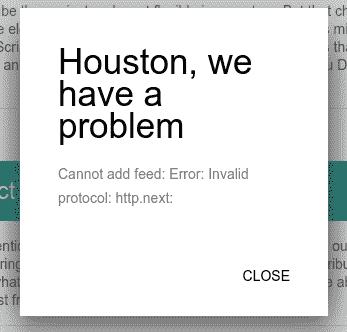

# 八、使用 Electron、TypeScript、React 和 Redux 创建 RSS 聚合器——开发

在前一章中，我们使用了 TypeScript，并提出了一个静态原型。 现在，我们要释放语言的尝试力量。 我们将编写应用程序服务并使用接口覆盖它们。 我们将描述动作和简化器。 在此过程中，我们将研究使用`redux-promise`和`redux-actions`模块创建基于 promise 的异步操作和乐观更新。 我们将商店连接到应用程序，并为组件提供预期的功能。 我们还将创建一个简单的路由并将其绑定到商店。

# 创建获取 RSS 的服务

简而言之，我们的应用程序是关于阅读 RSS 提要的。 因此，从服务开始是正确的，它通过给定的 URL 获取提要，并将其解析为可以附加到应用程序状态的结构。 我建议使用`request`([https://www.npmjs.com/package/request](https://www.npmjs.com/package/request))模块检索提要 XML，并使用`feedme`模块([https://www.npmjs.com/package/feedme](https://www.npmjs.com/package/feedme))对其进行解析。 让我们先用普通 JavaScript 来做。 所以，我们需要安装这两个包:

```js
npm i -S feedme
npm i -S request

```

我们将有一个函数`rss`，它使用`request`通过 HTTP 获取提要内容。 这个函数将接受两个参数:feed URL 和一个用 Node.js 编写的回调函数:

```js
const request = require( "request" ); 

function rss( feedUrl, onDone ){ 
  const feed = { 
          title: "", 
          items: [] 
        }, 
        parser = createFeedParserStream( feed ); 

  request 
    .get( feedUrl ) 
    .on( "error", ( err ) => { 
      onDone( err ); 
    }) 
    .on( "end", () => { 
      onDone( null, feed ); 
    }) 
    .pipe( parser ); 
} 

```

这里，我们将提要数据容器定义为普通对象(`feed`)。 我们从尚未写入的`createFeedParserStream`函数中获得一个可写流([https://nodejs.org/api/stream.html](https://nodejs.org/api/stream.html))，并将其管道到由`request`生成的可读流中，用于指定的提要 URL。 现在，让我们添加缺失的函数:

```js
const FeedMe = require( "feedme" ); 

function createFeedParserStream( feed ) { 
  const parser = new FeedMe( true ); 
  parser.on( "title", ( title ) => { 
    feed.title = title; 
  }); 
  parser.on( "item", ( item ) => { 
    feed.items.push( item ); 
  }); 
  return parser; 
} 

```

在这里，我们将流作为`FeedMe`实例，并订阅其解析事件。 收到提要标题后，我们将其分配给`feed.title`。 在接收到每个物品的详细信息后，我们将它们放入`feed.items`数组中。 这个函数返回派生的解析流，并通过参数传入的引用来修改`feed`对象。

现在，我们可以这样使用`rss`函数:

```js
rss( "http://feeds.feedburner.com/CssTricks", ( err, feed ) => { 
  if ( err ) { 
    return console.log( err ); 
  } 
  console.log( feed ); 
}); 

```

尽管事实上，在默认情况下，Node.js 核心模块仍然意味着长时间嵌套异步函数，但我们非常清楚这种不受欢迎的影响，即*回调地狱。* 因此，我们将服务转换为承诺:

```js
function rss( feedUrl ){ 
  return new Promise(( resolve, reject ) => { 
    const feed = { 
            title: "", 
            items: [] 
          }, 
          parser = createFeedParserStream( feed ); 

    request 
      .get( feedUrl ) 
      .on( "error", ( err ) => reject( err ) ) 
      .on( "end", () => resolve( feed ) ) 
      .pipe( parser ); 
  }); 
} 

```

现在，它带来了显著改善的开发体验:

```js
rss( "http://feeds.feedburner.com/CssTricks") 
  .then(( feed ) => console.log( feed ) ) 
  .catch( err => console.log( err ) ); 

```

作为一个承诺，它也可以通过`async`/`await`语法使用:

```js
async function handler() { 
  try { 
    const feed = await rss( "http://feeds.feedburner.com/CssTricks"); 
  } catch( e ) { 
    // handle exception 
  } 
} 

handler(); 

```

现在，我们可以回到 TypeScript 并描述代码中的类型。 首先，我们希望声明的`feed`结构实现以下接口:

`./app/ts/Interfaces/Rss.ts`

```js
export interface IRssItem { 
  description: string; 
  link: string; 
  pubdate: string; 
  title: string; 
} 

export interface IFeed { 
  title: string; 
  items: IRssItem[]; 
} 

```

但是等等! 模块`feedme`没有声明文件。 看起来我们也必须为它提供一个接口。 在前一章中，我展示了一种通过使用三斜杠指令和环境声明将全局库引入 TypeScript 作用域的方法。 这不是唯一可能的解决办法。 我们可以在模块中声明接口:

`./app/ts/Services/IFeedMe.ts`

```js
import { IRssItem } from "../Interfaces/Rss"; 
export interface IFeedMe { 
  new ( flag?: boolean ): NodeJS.WritableStream; 
  on( event: "title", onTitle: ( title: string ) => void): void; 
  on( event: "item", onItem: ( item: IRssItem ) => void ): void; 
} 

```

在该服务中，我们导入`IFeedMe`接口，并将`feedme`导出分配给类型为`IFeedMe`的常量:

```js
import { IFeedMe } from "./IFeedMe"; 
const FeedMe: IFeedMe = require( "feedme" ); 

```

在 TypeScript 中重写了我们的服务之后，它的源代码如下所示:

`/app/ts/Services/rss.ts`

```js
import { IRssItem, IFeed } from "../Interfaces/Rss"; 
import { IFeedMe } from "./IFeedMe"; 
import * as request from "request"; 
const FeedMe: IFeedMe = require( "feedme" ); 

function createFeedParserStream( feed: IFeed ): NodeJS.WritableStream { 
  const parser = new FeedMe( true ); 
  parser.on( "title", ( title: string ) => { 
    feed.title = title; 
  }); 
  parser.on( "item", ( item: IRssItem ) => { 
    feed.items.push( item ); 
  }); 
  return parser; 
} 

export default function rss( feedUrl: string ): Promise<IFeed> { 
  const feed: IFeed = { 
          title: "", 
          items: [] 
        }; 
  return new Promise<IFeed>(( resolve, reject ) => { 
    request.get( feedUrl ) 
      .on( "error", ( err: Error ) => { 
        reject( err ); 
      }) 
      .on( "end", () => { 
        resolve( feed ); 
      }) 
      .pipe( createFeedParserStream( feed ) ); 
  }); 
} 

```

是什么改变了? 我们认为导出的`feedme`模块具有一个接口(`FeedMe: IFeedMe`)。 我们定义了`createFeedParserStream`函数的契约。 它接受`IFeed`类型作为输入并返回`NodeJS.WritableStream`。 我们对服务功能`rss`做了同样的工作。 它期望一个字符串并返回一个 Promise，该 Promise 以`IFeed`类型解析。

# 创建一个服务来管理提要菜单

现在我们可以获取 RSS 订阅。 但他们的计划是要有一个可管理的提要菜单。 我认为，我们可以在一个项目数组中表示菜单，其中每个项目可以用以下界面来描述:

`./app/ts/Interfaces/index.ts`

```js
export interface IMenuItem { 
  url: string; 
  title: string; 
  id: string; 
} 

```

至于服务本身，让我们从接口开始:

`./app/ts/Services/IMenu.ts`

```js
import { IMenuItem } from "../Interfaces"; 

export interface IMenu { 
  items: IMenuItem[]; 
  clear(): void; 
  remove( url: string ): IMenuItem[]; 
  add( url: string, title: string ): IMenuItem[]; 
  load(): IMenuItem[]; 
} 

```

在某种程度上，它就像测试驱动开发。 我们描述了类的内容而没有实现，以获得全貌。 然后，我们逐个填充成员:

`./app/ts/Services/Menu.ts`

```js
import sha1 = require( "sha1" ); 
import { IMenu } from "./IMenu"; 
import { IMenuItem } from "../Interfaces"; 

class Menu implements IMenu { 

  items: IMenuItem[] = []; 

  constructor( private ns: string ){ 
  } 

  clear(): void { 
    this.items =  []; 
    this.save(); 
  } 

  remove( url: string ): IMenuItem[] { 
    this.items =  this.items.filter(( item ) => item.url !== url ); 
    this.save(); 
    return this.items; 
  } 

  add( url: string, title: string ): IMenuItem[] { 
    const id = <string> sha1( url ); 
    this.items.push({ id, url, title }); 
    this.save(); 
    return this.items; 
  } 

  private save(): void { 
    localStorage.setItem( this.ns, JSON.stringify( this.items ) ); 
  } 

  load(): IMenuItem[] { 
    this.items = JSON.parse( localStorage.getItem( this.ns ) || "[]" ); 
    return this.items; 
  } 
} 

export default Menu; 

```

这是怎么回事? 首先,我们导入`sha1`模块(https://www.npmjs.com/package/sha1),我们将使用 SHA1 哈希计算([https://en.wikipedia.org/wiki/SHA-1)提要 URL。 这是一个外部模块，它解析为一个非模块实体，因此不能使用 ES6 语法导入。 这就是为什么我们使用`require`函数。 但我们仍然希望 TypeScript 考虑模块声明文件(`@types/sha1`)，所以我们将其容器声明为`import sha1`。 我们还在模块范围内导入服务接口(`IMenu`)和菜单项类型(`IMenuItem`)。 构造函数接受命名空间作为字符串。 通过在参数前面加上一个可访问性修饰符，我们声明了`ns`属性，并将参数的值赋给它。 `Menu`的实例将把实际的菜单状态保存在`items`属性中。 私有方法`save`将`items`属性的值存储到`localStorage`。 `add`、`remove`和`clear`三种方法都修改了`this.items`数组，并通过保存方法与`localStorage`同步。 最后，load 方法使用存储在`localStorage`中的数组更新`this.item`。](https://en.wikipedia.org/wiki/SHA-1)

# 行动和还原剂

所以，我们有了我们的核心服务，可以开始设计 Redux 商店了。 我们可以在一个表中描述预期的状态突变:

| **动作创造者** | **动作类型** | **状态影响** |
| `toggleOpenAddFeed` | `TOGGLE_ADD_FEED` | `state.isOpenAddFeed` |
| `addFeed` | `ADD_FEED` | `state.isOpenAddFeed`【t】
`state.items` |
| `setFeedError` | `SET_FEED_ERROR` | `state.feedError` |
| `removeFeed` | `REMOVE_FEED` | `state.feedError` |
| `fetchFeed` | `FETCH_FEED` | 【t】
`state.feedError` |
| `fetchMenu` | `FETCH_MENU` | 【t】
`state.items``state.activeFeedUrl` |
| `setActiveFeed` | `SET_ACTIVE_FEED` | `state.activeFeedUrl` |

首先，我们需要填充 feed 菜单。 为此，我们将有一个带有窗体的模态窗口来添加提要。 动作创建器函数`toggleOpenAddFeed`将用于切换模态窗口的可见性。

当提交模式窗口中的表单时，组件将调用`addFeed`函数。 该函数通过提供的 URL 获取提要，获得它的标题，并向菜单添加一个新项。 由于它涉及用户输入和网络操作，我们必须涵盖故障场景。 因此，我们引入了在应用程序状态中设置消息的`setFeedError`函数。 当我们更新菜单时，相应的服务与`localStorage`同步更改。 这意味着我们需要一个操作来读取菜单。 函数`fetchMenu`将处理它。 此外，它将利用`rss`服务来获取一个聚合列表中菜单中所有提要的条目。 更重要的是，我们将提供导航菜单的选项。 当用户单击一个项目时，该组件调用`setActiveFeed`将该项目标记为活动的，并调用功能`fetchFeed`用所选提要的项目更新`Feed`组件。

当处理动作创建器函数时，我们声明类型并将它们用作来自 reducer 的引用。 这意味着我们需要一个带有一堆常量的模块来表示动作类型:

`./app/ts/Constants/index.ts`

```js
export const TOGGLE_ADD_FEED = "TOGGLE_ADD_FEED"; 
export const SET_ACTIVE_FEED = "SET_ACTIVE_FEED"; 
export const FETCH_MENU = "FETCH_MENU"; 
export const ADD_FEED = "ADD_FEED"; 
export const SET_ADD_FEED_ERROR = "SET_ADD_FEED_ERROR"; 
export const SET_FEED_ERROR = "SET_FEED_ERROR"; 
export const FETCH_FEED = "FETCH_FEED"; 
export const REMOVE_FEED = "REMOVE_FEED"; 

```

既然我们在这里，让我们也定义一些配置常量:

```js
export const MENU_STORAGE_NS = "rssItems"; 
export const FEED_ITEM_PER_PAGE = 10; 

```

第一个(`MENU_STORAGE_NS`)指定我们将在`localStorage`中为菜单使用的名称空间。 第二个(`FEED_ITEM_PER_PAGE`)决定每页显示多少项。 这既适用于选定的提要，也适用于聚合提要。

在[第 5 章](5.html)、*用 NW.js、React 和 Redux 创建一个屏幕捕捉器:规划、设计和开发*中，我们使用第三方模块`redux-act`抽象了动作和减速器的创建。 它确实很方便，但如果您需要异步操作，它并不适合。 所以，这一次，我们将使用`redux-actions`模块([https://github.com/acdlite/redux-actions](https://github.com/acdlite/redux-actions))来代替。 让我们在一个 JavaScript 示例中检查它是什么。 首先，我们通过调用`redux-actions`的`createAction`函数来创建一个同步操作:

```js
import { createAction } from "redux-actions"; 
const toggleOpenAddFeed = createAction( "TOGGLE_ADD_FEED", ( toggle ) => toggle  ); 

```

到目前为止，它看起来非常类似于`redux-act`的语法。 我们可以运行新创建的函数:

```js
console.log( toggleOpenAddFeed( true ) ),

```

然后我们得到一个带有强制性`type`属性和多功能`payload`属性的动作对象:

```js
{ payload: "TOGGLE_ADD_FEED", type: true } 

```

现在我们可以使用`redux-actions`的`handleActions`函数来制作一个 Reducer:

```js
import { handleActions } from "redux-actions"; 
const app = handleActions({ 

  "TOGGLE_ADD_FEED": ( state, action ) => ({ 
    ...state, isOpenAddFeed: action.payload 
  }) 

}, defaultState ); 

```

函数`handleActions`需要一个普通对象，该对象使用操作类型作为引用将处理程序映射到操作。 每个处理程序回调都接受最新的状态对象和分派的操作——与规范的 Reducer([http://redux.js.org/docs/basics/Reducers.html](http://redux.js.org/docs/basics/Reducers.html))相同。

但是异步操作呢? 例如，我们将使用`rss`服务来获取提要。 服务返回一个 Promise。 多亏了`redux-actions`，我们可以创建如下简单的动作:

```js
const fetchFeed = createAction( "FETCH_FEED", async ( url: string ) => await rss( url ) ); 

```

它难道不漂亮吗? 我们只是给处理程序传递一个异步函数。 一旦 handler 的 Promise 被解析，这个动作就会被分派:

```js
const app = handleActions({ 
  "FETCH_FEED": ( state, action ) => ( 
      ...state, 
      items: action.payload.items 
  }) 

}, defaultState ); 

```

坚持住! 但如果承诺被拒绝了呢? 模块`redux-actions`依赖于乐观更新。 在失败的情况下，当我们可以找到一个错误消息时，传入的动作会获得一个额外的属性`error`:

```js
const app = handleActions({ 

  "FETCH_FEED": ( state, action ) => ({ 
    if ( action.error ) { 
      return { ...state, feedError: `Cannot fetch feed: ${action.payload}` }; 
    } 
     return { 
      ...state, 
      items: action.payload.items 
    }; 
  }) 

}, defaultState ); 

```

现在，在考虑如何实现动作创建器和 Reducers 之后，我们可以用接口覆盖存储资产。 首先，我们为状态声明接口:

`./app/ts/Interfaces/index.ts`

```js
//... 
export interface IAppState { 
  isOpenAddFeed: boolean; 
  menu: IMenuItem[]; 
  items: IRssItem[]; 
  feedError: string; 
  activeFeedUrl: string; 
} 

```

属性`isOpenAddFeed`是一个`boolean`，用于确定添加新提要的表单的模态窗口是否可见。 属性`menu`包含菜单项列表，并在`Menu`组件中用于构建菜单。 属性`items`由 RSS 项组成，用于在`Feed`组件中构建列表。 属性`feedError`存储最后的错误消息，`activeFeedUrl`保存最后请求的提要 URL。

接下来，我们描述这些动作:

```js
import { Action } from "redux-actions"; 

export interface IAppActions { 
  toggleOpenAddFeed: ( toggle: boolean ) => Action<boolean>; 
  setActiveFeed:  ( url: string ) => Action<string>; 
  setFeedError: ( msg: string ) => Action<string>; 
  fetchMenu: () => Promise<IMenuRssPayload>; 
  addFeed: ( url: string ) => Promise<IMenuItem[]>; 
  removeFeed: ( url: string ) => Promise<IMenuItem[]>; 
  fetchFeed: ( url: string ) => Promise<IFeed>; 
} 

```

模块`redux-actions`通过声明文件`Action`类型导出。 因此，我们声明函数`toggleOpenAddFeed`、`setActiveFeed`和`setFeedError`返回面对`Action`类型约束的普通对象。 换句话说，除了`type`属性外，这些可能还有`payload`和`error`属性。 `Action`是一个泛型类型，因此我们阐明了负载中期望的类型，例如`Action<boolean>`表示`{ type: string, payload: boolean }`。

异步操作`fetchMenu`、`addFeed`、`removeFeed`和`fetchFeed`返回承诺。 同样，我们显式指定了 Promise 解析时所期望的类型。 其中功能`fetchMenu`指的是缺失的`IMenuRssPayload`型。 让我们将它添加:

`./app/ts/Interfaces/index.ts`

```js
export interface IMenuRssPayload { 
  menuItems: IMenuItem[]; 
  rssItems: IRssItem[]; 
} 

```

该函数使用一个对象进行解析，该对象同时包含聚合列表的菜单项和 RSS 项。

看起来我们已经准备好实现这个商店了。 所以，我们将从行动开始:

`./app/ts/Actions/actions.ts`

```js
import { createAction } from "redux-actions"; 
import * as vo from "../Constants"; 
import { IMenuItem, IRssItem, IFeed, IMenuRssPayload } from "../Interfaces"; 
import Menu from "../Services/Menu"; 
import rss from "../Services/rss"; 
const menu = new Menu( vo.MENU_STORAGE_NS ); 

```

首先，我们导入前面定义的常量`createAction`和接口，以及服务(如`rss`和`Menu`构造器)。 我们在从配置常量导入的命名空间中创建一个菜单实例。 接下来，我们添加同步操作:

```js
const feedActions = { 

  toggleOpenAddFeed: createAction<boolean, boolean>( 
    vo.TOGGLE_ADD_FEED, ( toggle: boolean ) => toggle 
  ), 

  setActiveFeed: createAction<string, string>( 
    vo.SET_ACTIVE_FEED, ( url: string ) => url 
  ), 

  setFeedError: createAction<string, string>( 
    vo.SET_FEED_ERROR, ( msg: string ) => msg 
  ), 

  removeFeed: createAction<IMenuItem[], string>( 
    vo.REMOVE_FEED, ( url: string ) => menu.remove( url ) 
  ), 
}; 

```

这里，我们使用前面在 JavaScript 示例中为`createAction`检查过的模式。 唯一的区别是`createAction`是 TypeScript 作用域中的泛型类型，所以我们必须指定动作创建器将传递给`payload`属性的类型，以及它希望通过第一个参数传递什么类型。 所有这些函数都有一个单独的参数。 如果我们需要更多，我们会用`createAction<Payload, Arg1, Arg2>`甚至`createAction<Payload, Arg1, Arg2, Arg3, Arg4>`来表达。

现在，我们用异步动作来扩展`feedActions`:

```js
const feedActions = { 
  //... 

  fetchFeed: createAction<Promise<IFeed>, string>( 
    vo.FETCH_FEED, async ( url: string ) => await rss( url ) 
  ), 

  addFeed: createAction<Promise<IMenuItem[]>, string>( 
    vo.ADD_FEED, 
    async ( url: string ) => { 
      if ( menu.items.find( item => item.url === url ) ) { 
        throw new Error( "This feed is already in the list" ); 
      } 
      const feed = await rss( url ); 
      if ( !feed.title ) { 
        throw new Error( "Unsupported format" ); 
      } 
      return menu.add( url, feed.title ); 
    } 
  ), 

  fetchMenu: createAction<Promise<IMenuRssPayload>>( 
    vo.FETCH_MENU, async () => { 
      menu.load(); 
      let promises = menu.items.map( item => rss( item.url ) ); 
      return Promise.all( promises ) 
        .then(( feeds: IFeed[] ) => { 
          if ( !feeds.length ) { 
            return { menuItems: [], rssItems: [] }; 
          } 
          let all = feeds 
              .map( feed => feed.items ) 
              // combine [[items],[item]] in a flat array 
              .reduce(( acc: IRssItem[], items: IRssItem[] ) => 
              acc.concat( items ) ) 
              // sort the list by publication date DESC 
              .sort(( a, b ) => { 
                let aDate = new Date( a.pubdate ), 
                    bDate = new Date( b.pubdate ); 
                return bDate.getTime() - aDate.getTime(); 
              }) 
              .slice( 0, vo.FEED_ITEM_PER_PAGE ); 
          return { menuItems: menu.items, rssItems: all }; 
        }); 
    } 
  ) 
}; 

export default feedActions; 

```

功能`fetchFeed`只是代表`rss`服务的 Promise。 函数`addFeed`首先检查给定的 URL 是否已经存在于菜单中。 如果`true`，则抛出异常。 然后，该函数从`rss`服务中获取提要，并将该项添加到菜单中。 最后，`fetchMenu`执行若干任务。 它从`localStorage`重新加载菜单。 这正是人们对这次行动的期望。 但我希望函数也能生成聚合列表。 因此，它为菜单中的每个可用提要收集`rss`服务的承诺。 它应用`Promise.all`解析收集到的承诺集。 该方法将生成提要列表。 我们需要将平面数组中的所有项组合起来，按发布日期对其排序，并将其限制为在`FEED_ITEM_PER_PAGE`常量中设置的数量。

现在，我们从减速机开始:

`./app/ts/Reducers/app.ts`

```js
import { handleActions, Action } from "redux-actions"; 
import { IAppState, IMenuRssPayload } from "../Interfaces"; 
import * as vo from "../Constants"; 

const defaultState: IAppState = { 
  isOpenAddFeed: false, 
  menu: [], 
  items: [], 
  feedError: "", 
  activeFeedUrl: "" 
}; 

```

这里，我们导入了`handleActions`函数和`Action`接口，并从`redux-actions`导入了我们的接口和常量。 我们还为 Reducer 定义了默认状态。

接下来，我们创建减速器:

```js
const app = handleActions<IAppState>({ 

  [ vo.TOGGLE_ADD_FEED ]: ( state, action ) => ({ 
    ...state, isOpenAddFeed: action.payload 
  }), 

  [ vo.ADD_FEED ]: ( state, action ) => { 
    if ( action.error ) { 
      return { ...state, feedError: `Cannot add feed: 
      ${action.payload}` }; 
    } 
    return { ...state, feedError: "", isOpenAddFeed: false, menu: 
    action.payload }; 
  }, 

  [ vo.SET_FEED_ERROR ]: ( state, action ) => ({ 
    ...state, feedError: action.payload 
  }), 

  [ vo.REMOVE_FEED ]: ( state, action ) => { 
    if ( action.error ) { 
      return { ...state, feedError: `Cannot remove feed: 
      ${action.payload}` }; 
    } 
    return { ...state, menu: action.payload }; 
  }, 

  [ vo.FETCH_MENU ]: ( state, action: Action<IMenuRssPayload> ) => { 
    if ( action.error ) { 
      return { ...state, feedError: `Cannot fetch menu:      
      ${action.payload}` }; 
    } 
    return { 
      ...state, 
      menu: action.payload.menuItems, 
      items: action.payload.rssItems, 
      activeFeedUrl: "" 
    }; 
  }, 

  [ vo.FETCH_FEED ]: ( state, action ) => { 
    if ( action.error ) { 
      return { ...state, feedError: `Cannot fetch feed: 
      ${action.payload}` }; 
    } 
     return { 
      ...state, 
      items: action.payload.items 
    }; 
  }, 

  [ vo.SET_ACTIVE_FEED ]: ( state, action ) => ({ 
    ...state, activeFeedUrl: action.payload 
  }) 

}, defaultState ); 

export default app; 

```

`handleActions`是泛型类型，所以我们可以为它操作的`state`对象指定约束。 在提供的对象中，我们描述每个分派的动作如何修改状态。 因此，`toggleOpenAddFeed`(`TOGGLE_ADD_FEED`)将切换`isOpenAddFeed`属性。 如果成功，功能`addFeed`(`ADD_FEED`)将从操作有效负载填充`menu`属性，此外，还将重置`feedError`和`isOpenAddFeed`。 如果 Promise 被拒绝，它将用一条错误消息设置`feedError`。 功能`setFeedError`(`SET_FEED_ERROR`)简单地从动作有效负载设置`feedError`。 功能`removeFeed`(`REMOVE_FEED`)更新菜单，因此在这里，它使用更新的列表填充`menu`状态属性。 函数`fetchFeed`(`FETCH_FEED`)用获取的提要条目更新`items`属性。 功能`fetchMenu`(`FETCH_MENU`)重新加载菜单并生成聚合列表，因此它同时更新`menu`和(RSS)`items`。 最后，函数`setActiveFeed`(`SET_ACTIVE_FEED`)简单地将选中的项目 URL 保存在状态中。

在一个可伸缩的大型应用中，我们使用多个 reducer 结合`redux`的`combineReducers`功能。 对于这个小应用，只有减速器就足够了。 然而，我建议，我们遵循这样的做法:

`./app/ts/Reducers/index.ts`

```js
import { combineReducers } from "redux"; 
import app from "./app"; 

const reducer = combineReducers({ state: app }); 
export default reducer; 

```

这改变了我们的状态树。 因此，现在可以用下面的接口来描述顶级状态对象:

`./app/ts/Interfaces/index.ts`

```js
export interface IRootState { 
  state: IAppState; 
} 

```

# 连接到商店

我们有动作创建器和还原器，现在，我们将使它们在整个应用程序中可用。 你可以记得[第五章](5.html),*创建一个屏幕捕获者与 NW.js React,和回来的:规划、设计、和发展【病人】,`redux`模块提供了函数`createStore`,将在还原剂结合产生。 模块`react-redux`导出提供程序的高阶组件，该组件使用道具接受存储，并使其在内部组件树中通过`connect`可用。 功能`createStore`接受与`redux`组合的中间件。 正如我们在本应用程序中已经讨论过的，我们需要异步操作。 在这里，我们可以使用`redux-thunk`(https://www.npmjs.com/package/redux-thunk)中间件，它允许我们编写动作创建者，这些动作创建者返回函数而不是普通对象。 这些函数引用了`dispatch`和`getState`函数作为参数。 我们可以调度延迟的操作。 例如，我们需要通过 URL 读取 RSS 提要，所以我们使用下面的 action creator 来反映应用状态:*

```js
function fetchFeedAsync( url ) { 
  return dispatch => { 
    dispatch( fetchFeedRequest() ); 
    rss( url ) 
      .then( data => dispatch( fetchFeedSuccess( data ) )) 
      .catch( e  => dispatch( fetchFeedFailure( e ) )); 
  }; 
} 

```

在对提要内容发出异步 HTTP 请求之前，我们将发送`fetchFeedRequest`，当请求被解决时，发送`fetchFeedSuccess`或`fetchFeedFailure`，如果请求被拒绝。

这一切都很好，但太啰嗦了。 为了获得通过 HTTP 检索的数据，我们编写了四个(!)动作创建器。 相反，我们可以遵循乐观的更新方法，使用单一动作创建者。 这涉及到一个额外的中间件`redux-promise`([https://www.npmjs.com/package/redux-promise](https://www.npmjs.com/package/redux-promise))，它可以很好地与`redux-actions`一起运行:

```js
const fetchFeed = createAction( 
    "FETCH_FEED", async ( url ) => await rss( url ) 
  ) 

```

现在，当将所有这些组合在一起时，我们对入口脚本进行了以下更新:

`./app/ts/index.tsx`

```js
import { Provider } from "react-redux"; 
import { createStore, applyMiddleware, compose } from "redux"; 
import thunkMiddleware from "redux-thunk"; 
import * as promiseMiddleware from "redux-promise"; 

const storeEnhancer = compose( 
  applyMiddleware( 
    thunkMiddleware, 
    promiseMiddleware 
  ) 
); 

const store = createStore( 
  appReducers,  storeEnhancer 
); 

ReactDOM.render( 
  <Provider store={store}> 
      <App {...this.props} /> 
  </Provider>, 
  document.getElementById( "root" ) 
); 

```

在容器组件中，我们需要添加两个函数，告诉`connect`我们想要如何将状态和动作创建器映射到组件道具:

`./app/ts/Containers/App.tsx`

```js
// mapping state to the props 
const mapStateToProps = ( state: IRootState ) => state; 

import actions from "../Actions/actions"; 
// mapping actions to the props 
const mapDispatchToProps = { 
  ...actions 
}; 

```

在这里，我们将状态简单地一对一映射到支柱。 因为我们将商店表示为`{ state: applicationStateTree }`，所以我们在道具中接收到一个指向实际状态树的额外属性`state`。 对于动作创建器，我们解构名称空间并将每个可用函数作为新属性附加到道具。 所以容器组件的支柱现在可以用以下类型来描述:

`./app/ts/Interfaces/index.ts`

```js
export type TStore = IRootState & IAppActions; 

```

我们将在`React.Component`generic 中引用此类型的道具。

我们通过解构`store={this.props}`向下传递容器组件的属性。 因此，每个子组件都接收一个带有属性 store 的`TStore`类型的对象:

```js
class App extends React.Component<TStore, {}> { 
  render() { 
    return ( 
      <div className="main-wrapper"> 
        <ErrorAlert store={this.props} /> 
        <Layout fixedHeader fixedDrawer> 
          <TitleBar /> 
          <Menu store={this.props} /> 
          <Content> 
            <Feed store={this.props} /> 
          </Content> 
        </Layout> 
      </div> 
    ); 
  } 
} 

// connect store to App 
export default connect( 
  mapStateToProps, 
  mapDispatchToProps 
)( App ); 

```

我个人认为容器是引导逻辑的好地方。 特别地，我希望在应用程序的开始部分有来自`localStorage`的加载菜单。 实际上，集装箱组件安装好后就可以直接做了:

```js
 class App extends React.Component<TStore, {}> { 

  componentDidMount() { 
    this.props.fetchMenu(); 
  } 
} 

```

所以，我们调用`fetchMenu`动作创造者，它现在在道具中可用。 这会分派操作，Reducer 会修改状态和任何组件，所有组件都会反映状态的变化。

# 从组件消费存储

如果您足够关注的话，您不会错过，在容器的 JSX 中，我们引入了一个新组件`ErrorAlert`。 因为我们有一个错误状态(`state.feedError`)，我们需要可视化它:

`./app/ts/Components/ErrorAlert.tsx`

```js
import * as React from "react"; 
import { Dialog, DialogTitle, 
  DialogContent, DialogActions, Button } from "react-mdl"; 
import { TStore } from "../Interfaces"; 

interface IProps { 
  store: TStore; 
} 

export default class ErrorAlert extends React.Component<IProps, {}> { 

  private onClose = () => { 
    this.props.store.setFeedError( "" ); 
  } 

  render() { 
    const { feedError } = this.props.store.state; 
    return ( 
    <Dialog open={Boolean(feedError)}> 
          <DialogTitle>Houston, we have a problem</DialogTitle> 
          <DialogContent> 
            <p>{feedError}</p> 
          </DialogContent> 
          <DialogActions> 
            <Button type="button" onClick={this.onClose}>Close</Button> 
          </DialogActions> 
        </Dialog> 
    ); 
  } 
} 

```

通过使用`Dialog`和 React MDL 库的相关组件，我们描述了一个模态窗口，当`state.feedError`不为空时将显示该窗口。 该窗口有一个按钮`Close`，它为点击事件订阅了一个处理程序`onClose`。 处理程序调用`setFeedError`操作来重置`state.feedError`:



我们现在可以修改`Menu`组件来从状态显示和管理 RSS 菜单:

`./app/ts/Components/Menu.tsx`

```js
import * as React from "react"; 

import { Drawer, Navigation, Icon, FABButton } from "react-mdl"; 
import { IMenuItem, TStore } from "../Interfaces"; 
import AddFeedDialog from "./AddFeedDialog"; 

interface IProps { 
  store: TStore; 
} 

export default class Menu extends React.Component<IProps, {}> { 

  static makeClassName = ( toggle: boolean ) => { 
    const classList = [ "mdl-navigation__link" ]; 
    toggle && classList.push( "mdl-navigation__link--current" ); 
    return classList.join( " " ); 
  } 

  private onAddFeed = () => { 
     this.props.store.toggleOpenAddFeed( true ); 
  } 

  private onRemoveFeed = () => { 
    const { removeFeed, fetchMenu, state } = this.props.store; 
     removeFeed( state.activeFeedUrl ); 
     fetchMenu(); 
  } 

  private onRefresh = () => { 
    this.props.store.fetchMenu(); 
  } 

  render (){ 
    const { state } = this.props.store, 
          menu = state.menu || []; 

    return ( 
     <Drawer  className="mdl-color--blue-grey-900 mdl-
     color-text--blue-grey-50"> 
        <AddFeedDialog store={this.props.store} /> 
        <Navigation className="mdl-color--blue-grey-80"> 

        { menu.map(( item: IMenuItem ) => ( 
          <a key={item.id} href={`#${item.id}`} 
          className={Menu.makeClassName( item.url === 
          state.activeFeedUrl )}> 
           <Icon name="& #xE0E5;" /> 
           {item.title} 
          </a> 
        )) } 
        </Navigation> 
        <div className="mdl-layout-spacer"></div> 
        <div className="tools"> 
          <FABButton mini onClick={this.onAddFeed}> 
              <Icon name="add" /> 
          </FABButton> 
          { state.activeFeedUrl && ( 
          <FABButton mini> 
              <Icon name="delete" onClick={this.onRemoveFeed} /> 
          </FABButton> 
          )} 
          <FABButton mini onClick={this.onRefresh}> 
              <Icon name="autorenew" /> 
          </FABButton> 
        </div> 
      </Drawer> 
    ); 
  } 
} 

```

这里，我们从属性`store`中取`state.menu`并映射它来构建菜单项列表。 我们将项目表示为链接，其中`item.title`表示内容，`item.id`(URL 的 sha1)表示`href`。 我们使用静态方法`makeClassName`来构建条目`className`。 通常是`"mdl-navigation__link"`，当项目是活动的时候是`"mdl-navigation__link mdl-navigation__link--current"`。 我们还订阅了`Add`、`Remove`和`Refresh`(`Autorenew`图标)按钮上的点击事件的处理程序。 第一个使用`true`调用`toggleOpenAddFeed`操作来显示添加提要的模态窗口。 第二个使用了`removeFeed`动作和`activeFeedUrl`从状态。 它还调用`fetchMenu`操作来刷新聚合列表。 最后一个简单地称为`fetchMenu`动作。

现在，我们必须创建一个代表模态窗口的组件，并添加一个提要:

`./app/ts/Components/AddFeedDialog.tsx`

```js
import { Button, Dialog, DialogTitle, DialogContent, DialogActions, Textfield } from "react-mdl"; 
import * as React from "react"; 
import { TStore } from "../Interfaces"; 

interface IProps { 
  store: TStore; 
} 
export default class AddFeedDialog extends React.Component<IProps, {}> { 

  private urlEl: Textfield; 
  private formEl: HTMLFormElement; 
  private onSubmit = ( e: React.MouseEvent<HTMLFormElement>  ) => { 
    // https://github.com/react-mdl/react-mdl/issues/465 
    const urlEl = this.urlEl as any; 
    e.preventDefault(); 
    this.save( urlEl.inputRef.value ); 
  } 
  async save( url: string ){ 
    const { addFeed, fetchMenu } = this.props.store; 
    await addFeed( url ); 
    await fetchMenu(); 
    if ( !this.props.store.state.feedError ){ 
      this.formEl.reset(); 
    } 
  } 
  private close = () => { 
     this.props.store.toggleOpenAddFeed( false ); 
     this.formEl.reset(); 
  } 

  render() { 
    const { isOpenAddFeed } = this.props.store.state; 

    return ( 
      <div> 

        <Dialog open={isOpenAddFeed}> 
          <DialogTitle>New Feed</DialogTitle> 
          <DialogContent> 
            <form onSubmit={this.onSubmit} ref={(el: HTMLFormElement)   
            => { this.formEl = el; }}> 

            <Textfield 
                label="URL" 
                required 
                floatingLabel 
                ref={(el: Textfield) => { this.urlEl = el; }} 
            /> 

            </form> 
          </DialogContent> 
          <DialogActions> 
            <Button type="button" onClick={this.onSubmit}>Save</Button> 
            <Button type="button" onClick={this.close}>Cancel</Button> 
          </DialogActions> 
        </Dialog> 
      </div> 
    ); 
  } 
} 

```

与`ErrorAlert`类似，我们使用`Dialog`和 React MDL 的相关组件来渲染模态窗口。 该窗口有一个表单和一个用 React MDL 的`Textfield`组件表示的输入。 我们通过使用`ref`属性使这两个元素在实例范围内可用。 我们为表单`submit`事件订阅`onSubmit`方法。 在处理程序中，我们通过引用从输入字段获取值(`Textfield`被引用为`this.urlEl`; 因此，根据 React MDL API，内部输入可以作为`this.urlEl.inputRef`访问，并将其传递给私有方法`save`。 `save`方法调用`addFeed`和`fetchMenu`来更新聚合列表。 该窗口还包括`Close`按钮，该按钮在单击事件时调用带有 false 的`toggleOpenAddFeed`操作。

只剩下更新`Feed`组件:

`./app/ts/Components/Feed.tsx`

```js
import * as React from "react"; 
import { shell } from "electron"; 

import { Card, CardTitle, CardActions, Button, CardText } from "react-mdl"; 
import { IRssItem, TStore } from "../Interfaces"; 

interface IProps { 
  store: TStore; 
} 

export default class Feed extends React.Component<IProps, {}> { 

  private indexEl: HTMLElement; 
  private contentsEl: HTMLElement; 
  private webviewEl: Electron.WebviewTag; 

  // Convert HTML into plain text 
  static stripHtml( html: string ){ 
    var tmp = document.createElement( "DIV" ); 
    tmp.innerHTML = html; 
    return tmp.textContent || tmp.innerText || ""; 
  } 

  private onCloseLink = () => { 
    this.indexEl.classList.remove( "is-open" ); 
    this.webviewEl.src = "blank"; 
  } 

  private onOpenLink = ( e: React.MouseEvent<HTMLElement> ) => { 
    const btn = e.target as HTMLElement, 
          url = btn.dataset[ "link" ]; 
    e.preventDefault(); 
    this.indexEl.classList.add( "is-open" ); 
    this.webviewEl.src = url; 
  } 

  componentDidMount() { 
    this.webviewEl = this.contentsEl.firstChild as Electron.WebviewTag; 
    this.webviewEl.addEventListener( "new-window", ( e ) => { 
      e.preventDefault(); 
      shell.openExternal( e.url ); 
    }); 
  } 

  render(){ 
    const { items } =  this.props.store.state; 
    return ( 
      <div className="page-content feed-index" ref={(el: HTMLElement) 
      => { this.indexEl = el; }}> 
        <div className="feed-list"> 

        { items.map(( item: IRssItem, inx: number ) => ( 
          <Card key={inx} shadow={0} style={{width: "100%", height: 
         "auto", margin: "auto"}}> 
           <CardTitle expand style={{color: "#fff", backgroundColor: 
          "#46B6AC"}}> 
           {item.title} 
           </CardTitle> 
            <CardText onClick={this.onCloseLink}> 
                { item.description ? Feed.stripHtml( item.description ) 
            : "" } 
            </CardText> 
            <CardActions border> 
                <Button colored data-link={item.link} onClick=
             {this.onOpenLink}>Open</Button> 
            </CardActions> 
         </Card> 
        )) } 
        </div> 
        <div className="feed-contents" 
            ref={(el: HTMLElement) => { this.contentsEl = el; }} 
            dangerouslySetInnerHTML={{ 
            __html: `<webview class="feed-contents__src"></webview>` 
          }}></div> 
      </div> 
    ); 
  } 
}

```

这里，我们映射`state.items`来呈现 RSS 项，同时使用`stripHtml`静态方法来清理项描述。 每个项目都提供有一个用户`onOpenLink`的`Open`按钮。 此方法使`.feed-contents`列可见，并更改`WebView`的`src`属性。 这会导致`WebView`加载提要条目 URL。 为什么我们使用`WebView`而不是 iFrame? 因为`WebView`是 Electron 和 NW.js([https://electron.atom.io/docs/api/webview-tag/](https://electron.atom.io/docs/api/webview-tag/))中客人内容的预期容器。 `WebView`运行在一个单独的进程中，它与您的页面没有相同的权限。 因此，它应该能够防止第三方页面和脚本对您的应用程序产生影响和危害。

我们不能直接引用`WebView`，因为 JSX 没有这样的元素，我们必须注入它。 因此，我们使用`componentDidMount`生命周期方法通过 DOM 到达它。 更重要的是，我们订阅了`new-window`事件，当在`WebView`中加载的页面试图打开一个新窗口/选项卡时，该事件发生。 我们阻止这种情况发生，而是在外部浏览器中打开请求的页面。

干杯! 它现在是一个工作应用程序。 所以，我们可以构建它:

```js
npm build

```

我们可以运行:

```js
npm start

```

输出将是:


如果我们在任何一个 RSS 条目上点击“打开”链接，内容面板就会滑动进来，并将相应的内容加载到 WebView 中:


# 创建路由服务

一切都很好，除了我们不能从菜单中选择一个提要。 我们有状态属性`activeFeedUrl`，它已经被`Menu`组件考虑过了，但是到目前为止我们从未使用`setActiveFeed`操作来设置这个状态。 然而，在`Menu`组件中，我们为所有项提供了散列链接。 为了提供浏览器位置导航，我们需要一个路由。 有许多实现可以作为可安装模块使用。 然而，在这个简单的例子中，我们将创建自己的:

`./app/ts/Services/Router.ts`

```js
import * as Redux from "redux"; 
import { IRootState, IMenuItem } from "../Interfaces"; 
import actions from "../Actions/actions"; 

export default class Router { 

  constructor( private store: Redux.Store<IRootState> ) { 
  } 

  getFeedUrlById( id: string ): string { 
    const { state } = this.store.getState(), 
          match = state.menu.find(( item: IMenuItem ) =>  item.id === 
          id ); 
      return match ? match.url : ""; 
  } 

  register(){ 
    window.addEventListener( "hashchange", () => { 
      const url =  this.getFeedUrlById( window.location.hash.substr( 1 ) ); 
      this.store.dispatch( actions.setActiveFeed( url ) ); 
      url && this.store.dispatch( actions.fetchFeed( url ) ); 
    }); 
  } 

} 

```

在构造过程中，服务接收存储实例并将其分配给私有属性`store`。 通过`register`方法，我们订阅文档`hashchange`事件，该事件在每次`location.hash`更改时触发。 例如，当我们从地址栏发出类似`#some-id`的请求时，就会发生这种情况。 在处理函数中，我们从`location.hash`(跟随`#`符号的所有内容)中提取 SHA1，并使用`getFeedUrlById`方法查找相关的提要 URL(我们在`Menu`服务的`add`方法中提供带有 id 的条目)。 由于我们有了 URL，我们分派`setActiveFeed`操作来设置`activeFeedUrl`状态属性。 此外，我们分派`fetchFeed`来获取所选提要。

我们现在可以在入口脚本中启用该服务，如下所示:

`./app/ts/index.tsx`

```js
const router = new Router( store ); 
router.register(); 

```

# 总结

本章从实现`rss`服务开始。 我们使用`request`模块获取提要内容。 我们从`feedme`模块获得了一个可写流，并将其配置为将输入解析为提要容器对象。 我们将`feedme`解析器输送到`request`生成的可读流中。 模块`feedme`缺少声明文件，因此我们为它提供了一个接口。

然后，我们创建了`Menu`服务，它可以用来管理和持久化提要的菜单。 我们考虑了应用程序所需的操作和状态结构。 我们应用了`redux-actions`模块来创建动作和 Reducer。 在此过程中，我们研究了乐观更新方法。 在创建商店时，我们练习了两个商店增强器`redux-thunk`和`redux-promise`，它们有助于处理异步操作。 我们将现有组件连接到商店并相应地修改它们。 除此之外，我们还编写了两个新组件，它们都使用了 React MDL 库的`Dialog`组件。 如果出现第一个错误，则显示一个应用程序错误。 第二个显示并处理提要添加表单。 其中，我们创建了`Feed`组件来按需加载提要条目 URL。 因此，您学习了如何使用`WebView`标记来表示来宾内容。 更重要的是，我们订阅了 new-window 事件来强制从 WebView 打开新窗口的任何请求都要在外部浏览器中打开。 最后，我们创建了一个简单的路由来在提要菜单中提供导航。