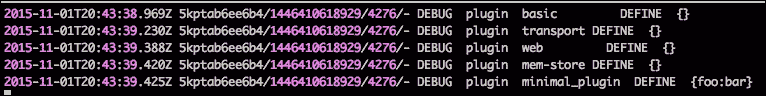
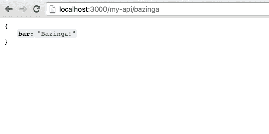
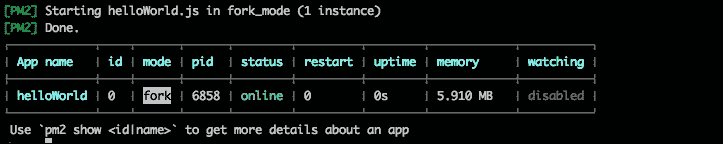
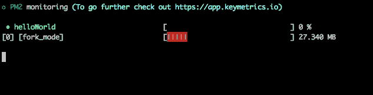
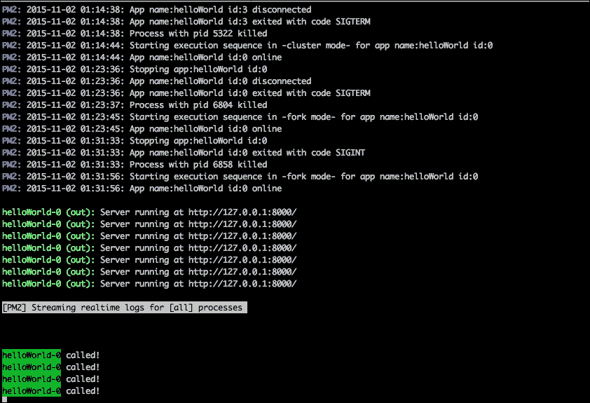
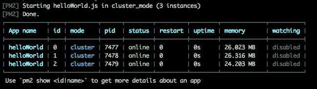

# 二、Node.js 中的微服务——Seneca 和 PM2 替代方案

在本章中，您将主要学习两个框架**Seneca**和**PM2**，以及为什么对于构建微服务非常重要。 我们还将了解这些框架的替代方案，以便大致了解 Node.js 生态系统中正在发生的事情。 在本章中，我们将重点关注以下主题:

*   **对 Node.js 的需求**:在本节中，我们将证明选择 Node.js 作为构建面向微服务的软件的框架是正确的。 我们将介绍使用这一令人惊叹的技术所需的软件堆栈。
*   **Seneca -一个微服务框架**:在本节中，您将学习Seneca 的基础知识，以及如果我们想要保持软件的可管理性，为什么它是正确的选择。 我们将解释如何将 Seneca 与 Express (Node.js 中最流行的 web 服务器)集成，以遵循行业标准。
*   **PM2**:PM2 是运行 Node.js 应用的最佳选择。 无论你在部署应用生态系统时遇到什么问题，PM2 总是有解决方案的。

# 需要 Node.js

在之前的一章中，我提到我过去不是 Node.js 的忠实粉丝。 这样做的原因是，我还没有准备好应对 JavaScript 正在经历的标准化水平。

浏览器中的 JavaScript 是痛苦的。 跨浏览器兼容性一直是个问题，缺乏标准化也无助于缓解痛苦。

然后，Node.js 出现了，由于它的非阻塞特性，很容易创建高度可伸缩的应用程序(我们将在本章后面讨论它)，而且它也很容易学习，因为它基于 JavaScript，一种著名的语言。

现在，Node.js 是世界上许多公司的首选，同时也是服务器中需要无阻塞特性的方面的首选，比如 web sockets。

在本书中，我们将主要(但不仅仅是)使用 Seneca 和 PM2 作为构建和运行微服务的框架，但这并不意味着其他替代方案都不好。

市场很少有替代品如**restify**或**表达**构建应用程序和永远【5】或【显示】nodemon 运行它们。 然而，我发现Seneca 和 PM2 是构建微服务最合适的组合，原因如下:

*   PM2 在应用程序部署方面是非常强大的
*   Seneca 不仅是一个构建微服务的框架，也是一个重塑我们对面向对象软件的认识的范例

我们将在本书的几个章节中使用 Express 的几个例子，我们还将讨论如何将 Seneca 集成到 Express 中作为中间件。

然而，在此之前，让我们讨论一些关于 Node.js 的概念，这些概念将帮助我们理解这些框架。

## 安装 Node.js、npm、Seneca、PM2

Node.js 是相当容易安装。 根据您的系统，有一个可用的安装程序，它使 Node.js 和**npm**(**Node Package Manager**)的安装成为一项相当简单的任务。 简单地双击它，并遵循说明。 在写本书的时候，已经有 Windows 和 OSX 的安装程序了。

然而，高级用户，尤其是 DevOps 工程师，将需要从源代码或二进制文件中安装 Node.js 和npm。

### 注意事项

Node.js 和npm 程序都捆绑在一个单独的包中，我们可以从 Node.js 网站上为不同平台下载(源代码或二进制文件):

[https://nodejs.org/en/download/](https://nodejs.org/en/download/)

对于 Chef 用户，一个流行的配置管理软件来构建服务器，有一些可用的选项，但最流行的是以下的菜谱(对于那些不熟悉 Chef 的人，一个菜谱基本上是一个通过 Chef 在服务器上安装或配置软件的脚本):

[https://github.com/redguide/nodejs](https://github.com/redguide/nodejs)

在撰写本书时，已经有 Linux 的二进制文件可用。

### 学习 npm

**npm**是一个软件，自带 Node.js，使您可以从互联网拉依赖，而无需担心他们的管理。 它还可以用于维护和更新依赖项，以及从头创建项目。

你可能知道，每个节点应用程序都有一个`package.json`文件。 这个文件描述了项目的配置(依赖项、版本、通用命令等等)。 让我们看看下面的例子:

```js
{
  "name": "test-project",
  "version": "1.0.0",
  "description": "test project",
  "main": "index.js",
  "scripts": {
  "test": "grunt validate --verbose"
  },
  "author": "David Gonzalez",
  "license": "ISC"
}
```

文件本身是不言自明的。 在这个文件中有一个有趣的部分——`scripts`。

在本节中，我们可以指定用于执行不同操作的命令。 在这种情况下，如果我们从终端运行`npm test`，npm 将执行`grunt validate --verbose`。

运行节点应用程序通常和执行以下命令一样容易:

```js
node index.js

```

在项目的根目录中，假设引导文件是`index.js`。 如果不是这样，最好的办法是在`package.json`的`scripts`部分添加分段，如下所示:

```js
"scripts": {
  "test": "grunt validate --verbose"
  "start": "node index.js"
},
```

如你所见，现在我们有两个命令在执行同一个程序:

```js
node index.js
npm start

```

使用`npm start`的好处是很明显的——一致性。 无论应用程序有多复杂，`npm start`总是会运行它(如果正确配置了`scripts`部分)。

让我们在一个干净的项目中安装 Seneca 和 PM2。

首先，在安装 Node.js 之后，在终端的一个新文件夹中执行`npm init`。 你应该会得到类似下图的提示:


npm 会问你一些参数来配置你的项目，一旦你完成了，它会写一个内容类似于前面代码的`package.json`文件。

现在我们需要安装依赖项; NPM 将为我们做这些。 只需运行以下命令:

```js
npm install --save seneca

```

现在，如果你再次检查`package.json`，你可以看到有一个叫做`dependencies`的新部分，其中包含了塞内加的条目:

```js
"dependencies": {
  "seneca": "^0.7.1"
}
```

这意味着从现在开始，我们的应用程序可以需要 Seneca 模块，而`require()`函数将能够找到它。 `save`旗有以下几个变化:

*   `save`:将依赖项保存在`dependencies`部分。 它在整个开发生命周期都是可用的。
*   `save-dev`:将依赖项保存在`devDependencies`部分。 它只在开发中可用，不会部署到生产环境中。
*   `save-optional`:这增加了一个依赖项(比如`save`)，但是如果找不到依赖项，则让 npm 继续。 这取决于应用程序如何处理这种依赖性的缺失。

让我们继续 PM2。 尽管 PM2 可以用作库，但它主要是一个命令工具，就像任何 Unix 系统中的`ls`或`grep`一样。 NPM 在安装命令行工具方面做得很好:

```js
npm install –g pm2

```

`–g`标志指示 npm 全局安装 PM2，因此 PM2 在系统中可用，而不在应用中。这意味着在前一个命令结束时，`pm2`可以作为控制台上的命令使用。 如果在终端中运行`pm2 help`，可以看到 PM2 的帮助。

## 我们的第一个节目——Hello World

关于 Node.js 最有趣的概念之一是简单性。 你可以在几天内学习 Node.js，在几周内掌握它，只要你熟悉 JavaScript。 Node.js 中的代码往往比其他语言更短更清晰:

```js
var http = require('http');

var server = http.createServer(function (request, response) {
  response.writeHead(200, {"Content-Type": "text/plain"});
  response.end("Hello World\n");
});

server.listen(8000);
```

前面的代码创建了一个服务器，该服务器在`8000`端口上监听请求。 如果你不相信，打开浏览器，在导航栏中键入`http://127.0.0.1:8000`，如下图所示:


让我们来解释一下代码:

*   第一行加载`http`模块。 通过`require()`指令，我们要求节点加载`http`模块，并将该模块的导出赋值给`http`变量。 导出语言元素是 Node.js 必须从模块内部向外部公开函数和变量的方式。
*   脚本中的第二个构造创建 HTTP 服务器。 `http`模块创建并公开一个名为`createServer()`的方法接收一个函数(记住 JavaScript 将函数作为第一级对象,这样就可以作为其他函数传递参数)作为参数,在node . js 世界,叫做**回调。 回调是作为对事件的响应而执行的操作。 在本例中，事件是脚本收到一个 HTTP 请求。 由于它的线程模型，Node.js 大量使用回调。 您的应用程序将总是在单个线程上执行，以便在等待操作完成时不会阻塞应用程序线程，并防止我们的应用程序看起来停滞或挂起。 否则，您的程序将无法响应。 我们将在[第四章](4.html "Chapter 4. Writing Your First Microservice in Node.js")，*用 Node.js 编写你的第一个微服务*中回到这个问题。**
*   在下一行中，`server.listen(8000)`启动服务器。 从现在开始，每当我们的服务器接收到一个请求时，将执行`http.createServer()`函数的回调。

这是它。 简单性是 Node.js 程序的关键。 这段代码允许您在不编写大量的类、方法和配置对象的情况下直接进入要点，而这些类、方法和配置对象在第一个实例中会使事情变得复杂，而在第一个实例中可以简单得多:编写一个服务于请求的脚本。

## Node.js 线程模型

用Node.js 编写的程序是单线程的。 它的影响是相当大的; 在前面的例子中,如果我们有一万个并发请求,他们会排队和满意的 node . js 事件循环(这将是进一步解释[第四章](4.html "Chapter 4. Writing Your First Microservice in Node.js"),*编写你的第一个 Microservice 在 node . js*和[第六章](6.html "Chapter 6. Testing and Documenting Node.js Microservices"),*测试和记录 node . js Microservices【显示】)。*

乍一看，这听起来是错误的。 我的意思是，由于其多核特性，现代 cpu 可以处理多个并行请求。 那么，在一个线程中执行它们有什么好处呢?

这个问题的答案是，Node.js 被设计为处理异步处理。 这意味着在缓慢操作(比如读取文件)的情况下，node .js 不会阻塞线程，而是允许线程继续满足其他事件，然后节点的控制进程将执行与该事件相关的方法，处理响应。

与前面的例子相同，`createServer()`方法接受一个回调，该回调将在 HTTP 请求发生时执行，但同时，线程可以自由地继续执行其他操作。

这个模型中的问题是 Node.js 开发人员所称的回调地狱。 代码变得复杂，因为每个响应阻塞动作必须在回调中处理，就像在前面的例子中; 作为`createServer()`方法参数的函数就是一个很好的例子。

## 模块化组织最佳实践

大项目的源代码组织一直是有争议的。 为了避免混乱，不同的开发人员有不同的方法来排列源代码。

有些语言，如 Java 或 c#，将代码组织在包中，这样我们就可以在包中找到相关的源代码文件。 作为一个例子,如果我们编写一个任务管理器软件,在`com.taskmanager.dao`包我们可以找到类,实现**数据访问对象**(**DAO)模式来访问数据库。 以同样的方式，在`com.taskmanager.dao.domain.model`包中，我们可以找到应用程序中表示模型对象(通常是表)的所有类。**

这是 Java 和 c#中的一个约定。 如果您是一名 c#开发人员，并且开始处理一个现有的项目，那么您只需要几天时间就可以习惯代码的结构，因为语言强制对源代码进行组织。

### Javascript

JavaScript 最初被设计为在浏览器中运行。 代码应该被嵌入到 HTML 文档中，以便**文档对象模型**(**DOM**)可以被操作来创建动态效果。 看看下面的例子:

```js
<!DOCTYPE html>
<html>
<head>
  <meta charset="UTF-8">
  <title>Title of the document</title>
</head>
<body>
  Hello <span id="world">Mundo</span>
  <script type="text/javascript">
  document.getElementById("world").innerText = 'World';
  </script>
</body>
</html>
```

如您所见，如果在浏览器中加载此 HTML，则在页面加载时，`span`标记中以`id`为`world`的文本将被替换。

在 JavaScript 中，没有依赖管理的概念。 JavaScript 可以从 HTML 中分离到它自己的文件中，但是(目前)没有办法将一个 JavaScript 文件包含到另一个 JavaScript 文件中。

这导致了一个大问题。 当项目包含数十个 JavaScript 文件时，资产管理更像是一门艺术而不是工程工作。

当浏览器在找到 JavaScript 文件时执行这些文件时，导入 JavaScript 文件的顺序变得非常重要。 让我们重新排序前面例子中的代码来演示它，如下所示:

```js
<!DOCTYPE html>
<html>
<head>
  <meta charset="UTF-8">
  <title>Title of the document</title>
  <script type="text/javascript">
    document.getElementById("world").innerText = 'World';
  </script>
</head>
<body>
  Hello <span id="world">Mundo</span>

</body>
</html>
```

现在，将这个HTML 保存到`index.html`文件中，并尝试将其加载到任何浏览器中，如下图所示:


在这种情况下，我已经使用 Chrome 浏览器，控制台显示一个**Uncaught TypeError: Cannot set property 'innerText' of null**error In line 7。

为什么会这样?

正如前面解释的，浏览器*按找到的代码执行*，结果发现当浏览器执行 JavaScript 时，`world`元素还不存在。

幸运的是，Node.js 用一种非常优雅和标准的方法解决了依赖加载问题。

### 坚固的设计原则

当谈论微服务时，我们总是在谈论模块化，而模块化总是归结为以下(**SOLID**)设计原则:

*   **单一**责任原则
*   **开启**扩展，关闭修改
*   **Liskov**置换
*   **界面**分离
*   **依赖**反转(控制反转和依赖注入)

你希望你的代码被组织在模块中。 模块是一组代码的集合，它可以做一些简单的事情，比如操作字符串，而且它做得很好。 模块包含的函数(或类、实用程序等)越多，它的内聚性就越低，我们正试图避免这种情况。

在 Node.js 中，每个 JavaScript 文件默认都是一个模块。 我们也可以使用文件夹作为模块，但让我们关注文件:

```js
function contains(a, b) {
  return a.indexOf(b) > -1;
}

function stringToOrdinal(str) {
  var result = ""
  for (var i = 0, len = str.length; i < len; i++) {
    result += charToNumber(str[i]);
  }
  return result;
}

function charToNumber(char) {
  return char.charCodeAt(0) - 96;
}

module.exports = {
  contains: contains,
  stringToOrdinal: stringToOrdinal
}
```

前面的代码表示 Node.js 中的一个有效模块。 在本例中，模块包含三个函数，其中两个函数向模块外部公开。

在 Node.js 中，这是通过`module.exports`变量完成的。 无论你给这个变量赋值什么，调用代码都是可见的，这样我们就可以在模块上模拟私有内容，比如本例中的`charToNumber()`函数。

所以，如果我们想使用这个模块，我们只需要`require()`它，如下所示:

```js
var stringManipulation = require("./string-manipulation");
console.log(stringManipulation.stringToOrdinal("aabb"));
```

这应该输出`1122`。

让我们回到SOLID 原则，看看我们的模块是什么样子:

*   :我们的模块只处理字符串
*   **打开扩展，关闭修改**:我们可以添加更多的函数，但是我们拥有的是正确的，它们可以用来在模块中构建新的函数
*   **Liskov 替换**:我们将跳过这一项，因为模块的结构与实现这一原则无关
*   **接口隔离**:JavaScript 并不是一个语言才是最重要的一个接口 Java 或 c#等元素,但在这个模块中,我们接触的界面,`module.exports`变量将作为合同调用代码和实现的变化不会影响到该模块是如何被调用的
*   **依赖倒置**:这是我们失败的地方，虽然不是完全失败，但足以重新考虑我们的方法

在这种情况下，我们需要模块，与它交互的唯一方式是通过全局作用域。 如果在模块内部，我们想要与外部的数据交互，唯一可能的选择是在需要模块之前创建一个全局变量(或函数)，然后假设它总是在那里。

全局变量在 Node.js 中是一个大问题。 您可能知道，在 JavaScript 中，如果在声明变量时省略`var`关键字，它将自动成为全局变量。

再加上有意的全局变量会在模块之间创建数据耦合(耦合是我们想要不惜一切代价避免的)，这就是为什么要找到一种更好的方法来为我们的微服务(或者一般来说)定义模块。

让我们将代码重组如下:

```js
function init(options) {

  function charToNumber(char) {
    return char.charCodeAt(0) - 96;
  }

  function StringManipulation() {
  }

  var stringManipulation = new StringManipulation();

  stringManipulation.contains = function(a, b) {
    return a.indexOf(b) > -1;
  };

  stringManipulation.stringToOrdinal = function(str) {
    var result = ""
    for (var i = 0, len = str.length; i < len; i++) {
      result += charToNumber(str[i]);
    }
    return result;
  }
  return stringManipulation;
}

module.exports = init;
```

这看起来有点复杂，但一旦你习惯了，好处是巨大的:

*   我们可以向模块传递配置参数(如调试信息)
*   避免全局作用域的污染，就好像所有东西都被包装在函数中一样，并且我们强制使用严格的*use*配置(这避免了没有`var`的声明会导致编译错误)
*   对模块进行参数化可以方便地模拟用于测试的行为和数据

在这本书中，我们将从微服务的角度编写大量的代码来建模系统。 我们将尽量保持这种模式，这样我们就能看到好处。

我们将使用的一个图书馆——塞内卡(Seneca)——遵循这种模式，还有大量可以在互联网上找到的图书馆。

# Seneca -一个微服务框架

Seneca 是一个用于构建微服务的框架，由 Richard Rodger 编写，他是 nearForm 的创始人兼首席技术官，这是一家帮助其他公司使用 Node.js 设计和实现软件的咨询公司。 Seneca 讲究简单性，它通过一个复杂的模式匹配接口将服务连接起来，该接口将传输从代码中抽象出来，因此编写高度可伸缩的软件相当容易。

让我们停止谈论，来看看一些例子:

```js
var seneca = require( 'seneca' )()

seneca.add({role: 'math', cmd: 'sum'}, function (msg, respond) {
  var sum = msg.left + msg.right
  respond(null, {answer: sum})
})

seneca.add({role: 'math', cmd: 'product'}, function (msg, respond) {
  var product = msg.left * msg.right
  respond( null, { answer: product } )
})

seneca.act({role: 'math', cmd: 'sum', left: 1, right: 2}, console.log)
    seneca.act({role: 'math', cmd: 'product', left: 3, right: 4}, console.log)
```

正如你所看到的，代码是不言自明的:

*   塞内加是一个模块，所以首先要做的是`require()`它。 Seneca 包被封装在一个函数中，因此调用该函数将初始化库。
*   接下来的两个说明与[第一章](1.html "Chapter 1. Microservices Architecture")、*微服务体系结构*中解释的一个概念有关:API 组合。 `seneca.add()`方法指示 Seneca 添加一个函数，该函数将用一组模式调用。 对于第一个，我们指定当 Seneca 接收到`{role: math, cmd: sum}`命令时将发生的动作。 第二个的模式是`{role: math, cmd: product}`。
*   最后一行向 Seneca 发送命令，该命令将由与作为第一个参数传递的模式相匹配的服务执行。 在本例中，它将以`role`和`cmd`匹配的方式匹配第一个服务。 第二个呼叫将匹配第二个服务。

将代码写入我们在本章前面创建的项目(记住我们安装了 Seneca 和 PM2)中名为`index.js`的文件中，并运行以下命令:

```js
node index.js

```

输出如下图所示:


我们稍后将讨论这个输出，以便准确地解释它的含义，但是如果您熟悉企业应用程序，您几乎可以猜到发生了什么。

最后两行是来自两个服务的响应:第一行执行`1+2`，第二行执行`3*4`。

作为最后两行中的第一个单词显示的`null`输出对应于 JavaScript 中广泛使用的模式:错误优先回调。

让我们用一个代码示例来解释它:

```js
var seneca = require( 'seneca' )()

seneca.add({role: 'math', cmd: 'sum'}, function (msg, respond) {
  var sum = msg.left + msg.right
  respond(null, {answer: sum})
})

seneca.add({role: 'math', cmd: 'product'}, function (msg, respond) {
  var product = msg.left * msg.right
  respond( null, { answer: product } )
})

seneca.act({role: 'math', cmd: 'sum', left: 1, right: 2}, function(err, data) {
  if (err) {
    return console.error(err);
  }
  console.log(data);
});
seneca.act({role: 'math', cmd: 'product', left: 3, right: 4}, console.log);
```

前面的代码用更合适的方法重写了对 Seneca 的第一次调用。 而不是将所有内容转储到控制台，处理来自 Seneca 的响应，这是一个回调，其中第一个参数是错误，如果发生错误(`null`否则)，第二个参数是从微服务返回的数据。 这就是为什么在第一个示例中，`null`是进入控制台的第一个输出。

在 Node.js 的世界中，使用回调是很常见的。 回调是一种指示程序发生了某些事情的方法，不会被阻塞，直到结果准备好被处理。 塞内加也不例外。 它在很大程度上依赖于服务调用回调函数来处理响应,更有意义,当你想到 microservices 被部署在不同的机器上(在上一个示例中,一切都运行在同一台机器),特别是因为网络延迟可以考虑到你的软件的设计。

## 倒置控制做对

在现代软件中，控制的反转是必须的。 它与依赖注入一起出现。

控制反转可以定义为*，一种委托创建或调用组件和方法的技术，这样你的模块就不需要知道如何构建依赖，而依赖通常是通过依赖注入*获得的。

Seneca 并没有真正使用依赖注入，但它是控制反转的完美例子。

让我们看看下面的代码:

```js
var seneca = require('seneca')();
seneca.add({component: 'greeter'}, function(msg, respond) {
  respond(null, {message: 'Hello ' + msg.name});
});
seneca.act({component: 'greeter', name: 'David'}, function(error, response) {
  if(error) return console.log(error);
  console.log(response.message);
});
```

这是塞内加最基本的例子。 从企业软件的角度来看，我们可以在这里区分两个组件:生产者(`Seneca.add()`)和消费者(`Seneca.act()`)。 正如前面所提到的，Seneca 并没有依赖注入系统，但 Seneca 是围绕控制反转原则优雅地构建的。

在`Seneca.act()`函数中，我们不显式地调用持有业务逻辑的组件; 相反，我们要求 Seneca 通过使用接口(在本例中是 JSON 消息)来为我们解析组件。 这是控制反转。

Seneca 在这方面相当灵活:没有关键字(除了集成)，也没有强制字段。 它只有一个由模式匹配引擎**Patrun**使用的关键字和值的组合。

## 塞内加的模式匹配

模式匹配是可以用于微服务的最灵活的软件模式之一。

与网络地址或消息不同，模式很容易扩展。 让我们用下面的例子来解释一下:

```js
var seneca = require('seneca')();
seneca.add({cmd: 'wordcount'}, function(msg, respond) {
  var length = msg.phrase.split(' ').length;
  respond(null, {words: length});
});

seneca.act({cmd: 'wordcount', phrase: 'Hello world this is Seneca'}, function(err, response) {
  console.log(response);
});
```

它是一种计算句子中单词数量的服务。 如前所述，在第一行中，我们添加了`wordcount`命令的处理程序，在第二行中，我们向 Seneca 发送了一个请求，以计算短语中的单词数量。

如果你执行它，你应该得到类似于下面的图像:


到目前为止，您应该能够理解它是如何工作的，甚至可以对它进行一些修改。

让我们扩展这个模式。 现在，我们要跳过简短的单词，如下所示:

```js
var seneca = require('seneca')();

seneca.add({cmd: 'wordcount'}, function(msg, respond) {
  var length = msg.phrase.split(' ').length;
  respond(null, {words: length});
});

seneca.add({cmd: 'wordcount', skipShort: true}, function(msg, respond) {
  var words = msg.phrase.split(' ');
  var validWords = 0;
  for (var i = 0; i < words.length; i++) {
    if (words[i].length > 3) {
      validWords++;
    }
  }
  respond(null, {words: validWords});
});

seneca.act({cmd: 'wordcount', phrase: 'Hello world this is Seneca'}, function(err, response) {
  console.log(response);
});

seneca.act({cmd: 'wordcount', skipShort: true, phrase: 'Hello world this is Seneca'}, function(err, response) {
  console.log(response);
});
```

如您所见，我们为`wordcount`命令添加了另一个带有额外`skipShort`参数的处理程序。

这个处理程序现在将跳过所有三个或三个以下字符的单词。 如果你执行上面的代码，输出类似如下图像:


第一行`{words: 5}`对应第一个动作调用。 第二行`{words: 4}`对应第二次呼叫。

### 一个模式匹配库

Patrun 也是由 Richard Rodger 写的。 Seneca 使用它来执行模式匹配并决定哪个服务应该响应调用。

Patrun 使用最接近的****match**方法来解决调用。 让我们看看下面的例子:**

 **

在上图中，我们可以看到三种模式。 它们相当于上一节示例中的`seneca.add()`。

在本例中，我们登记了*x*和*y*变量的三种不同组合。 现在，让我们看看 Patrun 是如何进行匹配的:

*   `{x: 1} ->A`:与**A**匹配 100%
*   `{x: 2} ->`:不匹配
*   `{x:1, y:1} -> B`:100%匹配**B**; 它也与**A**匹配，但**B**是更好的匹配——二出二比一出一
*   `{x:1, y:2} -> C`:100%匹配**C**; 同样，它也适合**A**，但**C**更具体
*   `{y: 1} ->`:不匹配

正如你所看到的，Patrun(和 Seneca)总是得到最长的匹配。 通过这种方式，我们可以通过具体化匹配轻松扩展更抽象模式的功能。

### 重用模式

在前面的示例中，为了跳过少于三个字符的单词，我们不重用单词计数函数。

在这种情况下，很难按原样重用函数; 尽管问题听起来非常相似，但解决方案几乎没有重叠。

但是，让我们回到两个数字相加的例子:

```js
var seneca = require( 'seneca' )()

seneca.add({role: 'math', cmd: 'sum'}, function (msg, respond) {
  var sum = msg.left + msg.right
  respond(null, {answer: sum})
});

seneca.add({role: 'math', cmd: 'sum', integer: true}, function (msg, respond) {
  this.act({role: 'math', cmd: 'sum', left: Math.floor(msg.left), right: Math.floor(msg.right)},respond);
});

seneca.act({role: 'math', cmd: 'sum', left: 1.5, right: 2.5}, console.log)

seneca.act({role: 'math', cmd: 'sum', left: 1.5, right: 2.5, integer: true}, console.log)
```

如您所见，代码发生了一些变化。 现在，接受整数的模式依赖于基本模式来计算数字的和。

Patrun 总是试图匹配最接近和最具体的模式，它可以找到以下两个维度:

*   最长的火柴链
*   模式的顺序

它总是试图找到最合适的，如果有歧义，它将匹配找到的第一个模式。

通过这种方式，我们可以依赖已经存在的模式来构建新的服务。

### 编写插件

插件是基于 Seneca 的应用程序的重要组成部分。 正如我们在[第一章](1.html "Chapter 1. Microservices Architecture")、*微服务架构*中所讨论的，API 聚合是构建应用程序的完美方式。

js 中最流行的框架都是围绕这个概念构建的:将小块的软件组合起来，形成一个更大的系统。

塞内加也是围绕着这一点建造的; `Seneca.add()`原则为这个难题增加了一块新的拼图，最终的 API 是不同小软件块的混合物。

Seneca 更进一步，实现了一个有趣的插件系统，以便将通用功能模块化并抽象为可重用组件。

下面的例子是最小的 Seneca 插件:

```js
function minimal_plugin( options ) {
  console.log(options)
}

require( 'seneca' )()
  .use( minimal_plugin, {foo:'bar'} )
```

将代码写入`minimal-plugin.js`文件并执行:

```js
node minimal-plugin.js

```

这个执行的输出应该类似于下面的图像:


在 Seneca 中，一个插件是在启动时加载的，但是我们没有看到它的默认日志级别是 INFO。 这意味着 Seneca 不会显示任何 DEBUG 级别的信息。 为了了解塞内加在做什么，我们需要得到更多的信息，如下:

```js
node minimal-plugin.js –seneca.log.all

```

这产生了巨大的输出。 这几乎是发生在 Seneca 内部的所有事情，这对于调试复杂的情况是非常有用的，但在这种情况下，我们想要做的是显示一个插件列表:

```js
node minimal-plugin.js --seneca.log.all | grep plugin | grep DEFINE

```

它将产生类似下图的东西:



让我们分析前面的输出:

*   `basic`:这个插件包含在主要的 Seneca 模块中，并且提供了一组基本的实用程序操作模式。
*   `transport`:这是传输插件。 到目前为止，我们只在同一台机器上执行了不同的服务(非常小和简洁)，但是如果我们想要分发它们呢? 这个插件将帮助我们做到这一点，我们将在接下来的章节中看到如何做到这一点。
*   `web`:在[第一章](1.html "Chapter 1. Microservices Architecture")，*微服务架构*中，我们提到微服务应该提倡将连接它们的管道保持在一个广泛使用的标准之下。 Seneca 默认使用 TCP，但创建 RESTful API 可能比较棘手。 这个插件可以帮助我们做到这一点，我们将在下一节中看到如何做到这一点。
*   `mem-store`:Seneca 提供了一个数据抽象层，这样我们就可以处理不同位置的数据存储:Mongo, SQL 数据库等等。 开箱即用，Seneca 提供了一个内存存储，使其能够正常工作。
*   :这是我们的插件。 现在我们知道塞内加可以装载它了。

我们编写的插件什么也不做。 现在，是时候写一些有用的东西了:

```js
function math( options ) {

  this.add({role:'math', cmd: 'sum'}, function( msg, respond ) {
    respond( null, { answer: msg.left + msg.right } )
  })

  this.add({role:'math', cmd: 'product'}, function( msg, respond ) {
    respond( null, { answer: msg.left * msg.right } )
  })

}

require( 'seneca' )()
  .use( math )
  .act( 'role:math,cmd:sum,left:1,right:2', console.log )
```

首先，请注意，在最后一条指令中，`act()`遵循不同的格式。 与其传递一个字典，不如传递一个与第一个参数具有相同键值的字符串，就像我们传递一个字典一样。 这并没有什么问题，但我更喜欢使用 JSON 对象(字典)，因为这是一种结构化数据而不存在语法问题的方法。

在前面的示例中，我们可以看到代码是如何构建成插件的。 如果我们执行它，我们可以看到输出类似如下:


在 Seneca 中，你需要注意的一件事是如何初始化你的插件。 封装插件的函数(在前面的例子中是`math()`函数)被设计为同步执行，它被称为**定义函数**。 如果你还记得上一章的，Node.js 应用程序是单线程的。

要初始化一个插件，你需要添加一个特殊的`init()`操作模式。 这个操作模式将为每个插件依次调用。 `init()`函数必须在没有错误的情况下调用其响应回调函数。 如果插件初始化失败，Seneca 退出 Node.js 进程。 当出现问题时，您希望微服务快速失败(并大声尖叫)。 所有插件必须在执行任何操作之前完成初始化。

让我们看一个如何用下面的方法初始化一个插件的例子:

```js
function init(msg, respond) {
  console.log("plugin initialized!");
  console.log("expensive operation taking place now... DONE!");
  respond();
}

function math( options ) {

  this.add({role:'math', cmd: 'sum'}, function( msg, respond ) {
    respond( null, { answer: msg.left + msg.right } )
  })

  this.add({role:'math', cmd: 'product'}, function( msg, respond ) {
    respond( null, { answer: msg.left * msg.right } )
  })

  this.add({init: "math"}, init);
}
require( 'seneca' )()
  .use( math )
  .act( 'role:math,cmd:sum,left:1,right:2', console.log )
```

然后，在执行这个文件之后，输出看起来应该非常类似于下面的图像:


从输出中可以看出，初始化插件的函数被调用了。

### 提示

Node.js 应用程序的一般规则是永远不要阻塞线程。 如果您发现自己阻塞了线程，您可能需要重新考虑如何避免它。

### Web 服务器集成

在[第 1 章](1.html "Chapter 1. Microservices Architecture")、*微服务体系结构*中，我们特别强调了使用标准技术与您的微服务进行通信。

Seneca 在默认情况下使用 TCP 传输层，尽管它使用 TCP，但不容易与之交互，因为决定执行的方法的标准是基于来自客户机的有效负载。

让我们深入研究最常见的用例:您的服务是由浏览器上的 JavaScript 调用的。 虽然这是可以做到的，但如果 Seneca 公开一个 REST API 而不是 JSON 对话框，就会容易得多，后者非常适合微服务之间的通信(除非您有超低延迟需求)。

Seneca 不是一个 web 框架。 它可以被定义为一个*通用微服务框架*，因此围绕一个像前面那样的具体案例构建它没有太大意义。

相反，Seneca的构建方式使得与其他框架的集成相当容易。

Express 是在 Node.js 上构建 web 应用程序时的首选。 在 Internet 上可以找到大量关于 Express 的示例和文档，这使得学习 Express 的任务相当容易。

#### Seneca 作为 Express 中间件

Express 是也是根据 API 组成原理构建的。 Express 中的每一个软件都被称为中间件，为了处理每个请求，它们被链接在代码中。

在本例中，我们将使用**seneca-web**作为 Express 的中间件，这样一旦我们指定了配置，所有的 url 都将遵循命名约定。

让我们考虑下面的例子:

```js
var seneca = require('seneca')()

seneca.add('role:api,cmd:bazinga',function(args,done){
  done(null,{bar:"Bazinga!"});
});
seneca.act('role:web',{use:{
  prefix: '/my-api',
  pin: {role:'api',cmd:'*'},

  map:{
    bazinga: {GET: true}
  }
}})
var express = require('express')
var app = express()
app.use( seneca.export('web') )
app.listen(3000)
```

这段代码不像前面的例子那样容易理解，但我将尽我所能解释它:

*   第二行为塞内加添加了一个模式。 我们对它很熟悉，因为书中所有的例子都是这样。
*   第三条指令，`seneca.act()`，是魔法发生的地方。 我们正在用`role:api`模式和任何 cmd 模式(`cmd:*`)装载这些模式，以响应`/my-api`下的 url。 在本例中，第一个`seneca.add()`将响应 URL`/my-api/bazinga`，因为`/my-api/`由`prefix`变量指定，`bazinga`由`seneca.add()`命令的`cmd`部分指定。
*   `app.use(seneca.export('web'))`指示 Express 使用 seneca-web 作为中间件，根据配置规则执行操作。
*   `app.listen(3000)`绑定端口`3000`为 Express。

如果你还记得本章前面章节的，`seneca.act()`将一个函数作为第二个参数。 在本例中，我们公开了 Express 在如何将传入请求映射到 Seneca 操作方面所使用的配置。

让我们测试它:



前面的代码非常密集，所以让我们来解释一下浏览器中的代码:

*   Express 接收由 seneca-web 处理的请求。
*   seneca-web 插件被配置为使用`/my-api/`作为前缀,与关键字绑定`pin`(参见`seneca.act()`从前面的代码)塞内卡操作(`seneca.add()`)包含`role:api`的模式,加上任何 cmd 模式(`cmd:*`)。 在本例中，`/my-api/bazinga`对应于第一个(也是唯一一个)`seneca.add()`命令，使用`{role: 'api', cmd: 'bazinga'}`模式。

完全理解 Seneca 和 Express 之间的集成需要一段时间，但一旦理解清楚，API 可组合模式提供的灵活性将是无限的。

Express 本身就很大，超出了本书的范围，但它是一个非常流行的框架，值得一看。

#### 数据存储

Seneca提供了一个数据抽象层，允许您以通用的方式与应用程序的数据进行交互。

默认情况下，Seneca 附带一个内存插件(如前一节所述)，因此它可以开箱即用。

我们将在本书的大部分内容中使用它，因为不同的存储系统完全超出了我们的范围，塞内加把我们从它们中抽象出来。

Seneca 提供了一个简单数据抽象层(**对象关系映射**(**ORM**))，其操作如下:

*   **load**:根据标识符加载实体
*   **save**:创建或更新实体(如果您提供了标识符)
*   **list**:列出与简单查询匹配的实体
*   **remove**:通过标识符删除一个实体

让我们构建一个插件来管理数据库中的员工:

```js
module.exports = function(options) {
  this.add({role: 'employee', cmd: 'add'}, function(msg, respond){
    this.make('employee').data$(msg.data).save$(respond);
  });

  this.find({role: 'employee', cmd: 'get'}, function(msg, respond) {
    this.make('employee').load$(msg.id, respond);
  });
}
```

请记住，默认情况下，数据库是在内存中，所以我们现在不需要担心表结构。

第一个命令将员工添加到数据库中。 第二个命令通过`id`从数据库中恢复一个员工。

注意，Seneca 中的所有ORM 原语最后都是美元符号(`$`)。

正如您现在看到的，我们已经从数据存储细节中抽象出来了。 如果应用程序在未来发生变化，我们决定使用 MongoDB 作为数据存储而不是内存存储，我们唯一需要关注的是处理 MongoDB 的插件。

让我们使用我们的员工管理插件，如下代码所示:

```js
var seneca = require('seneca')().use('employees-storage')
var employee =  {
  name: "David",
  surname: "Gonzalez",
  position: "Software Developer"
}

function add_employee() {
  seneca.act({role: 'employee', cmd: 'add', data: employee}, function (err, msg) {
    console.log(msg);
  });
}
add_employee();
```

在前面的示例中，我们通过调用插件中公开的模式将员工添加到内存中的数据库中。

在本书中，我们将看到关于如何使用数据抽象层的不同示例，但主要关注如何构建微服务，而不是如何处理不同的数据存储。

# PM2 - Node.js 的一个任务运行器

**PM2**是一个生产进程管理器，可以帮助提升或降低 Node.js，以及服务器实例的负载平衡。 它还确保进程持续运行，解决了 Node.js 的线程模型的一个副作用:未捕获的异常杀死线程，进而杀死应用程序。

## 单线程应用程序和异常

正如你之前学到的，Node.js 应用程序是在单个线程中运行的。 这并不意味着 Node.js 不是并发的，它只是意味着你的应用程序在单个线程上运行，而其他一切都是并行运行的。

这有一个含义:*如果一个异常没有被处理，你的应用程序就会死亡*。

解决方案是使用密集地使用承诺库，如**bluebird**; 它为成功和失败添加了处理程序，所以如果有一个错误，异常会不冒泡，杀死你的应用。

然而，有一些我们无法控制的情况，*我们称之为不可恢复错误或 bug*。 最终，您的应用程序将由于处理错误而死亡。 在 Java 等语言中，异常不是什么大问题:线程终止，但应用程序继续工作。

在 Node.js 中，这是一个大问题。 这个问题在第一个实例中通过使用任务运行程序(如**forever】**来解决。

它们都是任务运行器，当应用程序出于某种原因退出时，重新运行它，以确保正常运行时间。

考虑以下例子:


`helloWorld.js`应用程序现在被永久处理，如果应用程序死亡，它将重新运行它。 让我们杀死它，如图所示:


如您所见，永远用`4903`PID 产生了一个不同的进程。 现在，我们发出一个 kill 命令(`kill -9 4093`)，这是 forever 的输出，如下所示:


虽然我们已经终止了它，但我们的应用程序永远地重新生成，没有任何停机时间(至少，明显的停机时间)。

正如您所看到的，永远是非常基本的:它会在应用程序被终止时多次重新运行。

还有一个名为**nodemon**的包，它是开发 Node.js 应用程序最有用的工具之一。 如果它检测到它所监视的文件中的变化，它就会重新加载应用程序(默认情况下，`*.*`):


现在，如果修改`helloWorld.js`文件，可以看到 nodemon 如何重新加载应用程序。 为了避免编辑/重新加载循环并加快开发速度，这是非常有趣的。

## 使用 PM2—行业标准的任务运行程序

尽管 forever 看起来很有趣，但 PM2 是一个比 forever 更高级的任务运行器。 使用PM2，您可以完全管理应用程序的生命周期，而不需要任何停机时间，还可以通过一个简单的命令提升或降低应用程序的规模。

PM2 还充当负载平衡器。

让我们考虑下面的例子:

```js
var http = require('http');

var server = http.createServer(function (request, response) {
  console.log('called!');
  response.writeHead(200, {"Content-Type": "text/plain"});
  response.end("Hello World\n");
});
server.listen(8000);
console.log("Server running at http://127.0.0.1:8000/");
```

这是一个相当简单的应用程序。 让我们使用 PM2 运行它:

```js
pm2 start helloWorld.js

```

这产生了类似于以下图像的输出:



PM2 注册了一个 app`helloWorld` 这个应用程序运行在`fork`模式(这意味着，PM2 不是作为一个负载平衡器，它只是分叉的应用程序)，操作系统的 PID 是`6858`。

现在，如以下屏幕所示，我们将运行`pm2 show 0`，显示与`id 0`相关的应用信息，如下图所示:


通过两个命令，我们成功地以一种非常复杂的方式运行了一个简单的应用程序。

从现在开始，PM2将确保您的应用程序一直在运行，以便如果您的应用程序死亡，PM2 将重新启动它。

我们还可以监控 PM2 正在运行的应用程序数量:

```js
pm2 monit

```

这显示以下输出:



这是 PM2 监视器。 在这种情况下，这是完全多余的，因为我们的系统只由一个应用程序组成，它以 fork 模式运行。

我们还可以看到执行`pm2 logs`的日志，如下图所示:



如你所见，PM2 摸起来是固体的。 通过少量命令，我们已经完成了应用程序 90%的监控需求。 然而，这并不是一切。

PM2 还提供了一种不停机重新加载应用程序的简单方法:

```js
pm2 reload all

```

这个命令确保您的应用程序在零停机时间下重新启动。 PM2 将为您排队传入的请求，并在您的应用程序再次响应时重新处理它们。 还有一个更细粒度的选项，你可以通过指定应用名称来指定只重载某些应用:

```js
pm2 reload helloWorld

```

对于那些多年来一直在与 Apache、NGINX、PHP-FPM 等进行斗争的人来说，这听起来非常熟悉。

PM2 中的另一个有趣的特性是在集群模式下运行应用程序。 在这种模式下，PM2 生成一个控制器进程和任意数量的工作器(你的应用程序)，这样你就可以利用单线程技术(如 Node.js)获得多核 cpu 的好处。

在此之前，我们需要停止正在运行的应用程序:

```js
pm2 stop all

```

这将导致以下输出:


PM2 会记住正在运行的应用程序，所以在以集群模式重新运行应用程序之前，我们需要通知PM2 忘记您的应用程序，如下:

```js
pm2 delete all

```


我们准备以集群模式运行我们的应用程序:

```js
pm2 start helloWorld.js -i 3

```



PM2 充当主进程和三个工作线程之间的循环，以便它们能够同时处理三个请求。 我们也可以减少或增加我们的工人数量:

```js
pm2 scale helloWorld 2

```

这将导致为同一个应用程序运行两个进程，而不是三个:


正如你所看到的，我们只花了很少的努力就成功地配置了我们的应用程序，使之可以用于生产。

现在，我们可以保存 PM2 的状态，这样，如果我们重启服务器，并且 PM2 作为守护进程运行，应用程序将自动启动。

PM2 有一个代码 API，这样我们就可以编写一个 Node.js 程序来管理我们已经手动完成的所有步骤。 它还提供了使用 JSON 文件配置服务的方法。 当我们学习如何使用 PM2 和 Docker 来部署 Node.js 应用程序时，我们将在[第 6 章](6.html "Chapter 6. Testing and Documenting Node.js Microservices")，*测试和文档化 Node.js Microservices*中更深入地讨论这个问题。

# 小结

在这一章中,您了解了基本的塞内卡和 PM2,这样我们将能够构建和运行一个 microservices-oriented 系统[第四章](4.html "Chapter 4. Writing Your First Microservice in Node.js"),*编写你的第一个在 node . js Microservice*,这本书的。

我们还证明了在前一章中暴露的一些概念实际上有助于解决现实世界的问题，并使我们的生活非常简单。

在下一章中，我们将讨论如何分割一个单片应用程序，为此我们需要了解在本章中发展的一些概念。**