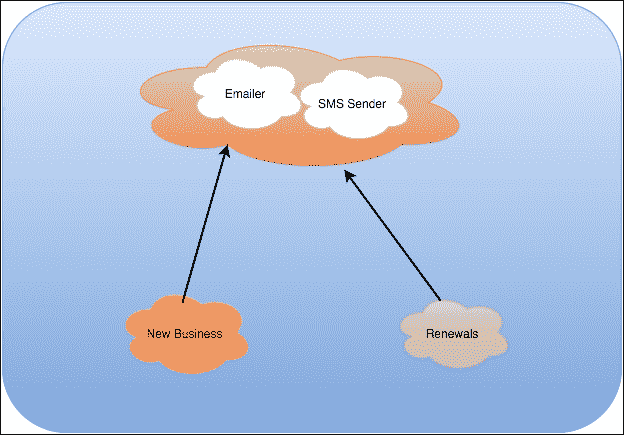
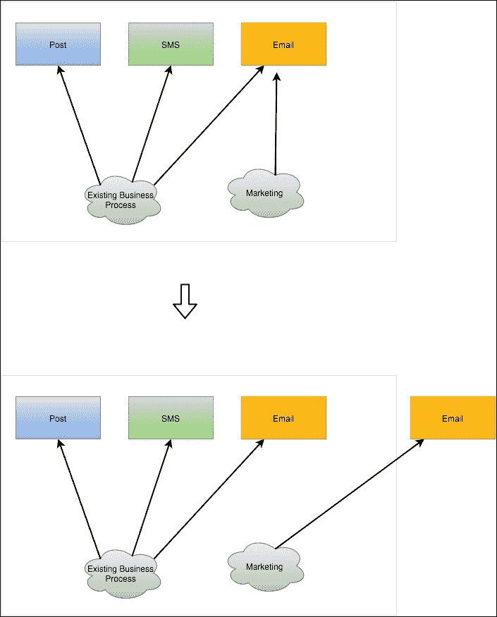

Chapter 3. From the Monolith to Microservices <link rel="stylesheet" href="epub.css" type="text/css"> 

# 第三章。 从巨石到微服务

在我的职业生涯中，我在很多不同的公司工作过，主要是在金融服务方面，我工作过的所有公司都遵循着相同的模式，如下所示:

1.  一家公司是由几个具有良好领域知识的人创建的:保险、支付、信用卡等等。
2.  公司不断成长，需要快速满足的新业务需求(监管、大客户要求愚蠢的事情等等)，这些都是匆忙建立起来的，几乎没有计划。
3.  该公司经历了另一个成长阶段，在这个阶段，业务交易被一个难以维护的单一软件清晰地定义和糟糕地建模。
4.  公司增加员工数量，导致了成长的痛苦和效率的损失，这是由于对软件如何在第一个实例中构建的限制。

这一章不仅是关于如何避免以前的流程(不可控的有机增长)，而且是关于如何建模一个新的系统使用微服务。 这一章是本书的灵魂,我将试着合成我的经验在几页,设置应遵循的原则在第四章,*编写你的第一个在 node . js Microservice*,我们将构建一个完整的系统基于 microservices 使用前面章节中的经验教训。

# 首先是巨石

现代企业软件中很大的百分比(我估计大约是 90%)是按照单片方法构建的。

大型软件组件运行在一个容器,一个定义良好的开发生命周期,这完全违背了敏捷原则,提供尽早且频繁地交付(https://en.wikipedia.org/wiki/Release_early[_release_often](https://en.wikipedia.org/wiki/Release_early,_release_often)),如下:

*   **早交付**:越早失败，越容易恢复。 如果您在一个软件组件上工作了两年，然后它发布了，那么就会有很大的风险偏离最初的需求，而最初的需求通常是错误的，并且每隔几天就会改变一次。
*   **经常交付**:经常交付，涉众可以意识到进展，并可以看到在软件中快速反映的变更。 错误可以在几天内修复，改进也很容易确定。

公司构建大的软件组件，而不是小的一起工作的组件，因为这是自然的事情，如下所示:

1.  开发人员有一个新的要求。
2.  他在服务层的现有类上构建一个新方法。
3.  该方法通过 HTTP、SOAP 或任何其他协议暴露在 API 上。

现在，把它乘以你公司的开发人员数量，你会得到被称为**的有机增长**。 有机增长是在没有充分的长期计划的情况下，在业务压力下对软件系统进行的一种不受控制的、计划外的*增长，这是不好的。*

## 如何应对有机增长?

解决有机增长所需的第一件事是确保业务和 IT 在公司内保持一致。 通常，在大公司中，IT并不被视为业务的核心部分。

组织将他们的 IT 系统外包出去，牢记价格，而不是质量，这样构建这些软件组件的合作伙伴就专注于一件事:*按时交付*并且根据规范，即使它们是不正确的。

这就产生了一个不太理想的生态系统，以对现有问题提供有效的解决方案来响应业务需求。 IT 是由那些几乎不了解系统是如何构建的，并且通常忽视软件开发的复杂性的人领导的。

幸运的是，随着 IT 系统成为全球 99%业务的驱动因素，这是一个不断变化的趋势，但我们需要更聪明地构建它们。

解决有机增长的第一个措施是让 IT 和业务涉众协同工作:培训非技术涉众是成功的关键。

如果我们回到几个大版本模式。 我们能做得更好吗?

当然可以。 将工作划分为可管理的软件工件，这些工件为单个的、定义良好的业务活动建模，并赋予它一个实体。

在这个阶段，它不需要是一个微服务，但是将逻辑保留在一个分离的、定义良好的、易于测试的、解耦的模块中，这将为我们将来在应用程序中进行更改提供巨大的优势。

让我们考虑下面的例子:



在这个保险系统中，你可以看到某人很着急。 SMS 和 e-mail 发送者，虽然两者都是通信渠道，但它们具有非常不同的性质，您可能希望它们以不同的方式发挥作用。

调用服务分为以下两个高级实体:

*   :新客户在注册时收到电子邮件
*   **续租**:在保单准备续租时，现有客户收到短信

在某些情况下，系统需要发送 sms 和电子邮件，并且有人创建了处理所有第三方通信的通信服务实体。

一开始这看起来是个好主意。 在一天结束的时候，短信或电子邮件只是一个渠道，沟通机制将会有 90%是相同的，我们可以重用大量的功能。

如果我们突然想要集成一个处理所有物理岗位的第三方服务，会发生什么?

如果我们想添加一份每周向客户发送一次的通讯，其中包含我们认为客户感兴趣的信息，会发生什么情况呢?

该服务将失控，测试、发布将变得更加困难，并确保短信代码的更改不会影响以任何形式发送电子邮件。

这是一种有机增长，在这种情况下，它与一个叫做**康威定律**的定律有关，该定律规定如下:

> *任何组织设计一个系统(这里定义的范围比信息系统更广)都会不可避免地产生一个设计，其结构是该组织的沟通结构的副本。*

在这种情况下，我们掉进了一个陷阱。 我们试图在单个软件组件上建模通信，该组件可能太大太复杂，无法快速响应新的业务需求。

让我们看一下下面的图表:


现在，我们将封装每个通信通道到其自己的服务上(稍后将作为微服务部署)，我们将对未来的通信通道做同样的事情。

这是击败有机增长的第一步:创建具有明确边界和单一职责的细粒度服务——*做一些小事，但要做好*。

## 多抽象才算太抽象?

我们的大脑不能处理复杂的机制。 抽象能力是人类最近获得的智力之一。

在前一节的示例中，我给出了一些会让世界上一半的程序员感到不安的东西:*根除我们系统的抽象*。

抽象能力是我们多年来学习的东西，与智力不同，它是可以训练的。 并不是每个人都能达到相同的抽象级别，如果我们将某些行业需要的特定和复杂的领域知识与抽象级别混合在一起，我们就有了应对灾难的完美方法。

在构建软件时，我一直试图遵循的黄金规则之一是避免过早的抽象(尝试是正确的词，因为我总是发现它存在巨大的反对意见)。

有多少次你发现自己处于一个角落，只需要简单的一组需求:*构建一个程序来解决 X*。 然而，您的团队出发并预测*X*的所有可能变化，甚至不知道它们是否合理。 一旦软件在生产,一个利益相关者有变异的*X,你难以想象(需求不正确)现在,让这种变化将花费你工作几天,一个巨大的重构。*

 *避免这个问题的方法很简单:避免至少三个用例的抽象。

不要考虑通过不同类型的通道发送数据的可能性，因为这可能不会发生，而且您正在用不必要的抽象损害当前特性。 一旦您有了至少一个其他的通信通道，就应该开始考虑如何更好地设计这两个软件组件，当第三个用例出现时，进行重构。

记住,在构建 microservices 时,他们应该足够小,被重写一次 sprint(两周左右),所以拥有一个工作原型的好处在这么短的时间是值得的风险必须重写一次更具体的要求: 向涉众展示一些东西是确定需求的最快方法。

塞内加**是伟大的在这方面,通过模式匹配,我们可以扩展给定 microservice 而不影响现有的 API 调用代码:我们的服务是对扩展开放,对修改关闭(固体原则),我们添加功能不影响现有的一个。 我们将在[第四章](4.html "Chapter 4. Writing Your First Microservice in Node.js")，*在 Node.js 中编写你的第一个微服务*中看到更完整的例子。**

 **# 于是微服务出现了

微服务已经站稳了脚跟。 现在，公司更加重视软件的质量。 如前一节所述，尽早交付和经常交付是在软件开发中成功的关键。

微服务通过模块化和专门化帮助我们尽快满足业务需求。 小块的软件,可以很容易地版本和升级后的几天之内,他们很容易测试,因为他们有一个清晰的和小的目的(专业化),并且用这样一种方式,与系统的其余部分隔离(模块化)。

不幸的是，前面描述的情况并不常见。 通常，大型软件系统的构建方式并不是模块化或专门化易于识别的。 一般的规则是构建一个大的软件组件来完成所有的工作，而且模块化程度很差，所以我们需要从最基本的开始。

让我们开始写一些代码，如下所示:

```js
module.exports = function(options) {

  var init = {}

  /**
   * Sends one SMS
   */
  init.sendSMS = function(destination, content) {
    // Code to send SMS
  }

  /**
   * Reads the pending list of SMS.
   */
  init.readPendingSMS = function() {
    // code to receive SMS
    return listOfSms;
  }

  /**
   * Sends an email.
   */
  init.sendEmail = function(subject, content) {
    // code to send emails
  }

  /**
   * Gets a list of pending emails.
   */
  init.readPendingEmails = function() {
    // code to read the pending emails
    return listOfEmails;
  }

  /**
   * This code marks an email as read so it does not get
   * fetch again by the readPendingEmails function.
   */
  init.markEmailAsRead = function(messageId) {
    // code to mark a message as read.
  }

  /**
   * This function queues a document to be printed and
   * sent by post.
   */
  init.queuePost = function(document) {
    // code to queue post
  }

  return init;
}
```

如您所见，这个模块可以很容易地被称为**通信服务**，而且也很容易猜到它在做什么。 它管理电子邮件、SMS 和邮政通信。

这可能太多了。 随着人们不断增加与通信相关的方法，这一服务可能会失控。 这是整体软件的关键问题:边界上下文跨越不同的区域，从功能和维护的角度影响我们软件的质量。

如果您是一名软件开发人员，那么马上就会出现一个危险信号:这个模块的内聚性非常差。

虽然它可能在一段时间内有效，但我们现在正在改变我们的心态。 我们正在构建可以隔离的小型、可伸缩、自主的组件。 这种情况下的内聚性很差，因为模块要做太多不同的事情:电子邮件、SMS 和发布。

如果我们添加另一个沟通渠道，如 Twitter 和 Facebook 通知，会发生什么?

服务发展得失去控制。 您最终得到的是一个难以重构、测试和修改的巨大模块，而不是具有小功能的软件组件。 让我们看看以下 SOLID 设计原则，解释在[第二章](2.html "Chapter 2. Microservices in Node.js – Seneca and PM2 Alternatives")，*在 Node.js - Seneca 和 PM2 替代方案*中的微服务:

*   **单责任原则**:模块做的事情太多。
*   :该模块将需要修改，以添加新的功能，并可能更改通用代码。
*   **利斯科夫置换**:我们将再次跳过这个。
*   **接口隔离**:我们在模块中没有指定任何接口，只是实现了任意一组函数。
*   **依赖注入:**没有依赖注入。 模块需要由调用代码构建。

如果我们没有测试，事情会变得更复杂。

因此，让我们使用 Seneca 将其分解成各种小模块。

首先，e-mail 模块(`email.js`)如下:

```js
module.exports = function (options) {

  /**
   * Sends an email.
   */
  this.add({channel: 'email', action: 'send'}, function(msg, respond) {
    // Code to send an email.
    respond(null, {...});
  });

  /**
   * Gets a list of pending emails.
   */
  this.add({channel: 'email', action: 'pending'}, function(msg, respond) {
    // Code to read pending email.
    respond(null, {...});
  });

  /**
   * Marks a message as read.
   */
  this.add({channel: 'email', action: 'read'}, function(msg, respond) {
    // Code to mark a message as read.
    respond(null, {...});
  });
}
```

短信模块(`sms.js`)如下:

```js
module.exports = function (options) {

  /**
   * Sends an email.
   */
  this.add({channel: 'sms', action: 'send'}, function(msg, respond) {
    // Code to send a sms.
    respond(null, {...});
  });

  /**
   * Receives the pending SMS.
   */
  this.add({channel: 'sms', action: 'pending'}, function(msg, respond) {
    // Code to read pending sms.
    respond(null, {...});
  });
}
```

最后，岗位模块(`post.js`)如下:

```js
module.exports = function (options) {

  /**
   * Queues a post message for printing and sending.
   */
  this.add({channel: 'post', action: 'queue'}, function(msg, respond) {
    // Code to queue a post message.
    respond(null, {...});
  });
}
```

下图显示了新的模块结构:



现在，我们有三个模块。 这些模块中的每一个都在互不干扰的情况下做一件特定的事情; 我们已经创建了高内聚模块。

让我们运行前面的代码，如下所示:

```js
var seneca = require("seneca")()
      .use("email")
      .use("sms")
      .use("post");

seneca.listen({port: 1932, host: "10.0.0.7"});
```

简单地说，我们已经创建了一个 IP`10.0.0.7`绑定的服务器，它在`1932`端口上监听传入的请求。 如你所见，我们没有引用任何文件，我们只是通过名称引用模块; 塞内加会完成剩下的工作。

让我们运行它，验证 Seneca 已经加载了插件:

```js
node index.js --seneca.log.all | grep DEFINE

```

这个命令将输出类似以下几行:


如果你还记得[第二章](2.html "Chapter 2. Microservices in Node.js – Seneca and PM2 Alternatives"),*Microservices node . js -塞内加和 PM2 替代品【显示】,塞内加负载几个插件默认:`basic`,`transport`,`web`,`mem-store`,让塞内加的工作没有争吵与配置。 很明显,我们会看到在第四章,*编写你的第一个在 node . js Microservice【病人】,配置是必要的,例如,`mem-store`只会在内存中存储数据之间没有坚持执行。**

除了标准的插件，我们可以看到 Seneca 加载了三个额外的插件:`email`，`sms`，`post`，这是我们创建的插件。

如您所见，一旦您了解了框架的工作原理，就很容易理解用 Seneca 编写的服务。 在这种情况下,我写了代码以插件的形式,这样就可以将不同实例的塞内加在不同的机器上使用,就像塞内加一个透明的传输机制,允许我们快速部署和规模的部分整体应用 microservices,如下:

*   可以很容易地测试新版本，因为对电子邮件功能的更改只会影响电子邮件的发送。
*   它很容易扩展。 正如我们在下一章将看到的，复制一个服务就像配置一个新服务器并将我们的 Seneca 客户机指向它一样简单。
*   它也很容易维护，因为软件更容易理解和修改。

## 缺点

有了微服务，我们解决了现代企业中最大的问题，但这并不意味着它们是没有问题的。 微服务通常会导致不同类型的问题，这是不容易预见的。

第一个也是最令人担忧的是操作开销，它可能会抵消使用微服务所获得的好处。 当你在设计一个系统的时候，你应该总是在脑海中有一个问题:如何将其自动化? 自动化是解决这个问题的关键。

微服务的第二个缺点是应用程序的不均匀性。 一个团队可能认为某些在另一个团队中可能被禁止的良好实践(特别是关于异常处理)，这在团队之间增加了额外的隔离层，这可能不利于团队中的工程师之间的沟通。

最后，但同样重要的是，微服务引入了更大的通信复杂性，可能导致安全问题。 我们不再需要控制单个应用程序及其与外部世界的通信，而是要面对许多相互通信的服务器。

## 分裂巨石

假设您公司的营销部门决定运行一个积极的电子邮件活动，该活动将需要峰值的容量，这可能会损害日常发送电子邮件的正常流程。 在压力下，电子邮件会延迟，这会给我们带来麻烦。

幸运的是，我们已经按照上一节所述构建了我们的系统。 小的 Seneca 模块形式的高内聚和低耦合插件。

然后，实现它的解决方案很简单:在多台机器上部署电子邮件服务(`email.js`):

```js
var seneca = require("seneca")().use("email");
seneca.listen({port: 1932, host: "new-email-service-ip"});
```

另外，创建一个 Seneca 客户端指向它，如下所示:

```js
var seneca = require("seneca")()
      .use("email")
      .use("sms")
      .use("post");
seneca.listen({port: 1932, host: "10.0.0.7"});

// interact with the existing email service using "seneca"

var senecaEmail = require("seneca").client({host: "new-email-service-ip", port: 1932});

// interact with the new email service using "senecaEmail"
```

从现在开始，`senecaEmail`变量将在调用`act`时联系远程服务，这样我们就实现了目标*扩展我们的第一个微服务*。

## 问题分裂了整体-这都是关于数据

数据存储可能存在问题。 如果您的应用程序已经失去控制很多年了，数据库也会做同样的事情，到现在，有机增长将使难以处理数据库中的重大更改。

微服务应该关注自己的数据。 将数据保存在服务的本地是确保系统在发展过程中保持灵活性的关键之一，但这并不总是可能的。 例如，金融服务尤其受到面向微服务体系结构的一个主要弱点的影响:*缺乏事务性*。 当软件组件处理金钱时，它需要确保数据保持一致，而不是在每次操作后最终保持一致。 如果客户在一家金融公司存钱，持有账户余额的软件需要与银行中持有的资金保持一致，否则，账户的调节将失败。 不仅如此，如果你的公司是一个受监管的实体，它可能会对业务的连续性造成严重的问题。

在处理微服务和金融系统时，一般的经验法则是保持一个不那么微的服务，它处理所有的钱，并为系统的辅助模块创建微服务，如电子邮件、短信、用户注册等，如下图所示:


正如你在前面的图片所看到的，支付将成为一个大的微服务，而不是更小的服务，它只在运营方面有影响，没有什么可以阻止我们像以前看到的那样模块化应用程序。 从 ATM 中取款必须是一个原子操作(没有中间状态的成功或失败)，这一事实不应该规定我们如何组织应用程序中的代码，允许我们模块化服务，而是跨越所有服务的事务范围。

# 组织一致性

在一个基于微服务构建软件的公司中，每个利益相关者都需要参与决策。

微服务是一个巨大的范式转变。 通常，大型组织倾向于用非常老式的方式构建软件。 每隔几个月发布一次大的版本，需要几天时间来完成**质量保证**(**QA**)阶段，部署需要几个小时。

当一家公司选择实现面向微服务的体系结构时，方法就完全改变了:小团队在自己构建、测试和部署的小特性上工作。 团队只做一件事(一个微服务，或者更现实一点，几个)并且做得很好(他们掌握了构建软件所需的领域和技术知识)。

这就是通常所说的跨职能团队。 一个由少数人组成的工作单元，他们具有构建高质量软件组件所需的知识。

标志团队必须掌握理解业务需求所需的领域知识，这一点也很重要。

在我的职业生涯中，我工作过的大多数公司都失败了(在我看来)。 开发人员被认为是堆砌砖块的人，他们能够神奇地理解业务流，而之前并不向他们公开。 如果一个开发人员在一周内交付*X*工作量，那么十个开发人员将交付*10X*工作量。 这是错误的。

构建微服务的跨职能团队中的人员必须掌握(不仅仅是知道)特定领域的知识，以便提高效率，并将康威定律及其含义纳入系统中，以改变业务流程的工作方式。

在谈到微服务中的组织一致性时，自主权是关键。 在构建微服务时，团队需要保持自主，以保持敏捷，这意味着将技术权威保持在团队内部，如下所示:

*   语言的使用
*   代码标准
*   用于解决问题的模式
*   选择用于构建、测试、调试和部署软件的工具

这是一个重要的部分，因为这是我们需要定义公司如何构建软件以及工程问题可能引入的地方。

例如，我们可以查看编码标准，如下表所示:

*   我们希望在团队中保持相同的编码标准吗?
*   我们希望每个团队都有自己的编码标准吗?

总的来说，我总是支持 80%规则:*80%的完美对于 100%的用例*已经足够了。 这意味着放松的编码标准(它可以应用于其他领域),允许一定程度的缺陷/个性化,有助于减少团队和之间的摩擦也允许工程师快速赶上很少重要规则,如日志记录策略或异常处理。

如果您的编码标准过于复杂，那么当团队试图将代码推入他们通常范围之外的微服务中时，就会出现摩擦(记住，团队拥有服务，但每个团队都可以为服务做出贡献)。

# 小结

在本章中，我们讨论了基于业务需求构建可拆分为微服务的整体应用程序的原则。 当你学到的知识,**原子性**、**一致性**,**隔离**、**耐久性**(【显示】酸)设计原则的概念,我们需要记住,以构建高质量的软件。

你也知道,我们不能假设我们可以从头开始设计一个系统,所以我们需要聪明的我们如何构建系统的新的部分和我们如何重构现有的这样我们实现水平所需的灵活性,以满足业务需求和弹性。

我们还简要介绍了单片设计的数据库，以及在将单片软件分割成微服务时，它们是最大的痛点，因为通常需要关闭系统几个小时才能将数据分割成本地数据库。 随着 NoSQL 数据库的新趋势正在改变数据存储的游戏规则，这一主题很可能是一本完整的书。

最后,我们讨论了如何使团队的工程师在我们公司为了高效,同时保持灵活性和弹性需要能够灵活,以及如何 Conway 法则影响整体系统的转换成 microservices-oriented 架构。

在下一章中，我们将应用前三章中讨论的所有原则，以及大量的常识来构建一个基于微服务的完整工作系统。***