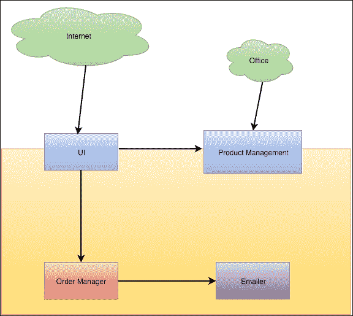
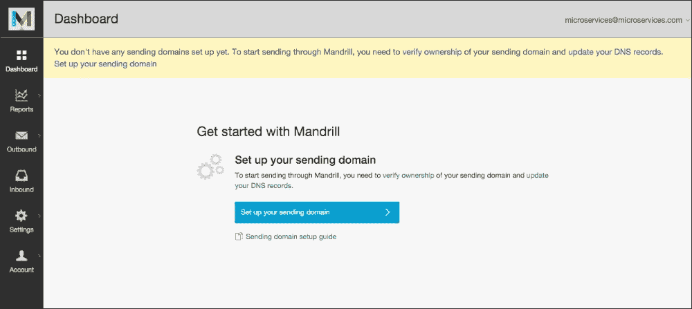
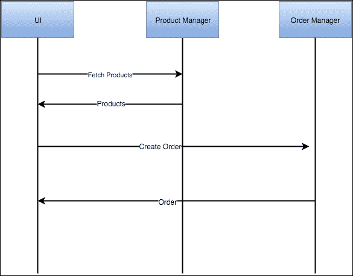
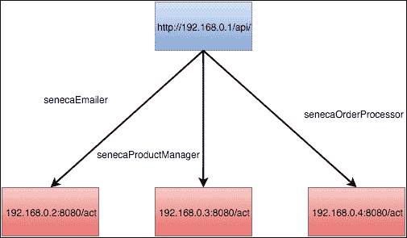
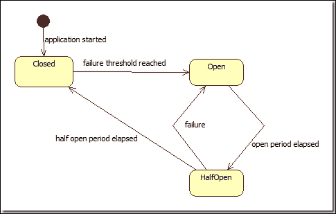
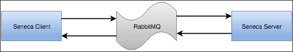
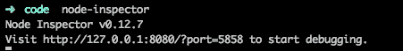
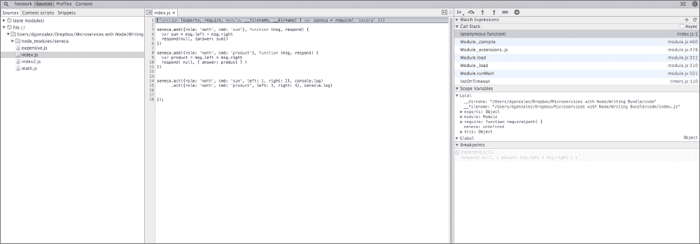
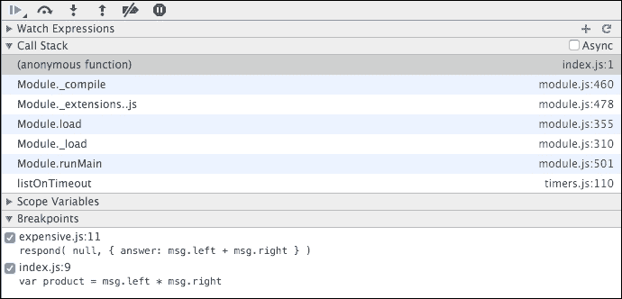
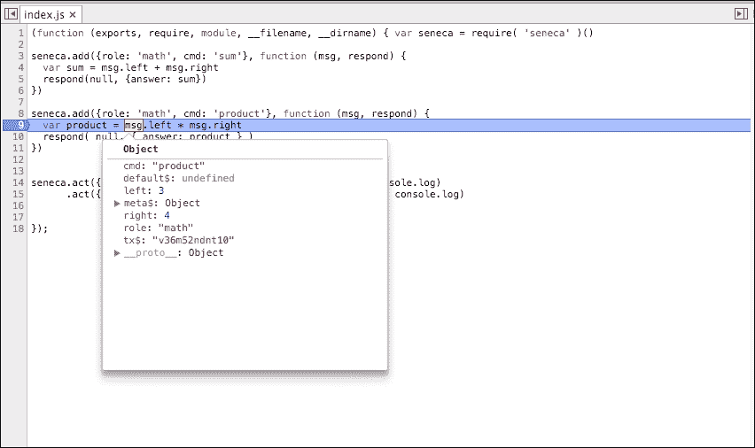

Chapter 4. Writing Your First Microservice in Node.js <link rel="stylesheet" href="epub.css" type="text/css"> 

# 第四章。 用 Node.js 编写你的第一个微服务

我们已经学习了如何构建健壮的面向微服务的软件，现在是时候将所有的概念付诸实践了。 在本章中，我们将使用 Seneca 和其他一些框架构建一个面向微服务的电子商务，这些框架将允许我们编写一个软件，从而受益于微服务的特殊性。

# 微商——大图

它包括以下内容:

*   写作 microservices
*   上浆 microservices
*   创建 api
*   塞内加与 Express 的整合
*   使用 Seneca 存储数据

在本章中，我们将编写一个完整的(近乎)简化的基于微服务的电子商务解决方案。 从概念的角度来看，完整意味着完整，但出于显而易见的原因，它不会是完整的(当生产就绪时)，因为我们可能需要几本书来处理所有可能的流程。

我们不会深入讨论 UI，因为它与本书的主题无关。 我们要做的是一个 microservice 聚合所有其他 microservices,创建前端 API 使用**单页面应用程序**(**SPA),与任何现代 JavaScript 框架的构建。**

在本章中，我们将开发以下四种微服务:

*   **产品经理**:该微服务将负责从我们的数据库中添加、编辑、删除产品，并为客户提供产品服务。 这个微服务将部分公开，用于潜在的管理站点添加/删除产品。
*   **Order Manager**:这个微服务将负责管理订单和账单。
*   **Emailer**:该微服务将负责向客户发送电子邮件。
*   **UI**:这个微服务将向潜在的 SPA 公开来自其他微服务的特性，但我们只构建 JSON 接口。

在构建之前的四种微服务时，我们将发展之前章节中讨论的概念，以便在本章结束时，我们能够识别未来最常见的缺陷。 请记住，本书的目标不是把你变成一个微服务或 Node.js 专家，而是提供你需要自己学习的工具，并让你意识到最好的设计原则和最常见的陷阱。

让我们看一下部署图:



这张图展示了我们公司(黄色方块)是如何将我们的一些微服务隐藏在现实世界中，并将其他一些微服务暴露在不同的网络中，如下:

*   **UI**将暴露于互联网。 每个人都能达到这个端点。
*   **产品管理**管理电子商务中的产品。 它将有以下两个接口:
    *   一个 Seneca 端点，UI 将从中提取数据
    *   一个 JSON API，我们公司的办公室将能够创建、更新和删除产品
*   **Emailer**将成为我们与客户沟通的渠道。 我们将使用这个微服务来解释 Seneca 的优点，并且我们还将给出一个例子，说明当微服务失败时最终的一致性和系统退化。
*   **Order Manager**:这个微服务将让我们为客户处理订单。 通过这个微服务，我们将讨论如何处理数据对于每个微服务是本地的，而不是对于系统是全局的这一事实。 你不能仅仅去数据库恢复产品名称或价格，它需要从其他微服务恢复。

### 提示

如您所见，这里没有用户或人员管理，但有了这四种微服务，我们将能够开发微服务体系结构的核心概念。 Seneca 提供了一个非常强大的数据和传输插件系统，使它可以很容易地使用不同的数据存储和传输系统。

对于我们所有的微服务，我们将使用 MongoDB 作为存储。 Seneca 提供了一个开箱即用的内存数据库插件，它允许你直接开始编码，但是存储是短暂的:它不会在调用之间保存数据。

# 产品经理——双面核心

产品经理是我们系统的核心。 我知道您在想什么:微服务应该是小的(微的)和分布式的(没有中心点)，但是您需要在某处设置概念中心，否则您将以一个碎片化的系统和可追溯性问题结束(我们将在后面讨论它)。

使用 Seneca 构建双重 API 相当简单，因为它与 Express 的集成相当直接。 Express 将用于公开 UI 的一些功能，比如编辑产品、添加产品、删除产品等等。 它是一个非常方便的框架，容易学习，并且与 Seneca 集成得很好。 它也是 web 应用的 Node.js 事实上的标准，所以它可以很容易地找到关于可能出现的问题的信息。

它还将有一个通过 Seneca TCP (Seneca 的默认插件)公开的私有部分，这样我们的微服务内部网络(特别是 UI)将能够访问我们目录中的产品列表。

产品经理将是小型的和内聚的(它将只管理产品)，以及可扩展的，但它将拥有在我们的电子商务中处理产品所需的所有知识。

首先，我们需要定义我们的产品经理微服务，如下所示:

*   这将有一个函数来检索数据库中的所有产品。 这在生产系统中可能不是一个好主意(因为它可能需要分页)，但是对于我们的示例来说，它是有效的。
*   它应该有一个函数来获取给定类别的所有产品。 它与前一个类似，它需要在生产准备系统中进行分页。
*   它应该具有按标识符(`id`)检索产品的功能。
*   它应该有一个功能，允许我们向数据库中添加产品(在本例中是 MongoDB)。 这个函数将使用 Seneca 数据抽象来解耦我们的微服务和存储:我们将能够(理论上)切换 Mongo到一个不同的数据库，而不会有太多麻烦(理论上也是如此)。
*   这应该有一个功能来删除产品。 再次使用 Seneca 数据抽象。
*   这应该有一个编辑产品的功能。

我们的产品将是一个包含四个字段的数据结构:**名称**、**类别**、**描述**和**价格**。 正如你所看到的，它有点简单，但它将帮助我们理解微服务的复杂世界。

我们的产品管理微服务将使用 MongoDB([https://www.mongodb.org/](https://www.mongodb.org/))。 Mongo 是一个面向文档的无模式数据库，它在存储产品(说到底，产品就是文档)等数据方面具有巨大的灵活性。 对于 Node.js 来说，它也是一个不错的选择，因为它存储 JSON 对象，这是一个标准的，为 JavaScript 创建了(**JSON**代表**JavaScript Object Notation**)，所以看起来像是完美的配对。

如果你想了解更多的话，MongoDB 网站上有很多有用的信息。

让我们开始编写函数。

## 抓取产品

为了获取产品，我们进入数据库并将完整的产品列表直接转储到接口。 在本例中，我们不会创建任何分页机制，但一般来说，分页数据是避免数据库(或应用程序，但主要是数据库)性能问题的良好实践。

让我们看看下面的代码:

```js
/**
 * Fetch the list of all the products.
 */
seneca.add({area: "product", action: "fetch"}, function(args, done) {
  var products = this.make("products");
  products.list$({}, done);
});
```

我们已经在 Seneca 中有了一个模式，它会返回数据库中的所有数据。

`products.list$()`函数将接收以下两个参数:

*   的查询条件
*   接收错误和结果对象的函数(记住错误优先的回调方法)

Seneca 使用`$`符号标识关键功能，如`list$`、`save$`等。 关于对象属性的命名，只要你使用字母数字标识符，你的命名将是无冲突的。

我们将`seneca.add()`方法中的`done`函数传递给`list$`方法。 这是因为 Seneca 使用错误优先的方法来执行回调。 换句话说，我们正在为以下代码创建一个快捷方式:

```js
seneca.add({area: "product", action: "fetch"}, function(args, done) {
  var products = this.make("products");
  products.list$({}, function(err, result) {
    done(err, result);
  });
});
```

## 按类别获取

按类别获取非常类似于获取产品的完整列表。 唯一的区别是，现在 Seneca 操作将采用一个参数来按类别过滤产品。

让我们看看代码:

```js
/**
 * Fetch the list of products by category.
 */
seneca.add({area: "product", action: "fetch", criteria: "byCategory"}, function(args, done) {
  var products = this.make("products");
  products.list$({category: args.category}, done);
});
```

大多数高级开发人员首先想到的问题之一是，*这难道不是一个注入攻击的完美场景吗?* 好吧，Seneca 足够聪明，可以阻止它，所以我们无需担心它，就像避免将字符串与用户输入连接一样。

如您所见，唯一显著的区别是传递的名为`category`的参数，它被委托给 Seneca 数据抽象层，该层将根据我们使用的存储生成适当的查询。 当谈到微服务时，这是非常强大的。 如果你还记得，在前面的章节中，我们总是谈论耦合，好像它是所有罪恶的根源，现在我们可以确定它是，塞内加以一种非常优雅的方式处理它。 在这种情况下，框架提供了一个契约，不同的存储插件必须满足这个契约才能工作。 在上述例子中，`list$`是本合同的一部分。 如果您明智地使用 Seneca 存储，那么将您的微服务切换到一个新的数据库引擎(您曾经尝试过将一部分数据移到 MongoDB 上吗?)是一个配置问题。

## 通过 ID 抓取

通过ID 获取产品是最必要的方法之一，也是一个棘手的方法。 从编码的角度来看并不复杂，如下所示:

```js
/**
 * Fetch a product by id.
 */
seneca.add({area: "product", action: "fetch", criteria: "byId"}, function(args, done) {
  var product = this.make("products");
  product.load$(args.id, done);
});
```

棘手的部分是如何生成`id`。 `id`的生成是与数据库的接触点之一。 Mongo 创建一个哈希来代表一个合成 ID; 然而，MySQL 通常创建一个自动递增的整数来唯一地标识每条记录。 鉴于此，如果我们想在我们的一个应用程序中切换 MongoDB 到 MySQL，我们需要解决的第一个问题是如何映射一个哈希，看起来类似于下面的一个序数:

`e777d434a849760a1303b7f9f989e33a`

在 99%的情况下,这是很好,但是我们需要小心,尤其是当存储 ID,如果你从以前的章节,每个 microservice 数据应该本地,这可能意味着改变数据类型的一个实体的 ID,需要改变在所有其他数据库的引用 ID。

## 添加产品

添加一个产品很简单。 我们只需要创建数据并将其保存在数据库中:

```js
/**
 * Adds a product.
 */
seneca.add({area: "product", action: "add"}, function(args, done) {
  var products = this.make("products");
  products.category = args.category;
  products.name = args.name;
  products.description = args.description;
  products.category = args.category;
  products.price = args.price
  products.save$(function(err, product) {
    done(err, products.data$(false));
  });
});
```

在这个方法中，我们使用了来自 Seneca 的助手`products.data$(false)`。 这个助手将允许我们检索实体的数据，而不需要所有关于名称空间(区域)、实体名称和基名称的元数据，当数据返回给调用方法时，我们对这些元数据不感兴趣。

## 移除产品

产品的移除通常由`id`完成:我们通过主键锁定我们想要移除的特定数据，然后移除它，如下所示:

```js
/**
 * Removes a product by id.
 */
seneca.add({area: "product", action: "remove"}, function(args, done) {
  var product = this.make("products");
  product.remove$(args.id, function(err) {
  done(err, null);
  });
});
```

在本例中，如果出现错误，除了错误之外我们不会返回任何东西，因此调用此操作的端点可以假设没有错误的响应是成功的。

## 编辑产品

我们需要提供一个操作来编辑产品。 这样做的代码如下:

```js
/**
 * Edits a product fetching it by id first.
 */
seneca.edit({area: "product", action: "edit"}, function(args, done) {
  seneca.act({area: "product", action: "fetch", criteria: "byId", id: args.id}, function(err, result) {
  result.data$(
  {
    name: args.name, 
    category: args.category, 
    description: args.description,
    price: args.price 
  }
  );
  result.save$(function(err, product){
    done(product.data$(false));
    });
  });
});
```

这里有一个有趣的场景。 在编辑产品之前，我们需要通过 ID 来获取它，我们已经这样做了。 因此，我们在这里所做的是依赖于已经存在的操作，通过 ID 检索产品，复制数据并保存它。

这是 Seneca 引入的代码重用的一种很好的方式，在这种方式中，您可以将一个操作的调用委托给另一个操作，并在包装器操作中处理结果。

## 连接一切

正如我们之前所同意的，产品经理将有两种面孔:一种是通过 TCP 上的 Seneca 传输向其他微服务公开的，另一种是通过 REST 方式的 Express(用于创建 web 应用的 Node.js 库)公开的。

让我们把所有东西连接在一起:

```js
var plugin = function(options) {
  var seneca = this;

  /**
   * Fetch the list of all the products.
   */
  seneca.add({area: "product", action: "fetch"}, function(args, done) {
    var products = this.make("products");
    products.list$({}, done);
  });

  /**
   * Fetch the list of products by category.
   */
  seneca.add({area: "product", action: "fetch", criteria: "byCategory"}, function(args, done) {
    var products = this.make("products");
    products.list$({category: args.category}, done);
  });

  /**
   * Fetch a product by id.
   */
  seneca.add({area: "product", action: "fetch", criteria: "byId"}, function(args, done) {
    var product = this.make("products");
    product.load$(args.id, done);
  });

  /**
   * Adds a product.
   */
  seneca.add({area: "product", action: "add"}, function(args, done) {
    var products = this.make("products");
    products.category = args.category;
    products.name = args.name;
    products.description = args.description;
    products.category = args.category;
    products.price = args.price
    products.save$(function(err, product) {
      done(err, products.data$(false));
    });
  });

  /**
   * Removes a product by id.
   */
  seneca.add({area: "product", action: "remove"}, function(args, done) {
    var product = this.make("products");
    product.remove$(args.id, function(err) {
      done(err, null);
    });
  });

  /**
   * Edits a product fetching it by id first.
   */
  seneca.add({area: "product", action: "edit"}, function(args, done) {
    seneca.act({area: "product", action: "fetch", criteria: "byId", id: args.id}, function(err, result) {
      result.data$(
        {
          name: args.name, 
          category: args.category, 
          description: args.description,
          price: args.price            
        }
      );
      result.save$(function(err, product){
        done(err, product.data$(false));
      });
    });
  });
}
module.exports = plugin;

var seneca = require("seneca")();
seneca.use(plugin);
seneca.use("mongo-store", {
  name: "seneca",
  host: "127.0.0.1",
  port: "27017"
});

seneca.ready(function(err){

  seneca.act('role:web',{use:{
    prefix: '/products',
    pin: {area:'product',action:'*'},
    map:{
    fetch: {GET:true},
    edit: {GET:false,POST:true},
    delete: {GET: false, DELETE: true}
    }
  }});
  var express = require('express');
  var app = express();
  app.use(require("body-parser").json());

  // This is how you integrate Seneca with Express
  app.use( seneca.export('web') );

  app.listen(3000);

});
```

现在让我们解释代码:

我们创建了一个 Seneca 插件。 这个插件可以在不同的微服务中重用。 这个插件包含了我们之前描述过的微服务所需的所有方法定义。

上述代码描述了以下两部分:

*   前几行连接到 Mongo。 在本例中，我们指定 Mongo 是一个本地数据库。 我们是通过使用一个名为 mongo-store -[https://github.com/rjrodger/seneca-mongo-store](https://github.com/rjrodger/seneca-mongo-store)的插件来实现的，该插件由 Richard Rodger 编写，他是 Seneca 的作者。
*   第二部分对我们来说是新鲜的。 如果你以前使用过 JQuery，这可能听起来很熟悉，但基本上，`seneca.ready()`回调所做的就是在调用开始流入它的 API 之前，照顾 Seneca 可能没有连接到 Mongo 的事实。 `seneca.ready()`回调是将 Express 与 Seneca 集成的代码所在的位置。

以下是我们 app 的`package.json`配置:

```js
{
  "name": "Product Manager",
  "version": "1.0.0",
  "description": "Product Management sub-system",
  "main": "index.js",
  "keywords": [
    "microservices",
    "products"
  ],
  "author": "David Gonzalez",
  "license": "ISC",
  "dependencies": {
  "body-parser": "^1.14.1",
  "debug": "^2.2.0",
  "express": "^4.13.3",
  "seneca": "^0.8.0",
  "seneca-mongo-store": "^0.2.0",
  "type-is": "^1.6.10"
  }
}
```

在这里，我们控制了运行微服务所需的所有库以及配置。

## 与 Express 集成——如何创建 REST API

与Express 集成非常简单。 让我们看一看代码:

```js
  seneca.act('role:web',{use:{
    prefix: '/products',
    pin: {area:'product',action:'*'},
    map:{
    fetch: {GET:true},      
    edit: {PUT:true},
    delete: {GET: false, DELETE: true}
    }
  }});
  var express = require('express');
  var app = express();
  app.use(require("body-parser").json());

  // This is how you integrate Seneca with Express
  app.use( seneca.export('web') );

  app.listen(3000);
```

正如我们在前一节中看到的，这个代码片段提供了以下三个 REST 端点:

`/products/fetch`

`/products/edit`

`/products/delete`

让我们解释。

首先，我们要做的是告诉 Seneca 执行`role:web`操作，指示配置。 该配置指定为所有 url 使用`/products`前缀，并使用匹配的`{area: "product", action: "*"}`模式固定操作。 这对我们来说也是新的，但这是一种很好的方式，可以向 Seneca 指定，无论它在 URL 中执行什么操作，它都将具有隐式的处理程序`area: "product"`。 这意味着`/products/fetch`端点将对应于`{area: 'products', action: 'fetch'}`模式。 这可能有点困难，但一旦你习惯了，它实际上是非常强大的。 它不会强制`use`按照约定将我们的行为与 url 完全耦合起来。

在配置中，属性映射指定可以在端点上执行的 HTTP 操作:获取将允许`GET`，编辑将允许`PUT`，删除将只允许`DELETE`。 通过这种方式，我们可以控制应用程序的语义。

其他的一切可能对您来说都很熟悉。 创建一个 Express 应用程序，并指定使用以下两个插件:

*   JSON 主体解析器
*   Seneca 网络插件

这就是一切了。 现在，如果我们向 Seneca 操作列表添加一个新操作，以便通过 API 公开它，那么只需要修改 map 属性以允许 HTTP 方法。

虽然我们构建了一个非常简单的微服务，但它捕获了您在创建**CRUD**(**Create Read Update Delete**)应用程序时发现的大部分公共模式。 我们还从一个 Seneca 应用程序中创建了一个小型 REST API。 我们现在需要做的就是配置基础设施(MongoDB)，然后准备部署我们的微服务。

# 电子邮件——一个常见的问题

电子邮件是每个公司都需要做的事情。 我们需要与客户沟通，以便发送通知、账单或注册电子邮件。

在我以前工作过的公司中，电子邮件总是会出现这样的问题，比如电子邮件没有被发送，或者被发送了两次，将错误的内容发送给了错误的客户，等等。 像发送一封电子邮件这样简单的事情，管理起来可能如此复杂，这看起来很可怕。

一般来说，电子邮件通信是编写微服务的首选。 想想看:

*   电子邮件只做一件事
*   电子邮件做得很好
*   电子邮件有自己的数据

这也是一个很好的例子，说明了*Conway 定律*如何在不被注意的情况下进入我们的系统。 当我们受到的约束时，我们设计我们的系统对公司中现有的通信进行建模。

## 如何发送电子邮件

回到最基本的。 我们如何发送电子邮件? 我并不是在讨论我们使用哪种网络协议发送电子邮件，或者可以接受的最小头是什么?

我说的是我们需要从商业的角度来发送一封电子邮件:

*   一个标题
*   的内容
*   一个目的地地址

这就是一切。 我们本可以讨论更多，讨论确认、安全电子邮件、bcc 等等。 然而，我们遵循精益方法:从最小的可行产品开始，从它开始，直到你达到预期的结果。

我不记得有哪个项目的电子邮件发送不是一个有争议的部分。 选择用来发送电子邮件的产品最终与系统紧密耦合，很难无缝地替换它。 然而，微服务在这里拯救我们。

## 定义接口

正如我之前提到的，虽然这听起来很容易，但发送企业电子邮件可能会导致混乱。 因此，我们首先需要明确的是我们的最低要求:

*   我们如何呈现电子邮件?
    *   呈现电子邮件是否属于电子邮件操作的绑定上下文?
    *   我们是否创建另一个微服务来提供电子邮件?
    *   我们使用第三方来管理电子邮件吗?
*   我们是否存储已经发送的电子邮件以供审计之用?

对于这个微服务，我们将使用 Mandrill。 Mandrill 公司允许我们发送公司电子邮件，跟踪已经发送的电子邮件，并创建可以在线编辑的电子邮件模板。

我们的微服务将如下代码所示:

```js
var plugin = function(options) {
  var seneca = this;
  /**
   * Sends an email using a template email.
   */
  seneca.add({area: "email", action: "send", template: "*"}, function(args, done) {
// TODO: More code to come.
  });

  /**
   * Sends an email including the content.
   */
  seneca.add({area: "email", action: "send"}, function(args, done) {
// TODO: More code to come.
  });
};
```

我们有两种模式:一种使用模板，另一种发送请求中包含的内容。

如您所见，我们在这里定义的一切都是与电子邮件相关的信息。 在我们发送的电子邮件中，其他微服务并没有从 Mandrill 术语中吸取什么。 我们所做的唯一妥协就是模板。 我们将模板呈现委托给电子邮件发送方，但这并不是什么大问题，因为即使我们离开 Mandrill，我们也需要以某种方式呈现内容。

稍后我们将回到代码。

## 设置山魈

Mandrill 相当易于使用，设置应该不成问题。 然而，我们将使用测试模式，以便我们可以确保电子邮件不会被发送，并且我们可以访问 API 来满足我们的所有需求。

我们需要做的第一件事是在 Mandrill 上创建一个帐户。 只需在邮箱[https://mandrillapp.com](https://mandrillapp.com)注册，就可以访问该邮箱，如下截图所示:



现在我们已经创建了一个帐户，我们需要进入测试模式。 要做到这一点，只需点击右上角的电子邮件，并从菜单中选择**打开测试模式**选项。 左边的山魈菜单现在将变成橙色。

接下来，我们需要创建一个 API 密钥。 这个键是 Mandrill API 将要使用的登录信息。 只需点击**设置**和**SMTP&API 信息**并添加一个新键(不要忘记复选框将该键标记为测试键)。 现在应该如下截图所示:


关键是你现在需要的一切。 让我们测试一下这个 API:

```js
var mandrill = require("mandrill-api/mandrill");
var mandrillClient = new mandrill.Mandrill("<YOUR-KEY-HERE>");

mandrillClient.users.info({}, function(result){
  console.log(result);
}, function(e){
  console.log(e);
});
```

通过这几行代码，我们成功地测试了 Mandrill 是否已经启动和运行，并且我们有一个有效的密钥。 这个程序的输出应该非常类似于以下 JSON:


## 动手-集成 Mandrill 在您的微服务

现在一切都准备好了。 我们有一个工作钥匙和接口。 剩下的唯一事情就是创建代码。 我们将使用Mandrill API 的一小部分，但是如果您希望使用其他特性，您可以在这里找到更好的描述:[https://mandrillapp.com/api/docs/](https://mandrillapp.com/api/docs/)

让我们看看下面的代码:

```js
/**
   * Sends an email including the content.
   */
  seneca.add({area: "email", action: "send"}, function(args, done) {
    console.log(args);
    var message = {
      "html": args.content,
      "subject": args.subject,
      "to": [{
        "email": args.to,
        "name": args.toName,
        "type": "to"
      }],
      "from_email": "info@micromerce.com",
      "from_name": "Micromerce"
    }
    mandrillClient.messages.send({"message": message}, function(result) {
      done(null, {status: result.status});
    }, function(e) {
      done({code: e.name}, null);
    });
  });
```

第一种方法不使用模板发送消息。 我们只是从应用程序中获取 HTML 内容(和一些其他参数)，并通过 Mandrill 交付它。

正如您所看到的，我们与外部世界只有两个接触点:传入的参数和动作的返回。 have a clear contract that have nothing to do with Mandrill, but what about the data?两者都有明确的合同，与 Mandrill 没有任何关系，但是数据呢?

在错误处，我们返回`e.name`，假设它是一个代码。 在某种程度上，某些人最终会根据这个**错误代码**分支流。 这里，我们有数据耦合; 我们的软件组件不依赖于合同，但它们确实依赖于发送的内容。

现在的问题是:我们如何解决它? 【t】我们不能【t】。 至少不是简单的方式。 我们需要假设我们的微服务并不完美，它有缺陷。 如果我们将提供者转换为电子邮件，我们将需要重新访问调用代码，以检查潜在的耦合。

在软件世界中，在我之前参与的每个项目中，总是有一个很大的推动力，试图使代码尽可能通用，试图猜测未来，这通常可能像假设你的微服务不会是完美的一样糟糕。 有一件事一直吸引着我的注意力:我们投入了大量的努力去追求完美，但我们几乎忽略了我们将会失败的事实，而我们对此却无能为力。 软件经常会失败，我们需要为此做好准备。

稍后，我们将看到一种将人性融入微服务的模式:**断路器**。

如果 Mandrill 因为*未签名*的原因而拒绝邮件，请不要感到惊讶。 这是因为他们无法验证我们发送电子邮件的地方的域(在本例中，是一个不存在的虚拟域)。 如果我们希望 Mandrill 实际处理电子邮件(即使我们处于测试模式)，我们只需要通过向域添加一些配置来验证域。

### 注意事项

更多信息可以在这里的 Mandrill 文档中找到:

[https://mandrillapp.com/api/docs/](https://mandrillapp.com/api/docs/)

发送电子邮件的第二种方法是从模板发送电子邮件。 在这种情况下，Mandrill 提供了一个灵活的 API:

*   它为每个收件人提供了变量，以防我们将电子邮件发送给客户列表
*   它有全局变量
*   它允许内容替换(我们可以替换整个部分)

由于篇幅有限，为了方便起见，我们将使用全局变量。

让我们看看下面的代码:

```js
  /**
   * Sends an email using a template email.
   */
  seneca.add({area: "email", action: "send", template: "*"}, function(args, done) {
    console.log("sending");
    var message = {
      "subject": args.subject,
      "to": [{
        "email": args.to,
        "name": args.toName,
        "type": "to"
      }],
      "from_email": "info@micromerce.com",
      "from_name": "Micromerce",
      "global_merge_vars": args.vars,
    }
    mandrillClient.messages.sendTemplate(
      {"template_name": args.template, "template_content": {}, "message": message}, 
    function(result) {
      done(null, {status: result.status});
    }, function(e) {
      done({code: e.name}, null);
    });
  });
```

现在我们可以在 Mandrill 中创建模板(并让其他人来管理它们)，我们可以使用它们来发送电子邮件。 再说一遍，我们是专业的。 我们的系统专门用于发送电子邮件，而您将创建电子邮件的工作留给其他人(可能是营销团队中知道如何与客户沟通的人)。

让我们分析一下这个微服务:

*   **数据存储在本地**:不是真的(它存储在 Mandrill 中)，但从设计的角度来看，它是
*   **我们的微服务很有凝聚力**:它只发送电子邮件; 它只做一件事，而且做得很好
*   **微服务的大小是正确的**:几分钟就能理解，没有不必要的抽象，可以相当容易地重写

当我们前面讨论 SOLID 设计原则时，我们总是跳过 L，它代表**Liskov Substitution**。 基本上，这意味着软件必须在语义上正确。 例如，如果我们编写一个处理一个抽象类的面向对象程序，这个程序必须能够处理所有的子类。

回到 Node.js，如果我们的服务能够发送普通的电子邮件，那么它应该可以很容易地扩展和添加功能，而无需修改现有的功能。

从日常生产操作的角度思考; 如果一个新特性被添加到您的系统中，您最不想做的事情就是重新测试现有的功能，或者更糟糕的是，将特性交付到生产环境中，引入一个没有人意识到的 bug。

让我们创建一个用例。 我们要将相同的电子邮件发送给两个收件人。 尽管 Mandrill API 允许调用代码这样做，但我们还没有考虑到潜在的 CC。

因此，我们将在 Seneca 中添加一个新的动作，允许我们这样做，如下所示:

```js
  /**
   * Sends an email including the content.
   */
  seneca.add({area: "email", action: "send", cc: "*"}, function(args, done) {
    var message = {
      "html": args.content,
      "subject": args.subject,
      "to": [{
        "email": args.to,
        "name": args.toName,
        "type": "to"
      },{
        "email": args.cc,
        "name": args.ccName,
        "type": "cc"
      }],
      "from_email": "info@micromerce.com",
      "from_name": "Micromerce"
    }
    mandrillClient.messages.send({"message": message}, function(result) {
      done(null, {status: result.status});
    }, function(e) {
      done({code: e.name}, null);
    });
  });
```

我们已经指示 Seneca 接受参数列表中包含`cc`的调用，并在发送 API 中使用 Mandrill CC 发送它们。 如果我们要使用它，下面的调用代码的签名将会改变:

```js
seneca.act({area: "email", action: "send", subject: "The Subject", to: "test@test.com", toName: "Test Testingtong"}, function(err, result){
// More code here
});
```

签名将变更为以下代码:

```js
seneca.act({area: "email", action: "send", subject: "The Subject", to: "test@test.com", toName: "Test Testingtong", cc: "test2@test.com", ccName: "Test 2"}, function(err, result){
// More code here
});
```

如果您没有记错的话，模式匹配将尝试匹配最具体的输入，因此如果一个操作匹配的参数多于另一个，则调用将被指向该操作。

以下是塞内加的亮点: 我们可以称之为**多态性的行动,我们可以定义不同版本的相同的动作有不同的参数,最终做不同的事情,使我们能够 reutilize 代码如果我们 100%确定这是正确的(记住,microservices 执行无共享的方法: 重复代码可能没有耦合两个操作那么糟糕)。**

 **以下是电子邮件微服务的`package.json`:

```js
{
  "name": "emailing",
  "version": "1.0.0",
  "description": "Emailing sub-system",
  "main": "index.js",
  "keywords": [
  "microservices",
  "emailing"
  ],
  "author": "David Gonzalez",
  "license": "ISC",
  "dependencies": {
  "mandrill-api": "^1.0.45",
  "seneca": "^0.8.0"
  }
}
```

## 后撤策略

当你设计一个 T0 系统时，我们通常会考虑现有部件的可替换性; 例如，当在 Java 中使用持久性技术时，我们倾向于采用标准(**JPA**)，这样我们就可以轻松地替换底层实现。

微服务也采取同样的方法，但它们孤立了问题，而不是努力实现简单的可替换性。 如果你读了前面的代码，在 Seneca 操作中，我们没有做任何事情来隐藏我们使用 Mandrill 发送电子邮件的事实。

正如我前面提到的，电子邮件虽然看起来很简单，但最终总会带来问题。

假设我们想用普通 SMTP 服务器(如 Gmail)替换 Mandrill。 我们不需要做任何特别的事情，我们只需要改变实现并推出我们微服务的新版本。

这个过程就像应用下面的代码一样简单:

```js
var nodemailer = require('nodemailer');
var seneca = require("seneca")();
var transporter = nodemailer.createTransport({
  service: 'Gmail',
  auth: {
    user: 'info@micromerce.com',
    pass: 'verysecurepassword'
  }
});

/**
 * Sends an email including the content.
 */
seneca.add({area: "email", action: "send"}, function(args, done) {
  var mailOptions = {
    from: 'Micromerce Info <info@micromerce.com>',
    to: args.to, 
    subject: args.subject,
    html: args.body
  };
  transporter.sendMail(mailOptions, function(error, info){
    if(error){
      done({code: e}, null);
    }
    done(null, {status: "sent"});
  });
});
```

对于外部世界，电子邮件发送者的最简单版本现在使用 SMTP 通过 Gmail 发送电子邮件。

正如我们在本书后面将看到的，在微服务网络中交付相同接口的新版本是相当容易的; 只要我们尊重接口，实现应该是无关紧要的。

我们甚至可以推出一个带有这个新版本的服务器，并向它发送一些流量，以便在不影响所有客户的情况下验证我们的实现(换句话说，包含故障)。

在本节中，我们已经看到了如何编写电子邮件发送器。 我们已经通过几个例子说明了我们的微服务如何在业务需要新功能或者我们认为我们的供应商不够好不能满足我们的技术需求时快速适应新的需求。

# 订单经理

订单管理器是一个微服务，它处理客户通过 UI 下的订单。 您可能还记得，我们不打算使用现代可视框架创建复杂的单页应用程序，因为这超出了本书的范围，但我们将提供 JSON 接口，以便以后能够构建前端。

订单管理器引入了一个有趣的问题:这个微服务需要访问关于产品的信息，比如名称、价格、可用性等等。 然而，它存储在产品经理微服务中，那么我们如何做到这一点呢?

嗯，这个问题的答案可能看起来很简单，但需要一点思考。

## 定义微服务——如何收集非本地数据

我们的微服务需要做以下三件事:

*   恢复订单
*   创建订单
*   删除现有订单

当恢复一个订单时，选择将会很简单。 按主键恢复顺序。 我们可以扩展它以根据不同的标准(如价格、日期等)恢复订单，但我们将保持它的简单性，因为我们希望重点关注微服务。

在删除现有订单时，选项也很清楚:使用 ID 删除订单。 同样，我们可以选择更高级的删除标准，但我们希望保持简单。

当我们试图创造订单时，问题就出现了。 在我们的小型微服务架构中创建订单意味着向客户发送电子邮件，指定我们正在处理他们的订单，以及订单的细节，如下所示:

*   数量的产品
*   每个产品的价格
*   总价格
*   订单 ID(如果客户需要解决订单的问题)

我们如何恢复产品细节?

如果您看到我们在本章的*microcommerce 中显示的图表——大图*部分，订单管理器将只从 UI 中调用，它将负责恢复产品名称、价格等。 我们可以采取以下两种策略:

*   订单经理打电话给产品经理获取详细信息
*   UI 调用产品经理并将数据委托给订单经理

这两个选项都是完全有效的，但在本例中，我们选择第二个选项:UI 将收集生成订单所需的信息，并且只在所需的所有数据都可用时调用订单管理器。

现在来回答这个问题:为什么?

原因很简单:容忍失败。 让我们看看下面这两个选项的序列图:


第二个选项的示意图如下:



在第一个视图中，有一个很大的区别:调用的深度; 而在第一个示例中，我们有两层深度(UI 调用订单管理器，订单管理器调用产品管理器)。 在第二个例子中，我们只有一个层次的深度。 在我们的架构中有一些直接的影响，如下所示:

*   当某件事出错时，如果我们只有一个层次的深度，我们不需要检查太多的地方。
*   我们的适应力更强。 如果出现了错误，微服务的 UI 会注意到它，在这种情况下，它会返回适当的 HTTP 代码，而不需要翻译发生在面向客户的微服务之上几层的错误。
*   它更容易部署和测试。 不是很容易，但我们不需要来回折腾，我们可以直接从 UI 看到产品经理，而不是必须通过订单管理器。

我们正在使用这个架构,而不是二级深度并不意味着它不适合另一种情况:网络拓扑是你需要提前计划,如果你创建一个 microservices-oriented 架构,因为它是最难改变的方面之一。

在某些情况下，如果我们想要非常灵活，我们可以使用带有发布者/订阅者技术的消息队列，我们的微服务可以订阅不同类型的消息，并发出其他消息供不同的服务使用。 但它可能会使我们需要部署以避免单点故障的基础设施复杂化。

## 订单管理器-代码

让我们看看订单管理器的代码:

```js
var plugin = function(options) {
  var seneca = this;

  seneca.add({area: "orders", action: "fetch"}, function(args, done) {
    var orders = this.make("orders");
    orders.list$({id: args.id}, done);
  });

  seneca.add({area: "orders", action: "delete"}, function(args, done) {
    var orders = this.make("orders");
    orders.remove$({id: args.id}, function(err) {
        done(err, null);
    });
  });
}
module.exports = plugin;
```

如您所见，代码并不复杂。 唯一有趣的一点是 create 操作中缺少的代码。

### 呼叫远程服务

到目前为止，我们一直认为所有的微服务都运行在同一台机器上，但这远远不够理想。 在现实世界中，微服务是分布式的，我们需要使用某种类型的传输协议将消息从一个服务传输到另一个服务。

Seneca 和其背后的公司 nearForm 已经为我们和围绕它的开源社区解决了这个问题。

作为一个模块化系统，Seneca 嵌入了插件的概念。 默认情况下，Seneca 附带了一个捆绑的插件来使用 TCP 作为协议，但是创建一个新的传输插件并不难。

### 注意事项

在写这本书的时候，我自己写了一个:[https://github.com/dgonzalez/seneca-nservicebus-transport/](https://github.com/dgonzalez/seneca-nservicebus-transport/)

有了这个插件，我们可以通过 NServiceBus(一种基于。net 的企业总线)路由 Seneca 消息，改变我们的客户端和服务器的配置。

让我们看看如何配置 Seneca 以指向不同的机器:

```js
var senecaEmailer = require("seneca")().client({host: "192.168.0.2", port: 8080});
```

默认情况下,塞内加将使用缺省插件交通,正如我们所看到的在第二章,*Microservices node . js -塞内加和 PM2 替代品*,`tcp`,我们指定指向`8080`的`192.168.0.2`主机端口。

如此简单，从现在开始，当我们在`senecaEmailer`上执行一个 act 命令时，传输将把消息发送到电子邮件发送器并接收响应。

让我们看看剩下的代码:

```js
  seneca.add({area: "orders", action: "create"}, function(args, done) {
    var products = args.products;
    var total = 0.0;
    products.forEach(function(product){
      total += product.price;
    });
    var orders = this.make("orders");
    orders.total = total;
    orders.customer_email = args.email;
    orders.customer_name = args.name;
    orders.save$(function(err, order) {
      var pattern = {
        area: "email", 
        action: "send", 
        template: "new_order", 
        to: args.email,
        toName: args.name,
        vars: {
          // ... vars for rendering the template including the products ...
        }
      }
      senecaEmailer.act(pattern, done);
    });
  });
```

如您所见，我们正在接收包含所有所需数据的产品列表，并将它们传递给电子邮件发送器以呈现电子邮件。

如果我们更改电子邮件发送器所在的主机，那么这里我们需要做的惟一更改就是配置`senecaEmailer`变量。

即使我们改变了通道的性质(例如，我们甚至可以写一个插件来通过 Twitter 发送数据)，插件也应该照顾到它的特殊性，并且对应用程序是透明的。

### 坚韧胜于完美

在上一节的示例中，我们构建了一个调用另一个微服务的微服务，以便解析它所接收到的调用。 然而，以下几点需要记住:

*   如果电子邮件宕机怎么办?
*   如果配置错误，电子邮件服务器不能在正确的端口上工作，会发生什么情况?

我们可以在几页上抛出*what if*。

人类是不完美的，他们建造的东西也是不完美的，软件也不例外。 人类也不善于识别逻辑流中的潜在问题，软件往往是一个复杂的系统。

在其他语言中，使用异常几乎是正常的，但在 JavaScript 中，异常是一件大事:

*   如果在 Java 的 web 应用程序中出现了一个异常气泡，它会杀死当前的调用堆栈，Tomcat(或你使用的容器)将一个错误返回给客户端
*   如果在 Node.js 应用中出现了一个异常，应用就会被终止，因为我们只有一个线程在执行该应用

正如你所看到的，Node.js 中几乎每个回调函数的第一个参数都是一个错误。

在讨论微服务时，这个错误尤其重要。 你想要有弹性。 电子邮件发送失败的事实并不意味着订单不能被处理，但是电子邮件可以稍后由重新处理数据的人手工发送。 这就是我们所说的最终一致性; 我们在系统中考虑到这样一个事实，即系统在某个时刻将会崩溃。

在本例中，如果在发送电子邮件时出现问题，但我们可以将订单存储在数据库中，调用代码，在本例中是 UI，应该有足够的信息来决定客户是得到一条致命消息还是只是一个警告:

*您的订单已准备好处理，但我们可能需要两天时间将订单详情的电子邮件发送给您。 谢谢你的耐心*。

通常情况下，即使我们不能完成一个请求，我们的应用程序也会继续工作，这通常更多的是业务而不是技术决策。 这是一个重要的细节，因为在构建微服务时，*Conway 法则*正在推动我们这些技术人员，对现有的业务流程建模，部分成功完美地映射出人性。 如果你不能完成一项任务，在 Evernote(或类似的工具)中创建一个提醒，并在阻止程序解决后回到它。

这比下面的内容要好得多:

(当我在一些网站上得到一个普遍的失败时，我的思维有时会读到)。

我们称这种处理错误的方式为系统降级:它可能不是 100%的功能，但即使它的少数特性不可用，它仍然可以工作，而不是一般的故障。

如果您想一下，有多少次 web 服务调用在您的大公司系统中回滚了一个完整的事务，仅仅是因为它无法到达可能并不重要的第三方服务?

在本节中，我们构建了一个微服务，该微服务使用另一个微服务来解决来自客户的请求:订单管理器使用电子邮件来完成请求。 我们还讨论了弹性，以及它在我们的架构中提供最佳服务的重要性。

# UI - API 聚合

到目前为止，我们已经建立了独立的微服务。 它们有一个特定的目的，处理我们系统的一个特定部分:电子邮件发送、产品管理和订单处理，但现在我们正在构建一个微服务，其唯一的目的是促进微服务之间的通信。

现在我们要构建一个与他人交互的微服务，是面向客户的 façade。

当我在计划这一章的内容时，像这样的服务并不在其中。 然而，经过思考，如果没有一些关于 API 聚合的概念，这一章就不会是同样的内容，这些概念很容易在前端微服务中呈现出来。

## 需要前端微服务

考虑可伸缩性。 在处理 HTTP 流量时，存在一个流量金字塔。 前端的点击量比后端多。 通常，为了到达后端，前端需要处理来自前端的以下几个请求:

*   读一个表单
*   验证它
*   管理 PRG模式([https://en.wikipedia.org/wiki/Post/Redirect/Get](https://en.wikipedia.org/wiki/Post/Redirect/Get))

正如您所看到的，有很多逻辑需要由前端处理，所以当软件繁忙时，不难发现容量问题。 如果我们正在使用微服务，并且我们以正确的方式使用它，那么向上或向下的缩放应该是一个自动的过程，可以通过几次点击(或命令)来触发。

## 代码

到目前为止，我们几乎总是在单个服务器上测试代码。 这对于测试来说很好，但当我们构建微服务时，我们希望它们是分布式的。 因此，为了实现它，我们需要向 Seneca 指出如何达到服务:

```js
var senecaEmailer = require("seneca")().client({
  host: "192.168.0.2", 
  port: 8080
});
var senecaProductManager = require("seneca")().client({
  host: "192.168.0.3", 
  port: 8080
});
var senecaOrderProcessor = require("seneca")().client({
  host: "192.168.0.4", 
  port: 8080
});
```

我们所做的是创建三个 Seneca 实例。 它们就像服务器之间的通信管道。

让我们来解释一下代码:

Seneca 默认使用传输插件 TCP。 这意味着 Seneca 将监听服务器上的`/act`URL。 例如，当我们创建`senecaEmailer`时，Seneca 将指向的 URL 是`http://192.168.0.2:8080/act`。

我们可以用旋度来验证。 如果我们执行下面的命令行，用有效的 Seneca 命令替换`<valid Seneca pattern>`，我们应该得到来自服务器的 JSON格式的响应，这将是用于动作的`done`函数中的第二个参数:

```js
curl -d '<valid Seneca pattern>' -v http://192.168.0.2:8080/act

```

### 提示

Seneca 的默认传输插件是 TCP。 如果我们不指定任何其他，Seneca 将使用它来连接其他服务器并监听呼叫。

让我们看一个简单的例子:

```js
var seneca = require("seneca")();
seneca.add({cmd: "test"}, function(args, done) {
  done(null, {response: "Hello World!"});
});

seneca.listen({port: 3000});
```

如果我们运行这个程序，我们可以看到终端的输出如下:


这意味着 Seneca 正在监听端口`3000`。 让我们测试它:

```js
curl -d '{"cmd": "test"}' -v http://127.0.0.1:3000/act

```

这将在终端中打印类似以下代码的内容:


前面的代码是我们的终端和 Seneca 服务器之间的 TCP/IP 对话框，最后一行是响应的结果。

所以，我们之前通过三个不同的 Seneca 实例实现的是配置我们的微服务网络; 塞内加会在网络上为我们传送信息。

下面的流程图描述了一个 API 如何在后台用不同的微服务(基本上是不同的 Seneca 实例)隐藏多个 Seneca 服务器:



现在，让我们来看看微服务的框架:

```js
var express = require("express");
var bodyParser = require('body-parser');
var senecaEmailer = require("seneca")().client({
  host: "192.168.0.2", 
  port: 8080
});
var senecaProductManager = require("seneca")().client({
  host: "192.168.0.3", 
  port: 8080
});
var senecaOrderProcessor = require("seneca")().client({
  host: "192.168.0.4", 
  port: 8080
});

function api(options) {
  var seneca = this;

  /**
   * Gets the full list of products
   */
  seneca.add({area: "ui", action: "products"}, function(args, done) {
    // More code to come
  });
  /**
   * Get a product by id
   */
  seneca.add({area: "ui", action: "productbyid"}, function(args, done) {
    // More code to come
  });

  /**
   * Creates an order
   */
  seneca.add({area: "ui", action: "createorder"}, function(args, done) {
    // More code to come
  });

  this.add("init:api", function(msg, respond){
    seneca.act('role:web',{ use: {
      prefix: '/api',
      pin:  'area:ui,action:*',
      map: {
        products:  {GET:true}  
        productbyid: {GET:true, suffix:'/:id'}
        createorder: {POST:true}
      }
    }}, respond)
  });
}
module.exports = api;
var seneca = require("seneca")();
seneca.use(api);

var app = require("express")();
app.use( require("body-parser").json());
app.use(seneca.export("web"));
app.listen(3000);
```

实际上，我们将调用其他微服务的功能留待以后讨论。 现在我们来关注一下代码是如何被表达的:

*   我们正在创建一个新的插件。 该插件称为`api`(封装插件的函数名为`api`)。
*   插件必须执行以下三个动作:
    *   列出所有产品
    *   通过 ID 获取产品
    *   创建一个订单
*   这三个操作将调用两个不同的微服务:产品经理和订单经理。 我们稍后再回到这个话题。

### 提示

Seneca 可以与 Express 无缝集成，为 Seneca 微服务提供网络功能。

直到这里，一切都是众所周知的，但是插件的初始化函数呢?

乍一看，它就像黑魔法

```js
  this.add("init:api", function(msg, respond){
    seneca.act('role:web',{ use: {
      prefix: '/api',
      pin:  'area:ui,action:*',
      map: {
        products:  {GET:true}  
        productbyid: {GET:true, suffix:'/:id'}
        createorder: {POST:true}
      }
    }}, respond)
  });
```

让我们解释一下:

1.  Seneca 会调用`init: <plugin-name>`操作来初始化插件。
2.  通过`prefix`参数，我们正在监听`/api`路径下的 url。
3.  我们指示 Seneca 通过固定一个基本公共参数将 url 映射到操作。 在本例中，所有的`seneca.add(..)`都包含一个名为`area`的参数，其值为`ui`。 我们还要求 Seneca 路由包含`action`参数的调用(不管值是多少，这就是为什么我们使用`*`)，这样它就会忽略没有指定`action`参数的调用。

下面的参数(`map`)指定匹配中允许的方法。

如何进行参数匹配?

`area`参数是隐式的，因为我们用`ui`值固定了它。

`action`参数需要出现。

URL 必须以`/api`开头，因为我们指定了前缀。

因此，有了这些信息，`/api/products`将对应于`{area: "ui", action: "products"}`动作。 同样，`/api/createorder`将对应`{area: "ui", action:"createorder"}`动作。

`Productbyid`参数有点特殊。

### 提示

Seneca`pin`关键字是用来假设调用代码有一对参数值，这样可以使代码更容易理解，但要小心，隐式值可能会对可读性产生不良影响。

现在，虽然它并不简单，但看起来容易多了。

让我们回到将提供该功能的 Seneca 操作:

```js
  /**
   * Gets the full list of products.
   */
  seneca.add({area: "ui", action: "products"}, function(args, done) {
    senecaProductManager.act({area: "product", action: "fetch"}, function(err, result) {
      done(err, result);
    });
  });

  /**
   * Get a product by id.
   */
  seneca.add({area: "ui", action: "productbyid"}, function(args, done) {
    senecaProductManager.act({area: "product", action: "fetch", criteria: "byId", id: args.id}, function(err, result) {
      done(err, result);
    });
  });

  /**
   * Creates an order to buy a single prodct.
   */
  seneca.add({area: "ui", action: "createorder"}, function(args, done) {
    senecaProductManager.act({area: "product", action: "fetch", criteria: "byId", id: args.id}, function(err, product) {
      if(err) done(err, null);
      senecaOrderProcessor.act(area: "orders", action: "create", products: [product], email: args.email, name: args.name, function(err, order) {
        done(err, order);
      });
    });
  });
```

### 注意事项

警告! 在本章所写的服务中，没有执行数据验证以使围绕微服务设计的概念更加清晰。 您应该始终验证来自不可信系统(如客户输入)的传入数据。

我们实际上使用了我们在前几章中讨论过的所有内容，但我们在塞内加语义学上又向前迈进了一步。

我们创建了一个具有非常有限的功能集的 API，但通过它们，我们将不同微服务的功能聚合为一个。

需要考虑的一个细节是创建订单操作(最后一个)中嵌套调用的数量。 在这种情况下,我们只创建订单的产品来简化代码,但如果我们嵌套太多要求非阻塞操作等待响应在一个回调,我们最终会有一个金字塔的代码,使程序难以阅读。

解决方案是重构数据获取的方式和/或重新组织匿名函数，避免内联。

另一种解决方案是使用承诺库，如 Q 或 Bluebird([http://bluebirdjs.com/](http://bluebirdjs.com/))，它们允许我们通过承诺来链接方法流:

```js
myFunction().then(function() {
// Code here
}).then(function(){
// More code here
}).catch(function(error){
// Handle the error.
});
```

通过这种方式，我们没有构建大量回调，而是很好地将调用链接到方法，并添加错误处理程序，以避免异常冒泡。

如你所见，我们使用 UI 作为所有微服务(除了邮件器)的中心通信点，我们有一个很好的理由这样做。

## 服务降级——当故障不是灾难时

微服务是伟大的，我们已经通过用几百行代码编写一个小系统来证明这一点，这相当容易理解。

它们也很棒，因为它们允许我们在失败的情况下做出反应:

*   如果电子邮件微服务停止工作会发生什么?
*   如果订单处理器停止工作会发生什么?
*   我们能从这种情况中恢复过来吗?
*   客户看到了什么?

这些问题，在一个单一的系统上，毫无意义。 电子邮件可能是应用程序的一部分。 发送电子邮件失败意味着一般错误，除非它被特别处理。 订单处理器也是如此。

但是，我们的面向微服务体系结构呢?

电子邮件发送者未能发送几封电子邮件的事实并不妨碍订单的处理，即使客户没有收到电子邮件。 这就是我们所说的性能或服务下降; 系统可能会变慢，但是一些功能仍然可以工作。

### 提示

服务降级是指系统在不发生一般故障的情况下丢失某个特性的能力。

那订单经理呢? 嗯… 我们仍然可以让产品相关的电话工作，但我们将无法处理任何订单……这可能仍然是一件好事。

订单经理负责发送电子邮件而不是 UI 微服务，这一事实并非巧合; 我们只希望在成功事件上发送确认销售的电子邮件，而不希望在任何其他情况下发送成功电子邮件。

## 断路器

在前一节中，我们讨论了发生故障时的系统降级，但是在 IT 领域工作多年的每个人都知道，在大多数故障情况下，系统不会突然故障。

最常见的事件是超时; 服务器忙了一段时间，导致请求失败，给我们的客户一个糟糕的用户体验。

我们如何解决这个特殊的问题?

我们可以用一个断路器来解决这个问题，如下图所示:



断路器是一种防止请求到达不稳定服务器的机制，不稳定服务器可能导致应用程序行为不正常。

正如你在上面的模式中看到的，断路器有以下三种状态:

*   **Closed**:电路闭合; 请求到达目的地。
*   **Open**:开路; 请求没有通过断路器和客户端得到一个错误。 系统将在一段时间后重试。
*   **半开**:电路再次测试服务，如果没有错误达到它，请求可以再次流动，断路器为**关闭**。

通过这个简单的机制，我们可以防止错误在系统中串联，避免灾难性的故障。

理想情况下，电路断路器应该是异步的。 这意味着，即使没有请求，系统也应该每隔几秒/毫秒尝试重新建立到故障服务的连接，以便继续正常操作。

### 提示

失败是人性中的公分母:最好做好准备。

断路器也是提醒技术支持工程师的理想场所。 根据系统的性质，无法访问给定服务的事实可能意味着严重的问题。 你能想象一个银行无法到达短信服务发送双因素认证码吗? 无论我们多么努力，总会在某个时刻发生。 所以，要做好准备。

### 注意事项

Martin Fowler(微服务领域的知名人士之一)在[http://martinfowler.com/bliki/CircuitBreaker.html](http://martinfowler.com/bliki/CircuitBreaker.html)上有一篇关于断路器的非常鼓舞人心的文章。

## 塞内加-一个简单的谜题，使我们的生活更容易

**Seneca**是伟大的。 它使开发人员能够将一个简单的小想法转化为一段带有连接点的代码，而连接点不做任何假设，只做事实。 一个操作有一个清晰的输入，并通过回调为您提供一个接口来给出一个答案。

有多少次，您发现您的团队在应用程序的类结构中苦苦挣扎，只是为了以一种很好的方式*重用代码?*

 *Seneca 专注于**简单**。 事实上，我们并不是在建模对象，而是使用与对象极其紧密和幂等的一小部分代码的系统部分，这使我们的工作变得容易得多。

Seneca 让我们的生活变得简单的另一种方式是通过**可插拔性**。

如果您回顾一下我们在本书中编写的代码，首先会发现插件是多么方便。

它们为一组相互关联的操作(它看起来是否类似于一个类?)提供了适当级别的封装。

我总是尽量不过度设计解决方案。 我们很容易陷入过早的抽象，为未来准备代码，而在大多数情况下我们都不知道它是否会发生。

我们没有意识到我们花费了多长时间来维护那些被过度设计的特性，并且每次有人修改它们周围的代码时都需要对它们进行测试。

塞内加避免(或至少不鼓励)这种类型的设计。 把塞内加行动想象成一张小纸条(就像便利贴)，你需要在上面写下上周发生的事情。 你需要聪明地知道该放些什么，如果内容过于密集，你可能会把它分成另一张便利贴。

Seneca 的另一个优点是可配置性。 正如我们之前看到的，Seneca 提供了许多数据存储和传输的集成。

Seneca 的一个重要方面是传输协议。 正如我们现在所知道的，缺省传输是通过 TCP 传输的，但是我们可以使用消息队列来实现吗? 结构如下图所示:



是的,我们可以。 它已经完成并维护了。

### 注意事项

下面的 URL 是 Seneca 的一个插件，允许它通过 RabbitMQ 而不是HTTP 发送消息:

[https://github.com/senecajs/seneca-rabbitmq-transport](https://github.com/senecajs/seneca-rabbitmq-transport)

如果你查看插件的代码(它看起来真的很复杂，但其实不是)，你可以在几秒钟内发现魔术发生的地方:

```js
  seneca.add({role: 'transport', hook: 'listen', type: 'rabbitmq'}, hook_listen_rabbitmq)
  seneca.add({role: 'transport', hook: 'client', type: 'rabbitmq'}, hook_client_rabbitmq)
```

Seneca 使用 Seneca 操作来委托消息的传输。 虽然它看起来有点递归，但它是辉煌的!

一旦你理解了 Seneca 和所选择的传输协议是如何工作的，你马上就有资格为 Seneca 写一个传输插件。

### 注意事项

当我为了写这本书开始学习关于 Seneca 的时候，我也写了一个使用 NServiceBus 的传输插件([http://particular.net/](http://particular.net/))。

NServiceBus 是一个有趣的想法，它允许你连接许多存储和 ampq 兼容的系统，并使用它们作为客户端。 例如，我们可以在 SQL Server 表中写入消息，一旦它们通过 NServiceBus 路由，就从队列中消费它们，对消息的历史有即时审计能力。

有了这样的灵活性，我们就有可能编写一个插件，使用相当的任何东西作为传输协议。

## 塞内加和承诺

前几章的中的所有代码都依赖于回调。 只要你的代码不把回调嵌套在超过三个层次上，回调就很好。

然而，还有一种更好的方法来管理 JavaScript 的异步特性:**承诺**。

看看下面的代码:

```js
<!doctype html>
<html lang="en">
<head>
  <meta charset="utf-8">
  <title>promise demo</title>
<script src="https://code.jquery.com/jquery-1.10.2.js"></script>
</head>
<body>

<button>Go</button>
<p>Ready...</p>
<div></div>
<div></div>
<div></div>
<div></div>

<script>
var effect = function() {
  return $( "div" ).fadeIn( 800 ).delay( 1200 ).fadeOut();
};

$( "button" ).on( "click", function() {
  $( "p" ).append( " Started... " );

  $.when( effect() ).done(function() {
  $( "p" ).append( " Finished! " );
  });
});
</script>

</body>
</html>
```

前面的代码是使用 promise 的 JQuery 片段示例。

承诺的定义是:

对某人将要做某事或某一特定事情将要发生的声明或保证。

就是这样。 如果您看到前面的代码`$.when`，则返回一个 promise。 我们不知道函数的效果会持续多久，但我们可以保证一旦它准备好了，`done`中的函数将被执行。 它看起来和回调函数非常相似，但是看看下面的代码:

```js
callhttp(url1, data1).then(function(result1) {
   // result1 is available here
   return callhttp(url2, data2);
}).then(function(result2) {
   // only result2 is available here
   return callhttp(url3, data3);
}).then(function(result3) {
   // all three are done now, final result is in result3
});
```

不要尝试执行它，它只是一个假设的例子，但我们在这里做的是链承诺; 这使得代码是垂直的，而不是以金字塔形状的程序结束，这是非常难以阅读的，如下图所示:


Seneca，默认情况下，不是一个面向承诺的框架，但是(总是有一个但是)使用 Bluebird, JavaScript 中最著名的承诺库之一，我们可以*承诺*Seneca，如下所示:

```js
var Promise = require('bluebird');
var seneca = require('seneca')();

// Promisify the .act() method; to learn more about this technique see:
// http://bluebirdjs.com/docs/features.html#promisification-on-steroids
var act = Promise.promisify(seneca.act, seneca);

// Return no error and a success message to illustrate a resolved promise
seneca.add({cmd: 'resolve'}, function (args, done) {
  done(null, {message: "Yay, I've been resolved!"});
});

// Return an error to force a rejected promise
seneca.add({cmd: 'reject'}, function (args, done) {
  done(new Error("D'oh! I've been rejected."));
});

// Use the new promisified act() with no callback
act({cmd: 'resolve'})
  .then(function (result) {
  // result will be {message: "Yay, I've been resolved!"} since 
  // its guaranteed to resolve
  })
  .catch(function (err) {
  // Catch any error as usual if it was rejected
  });

act({cmd: 'reject'})
  .then(function (result) {
  // Never reaches here since we throw an error on purpose
  })
  .catch(function (err) {
  // err will be set with message "D'oh! I've been rejected."
  });
```

在前面的代码中有两个重要的细节:

```js
var act = Promise.promisify(seneca.act, seneca);
```

这将创建一个承诺的`act`函数版本及其用法，如下所示:

```js
act({cmd: 'reject'})
  .then(function (result) {
  // Never reaches here since we throw an error on purpose
  })
  .catch(function (err) {
  // err will be set with message "D'oh! I've been rejected."
  });
```

一个重要的细节在这个最后片段; 而不是接收一个带有以下两个参数的回调:

*   一个错误
*   结果

我们将以下两种方法链接起来:

*   **然后**:当承诺被解决时执行
*   **Catch**:如果在解析承诺时出现错误，则执行此命令

这种类型的结构允许我们编写以下代码:

```js
act({cmd: 'timeout'})
  .then(function (result) {
  // Never reaches here since the gate executer times out
  })
  .catch(function (err) {
  // err will be set with a timeout error thrown by the gate executer
  });
```

这段代码正在处理一些我们以前从未讨论过的事情:门执行器超时。 当塞内加在某些情况下无法到达目的地时，就会发生这种情况，而这可以通过之前展示的承诺轻松解决。 `then`部分永远不会被执行，因为函数只会在出现错误时被调用。

现在市场上有一些很好的 JavaScript 承诺选项。 现在，我的首选是 Bluebird([https://github.com/petkaantonov/bluebird](https://github.com/petkaantonov/bluebird))，因为它的简单。 Q 是 AngularJS(最流行的**SPA**框架之一)使用的另一个选项，但在日常使用中，它看起来比 Bluebird 更加复杂。

# 调试

调试一个Node.js 应用程序非常类似于调试任何其他应用程序。 像**WebStorm**或**IntelliJ**这样的 ide 提供了一个传统的调试器，您可以在其中安装断点，并在应用程序到达给定行时停止执行。

如果你购买一个 ide 的许可证，这是完美的，但有一个免费的替代方案，将有一个非常相似的结果为谷歌 Chrome，**节点检查器**的用户。

Node-inspector 是一个 npm 包，可以让 Chrome 调试器调试 Node.js 应用。

让我们看看它是如何工作的:

1.  First of all, we need to install node-inspector:

    ```js
    npm install –g node-inspector

    ```

    这将向我们的系统添加一个名为`node-inspector`的命令。 如果我们执行它，我们得到如下输出:

    

    这意味着我们的调试服务器已经启动。

2.  Now we need to run a node application with a special flag to indicate that it needs to be debugged.

    让我们以塞内加的一个简单行为为例:

    ```js
    var seneca = require( 'seneca' )()
    seneca.add({role: 'math', cmd: 'sum'}, function (msg, respond) {
      var sum = msg.left + msg.right
      respond(null, {answer: sum})
    })

    seneca.add({role: 'math', cmd: 'product'}, function (msg, respond) {
      var product = msg.left * msg.right
      respond( null, { answer: product } )
    })

    seneca.act({role: 'math', cmd: 'sum', left: 1, right: 2}, console.log)
    seneca.act({role: 'math', cmd: 'product', left: 3, right: 4}, console.log)
    ```

3.  Now, in order to run it on the debug mode, execute the following command:

    ```js
    node index.js --debug-brk

    ```

    可以通过 URL`http://127.0.0.1:8080/?port=5858`访问调试器:

    

我相信这张照片对世界上的每个开发者来说都很熟悉:这是显示我们代码的 Chrome 调试器。 正如你在第一行中看到的，也就是用蓝色高亮显示的那一行，应用程序在第一个指令中停止了，所以我们可以通过单击行号来放置断点，如下图所示:


正如您在前面的图片中看到的，我们在第**9**行中安装了一个断点。 现在我们可以使用控制面板来浏览代码和变量值:



如果你曾经调试过一个应用程序，顶部的控件就说明了自己:

*   第一个按钮称为 play，它允许应用程序运行到下一个断点
*   跨步执行当前文件中的下一行
*   深入到下一行，深入到调用堆栈中，这样我们就可以看到调用层次结构
*   Step out 是 Step into 的反义词
*   禁用断点将防止程序在断点处停止
*   如其名称所示，在异常时暂停将导致程序在异常时停止(这在试图捕获错误时非常有用)

如果我们点击 play，我们可以看到脚本如何在下面的图像中**9**行停止:



作为一个好的调试器，它允许通过将鼠标悬停在变量名上来检查变量的值。

# 小结

这一章非常紧张。 我们经历了许多内容，这些内容帮助我们建立了一个小型的微服务生态系统，如果把它们协调在一起，就会运行得相当好。 我们有些时候过于简单化了，但是这本书的思想是要表明面向微服务的软件的力量。 在这个阶段，我建议读者开始围绕 Seneca 进行一些测试。

网站上的文档非常有用，有很多例子可以参考。

有一些用于存储和传输的插件，以及其他类型的插件(如用户身份验证)，可以让您试验 Seneca 的不同特性。

我们将在接下来的章节中更多地讨论其中的一些。***