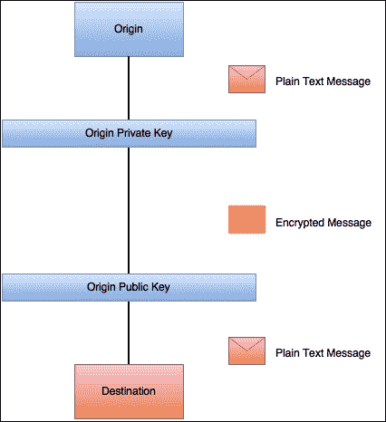
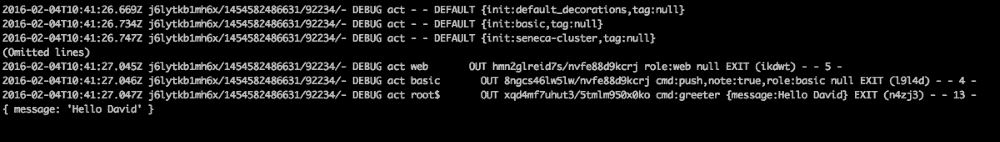

# 五、安全性和可追溯性

**安全性**是当今系统中最受关注的问题之一。 从大的公司泄露的信息量令人担忧，尤其是因为 90%的信息泄露可以通过软件开发人员非常小的行动加以弥补。 在事件记录和错误跟踪方面也会发生类似的情况。 没有人真正关注太多，直到有人请求您没有的日志，以便审计失败。 在本章中，我们将讨论如何管理安全和日志，以使我们的系统是安全的和可追踪的，借助以下主题:

*   **基础设施逻辑安全**:我们将讨论如何保护我们的软件基础设施，以便在我们的通信中提供行业标准的安全层。
*   **应用程序安全性**:我们将介绍保护应用程序的常用技术。 输出编码或输入验证等实践是行业标准，它们可以使我们免于灾难。
*   **可跟踪性**:能够跟踪系统周围的请求在微服务体系结构中是必须的。 我们将利用这一任务，向塞内加学习如何从这个奇妙的框架中获取信息。
*   **审计**:即使我们尽最大努力构建软件，事故还是会发生。 重建调用序列并准确查看发生了什么是很重要的。 我们将讨论如何使我们的系统能够恢复所需的信息。

# 基础设施逻辑安全

基础设施安全性通常被软件工程师忽略，因为它与他们的专业领域完全不同。 然而，如今，特别是如果您的职业生涯倾向于 DevOps，这是一个不应该被忽视的主题。

在这本书中，我们不打算深入了解基础设施安全问题，而只是通过一些经验法则来保证微服务的安全。

强烈建议读者阅读和学习有关密码学和有关 SSH 使用的所有含义，它是当今保持通信安全的主要资源之一。

## SSH -加密通信

在任何组织中，都有一个能够访问某些服务的人员的严格列表。 通常，这些服务的身份验证是通过用户名和密码完成的，但也可以使用*验证用户*的身份的键来完成。

无论使用什么身份验证方法，通信都应该通过安全通道进行，例如**SSH**。

**SSH**代表**Secure Shell**，它是一个用于访问远程机器中的 Shell 的软件，但它也可以是一个非常有用的工具，用于创建代理和隧道访问远程服务器。

让我们用下面的命令来解释它是如何工作的:

```js
/home/david:(develop) *x* ssh david@192.168.0.1
The authenticity of host '192.168.0.1 (192.168.0.1)' can't be established.
RSA key fingerprint is SHA256:S22/A2/eqxSqkS4VfR1BrcDxNX1rmfM1JkZaGhrjMbk.
Are you sure you want to continue connecting (yes/no)? yes
Warning: Permanently added '192.168.0.1' (RSA) to the list of known hosts.
vagrant@192.168.0.1's password:
Last login: Mon Jan 25 02:30:21 2016 from 10.0.2.2
Welcome to your virtual machine.

```

在本例中，我使用**Vagrant**来方便构建虚拟机。 Vagrant 是一个非常流行的工具，用于自动化开发环境，其网站([https://www.vagrantup.com/](https://www.vagrantup.com/))包含有用的信息。

在第一行中，我们执行`ssh david@192.168.0.1`命令。 这个命令尝试在`192.168.0.1`主机中以用户`david`的身份打开一个终端。

由于这是第一次对 IP`192.168.0.1`中的机器执行此命令，我们的计算机将不会信任远程服务器。

这是通过在本例中的`/home/david/.ssh/known_hosts`文件夹下维护一个名为`known_hosts`的文件来实现的(这取决于用户)。

该文件是具有相应密钥的主机列表。 可以看到，下面两行说明了*主机不能被信任*，并提供远程服务器持有的密钥的指纹，以便验证它:

```js
The authenticity of host '192.168.0.1 (192.168.0.1)' can't be established.
RSA key fingerprint is SHA256:S22/A2/eqxSqkS4VfR1BrcDxNX1rmfM1JkZaGhrjMbk.

```

此时，用户应该通过检查密钥来验证服务器的身份。 一旦完成，我们可以指示 SSH 连接到服务器，这将导致以下日志打印:

```js
Warning: Permanently added '192.168.0.1' (RSA) to the list of known hosts.

```

现在，如果我们检查我们的`known_hosts`文件，我们可以看到键已经被添加到列表中，如下所示:


这个存储在`known_hosts`文件中的密钥是远程服务器的公钥。

SSH 使用**密码算法**，称为**RSA**。 该算法是围绕**非对称密码**的概念构建的，如下图所示:



非对称密码学依赖于一组密钥:一个公钥，一个私钥。 正如其名称所述，公钥可以与所有人共享; 然而，私钥必须保密。

用私钥加密的消息只能用公钥和其他方法解密，所以几乎不可能(除非有人得到了密钥的另一半)拦截和解密消息。

此时，我们的计算机知道服务器的公钥，我们可以开始与服务器进行加密会话。 一旦我们得到终端，所有的命令和这些命令的结果将被加密并通过网络发送。

此密钥也可用于连接到远程服务器而无需密码。 我们只需要在机器中生成一个 SSH 密钥，并将其安装到服务器的`.ssh`文件夹下名为`authorized_keys`的文件中，`known_hosts`文件就在这个文件夹下。

在使用微服务时，您可以远程登录到许多不同的机器，因此这种方法变得更有吸引力。 然而，我们需要非常小心地处理私钥，因为如果用户泄露了私钥，我们的基础设施可能会受到损害。

# 应用安全

应用安全变得越来越重要。 由于云计算正在成为大公司基础设施的实际标准，我们不能依赖于数据被限制在单个数据中心的事实。

通常，当一个人开始一项新业务时，主要的关注点是从功能的角度来构建产品。 安全性不是主要的关注点，而且常常被忽视。

这是一种非常危险的做法，我们将通过让读者知道可能危及我们应用程序的主要安全威胁来修正它。

以安全的方式开发应用程序的四大安全要点如下:

*   注射
*   跨站点脚本编制
*   跨站请求伪造令牌保护
*   开放的重定向

在本节的最后，我们将能够识别出主要的漏洞，但我们将无法防范恶意攻击者。 一般来说，软件工程师应该像了解新技术一样了解最新的安全性。 无论你构建的产品有多好，如果它不安全，就会有人发现并利用它。

## 常见的威胁-如何更新

如前所述，安全性是应用程序开发中的一个持续主题。 无论您构建的是哪种类型的软件，都会存在安全隐患。

在我的职业生涯中，我发现在不需要成为一名全职的安全工程师的情况下，了解 web 开发的最新安全性的最好方法是遵循**OWASP**项目。 **OWASP**代表**开放 Web 应用程序安全项目**，它们每年都会生成一个非常有趣的文档，称为 OWASP Top 10。

### 注意事项

OWASP Top 10 首次发布于 2003 年，其目标是提高开发社区对应用程序开发中最常见的威胁的认识。

在前一节中，我们确定了软件开发人员可能面临的四个主要安全问题，所有这些问题都将在下一节中提到。

### 注射剂

**注射**是目前为止我们可能面临的最危险的攻击。 具体来说，SQL 注入是影响应用程序的最常见的注入形式，它由攻击者在我们的应用程序查询中强制执行 SQL 代码组成，从而导致可能危及我们公司数据的另一个查询。

还有其他类型的注入，但我们将集中讨论 SQL 注入，因为现代世界中几乎每个应用程序都使用关系数据库。

SQL 注入包括通过未经验证的数据源(如 web 表单或任意文本输入的任何其他数据源)的输入或操作应用程序中的 SQL 查询。

让我们考虑下面的例子:

```js
SELECT * FROM users WHERE username = 'username' AND password = 'password'

```

### 提示

千万不要在数据库中以明文形式存储密码。 一定要把它们切碎，加盐，以避免彩虹桌被攻击。 这只是一个例子。

该查询将为我们提供与给定名称和密码对应的用户。 为了从客户端的输入构建查询，我们可以考虑做一些类似于以下代码的事情，作为一个好主意:

```js
var express = require('express');
var app = express();
var mysql      = require('mysql');

var connection = mysql.createConnection({
  host     : 'localhost',
  user     : 'me',
  password : 'secret',
  database : 'test_db'
});

app.get('/login', function(req, res) {
  var username = req.param("username");
  var password = req.param("password");

  connection.connect();
  var query = "SELECT * FROM users WHERE username = '" + username + "' AND password = '" + password + "'";
  connection.query(query, function(err, rows, fields) {
    if (err) throw err;
    res.send(rows);
  });
  connection.end();
});

app.listen(3000, function() {
  console.log("Application running in port 3000.");
});
```

乍一看,它看起来像一个简单的程序,访问数据库名为`test_db`和问题查询来检查是否有匹配的用户的用户名和密码,让它回到客户如果我们打开浏览器,尝试浏览到`http://localhost:3000/login?username=david&password=mypassword`URL, 浏览器会用下面的查询结果渲染一个 JSON 对象:

```js
SELECT * FROM users WHERE username = 'david' AND password = 'mypassword'

```

还没有什么奇怪的，但如果客户试图黑我们怎么办?

看看下面的输入:

`http://localhost:3000/login?username=' OR 1=1 --&password=mypassword`

正如你所看到的，由它生成的查询是以下代码:

```js
SELECT * FROM users WHERE username = '' OR 1=1 -- AND password = 'mypassword'

```

在 SQL 中，使用`--`字符序列来注释行的其余部分，以便有效的查询如下所示:

```js
SELECT * FROM users WHERE username='' OR 1=1

```

这个查询返回完整的用户列表，如果我们的软件使用这个查询的结果来解决用户是否应该登录，我们就遇到了一些严重的问题。 我们刚刚授予一个甚至不知道有效用户名的人访问我们系统的权限。

这是 SQL 注入如何影响我们的众多例子之一。

在这种情况下，很明显我们将不可信的数据(来自用户)连接到查询中，但是请相信我，当软件变得更复杂时，它并不总是容易识别。

避免 SQL注入的一种方法是使用准备好的语句。

#### 输入验证

应用程序主要通过表单与用户交互。 这些表单通常包含自由文本输入字段，这可能导致攻击。

防止损坏数据进入服务器的最简单方法是通过输入验证，正如名称所示，这包括验证来自用户的输入，以避免前面描述的情况。

输入验证有两种类型，如下所示:

*   白色的清单
*   黑色的清单

**黑名单**是一种危险技术。 在大多数情况下，试图定义输入中什么是不正确的要比简单地定义我们所期望的花费更多的精力。

推荐的方法是(总是)**白名单**来自用户的数据,验证通过使用正则表达式:我们知道一个电话号码的样子,我们也知道用户名应该是什么样的,等等。

输入验证并不总是那么容易。 如果您曾经遇到过电子邮件的验证，您就会知道我在说什么:验证电子邮件的正则表达式一点也不简单。

没有一种简单的方法来验证一些数据的事实不应该限制我们这样做，因为输入验证的遗漏可能会导致严重的安全漏洞。

输入验证不是 SQL 注入的灵丹妙药，但它也有助于应对其他安全威胁，如跨站点脚本编写。

在上一节的查询中，我们做了一些相当危险的事情:将用户输入连接到查询中。

一种解决方案可能是使用某种类型的转义库来清理用户的输入，如下所示:

```js
app.get('/login', function(req, res) {
  var username = req.param("username");
  var password = req.param("password");

  connection.connect();
  var query = "SELECT * FROM users WHERE username = '" + connection.escape(username) + "' AND password = '" + connection.escape(password) + "'";
  connection.query(query, function(err, rows, fields) {
    if (err) throw err;
    res.send(rows);
  });
  connection.end();
});
```

在本例中，使用的`mysql`库提供了一组转义字符串的方法。 让我们看看它是如何工作的:

```js
var mysql = require('mysql');
var connection = mysql.createConnection({
  host: 'localhost',
  username: 'root',
  password: 'root'
});

console.log(connection.escape("' OR 1=1 --"))
```

前面的小脚本转义了前面示例中提供的字符串`username`，结果是`\' OR 1=1 --`。

如您所见，`escape()`方法已经替换了危险字符，清除了用户的输入。

### 跨站点脚本

**跨站脚本**，又称**XSS**，是一种主要影响 web 应用的安全漏洞。 这是最常见的安全问题之一，对客户的影响可能是巨大的，因为有人可能通过这种攻击窃取用户身份。

这种攻击是向第三方网站注入代码，可以从客户端浏览器窃取数据。 有几种方法可以做到这一点，但到目前为止，最常见的是来自客户机的未转义输入。

在互联网上很少有网站，用户可以添加包含任意输入的评论。 这个任意输入可以包含从远程服务器加载 JavaScript 的脚本标记，远程服务器可以窃取会话 cookie(或其他类型的有价值的信息)，让攻击者在远程机器上复制用户会话。

XSS 有两种主要的类型:**持续性**和**非持续性**。

XSS 的**持久**类型由制作一个特定的文本字符串来存储 XSS 攻击，该文本字符串一旦在网站上显示给用户，就会被解析为攻击。 这段代码可以通过存储在数据库中的任意输入文本(如论坛中的评论)注入。

XSS 的**非持久性**类型是由于错误的数据处理而将攻击插入到应用程序的非持久性部分。

让我们来看看下面的截图:


如你所见，我们已经在[http://www.amazon.co.uk/](http://www.amazon.co.uk/)中搜索了一本书(这本书)。 它不产生任何输出(因为这本书还没有出版)，但它指定**您的搜索“microservices nodejs”不匹配任何产品**，这是以某种方式使用来自 web 浏览器的输入作为输出。 甚至，当我点击搜索时，亚马逊将我重定向到以下 URL:

[http://www.amazon.co.uk/s/ref=nb_sb_noss?url=search-alias%3Daps&field-keywords=microservices+nodejs](http://www.amazon.co.uk/s/ref=nb_sb_noss?url=search-alias%3Daps&field-keywords=microservices+nodejs)

我们知道亚马逊是安全的,但是如果是明智的 XSS 攻击,我们可以修改`field-keywords`的值参数工艺请求注入脚本标记的内容,导致攻击者能够窃取会话 cookie,可能导致部分网站严重的问题。

#### 输出编码

防止这种攻击的一种方法是输出编码。 我们在本章的*Input validation*小节中使用了`connection.escape()`。 公平地说，我们应该验证从用户输入的所有数据，并编码来自第三方的所有输出。 这包括用户输入的，以及来自系统外部的信息源。

当把问题缩小到 web 开发时，我们必须意识到需要输出编码的三个不同领域:

*   CSS
*   JavaScript
*   超文本标记语言

问题最严重的两个是 JavaScript 和 HTML，攻击者可以很容易地窃取信息。

通常，无论我们使用哪个框架来构建应用程序，它总是有函数来编码输出。

### 跨站请求伪造

**跨站点请求伪造**(**CSRF**)是跨站点请求脚本的反向。 在跨站点请求脚本中，问题在于客户端信任来自服务器的数据。 对于跨站点请求伪造，问题在于服务器信任来自客户机的数据。

在窃取会话 cookie 后，攻击者不仅可以窃取用户的信息，还可以修改与该 cookie 相关联的账户信息。

这是通过通过 HTTP 请求将数据发送到服务器来完成的。

HTTP 用方法对其请求进行分类。 方法基本上用于指定请求所要执行的操作。 最有趣的四种方法如下:

*   `GET`:从服务器获取数据。 它不应该修改任何持久数据。
*   `POST`:在服务器上创建一个资源。
*   `PUT`:更新服务器中的资源。
*   `DELETE`:从服务器上删除资源。

还有更多的方法(如`PATCH`或`CONNECT`)，但我们只关注这四个。 如您所见，这四个方法中的三个修改来自服务器的数据，具有有效会话的用户可能会窃取数据、创建支付、订购商品，等等。

避免跨站点请求伪造攻击的一种方法是使用跨站点请求令牌保护`POST`、`PUT`和`DELETE`端点。

看看下面的 HTML 表单:

```js
<form action="/register" method="post">
  <input name="email" type="text" />
  <input name="password" type="password" />
</form>
```

此表格描述了一种完全有效的情况:用户在我们的网站注册; 非常简单，但仍然有效和有缺陷。

我们指定一个 URL 和预计参数的列表,这样攻击者可以成百上千的注册账户的分钟内,与一个小脚本问题`POST`请求的两个参数(`email`和`password`)。

现在，看看下面的形式:

```js
<form action="/register" method="post">
  <input name="email" type="text" />
  <input name="password" type="password" />
  <input name="csrftoken" type="hidden" value="as7d6fasd678f5a5sf5asf" />
</form>
```

您可以看到其中的区别:这里有一个额外的隐藏参数`csrftoken`。

这个参数是一个随机字符串，每次呈现一个表单时都会生成它，这样我们就可以把这个额外的参数添加到每个表单中。

提交表单后，将验证`csrftoken`参数，使其只通过具有有效令牌的请求，并生成一个新的令牌，以便再次在页面上呈现。

### 打开重定向

有时，我们的应用程序可能需要将用户重定向到某个 URL。 例如，当用户在没有有效认证的情况下点击一个私有 URL 时，用户通常会被重定向到登录页面:

`http://www.mysite.com/my-private-page`

这可能导致重定向到以下内容:

`http://www.mysite.com/login?redirect=/my-private-page`

这听起来合法。 用户被发送到登录页面，一旦他提供了一组有效的凭据，它就被重定向到`/my-private-page`。

如果有人试图窃取我们用户的帐户会发生什么?

看看下面的请求:

`http://www.mysite.com/login?redirect=http://myslte.com`

这是一个精心设计的请求，将用户重定向到`myslte.com`而不是`mysite.com`(注意是`l`而不是`i`)。

有人可能会把`myslte.com`弄得像`mysite.com`的登录页面，然后在社交媒体上散布之前的 URL，窃取用户的密码和用户名，用户会被重定向到一个恶意页面。

解决上述问题的方法很简单:不要将用户重定向到不可信的第三方网站。

同样，执行此类任务的最佳方法是白名单重定向的目标主机。 基本上，我们不会让我们的软件把客户导向未知的网站。

## 有效的代码评审

减少应用程序中安全性缺陷的最有效的方法之一是通过一个系统的、知情的代码审查过程。 代码审查的问题是，它们最终总是成为意见和个人偏好的转储区，这不仅不会提高代码的质量，而且还会导致最后一刻的更改，从而暴露我们应用程序中的漏洞。

在产品开发生命周期中，一个专门用于安全性代码审查的阶段有助于极大地减少交付到生产环境中的 bug 数量。

软件工程师所面临的问题是，他们的思维被训练成构建工作良好的东西，但他们没有找到缺陷的心态，特别是围绕他们构建的东西。 这就是为什么您不应该测试您自己的代码(不应该测试开发时进行的测试)，更不应该测试您的应用程序的安全性。

然而，我们通常在团队中工作，这使我们能够审查其他人的代码，但我们必须以有效的方式进行。

代码审查需要和编写软件一样多的脑力，特别是当你审查一个复杂的代码时。 你不应该花超过两个小时来检查相同的功能，否则重要的缺陷会被忽略，对细节的关注会降低到令人担忧的程度。

在基于微服务的体系结构中，这不是一个大问题，因为功能应该足够小，可以在合理的时间内阅读，特别是当您与作者讨论他试图构建的内容时。

你应该遵循两个阶段的审查，如下所示:

*   快速检查代码以了解全局情况:它是如何工作的，它使用了哪些您不熟悉的技术，它是否做了它应该做的事情，等等
*   按照要查找的项清单检查代码

这个项目列表必须预先决定，并且取决于您公司正在构建的软件的性质。

通常，在代码审查期间，围绕代码安全问题进行检查的项目列表是相当大的，但我们可以将其缩小到以下组件:

*   所有输入是否经过验证/编码?
*   是否对所有输出进行了编码，包括日志?
*   我们是否使用跨站点请求伪造令牌来保护端点?
*   数据库中的所有用户凭据都加密或散列了吗?

如果我们检查这个列表，我们将能够确定我们的应用程序中最大的安全问题。

# 可追溯性

在现代信息系统中，可追溯性是极其重要的。 在微服务中，这是一个微妙的问题，而 Seneca 巧妙地解决了这个问题，使得请求可以很容易地跟随我们的系统，这样我们就可以审计故障。

## 日志

塞内加很擅长伐木。 在 Seneca 中可以配置许多选项，以便获得关于一切如何工作(是否工作)的必要信息。

让我们看看日志是如何在一个小应用程序中工作的:

```js
var seneca = require("seneca")();

seneca.add({cmd: "greeter"}, function(args, callback){
  callback(null, {message: "Hello " + args.name});
});

seneca.act({cmd: "greeter", name: "David"}, function(err, result) {
  console.log(result);
});
```

这是可以编写的最简单的 Seneca 应用程序。 让我们这样运行它:

```js
seneca  node index.js
2016-02-01T09:55:40.962Z 3rhomq69cbe0/1454579740947/84217/- INFO hello Seneca/1.0.0/3rhomq69cbe0/1454579740947/84217/-
{ message: 'Hello David' }

```

这是使用默认日志记录配置运行应用程序的结果。 除了我们在代码中使用的`console.log()`方法外，还有一些关于记录 Seneca 的内部信息。 有时，您可能希望只记录应用程序产生的内容，以便调试应用程序时不会出现任何杂音。 在这种情况下，只需运行以下命令:

```js
seneca  node index.js --seneca.log.quiet
{ message: 'Hello David' }

```

但是，有时候，系统中会有一些奇怪的行为(或者使用的框架中有一个 bug)，而您想要获得关于发生了什么事情的所有信息。 Seneca 也支持它，如下面的命令所示:

```js
seneca  node index.js --seneca.log.print

```

前面的命令将打印大量可能没有帮助的信息。

为了减少 Seneca 产生的日志量，有一个细粒度的控制可以将什么记录到输出中。 让我们来看看下面几行:

```js
2016-02-01T10:00:07.191Z dyy9ixcavqu4/1454580006885/85010/- DEBUG register install transport {exports:[transport/utils]} seneca-8t1dup
2016-02-01T10:00:07.305Z dyy9ixcavqu4/1454580006885/85010/- DEBUG register init seneca-y9os9j
2016-02-01T10:00:07.305Z dyy9ixcavqu4/1454580006885/85010/- DEBUG plugin seneca-y9os9j DEFINE {}
2016-02-01T10:00:07.330Z dyy9ixcavqu4/1454580006885/85010/- DEBUG act root$       IN o5onzziv9i7a/b7dtf6v1u9sq cmd:greeter {cmd:greeter,name:David} ENTRY (mnb89) - - -

```

它们是前面代码示例中日志输出的随机行，但它会给我们提供有用的信息:这些条目是针对 Seneca 框架中不同操作(如插件、寄存器和动作)的调试级别日志行。 为了过滤它们，Seneca 提供了控制我们想要看到的关卡或动作的方法。 考虑以下例子:

```js
node index.js --seneca.log=level:INFO

```

这将只输出与`INFO`级别相关的日志:

```js
seneca  node index.js --seneca.log=level:INFO
2016-02-04T10:39:04.685Z q6wnh8qmm1l3/1454582344670/91823/- INFO hello Seneca/1.0.0/q6wnh8qmm1l3/1454582344670/91823/-
{ message: 'Hello David' }

```

您还可以通过操作类型进行过滤，这非常有趣。 当您使用微服务时，了解流中发生的事件链是审计故障时需要了解的第一件事。 有了 Seneca 提供给我们的对日志记录的控制，就像执行以下命令一样简单:

```js
node index.js --seneca.log=type:act

```

这将产生以下输出:



如您所见，前面所有的行对应于`act`类型，甚至更多，如果我们从上到下遵循命令的输出，我们确切地知道 Seneca 响应的事件序列及其顺序。

## 跟踪请求

追踪请求也是一项非常重要的活动，有时甚至是一项法律要求，尤其是如果你在金融界工作的话。 同样，Seneca 在跟踪请求方面非常出色。 对于每次调用，Seneca 都会生成一个唯一的标识符。 这个标识符可以被跟踪到调用的所有路径，如下所示:

```js
var seneca = require("seneca")();

seneca.add({cmd: "greeter"}, function(args, callback){
  console.log(this.fixedargs['tx$']);
  callback(null, {message: "Hello " + args.name});
});
seneca.act({cmd: "greeter", name: "David"}, function(err, result) {
  console.log(this.fixedargs['tx$']);
});
```

这里，我们将一个字典记录到终端，该字典包含 Seneca 中的事务 ID。 因此，如果我们执行它，我们将得到以下输出:

```js
2016-02-04T10:58:07.570Z zl0u7hj3hbeg/1454583487555/95159/- INFO hello Seneca/1.0.0/zl0u7hj3hbeg/1454583487555/95159/-
3jlroj2n91da
3jlroj2n91da

```

您可以看到 Seneca 中的所有请求是如何被跟踪的:框架分配一个 ID 并跨端点传播它。 在这种情况下，我们所有的端点都在本地机器中，但是如果我们将它们分布在不同的机器中，ID 仍然是相同的。

这个惟一的 ID,我们将能够重建的旅程中的客户数据系统,和订购请求时间戳相关联,我们可以得到一个准确的用户在做什么,多少时间做每一个动作,可能是什么问题延误,等等。 通常，结合断路器输出信息的测井可以让工程师在非常短的时间内解决问题。

## 审计

到目前为止，我们一直在使用将数据输出到日志中。 这是一种糟糕的做法。 它打破了日志的格式，并将内容抛出到标准输出。

塞内加又来了:

```js
var seneca = require("seneca")();

seneca.add({cmd: "greeter"}, function(args, callback){
  this.log.warn(this.fixedargs['tx$']);
  callback(null, {message: "Hello " + args.name});
});

seneca.act({cmd: "greeter", name: "David"}, function(err, result) {
  this.log.warn(this.fixedargs['tx$']);
});
```

让我们看看塞内加的输出:

```js
seneca  node index.js
2016-02-04T11:17:28.772Z wo10oa299tub/1454584648758/98550/- INFO hello Seneca/1.0.0/wo10oa299tub/1454584648758/98550/-
2016-02-04T11:17:29.156Z wo10oa299tub/1454584648758/98550/- WARN - - ACT 02jlpyiux70s/9ca086d19x7n cmd:greeter 9ca086d19x7n
2016-02-04T11:17:29.157Z wo10oa299tub/1454584648758/98550/- WARN - - ACT 02jlpyiux70s/9ca086d19x7n cmd:greeter 9ca086d19x7n

```

如您所见，我们现在正在使用记录器输出事务 ID。 我们生成了一条`WARN`消息，而不是简单的控制台转储。 从现在开始，我们可以使用 Seneca 日志过滤器来隐藏我们动作的输出，以便专注于我们想要找到的东西。

Seneca 提供了以下五种级别的日志记录:

*   **DEBUG**:这用于在开发应用程序时调试应用程序，也用于跟踪生产系统中的问题。
*   **INFO**:该日志级别用于产生关于事件的重要消息，例如事务已经启动或完成。
*   **WARN**:这是警告级别。 我们在系统发生不好的事情时使用它，但它不是关键的，用户通常不会受到影响; 然而，它是一个迹象，某事正在以错误的方式进行。
*   **ERROR**:用于记录错误。 通常，用户会受到它的影响，它也会中断流。
*   **FATAL**:这是最致命的级别。 它只在发生不可恢复的错误，系统无法正常运行时使用。

产生不同级别日志的一种方法是使用相关的函数。 正如我们前面看到的，我们调用`this.log.warn()`来记录警告。 如果我们调用`this.log.fatal()`方法，我们将记录一个致命错误，其他级别也是如此。

### 提示

尝试将应用程序中的日志作为开发过程的一部分来调整，否则当生产中出现不良情况时，您将为缺乏信息而感到遗憾。

一般来说，INFO、DEBUG 和 WARN 是最常用的日志级别。

## HTTP 代码

HTTP 代码经常被忽略，但是它们是标准化远程服务器响应的一个非常重要的机制。

当一个程序(或用户)向服务器发出请求时，可能会发生以下几件事:

*   它可能会成功
*   它可能无法验证
*   它可能会产生一个服务器错误

如你所见，可能性是无穷的。 我们现在的问题是，HTTP 是为机器之间的通信而创建的。 我们如何处理机器会读取这些代码的事实?

HTTP 以一种非常优雅的方式解决了这个问题:每个请求都必须用 HTTP 代码来解决，这些代码具有指示代码性质的范围。

### 1xx -信息

在100-199 范围内的代码纯粹是信息。 这个范围内最有趣的代码是 102 代码。 这段代码用于指定一个操作正在后台进行，并且可能需要一些时间才能完成。

### 2xx -成功码

成功码用于表示 HTTP 请求中的某一成功级别。 它是最常见的(也是最需要的)代码。

这个范围内最常见的代码如下:

*   `200: Success`:此代码表示完全成功。 一点问题都没有。
*   `201: Created`:该代码主要用于 REST api，当客户端请求在服务器上创建一个新实体时。
*   `203: Non-authoritative information`:此代码用于在通过转换代理路由请求时，源端以 200 响应。
*   `204: No Content`:这是一个成功的代码，但是没有从服务器返回内容。 有时，api 返回 200，即使没有内容。
*   `206: Partial Content`:此代码用于分页响应。 发送一个报头，指定客户端将接受的范围(和偏移量)。 如果响应大于范围，服务器将回复 206，这表明还有更多的数据。

### 3xx -重定向

在 300到 399 范围内的代码表明客户端必须采取一些额外的操作来完成请求。

这个范围内最常见的代码描述如下:

*   `301: Moved permanently`:此状态码指示客户端试图获取的资源已永久移动到另一个位置。
*   `302: Found`:这段代码表示由于某些原因，用户需要执行临时重定向，但浏览器开始将此代码实现为`303 See Other`。 这导致了 303 和`307 Temporary redirect`代码的引入，以消除行为重叠的歧义。
*   `308 Permanent Redirect`:正如其名所示，此代码用于指定资源的永久重定向。 它可能会与 301 混淆，但有一个小的区别，308 代码不允许 HTTP 方法更改。

### 4xx -客户机错误

400 到 499 范围内的代码表示由客户端生成的错误。 他们指出这个请求有问题。 这个范围特别重要，因为它是 HTTP 服务器向客户端指示其请求出错的方式。

此范围内的常用代码如下:

*   `400 Bad Request`:这段代码表明来自用户的请求语法不正确。 可能缺少参数或某些值没有通过验证。
*   `401 Unauthorized`:此代码表示缺少客户端身份验证。 通常，有效的登录将解决这个问题。
*   `403 Forbidden`:这与 401 类似，但在本例中，它表示用户没有足够的特权。
*   `404 Not Found`:这意味着在服务器中找不到该资源。 这是导航到不存在的页面时遇到的错误。

### 5xx -服务器错误

此范围表明服务器中出现了处理错误。 当发出 5xx 代码时，这意味着服务器中存在某种问题，并且无法从客户端修复。

在这个范围内的一些代码如下:

*   `500 Internal Server Error`:这意味着服务器中的软件发生了错误。 目前没有更多的信息披露。
*   `501 Not Implemented`:当客户端到达尚未实现的端点时发生此错误。
*   `503 Service unavailable`:此代码在服务器由于某些原因不可用时发出，比如超负荷或服务器关闭。

### 为什么 HTTP 代码在微服务中很重要

流行的谚语*不要重复发明轮子*是我在构建软件时最喜欢的原则之一。 HTTP 代码是一种标准，因此每个人都理解不同代码的后果。

在构建微服务时，您总是需要记住，您的系统将与代理、缓存和其他已经使用 HTTP 的服务交互，以便它们能够根据服务器的响应做出响应。

最好的例子就是断路器模式。 不管你如何实现它，也不管你使用什么软件，一个断路器必须明白一个包含 500 个代码的 HTTP 请求是一个错误，所以它可以相应地打开电路。

一般来说，保持应用程序的代码尽可能准确是一个好做法，因为从长远来看，这对您的系统有好处。

# 小结

在本章中，您已经学习了如何构建安全软件(不仅仅是微服务)，尽管这是一个足够写一本书的主题。 安全的问题是，公司通常认为投资安全是烧钱，但这与现实相去甚远。 我是 80-20 规则的忠实粉丝:20%的时间将提供 80%的功能，20%的功能缺失将需要 80%的时间。

在安全方面，我们的目标应该是 100%覆盖; 然而，本章所示的 80%将涵盖大多数情况。 无论如何，正如我前面提到的，软件工程师应该了解最新的安全性，因为应用程序安全性中的缺陷是最容易杀死公司的方法。

我们还讨论了可跟踪性和日志记录，这是现代软件工程中最容易被忽视的主题之一，而这些主题正变得越来越重要，尤其是当您的软件使用微服务方法构建时。