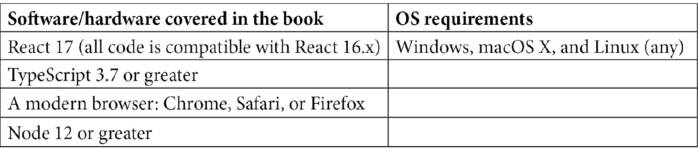

# 零、序言

据最大的开源软件库 GitHub 称，JavaScript 仍然是世界上最流行的编程语言。使用 JavaScript 编写的项目比任何其他语言都多。即使是通常与 web 无关的项目，如机器学习和加密货币，也经常使用 JavaScript。

JavaScript 编程语言功能强大，功能强大，但除了该语言之外，还有一些框架，包括 React 和 Node，它们增加了该语言的功能，使它变得更好。除此之外，TypeScript 现在已经成为执行大型 JavaScript 项目的标准。它提供了一些语言特性，使使用 JavaScript 编写代码更高效，更适合大型应用。

近年来，现代 web 开发取得了巨大的进步。在过去，客户端代码通常意味着静态 HTML 和 CSS，可能还有一点点 JavaScript。后端通常使用完全不同的语言编写，如 PHP 或 CGI 脚本。但是，现在只使用 JavaScript 及其相关框架编写从客户端到服务器的整个应用是很常见的。这种只使用单一语言编写应用的能力在开发过程中提供了巨大的好处。此外，可用的健壮和成熟的框架使 JavaScript 的全堆栈编程与任何其他平台都具有竞争力。

在本书中，我们将学习使用 JavaScript 的强大功能构建完整的全堆栈 web 应用。我们将用另一种强大的前十大语言 TypeScript 来增强这种能力。然后，使用 React、Redux、Node、Express 和 GraphQL 等框架，我们将构建一个现实的、功能齐全的最佳实践 web 应用，它将为您提供构建现代全堆栈 web 应用所需的所有知识。一旦我们的应用完成，我们将把它部署到 AWS 云服务，世界上最流行和功能最丰富的云服务提供商。

# 这本书是给谁的

这本书是为那些想要超越前端 web 开发，通过学习现代 web 技术以及它们如何结合而进入全栈 web 开发世界的 web 开发人员而写的。在开始阅读本 web 开发书之前，需要对 JavaScript 编程有很好的理解。

# 这本书涵盖的内容

[*第 1 章*](01.html#_idTextAnchor017)*理解 TypeScript*解释了什么是 TypeScript，以及什么使它非常适合用于大型应用开发。

[*第二章*](02.html#_idTextAnchor025)*探索TypeScript*深入TypeScript。我们将探讨它的特性，包括静态类型，以及为什么这些特性是对 JavaScript 的改进。我们还将介绍面向对象编程的应用设计，以及 TypeScript 特性如何支持这一重要的编程范式。

[*第 3 章*](03.html#_idTextAnchor052)*构建具有 ES6+功能的更好应用*回顾了每个开发人员都需要了解的 JavaScript 的重要功能。我们将重点介绍 ES6 及更高版本中添加的最新功能。

[*第 4 章*](04.html#_idTextAnchor072)*学习单页应用概念以及 React 如何实现这些概念*，解释了网站是如何构建的，重点关注单页应用风格的应用。然后我们将介绍 React 以及如何使用 React 创建单页应用。

[*第 5 章*](05.html#_idTextAnchor081)*用挂钩进行反应发展*深入反应。我们将了解编写 React 应用的旧类风格的局限性，以及挂钩和功能组件，以及它们是如何改进旧类风格的。

[*第 6 章*](06.html#_idTextAnchor091)*使用 create react app 和 Jest 测试*建立我们的项目，描述了开发 react 应用所使用的现代方法。这包括创建 React 项目的标准`create-react-app`，以及使用 Jest 和测试库进行客户端测试。

[*第 7 章*](07.html#_idTextAnchor110)*学习 Redux 和 React 路由*，介绍 Redux 和 React 路由，帮助我们构建 React 应用。这两个框架几乎自 React 成立以来就一直是管理状态和路由的热门框架。

[*第 8 章*](08.html#_idTextAnchor122)*使用 Node.js 和 Express*进行学习服务器端开发，包括 Node 和 Express。节点是使 JavaScript 服务器应用成为可能的底层运行时。Express 是一个围绕 Node 的框架，可以轻松地使用 Node 构建强大的服务器端应用。

[*第 9 章*](09.html#_idTextAnchor139)、*什么是 GraphQL？*回顾什么是 GraphQL，以及它如何使用数据模式帮助构建 web API。

[*第 10 章*](10.html#_idTextAnchor147)*建立一个具有 TypeScript 和 GraphQL 依赖关系的 Express 项目*，说明如何使用 TypeScript、Express、GraphQL 和 Jest 创建一个生产质量、服务器端项目进行测试。

[*第 11 章*](11.html#_idTextAnchor167)*我们将学习的内容——在线论坛应用*，讨论我们将构建的应用。我们将回顾它的功能，以及构建这样一个应用将如何帮助我们更详细地了解 web 开发。

[*第 12 章*](12.html#_idTextAnchor179)*为我们的在线论坛应用*构建 React 客户端，说明如何开始使用 React 对我们的应用客户端进行编码。我们将使用功能组件、挂钩和 Redux 来开始构建屏幕。

[*第 13 章*](13.html#_idTextAnchor208)*使用 Express 和 Redis*设置会话状态，探索什么是会话状态，以及如何使用世界上最强大的内存数据存储 Redis 为我们的服务器创建会话。我们也开始使用 Express 对服务器进行编码。

[*第 14 章*](14.html#_idTextAnchor216)*使用 typerform*设置 Postgres 和 Repository 层，说明如何为我们在 Postgres 中的应用创建数据库，以及如何使用强大的设计技术（称为 Repository Layer）访问数据库。

[*第 15 章*](15.html#_idTextAnchor222)*添加了 GraphQL 模式——第一部分*，开始将 GraphQL 集成到我们的应用中。我们将构建模式并添加查询和突变。我们还将开始向 React 前端添加 GraphQL 挂钩。

[*第 16 章*](16.html#_idTextAnchor254)*添加了 GraphQL 模式——第二部分*完成了将 GraphQL 集成到客户端和服务器的工作，从而完成了我们的应用。

[*第 17 章*](17.html#_idTextAnchor259)*向 AWS*部署应用，将我们完成的应用部署到 AWS 云服务。我们将使用 Ubuntu Linux 和 NGINX 来托管服务器和客户端代码。

# 充分利用这本书

您应该至少有一年或一年以上的现代语言编程经验，以及一些构建应用的基本知识，尽管这不一定是针对 web 的。



本书将提供有关使用或安装这些依赖项的分步说明。然而，这个列表确实给出了一些需要什么的想法。应用源代码将用于最终完成的应用版本。这本书将包括任何中间代码。

**如果您使用的是本书的数字版本，我们建议您自己键入代码或通过 GitHub 存储库访问代码（下一节提供链接）。这样做将帮助您避免与复制和粘贴代码相关的任何潜在错误。**

理想情况下，您应该始终努力自己键入代码，因为这将帮助您记住代码，并让您体验在出现问题时该怎么做。

# 下载示例代码文件

您可以从 GitHub 的[下载本书的示例代码文件 https://github.com/PacktPublishing/Full-Stack-React-TypeScript-and-Node](https://github.com/PacktPublishing/Full-Stack-React-TypeScript-and-Node) 。如果代码有更新，它将在现有 GitHub 存储库中更新。

我们的丰富书籍和视频目录中还有其他代码包，请访问[https://github.com/PacktPublishing/](https://github.com/PacktPublishing/) 。看看他们！

# 使用的约定

本书中使用了许多文本约定。

`Code in text`：表示文本中的码字、数据库表名、文件夹名、文件名、文件扩展名、路径名、虚拟 URL、用户输入和 Twitter 句柄。下面是一个示例：“在名为`Home.tsx`的`src`文件夹中创建一个新文件，并添加以下代码。”

代码块设置如下：

```js
let a = 5;
let b = '6';
console.log(a + b);
```

当我们希望提请您注意代码块的特定部分时，相关行或项目以粗体显示：

```js
[default]
exten => s,1,Dial(Zap/1|30)
exten => s,2,Voicemail(u100)
exten => s,102,Voicemail(b100)
exten => i,1,Voicemail(s0)
```

任何命令行输入或输出的编写方式如下：

```js
 npm install typescript
```

**粗体**：表示一个新术语、一个重要单词或您在屏幕上看到的单词。例如，菜单或对话框中的单词出现在文本中，如下所示。下面是一个示例：“从**管理**面板中选择**系统信息**

提示或重要提示

看起来像这样。

# 联系

我们欢迎读者的反馈。

**一般反馈**：如果您对本书的任何方面有疑问，请在邮件主题中注明书名，并发送电子邮件至[customercare@packtpub.com](mailto:customercare@packtpub.com)。

**勘误表**：尽管我们已尽一切努力确保内容的准确性，但还是会出现错误。如果您在本书中发现错误，如果您能向我们报告，我们将不胜感激。请访问[www.packtpub.com/support/errata](http://www.packtpub.com/support/errata)，选择您的书籍，单击 errata 提交表单链接，然后输入详细信息。

**盗版**：如果您在互联网上发现我们作品的任何形式的非法复制品，请您提供我们的位置地址或网站名称，我们将不胜感激。请致电[与我们联系 copyright@packt.com](mailto:copyright@packt.com)带有指向该材料的链接。

**如果您有兴趣成为一名作家**：如果您对某个主题有专业知识，并且您有兴趣撰写或贡献一本书，请访问[authors.packtpub.com](http://authors.packtpub.com)。

# 审查

请留下评论。一旦你阅读并使用了这本书，为什么不在你购买它的网站上留下评论呢？然后，潜在读者可以看到并使用您的无偏见意见做出购买决定，我们 Packt 可以了解您对我们产品的看法，我们的作者可以看到您对他们书籍的反馈。非常感谢。

有关 Packt 的更多信息，请访问[Packt.com。](http://packt.com.)