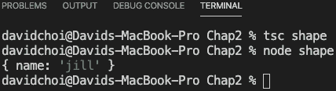
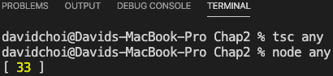
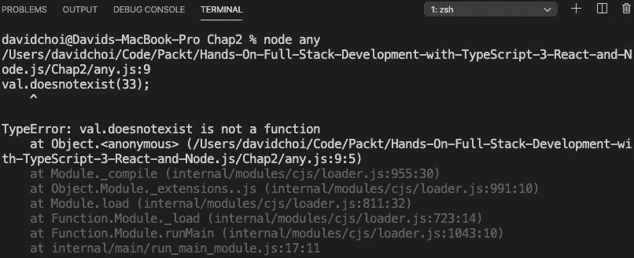
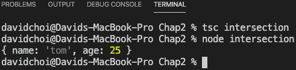
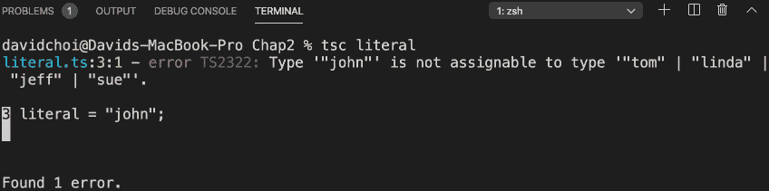
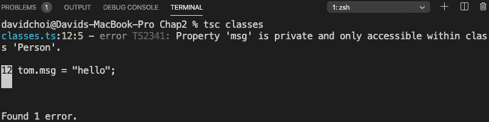
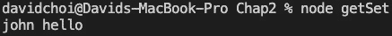
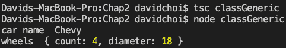

B15508_02_Final_JC_ePub

# *第 2 章*：探索字体

在本章中，我们将深入探讨 TypeScript 语言。我们将了解 TypeScript 的显式类型声明语法，以及 TypeScript 中的许多内置类型及其用途。

我们还将学习如何创建自己的类型，并根据面向对象的原则构建应用程序。最后，我们将回顾一些添加到该语言中的最新特性，例如可选链接和空合并。

在本章结束时，您将对 TypeScript 语言有很强的理解，这将使您能够轻松地阅读和理解现有的 TypeScript 代码。您还将对该语言有足够的了解，以生成高质量的代码，从而实现您的应用程序目标，并且是可靠的。

在本章中，我们将介绍以下主要主题：

*   什么类型？
*   探索类型脚本类型
*   理解类和接口
*   理解继承
*   学习泛型
*   学习最新功能并配置编译器

# 技术要求

本章要求与[*第一章*](01.html#_idTextAnchor017)*理解打字本*相同。您应该对 JavaScript 和 web 技术有基本的了解。您将再次使用 Node 和**Visual Studio 代码**（**VSCode**）。

GitHub 存储库再次位于[https://github.com/PacktPublishing/Full-Stack-React-TypeScript-and-Node](https://github.com/PacktPublishing/Full-Stack-React-TypeScript-and-Node) 。使用`Chap2`文件夹中的代码。

在继续之前，让我们为本章进行设置：

1.  转到您的`HandsOnTypeScript`文件夹，创建一个名为`Chap2`的新文件夹。
2.  打开 VSCode，进入**文件****打开**，然后打开刚才创建的`Chap2`文件夹。然后，选择**查看**|**终端**并在 VSCode 窗口内启用终端窗口。
3.  键入`npm init`命令，如[*第 1 章*](01.html#_idTextAnchor017)、*理解类型脚本*中所述，为`npm`初始化项目，并接受所有默认值。
4.  键入`npm install typescript`命令，如[*第 1 章*](01.html#_idTextAnchor017)*理解类型脚本*中所述，安装类型脚本。

现在我们准备开始了。

# 什么类型？

**类型**是一组可重用的规则。类型可能包括属性和功能（能力）。它还可以一次又一次地被共享和重用。当您重用一个类型时，您正在创建它的一个**实例**。这意味着您正在创建具有特定属性值的类型示例。顾名思义，在 TypeScript 中，类型非常重要。它们是最初创造这种语言的主要原因。让我们看看 TypeScript 的类型是如何工作的。

## 类型是如何工作的？

如前所述，JavaScript 确实有类型。数字、字符串、布尔值、数组等都是 JavaScript 中的类型。但是，这些类型在声明期间没有显式设置；它们仅在运行时被推断。在 TypeScript 中，类型通常在声明期间设置。允许编译器推断您的类型是可能的。但是，编译器选择的类型可能不是您想要的类型，因为它并不总是显而易见的。除了 JavaScript 支持的类型之外，TypeScript 还有自己独特的类型，还允许您创建自己的类型。

TypeScript 中的[T0]类型首先要认识到的是，它们是通过形状而不是类型名称来处理的。这意味着类型的名称对于 TypeScript 编译器并不重要，但它所具有的属性及其类型很重要。

让我们看一个例子：

1.  Create a file called `shape.ts` and add the following code:

    ```js
    class Person {
        name: string;
    }	
    const jill: { name: string } = {
        name: "jill"
    };
    const person: Person = jill;
    console.log(person);
    ```

    您应该注意的第一件事是，我们有一个名为`Person`的类，其属性名为`name`。下面是一个名为`jill`的变量，属于`{ name: string }`类型。这有点奇怪，因为正如您所看到的，这个类型声明不是实际的类型名；它更像是一个类型定义。但是编译器没有问题，也没有抱怨。在 TypeScript 中，可以同时定义和声明类型。此外，在下面，您可以看到另一个名为`Person`类型的`person`变量，我们将其设置为`jill`。同样，编译器没有抱怨，而且一切似乎都正常。

2.  Let's compile this code and run it to see what happens. Type the following lines in the terminal:

    ```js
    tsc shape
    node shape
    ```

    运行这些命令后，您将看到以下内容：



图 2.1–shape.ts 输出

正如您所看到的，代码编译并运行时没有问题。这表明，在 TypeScript 中，编译器查看类型的形状，而根本不关心其名称。您将在后面的章节中看到，随着我们对类型脚本类型的深入研究，为什么意识到这种行为如此重要。

# 探索打字脚本类型

在本节中，我们将了解 TypeScript 中可用的一些核心类型。使用这些类型将为您提供错误检查和编译器警告，这有助于改进代码。他们还将向您团队中的其他开发人员提供有关您的意图的信息。那么，让我们继续看看这些类型是如何工作的。

## 任何类型的

`any`类型为动态类型，可设置为任何其他类型。如果您将一个变量声明为为`any`类型，这意味着您可以将其设置为任何类型，并在以后将其重置为任何其他类型。它实际上不是类型，因为编译器不会代表您检查它。这是关于`any`需要记住的关键事实——编译器不会在开发时介入并警告您问题。因此，如果可能，应避免使用`any`类型。一种构建为静态类型的语言可能会有这样的特性，这似乎有些奇怪，但在某些情况下这是必要的。

在大型应用程序中，开发人员并不总是能够控制代码中的类型。例如，如果开发人员依赖 web 服务 API 调用来获取数据，那么该数据的类型可能由其他团队控制，甚至完全由另一家公司控制。在互操作过程中，当代码依赖于来自不同编程语言的数据时，情况也是如此——例如，当一家公司用另一种语言维护一个遗留系统，同时用另一种语言构建其新系统时。此类情况需要类型灵活性和类型系统的逃生舱口。

重要的是不要滥用类型。您应该小心，只有当您知道您没有其他选择时才使用它——例如，当类型信息不清楚或可能更改时。但是，除了使用`any`类型之外，还有一些替代方法。根据具体情况，您可以使用接口、泛型、联合或`unknown`类型。稍后我们将讨论其余的可能性，但现在，让我们接下来讨论一下`unknown`类型。

## 未知类型

`unknown`类型是在 TypeScript 版本 3 中发布的类型。它类似于`any`，因为一旦声明了此类型的变量，就可以为其设置任何类型的值。该值随后可以更改为任何其他类型。因此，我可以先将变量设置为字符串类型，然后再将其设置为数字。但是，如果不首先检查其类型，则不能调用其任何成员或将该变量设置为另一个变量的值。下面我将展示一个例子。只有当您将一个`unknown`类型设置为另一个`unknown`或`any`类型时，才可以在不首先检查其类型的情况下将`unknown`设置为其他类型。

让我们来看一个 TypeScript 的例子，然后我们将看到为什么使用 Type T1E.Type 类型（事实上，它是由 TeaT3 推荐的）。

1.  First, let's take a look at an example of the issue with using `any`. Go to VSCode and create a file called `any.ts`, and then type the following code:

    ```js
    let val: any = 22;
    val = "string value";
    val = new Array();
    val.push(33);
    console.log(val);
    ```

    如果使用以下命令运行此代码，将看到以下结果：

    

    图 2.2–任何运行结果

2.  由于`val`是`any`类型，我们可以将其设置为我们喜欢的任何类型，然后调用`push`，因为`push`是`Array`的一种方法。然而，这是显而易见的，因为作为开发人员，我们知道`Array`中有一个名为`push`的方法。如果我们意外地调用了`Array`上不存在的东西会怎么样？将以前的代码替换为以下代码：

    ```js
    let val: any = 22;
    val = "string value";
    val = new Array();
    val.doesnotexist(33);
    console.log(val);
    ```

3.  Now, run the TypeScript compiler again:

    ```js
    tsc any
    ```

    您将看到，不幸的是，编译器成功了，因为再次生成[T0]类型的内容会导致编译器不再检查该类型。此外，我们还丢失了 IntelliSense、VSCode 开发时代码高亮器和错误检测器。只有当我们尝试并运行代码 do时，我们才会得到任何迹象表明存在问题，而这绝不是我们想要的。如果我们现在尝试运行代码，如下图所示，它会立即失败：



图 2.3–任何故障

对于这个简单的例子，这个错误不太可能发生，但是在一个大型应用程序中，这是一个很容易犯的错误，即使错误只是简单地键入了一些内容。

让我们看一个使用`unknown`的类似示例：

1.  First, comment out your code inside of `any.ts` and delete the `any.js` file (as we will use the same variable names, if you do not, it will cause conflict errors).

    重要提示

    稍后我们将学习一种称为名称空间的东西，它可以消除此类冲突，但现在介绍它们还为时过早。

2.  Now, create a new file called `unknown.ts` and add the following code to it:

    ```js
    let val: unknown = 22;
    val = "string value";
    val = new Array();
    val.push(33);
    console.log(val);
    ```

    您会注意到 VSCode 给了一个错误，立即抱怨`push`函数。这很奇怪，因为显然，`Array`中有一个名为`push`的方法。此行为显示了[T3]类型的工作方式。您可以将 AutoT4E.Type 视为类似于标签的类型，而在标签下面是实际类型。但是，编译器无法自行确定类型，因此我们需要自己向编译器显式证明类型。

3.  We use type guards to prove that `val` is of a certain type:

    ```js
    let val: unknown = 22;
    val = "string value";
    val = new Array();
    if (val instanceof Array) {
        val.push(33);
    }
    console.log(val);
    ```

    正如您所看到的，我们已经用测试结束了我们的`push`调用，以查看`val`是否是`Array`的实例。

4.  一旦我们确定这是真的，对`push`的调用可以无误地进行，如所示：


图 2.4–未知

这个机制有点麻烦，因为我们总是在调用成员之前测试类型。但是，它仍然比使用[T0]类型更可取，而且由于编译器会检查它，因此更安全。

## 交叉和联合类型

还记得我们在开始这一节时说过 TypeScript 编译器关注的是类型形状而不是名称吗？这种机制允许 TypeScript 支持所谓的**交叉点**类型。这意味着 TypeScript 允许开发人员通过将多个不同类型合并在一起来“创建类型”。这很难想象，所以让我给你举个例子。如果您查看以下代码，您可以看到一个名为`obj`的变量，它有两种类型与之关联。您会记得，在 TypeScript 中，我们不仅可以将命名类型声明为变量的类型，还可以同时动态定义和声明类型。在下面的代码中，每个类型都是一个不同的类型，但使用`&`关键字将两者合并为一个类型：

```js
let obj: { name: string } & { age: number } = {
    name: 'tom',
    age: 25
}
```

让我们试着运行这段代码，并在控制台上显示结果。创建一个名为`intersection.ts`的新文件，并向其中添加以下代码：

```js
let obj: { name: string } & { age: number } = {
    name: 'tom',
    age: 25
}
console.log(obj);
```

如果编译并运行此代码，您将看到一个同时包含 name 和 age属性的对象：



图 2.5–交叉口结果

如您所见，IntelliSense 和编译器都接受代码，并且最终对象具有这两个属性。这是一种交叉点类型。

另一种类型类似，称为`union`型。在联合的情况下，我们不是合并类型，而是以“或”的方式使用它们，即一种类型或另一种类型。让我们看一个例子。创建一个名为`union.ts`的新文件，并向其中添加以下代码：

```js
let unionObj: null | { name: string } = null;
unionObj = { name: 'jon'};
console.log(unionObj);
```

通过使用`|`字符，将`unionObj`变量声明为空类型或`{ name: string }`。如果您编译并运行此代码，您将看到它接受两个类型值。此表示类型值可以为 null，也可以是`{ name: string }`类型的对象。

## 文字类型

**文字**类型类似于联合类型，但它们使用一组硬编码字符串或数字值。下面是一个简单的字符串文本示例，它是相当自解释的。如您所见，我们有一堆硬编码字符串作为类型。这意味着文字变量只接受与这些字符串相同的值：

```js
let literal: "tom" | "linda" | "jeff" | "sue" = "linda";
literal = "sue";
console.log(literal);
```

如您所见，编译器很乐意接收列表中的任何值，甚至可以重置它们。但是，它不允许设置不在列表中的值。这将导致编译错误。让我们看一个例子。通过将文字变量重置为`john`来更新代码，如图所示：

```js
let literal: "tom" | "linda" | "jeff" | "sue" = "linda";
literal = "sue";
literal = "john";
console.log(literal);
```

在这里，我们将文字变量设置为`john`，编译 gi时会出现以下错误：



图 2.6–文字错误

同样，数字文字也可以是，但值由数字而不是字符串组成。

## 类型别名

类型别名在 TypeScript 中使用非常频繁。这只是一种为类型赋予不同名称的方法，大多数情况下，它用于为某些复杂类型提供较短的简单名称。例如，这里有一种可能的用法：

```js
type Points = 20 | 30 | 40 | 50;
let score: Points = 20;
console.log(score);
```

在这段代码中，我们采用一个长的数值文本类型，并给它一个较短的名称`Points`。然后，我们将`score`声明为`Points`类型，并给它一个值`20`，这是`Points`的可能值之一。当然，如果我们试图将分数设为，比方说，`99`，编译就会失败。

别名的另一个示例是对象文字类型声明：

```js
type ComplexPerson = {
    name: string,
    age: number,
    birthday: Date,
    married: boolean,
    address: string
}
```

由于类型[T0]声明非常长，并且没有名称（例如，类会有名称），因此我们使用别名。类型别名可以用于 TypeScript 中的几乎任何类型，包括函数和泛型，我们将在本章后面进一步探讨。

## 函数返回类型

为了完整起见，我想展示一个函数返回声明的示例。这与典型的变量声明非常相似。创建一个名为`functionReturn.ts`的新文件，并将其添加到其中：

```js
function runMore(distance: number): number {
    return distance + 10;
}
```

`runMore`函数接受`number`类型的参数并返回一个数字。参数声明与任何变量声明一样，但函数返回位于括号之后，指示函数返回的类型。如果函数不返回任何内容，则可以不为返回声明任何类型，也可以将[T2]声明为更显式。

让我们看一个返回[T0]的示例。注释掉`runMore`函数和控制台日志，然后编译并运行以下代码：

```js
function eat(calories: number) {
    console.log("I ate " + calories + " calories");
}
function sleepIn(hours: number): void {
    console.log("I slept " + hours + " hours");
}
let ate = eat(100);
console.log(ate);
let slept = sleepIn(10);
console.log(slept);
```

这两个函数除了将给定的参数写入控制台外，什么也不返回，如下所示：


图 2.7–功能失效结果

正如你所看到的，他们的内部`console.log`语句确实在运行。但是，尝试获取返回值会导致`undefined`，因为没有返回任何内容。

所以，函数返回类型声明与变量声明非常相似。现在，让我们来看看使用函数作为类型。

## 功能与类型相同

这可能看起来有点奇怪，但在 TypeScript 中，类型也可以是整个函数签名。也就是说，在上一节中，我们了解了函数如何接受基于类型的参数，以及如何返回类型。这个定义也称为函数签名。在 TypeScript 中，此签名还可以作为对象属性的类型。

让我们来看一个例子。创建一个名为`functionSignature.ts`的新文件，并在其中添加以下代码：

```js
type Run = (miles: number) => boolean;
let runner: Run = function (miles: number): boolean {
    if(miles > 10){
        return true;
    }
    return false;
}
console.log(runner(9));
```

第一行显示了我们将在代码中使用的函数类型。`Run`类型别名只是为了便于重用长函数签名。实际功能类型为`(miles: number) => boolean`。这看起来很奇怪，但它只不过是一个精简的函数签名。因此，唯一需要的是括号来表示参数，`=>`符号，表示这是一个函数，然后是返回类型。

在函数定义行后面的代码中，`runner`变量声明为`Run`类型，这也是一个函数。此函数仅检查此人是否已跑了 10 英里以上，如果已跑，则返回`true`，如果未跑，则返回`false`。然后，在代码的底部，`console.log`语句写出函数调用的结果。一旦编译并运行，您应该会看到：


图 2.8–功能类型结果

如您所见，使用参数`9`调用`runner`将使函数返回`false`，这是正确的。对于静态类型，重要的是能够以所有方式返回数据，这不仅意味着变量，还意味着函数。

## 永远的类型

这种类型一开始听起来很奇怪。`never`类型用于表示从未返回（完成）的函数，或未设置为任何值的变量，甚至不表示`null`。乍一看，这听起来像是`void`类型。然而，它们完全不同。在`void`中，函数确实返回，在这个词的完全意义上，它只是不返回任何值（它返回`undefined`，它不是值）。在`never`的情况下，该功能根本没有完成。现在，这看起来毫无用处，但实际上它对于表示意图非常有用。

我们再来看一个例子。创建一个名为`never.ts`的文件，并添加以下代码：

```js
function oldEnough(age: number): never | boolean {
    if(age > 59) {
        throw Error("Too old!");
    }
    if(age <=18){
        return false;
    }
    return true;
}
```

如您所见，此函数返回一个`union`类型，该类型为`never`或布尔值。现在，我们只能指出布尔值，代码仍然可以工作。但是，在这个函数中，如果此人超过一定年龄，我们将抛出一个错误，表明这是一个意外的`age`值。因此，由于封装是编写高质量代码的高级原则，因此明确指出函数返回失败可能会发生，而无需开发人员了解函数的内部工作原理，这是有益的。`never`提供该通信。

在本节中，我们了解了 TypeScript 中的许多内置类型。我们能够理解为什么使用这些类型可以提高代码质量，并帮助我们在编码周期的早期发现错误。在下一节中，我们将学习如何使用 TypeScript 创建自己的类型，以及如何遵循面向对象编程原则。

# 理解类和接口

在前面的章节中，我们已经简要介绍了类和接口。让我们深入研究一下，看看为什么这些类型可以帮助我们编写更好的代码。一旦我们完成本节，我们将更好地准备编写可读性更强、可重用性更强、bug 更少的代码。

## 课程

在底层，TypeScript中的类看起来就像 JavaScript 中的类。它们是可以实例化和重用的一组相关字段和方法的容器。然而，TypeScript 中的类支持 JavaScript 不支持的额外封装特性。让我们来看一个例子。

创建一个名为`classes.ts`的新文件，并输入以下代码：

```js
class Person {
    constructor() {}
    msg: string;
    speak() {
        console.log(this.msg);
    }
}
const tom = new Person();
tom.msg = "hello";
tom.speak();
```

正如您所看到的，这个示例显示了一个简单的类，除了静态类型之外，它和您在 JavaScript 中看到的一样。首先，您有一个类的名称，以便可以重用它。接下来，您有一个构造函数，它用于初始化类可能具有的任何字段，并为类实例执行任何其他设置（同样，实例只是我们类的一个特定示例，具有自己的字段唯一值）。然后，声明了一个名为`msg`的变量和一个名为`speak`的函数，该函数将`msg`值写入控制台。然后我们创建类的一个实例。最后，我们将`msg`字段设置为`hello`的值，并调用`speak`方法。现在，让我们看看 TypeScript 和 JavaScript 之间类的区别。

### 访问修饰符

我们前面提到的或是面向对象的信息隐藏开发的主要原则之一。好吧，如果我们再清楚地看一遍代码，我们并没有隐藏[T0]变量，因为它在类之外是公开的和可编辑的。那么，让我们看看 TypeScript 允许我们做什么。让我们像这样更新代码：

```js
class Person {
    constructor(private msg: string) {}

    speak() {
        console.log(this.msg);
    }
}
const tom = new Person("hello");
// tom.msg = "hello";
tom.speak();
```

如您所见，我们使用名为`private`的关键字更新了构造函数。这种声明构造函数参数并添加访问修饰符的方法在一行中完成了多项工作。首先，它告诉编译器该类有一个名为[T1]的字段，其类型为[T2]，应该是[T3]。通常，此类声明分别在构造函数上方或下方的一行中完成，这是完全有效的，但 TypeScript 允许我们通过将其添加到构造函数参数来使用快捷方式。此外，通过将其添加到构造函数中，您可以看到它允许我们的`msg`字段在实例化时通过`new Person("hello")`调用进行设置。

现在，将设置为`private`实际上做了什么？通过将字段设置为`private`，我们可以从类外访问它。其结果是`tom.msg = "hello"`不再工作并导致错误。尝试删除注释并重新编译。您应该看到以下消息：



图 2.9–类错误

如您所见，它抱怨不能从类外部访问私有成员[T0]。现在，我们只将修饰符应用于字段，但请注意，访问修饰符可以应用于任何成员字段或函数。

重要提示

如前所述，ECMAScript 2020 将通过`#`符号支持私有字段。但是，仅支持字段，而且这是一个新的标准，从编写本文时起，浏览器支持就受到限制。

现在，让我们了解一下[T0]修饰符。这个比较简单,；它会导致字段在构造函数中设置一次后变为只读。因此，将代码更新如下，并将`readonly`添加到`msg`字段的声明中：

```js
class Person {
    constructor(private readonly msg: string) {}

    speak () {
        this.msg = "speak " + this.msg;
        console.log(this.msg);
    }
}
const tom = new Person("hello");
// tom.msg = "hello";
tom.speak();
```

如果您这样做，IntelliSense 会抱怨，因为在`speak`函数中，我们试图更改`msg`的值，即使它已经通过构造函数设置过一次。

`private`和`readonly`访问修饰符不是 TypeScript 中唯一可用的修饰符。还有几种其他类型的访问修饰符。然而，如果我们稍后在继承的上下文中解释它们，它们将更有意义。

### 接球手和接球手

类的另一个特性实际上在 TypeScript 和JavaScript 中都可用：**getters**和**setters**：

*   **Getter**：一种属性，允许在返回相关字段之前对其进行修改或验证
*   **Setter**：在设置到相关字段之前允许修改或计算值的属性

在其他一些语言中，这些类型的属性称为计算属性。让我们看一个例子。创建另一个名为`getSet.ts`的文件，并添加以下代码：

```js
class Speaker {
    private message: string;
    constructor(private name: string) {}

    get Message() {
        if(!this.message.includes(this.name)){
            throw Error("message is missing speaker's name");
        }
        return this.message;
    }
    set Message(val: string) {
        let tmpMessage = val;
        if(!val.includes(this.name)){
            tmpMessage = this.name + " " + val;
        }
        this.message = tmpMessage;
    }
}
const speaker = new Speaker("john");
speaker.Message = "hello";
console.log(speaker.Message);
```

这里有相当数量的事件发生，所以在编译和运行之前，让我们先检查一下。首先，您可以看到我们的`message`字段在构造函数中不可用，但它是一个`private`字段，因此不能直接从类外访问。构造函数使用的唯一初始值设定项是我们的[T2]字段。在这之后，您可以看到`Message`属性是一个 getter，因为它的名称的前缀是`get`关键字。在getter 中，我们测试`message`字段值是否包含说话人的姓名，如果没有，我们抛出异常以指示不需要的情况。setter（也称为[T6]）由[T7]关键字表示，此属性接收一个字符串，并根据需要通过检查[T8]字段中是否缺少说话人的姓名来添加该姓名。请注意，尽管`getter`和`setter`看起来像函数，但它们不是。当它们稍后在代码中被调用时，它们被调用，就像在没有括号的情况下调用字段一样。因此，在代码末尾，speaker 对象被实例化为一个名为`john`的新 speaker，其`Message`属性被设置为`hello`。此后，消息被写入控制台。

现在，我们想编译这段代码以便运行它，但这次我们需要做一些不同的事情。TypeScript 编译器可以使用一些选项来自定义其行为。在本例中，getter 和 setter 以及`includes`函数分别仅在 ES5 和 ES6 中可用。如果您不熟悉它，`includes`函数会检查字符串是否是较大字符串的子字符串。因此，让我们告诉 TypeScript 编译器，它需要编译到比 ES3 更新的 JavaScript 目标，这是默认值。

下面是您需要的新编译命令（稍后我们将更深入地讨论[T0]编译器选项，包括使用配置文件）：

```js
tsc --target "ES6" getSet
```

现在，您可以运行该命令了。再次说明如下：

```js
node getSet
```

现在，您将获得以下输出：



图 2.10–getSet 输出

为了进一步说明这一点，让我们尝试将[T0]行切换到[T1]。如果编译，您应该会看到以下错误：


图 2.11–消息字段错误

你能猜出这失败的原因吗？是的，这是因为`message`是一个`private`字段，不能从我们班外访问。

你可能想知道为什么我在这里提到了`getters`和`setters`，因为它们也可以在常规 JavaScript 中使用。如果你看这个例子，你可以看到，`message`字段是`private`，而`getter`和`setter`属性是`public`（请注意，当你没有明确声明访问修饰符时，默认值是`public`。因此，为了实现良好的封装，最好的做法是隐藏字段，并仅在需要时通过 getter 和/或 setter 或允许修改字段的函数公开字段。此外请记住，在决定对成员的访问级别时，您希望首先从限制性最强的功能开始，然后根据需要减少的限制性。此外，我们还可以通过类的各种修改来检查我们的最终访问权限。

### 静态特性和方法

最后，让我们讨论一下**静态**属性和方法。当您将某个对象标记为类内部的静态对象时，您的意思是该成员是类类型的成员，而不是类实例的成员。因此，无需创建类的实例即可访问它，而只需使用类名作为前缀即可。

让我们看一个例子。创建一个名为`staticMember.ts`的新文件，并添加以下代码：

```js
class ClassA {
    static typeName: string;
    constructor(){}

    static getFullName() {
        return "ClassA " + ClassA.typeName;
    }
}
const a = new ClassA();
console.log(a.typeName);
```

如果您尝试编译此代码，它将失败，说明`typeName`是`ClassA`类型的静态成员。同样，必须使用类名调用静态成员。以下是代码的固定版本：

```js
class ClassA {
    static typeName: string;
    constructor(){}

    static getFullName() {
        return "ClassA " + ClassA.typeName;
    }
}
const a = new ClassA();
console.log(ClassA.typeName);
```

如您所见，我们用类名引用了`typeName`。那么，问题是为什么我要使用静态成员而不是实例成员？在某些情况下，跨类实例共享数据可能很有用。例如，我可能想做这样的事情：

```js
class Runner {    
    static lastRunTypeName: string;
    constructor(private typeName: string) {}

    run() {        
        Runner.lastRunTypeName = this.typeName;
    }
}
const a = new Runner("a");
const b = new Runner("b");
b.run();
a.run();
console.log(Runner.lastRunTypeName);
```

在本例中，我试图确定在任何给定时间调用`run`函数的最后一个类实例。这可以通过使用静态成员来实现。需要注意的另一点是，在类内部，静态成员和实例成员都可以调用静态成员。但是，静态成员不能调用实例成员。

现在，我们已经在本节中了解了类及其特性。这将帮助我们设计用于封装的代码，从而提高其质量。接下来，我们将学习接口和基于契约的编码。

## 接口

在面向对象的编程设计中，另一个重要原则是抽象。抽象的目标是通过不公开内部实现来降低复杂性和代码的紧密耦合（我们已经在[*第 1 章*](01.html#_idTextAnchor017)*理解类型脚本*中介绍了抽象）。一种方法是使用**接口**仅显示类型的签名，而不是其内部工作。接口有时也称为契约，因为为参数和返回类型指定特定类型会强制用户和接口创建者之间的某些期望。因此，考虑接口的另一种方式是严格规定类型实例中的内容。

现在，接口只是一组规则。为了使代码能够工作，我们需要实现这些规则来完成任何工作。因此，让我们展示一个接口示例，其中包含要开始使用的实现。创建一个名为`interfaces.ts`的新文件，并添加以下接口定义：

```js
interface Employee {
    name: string;
    id: number;
    isManager: boolean;
    getUniqueId: () => string;
}
```

这个接口定义了一个`Employee`类型，我们稍后将为其创建实例。正如您所见，`getUniqueId`函数没有实现，只有它的签名。当我们定义它时，实现会在后面出现。

现在，将实现添加到`interfaces.ts`文件中。插入以下代码，创建`Employee`接口的两个实例：

```js
const linda: Employee = {
    name: "linda",
    id: 2,
    isManager: false,
    getUniqueId: (): string => {
        let uniqueId = linda.id + "-" + linda.name;
        if(!linda.isManager) {
            return "emp-" + uniqueId;
        }
        return uniqueId;
    }
}
console.log(linda.getUniqueId());
const pam: Employee = {
    name: "pam",
    id: 1,
    isManager: true,
    getUniqueId: (): string => {
        let uniqueId = pam.id + "-" + pam.name;
        if(pam.isManager) {
            return "mgr-" + uniqueId;
        }
        return uniqueId;
    }
}
console.log(pam.getUniqueId());
```

因此，我们通过实例化一个名为`linda`的对象文本，设置两个字段名—`name`和`id`，然后实现`getUniqueId`函数来创建一个实例。稍后，我们将控制台记录`linda.getUniqueId`调用。之后，我们基于相同的接口创建另一个对象，称为`pam`。但是，它不仅具有不同的字段值，而且其对`getUniqueId`的实现也不同于`linda`对象。这是接口的主要用途：允许跨对象的单一结构，但允许不同的实现。通过这种方式，我们提供了关于类型结构是什么的严格规则，但也允许在函数如何执行其工作方面具有一定的灵活性。下面是我们代码的输出：


图 2.12–员工界面结果

接口的另一种可能用途是在使用第三方 API 时。有时，类型信息没有很好的文档化，您得到的只是非类型化的 JSON，或者对象类型非常大，并且有许多您永远不会使用的字段。在这种情况下，仅仅使用`any`作为类型并使用它是非常诱人的。但是，如果可能的话，您应该更喜欢提供类型声明。

在这些情况下，您可以做的是创建一个只包含您知道和关心的字段的接口。然后，可以将数据类型声明为此类型。在开发时，TypeScript 将无法检查类型，因为 for API 网络调用的数据将在运行时传入。但无论如何，由于 TypeScript 只关心任何给定类型的形状，它将忽略类型声明中未提及的字段，并且只要数据与您在接口中定义的字段一起输入，运行时就不会抱怨，您将维护开发时类型安全。但是，请务必小心处理`null`或`undefined`字段，允许它们对这些类型使用联合或测试。

在本节中，我们了解了接口以及接口和类之间的差异。我们将能够使用接口抽象出类的实现细节，因此在代码之间产生松散耦合，从而提高代码质量。在下一节中，我们将了解类和接口如何允许我们执行继承，从而实现代码重用。

# 理解继承

在本节中，我们将了解**继承**。面向对象编程中的继承是进行代码重用的一种方法。这将缩小应用程序代码的大小，使其更具可读性。此外，一般来说，较短的代码往往有较少的错误。因此，一旦我们开始构建，所有这些因素都将提高我们的应用程序质量。

如上所述，继承主要是允许代码重用。继承在概念上也被设计为类似于现实生活中的继承，因此继承关系的逻辑流可以直观且易于理解。现在让我们来看一个例子。创建一个名为`classInheritance.ts`的文件，并添加以下代码：

```js
class Vehicle {
    constructor(private wheelCount: number) {}
    showNumberOfWheels() {
        console.log(`moved ${this.wheelCount} miles`);
    }
}
class Motorcycle extends Vehicle {
    constructor() {
        super(2);
    }
}
class Automobile extends Vehicle {
    constructor() {
        super(4);
    }
}
const motorCycle = new Motorcycle();
motorCycle.showNumberOfWheels();
const autoMobile = new Automobile();
autoMobile.showNumberOfWheels();
```

重要提示

如果您以前从未见过背部滴答声、``和`${}`的话，请快速记下。它被称为字符串插值，是通过嵌入对象在字符串中插入字符串值的一种简单快捷的方法。

如您所见，有一个基类，也称为父类，称为`Vehicle`。这个类充当源代码的主容器，这些源代码稍后将被继承自它的任何类（也称为子类）重用。子类通过使用`extends`关键字从`Vehicle`继承。需要注意的是，在每个子类的构造函数中，第一行代码是对`super`的调用。`super`是子类从中继承的父类实例的名称。因此，在这种情况下，这将是`Vehicle`类。现在，如您所见，每个子级都通过父级的构造函数将不同数量的控制盘传递给父级的`wheelCount`变量。然后，在代码末尾，创建每个子级的一个实例`Motorcycle`和`Automobile`，并调用`showNumberOfWheels`函数。如果我们编译并运行此代码，将得到以下结果：


图 2.13–分级结果

因此，每个子级为父级`wheelCount`变量提供不同数量的控制盘，尽管它们不能直接访问该变量。现在，假设子类希望直接访问父类的`wheelCount`变量是有原因的。对于示例，假设轮胎漏气，则需要更新车轮计数。我们能做什么？好吧，让我们尝试为每个试图更新[T2]的子类创建一个唯一的函数。让我们看看会发生什么。通过向`Motorcycle`类添加新函数`updateWheelCount`来更新代码：

```js
class Vehicle {
    constructor(private wheelCount: number) {}
    showNumberOfWheels() {
        console.log(`moved ${this.wheelCount} miles`);
    }
}
class Motorcycle extends Vehicle {
    constructor() {
        super(2);
    }
    updateWheelCount(newWheelCount: number){
        this.wheelCount = newWheelCount;
    }
}
class Automobile extends Vehicle {
    constructor() {
        super(4);
    }
}
const motorCycle = new Motorcycle();
motorCycle.showNumberOfWheels();
const autoMobile = new Automobile();
autoMobile.showNumberOfWheels();
```

作为测试，如果我们只更新`Motorcycle`类并添加一个`updateWheelCount`函数，如图所示，我们会得到一个错误。你能猜出原因吗？这是因为我们试图访问父类的私有成员。因此，即使子类从父类继承其成员，它们仍然无法访问该父类的`private`成员。这也是促进封装的正确行为。那么，我们该怎么办？好吧，让我们再次尝试编辑代码以允许：

```js
class Vehicle {
    constructor(protected wheelCount: number) {}
    showNumberOfWheels() {
        console.log(`moved ${this.wheelCount} miles`);
    }
}
class Motorcycle extends Vehicle {
    constructor() {
        super(2);
    }
    updateWheelCount(newWheelCount: number){
        this.wheelCount = newWheelCount;
    }
}
class Automobile extends Vehicle {
    constructor() {
        super(4);
    }
}
const motorCycle = new Motorcycle();
motorCycle.showNumberOfWheels();
const autoMobile = new Automobile();
autoMobile.showNumberOfWheels();
```

你看到我们的零钱了吗？没错，我们将`Vehicle`父类构造函数上的`wheelCount`参数更改为`protected`访问器类型。`protected`允许类和任何继承类访问成员。

在我们继续讨论下一个主题之前，让我们先介绍**命名空间**的概念，这样我们就可以创建作用域容器并将一组代码与另一组代码分开。为作用域提供名称空间会从名称空间外部隐藏名称空间内部的任何内容。从这个意义上讲，它有点像一个类，但它能够包含任意数量的类、函数、变量或任何其他类型。下面是一个使用名称空间的简单示例。创建一个名为`namespaces.ts`的新文件，并添加以下代码：

```js
namespace A {
    class FirstClass {}
}
namespace B {
    class SecondClass {}
    const test = new FirstClass();
}
```

从这段代码中可以看出，甚至在编译之前，VSCode IntelliSense 就已经在抱怨找不到[T0]。这是因为它对`namespace B`是隐藏的，因为它只在`namespace A`中定义。这就是名称空间的目的，它将信息隐藏在一个范围内，远离其他范围。

在本节中，我们学习了从类继承[T0]。类继承是重用代码的一个非常重要的工具。在下一节中，我们将介绍使用抽象类，这是一种更灵活的继承方式。

## 抽象类

如前所述，接口可以用于定义契约，但它们本身没有用于工作代码的实现。类有工作实现，但有时只需要签名。在某些情况下，我们可能希望在一种对象类型中同时使用这两种类型。对于这些类型的场景，您将使用**抽象类**，而不是类或接口。让我们创建一个名为`abstractClass.ts`的新文件，并将`classInheritance.ts`文件中的代码复制粘贴到其中。如果这样做，可能会出现一些错误，因为这两个文件都具有相同的类名和变量名。

因此，在我们新的`abstractClass.ts`文件中，我们将使用名称空间对其进行更新，并将`Vehicle`类修改为抽象类。添加名称空间并更新`Vehicle`类，如下所示：

```js
namespace AbstractNamespace {
    abstract class Vehicle {
        constructor(protected wheelCount: number) {}
        abstract updateWheelCount(newWheelCount: number): void;
        showNumberOfWheels() {
            console.log(`moved ${this.wheelCount} miles`);
        }
    }
```

因此，首先，我们显然已经将所有代码包装在一个名为`namespace AbstractNamespace`的括号内（注意名称空间可以有任何名称；名称中不需要`namespace`。同样，这仅仅是一个容器，它允许我们控制作用域，以便我们的`abstractClass.ts`文件的成员不会溢出到全局范围，从而影响其他文件。

如果您查看新的`Vehicle`代码，我们在名为`abstract`的类之前有一个`new`关键字。这表明该类将是一个抽象类。您还可以看到，我们有一个名为`updateWheelCount`的新函数。此函数前面有一个`abstract`关键字，表示在`Vehicle`类中没有实现，需要由继承类实现。

现在，在`Vehicle abstract`类之后，我们需要从它继承的子类。因此，在`Vehicle`类下面添加`Motorcycle`和`Automobile`类：

```js
    class Motorcycle extends Vehicle {
        constructor() {
            super(2);
        }
        updateWheelCount(newWheelCount: number){
            this.wheelCount = newWheelCount;
            console.log(`Motorcycle has ${this.wheelCount}`);
        }
    }
    class Automobile extends Vehicle {
        constructor() {
            super(4);
        }
        updateWheelCount(newWheelCount: number){
            this.wheelCount = newWheelCount;
            console.log(`Automobile has ${this.wheelCount}`);
        }
        showNumberOfWheels() {
            console.log(`moved ${this.wheelCount} miles`);
        }
    }
```

在添加类之后，我们实例化它们并调用它们各自的`updateWheelCount`方法，如图所示：

```js
    const motorCycle = new Motorcycle();
    motorCycle.updateWheelCount(1);
    const autoMobile = new Automobile();
    autoMobile.updateWheelCount(3);
}
```

如您所见，`abstract`成员`updateWheelCount`的实现在子类中。这是抽象类提供的功能。抽象类既可以作为提供成员实现的常规类，也可以作为仅提供子类实现规则的接口。注意，因为抽象类可以有抽象成员，所以不能实例化抽象类。

此外，如果您查看`Automobile`类，您可以看到它有自己的`showNumberOfWheels`实现，即使这个函数不是抽象的。这演示了一种称为**覆盖**的功能，即子成员创建父成员的唯一实现的能力。

在本节中，我们学习了不同类型的基于类的继承。了解继承将允许我们重用更多的代码，减少代码的大小和潜在的 bug。在下一节中，我们将学习如何使用接口进行继承，以及它与基于类的继承有何不同。

## 接口

如前所述，**接口**是为类型设置约定规则的一种方式。它们将允许我们将实现与定义分开，从而提供抽象，这也是一个强大的面向对象编程原则，将为我们提供更高质量的代码。让我们学习如何使用接口以一种结构良好的方式显式继承。

TypeScript 接口为接口的成员提供一组类型签名，但本身没有实现。现在，我们展示了一些使用独立接口的示例，但这次，让我们看看如何使用接口作为继承和代码重用的手段。创建一个名为`interfaceInheritance.ts`的新文件，并添加以下代码：

```js
namespace InterfaceNamespace {
    interface Thing {
        name: string;
        getFullName: () => string;
    }
    interface Vehicle extends Thing {
        wheelCount: number;
        updateWheelCount: (newWheelCount: number) => void;
        showNumberOfWheels: () => void;
    }
```

在名称空间之后，您可以看到有一个名为`Thing`的接口，然后定义`Vehicle`接口，并使用`extends`关键字从`Thing`继承。我将其放入示例中，以表明接口也可以从其他接口继承。`Thing`接口有两个成员——`name`和`getFullName`——如您所见，尽管`Vehicle`扩展了`Thing`，但`Vehicle`中没有提及这些成员。这是因为`Vehicle`是一个接口，因此不能有任何实现。但是，如果您查看以下代码，在`Motorcycle`类中，您可以看到，由于该类扩展了`Vehicle`，所以实现就在那里：

```js
    class Motorcycle implements Vehicle {
        name: string;
        wheelCount: number;
        constructor(name: string) {
            // no super for interfaces
            this.name = name;
        }
        updateWheelCount(newWheelCount: number){
            this.wheelCount = newWheelCount;
            console.log(`Automobile has ${this.wheelCount}`);
        }
        showNumberOfWheels() {
            console.log(`moved Automobile ${this.wheelCount}            miles`);
        }
        getFullName() {
            return "MC-" + this.name;
        }
    }
    const moto = new Motorcycle("beginner-cycle");
    console.log(moto.getFullName());
}
```

因此，如果我们编译并运行此代码，我们将得到以下结果：


图 2.14–接口可靠性结果

接口不提供直接进行代码重用的方法，因为它们没有实现。然而，它仍然有利于代码重用，因为接口的结构提供了关于代码将接收和返回的明确预期。将实现隐藏在接口后面也有利于进行封装和抽象，这也是面向对象编程的重要原则。

重要提示

使用 TypeScript 时，充分利用 TypeScript 中提供的面向对象编程的继承模型。使用接口抽象实现细节。使用`private`和`protected`帮助封装数据。请记住，当需要编译代码并将其转换为 JavaScript 时，TypeScript 编译器将为您执行任何翻译工作，以使代码恢复到原型样式。但是在开发模式中，您应该利用 TypeScript 提供的所有功能来增强您的开发体验。

在本节中，我们了解了继承以及如何将其用于代码重用。我们学习了如何使用三种主要的容器类型进行继承：类、抽象类和接口。您将看到，一旦我们开始编写应用程序，为什么能够进行代码重用是大型应用程序开发中的一个关键因素。在下一节中，我们将介绍泛型，它将使用我们在本节中了解的类型。

# 学习泛型

**泛型**允许类型定义包括泛型类型的用户可以选择的关联类型，而不是由类型创建者指定。这样，就有了结构和规则，但仍有一定的灵活性。当我们使用 React 编写代码时，泛型肯定会发挥作用，所以让我们在这里了解它们。

泛型可用于函数、类和接口。让我们看一个带有函数的泛型示例。创建一个名为`functionGeneric.ts`的文件，并添加以下代码：

```js
function getLength<T>(arg: T): number {
    if(arg.hasOwnProperty("length")) {
        return arg["length"];
    }
    return 0;
}
console.log(getLength<number>(22));
console.log(getLength("Hello world."));
```

如果我们从顶部开始，我们会看到一个名为`getLength<T>`的函数。这个函数使用一个泛型，它告诉编译器无论在哪里看到[T1]符号，它都可以期待任何可能的类型。现在，在内部，我们的函数实现检查`arg`参数是否有一个名为`length`的字段，然后尝试获取它。如果没有，则返回`0`。最后，在底部，您可以看到`getLength`函数被调用了两次：一次用于数字，另一次用于字符串。此外，您可以看到，对于`number`，它显式地具有`<number>`类型指示器，而对于`string`则没有。这只是为了表明您可以是显式的，但是编译器通常可以根据使用情况确定您所指的类型。

这个例子的问题是有额外的代码来检查`length`字段。这使得代码繁忙，并且比需要的时间更长。让我们更新此代码，以防止在参数没有[T1]属性时调用此函数。首先，注释掉我们刚刚编写的代码，并在下面添加以下新代码：

```js
interface HasLength {
    length: number;
}
function getLength<T extends HasLength>(arg: T): number {
    return arg.length;
}
console.log(getLength<number>(22));
console.log(getLength("Hello world."));
```

这段代码非常相似，只是我们使用`HasLength`接口来约束允许的类型。使用`extends`关键字来约束泛型类型。通过编写`T extends HasLength`，我们告诉编译器无论`T`是什么，它都必须继承自`HasLength`类型或属于`HasLength`类型，这实际上意味着它必须具有`length`属性。因此，当进行前两次调用时，`number`类型失败，因为它们没有`length`属性，但适用于`string`。

现在，让我们看一个使用接口和类的示例。让我们创建一个名为`classGeneric.ts`的文件，并向其中添加以下代码：

```js
namespace GenericNamespace {
    interface Wheels {
        count: number;
        diameter: number;
    }
    interface Vehicle<T> {
        getName(): string;
        getWheelCount: () => T;
    }
```

因此，我们可以看到我们有一个名为`Wheels`的接口，它提供车轮信息。我们还可以看到接口采用`T`类型的泛型，表示任何特定类型。

随后，我们看到`Automobile`类实现了`Vehicle`接口，泛型为`Wheel`类型，它将`Wheel`与`Automobile`关联。最后，我们看到`Chevy`类扩展了`Automobile`，提供了一些默认值：

```js
    class Automobile implements Vehicle<Wheels> {
        constructor(private name: string, private wheels:          Wheels){}
        getName(): string {
            return this.name;
        }
        getWheelCount(): Wheels {
            return this.wheels;
        }
    }
    class Chevy extends Automobile {
        constructor() {
            super("Chevy", { count: 4, diameter: 18 });
        }
    }
```

定义完所有这些类型后，我们创建`Chevy`类的一个实例，并记录其一些输出：

```js
    const chevy = new Chevy();
    console.log("car name ", chevy.getName());
    console.log("wheels ", chevy.getWheelCount());
}
```

此代码编译并运行成功，并给出以下结果：



图 2.15–classGeneric.ts 结果

您可以看到我们的继承层次结构有好几个层次，但是我们的代码能够成功地返回有效的结果。尽管实际代码中的具体细节可能有所不同，但是，这里显示的多级类型层次结构在面向对象编程设计中可能会非常频繁。

在本节中，我们学习了如何在函数和类类型上使用泛型。泛型通常用于 React 开发以及一些节点包。因此，一旦我们在后面的章节中开始编码，它们将很有用。在下一节中，我们将看几个杂项项目来充实本章。

# 学习最新功能，配置编译器

在本节中，我们将学习关于 TypeScript 中一些较新的特性，以及如何配置 TypeScript 编译器。通过了解这些新功能，我们将能够编写更清晰、更易于阅读的代码，当然，这将有助于团队中使用应用程序。通过使用 TypeScript 的配置选项，我们可以让编译器以我们认为最适合我们项目的方式工作。

## 可选链接

让我们看一下 TytT2.可选链接 T3。此功能允许我们编写更简单的代码，但也可以防止与`null`对象相关的一小类错误。让我们创建一个名为`optionalChaining.ts`的文件，并向其中添加以下代码：

```js
namespace OptionalChainingNS {
    interface Wheels {
        count?: number;
    }
    interface Vehicle {
        wheels?: Wheels;
    }
    class Automobile implements Vehicle {
        constructor(public wheels?: Wheels) {}
    }
    const car: Automobile | null = new Automobile({
        count: undefined
    });
    console.log("car ", car);
    console.log("wheels ", car?.wheels);
    console.log("count ", car?.wheels?.count);
}
```

如果我们看一下这段代码，我们可以看到有几种类型一起使用。`car`具有`wheels`的属性，`wheels`具有`count`的属性。所以，稍后当我们登录时，您可以看到调用被链接在一起。例如，最后一行`console.log`表示`car?.wheels?.count`。这称为可选链接。`undefined`问题可能是`null`。如果是`null`或`undefined`，则代码将在该对象处结束，返回该对象或属性的值，而不是继续到其余属性，但不会导致错误。

因此，如果我们以旧的方式编写底层控制台代码，我们必须进行大量的代码测试，以确保不会通过调用可能是[T0]的东西而导致错误。我们将使用三元运算，它可能看起来像这样：

```js
const count = !car ? 0 
    : !car.wheels ? 0 
    : !car.wheels.count ? 0
    : car.wheels.count;
```

显然，这既难写又难读。因此，通过使用可选链接，我们允许编译器在找到[T0]或[T1]后立即停止，并将其返回。这就避免了我们编写大量冗长的、可能容易出错的代码。

## 去沟聚结

零聚结只是三元算子的一个捷径。所以，它非常简单，看起来像这样：

```js
const val1 = undefined;
const val2 = 10;
const result = val1 ?? val2;
console.log(result);
```

双问号从左到右起作用。该语句表示如果`val1`不是`null`或`undefined`且具有实际值，则返回该值。但是，如果`val1`没有值，则返回`val2`。因此，在这种情况下，编译和运行将导致将`10`写入控制台。

您可能想知道这是否与`||`操作员相同。这有点相似，但更受约束。以这种方式使用逻辑 or 运算符时，会检查“真实性”。在 JavaScript 中，这是一个概念，其中大量可能的值可以被视为“真实”或“虚假”。例如，`0`、`true`或`false`、`undefined`和`""`在 JavaScript 中都具有真或假等价性。但是，如果是空聚结，则仅检查`null`或`undefined`。

## 类型脚本配置

TypeScript 配置可以通过命令行或更常见的是通过名为`tsconfig.json`的文件传入。如果使用命令行，则按如下方式调用编译器：

```js
tsc tsfile.ts –lib 'es5, dom'
```

这会告诉 TypeScript 忽略任何`tsconfig.json`文件，只使用命令行选项——在本例中是`–lib`选项，该选项说明在开发过程中正在使用哪个版本的 JavaScript，并且只编译这一个文件。如果您只是将`tsc`放在命令行上，TypeScript 将查找`tsconfig.json`文件，并使用该配置编译找到的所有`ts`文件。

有很多选择，所以我们这里不一一介绍。但是，让我们回顾一些最重要的（当我们开始编码时，我将提供一个样本`tsconfig.json`文件以供使用）：

*   `--lib`：用于指示在开发过程中将使用哪个 JavaScript 版本。
*   `--target`：这表示要将哪个版本的 JavaScript 发送到`.js`文件中。
*   `--noImplicitAny`：不允许使用`any`类型，未显式声明。
*   `--outDir`：这是 JavaScript 文件将保存到的目录。
*   `--outFile`：这是最终的 JavaScript 文件名。
*   `--rootDirs`：存储`.ts`文件源代码的数组。
*   `--exclude`：这是要从编译中排除的文件夹和文件的数组。
*   `--include`：这是要包含在编译中的文件夹和文件的数组。

本节仅简要概述了 TypeScript 的一些较新功能，以及一些与配置相关的信息。尽管如此，这些更新的特性和配置 TypeScript 的能力非常重要，一旦我们在后面的章节中开始编写代码，它们将被广泛使用。

# 总结

在本章中，我们学习了 TypeScript 语言。我们了解了语言中存在的许多不同类型，以及如何创建自己的类型。我们还学习了如何使用 TypeScript 创建面向对象的代码。这是一个庞大而复杂的章节，但将是我们开始构建应用程序时绝对必要的知识。

在下一章中，我们将回顾传统 JavaScript 中一些最重要的特性。我们还将了解该语言最新版本中的一些较新功能。由于 TypeScript 是 JavaScript 的真正超集，因此对 JavaScript 有最新的了解对于最大限度地利用 TypeScript 是很重要的。