# 六、使用 CreateReactApp 和 Jest 测试设置我们的项目

在本章中，我们将学习帮助我们构建 React 应用的工具。高级、专业的应用开发，不管是哪种语言或框架，总是需要使用工具来帮助更快、更高的代码质量构建应用。发展生态系统也不例外。一个社区已经聚集在某些工具和编码方法周围，我们将在本章中讨论这些工具和方法。这些复杂的工具和方法将帮助我们编写更好的应用，并帮助我们重构代码以适应新的需求。

在本章中，我们将介绍以下主要主题：

*   学习开发方法和有关构建系统的知识
*   了解 React 的客户端测试
*   学习 React 开发的通用工具和实践

# 技术要求

您应该对 web 开发和 SPA 风格的编码有一个基本的了解，我们在前面的章节中已经学习过了。我们将再次使用 Node（npm）和 VS 代码。

GitHub 存储库位于[https://github.com/PacktPublishing/Full-Stack-React-TypeScript-and-Node](https://github.com/PacktPublishing/Full-Stack-React-TypeScript-and-Node) 。使用文件夹`Chap6`中的代码。

要在您自己的机器上设置[*第 6 章*](#_idTextAnchor091)代码文件夹，请转到您的`HandsOnTypescript`文件夹并创建一个名为`Chap6`的新文件夹。

# 学习开发方法，了解构建系统

在本节中，我们将学习用于编码和构建 React应用的工具和实践。这些方法中的许多通常用于现代JavaScript 开发，甚至在 Angular 和 Vue 等竞争性框架中也是如此。

为了构建大型、复杂的应用，我们需要工具——大量的工具。其中一些工具将帮助我们编写质量更好的代码，一些工具将帮助我们共享和管理代码，还有一些工具的存在只是为了提高开发人员的工作效率，使调试和测试代码变得更容易。因此，通过学习用于构建现代 React 应用的工具，我们将确保我们的应用能够以最少的问题正常工作。

## 项目工具

正如我们在前面的章节中所看到的，现代 React 开发使用许多组件来构建最终应用。对于项目结构和基础依赖项，大多数开发人员将使用`create-react-app`，它基于最初为节点开发（npm）创建的开发工具。我们已经看到了`create-react-app`可以做什么，但在本节中，我们将深入了解。

但首先，我们需要了解我们是如何在工具和编码方面使用最新技术的。这些知识将有助于我们更好地理解为什么要向当前的风格转变，以及其好处是什么。

### 在加工之前是如何完成的

网络实际上是不同技术的大杂烩。HTML 是第一位创建文本共享功能的。然后是 CSS，以获得更好的样式和文档结构。最后是 JavaScript，添加一些事件驱动功能和编程控制。因此，难怪有时将这些技术集成到单个一致的应用中会感到尴尬甚至困难。让我们看一些例子将这些部件组装在一起，而不需要使用很多工具：

1.  打开终端或命令行至`Chap6`文件夹。创建一个名为`OldStyleWebApp`的新文件夹。
2.  使用 VS 代码创建一个名为`index.html`的 HTML 文件，并将此代码添加到其中。我们将创建一个简单的输入和显示：

    ```js
    <html lang="en">
    <head>
      <meta charset="utf-8">
      <title>Learn React</title>
      <link rel="stylesheet" href="core.css">
    </head>
    <body>	
    <label>Enter your name</label>
    <input id="userName" />
    <p id="welcomeMsg"></p>
      	<script src="script.js"></script>
    </body>
    </html>
    ```

3.  在同一文件夹中创建名为`core.css`的`.css`文件。
4.  在同一文件夹中创建名为`script.js`的`.js`文件。

现在，我们稍后将填充 CSS 和 JS 文件，但马上就有问题了。如何运行此应用？换句话说，我如何看到它运行，以便检查它是否工作？让我们看看我们能做些什么：

1.  In your VS Code, right-click on the `index.html` file and copy its path like this:

    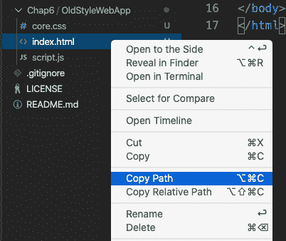

    图 6.1–Copy index.html

2.  Now, open your browser and paste this file path into the URL. You should see the following:

    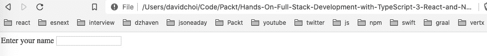

    图 6.2–浏览器中的 index.html

    您可能还不知道这一点，但在浏览器中查看 HTML 文件不需要 HTTP 服务器。但是，您可以看到，这个过程并不是最有效的，如果能够实现自动化，包括在对任何相关文件进行更改时自动刷新，效果会更好。

3.  Now, let's fill in our CSS file:

    ```js
    label {
        color: blue;
    }
    p {
        font-size: 2rem;
    }
    ```

    您会注意到，即使保存此文件，web 浏览器上的[T0]元素也不会自动更新。我必须刷新我的浏览器，然后它会更新。如果我有几十个在开发过程中更新的文件呢？每次手动刷新都不是一个好的体验。

4.  Next, let's add some code to `script.js`:

    ```js
    const inputEl = document.querySelector("#userName");
    console.log("input", doesnotexist);
    ```

    我们希望仔细阅读这段代码，因为它有多个问题。让我们看看这些问题是什么。如果我们保存此文件，打开浏览器调试器工具，然后刷新浏览器，您可以在**控制台**选项卡中看到它立即失败，出现此错误：

    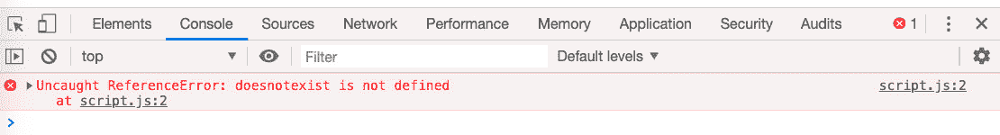

    图 6.3–script.js 第一个错误

    这类错误是一个未定义的变量，通常会被`create-react-app`项目工具捕获。`create-react-app`项目有所谓的过梁。linter 是一种代码检查工具，在编写代码时在后台运行。它将检查常见的错误，比如我们刚才看到的错误，这样它们就不会出现在您的生产代码中。linters 还有很多功能，但我们将在后面更深入地探讨它们。这里的要点是，我们希望在运行应用之前避免这些类型的错误。而`create-react-app`或者中的一些内置工具可以帮助我们实现这一点。

5.  Let's try adding the correct variable name and try reloading the browser again. Update the `script.js` file like this, save it, and then reload the browser:

    ```js
    const inputEl = document.querySelector("#userName");
    console.log("input", inputEl);
    ```

    正如您在调试器控制台中看到的，log 语句没有找到[T0]，因为它返回[T1]。这是因为我们错误地将`input`元素的`id`输入为`"userNam"`而不是`"userName"`。现在，再一次，随着`create-react-app`项目的运行，这种错误根本不可能发生，因为绝大多数 React 代码都不会尝试在 HTML 页面中查询或查找元素。相反，我们直接使用 React 组件，因此可以完全避免此类错误。诚然，可以选择退出此行为，并通过`useRef`使用对 HTML 元素的引用。然而，这是应该谨慎地做的事情，因为您使用此挂钩故意退出正常的 React 生态系统行为，因此失去了它的好处。

6.  Let's fix our `script.js` file and complete it. Update it like so:

    ```js
    const inputEl = document.querySelector("#userName");
    console.log("input", inputEl);
    const parEl = document.querySelector("#welcomeMsg");
    inputEl.addEventListener("change", (e) => {
        parEl.innerHTML = "Welcome " + e.target.value;
    });
    ```

    如果您通过刷新浏览器来运行此代码，您将看到，如果您在输入框中键入您的姓名，然后单击输入元素，将显示如下消息：

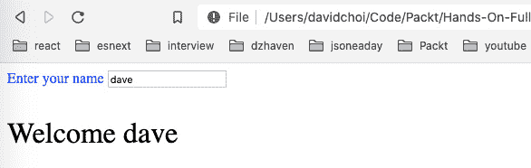

图 6.4–欢迎显示

因此，这段代码确实用于显示欢迎消息。然而，它很容易犯错误，并且没有任何帮助来说明原因。除此之外，请注意我们没有 TypeScript，因为浏览器不运行 TypeScript；他们只能运行 JavaScript。这意味着我们还缺少类型指示符，这些指示符也有助于避免与错误类型相关的错误。

所以，我们已经看到了一些关于以原始 web 方式做事的问题。但现实是，我们甚至还没有触及以这种方式进行开发的问题的表面。例如，当我们只需要处理几个脚本时，在 HTML 中嵌入脚本标记是一件合理的事情。但是当我们的依赖性增长时呢？对于较大的应用，很可能有数百个依赖项。管理这么多脚本标记将非常困难。不仅如此，许多 JavaScript 依赖项不再提供可以调用它们的 URL。

尽管如此，最大的问题之一可能是代码的高度自由形式。如果您再次查看`script.js`文件，您会发现代码中没有任何模式或结构。当然，你的团队很可能会自己想出一个模式，但是新的程序员加入团队呢？他们必须学习一种独特的方式来构建特定于您团队的代码。

因此，关键是工具、框架和结构提供了编写和维护代码的一致、可重复的方法。你可以认为它是一种编程文化，每个人都接受了文化的规范和实践，因此知道如何去做，如何去做。这使得代码更容易编写、共享和重构。现在我们已经了解了自由格式编码，让我们开始更深入地了解[T0]。

### 创建 react 应用

在前面的章节中，例如[*第 4 章*](04.html#_idTextAnchor072)、*学习单页应用概念以及 React 如何实现这些概念*、[*第 5 章*](05.html#_idTextAnchor081)、*React 开发与挂钩*等，我们使用`create-react-app`建立了我们的基础应用项目。让我们更仔细地看一下项目中的内容。为了更好地理解组成`create-react-app`项目的部分，我们需要先`eject`它。在这里，eject 仅仅意味着我们将揭示使`create-react-app`工作的所有内部依赖项和脚本，因为它们通常是隐藏的。

警告：弹射是不可逆的动作

在绝大多数情况下，您不会弹出`create-react-app`项目，因为这样做没有什么价值。我们在这里这样做只是为了对这个项目如何运作有更多的了解。

让我们看一下步骤：

1.  Create a new project inside of the `Chap6` folder by executing the following command from inside that folder:

    ```js
    npx create-react-app ejected-app --template typescript
    ```

    此命令完成后，您应该会看到在`Chap6`中创建的名为`ejected-app`的新项目。

2.  现在让我们退出这个项目。将命令行中的目录更改为新的`ejected-app`文件夹并运行此命令：

    ```js
    npm run eject
    ```

然后在提示下输入`y`继续。

让我们从 VS 代码资源管理器菜单的顶部看这个项目：

*   `config`

    此文件夹包含项目用于自我设置的大多数配置文件和脚本。主要需要注意的是，React 团队默认使用**Jest**进行测试，**Webpack**进行 JavaScript 文件的捆绑和缩小。我们将在*理解 React*的客户端测试一节中讨论 Jest，本节后面将讨论 Webpack。

*   `node_modules`

    正如您所知，这个文件夹包含我们项目的依赖项。正如我们可以添加的默认依赖项一样，我们可以添加大量的依赖项。尝试使用 HTML 脚本标记列出这些依赖项是相当困难的。在大多数情况下，这些依赖项不支持脚本标记引用。

*   `public`

    此文件夹包含用于生成单页应用的静态资产。这包括我们的一个名为`index.html`的 HTML 文件，如果我们正在构建 PWA 应用，则需要`manifest.json`文件。还可以添加其他文件，例如用于部署的图像文件。

*   `scripts`

    `scripts`文件夹包含用于管理项目的脚本，例如，构建、启动或启动应用测试的脚本。不应在此处添加实际测试文件。我们稍后将在*了解 React 的客户端测试部分*中介绍测试。

*   `src`

    当然，这是包含项目源文件的文件夹。

*   `.gitignore`

    `.gitignore`是一个告诉 Git 源代码存储库系统哪些文件和文件夹不需要跟踪的文件。在本节后面我们将深入探讨 Git。

*   `package.json`

    如前几章所述，npm 是最初创建用于节点服务器框架的依赖关系管理系统。这种依赖关系管理器的功能和流行程度最终使其成为客户端开发的标准。因此，React 团队使用 npm 作为项目创建和依赖关系管理的基础系统。

    除了列出项目的依赖项之外，它还可以列出可以运行以管理项目的脚本。

    它还具有 Jest、ESLint 和 Babel 等配置功能。

*   `Package-lock.json`

    这是一个相关文件，有助于维护一组适当的依赖项和子依赖项，而不管它们的安装顺序如何。我们不需要直接处理这个文件，但是知道这有助于防止不同的开发人员在不同的时间使用不同的现有依赖项集更新他们的`npm_modules`文件夹时出现问题是很好的知识。

*   `tsconfig.json`

    我们已经在[*第 2 章*](02.html#_idTextAnchor025)*探索类型脚本*中查看了该文件，如该章所述，它包含类型脚本编译器要使用的设置。注意，一般来说，React 团队更喜欢更严格的编译设置。还要注意，目标 JavaScript 版本是 ES5。这是因为一些浏览器还不兼容 ES6。

`create-react-app`还包含两个非常重要的工具，用于实现其部分功能：Webpack 和 ESLint。Webpack 是一个捆绑和缩小工具，它可以自动收集组成项目的所有文件，删除任何无关的、未使用的部分，并将它们合并为几个文件。通过删除无关的部分，如空白和未使用的文件或脚本，它可以大大降低用户浏览器必须下载的文件大小。当然，这会增强用户体验。除此核心功能外，它还提供了一个“热重新加载”开发服务器，允许某些脚本更改自动显示在浏览器中，而无需刷新页面（尽管大多数更改似乎会触发浏览器刷新，但至少这些更改是自动的）。

ESLint 也是一个重要的工具。由于 JavaScript 是一种脚本语言而不是编译语言，因此它没有一个编译器来检查语法和代码的有效性（显然，TypeScript 会检查语法和代码的有效性，但 TypeScript 编译器主要关注类型问题）。因此，ESLint 提供了开发时代码检查，以确保它是有效的 JavaScript 语法。此外，它还允许创建自定义代码格式规则。这些规则通常用于确保团队中的每个人都使用相同的风格进行编码；例如，变量命名约定和括号缩进。设置规则后，ESLint 服务将使用警告消息强制执行这些规则。

这些规则不仅特定于 JavaScript，还可以是关于如何为 React 等框架编写代码的规则。因此，例如，在一个`create-react-app`项目中，ESLint 设置为`react-app`，如`package.json`所示，这是一组特定于 React 开发的编码规则。因此，我们将看到的许多消息不一定是 JavaScript 错误，而是关于编写 React 应用的最佳实践的规则。

Webpack 虽然功能非常强大，但设置起来也非常困难。为 ESLint 创建自定义规则可能需要很长时间。所以，幸运的是，使用`create-react-app`的另一个好处是它为我们提供了这两种工具的良好默认配置。

## 发丝

我们在[*第 1 章*](01.html#_idTextAnchor017)*理解字体*中介绍了透明。然而，我们应该在本章中更深入地讨论它，因为`create-react-app`的大部分代码生成都依赖于透明。`create-react-app`允许我们使用 TypeScript 或 Babel，以便我们可以用一种语言或语言版本开发代码，并以不同的语言或语言版本发出代码。下面是一个简单的图表，显示了 TypeScript 转换过程中的代码流：

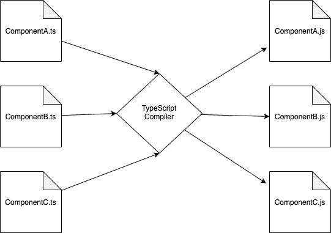

图 6.5–从 TypeScript 到 JavaScript 的转换

TypeScript 编译器将搜索您的项目并找到根代码文件夹中的所有`ts`或`tsx`文件，通常是`src`。如果出现错误，它将停止并通知我们，否则，它将解析 TypeScript 并将其转换为纯 JavaScript 作为`js`文件，这就是在系统上运行的内容。请注意，在图中，我们还更改了 JavaScript 版本。所以，透明化很像编译。检查代码的有效性和某些类别的错误，但不是将其转换为可以直接运行的字节码，而是将其转换为不同的语言或语言版本。Babel 还能够发出 JavaScript 并使用 TypeScript 开发人员代码。然而，我更喜欢使用原始的 TypeScript 编译器，因为它是由设计 TypeScript 的同一个团队制作的，并且通常是最新的。

选择 transfilation 作为编译方法有多个重要的好处。首先，开发人员不需要担心他们的代码是否会在浏览器上运行，或者用户是否需要首先在该机器上升级或安装一系列依赖项。TypeScript 编译器发出 web 标准 ECMAScript（ES3、ES5、ES6 等），因此可以将代码设置为在任何现代浏览器上运行。

Transpilation 还允许开发人员在最终发布之前利用较新版本的 JavaScript。由于 JavaScript 几乎每年更新一次，因此该功能在利用新的语言功能或性能方面非常有用；例如，当考虑 JavaScript 的一个新特性时。ECMA 基金会是维护 JavaScript 语言的标准机构，它在接受更改变成正式版本的 JavaScript 之前经历了几个阶段。但是 TypeScript 和 Babel 团队有时会接受新的 JavaScript 特性，而他们仍处于这些早期阶段之一。这就是在 async await 成为官方标准之前，许多 JavaScript 开发人员能够在代码中使用 async await 的原因。

## 代码库

代码库是一个允许多个开发人员共享源代码的系统。可以更新、复制和合并代码。对于大型团队，此工具对于构建复杂应用是绝对必要的。最流行的现代源代码控制和存储库是 Git。最流行的在线存储库主机是 GitHub。

尽管彻底学习 Git 超出了本书的范围，但理解一些基本概念和命令是很重要的，因为在与其他开发人员交互和维护您自己的项目时，您将需要它们。

任何代码存储库的一个更重要的概念是分支。这意味着能够指示项目的多个版本。例如，这些分支可以是项目的版本号，例如 1.0.0、1.0.1 等等。它还可以用于创建应用的单独版本，其中可能正在试用一些实验性或高风险代码。将这样的代码放在主分支中不是一个好主意。下面是 React GitHub 页面及其多个版本的示例：


图 6.6–反应 GitHub

正如你所看到的，有很多分支。当前稳定的分支，虽然在这个屏幕截图中不可见，但通常称为主分支。

同样，学好 Git 需要一本自己的书，所以这里我只介绍一些你每天会用到的主要命令：

*   `git`：此命令为 Git**CLI**（**命令行界面**）。它必须启动您想要执行的任何 Git 命令。使用`git`命令时，您正在处理存储库的本地副本；在将更改推送到服务器之前，您不会直接处理在线存储库或影响队友的存储库。
*   `clone`：此命令允许您将存储库复制到本地计算机上。请注意，克隆时，通常会默认使用主分支。这里有一个例子：

    ```js
    git clone https://github.com/facebook/react.git
    ```

*   `checkout`：此子命令允许您将工作分支更改为不同的所需分支。因此，如果您希望在主分支以外的其他分支中工作，则可以使用此命令。这里有一个例子：

    ```js
    git checkout <branch-name>
    ```

*   `add`：此子命令添加您最近更改的需要跟踪的文件，这表示您将稍后将它们提交到存储库中。您可以在`add`之后使用`.`一次性完成所有更改的文件，或明确指出文件：

    ```js
    git add <file name>
    ```

*   `commit`：此子命令表示您最终将使用刚才在本地添加的文件更新您的工作分支。如果添加`-m`参数，则可以添加一个内联标签来描述提交。此命令帮助团队成员跟踪在每次提交中所做的更改：[T2]
*   `push`：此子命令实际将本地提交的文件移动到远程存储库中：

    ```js
    git push origin <branch name>
    ```

在本节中，我们介绍了 React 开发人员可以使用的一些核心项目工具。`create-react-app`、ESLint、Webpack 和 npm 提供了宝贵的功能，使开发更高效、更不容易出错。我们还介绍了 Transilation，以了解如何在最终用户设备上利用较新的语言版本，而不影响兼容性。

此外，我们快速查看了 Git。目前，它是最流行的代码共享存储库。作为一名专业开发人员，您最终肯定会在项目中使用它。

现在我们有了一些重要的核心工具知识，我们将在下一节继续讨论测试。现代开发实践大量使用测试和测试框架。幸运的是，JavaScript 有很好的测试框架来帮助我们编写高质量的测试。

# 了解 React 的客户端测试

单元测试是开发中非常重要的一部分。如今，如果没有某种程度的单元测试，就不会编写大型项目。测试的目的是确保您的代码始终正常工作，并执行预期的操作。当代码被修改（即重构）时尤其如此。事实上，更改现有复杂代码可能比创建全新代码更困难。单元测试可以防止在重构过程中破坏现有代码。但如果代码真的坏了，它还可以帮助确定代码不再工作的确切位置，以便快速修复。

在 React 中，以前常用的主要测试文库有两个：**Jest**和**酶**。Jest 是一个主要的测试库，它提供基本调用，如用于检查[T6]特定值的断言和帮助设置[T7]测试的包装函数。酶有一套助手，可以与 Jest 一起测试反应成分。它具有针对测试 React 组件输出的功能。然而，最近，一个名为**测试库**的库及其相关版本基本上已经取代了酶。是`create-react-app`内置的默认组件测试库。所以，在本书中，我们将学习 Jest 和测试库。

所有单元测试都以相同的方式工作。这不仅适用于 React 和 JavaScript 测试，而且任何语言的测试都将以相同的方式工作。那么，什么是单元测试？单元测试试图测试代码的一个特定部分，并试图断言它的某些方面是正确的。基本上就是这样。换句话说，这意味着测试正在检查预期的情况是否属实。如果不是，那么测试应该失败。尽管这一目标很简单，但创建高质量的测试却并非如此。因此，我们将在这里回顾一些示例，但请记住，大型应用测试可能与创建应用的实际代码一样复杂。因此，你需要一段时间才能熟练地编写测试。

为了让事情更清楚，让我们来看一个简单的测试。请执行以下操作：

1.  转到 VS 代码并在路径`ejected-app/src/App.test.tsx`处打开文件。这是对`App`组件的测试。我们一会儿就把考试的内容复习一遍。
2.  Open your terminal to `ejected-app` and run this command:

    ```js
    npm run test
    ```

    如前所述，已经有几个 npm 脚本来帮助管理项目，其中之一是运行我们的测试的脚本，称为`test`。此外，这个`test`脚本实际上是在**观察模式**下运行我们的测试，这意味着该脚本保持活动状态，并在每次更新或添加新测试时自动运行。如果您的测试未运行，并且您收到此提示，请选择选项`a`：

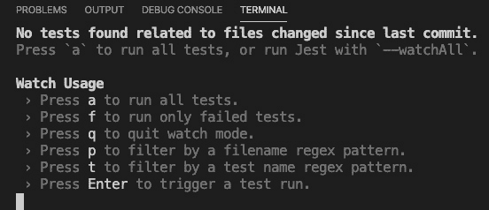

图 6.7–测试运行选项

如果您的测试确实运行或您选择了`a`，您应该会看到以下结果：


图 6.8–成功完成的测试

如您所见，我们的测试已自动找到并运行（尽管目前我们只有一个测试）。在这次运行中，一个测试是成功的，这意味着预期的情况确实发生了。如果有失败，同一个 UI 将指示有多少测试失败，有多少测试成功。

现在，让我们看一下测试中的测试：

```js
import React from 'react';
import { render } from '@testing-library/react';
import App from './App';
test('renders learn react link', () => {
  const { getByText } = render(<App />);
  const linkElement = getByText(/learn react/i);
  expect(linkElement).toBeInTheDocument();
});
```

首先，您会注意到文件名中有文本`test`。这就是告诉 Jest 这是一个测试文件的原因。有些团队喜欢将所有测试放在一个文件夹中。有些团队更喜欢将测试放在被测试的实际文件旁边，如本例所示。没有正确的答案。做对你和你的团队最有利的事情。在本书中，我们将把测试放在正在测试的文件旁边。让我们看看我们的 Ty1 T1 文件的内容：

1.  请注意，在进口产品中，我们提到了`@testing-library/react`。如前所述，该库将为我们提供一些额外的工具，使组件输出的测试更容易。
2.  现在，请注意`test`函数。此函数充当单个测试的封装包装器。这意味着与此测试相关的所有内容都位于此函数内部，不能从外部访问。这确保了我们的测试不会受到其他测试的影响。
3.  此函数的第一个参数是描述。描述完全是任意的，您的团队对于如何编写这些描述有自己的标准。我们需要关注的唯一一件事是使描述简短但清楚地说明正在测试的内容。
4.  第二个参数是运行实际测试的函数。在这种情况下，测试将检查`App`组件发出的 HTML 中是否出现特定文本。让我们逐行检查代码。
5.  在*6 号线*上运行`render`，传递`App`组件。这个`render`函数执行我们的组件并返回某些属性和函数，这些属性和函数允许我们测试发出的 HTML。在这种情况下，我们决定只接收函数`getByText`，这意味着返回一个包含特定文本的元素。
6.  在*l**ine 7*中，我们通过使用参数`/learn react/i`调用`getByText`来获取 HTML DOM 元素，该参数是运行正则表达式的语法，但在本例中，它是针对文本的硬编码。
7.  最后，在*第 8 行*上，进行了一个名为`expect`的断言，该断言期望名为`linkElement`的元素对象使用`toBeInTheDocument`函数位于 DOM 中。因此，理解测试的一个简单方法是像读句子一样阅读他们的断言。例如，我们可以这样读这个断言，“我希望 linkElement 在文档中”（文档当然是浏览器 DOM）。通过这种方式阅读，我们可以很清楚地看到它的意图。
8.  Now, let's see what happens if we change the code a bit. Update `App.tsx` with the following (I'm only showing the `App` function for brevity):

    ```js
    function App() {
      return (
        <div className="App">
          <header className="App-header">
            
            <p>
              Edit <code>src/App.tsx</code> and save to             reload.
            </p>
            <a
              className="App-link"
              href="https://reactjs.org"
              target="_blank"
              rel="noopener noreferrer"
            >
              Learn 
            </a>
          </header>
        </div>
      );
    }
    ```

    注意，除了删除了`Learn React`中的文本`React`之外，我将所有的都保留了。

9.  保存此文件后，应立即看到如下错误：


图 6.9–更改 App.tsx 后的错误

同样，测试运行程序正在观察模式下运行，因此您应该在保存更改后立即查看测试结果。如您所见，我们的测试失败，因为没有找到文本`learn react`，因此断言`expect(linkElement).toBeInTheDocument()`不正确。

好的，我们来看看`create-react-app`提供的一个内置测试。现在让我们创建一个新组件，这样我们就可以从头开始编写自己的测试。请执行以下操作：

1.  Let's leave our test running in watch mode, even though it's showing an error, and create a new terminal window by clicking the plus button at the upper-right side of the terminal window in VS Code. The button is the plus sign shown here:

    

    图 6.10：新终端的加号

2.  Now, create a new file called `DisplayText.tsx` in the `src` folder and add this code:

    ```js
    import React, { useState } from "react";
    const DisplayText = () => {
        const [txt, setTxt] = useState("");
        const [msg, setMsg] = useState("");
        const onChangeTxt = (e: React.      ChangeEvent<HTMLInputElement>)
         => {
            setTxt(e.target.value);
        }
        const onClickShowMsg = (e: React.      MouseEvent<HTMLButtonElement, MouseEvent>) => {
            e.preventDefault();
            setMsg(`Welcome to React testing, ${txt}`);
        }
    ```

    当有人在输入中输入姓名并单击**显示消息**按钮后，此组件将简单地显示一条新消息。首先，您可以看到我们声明了名为`DisplayText`的新组件。

3.  然后，我们创建一些必要的状态，以便组件和事件处理程序处理新文本和消息显示（我们已经在[*第 5 章*](05.html#_idTextAnchor081)*使用挂钩进行 React 开发*中介绍了如何创建 React 组件）：

    ```js
        return (
            <form>
                <div>
                    <label>Enter your name</label>
                </div>
                <div>
                    <input data-testid="user-input" 
                      value={txt} onChange={onChangeTxt} />
                </div>
                <div>
                    <button data-testid="input-submit" 
                     onClick={onClickShowMsg}>Show                     Message</button>
                </div>
                <div>
                    <label data-testid="final-msg" 
                       >{msg}</label>
                </div>
            </form>
        )
    }
    export default DisplayText;
    ```

4.  最后，我们返回 UI，它包括一个输入和一个提交按钮。请注意`data-testid`属性，以便稍后的测试能够轻松找到元素。如果您运行此代码并输入您的姓名，然后单击按钮，您应该会看到如下内容：

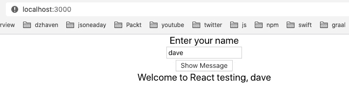

图 6.11–用于测试的新组件

如您所见，我们的显示器只返回输入的文本和欢迎消息。然而，即使是这个简单的例子也有几个不同的东西需要测试。首先，我们希望确保输入中输入了文本，并且是文字，而不是数字或符号。我们还希望确保，当我们单击按钮时，会显示消息，消息以字符串`"Welcome to React testing"`开头，以用户的输入文本结尾。

现在我们有了组件，让我们为它构建测试：

1.  我们需要注意`tsconfig.json`文件中的一个小问题。如前所述，您可以将测试放在单独的文件夹中，通常称为`__test__`，也可以将其与组件文件并排放置。为了方便起见，我们将把它并排放置。如果我们这样做，我们将需要更新我们的`tsconfig.json`文件以包含此`compilerOption`：

    ```js
    "types": ["node", "jest"]
    ```

2.  Create the test file for this component by creating a new file called `DisplayText.test.tsx` and add this initial code into it:

    ```js
    import React from 'react';
    import { render, fireEvent } from '@testing-library/react';
    import DisplayText from './DisplayText';
    import "@testing-library/jest-dom/extend-expect";
    describe("Test DisplayText", () => {
        it("renders without crashing", () => {
            const { baseElement } = render(<DisplayText />);
            expect(baseElement).toBeInTheDocument();
        });
        it("receives input text", () => {
            const testuser = "testuser";
            const { getByTestId } = render(<DisplayText />);
            const input = getByTestId("user-input");
            fireEvent.change(input, { target: { value:         testuser } });
            expect(input).toBeInTheDocument();
            expect(input).toHaveValue(testuser);
        })
    });
    ```

    在顶部，您会注意到我们已经从`@testing-library/react`导入了`render`，我们还导入了`@testing-library/jest-dom/extend-expect`扩展，它允许我们进行断言。`expect`关键字的扩展为我们提供了额外的功能，允许我们以更多的方式进行测试。例如，我们使用`toHaveValue`来获取`input`的值。

    在导入之后，您会注意到一些新语法。`describe`正如的名字所暗示的，只是一种创建带有有用标签的分组容器的方法。此容器可以有多个测试，但这些测试都应该与测试特定组件或功能相关。在本例中，我们尝试测试`DisplayText`组件，因此`describe`中的所有测试将仅测试该组件。

    因此，我们的第一个测试是使用名为`it`的函数开始的。此函数检查我们的组件`DisplayText`是否可以呈现为 HTML，而不会崩溃或出错。`render`函数尝试进行渲染，`expect`和`toBeInTheDocument`函数通过检查渲染是否在 DOM 中来确定渲染是否成功。作为一个实验，在第一个测试`it`函数中，在以`const { baseElement }`开头的行下方添加此代码`console.log(baseElement.innerHTML)`。您应该在终端中看到此 HTML 字符串：

    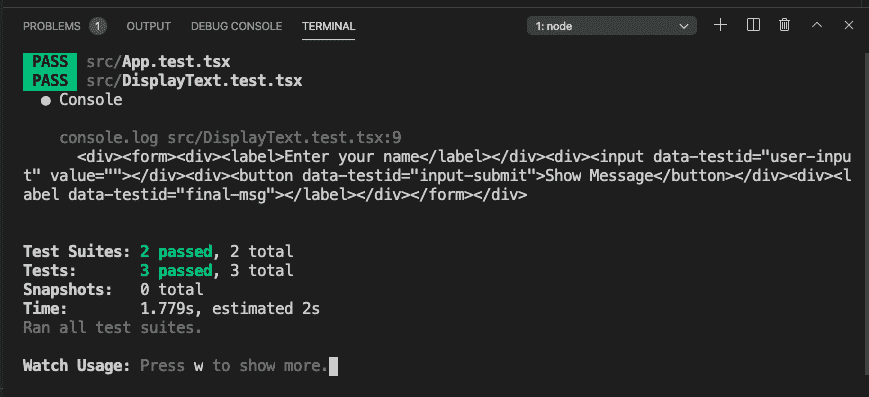

    图 6.12–日志：结果测试 HTML

    正如您所看到的，是一个`div`的日志，其中包含一个表单，其余的是我们组件的 HTML。使用此方法，您将能够检查渲染出的内容，如果需要，还可以检查如何对其进行解析。

    我们的下一个测试也是从`it`函数开始的，它将检查输入元素是否正确呈现，并获取我们正在输入的值。这可能看起来很奇怪，但请记住，在 React 中，填充输入控件并不简单，需要对`onChange`事件进行响应。因此，我们将`data-testid`属性传递给`getByTestId`函数以查找特定的输入元素，因为可能有多个输入元素。现在，为了插入更改后的值，我们使用`fireEvent.change`函数接受并发送一个字符串值。然后我们测试这个值是否真的添加到了我们的输入中。下面是它的样子：

    ```js
    it("receive input text", () => {
            const username = "testuser";        
            const { getByTestId } = render(<DisplayText />);
            const input = getByTestId("user-input");
            fireEvent.change(input, { target: { value:           username } });
            expect(input).toBeInTheDocument();
            expect(input).toHaveValue(username);
        });
    ```

3.  Now, let's create one more test to show an end-to-end test of our component. Add the following code after our second `it` function:

    ```js
    it("shows welcome message", () => {
            const testuser = "testuser";
            const msg = `Welcome to React testing,           ${testuser}`;
            const { getByTestId } = render(<DisplayText />);
            const input = getByTestId("user-input");
            const label = getByTestId("final-msg");
            fireEvent.change(input, { target: { value:           testuser } });
            const btn = getByTestId("input-submit");
            fireEvent.click(btn);

            expect(label).toBeInTheDocument();
            expect(label.innerHTML).toBe(msg);
        });
    ```

    这个测试类似于我们的第二个测试，它在我们的`input`中添加了一个值，但随后它继续并得到我们的`button`，然后是我们的`label`。然后，它创建一个`click`事件来模拟一个按钮按下，在常规代码中，这个按钮会导致`label`被我们的欢迎消息填充。然后测试我们的`label`的内容。同样，保存此文件后，我们的测试应该重新运行，并且所有测试都应该通过。

4.  Now, let's also look at something called snapshots. Obviously, a big part of React development is not just the behavior or actions available within our app, but the actual UI presented to our users. So, by doing snapshot testing, we are able to check that the desired UI, HTML elements, are indeed created by our components. Let's add this code to our tests after our "renders without crashing" test:

    ```js
    it("matches snapshot", () => {
            const { baseElement } = render(<DisplayText />);
            expect(baseElement).toMatchSnapshot();
        });
    ```

    如您所见，我们的`render`函数设置为使用`baseElement`属性返回`DisplayText`组件的最根元素。此外，我们可以看到，我们有一个新的`expect`函数，名为`toMatchSnapshot`。此函数执行两项操作：

    *   第一次运行时，它会在`src`文件夹的根目录下创建一个名为`__snapshot__`的文件夹。
    *   It then adds or updates a file that has the same name as our test file and ends with the extension .`snap`. So, in this case, our test file snapshot file would be `DisplayText.test.tsx.snap`.

        此快照文件的内容是组件发出的 HTML 元素。所以你的快照应该是这样的：

        ```js
        // Jest Snapshot v1, https://goo.gl/fbAQLP
        exports[`Test DisplayText matches snapshot 1`] = `
        <body>
          <div>
            <form>
              <div>
                <label>
                  Enter your name
                </label>
              </div>
              <div>
                <input
                  data-testid="user-input"
                  value=""
                />
              </div>
              <div>
                <button
                  data-testid="input-submit"
                >
                  Show Message
                </button>
              </div>
              <div>
                <label
                  data-testid="final-msg"
                />
              </div>
            </form>
          </div>
        </body>
        `;
        ```

        正如您所看到的，这是由`DisplayText`组件发出的所需 HTML 的精确副本。还请注意给出的描述以及它是`snapshot 1`的指示。当您添加更多时，该数字将增加。

5.  OK, so now we have a snapshot and our first test run has succeeded. Let's see what happens if we change our `DisplayText` JSX. Update the `DisplayText.tsx` file, not your test file, like this (I'll just show the component definition for brevity's sake):

    ```js
    const DisplayText = () => {
        const [txt, setTxt] = useState("");
        const [msg, setMsg] = useState("");
        const onChangeTxt = (e: React.     ChangeEvent<HTMLInputElement>)
          => {
            setTxt(e.target.value);
        }
        const onClickShowMsg = (e: 
          React.MouseEvent<HTMLButtonElement, MouseEvent>) =>      {
            e.preventDefault();
            setMsg(`Welcome to React testing, ${txt}`);
        }
    ```

    前面的代码完全相同，但是在`return`的中，我们添加了一个伪`div`标签，如图所示：

    ```js
        return (
            <form>
                <div>
                    <label>Enter your name</label>
                </div>
                <div>
                    <input data-testid="user-input"                 value={txt} 
                      onChange={onChangeTxt} />
                </div>
                <div>
                    <button data-testid="input-submit" 
                     onClick={onClickShowMsg}>Show                   Message</button>
                </div>
                <div>
                    <label data-testid="final-msg" >{msg}                    </label>
                </div>
                <div>
                    this is just a test entry
                </div>
            </form>
        )
    }
    ```

    如果我们保存此文件并重新运行测试，我们将看到以下内容：

    

    图 6.13–失败的快照测试

    如您所见，我们的快照测试失败，因为我们的 UI 现在与快照不匹配。那么，如果我们打算对我们的`DisplayText`组件 UI 进行此更改，该怎么办？在这种情况下，我们可以通过首先输入`w`字符，在**手表使用**列表下输入`u`字符来强制更新快照。如果这对您不起作用，请停止并重新启动测试。以下是**手表使用**列表的内容：

    

    图 6.14–监视使用列表

6.  选择`u`后，我们的快照文件更新成功，快照测试完成。如果打开本地快照文件，您应该会看到我们先前添加到组件中的相同的新`div`标记。

现在我们看到了一些简单的测试来帮助我们开始。接下来，我们将介绍模拟的主题。

# 嘲弄

模拟只是用默认值替换测试中的特定功能。模拟的一个例子可能是只假装进行网络呼叫，而返回硬编码的值。我们这样做的原因是我们只想测试单个单元或代码的一小部分。通过模拟代码中与我们正在测试的内容无关的部分，我们可以避免混淆，并确保我们的测试能够始终如一地工作。例如，如果我们试图在代码中测试输入，我们不希望网络调用失败影响测试结果，因为网络调用与输入元素没有任何关系。当我们想要进行端到端测试或集成测试时，我们也可以担心网络呼叫。但这与单元测试是不同的（在一些团队中，集成测试由 QA 团队单独处理），我们在这里不讨论它。现在，当涉及到 React 组件时，测试库实际上建议不要进行模拟，因为这有效地使我们的测试与实际代码不太相似。话虽如此，有时模拟仍然有帮助，所以我也将展示如何模拟组件。

## 开玩笑地嘲笑。fn

让我们学习关于用玩笑进行模拟，因为它也用于节点开发。第一种开玩笑的模拟方法是使用`fn`模拟特定函数。此函数将另一个函数作为参数，它将执行设置所需模拟所需的任何操作。而且，除了替换任意现有代码和值的能力之外，创建一个 mock 还可以让您访问名为`mock`的成员。此成员提供有关模拟调用的度量。这很难概念化，因此让我们创建一个示例：

1.  Let's update our `DisplayText` component to make a network call to a web API. We will use the **JsonPlaceholder** web API. This is a free service that provides you with a web API that returns JSON. Let's create a new property for `DisplayText` that is a function that returns a user's full name based upon their username. We need to first update the `App` function file like this:

    ```js
    function App() {
      const getUserFullname = async (username: string):   Promise<string> => {
        const usersResponse = await 
          fetch('https://jsonplaceholder.typicode.com/      users');
        if(usersResponse.ok) {
          const users = await usersResponse.json();
          const userByName = users.find((usr: any) => {
              return usr.username.toLowerCase() === username;
          });
          return userByName.name;
        }
        return "";
      }
      return (
        <div className="App">
          <DisplayText getUserFullname={getUserFullname} />
        </div>
      );
    }
    ```

    因此，在这里，我们正在创建名为`getUserFullname`的函数，然后将其作为属性传递给`DisplayText`组件。正如基于网络的 JSONAPI 一样，它是一个基于网络的占位符。它调用`users`集合，然后使用`find`数组函数过滤集合。结果将通过调用`userByName.name`从用户名中获取用户的全名。

2.  Now, let's see the updated `DisplayText` component code:

    ```js
    import React, { useState, FC } from "react";
    interface DisplayTextProps {
        getUserFullname: (username: string) =>    Promise<string>;
    }
    const DisplayText: FC<DisplayTextProps> = ({ getUserFullname }) => {
        const [txt, setTxt] = useState("");
        const [msg, setMsg] = useState("");

        const onChangeTxt = (e: React.    ChangeEvent<HTMLInputElement>)
          => {
            setTxt(e.target.value);
        }
        const onClickShowMsg = async (e: 
          React.MouseEvent<HTMLButtonElement, MouseEvent>) =>         {
            e.preventDefault();
            setMsg(`Welcome to React testing, ${await 
              getUserFullname(txt)}`);        
        }    
    ```

    对于大多数部分，此代码保持不变，当然我们定义了一个名为`DisplayTextProps`的新接口来容纳我们的`getUserFullname`函数。此函数作为道具从`App`组件传入。然后我们在`onClickShowMsg`事件处理程序中使用该函数来显示带有用户全名的欢迎消息：

    ```js
        return (
            <form>
                <div>
                    <label>Enter your name</label>
                </div>
                <div>
                    <input data-testid="user-input"                   value={txt} 
                      onChange={onChangeTxt} />
                </div>
                <div>
                    <button data-testid="input-submit" 
                     onClick={onClickShowMsg}>Show Message</                  button>
                </div>
                <div>
                    <label data-testid="final-msg" >{msg}</                 label>
                </div>            
            </form>
        )
    }
    export default DisplayText;
    ```

    代码的其余部分相同，但为了完整性而显示。那么，现在如果我们运行我们的应用，我们应该看到如下内容：

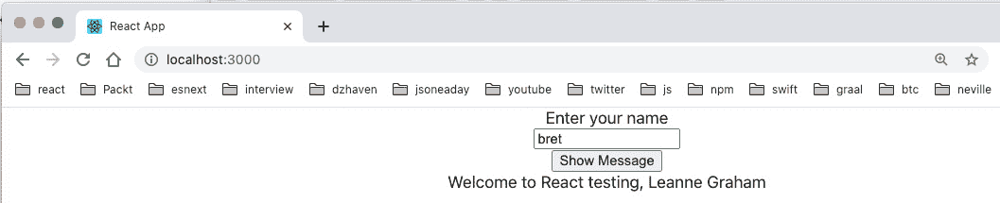

图 6.15–用户全名

如您所见，用户名为**bret**的用户全名为**Leanne Graham**。

现在，让我们编写测试并使用 Jest 模拟网络调用：

1.  Open `DisplayText.test.tsx` and notice that all our tests are failing since none of them will have the new property `getUserFullname`. So, let's update our test and mock this function. Here are the new tests:

    ```js
    import React from 'react';
    import { render, fireEvent, cleanup, wait } from   "@testing-library/react";
    import DisplayText from './DisplayText';
    import "@testing-library/jest-dom/extend-expect";
    ```

    在顶部附近，我们看到一个名为`@testing-library/react`的新函数导入。这是为了处理测试项中的异步调用。例如，`getUserFullname`是一个异步调用，因此我们需要`await`它。但是如果我们不`await`它，我们的测试将失败，因为它在进入下一步之前不会等待调用完成：

    ```js
    afterEach(cleanup);
    describe("Test DisplayText", () => {
        const userFullName = "John Tester";
    const getUserFullnameMock = (username: string): 
         [Promise<string>, jest.Mock<Promise<string>,        [string]>] => {        
            const promise = new Promise<string>((res, rej) => {
                res(userFullName);
            });
            const getUserFullname = jest.fn(
              async (username: string): Promise<string> => {
                return promise;
            });
            return [promise, getUserFullname];
        }
    ```

    接下来你会看到两个新成员，`userFullName`和`getUserFullnameMock`。由于我们将在几个测试中运行我们的模拟函数，我们正在创建`getUserFullnameMock`函数，以便我们可以重用它，为我们提供模拟函数`getUserFullname`和一些其他需要的项。

    但问题可能是，为什么它们看起来如此复杂？让我们浏览一下代码，看看它在做什么：

    *   在我们设置了`userFullName`之后，我们创建了`getUserFullnameMock`。函数如您所见，`getUserFullnameMock`函数采用`username`作为参数，就像真实的`getUserFullname`函数一样，并返回一个`promise`和一个`Mock`对象。
    *   在`getUserFullnameMock`内部，定义实例化了一个`promise`对象，并使用`jest.fn`模拟我们的`getUserFullname`函数。我们需要一个承诺来模拟一个网络调用，并在稍后使用来自测试库的`wait`调用对其进行`await`处理。
    *   如前所述，`jest.fn`用于实例化一个 mock，并让 mock 执行我们可能需要的任何操作。在本例中，由于我们正在模拟的`getUserFullname`函数正在进行网络调用，因此我们需要让我们的`jest.fn`模拟返回一个承诺。它通过返回我们在其正上方的行上创建的`promise`来实现。
    *   然后，最后返回`promise`和新的模拟函数`getUserFullname`。
    *   我们在这里会遇到很多麻烦，但是在这种情况下，最好不要使用缓慢且容易出错的网络调用。否则，如果网络调用失败，我们可能会错误地认为测试和代码失败。
    *   Next, let's see how our mock is used within our tests:

        ```js
             it("renders without crashing", () => {
                const username = "testuser";
                const [promise, getUserFullname] = 
                  getUserFullnameMock(username);
                const { baseElement } = render(<DisplayText 
                  getUserFullname={getUserFullname} />);
                expect(baseElement).toBeInTheDocument();
            });
            it("matches snapshot", () => {
                const username = "testuser";
                const [promise, getUserFullname] = 
                 getUserFullnameMock(username);
                const { baseElement } = render(<DisplayText
                  getUserFullname={getUserFullname} />);
                expect(baseElement).toMatchSnapshot();
            });
            it("receive input text", () => {
                const username = "testuser";
                const [promise, getUserFullname] = 
                  getUserFullnameMock(username);
                const { getByTestId } = render(<DisplayText 
                  getUserFullname={getUserFullname} />);
                const input = getByTestId("user-input");
                fireEvent.change(input, { target: { value:          username } });
                expect(input).toBeInTheDocument();
                expect(input).toHaveValue(username);
            });
        ```

        前几个测试只需将`getUserFullname`函数作为属性传递给`DisplayText`。他们不会以其他方式使用它，但它仍然是必需的，因为它是`DisplayText`的必需属性。

2.  The last test is updated since it tests the welcome message. Update your last test like this:

    ```js
        it("shows welcome message", async () => {
            const username = "testuser";
            const [promise, getUserFullname] = 
              getUserFullnameMock(username);

            const msg = `Welcome to React testing,          ${userFullName}`;
            const { getByTestId } = render(<DisplayText 
              getUserFullname={getUserFullname} />);
            const input = getByTestId("user-input");
            const label = getByTestId("final-msg");
            fireEvent.change(input, { target: { value:           username } });
            const btn = getByTestId("input-submit");
            fireEvent.click(btn);

            expect(label).toBeInTheDocument();
            await wait(() => promise);
            expect(label.innerHTML).toBe(msg);        
        });
    });
    ```

    最后一个测试测试欢迎消息，因为`getUserFullname`函数提供了用户的`fullname`，并将其输入标签中显示的欢迎消息中。为了测试这一点，我们使用[T2]和[T3]进行断言。此外，请注意`toBe`上方的`await``wait`呼叫。此调用必须首先运行，因为我们的`getUserFullname`函数是`async`函数，因此需要等待以获得其结果。

所以通过使用`jest.fn`，我们可以模拟出一段代码，这样它就可以给我们一个一致的值。同样，这有助于我们创建一致的、可重复的测试，其中我们只测试特定的代码单元。

## 组件模拟

模拟的第二种形式是完全替换整个组件，当我们想要测试其他代码时，使用它们代替真实组件。为了测试这一点，请按照此处给出的步骤进行操作：

1.  Let's make our `DisplayText` component show a list of user todos based on the inserted username. Update the component like this:

    ```js
    import React, { useState, FC } from "react";
    interface DisplayTextProps {
        getUserFullname: (username: string) =>       Promise<string>;
    }
    const DisplayText: FC<DisplayTextProps> = ({ getUserFullname })
      => {
        const [txt, setTxt] = useState("");
        const [msg, setMsg] = useState("");
        const [todos, setTodos] = useState<Array<JSX.     Element>>();
    ```

    在这里，我们创建了一些状态供以后使用：

    ```js
        const onChangeTxt = (e: React.      ChangeEvent<HTMLInputElement>)
          => {
            setTxt(e.target.value);
        }
    ```

    在这里，我们使用用户给出的用户名的值更新我们的输入：

    ```js
        const onClickShowMsg = async (e: 
          React.MouseEvent<HTMLButtonElement, MouseEvent>) =>         {
            e.preventDefault();
            setMsg(`Welcome to React testing, ${await 
             getUserFullname(txt)}`);  
            setUsersTodos();      
        }   
    ```

    单击**显示消息**按钮后，我们将更新要显示的消息以及要显示的待办事项列表。

2.  We are going to accept a prop to use as our message prefix:

    ```js
    const setUsersTodos = async () => {
            const usersResponse = await 
              fetch('https://jsonplaceholder.typicode.com/          users');
            if(usersResponse.ok) {
                const users = await usersResponse.json();
                const userByName = users.find((usr: any) => {
                    return usr.username.toLowerCase() ===                    txt;
                });
                console.log("user by username", userByName);
    ```

    与我们通过使用用户的`username`获取用户的`fullname`类似，我们通过调用 JSONPlaceholder API 获取用户的 TODO 列表。首先，我们通过调用用户集合找到用户：

    ```js
                const todosResponse = await  
                 fetch('https://jsonplaceholder.typicode.com/              todos');
                if(todosResponse.ok) {
                    const todos = await todosResponse.json();
                    const usersTodos = todos.filter((todo:                 any) => {
                        return todo.userId === userByName.id;
                    });
                    const todoList = usersTodos.map((todo:                  any) => {
                        return <li key={todo.id}>
                            {todo.title}
                        </li>
                    });
                    setTodos(todoList);
                    console.log("user todos", usersTodos);
                }
            }
        }
    ```

    然后我们调用TODO 集合，并将 TODO 与之前找到的用户进行匹配。

3.  Finally, we return an unordered list of todos via the UI:

    ```js
        return (
            <form>
                <div>
                    <label>Enter your name</label>
                </div>
                <div>
                    <input data-testid="user-input"                 value={txt} 
                      onChange={onChangeTxt} />
                </div>
                <div>
                    <button data-testid="input-submit" 
                     onClick={onClickShowMsg}>Show Message</                  button>
                </div>
                <div>
                    <label data-testid="final-msg" >{msg}</                label>
                </div>
                <ul style={{marginTop: '1rem', listStyleType: 
                 'none'}}>
                    {todos}
                </ul>
            </form>
        )
    }
    ```

    这是您应该在浏览器中看到的（请注意，在web API 上，只有用户名`bret`有任何待办事项）。请注意，您看到的文本是*lorem ipsum*。它只是占位符文本。它直接来自 JSONPlaceholder API：

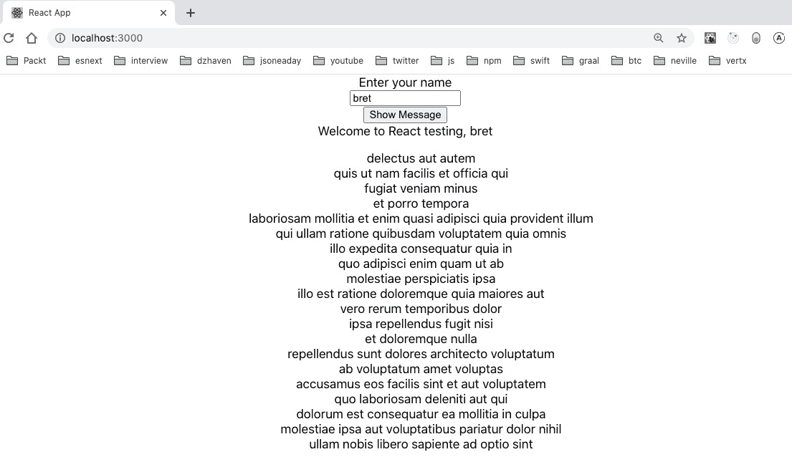

图 6.16–列出用户待办事项

这里，我们将显示用户 bret 的 TODO 列表。

现在，让我们假设我们想在不测试 TODO 列表的情况下测试我们的`DisplayText`组件。我们如何重构代码，使我们的测试不会如此单一？让我们重构`DisplayText`组件，并将 todos 功能作为其自己的组件：

1.  Update the `DisplayText` file like this:

    ```js
    import React, { useState, FC } from "react";
    import UserTodos from "./UserTodos";
    interface DisplayTextProps {
        getUserFullname: (username: string) =>       Promise<string>;
    }
    const DisplayText: FC<DisplayTextProps> = ({ getUserFullname }) => {
        const [txt, setTxt] = useState("");
        const [msg, setMsg] = useState("");
        const [todoControl, setTodoControl] = 
          useState<ReturnType<typeof UserTodos>>();

        const onChangeTxt = (e: React.     ChangeEvent<HTMLInputElement>)
          => {
            setTxt(e.target.value);
        }
    ```

    首先，我们创建一个名为`todoControl`的状态。这个状态的类型是我们新的`UserTodos`组件的类型，我们将在后面展示。我们通过使用实用程序类型`ReturnType`获得了此类型。如您所见，这是使用对象创建类型定义的一种简单方法：

    ```js
        const onClickShowMsg = async (e: 
          React.MouseEvent<HTMLButtonElement, MouseEvent>) =>         {
            e.preventDefault();
            setTodoControl(null);
            setMsg(`Welcome to React testing, ${await 
              getUserFullname(txt)}`);    
            setTodoControl(<UserTodos username={txt} />);
        }   
    ```

    我们的`onClickShowMsg`事件处理程序将调用`setTodoControl`并将我们的`UserTodos`组件传递给`username`：

    ```js
        return (
            <form>
                <div>
                    <label>Enter your name</label>
                </div>
                <div>
                    <input data-testid="user-input"                 value={txt} 
                      onChange={onChangeTxt} />
                </div>
                <div>
                    <button data-testid="input-submit" 
                     onClick={onClickShowMsg}>Show Message</                    button>
                </div>
                <div>
                    <label data-testid="final-msg" >{msg}</                label>
                </div>    
                {todoControl}
            </form>
        )
    }
    export default DisplayText;
    ```

    最后，`todoControl`显示在我们的 UI 中。

2.  Now let's create our new `UserTodos` component. Create a file called `UserTodos.tsx` and add this code:

    ```js
    import React, { FC, useState, useEffect } from 'react';
    interface UserTodosProps {
        username: string;
    }
    ```

    我们现在将用户名作为父母的道具：

    ```js
    const UserTodos: FC<UserTodosProps> = ({ username }) => {
        const [todos, setTodos] = useState<Array<JSX.      Element>>();
        const setUsersTodos = async () => {
            const usersResponse = await 
             fetch('https://jsonplaceholder.typicode.com/          users');
            if(usersResponse) {
                const users = await usersResponse.json();
                const userByName = users.find((usr: any) => {
                    return usr.username.toLowerCase() ===                  username;
                });
                console.log("user by username", userByName);
    ```

    首先，我们再次从用户集合中抓取我们的用户，并通过匹配`username`过滤找到我们的一个用户：

    ```js
                const todosResponse = await 
                 fetch('https://jsonplaceholder.typicode.com/             todos');
                if(userByName && todosResponse) {
                    const todos = await todosResponse.json();
                    const usersTodos = todos.filter((todo:                 any) => {
                        return todo.userId === userByName.id;
                    });
                    const todoList = usersTodos.map((todo:                 any) => {
                        return <li key={todo.id}>
                            {todo.title}
                        </li>
                    });
                    setTodos(todoList);
                    console.log("user todos", usersTodos);
                }
            }
        }
    ```

    然后我们获取找到的用户的匹配 TODO。然后，我们运行 JavaScript`map`函数为每个 todo 创建`li`元素的集合：

    ```js
        useEffect(() => {
            if(username) {
            setUsersTodos();
            }
        }, [username]);
    ```

    通过使用`useEffect`，我们表示，无论何时我们的`username`道具发生变化，我们都希望更新我们的待办事项列表：

    ```js
        return <ul style={{marginTop: '1rem', listStyleType: 
         'none'}}>
            {todos}
        </ul>;
    }
    export default UserTodos;
    ```

    最后，我们将 TODO 输出为无序列表元素。如果您运行此代码，单击**显示消息**后应该会看到：


图 6.17——重构 TODO

好的，现在我们可以添加一个新的测试，模拟我们的`UserTodos`组件，从而允许`DisplayText`独立测试。还需要注意的是，用笑话进行模拟有两种主要方式。我们可以对 mock 进行内联调用，也可以使用 mock 文件。对于本例，我们将使用一个模拟文件。让我们看一下步骤：

1.  In the `src` folder, create a new folder, `__mocks__`. Inside that folder, create a file called `UserTodos.tsx` and add this code into it:

    ```js
    import React, { ReactElement } from 'react';
    export default (): ReactElement => {
        return <></>;
      };
    ```

    此文件将是功能组件的模拟版本。正如您所看到的，它不返回任何内容，也没有真正的成员。这意味着与真正的组件不同，它不会进行任何网络调用或发出任何 HTML，这对于测试来说是我们想要的。

2.  现在我们用以下代码更新`DisplayText.test.tsx`：

    ```js
    import React from 'react';
    import { render, fireEvent, cleanup, wait } from '@testing-library/react';
    import DisplayText from './DisplayText';
    import "@testing-library/jest-dom/extend-expect";
    jest.mock("./UserTodos");
    afterEach(cleanup);
    describe("Test DisplayText", () => {
        const userFullName = "John Tester";

        const getUserFullnameMock = (username: string): 
        [Promise<string>, jest.Mock<Promise<string>,         [string]>] => {        
            const promise = new Promise<string>((res, rej) => {
                res(userFullName);
            });
            const getUserFullname = jest.fn(async (username:          string):
              Promise<string> => {             
                return promise;
            });
            return [promise, getUserFullname];
        }
    ```

首先，我们可以看到我们在任何测试之外导入了模拟`UserTodos`组件。这是必要的，因为在测试中这样做是行不通的。

其余的测试是相同的，但它们现在在内部使用`UserTodos`的模拟。因此，测试运行得更快，因为没有网络调用。作为对新发现的测试技能的一次尝试，请尝试分别为`UserTodos`组件创建自己的测试。

在本节中，我们学习了如何使用 Jest 和测试库测试 React 应用。单元测试是应用开发中非常重要的一部分，作为一名专业程序员，您几乎每天都要编写测试代码。它可以帮助编写和重构代码。

在下一节中，我们将通过讨论 React 应用开发中使用的常用工具，继续增加开发人员的技能。

# 学习 React 开发的常用工具和实践

有许多工具可以帮助编写 React 应用。这里有太多的内容，无法详尽列出，但我们将在此回顾一些最常见的内容。这些工具对于编写和调试代码至关重要，因此您应该花一些时间熟悉它们。

## VS 代码

在本书中，我们一直使用 VS 代码作为我们的代码编辑器。对于 JavaScript 开发，VS 代码显然是目前使用的最流行的编辑器。为了更好地利用 VS 代码，您应该知道以下几点：

*   VS Code has a large ecosystem of extensions to help in coding. Many of them are dependent upon developer preferences, so you should do a quick search and take a look. However, here are some common extensions you should consider using:

    **Visual Studio IntelliCode**：提供语言服务，用于 AI 驱动的代码完成和语法突出显示。

    **阿波罗 GraphQL**：代码GraphQL 的完成和格式化帮助程序。

    **React 相关插件**：有许多 React 相关插件可以通过向 NPM 等服务提供代码片段或挂钩来提供帮助。以下是一些：


图 6.18–React 与代码插件

*   VS 代码有一个内置调试器，允许您中断（停止）代码并查看变量值。我不会在这里演示它，因为前端开发的标准是使用 Chrome 调试器，它也允许中断代码，但一旦我们开始使用 Node，我将演示它。
*   配置文件：在 VS 代码中，有两种设置项目首选项的方法，一种是工作区，另一种是`settings.json`文件。在字体、扩展、窗口等方面，VS 代码的配置方式有很多种。这些配置可以在全局范围内完成，也可以在每个项目中完成。为了演示，我在`ejected-app`项目中包含了一个`.vscode/settings.json`文件。工作区文件基本上与设置文件相同，只是它们用于单个文件夹中的多个项目。工作区文件名为`<name>.code-workspace`。

## 更漂亮

在编写代码时，使用一致的样式来提高可读性非常重要。例如，如果您想象一个拥有许多开发人员的大型团队，如果他们每个人都以自己的风格编写代码，使用各种方式进行缩进、变量命名等等，那么这将是一场混乱。此外，还有一些行业标准的格式化 JavaScript 的方法，可以使其更可读，因此更易于理解。这就是像 Prettier 这样的工具所提供的。

无论是谁编写代码，Prettier 都会在每次保存时自动将代码格式化为一致且可读的格式。请记住，在安装 Prettier 之后，您需要设置`settings.json`或您的工作区文件来使用它。同样，我在我们的`ejected-app`项目中有一个样本`settings.json`文件。

## Chrome 调试器

Chrome 浏览器为 web 开发提供内置工具。这些功能包括查看页面的所有 HTML、查看控制台消息、中断 JavaScript 代码以及查看浏览器进行的网络调用。即使没有任何插件，它也是相当广泛的。对于许多前端开发人员来说，Chrome 是调试代码的主要工具。

让我们看一下调试器，用于学习 To0t0，并学习一些基本知识：

1.  If your local instance of `ejected-app` is not running, start it again and open your Chrome browser to the default `localhost:3000` URL. Once there, open your Chrome debugger by either pressing the *F12* key or going to **Chrome Settings** | **More Tools** | **Developer Tools**. In the debugger, which will probably show at the bottom of your Chrome screen, you should see the **Elements** tab like this:

    

    图 6.19：Chrome 调试器元素选项卡

    正如你所看到的，我们的有我们原来的`root div`标签，我们的应用的其余部分都在那里。在这个屏幕截图中，我们可以看到我们调用 web API 为用户`Bret`获取 TODO 的状态。因此，我们可以使用 Chrome 调试器找到 HTML 元素，检查它们的属性，并使用 CSS 值来精确地获得我们想要的 UI。

2.  Next, go to the **Console** tab and you should see something like this:

    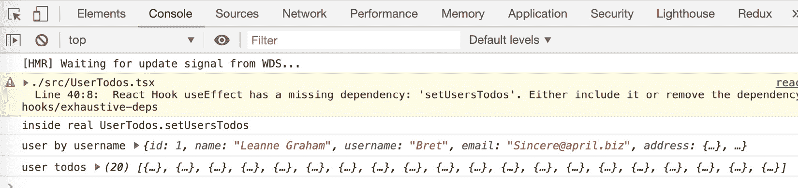

    图 6.20:Chrome 调试器控制台选项卡

    因此，在这里，我们可以检查变量和函数返回数据的值，确保它们是我们想要的和期望的。

3.  Using the Chrome Debugger, it is possible to break on running code. Open the **Sources** tab and find the `UserTodos.tsx` file, then add the breakpoint as shown:

    

    图 6.21–Chrome 调试器源选项卡

    如您所见，可以停在断点上，如*行 30*旁边的点所示。如果将鼠标悬停在某些变量上，您将能够看到它们的当前值，即使它们包含诸如其他组件之类的对象。对于调试代码中的问题，这是一个非常有用的特性。此功能由称为源映射的东西启用。源映射是将源代码映射或绑定到精简运行时代码的文件。它们在开发期间被创建并发送到浏览器，并允许在运行期间打开和查看变量值。

4.  现在，让我们移除断点，转到**网络**选项卡。此选项卡显示浏览器建立的所有网络连接。这不仅包括对网络资源（如数据）的调用，还包括获取图像或静态文件（如 HTML 文件）的调用。如果我们打开此选项卡，然后拨打电话获取用户 Bret 的待办事项，我们会看到：


图 6.22–Chrome 调试器网络选项卡

如您所见，我们可以查看调用 web API 返回的所有数据。这是一个方便的工具，允许我们比较来自网络资源的数据，并将其与代码似乎正在使用的数据进行比较。稍后在执行 GraphQL 调用时，我们也将使用此工具。

好的，这是对 Chrome 调试器的一个快速概述，但是 Chrome 还提供了支持特定于 React 的帮助的扩展。React Developer Tools 提供有关组件层次结构的信息和有关每个组件的属性信息；例如，我们的应用中有一个示例：

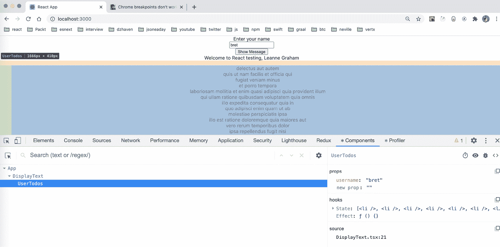

图 6.23–React 开发者工具

如您所见，此工具显示了我们的组件层次结构，并显示了当前选定组件的属性。当我们在层次结构中选择特定组件时，它还会在屏幕上突出显示组成组件的元素。它是一个方便的工具，可以从 React组件结构的角度查看我们的元素，而不是 HTML 结构。Chrome 的扩展生态系统非常庞大，Redux 和 Apollo GraphQL 也有扩展。我们将在[*第 8 章*](08.html#_idTextAnchor122)、*学习服务器端开发中探讨 Node.js 和 Express*、*和[*第 9 章*](09.html#_idTextAnchor139)、*什么是 GraphQL？分别为*。*

 *## 备选方案

在本书中，我们使用 VS 代码作为代码编辑器。它工作得很好，已经成为最流行的 JavaScript 和 TypeScript 编辑器。但是，没有理由一定要使用它。还有一些你应该知道的选择。我在这里只列出其中的几个，以便您了解一些选项：

*   **Atom**：可能是继 VS 代码之后最受欢迎的免费编辑器。
*   **卓越文本**：其中一位编辑速度更快、反应更快。还有一个免费版本。
*   **Vim**：Unix 文本编辑器，常用于编辑代码。
*   **Webstorm**：JetBrains 的商业编辑。

您可以自己尝试这些编辑器，因为拥有一个好的代码编辑器肯定可以提高您的工作效率。

本节回顾了 React 开发中一些更常用的工具。虽然这些工具并不是为我们的应用编写代码的主要工作，但是它们对于帮助我们更快、更高质量地编写代码来说非常重要。它们还将减少我们在编写代码时的痛点，因为发现 bug 通常与解决 bug 一样具有挑战性。

# 总结

在本章中，我们了解了专业前端开发人员用来帮助编写高质量代码的许多工具。无论是用于编写代码的 VS 代码编辑器，还是用于共享代码的源代码存储库 Git，这里提到的所有工具对于前端工程师的工作都至关重要。

通过学习这些工具，您将成为一名更好的程序员，您的代码质量将大幅提高。此外，作为一名开发人员，您的生活质量将会提高，因为这些工具中的许多工具可以帮助您更快地跟踪问题，并帮助您更轻松地解决问题，而不是完全靠自己解决问题。

在下一章中，我们将通过学习 Redux 和 React 路由来扩展 React 的知识。Redux 将帮助我们管理全局状态，React 路由将帮助我们创建客户端 URL。这两个框架在 React 社区中都非常流行，并提供了许多功能，这些功能将帮助我们创建更复杂、功能更强大的应用。*