B15508_08_Final_JC_ePub

# *第 8 章*：使用 Node.js 和 Express 学习服务器端开发

在本章中，我们将学习 Node 和 Express。我们将了解 Node 如何帮助我们创建性能良好的 web 服务。我们还将了解 Node 和 Express 之间的关系，以及如何将它们结合起来构建 web API。

在本章中，我们将介绍以下主要主题：

*   了解节点如何工作
*   学习节点的能力
*   了解 Express 如何改进节点开发
*   学习 Express 的功能
*   使用 Express 创建 web API

# 技术要求

您应该对使用 JavaScript 进行 web 开发有基本的了解。我们将再次使用 Node 和**Visual Studio 代码**（**VSC**）。

GitHub 存储库再次位于[https://github.com/PacktPublishing/Full-Stack-React-TypeScript-and-Node](https://github.com/PacktPublishing/Full-Stack-React-TypeScript-and-Node) 。使用`Chap8`文件夹中的代码。

要设置本章的代码文件夹，请转到您的本地`HandsOnTypescript`文件夹并创建一个名为`Chap8`的新文件夹。

# 了解节点的工作原理

Node 是世界上最流行的 JavaScript 框架之一。它被用作数百万网站的核心技术。原因有很多。它相对容易编码。它的速度也非常快，当与集群和工作线程一起使用时，它的可伸缩性非常好。此外，由于它使用 JavaScript，因此它允许创建一个完整的堆栈应用程序，从前到后，只使用一种语言。所有这些特性使 Node 成为面向 web 的绝佳选择。在本节中，我们将探讨节点的体系结构以及它如何实现强大的性能。

首先，必须认识到节点不是特定于服务器的框架。它实际上是一个通用的运行时环境，而不仅仅是一个 web 服务器。Node 为 JavaScript 提供了它通常不具备的功能，例如访问文件系统和接受传入网络连接的能力。

为了解释节点是如何工作的，让我们以 web 浏览器为例。浏览器也是 JavaScript 代码（以及 HTML 和 CSS）的运行时环境。浏览器的工作原理是拥有一个核心 JavaScript 引擎，该引擎提供基本级别的 JavaScript 语言功能。这包括一个为有效 JavaScript 读取代码的语言解释器和一个跨不同设备运行代码的虚拟机。

在这个核心之上，浏览器为应用程序提供了一个安全的内存容器，即沙箱。但它还提供了额外的 JavaScript 功能，通常称为 web API（不是服务器端的那种，而是在浏览器级别）。web API 扩展了基础的JavaScript 引擎，提供了**文档对象模型**（**DOM**访问）等内容，使得 JavaScript 代码可以访问 HTML 文档并对其进行操作。它提供了诸如 fetch 之类的调用，允许对其他机器进行异步网络调用，还提供了用于图形等的 WebGL。您可以在这里看到完整的列表：[https://developer.mozilla.org/en-US/docs/Web/API](https://developer.mozilla.org/en-US/docs/Web/API) 。

这些功能是作为额外功能提供的，超出了 JavaScript 附带的“开箱即用”功能，如果您仔细想想，这是有意义的，因为 JavaScript 的核心只是一种语言，因此不特定于任何特定平台，甚至 web。

节点遵循与浏览器类似的模型，因为它还使用了一个核心 JavaScript 引擎（Google Chrome 的 V8 引擎），并为我们的代码提供了一个运行时容器。然而，由于它不是一个浏览器，它提供了不同的附加功能，而这些功能并不是那么专注于图形显示。

那么，什么是节点？Node 是一个通用的运行时环境，其重点是高性能和可伸缩性。您可以使用节点构建多种类型的应用程序，包括计算机管理脚本和终端程序。但 Node 的扩展能力也使其非常适合作为 web 服务器。

Node 有许多特性，使其非常适合作为编程运行时，但其核心是**libuv**。Libuv 是一个用 C 编写的节点服务，它与操作系统内核接口，并提供异步输入/输出功能。为了及时访问这些服务，libuv 使用了一种称为事件循环的方法来处理这些任务，我们将很快对此进行解释。在 libuv 之上，Node 有一个附加组件系统，类似于 Chrome 的扩展。它允许开发人员使用 C++扩展节点，并添加默认情况下不存在的高性能特征。此外，为了让开发者继续使用 JavaScript 调用 C++，JavaCRIPT-C++绑定系统可以称为插件。让我们进一步探讨 libuv 和事件循环。

## 事件循环

节点的核心是 libuv 和事件循环。这是 Node 的主要特性使其具有可伸缩性。Libuv 的主要任务是提供对底层操作系统（节点支持 Linux、macOS 和 Windows）异步**输入/输出**（**I/O**功能）的访问。但是，这并不总是可能的，因此它还拥有一个线程池，可以通过在线程内运行同步任务来使同步任务有效地异步。然而，节点可伸缩性的核心驱动因素是异步 I/O，而不是线程。运行计时器、允许网络连接、使用操作系统套接字和访问文件系统的能力来自 libuv。

那么，什么是事件循环？事件循环是 libuv 中的任务运行程序，类似于 Chrome 事件循环，它以迭代方式运行异步回调任务。在高层次上，它是如何工作的。

当某些异步任务被触发时，它们将由事件循环执行。事件循环按阶段或集合进行处理。如下图所示，它首先运行**计时器**，如果有任何计时器回调已经排队，则按顺序执行（如果没有，则稍后返回，如果计时器已经完成，则将其回调排队）。然后，它处理任何**挂起的回调**（由操作系统设置的回调–例如 TCP 错误），等等，沿着阶段线。请注意，如果任务是由 libuv 执行的，则任务本质上是异步的，但回调本身可能不是。因此，可以阻止事件循环，因为在当前回调返回之前，它不会触发队列中的下一个回调。下面是一张图表，大致显示了这是如何工作的：

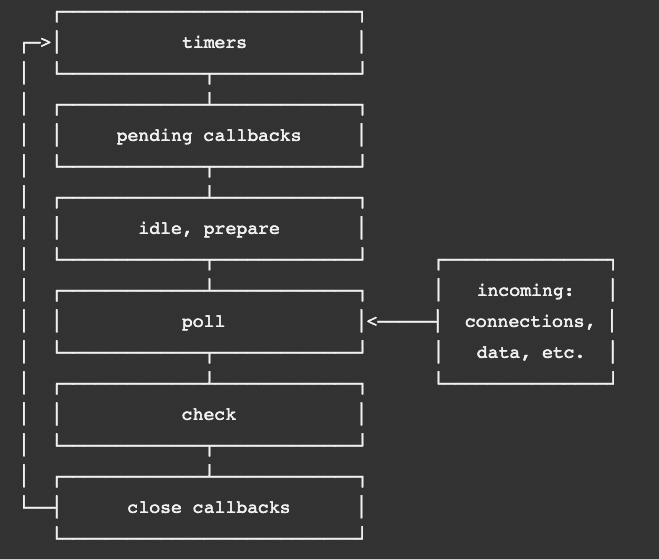

图 8.1–节点文档中的节点事件循环

您还可以将阶段视为异步任务的类别及其回调。

所有框架都有各自的优缺点。节点的主要优势在于异步 I/O 绑定的可伸缩性。因此，节点最好用于需要多个同时连接的高度并发工作负载。在 Node 的更高版本中，从 10.5 开始，Node 团队引入了工作线程，以添加多线程功能，用于运行 CPU 限制的任务，这些任务主要是关于执行长时间运行的计算。然而，这并不是 Node 的主要优势。对于计算量大的工作负载，可能有更好的选择。但是，由于 Node 的首要任务是为 React 前端创建一个高度可伸缩的 API，因此 Node 可以很好地满足我们的需要。

在下一节中，我们将开始在节点中编写代码，而不使用任何包装库（如 Express 或膝关节炎），深入挖掘节点。这不仅可以让我们更清楚地了解节点核心是如何工作的，还可以帮助我们更好地理解 Node 和 Express 之间的差异。

# 学习节点的能力

在上一节中，我们对节点是什么以及为什么它的伸缩性如此之好进行了高层次的概念性概述。在本节中，我们将通过使用 Node 编写代码来开始利用这种可伸缩性。我们将安装 Node，设置一个项目，并开始探索 NodeAPI。

## 安装节点

在可以使用节点编写代码之前，我们需要安装它。接下来，在前面的章节中，您可能已经完成了这项工作，但让我们重新回忆一下如何在节点频繁更新时再次安装它：

1.  Go to [https://nodejs.org](https://nodejs.org). The following screenshot shows this page as of the time of writing this book:

    

    图 8.2–节点网站

    对于生产使用，您可能希望走更保守的路线，使用**长期支持**（**LTS**版本，如图所示，但由于我们想了解本书的最新版本，所以让我们选择**当前**版本。

    笔记

    一般来说，Node 的更高版本会稍微快一些，并且有更多的安全性和 bug 修复。但是，可能引入了新问题，因此在升级生产服务器时应小心。

    通过安装 Node，我们获得了运行时以及最新的`npm`包管理器。

2.  单击所选版本后，系统将要求您保存一个与您的操作系统匹配的安装包。保存包，然后启动它。然后，您将看到如下屏幕：


图 8.3–节点设置

按照安装窗口的指导完成安装。

很好，现在我们已经安装或更新了节点运行时和`npm`包管理器。如前所述，Node 不仅是一个服务器框架，而且是一个完整的运行时环境，允许您编写各种不同的应用程序。例如，节点有一个名为 REPL 的命令行接口。如果打开命令行或终端并键入`node`，您将看到它转换为接受 JavaScript 命令，如下所示：


图 8.4–节点回复

在本书中，我们将不使用 REPL，但我将其包括在这里，以便您知道它的存在，可能对您未来的项目有用。您可以在官方文档[中了解有关 REPL 的更多https://nodejs.org/api/repl.html#repl_design_and_features](https://nodejs.org/api/repl.html#repl_design_and_features) 。另外，如果您好奇，`undefined`会被返回，因为每个命令都没有返回任何内容，而在 JavaScript 中，总是`undefined`。

好的，现在，让我们创建第一个 Node 应用程序，并探索 Node 的更多功能：

1.  打开 VSCode，然后打开终端到`Chap8`文件夹。
2.  然后，在`Chap8`文件夹中创建一个名为`try-node`的新文件夹。
3.  现在，创建一个名为`app.js`的文件。让我们暂时避免使用 TypeScript，这样我们就可以保持简单。
4.  Add a simple console message to `app.js`, like so:

    ```js
    console.log("hello world");
    ```

    然后，运行它：

    ```js
    node app.js
    ```

    您应该看到以下输出：


图 8.5–运行 app.js

这不是一个特别有用的应用程序，但正如您所看到的，Node 正在运行标准 JavaScript 代码。现在，让我们做一些更有用的事情。让我们使用以下步骤访问文件系统：

1.  In the same `app.js` file, delete the console message and enter the following code:

    ```js
    const fs = require("fs");
    ```

    您可能会被这段代码弄糊涂，因为它不是当前进行导入的样式。但是我想把它包括在这里，因为很多旧的节点代码仍然使用这种通用的 JS 风格语法来导入依赖项。所以，你应该意识到这一点。

2.  Next, write the following code to create a file and then read its contents:

    ```js
    fs.writeFile("test.txt", "Hello World", () => {
      fs.readFile("test.txt", "utf8", (err, msg) => {
        console.log(msg);
      });
    });
    ```

    如果运行此代码，您将看到以下输出和在您的`try-node`文件夹中创建的名为`test.txt`的文件：

    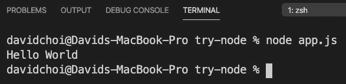

    图 8.6–app.js 输出

    `fs`的语法有点麻烦，因为它使用了较旧的回调样式。节点是在 JavaScript 收到承诺和[T1]之前很久创建的，因此[T4]一些调用仍然使用异步回调风格。然而，有一个更新的、支持承诺的版本`fs`——因此，它支持`async await`——可以替代使用。其语法如下所示：

    ```js
    const fs = require("fs/promises");
    (async function () {
      await fs.writeFile("test-promise.txt", "Hello    Promises");
      const readTxt = await fs.readFile("test-promise.txt",    "utf-8");
      console.log(readTxt);
    })();
    ```

    请注意，我们使用 iLife 来允许我们进行顶级等待呼叫。

    如果您使用的是较旧版本的 Node，`fs`/Promises 在版本 11 之后变得稳定，因此您可以使用一个名为`promisify`的工具来包装回调样式的调用，以使它们以`async await`样式工作。

    尽管如此，重要的是您要了解较旧的回调样式调用，因为从历史上看，节点代码就是这样编写的，而且今天可能还有大量节点代码仍然采用这种样式。

3.  我们在代码顶部看到，我们使用`require`进行`fs`导入。让我们切换到较新的导入语法。我们需要做两件事：将文件扩展名从`.js`更改为`.mjs`，并更新`require`语句，如下所示：

    ```js
    import fs from "fs";
    ```

如果你再次运行`app.mjs`，你会发现它仍然有效。我们可以在`package.json`的“类型”中设置配置标志：“模块”，但是对于这个示例应用，我们没有使用`npm`。此外，如果我们全局设置此标志，则我们不能再使用`require`。这可能是一个问题，因为一些较旧的`npm`依赖项仍然使用`require`进行导入。

笔记

有一个名为`--experimental-modules`的较旧命令行标志，它允许使用`import`，但现在不推荐使用它，对于较新版本的 Node，应该避免使用它。

## 创建一个简单的节点服务器

我们了解到节点基于一些较旧的 JavaScript 技术，如回调和 CommonJS。节点是在 JavaScript 承诺和较新版本的 JavaScript（如 ES6 及更高版本）之前创建的。尽管如此，Node 仍然可以正常工作，不断更新，稍后，当我们添加额外的库时，我们将能够在大多数情况下使用`async await`和 Promission。

现在，让我们来看一个更现实的节点服务器示例。我们将使用`npm`创建一个新项目：

1.  在【T0 的根目录】上创建一个新文件夹。
2.  将 Cd 放入`node-server`文件夹，并使用以下命令初始化`npm`：

    ```js
    npm init
    ```

3.  让我们调用包名`node-server`并接受其他`package.json`属性的默认值。
4.  Create a new file on the root called `server.mjs` and add the following code:

    ```js
    import http from "http";
    ```

    别担心，我们很快就会开始使用打字脚本。现在，让我们保持简单，以便我们可以专注于学习节点。

5.  We have imported the `http` library from the Node core. We then use `createServer` in order to create a server object. Notice that our `createServer` function takes a function as an argument with two parameters. The parameters, `req` and `res`, are of the `Request` and `Response` type, respectively. A `Request` object will have all the members relevant to the request that was made by our users and the response allows us to modify our response before sending it back out.

    在`createServer`处理函数的末尾，我们使用`res.end`并返回文本来显式结束调用。如果我们没有发送`end`，我们的回复将永远不会完成，浏览器上也不会显示任何内容：

    ```js
    const server = http.createServer((req, res) => {
      console.log(req);
      res.end("hello world");
    });
    ```

6.  最后，我们使用新的服务器对象来等待和侦听新请求，使用带有端口号的`listen`函数和一个回调函数来打印服务器已启动：

    ```js
    const port = 8000;
    server.listen(port, () => {
      console.log(`Server started on port ${port}`);
    });
    ```

7.  Run this code by executing our `server.mjs` script (make sure to use the correct extension of `.mjs`):

    ```js
    node server.mjs
    ```

    请记住，在我们工作时，目前没有自动重新加载功能。因此，在代码更改时，我们必须手动停止并重新启动。我们将在以后继续向项目中添加更多功能时添加此功能。

8.  如果您将浏览器打开到`http://localhost:8000`，您应该会看到在浏览器中打印的**hello world**以及控制台中的以下内容：

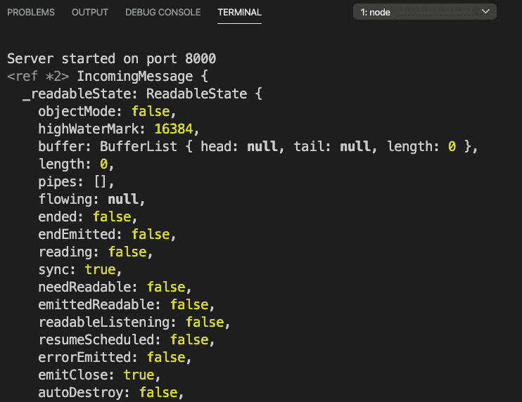

图 8.7–第一个节点服务器运行

终端显示`req`对象及其成员。当然，我们很快会详细介绍`Request`和`Response`。

另一个有趣的是，无论我们给出什么 URL，它总是返回相同的**hello world**文本。这是因为我们没有实施任何路线处理。处理路线是我们必须学习的另一项，以便正确使用节点。

您可以继续刷新浏览器，服务器将继续响应**hello world**。正如您所看到的，无论我们发送多少请求，服务器都保持运行状态，而不是像典型的脚本程序那样返回和结束。这是因为作为节点核心的事件循环是一种无限循环，它将继续等待新任务并尽职尽责地处理它们。

恭喜，您已经运行了第一个节点服务器！诚然，这是一个简陋的开端，但无论如何，您现在可以进行真正的浏览器调用，我们的服务器将做出响应。所以，你在路上很顺利。

## 请求与响应

当来自浏览器的请求到达服务器时，所有服务器框架通常会有两个对象：`Request`和`Response`。这两个对象表示来自浏览器的请求的相关数据以及将返回给它的响应。让我们从浏览器中查看这些对象，看看它们是由什么构成的。重新加载浏览器，但这一次在`Network`选项卡上打开 Chrome 开发工具：


图 8.8–Chrome 开发工具网络选项卡

此视图仅从浏览器的角度来看，在节点中，这些对象中有大量更多信息。然而，在我们尝试创建任何真正的 web 服务器之前，我们需要首先了解 web 请求是由什么组成的。那么，让我们列出一些更重要的项目，并描述它们的含义。

### 请求 URL

显然，这表示发送到服务器的完整 URL 路径。但是服务器需要知道完整路径的原因是很多附加信息通常可以通过 URL 发送。例如，如果我们的 URL 是`http://localhost:8000/home?userid=1`，这里实际上有相当数量的信息。首先，我们告诉服务器我们正在`home`子目录中查找网页或 API 数据。这允许服务器仅使用特定于该 URL 的 HTML 页面或数据来定制其返回的响应。此外，我们还传递了一个名为`userid`的参数（参数在问号后开始，多个参数可以用`&`符号分隔），服务器可以使用该参数在请求中提供唯一的数据。

### 请求方法

请求方法表示所谓的 HTTP 谓词。动词只是告诉服务器客户端打算执行什么操作的描述。默认动词是 GET，这意味着，正如名称所示，浏览器希望读取一些数据。其他动词是 POST，表示创建或插入；PUT，表示更新；DELETE，表示删除。在[*第 9 章*](09.html#_idTextAnchor139)中*什么是 GraphQL？*，我们将看到 GraphQL 只使用 POST 方法，但这实际上并不是一个错误，因为动词不是硬规则，而是更像指南。另外需要注意的一点是，在使用 GET 时，URL 中会提供所需的任何参数，如请求 URL 项目符号示例所示。但是，对于 POST，参数在请求正文中提供。我们将在*学习表达能力*部分进一步讨论这些差异。

### 状态码

所有 web 请求都将返回这些代码以指示请求的结果。例如，`200`状态表示成功。我不会在这里列出所有这些选项，但我们应该知道一些最常见的选项，因为它有时有助于调试：

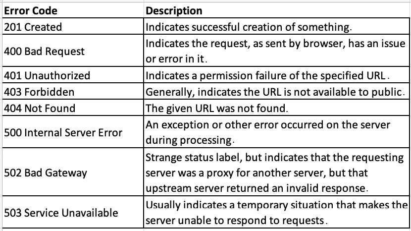

图 8.9–错误代码

### 标题

标题提供作为描述或元数据的附加信息。如图所示，有多种类型的头：general、request、response 和 entity。再说一遍，我不会把所有的都看一遍，但是有一些我们应该熟悉。以下是请求头：


图 8.10–请求标头

这里是响应头：


图 8.11–响应标题

这当然是枯燥的信息。然而，了解这些请求和响应所涉及的内容有助于我们更好地理解网络是如何工作的，从而编写更好的网络应用程序。现在让我们更深入地了解路由。

## 路由

路由在某种意义上很像向服务器传递参数。当服务器看到特定路由时，它将知道响应需要以某种方式进行。响应可能返回一些特定数据或将数据写入数据库，但路由有助于我们管理服务器对每个请求的行为。

让我们在节点中执行一些路由处理：

1.  Update the `server` object in the `server.mjs` file in the `node-server` project, like this:

    ```js
    const server = http.createServer((req, res) => {
      if (req.url === "/") {
        res.end("hello world");
      } else if (req.url === "/a") {
        res.end("welcome to route a");
      } else if (req.url === "/b") {
        res.end("welcome to route b");
      } else {
        res.end("good bye");
      }
    });
    ```

    如您所见，我们将[T0]字段与几个 URL 进行比较。对于每个匹配项，我们用一些独特的文本结束我们的响应。

2.  Run the server again and try each route. For example, if your route is `http://localhost:8000/a`, then you should see this:

    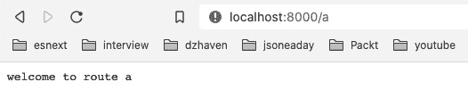

    图 8.12–路线/a

3.  Okay, now let's see what happens if we receive a POST request. Update your `createServer` function like this:

    ```js
    const server = http.createServer((req, res) => {
      if (req.url === "/") {
        res.end("hello world");
      } else if (req.url === "/a") {
        res.end("welcome to route a");
      } else if (req.url === "/b") {
        res.end("welcome to route b");
      } else if (req.url === "/c" && req.method === "POST") {
        let body = [];
        req.on("data", (chunk) => {
          body.push(chunk);
        });
        req.on("end", () => {
          const params = Buffer.concat(body);
          console.log("body", params.toString());
          res.end(`You submitted these parameters: 
           ${params.toString()}`);
        });
      } else {
        res.end("good bye");
      }
    });
    ```

    如您所见，我们添加了另一个带有`/c`路由和`POST`方法类型的`if else`语句。您可能会惊讶地看到，为了从我们的通话中获取已发布的数据，我们需要先处理`data`事件，然后处理`end`事件，以便我们可以返回通话。

    让我解释一下这是怎么回事。节点的级别非常低，这意味着它不会隐藏其复杂的细节以使事情更简单，从而提高性能。因此，当发出请求并向服务器发送某些信息时，这些数据将作为流发送。这仅仅意味着数据不是一次性发送的，而是分块发送的。Node 不会对开发人员隐藏这一事实，而是使用事件系统以块的形式接收数据，因为它不清楚预先输入了多少数据。然后，一旦这个数据被接收完毕，`end`事件就会触发。

    在此示例中，`data`事件用于将数据聚合到一个数组中。然后，使用`end`事件将该数组放入内存缓冲区，然后可以从中作为一个整体进行处理。在我们的例子中，它只是 JSON，所以我们转换为字符串。

4.  To test this, let's submit a POST request using `curl`. `curl` is just a command-line tool that allows us to make web server requests without using a browser. It's great for testing. Execute the following code in your terminal (if you're on Windows, you may need to install `curl` first; on macOS, it should already be there):

    ```js
    curl --header "Content-Type: application/json"  --request POST --data '{"userid":"1","message":"hello"}' "http://localhost:8000/c"
    ```

    您应该获得以下信息：

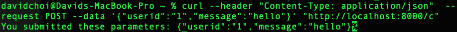

图 8.13–卷曲柱的结果

显然，所有这些都是可行的，但从开发生产力的角度来看并不理想。我们不希望[T2]在一个[T1]函数中包含 30 个[T0]语句。它很难阅读和维护。我们将看到 Express 如何通过在节点顶部提供额外的包装器来帮助我们避免这些类型的问题，从而使开发更快、更可靠。我们将在*了解 Express 如何改进节点开发*一节中看到这一点。让我们先了解一些帮助节点编码的工具。

## 调试

正如我们在 React 中看到的，调试器是帮助代码故障排除的一个非常重要的工具。当然，在 Node 的案例中，我们不能使用浏览器工具，但是 VSCode 有一个内置的调试器，它允许我们中断代码并查看值。让我们看看这个，因为我们也将使用它与 Express：

1.  Click on the debugger icon in VSCode and you'll see the following screen. In the current version, as of the time of writing, it looks like this:

    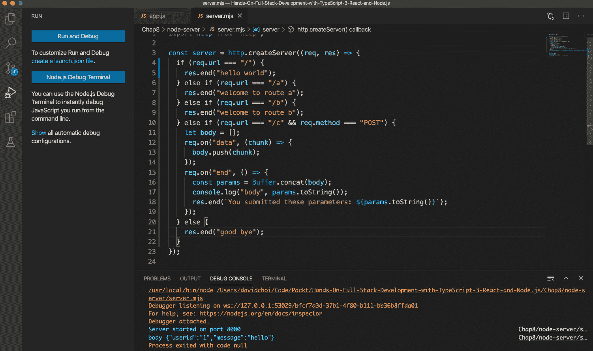

    图 8.14–VSCode 调试器菜单

    第一个按钮运行调试器，第二个按钮显示终端的调试器版本。运行调试器时，您通常希望查看调试器控制台，因为它可以显示运行时发生的错误。

2.  When running the VSCode debugger, you want to click on the **Run and Debug** button. Then, you will see the dropdown shown in the following screenshot. Select **Node.js** and that will start your Node session as a debug session. Notice the continue, pause, restart, and stop buttons at the upper right. Note also that running in debug mode using VSCode is a completely different run of Node from the running of Node using the `npm start` command:

    

    图 8.15–Node.js 调试器选择

3.  Once you start your debugger, if you have set a breakpoint by clicking next to any line number, you will be able to have the code pause there. Then, you can view values that are relevant to that scope:

    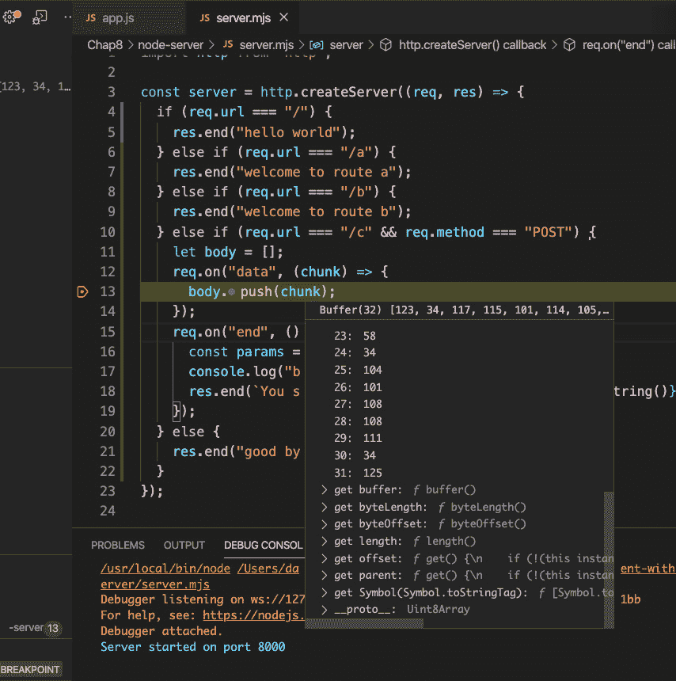

    图 8.16–联机中断视图

    如您所见，我们在`data`事件的第 13 行设置了一个断点，可以查看当前块。点击继续按钮或点击*F5*继续运行程序。

4.  在断点上将[T0]悬停在值上很有用，但不是帮助调试应用程序的唯一方法。我们还可以使用调试器屏幕帮助我们了解在断点处停止时的值。请看以下屏幕截图：


图 8.17–调试窗口完整视图

请看屏幕截图中间的断点。我们可以看到，我们已经突破了`end`事件处理程序范围的内部。让我们看一下列出的一些功能：

*   从左上角的菜单**变量**开始，我们可以看到**局部**部分和我们当前停止的代码范围中存在的两个变量：`params`和`this`。同样，我们在看**本地**范围，它现在是`end`事件的事件处理程序，这就是为什么我们只有这两个变量。
*   在**手表**菜单的左中部附近，我们看到一个名为`params`的变量，我添加了这个变量。本节中有一个加号，允许我们添加感兴趣的变量，当它们进入范围时，当前值将显示在那里。
*   然后，在左下角，我们看到**调用堆栈**。调用堆栈是我们的程序正在运行的调用列表。列表将以相反的顺序显示，最后一个命令位于顶部。通常，这些调用中的许多都是来自节点或我们自己没有编写的其他框架的代码。
*   然后，在右下角，我们有**调试控制台**选项卡，它显示应用程序运行时的所有日志或错误。注意，在这个选项卡的底部，我们还可以输入代码来查看结果。例如，我键入了[T0]变量，并显示了它的缓冲区。
*   最后，在右上角，我们看到调试继续按钮。左边的第一个按钮是 continue 按钮，它从最后一个断点继续运行我们的应用程序。下一步是“跳过”按钮，它将转到下一行并在那里停止。下一步是“单步执行”按钮，它将在函数或类运行时引导您进入函数或类的定义。然后，还有一个跳出按钮，它会将您带出并返回到父调用方。最后一个方形按钮将完全停止我们的应用程序。

这是对 VSCode 调试器的快速介绍。随着我们进入 Express，我们将使用更多的它，稍后再使用 GraphQL。

现在，正如您所看到的，每次进行任何更改时都必须手动重新启动节点服务，这有点痛苦，并且会减慢开发速度。因此，让我们使用一个名为`nodemon`的工具，每当我们保存脚本更改时，它将自动重新启动节点服务器：

1.  Install `nodemon` globally by running the following command:

    ```js
    npm i nodemon -g
    ```

    这会将`nodemon`安装到我们的整个系统中。全局安装允许所有应用程序运行`nodemon`，而无需继续安装。请注意，在 macOS 和 Linux 上，您可能需要在该命令前面加上`sudo`，这将提升您的权限，以便您可以全局安装该命令。

2.  Now, we want to start it upon app start. Update the `package.json` file by finding the `"scripts"` section and adding a sub-field called `"start"`, and then add the following command to it:

    ```js
    nodemon server.mjs
    ```

    您的`package.json``"scripts"`部分现在应该是这样的：

    

    图 8.18–package.json“脚本”部分

3.  Now, run the new script using the following command:

    ```js
    npm start
    ```

    请注意，正常情况下，在运行`npm`命令时，需要运行`npm run <file name>`。但是，对于`start`脚本，我们可以跳过`run`子命令。

    你应该会看到应用程序像往常一样启动。

4.  现在应用程序正在运行，让我们尝试更改并保存[T0]文件。将`listen`函数中的字符串更改为``The server started on port ${port}``。保存此更改后，您应该会看到节点重新启动以及终端上显示的新文本。
5.  The settings within `package.json` do not affect our VSCode debugger. So, to set auto-restart, we'll need to set that up as well. Go to your debugger menu again and click the **create a launch.json file** button, as shown here:

    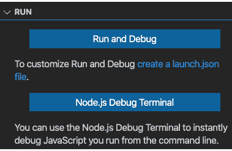

    图 8.19–创建新的 launch.json 文件

    如果单击此按钮，您将看到 GitHub 存储库根目录中`.vscode`文件夹中的`launch.json`文件（而不是项目根目录）。它应该包含以下配置（请注意，这一个文件可以包含多个配置）：

    ```js
    {
      // Use IntelliSense to learn about possible attributes.
      // Hover to view descriptions of existing attributes.
      // For more information, visit: 
        // https://go.microsoft.com/fwlink/?linkid=830387
      "version": "0.2.0",
      "configurations": [
        {
          "type": "node",
          "request": "launch",
          "name": "Launch node-server Program",
          "skipFiles": ["<node_internals>/**"],
          "program": "${workspaceFolder}/Chap8/node-
            server/server.mjs",
          "runtimeExecutable": "nodemon",
          "restart": true,
          "console": "integratedTerminal"
        }
      ]
    }
    ```

    您可以看到`configurations`字段是一个数组，这意味着您可以继续向这个文件添加配置。但是对于我们的配置，请注意，`type`当然是`node`。我们还将`name`更新为`"Launch node-server Program"`。但也请注意，我们将`runtimeExecutable`切换为`nodemon`而不是`node`，并且`console`现在是集成终端。为了在调试器中使用`nodemon`，我们必须切换到**终端**选项卡，而*不是*调试器控制台。

6.  Now that we have at least one `launch.json` configuration, our debug menu will show the following view:

    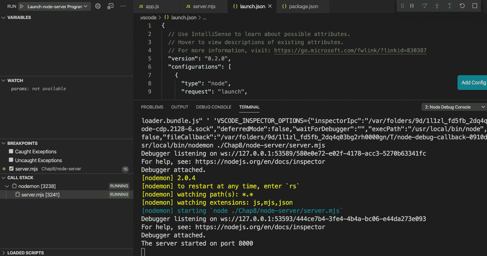

    图 8.20–launch.json 中的调试器

    如果您的下拉列表未显示**启动节点服务器程序**，请选择该程序，然后按播放按钮。然后，您应该看到调试器再次启动，只是这次它将自动重新启动。

7.  Now, try and make a small change and the debugger should auto-restart. I removed the `T` from the `listen` function log message:

    

    图 8.21-调试器自动重新启动

8.  好极了，现在我们可以轻松地打开并调试节点代码了！

这是对一些工具的快速介绍，这些工具将有助于我们的开发和调试。

在本节中，我们学习了如何直接使用 Node 对服务器进行编码。我们还学习了调试和工具来改进我们的开发流程。直接使用节点编码可能非常耗时且不直观。在接下来的部分中，我们将学习 Express 以及它如何帮助我们更好地体验节点开发。

# 了解 Express 如何改进节点开发

正如我们所看到的，直接使用 Node 进行编码有一种笨拙和麻烦的感觉。拥有一个更易于使用的 API 将使我们的生产效率更高。这就是 Express 框架试图做到的。在本节中，我们将了解什么是 Express，以及它如何帮助我们更轻松地为节点应用程序编写代码。

Express 不是一个独立的 JavaScript 服务器框架。它是位于节点顶部的一层代码，因此使用节点，使使用节点开发 JavaScript 服务器变得更容易，也更有能力。就像 Node 一样，它有自己的核心功能，然后通过依赖项包提供一些附加功能。Express 还拥有其核心功能，以及提供额外功能的丰富中间件生态系统。

那么，什么是快递？根据该网站的说法，Express 只是一个由一系列中间件调用组成的应用程序。让我们先看一个图表来解释这一点：

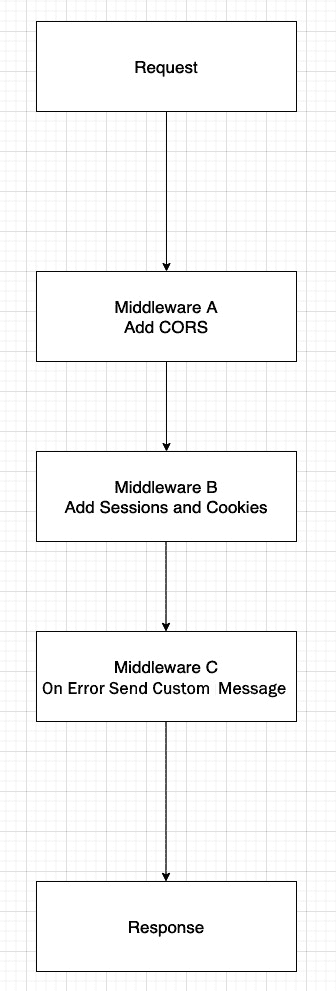

图 8.22–快速请求-响应流

每当新的服务器请求传入时，它都会沿着一条顺序路径进行处理。通常，您只需要一个请求，然后一旦理解并处理该请求，您就会得到一些响应。但是，在使用 Express 时，您可以使用多个中间函数将自己注入到流程中，并执行一些独特的工作。

因此，在*图 8.22*所示的示例中，我们看到首先有一个中间件添加了 CORS 功能，这是一种允许来自不同 URL 域的请求的方式，而不是服务器驻留在上的 URL 域。然后，我们有了处理会话和 cookie 的中间件。会话只是收集到的关于用户当前网站使用情况的唯一数据，例如，他们的登录 ID。最后，我们看到一个 on error handler，它将根据发生的错误确定将显示的一些唯一消息。当然，您可以根据需要添加更多中间件。这里的关键点是，Express 能够以一种相当简单的方式注入 Node 通常不具备的额外功能。

除此之外，Express 还为`Request`和`Response`对象添加了其他功能，进一步提高了开发人员的生产率。我们将在下一节中查看这些功能并进一步探讨 Express。

# 学习 Express 的能力

Express 基本上是节点的中间件运行程序。但是，像生活中的大多数事情一样，一个简单的解释很少能提供正确使用它所必需的信息。因此，在本节中，我们将探索 Express 并通过示例了解其功能。

让我们在`node-server`项目中安装 Express。在终端中键入以下命令：

```js
npm I express -S
```

这将为您提供一个更新的`package.json`文件，其中包含一个新的依赖项部分：


图 8.23–更新的 package.json

现在，在我们开始编写代码之前，我们需要了解一些事情。同样，如前所述，Express 是围绕节点的包装器。这意味着 Express 已在内部使用节点。所以，当我们使用 Express 编写代码时，我们不会直接调用节点。让我们看看这是什么样子：

1.  Create a new server file called `expressapp.mjs` and add the following code to it:

    ```js
    import express from "express";
    const app = express();
    app.listen({ port: 8000 }, () => {
      console.log("Express Node server has loaded!");
    });
    ```

    如您所见，我们创建了一个`express`实例，然后对其调用一个名为`listen`的函数。在内部，`express.listen`函数调用节点的`createServer`和`listen`函数。如果运行此文件，将看到以下日志消息：

    

    图 8.24–expressapp.mjs 文件正在运行

    现在我们有了一个运行的 Express 服务器。然而，在我们添加一些中间件之前，它不会做任何事情。Express 的中间件在几个主要的保护伞或部分下运行。有一些中间件可以为整个应用程序运行，有一些中间件只能在路由过程中运行，还有一些中间件可以在错误上运行。还有中间件，它是表示内部使用的核心。当然，我们也可以使用提供第三方中间件的`npm`包，而不是实现我们自己的代码来完成中间件的工作。在前面的章节*中我们已经看到了其中的一些内容，*图 8.22*中的*理解 Express 如何改进节点开发*。*

2.  Let's start by adding our own middleware. Update `expressapp.mjs` with the following code:

    ```js
    import express from "express";
    const app = express();
    app.use((req, res, next) => {
      console.log("First middleware.");
      next();
    });
    app.use((req, res, next) => {
      res.send("Hello world. I am custom middleware.");
    });
    app.listen({ port: 8000 }, () => {
      console.log("Express Node server has loaded!");
    });
    ```

    因此，对于第一个示例，我们决定通过在`app`对象上使用`use`函数来使用应用程序级中间件。这意味着对整个应用程序的任何请求，无论路由如何，都必须处理这两个中间件。

    让我们检查一下。首先，请注意，所有中间件都是按照它们在代码中声明的顺序进行处理的。其次，除非在中间件的末尾结束调用，否则必须调用`next`函数转到下一个中间件，否则处理将停止。

    第一个中间件只是记录一些文本，而第二个中间件将使用 Express`send`功能写入浏览器屏幕。`send`函数与节点中的`end`函数非常相似，因为它结束了处理，但它也返回了一个`text/html`类型的内容类型头。如果我们要显式地使用节点头，我们将发送自己。

3.  Now, let's add middleware for routes. Note that technically, you can pass routes – for example, the `/routea` route – to the `use` function. However, it is better to use the `router` object and contain our routes under one container. In Express, a router is also middleware. Let's see an example:

    ```js
    import express from "express";
    const router = express.Router();
    ```

    首先，我们从`express.Router`类型创建了新的`router`对象：

    ```js
    const app = express();
    app.use((req, res, next) => {
      console.log("First middleware.");
      next();
    });
    app.use((req, res, next) => {
      res.send("Hello world. I am custom middleware.");
    });
    app.use(router);
    ```

    因此，我们在`app`对象中添加了与之前相同的中间件集，这使得它可以在所有路由上全局运行。但是，我们还将`router`对象作为中间件添加到我们的应用程序中。但是，路由器中间件仅为定义的特定路由运行：

    ```js
    router.get("/a", (req, res, next) => {
      res.send("Hello this is route a");
    });
    router.post("/c", (req, res, next) => {
      res.send("Hello this is route c");
    });
    ```

    因此，我们再次向`router`对象添加了两个中间件：一个用于`/a`路由，它使用`get`方法函数，另一个用于`/c`路由，它使用`post`方法函数。同样，这些函数表示可能的 HTTP 谓词。`listen`函数调用与之前相同：

    ```js
    app.listen({ port: 8000 }, () => {
      console.log("Express Node server has loaded!");
    });
    ```

    现在，如果我们通过转到以下 URL 来运行此代码，将发生一件奇怪的事情：`http://localhost:8000/a`。我们不会看到**你好这是路线 a**文本，而是会看到**你好世界。我是定制中间件。**文本。你能猜出原因吗？这是因为中间件顺序很重要，因为我们的第二个应用程序级中间件正在调用`res.send`，所以所有调用都将在那里结束，而不会转到下一个中间件。

    删除发送`Hello world…`消息的第二个`app.use`呼叫，然后尝试转到`http://localhost:8000/a`。您现在应该看到以下消息：

    

    图 8.25–路由/a 的中间件

    很好，这很有效，但现在请尝试使用您的浏览器转到`http://localhost:8000/c`。这样行吗？不，它没有，并且您收到了**无法获取/c**消息。正如您可能已经猜到的，浏览器调用默认为获取调用，但我们的`/c`路由是只发送邮件的路由。如果您打开终端并运行我们在*学习节点功能*部分中使用的最后一个 POST`curl`命令，您将看到：

    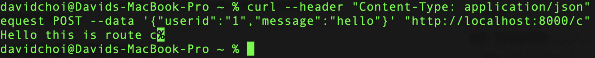

    图 8.26–路线/c

    如您所见，我们收到了相应的文本消息。

4.  Now, let's add third-party middleware. In the *Learning Node's capabilities* section, we saw how to parse POST data and how arduous that can be using Node. For our example, let's use the body parser middleware to make doing this easier. Update the code like this:

    ```js
    import express from "express";
    import bodyParser from "body-parser";
    ```

    我们首先导入 body 解析器中间件。然后，我们在顶部添加主体解析器，以便所有处理程序都可以在需要时自动从 JSON 字符串转换为已解析对象：

    ```js
    const router = express.Router();
    const app = express();
    app.use(bodyParser.json());
    ```

    然后，我们更新`/c`路由处理程序，使其文本消息显示在`message`字段中传递的值：

    ```js
    app.use((req, res, next) => {
      console.log("First middleware.");
      next();
    });
    app.use(router);
    router.get("/a", (req, res, next) => {
      res.send("Hello this is route a");
    });
    router.post("/c", (req, res, next) => {
      res.send(`Hello this is route c. Message is 
       ${req.body.message}`);
    });
    ```

    如您所见，与使用节点事件（如[T0]和[T1]）相比，这项工作的大部分都要简单一些。

5.  Now, finally, let's do an on error middleware. Simply add the following code to just below the `bodyParser.json()` middleware call:

    ```js
    import express from "express";
    import bodyParser from "body-parser";
    const router = express.Router();
    const app = express();
    app.use(bodyParser.json());
    app.use((req, res, next) => {
      console.log("First middleware.");
      throw new Error("A failure occurred!");
    });
    ```

    然后，我们从第一个自定义中间件抛出一个错误：

    ```js
    app.use(router);
    router.get("/a", (req, res, next) => {
      res.send("Hello this is route a");
    });
    router.post("/c", (req, res, next) => {
      res.send(`Hello this is route c. Message is ${req.body.   message}`);
    });
    app.use((err, req, res, next) => {
      res.status(500).send(err.message);
    });
    ```

    现在，我们已经添加了错误处理程序作为代码中的最后一个中间件。此中间件将捕获以前未处理的所有错误，并发送相同的状态和消息：

    ```js
    app.listen({ port: 8000 }, () => {
      console.log("Express Node server has loaded!");
    });
    ```

6.  转到`http://localhost:8000/a`您将看到以下消息：

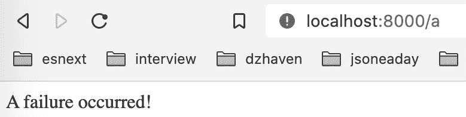

图 8.27–错误消息

由于我们的顶级中间件正在抛出异常，所有路由都将抛出该异常，因此将被我们的错误处理中间件捕获。

这是对 Express 框架及其特性的概述。如您所见，它可以使使用 Node 进行开发变得更加简单和清晰。在下一节中，我们将介绍如何使用 Express 和 Node 构建一个返回 JSON 的 web API，JSON 是 web 的默认数据模式。

# 使用 Express 创建 web API

在本节中，我们将了解 web API。目前，它是通过网络提供数据的最流行方式之一。在我们的最终应用程序中，我们将不使用 web API，因为我们打算使用 GraphQL。然而，对 web API 设计有一些了解是很好的，因为在互联网上，它非常常用，而且在幕后，GraphQL 也可以类似地工作。

什么是 web API？**API**代表**应用编程接口**。这意味着这是一个编程系统与另一个编程系统交互的方式。因此，web API 是使用 web 技术向其他系统提供编程服务的 API。web API 以字符串的形式发送和接收数据，而不是二进制数据，通常采用 JSON 格式。

所有 web API 都将有一个由 URI 表示的端点，基本上与 URL 相同。此路径必须是静态的，不能更改。如果需要更改，那么 API 供应商将执行版本更新，保留旧 URI 不变，并创建一个由版本升级描述的新 URI。例如，如果 URI 以`/api/v1/users`开头，那么下一次迭代将是`/api/v2/users`。

为了演示，让我们创建一个简单的 web API：

1.  Let's update our `expressapp.mjs` file with the following new routes:

    ```js
    import express from "express";
    import bodyParser from "body-parser";
    const router = express.Router();
    const app = express();
    app.use(bodyParser.json());
    app.use((req, res, next) => {
      console.log("First middleware.");
      next();
    });
    ```

    到目前为止的一切都是一样的，除了注意，我们删除了抛出的异常：

    ```js
    app.use(router);
    router.get("/api/v1/users", (req, res, next) => {
      const users = [
        {
          id: 1,
          username: "tom",
        },
        {
          id: 2,
          username: "jon",
        },
        {
          id: 3,
          username: "linda",
        },
      ];
      console.log(req.query.userid);
      const user = users.find((usr) => usr.id == req.query.   userid);
      res.send(`User ${user?.username}`);
    });
    ```

    第一个中间件显示了`/api/v1/users`路径。这种类型的路径是 web API 的标准。它指示要查询的数据的版本和相关容器–在本例中为用户。例如，我们使用一个硬编码的用户数组，只找到一个具有匹配 ID 的用户。因为`id`是一个数字，而来自`req.query`的任何内容都是一个字符串，所以我们使用`==`而不是`===`。如果将浏览器加载到 URI，则应看到以下内容：

    

    图 8.28–用户获取请求

    如您所见，我们的第二个用户`jon`被返回。

2.  Next, for this middleware, we are doing something almost identical for groups. Notice how the pathing is consistent between both resource paths. This is an important feature for a web API. Again, we take a single item from an array, but in this case, we are using a POST method, so the parameter is gotten from the body:

    ```js
    router.post("/api/v1/groups", (req, res, next) => {
      const groups = [
        {
          id: 1,
          groupname: "Admins",
        },
        {
          id: 2,
          groupname: "Users",
        },
        {
          id: 3,
          groupname: "Employees",
        },
      ];
      const group = groups.find((grp) => grp.id == req.body.   groupid);
      res.send(`Group ${group.groupname}`);
    });
    ```

    如果对此 URI 运行 terminal 命令，则应看到以下内容：


图 8.29–团体 POST 请求

如图所示，返回了我们的第一组`Admins`。代码的其余部分是相同的：

```js
app.use((err, req, res, next) => {
  res.status(500).send(err.message);
});
app.listen({ port: 8000 }, () => {
  console.log("Express Node server has loaded!");
});
```

重要提示

由于 WebAPI 特定于 web 技术，因此它支持所有 HTTP 方法的调用：GET、POST、PATCH、PUT 和 DELETE。

这s 是对使用 Express 和 Node 构建 web API的快速介绍。现在，我们对 Node 及其最重要的框架 Express 有了一个广泛的概述。

# 总结

在本章中，我们学习了 Node 和 Express。节点是核心服务器端技术，它驱动着 web 上大量的服务器，而 Express 是构建 web 应用程序最流行和最常用的基于节点的框架。现在，我们已经全面了解了前端和后端技术如何创建网站。

在下一章中，我们将了解 GraphQL，这是一种非常流行且相对较新的用于创建基于 web 的 API 服务的标准。一旦我们涵盖了这一点，我们将拥有开始构建项目所需的所有知识。