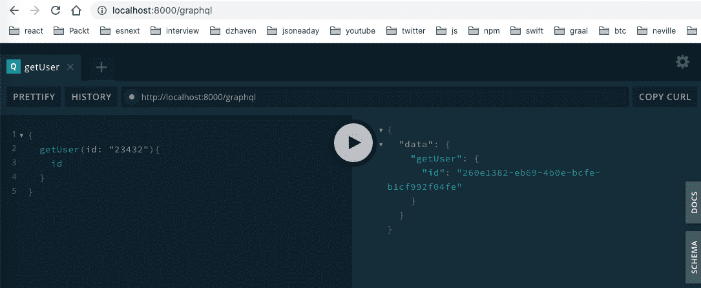
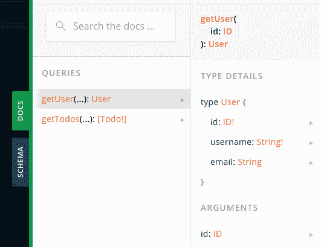
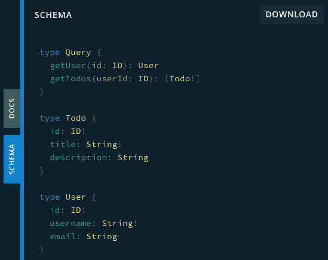

# 九、什么是 GraphQL？

在本章中，我们将学习 GraphQL，它是目前使用的最热门的 web 技术之一。许多大公司已经采用 GraphQL 作为 API，包括 Facebook、Twitter、纽约时报和 GitHub 等公司。我们将了解是什么使 GraphQL 如此流行，它如何在内部工作，以及我们如何利用它的特性。

在本章中，我们将介绍以下主要主题：

*   理解 GraphQL
*   理解 GraphQL 模式
*   理解 typedef 和解析器
*   了解查询、突变和订阅

# 技术要求

您应该对使用 Node 进行 web 开发有基本的了解。我们将再次使用 Node 和 visualstudio 代码。

GitHub 存储库位于[https://github.com/PacktPublishing/Full-Stack-React-TypeScript-and-Node](https://github.com/PacktPublishing/Full-Stack-React-TypeScript-and-Node) 。使用`Chap9`文件夹中的代码。

要设置`Chap9`代码文件夹，请转到您的`HandsOnTypescript`文件夹并创建一个名为`Chap9`的新文件夹。

# 理解图形 ql

在本节中，我们将探讨什么是 GraphQL，为什么创建它，以及它试图解决什么问题。理解 GraphQL 存在的根本原因很重要，因为它将帮助我们设计更好的 web API。

那么，什么是 GraphQL？让我们列出它的一些主要特征：

*   **GraphQL is a data schema standard developed by Facebook.**

    GraphQL 提供了一种用于定义数据、数据类型和相关数据查询的标准语言。您可以认为 GraphQL 大致类似于提供契约的接口。这里没有代码，但您仍然可以看到可用的类型和查询。

*   **GraphQL works across platforms, frameworks, and languages.**

    当我们使用 GraphQL 创建 API 时，无论我们使用何种编程语言或操作系统，都将使用相同的 GraphQL 语言来描述我们的数据、数据类型和查询。当然，对于客户机和系统来说，在各种系统和平台上对数据进行一致和可靠的表示是一件好事。但这对程序员也是有益的，因为我们可以继续使用我们所选择的常规编程语言和框架。

*   **GraphQL returns control for what is queried to the caller.**

    在标准 web 服务中，由服务器控制将返回哪些数据字段。但是，在 GraphQLAPI 中，由客户机确定希望接收哪些字段。这为客户端提供了更好的控制，并减少了带宽使用和成本。

广义地说，GraphQL 端点有两种主要用途。一个是整合其他数据服务的网关，另一个是直接从数据存储接收数据并将其提供给客户端的主 web API 服务。以下是 GraphQL 用作其他数据网关的示意图：


图 9.1–作为网关的 GraphQL

如您所见，GraphQL 是所有客户机的唯一真相来源。由于其基于标准的语言在各种系统中都得到支持，因此它在这种能力下工作得很好。

对于我们自己的应用，我们将使用它作为我们的整个 web API，但是可以将它与现有的 web 服务混合使用，以便 GraphQL 只处理正在进行的服务调用的一部分。这意味着您不需要重写整个应用。您可以在有意义的地方缓慢而有意识地引入 GraphQL，而不会中断当前的应用服务。

在本节中，我们从概念层面上看了 GraphQL。GraphQL 有自己的数据语言，这意味着无论服务器框架、应用编程语言或操作系统如何，都可以使用它。这种灵活性使 GraphQL 成为在整个组织甚至整个 web 上共享数据的强大手段。在下一节中，我们将探索 GraphQL 模式语言，并了解它是如何工作的。它将帮助我们构建数据模型，并了解如何设置 GraphQL 服务器。

# 理解 GraphQL 模式

如上所述，GraphQL 是一种用于向实体数据提供结构和类型信息的语言。无论服务器上使用哪个供应商的 GraphQL 实现，我们的客户机都可以期望返回相同的数据结构。这种将服务器的实现细节抽象到客户端的能力是 GraphQL 的优势之一。

让我们创建一个简单的 GraphQL 模式，看看它是什么样子：

1.  在`Chap9`文件夹中，创建一个名为`graphql-schema`的新文件夹。
2.  在该文件夹中打开终端，然后运行此命令，接受默认值：

    ```js
    npm init
    ```

3.  现在安装这些软件包：

    ```js
    npm i express apollo-server-express @types/express
    ```

4.  Initialize TypeScript with this command:

    ```js
    tsc -init
    ```

    请注意，此命令完成后，默认的`tsconfig.json`设置是严格的。

5.  Create a new TypeScript file called `typeDefs.ts` and add this to it:

    ```js
    import { gql } from "apollo-server-express";
    ```

    此导入获取`gql`对象，该对象允许对 GraphQL 模式语言进行语法格式化和高亮显示：

    ```js
    const typeDefs = gql`
      type User {
        id: ID!
        username: String!
        email: String
      }
      type Todo {
        id: ID!
        title: String!
        description: String
      }
      type Query {
        getUser(id: ID): User
        getTodos: [Todo!]
      }
    `;
    ```

    这种语言非常简单，看起来很像TypeScript。从顶部开始，首先我们有一个`User`实体，如`type`关键字所示。`type`是一个 GraphQL 关键字，表示正在声明某个结构的对象。如您所见，`User`类型有多个字段。`id`字段为`ID!`类型。`ID`类型是一种内置类型，表示唯一的值，基本上是某种 GUID。感叹号表示该字段不能为`null`，而没有感叹号表示该字段可以为`null`。接下来，我们看到了`username`字段及其类型`String!`，这当然意味着它是不可为空的字符串类型。然后，我们有[T11]字段，但它有一个没有感叹号的[T12]类型，所以它可以为空。

    `Todos`类型具有类似的字段，但请注意`Query`类型。这表明即使查询也是 GraphQL 中的类型。因此，如果您查看两个查询，`getUser`和`getTodos`，您可以看到为什么我们创建了`User`和`Todos`类型，因为它们成为我们两个`Query`方法的返回值。还要注意，`getTodos`函数返回一个不可为空的`Todos`数组，用括号表示。最后，我们使用`typeDefs`变量导出类型定义：

    ```js
    export default typeDefs;
    ```

Apollo GraphQL 使用类型定义来描述模式文件中的模式类型。在您的服务器开始提供任何 GraphQL 数据之前，它必须首先有一个完整的模式文件，其中列出*应用的所有*类型、字段以及将在其 API 中提供的查询。

另一件需要注意的事情是 GraphQL 有几个默认的标量类型，它们内置在语言中。它们是`Int`、`Float`、`String`、`Boolean`和`ID`。正如您在模式文件中注意到的，我们不必为这些类型创建类型表示法。

在本节中，我们回顾了简单的 GraphQL 模式文件的外观。我们将在构建 API 时使用此语法。在下一节中，我们将深入研究 GraphQL 语言，并了解什么是解析器。

# 了解 TypeDef 和解析器

在本节中，我们将进一步探讨 GraphQL 模式，但我们也将实现解析器，是执行实际工作的函数。本节还将向我们介绍 Apollo GraphQL 以及如何创建 GraphQL 服务器实例。

什么是解析器？解析器是从我们的数据存储中获取或编辑数据的函数。然后将该数据与 GraphQL 类型定义匹配。

为了更深入地了解解析器的作用，我们需要继续构建以前的项目。让我们看一下步骤：

1.  安装依赖 UUID。此工具将允许我们为`ID`类型创建唯一的 ID:

    ```js
    npm i uuid @types/uuid
    ```

2.  Create a new file called `server.ts`, which will start our server, with this code:

    ```js
    import express from "express";
    import { ApolloServer, makeExecutableSchema } from "apollo-server-express";
    import typeDefs from "./typeDefs";
    import resolvers from "./resolvers";
    ```

    这里我们导入设置服务器所需的依赖项。我们已经创建了`typeDefs`文件，我们将很快创建`resolvers`文件。

3.  现在我们创建我们的 Express服务器`app`对象：

    ```js
    const app = express();
    ```

4.  `makeExecutableSchema`结合我们的`typeDefs`文件和`resolvers`文件

    ```js
    const schema = makeExecutableSchema({ typeDefs, resolvers });
    ```

    构建一个编程模式
5.  Finally, we create an instance of our GraphQL server:

    ```js
    const apolloServer = new ApolloServer({
      schema,
      context: ({ req, res }: any) => ({ req, res }),
    });
    apolloServer.applyMiddleware({ app, cors: false });
    ```

    `context`由 Express 的请求和响应对象组成。然后，我们添加了中间件，对于 GraphQL，它是我们的 Express 服务器对象，名为`app`。`cors`选项表示禁用 GraphQL 作为我们的 CORS 服务器。在构建应用时，我们将在后面的章节中讨论 CORS。

    在这段代码中，我们现在通过监听端口`8000`来启动 Express 服务器：

    ```js
    app.listen({ port: 8000 }, () => {
      console.log("GraphQL server ready.");
    });
    ```

    `listen`处理程序只是记录一条消息，宣布它已经启动。

现在让我们创建我们的解析器：

1.  创建`resolvers.ts`文件并添加此代码：

    ```js
    import { IResolvers } from "apollo-server-express";
    import { v4 } from "uuid";
    import { GqlContext } from "./GqlContext";
    interface User {
      id: string;
      username: string;
      description?: string;
    }
    interface Todo {
      id: string;
      title: string;
      description?: string;
    }
    ```

2.  Since we are using TypeScript, we want to use types to represent our returned objects, and that's what `User` and `Todo` represent. These types will be matched by GraphQL to the GraphQL types of the same name we had created in our `typeDefs.ts` file:

    ```js
    const resolvers: IResolvers = {
      Query: {
        getUser: async (
          obj: any,
          args: {
            id: string;
          },
          ctx: GqlContext,
          info: any
        ): Promise<User> => {
          return {
            id: v4(),
            username: "dave",
          };
        },
    ```

    这里的是我们的第一个解析器函数，匹配`getUser`查询。请注意，该参数不仅仅是`id`参数。这是来自 Apollo GraphQL 服务器并为我们的呼叫添加了额外信息。（请注意，为了节省时间，我正在硬编码一个`User`对象。）此外，我们稍后将创建`GqlContext`类型，但基本上，它是一个容器，用于保存我们在[*第 8 章*](08.html#_idTextAnchor122)*中学习的请求和响应对象，学习使用 Node.js 和 Express*进行服务器端开发。

3.  与`getUser`类似，我们的`getTodos`解析器接收类似的参数，并返回一组硬编码的`Todo`：

    ```js
        getTodos: async (
          parent: any,
          args: null,
          ctx: GqlContext,
          info: any
        ): Promise<Array<Todo>> => {
          return [
            {
              id: v4(),
              title: "First todo",
              description: "First todo description",
            },
            {
              id: v4(),
              title: "Second todo",
              description: "Second todo description",
            },
            {
              id: v4(),
              title: "Third todo",
            },
          ];
        },
    ```

4.  Then we export the `resolvers` object:

    ```js
      },
    };
    export default resolvers;
    ```

    如您所见，我们实际的数据获取程序只是普通的 TypeScript 代码。如果我们使用了 Java 或 C#或任何其他语言，解析器也将是这些语言中的**创建读取更新删除**（**CRUD**操作。然后，GraphQL 服务器只是将数据实体模型转换为类型定义模式文件中的类型。

5.  Now let's create our `GqlContext` type. Create a file called `GqlContext.ts` and add this code:

    ```js
    import { Request, Response } from "express";
    export interface GqlContext {
      req: Request;
      res: Response;
    }
    ```

    这只是一个简单的 shell 接口，允许我们在 GraphQL 解析器调用中为上下文提供类型安全性。如您所见，此类型包含 Express`Request`和`Response`对象。

6.  So, now we need to compile our code to JavaScript since we are using TypeScript. Run this command:

    ```js
    Tsc
    ```

    这将创建所有`ts`文件的`js`版本。

7.  现在我们可以运行我们的新代码；输入此项：

    ```js
    nodemon server.js
    ```

8.  If you go to the URL `http://localhost:` `8000/graphql`, you should see the GraphQL Playground screen. This is a query testing page provided by Apollo GraphQL that allows us to manually test our queries. It looks like this:

    

    图 9.2–GraphQL 开发客户端

    请注意，我已经运行了其中一个查询，它看起来像 JSON，位于左侧，显示的结果也是 JSON，位于右侧。如果您查看左边的查询，我明确要求只返回[T0]字段，这就是为什么只返回[T1]字段。请注意，标准结果格式为`data > <function name> > <fields>`。尝试将`getTodos`查询作为测试运行。

9.  Another thing to note is the **DOCS** tab, which shows all the available queries, mutations, and subscriptions (we will go over these in the next section). It looks like this:

    

    图 9.3–文档选项卡

10.  最后，**模式**选项卡显示了我们所有实体和查询的模式类型信息：



图 9.4–模式选项卡

如您所见，它看起来与我们的`typeDefs.ts`文件相同。

在本节中，我们通过运行一个小型 GraphQL 服务器来了解解析器。解析器是使 GraphQL 真正起作用的另一半。我们还看到了使用 Apollo GraphQL 库运行小型 GraphQL 服务器是多么容易。

在下一节中，我们将通过查看突变和订阅来更深入地研究查询。

# 理解查询、突变和订阅

在创建GraphQL API 时，我们想要做的不仅仅是只获取数据：我们可能还想要写入数据存储或在某些数据更改时收到通知。在本节中，我们将看到如何在 GraphQL 中执行这两个操作。

让我们来看看如何用突变来写数据：

1.  We will create a mutation called `addTodo`, but in order to make the mutation more realistic, we will need a temporary datastore. So, we will create an in-memory datastore for testing purposes. Create the `db.ts` file and add this code to it:

    ```js
    import { v4 } from "uuid";
    export const todos = [
      {
        id: v4(),
        title: "First todo",
        description: "First todo description",
      },
      {
        id: v4(),
        title: "Second todo",
        description: "Second todo description",
      },
      {
        id: v4(),
        title: "Third todo",
      },
    ];
    ```

    我们刚刚将前面列表中的`Todos`添加到我们正在导出的数组中。

2.  Now we need to update our `typeDefs.ts` file to include our new mutation. Update it like this:

    ```js
    import { gql } from "apollo-server-express";
    const typeDefs = gql`
      type User {
        id: ID!
        username: String!
        email: String
      }
      type Todo {
        id: ID!
        title: String!
        description: String
      }
      type Query {
        getUser(id: ID): User
        getTodos: [Todo!]
      }
     type Mutation {
     addTodo(title: String!, description: String): Todo
     }
    `;
    export default typeDefs;
    ```

    如您所见，其他查询保持不变，但我们添加了一个名为`Mutation`的新类型，这是任何更改数据的查询将驻留的位置。我们还添加了名为`addTodo`的新突变。

3.  Now we want to add our `addTodo` resolver. Add this code to your `resolvers.ts` file:

    ```js
    Mutation: {
        addTodo: async (
          parent: any,
          args: {
            title: string;
            description: string;
          },
          ctx: GqlContext,
          info: any
        ): Promise<Todo> => {
          todos.push({
            id: v4(),
            title: args.title,
            description: args.description
          });
          return todos[todos.length - 1];
        },
      },
    ```

    如您所见，我们有一个新的容器对象，名为`Mutation`，其中是我们的`addTodo`变异。它具有与查询相似的参数，但此变异将向数组中添加一个新的`Todo`。如果我们在操场上运行此代码，我们会看到：


图 9.5–addTodo 突变的图形

当我们的查询是 query 类型时，我们可以省略查询前缀。然而，由于这是一种突变，我们必须将其包括在内。正如你所看到的，我们只返回`id`和`title`，因为这就是我们所要求的。

现在让我们看一下订阅，这是当某些数据发生变化时被通知的方式。当我们的`addTodo`添加了一个新的`Todo`对象时，我们会得到通知：

1.  We need to add an object of type `PubSub` from the `apollo-server-express` library into the GraphQL server `context`. This object is what allows us to both subscribe (ask to be notified when changes occur) and publish (send a notification when changes occur). Update the `server.ts` file as follows:

    ```js
    import express from "express";
    import { createServer } from "http";
    import {
      ApolloServer,
      makeExecutableSchema,
      PubSub,
    } from "apollo-server-express";
    import typeDefs from "./typeDefs";
    import resolvers from "./resolvers";
    ```

    首先，我们得到一个`PubSub`类型的导入。注意我们也得到了`createServer`；我们以后会用的。

2.  这是我们的`pubsub`对象，基于`PubSub`类型：

    ```js
    const app = express();
    const pubsub = new PubSub();
    ```

3.  现在我们将`pubsub`对象添加到 GraphQL 服务器的`context`中，以便可以从解析程序使用它：

    ```js
    const schema = makeExecutableSchema({ typeDefs, resolvers });
    const apolloServer = new ApolloServer({
      schema,
      context: ({ req, res }: any) => ({ req, res, pubsub }),
    });
    ```

4.  直接从节点创建一个`httpServer`实例，然后在其上使用`installSubscription Handlers`功能。然后，当我们调用`listen`时，我们现在正在调用`httpServer`对象上的`listen`，而*不是*对象`app`对象：

    ```js
    apolloServer.applyMiddleware({ app, cors: false });
    const httpServer = createServer(app);
    apolloServer.installSubscriptionHandlers(httpServer);
    httpServer.listen({ port: 8000 }, () => {
      console.log("GraphQL server ready." + 
        apolloServer.graphqlPath);
      console.log("GraphQL subs server ready." +
        apolloServer.subscriptionsPath);
    });
    ```

5.  现在让我们更新`typeDefs.ts`文件，添加新的突变。只需添加此类型：

    ```js
    type Subscription {
        newTodo: Todo!
      }
    ```

6.  Now we can update our `resolvers.ts` file with our new subscription resolver:

    ```js
    import { IResolvers } from "apollo-server-express";
    import { v4 } from "uuid";
    import { GqlContext } from "./GqlContext";
    import { todos } from "./db";
    interface User {
      id: string;
      username: string;
      email?: string;
    }
    interface Todo {
      id: string;
      title: string;
      description?: string;
    }
    const NEW_TODO = "NEW TODO";
    ```

    这里我们已经创建了一个新的`NEW_TODO`常量，作为新订阅的名称。订阅需要一个唯一的标签，有点像一个唯一的密钥，这样才能正确地订阅和发布它们：

    ```js
    const resolvers: IResolvers = {
      Query: {
        getUser: async (
          parent: any,
          args: {
            id: string;
          },
          ctx: GqlContext,
          info: any
        ): Promise<User> => {
          return {
            id: v4(),
            username: "dave",
          };
        },
    ```

    如您所见，我们的查询中没有任何更改，但为了完整起见，这里包含了它：

    ```js
        getTodos: async (
          parent: any,
          args: null,
          ctx: GqlContext,
          info: any
        ): Promise<Array<Todo>> => {
          return [
            {
              id: v4(),
              title: "First todo",
              description: "First todo description",
            },
            {
              id: v4(),
              title: "Second todo",
              description: "Second todo description",
            },
            {
              id: v4(),
              title: "Third todo",
            },
          ];
        },
      },
    ```

    同样，我们的查询仍然保持不变：

    ```js
      Mutation: {
        addTodo: async (
          parent: any,
          args: {
            title: string;
            description: string;
          },
          { pubsub }: GqlContext,
    ```

    注意，我们已经解构了`ctx`对象，只使用`pubsub`对象，因为它是我们唯一需要的对象：

    ```js
          info: any
        ): Promise<Todo> => {
          const newTodo = {
            id: v4(),
            title: args.title,
            description: args.description,
          };
          todos.push(newTodo);
          pubsub.publish(NEW_TODO, { newTodo });
    ```

    这里我们有`publish`，这是一个功能，当我们添加了一个新的`Todo`时通知我们。请注意，`publish`呼叫中包含了`newTodo`对象，因此可以稍后提供给用户：

    ```js
         return todos[todos.length - 1];
        },
      },
      Subscription: {
        newTodo: {
          subscribe: (parent, args: null, { pubsub }:       GqlContext) =>
            pubsub.asyncIterator(NEW_TODO),
    ```

    这里我们订阅新的`Todo`添加内容。请注意，我们的订阅`newTodo`不是一个函数。它是一个对象，有一个名为`subscribe`的成员：

    ```js
         },
      },
    };
    export default resolvers;
    ```

    其余的和以前一样。

7.  让我们试着测试一下。首先，确保您已使用`tsc`编译了代码，启动了服务器，并刷新了游乐场。然后，在游乐场中打开一个新选项卡，输入此订阅，然后单击播放按钮：


图 9.6–newTodo 订阅

当单击播放按钮时，不会发生任何事情，因为尚未添加新的`Todo`。那么，让我们回到我们的`addTodo`选项卡，添加一个新的`Todo`。完成后，回到`newTodo`选项卡，您应该会看到：


图 9.7–newTodo 订阅结果

如您所见，这是有效的，我们得到了新添加的`Todo`。

在本节中，我们了解了GraphQL 查询、突变和订阅s。我们将使用这些来构建我们的应用 API。因为GraphQL 是一个行业标准，所以所有 GraphQL 客户端框架都可以与任何供应商的 GraphQL 服务器框架一起工作。此外，使用 GraphQLAPI 的客户端可以期望一致的行为和相同的查询语言，而不考虑服务器或供应商。这就是 GraphQL 的威力。

# 总结

在本章中，我们探讨了 GraphQL 的威力和功能，它是创建 web API 的最热门新技术之一。GraphQL 是一种功能极其强大的技术，但由于它是一种行业标准，我们始终可以期望在服务器、框架和语言之间保持一致的行为。

在下一章中，我们将开始将迄今为止所学的技术结合起来，并使用 TypeScript、GraphQL 和 helper 库创建一个 Express 服务器。