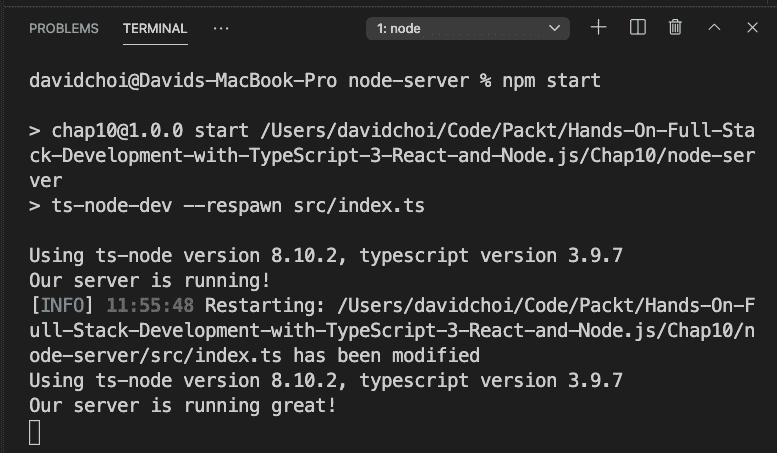

# 十、建立一个具有 TypeScript 和 GraphQL 依赖关系的 Express 项目

学习现代 JavaScript 编程的最大障碍之一是大量可用的包和依赖项。试图为您的项目选择正确的软件包集可能会让人望而生畏。在本章中，我们将学习如何设置配置良好的 TypeScript、Express 和 GraphQL 项目。我们将了解哪些依赖项比较流行，以及如何在项目中使用它们。

在本章中，我们将介绍以下主要主题：

*   创建基于 TypeScript 的 Express 项目
*   向项目添加 GraphQL 和依赖项
*   审查辅助包

# 技术要求

您应该对使用 Node、Express 和 GraphQL 进行 web 开发有基本的了解。我们将再次使用 Node 和 visualstudio 代码。

GitHub 存储库位于[https://github.com/PacktPublishing/Full-Stack-React-TypeScript-and-Node](https://github.com/PacktPublishing/Full-Stack-React-TypeScript-and-Node) 。使用`Chap10`文件夹中的代码。

要设置`Chap10`代码文件夹，请转到您的`HandsOnTypescript`文件夹并创建一个名为`Chap10`的新文件夹。

# 创建基于 TypeScript 的 Express 项目

在本节中，我们将构建一个用于构建服务器的启动项目。我们将手动检查和选择每个依赖项，并了解每个依赖项在应用中扮演的角色。完成后，我们将有一个强大的基础来构建我们的服务器应用。

有许多预先制作的项目模板可用于构建节点项目。TypeScript 用户的一个常见问题是来自 Microsoft 的 TypeScript Node Starter 项目。它有很多有用的依赖项。不幸的是，它面向 MongoDB 用户，但我们的应用将使用 Postgres。

另一个来自 Express 团队的项目模板是`express-generator`。它是一个 CLI，用于获取参数并设置基础项目。但是，此模板生成器面向使用模板引擎（如[T1]和[T2]）执行服务器端 HTML 的服务器。这对我们来说是不必要的，因为我们正在为 SPA 应用创建 API。此外，它没有 GraphQL 包来帮助我们创建 API。

因此，为了消除多余的包，作为学习练习，让我们手动构建项目。这将使我们能够看到构建应用所需的每一部分，并了解每一部分的功能。按照此处给出的步骤进行操作：

1.  在`Chap10`文件夹中创建一个新文件夹，并将其命名为`node-server`。
2.  在您的终端中，运行以下命令：

    ```js
    npm init 
    ```

3.  接下来，我们安装 TypeScript 并初始化它：

    ```js
    npm i typescript
    tsc -init
    ```

4.  Update the `tsconfig.json` file like this:

    ```js
    {
      "compilerOptions": {
        "target": "es6",
        "module": "commonjs",
        "lib": ["ES6", "ES2017", "ES2018", "ES2019",       "ES2020"],
        "sourceMap": true,
        "outDir": "./dist",
        "rootDir": "src",
        "moduleResolution": "node",
        "removeComments": true,
        "noImplicitAny": true,
        "strictNullChecks": true,
        "strictFunctionTypes": true,
        "noImplicitThis": true,
        "noUnusedLocals": true,
        "noUnusedParameters": false,
        "noImplicitReturns": true,
        "noFallthroughCasesInSwitch": true,
        "allowSyntheticDefaultImports": true,
        "esModuleInterop": true,
        "emitDecoratorMetadata": true,
        "experimentalDecorators": true    
      },
      "exclude": ["node_modules"],
      "include": ["./src/**/*.tsx", "./src/**/*.ts"]
    }
    ```

    我们已经了解了[*第 2 章*](02.html#_idTextAnchor025)*中的`tsconfig.json`文件，探索了 TypeScript*，但让我们回顾一下这里看到的内容：

    *   我们可以将 ES6 作为目标，因为我们在自己的服务器上运行，并且可以通过使用适当版本的节点来控制 V8 版本。
    *   我们使用`commonjs`作为`module`系统，以避免模块混合`require`和`import`的问题。
    *   我们想要使用最新的 JavaScript 版本，所以`lib`设置为允许它们。
    *   `outDir`字段表示传输的`js`文件将保存到的文件夹。
    *   `rootDir`表示代码源目录。
    *   我们允许`emitDecoratorMetadata`和`experimentalDecorator`作为`TypeORM`；访问数据库的存储库层的依赖关系将需要使用它们。
    *   正如所暗示的，`exclude`和`include`文件夹表示我们希望隐藏或使 TypeScript 编译器可用的文件夹。
5.  Now let's add some of our base dependencies:

    ```js
    npm i express -S
    npm i @types/express jest @types/jest ts-jest nodemon ts-node-dev faker @types/faker -D
    ```

    让我们看一下这些包中的一些：

    *   我们安装了`Express`及其类型脚本。
    *   我们安装了`jest`及其类型进行测试。
    *   `ts-jest`包允许我们用 TypeScript 编写测试。
    *   为了完整，我展示了`nodemon`，但我们将运行我们在[*第 8 章*](08.html#_idTextAnchor122)*中安装的全球安装版本，学习使用 Node 和 Express*进行服务器端开发。
    *   `faker`是用于测试和模拟的假数据生成器。
    *   当任何类型脚本代码发生更改时，`ts-node-dev`将帮助我们的节点服务器重新启动。

既然我们已经安装了基础依赖项，那么让我们启动我们的 plain Express 服务器以确保一切正常：

1.  We'll need to create a server setup script to initialize our server as we've done before in [*Chapter 8*](08.html#_idTextAnchor122)*, Learning Server-Side Development with Node and Express*. Create a folder called `src` and then create another file called `index.ts` inside of it. Then, add this code:

    ```js
    import express from "express";
    import { createServer } from "http";
    const app = express();
    const server = createServer(app);
    server.listen({ port: 8000 }, () => {
      console.log("Our server is running!");
    });
    ```

    基本上，这就是我们以前所做的：创建一个`express`实例，然后使用它来创建我们的服务器。

2.  Now, we'll need to create a `"start"` script inside of `package.json`. Open that file and find the `"scripts"` section. Then, under the existing `"test"` entry, add this code:

    ```js
    "scripts": {
        "test": "echo \"Error: no test specified\" &&        exit 1",
        "start": "ts-node-dev --respawn src/index.ts"
      },
    ```

    该命令使用`ts-node-dev`监视何时发生类型脚本更改，然后使用`"respawn"`。这意味着它将根据需要自动重新启动节点。

3.  Now if you type this command, your server should run:

    ```js
    npm start
    ```

    一旦它运行，您应该会看到如下内容：

    

    图 10.1–第一次服务器运行

    如您所见，我们的服务器是通过命令和发出的控制台日志消息启动的。

4.  如果您通过更改日志消息来更新`index.ts`文件，您将看到服务器自动重启，如下图所示：



图 10.2–服务器重新启动

服务器重新启动，然后显示新消息`Our server is running great!`。

在本节中，我们开始学习服务器的重要依赖项。我们将使用所有这些包以及其他包来构建我们的 GraphQLAPI。在下一节中，我们将添加 GraphQL 依赖项。

# 向项目添加 GraphQL 和依赖项

我们已经看了[*第 9 章*](09.html#_idTextAnchor139)*中的 GraphQL，GraphQL 是什么？*。在本章中，让我们回顾一下这些包，并介绍一些我们将要使用的新的相关包。

让我们列出一些我们将用于应用的 GraphQL 相关软件包：

*   `graphql`

    这个包是 GraphQL 的 JavaScript 的参考实现。它是由 CopyQL 基金会创建的，我们将使用它来做一些我们的 GoSQL 查询测试。

*   `graphql-middleware`

    这是一个允许我们在解析器运行之前或之后注入代码的包。一些可能的操作包括但不限于身份验证检查和日志记录。

*   `graphql-tools`

    这个包提供了一些帮助程序，用于在需要时测试和模拟 GraphQL 查询。

*   `apollo-server-express`

    这是我们将用来创建 Express GraphQL 服务器的主库，我们已经在[*第 9 章*](09.html#_idTextAnchor139)*中使用过，GraphQL 是什么？*。

这些是我们将用于 GraphQL 实现的主要包。接下来，我们将创建一个 GraphQL 服务器，并为其构建一些测试。在后面的章节中，我们将把这里使用的各种包合并到一个项目中。让我们看一下步骤：

1.  在我们的`Chap10`文件夹中创建另一个名为`gql-server`的文件夹。然后，`cd`从终端进入并运行以下命令：

    ```js
    npm init
    ```

2.  接受所有默认值，然后运行此命令和

    ```js
    npm i express graphql graphql-tools graphql-middleware apollo-server-express uuid -S
    ```

3.  完成后，运行 this:

    ```js
    npm i @types/express typescript @types/faker @types/jest faker jest nodemon ts-jest ts-node-dev @types/uuid -D
    ```

4.  现在使用以下命令初始化 TypeScript:

    ```js
    tsc -init
    ```

5.  完成后，将`node-server`项目中`tsconfig.json`文件的内容复制到新`gql-server`项目文件夹中的`tsconfig.json`文件中。
6.  Now, in our `package.json` file, add a `start` entry to our `scripts` section like this:

    

    图 10.3–开始脚本

7.  现在，让我们在`gql-server`文件夹的根目录中创建一个新的`src`文件夹。然后从`Chap9/graphql-schema`项目复制这些文件并粘贴到`src`文件夹中：`db.ts`、`GqlContext.ts`、`resolvers.ts`、`server.ts`和`typeDefs.ts`。
8.  让我们通过以下命令启动应用来测试它是否会运行：

    ```js
    npm start
    ```

现在让我们添加一些中间件，看看它是如何运行的：

1.  Create a new file called `Logger.ts` in the `src` folder and add this code to it:

    ```js
    export const log = async (
      resolver: any,
      parent: any,
      args: any,
      context: any,
      info: any
    ) => {
      If(!parent) {
          console.log("Start logging");
      }
      const result = await resolver(parent, args, context,   info);
      console.log("Finished call to resolver");
      return result;
    };
    ```

    在这段代码中，我们正在拦截任何解析器调用，并在`resolver`函数运行之前记录它们。请注意，我们检查了`parent`对象是否为`null`，这表示`resolver`调用尚未运行。我们还将日志添加到`getTodos`解析器中。打开`resolvers.ts`并将该行添加到`getTodos`函数体的开头，就在`return`语句之前：

    ```js
    console.log("running getTodos");
    ```

2.  Now we need to update our `server.ts` file so that it makes use of this logger. Update `server.ts` like this:

    ```js
    import express from "express";
    import { createServer } from "http";
    import {
      ApolloServer,
      makeExecutableSchema,
      PubSub,
    } from "apollo-server-express";
    import typeDefs from "./typeDefs";
    import resolvers from "./resolvers";
    import { applyMiddleware } from "graphql-middleware";
    import { log } from "./Logger";
    ```

    在这里我们已经导入了前面创建的`applyMiddleware`函数和`log`中间件。请注意，此`applyMiddleware`函数来自`graphql-middleware`包，与阿波罗`applyMiddleware`函数不同，后者仅将 Express 实例与我们的阿波罗服务器关联：

    ```js
    const app = express();
    const pubsub = new PubSub();
    const schema = makeExecutableSchema({ typeDefs, resolvers });
    const schemaWithMiddleware = applyMiddleware(schema, log);
    const apolloServer = new ApolloServer({
      schema: schemaWithMiddleware,
      context: ({ req, res }: any) => ({ req, res, pubsub }),
    });
    ```

    在这里，我们采用了由`makeExecutableSchema`创建的模式，并使用`applyMiddleware`函数创建了一个具有中间件关联的模式。然后，我们将这个模式`schemaWithMiddleware`应用到阿波罗服务器。代码的其余部分没有改变，所以我不在这里包含它。

3.  启动您的服务器（如果您尚未启动），并打开浏览器至 GraphQL 服务器 URL。如果您运行对`getTodos`的调用，您将看到`todos`数据返回，如图所示：


图 10.4–调用 getTodos

此外，您应该在 Visual Studio 代码终端中看到我们前面设置的`console.log`消息：


图 10.5–getTodos 结果

我们的中间件运行并记录日志。然后，实际的解析器运行并返回数据。

因此，我们现在看到了 GraphQL 中间件，它允许我们拦截调用并将我们自己的代码注入 GraphQL 进程。现在，让我们尝试使用 GraphQL 创建一些测试：

1.  We need to create a GraphQL query runner for testing purposes. Create a new file called `testGraphQLQuery.ts` and add this code to it:

    ```js
    import { graphql, GraphQLSchema } from "graphql";
    ```

    我们导入`graphql`和`GraphQLSchema`以便手动查询并键入模式文件。

2.  导入`Maybe`，因为它是一个指示参数是否可以使用的 GraphQL 类型：

    ```js
    import { Maybe } from "graphql/jsutils/Maybe";
    ```

3.  Create our `Options` interface, which will later act as the `testGraphQLQuery` function's parameters type to run our query:

    ```js
    interface Options {
      schema: GraphQLSchema;
      source: string;
      variableValues?: Maybe<{ [key: string]: any }>;
    }
    ```

    代码`[key: string]`表示对象属性名称–例如`myObj["some name"]`。使用所需参数调用`testGraphQLQuery`函数，并返回相关数据：

    ```js
    export const testGraphQLQuery = async ({
      schema,
      source,
      variableValues
    }: Options) => {
      return graphql({
        schema,
        source,
        variableValues,
      });
    };
    ```

4.  Now let's write our test. Create a `getUser.test.ts` file and add this code to it:

    ```js
    import typeDefs from "./typeDefs";
    import resolvers from "./resolvers";
    import { makeExecutableSchema } from "graphql-tools";
    import faker from "faker";
    import { testGraphQLQuery } from "./testGraphQLQuery";
    import { addMockFunctionsToSchema } from "apollo-server-express";
    ```

    导入非常简单，但`faker`导入用于帮助我们为测试对象的字段值创建假条目。

5.  我们使用`describe`设置测试，然后使用我们想要的字段

    ```js
    describe("Testing getting a user", () => {
      const GetUser = `
            query GetUser($id: ID!) {
                getUser(id: $id) {
                    id
                    username
                    email
                }
            }
        `;
    ```

    为`getUser`创建查询
6.  Now in our test, we first create our `schema` from the merger of `typeDefs` and `resolvers` and then we set up our fake data fields for our mocked `User` object:

    ```js
      it("gets the desired user", async () => {
        const schema = makeExecutableSchema({ typeDefs,     resolvers });
        const userId = faker.random.alphaNumeric(20);
        const username = faker.internet.userName();
        const email = faker.internet.email();
        const mocks = {
          User: () => ({
            id: userId,
            username,
            email,
          }),
        };
    ```

    如[*第 6 章*](06.html#_idTextAnchor091)*所示，使用 create react app 和 Testing with Jest*设置我们的项目，mocking 让我们可以专注于我们想要测试的代码单元，而不必担心其他项目。

7.  我们使用`addMockFunctionsToSchema`将模拟的`User`对象添加到模式中，以便在进行相关查询时返回：

    ```js
        console.log("id", userId);
        console.log("username", username);
        console.log("email", email);
        addMockFunctionsToSchema({ schema, mocks });
    ```

8.  Finally, we run the `testGraphQLQuery` function to get back our mocked data:

    ```js
        const queryResponse = await testGraphQLQuery({
          schema,
          source: GetUser,
          variableValues: { id: faker.random.alphaNumeric(20)       },
        });
        const result = queryResponse.data ? queryResponse.     data.getUser : null;
        console.log("result", result);
        expect(result).toEqual({
          id: userId,
          username,
          email,
        });
      });
    });
    ```

    如果返回的对象具有相同的字段，则表明查询`getUser`查询的逻辑正在工作，因为调用已通过整个代码路径来获取我们的`User`对象。

9.  Before we run our test, we need to add a configuration to the `package.json` file for `jest`. Add this to the end of the configuration:

    ```js
    "jest": {
        "transform": {
          ".(ts|tsx)": "<rootDir>/node_modules/ts-
            jest/preprocessor.js"
        },
        "testRegex": "(/__tests__/.*|\\.(test|spec))       \\.(ts|tsx|js)$",
        "moduleFileExtensions": [
          "ts",
          "tsx",
          "js"
        ]
      }
    ```

    此配置确保测试名称中带有`spec`或`test`的所有文件（这是`testRegex`部分），并且在运行之前，任何类型脚本文件都首先传输到 JavaScript（这是`transform`部分）。

10.  如果您在终端上运行`jest`命令，您应该会看到这个结果；确保您在路径上：


图 10.6–GraphQL 查询测试结果

如您所见，测试通过了。我添加了几个`log`语句，以表明模拟`User`的字段是相同的。你应该在测试中避免这种情况，因为它很难阅读。

笔记

在`package.json`文件的脚本部分，您可以将“test”条目替换为“test”：“jest”。这样，它将与其他 NPM 脚本更加一致。与任何 NPM 脚本一样，您可以使用[T1]命令运行它。

在部分中，我们了解了关于 GraphQL 可用的一些 NPM 包。这些软件包可以帮助我们构建和测试服务器，使它们更加可靠。在下一节中，我们将看一些其他包，它们将帮助我们构建服务器。

# 审查辅助包

在本节中，我们将回顾项目的一些辅助依赖项。我们的服务器，在它的中心，当然是 Node、Express 和 GraphQL。我们的服务器还需要完成许多其他功能性活动。

让我们列出一些我们将在整个应用中使用的软件包，这些软件包应允许我们编写更少的代码，并更多地关注我们的核心业务逻辑：

*   `bcryptjs`

    为了安全起见，每个服务器都需要加密数据。一个明显的例子就是我们用户的密码。Bcrypt 是一个工业标准加密算法，它存在于众多平台上，包括 C++和 java。`bcryptjs`是该算法的 JavaScript 实现，将帮助我们保护我们的应用。

*   `cors`

    网络充满了安全隐患，黑客试图破坏服务器。因此，任何 web 服务器的标准行为都是只允许客户端请求来自与服务器相同的域。对于复杂的服务器设置，例如微服务和代理，这是不可行的。因此，创建了**跨源资源共享**（**CORS**）以允许来自其他域的请求。`cors`包提供了在我们的服务器上执行 CORS 的工具。

*   `date-fns`

    众所周知，直接处理 JavaScript 日期对象非常麻烦，`date-fns`提供了许多有用的方法来解析、格式化和显示日期和时间。

*   `dotenv`

    每个大型应用都需要将配置信息存储在中心位置，以便管理和保护敏感数据和设置。使用`dotenv`将允许我们维护我们的敏感信息设置，而不会将其透露给最终用户。

*   `nodemailer`

    `nodemailer`允许我们从节点服务器内部发送电子邮件。例如，我们可以发送电子邮件，允许用户重置密码或通知他们网站上的活动。

*   `request`

    这个包将允许我们从节点服务器中发出 HTTP 请求。例如，当我们需要从另一个 API（无论是第三方 API 还是内部 API）获取数据时，这可能非常有用。

*   `querystring`

    `querystring`将允许我们轻松地从对象创建 URL 查询字符串参数，并将 POST 请求主体解析为字段。此包装可与`request`包装一起使用。

*   `randomstring`

    `randomstring`可用于生成随机临时密码。

在构建应用时，我们将使用更多的软件包——例如，允许我们连接到 Postgres 数据库和 Redis 存储的软件包。不过，我将在相关章节中介绍这些包，因为届时这些包的作用将更加明确。

在本节中，我们了解了我们将在项目中使用的一些杂项包。尽管这些工具不是我们应用的主要焦点，但它们仍然非常有价值。如果我们自己编写这些依赖项，我们就必须成为加密和日期时间管理等各个领域的专家，这对我们来说是巨大的时间浪费，因为它不是我们目标的核心。

# 总结

在本章中，我们了解了将用于构建应用的其他 NPM 包依赖项。这些工具得到了社区的广泛使用，因此经过了良好的测试且可靠。使用节点生态系统中的包是 Node 最有价值的好处之一。它使我们不必自己编写、测试和维护这些额外的代码。

在下一章中，我们将详细回顾我们将要构建的内容。我们将看到应用的各个组件是什么，我们将开始对应用的 React 端进行编码。