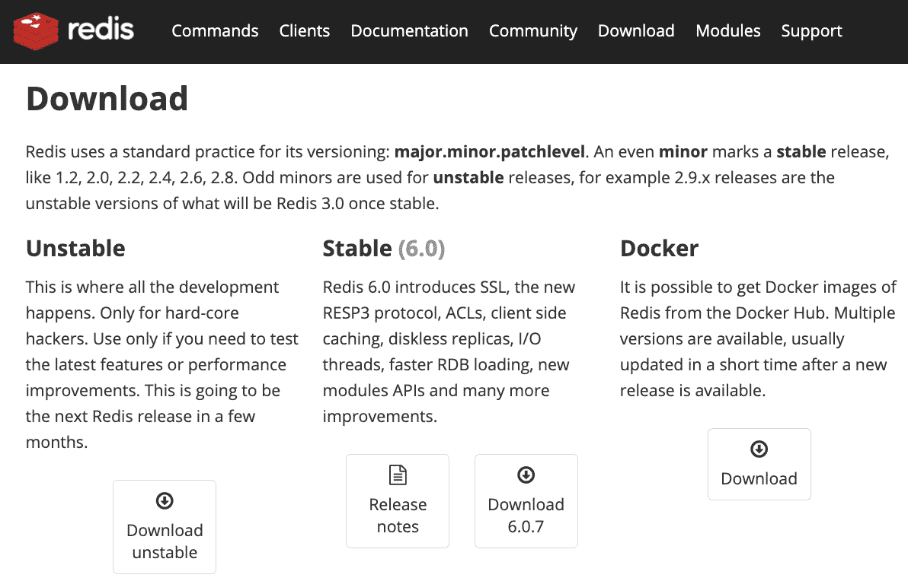
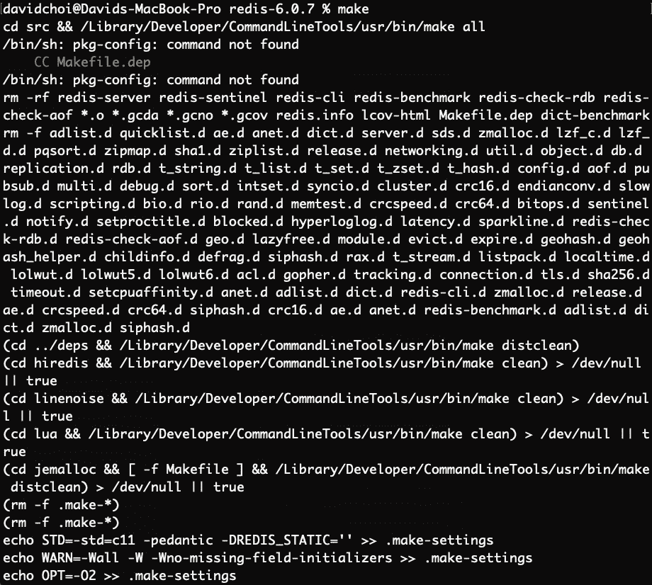
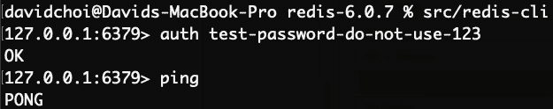
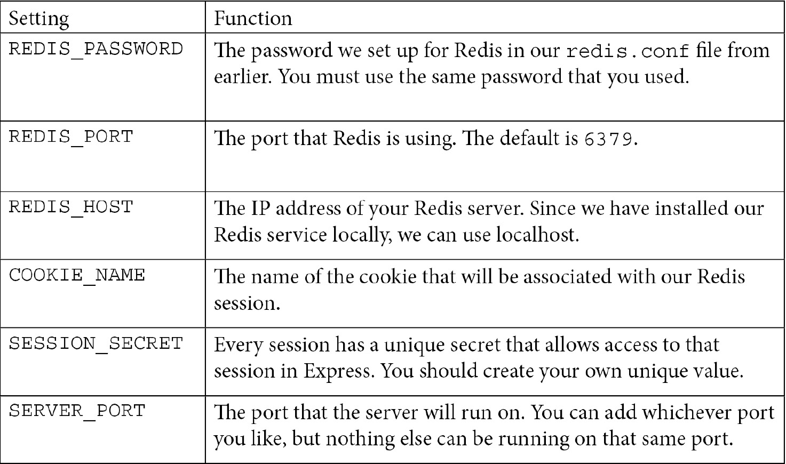

B15508_13_Final_JC_ePub

# *第 13 章*：使用 Express 和 Redis 设置会话状态

在本章中，我们将学习如何使用 Express 和 Redis 数据存储创建会话状态。Redis 是最流行的内存数据存储之一。Twitter、GitHub、Stack Overflow、Instagram 和 Airbnb 等公司都使用它。我们将使用 Express 和 Redis 创建会话状态，这将是应用程序身份验证功能的基础。

在本章中，我们将介绍以下主要主题：

*   了解会话状态
*   理解 Redis
*   使用 Express 和 Redis 构建会话状态

# 技术要求

您应该对使用 Node.js 进行 web 开发有很好的了解。我们将再次使用 Node 和 visualstudio 代码。

GitHub 存储库位于[https://github.com/PacktPublishing/Full-Stack-React-TypeScript-and-Node](https://github.com/PacktPublishing/Full-Stack-React-TypeScript-and-Node) 。使用`Chap13`文件夹中的代码。

要设置[*第 13 章*](#_idTextAnchor208)代码文件夹，请转到您的`HandsOnTypescript`文件夹并创建一个名为`Chap13`的新文件夹。

# 理解会话状态

在本节中，我们将学习[T0]什么是会话状态以及为什么需要它。我们将重新讨论 web 如何工作的一些概念，并理解为什么需要会话状态。

网络实际上不是一回事。它是许多技术的集合。web 的核心是 HTTP 协议。这是允许 web 在 internet 上工作的通信协议。协议只是一套商定的通信规则。这听起来有点直截了当，对某些事情来说，这是可以做到的。然而，对于我们的应用程序来说，它有点复杂。

HTTP 协议是一种无连接协议。这意味着 HTTP 连接仅在发出请求然后释放时进行。因此，即使用户在几个小时内积极使用某个网站，也不会保持连接。这使得 HTTP 更具可伸缩性。然而，这也意味着，当使用此协议时，大型网站需要的某些功能更难创建。

让我们来看一个真实世界的例子。让我们假设我们是亚马逊，我们的网站上有数百万用户试图购买商品。现在，因为人们试图购买东西，我们需要能够唯一地识别这些用户。例如，如果我们同时使用 Amazon，而您试图将项目添加到您的购物车中，我们需要确保您的任何项目都不会出现在我的购物车中，反之亦然。这似乎应该很容易做到。然而，对于 HTTP 这样的无连接协议，这很难实现。

在 HTTP 中，每个请求都会创建一个新连接，而每个新请求都不知道以前的任何请求。也就是说，它不保存任何状态数据。因此，回到我们的 Amazon 示例，这意味着如果用户请求将项目添加到购物车中，则没有内置功能来区分该用户的请求与任何其他请求。当然，我们可以用自己的能力进行干预，当然，这也是我们在本章将要讨论的。但关键是我们没有现成的东西可以直接使用。

要明确的是，有许多方法来处理这个特殊问题。也许我们可以给每个用户一个唯一的 ID，他们可以在每次通话中传递它。或者，我们可以将会话信息保存到数据库中，例如，将购买的物品保存在购物车中。当然，根据具体的需求，还有更多的选择。然而，这些简单的想法需要充实和详细。然后我们需要花时间测试它们。因此，现实地说，无论我们在哪里，我们都希望避免滚动我们自己的能力，相反，我们应该选择行业标准的解决方案。如果我们使用这些，我们知道它们已经过健壮性和安全性测试，并将使用最佳实践。

我们用于区分用户的方法将重点放在服务器端技术上，使用 Express sessions 和 Redis 作为我们的数据存储。我们不会使用 JWT，因为它是一种客户端技术，比服务器端解决方案更容易受到安全漏洞的影响。

重要提示

每种解决方案都有其利弊。当然，任何服务器都可能遭到黑客攻击。在服务器上提供安全解决方案并不能保证任何事情。但是，当涉及到您的服务器时，您可以保护和控制其设置，以至少尝试并最大限度地提高其安全性。在用户的机器上，您完全没有控制权。

在本节中，我们学习了[T0]关于会话状态是什么以及为什么它是必要的。我们了解了 HTTP 协议缺少的一些功能，以及如何为自己提供这些功能。在下一节中，我们将继续学习 Redis，我们将使用它来维护会话数据。

# 理解 Redis

在本节中，我们将了解 Redis 并安装它。我们还将简单介绍 Redis 及其工作原理。

Redis 是内存中的数据存储。它是非常快速和可扩展的。您可以使用 Redis 存储字符串、列表、数据集等。数以千计的公司使用 Redis，而且它是免费的、开源的。通常，Redis 最常用作内存中的数据库或缓存。

对于我们的用例，我们将使用 Redis 作为 Express 会话的数据存储。Redis 在 Linux 和 Mac 上受支持。Windows 不正式支持它。在 Windows 上使用 Docker 映像可以获得非官方的支持，但这超出了本书的范围。不过，您通常可以在云提供商上获得免费的 Linux 虚拟机，试用期为一段时间。所以，如果你在 Windows 上，你可以尝试这些服务之一。

笔记

`Redis.conf`有一个名为 bind 的设置，该设置设置了本地 IP 地址，Redis 服务器将使用该地址，以及允许哪些外部 IP 地址访问该地址。保留此设置将允许任何 IP 地址访问服务器。这对于开发目的来说是可以的。但是，一旦投入生产，您应该将其设置为特定值，并且只允许希望访问服务器 IP 的 IP 地址。

让我们从安装 Redis 开始。目前，我正在使用 Mac 电脑：

1.  Go to the Redis website at [https://redis.io/download](https://redis.io/download) and select **Download** under the stable version. Here's a sample screenshot of the current 6.0.7 version:

    笔记

    请下载 6.0.x 版本，因为更高版本或更低版本可能会有破坏性的更改。

    

    下载图 13.1–Redis

2.  Once you have downloaded and successfully unzipped or unpacked the file into a folder, use your terminal and go to that folder. For example, this is what my terminal looks like after I have unpacked the tar file:

    

    图 13.2–Redis 稳定无包装

3.  Now we must `make` our source files into a runnable application. Simply type `make` into the terminal and let it run. It will take some time to finish. The beginnings of the `make` command run will look like this:

    

    图 13.3–运行 make 命令

4.  Now that we've built our server, feel free to move it wherever you would like. I moved it into my `Applications` folder. You'll need to run this command after changing directories into the `Redis` folder:

    ```js
    src/redis-server
    ```

    下面是我的本地 Redis 服务器运行的屏幕截图：

    

    图 13.4–运行 Redis

    警告

    在 Mac 上，您可能会收到一条警告，询问您是否希望授予 Redis 接受传入网络请求的权限。你应该允许这样。

5.  Let's quickly test that Redis is working. Open a new terminal window while Redis is running, and from your Redis `src` folder, type this command:

    ```js
    redis-cli
    ```

    我做了一个测试：

    

    图 13.5–测试 Redis

    在*图 13.5*中，我们首先`ping`检查 Redis 是否正在运行。然后我们使用`set`命令创建一个新值，该值包含键`test`和值`1`。然后我们`get`成功地获得了该值。

6.  Now that we know our server is installed properly, we need to do some minor configuration. Shutdown the server first with this command:

    ```js
    src/redis-cli shutdown
    ```

    关闭后，转到`Chapter13`源代码文件夹并复制`redis/redis.conf`文件的内容。然后，在终端中，运行以下命令：

    ```js
    sudo mkdir /etc/redis
    ```

    如果要求输入`sudo`密码，请输入您的密码。这是大多数 Redis 配置位置的默认文件夹。接下来，运行以下命令：

    ```js
    sudo nano /etc/redis/redis.conf
    ```

    Nano 是终端的文本编辑器。现在将源代码`redis.conf`文件的内容粘贴到`/etc/redis/redis.conf`上新创建的文件中。

    如果您查看此文件并搜索关键字`requirepass`、按*Ctrl*+*W*或从 VSCode 查看，您将看到我们将仅用于测试目的的密码。请不要在生产中使用此密码。

    对于任何其他设置，我们都可以使用默认设置。

7.  OK, now let's restart our Redis server, but this time pointing to our new `redis.conf` file. Type this command:

    ```js
    src/redis-server /etc/redis/redis.conf
    ```

    注意，这次日志消息显示为`Configuration loaded`。

    请注意，如果要再次测试服务器，这一次您需要进行身份验证，因为我们配置了密码：

    ```js
    src/redis-cli
    auth <password>
    ```

    这就是它看起来的样子：



图 13.6–Redis 的测试重启和验证

在本节中，我们讨论了[T0]什么是 Redis，并对 Redis 服务进行了基本安装[T1]。在下一节中，我们将通过创建裸体节点和 Express 服务器并设置基于 Redis 的会话状态来启动后端服务器代码。

# 使用 Express 和 Redis 构建会话状态

在本节中，我们将开始构建后端。我们将创建我们的 Express 项目并设置基于 Redis 的会话状态。

现在我们了解了什么是 Redis 以及如何安装它。让我们来看看 Express 和 Redis 在我们的服务器中是如何协同工作的。正如我们在[*第 8 章*](08.html#_idTextAnchor122)*中所讨论的，*使用 Node.js 和 Express*进行学习服务器端开发，Express 基本上是围绕节点的包装器。这个包装器通过使用中间件为节点提供了额外的功能。会话状态也是一种快速中间件。*

在我们的应用程序中，Express 将提供具有相关功能的会话对象，例如在用户浏览器上创建 cookie，以及帮助设置和维护会话的各种功能。Redis 将是会话数据的数据存储。由于 Redis 在存储和检索数据方面速度极快，因此它是 Redis 的一个很好的用例。

现在让我们使用 Express 和 Redis 创建项目：

1.  First, we need to create our project folder, `super-forum-server`. Once created, we need to initialize it as an NPM project by running this (make sure your terminal is already in the `super-forum-server` folder first):

    ```js
    npm init -y
    ```

    完成后，只需将`package.json`中的`name`字段更新为`super-forum-server`。也可以将`author`字段更新为您的姓名。

2.  Now let's install our dependencies:

    ```js
    npm i express express-session connect-redis ioredis dotenv
    npm i typescript @types/express @types/express-session @types/connect-redis @types/ioredis ts-node-dev -D
    ```

    如您所见，我们安装了`express`软件包，但我们也安装了`express-session`。此软件包支持 Express 中的会话。我们还安装了`connect-redis`，它将我们的 Express 会话连接到 Redis 数据存储。除了`connect-redis`之外，我们还需要`ioredis`包，因为是客户端让我们访问 Redis 服务器本身。一旦我们开始编码，我将进一步解释这一点。`dotenv`包将允许我们使用配置文件`.env`保存内容，如服务器密码和其他配置。

    然后，在第二个`install`命令中，我们可以看到与开发相关的包，这些包主要是类型脚本定义包，如`@types/express`。不过，最后请注意，我们也安装了`ts-node-dev`。我们使用这个包来帮助我们通过主`index.ts`文件启动服务器。`ts-node-dev`包将触发类型脚本编译器`tsc`，并启动并运行最终服务器。

    警告

    永远不要在 Git 存储库中包含您的`dotenv`配置文件`.env`。它有敏感信息。您应该有一个脱机进程来维护此文件并与开发人员共享它。

3.  Let's now update our `package.json` file to use the `ts-node-dev` helper. This package is super useful because it also auto-restarts our server whenever we change any of our scripts. Add this line to the `scripts` section of `package.json`:

    ```js
    "start": "ts-node-dev --respawn src/index.ts"
    ```

    请注意，`respawn`前面有两个破折号。`index.ts`文件将是启动服务器的根文件。

4.  现在我们应该在我们的项目中设置 TypeScript。我们已经看过 TypeScript 配置文件`tsconfig.json`很多次了，所以我不会在这里列出它（当然您可以在我们的源文件中找到它）。但是请注意，我们将`target`作为`ES6`，生产文件保存到`./dist`文件夹中。
5.  在项目根目录上创建`src`文件夹。
6.  Now let's create our `.env` file and its entries. Copy these settings into your own file, but use your own unique secret values:

    

7.  Now let's create the `index.ts` file. Let's create a bare-bones file first, just to make sure our server will run. Enter this into the file:

    ```js
    import express from "express";
    ```

    在这里，我们有进口快递。

    ```js
    console.log(process.env.NODE_ENV);
    ```

    在这里，我们展示了我们所处的环境——生产或开发。如果您尚未设置本地环境，请在终端上使用此命令进行设置。

    对于 Mac，请使用以下命令：

    ```js
    export NODE_ENV=development
    ```

    对于 Windows，请使用以下命令：

    ```js
    SET NODE_ENV=development
    ```

    在生产服务器上，您可能还需要运行此命令，但要将其设置为生产：

    ```js
    require("dotenv").config();
    ```

    在这里，我们导入`dotenv`包并设置默认配置。这就是允许在我们的项目中使用我们的`.env`文件的原因。

    ```js
    const app = express();
    ```

    这里，我们用`express`实例化`app`对象。因此，我们将把所有中间件添加到`app`对象上。因为 Express 中几乎所有的东西都是中间件，所以会话状态也是中间件。

    ```js
    app.listen({ port: process.env.SERVER_PORT }, () => {
      console.log(`Server ready on port ${process.env.   SERVER_PORT}`);
    });
    ```

    在这里，我们已经初始化了我们的服务器，当运行时，它将显示所显示的日志消息。运行以下命令：

    ```js
    npm start 
    ```

    您应该在终端上看到以下日志消息：

    

    图 13.7 Express 服务器的首次运行

8.  Now that we know our base server is running properly, let's add our Express session state and Redis:

    ```js
    import express from "express";
    import session from "express-session";
    import connectRedis from "connect-redis";
    import Redis from "ioredis";
    ```

    首先，您可以看到我们导入了`expression-session`和我们的 Redis 相关软件包。

    ```js
    console.log(process.env.NODE_ENV);
    require("dotenv").config();
    const app = express();
    const router = express.Router();
    ```

    在这里，我们初始化了`router`对象。

    ```js
    const redis = new Redis({
      port: Number(process.env.REDIS_PORT),
      host: process.env.REDIS_HOST,
      password: process.env.REDIS_PASSWORD,
    });
    ```

`redis`对象是我们的 Redis 服务器的客户端。如您所见，我们已将值隐藏在`.env`文件后面的配置信息中。你可以想象一下，如果我们能看到密码和其他安全信息硬编码到我们的代码中，那将是多么不安全。

```js
const RedisStore = connectRedis(session);
const redisStore = new RedisStore({
  client: redis,
});
```

现在我们已经创建了`RedisStore`类和`redisStore`对象，我们将为 Express 会话创建数据存储。

```js
app.use(
  session({
    store: redisStore,
    name: process.env.COOKIE_NAME,
    sameSite: "Strict",
    secret: process.env.SESSION_SECRET,
    resave: false,
    saveUninitialized: false,
    cookie: {
      path: "/",
      httpOnly: true,
      secure: false,
      maxAge: 1000 * 60 * 60 * 24,
    },
  } as any)
);
```

会话对象获得一些选项。一个选项`store`是我们添加`redisStore`对象的地方。`sameSite`值表示不允许来自其他域的 cookie，这增强了安全性。[T3]字段也是我们特定会话的一种密码或[T11]唯一 ID。`cookie`字段设置保存到用户浏览器上的 cookie。`httpOnly`字段表示 JavaScript 无法提供 cookie。这使得 cookie 更加安全，可以防止 XSS 攻击。[T6]字段是[T7]，因为我们没有使用 HTTPS。

```js
app.use(router);
router.get("/", (req, res, next) => {
  if (!req.session!.userid) {
    req.session!.userid = req.query.userid;
    console.log("Userid is set");
    req.session!.loadedCount = 0;
  } else {
    req.session!.loadedCount = Number(req.session!.     loadedCount) + 1;
  }
```

我们已经设置了我们的`router`对象和我们的路线，即 GET。基本上，我们所做的是从 URL 查询字符串中获取`userid`，然后用它设置我们用户唯一的`session.userid`字段。我们还计算了呼叫的次数，表明会话在两次呼叫之间保持活动状态。

```js
  res.send(
    `userid: ${req.session!.userid}, loadedCount: 
      ${req.session!.loadedCount}`
  );
```

这里，我们通过将会话信息作为字符串返回发送来响应。

```js
});
app.listen({ port: process.env.SERVER_PORT }, () => {
  console.log(`Server ready on port ${process.env.SERVER_   PORT}`);
});
```

最后，我们的`express`服务器监听端口 5000，这是我们的`SERVER_PORT`设置的。如下图所示，第一次加载时会创建 cookie：


图 13.8–显示不同会话状态的两个浏览器

请注意，我们使用两个浏览器来显示创建了唯一的会话。如果我们使用一个浏览器，会话将不会是唯一的，因为将使用相同的 cookie。

在本节中，我们使用了 Express 和 Redis 的知识，并为 SuperForum 应用程序实现了一个基础项目。我们看到了 Express 和 Redis 在创建会话中所扮演的角色。我们还了解了如何使用会话为进入我们站点的每个用户创建一个唯一的数据容器。

# 总结

在本章中，我们学习了会话和 Redis 数据存储服务。我们还学习了如何将 Redis 与 Express 集成，以便为用户创建独特的会话。在后面的章节中，这对于构建我们的身份验证服务至关重要。

在下一章中，我们将设置 Postgres 服务器并创建数据库模式。我们还将学习 TypeForm，它将允许我们从应用程序中集成和使用 Postgres。最后，我们还将构建身份验证服务，并将其与会话状态联系起来。