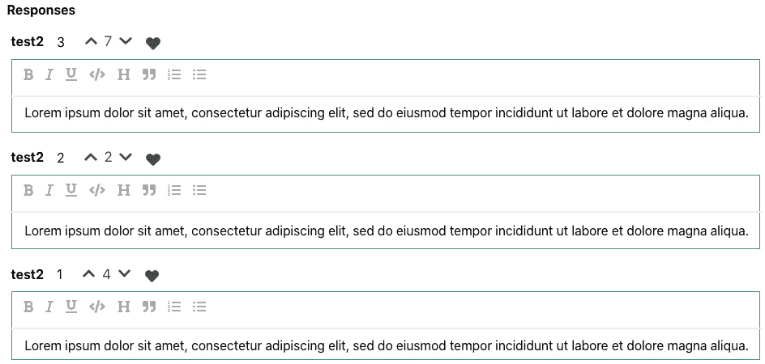
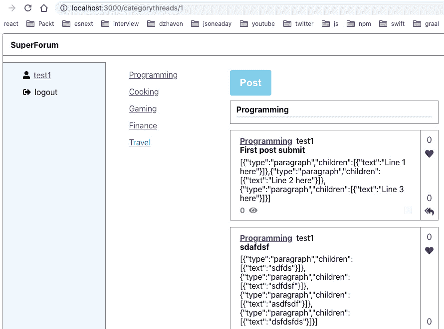
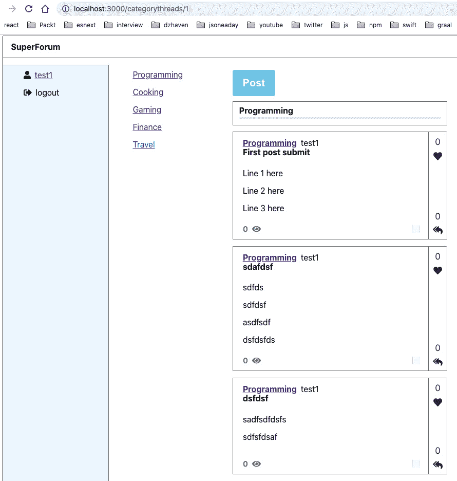
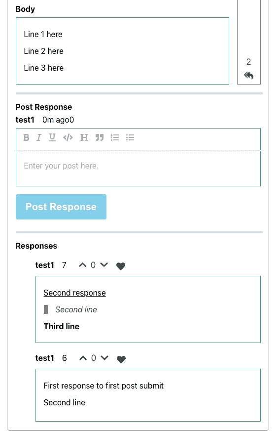

# 十六、集成 GraphQL 模式——第二部分

在本章中，我们将继续完成客户机和服务器代码。我们将完成我们的线程屏幕，它允许我们发布新的线程及其响应，并完成网站的积分系统。请使用[*第 15 章*](15.html#_idTextAnchor222)*中的源代码，添加一个 GraphQL 模式–第一部分*来完成此操作。

# 螺纹路径

在本节中，我们将更新`Thread`组件，该组件提供了我们的线程路径。在我们讨论这个问题的时候，我们会涉及到很多文件。遵循以下步骤：

1.  打开`typeDefs`并编辑`Thread`和`ThreadItem`类型。然后，在`views`：

    ```js
    points: Int!
    ```

    下方添加此字段
2.  Now, open the `ThreadRepo` file and update the `getThreadById` function, like this:

    ```js
    export const getThreadById = async (
      id: string
    ): Promise<QueryOneResult<Thread>> => {
      const thread = await Thread.findOne({
        where: {
          id,
        },
        relations: ["user", "threadItems", "threadItems.     user", "category"],
      });
    ```

    我们在这里所做的只是在我们的`findOne`查询中添加以下`relations`：

    ```js
      if (!thread) {
        return {
          messages: ["Thread not found."],
        };
      }
      return {
        entity: thread,
      };
    };
    ```

3.  Next, update the `getThreadsByCategoryId` function's call to `Thread.createQueryBuilder`, like this:

    ```js
    const threads = await Thread.createQueryBuilder("thread")
        .where(`thread."categoryId" = :categoryId`, {       categoryId })
        .leftJoinAndSelect("thread.category", "category")
        .leftJoinAndSelect("thread.threadItems",       "threadItems")
        .leftJoinAndSelect("thread.user", "user")
        .orderBy("thread.createdOn", "DESC")
        .getMany();
    ```

    我们在这里包含了用户实体的关系。此函数的其余代码保持不变。

4.  现在，在客户端应用中打开`User.ts`文件，并更新`threads`和`threadItems`字段，使其成为可选字段。我们需要这样做，以便我们可以添加一个尚未过账的`User`账户：

    ```js
    public threads?: Array<Thread>,
    public threadItems?: Array<ThreadItem>
    ```

5.  现在，打开 React 客户端项目中的`models/Thread.ts`和`models/ThreadItem.ts`文件，将`userName`和`userId`字段替换为单个字段用户，如下所示：

    ```js
    public user: User,
    ```

6.  We also need to replace the references to the `userName` and `userId` fields in our `DataService.ts` file with a user object. Here, I've placed an object at the top of the file and used it throughout the file to replace those two fields:

    ```js
    const user = new User("1", "test1@test.com", "test1");
    ```

    如果您需要任何帮助，请查看`DataService.ts`文件，尽管这应该是非常琐碎的。

7.  Now that we've updated our `User` schema type and our entities, we need to update some queries. In the `Main.tsx` file, update the `GetThreadsByCategoryId` and `GetThreadsLatest` queries, like this:

    ```js
    const GetThreadsByCategoryId = gql`
      query getThreadsByCategoryId($categoryId: ID!) {
        getThreadsByCategoryId(categoryId: $categoryId) {
          ... on EntityResult {
            messages
          }
          ... on ThreadArray {
            threads {
              id
              title
              body
              views
              points
              user {
                userName
              }
              threadItems {
                id
              }
              category {
                id
                name
              }
            }
          }
        }
      }
    `;
    ```

    对于这两个查询，我们添加了`points`和`user`字段，如下所示：

    ```js
    const GetThreadsLatest = gql`
      query getThreadsLatest {
        getThreadsLatest {
          ... on EntityResult {
            messages
          }
          ... on ThreadArray {
            threads {
              id
              title
              body
              views
              points
              user {
                userName
              }
              threadItems {
                id
              }
              category {
                id
                name
              }
            }
          }
        }
      }
    `;
    ```

8.  Now, in our `ThreadCard.tsx` file, find the following JSX:

    ```js
    <span className="username-header" style={{ marginLeft: ".5em" }}>
       {thread.userName}
    </span>
    ```

    将其替换为以下内容：

    ```js
    <span className="username-header" style={{ marginLeft: ".5em" }}>
       {thread.user.userName}
    </span>
    ```

    如您所见，我们现在使用`user`获取其`userName`字段，而不是试图直接访问它。

9.  Now, we need to make some more changes to our `RichEditor.tsx` file. Note that our Thread screen will be showing user submitted text. So, once a user has submitted what they wish to post, we will make it so that they cannot edit it afterward. We'll do this by making the read-only setting a prop.

    将`RichEditorProps`接口转换成类并进行更新，如下所示：

    ```js
    class RichEditorProps {
      existingBody?: string;
      readOnly?: boolean = false;
    }
    ```

    我们将其设置为一个类，因此默认值`false`是正常设置（接口不允许默认值）。现在，更新`RichEditor`组件中的参数列表，如下所示：

    ```js
    const RichEditor: FC<RichEditorProps> = ({ existingBody, readOnly }) => {
    ```

    我们使用解构来添加`readOnly`字段作为参数。现在，在`Editable`组件内部，将其添加为属性，如下所示：

    ```js
    <Editable
            className="editor"
            renderElement={renderElement}
            renderLeaf={renderLeaf}
            placeholder="Enter some rich text…"
            spellCheck
            autoFocus
            onKeyDown={(event) => {
              for (const hotkey in HOTKEYS) {
                if (isHotkey(hotkey, event as any)) {
                  event.preventDefault();
                  const mark = HOTKEYS[hotkey];
                  toggleMark(editor, mark);
                }
              }
            }}
            readOnly={readOnly}
    />
    ```

    正如你所看到的，我们所做的只是附加了一个`readOnly`道具。

10.  Now, open the `src/components/routes/thread/Thread.tsx` file. This file is our main screen for loading the Thread route. Let's update this file.

    在这里，我们将添加一个新的`GetThreadById`查询以获取相关线程：

    ```js
    const GetThreadById = gql`
      query GetThreadById($id: ID!) {
        getThreadById(id: $id) {
          ... on EntityResult {
            messages
          }
          ... on Thread {
            id
            user {
              userName
            }
            lastModifiedOn
            title
            body
            points
            category {
              id
              name
            }
            threadItems {
              id
              body
              points
              user {
                userName
              }
            }
          }
        }
      }
    `;
    const Thread = () => {
      const [execGetThreadById, { data: threadData }] =   useLazyQuery(GetThreadById);
    ```

    这里，我们正在使用我们的`GetThreadById`查询，以及`useLazyQuery`挂钩和创建一个名为`execGetThreadById`的执行器函数，稍后我们将运行该函数。

    ```js
      const [thread, setThread] = useState<ThreadModel |    undefined>();
    ```

    `thread`状态对象是我们用来填充 UI 并与其他组件共享的对象。

    ```js
      const { id } = useParams();
    ```

    `id`是表示线程`id`值的 URL 参数。

    ```js
      const [readOnly, setReadOnly] = useState(false);
    ```

    如果我们正在处理现有的线程记录，我们将使用此`readOnly`状态使`RichEditor`成为只读。

    ```js
      useEffect(() => {
        if (id && id > 0) {
          console.log("id", id);
          execGetThreadById({
            variables: {
              id,
            },
          });
    ```

    在这里，我们使用 URL 为线程的`id`提供的参数来运行`execGetThreadById`调用。

    ```js
        }
      }, [id, execGetThreadById]);
      useEffect(() => {
        console.log("threadData", threadData);
        if (threadData && threadData.getThreadById) {
          setThread(threadData.getThreadById);
        } else {
          setThread(undefined);
        }
    ```

    一旦我们的`execGetThreadById`调用完成，就会返回一个`threadData`对象。我们可以用它来设置我们的本地`thread`状态。

    ```js
      }, [threadData]);
      return (
        <div className="screen-root-container">
          <div className="thread-nav-container">
            <Nav />
          </div>
          <div className="thread-content-container">
            <div className="thread-content-post-container">
              <ThreadHeader
                userName={thread?.user.userName}
    ```

    在这里，我们使用`thread?.user`对象来获取`userName`字段，而不是`thread?.userName`，这是我们之前设置它的方式。

    ```js
                lastModifiedOn={thread ? thread.             lastModifiedOn : new Date()}
                title={thread?.title}
              />
              <ThreadCategory category={thread?.category} />
    ```

    `ThreadCategory`现在已更新以便将`CategoryDropDown`设置为提供的`Category`选项。我们稍后再看。

    ```js
              <ThreadTitle title={thread?.title} />
              <ThreadBody body={thread?.body}            readOnly={readOnly} />
    ```

    这里，我们将`readOnly`状态值传递给`ThreadBody`，因为`ThreadBody`在内部使用`RichEditor`。

    ```js
            </div>
            <div className="thread-content-points-container">
              <ThreadPointsBar
                points={thread?.points || 0}
                responseCount={
                  thread && thread.threadItems && thread.               threadItems.length
                }
              />
            </div>
          </div>
          <div className="thread-content-response-container">
            <hr className="thread-section-divider" />
            <ThreadResponsesBuilder threadItems={thread?.         threadItems} readOnly={readOnly} />
    ```

    在这里，我们将`readOnly`状态值传递给`ThreadResponsesBuilder`，这显示了我们的 ThreadItem 响应。

    ```js
          </div>
        </div>
      );
    };
    ```

    剩下的 UI 与以前相同。

11.  Now, let's look at the `ThreadCategory` component. Here's how it looks now:

    ```js
    interface ThreadCategoryProps {
      category?: Category;
    }
    ```

    我们已经切换了接口定义，因此它采用`Category`对象而不是字符串。这允许我们将其传递给我们的`CategoryDropDown`组件：

    ```js
    const ThreadCategory: FC<ThreadCategoryProps> = ({ category }) => {
      const sendOutSelectedCategory = (cat: Category) => {
        console.log("selected category", cat);
      };
      return (
        <div className="thread-category-container">
          <strong>{category?.name}</strong>
    ```

    这里，我们使用了`Category`对象的`category?.name`，而之前，我们使用`categoryName`作为必要的参数：

    ```js
          <div style={{ marginTop: "1em" }}>
            <CategoryDropDown
              preselectedCategory={category}
    ```

    这里，我们已经明确地从组件的`category`道具中传入了`preselectedCategory`道具：

    ```js
    sendOutSelectedCategory={sendOutSelectedCategory}
            />
          </div>
        </div>
      );
    };
    ```

12.  Now, update your `ThreadBody` component's call to `RichEditor` by passing the `readOnly` field, like this:

    ```js
    interface ThreadBodyProps {
      body?: string;
      readOnly: boolean;
    }
    ```

    在这里，我们在道具类型中添加了[T0]字段；即，`ThreadBodyProps`：

    ```js
    const ThreadBody: FC<ThreadBodyProps> = ({ body, readOnly }) => {
      return (
        <div className="thread-body-container">
          <strong>Body</strong>
          <div className="thread-body-editor">
            <RichEditor existingBody={body}          readOnly={readOnly} />
          </div>
        </div>
      );
    };
    ```

    正如您所看到的，我们已经将`readOnly`道具传递给了我们的`RichEditor`。

13.  Now, let's update the `ThreadResponseBuilder` component, like this:

    ```js
    interface ThreadResponsesBuilderProps {
      threadItems?: Array<ThreadItem>;
      readOnly: boolean;
    }
    ```

    同样，这是一个`readOnly`道具定义。这是因为该组件使用了一个`ThreadResponse`，它在内部使用`RichEditor`：

    ```js
    const ThreadResponsesBuilder: FC<ThreadResponsesBuilderProps> = ({
      threadItems,
      readOnly,
    }) => {
      const [responseElements, setResponseElements] =   useState<
        JSX.Element | undefined
      >();
      useEffect(() => {
        if (threadItems) {
          const thResponses = threadItems.map((ti) => {
            return (
              <li key={`thr-${ti.id}`}>
                <ThreadResponse
                  body={ti.body}
                  userName={ti.user.userName}
    ```

    在这里，我们使用了线程的`user`对象来获取所需的`userName`。

    ```js
                  lastModifiedOn={ti.createdOn}
                  points={ti.points}
                  readOnly={readOnly}
    ```

    这是我们的`readOnly`字段被传递到`ThreadResponse`中。

    ```js
                />
              </li>
            );
          });
          setResponseElements(<ul>{thResponses}</ul>);
        }
      }, [threadItems, readOnly]);
      return (
        <div className="thread-body-container">
          <strong style={{ marginBottom: ".75em" }}>Responses</strong>
          {responseElements}
        </div>
      );
    };
    ```

    代码的其余部分与以前相同。

    最后，我们有我们的`ThreadResponse`组件，它用`readOnly`道具更新，如下所示：

    ```js
    interface ThreadResponseProps {
      body?: string;
      userName?: string;
      lastModifiedOn?: Date;
      points: number;
      readOnly: boolean;
    ```

    这是道具的定义。

    ```js
    }
    const ThreadResponse: FC<ThreadResponseProps> = ({
      body,
      userName,
      lastModifiedOn,
      points,
      readOnly,
    ```

    这里，我们使用了解构来传递[T0]道具。

    ```js
    }) => {
      return (
        <div>
          <div>
            <UserNameAndTime userName={userName}           lastModifiedOn={lastModifiedOn} />
            <span style={{ marginLeft: "1em" }}>
              <ThreadPointsInline points={points || 0} />
            </span>
          </div>
          <div className="thread-body-editor">
            <RichEditor existingBody={body}          readOnly={readOnly} />
    ```

    在这里，我们将传递到`RichEditor`组件中。

    ```js
          </div>
        </div>
      );
    };
    ```

这有点难看，因为没有明显的视觉线索，但您会注意到，在任何现有线程的线程路由上，例如`http://localhost:5000/thread/1`，您的线程编辑器和任何响应都将处于只读模式，这意味着它们无法编辑。

## 积分制

既然我们已经设置好了所有东西，这样我们就可以显示点了，我们需要一个设置点的机制。这就是我们现在要做的。让我们开始：

1.  打开`Thread.tsx`文件，查看代码。您将在 JSX 的末尾找到一个名为`ThreadPointsBar`的组件。这是我们的`ThreadCard`和`Thread.tsx`路线中点的垂直条。
2.  We're going to add buttons to allow an increment or decrement of points. We've already built our backend and resolvers, so the work we'll be doing here will just tie that to our client code.

    在`ThreadPointsBar.tsx`文件中，更新现有的 JSX，如下所示。这是一个重大的变化，让我们将其细分：

    ```js
    import React, { FC } from "react";
    import { FontAwesomeIcon } from "@fortawesome/react-fontawesome";
    import {
      faHeart,
      faReplyAll,
      faChevronDown,
      faChevronUp,
    } from "@fortawesome/free-solid-svg-icons";
    import { useWindowDimensions } from "../../hooks/useWindowDimensions";
    import { gql, useMutation } from "@apollo/client";
    const UpdateThreadPoint = gql`
      mutation UpdateThreadPoint(
        $userId: ID!
        $threadId: ID!
        $increment: Boolean!
      ) {
        updateThreadPoint(
          userId: $userId
          threadId: $threadId
          increment: $increment
        )
      }
    `;
    ```

    首先，我们有`updateThreadPoint`突变。

    ```js
    export class ThreadPointsBarProps {
      points: number = 0;
      responseCount?: number;
      userId?: string;
      threadId?: string;
      allowUpdatePoints?: boolean = false;
      refreshThread?: () => void;
    }
    ```

    有了它，我们已经将`ThreadPointsBarProps`接口转换成了一个类，这样我们就可以为一些字段提供默认值。注意，在这些字段中，我们有一个`refreshThread`函数，我们将使用它强制更新父线程，这样一旦我们更新了点，这将反映在我们的 UI 中。我们将在使用其他字段时遍历它们。此外，我们将不再与我们的`ThreadPointsInline`组件共享此道具，稍后我将展示。

    ```js
    const ThreadPointsBar: FC<ThreadPointsBarProps> = ({
      points,
      responseCount,
      userId,
      threadId,
      allowUpdatePoints,
      refreshThread,
    }) => {
      const { width } = useWindowDimensions();
      const [execUpdateThreadPoint] = useMutation(UpdateThreadPoint);
    ```

    请注意，我们的`useMutation`没有使用`refetchQueries`刷新 Apollo 客户端。通常，我会使用这种机制，但在测试中，我发现 Apollo 客户端缓存（默认情况下缓存所有 GraphQL 查询）无法正确刷新线程。对于所有框架，这些问题都会不时发生。作为开发人员，找出解决这些问题的变通方法和解决方案将是您工作的一部分。因此，我们将使用我们的`refreshThread`函数来强制刷新，而不是依赖`refetchQueries`。我们可以从我们的父级获取`refreshThread`函数。稍后我将在`Thread`路由组件中向您展示此功能的实现。

    ```js
      const onClickIncThreadPoint = async (
        e: React.MouseEvent<SVGSVGElement, MouseEvent>
      ) => {
        e.preventDefault();
        await execUpdateThreadPoint({
          variables: {
            userId,
            threadId,
            increment: true,
          },
        });
        refreshThread && refreshThread();
      };
      const onClickDecThreadPoint = async (
        e: React.MouseEvent<SVGSVGElement, MouseEvent>
      ) => {
        e.preventDefault();
        await execUpdateThreadPoint({
          variables: {
            userId,
            threadId,
            increment: false,
          },
        });
        refreshThread && refreshThread();
      };
    ```

    这两个函数`onClickIncThreadPoint`和`onClickDecThreadPoint`都在调用`refreshThread`之前执行`execUpdateThreadPoint`突变。`refreshThread && refreshThread()`语法是 JavaScript 的功能之一，它允许您编写更少的代码。此语法允许您检查此可选函数是否存在，如果存在，请执行它。

    ```js
      if (width > 768) {
        console.log("ThreadPointsBar points", points);
        return (
          <div className="threadcard-points">
            <div className="threadcard-points-item">
              <div
                className="threadcard-points-item-btn"
                style={{ display: `${allowUpdatePoints ?              "block" : "none"}` }}
              >
    ```

    这里，我们有一个使用`allowUpdatePoints`属性的小逻辑，它决定是否显示或隐藏允许用户增加点数的图标容器。我们还必须对减量按钮执行相同的操作：

    ```js
                <FontAwesomeIcon
                  icon={faChevronUp}
                  className="point-icon"
                  onClick={onClickIncThreadPoint}
                />
              </div>
              {points}
              <div
                className="threadcard-points-item-btn"
                style={{ display: `${allowUpdatePoints ?              "block" : "none"}` }}
              >
                <FontAwesomeIcon
                  icon={faChevronDown}
                  className="point-icon"
                  onClick={onClickDecThreadPoint}
                />
              </div>
              <FontAwesomeIcon icon={faHeart}           className="points-icon" />
    ```

    在这里，我们添加了两个新图标`faChevronUp`和`faChevronDown`。单击时，它们将增加或减少线程的点。

    ```js
            </div>
            <div className="threadcard-points-item">
              {responseCount}
              <br />
              <FontAwesomeIcon icon={faReplyAll}            className="points-icon" />
            </div>
          </div>
        );
      }
      return null;
    };
    export default ThreadPointsBar;
    ```

    代码的其余部分保持不变。但是，请注意，我们的 CSS 有轻微的变化。我们已经更新了现有的`threadcard-points-item`类，并添加了一个名为`threadcard-points-item-btn`的新类。

    ```js
    .threadcard-points-item {
      display: flex;
      flex-direction: column;
      justify-content: space-between;
      align-items: center;
      color: var(--point-color);
      font-size: var(--sm-med-font-size);
      text-align: center;
    }
    ```

    `threadcard-points-item`类现在是列上的 flexbox，因此它可以垂直显示其内容。

    ```js
    .threadcard-points-item-btn {
      cursor: pointer;
      margin-top: 0.35em;
      margin-bottom: 0.35em;
    }
    ```

    `threadcard-points-item-btn`类将我们的图标光标转换为指针，这样当用户将光标悬停在它上面时，光标就会变成手，表示可以单击它。

3.  Now that we've made these changes, we need to update some other relevant components. The first thing we want to do is disable `resultCaching` in our `ApolloClient`. Open the `index.tsx` file and update the `client` object, like this:

    ```js
    const client = new ApolloClient({
      uri: "http://localhost:5000/graphql",
      credentials: "include",
      cache: new InMemoryCache({
        resultCaching: false,
      }),
    });
    ```

    顾名思义，此设置用于禁止缓存查询结果。然而，它本身并不能做到这一点——我们必须在查询中添加另一个设置。

4.  Update the `Thread.tsx` file. We'll just show the code that has been changed.

    首先，`getThreadById`查询已稍微更新：

    ```js
    const GetThreadById = gql`
      query GetThreadById($id: ID!) {
        getThreadById(id: $id) {
          ... on EntityResult {
            messages
          }
          ... on Thread {
            id
            user {
              id
    ```

    稍后我们的积分系统将需要此字段，以确定该用户没有试图增加自己的积分。

    ```js
              userName
            }
            lastModifiedOn
            title
            body
            points
            category {
              id
              name
            }
            threadItems {
              id
              body
              points
              user {
                id
    ```

    同样，我们需要这个字段来检查用户是否没有更新他们自己的点。

    ```js
                userName
              }
            }
          }
        }
      }
    `;
    const Thread = () => {
      const [execGetThreadById, { data: threadData }] =   useLazyQuery(
        GetThreadById,
        { fetchPolicy: "no-cache" }
      );
    ```

    在这里，我们在查询中添加了一个名为`fetchPolicy`的新选项，它控制单个调用的缓存策略。在这种情况下，我们根本不需要缓存。同样，我必须同时使用`fetchPolicy`和`resultCaching`来获得所需的无缓存效果。

    ```js
      const [thread, setThread] = useState<ThreadModel |    undefined>();
      const { id } = useParams();
      const [readOnly, setReadOnly] = useState(false);
      const refreshThread = () => {
        if (id && id > 0) {
          execGetThreadById({
            variables: {
              id,
            },
          });
        }
      };
    ```

    在这里，我们定义了一个名为`refreshThread`的函数，它调用我们的`execGetThreadById`可执行文件。此函数稍后将传递给我们的`ThreadPointBar`组件。

    ```js
      useEffect(() => {
        if (id && id > 0) {
          execGetThreadById({
            variables: {
              id,
            },
          });
        }
      }, [id, execGetThreadById]);
    ```

    你可能想知道为什么我们没有在第一次`useEffect`调用中重用`refreshThread`。要重用它，我们必须将`refreshThread`包含在`useEffect`调用列表中，并对`useCallback`进行额外调用，以便对`refreshThread`的更改不会触发重新渲染。这带来的微小好处并不能证明额外代码的合理性：

    ```js
      useEffect(() => {
        if (threadData && threadData.getThreadById) {
          setThread(threadData.getThreadById);
          setReadOnly(true);
        } else {
          setThread(undefined);
          setReadOnly(false);
        }
      }, [threadData]);
      return (
        <div className="screen-root-container">
          <div className="thread-nav-container">
            <Nav />
          </div>
          <div className="thread-content-container">
            <div className="thread-content-post-container">
              <ThreadHeader
                userName={thread?.user.userName}
                lastModifiedOn={thread ? thread.             lastModifiedOn : new Date()}
                title={thread?.title}
              />
              <ThreadCategory category={thread?.category} />
              <ThreadTitle title={thread?.title} />
              <ThreadBody body={thread?.body}            readOnly={readOnly} />
            </div>
            <div className="thread-content-points-container">
    ```

    这里，在我们的`ThreadPointsBar`中，我们正在传递我们之前定义的新道具：

    ```js
              <ThreadPointsBar
                points={thread?.points || 0}
                responseCount={
                  thread && thread.threadItems && thread.               threadItems.length
                }
                userId={thread?.user.id || "0"}
                threadId={thread?.id || "0"}
                allowUpdatePoints={true}
                refreshThread={refreshThread}
              />
            </div>
          </div>
          <div className="thread-content-response-container">
            <hr className="thread-section-divider" />
            <ThreadResponsesBuilder
              threadItems={thread?.threadItems}
              readOnly={readOnly}
            />
          </div>
        </div>
      );
    };
    ```

5.  Here's what the Thread route screen now looks like with our new points system in place:

    

    图 16.1–螺纹路径屏幕

    如果您尝试单击“点”按钮，您会注意到两件事。首先，尽管我们做了很多工作来消除缓存这一问题，但有时点的更改不会立即显示在屏幕上。因为我们的存储库中有一个小 bug，我会在这里讨论。另一个问题是，我们的用户一次可以添加或删除多个点。这是样式层中的另一个问题。一旦客户端代码完成，我们将重新讨论这两个问题。

6.  Now, we need to update the points capability for our `ThreadItem` and `Thread` responses. We'll start with `ThreadResponsesBuilder`. Update `useEffect`, like this:

    ```js
    useEffect(() => {
        if (threadItems) {
          const thResponses = threadItems.map((ti) => {
            return (
              <li key={`thr-${ti.id}`}>
                <ThreadResponse
                  body={ti.body}
                  userName={ti.user.userName}
                  lastModifiedOn={ti.createdOn}
                  points={ti.points}
                  readOnly={readOnly}
                  userId={ti?.user.id || "0"}
                  threadItemId={ti?.id || "0"}
                />
    ```

    我们现在传递的是`ThreadReponse`组件，它显示了线程的`ThreadItem`、`userId`和`threadItemId`。在这个组件中，我们有`ThreadPointsInline`组件，它显示`ThreadItem`或`Thread`的类似点，这取决于传入的，我将在到达该控件后澄清：

    ```js
              </li>
            );
          });
          setResponseElements(<ul>{thResponses}</ul>);
        }
      }, [threadItems, readOnly]);
    ```

7.  Now, the `ThreadResponse` component can be updated. I'm only showing the changed code here.

    首先在`ThreadResponseProps`界面增加以下两个字段：

    ```js
      userId: string;
      threadItemId: string;
    ```

    现在，在 JSX 中，我们可以添加我们的`userId`和`threadItemId`字段：

    ```js
      return (
        <div>
          <div>
            <UserNameAndTime userName={userName}          lastModifiedOn={lastModifiedOn} />
            {threadItemId}
            <span style={{ marginLeft: "1em" }}>
              <ThreadPointsInline
                points={points || 0}
                userId={userId}
                threadItemId={threadItemId}
              />
    ```

    这里，我们已经将`userId`和`threadItemId`数据传递给`ThreadPointsInline`组件。请注意，此组件最终将显示`Threads`或`ThreadItems`的点。另外，请注意，我在其中加入了`threadItemId`，以便我们现在可以区分每个`ThreadItem`：

    ```js
            </span>
          </div>
          <div className="thread-body-editor">
            <RichEditor existingBody={body}         readOnly={readOnly} />
          </div>
        </div>
      );
    ```

8.  Now, let's look at the changes we must make to the `ThreadPointsInline` component.

    将以下导入添加到现有导入列表中：

    ```js
    import "./ThreadPointsInline.css";
    ```

    看看源代码。就而言，它与`ThreadPointsBar`CSS 非常相似：

    ```js
    const UpdateThreadItemPoint = gql`
      mutation UpdateThreadItemPoint(
        $userId: ID!
        $threadItemId: ID!
        $increment: Boolean!
      ) {
        updateThreadItemPoint(
          userId: $userId
          threadItemId: $threadItemId
          increment: $increment
        )
      }
    `;
    ```

    在这里，我们添加了`updateThreadItemPoint`突变定义。

    ```js
    class ThreadPointsInlineProps {
      points: number = 0;
      userId?: string;
      threadId?: string;
      threadItemId?: string;
      allowUpdatePoints?: boolean = false;
      refreshThread?: () => void;
    }
    ```

    这将是我们的道具列表。请注意，我们有一个用于`threadId`的字段。我们将使用此`ThreadPointsInline`控件在移动屏幕上显示我们的线程点：

    ```js
    const ThreadPointsInline: FC<ThreadPointsInlineProps> = ({
      points,
      userId,
      threadId,
      threadItemId,
      allowUpdatePoints,
      refreshThread,
    }) => {
      const [execUpdateThreadItemPoint] =   useMutation(UpdateThreadItemPoint);
      const onClickIncThreadItemPoint = async (
        e: React.MouseEvent<SVGSVGElement, MouseEvent>
      ) => {
        e.preventDefault();
        await execUpdateThreadItemPoint({
          variables: {
            userId,
            threadItemId,
            increment: true,
          },
        });
        refreshThread && refreshThread();
      };
    ```

    这里没有什么特别之处–我们的`onClickIncThreadItemPoint`和`onClickDecThreadItemPoint`调用都在做与`ThreadPointsBar`组件类似的事情，它们调用我们的更新变异，然后刷新线程数据：

    ```js
      const onClickDecThreadItemPoint = async (
        e: React.MouseEvent<SVGSVGElement, MouseEvent>
      ) => {
        e.preventDefault();
        await execUpdateThreadItemPoint({
          variables: {
            userId,
            threadItemId,
            increment: false,
          },
        });
        refreshThread && refreshThread();
      };
    ```

    现在，在我们的 JSX 中，我们将做一些类似于`ThreadPointsBar`组件的事情，包括允许我们增加或减少实体点的图标：

    ```js
      return (
        <span className="threadpointsinline-item">
          <div
            className="threadpointsinline-item-btn"
            style={{ display: `${allowUpdatePoints ? "block"          : "none"}` }}
          >
            <FontAwesomeIcon
              icon={faChevronUp}
              className="point-icon"
              onClick={onClickIncThreadItemPoint}
            />
          </div>
          {points}
          <div
            className="threadpointsinline-item-btn"
            style={{ display: `${allowUpdatePoints ? "block"         : "none"}` }}
          >
            <FontAwesomeIcon
              icon={faChevronDown}
              className="point-icon"
              onClick={onClickDecThreadItemPoint}
            />
          </div>
          <div className="threadpointsinline-item-btn">
            <FontAwesomeIcon icon={faHeart}          className="points-icon" />
          </div>
        </span>
      );
    };
    export default ThreadPointsInline;
    ```

9.  Now, if you load the `Thread` route screen again, you should see `ThreadItems` for our Thread. Again, your local data will vary, so please make sure your Thread contains `ThreadItem` data and their respective points, along with the icon buttons, as shown in the following screenshot:

    

    图 16.2–螺纹项目点

    同样，如果您单击“递增”和“递减”按钮，您应该会看到我们遇到了与线程点相同的问题。我们的分数并不总是更新，用户可以不断添加或删除分数。让我们现在解决这个问题。

10.  Go to your server project, open the `ThreadItemPointRepo.ts` file, find the `updateThreadItemPoint` function, and go to the first call to `threadItem.save()`. Add a prefix to all these calls in the function, like this:

    ```js
    await threadItem.save();
    ```

    你能猜出为什么这会解决我们的问题吗？通过在`save`调用中调用`await`，我们强制函数等待保存完成。然后，当我们得到我们的`ThreadItem`数据时，我们确信它确实包含最新的`points`值。这是使用异步代码的一个棘手的方面。速度更快，但你必须考虑你在做什么；否则，您可能会遇到这样的问题。

    现在，继续自己更新`updateThreadPoint`函数，类似于我们刚才对`updateThreadItemPoint`函数所做的。确保更新每个`save`功能。

    现在，如果您尝试增加或减少点，您应该会看到它们正确更新。

11.  Now, let's fix the issue of users being able to keep adding or removing points. There's actually multiple issues in this code path. Our two resolvers that update points, `updateThreadPoint` and `updateThreadItemPoint`, do not check for user authentication before trying to allow the user to update their points. This is obviously wrong. Additionally, our client-side code is actually passing the `userId` value of `Thread` or `ThreadItem` instead of the currently logged-in user. We can fix both issues together. First, update the `updateThreadPoint` resolver, like this:

    ```js
    updateThreadPoint: async (
          obj: any,
          args: { threadId: string; increment: boolean },
          ctx: GqlContext,
          info: any
        ): Promise<string> => {
    ```

    我们不再将[T0]作为此解析器的参数。这是因为，如下面的代码所示，我们现在检查用户是否通过`session.userId`字段登录。然后，当我们调用`updateThreadPoint`存储库查询时，我们将该`session.userId`字段作为`userId`参数传入：

    ```js
          let result = "";
          try {
            if (!ctx.req.session || !ctx.req.session?.userId)          {
              return "You must be logged in to set likes.";
            }
            result = await updateThreadPoint(
              ctx.req.session!.userId,
              args.threadId,
              args.increment
            );
            return result;
          } catch (ex) {
            throw ex;
          }
        },
    ```

    对`updateThreadItemPoint`解析器进行相同的更改，因为它们实际上是相同的调用。另外，别忘了更新我们的`typeDefs`，这样这些调用的突变特征就不再具有`userId`参数。我们还需要更新客户机中的代码路径，稍后删除那里的[T3]参数。

12.  Now, add this code to the `updateThreadPoint` Repository call at the top of the implementation:

    ```js
    if (!userId || userId === "0") {
        return "User is not authenticated";
    }
    ```

    这将防止[T0]的任何奇数值被传入，并且我们认为当用户未被验证时，用户已被验证。向`updateThreadItemPoint`存储库调用添加相同的代码。

    现在，让我们修复客户端代码并删除[T0]参数。最简单的方法是从`ThreadPointsBar`和`ThreadPointsInline`组件中删除调用。如果保存代码，编译器将通过`userId`告诉您相关调用的位置。

13.  让我们从`ThreadPointsBar`开始。像这样更新它。从`UpdateThreadPoint`突变参数中删除`userId`。然后，将其从组件的`ThreadPointsBarProps`类型的支柱上拆下。接下来，将其从`ThreadPointsBar`的道具参数中删除。最后，从对`execUpdateThreadPoints`的调用中删除`userId`。
14.  Next, in the `Thread.tsx` route component, find the call to `ThreadPointsBar` and simply remove the `userId` props. Also, remove the `useSelector` call to get the user reducer as it's no longer being used.

    `ThreadPointsInline`组件也需要同样类型的重构，但我将把这一更改留给您，因为它基本上与我们为`ThreadPointsBar`所做的更改类型相同。再次尝试在以`ThreadPointsInline`组件开始时进行更改，并保存代码。编译器应该告诉您`userId`的引用仍然存在的位置。

    因此，我们的点应该适当更新。这些点只应在用户登录时更新，并且只能更改一个点（递增或递减）。也不允许用户为自己的`Thread`或`ThreadItem`更改积分。

现在，让我们看看其他的东西。在移动模式下查看`Thread`路由组件时，您将看到我们的点数不再可见，如下所示：


图 16.3–线程路由屏幕移动模式

当然，这是故意的，因为水平空间太小了。因此，让我们将我们的`ThreadPointsInline`组件放在这个移动屏幕中，并对其进行更新，以便它可以用于线程和线程项：

1.  Because `ThreadPointsInline` is being refactored to use the `updateThreadPoint` Mutation that `ThreadPointBar` is using, we must move those calls into their own Hook and share them. Create a new file inside the Hooks folder called `useUpdateThreadPoint.ts` and add the respective Git source code to it.

    通过这样做，我们简单地将大部分代码从`ThreadPointBar`组件复制到这里。完成此操作后，我们将返回调用组件使用的事件处理程序；也就是说，`onClickIncThreadPoint`和`onClickDecThreadPoint`。

2.  Now, let's refactor the `ThreadPointBar` component so that it can use this Hook. Update it like this:

    ```js
    import useUpdateThreadPoint from "../../hooks/useUpdateThreadPoint";
    ```

    在这里，我们已经导入了我们的新挂钩并移除了`UpdateThreadPoint`的突变：

    ```js
    export class ThreadPointsBarProps {
      points: number = 0;
      responseCount?: number;
      threadId?: string;
      allowUpdatePoints?: boolean = false;
      refreshThread?: () => void;
    }
    const ThreadPointsBar: FC<ThreadPointsBarProps> = ({
      points,
      responseCount,
      threadId,
      allowUpdatePoints,
      refreshThread,
    }) => {
      const { width } = useWindowDimensions();
      const { onClickDecThreadPoint, onClickIncThreadPoint }    = useUpdateThreadPoint(
        refreshThread,
        threadId
      );
    ```

    在这里，我们从`useUpdateThreadPoint`挂钩中收到了事件处理程序。代码的其余部分是相同的。

3.  Now, let's refactor `ThreadPointsInline`, like this:

    ```js
    import React, { FC } from "react";
    import { FontAwesomeIcon } from "@fortawesome/react-fontawesome";
    import {
      faHeart,
      faChevronDown,
      faChevronUp,
    } from "@fortawesome/free-solid-svg-icons";
    import { gql, useMutation } from "@apollo/client";
    import "./ThreadPointsInline.css";
    import useUpdateThreadPoint from "../../hooks/useUpdateThreadPoint";
    const UpdateThreadItemPoint = gql`
      mutation UpdateThreadItemPoint($threadItemId: ID!,    $increment: Boolean!) {
        updateThreadItemPoint(threadItemId: $threadItemId,     increment: $increment)
      }
    `;
    class ThreadPointsInlineProps {
      points: number = 0;
      threadId?: string;
      threadItemId?: string;
      allowUpdatePoints?: boolean = false;
      refreshThread?: () => void;
    }
    const ThreadPointsInline: FC<ThreadPointsInlineProps> = ({
      points,
      threadId,
      threadItemId,
      allowUpdatePoints,
      refreshThread,
    }) => {
      const [execUpdateThreadItemPoint] =    useMutation(UpdateThreadItemPoint);
      const { onClickDecThreadPoint, onClickIncThreadPoint }    = useUpdateThreadPoint(
        refreshThread,
        threadId
      );
    ```

    在这里，我们从`useUpdateThreadPoint`挂钩中获得了事件处理程序：

    ```js
      const onClickIncThreadItemPoint = async (
        e: React.MouseEvent<SVGSVGElement, MouseEvent>
      ) => {
        e.preventDefault();
        await execUpdateThreadItemPoint({
          variables: {
            threadItemId,
            increment: true,
          },
        });
        refreshThread && refreshThread();
      };
      const onClickDecThreadItemPoint = async (
        e: React.MouseEvent<SVGSVGElement, MouseEvent>
      ) => {
        e.preventDefault();
        await execUpdateThreadItemPoint({
          variables: {
            threadItemId,
            increment: false,
          },
        });
        refreshThread && refreshThread();
      };
      return (
        <span className="threadpointsinline-item">
          <div
            className="threadpointsinline-item-btn"
            style={{ display: `${allowUpdatePoints ? "block"          : "none"}` }}
          >
            <FontAwesomeIcon
              icon={faChevronUp}
              className="point-icon"
              onClick={threadId ? onClickIncThreadPoint :            onClickIncThreadItemPoint}
    ```

    在下面的代码中，有一点逻辑决定了我们是更新`Thread`点还是`ThreadItem`点：

    ```js
            />
          </div>
          {points}
          <div
            className="threadpointsinline-item-btn"
            style={{ display: `${allowUpdatePoints ? "block"          : "none"}` }}
          >
            <FontAwesomeIcon
              icon={faChevronDown}
              className="point-icon"
              onClick={threadId ? onClickDecThreadPoint :            onClickDecThreadItemPoint}
            />
    ```

    我们在这里也有相同的点选择逻辑：

    ```js
          </div>
          <div className="threadpointsinline-item-btn">
            <FontAwesomeIcon icon={faHeart}          className="points-icon" />
          </div>
        </span>
      );
    };
    export default ThreadPointsInline;
    ```

    现在，如果您在移动模式下运行`Thread`路线，您将看到：


图 16.4–移动设备上的线程路由屏幕，带有我们的 points incrementor

注意我已经对`ThreadCategory`组件进行了一些样式更新，以便它也可以在移动模式下在主路线上查看。

现在，我们可以在屏幕上查看现有线程。但是，我们还需要能够添加新线程，以及线程项。现在让我们添加这些功能：

1.  First, we need to make a small change to our `createThread` Repository call. Open the `ThreadRepo` file and update the last `return` statement for `createThread`, which looks as follows:

    ```js
    return { messages: ["Thread created successfully."] };
    ```

    将其更改为如下所示：

    ```js
    return { messages: [thread.id] };
    ```

    现在，如果我们的`createThread`成功，它将只返回 ID。这将最小化有效负载大小，但为我们的客户提供它需要知道的信息。

2.  Next, we must make another small change to our `Thread` route. Open `App.tsx` and find the route for `Thread`. Update that route like this:

    ```js
    <Route path="/thread/:id?" render={renderThread} />
    ```

    这是一个非常微妙的变化，但是我们在`id`参数之后添加了一个`?`。这将允许`Thread`路由在没有参数的情况下加载，这是告诉屏幕我们要制作一个新的线程帖子。

3.  Now, we will add a **Post** button to our Home screen, as shown here:

    

    图 16.5–新的 Post 按钮

    以下是`Main.tsx`文件的核心代码更新：

    ```js
    const Main = () => {
      const [
        execGetThreadsByCat,
        {
          //error: threadsByCatErr,
          //called: threadsByCatCalled,
          data: threadsByCatData,
        },
      ] = useLazyQuery(GetThreadsByCategoryId);
      const [
        execGetThreadsLatest,
        {
          //error: threadsLatestErr,
          //called: threadsLatestCalled,
          data: threadsLatestData,
        },
      ] = useLazyQuery(GetThreadsLatest);
      const { categoryId } = useParams();
      const [category, setCategory] = useState<Category |  undefined>();
      const [threadCards, setThreadCards] =   useState<Array<JSX.Element> | null>(
        null
      );
      const history = useHistory();
    ```

    此处的变化不大，但如您所见，我们调用`useHistory`以便修改我们所在的 URL：

    ```js
      useEffect(() => {
        if (categoryId && categoryId > 0) {
          execGetThreadsByCat({
            variables: {
              categoryId,
            },
          });
        } else {
          execGetThreadsLatest();
        }
        // eslint-disable-next-line react-hooks/exhaustive-     // deps
      }, [categoryId]);
      useEffect(() => {
        console.log("main threadsByCatData",      threadsByCatData);
        if (
          threadsByCatData &&
          threadsByCatData.getThreadsByCategoryId &&
          threadsByCatData.getThreadsByCategoryId.threads
        ) {
          const threads = threadsByCatData.       getThreadsByCategoryId.threads;
          const cards = threads.map((th: any) => {
            return <ThreadCard key={`thread-${th.id}`} thread={th} />;
          });
          setCategory(threads[0].category);
          setThreadCards(cards);
        } else {
          setCategory(undefined);
          setThreadCards(null);
        }
      }, [threadsByCatData]);
      useEffect(() => {
        if (
          threadsLatestData &&
          threadsLatestData.getThreadsLatest &&
          threadsLatestData.getThreadsLatest.threads
        ) {
          const threads = threadsLatestData.getThreadsLatest.       threads;
          const cards = threads.map((th: any) => {
            return <ThreadCard key={`thread-${th.id}`}          thread={th} />;
          });
          setCategory(new Category("0", "Latest"));
          setThreadCards(cards);
        }
      }, [threadsLatestData]);
      const onClickPostThread = () => {
        history.push("/thread");
      };
    ```

    这里，我们有一个新的`Post`按钮点击处理程序，它将用户重定向到线程屏幕，而不需要任何`id`。稍后我将向您展示这一点的重要性：

    ```js
      return (
        <main className="content">
          <button className="action-btn"        onClick={onClickPostThread}>
            Post
          </button>
    ```

    这里，我们有我们与该处理程序的`button`声明：

    ```js
          <MainHeader category={category} />
          <div>{threadCards}</div>
        </main>
      );
    };
    ```

    代码的其余部分与以前相同。

4.  Now, we need to update our `Thread.tsx` component so that when it sees we have no `id`, it knows to set itself up so that it can add a new Thread. However, in order to do this, we need to update some of its child components. Let's start with `RichEditor`. Update this component as follows. I'll only show the code that's been changed here:

    ```js
    export const getTextFromNodes = (nodes: Node[]) => {
      return nodes.map((n: Node) => Node.string(n)).   join("\n");
    };
    ```

    `getTextFromNodes`是一个新的助手，它将允许我们的节点数组的 Slate.js 格式转换为字符串：

    笔记

    js 允许对用户的文本执行复杂的格式设置。此信息非常复杂，无法保存为简单文本。因此，Slate.js 使用基于当前节点类型的对象来存储此格式化文本。当这些数据需要存储在数据库中时，我们必须首先将其转换为文本（JSON）。这就是我们需要这个`getTextFromNodes`函数的部分原因。

    ```js
    const HOTKEYS: { [keyName: string]: string } = {
      "mod+b": "bold",
      "mod+i": "italic",
      "mod+u": "underline",
      "mod+`": "code",
    };
    const initialValue = [
      {
        type: "paragraph",
        children: [{ text: "" }],
    ```

    `InitialValue`现在是一个空的字符串：

    ```js
      },
    ];
    const LIST_TYPES = ["numbered-list", "bulleted-list"];
    class RichEditorProps {
      existingBody?: string;
      readOnly?: boolean = false;
      sendOutBody?: (body: Node[]) => void;
    ```

    我们已经添加了这个额外的道具，这样当我们的编辑器更新了它的文本时，这个更改将上升到组件层次结构中的`Thread.tsx`组件。`Thread.tsx`需要知道最新的值，以便在尝试创建新线程时可以将其作为参数发送。我们将在这些子组件中重复此*发送*模式：

    ```js
    }
    const RichEditor: FC<RichEditorProps> = ({
      existingBody,
      readOnly,
      sendOutBody,
    }) => {
      const [value, setValue] =   useState<Node[]>(initialValue);
      const renderElement = useCallback((props) => <Element {...props} />, []);
      const renderLeaf = useCallback((props) => <Leaf {...   props} />, []);
      const editor = useMemo(() =>    withHistory(withReact(createEditor())), []);
      useEffect(() => {
        console.log("existingBody", existingBody);
        if (existingBody) {
          setValue(JSON.parse(existingBody));
    ```

    `existingBody`道具是从父组件发送的初始值。当从现有线程加载`Thread.tsx`路由屏幕时，该值将出现。当然，这个线程是从我们的数据库加载的，这意味着文本数据将作为字符串保存到我们的数据库中。这是因为 Postgres 不理解 Slate.js 的[T2]类型。这样做的副作用是，在`setValue`能够接收此数据之前，必须先将其解析为 JSON 格式，这就是为什么您可以看到`setValue(JSON.parse(existingBody))`。

    ```js
        }
        // eslint-disable-next-line react-hooks/exhaustive-    // deps
      }, [existingBody]);
      const onChangeEditorValue = (val: Node[]) => {
        setValue(val);
        sendOutBody && sendOutBody(val);
    ```

    在这里，我们已经从编辑器中设置了`val`，但也使用`sendOutBody`将其发送回父组件。

    ```js
      };
      return (
        <Slate editor={editor} value={value}      onChange={onChangeEditorValue}>
          <Toolbar>
            <MarkButton format="bold" icon="bold" />
            <MarkButton format="italic" icon="italic" />
            <MarkButton format="underline" icon="underlined"           />
            <MarkButton format="code" icon="code" />
            <BlockButton format="heading-one" icon="header1"           />
            <BlockButton format="block-quote" icon="in_          quotes" />
            <BlockButton format="numbered-list" icon="list_          numbered" />
            <BlockButton format="bulleted-list" icon="list_          bulleted" />
          </Toolbar>
          <Editable
            className="editor"
            renderElement={renderElement}
            renderLeaf={renderLeaf}
            placeholder="Enter your post here."
    ```

    下面的是一个微小的`placeholder`变化。

    ```js
            spellCheck
            autoFocus
            onKeyDown={(event) => {
              for (const hotkey in HOTKEYS) {
                if (isHotkey(hotkey, event as any)) {
                  event.preventDefault();
                  const mark = HOTKEYS[hotkey];
                  toggleMark(editor, mark);
                }
              }
            }}
            readOnly={readOnly}
          />
        </Slate>
      );
    };
    ```

5.  Now, we need to update `ThreadCategory` component. I'll only show the code that has been changed here:

    ```js
    interface ThreadCategoryProps {
      category?: Category;
      sendOutSelectedCategory: (cat: Category) => void;
    ```

    在这里，我们有`sendOutSelectedCategory`功能，它允许我们使用`sendOut`方法发回类别选择：

    ```js
    }
    const ThreadCategory: FC<ThreadCategoryProps> = ({
      category,
      sendOutSelectedCategory,
    }) => {
    ```

6.  Next, we'll update our `ThreadTitle` component, like this:

    ```js
    import React, { FC, useEffect, useState } from "react";
    interface ThreadTitleProps {
      title?: string;
      readOnly: boolean;
    ```

    现在，我们希望在加载现有线程时使标题为只读：

    ```js
      sendOutTitle: (title: string) => void;
    ```

    在这里，我们再次使用了`sendOutTitle`的`sendOut`模式：

    ```js
    }
    const ThreadTitle: FC<ThreadTitleProps> = ({
      title,
      readOnly,
      sendOutTitle,
    }) => {
      const [currentTitle, setCurrentTitle] = useState("");
      useEffect(() => {
        setCurrentTitle(title || "");
      }, [title]);
      const onChangeTitle = (e: React.   ChangeEvent<HTMLInputElement>) => {
        setCurrentTitle(e.target.value);
        sendOutTitle(e.target.value);
    ```

    在这里，我们已经设置了我们的标题，并且将其发送给我们组件的父级：

    ```js
      };
      return (
        <div className="thread-title-container">
          <strong>Title</strong>
          <div className="field">
            <input
              type="text"
              value={currentTitle}
              onChange={onChangeTitle}
              readOnly={readOnly}
    ```

    在这里，我们使用我们的新道具：

    ```js
            />
          </div>
        </div>
      );
    };
    export default ThreadTitle;
    ```

7.  Now, let's update `ThreadBody`, like this:

    ```js
    import React, { FC } from "react";
    import RichEditor from "../../editor/RichEditor";
    import { Node } from "slate";
    interface ThreadBodyProps {
      body?: string;
      readOnly: boolean;
      sendOutBody: (body: Node[]) => void;
    ```

    同样，我们需要`sendOut`模式来实现`sendOutBody`功能：

    ```js
    }
    const ThreadBody: FC<ThreadBodyProps> = ({ body, readOnly, sendOutBody }) => {
      return (
        <div className="thread-body-container">
          <strong>Body</strong>
          <div className="thread-body-editor">
            <RichEditor
              existingBody={body}
              readOnly={readOnly}
              sendOutBody={sendOutBody}
    ```

    现在，我们必须向我们的`RichEditor`发送`sendOutBody`函数，因为该控件处理身体更新：

    ```js
            />
          </div>
        </div>
      );
    };
    export default ThreadBody;
    ```

8.  Finally, we have the `Thread.tsx` file. We must make a number of changes here. Let's look at all of them.

    您应该能够自己添加适当的导入；例如，在这里，我们需要`getTextFromNodes`助手：

    ```js
    const GetThreadById = gql`
      query GetThreadById($id: ID!) {
        getThreadById(id: $id) {
          ... on EntityResult {
            messages
          }
          ... on Thread {
            id
            user {
              id
              userName
            }
            lastModifiedOn
            title
            body
            points
            category {
              id
              name
            }
            threadItems {
              id
              body
              points
              user {
                id
                userName
              }
            }
          }
        }
      }
    `;
    const CreateThread = gql`
      mutation createThread(
        $userId: ID!
        $categoryId: ID!
        $title: String!
        $body: String!
      ) {
        createThread(
          userId: $userId
          categoryId: $categoryId
          title: $title
          body: $body
        ) {
          messages
        }
      }
    `;
    ```

    这是我们的新`CreateThread`突变：

    ```js
    const threadReducer = (state: any, action: any) => {
      switch (action.type) {
        case "userId":
          return { ...state, userId: action.payload };
        case "category":
          return { ...state, category: action.payload };
        case "title":
          return { ...state, title: action.payload };
        case "body":
          return { ...state, body: action.payload };
        case "bodyNode":
          return { ...state, bodyNode: action.payload };
        default:
          throw new Error("Unknown action type");
      }
    };
    ```

    还需要增加一个新的减速器；即`threadReducer`：

    ```js
    const Thread = () => {
      const { width } = useWindowDimensions();
      const [execGetThreadById, { data: threadData }] =    useLazyQuery(
        GetThreadById,
        { fetchPolicy: "no-cache" }
      );
      const [thread, setThread] = useState<ThreadModel |    undefined>();
      const { id } = useParams();
      const [readOnly, setReadOnly] = useState(false);
      const user = useSelector((state: AppState) => state.   user);
    ```

    这是我们的`user`对象，它只在用户登录时出现。我们将仅在创建新线程时使用此对象：

    ```js
      const [
        { userId, category, title, body, bodyNode },
        threadReducerDispatch,
      ] = useReducer(threadReducer, {
        userId: user ? user.id : "0",
        category: undefined,
        title: "",
        body: "",
        bodyNode: undefined,
      });
    ```

    这是我们的减速器。这些字段将用于在创建模式下提交新线程：

    ```js
      const [postMsg, setPostMsg] = useState("");
    ```

    以下代码显示线程创建尝试的状态：

    ```js
      const [execCreateThread] = useMutation(CreateThread);
    ```

    这是我们实际的`CreateThread`变异调用方`execCreateThread`：

    ```js
      const history = useHistory();
    ```

    我们将使用`useHistory()`切换到新创建的线程的路由。例如，如果新线程`id`为 25，则路由为`"/thread/25"`：

    ```js
      const refreshThread = () => {
        if (id && id > 0) {
          execGetThreadById({
            variables: {
              id,
            },
          });
        }
      };
      useEffect(() => {
        console.log("id");
        if (id && id > 0) {
          execGetThreadById({
            variables: {
              id,
            },
          });
        }
      }, [id, execGetThreadById]);
      useEffect(() => {
        threadReducerDispatch({
          type: "userId",
          payload: user ? user.id : "0",
        });
      }, [user]);
    ```

    在这里，我们正在更新减速器的`userId`，以防用户登录：

    ```js
      useEffect(() => {
        if (threadData && threadData.getThreadById) {
          setThread(threadData.getThreadById);
          setReadOnly(true);
        } else {
          setThread(undefined);
          setReadOnly(false);
        }
      }, [threadData]);
      const receiveSelectedCategory = (cat: Category) => {
        threadReducerDispatch({
          type: "category",
          payload: cat,
        });
      };
    ```

    在这里，我们已经开始在`sendOut`模式中添加处理程序函数的定义，我们已经在子组件中使用了该模式。在这种情况下，`receiveSelectedCategory`从`CategoryDropDown`控件接收新设置的`ThreadCategory`：

    ```js
      const receiveTitle = (updatedTitle: string) => {
        threadReducerDispatch({
          type: "title",
          payload: updatedTitle,
        });
      };
      const receiveBody = (body: Node[]) => {
        threadReducerDispatch({
          type: "bodyNode",
          payload: body,
        });
        threadReducerDispatch({
          type: "body",
          payload: getTextFromNodes(body),
        });
      };
    ```

    `receiveTitle`和`receiveBody`功能还处理`title`和`body`从其各自的子组件进行的更新：

    ```js
      const onClickPost = async (
        e: React.MouseEvent<HTMLButtonElement, MouseEvent>
      ) => {
    ```

    `onClickPost`函数处理被点击的**Post**按钮，并提交新线程：

    ```js
        e.preventDefault();
        if (!userId || userId === "0") {
          setPostMsg("You must be logged in before you can        post.");
        } else if (!category) {
          setPostMsg("Please select a category for your        post.");
        } else if (!title) {
          setPostMsg("Please enter a title.");
        } else if (!bodyNode) {
          setPostMsg("Please select a category for your        post.");
    ```

    前面的 if/else 语句是对 reducer 字段值的验证，用于提交新线程：

    ```js
        } else {
          setPostMsg("");
          const newThread = {
            userId,
            categoryId: category?.id,
            title,
            body: JSON.stringify(bodyNode),
    ```

    请注意，我们正在将节点类型的 Slate.js 数组转换为 JSON 字符串，这也是保存到数据库中的内容：

    ```js
          };
    ```

    这是将我们的参数构建到我们的 CreateThread 中：

    ```js
          const { data: createThreadMsg } = await        execCreateThread({
            variables: newThread,
          });
    ```

    在这里，我们执行了变异：

    ```js
          if (
            createThreadMsg.createThread &&
            createThreadMsg.createThread.messages &&
            !isNaN(createThreadMsg.createThread.messages[0])
          ) {
            setPostMsg("Thread posted successfully.");
            history.push(`/thread/${createThreadMsg.         createThread.messages[0]}`);
    ```

    如果线程创建尝试成功，则我们根据其`id`将用户重定向到新创建的线程路由屏幕：

    ```js
          } else {
            setPostMsg(createThreadMsg.createThread.         messages[0]);
    ```

    如果尝试失败，我们向用户显示服务器错误：

    ```js
          }
        }
      };
      return (
        <div className="screen-root-container">
          <div className="thread-nav-container">
            <Nav />
          </div>
          <div className="thread-content-container">
            <div className="thread-content-post-container">
              {width <= 768 && thread ? (
                <ThreadPointsInline
                  points={thread?.points || 0}
                  threadId={thread?.id}
                  refreshThread={refreshThread}
                  allowUpdatePoints={true}
                />
              ) : null}
    ```

    如果在移动设备上显示屏幕且线程存在，则显示此控件；否则，我们不会：

    ```js
              <ThreadHeader
                userName={thread ? thread.user.userName :             user?.userName}
                lastModifiedOn={thread ? thread.             lastModifiedOn : new Date()}
                title={thread ? thread.title : title}
              />
              <ThreadCategory
                category={thread ? thread.category :              category}
                sendOutSelectedCategory=
                  {receiveSelectedCategory} 
              />
              <ThreadTitle
                title={thread ? thread.title : ""}
                readOnly={thread ? readOnly : false}
                sendOutTitle={receiveTitle}
              />
              <ThreadBody
                body={thread ? thread.body : ""}
                readOnly={thread ? readOnly : false}
                sendOutBody={receiveBody}
              />
    ```

    其余这些子组件包含相同的逻辑。如果`thread`对象存在，我们显示一个线程。如果没有，则进入线程 Post 模式：

    ```js
              {thread ? null : (
                <>
                  <div style={{ marginTop: ".5em" }}>
                    <button className="action-btn"                   onClick={onClickPost}>
                      Post
                    </button>
                  </div>
                  <strong>{postMsg}</strong>
                </>
              )}
    ```

    这是我们的线程**Post**按钮和状态消息。同样，如果我们的线程对象存在，我们不会显示它们，而如果线程存在，我们会显示它们。

    代码的其余部分与我们之前的代码相同，所以我不在这里展示。

9.  Now, if we run the Thread route with no `id`, we get the following screen:

    

    图 16.6–新线程屏幕

    警告

    由于我们现在将 Slate.js 节点保存为我们的`Thread`表的`Body`字段中的 JSON 字符串，因此在测试代码之前，必须清除任何现有的`Thread`和`ThreadItem`数据，然后才能再次显示。

    这里有一个问题。由于我们现在在数据库的的`Body`字段中有 JSON 字符串，当这些数据返回时，在主屏幕上会显示如下：

    

    图 16.7–主屏幕

    显然，这不是我们想要的。在这里，我们需要更新此文本，使其成为正常的字符串。幸运的是，我们可以使用现有的[T0]来显示文本并保持所有格式不变。

10.  Update the `RichEditor` component by putting a `readOnly` check on the `Toolbar`, like this:

    ```js
    {readOnly ? null : (
            <Toolbar>
              <MarkButton format="bold" icon="bold" />
              <MarkButton format="italic" icon="italic" />
              <MarkButton format="underline"            icon="underlined" />
              <MarkButton format="code" icon="code" />
              <BlockButton format="heading-one"            icon="header1" />
              <BlockButton format="block-quote" icon="in_           quotes" />
              <BlockButton format="numbered-list" icon="list_           numbered" />
              <BlockButton format="bulleted-list" icon="list_           bulleted" />
            </Toolbar>
          )}
    ```

    因此，作为一个例子，如果我们处于`readOnly`模式，这个工具栏不会出现。

11.  Update the `ThreadCard` component by replacing the `<div>{thread.body}</div>` line in the JSX with the following:

    ```js
    <RichEditor existingBody={thread.body} readOnly={true} />
    ```

    再次确认你的`RichEditor`进口也在那里。

12.  您现在应该可以在主屏幕上看到类似的内容。您自己的数据将与此处显示的不同：



图 16.8-带主体的主屏幕

请注意，这也会导致线程路由屏幕上的`RichEditor`在`readOnly`模式下隐藏工具栏。现在，我们只需要允许做出新的`ThreadItem`响应，我们就完成了这一部分。我们将重新调整`ThreadResponse`组件的用途，以便它还允许提交 ThreadItems，而不仅仅是显示：

1.  First, we need to make some minor adjustments to the server side. Open `ThreadItemRepo` and find `createThreadItem`. In the last `return` statement, update it, as follows:

    ```js
    return { messages: [`${threadItem.id}`] };
    ```

    就像我们使用[T0]函数所做的一样，我们返回 ThreadItem 的[T1]。

2.  Now, inside `ThreadRepo`, update the call to `findOne`, like this:

    ```js
    const thread = await Thread.findOne({
        where: {
          id,
        },
        relations: [
          "user",
          "threadItems",
          "threadItems.user",
          "threadItems.thread",
          "category",
        ],
      });
    ```

    现在，我们希望添加父线程信息，以便在提交`ThreadItem`响应时，能够将其与正确的父线程相关联。

3.  Now, we need to refactor the `ThreadItem.ts` model in our client-side code so that it takes a `thread` object instead of a `threadId`:

    ```js
    public thread: Thread
    ```

    通过这样做，我们从刚刚更新的查询中接收到`Thread`对象。

4.  Now, update `ThreadResponse`, as shown in the source code. Make sure you have all your imports.

    首先，你会看到我们有了新的`CreateThreadItem`突变。

    在`ThreadResponseProps`界面中，我们可以看到`body`道具是`RichEditor`在进行任何更改之前的初始值。如果我们要提交新的`ThreadItem`，我们还需要接收家长`threadId`。

    之后，我们需要从`useSelector`获取`user`对象。我们这样做是因为当前用户将提交新的 ThreadItems。

    接下来，我们有`execCreateThreadItem`，它是`CreateThreadItem`的突变执行器。

    然后，当用户试图保存时，我们有状态消息`postMsg`。

    然后，我们在`RichEditor`内有当前编辑主体值`bodyToSave`。

    接下来，`useEffect`用于从传入的属性`body`初始化我们的`bodyToSave`值，这样我们就有了一个初始值。

    `onClickPost`功能允许我们在提交新的`ThreadItem`之前进行一些验证检查。完成后，我们可以提交并刷新父线程。

    在`receiveBody`函数中，我们从`RichEditor`组件接收更新的文本。如果我们提交新的`ThreadItem`，我们将使用此选项。

    在返回的 JSX 中，如果我们没有处于`readOnly`模式，我们决定不显示`ThreadPointsInline`。但是，如果我们处于编辑模式，我们允许显示 Post 按钮和状态消息。

5.  现在，如果我们创建几个`ThreadItem`帖子，我们应该看到如下内容：



图 16.9–提交的 ThreadItem 响应

这就是线程路由屏幕。

我们就快到了，到目前为止，你们做得非常出色。为了达到这个阶段，我们已经介绍了这么多的材料和代码。你应该对自己的进步感到高兴。我们还有一个部分要完成，然后我们的应用就完成了！

我们需要配置的最后一项是`RightMenu`。在此菜单中，我们将根据`ThreadCategory`所属的线程数，列出最多三个顶级线程类别。这将涉及较长的多部分查询，是一个很好的练习：

1.  First, we need to add a new type called `CategoryThread` to the `typeDefs` file, like this:

    ```js
    type CategoryThread {
        threadId: ID!
        categoryId: ID!
        categoryName: String!
        title: String!
        titleCreatedOn: Date!
      }
    ```

    请注意，`titleCreatedOn`仅用于检查排序。我们不会在客户端代码中使用它。

2.  现在，将一个名为`CategoryThread.ts`的新模型添加到我们的存储库文件夹中，并添加以下代码。请注意，此类将不是数据库中的实体。相反，它将是一个聚合类，包含来自多个实体的字段：

    ```js
    export default class CategoryThread {
      constructor(
        public threadId: string,
        public categoryId: string,
        public categoryName: string,
        public title: string,
        public titleCreatedOn: Date
      ) {}
    }
    ```

3.  Now, get the code from the source and create the `CategoryThreadRepo.ts` file with that code.

    首先，我们使用`ThreadCategory.createQueryBuilder("threadCategory")`从数据库中获取`ThreadCategory`数据。请注意，我们还包括了与 Threads 表的关系。

    现在，我们将对查询进行后处理，以获得所需的结果。我们在 TypeORM 查询中不做这项工作，因为对于更复杂的排序和筛选，TypeORM 有时很难处理，也很挑剔。使用标准 JavaScript 将使我们更容易获得所需的内容。

    在第 14 行对`categories.sort`的调用中，我们根据每个`ThreadCategory`包含的线程记录数进行降序排序。然后，我们只取结果的前三条记录。

    然后，我们取这个结果并按实际线程记录的`createdOn`时间戳降序排序。

    通过这样做，我们最多可以得到每个类别的三条线程记录，按它们的`createdOn`时间戳排序。

4.  Now, let's test this using GraphQL Playground:

    

    图 16.10–GetTopCategoryThread 排序结果

    如您所见，排序和筛选器正在工作。

5.  现在，让我们完成客户端代码。打开`CategoryThread.ts`并更新`category`，使其成为`categoryName`。这将与此字段的服务器端模型名称匹配。
6.  Open `TopCategory.tsx` and update the line shown in the return JSX:

    ```js
    <strong>{topCategories[0].category}</strong>
    ```

    将`category`更改为现在的`categoryName`。

7.  Now, open `RightMenu.tsx` and update it from the source code:

    在进行必要的导入之后，我们需要定义 GraphQL 查询`GetTopCategoryThread`，然后在第 20 行调用`useQuery`使用该查询。这里，我们使用的是这个查询。

    然后，在第 26 行，`useEffect`已被更新，以利用生成的`categoryThreadData`。来自`lodash`的`groupBy`方法是通过`categoryName`对我们的数据进行分组，以便更容易处理。此操作的原始代码已在[*第 11 章*](11.html#_idTextAnchor167)*中介绍，我们将学习到的内容-在线论坛应用*。

    最后，我们需要检查移动宽度，它返回[T0]或我们的 UI。

8.  现在，如果我们运行主屏幕，我们会看到`RightMenu`中填充了数据：


图 16.11-主屏幕上显示的流行类别

同样，您的本地数据也会有所不同。

这样，我们就完了！有很多代码，很多框架和概念。你做了一件了不起的事，度过了这一切。好好休息一下。

在本节中，我们介绍了应用的客户端代码以及如何将其粘附到后端 GraphQL 服务器。我们必须通过重构代码来调整我们的样式和进行调整。我们还必须修复难以发现的 bug。这正是我们在现实生活中要做的，所以这是一个很好的实践。

# 总结

在最后一章的编码中，我们通过完成代码并将前端 React 应用与后端 GraphQL 服务器集成，将所有内容汇集在一起。我们在这一章和这本书中学到了很多东西。你应该为自己的成就感到骄傲。

我的建议是，在你进入最后一章之前，尝试对应用进行更改。提出您自己的功能想法并尝试构建它们。最终，这是你真正学习的唯一途径。

在本书的最后一章[*第 17 章*](17.html#_idTextAnchor259)*将应用部署到 AWS*中，我们将学习如何在 Azure 云上将我们的应用部署到 Linux 和 NGINX。