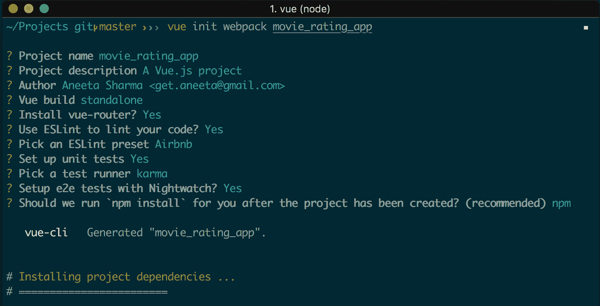
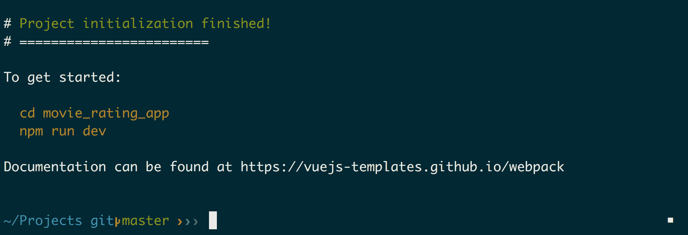
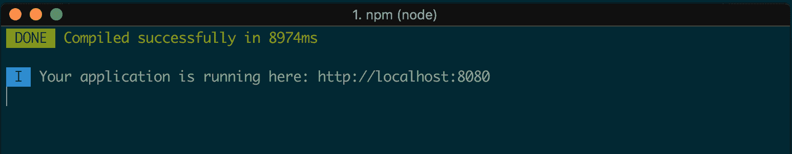
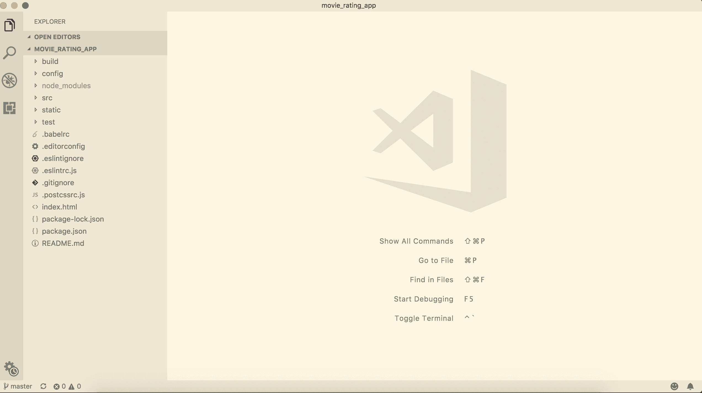
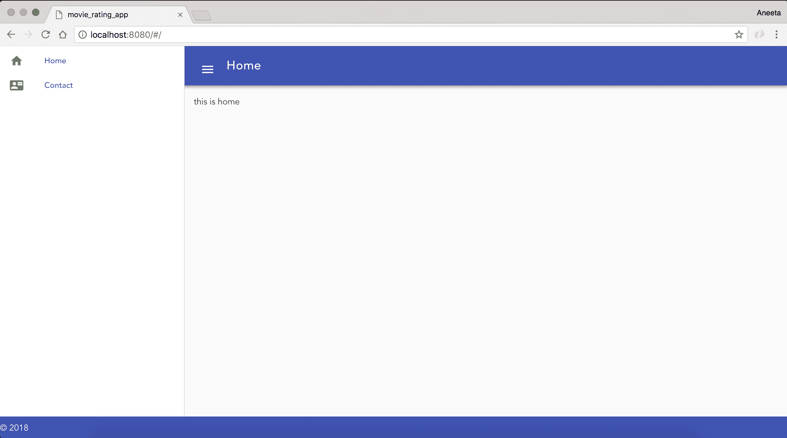
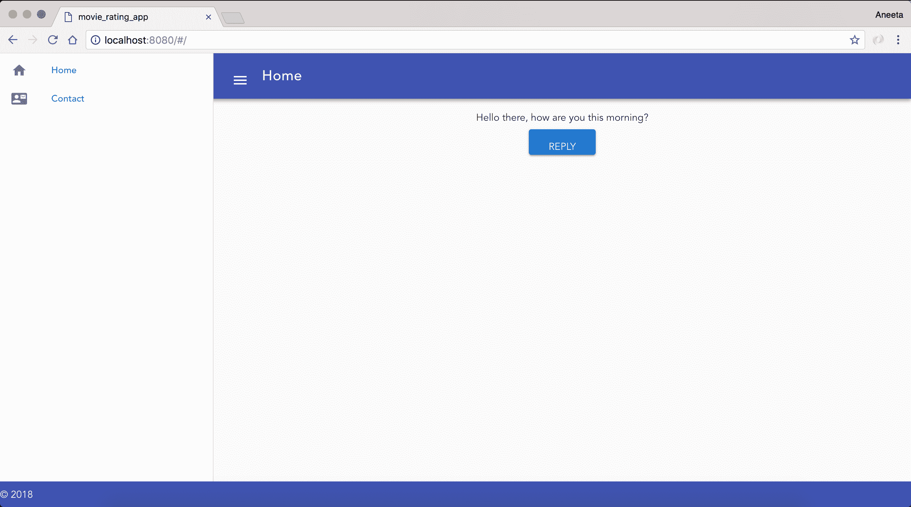
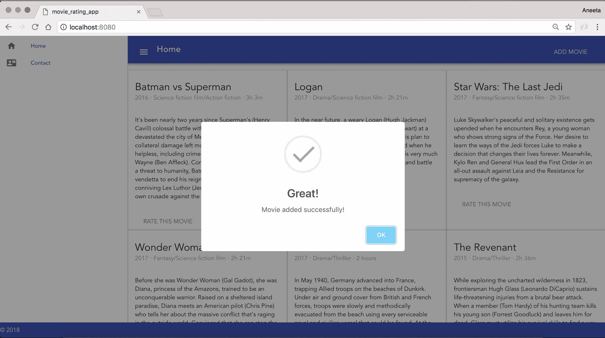
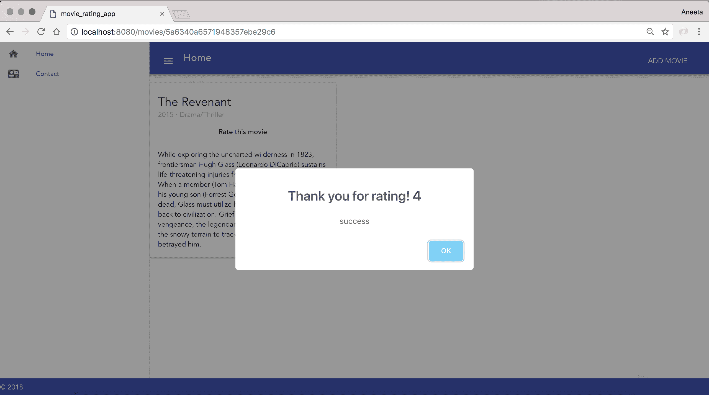

# 二、构建真实的应用

我们已经介绍了构建全栈 JavaScript 应用需要了解的基本组件。 从现在开始，我们将使用所有这些技术来构建一个完整的 web 应用。

我们将构建一个电影评级应用，将有以下特点贯穿这本书:

*   一个列出了所有具有其他属性的电影的主页
*   将有一个管理部分，管理员将能够添加电影
*   用户将能够登录和注册
*   用户将能够对电影进行评级
*   会有一个电影简介部分，登录用户可以对电影进行评级

让我们开始吧。

# 引入 Vue.js

Vue.js 是一个用于构建用户界面的开源渐进 JavaScript 框架。 新的 JavaScript 框架的兴起是巨大的。 随着这种增长，您可能会对从哪里开始以及如何开始感到困惑。 现在有成百上千的 JavaScript 框架; 其中，有几十个框架脱颖而出。 但是，要从这几十个中做出选择可能是一项艰巨的任务。

现在有很多流行的框架，比如 React、Ember 和 Angular。 虽然这些框架有它们自己的优点，但它们也有一些局限性。 虽然使用 React 或 Angular 构建应用本身很好，但 Vue.js 有助于消除与这些框架相关的一些限制。

Vue.js 是**进步的。** 使用 Vue.js，你可以从小程序开始，然后逐渐向构建大程序的方向发展。 这意味着，如果您刚刚开始，您可能希望从一个非常小的应用开始，然后慢慢扩展。 Vue.js 非常适合这种应用。 它很轻，也很灵活。 学习曲线也非常简单，并且非常容易上手。

Vue.js 是由 Evan You 发明的。 它于 2014 年 2 月首次发布，并在 2016 年左右获得了巨大的人气。 他曾经为谷歌和 Angular 项目工作。 这个发明的动机主要是他不想在小项目中使用 Angular，因为 Angular 提供了很多开箱即用的包，因此它不是轻量级的，也不适合小应用。 尽管如此，Vue.js 并不只针对较小的应用。 它当然不会提供所有的包，但是您可以在应用的过程中添加它们。 这就是 Vue.js 的美妙之处。

# 安装 Vue.js

让我们开始安装 Vue.js。 有三种方式安装和使用 Vue.js。

# 将它包含在脚本标记中

使用 Vue.js 的最简单方法是下载它并将其包含在您的`script`标签中。 下载地址:[https://cdn.jsdelivr.net/npm/vue](https://cdn.jsdelivr.net/npm/vue):

```js
<script type="text/javascript" src="vue.js"></script>
```

# 直接使用 CDN (Content Delivery Network)链路

CDN 是一个分布式服务器网络。 它将内容的缓存版本存储在不同的地理位置，以便在获取内容时更快地加载。 我们可以在我们的`script`标签中直接使用 CDN 链接:

```js
<script type="text/javascript" src="https://cdn.jsdelivr.net/npm/vue.js"></script>
```

# 使用 Vue.js 作为 npm 包

`npm`也有`vue`的包，可按如下方式安装:

```js
$ npm install vue
```

# 引入 vue-cli

CLI 是命令行接口的缩写。 A`cli`在命令行界面中连续运行一条或多条命令。 Vue.js 也有一个`cli`，当安装时，使它超级容易旋转项目。 我们将在本书中使用`vue-cli`来创建 Vue.js 应用。 让我们用以下命令安装`vue-cli`。 你可以在根目录下执行这个命令:

```js
$ npm install -g vue-cli
```

# 使用 vue-cli 初始化项目

让我们继续为我们的电影评级应用创建一个新的项目文件夹。 我们称之为`movie_rating_app`。 在终端中进入要创建应用的目录，运行如下命令:

```js
$ vue init webpack movie_rating_app
```

前面的命令用 Vue.js 项目所需的所有依赖项初始化应用。 它会问你几个问题关于项目的设置,你可以回答 y*,在*是*,*或*n,在*:**

 **   **Vue build**:你会发现两个选项来构建 Vue.js 应用:runtime + compiler，或者 runtime Only。 这与模板编译器有关:
    *   **Runtime only:运行时选项用于创建`vue`实例。 该选项不包括模板编译器。**
    *   :该选项包括模板编译器，这意味着`vue`模板被编译成普通的 JavaScript 渲染函数。
*   **Vue-router**:**Vue-router 是 Vue.js 应用的官方路由。 当我们想让我们的应用成为**单页应用**(**SPA**)时，这个选项是特别使用的。 当使用此选项时，应用将在页面初始加载时一次性发出所有必要的请求，并在需要新数据时将请求发送给服务器。 我们也将在以后的章节中更多地讨论单页和多页应用。 现在，我们将使用 vue 路由。**
***   **ESLint**: **它是一个静态代码分析工具，用于发现错误或代码中的错误。 它基本上确保代码遵循标准指导方针。 选择 ESLint 也有两个选项:标准检测或 Airbnb 检测。 在这个项目上，我们将与 Airbnb 合作。***   **设置测试**:**通过设置测试，项目为我们将为应用编写的测试创建一个包装器。 它为能够运行的测试代码创建必要的结构和配置。 我们也将使用这个选项。 对于测试运行器，我们将使用 Mocha 和 Karma，而对于端到端测试，我们将使用 Nightwatch，我们将在后面的章节中学习。*****   **依赖管理**:最后，为了管理包和依赖项，这里我们有两个选项:`npm`和`Yarn`。 我们在前面的章节中主要讨论了`npm`。 与`npm`一样，`Yarn`也是一个依赖管理工具。 Yarn 和`npm`都有各自的优点，但是对于这个应用，我们将使用`npm`。 你可以在这里了解更多关于 Yarn 的信息([https://yarnpkg.com/en/](https://yarnpkg.com/en/))。****

 ****这将花费一些时间，因为它将安装所有的依赖项。 以下是我们为应用选择的选项:



当命令成功执行后，你应该可以在你的终端上看到下一步的步骤:



如果构建成功，我们将能够看到前面的输出。 现在，让我们按照航站楼里说的去做

```js
$ cd movie_rating_app
$ npm run dev
```

这将启动应用。 Vue.js 应用的默认端口是 8080。 正如你在终端中看到的，它应该是这样的:



打开浏览器，打开 URL`http://localhost:8080/#/`，我们应该可以看到我们的应用:


伟大的工作! 这非常简单。 您已经成功创建并运行了 Vue.js 应用。

# 项目文件夹结构

现在，如果您已经注意到，`vue-cli`命令将一堆依赖项添加到您的应用中，这些依赖项在`package.json`文件中列出。 `cli`命令还设置了一个文件夹结构，您也可以根据自己的需要对其进行定制。 让我们回顾并理解`cli`为我们创造的结构:



*   `build`文件夹:此文件夹包含针对不同环境的`webpack`配置文件:开发、测试和生产环境
*   `config`文件夹:应用的所有配置都放在这里
*   `node_modules`:我们安装的所有`npm`包都在这个文件夹中
*   `src`:此文件夹包含所有与在浏览器中渲染组件相关的文件:
    *   `assets`:您可以在此文件夹中添加应用的 CSS 和图像。
    *   `components`:这个文件夹将容纳所有扩展名为`.vue`的前端渲染文件。
    *   `router`:这个文件夹将负责整个应用中不同页面的所有 URL 路由。
    *   `App.vue`:您可以将`App.vue`视为呈现视图文件的主要组件。 其他文件将扩展此文件中定义的布局以创建不同的视图。
    *   `main.js`:这是任何 Vue.js 应用的主要入口点。
*   `Static`:你也可以使用这个文件夹来保存静态文件，如 CSS 和图像。
*   `Test`:此文件夹将用于处理为应用编写的所有测试。

# 使用 Vue.js 构建静态应用

现在我们已经初始化了一个项目，让我们继续创建一个静态 web 应用。 不要忘记在 GitHub 上创建一个存储库，并定期提交和推送更改。

当您访问 URL`http://localhost:8080/#/`时，您将看到呈现的默认页面。 这段代码用`src/components/HelloWorld.vue`编写。

如果你查看`build/webpack.base.conf.js`，你会在`module.exports`部分看到这行代码:

```js
module.exports = {
  context: path.resolve(__dirname, '../'),
  entry: {
    app: './src/main.js'
  },
  output: {
```

这意味着，当你运行应用时，这个`main.js`将是应用的入口点。一切都将从那里开始。 让我们快速查看一下`src`中的`main.js`文件:

```js
// The Vue build version to load with the `import` command
// (runtime-only or standalone) has been set in webpack.base.conf with an alias.
import Vue from 'vue';
import App from './App';
import router from './router';

Vue.config.productionTip = false;

/* eslint-disable no-new */
new Vue({
 el: '#app',
 router,
 template: '<App/>',
 components: { App },
});
```

前三行导入运行该应用所需的包。 `App.vue`是这个应用的主要模板布局。所有其他的`.vue`文件将扩展这个布局。

底部块定义了当你运行应用时要渲染的组件。在本例中，它告诉我们的应用取模板`<App>`并在`#app`元素中渲染它。 现在，如果我们看看`App.vue`:

```js
<template>
 <div id="app">
 
 <router-view/>
 </div>
</template>

<script>
export default {
 name: 'app',
};
</script>

<style>
#app {
 font-family: 'Avenir', Helvetica, Arial, sans-serif;
 -webkit-font-smoothing: antialiased;
 -moz-osx-font-smoothing: grayscale;
 text-align: center;
 color: #2c3e50;
 margin-top: 60px;
}
</style>
```

这里我们有一个模板，它有一个 ID 为`#app`的`div`元素。 这意味着我们创建的`vue`模板将在这里呈现。

# 重新定义主页

让我们为家创建自己的视图页面。 为此，我们只需修改`HelloWorld.vue`组件。 `.vue`文件应该总是以模板开头。 因此，这个文件的基本模板是:

```js
<template>
 <div>
 </div>
</template>
```

您也可以在这个页面中包含样式表和 JavaScript 代码定义，但如果我们将它们单独放在其他地方，它会更清晰。

让我们从`HelloWorld.vue`中删除所有内容，并添加以下代码:

```js
<template>
 <div>
 Hello World
 </div>
</template>
```

我们也不需要 Vue.js 的 logo，所以让我们把它从`src/assets`和`App.vue`的代码行中删除:

```js

```

现在，如果你重新访问 URL`http://localhost:8080/#/`，你会看到呈现`Hello World`:


# 隔离 CSS

是时候分离 CSS 了。 让我们在`src/assets`文件夹中创建一个名为`stylesheets`的文件夹，并添加一个`main.css`文件。 在`main.css`中添加以下代码行:

```js
@import './home.css';
```

`main.css`将是我们的主要 CSS 文件，包括所有其他 CSS 组件。 我们也可以直接在这里添加所有样式代码。 但为了保持可读性，我们将为应用中的不同部分创建单独的样式表，并将它们导入到这里。

因为我们将在这里导入所有的样式表，现在我们需要在主应用中只包括`main.css`文件，以便它被加载。 为此，让我们在`src/App.vue`中添加以下代码行:

```js
<template>
  <div id="app">
    <router-view/>
  </div>
</template>

<script>
import img/stylesheets/main.css'; 
export default {
  name: 'App',
};
</script>
```

我们在`main.css`中导入了一个还不存在的名为`home.css`的样式表。 因此，让我们继续在相同的目录`src/assets`中创建它。 同样，让我们将下面的代码从`App.vue`中删除，并将其粘贴到`home.css`文件中:

```js
#app {
 font-family: 'Avenir', Helvetica, Arial, sans-serif;
 -webkit-font-smoothing: antialiased;
 -moz-osx-font-smoothing: grayscale;
 text-align: center;
 color: #2c3e50;
 margin-top: 60px;
 width: 100%;
}
```

# 介绍 Vuetify

Vuetify 是一个模块，可以用来为 Vue.js 应用构建物质化的网页设计。 它提供了几个可以用作应用构建块的特性。 它是一个像 Bootstrap 一样的 UI 框架，但它大部分都有材料组件。 更多信息，请访问链接[https://vuetifyjs.com](https://vuetifyjs.com)。

在构建应用时，我们将同时使用 Vuetify 和 Bootstrap。 第一步是安装软件包:

```js
$ npm install bootstrap bootstrap-vue vuetify --save
```

在安装这些包之后，我们需要做的下一件事是在我们的主文件中要求这些包。 因此，在`src/main.js`文件中，添加以下几行:

```js
// The Vue build version to load with the `import` command
// (runtime-only or standalone) has been set in webpack.base.conf with an alias.
import 'bootstrap/dist/css/bootstrap.min.css';
import 'bootstrap-vue/dist/bootstrap-vue.css';
import BootstrapVue from 'bootstrap-vue'; 
import Vue from 'vue';
import Vuetify from 'vuetify';
import App from './App';
import router from './router';

Vue.use(BootstrapVue);
Vue.use(Vuetify);

Vue.config.productionTip = false;

/* eslint-disable no-new */
new Vue({
  el: '#app',
  router,
  components: { App },
  template: '<App/>',
});
```

我们还需要使用`vuetify.css`，它包含与其设计相关的所有样式表。 我们也需要这个。 我们可以简单地链接一个样式表。 在`index.html`文件中，在`head`节中添加以下代码行:

```js
...
<head>
    <meta charset="utf-8">
    <meta name="viewport" content="width=device-width,initial-scale=1.0">
    <link href="https://unpkg.com/vuetify/dist/vuetify.min.css" rel="stylesheet">
    <title>movie_rating_app</title>
  </head>
...
```

Vuetify 使用材质图标很好，所以也导入字体。 在`index.html`中也添加以下代码行:

```js
<head>
    <meta charset="utf-8">
    <meta name="viewport" content="width=device-width,initial-scale=1.0">
    <link href="https://unpkg.com/vuetify/dist/vuetify.min.css" rel="stylesheet">
    <link href="https://fonts.googleapis.com/css?family=Roboto:300,400,500,700|Material+Icons" rel="stylesheet">
    <title>movie_rating_app</title>
  </head>
```

# 用 Vuetify 重新设计页面

现在我们有了 Vuetify，让我们继续为应用创建页面。 还为我们提供了一些预定义的主题。 我们将为应用使用一个非常简单和极简主义的主题。当然，我们也可以根据我们的需要定制这些。

本节的结果如下:


# 重新设计主页

在我们的`App.vue`中，用以下代码替换文件内容:

```js
<template>
 <v-app id="inspire">
 <v-navigation-drawer
 fixed
 v-model="drawer"
 app
 >
 <v-list dense>
 <router-link v-bind:to="{ name: 'Home' }" class="side_bar_link">
 <v-list-tile>
 <v-list-tile-action>
 <v-icon>home</v-icon>
 </v-list-tile-action>
 <v-list-tile-content>Home</v-list-tile-content>
 </v-list-tile>
 </router-link>
 <router-link v-bind:to="{ name: 'Contact' }" class="side_bar_link">
 <v-list-tile>
 <v-list-tile-action>
 <v-icon>contact_mail</v-icon>
 </v-list-tile-action>
 <v-list-tile-content>Contact</v-list-tile-content>
 </v-list-tile>
 </router-link>
 </v-list>
 </v-navigation-drawer>
 <v-toolbar color="indigo" dark fixed app>
 <v-toolbar-side-icon @click.stop="drawer = !drawer"></v-toolbar-side-icon>
 <v-toolbar-title>Home</v-toolbar-title>
 </v-toolbar>
 <v-content>
 <v-container fluid>
 <div id="app">
 <router-view/>
 </div>
 </v-container>
 </v-content>
 <v-footer color="indigo" app>
 <span class="white--text">&copy; 2018</span>
 </v-footer>
 </v-app>
</template>

<script>
import img/stylesheets/main.css';

export default {
 data: () => ({
 drawer: null,
 }),
 props: {
 source: String,
 },
};
</script>
```

其中包含了几个以`v-`开头的标签。 这些是 Vuetify 给出的标签，用于在 UI 中定义我们的块。 我们在前面的文件`main.css`中附加了一个`stylesheet`文件。 让我们为`App.vue`页面添加一些样式。

将以下代码添加到`simg/stylesheets/home.css`:

```js
#app {
 font-family: 'Avenir', Helvetica, Arial, sans-serif;
 -webkit-font-smoothing: antialiased;
 -moz-osx-font-smoothing: grayscale;
 text-align: center;
 color: #2c3e50;
}

#inspire {
 font-family: 'Avenir', Helvetica, Arial, sans-serif;
}

.container.fill-height {
 align-items: normal;
}

a.side_bar_link {
 text-decoration: none;
}
```

我们仍然有一个带有 ID 应用的`div`部分。 这一节将渲染所有其他的`.vue`文件。

现在，在`HelloWorld.vue`中，将内容替换为:

```js
<template>
 <v-layout>
 this is home
 </v-layout>
</template>
```

现在，如果您访问`http://localhost:8080/#/`，您应该能够查看主页。

# 重新设计联系人页面

让我们继续添加一个新的联系人页面。 首先要做的是添加一个路由到我们的路由文件。 在`router/index.js`中添加以下代码:

```js
import Vue from 'vue';
import Router from 'vue-router';
import HelloWorld from '@/components/HelloWorld';
import Contact from '@/components/Contact';

Vue.use(Router);

export default new Router({
  routes: [
    {
      path: '/',
      name: 'HelloWorld',
      component: HelloWorld,
    },
 {
 path: '/contact',
 name: 'Contact',
 component: Contact,
 },
  ],
});
```

我们在这里所做的是为联系人页面添加一个路径、组件的名称(这是我们在`.vue`文件中的导出模块中所做的)以及组件的实际名称。 现在我们需要构建一个视图文件。 因此，让我们在`src/components/`中创建一个`Contact.vue`文件，并添加以下内容:

```js
<template>
 <v-layout>
 this is contact
 </v-layout>
</template>
```

现在，访问`http://localhost:8080/#/contact`，您应该能够查看这两个页面。

为了让它在我们的应用中可用且易于阅读，让我们将`HelloWorld`组件重命名为`Home`组件。 将文件`HelloWorld.vue`重命名为`Home.vue`

同时，将`App.vue`的结合路径由`HelloWorld`改变为`Home`:

```js
<template>
  <v-app id="inspire">
    <v-navigation-drawer
      fixed
      v-model="drawer"
      app
    >
      <v-list dense>
 <router-link v-bind:to="{ name: 'Home' }" class="side_bar_link">
          <v-list-tile @click="">
            <v-list-tile-action>
              <v-icon>home</v-icon>
```

同样，在`routes/index.js`中，将组件名称和到`Home`的路由从`HelloWorld`更改:

```js
import Vue from 'vue';
import Router from 'vue-router';
import Home from '@/components/Home';
import Contact from '@/components/Contact';

Vue.use(Router);

export default new Router({
  routes: [
    {
      path: '/',
      name: 'Home',
      component: Home,
    },
    {
      path: '/contact',
      name: 'Contact',
      component: Contact,
    },
  ],
});
```

当我们访问 URL`http://localhost:8080/#/`时，我们应该能够看到这样的内容:



就是这样。 您已经成功地创建了一个基本的静态两页 web 应用!

# 理解 Vue.js 组件

`vue`组件相当于在应用中编写的 HTML 文件。 你可以在`.vue`文件中编写普通的 HTML 语法。 唯一需要注意的是用`<template></template>`包装所有内容。

# Vue.js 指令

指令与标记语言一起使用，在 DOM 元素上执行一些函数。 例如，在 HTML 标记语言中，当我们写:

```js
<div class='app'></div>
```

这里使用的`class`是 HTML 语言的指令。 类似地，Vue.js 也提供了很多这样的指令来简化应用的开发，例如:

*   `v-text`
*   `v-on`
*   `v-ref`
*   `v-show`
*   `v-pre`
*   `v-transition`
*   `v-for`

# v-text

当需要显示一些必须动态定义的变量时，可以使用`v-text`。 让我们看一个例子。 在`src/components/Home.vue`中，我们添加以下内容:

```js
<template>
  <v-layout>
    <div v-text="message"></div>
  </v-layout>
</template>
<script type="text/javascript">
export default {
 data() {
 return {
 message: 'Hello there, how are you this morning?',
 };
 },
};
</script>
```

脚本标记中的代码是一个数据变量，它将在其中定义的数据绑定到该组件。 当你改变变量 message 的值时，带有该指令的`div`元素也会被更新。

如果我们访问 URL(`http://localhost:8080/#/`)，我们可以看到以下内容:


# v

此指令用于事件处理。 我们可以使用它来触发应用中的某些逻辑。 例如，假设我们想回答在上一个例子中做过的一个问题，为此我们可以做以下操作。 将`src/components/Home.vue`中的代码更改为:

```js
<template>
  <v-layout row wrap>
 <v-flex xs12>
 <div v-text="message"></div>
 </v-flex>
 <v-flex xs12>
 <v-btn color="primary" v-on:click="reply">Reply</v-btn>
 </v-flex>
 </v-layout>
</template>
<script type="text/javascript">
export default {
  data() {
    return {
      message: 'Hello there, how are you this morning?',
    };
  },
  methods: {
 reply() {
 this.message = "I'm doing great. Thank You!";
 },
 },
};
</script>
```

第一个屏幕将如下:



单击“回复”，您将看到以下内容:


这些是我们将在我们的应用中使用最多的指令。还有很多其他指令，我们将在路上探索。 如果你想了解更多关于这些，你可以访问`https://012.vuejs.org/api/directives.html`。

# 数据绑定

**数据绑定**是数据同步的过程。 例如，对于我们在`v-text`上所做的相同示例，我们可以使用与 mustache 的数据绑定，换句话说，使用`{{}}`操作符。

例如，我们可以使用`{{message}}`来代替 Vue.js 指令来处理消息。 让我们将`src/components/Home.vue`中的代码修改为如下:

```js
<template>
  <v-layout row wrap>
    <v-flex xs12>
      <div>{{message}}</div>
    </v-flex>
    <v-flex xs12>
      <v-btn color="primary" v-on:click="reply">Reply</v-btn>
    </v-flex>
  </v-layout>
</template>
<script type="text/javascript">
  export default {
    data () {
      return {
        message: 'Hello there, how are you?',
      }
    },
    methods: {
      reply () {
        this.message = "I'm doing great. Thank You!"
      }
    }
  }
</script>
```

这将与我们对`v-text`所做的相同。

# 使用 Vue.js 处理表单

现在，我们已经对 Vue.js 的工作原理有了基本的了解，让我们继续第一个表单，我们将在其中添加电影的细节，并将这些电影显示在主页上，以便用户能够查看它们。

# 创建电影列表页面

首先，让我们开始为我们的主页创建静态的电影卡，我们将在下一步中使这个数据动态。 在`Home.vue`中，用以下代码替换`template`中的内容:

```js
<template>
 <v-layout row wrap>
 <v-flex xs4>
 <v-card>
 <v-card-title primary-title>
 <div>
 <div class="headline">Batman vs Superman</div>
 <span class="grey--text">2016 ‧ Science fiction film/Action fiction ‧ 3h 3m</span>
 </div>
 </v-card-title>
 <v-card-text>
 It's been nearly two years since Superman's (Henry Cavill) colossal battle with Zod (Michael Shannon) devastated the city of Metropolis. The loss of life and collateral damage left many feeling angry and helpless, including crime-fighting billionaire Bruce Wayne (Ben Affleck). Convinced that Superman is now a threat to humanity, Batman embarks on a personal vendetta to end his reign on Earth, while the conniving Lex Luthor (Jesse Eisenberg) launches his own crusade against the Man of Steel.
 </v-card-text>
 <v-card-actions>
 <v-btn flat color="purple">Rate this movie</v-btn>
 <v-spacer></v-spacer>
 </v-card-actions>
 </v-card>
 </v-flex>
 <v-flex xs4>
 <v-card>
 <v-card-title primary-title>
 <div>
 <div class="headline">Logan</div>
 <span class="grey--text">2017 ‧ Drama/Science fiction film ‧ 2h 21m</span>
 </div>
 </v-card-title>
 <v-card-text>
 In the near future, a weary Logan (Hugh Jackman) cares for an ailing Professor X (Patrick Stewart) at a remote outpost on the Mexican border. His plan to hide from the outside world gets upended when he meets a young mutant (Dafne Keen) who is very much like him. Logan must now protect the girl and battle the dark forces that want to capture her.
 </v-card-text>
 <v-card-actions>
 <v-btn flat color="purple">Rate this movie</v-btn>
 <v-spacer></v-spacer>
 </v-card-actions>
 </v-card>
 </v-flex>
 <v-flex xs4>
 <v-card>
 <v-card-title primary-title>
 <div>
 <div class="headline">Star Wars: The Last Jedi</div>
 <span class="grey--text">2017 ‧ Fantasy/Science fiction film ‧ 2h 35m</span>
 </div>
 </v-card-title>
 <v-card-text>
 Luke Skywalker's peaceful and solitary existence gets upended when he encounters Rey, a young woman who shows strong signs of the Force. Her desire to learn the ways of the Jedi forces Luke to make a decision that changes their lives forever. Meanwhile, Kylo Ren and General Hux lead the First Order in an all-out assault against Leia and the Resistance for supremacy of the galaxy.
 </v-card-text>
 <v-card-actions>
 <v-btn flat color="purple">Rate this movie</v-btn>
 <v-spacer></v-spacer>
 </v-card-actions>
 </v-card>
 </v-flex>
 <v-flex xs4>
 <v-card>
 <v-card-title primary-title>
 <div>
 <div class="headline">Wonder Woman</div>
 <span class="grey--text">2017 ‧ Fantasy/Science fiction film ‧ 2h 21m</span>
 </div>
 </v-card-title>
 <v-card-text>
 Before she was Wonder Woman (Gal Gadot), she was Diana, princess of the Amazons, trained to be an unconquerable warrior. Raised on a sheltered island paradise, Diana meets an American pilot (Chris Pine) who tells her about the massive conflict that's raging in the outside world. Convinced that she can stop the threat, Diana leaves her home for the first time. Fighting alongside men in a war to end all wars, she finally discovers her full powers and true destiny.
 </v-card-text>
 <v-card-actions>
 <v-btn flat color="purple">Rate this movie</v-btn>
 <v-spacer></v-spacer>
 </v-card-actions>
 </v-card>
 </v-flex>
 <v-flex xs4>
 <v-card>
 <v-card-title primary-title>
 <div>
 <div class="headline">Dunkirk</div>
 <span class="grey--text">2017 ‧ Drama/Thriller ‧ 2 hours</span>
 </div>
 </v-card-title>
 <v-card-text>
 In May 1940, Germany advanced into France, trapping Allied troops on the beaches of Dunkirk. Under air and ground cover from British and French forces, troops were slowly and methodically evacuated from the beach using every serviceable naval and civilian vessel that could be found. At the end of this heroic mission, 330,000 French, British, Belgian and Dutch soldiers were safely evacuated.
 </v-card-text>
 <v-card-actions>
 <v-btn flat color="purple">Rate this movie</v-btn>
 <v-spacer></v-spacer>
 </v-card-actions>
 </v-card>
 </v-flex>
 <v-flex xs4>
 <v-card>
 <v-card-title primary-title>
 <div>
 <div class="headline">The Revenant</div>
 <span class="grey--text">2015 ‧ Drama/Thriller ‧ 2h 36m</span>
 </div>
 </v-card-title>
 <v-card-text>
 While exploring the uncharted wilderness in 1823, frontiersman Hugh Glass (Leonardo DiCaprio) sustains life-threatening injuries from a brutal bear attack. When a member (Tom Hardy) of his hunting team kills his young son (Forrest Goodluck) and leaves him for dead, Glass must utilize his survival skills to find a way back to civilization. Grief-stricken and fueled by vengeance, the legendary fur trapper treks through the snowy terrain to track down the man who betrayed him.
 </v-card-text>
 <v-card-actions>
 <v-btn flat color="purple">Rate this movie</v-btn>
 <v-spacer></v-spacer>
 </v-card-actions>
 </v-card>
 </v-flex>
 </v-layout>
</template>
```

另外，将`home.css`中的内容替换如下:

```js
#app {
 font-family: 'Avenir', Helvetica, Arial, sans-serif;
 -webkit-font-smoothing: antialiased;
 -moz-osx-font-smoothing: grayscale;
 text-align: center;
 color: #2c3e50;
 width: 100%;
}

#inspire {
 font-family: 'Avenir', Helvetica, Arial, sans-serif;
}

.container.fill-height {
 align-items: normal;
}

a.side_bar_link {
 text-decoration: none;
}

.card__title--primary, .card__text {
 text-align: left;
}

.card {
 height: 100% !important;
}
```

另外，在`App.vue`中，用以下内容替换:

```js
<template>
 <v-app id="inspire">
 <v-navigation-drawer
 fixed
 v-model="drawer"
 app
 >
 <v-list dense>
 <router-link v-bind:to="{ name: 'Home' }" class="side_bar_link">
 <v-list-tile>
 <v-list-tile-action>
 <v-icon>home</v-icon>
 </v-list-tile-action>
 <v-list-tile-content>Home</v-list-tile-content>
 </v-list-tile>
 </router-link>
 <router-link v-bind:to="{ name: 'Contact' }" class="side_bar_link">
 <v-list-tile>
 <v-list-tile-action>
 <v-icon>contact_mail</v-icon>
 </v-list-tile-action>
 <v-list-tile-content>Contact</v-list-tile-content>
 </v-list-tile>
 </router-link>
 </v-list>
 </v-navigation-drawer>
 <v-toolbar color="indigo" dark fixed app>
 <v-toolbar-side-icon @click.stop="drawer = !drawer"></v-toolbar-side-icon>
 <v-toolbar-title>Home</v-toolbar-title>
 <v-spacer></v-spacer>
 <v-toolbar-items class="hidden-sm-and-down">
 <v-btn flat v-bind:to="{ name: 'AddMovie' }">Add Movie</v-btn>
 </v-toolbar-items>
 </v-toolbar>
 <v-content>
 <v-container fluid>
 <div id="app">
 <router-view/>
 </div>
 </v-container>
 </v-content>
 <v-footer color="indigo" app>
 <span class="white--text">&copy; 2018</span>
 </v-footer>
 </v-app>
</template>

<script>
import img/stylesheets/main.css';

export default {
 data: () => ({
 drawer: null,
 }),
 props: {
 source: String,
 },
};
</script>
```

最后替换`src/main.js`中的内容:

```js
// The Vue build version to load with the `import` command
// (runtime-only or standalone) has been set in webpack.base.conf with an alias.
import 'bootstrap/dist/css/bootstrap.min.css';
import 'bootstrap-vue/dist/bootstrap-vue.css'; 
import BootstrapVue from 'bootstrap-vue';
import Vue from 'vue';
import Vuetify from 'vuetify';
import App from './App';
import router from './router';

Vue.use(BootstrapVue);
Vue.use(Vuetify);

Vue.config.productionTip = false;

/* eslint-disable no-new */
new Vue({
 el: '#app',
 router,
 components: { App },
 template: '<App/>',
});
```

有了这个，我们应该在主页上有一个这样的页面:


我们将使这些页面动态。

# 创建一个“添加电影”窗体

首先，我们需要添加一个链接，该链接将我们带到一个添加电影的表单。 为此，我们需要更改`App.vue`中的工具栏。 因此，让我们在`App.vue`中添加一个到工具栏的链接:

```js
<v-toolbar color="indigo" dark fixed app>
 <v-toolbar-side-icon @click.stop="drawer = !drawer"></v-toolbar-side-icon>
 <v-toolbar-title>Home</v-toolbar-title>
 <v-spacer></v-spacer>
 <v-toolbar-items class="hidden-sm-and-down">
 <v-btn flat v-bind:to="{ name: 'AddMovie' }">Add Movie</v-btn>
 </v-toolbar-items>
</v-toolbar>
```

现在我们有了链接，我们需要添加一个路由来将其链接到页面。 就像我们在`Contact`页面中所做的一样，让我们添加一个用于将影片添加到应用的路由。 所以，在`routes/index.js`中:

```js
import Vue from 'vue';
import Router from 'vue-router';
import Home from '@/components/Home';
import Contact from '@/components/Contact';
import AddMovie from '@/components/AddMovie';

Vue.use(Router);

export default new Router({
  routes: [
    {
      path: '/',
      name: 'Home',
      component: Home,
    },
    {
      path: '/contact',
      name: 'Contact',
      component: Contact,
    },
    {
 path: '/movies/add',
 name: 'AddMovie',
 component: AddMovie,
 },
  ],
});
```

这里，我们为`AddMovie`添加了一条路径，这意味着我们可以在`http://localhost:8080/#/movies/add`访问添加电影页面。

现在我们需要做的下一件事是创建`vue`组件文件。 为此，让我们在`src/components`中添加一个新的`AddMovie.vue`文件。 Vuetify 提供了一种非常简单的方式来创建表单和添加验证。 您可以在[https://vuetifyjs.com/components/forms](https://vuetifyjs.com/components/forms)上查找更多信息。

让我们将以下内容添加到`src/components/AddMovie.vue`中:

```js
<template>
 <v-form v-model="valid" ref="form" lazy-validation>
 <v-text-field
 label="Movie Name"
 v-model="name"
 :rules="nameRules"
 required
 ></v-text-field>
 <v-text-field
 name="input-7-1"
 label="Movie Description"
 v-model="description"
 multi-line
 ></v-text-field>
 <v-select
 label="Movie Release Year"
 v-model="release_year"
 :items="years"
 ></v-select>
 <v-text-field
 label="Movie Genre"
 v-model="genre"
 ></v-text-field>
 <v-btn
 @click="submit"
 :disabled="!valid"
 >
 submit
 </v-btn>
 <v-btn @click="clear">clear</v-btn>
 </v-form>
</template>
```

Vuetify 还为表单提供了一些基本的验证。 让我们也为它添加一些验证。

在`script`标签中添加以下代码到`AddMovie.vue`:

```js
<template>
...
</template>
<script>
export default {
 data: () => ({
 valid: true,
 name: '',
 description: '',
 genre: '',
 release_year: '',
 nameRules: [
 v => !!v || 'Movie name is required',
 ],
 select: null,
 years: [
 '2018',
 '2017',
 '2016',
 '2015',
 ],
 }),
 methods: {
 submit() {
 if (this.$refs.form.validate()) {
 // Perform next action
 }
 },
 clear() {
 this.$refs.form.reset();
 },
 },
};
</script>
```

如果我们查看`AddMovie.vue`中的 form 元素，这一行表示:

```js
 <v-form v-model="valid" ref="form" lazy-validation> 
```

`v-model="valid"`部分在这里所做的是确保表单在为 true 之前不会被提交，这再次与我们在底部添加的脚本联系在一起。 另外，让我们看看添加到表单中的验证。

第一个基本验证是`required`验证:

```js
<v-text-field
  label="Movie Name"
  v-model="name"
  :rules="nameRules"
  required
></v-text-field>
```

这将在`name`字段中添加一个`required`验证。

此外，对于`release_year`字段，我们希望它是一个年的下拉列表，因此，为此，我们添加了以下内容:

```js
<script>
export default {
  data: () => ({
    valid: true,
    name: '',
    description: '',
    genre: '',
    release_year: '',
    nameRules: [
      v => !!v || 'Movie name is required',
    ],
    select: null,
    years: [
 '2018',
 '2017',
 '2016',
 '2015',
 ],
  }),
  methods: {
    submit() {
      if (this.$refs.form.validate()) {
        // Perform next action
      }
    },
    clear() {
      this.$refs.form.reset();
    },
  },
};
</script>
```

这将通过脚本动态地将项目添加到选择列表中。

在最后一部分，我们有两个按钮`Submit`和`Clear`，分别调用方法`submit() `和`clear()`。

现在，当你访问 URL(`http://localhost:8080/#/movies/add`)时，你应该有一个这样的表单:


**Movie Name**中的`*`表示它是必需字段。

如果您注意到了，我们已经在添加的所有路由中添加了一个`#`。 这是因为它是 Vue.js 路由的默认设置。 我们可以通过在`routes/index.js`中添加`mode: 'history'`来移除:

```js
import Vue from 'vue';
import Router from 'vue-router';
import Home from '@/components/Home';
import Contact from '@/components/Contact';
import AddMovie from '@/components/AddMovie';

Vue.use(Router);

export default new Router({
  mode: 'history',
  routes: [
    {
      path: '/',
      name: 'Home',
      component: Home,
    },
    {
      path: '/contact',
      name: 'Contact',
      component: Contact,
    },
    {
      path: '/movies/add',
      name: 'AddMovie',
      component: AddMovie,
    },
  ],
});
```

现在，我们可以在 URL 中不添加`#`就全部路由，如下所示:

*   `http://localhost:8080/`
*   `http://localhost:8080/contact`
*   `http://localhost:8080/movies/add`

# 与服务器通信

我们现在有一个电影列表页面，我们有一个添加电影页面，所以我们要做的下一件事是在提交表单时将数据保存到 MongoDB 中。

# 将 express 添加到我们的应用

现在我们已经准备好了所有组件，是时候向应用添加服务器层了。

让我们先添加以下快递包裹:

```js
npm install express --save
```

下一部分是创建必要的端点和模型，以便将影片添加到数据库中。

为此，我们首先需要安装所需的软件包:

*   `body-parser`:解析传入的请求
*   `cors`:处理前端和后端之间的跨源请求
*   : HTTP 请求记录器
*   `mongoose`:MongoDB 的对象建模

让我们在终端中运行以下命令来安装所有这些包:

```js
$ npm install morgan body-parser cors mongoose --save
```

# 添加服务器文件

现在，我们需要为应用设置服务器。 让我们在应用的根目录中添加一个名为`server.js`的文件，并添加以下内容:

```js
const express = require('express');
const bodyParser = require('body-parser');
const mongoose = require('mongoose');
const cors = require('cors');
const morgan = require('morgan');
const fs = require('fs');

const app = express();
const router = express.Router();
app.use(morgan('combined'));
app.use(bodyParser.json());
app.use(cors());

//connect to mongodb
mongoose.connect('mongodb://localhost/movie_rating_app', function() {
 console.log('Connection has been made');
})
.catch(err => {
 console.error('App starting error:', err.stack);
 process.exit(1);
});

router.get('/', function(req, res) {
 res.json({ message: 'API Initialized!'});
});

const port = process.env.API_PORT || 8081;
app.use('/', router);
app.listen(port, function() {
 console.log(`api running on port ${port}`);
});
```

这里，我们设置了一个服务器，它告诉快速服务器在 8081 端口上运行。 我们将使用这个服务器通过 express 处理所有 API 请求。

此外，我们已经要求并使用了这个`server.js`文件中所需要的所有包。

同样，对于猫鼬连接，我们已经添加了一个连接到我们的本地数据库，名为`movie_rating_app`，代码块如下:

```js
//connect to mongodb
mongoose.connect('mongodb://localhost/movie_rating_app', function() {
  console.log('Connection has been made');
})
.catch(err => {
  console.error('App starting error:', err.stack);
  process.exit(1);
});
```

正如我之前提到的，如果数据库还不存在，当我们将第一个 Mongoose 文档添加到 DB 时，它将自动创建。

下一步是运行 MongoDB 服务器。 让我们在终端中运行以下命令:

```js
$ mongod
```

一旦 Mongo 服务器启动，让我们为这个应用启动我们的`node`服务器，使用下面的命令:

```js
$ node server.js
```

现在，当我们打开`http://localhost:8081/`时，您应该能够看到以下消息:


到目前为止，我们的前端服务器已经启动并运行在 8080 端口上，如下所示:

```js
$ npm run dev
```

后端服务器运行在 8081 端口上，具有以下功能:

```js
$ node server.js 
```

需要记住的一件重要的事情是，每当我们更改`server.js`中的代码时，我们都必须通过运行以下命令重新启动服务器:

```js
$ node server.js
```

这是一项非常乏味的工作。 然而，有一个很好的方法可以摆脱它。 有一个名为`nodemon`的包，安装后，每当代码更新时，它就会自动重启服务器，而不必每次都手动进行。 所以，让我们继续安装这个包:

```js
$ npm install nodemon --save 
```

安装好包后，现在我们可以使用以下命令启动服务器:

```js
$ nodemon server.js
```

# 添加 Movie 模型

下一步是在提交表单时将电影添加到数据库中。 让我们在根目录下创建一个名为`models`的文件夹，并在`models`目录下添加一个`Movie.js`文件:

We will be using singular capitalized names for Models, and all lowercase plural names for `Controllers` files.

将以下代码导入`Movie.js`:

```js
const mongoose = require('mongoose');

const Schema = mongoose.Schema;
const MovieSchema = new Schema({
 name: String,
 description: String,
 release_year: Number,
 genre: String,
});

const Movie = mongoose.model('Movie', MovieSchema)
module.exports = Movie;
```

在这里，我们创建了一个 Movie 模型，该模型将使用前面添加到`AddMovie.vue`表单中的所有四个属性。

# 添加电影控制器

现在，我们需要设置的最后一件事是将影片保存到数据库的端点。 让我们在根目录下创建一个名为`controllers`的文件夹，并在该目录下添加一个名为`movies.js`的文件，并添加以下代码:

```js
const MovieSchema = require('../models/Movie.js');

module.exports.controller = (app) => {
 // add a new movie
 app.post('/movies', (req, res) => {
 const newMovie = new MovieSchema({
 name: req.body.name,
 description: req.body.description,
 release_year: req.body.release_year,
 genre: req.body.genre,
 });

 newMovie.save((error, movie) => {
 if (error) { console.log(error); }
 res.send(movie);
 });
 });
};
```

在这里，我们添加了一个端点，它接受带有给定参数的 post 请求，并在我们配置的数据库中创建一个 Mongoose 文档。

由于这些控制器具有路由，我们还需要在主入口点中包含这些文件。 对于后端，主要的入口文件是`server.js`。 所以，让我们在`server.js`中添加以下高亮显示的代码块:

```js
...
//connect to mongodb
mongoose.connect('mongodb://localhost/movie_rating_app', function() {
  console.log('Connection has been made');
})
.catch(err => {
  console.error('App starting error:', err.stack);
  process.exit(1);
});

// Include controllers
fs.readdirSync("controllers").forEach(function (file) {
 if(file.substr(-3) == ".js") {
 const route = require("./controllers/" + file)
 route.controller(app)
 }
})

router.get('/', function(req, res) {
  res.json({ message: 'API Initialized!'});
});
...
```

这个代码块将包含我们所有的控制器文件，我们不需要手动添加它们。

# 连接前端和后端

现在，我们有了模型和端点。 接下来要做的是在点击`AddMovie.vue`中的 Submit 按钮时调用这个端点。

这是我们需要进行前端和后端通信的部分。 为此，我们需要使用一个名为 axios 的单独包。

axios 包帮助我们从 Node.js 发出 HTTP 请求。 它有助于从前端进行 Ajax 调用。 axios 也有几个替代方案，比如 fetch 和 superagent。 但 axios 已经足够成功，成为其中最受欢迎的。 所以我们也会用到同样的东西。

# 安装 axios

现在，为了在客户端和服务器之间进行通信，我们将使用`axios`库。 所以，让我们先安装库:

```js
npm install axios --save
```

# 连接所有部件

现在，我们已经准备好了在客户机和服务器之间进行通信的所有东西(电影模型、电影控制器和 axios)。 现在要做的最后一件事是在我们单击 Movie Add 表单中的提交按钮时连接这些部分。 如果你还记得，我们在提交按钮`AddMovie.vue`之前添加了一个占位符:

```js
<v-select
      label="Movie Release Year"
      v-model="select"
      :items="years"
    ></v-select>
    <v-text-field
      label="Movie Genre"
      v-model="genre"
    ></v-text-field>
    <v-btn
 @click="submit"
 :disabled="!valid"
 >
      submit
    </v-btn>
    <v-btn @click="clear">clear</v-btn>
```

这段代码告诉我们在单击按钮时执行`submit()`方法。 我们在`script`部分也有它:

```js
...
methods: {
    submit() {
 if (this.$refs.form.validate()) {
 // Perform next action
 }
 },
    clear() {
      this.$refs.form.reset();
    },
```

```js
  },
...
```

我们将在本节中添加所有的方法。 现在我们有了`submit`的占位符，让我们修改这段代码，以合并 Movie Add 表单:

```js
<script>
import axios from 'axios';

export default {
  data: () => ({
    valid: true,
    name: '',
    description: '',
    genre: '',
    release_year: '',
    nameRules: [
      v => !!v || 'Movie name is required',
    ],
    select: null,
    years: [
      '2018',
      '2017',
      '2016',
      '2015',
    ],
  }),
  methods: {
    submit() {
 if (this.$refs.form.validate()) {
 return axios({
 method: 'post',
 data: {
 name: this.name,
 description: this.description,
 release_year: this.release_year,
 genre: this.genre,
 },
 url: 'http://localhost:8081/movies',
 headers: {
 'Content-Type': 'application/json',
 },
 })
 .then(() => {
 this.$router.push({ name: 'Home' });
 this.$refs.form.reset();
 })
 .catch(() => {
 });
 }
 return true;
 },
    clear() {
      this.$refs.form.reset();
    },
  },
};
</script>
```

这应该足够了。 现在，让我们继续从`http://localhost:8080/movies/add`端点从 UI 本身添加一个电影。 我们应该能够在 MongoDB 中保存电影的记录。 我来解释一下。

当我们点击`Submit`按钮时，我们通过 axios 发出一个 AJAX 请求来点击电影控制器中的 post 端点。 电影控制器中的`post`方法依次保存带有我们根据为电影设计的模型模式所给出的参数的记录。 当这个过程完成后，将页面重定向回主页。

为了检查记录是否真的创建了，让我们看看 MongoDB:

```js
$ mongo
$ use movie_rating_app
$ db.movies.find()
```

我们可以看到使用我们在表单中提供的参数创建的记录:


# 添加表单验证

在前一节中，我们还介绍了如何添加验证。 让我们继续往 movie add 表单中添加一些验证。 我们将添加以下验证:

*   `Movie Name`不能为空
*   `Movie Description`是可选的
*   `Movie Release Year`不能为空
*   电影的类型是必需的，最多将是 80 个角色

在`AddMovie.vue`中，让我们在输入字段中添加规则，并绑定脚本中的规则:

```js
<template>
  <v-form v-model="valid" ref="form" lazy-validation>
    <v-text-field
      label="Movie Name"
      v-model="name"
      :rules="nameRules"
      required
    ></v-text-field>
    <v-text-field
      name="input-7-1"
      label="Movie Description"
      v-model="description"
      multi-line
    ></v-text-field>
    <v-select
      label="Movie Release Year"
      v-model="release_year"
      required
 :rules="releaseRules"
      :items="years"
    ></v-select>
    <v-text-field
      label="Movie Genre"
      v-model="genre"
      required
 :rules="genreRules"
    ></v-text-field>
    <v-btn
      @click="submit"
      :disabled="!valid"
    >
      submit
    </v-btn>
    <v-btn @click="clear">clear</v-btn>
  </v-form>
</template>
<script>
  import axios from 'axios';

  export default {
    data: () => ({
      valid: true,
      name: '',
      description: '',
      genre: '',
      release_year: '',
      nameRules: [
        (v) => !!v || 'Movie name is required'
      ],
      genreRules: [
 v => !!v || 'Movie genre year is required',
 v => (v && v.length <= 80) || 'Genre must be less than equal to 80 characters.',
 ],
 releaseRules: [
 v => !!v || 'Movie release year is required',
 ],
      select: null,
      years: [
        '2018',
        '2017',
        '2016',
        '2015'
      ],
      checkbox: false
    }),
    methods: {
      submit () {
        if (this.$refs.form.validate()) {
          return axios({
            method: 'post',
            data: {
              name: this.name,
              description: this.description,
              release_year: this.release_year,
              genre: this.genre
            },
            url: 'http://localhost:8081/movies',
            headers: {
              'Content-Type': 'application/json'
            }
          })
          .then((response) => {
            this.$router.push({ name: 'Home' });
            this.$refs.form.reset();
          })
          .catch((error) => {
          });
```

```js
        }
      },
      clear () {
        this.$refs.form.reset()
      }
    }
  }
</script>
```

现在，如果我们试图提交所有字段为空的表单，且字段`Movie Genre`的字符超过 80 个，那么我们将无法提交表单。 该表单将显示以下错误消息:


# 添加 flash 消息

我们已经介绍了应用构建的基础知识。 现在我们可以添加一个电影了，当电影成功地保存在 DB 中时，如果有一个特定的消息，或者出现错误时通知，那就更好了。 有几个`npm`包可以做到这一点。 我们也可以自己建造。 对于这个应用，我们将使用一个名为:`vue-swal(https://www.npmjs.com/package/vue-swal)`的包。 让我们先添加包:

```js
$ npm install vue-swal --save
```

现在，让我们把这个包包含在我们的`main.js`文件中:

```js
// The Vue build version to load with the `import` command
// (runtime-only or standalone) has been set in webpack.base.conf with an alias.
import 'bootstrap/dist/css/bootstrap.min.css';
import 'bootstrap-vue/dist/bootstrap-vue.css';

import BootstrapVue from 'bootstrap-vue';
import Vue from 'vue';
import Vuetify from 'vuetify';
import VueSwal from 'vue-swal';
import App from './App';
import router from './router';

Vue.use(BootstrapVue);
Vue.use(Vuetify);
Vue.use(VueSwal);

Vue.config.productionTip = false;

/* eslint-disable no-new */
new Vue({
  el: '#app',
  router,
  components: { App },
  template: '<App/>',
});
```

现在，让我们修改我们的`AddMovie.vue`，在动作执行成功或失败时显示 flash 消息:

```js
...
methods: {
  submit() {
    if (this.$refs.form.validate()) {
      return axios({
        method: 'post',
        data: {
          name: this.name,
          description: this.description,
          release_year: this.release_year,
          genre: this.genre,
        },
        url: 'http://localhost:8081/movies',
        headers: {
          'Content-Type': 'application/json',
        },
      })
        .then(() => {
          this.$swal(
 'Great!',
 'Movie added successfully!',
 'success',
 );
          this.$router.push({ name: 'Home' });
          this.$refs.form.reset();
        })
        .catch(() => {
          this.$swal(
 'Oh oo!',
 'Could not add the movie!',
 'error',
 );
        });
    }
    return true;
  },
  clear() {
    this.$refs.form.reset();
  },
},
...
```

现在，有了这个，当我们提交电影时，我们应该能够在重定向到主页之前看到成功消息:



There are also several other packages for the message alerting, such as `vue-flash`, `vuex-flash`, and `sweet-alert`.

# 在主页上加载动态内容

目前，我们的主页内容中包含了所有的静态电影。 让我们用添加到数据库中的影片中的数据填充数据。 为此，要做的第一件事是向数据库添加一些影片，我们可以通过 UI 中的`http://localhost:8080/movies/add`端点来完成这一操作。

# 获取所有影片的 API 端点

首先，我们需要添加一个端点来从 Mongo 数据库中获取所有电影。 因此，让我们首先添加一个端点来获取`controllers/movies.js`中的所有影片:

```js
const MovieSchema = require('../models/Movie.js');

module.exports.controller = (app) => {
  // fetch all movies
 app.get('/movies', (req, res) => {
 MovieSchema.find({}, 'name description release_year genre', (error, movies) => {
 if (error) { console.log(error); }
 res.send({
 movies,
 });
 });
 });

  // add a new movie
  app.post('/movies', (req, res) => {
    const newMovie = new MovieSchema({
      name: req.body.name,
      description: req.body.description,
      release_year: req.body.release_year,
      genre: req.body.genre,
    });

    newMovie.save((error, movie) => {
      if (error) { console.log(error); }
      res.send(movie);
    });
  });
};
```

现在，如果你点击 URL`http://localhost:8081/movies`，我们应该能够看到我们通过 UI 或 mongo shell 本身添加的整个电影列表。 以下是我所拥有的:


# 修改的家。 Vue 显示动态内容

现在，让我们更新我们的`Home.vue`，它将从我们的 Mongo 数据库中获取电影并显示动态内容。 将`Home.vue`中的代码替换为以下内容:

```js
<template>
  <v-layout row wrap>
    <v-flex xs4>
      <v-card>
        <v-card-title primary-title>
          <div>
            <div class="headline">Batman vs Superman</div>
            <span class="grey--text">2016 ‧ Science fiction film/Action 
            fiction ‧ 3h 3m</span>
          </div>
        </v-card-title>
        <v-card-text>
          It's been nearly two years since Superman's (Henry Cavill) colossal battle with Zod (Michael Shannon) devastated the city of Metropolis. The loss of life and collateral damage left many feeling angry and helpless, including crime-fighting billionaire Bruce Wayne (Ben Affleck). Convinced that Superman is now a threat to humanity, Batman embarks on a personal vendetta to end his reign on Earth, while the conniving Lex Luthor (Jesse Eisenberg) launches his own crusade against the Man of Steel.
        </v-card-text>
        <v-card-actions>
          <v-btn flat color="purple">Rate this movie</v-btn>
          <v-spacer></v-spacer>
        </v-card-actions>
      </v-card>
    </v-flex>
    <v-flex xs4>
      <v-card>
        <v-card-title primary-title>
          <div>
            <div class="headline">Logan</div>
            <span class="grey--text">2017 ‧ Drama/Science fiction film ‧ 
            2h 21m</span>
          </div>
        </v-card-title>
        <v-card-text>
          In the near future, a weary Logan (Hugh Jackman) cares for an ailing Professor X (Patrick Stewart) at a remote outpost on the Mexican border. His plan to hide from the outside world gets upended when he meets a young mutant (Dafne Keen) who is very much like him. Logan must now protect the girl and battle the dark forces that want to capture her.
        </v-card-text>
        <v-card-actions>
          <v-btn flat color="purple">Rate this movie</v-btn>
          <v-spacer></v-spacer>
        </v-card-actions>
      </v-card>
    </v-flex>
    <v-flex xs4>
      <v-card>
        <v-card-title primary-title>
          <div>
            <div class="headline">Star Wars: The Last Jedi</div>
            <span class="grey--text">2017 ‧ Fantasy/Science fiction film 
            ‧ 2h 35m</span>
          </div>
        </v-card-title>
        <v-card-text>
          Luke Skywalker's peaceful and solitary existence gets upended when he encounters Rey, a young woman who shows strong signs of the Force. Her desire to learn the ways of the Jedi forces Luke to make a decision that changes their lives forever. Meanwhile, Kylo Ren and General Hux lead the First Order in an all-out assault against Leia and the Resistance for supremacy of the galaxy.
        </v-card-text>
        <v-card-actions>
          <v-btn flat color="purple">Rate this movie</v-btn>
          <v-spacer></v-spacer>
        </v-card-actions>
      </v-card>
    </v-flex>
    <v-flex xs4>
      <v-card>
        <v-card-title primary-title>
          <div>
            <div class="headline">Wonder Woman</div>
            <span class="grey--text">2017 ‧ Fantasy/Science fiction film 
            ‧ 2h 21m</span>
          </div>
        </v-card-title>
        <v-card-text>
          Before she was Wonder Woman (Gal Gadot), she was Diana, princess of the Amazons, trained to be an unconquerable warrior. Raised on a sheltered island paradise, Diana meets an American pilot (Chris Pine) who tells her about the massive conflict that's raging in the outside world. Convinced that she can stop the threat, Diana leaves her home for the first time. Fighting alongside men in a war to end all wars, she finally discovers her full powers and true destiny.
        </v-card-text>
        <v-card-actions>
          <v-btn flat color="purple">Rate this movie</v-btn>
          <v-spacer></v-spacer>
        </v-card-actions>
      </v-card>
    </v-flex>
    <v-flex xs4>
      <v-card>
        <v-card-title primary-title>
          <div>
            <div class="headline">Dunkirk</div>
            <span class="grey--text">2017 ‧ Drama/Thriller ‧ 2 
            hours</span>
          </div>
        </v-card-title>
        <v-card-text>
          In May 1940, Germany advanced into France, trapping Allied troops on the beaches of Dunkirk. Under air and ground cover from British and French forces, troops were slowly and methodically evacuated from the beach using every serviceable naval and civilian vessel that could be found. At the end of this heroic mission, 330,000 French, British, Belgian and Dutch soldiers were safely evacuated.
        </v-card-text>
        <v-card-actions>
          <v-btn flat color="purple">Rate this movie</v-btn>
          <v-spacer></v-spacer>
        </v-card-actions>
      </v-card>
    </v-flex>
    <v-flex xs4>
      <v-card>
        <v-card-title primary-title>
          <div>
            <div class="headline">The Revenant</div>
            <span class="grey--text">2015 ‧ Drama/Thriller ‧ 2h 
            36m</span>
          </div>
        </v-card-title>
        <v-card-text>
          While exploring the uncharted wilderness in 1823, frontiersman Hugh Glass (Leonardo DiCaprio) sustains life-threatening injuries from a brutal bear attack. When a member (Tom Hardy) of his hunting team kills his young son (Forrest Goodluck) and leaves him for dead, Glass must utilize his survival skills to find a way back to civilization. Grief-stricken and fueled by vengeance, the legendary fur trapper treks through the snowy terrain to track down the man who betrayed him.
        </v-card-text>
        <v-card-actions>
          <v-btn flat color="purple">Rate this movie</v-btn>
          <v-spacer></v-spacer>
        </v-card-actions>
      </v-card>
    </v-flex>
  </v-layout>
</template>
<script>
import axios from 'axios';

export default {
  name: 'Movies',
  data() {
    return {
      movies: [],
    };
  },
  mounted() {
    this.fetchMovies();
  },
  methods: {
    async fetchMovies() {
      return axios({
        method: 'get',
        url: 'http://localhost:8081/movies',
      })
        .then((response) => {
          this.movies = response.data.movies;
        })
        .catch(() => {
        });
    },
  },
};
</script>
```

该代码在页面加载时调用一个方法，该方法在`mounted`方法中定义。 该方法使用 axios 请求获取影片。 现在我们已经将数据从服务器拉到客户机。 现在，我们将使用`vue`指令来循环这些影片并在主页中渲染。 将`<template>`标签的内容替换为`Home.vue`中的以下代码:

```js
<template>
  <v-layout row wrap>
    <v-flex xs4 v-for="movie in movies" :key="movie._id">
      <v-card>
        <v-card-title primary-title>
          <div>
            <div class="headline">{{ movie.name }}</div>
            <span class="grey--text">{{ movie.release_year }} ‧ {{ movie.genre }}</span>
          </div>
        </v-card-title>
        <v-card-text>
          {{ movie.description }}
        </v-card-text>
      </v-card>
    </v-flex>
  </v-layout>
</template>
...
```

如您所见，我们使用了`vue`指令`for`。 该键用于为每个记录分配唯一标识。 现在，当您参观`http://localhost:8080/`时，您将看到以下内容:


我们已经成功地构建了一个应用，可以将电影添加到 MongoDB 中，并在主页上显示 DB 记录。

# 添加一个电影资料页

现在，我们需要一个页面，登录用户可以访问该页面并对电影进行评级。 为此，让我们在主页上添加一个指向电影标题的链接。 在`Home.vue`中，将模板部分替换为以下内容:

```js
<template>
  <v-layout row wrap>
    <v-flex xs4 v-for="movie in movies" :key="movie._id">
      <v-card>
        <v-card-title primary-title>
          <div>
            <div class="headline">
 <v-btn flat v-bind:to="`/movies/${movie._id}`">
 {{ movie.name }}
 </v-btn>
 </div>
            <span class="grey--text">{{ movie.release_year }} ‧ {{ movie.genre }}</span>
          </div>
        </v-card-title>
        <v-card-text>
          {{ movie.description }}
        </v-card-text>
      </v-card>
    </v-flex>
  </v-layout>
</template>
```

在这里，我们添加了一个链接到标题，它将把用户带到相应的详细页面。

让我们添加一个页面，用于电影页面的详细视图，登录用户可以访问该页面并对电影进行评级。 在`src/components`目录中创建一个名为`Movie.vue`的文件，并添加以下内容:

```js
<template>
 <v-layout row wrap>
 <v-flex xs4>
 <v-card>
 <v-card-title primary-title>
 <div>
 <div class="headline">{{ movie.name }}</div>
 <span class="grey--text">{{ movie.release_year }} ‧ {{ movie.genre }}</span>
 </div>
 </v-card-title>
 <h6 class="card-title">Rate this movie</h6>
 <v-card-text>
 {{ movie.description }}
 </v-card-text>
 </v-card>
 </v-flex>
 </v-layout>
</template>
<script>
import axios from 'axios';

export default {
 name: 'Movie',
 data() {
 return {
 movie: [],
 };
 },
 mounted() {
 this.fetchMovie();
 },
 methods: {
 async fetchMovie() {
 return axios({
 method: 'get',
 url: `http://localhost:8081/api/movies/${this.$route.params.id}`,
 })
 .then((response) => {
 this.movie = response.data;
 })
 .catch(() => {
 });
 },
 },
};
</script>
```

我们在这里添加了一个 axios 请求，用于在用户单击影片标题时获取影片。

现在，我们还需要定义到页面的路由。 因此，在`routes/index.js`中，将内容替换为:

```js
import Vue from 'vue';
import Router from 'vue-router';
import Home from '@/components/Home';
import Contact from '@/components/Contact';
import AddMovie from '@/components/AddMovie';
import Register from '@/components/Register';
import Login from '@/components/Login';
import Movie from '@/components/Movie';

Vue.use(Router);

export default new Router({
  mode: 'history',
  routes: [
    {
      path: '/',
      name: 'Home',
      component: Home,
    },
    {
      path: '/contact',
      name: 'Contact',
      component: Contact,
    },
    {
      path: '/movies/add',
      name: 'AddMovie',
      component: AddMovie,
    },
    {
 path: '/movies/:id',
 name: 'Movie',
 component: Movie,
 },
  ],
});
```

现在，我们需要为 GET 请求添加一个端点，以获取具有指定 ID 的影片。

将`controllers/movies.js`中的内容替换为:

```js
const MovieSchema = require('../models/Movie.js');

module.exports.controller = (app) => {
  // fetch all movies
  app.get('/movies', (req, res) => {
    MovieSchema.find({}, 'name description release_year genre', (error, movies) => {
      if (error) { console.log(error); }
      res.send({
        movies,
      });
    });
  });

  // fetch a single movie
 app.get('/api/movies/:id', (req, res) => {
 MovieSchema.findById(req.params.id, 'name description release_year genre', (error, movie) => {
 if (error) { console.error(error); }
 res.send(movie);
 });
 });

  // add a new movie
  app.post('/movies', (req, res) => {
    const newMovie = new MovieSchema({
      name: req.body.name,
      description: req.body.description,
      release_year: req.body.release_year,
      genre: req.body.genre,
    });

    newMovie.save((error, movie) => {
      if (error) { console.log(error); }
      res.send(movie);
    });
  });
};
```

现在，当我们点击电影标题上的链接时，我们应该能够看到以下页面:


在这里，我们还添加了一个区域，用户可以单击该区域来评价这部电影。 让我们继续添加评估电影的功能。 为此，我们将使用一个名为`vue-star-rating`的包，这使得添加评级组件变得很容易。 你也可以在这个链接`https://jsfiddle.net/anteriovieira/8nawdjs7/`中找到这个例子。

让我们首先添加包:

```js
$ npm install vue-star-rating --save
```

在`Movie.vue`中，将内容替换为:

```js
<template>
  <v-layout row wrap>
    <v-flex xs4>
      <v-card>
        <v-card-title primary-title>
          <div>
            <div class="headline">{{ movie.name }}</div>
            <span class="grey--text">{{ movie.release_year }} ‧ {{ movie.genre }}</span>
          </div>
        </v-card-title>
 <h6 class="card-title" v-if="current_user">Rate this movie</h6>
        <v-card-text>
          {{ movie.description }}
        </v-card-text>
      </v-card>
    </v-flex>
  </v-layout>
</template>
<script>
import axios from 'axios';
import Vue from 'vue';
import StarRating from 'vue-star-rating';

const wrapper = document.createElement('div');
// shared state
const state = {
 note: 0,
};
// crate component to content
const RatingComponent = Vue.extend({
 data() {
 return { rating: 0 };
 },
 watch: {
 rating(newVal) { state.note = newVal; },
 },
 template: `
 <div class="rating">
 How was your experience getting help with this issues?
 <star-rating v-model="rating" :show-rating="false"></star-rating>
 </div>`,
 components: { 'star-rating': StarRating },
});

const component = new RatingComponent().$mount(wrapper);

export default {
  name: 'Movie',
  data() {
    return {
      movie: [],
    };
  },
  mounted() {
    this.fetchMovie();
  },
  methods: {
    async rate() {
 this.$swal({
 content: component.$el,
 buttons: {
 confirm: {
 value: 0,
 },
 },
 }).then(() => {
 const movieId = this.$route.params.id;
 return axios({
 method: 'post',
 data: {
 rate: state.note,
 },
 url: `http://localhost:8081/movies/rate/${movieId}`,
 headers: {
 'Content-Type': 'application/json',
 },
 })
 .then(() => {
 this.$swal(`Thank you for rating! ${state.note}`, 'success');
 })
 .catch((error) => {
 const message = error.response.data.message;
 this.$swal('Oh oo!', `${message}`, 'error');
 });
 });
 },
    async fetchMovie() {
      return axios({
        method: 'get',
        url: `http://localhost:8081/api/movies/${this.$route.params.id}`,
      })
        .then((response) => {
          this.movie = response.data;
        })
        .catch(() => {
        });
    },
  },
};
</script>
```

让我们更新代码，以便在单击 Rate 这个 Movie 时调用`rate`方法。 在`Movie.vue`中，更新以下代码行:

```js
...
<h6 class="card-title" v-if="current_user" @click="rate">Rate this movie</h6>
...
```

现在，我们需要做的最后一件事是在`movies.js`中添加`rate`端点:

```js
var Movie = require("../models/Movie");

module.exports.controller = (app) => {
  // fetch all movies
  app.get("/movies", function(req, res) {
    Movie.find({}, 'name description release_year genre', function (error, movies) {
      if (error) { console.log(error); }
       res.send({
        movies: movies
      })
    })
  })

  // fetch a single movie
  app.get("/api/movies/:id", function(req, res) {
    Movie.findById(req.params.id, 'name description release_year 
    genre', function (error, movie) {
      if (error) { console.error(error); }
      res.send(movie)
    })
  })

  // rate a movie
 app.post('/movies/rate/:id', (req, res) => {
 const rating = new Rating({
 movie_id: req.params.id,
 user_id: req.body.user_id,
 rate: req.body.rate,
 })

 rating.save(function (error, rating) {
 if (error) { console.log(error); }
 res.send({
 movie_id: rating.movie_id,
 user_id: rating.user_id,
 rate: rating.rate
 })
 })
 })

  // add a new movie
  app.post('/movies', (req, res) => {
    const movie = new Movie({
      name: req.body.name,
      description: req.body.description,
      release_year: req.body.release_year,
      genre: req.body.genre
    })

    movie.save(function (error, movie) {
      if (error) { console.log(error); }
      res.send(movie)
    })
  })
}
```

端点将用户评级保存在一个单独的集合`Rating`中，我们还没有创建该集合。 我们也来做一下。 在`models`目录中创建一个名为`Rating.js`的文件，并添加以下内容:

```js
const mongoose = require('mongoose')
const Schema = mongoose.Schema
const RatingSchema = new Schema({
 movie_id: String,
 user_id: String,
 rate: Number
})

const Rating = mongoose.model("Rating", RatingSchema)
module.exports = Rating
```

在`movies.js`中也包括相同的模型:

```js
const Movie = require("../models/Movie");
const Rating = require("../models/Rating");
```

就是这样! 现在，用户应该能够在登录时对电影进行评级。 用户应该得到一个弹出时，评级这部电影被点击，并显示评分成功评级与感谢信息:



# 总结

在本章中，我们介绍了什么是 Vue.js ! 我们构建了一个列出电影的静态应用，然后通过在 MongoDB 中存储电影的表单将动态功能添加到电影列表中。 我们还学习了 Vue.js 组件、数据绑定和 Vue.js 指令。

我们还为用户添加了可以给电影评分的功能。

在下一章中，我们将在同一个应用中添加用户和登录/注册功能。*****