Unknown 

# 构建区块链

在上一章中，我们了解了区块链是什么以及它是如何运作的。此外，我们还学习了如何建立一个项目来构建我们的区块链。在本章中，您将开始构建区块链及其所有功能。首先，让我们使用构造器函数创建区块链数据结构，然后通过向区块链原型添加不同的方法，向区块链添加许多不同类型的功能。

然后我们将赋予区块链某些功能，比如创建新的区块和交易，以及散列数据和区块的能力。我们还将为其提供工作证明和区块链应该能够实现的许多其他功能。然后，我们将通过测试添加的功能来确保区块链功能齐全。

通过一步一步地构建区块链的每一部分，您将更好地了解区块链在幕后是如何运作的。你可能还意识到，一旦你深入其中，创建区块链就不像听起来那么复杂了。

在本章中，我们将介绍以下主题：

*   学习如何创建区块链构造函数函数
*   构建和测试各种方法，例如`createNewBlock`、`createNewTransaction`和`hashBlock`来向区块链添加功能
*   了解什么是工作证明，并学习如何为我们的区块链实施工作证明
*   创建和测试 genesis 区块

那么，让我们开始吧！ 

# 在我们开始建造之前。。。

在我们开始构建区块链之前，我们需要熟悉两个关键概念。这些重要概念如下：

*   JavaScript 构造函数
*   原型对象

# JavaScript 构造函数函数的说明

熟悉构造函数很重要，因为我们将使用它来构建区块链数据结构。到现在为止，您一定想知道什么是构造函数，它实际上是做什么的。

构造函数只是一个创建对象类并允许您轻松创建该特定类的多个实例的函数。这实际上意味着构造函数允许您非常快速地创建许多对象。创建的所有这些对象都将具有相同的属性和功能，因为它们都属于同一类。现在，当你第一次听到这些时，你可能会觉得有点困惑，但是不要担心，我们将通过一个例子来理解构造函数是什么。

以 Facebook 为例。Facebook 拥有超过 15 亿的用户，这些用户都是同一类的对象，具有类似的属性，如姓名、电子邮件、密码、生日等。在我们的示例中，假设我们正在构建 Facebook 网站，并希望为其创建一组不同的用户。让我们通过创建一个`User`构造函数来实现这一点。

为了学习和探索构造函数，让我们使用 Google Chrome 控制台。进入谷歌 Chrome，Mac 用户只需按*命令*+*选项*+*J*，Windows 用户只需按*Ctrl*+*Shift*+*I*即可进入控制台。或者，我们可以简单地转到菜单选项，转到更多工具，然后选择开发人员工具选项，如以下屏幕截图所示：


按照上述步骤将为您打开控制台，如以下屏幕截图所示：


我们将在本例中编写的构造函数将允许我们创建具有相同属性和功能的多个用户或多个用户对象。创建此`User`构造函数的代码首先定义如下：

```js
function User() { 

}
```

在括号内，`()`，让我们传递希望每个`User`对象具有的属性。我们将传递属性，例如`firstName`、`lastName`、`age`和`gender`，因为我们希望所有用户对象都具有这些组件。

然后，我们使用`this`关键字将这些参数分配给`User`对象，如下代码块所示：

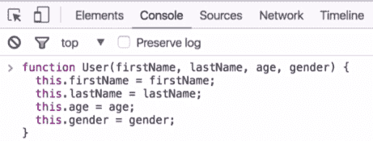

这就是我们在 JavaScript 中定义构造函数的方式。现在，通过阅读前面的代码块，您可能会想知道我们做了什么，以及`this`关键字是关于什么的。

我们将使用这个构造函数来创建许多用户对象。`this`关键字只是指我们将要创建的每个用户对象。现在，这一切似乎都有点势不可挡，但让我们来看几个例子，并试图获得更多的清晰性

让我们开始使用`User`构造函数。要创建一些`User`对象，也称为`User`实例，请执行以下步骤：

1.  我们要创建的第一个用户——我们称之为`user1`——定义如下：

```js
var user1 = new User('John','Smith',26,'male');
```

在前面的代码中，您可能已经注意到我们使用了`new`关键字来调用构造函数并生成一个用户对象，这就是我们让构造函数工作的方式。

2.  然后按*回车，*和`user1`在系统中。现在，如果我们在控制台中键入`user1`，我们将能够看到我们在上一步中刚刚创建的内容：

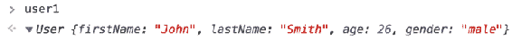

在前面的输出屏幕截图中，我们可以看到`user1`是`User`类的对象。我们还可以看到`user1`有`John`的`firstName`，有`Smith`的`lastName`，有`26`的`age`，还有`male`的`gender`，因为这些都是我们传递给构造函数的参数。

3.  为清晰起见，请尝试添加一个以上的用户。这一次，我们将创建另一个名为`user200`的用户，并将该用户的属性传入`new User ( )`函数，例如名为`Jill`、姓为`Robinson`、年龄为`25`、性别为`female`：

```js
var user200 = new User('Jill', 'Robinson', 25, 'female');
```

4.  按下*回车*键，我们新的`user200`将进入系统。现在，如果我们在控制台中键入`user200`并按下*回车*，我们将看到以下输出：

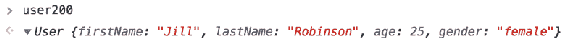

在前面的输出中，我们可以看到`user200`是`User`类的对象，就像`user1`一样，她的名字是`Jill`、姓氏是`Robinson`、年龄是`25`，性别是`female`，因为这些是我们传递给构造函数的参数。

现在，您可能想知道我们提到的所有属性是如何正确分配的。这都是因为我们前面提到的`this`关键字。当我们创建构造函数时，我们使用`this`关键字来分配属性。当涉及到构造函数时，`this`关键字并不指它所在的函数——在我们的例子中是`User`函数。相反，`this`指的是将由构造函数创建的对象。

这意味着如果我们使用构造函数来创建一个对象，我们必须确保属性及其对象是名字、姓氏、年龄和性别，或者在创建构造函数时，将`firstName`属性设置为等于传入的`firstName`参数，并对其余属性执行相同的操作。

这就是构造函数的工作原理，`this`关键字在构造函数中的重要作用。

# 原型对象的解释

在开始编写区块链数据结构之前，我们需要讨论的另一个重要概念是原型对象。**原型对象**是一个简单的对象，多个其他对象可以引用该对象，以获取它们所需的任何信息或功能。对于我们的示例（我们在上一节中讨论过），每个构造函数都有一个原型，它们的所有实例都可以引用。让我们通过几个示例来尝试理解原型对象的含义。

例如，如果我们使用上一节中创建的`User`构造函数，我们可以将这些属性放到它的原型上。然后，我们所有的用户实例，如`user1`和`user200`都可以访问并使用该原型。让我们在`User`原型上添加一个属性，看看会发生什么。要在用户原型上添加属性，我们将键入以下代码：

```js
User.prototype. 
```

然后，让我们将属性的名称添加到前面的代码中。例如，假设我们想要一个属性电子邮件域：

```js
User.prototype.emailDomain 
```

在我们的示例中，假设 Facebook 希望每个用户都有一个`@facebook.com`电子邮件地址，那么我们将设置电子邮件域属性，如下所示：

```js
User.prototype.emailDomain = '@facebook.com';
```

现在我们再来看看我们的`user1`对象：


在前面的屏幕截图中，我们可以看到`user1`没有我们刚刚添加到它的电子邮件域属性。但是，我们可以扩展`user1`对象及其 dunder 原型，如以下屏幕截图所示：

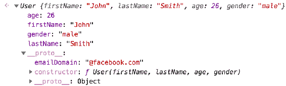

当我们这样做时，我们可以观察刚才添加的`emailDomain`属性，它被设置为`@facebook.com`。

只是想澄清一下，dunder proto 和我们实际放置`emailDomain`属性的 prototype 对象实际上并不完全相同，但非常相似。基本上，我们放置在构造函数 prototype 上的任何东西都可以访问我们使用构造函数创建的任何对象的 dunder proto。

因此，如果我们将`emailDomain`放在构造函数原型上，我们将在`user1`dunder proto、`user200`dunder proto 和我们创建的任何其他用户实例的 dunder proto 上访问它。

现在让我们回到`emailDomain`酒店。我们将`emailDomain`属性和用户原型放在一起。我们可以看到，我们没有实际的`user200`对象的属性，但在`user200`dunder proto 下有该属性。因此，如果我们键入以下命令，我们仍然可以访问该属性：

```js
user200.emailDomain
```

然后我们应该看到以下输出：

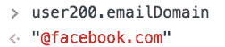

这就是原型对象的工作原理。如果我们在构造函数的原型上放置一个属性，那么构造函数的所有实例都可以访问该属性。

这同样适用于我们可能希望所有实例都具有的任何方法或函数。让我们来看另一个例子，假设我们希望所有的用户实例都有一个 TyrT0Ay 方法。我们可以将其放在构造函数的原型上，如下所示：

```js
User.prototype.getEmailAddress = function () { 
}    
```

现在让这个`getEmailAddress`方法返回一些特定属性，如下所示（突出显示）：

```js
User.prototype.getEmailAddress = function () { 
 return this.firstName + this.lastName + this.emailDomain;
} 
```

现在`user1`和`user200`都应该在他们的 dunder proto 下有这个方法，所以让我们来检查一下。输入我们的用户，在他们的 dunder proto 下，您将看到前面的功能，如以下屏幕截图所示：


在前面的屏幕截图中，我们可以看到`user1`和`user200`在其 dunder proto 下都有`getEmailAddress`方法

现在，如果我们键入`user200.getEmailAddress`并调用它，该方法将为我们创建 user200 的 Facebook 电子邮件地址，如下图所示：


如果我们调用`user1`的方法，也会发生类似的情况：

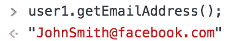

这就是我们如何使用原型对象和构造函数。如果我们希望我们的构造函数实例都具有与所有实例相同的属性，或者都具有与所有实例相同的方法，那么我们将把它放在原型上，而不是放在构造函数本身上。这将有助于保持实例更加精简和干净。

这是我们需要知道的所有背景信息，以便开始编码我们的区块链数据结构。在下一节中，我们将使用构造函数和原型对象开始构建区块链。

# 区块链构造函数

让我们开始构建区块链数据结构。我们将首先使用 Sublime 编辑器打开区块链目录中的所有文件。如果您喜欢使用任何其他编辑器，也可以使用它。在您喜欢的编辑器中打开我们的整个区块链目录。

我们将在[第 1 章](1.html)中创建的`dev/blockchain.js`文件中构建我们的整个区块链数据结构，*建立项目*。让我们使用上一节学习的构造函数来构建这个区块链数据结构。那么，让我们开始：

对于按类型划分的构造函数，请执行以下操作：

```js
function Blockchain () {
}
```

目前，`Blockchain ()`函数不接受任何参数。

接下来，在构造函数中，我们将添加以下术语：

```js
function Blockchain () {
    this.chain = [];
    this.newTransactions = [];
}
```

在前面的代码块中，`[]`定义了一个数组，`this.chain = [];`是我们区块链的肉将被存储的地方。我们挖掘的所有块都将作为一个链存储在这个特定数组中，而`this.newTransactions = [];`是我们将保存在块中之前创建的所有新事务的地方。

所有这些现在看起来可能有点混乱和难以承受，但不要担心。让我们在以后的章节中更深入地探讨这个问题。

在定义上述功能时，我们已经启动了创建区块链数据结构的过程。现在，你可能想知道为什么我们使用构造函数来构建区块链数据结构而不是类；答案是，这只是一种偏好。我们更喜欢在 JavaScript 中的类之上创建构造函数，因为在 JavaScript 中实际上没有类。JavaScript 中的类只是构造函数和对象原型之上的糖衣。所以，我们只是更喜欢使用构造函数。

但是，如果您想通过使用类创建区块链，您可以执行以下代码块中的操作：

```js
class Blockchain {
    constructor() {
        this.chain = [];
        this.newTransactions = [];
    }

    // Here you can build out all of the methods 
    // that we are going to write inside of this
    // Blockchain class. 

}
```

因此，无论哪种方式，如果您喜欢使用构造函数或类，它都可以正常工作。

就是这样——通过定义我们的功能，我们开始了构建区块链数据结构的过程。在接下来的章节中，我们将继续在此基础上进行构建。

# 构建 createNewBlock 方法

让我们继续构建我们的区块链数据结构。在上一节中定义了构造函数之后，我们想对构造函数做的下一件事是在`Blockchain`函数中放置一个方法。我们要创建的这个方法将被称为`createNewBlock`。顾名思义，这种方法将为我们创建一个新块。让我们按照下面提到的步骤来构建方法：

1.  `createNewBlock`方法定义如下：

```js
Blockchain.prototype.createNewBlock = function () { 

}
```

2.  现在我们在区块链`prototype`对象上有了这个`createNewBlock `方法。此方法将采用以下代码行中突出显示的三个参数：

```js
Blockchain.prototype.createNewBlock = function (nonce, previousBlockHash, hash) { 

}
```

我们将在后续章节中深入了解这三个参数，因此如果您不熟悉它们，请不要担心。

3.  现在，我们想在`createNewBlock`方法中做的下一件事是创建`newBlock`对象。让我们定义如下：

```js
Blockchain.prototype.createNewBlock = function (nonce, previousBlockHash, hash) { 
    const newBlock = { 

 }; 

}
```

这个`newBlock`对象将是`BlockChain`中的一个新块，因此所有数据都将存储在这个块中。这个`newBlock`对象是我们区块链中相当重要的一部分。

4.  接下来，在`newBlock`对象上，我们将有一个`index`属性。这个`index`值基本上就是区块编号，它将描述`newBlock`在我们链中的区块编号（例如，它可能是第一个区块）：

```js
Blockchain.prototype.createNewBlock = function (nonce, previousBlockHash, hash) { 
    const newBlock = { 
        index: this.chain.length + 1,     
    };   

}
```

5.  我们的下一个属性将是`timestamp`，因为我们想知道块是何时创建的：

```js
Blockchain.prototype.createNewBlock = function (nonce, previousBlockHash, hash) { 
    const newBlock = { 
        index: this.chain.length + 1,
        timestamp: Date.now(),       
    };   

}
```

6.  然后，我们将添加的下一个属性将用于`transactions`。当我们创建一个新区块时，我们希望将所有新交易或刚刚创建的未决交易放入新区块，以便它们位于我们的区块链内，并且永远不会被更改：

```js
Blockchain.prototype.createNewBlock = function (nonce, previousBlockHash, hash) { 
    const newBlock = { 
        index: this.chain.length + 1,
        timestamp: Date.now(),
        transactions: this.newTransactions,          
    };   

}
```

前面突出显示的代码行说明块中的所有事务都应该是等待放入块中的新事务。

7.  我们将在块上拥有的下一个属性是一个`nonce`，它将等于我们先前传递到函数中的`nonce`参数：

```js
Blockchain.prototype.createNewBlock = function (nonce, previousBlockHash, hash) { 
    const newBlock = { 
        index: this.chain.length + 1,
        timestamp: Date.now(),
        transactions: this.newTransactions, 
        nonce: nonce,         
    };   

}
```

现在，你可能想知道什么是`nonce`。基本上，临时工来自工作证明。在我们的例子中，这是简单的任何数字；哪一个都不重要。这个 nonce 几乎证明了我们通过使用`proofOfWork`方法以合法的方式创建了这个新块。

All of this might seem a little bit confusing right now, but don't worry — once we build more on our blockchain data structure, it will be much easier to understand how everything works together to create a functional blockchain. So, if you don't understand what a nonce is right now, don't worry about it. We're going to deal with this property in further sections, and it will become clearer as we move on.

8.  下一个属性将是一个`hash`：

```js
Blockchain.prototype.createNewBlock = function (nonce, previousBlockHash, hash) { 
    const newBlock = { 
        index: this.chain.length + 1,
        timestamp: Date.now(),
        transactions: this.newTransactions, 
        nonce: nonce,
        hash: hash,         
    };   

}
```

基本上，这个`hash`将是来自我们`newBlock`的数据。接下来我们将把我们的事务或`newTransactions`传递到一个散列函数中。这意味着我们所有的事务都将被压缩成一个代码字符串，这就是我们的`hash`。

9.  最后，我们在`newBlock`上的最后一处财产将是我们的`previousBlockHash`：

```js
Blockchain.prototype.createNewBlock = function (nonce, previousBlockHash, hash) { 
    const newBlock = { 
        index: this.chain.length + 1,
        timestamp: Date.now(),
        transactions: this.newTransactions, 
        nonce: nonce,
        hash: hash,
        previousBlockHash: previousBlockHash,          
    };   

}
```

这个`previousBlockHash`属性与我们的`hash`属性非常相似，除了我们的`hash`属性处理来自散列为字符串的当前块的数据，`previousBlockHash`属性处理来自散列为字符串的前一块或前一块到当前块的数据。

所以，`hash`和`previousBlockHash`都是散列。唯一的区别是，`hash`属性处理当前块的数据，`previousBlockHash`属性处理前一块的数据散列。这就是创建新块的方式，这就是我们区块链中每个块的外观。

10.  继续我们的`createNewBlock`方法，接下来我们要做的是将`this.newTransaction`设置为等于一个空数组，如下所示：

```js
Blockchain.prototype.createNewBlock = function (nonce, previousBlockHash, hash) { 
    const newBlock = { 
        index: this.chain.length + 1,
        timestamp: Date.now(),
        transactions: this.newTransactions, 
        nonce: nonce,
        hash: hash,
        previousBlockHash: previousBlockHash,          
    };

    this.newTransaction = [];  

}
```

我们这样做是因为，一旦我们创建了新的块，我们就会将所有新事务放入`newBlock`中。因此，我们希望清除整个新事务数组，以便可以重新开始下一个块。

11.  接下来，我们只想做的是将我们创建的新块推到我们的链中，然后我们将返回`newBlock`：

```js
Blockchain.prototype.createNewBlock = function (nonce, previousBlockHash, hash) { 
    const newBlock = { 
        index: this.chain.length + 1,
        timestamp: Date.now(),
        transactions: this.newTransaction, 
        nonce: nonce,
        hash: hash,
        previousBlockHash: previousBlockHash,          
    };

    this.newTransaction = [];
    this.chain.push(newBlock);    

    return newBlock; 
}
```

通过添加最后两行代码，我们的`createNewBlock`方法就准备好了。基本上，这种方法在高层次上的作用是创建一个新块。在这个区块内，我们有我们的交易和自上次区块开采以来创建的新交易。在我们创建了一个新块之后，让我们清除新的事务，将新块推到我们的链中，然后简单地返回新块。

# 测试 createNewBlock 方法

现在让我们来测试我们在上一节中创建的`createNewBlock`方法：

1.  我们需要做的第一件事是导出我们的`Blockchain`构造函数，因为我们将在`test.js`文件中使用这个函数。因此，要导出构造函数，我们将转到`blockchain.js`文件的底部，键入以下代码行，然后保存该文件：

```js
module.exports = Blockchain;
```

2.  接下来，转到`dev/test.js`文件，因为我们将在这里测试`createNewBlock`方法。现在，我们想在我们的`dev/test.js`文件中做的第一件事是导入我们的`Blockchain`构造函数，所以键入以下内容：

```js
const Blockchain = require('./blockchain');
```

前一行代码只需要或调用`blockchain.js`文件。

# 测试区块链构造函数功能

让我们测试区块链构造器功能，如下所示：

1.  让我们创建一个`Blockchain`构造函数的实例，因此我们将添加以下代码行：

```js
const bitcoin = new Blockchain();
```

2.  代码前一行中的`bitcoin`变量仅用于示例目的。然后我们添加以下代码行：

```js
console.log(bitcoin); 
```

在前面的代码行中，`bitcoin`应该是我们的区块链。当前此中没有数据或块，但应作为区块链注销。让我们保存`test.js`文件并运行测试，以观察终端窗口上的输出。

3.  现在去我们的终端窗口。在这里，我们当前在`blockchain`目录中，我们的`test.js`文件在`dev`文件夹中，所以在终端中键入以下命令：

```js
node dev/test.js
```

前一行代码将允许我们运行我们为测试`Blockchain`构造函数而编写的测试。

4.  现在按下*键进入*，我们将观察终端窗口上的`Blockchain`，如下图所示：


从前面屏幕截图中的输出可以看出，`Blockchain`有一个空链和一个空事务数组。这正是我们所期望的结果

# 测试 createNewBlock 方法

让我们按照下面提到的步骤测试 createNewBlock 方法：

1.  首先，在我们创建`bitcoin`变量的下面，键入以下突出显示的代码行：

```js
const Blockchain = require('./blockchain');

const bitcoin = new Blockchain();

bitcoin.createNewBlock();

console.log(bitcoin); 
```

2.  此`createNewBlock()`方法需要三个参数，如`nonce`、`previousBlockHash`和`hash`。出于测试目的，我们现在可以传递任何我们想要的。这里，nonce 将只是一个数字。然后我们将为我们的`previousBlockHash`创建一个伪哈希，然后为我们的`hash`参数创建另一个哈希，如下所示：

```js
bitcoin.createNewBlock(2389,'OIUOEREDHKHKD','78s97d4x6dsf');
```

现在，我们正在创建我们的`bitcoin`区块链，然后在我们的比特币区块链中创建一个新区块。当我们退出比特币区块链时，我们应该有一个区块。

3.  保存此文件并在终端中再次运行我们的`test.js`文件。然后您将观察以下输出：

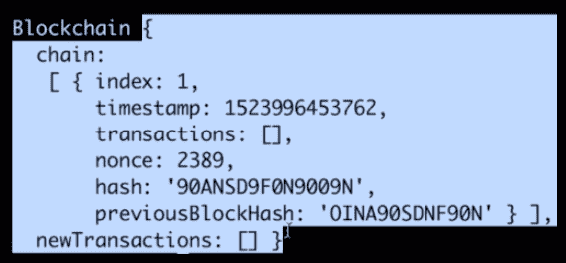

在前面的屏幕截图中，您可以观察到`chain`阵列中的整个区块链数据结构。其中有一个块或一个对象。此块还具有我们已传递的`hash`、`nonce`和`previousBlockHash`参数。它还有`timestamp`和`1`的`index`，它没有交易，因为我们还没有创建任何交易。因此，我们可以得出结论，`createNewBlock`方法工作得很好

4.  现在让我们通过在链中创建更多的块来进一步测试我们的方法。让我们将以下代码行复制多次，然后尝试根据需要更改其中的值：

```js
bitcoin.createNewBlock(2389,'OIUOEREDHKHKD','78s97d4x6dsf');
```

5.  复制代码并更改值后，保存文件。现在，当我们运行`test.js`文件时，我们的链中应该有三个块，如下面的屏幕截图所示：


在前面的屏幕截图中，您可能已经观察到了`chain`阵列内部的三个块。这些都是我们用`createNewBlock`方法创建的块

# 构建 getLastBlock 方法

现在，我们要添加到`Blockchain`构造函数的下一个方法是`getLastBlock`。此方法将简单地将区块链中的最后一个区块返回给我们。按照以下提到的步骤构建方法：

1.  转到我们的`dev/blockchain.js`文件，在我们的`createNewBlock`方法之后，添加以下内容：

```js
Blockchain.prototype.getLastBlock = function () { 

}
```

2.  在这个`getLastBlock`方法中，我们将键入以下突出显示的代码行：

```js
Blockchain.prototype.getLastBlock = function () { 
    return this.chain[this.chain.length - 1];

}
```

前面代码中的`[this.chain.length - 1];`定义了块在链中的位置，在我们的例子中，它是前一个块，因此被`1`否定。这种方法简单明了，我们将在后面的章节中使用它

# 创建 createNewTransaction 方法

我们将要添加到区块链构造函数中的下一个方法称为`createNewTransaction`。此方法将为我们创建一个新事务。让我们按照下面提到的步骤创建方法：

1.  通过在`getLastBlock`方法之后添加以下代码行开始构建此方法：

```js
Blockchain.prototype.createNewTransaction = function () {

}
```

2.  `function ()`将采用以下三个参数：

```js
Blockchain.prototype.createNewTransaction = function (amount, sender, recipient) {

}
```

这三个参数的作用如下：

*   `amount`：此参数将接受交易金额或此交易中发送的金额。
*   `sender`：这将接收发件人的地址。
*   `recipient`：这将接收收件人的地址。

3.  在`createNewTransaction`方法中，我们要做的下一件事是创建一个事务对象。因此，在我们的方法中添加以下代码行：

```js
const newTransaction = {

}
```

4.  此对象将具有三个属性。它将有一个`amount`、一个`sender`和一个`recipient`。这三个参数与我们传递给`function()`的参数相同。因此，请键入以下内容：

```js
Blockchain.prototype.createNewTransaction = function (amount, sender, recipient) {
    const newTransaction = {
        amount: amount,
 sender: sender,
 recipient: recipient,
    };

}
```

这就是我们的事务对象的外观。我们在`Blockchain`上记录的所有交易都将是这样的。它们都有一个金额、一个发送者和一个接收者，这非常简单明了。

5.  我们现在要做的下一件事是将这个`newTransaction`数据推送到我们的`newTransactions`数组中。让我们在`newTransaction`对象后添加以下代码：

```js
this.newTransactions.push(newTransaction);
```

因此，我们刚刚创建的新事务现在将被推送到我们的`newTransactions`数组中。

现在，让我们试着理解这个`newTransactions`数组实际上是什么。基本上，这个`newTransactions`阵列所发生的事情是，在我们的区块链上，将有许多人进行许多不同的交易。他们将把钱从一个人寄到另一个人，这种情况将反复发生。每次创建一个新事务时，它都会被推送到我们的`newTransactions`数组中。

然而，这个数组中的所有事务并不是一成不变的。它们还没有真正记录在我们的区块链中。当一个新区块被开采时，也就是当一个新区块被创建时，它们将被记录在我们的区块链中。所有这些新事务几乎都是挂起的事务，它们还没有被验证。当我们借助`createNewBlock`方法创建一个新区块时，它们被验证、固定并记录在我们的区块链中

在我们的`createNewBlock`方法中，您可以在`transactions: this.newTransactions`中观察到，我们将新区块上的交易设置为等于我们区块链中的`newTransactions`或未决交易。您可以将我们区块链上的`newTransactions`属性视为未决交易属性。

为了便于参考，让我们将代码中的所有`newTransactions`属性更改为`pendingTransactions`属性。总的来说，当创建一个新事务时，它会被推送到我们的`pendingTransactions`数组中。然后，当挖掘一个新区块或创建一个新区块时，我们所有的未决交易都会记录在我们的区块链上，然后这些交易就会一成不变，永远无法更改。

所有这些的要点是，在我们的方法结束之前，我们希望返回我们能够在哪个块中找到新事务，因为我们的新事务在挖掘时将在下一个块中。因此，我们只需键入以下代码：

```js
this.newTransactions.push(newTransaction);
return.this.getlastBlock()['index'] + 1;
```

在前面的代码中，`this.getlastBlock()`为我们返回一个块对象。我们想要得到这个区块的索引属性–添加`['index']`将为我们提供链中最后一个区块的索引，添加`+ 1`将为我们提供我们的交易推送到的区块的编号

让我们快速回顾一下，`createNewTransaction`方法只是创建一个`newTransaction`对象，然后我们将该`newTransaction`推送到`pendingTransactions`数组中。最后，我们返回`newTransaction`将添加到的块的编号。

# 测试 createNewTransaction 方法

让我们测试我们在上一节中创建的`createNewTransaction`方法。作为提示：本节将非常有趣，因为在这里您将真正开始了解区块链的功能以及区块和交易如何相互作用。您还将了解如何在区块链中记录交易。让我们开始吧：

1.  我们将在`test.js`文件中测试`createNewTransaction`方法。在这个文件中，我们已经需要了我们的`blockchain.js`文件，并创建了一个名为`bitcoin`的`Blockchain`新实例，我们将在文件末尾注销该实例。请查看以下屏幕截图以快速查看：


2.  现在，我们在`test.js`文件中要做的第一件事是使用`createNewBlock`方法创建一个新块，类似于我们在*测试 createNewBlock 方法*部分中所做的。在您的`test.js`文件中键入以下内容：

```js
bitcoin.createNewBlock(789457,'OIUOEDJETH8754DHKD','78SHNEG45DER56');
```

3.  接下来，我们要做的是创建一些新事务来测试我们的`createNewTransaction`方法。此`createNewTransaction`方法采用三个参数，如`amount`、a`sender`和`recipient`。让我们将此事务数据添加到测试用例中：

```js
bitcoin.createNewTransaction(100,'ALEXHT845SJ5TKCJ2','JENN5BG5DF6HT8NG9');
```

在前一行代码中，我们将交易金额设置为`100 `，将发送方和接收方的地址设置为一些随机散列数。

You might have noticed the names `ALEX` and `JEN` in the addresses. We've added those just to simplify the identification of who the sender and recipient is. In reality, you would more than likely not have this kind of name appear at the beginning of an address. We've done this to make it easier for us to reference these addresses.

现在，让我们快速总结一下到目前为止我们在测试用例中所做的工作。请查看以下代码块：

```js
const Blockchain = require('./blockchain');

const bitcoin = new Blockchain();

bitcoin.createNewBlock(789457,'OIUOEDJETH8754DHKD','78SHNEG45DER56');

bitcoin.createNewTransaction(100,'ALEXHT845SJ5TKCJ2','JENN5BG5DF6HT8NG9');

console.log(bitcoin); 
```

在前面的代码中，我们首先需要比特币区块链，然后创建一个新区块。之后，我们创建了一个新交易，然后注销了比特币区块链。

当我们运行这个`test.js`文件时，我们应该看到我们的比特币区块链，它应该在链中有一个区块，在`pendingTransactions`数组中有一个交易，因为我们在创建交易后没有挖掘或创建新区块。让我们保存这个文件并运行它，看看我们得到了什么

4.  现在进入终端窗口，输入以下命令，然后按*输入*：

```js
node dev/test.js 
```

我们可以在终端窗口上观察比特币区块链，如以下屏幕截图所示：


在您窗口上的输出和前面的屏幕截图中，您可以观察我们的链，它包含我们创建的一个块。在我们的`pendingTransactions`数组中，我们有一个挂起的事务，这是我们在测试用例中创建的事务。从测试结果来看，我们可以得出结论，到目前为止，我们的`createNewTransaction`方法运行良好

# 将未决交易添加到我们的区块链

现在，让我们试着理解如何将`pendingTransaction`转化为我们实际的`chain`，方法是挖掘一个新区块或创建一个新区块。让我们现在就这样做：

1.  在我们创建了`newTransaction`之后，让我们使用`createNewBlock`方法创建一个新的块，如下代码所示：

```js
const Blockchain = require('./blockchain');

const bitcoin = new Blockchain();

bitcoin.createNewBlock(789457,'OIUOEDJETH8754DHKD','78SHNEG45DER56');

bitcoin.createNewTransaction(100,'ALEXHT845SJ5TKCJ2','JENN5BG5DF6HT8NG9');

bitcoin.createNewBlock(548764,'AKMC875E6S1RS9','WPLS214R7T6SJ3G2');

console.log(bitcoin);
```

我们所做的是创建一个块，创建一个事务，然后挖掘一个新块。现在，我们创建的事务应该显示在第二个块中，因为我们在创建事务之后挖掘了一个块。

2.  现在保存文件并再次运行测试。让我们看看我们从中得到了什么。进入您的终端，再次输入`node dev/test.js`命令并按*回车*。您将看到以下屏幕截图中显示的输出：

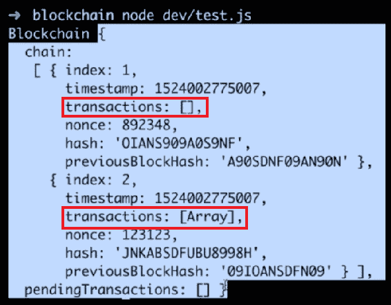

这里，我们又有了整个区块链，其中有两个区块，因为我们开采了两个区块。链有我们的第一个块（索引：1），它没有事务，还有我们的第二个块（索引：2），在其中，如果你看我们的事务，它说有一个数组中有项目，而第一个块的事务数组中没有项目。

3.  现在仔细看看第二个块的事务数组。我们应该期望看到我们之前创建的事务。让我们对测试用例进行以下突出的修改：

```js
const Blockchain = require('./blockchain');

const bitcoin = new Blockchain();

bitcoin.createNewBlock(789457,'OIUOEDJETH8754DHKD','78SHNEG45DER56');

bitcoin.createNewTransaction(100,'ALEXHT845SJ5TKCJ2','JENN5BG5DF6HT8NG9');

bitcoin.createNewBlock(548764,'AKMC875E6S1RS9','WPLS214R7T6SJ3G2');

console.log(bitcoin.chain[1]);
```

4.  在这次修改中，我们只是从我们链中的第二个块中注销。代码中的`[1]`定义了第二个块的位置。保存此文件并运行它。我们可以简单地观察一个数组的输入和输出，对于第二个数组中的一个，我们可以观察到它的输入和输出。查看以下屏幕截图：

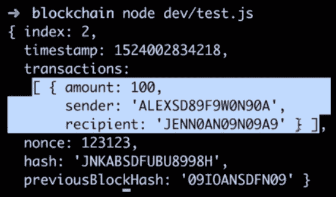

这个对象是我们在测试中创建的事务。我们在这里所做的只是创建一个事务，然后通过创建一个新块或挖掘一个新块来挖掘它，现在这个块中有我们的事务

现在，让我们再举几个例子来说明这里发生了什么。让我们以`createNewTransaction`方法为例，在`createNewBlock`方法之后再重复三次。根据您的意愿对金额进行修改。

这里发生的事情是，从顶部开始，我们首先创建一个块，然后创建一个事务。然后我们创建或挖掘一个新的块，所以我们应该有一个没有事务的块和另一个有一个事务的块。在创建第二个块之后，我们又创建了三个新事务。此时，所有这三个新事务都应该在我们的`pendingTransactions`数组中，因为我们在创建这三个事务之后并没有创建新的块。最后，我们再次退出比特币区块链。您的测试现在应该类似于以下内容：

```js
const Blockchain = require('./blockchain');

const bitcoin = new Blockchain();

bitcoin.createNewBlock(789457,'OIUOEDJETH8754DHKD','78SHNEG45DER56');

bitcoin.createNewTransaction(100,'ALEXHT845SJ5TKCJ2','JENN5BG5DF6HT8NG9');

bitcoin.createNewBlock(548764,'AKMC875E6S1RS9','WPLS214R7T6SJ3G2');

bitcoin.createNewTransaction(50,'ALEXHT845SJ5TKCJ2','JENN5BG5DF6HT8NG9');
bitcoin.createNewTransaction(200,'ALEXHT845SJ5TKCJ2','JENN5BG5DF6HT8NG9');
bitcoin.createNewTransaction(300,'ALEXHT845SJ5TKCJ2','JENN5BG5DF6HT8NG9');

console.log(bitcoin);
```

现在，如果我们保存文件并运行它，我们的链中应该有两个块，并且在`pendingTransactions`数组中也应该有三个事务。让我们看看我们得到了什么。您将在屏幕上观察以下输出：

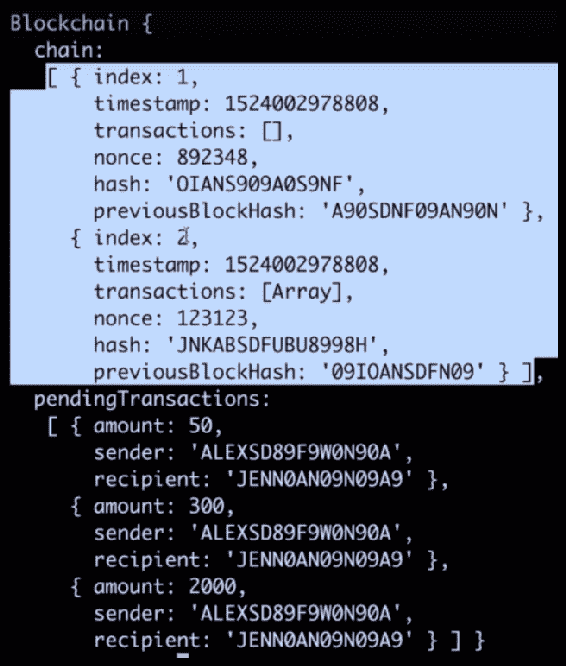

在前面的屏幕截图中，您可以看到我们有我们的区块链。在这个链中，我们有两个块，就像我们预期的那样，在我们的`pendingTransactions`数组中，我们有三个事务，这三个事务是我们在测试文件中创建的

我们下一步要做的是将这些未决交易纳入我们的交易链。为此，我们再挖一个街区。只需在我们创建的三个事务之后复制并粘贴`creatNewBlock`方法，并根据需要修改其参数。当我们现在运行测试时，挂起的三个事务应该出现在我们的新块中。让我们保存文件并运行测试。您将观察以下输出：


所以，我们有我们的区块链，其中有三个区块。我们的`pendingTransactions`阵列目前是空的，但这三个交易去了哪里？事实证明，它们应该位于我们创建的最后一个块中，即索引：3 块。在第三个块中，我们有我们的事务，这应该是我们刚刚创建的三个事务。让我们通过对测试代码的最后一行做一个微小的修改，这是一个很小的修改。此处的值`2`指定链中的第三个块。让我们保存此修改并再次运行测试。您将看到链中的第三个块：


在事务的数组中，您可以看到我们已经创建了所有三个事务。这就是我们的`createNewTransaction`和`createNewBlock`方法相互作用的方式。

If you are having trouble understanding how both of these methods work or how they work together, we encourage you to mess around with your `test.js` file and create some new blocks, create some new transactions, log some different information out, and get a good idea of how these things work.

# 散列数据

我们将要研究并添加到区块链数据结构中的下一种方法称为`hashBlock`。这个`hashBlock`方法将从我们的区块链中获取一个块，并将其数据散列成一个固定长度的字符串。此哈希数据将随机出现。

本质上，我们要做的是将一些数据块传递到这个散列方法中，作为回报，我们将得到一个固定长度的字符串，它将只是一个散列数据，它是从我们传入的数据或从我们传入的块生成的

要将`hashBlock`方法添加到我们的区块链数据结构中，请在`createNewTransaction`方法之后键入以下代码行：

```js
Blockchain.prototype.hashBlock = function(blockdata) {

}
```

在我们的`hashBlock`方法中，`blockdata`将是我们要从中生成哈希的块的输入数据

那么，我们如何获取一个或多个数据块并得到一个哈希字符串作为回报呢？为了生成哈希数据，我们将使用一个名为**SHA256**的哈希函数

# 理解 SHA256 哈希函数

**SHA256**散列函数接受任何文本字符串，对该文本进行散列，并返回固定长度的散列字符串。

要更好地了解散列数据的外观，请访问[https://passwordsgenerator.net/sha256-hash-generator/](https://passwordsgenerator.net/sha256-hash-generator/) 。这是一个散列生成器。如果您在文本框中输入任何文本，您将获得散列数据作为输出。

例如，如果我们将`CodingJavaScript`放入文本框中，返回给我们的哈希将与以下屏幕截图中突出显示的哈希相似：


我们可以在前面的屏幕截图中看到的输出散列似乎是任意的，因此有助于保持数据的安全。这就是为什么 SHA256 哈希如此安全的原因之一

现在，如果我们在输入字符串中添加另一个字符，或者以任何方式更改输入字符串，则整个输出哈希将完全更改。例如，如果在输入字符串的末尾添加感叹号，则输出哈希将完全改变。您可以在以下屏幕截图中看到：


您可以尝试在输入字符串的末尾添加新字符。您会注意到，当我们添加或删除更多字符时，每次整个输出哈希都会发生剧烈变化，从而生成新的随机模式

与 SHA256 哈希相关的另一件事是，对于任何给定的输入，输出都将始终相同。例如，对于我们的输入字符串`codingJavaScript!`，您将始终获得与上一个屏幕截图中显示的相同的哈希输出。这是 SHA256 哈希的另一个非常重要的特性。对于任何给定的输入，从该输入返回的输出或散列将始终相同。

这就是 SHA256 哈希的工作原理。在下一节中，我们将在`hashBlock`方法中实现 SHA256 哈希函数。

# hashBlock 方法

让我们建立我们的`hashBlock`方法。在这个方法中，我们希望使用 SHA256 散列来散列块数据。遵循以下提到的步骤：

1.  要使用 SHA256 哈希函数，请将其作为 npm 库导入。要做到这一点，请转到谷歌并在搜索栏中键入 SHA256，或访问[https://www.npmjs.com/package/sha256](https://www.npmjs.com/package/sha256) 。在这个网站上，您将看到我们需要在终端中键入的命令来安装 SHA256。我们必须在终端中键入以下命令：

```js
npm i sha 256--save
```

2.  完成此操作后，按*进入*。下面命令中的`--save`将此库保存为我们的依赖项。现在，在我们的区块链文件结构中，您可能会看到`node_modules`文件夹已经出现。该文件夹中是我们的 SHA256 库和所有其他依赖项的下载位置。
3.  要使用这个 SHA256 库，我们必须将库导入到代码中，以便使用它。在代码的开头，键入以下行：

```js
const sha256 = require('sha256');  
```

前一行代码指定我们有一个 SHA256 散列函数，它作为变量 SHA256 存储在`blockchain.js`文件中。通过导入它，我们可以在`hashBlock`方法中使用它。

4.  现在，我们想在`hashBlock`方法中做的第一件事就是改变它所需要的参数。我们将用`previousBlockHash`、`currentBlockData`和`nonce`替换`blockData`参数：

```js
Blockchain.prototype.hashBlock = function(previousBlockHash, currentBlockData, nonce) {

}
```

这三个参数将是我们将在`hashBlock`方法中散列的数据。所有这些数据都来自链中的一个块，我们将对这些数据进行散列，这实际上是对一个块进行散列。然后我们将得到一个哈希字符串作为回报。

5.  我们要做的第一件事是将所有这些数据片段更改为单个字符串，因此在我们的`hashBlock`方法中添加以下代码行：

```js
const dataAsString = previousBlockHash + nonce.tostring()+ JSON.stringify( currentBlockData);
```

在前面的代码中，`previousBlockHash`已经是一个字符串。我们的 nonce 是一个数字，所以我们要把它改成一个带`toString`的字符串。此外，我们的`currentBlockData`将是一个对象、一个事务数组或某种 JSON 数据。它将是一个数组或一个对象，`JSON.stringify`将简单地将该数据（以及任何对象或数组）转换为字符串。一旦这整行运行完毕，我们只需将传递的所有数据连接成一个字符串。

6.  现在，我们要做的下一件事是创建哈希，如下所示：

```js
const hash = sha256(dataAsString);
```

这就是我们如何从块或传递到函数中的所有块数据创建哈希的方法。

7.  我们要做的最后一件事就是简单地返回散列，因此在完成此方法之前，请添加以下内容：

```js
return hash;
```

这就是我们的`hashBlock`方法的工作原理。在下一节中，我们将测试这个方法，看看它是否能完美工作

# 测试 hashBlock 方法

让我们在`test.js`文件中测试我们的`hashBlock`方法。与我们在前面章节中所做的类似，在我们的`test.js`文件中，我们应该导入我们的区块链数据结构，创建一个新的区块链实例，并将其命名为`bitcoin`。现在，让我们测试一下我们的`hashBlock`方法：

1.  为此，在`test.js`文件中键入以下突出显示的代码行：

```js
const Blockchain = require ('./blockchain'); 
const bitcoin = new Blockchain (); 

bitcoin.hashBlock();
```

2.  我们的`hashBlock`方法需要三个参数：a`previousBlockHash`、`currentBlockData`和`nonce`。让我们在调用`hashBlock`方法的部分上面定义这些变量。我们将首先定义`previousBlockHash`：

```js
const previousBlockHash = '87765DA6CCF0668238C1D27C35692E11';
```

现在，这个随机字符串/散列数据将作为我们的`previousBlockHash`的输入。

3.  接下来，我们创建`currentBlockData`变量。此`currentBlockData`将只是此块中存在的所有事务的数组。我们将简单地使用这个块中的事务作为我们的`currentBlockData`，因此在这个数组中，我们必须创建几个事务对象，如下所示：

```js
const currentBlockData = [
    {
        amount: 10,
        sender: 'B4CEE9C0E5CD571',
        recipient: '3A3F6E462D48E9',  
    }  
]
```

4.  接下来，至少复制此事务对象三次，以便在数组中创建更多的事务对象，然后根据需要修改数据，以更改金额以及发送方和接收方的地址。这将使我们的`currentBlockData`成为一个包含三个事务的数组。

5.  最后，我们必须在`hashBlock`方法中指定`nonce`值：

```js
const nonce = 100;
```

6.  定义这些变量后，调用`hashBlock`方法，传递`previousBlockHash`和`currentBlockData`参数，以及`nonce`：

```js
bitcoin.hashBlock(previousBlockHash, currentBlockData, nonce );
```

7.  此外，让我们尝试将结果推送到终端窗口，以便我们可以观察它。要做到这一点，我们必须对前面的代码进行微小的修改：

```js
console.log(bitcoin.hashBlock(previousBlockHash, currentBlockData, nonce));
```

在这个测试用例中，我们使用所有正确的参数调用`hashBlock`方法。当我们运行这个文件时，我们应该观察终端窗口上的散列。

8.  现在保存这个`test.js`文件并运行它来检查我们是否得到了预期的输出
9.  转到终端窗口，输入`node dev/test.js`命令，让我们观察得到的结果。您将看到与我们的`hashBlock`方法的输出类似的结果散列，如下所示：

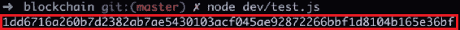

看来我们的`hashBlock`方法运行得很好。

10.  试着多探索一下这个`hashBlock`方法。如前一节所述，如果我们更改传递到`hashBlock`方法中的一些数据，将导致完全更改作为输出返回的哈希。
11.  现在，通过更改发件人或收件人地址中的一封信来测试散列数据的这一特性。然后保存文件并再次使用`node dev/test.js`运行。您将看到一个完全不同的散列数据作为输出，如下所示：

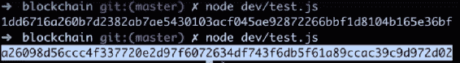

在前面的屏幕截图中，您可以观察散列数据以及它们之间的差异

现在，如果我们恢复对发件人或收件人地址所做的更改，并再次运行哈希方法，我们将观察到与最初得到的相同的哈希。这是因为我们传递的数据与第一次相同。您可以尝试使用数据进行实验，并尝试观察输出，以进一步探索`hashBlock`方法

通过这次测试，我们可以得出结论，我们的`hashBlock`方法非常有效

# 什么是工作证明？

我们将要添加到区块链数据结构中的下一种方法是`proofOfWork`方法。这种方法对区块链技术非常重要和必要。正是因为这种方法，比特币和许多其他区块链才如此安全。

现在，你一定很好奇**工作证明**（**PoW**）实际上是什么。好吧，如果我们看看我们的区块链，每个区块链几乎都是一个区块列表。必须创建每个块并将其添加到链中。但是，我们并不只是希望创建任何块并将其添加到链中。我们希望确保添加到链中的每个块都是合法的，具有正确的事务，并且其中包含正确的数据。这是因为如果它没有正确的交易或正确的数据，那么人们可能会伪造他们拥有的比特币数量，并从本质上造成欺诈和窃取他人的资金。因此，每次创建一个新的区块，我们首先必须通过 PoW 挖掘来确保它是合法的区块。

`proofOfWork`方法将接受`currentBlockData`和`previousBlockHash`。根据我们提供的数据，`proofOfWork`方法将尝试生成特定的散列。在我们的示例中，这个特定的散列将是一个以四个零开始的散列。因此，对于给定的`currentBlockData`和`previousBlockHash`，该方法将以某种方式生成一个以四个零开始的结果哈希。

现在，让我们试着了解如何做到这一点。正如我们在前面几节中了解到的，从 SHA256 生成的哈希几乎是随机的。那么，如果得到的散列几乎是随机的，那么我们如何从当前块生成一个以四个零开始的散列呢？唯一可以做到这一点的方法是通过反复试验，或者通过猜测和检查。因此，我们需要做的是多次运行`hashBlock`方法，直到我们通过生成一个在开始时有四个零的散列来获得一次幸运。

现在，您可能想知道我们的`hashBlock`方法的输入是`previousBlockHash`、`currentBlockData`和`nonce`参数。当我们实际上总是传递完全相同的数据时，这三个参数如何被传递一次并可能生成多个不同的散列？此外，正如我们从上一节所知道的，每当我们传入一段特定的数据时，我们总是会得到从该数据生成的相同结果哈希。

那么，我们如何能够以一种不改变`currentBlockData`或`previousBlockHash`的方式改变这个数据，但我们仍然得到一个结果哈希，它的开头有四个零？这个问题的答案是我们将不断地改变 nonce 值。

这可能现在看起来有点混乱，所以让我们试着通过对`proofOfWork`中实际发生的情况进行一点分解来澄清它。

本质上，在我们的`proofOfWork`中发生的是，我们将重复散列我们的块，直到找到正确的散列，这将是任何以四个零开始的散列。我们将通过不断增加 nonce 值来更改`hashBlock`方法的输入。第一次运行`hashBlock`方法时，我们将从 nonce 值 0 开始。然后，如果生成的哈希在开始处没有四个零，我们将再次运行`hashBlock`方法，除了这次，我们将把我们的 nonce 值增加 1。如果我们没有再次获得正确的散列值，我们将增加 nonce 值并重试。如果这不起作用，我们将再次增加 nonce 值并重试。然后我们将继续运行这个`hashBlock`方法，直到找到一个以四个零开始的散列。这就是我们的`proofOfWork`方法的功能。

你可能想知道这种`proofOfWork`方法实际上是如何保护区块链的。这是因为为了生成正确的散列，我们必须多次运行`hashBlock`方法，这将消耗大量的能量和计算能力。

因此，如果有人想回到区块链，试图改变区块或区块中的数据——也许是为了给自己更多比特币——他们将不得不进行大量计算，并花费大量精力来创建正确的散列。在大多数情况下，返回并尝试重新创建一个已经存在的块，或者尝试使用您自己的伪数据重新挖掘一个已经存在的块是不可行的。除此之外，我们的`hashBlock`方法不仅接受了`currentBlockData`，还接受了之前的`BlockHash`，这意味着区块链中的所有区块都通过其数据链接在一起。

如果有人试图返回并重新挖掘或重新创建一个已经存在的块，他们还必须重新挖掘并重新创建第一个块之后的每个块。这需要惊人的计算量和能量，对于一个发达的区块链来说是不可行的。一个人必须进去，用工作证明重新创建一个区块，然后再为每个区块做一个新的工作证明来重新创建每个区块。这对于任何生产良好的区块链来说都是不可行的，这也是区块链技术如此安全的原因。

总结这一部分，我们的`proofOfWork`方法基本上要做的是重复散列我们的`previousBlockHash`、我们的`currentBlockData`和一个 nonce，直到我们得到一个可接受的生成的散列，该散列以四个零开始。

这可能看起来很难理解，现在有点混乱，但不要担心——我们将在下一节中构建`proofOfWork`方法，然后我们将使用许多不同类型的数据对其进行测试。这将帮助您更加熟悉`proofOfWork`方法的功能以及如何保护区块链。

# 创建工作证明方法

让我们构建`proofOfWork`方法，我们在上一节中讨论过：

1.  在`hashBlock`方法之后，定义`proofOfWork`方法如下：

```js
Blockchain.prototype.proofOfWork = function() {

}
```

2.  该方法采用两个参数：`previousBlockHash`和`currentBlockData`：

```js
Blockchain.prototype.proofOfWork = function( previousBlockHash, currentBlockData) { 

}
```

3.  我们想在方法内部做的第一件事是定义一个 nonce：

```js
Blockchain.prototype.proofOfWork = function( previousBlockHash, currentBlockData) { 
    let nonce = 0;

}
```

4.  接下来，我们想第一次散列所有数据，因此键入以下突出显示的代码行：

```js
Blockchain.prototype.proofOfWork = function( previousBlockHash, currentBlockData) { 
    let nonce = 0;
    let hash = this.hashBlock(previousBlockHash, currentBlockData,
     nonce); 
}
```

在前面的代码中，您可能会注意到我们使用了术语`let`，因为我们的 nonce 和 hash 都会随着方法的移动而改变。

5.  我们要做的下一步是不断地反复运行`hashBlock`方法，直到得到一个以四个零开始的散列。我们将借助一个`while`循环来完成这个重复操作：

```js
Blockchain.prototype.proofOfWork = function( previousBlockHash, currentBlockData) { 
    let nonce = 0;
    let hash = this.hashBlock(previousBlockHash, currentBlockData,
     nonce); 
    while (hash.substring(0, 4) !== '0000' {

 }  
}
```

6.  如果我们创建的散列不是以四个零开始的，我们将希望再次运行散列，但这次使用不同的 nonce 值。因此，在`while`循环中，添加以下突出显示的代码行：

```js
Blockchain.prototype.proofOfWork = function( previousBlockHash, currentBlockData) { 
    let nonce = 0;
    let hash = this.hashBlock(previousBlockHash, currentBlockData,
    nonce); 
    while (hash.substring(0, 4) !== '0000' {
        nonce++;
 hash = this.hashBlock(previousBlockHash, currentBlockData,
        nonce);
    }  
}
```

在`while`循环中，我们使用所有相同的数据再次运行`hashBlock`方法，但这次我们的 nonce 是递增的，等于 1 而不是 0。这将是 while 循环的第一次迭代。现在，在第一次迭代之后，生成的新哈希的前四个字符不等于 0000。在这种情况下，我们需要生成一个新的哈希。因此，我们的 while 循环将再次运行，nonce 值将增加到 2，并将创建一个新的哈希。如果该散列也不是以四个零开始，那么`while`循环将再次运行，nonce 值将再次递增，散列将再次生成。

我们的循环将继续这样做，直到它以四个零开始的散列结束。这可能需要多次迭代。这种情况可能发生 10 次、10000 次或 100000 次。

所有的计算都将在这个循环中进行，这就是`proofOfWork`方法使用如此多能量的原因——有很多计算正在进行。我们将继续进行`while`循环，直到生成一个以四个零开始的合适哈希。当我们最终得到正确的散列时，`while`循环将停止运行，在我们的验证工作结束时，它将简单地返回给我们有效散列的 nonce 值：

```js
Blockchain.prototype.proofOfWork = function( previousBlockHash, currentBlockData) { 
    let nonce = 0;
    let hash = this.hashBlock(previousBlockHash, currentBlockData, nonce); 
    while (hash.substring(0, 4) !== '0000' {
        nonce++;
        hash = this.hashBlock(previousBlockHash, currentBlockData, nonce);
    }  
    return nonce;
}
```

因此，这就是我们的`proofOfWork`方法如何工作和验证散列

在下一节中，我们将测试我们的`proofOfWork`方法，以确保它正常工作。我们还将研究为什么返回一个 nonce 值而不是返回散列。

# 验证工作方法

让我们测试一下我们的`proofOfWork`方法，以确保它正常工作。我们将在`test.js`文件中测试该方法。那么，让我们开始：

1.  打开`test.js`文件。您可能会以类似于以下截图的方式观察数据，该截图显示在上一节的文件*测试 hashBlock 方法*中：

**

2.  如果您在`test.js`文件中没有任何数据，请将其添加到您的`test.js`文件中，如前一屏幕截图所示，然后您可以开始测试数据
3.  为了测试我们的`proofOfWork`方法，我们需要`previousBlockHash`和`currentBlockData`。因此，在我们的测试用例中，去掉 nonce 值并向文件中添加以下代码行：

```js
console.log(bitcoin.proofOfWork(previousBlockHash, currentBlockData));
```

现在，我们应该从这个`proofOfWork`方法中得到一个 nonce 值。我们的`proofOfWork`方法本质上做的是测试用块数据散列的正确 nonce 值，以及生成以四个零开始的结果块散列的`previousBlockHash`的正确 nonce 值。在这里，`proofOfWork`为我们找到了正确的 nonce。

4.  保存此文件并通过在终端窗口中键入`node dev/test.js`命令来运行测试。测试运行后，您将看到屏幕上弹出一个数字作为输出：

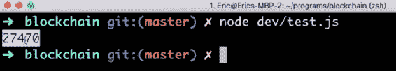

这个数字意味着我们的`proofOfWork`方法需要 27470 次迭代才能找到一个以四个零开始的散列。

5.  现在，为了深入了解整个过程，我们可以做的是，在`while`循环中，注销我们尝试的每个哈希。我们必须对`while`循环进行微小修改，如下代码块所示：

```js
while (hash.substring(0, 4) !== '0000' {
    nonce++;
    hash = this.hashBlock(previousBlockHash, currentBlockData,
    nonce);
    console.log(hash);
}
```

当我们现在运行测试文件时，将要发生的事情是，我们实际上应该看到 27000 个不同的哈希值在我们的终端中被注销。除了最后一个零外，所有这些散列都不会以四个零开始。只有最后一个注销的散列应该以四个零开始，因为在我们的方法之后，这将终止并返回获得有效散列的 nonce 值

现在让我们再次保存我们的`test.js`文件。您现在可以在屏幕上观察到，我们有一大堆不同的散列被注销到终端：

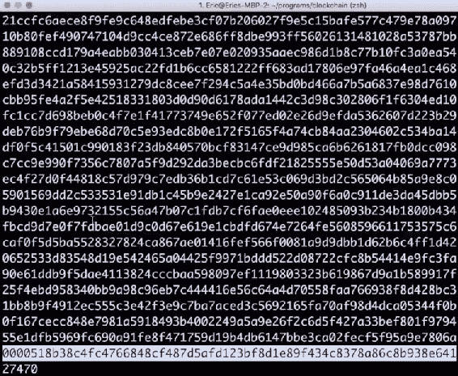

您还可以观察到，对于已注销的每个散列，在我们获得最终值之前，一行中的开头永远不会是四个零。

基本上，这里发生的是，我们正在从值为 0 的`currentBlockData`、`previousBlockHash`和`nonce`生成散列。然后，对于下一个散列，我们将 nonce 增加 1。因此，它是所有相同的输入数据，但 nonce 值将增加，直到获得有效的散列。最后，在 27470 处，使用 nonce 的值获得有效散列

现在让我们尝试使用我们的`hashBlock`方法。在我们的`dev/test.js`文件中，删除`proofOfWork`方法并添加以下代码行：

```js
console.log(bitcoin.hashBlock(previousBlockHash, currentBlockData, nonce));
```

在前面的代码中，对于 nonce，我们输入值 27470。我们通过`proofOfWork`方法获得的该值

作为输出，我们将观察到的是使用通过运行`proofOfWork`方法获得的正确 nonce 值运行单个散列。通过这样做，我们应该在第一次尝试时生成一个以四个零开始的散列。让我们保存它并运行它。测试运行后，您将看到以四个零开始的单个散列，如以下屏幕截图所示：

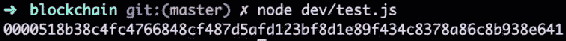

`proofOfWork`是区块链技术的重要组成部分。从测试结果中可以看出，计算起来非常困难——我们花了 27000 多次迭代来生成正确的散列。因此，a`proofOfWork`需要大量能量和大量计算，并且非常难以计算。

一旦我们有了正确的证明或生成所需散列的 nonce 值，我们就可以很容易地验证我们是否有正确的 nonce 值。我们可以通过简单地将其传递到`hashBlock`方法来验证这一点——我们将获得以四个零开始的散列。

生成工作证明需要大量的工作，但很容易验证它是否正确。因此，如果我们想要回到区块链并检查以确保某个区块有效，那么您所要做的就是将该区块的数据与前一个区块的哈希和挖掘该区块时从`proofOfWork`生成的 nonce 进行哈希。如果这向我们返回一个以四个零开头的有效散列，那么我们已经知道该块是有效的。

因此，从我们的测试中，我们可以得出结论，`proofOfWork`方法按预期工作

# 创建 genesis 区块

我们必须向区块链数据结构中添加的另一个东西是 genesis 区块。但什么是创世纪街区？好吧，创世纪区块只是任何区块链中的第一个区块

为了创建 genesis 块，我们将在`Blockchain()`构造函数中使用`createNewBlock`方法。转到`dev/blockchain.js`文件，在区块链构造函数函数类型的内部，突出显示以下代码行：

```js
function Blockchain () {
    this.chain = [];
    this.pendingTransactions =[];
    this.createNewBlock();         
}
```

正如我们在上一节中所观察到的，`createNewBlock`方法将 nonce、`previousBlockHash`和 hash 的值作为参数。因为我们在这里使用`createNewBlock`方法来创建 genesis 区块，所以我们不会有任何提到的参数。相反，我们只需传入一些任意参数，如以下代码块中突出显示的：

```js
function Blockchain () {
    this.chain = [];
    this.pendingTransactions =[];
    this.createNewBlock(100, '0', '0');         
}
```

在前面的代码中，我们将 nonce 值传递为`100`、`previousBlockHash`传递为`0`，散列值传递为`0`。这些都是任意的值；你可以增加任何你想增加的价值

Just be aware that it is okay to pass in such arbitrary parameters while creating our genesis block, but when we use the `createNewBlock` method to create new blocks, we'll have to pass the legitimate values for the parameters.

现在保存文件，让我们在`test.js`文件中测试 genesis 块

# 测试 genesis 区块

在`dev/test.js`文件中，我们将首先导入我们的区块链数据结构或区块链构造器函数，然后创建我们区块链的新实例`bitcoin`。然后，我们将按如下方式退出比特币区块链：

```js
const Blockchain = require ('./blockchain');
const bitcoin = new Blockchain ();

console.log(bitcoin);
```

保存此文件并通过在终端中键入`node dev/test.js`来运行测试

运行测试后，我们可以观察 genesis 块，如以下屏幕截图所示：


在前面的屏幕截图中，对于链阵列，您可以看到链中有一个块。这个区块是我们的创世纪区块，它的 nonce 为 100，hash 为 0，而`previousBlockHash`为`0`。从今以后，我们所有的区块链都将有一个创世纪区块

# 总结

在本章中，我们从构建构造函数开始，然后继续创建一些令人惊叹的方法，如`createNewBlock`、`creatNewTransaction`、`getLastBlock`等等。然后，我们学习了散列方法 SHA256 散列，并创建了一个方法来为块数据生成散列。我们还了解了什么是工作证明以及它是如何工作的。在本章中，您还将学习如何测试我们创建的各种方法，并检查它们是否按预期工作。当我们更多地与区块链互动时，我们在本章中学习的方法将对我们在后续章节中非常有用。

如果您想更熟悉区块链数据结构，建议您打开`test.js`文件，测试所有方法，尝试使用这些方法，观察它们如何协同工作，并从中获得乐趣。

在下一章中，我们将构建一个与区块链交互并使用区块链的 API。这才是真正有趣的开始。