# 四、创建分布式区块链网络

在本章中，让我们关注构建一个分布式区块链网络。我们的区块链目前的运作方式是我们只有一个区块链，而访问它的唯一方式是通过 API：我们的单一服务器。该服务器非常集中，这是不利的，因为 API 完全控制区块链和添加到其中的数据。

在现实世界中，所有区块链技术都托管在一个分布式网络上。在本章中，这就是我们将重点讨论的内容。我们将通过创建 API 的各种实例来构建一个分布式区块链网络。API 的每个实例都将成为我们区块链网络中的一个网络节点。所有这些节点将共同工作以承载我们的区块链。

通过这种方式，不仅仅是单个网络节点完全控制我们的区块链。相反，我们的区块链托管在整个分布式网络中。这样，如果我们的网络中有一个坏玩家，或者有人试图欺骗系统，我们可以参考其他网络节点，看看我们的区块链中应该有什么真实数据，以及我们的区块链实际上应该是什么样子。

将我们的区块链托管在一个分布式网络上是非常强大的，因为它极大地提高了我们区块链的安全性，因此我们不必只相信一个实体拥有我们所有的数据。

在本章中，我们将介绍以下主题：

*   学习如何创建和测试多个节点
*   将`currentNodeUrl`添加到我们的网络中
*   为分布式网络添加新端点
*   构建`/register-and-broadcast-node`端点
*   建立并测试`/register-nod`e 端点
*   添加并测试`/register-nodes-bulk`端点
*   测试所有网络端点

让我们开始创建分布式网络

# 创建多个节点

让我们从构建分布式网络开始：

1.  要创建分布式区块链网络，我们必须做的第一件事是对我们的`api.js`文件进行一些修改。
2.  在我们分布式网络中，我们将有多个 API 实例，每个实例都将充当一个网络节点。由于我们将处理多个网络节点，因此最好将我们的`api.js`文件重命名为`networkNode.js`，以便于参考
3.  要建立分布式网络，我们必须多次运行`networkNode.js`文件。每次运行该文件时，我们都希望它充当不同的网络节点。让我们通过每次在不同的端口上运行文件来实现这一点。为了每次都有不同的端口值，我们必须将端口设为变量。为此，请在我们的`dev/networkNode.js`中的代码开头添加以下行：

```js
const port = process.argv[2]; 
```

4.  接下来，转到`package.json`文件并修改`start`命令。我们在这里要做的是转到命令的末尾，并传递一个变量，该变量表示希望网络节点在其上运行的端口号。在我们的示例中，我们希望在端口号`3001`上运行网络节点。因此，在 start 命令末尾将`3001`作为变量传递：

```js
"start": "nodemon --watch dev -e js dev/api.js 3001"
```

为了访问这个变量，我们在`networkNode.js`文件中传递了`process.argv`变量。那么，`process.argv`变量是什么？这个变量只是指我们运行以启动服务器的`start`命令。

您可以将前面的`start`命令视为元素数组。命令的第一个和第二个元素由`"nodemon --watch dev -e js dev/api.js`组成，命令的第三个元素是`3001`变量。

If you want to add more variables to the command, you can simply make a space and then add more variables to it.

因此，为了访问`start`命令中的端口变量，我们将变量传递为`process.argv [2]`，因为此数组以`0`索引开头，而我们的端口变量是 start 命令中的第三个元素。为了简化此过程，我们可以通过在位置 2 处声明`process.argv`来访问`3001`变量。因此，我们可以访问`dev/networkNode.js`文件中的`port`变量。

5.  接下来，我们要使用`port`变量。因此，在`dev/networkNode.js`文件中，转到底部，我们在这里提到了以下代码：

```js
app.listen(3000, function() {
    console.log('Listening on port 3000...');
});
```

6.  一旦发现此问题，请对其进行以下突出显示的修改：

```js
app.listen(port, function() {
    console.log(`Listening on port ${port}...`);
});
```

在前面的代码块中，我们用`port`变量替换了硬编码的`3000`端口号。我们还通过使用字符串插值和传递端口变量将`Listening on port 3000...`更改为`Listening on port ${port}...`，现在，当我们运行`networkNode.js`文件时，它应该监听端口`3001`而不是端口`3000`。

7.  在运行`networkNode.js`文件之前，我们需要更改的一点是，在`start`命令中的`package.json`文件中，我们必须将`api.js`文件的名称更改为`networkNode.js`。
8.  现在，我们都可以通过将任何端口的变量作为变量传入来运行`networkNode.js`文件。

9.  让我们运行`networkNode.js`文件。在终端窗口中，键入`npm start`。通过键入此命令，服务器应该开始侦听端口`3001`，正如我们在下面的屏幕截图中所看到的：

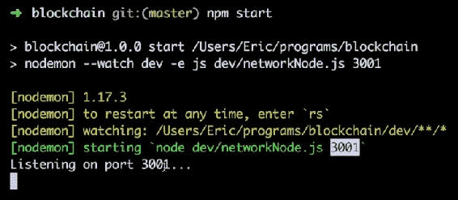

10.  从前面的屏幕截图中，我们可以看到服务器正在侦听端口`3001`。我们可以通过在浏览器中键入`localhost:3001/blockchain`进一步验证这一点。您应该会看到类似于以下屏幕截图所示的输出：

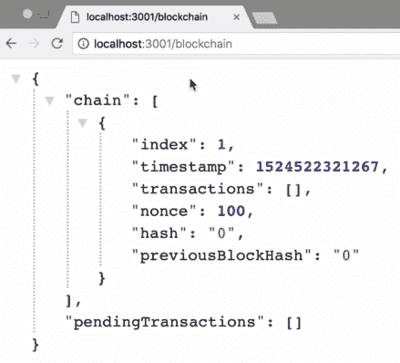

11.  从前面的屏幕截图中，我们可以看到我们的区块链现在托管在端口`3001`而不是端口`3000`上。如果我们转到端口`3000`，那里将什么也没有，如下面的屏幕截图所示：


# 正在运行 networkNode.js 的多个实例

接下来我们要做的是运行多个`networkNode.js`实例。为此，我们将向`package.json`文件中添加更多命令：

1.  首先，在`package.json`文件中，我们必须将`"start"`命令更改为`"node_1"`。现在，当我们运行这个命令时，它将启动我们的第一个节点，它位于端口`3001`。让我们试一试。

2.  保存文件，转到您的终端，然后通过键入`^C%`取消上一个过程。完成此操作后，请键入`npm run node_1`，而不是键入`npm start`。借助此命令，在端口`3001`上运行我们的`node_1`：

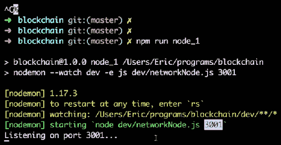

我们在这个过程中真正做的就是将`npm start`命令更改为`npm run node_1`。

3.  对于分布式网络，我们希望同时运行多个节点。让我们回到`package.json`文件，添加更多类似于`"node_1"`的命令。要执行此操作，请将`"node_1": "nodemon --watch dev -e js dev/networkNode.js 3001",`命令再复制四次，然后对这些命令进行修改，如以下屏幕截图所示：

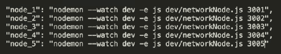

4.  现在，保存此修改，让我们回到终端并启动其他网络节点。从上一次运行中，我们有了第一个节点`node_1`，它运行在端口`3001`上。对于这次运行，我们希望在端口`3002`上运行第二个节点`node_2`。因此，只需键入`npm  run node_2`，然后按*进入*。我们将在屏幕上观察以下输出：


我们现在有一个网络节点在端口`3001`上运行，另一个网络节点在端口`3002`上运行。按照类似的过程在其余端口上运行其余的网络节点

For better visualization and easy understanding, it is recommended that you try to run each node on different tabs of the terminal window. 

通过遵循这个过程，我们实际上正在创建五个不同的`networkNode.js`文件实例。因此，本质上，我们有五个不同的网络节点在运行。

在浏览器中，我们可以通过更改`localhost:3001/blockchain`中的端口号来检查每个网络节点。通过这样做，我们将恢复在不同端口上运行的不同区块链

# 测试多个节点

我们将继续探索在上一节中创建的五个独立的网络节点。现在，您可能已经运行了所有五个网络节点。如果不是，建议转到上一节，了解如何让这些节点中的每一个运行。我们目前得到的，即五个独立的网络节点运行，并不是真正的网络。我们所拥有的只是五个独立的节点或五个独立的 API 运行实例，但它们没有以任何方式连接。为了验证这些网络节点是否未连接，我们可以执行两项测试：

1.  那么，让我们转向 Postman，通过点击我们运行的不同网络节点上的`/transaction`端点，尝试进行两个不同的事务。
2.  我们要进行的第一个事务是到我们的网络节点，该节点位于端口`3001`上。因此，让我们进入正文并键入一些随机事务数据，如以下屏幕截图所示：

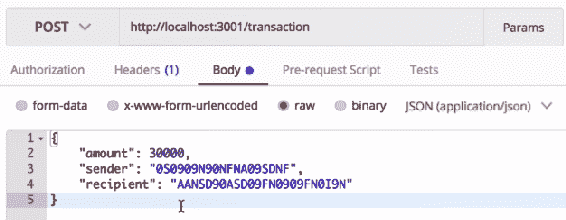

3.  我们的交易数据有 30000 比特币，我们正在将其发送到托管在端口`3001`上的网络节点。单击 Send 按钮，如果事务成功，您将得到以下响应，如以下屏幕截图所示：


4.  现在让我们向托管在端口`3003`上的网络节点进行交易，交易金额为 10 比特币。然后点击发送按钮将事务发送到端口`3003`上的网络节点。在这里，你也会看到类似的反应

5.  现在我们已经将事务数据发送到网络节点，让我们验证它。进入浏览器，进入`localhost:3001/blockchain`，然后按*进入*。您将看到类似的响应，如以下屏幕截图所示：


从前面的屏幕截图中，您可以看到我们有一笔 30000 比特币的未决交易。这是我们刚刚添加的交易之一。

6.  现在，在另一个选项卡中，如果我们转到`localhost:3002/blockchain`，您将看到我们没有挂起的事务，因为我们没有向该网络节点发送任何事务：


7.  接下来，如果我们转到`localhost:3003/blockchain`，您将看到我们这里有一笔金额为 10 比特币的未决交易：

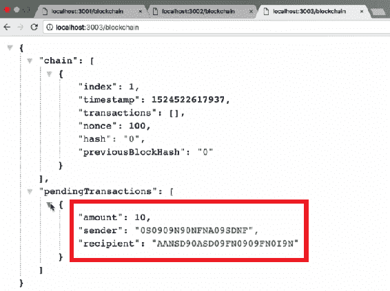

这是我们进行的其他交易之一。

如果我们转到`localhost: 3004/blockchain`和`localhost:3005/blockchain`，那里应该没有事务，因为我们没有向这些网络节点发送任何事务

我们可以从这个测试中得出的结论是，虽然我们有五个不同的网络节点彼此并行运行，但它们没有以任何方式连接。因此，本章的主要目的是将所有网络节点相互连接，以建立一个分布式网络

# 添加 currentNodeUrl

测试完节点后，下一步我们要做的是稍微修改`package.json`中的命令。我们之所以要这样做，是因为我们希望我们的每个网络节点都知道它们当前所在的 URL。例如，它们可能位于`http://localhost:3001`、`localhost:3002`、`localhost:3003`等位置。因此，我们希望每个节点都知道它所在的 URL。

在我们的`package.json`中，作为每个命令的第三个参数，我们将添加节点的 URL。因此，我们的第一个节点的 URL 将只是`http://localhost:3001`。我们的第二个节点很可能是`http://localhost:3002`。类似地，您可以为其余节点添加 URL，如以下屏幕截图所示：

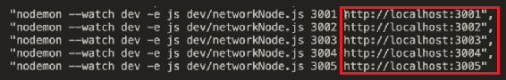

添加 URL 后，保存文件。现在，我们将每个节点的 URL 作为参数传递给用于运行每个节点的命令。因此，我们应该可以访问文件中的这些 URL，就像我们可以访问文件中的端口变量一样。

现在让我们转到`blockchain.js`文件，在定义常量的部分，我们将键入以下内容：

```js
const currentNodeUrl = process.argv[3];
```

有了这个命令，我们应该可以使用`currentNodeUrl`变量访问当前节点的 URL。

现在我们应该将`currentNodeUrl`分配给我们的`Blockchain`数据结构。我们通过在`function Blockchain {}`中键入以下突出显示的代码行来完成此操作：

```js
function Blockchain() {
       this.chain = [];
       this.pendingTransactions = [];

       this.currentNodeUrl = currentNodeUrl;

       this.createNewBlock();
};
```

接下来，我们还希望我们的区块链能够了解我们网络中的所有其他节点。因此，我们将在前面突出显示的代码行下面添加以下代码：

```js
this.networkNodes = [];
```

在接下来的部分中，我们将用网络中所有其他节点的节点 URL 填充此数组，以便每个节点都能知道区块链网络中的所有其他节点。

# 新端点概述

在我们的区块链中，我们现在希望创建一个网络，并有一种方法来注册我们拥有的所有不同节点。因此，让我们再创建几个端点，以便能够在网络中注册节点。

# 定义/注册和广播节点端点

我们创建的第一个端点是`/register-and-broadcast-node`，定义如下：

```js
app.post('/register-and-broadcast-node', function (req, res) {

});
```

前面的端点将注册一个节点并向整个网络广播该节点。它将通过在`req`主体上传递我们要注册的节点的 URL 来完成此操作。因此，请在前面的端点内键入以下内容：

```js
const newNodeUrl = req.body.newNodeUrl;
```

我们现在不打算构建这个端点，但是当我们在后面的章节中使用它时，我们将发送一个新节点的 URL，我们希望将其添加到我们的网络中。然后我们将进行一些计算，并将节点广播到整个网络，以便所有其他节点也可以添加它。

# 创建/注册节点终结点

`/register-node`将是我们将添加到网络的下一个端点。其定义如下：

```js
app.post('/register-node', function (req, res) {

});
```

此端点将向网络注册一个节点。

# 寄存器和广播节点以及寄存器节点端点之间的差异

现在，让我们试着了解`/register-and-broadcast-node`和`/register-node`端点是如何不同的。基本上，这里要发生的是，每当我们想在我们的网络中注册一个新节点时，我们都会到达`/register-and-broadcast-node`端点。此端点将在其自己的服务器上注册新节点，然后将此新节点广播到所有其他网络节点。

这些网络节点只接受`/register-node`端点内的新网络节点，因为所有这些节点所要做的只是注册广播节点，我们只希望它们注册新节点；我们不希望他们广播新节点，因为这已经发生了。

如果网络中的所有其他节点也广播新节点，这将严重降低我们区块链网络的性能，并导致无限循环，从而使我们的区块链崩溃。因此，当所有其他网络节点接收到新节点的 URL 时，我们只希望它们注册它，而不是广播它。

# 定义/注册节点批量端点

我们将在本节中重新构建最终端点：

```js
app.post('/register-nodes-bulk', function (req, res) {

});
```

此端点将同时注册多个节点。

# 了解所有端点如何协同工作

在这个阶段，了解所有这些端点似乎有点让人困惑，所以让我们试着借助图表来理解这一点。在下图中，我们有我们的区块链网络：

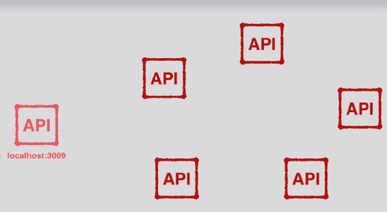

现在让我们假设这五个网络节点已经相互连接，从而形成我们的分布式网络。另外，假设我们想将托管在`localhost:3009`上的节点添加到我们的网络中。

要将该节点添加到网络中，我们要做的第一件事是点击其中一个网络节点上的`register-and-broadcast-node`端点：


当我们到达`register-and-broadcast-node`端点时，我们需要发送要添加到网络中的新节点的 URL。对于我们的示例，URL 是`localhost:3009`。这是向网络添加新节点的第一步。我们必须使用新节点 URL 作为数据点击`register-and-broadcast-node`端点。

在前面的图中，我们点击的网络节点将在其自己的节点上注册这个新 URL，然后将这个新节点的 URL 广播到网络的其余部分。我们网络中的所有其他节点将在`register-node`端点接收此数据：


我们将在所有其他网络节点上点击`register-node`端点，因为我们不再需要广播数据——我们只需要注册它。

现在，在向所有其他网络节点注册新 URL 后，我们的原始节点将向新节点发出请求，它将到达`register-node-bulk`端点：

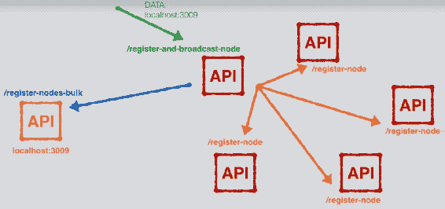

此外，原始节点将传递所有其他节点的 URL。因此，此调用将向新节点注册网络中已经存在的所有其他节点

此时，节点现在是网络的一部分，网络中的所有节点也将知道网络中存在的所有其他节点。

现在让我们把整个过程再看一遍。我们要做的第一件事是在网络中添加一个新节点，点击网络中一个节点上的`/register-and-broadcast-node`端点。该端点将注册新节点的 URL，然后将该新 URL 广播到网络中的所有其他节点。广播完成后，我们命中的原始网络节点将向新网络节点发送请求，并命中`register-nodes-bulk`端点。在此过程中，它会将网络中的所有其他节点注册到我们的新节点。

因此，当整个过程完成时，所有这些节点都将成为我们分布式区块链网络的一部分，并且它们都将相互注册。

这就是这三个端点如何协同工作。在下一节中，我们将构建`register-and-broadcast-node`端点

# 构建/注册和广播节点端点

让我们开始构建注册和广播节点端点。该端点的功能是向自身注册新节点，然后将新节点广播给网络中已经存在的所有其他节点。那么，让我们开始构建端点：

1.  从前面的章节中，在`dev/networkNode.js`文件中，我们已经有了以下代码：

```js
app.post('/register-and-broadcast-node', function(req, res) {
       const newNodeUrl = req.body.newNodeUrl;
```

在这里，我们定义了一个名为`newNodeUrl`的变量，该`newNodeUrl`数据将被传递到请求主体，类似于我们将事务数据传递到事务端点的方式。访问`newNodeUrl`后，我们要做的第一件事是向节点的`register-and-broadcast-node`端点注册节点。

2.  要注册它，我们所要做的就是将`newNodeUrl`放在`networkNodes`数组的`blockchain`数据结构中。为此，在前面的代码块中，添加以下突出显示的代码：

```js
app.post('/register-and-broadcast-node', function(req, res) {
       const newNodeUrl = req.body.newNodeUrl;
      bitcoin.networkNodes.push(newNodeUrl); 
```

3.  通过添加前一行代码，我们将`newNodeUrl`推进到`networkNodes`数组中。我们只想在阵列中不存在`newNodeUrl`的情况下执行此操作。借助`if`语句检查此项，如下所示：

```js
app.post('/register-and-broadcast-node', function(req, res) {
       const newNodeUrl = req.body.newNodeUrl;
      if (bitcoin.networkNodes.indexOf(newNodeUrl) == -1) bitcoin.networkNodes.push(newNodeUrl);
```

`if`语句所做的是检查`newNodeUrl`是否已经存在于`networkNodes`数组中。如果不存在，则将其添加到数组中。因此，在前面代码块的帮助下，`newNodeUrl`被注册到`register-and-broadcast-node`端点。

4.  既然我们已经注册了`newNodeUrl`，我们现在要做的就是将其广播到网络中的所有其他节点。为此，请在 if 块后添加以下代码行：

```js
bitcoin.networkNodes.forEach(networkNodeUrl => {
    //... '/register-node' 

}
```

在前面的代码块中，对于网络中已经存在的每个网络节点，或者对于`networkNodes`数组中已经存在的每个网络节点，我们希望通过点击注册节点端点来注册我们的`newNodeUrl`与这些`networkNodes`中的每一个。要做到这一点，我们必须向该端点的每个节点发出请求。

5.  我们将通过导入一个新库来发出此请求。让我们到终端导入库。在终端中，我们将取消第一个网络节点，然后键入以下命令：

```js
npm install request-promise --save 
```

6.  安装此`request-promise`库将允许我们向网络中的所有其他节点发出请求。安装库后，通过键入`npm run node_1`重新启动第一个节点。
7.  现在，让我们转到`dev/networkNode.js`文件并导入我们刚刚下载到代码中的库。通过在开始处键入以下代码行导入库：

```js
const rp = require('request-promise');
```

在代码的前一行，`rp`代表请求承诺。

8.  现在让我们在`register-and-broadcast-node`端点中使用这个库。在这里，我们必须向网络中的所有其他节点广播我们的`newNodeUrl`。在我们刚刚导入的`request-promise`库的帮助下执行此操作。

我们将要添加到代码中的下两个步骤在执行时可能看起来有点混乱，但不要担心。完成这些步骤后，我们将一步一步地浏览代码，以确保您对所有内容都很清楚。现在让我们来看看下面的步骤：

1.  对于`request-promise`库，我们要做的第一件事是定义一些我们将要使用的选项，因此键入以下突出显示的代码行：

```js
bitcoin.networkNodes.forEach(networkNodeUrl => {
    const requestOptions = {

 }

}
```

2.  在这个对象内部，我们想要定义我们想要用于每个请求的选项。
3.  我们想要定义的第一个选项是我们想要点击的 URI/URL。我们知道我们想在所有其他的`networkNodeUrl`上点击`register-node`端点。因此，我们将在前面的代码块中添加以下突出显示的代码行：

```js
bitcoin.networkNodes.forEach(networkNodeUrl => {
    const requestOptions = {
    uri: networkNodeUrl + '/register-node', 
    }

}
```

4.  接下来，我们要定义要使用的方法。要命中`register-node`端点，我们必须使用`POST`方法，因此在前面的代码块中添加以下代码：

```js
method: 'POST',
```

5.  然后我们想知道我们将随此请求一起传递哪些数据，因此添加以下内容：

```js
body: { newNodeUrl: newNodeUrl }
```

6.  最后，我们将把`json`选项设置为 true，以便我们可以将其作为 JSON 数据发送：

```js
json: true
```

7.  这些是我们希望用于每个请求的选项。现在让我们看看如何使用这些选项。在`requestOptions`块后，添加以下代码行：

```js
rp(requestOptions)
```

8.  前面的请求将向我们返回一个承诺，我们希望在单个数组中返回所有这些承诺。因此，在`forEach`循环之前和内部，执行以下突出显示的更改：

```js
const regNodesPromises = [];
bitcoin.networkNodes.forEach(networkNodeUrl => {
    const requestOptions = {
        uri: networkNodeUrl + '/transaction',
        method: 'POST',
        body: newTransaction,
        json: true
    };
 regNodesPromises.push(rp(requestOptions));
});
```

9.  现在，在`forEach`循环之外，我们希望运行我们要求的所有承诺。在循环后添加以下代码：

```js
Promise.all(regNodesPromises)
.then(data => {
    //use the data...
});
```

# 继续处理/注册和广播节点终结点

在本节中，让我们继续构建`register-and-broadcast-node`端点。到目前为止，我们已经在当前的网络节点上注册了新节点，并将新节点广播给网络中的所有其他节点。因此，我们在网络中的所有其他节点上点击了`register-node`端点。另外，现在，我们假设其他节点正在注册新节点，我们还没有构建新节点，但我们假设它正在工作。

在整个广播完成后，我们必须将当前网络中的所有节点注册到我们正在添加到网络中的一个新节点。为此，我们将使用我们的`request-promise`图书馆。因此，我们需要定义一些选项，如下代码所示：

```js
Promise.all(regNodesPromises)
.then(data => {
   const bulkRegisterOptions = { 
        uri: newNodeUrl + '/register-nodes-bulk'  
        method: 'POST',
 body: {allNetworkNodes: [...bitcoin.networkNodes,
        bitcoin.currentNodeUrl]} 
 json:true
 }; 
  });
});
```

在前面的代码中，定义了我们想要使用的选项（例如`uri`），以及`POST`方法。在 body 选项中，我们定义了`allNetworkNodes`数组，在这个数组中，我们需要网络中所有节点的所有 URL，加上我们当前所在节点的 URL。此外，您可能已经注意到，我们在数组中使用了扩展运算符`...`，因为`bitcoin.networkNodes`是一个数组，我们不希望一个在另一个数组中。相反，我们希望将此数组的所有元素展开，并将它们放入外部数组中。最后，我们想将`json`定义为`true`

接下来，我们要发出请求，因此在选项块之后，添加以下内容：

```js
return rp(bulkRegisterOptions);
```

在此之后，添加以下内容：

```js
.then (data => {

})
```

前一行代码中的`data`变量实际上是我们从上述承诺中收到的数据。我们不打算对这些数据做任何事情，但我们想使用`.then`，因为我们想在端点内部进行下一步。但是，我们只能在上述承诺完成后才能这样做

我们必须在此端点内部完成的最后一步是将响应发送回调用它的人。因此，请键入以下突出显示的代码行：

```js
.then (data => {
    res.json({ note: 'New Node registered with network successfully' });
});
```

这就是我们的`register-and-broadcast-node`终点。

# 快速回顾 register 和 broadcast 节点端点的功能

现在，让我们再次运行此端点，快速总结我们在该端点中所做的工作，以便更好地了解这一点。每当我们想要在网络中注册一个新节点时，`register-and-broadcast-node`端点就是我们想要到达的第一个点。我们在这个端点内部所做的第一件事是获取`newNodeUrl`并通过将其推入`networkNodes`数组来向当前节点注册它。

我们必须做的下一步是将此`newNodeUrl`广播到网络中的其他节点。我们是在`forEach`循环中进行的。在这个 for 循环中发生的一切就是我们向网络中的每个其他节点发出请求。我们正在向`register-node`端点发出此请求。然后我们将所有这些请求推送到我们的`register-node`承诺数组中，然后我们只运行所有这些请求。

一旦所有这些请求都在没有任何错误的情况下完成，我们可以假设`newNodeUrl`已经成功地注册到我们所有的其他网络节点。

广播完成后，我们要做的下一件事是将网络中已经存在的所有网络节点注册到新节点。为此，我们向新节点发出一个请求，然后点击`register-nodes-bulk`端点。我们传递给该端点的数据是网络中已经存在的所有节点的 URL。

然后我们运行`rp(bulkRegisterOptions);`，尽管我们还没有构建`register-nodes-bulk`端点，但我们将假设它正在工作，并且所有网络节点都已成功注册到新节点。一旦发生这种情况，我们所有的计算都完成了，我们只需返回一个通知，说明新节点已成功注册到网络。

在这一点上，这似乎有很多需要理解的地方，但不要担心；建议您继续前进。在接下来的章节中，我们将构建`register-node`端点，然后是`register-nodes-bulk`端点。当我们这样做的时候，一切都会变得更加清晰。

# 构建/注册节点端点

现在我们已经建立了`/register-and-broadcast-node`端点，是时候让我们继续做一些不那么复杂的事情了。在本节中，让我们开始构建`register-node`端点。与我们在上一节中构建的端点相比，这将非常简单

这个`register-node`端点是网络中的每个节点接收`register-and-broadcast-node`端点发送的广播的地方。这个`register-node`端点必须做的唯一一件事就是向接收请求的节点注册新节点。

要开始构建`register-node`端点，请执行以下步骤：

1.  我们要做的第一件事是定义`newNodeUrl`；因此，添加以下突出显示的代码行：

```js
// register a node with the network
app.post('/register-node', function(req, res) {
       const newNodeUrl = req.body.newNodeUrl;
});
```

前一行代码只是说明使用发送到`req.body`的`newNodeUrl`值。这是我们发送到`/register-node`端点的数据，我们将把新的`nodeNodeUrl`保存为`newNodeUrl`变量。

2.  接下来，我们要向接收请求的节点注册`newNodeUrl`变量。为此，请添加以下突出显示的代码行：

```js
// register a node with the network
app.post('/register-node', function(req, res) {
      const newNodeUrl = req.body.newNodeUrl; bitcoin.networkNodes.push(newNodeUrl);
});
```

前一行代码将向当前所在的节点注册新节点。我们在这里要做的就是将`newNodeUrl`推入当前节点的`networkNodes`数组中

3.  现在，我们要做的最后一件事是发回一个响应，因此键入以下突出显示的代码行：

```js
// register a node with the network
app.post('/register-node', function(req, res) {
      const newNodeUrl = req.body.newNodeUrl;bitcoin.networkNodes.push(newNodeUrl);
      res.json({ note: 'New node registered successfully.' }); 
});
```

4.  接下来，我们希望在此端点内部执行一些错误处理。我们要做的唯一一件事就是将`newNodeUrl`添加到`networkNodes`数组中，如果它在该数组中还不存在的话。为此，我们将在`bitcoin.networkNodes.push(newNodeUrl)`的开头添加一个 if 语句。但在此之前，让我们定义一个变量，如下所示：

```js
// register a node with the network
app.post('/register-node', function(req, res) {
      const newNodeUrl = req.body.newNodeUrl;
 const nodeNotAlreadyPresent = 
         bitcoin.networkNodes.indexOf(newNodeUrl) == -1; bitcoin.networkNodes.push(newNodeUrl);
       res.json({ note: 'New node registered successfully.' }); 
});
```

前面突出显示的这一行说明的是，如果`newNodeUrl`的索引为负 1，或者换句话说，如果`newNodeUrl`在我们的网络节点中不存在，那么`nodeNotAlreadyPresent`变量将为真。如果我们的`networkNodes`数组中已经存在`newNodeUrl`，那么这个变量将为 false

5.  在 if 语句内部，我们要声明的是，如果`networkNodes`数组中不存在`newNodeUrl`，则通过运行`bitcoin.networkNodes.push(newNodeUrl)`来添加它：

```js
if (nodeNotAlreadyPresent ) bitcoin.networkNodes.push(newNodeUrl);
```

6.  接下来，我们要处理的另一个情况是，如果`newNodeUrl`实际上是我们所在的当前节点的 URL，我们不想将`newNodeUrl`推送到`networkNodes`数组中。要在代码中提到此条件，我们首先必须定义一个变量：

```js
const notCurrentNode = bitcoin.currentNodeUrl !== newNodeUrl;
```

前一行只是计算`bitcoin.currentNodeUrl !== newNodeUrl`表达式，表示`currentNodeUrl`是否等于`newNodeUrl`。否则，`notCurrentNode`变量将为真。如果它们彼此相等，那么变量将为 false。

7.  接下来，我们只想将`notCurrentNode`变量添加到 if 语句中，如下所示：

```js
if (nodeNotAlreadyPresent && notCurrentNode ) bitcoin.networkNodes.push(newNodeUrl);
```

这个 if 语句中发生的情况是，如果新节点尚未出现在我们的`networkNodes`数组中，并且如果新节点与我们所在的当前节点的 URL 不同，那么我们只想将新节点添加到`networkNodes`数组中。

我们在这里学到的一切都是端点内部的错误处理。

# 测试/注册节点端点

在本节中，让我们测试`/register-node`端点，以确保其正常工作，并更好地了解其工作方式。

# 安装请求库

在开始测试端点之前，我们需要执行一个小的更新。更新是关于安装请求库的。在之前的几节中，我们安装了`request-promise`库。现在，为了测试我们刚刚创建的端点，我们可能还需要安装请求库，这取决于我们拥有的`request-promise`库的版本。

要安装请求库，只需转到终端，在`blockchain`目录中运行以下命令：

```js
npm install request --save
```

# 端点测试

在我们开始测试之前，请检查您的终端是否运行了我们所有的五个网络节点。如果没有，那么您必须设置它们。让我们使用 Postman 测试`register-node`端点：

1.  首先，我们将在地址栏中键入`http://localhost:3001/register-node`，如以下屏幕截图所示：


当我们到达这个端点时，我们需要在`req.body`上发送`newNodeUrl`作为数据。我们现在必须把它设置好。因此，在 Postman 内部的 Body 选项卡中，我们希望选择 raw 和 JSON（application/JSON）作为文本。

2.  然后，在文本框内，创建一个对象并添加以下代码：

```js
{
    "newNodeUrl":""
}
```

3.  现在让我们假设我们想将在端口`3002`上运行的节点注册到在端口`3001`上运行的节点。在前面的代码中添加以下内容：

```js
{
    "newNodeUrl":"http://localhost:3002"
}
```

到目前为止，我们已经将运行在`localhost:3002`上的节点注册到运行在`localhost:3001`上的节点。因此，当我们点击`http://localhost:3001/register-node`时，我们的`localhost:3002`应该出现在我们第一个节点（即`localhost:3001`的`networkNodes`数组中，因为这个`register-node`端点通过将节点放入`networkNodes`数组来注册节点。

4.  要验证这一点，请转到“邮递员”并单击“发送”按钮。您将获得成功注册新节点的响应。现在转到浏览器，在地址栏中键入`localhost:3001/blockchain`，然后按*输入*。您将看到类似于以下屏幕截图所示的输出：


因为我们刚刚在`localhost:3001`上向当前节点注册了第二个节点，所以第二个节点的 URL 就在这个数组中。

按照相同的过程，您也可以尝试注册其他节点。试试这个。这将帮助您清楚地了解已注册的节点。如果您遇到任何问题，请尝试再次通读整个过程

我们需要注意的一点是，如果我们现在转到`localhost:3002/blockchain`，我们可以观察到`networkNodes`数组中没有注册的网络节点

理想情况下，我们希望发生的是，当我们注册一个新节点时，我们希望它也反向注册。因此，如果我们向`3001`上的节点注册`localhost:3002`，那么`3002 `上的节点应该注册`localhost:3001`。通过这种方式，这两个节点将相互感知。

实际上，我们已经在`register-and-broadcast-node`端点内部构建了此功能。一旦我们构建了这三个端点，我们提到的功能将正常工作。

# 构建/注册节点批量端点

我们将要构建的下一个端点是我们的`register-nodes-bulk`端点；这是我们需要构建的最终端点。我们一直致力于的这三个端点将共同创建我们的去中心化区块链网络。

在开始构建端点之前，让我们试着了解`register-nodes-bulk`端点的作用。每当一个新节点被广播到网络中的所有其他节点时，我们希望获取网络中已经存在的所有节点，并将该数据发送回我们的新节点，以便新节点可以注册和识别网络中已经存在的所有节点。

`register-nodes-bulk`端点将接受包含网络中已存在的每个节点的 URL 的数据。然后，我们只需将所有这些网络节点注册到新节点。

新节点是命中`register-nodes-bulk`端点的节点。只有添加到我们网络中的新节点才会命中此端点。

1.  要构建`register-nodes-bulk`端点，我们必须假设当前网络中的所有节点 URL 都作为数据传入，并且我们可以通过`req.body.allNetworkNodes`属性访问它们。这是因为我们在调用`Promise.all(regNodesPromise)`块中的端点时，正在发送`allNetworkNodes`数据。在这里，我们正在将`allNetworkNodes`发送到`register-nodes-bulk`端点。这将使我们能够访问端点内部的`allNetworkNodes`数据。

2.  让我们在前面几节中创建的`register-nodes-bulk`端点中添加以下代码行：

```js
app.post('/register-nodes-bulk', function (req, res) {
    const allNetworkNodes = req.body.allNetowrkNodes;

});
```

3.  接下来，让我们遍历`allNetworkNodes`数组中存在的每个节点 URL，并将其注册到新节点，如下所示：

```js
app.post('/register-nodes-bulk', function (req, res) {
    const allNetworkNodes = req.body.allNetowrkNodes;
    allNetworkNodes.forEach(networkNodeUrl => { 
 //...
 });

});
```

4.  现在，我们在循环中要做的就是将每个网络节点 URL 注册到当前节点上，即添加到网络中的新节点：

```js
app.post('/register-nodes-bulk', function (req, res) {
    const allNetworkNodes = req.body.allNetowrkNodes;
    allNetworkNodes.forEach(networkNodeUrl => { 
        bitcoin.networkNodes.push(metworkNodeUrl);
    });

});
```

在前面突出显示的代码行中，当我们使用`forEach`循环遍历所有网络节点时，我们通过将`networkNodeUrl`推入`networkNodes`数组来注册每个节点。

无论何时我们到达`/register-nodes-bulk`端点，我们都在添加到网络的新节点上。所有这些`networkNodeUrls`正在注册到我们正在添加的新节点。

5.  现在有几个实例我们不想在`networkNodes`数组中添加`networkNodeUrl`。为了处理这些实例，我们将使用 if 语句。但在此之前，我们需要定义一个条件语句，如下所示：

```js
const nodeNotAlreadyPresent = bitcoin.networkNodes.indexOf(networkNodeUrl) == -1;
```

我们不想在`networkNodes`数组中添加`networkNodeUrl`的一个原因是`networkNodeUrl`是否已经存在于`networkNodes`数组中；这就是我们在条件语句中提到的

这个语句所做的只是测试我们所使用的`networkNodeUrl`是否存在于`networkNodes`数组中。从这里，它将简单地评估这是真是假。

6.  现在我们可以添加`nodeNotAlreadyPresent`变量和 if 语句，如下代码所示：

```js
app.post('/register-nodes-bulk', function (req, res) {
    const allNetworkNodes = req.body.allNetowrkNodes;
    allNetworkNodes.forEach(networkNodeUrl => {
    const nodeNotAlreadyPresent = 
      bitcoin.networkNodes.indexOf(networkNodeUrl) == -1; 
        if(nodeNotAlreadyPresent)bitcoin.networkNodes.push(networkNodeUrl);
 });

});
```

前面的 if 语句表示，如果节点在`networkNodes`数组中不存在，那么我们将注册该节点。

7.  现在，我们不想注册网络节点的另一个实例是，如果该网络节点与我们当前所在的网络节点具有相同的 URL。要处理此问题，我们必须创建另一个变量：

```js
const notCurrentNode = bitcoin.currentNodeUrl !==networkNodeUrl
```

8.  接下来，将此变量添加到我们的`if`语句中：

```js
app.post('/register-nodes-bulk', function (req, res) {
    const allNetworkNodes = req.body.allNetowrkNodes;
    allNetworkNodes.forEach(networkNodeUrl => {
    const nodeNotAlreadyPresent = 
      bitcoin.networkNodes.indexOf(networkNodeUrl) == -1; 
        if(nodeNotAlreadyPresent && notCurrentNode)
         bitcoin.networkNodes.push(networkNodeUrl);
 });

});
```

基本上，我们在`if`语句中所说的是，当我们在添加的每个网络节点之间循环时，如果该节点尚未出现在我们的网络节点数组中，并且该节点不是我们当前节点的 URL，那么我们希望将`networkNodeUrl`添加到`networkNodes`数组中。

9.  一旦我们完成了`forEach`循环，我们将注册我们区块链网络中已经存在的所有网络节点。此时，我们需要做的就是发回一个响应，如下所示：

```js
app.post('/register-nodes-bulk', function (req, res) {
    const allNetworkNodes = req.body.allNetowrkNodes;
    allNetworkNodes.forEach(networkNodeUrl => {
    const nodeNotAlreadyPresent = 
      bitcoin.networkNodes.indexOf(networkNodeUrl) == -1; 
        if(nodeNotAlreadyPresent && notCurrentNode)
         bitcoin.networkNodes.push(networkNodeUrl);
 });
res.json({note: 'Bulk registration successful.' });

});
```

让我们快速回顾一下到目前为止我们所做的工作。我们构建的端点接受所有网络节点作为数据，然后我们在区块链网络中已经存在的所有网络节点之间循环。对于每个节点，只要它还没有注册到`currentNode`并且与`currentNode`的 URL 不同，我们就要将该节点添加到`networkNodes`数组中。

# 测试/注册节点批量端点

在本节中，我们将测试`register-nodes-bulk`端点，以确保其正常工作。这将使我们能够清楚地了解其工作原理：

1.  为了测试端点，我们将前往邮递员处。在这里，我们将点击`localhost:3001/register-nodes-bulk`端点。当我们测试该端点时，我们希望收到一些数据，即`allNetworkNodes`数组。
2.  因此，在 Postman 内的 body 选项卡中，为文本选择了 raw 选项和 JSON（应用程序/JSON）格式，将以下代码行添加到 body 中：

```js
{
    "allNetworkNodes": []
}
```

3.  在这个阵列中，将有我们区块链网络中已经存在的所有节点的 URL：

```js
{
    "allNetworkNodes": [
    "http://localhost:3002",
    "http://localhost:3003",
    "http://localhost:3004"
    ]
}
```

4.  当我们现在运行这个请求时，我们应该在`localhost:3001`上运行的节点上注册这三个 URL。让我们看看这是否有效。单击“发送”按钮，您将收到一个表示批量注册成功的响应。
5.  现在，如果我们转到浏览器，我们可以再次检查它是否工作。在地址栏中，键入`localhost:3001/blockchain`，然后按*进入*。您将看到在`networkNodes`数组中添加的三个 URL，因为它们是批量注册的：


类似地，您可以尝试将新节点添加到不同 URL 上的其他节点。您将在这些节点的`networkNodes`数组中观察到类似的响应

所以，看起来我们的`register-node-bulk`端点正在正常工作。

# 测试所有网络端点

从上一节中我们了解到，我们的`register-node`路线和`register-nodes-bulk`路线都工作正常。因此，在本节中，让我们把它们放在一起，测试我们的`register-and-broadcast-node`路线，它同时使用`register-node`路线和`register-nodes-bulk`路线。

`register-and-broadcast-node`端点将允许我们创建一个网络并向其添加新节点，从而构建一个分布式区块链网络。让我们直接进入我们的第一个示例，以便更好地理解它。为了了解`register-and-broadcast-node`路线的工作原理，我们将利用邮递员。

在 Postman 应用程序中，我们希望发出 post 请求，在`localhost:3001`上注册并广播该节点。但是，在执行此操作之前，请确保所有四个节点都在运行，以便我们可以测试路由。

在这一点上，我们根本没有网络；我们只有五个单独的节点在运行，但它们没有以任何方式连接。因此，我们要做的第一个调用就是将两个节点连接在一起，形成我们网络的起点。现在，我们将向托管在端口`3001`上的节点注册一个节点。当我们到达`register-and-broadcast-node`端点时，我们必须发送一个要注册的`newNodeUrl`。在“邮递员”中，添加以下代码：

```js
{
    "newNodeUrl": ""
}
```

对于第一个测试，我们希望将托管在端口`3002`上的第二个节点注册到第一个节点。为此，我们将添加以下突出显示的代码：

```js
{
    "newNodeUrl": "http://localhost:3002"
}
```

现在，当我们发出这个请求时，它应该将托管在`localhost:3002`上的节点注册到托管在`localhost:3001`上的节点。让我们通过单击 Send 按钮来验证这一点。您将看到类似于以下屏幕截图所示的输出：

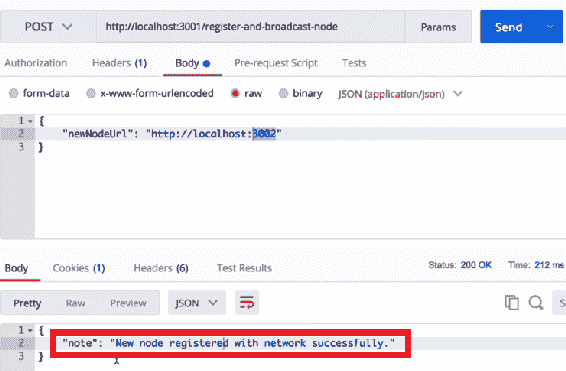

从前面的屏幕截图中，我们可以看到新节点已成功注册到网络。让我们通过进入浏览器来验证这一点。

在浏览器中，您可以访问正在运行的所有五个节点。我们现在已将端口`3002`上的节点与托管在`localhost:3001`上的节点注册。因此，如果我们现在刷新浏览器上的页面，我们会发现`localhost:3002`已经注册到端口`3001`的`networkNodes`数组中：


从前面的截图中，我们可以看到我们已经注册了`localhost:3002`。现在，如果我们转到`localhost:3002`，我们应该在其`networkNodes`数组中注册`localhost:3001`。让我们刷新一下，看看我们在这里得到了什么：

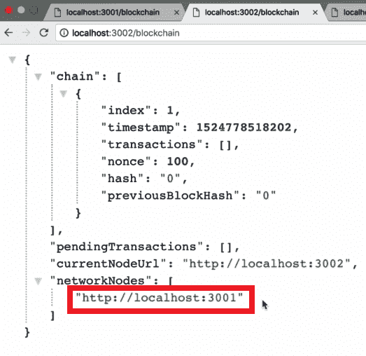

从前面的屏幕截图中，我们可以看到这两个节点现在已经形成了一个网络，并相互注册为一个网络节点。

接下来，让我们将另一个节点添加到此网络。让我们回到邮递员那里，把`localhost:3002`换成`localhost:3003`。我们将向`3001`上的节点发出请求：

```js
{
    "newNodeUrl": "http://localhost:3003"
}
```

这应该做的是将托管在`localhost:3003`上的节点注册到网络中的所有其他节点。所以，`3003`应该注册`3001`和`3002`。让我们发送这个请求，看看它是否有效。如果成功注册，您将看到类似于以下屏幕截图所示的输出：


让我们在浏览器中验证这一点。当我们在`localhost:3001`中刷新时，我们应该在`networkNodes`数组中有`localhost: 3003`：


现在，由于`localhost:3002`也是网络的一部分，所以它应该在`networkNodes`阵列中包含`localhost:3003`。当我们提出这个请求时，我们是向`3001`而不是`3002`提出的。本地主机`3002 `已经是网络的一部分，广播向网络中存在的所有网络节点注册`3003`。要验证这一点，请刷新`3002`上的`networkNodes`阵列。您将看到类似于以下屏幕截图所示的输出：


从前面的屏幕截图中，我们可以看到我们的第三个节点现在也在`localhost:3002``networkNodes`数组中。此外，如果我们转到`localhost:3003`上的`networkNodes`并刷新页面，我们应该在`networkNodes`数组中同时包含`3001`和`3002`：


因此，我们现在有一个由`3001`、`3002`和`3003`上的节点组成的网络。这些是相互注册的。

现在，让我们回到 Postman，按照注册初始节点所遵循的相同步骤，向网络注册剩余的`localhost:3004`和`localhost:3005`

在向网络注册了`3004`和`3005`之后，如果您进入浏览器，所有注册的节点都应该在其`networkNodes`数组中包含`localhost:3004`和`localhost:3005`。刷新`localhost:3001`页面，您会看到类似于以下屏幕截图所示的输出：


类似地，如果刷新其他页面，您将可以观察所有节点，类似于我们在前面的屏幕截图中观察到的。

这就是我们如何建立一个由五个不同节点组成的分布式网络

现在，你可能想知道这一切是如何运作的。这是因为当我们发出`"newNodeUrl": "http://localhost:3004"`请求时，我们实际上是在添加一个命令，将`3004`添加到网络中。但是`localhost:3004`如何通过一个请求感知整个网络？

如果您还记得前面几节，当我们构建`/register-and-broadcast-node`端点时，实际上有很多计算正在进行。因此，如果我们看一看`/register-and-broadcast-node`端点代码，我们可以看到`register-and-broadcast-node`端点内部发生的第一件事是我们接收`newNodeUrl`，然后通过点击其`register-node`端点将其广播到网络中的每个节点。因此，网络中的每个节点都会意识到正在添加的新节点。

For the complete code, please visit [https://github.com/PacktPublishing/Learn-Blockchain-Programming-with-JavaScript/blob/master/dev/networkNode.js](https://github.com/PacktPublishing/Learn-Blockchain-Programming-with-JavaScript/blob/master/dev/networkNode.js) and refer to the code block which starts with this comment: `//registering a node and broadcasting it the network`.

然后，在广播发生后，我们将请求发送到刚刚添加的新节点，并向新节点注册网络中已经存在的所有网络节点。这是进行反向注册的地方。此时，网络中的所有原始节点都知道新节点，新节点也知道网络中的所有其他节点。因此，网络中的所有节点都会相互感知，这是我们的区块链正常工作所需要的。

因此，我们构建的所有三个端点（`register-and-broadcast-node`、`register-node`和`register-nodes-bulk`都非常强大，因为它们共同创建了一个分布式区块链网络。这就是我们在本章中构建的内容。

在本书的这一点上，建议您花一些时间来稍微研究一下这些端点，用不同的节点创建不同的网络，并对其进行更多的测试，以便更熟悉其工作原理。

如果您对我们介绍的任何概念或主题感到困惑，建议您再次通读本章的所有章节。你会惊讶地发现，在你对即将发生的事情和我们将要建设的东西有了一定的了解之后，你第二次能学到多少东西

# 总结

我们现在已经完成了分布式网络的创建。在本章中，我们学习了许多新概念。我们通过学习如何创建 API 的多个实例以及如何使用它们来建立分布式网络开始了我们的旅程。然后，我们定义了各种端点，如`register-and-broadcast-node`、`register-node`和`register-nodes-bulk`。在此之后，我们构建了这些端点并对它们进行了测试

在下一章中，我们将学习如何同步网络