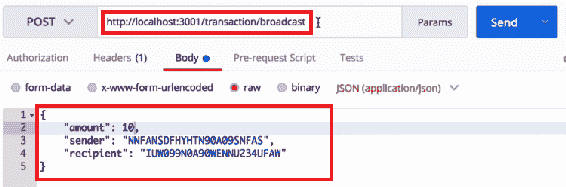
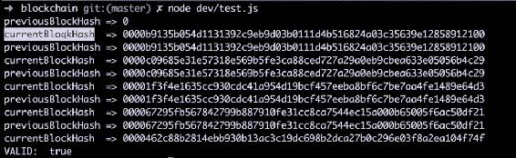
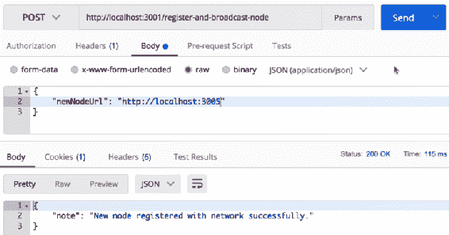

Unknown 

# 一致性算法

在本章中，我们将为区块链网络构建共识算法。共识算法是网络内所有节点就哪些数据正确且应保留在区块链内达成一致意见的一种方法。为了构建一致性算法，我们首先要构建一个新方法，称为`chainIsValid`。该方法将通过比较链内所有块的所有散列来验证区块链。在那之后，我们将构建一个`/consensus`端点，每当我们想要使用一致性算法时，我们都会命中该端点。

在本章中，我们将学习以下内容：

*   共识算法是什么
*   建立并测试`chainIsValid`方法
*   建立并测试`/consesnsus`端点

那么，让我们从共识算法开始。

# 什么是共识算法？

构建区块链时，它会运行在数百或数千个节点上，并且正在创建的每个交易和每个区块都会广播到整个区块链网络。在这些广播过程中，可能会出现打嗝，或者某个节点没有接收到信息或发生的事务。

区块链网络内部甚至可能有一个坏行为体，他在其区块链副本上发送虚假信息或创建欺诈性交易，并试图向整个网络广播这些信息，以使所有人相信它们是合法交易。那么，我们如何解决这个问题，使区块链网络中只有合法区块

这就是共识算法将帮助我们解决的问题。共识算法将为我们提供一种方法，将一个节点与网络中的所有其他节点进行比较，以确认我们在该特定节点上拥有正确的数据。目前有许多不同的共识算法用于不同的区块链网络。对于我们的区块链网络，我们将创建一个共识算法，实现*最长链规则*。

基本上，*最长链规则*查看单个节点和该节点上区块链的副本，比较一个节点上链的长度和所有其他节点上链的长度。在比较过程中，如果发现一条链的长度比所选节点上的链长，则算法将用网络中最长的链替换所选节点上的链。

使用该方法背后的理论是，我们应该能够信任最长的链来保存正确的数据，因为在创建该链时投入了最多的工作。最长的链中有最多的块，每个块都是通过工作证明挖掘出来的。因此，我们可以假设整个网络贡献了最长的链，因为有多少工作进入了该链。出于这个原因，我们将使用一个共识算法来实现最长链规则。比特币区块链网络本身实际上在现实生活中实现了这一最长链规则。

# 构建链接是一种有效的方法

让我们通过创建一个名为`chainIsValid`的新方法开始构建共识算法。此方法将验证链是否合法。让我们开始构建此方法：

1.  在`blockchain.js`文件中，在`proofOfWork`方法之后，我们定义方法如下：

```js
Blockchain.prototype.chainIsValid = function() {

}
```

2.  现在，这个方法将以一个`blockchain`作为参数，并返回给我们`blockchain`是否有效：

```js
Blockchain.prototype.chainIsValid = function(blockchain) {

}
```

当我们将网络中的其他链与当前节点上承载的链进行比较时，我们将使用这个`chainIsValid`方法来验证它们。为了验证区块链是否合法，我们只需迭代区块链内的每个区块，并验证所有哈希是否正确对齐。

您可能还记得在[第 2 章](2.html)*构建区块链*中，定义`createNewBlock`方法时，该方法由`previousBlockHash`和`hash`属性组成。此`hash`属性是当前块的哈希。为了构建`chainIsValid`方法，让我们迭代区块链中的每个块，并确保给定块的`previousBlockHash`属性与前一块中的哈希属性完全相同。让我们在方法内部定义此条件，如下所示：

4.  为了遍历区块链内部的每个区块，我们将使用一个`for`循环：

```js
Blockchain.prototype.chainIsValid = function(blockchain) {

       for (var i = 1; i < blockchain.length; i++) {

 }; 

};
```

5.  在这个`for`循环中，让我们将当前块与前一块进行比较：

```js
Blockchain.prototype.chainIsValid = function(blockchain) {

       for (var i = 1; i < blockchain.length; i++) {
                const currentBlock = blockchain[i];
 const prevBlock = blockchain[i - 1];   
       };  

};
```

当我们在每次迭代中遍历整个链时，`currentBlock`将是`i`的值，`prevBlock`将是`i - 1`的值。

6.  接下来，我们要做的就是将`currentBlock`上的`previousBlockHash`属性与上一个块上的哈希属性进行比较。为此，请在方法中定义以下条件：

```js
Blockchain.prototype.chainIsValid = function(blockchain) {

       for (var i = 1; i < blockchain.length; i++) {
                const currentBlock = blockchain[i];
                const prevBlock = blockchain[i - 1];
                if (currentBlock['previousBlockHash'] !== prevBlock['hash']) // chain is not valid...

       };  

};
```

当我们提到前面的条件时，如果它不满足，那么我们知道链是无效的，因为散列没有正确排列。

7.  当前块上的`previousBlockHash`验证条件应等于。我们将借助方法内部的标志来表示上述条件，如下所示：

```js
Blockchain.prototype.chainIsValid = function(blockchain) {
       let validChain = true; 
       for (var i = 1; i < blockchain.length; i++) {
                const currentBlock = blockchain[i];
                const prevBlock = blockchain[i - 1];
                if (currentBlock['previousBlockHash'] !== prevBlock['hash']) // chain is not valid...   
       };  

};
```

最初，我们的`validChain`变量读数等于`true`。当我们通过区块链看到散列没有正确对齐时，我们希望将`validChain`变量设置为`false`以表示该链无效。

8.  现在让我们回到`if`声明。向其添加上述条件：

```js
Blockchain.prototype.chainIsValid = function(blockchain) {
       let validChain = true; 
       for (var i = 1; i < blockchain.length; i++) {
                const currentBlock = blockchain[i];
                const prevBlock = blockchain[i - 1];
                if (currentBlock['previousBlockHash'] !== prevBlock['hash']) validChain = false;   
       };  

};
```

9.  在循环结束时，我们只需返回一个`validChain`变量，如果链有效，我们将得到返回的值为`true`，如果链无效，我们将得到返回的值为`false`：

```js
Blockchain.prototype.chainIsValid = function(blockchain) {
       let validChain = true; 
       for (var i = 1; i < blockchain.length; i++) {
                const currentBlock = blockchain[i];
                const prevBlock = blockchain[i - 1];
                if (currentBlock['previousBlockHash'] !==
                prevBlock['hash']) validChain = false;   
       };  
       return validChain;
};
```

10.  我们还想做一件事，那就是验证链中的每个块都有正确的数据。我们可以使用`hashBlock`方法对`currentBlock`进行重新灰化。如果生成的散列以四个零开始，正如我们在[第 2 章](2.html)、*构建区块链*中看到的，那么我们知道所有数据都是有效的。但是，如果它不以四个零开始，那么我们知道块内的数据肯定是无效的。
    我们要做的就是遍历链中的每个块，然后重新刷新每个块，并确保每个哈希以四个零开始。在`for`循环中，我们首先定义一个变量，如下所示：

```js
Blockchain.prototype.chainIsValid = function(blockchain) {
       let validChain = true; 
       for (var i = 1; i < blockchain.length; i++) {
                const currentBlock = blockchain[i];
                const prevBlock = blockchain[i - 1];
                const blockHash = this.hashBlock ();
                if (currentBlock['previousBlockHash'] !==
                prevBlock['hash']) validChain = false;   
       };  
     return validChain;
};
```

11.  `hashblock()`方法接受`previousBlockhash`、`currentBlockData`和`nonce`等参数。现在让我们传递这些参数：

```js
const blockHash = this.hashBlock (prevBlock['hash']);
```

12.  接下来，我们必须将`currentBlockData`作为参数传递，正如您在上一章中可能记得的，它由`currentBlock`中的事务和`currentBlock`的索引组成：

```js
const blockHash = this.hashBlock(prevBlock['hash'], { transactions: currentBlock['transactions'], index: currentBlock['index'] } );
```

13.  最后，我们必须传递的最后一个参数是`nonce`：

```js
const blockHash = this.hashBlock (prevBlock['hash'], { transactions: currentBlock['transactions'], index: currentBlock['index'] } currentBlock['nonce']);
```

14.  在定义这些参数之后，我们应该在`blockHash`变量中存储`currentBlock`的散列。接下来，我们只想验证散列是否以四个零开始。因此，在`for`循环中，我们将提到以下条件：

```js
if (blockHash.substring(0, 4) !== '0000') validChain = false;
```

现在，我们基本上在整个区块链中迭代，并简单地检查两件事：

*   我们要做的一项检查是确保所有哈希正确对齐。如果它们没有正确对齐，则表示链无效。
*   我们正在做的另一个检查是对每个块进行散列，并确保`blockHash`字符串以四个零开始。如果它不是以四个零开始的，那么我们表示该链无效。

现在`chainIsValid`方法就在这里完成了。然而，您可能已经注意到的一件重要事情是，我们还没有检查 genesis 块中的任何方法。在前面代码块中定义的循环中，我们从位置 1 开始，完全跳过位置 0，即 genesis 块。genesis 区块是一种特殊区块，因为我们自己制作，没有做工作证明：

1.  因此，为了验证 genesis 块，我们只想确保它具有我们最初赋予它的属性。因此，在`for`循环之外，我们将提到以下条件：

```js
const genesisBlock = blockchain[0];
```

2.  现在我们只想检查和验证 genesis 块上的所有属性是否正确。如果您还记得在[第 2 章](2.html)中*构建区块链*中我们定义了 genesis 区块，我们为其分配了`nonce`等值，值为`100`、`previousBlockHash`、值为`0`，以及字符串 0 的`hash`。现在，让我们检查这些属性，以确保它们是正确的。在以下代码段中，我们将前一行代码添加到以下变量：

```js
const genesisBlock = blockchain[0];
const correctNonce = genesisBlock['nonce'] === 100;
const correctPreviousBlockHash = genesisBlock['previousBlockHash'] === '0';
const correctHash = genesisBlock['hash'] === '0';
```

3.  最后，我们要验证 genesis 块中是否应该没有事务。因此，为了检查这一点，我们将提到以下条件：

```js
const correctTransactions = genesisBlock['transactions'].length === 0;
```

4.  现在，如果我们有一个合法的 genesis 块，那么我们定义的所有变量的值都应该是 true。如果这些变量中的任何一个无效，那么我们希望将`validChain`变量更改为`false`，以便我们知道区块链无效。让我们按如下方式提及此条件：

```js
if (!correctNonce || !correctPreviousBlockHash || !correctHash || !correctTransactions) validChain = false;
```

提到最后一个条件就完成了`chainIsValid`方法。

# 测试链表是一种有效的方法

现在让我们通过执行以下步骤来测试`chainIsValid`方法：

1.  在`test.js`文件中，我们导入区块链数据结构，创建一个新的区块链实例，名为`bitcoin`：

```js
const Blockchain = require('./blockchain');
const bitcoin = new Blockchain();
```

2.  接下来，让我们生成一个区块链供我们测试。我们将从其中一台服务器开始执行此操作。因此，进入终端，键入`npn run node_1`并按*进入*。然后您将收到响应，监听端口 3001。

3.  在节点`3001`上，现在让我们创建一个区块链，并向其中添加一些数据，以便我们可以测试新的区块链。目前，节点`3001`上的区块链中只有 genesis 区块。因此，让我们通过点击`/mine`端点向链中添加更多区块。因此，在浏览器中，转到`localhost:3001/mine`创建一个新块。
4.  现在，如果您转到`localhost:3001/blockchain`，您应该能够观察到新的块，如下所示：


因此，在节点`3001`处，我们现在在链中有两个块和一个未决事务，即挖掘奖励事务。

5.  接下来，让我们创建一些要添加到区块链的交易。要添加事务，请转到 Postman 并在那里添加两个事务，如下面的屏幕截图所示。让我们将这些事务发送到`localhost:3001`，并点击`/transaction/broadcast`端点：



6.  类似地，您可以向节点添加许多其他事务
7.  添加事务后，让我们通过转到`localhost:3001/mine`挖掘一个新块。挖掘新区块后，访问`localhost:3001/blockchain`以验证区块是否已添加到网络中。您应该观察如下输出：


您将看到节点`3001`由第三个块组成，其中包含我们在块内传递的所有事务数据。我们还有一笔待处理的交易。

8.  接下来，让我们向节点`3001`添加更多事务，然后在该节点上挖掘一个新块。您将看到与前一个案例类似的输出。我们添加的新事务数据现在显示在我们挖掘的第四个块中。请看以下屏幕截图：


9.  接下来，让我们再挖掘两个块，其中没有任何数据。现在，我们有一个包含六个区块的区块链。在这六个块中，有两个块中没有任何事务数据
10.  复制`localhost:3001`上存在的整个区块链，并将其粘贴到`test.js`文件中。然后，在`test.js`文件中粘贴数据后，让我们将粘贴的文本保存为变量：

```js
const bc1 { //.... the entier blockchain that we copied and pasted };
```

11.  让我们使用`chainIsValid`方法来验证该链。为此，在`test.js`文件中，让我们提到以下内容：

```js
console.log('VALID:' , bitcoin.chainIsValid(bc1.chain));
```

12.  让我们保存`test.js`文件并运行它

# 验证测试的输出

现在，当我们运行这个文件时，我们应该会收到一个有效区块链的验证，因为我们没有篡改它，并且使用所有正确的方法合法地创建了它。让我们来验证`chainIsValid`方法是否正确工作：

1.  前往终端，通过在终端中键入`^C`取消先前正在运行的进程
2.  一旦进程被取消，那么在终端中输入`node dev/test.js`并按*进入*。由于我们没有篡改区块链，我们将得到`Valid: true`响应，如以下屏幕截图所示：


现在，让我们稍微篡改一下区块链，看看是否可以得到返回的假值：

1.  在我们粘贴到`test.js`文件的区块链数据内部，让我们更改任何一个区块上的一个哈希值，看看它是否使区块链无效。

2.  更改任何块的哈希值后，保存文件并再次运行测试。由于数据现在被篡改，您将得到`false`响应：


接下来，让我们处理其中一个块中的一些事务数据。如果我们更改其中一个块内的任何事务数据，该链将无效，并且我们将收到一个错误的测试响应

最后，让我们测试 genesis 区块，它是链中的第一个区块：


在我们粘贴的区块链数据中的`test.js`文件中，让我们将`nonce`值从 100 改为 10。保存文件并在终端中再次运行测试后，我们应该得到返回为`false`的输出。由于我们篡改了`test.js`文件中区块链中的数据，当我们运行测试时，我们得到了`false`的响应。这意味着区块链不再有效或合法，因为其中的数据已被篡改。因此，从这个测试中，我们可以得出结论，`chainIsValid`方法非常有效，正如我们所预期的那样

# 一个微小的修改来正确验证结果

现在，我们需要做一件小事来帮助我们理解`chainIsValid`方法是如何工作的，那就是注销每个块的`previousBlockHash`和`currentBlock`散列，以便我们自己比较它们。因此，在`for`循环内部的`chainIsValid`方法中，让我们在循环结束之前添加以下代码行：

```js
console.log('previousBlockHash =>', prevBlock [ 'hash']);
console.log('currentBlockHash =>', currentBlock [ 'hash']);
```

让我们保存此修改并再次运行测试。这一次，当我们运行测试时，我们应该看到所有的散列都被注销了，这样我们就可以自己比较它们，看看这个方法内部到底发生了什么。运行测试后，您应该会看到`previousBlockHash`和`currentBlockHash`值，如以下屏幕截图所示：



从前面的屏幕截图中，您可以观察到，对于每个迭代，`previousBlockHash`值与上一个块的`currentBlockHash`值匹配。如果查看所有哈希，可以看到它们成对注销。从截图中，我们可以看到我们有许多相同的哈希对，这就是区块链有效的原因

# 建立/达成共识端点

现在，让我们构建`/consensus`端点，它将使用我们在上一节中构建的`chainIsValid`方法。执行以下步骤以生成端点：

1.  我们转到`networkNode.js`文件，在`/register-node-bulk`端点之后，定义`/consensus`端点，如下所示：

```js
app.get('/consensus', function(req, res) { 

});
```

2.  接下来，在`/consensus`端点内，让我们向区块链网络内的每个其他节点发出请求，以获取其区块链副本，并将其与我们当前所在的当前节点上承载的区块链副本进行比较：

```js
app.get('/consensus', function(req, res) {
        bitcoin.networkNodes.forEach(networkNodeUrl => {

 }); 

});
```

3.  在这个`forEach`循环中，让我们做一些我们在前面章节中定义其他端点时做过无数次的事情。因此，我们必须为请求做的第一件事是定义一些选项，如下所示：

```js
app.get('/consensus', function(req, res) {
        bitcoin.networkNodes.forEach(networkNodeUrl => {
                const requestOptions = {
 uri: networkNodeUrl + '/blockchain',
 method: 'GET',
 json: true 
 }        

        });         

});
```

4.  定义选项后，我们需要`request-promise`将`requestOptions`推送到承诺数组中，因为每个请求都会向我们返回一个承诺：

```js
app.get('/consensus', function(req, res) {
        const requestPromises = [];
        bitcoin.networkNodes.forEach(networkNodeUrl => {
                const requestOptions = {
                        uri: networkNodeUrl + '/blockchain',
                        method: 'GET',
                        json: true 
                }        
                requestPromises.push(rp(requestOptions));
        });         

});
```

5.  一旦`forEach`循环运行，我们将有一个数组，其中包含所有请求。接下来，让我们按如下方式运行请求：

```js
app.get('/consensus', function(req, res) {
        const requestPromises = [];
        bitcoin.networkNodes.forEach(networkNodeUrl => {
                const requestOptions = {
                        uri: networkNodeUrl + '/blockchain',
                        method: 'GET',
                        json: true 
                }        
                requestPromises.push(rp(requestOptions));
        });         
        Promise.all(requestPromises) 
```

6.  然后，让我们使用从所有这些承诺中获得的数据。我们接收到的数据将是来自网络内每个节点的区块链阵列。因此，在前一行代码之后，让我们按如下方式定义代码：

```js
.then(blockchains => {

});
```

7.  现在，让我们遍历来自网络内其他节点的所有这些`blockchains`，看看其他节点内是否存在比当前节点上承载的区块链副本更长的区块链。我们将首先循环浏览我们在回复中得到的所有区块链：

```js
.then(blockchains => {
        blockchains.forEach(blockchain => { 
 //....
 });
});
```

8.  基本上，在`forEach`循环中，我们要做的就是识别网络中其他节点的区块链之一是否比当前节点上承载的区块链长。为了做到这一点，让我们定义几个变量来跟踪所有数据，如下所示。我们要定义的第一个变量是当前节点上承载的区块链的长度：

```js
.then(blockchains => {
        const currentChainLength = bitcoin.chain.length;
        blockchains.forEach(blockchain => {                
            //....
        });
});
```

9.  接下来，让我们定义一个变量，如果我们在`blockchains`数组中遇到更长的区块链，该变量将发生变化。我们首先要定义的是`maxChainLength`变量：

```js
.then(blockchains => {
        const currentChainLength = bitcoin.chain.length;
        let maxChainLength = currentChainLength;
        blockchains.forEach(blockchain => {                
            //....
        });
});
```

10.  接下来，我们要定义一个名为`newLongestChain`的变量。首先，我们将其设置为等于 null：

```js
.then(blockchains => {
        const currentChainLength = bitcoin.chain.length;
        let maxChainLength = currentChainLength;
        let newLongestChain = null;
        blockchains.forEach(blockchain => {                
            //....
        });
});
```

11.  然后，我们将定义的最后一个变量将被称为`newPendingTransactions`。让我们首先将其设置为等于`null`：

```js
.then(blockchains => {
        const currentChainLength = bitcoin.chain.length;
        let maxChainLength = currentChainLength;
       let newLongestChain = null;
        let newPendingTransactions = null;
        blockchains.forEach(blockchain => {                
            //....
        });
});
```

12.  现在，在`forEach`循环中，我们正在查看区块链网络中是否存在比我们当前所在节点上更长的链。如果网络中存在较长的链，则更改上述变量以反映这一点。因此，在`forEach`循环内部，定义`this`条件如下：

```js
.then(blockchains => {
        const currentChainLength = bitcoin.chain.length;
        let maxChainLength = currentChainLength;
       let newLongestChain = null;
        let newPendingTransactions = null;
        blockchains.forEach(blockchain => {                
            if (blockchain.chain.length > maxChainLength) {
 maxChainLength = blockchain.chain.length;
 newLongestChain = blockchain.chain;
 newPendingTransactions =
 blockchain.pendingTransactions;
 };    
        });
});
```

现在，在`forEach`循环运行之后，我们将获得确定是否需要替换当前节点上承载的链所需的所有数据。接下来，在循环之后，让我们定义以下条件：

```js
if (!newLongestChain || (newLongestChain &&
    !bitcoin.chainIsValid(newLongestChain))) 
{
         res.json({
             note: 'Current chain has not been replaced.',
             chain: bitcoin.chain
         });
}
```

基本上，我们在这个`if`语句中所说的是，如果没有`newLongestChain`含义，那么当前的链是最长的。或者，如果有一个新的最长链，但该新链无效，那么在这两种情况下，我们不希望替换当前节点上承载的区块链。因此，我们将发回一张便条，上面写着“目前的链条尚未更换”。

否则，如果存在一个`newLongestChain`并且该链有效，那么现在就是我们想要用网络中最长的链替换当前节点上承载的区块链的时候了。我们将在 else 块中定义所有这些内容，如下所示：

```js
else {
         bitcoin.chain = newLongestChain;
         bitcoin.pendingTransactions = newPendingTransactions;
         res.json({
                       note: 'This chain has been replaced.',
                       chain: bitcoin.chain
         });
}
```

# 快速回顾构建过程

我们在该端点中做的第一件事是向网络中的所有其他节点发出请求，以便我们能够访问托管在每个节点上的区块链。在我们运行所有这些请求之后，我们就可以访问网络内所有其他节点上承载的所有区块链。然后，在`forEach`循环的帮助下，我们迭代网络内部的所有其他区块链。当我们迭代其他区块链时，如果我们发现更长的区块链，我们会更新`maxChainLength`、`newLongestChain`和`newPendingTransactions`变量以反映这一点。然后，当`forEach`循环完成时，我们将知道网络上是否有比当前节点上承载的区块链更长的链。如果在网络内部找到更长的链，我们将可以访问该区块链的`pendingTransactions`。因此，在`forEach`循环运行之后，我们将访问替换当前节点上托管的错误区块链所需的所有数据。

然后，我们说明是否没有新的更长链，或者是否没有比当前节点上承载的区块链更长的链。如果网络内部有一条较长的链，但该链无效，那么在这两种情况下，我们都不希望替换当前节点上承载的区块链，因此我们只需返回一个响应，说明当前链尚未被替换。

另一方面，如果网络内部有一个较长的链，并且该链是有效的，那么我们将希望替换托管在当前节点上的区块链。我们只是回复说这条链已经被替换，并回复新的区块链。

这就是共识算法和`/consensus`端点的工作方式。

# 测试/共识端点

让我们测试一下我们刚刚构建的共识端点。那么，这个`/consensus`端点应该做什么呢？当我们调用特定节点上的`/consensus`端点时，它应该为我们确认该特定节点中包含正确的区块链数据，并且该节点与网络的其余部分同步。让我们开始构建测试：

1.  我们的第一步是建立一个由前四个节点组成的网络。因此，让我们转到 Postman，点击`3001`上托管的节点上的注册和广播节点端点。
2.  让我们将第二个节点添加到网络中，如下面的屏幕截图所示。然后单击发送按钮，接收响应，新节点成功注册到网络：


3.  同样，您可以将剩余的节点`3003`和`3004`注册到网络中。现在，如果您转到浏览器并检查所有节点，您将看到从`3001`到`3004`的所有节点都相互连接，但节点 3005 没有
4.  接下来，我们要做的是挖掘区块链网络上的几个区块，除了第五个节点。在浏览器中，我们点击`localhost: 3001/mine`。这将在节点`3001`上为我们挖掘一个区块。
5.  同样，让我们在`localhost:3003`上挖掘两个区块，在`localhost:3004`上挖掘一个区块。现在，所有这些节点中都应该有五个块。您可以通过在浏览器中点击`localhost:3001/blockchain`来验证这一点。您将可以观察我们刚才添加的所有五个块

6.  此时，我们希望将第五个节点连接到区块链网络。那么，让我们去邮递员那里发送 3005 的请求，如下面的屏幕截图所示：



7.  网络现在应该连接到`3005`。您可以在浏览器中进行如下验证：


既然`3005`是网络的一部分，这就是问题所在：节点`3005`在区块链内部没有正确的区块链数据。它应该具有其他节点具有的所有五个块。这就是`/consensus`端点发挥作用的地方。我们应该能够到达`/consensus`终点并解决这个问题。在我们这样做之后，我们应该期望节点`3005`上的区块链拥有与网络内所有其他节点相同的数据。

让我们现在试试这个。在浏览器中打开另一个选项卡，在地址栏中键入`localhost:3005/consensus`，然后按*进入*运行。您应该观察与以下屏幕截图中所示类似的输出：


在前面的屏幕截图中，我们得到了响应，该链已被替换，新的区块链数据随后替换该节点上的旧数据。让我们通过转到浏览器中的另一个选项卡并点击`localhost:3005/blockchain`来验证此节点。您将看到网络中存在的所有块都添加到了`3005`上的节点。因此`3005`上的节点现在拥有正确的区块链数据。我们通过点击节点`3005`上的`/consensus`端点来实现这一点。现在，区块链网络内的所有节点都应该拥有完全相同的数据

现在，如果您再次尝试点击`3005`节点上的`/consensus`端点，我们将得到以下响应：


我们收到这样的响应是因为当我们之前运行一致性端点时，网络中存在的所有块都已添加到节点`3005`

从这个测试中，我们可以得出结论，`/consensus`工作得很好，正如预期的那样。`/consensus`端点具有纠正区块链内节点（如果其具有错误数据）的能力

建议您处理`/consensus`端点，并以不同的方式对其进行测试。向数据中添加一些事务，并确保它正确解析包含错误数据的节点。通过进一步测试该端点，您将更加熟悉它在引擎盖下的工作方式。

# 总结

所有区块链都有一个共识算法，在本章中，我们构建了自己的共识算法，实现了最长链规则。我们开始构建`chainIsValid`方法。在这种方法中，我们只是迭代区块链内的每个块，并比较每个块上的哈希值以确保它们是正确的。然后我们继续测试这个方法。除此之外，我们还借助于`chainIsValid`方法构建了`/consensus`端点

在下一章中，我们将构建一个可以在浏览器上访问的块资源管理器。该区块浏览器将允许我们通过用户界面与区块链进行交互。