# 四、Node 基础——第 3 部分

我们开始在 notes 应用中添加对所有其他命令的支持。我们来看看如何创建`read`命令。`read`命令将负责获取单个票据的正文。它将获取所有笔记并将它们打印到屏幕上。现在，除此之外，我们还将研究调试损坏的应用，以及一些新的 ES6 功能。您将学习如何使用内置Node`debugger`。

然后，您将进一步了解如何为命令行界面应用配置 yargs。我们将学习如何设置命令、它们的描述和参数。我们将能够设置参数的各种属性，例如，它们是否是必需的，以及其他属性。

# 删除注释

在本节中，您将编写当有人使用`remove`命令时删除便笺的代码，并传入他们想要删除的便笺的标题。在上一章中，我们已经创建了一些实用程序函数来帮助我们获取和保存笔记，因此代码实际上应该非常简单。

# 使用 removeNote 函数

流程的第一步是填写`removeNote`函数，这是我们在前面章节中定义的，这将是您的挑战。让我们从`notes.js`文件中的`removeNote`函数中删除`console.log`。您只需编写三行代码即可完成此操作。

现在，第一行将获取注释，然后工作将过滤掉注释，删除带有参数标题的注释。这意味着我们要遍历 notes 数组中的所有注释，如果其中任何一个的标题与我们要删除的标题匹配，我们就要删除它们。这可以通过我们前面使用的`notes.filter`函数来实现。我们所要做的就是将`duplicateNotes`函数中的等式语句从 equals 切换到 notequals，这段代码就可以做到这一点。

它将遍历 notes 数组。每次它发现一个与标题不匹配的便笺时，它都会保留它，这是我们想要的，如果它确实找到了标题，它会返回`false`并将其从数组中删除。然后我们将添加第三行，即保存新的 notes 数组：

```js
var removeNote = (title) => {
  // fetch notes
  // filter notes, removing the one with title of argument
  // save new notes array
};
```

前面的代码行是您只需要填写的三行。不要担心从`removeNote`返回任何内容或填写`app.js`中的任何内容。

对于`fetchNotes`行，我们要做的第一件事是创建一个名为`notes`的变量，就像我们在上一章`addNote`中所做的一样，我们将其设置为等于`fetchNotes`的返回结果：

```js
var removeNote = (title) => {
  var notes = fetchNotes();
  // filter notes, removing the one with title of argument
  // save new notes array
};
```

此时，notes 变量存储所有 notes 的数组。接下来我们需要做的是过滤我们的笔记。

如果有具有此标题的便笺，我们希望将其删除。这将通过创建一个新变量来实现，我将此变量称为`filteredNotes`。这里我们将`filteredNotes`设置为`notes.filter`返回的结果，我们之前已经使用过了：

```js
var removeNote = (title) => {
  var notes = fetchNotes();
  // filter notes, removing the one with title of argument
  var filteredNotes = notes.filter();
  // save new notes array
};
```

我们知道`notes.filter`将一个函数作为其唯一的参数，该函数将使用数组中的单个项进行调用。在这种情况下，它将是一个`note`。我们可以使用 ES6 arrow 语法在一行中完成这一切。

If we have only one statement, we don't need to open and close curly braces.

这意味着在这里，如果`note.title`不等于传递到函数中的标题，我们可以返回`true`：

```js
var removeNote = (title) => {
  var notes = fetchNotes();
  var filteredNotes = notes.filter((note) => note.title !== title);
  // save new notes array
};
```

这将使用标题与传入的标题不匹配的所有注释填充`filteredNotes`。如果标题与传入的标题不匹配，由于我们的筛选功能，它将不会添加到`filteredNotes`。

最后一件事是打电话给`saveNotes`。在这里，我们将调用`saveNotes`传入`filteredNotes`变量下的新 notes 数组：

```js
var removeNote = (title) => {
  var notes = fetchNotes();
  var filteredNotes = notes.filter((note) => note.title !== title);
  saveNotes(filteredNotes);
  // save new notes array
};
```

如果我们传笔记，它不会像预期的那样工作；我们正在过滤掉这些注释，但实际上并没有保存这些注释，因此它不会从 JSON 中删除。我们需要通过`filteredNotes`，如前面代码所示。我们可以通过保存文件并尝试删除其中一个注释来测试这些。

我将尝试从`notes-data.json`文件中删除`secret2`。这意味着我们所需要做的就是运行这个命令，我们称之为`remove`，它在`app.js`中指定（参考下面的代码图像，然后它将调用我们的函数）。

我将使用`app.js`运行Node，并传入`remove`命令。我们需要提供的唯一理由是删除标题；没有必要提供尸体。我将其设置为`secret2`：

```js
node app.js remove --title=secret2
```


如屏幕截图所示，如果我点击*输入*，您可以看到我们没有得到任何输出。虽然我们有 removeprinting 命令，但没有消息表明是否删除了注释，但我们将在本节后面添加该消息。

现在，我们可以检查数据。就在这里，你可以看到`secret2`在任何地方都看不见：

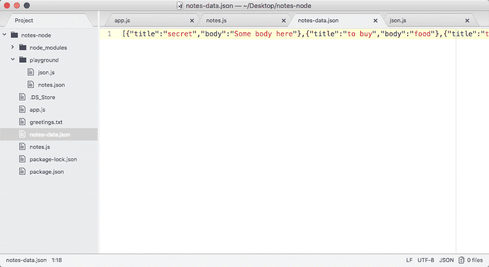

这意味着我们的 remove 方法确实如预期的那样工作。它删除了标题匹配的便笺，保留了所有标题不等于`secret2`的便笺，这正是我们想要的。

# 打印删除注释的消息

现在，我们要做的下一件事是打印一条消息，这取决于是否确实删除了一条便条。这意味着调用`removeNote`函数的`app.js`将需要知道注释是否被删除。那我们怎么知道呢？考虑到我们在`notes.js removeNotes`函数中拥有的信息，我们怎么可能返回它呢？

我们可以，因为我们有两条非常重要的信息。我们有原始 notes 数组的长度，也有新 notes 数组的长度。如果它们相等，那么我们可以假设没有删除任何注释。如果它们不相等，我们将假定一个音符被删除。这正是我们要做的。

如果`removeNote`函数返回`true`，则表示删除了便笺；如果返回`false`，则表示未删除便笺。在`removeNotes`函数中我们可以添加 return，如下代码所示。我们将检查`notes.length`是否不等于`filteredNotes.length`：

```js
var removeNote = (title) => {
  var notes = fetchNotes();
  var filteredNotes = notes.filter((note) => note.title !== title);
  saveNotes(filteredNotes);

 return notes.length !== filteredNotes.length;
};
```

如果它们不相等，它将返回`true`，这是我们想要的，因为一张便条被删除了。如果它们相等，它将返回`false`，这很好。

现在，在`app.js`的内部，我们可以在`removeNote`、`else if`块中添加几行代码，以使该命令的输出更好一些。首先要做的是存储该布尔值。我将创建一个名为`noteRemoved`的变量，并将其设置为等于返回值，结果如以下代码所示，即`true`或`false`：

```js
} else if (command == 'remove') {
  var noteRemoved = notes.removeNote(argv.title);
}
```

在下一行中，我们可以创建消息，我将使用三元运算符在一行中完成这一切。现在，三元运算符允许您指定一个条件。在我们的例子中，我们将使用一条 var 消息，它将被设置为等于条件`noteRemoved`，如果注释被删除，则为`true`，如果注释未被删除，则为`false`。

Now, the ternary operator can be a little confusing, but it's really useful inside JavaScript and Node.js. The format for the ternary operator is first we add the condition, question mark, the truthy expression to run, colon, and then the falsy expression to run.

在条件之后，我们将放置一个带问号的空格和一个空格；如果它是真的，这就是将运行的语句。如果`noteRemoved`条件通过，我们要做的是将消息设置为等于`Note was removed`：

```js
 var message = noteRemoved ? 'Note was removed' :
```

现在，如果`noteRemoved`是`false`，我们可以在前面语句中的冒号后面指定该条件。在这里，如果没有删除注释，我们将使用文本`Note not found`：

```js
var message = noteRemoved ? 'Note was removed' : 'Note not found';
```

现在有了这个，我们可以测试我们的消息了。最后一件事是使用`console.log`传入消息将消息打印到屏幕上：

```js
var noteRemoved = notes.removeNote(argv.title);
var message = noteRemoved ? 'Note was removed' : 'Note not found';
console.log(message);
```

这让我们避免了那些使我们的`else-if`子句变得不必要的复杂的`if`语句。

回到 Atom 内部，我们可以重新运行最后一个命令，在这种情况下，不会删除任何注释，因为我们已经删除了它。当我运行它时，你可以看到`Note not found`打印到屏幕上：

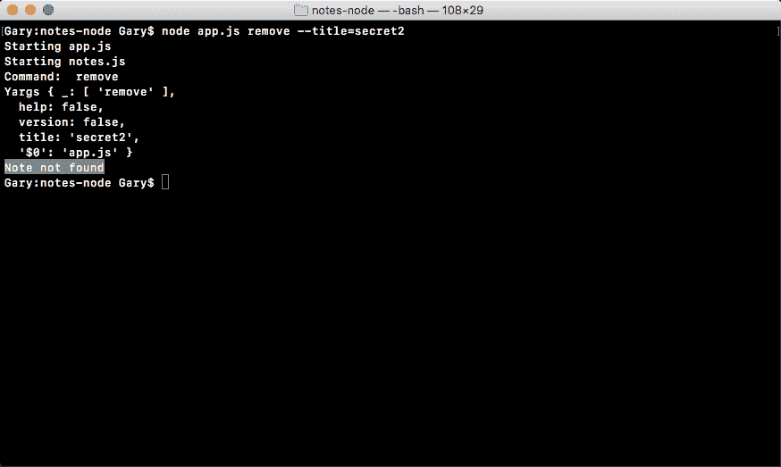

现在我将删除一个确实存在的注释；在`notes-data.json`中，我有一张标题为“秘密”的便条，如下所示：


让我们重新运行命令，从 Terminal 中的标题中删除`2`。当我运行此命令时，您可以在屏幕上看到`Note was removed`打印：

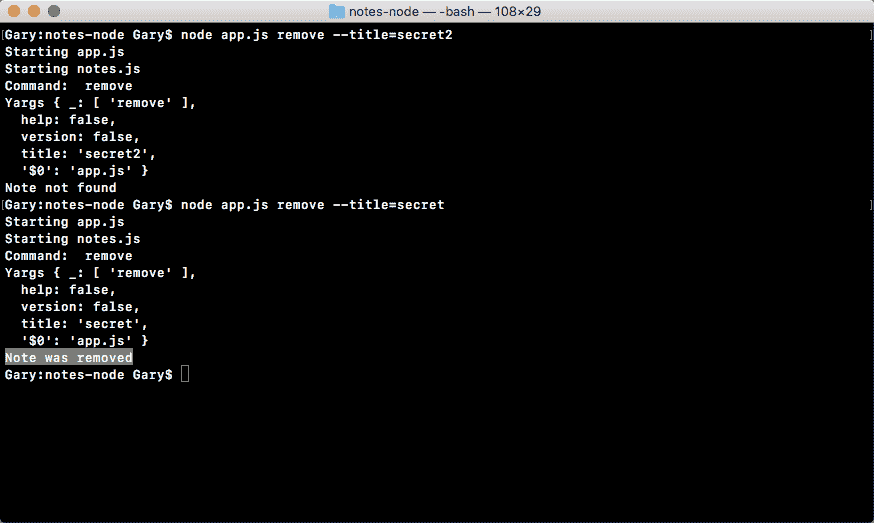

就是这个部分,；我们现在有了`remove`命令。

# 读书笔记

在本节中，您将负责填写`read`命令的其余部分。现在，`read`命令在`app.js`中确实有一个 else if 块，我们称之为`getNote`：

```js
} else if (command === 'read') {
  notes.getNote(argv.title);
```

`getNote`是在`notes.js`内部定义的，尽管目前它只是打印出一些虚拟文本：

```js
var getNote = (title) => {
  console.log('Getting note', title);
};
```

在本节中，您需要做的是连接这两个函数。

首先，您需要对来自`getNote`的返回值进行处理。如果找到 note 对象，我们的`getNote`函数将返回它。如果没有，它将返回未定义，就像我们在上一章的*添加和保存注释*一节中讨论的`addNote`一样。

存储该值后，您将使用`console.log`进行一些打印，类似于我们这里的内容：

```js
if (command === 'add') {
  var note = notes.addNote(argv.title, argv.body);
  if (note) {
    console.log('Note created');
    console.log('--');
    console.log(`Title: ${note.title}`);
    console.log(`Body: ${note.body}`);
  } else {
    console.log('Note title taken');
  }
```

显然，`Note created`将类似于`Note read`和`Note title taken`将类似于`Note not found`，但总体流程将完全相同。现在，一旦你在`app.js`中连接好，你就可以转到`notes.js`，填写函数。

现在，`notes.js`内部的功能不会那么复杂。您所需要做的就是获取注释，就像我们在前面的方法中所做的那样，然后您将使用`notes.filter`，我们将其探索为只返回标题与作为参数传入的标题匹配的注释。现在，在我们的例子中，要么是零个音符，这意味着找不到音符，要么是一个音符，这意味着我们找到了那个人想要返回的音符。

接下来，我们确实需要归还那张便条。记住`notes.filter`的返回值始终是一个数组，这一点很重要，即使该数组只有一项。您需要做的是返回数组中的第一项。如果该项不存在，那很好，它将返回 undefined，这是我们想要的。如果真的存在，很好，这意味着我们找到了便条。此方法只需要三行代码，一行用于获取，一行用于筛选，以及返回语句。现在，一旦你完成了所有这些，我们将测试它。

# 使用 getNote 函数

让我们研究一下这个方法。现在，我要做的第一件事是在`app.js`内填写一个名为 note 的变量，该变量将存储`getNote`的返回值：

```js
} else if (command === 'read') {
  var note = notes.getNote(argv.title);
```

现在，这可能是一个单独的 note 对象，也可能是未定义的对象。在下一行中，如果消息存在或不存在，我可以使用`if`语句打印消息。我将使用`if`注释，并附上`else`条款：

```js
} else if (command === 'read') {
  var note = notes.getNote(argv.title);
  if (note) {

  } else {

  }
```

如果找不到注释，本`else`条款将负责打印错误。让我们先从这个开始，因为它非常简单，`console.log`、`Note not found`，如下所示：

```js
  if (note) {

  } else {
    console.log('Note not found');  
  }
```

现在我们已经填写了`else`条款，我们可以填写 if 语句了。为此，我将打印一条小消息，`console.log ('Note found')`将完成工作。然后我们可以继续打印实际的票据细节，我们已经有了相应的代码。我们将添加连字符间隔符，然后我们有我们的注释标题和注释正文，如下所示：

```js
if (note) {
    console.log('Note found');
    console.log('--');
    console.log(`Title: ${note.title}`);
    console.log(`Body: ${note.body}`);    
  } else {
    console.log('Note not found');  
  }
```

现在我们已经完成了`app.js`的内部，我们可以进入`notes.js`文件并填写`getNote`方法，因为目前它对传入的标题没有任何作用。

在笔记里面，你需要做的是填写这三行。第一个负责取笔记。我们之前已经使用上一节中的`fetchNotes`函数完成了这项工作：

```js
var getNote = (title) => {
  var notes = fetchNotes();
};
```

现在我们已经准备好了笔记，我们可以打电话`notes.filter`，返回所有笔记。我将创建一个名为`filteredNotes`的变量，将其设置为`notes.filter`。现在，我们知道 filter 方法需要一个函数，我将定义一个箭头函数（`=>`），如下所示：

```js
var filteredNotes = notes.filter(() => {

});
```

在 arrow 函数（`=>`中，我们将获得传入的单个便笺，当便笺标题（我们在 JSON 文件中找到的便笺标题）等于时，我们将返回`true`，使用三重等于，标题：

```js
var filteredNotes = notes.filter(() => {
    return note.title === title;
  });
};
```

当注释标题匹配时返回`true`，如果不匹配则返回 false。或者，我们可以使用箭头函数，我们只有一行，如下所示，在那里我们返回一些东西；我们可以删除我们的条件，去掉大括号，然后简单地将该条件粘贴到此处：

```js
var filteredNotes = notes.filter((note) => note.title === title);
```

它有完全相同的功能，只是它要短得多，而且更容易查看。

现在我们已经有了所有的数据，我们需要做的就是返回一些东西，然后我们将返回`filteredNotes`数组中的第一项。接下来，我们将获取第一项，即索引为零，然后我们只需要使用`return`关键字返回它：

```js
var getNote = (title) => {
  var notes = fetchNotes();
  var filteredNotes = notes.filter((note) => note.title === title);
  return filteredNotes[0];
};
```

现在，有可能第一项`filteredNotes`不存在，这很好，它将返回未定义，在这种情况下，我们的 else 子句将运行，打印`Note not found`。如果有一张便条，很好，这就是我们想要打印的便条，在`app.js`中我们就这样做。

# 运行 getNote 函数

现在我们已经准备好了，我们可以通过使用`node app.js`运行我们的应用，在终端内部测试这个全新的功能。我将使用`read`命令，传入一个标题，该标题等于我知道不存在于`notes-data.json`文件标题中的某个字符串：

```js
node app.js read --title="something here"
```

当我运行命令时，我们得到`Note not found`，如图所示，这正是我们想要的：

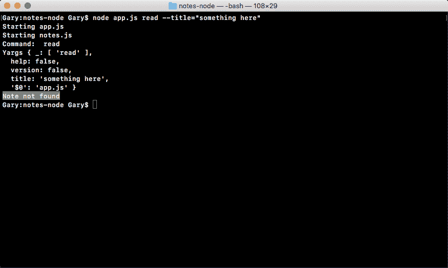

现在，如果我真的试图在有标题的地方取回一张便条，我希望那张便条会回来。

在数据文件中，我有一个标题为`to buy`的注释；让我们试着去拿那个。我将使用向上箭头键填充上一个命令，并将标题替换为`to space`，购买，然后点击*输入*：


如前一段代码所示，您可以在屏幕上看到`Note found`打印，这非常棒。`Note found`之后是我们的间隔符，接下来是标题`to buy`和正文`food`，与数据文件中显示的完全相同。有了这个，我们就完成了`read`命令。

# 干燥原理

现在，在我们结束本节之前，我还想解决一件事。在`app.js`中，我们现在在两个地方有相同的代码。我们在`add`命令和`read`命令中都有空格或标题体：

```js
if (command === 'add') {
  var note = notes.addNote(argv.title, argv.body);
  if (note) {
    console.log('Note created');
    console.log('--');
    console.log(`Title: ${note.title}`);
    console.log(`Body: ${note.body}`);
  } else {
    console.log('Note title taken');
  }
 } else if (command === 'list') {
   notes.getAll();
 } else if (command === 'read') {
   var note = notes.getNote(argv.title);
   if (note) {
     console.log('Note found');
     console.log('--');
     console.log(`Title: ${note.title}`);
     console.log(`Body: ${note.body}`);
   } else {
     console.log('Note not found');
 }
```

当您发现自己在复制和粘贴代码时，最好将其分解为两个位置都调用的函数。这就是**干燥原则**，代表**不要重复自己**。

# 使用 logNote 函数

就我们而言，我们是在重复自己。最好将其分解成一个我们可以从两个地方调用的函数。为了做到这一点，我们要做的就是在`notes.js`中创建一个名为`logNote`的函数。

现在，在`notes.js`中，在`removeNote`函数之后，我们可以将这个全新的函数变成一个名为`logNote`的变量。这将是一个接受一个参数的函数。此参数将成为 note 对象，因为我们希望打印标题和正文。如图所示，我们将期望注释被传入：

```js
var logNote = (note) => {

};
```

现在，填写`logNote`函数将非常简单，特别是当你解决一个枯燥的问题时，因为你可以简单地将重复的代码剪切掉，然后粘贴到`logNote`函数中。在本例中，变量名称已经对齐，因此无需更改任何内容：

```js
var logNote = (note) => {
  console.log('--');
  console.log(`Title: ${note.title}`);
  console.log(`Body: ${note.body}`);
};
```

现在我们有了`logNote`功能，我们可以在`app.js`中进行更改。在`app.js`中，我们删除了`console.log`语句，我们可以称之为`notes.logNote`，传入 note 对象，如下所示：

```js
else if (command === 'read') {
  var note = notes.getNote(argv.title);
  if (note) {
    console.log('Note found');
    notes.logNote(note);
  } else {
    console.log('Note not found');
 }
```

对于`add`命令`if`块，我们也可以做同样的事情。我可以删除这三条`console.log`语句，然后打电话给`notes.logNote`，传递注释：

```js
if (command === 'add') {
  var note = notes.addNote(argv.title, argv.body);
  if (note) {
    console.log('Note created');
    notes.logNote(note);
 } else {
   console.log('Note title taken');
 }
```

现在我们已经准备好了，我们可以重新运行我们的程序，希望我们看到的是完全相同的功能。

在我们重新运行程序之前要做的最后一件事是导出`notes.js`文件中`exports`模块中的`logNote`函数。`LogNote`将被导出，我们将使用 ES6 语法来实现这一点：

```js
module.exports = {
  addNote,
  getAll,
  getNote,
  removeNote,
  logNote
};
```

有了这个，我现在可以使用 up 从终端重新运行上一个命令，并点击*enter*：

```js
node app.js read --title="to buy"
```


如图所示，我们将`Note found`打印到屏幕上，标题和正文与之前一样。我还将测试`add`命令，以确保一个人在工作，`node app.js add`；我们将使用“要做的事情”的标题和“去邮局”的正文：

```js
node app.js add --title="things to do" --body="go to post office"
```

现在，当我点击*回车键时，*我们希望打印与之前`add`命令相同的日志，这正是我们得到的：


注意，我们制作了照片，我们得到了间隔，然后我们得到了标题和身体。

在下一节中，我们将介绍本书中最重要的主题之一；这就是调试。知道如何正确地调试程序将为您的 Node.js 职业生涯节省数百个小时。如果没有合适的工具，调试可能会非常痛苦，但一旦知道如何完成调试，就不会那么糟糕了，可以节省大量时间。

# 调试

在本节中，我们将使用内置的`debugger`，它看起来有点复杂，因为它在命令行内部运行。这意味着您必须使用命令行界面，这并不总是最令人愉快的。不过，在下一节中，我们将安装一个使用 ChromeDevTools 的第三方工具来调试您的Node应用。这个看起来很棒，因为 Chrome 开发工具非常棒。

# 在调试模式下执行程序

在继续之前，我们将了解到我们确实需要创建一个地方来进行调试，这将发生在游乐场文件中，因为我们将要编写的代码对`notes`应用本身并不重要。在 notes 应用中，我将创建一个名为`debugging.js`的新文件：


在`debugging.js`中，我们将从一个基本示例开始。我们将创建一个名为`person`的对象，目前我们将在该对象上设置一个属性名。设置为您的姓名，我将设置为字符串`Andrew`，如图所示：

```js
var person = {
  name: 'Andrew'
};
```

接下来我们将设置另一个属性，但在下一行中，`person.age`。我会将我的设置为与我的年龄相等，`25`：

```js
var person = {
  name: 'Andrew'
};

person.age = 25;
```

然后我们将添加另一个语句来更改名称，`person.name`等于类似`Mike`的内容：

```js
var person = {
  name: 'Andrew'
};

person.age = 25;

person.name = 'Mike';
```

最后，我们将`console.log`这个`person`对象，代码如下所示：

```js
var person = {
  name: 'Andrew'
};

person.age = 25;

person.name = 'Mike';

console.log(person);
```

现在，我们实际上已经有了一种调试形式，在这个例子中，我们有一个`console.log`语句。

当您正在经历Node应用开发过程时，您可能使用过也可能没有使用`console.log`调试您的应用。可能有些东西没有按预期工作，您需要准确地找出该变量存储在其中的内容。例如，如果你有一个解决数学问题的函数，可能在函数的某个部分，方程是错误的，你得到的结果不同。

使用`console.log`可能是一种非常好的方法，但它非常有限。我们可以通过从终端运行它来查看，我将为此运行以下命令：

```js
node playground/debugging.js
```

当我运行文件时，我会将我的对象打印到屏幕上，这很好，但是，正如你所知道的，如果你想调试`person`对象之外的东西，你必须添加另一条`console.log`语句才能这样做。

假设你有一个类似于我们的`app.js`文件的东西，你想看看命令等于什么，然后你想看看`argv`等于什么，添加和删除这些`console.log`语句可能需要很多时间。有一种更好的调试方法。这是在使用Node`debugger`。现在，在我们对项目进行任何更改之前，我们先来看看`debugger`在终端内部是如何工作的，正如我在本节开头警告您的，内置Node`debugger`虽然有效，但有点难看，难以使用。

不过，现在我们将以大致相同的方式运行应用，只是这次我们将键入`node inspect`。Node debug 将以与常规 Node 命令完全不同的方式运行我们的应用。我们在游乐场文件夹中运行同一个文件，名为`debugging.js`：

```js
node inspect playground/debugging.js
```

当你点击*回车键时，*你会看到这样的画面：

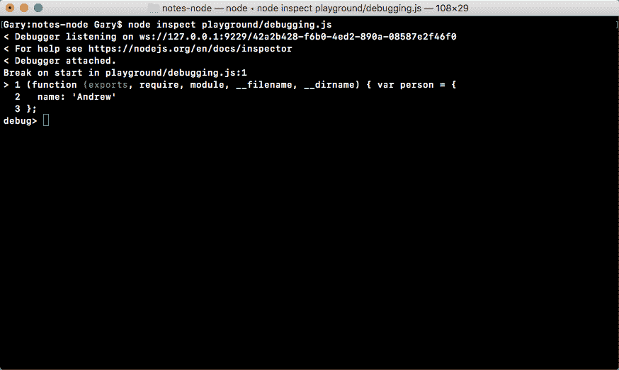

在输出中，我们可以忽略前两行。这本质上意味着`debugger`设置正确，可以在后台收听应用的运行。

接下来，我们在第一行的操场上进行了第一次换行调试，紧接着你可以看到第一行旁边有一个小插入符号（`>`。当您第一次以调试模式运行应用时，它会在执行第一条语句之前暂停。当我们在像第 1 行这样的行上暂停时，这意味着该行还没有执行，所以此时我们甚至没有`person`变量。

现在，正如您在前面的代码中看到的，我们还没有返回到命令行，Node仍在等待输入，我们可以运行一些不同的命令。例如，我们可以运行`n`，它是 next 的缩写。您可以键入`n`，点击*输入*，然后进入下一条语句。

我们拥有的下一条语句，第一行的语句，已经执行，所以`person`变量确实存在。然后我可以再次使用`n`进入下一个语句，在这里我们声明`person.name`属性，将其从`Andrew`更新为`Mike`：


请注意，此时，年龄确实存在，因为该行已经执行。

现在，`n`命令在您的整个程序中逐语句执行。如果你意识到你不想在整个程序中这样做，这可能需要很多时间，你可以使用`c`。`c`命令是**Continue**的缩写，它一直持续到程序的最后。在下面的代码中，您可以看到我们的`console.log`语句运行名称`Mike`和年龄`25`：

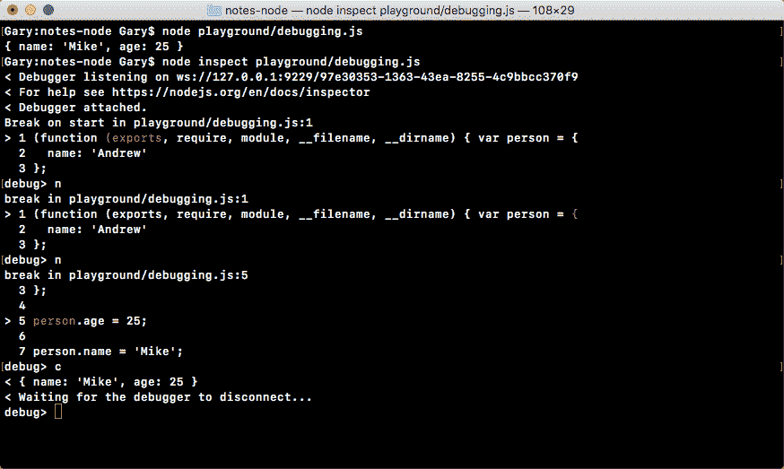

这是一个如何使用`debug`关键字的快速示例。

现在，我们实际上没有进行任何调试，我们只是运行了这个程序，因为它在编写这些命令方面有点陌生，比如 next 和 continue，我决定在不进行调试的情况下进行一次试运行。您可以使用*控件*+*C*退出`debugger`返回终端。

我将使用`clear`清除所有输出。现在我们有了一个基本的想法，关于如何在 Apple T1 模式中执行程序，让我们来看看我们实际上可以做一些调试。

# 使用调试

我将使用向上箭头键重新运行程序两次，以返回Node`debug`命令。然后，我将运行程序，我将点击下一步两次，`n`和`n`：


在这个时间点上，我们在第七行，也就是目前断线的地方。在这里，我们可以使用名为`repl`的命令进行一些调试，该命令表示**读取-评估-打印循环**。在我们的例子中，`repl`命令将您带到`debugger`的一个完全独立的区域。当您点击它时，您基本上处于Node控制台中：

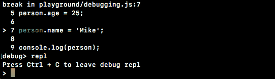

您可以运行任何Node命令，例如，我可以使用`console.log`打印类似于`test`的内容，测试就在那里打印。

我可以做一个等于`1`加`3`的变量`a`，然后我可以引用`a`，我可以看到它等于`4`，如图所示：


更重要的是，我们可以访问当前的程序，也就是说，在执行第七行之前。我们可以用它打印出`person`，如下代码所示，您可以看到此人的名字是`Andrew`，因为第七行没有执行，年龄是`25`，与程序中显示的完全一样：


这就是调试真正有用的地方。能够查看在某个时间点暂停的程序将非常容易发现错误。我可以做任何我想做的事情，我可以打印出`person`name 属性，然后将`Andrew`打印到屏幕上，如下所示：


现在，我们仍然有这个问题。我必须通过程序点击下一个。当你有一个很长的程序时，在你达到你所关心的点之前，可能需要运行成百上千条语句。显然，这并不理想，因此我们将寻找更好的方法。

让我们使用*控件*+*C 退出`repl`；*现在我们回到`debugger`。

从这里开始，我们将对`debugging.js`中的应用进行快速更改。

假设我们想暂停 person age 属性更新和 person name 属性更新之间的第七行。为了暂停，我们要做的是运行语句`debugger`：

```js
var person = {
  name: 'Andrew'
};

person.age = 25;

debugger;

person.name = 'Mike';

console.log(person);
```

当您有一个与上一条完全相同的`debugger`语句时，它会告诉Node`debugger`停止在这里，这意味着您可以使用`c`（继续），而不是使用`n`（下一条）逐个语句，它将继续，直到程序退出或看到`debugger`关键字之一。

现在，在终端，我们将像以前一样重新运行程序。这一次，我们将使用`c`继续，而不是两次点击`n`：

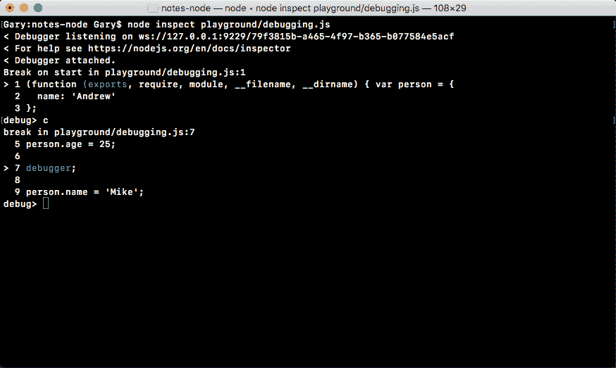

现在，当我们第一次使用`c`时，它进入程序末尾，打印出我们的对象。这一次，它将继续运行，直到找到`debugger`关键字。

现在，我们可以使用`repl`，访问我们喜欢的任何东西，例如`person.age`，如下代码所示：

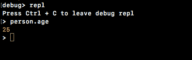

调试完成后，我们可以退出并继续执行程序。同样，我们可以使用*控件*+*C*退出`repl`和`debugger`。

所有真正的调试几乎都是使用`debugger`关键字进行的。你把它放在你想放在程序的任何地方，在调试模式下运行程序，最后它到达`debugger`关键字，你做了一些事情。例如，您研究一些变量值，运行一些函数，或者使用代码查找错误。没有人真正使用`n`通过程序打印，找到导致问题的行。这需要太多的时间，而且不现实。

# 在 notes 应用中使用调试器

既然您对`debugger`有了一点了解，我希望您在我们的 notes 应用中使用它。我们将在`notes.js`中做的是在`logNote`函数中添加`debugger`语句作为函数的第一行。然后，我将在调试模式下运行程序，传入一些将导致`logNote`运行的参数；例如，在阅读一张便条时，在取出便条后，它将调用`logNote`。

现在，一旦我们在`logNote`函数中有了`debugger`关键字，并使用这些参数在调试模式下运行它，程序应该在这一点停止。一旦程序以调试模式启动，我们将使用`c`继续，它将暂停。接下来，我们将打印出 note 对象，并确保它看起来正常。然后，我们可以退出`repl`和`debugger`。

现在，我们首先在这里添加`debugger`语句：

```js
var logNote = (note) => {
  debugger;
  console.log('--');
  console.log(`Title: ${note.title}`);
  console.log(`Body: ${note.body}`);
};
```

我们可以保存文件，现在我们可以进入终端；不需要在我们的应用中执行任何其他操作。

在终端内部，我们将运行我们的`app.js`文件`node debug app.js`，因为我们希望在调试模式下运行程序。然后我们可以传入参数，比如说`read`命令，我将传入一个标题，`"to buy"`，如下所示：

```js
node debug app.js read --title="to buy"
```

在这种情况下，我有一个标题为`"to buy"`的注释，如下所示：

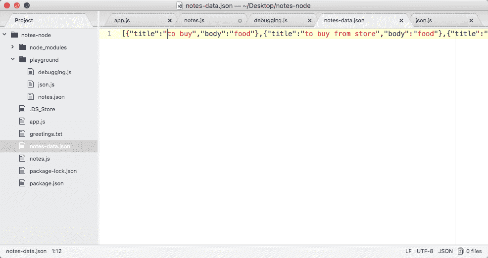

现在，当我运行前面的命令时，它将在第一条语句运行之前暂停，这是预期的：


我现在可以使用`c`继续完成程序。它将运行尽可能多的语句来结束程序或找到`debugger`关键字，如下面的代码所示，您可以看到`debugger`被找到，并且我们的程序已在`notes.js`的`49`行停止：

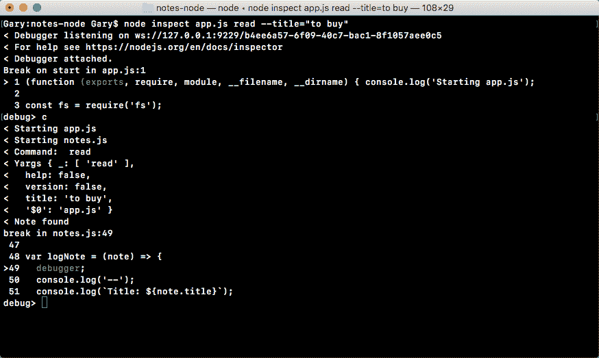

这正是我们想要做的。现在，从这里开始，我将进入`repl`并打印出 note 参数，如下面的代码所示，您可以看到我们有标题为`to buy`和正文为`food`的 note：

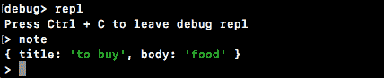

现在，如果这句话有错误，可能是错误的东西被打印到了屏幕上，这会给我们一个很好的解释。传递到`note`中的任何内容显然都在`console.log`语句中使用，因此，如果打印内容有问题，则很可能是传递到`logNote`函数中的内容有问题。

现在我们已经打印了`note`变量，可以关闭`repl`，使用*控制*+*C*或`quit`退出`debugger`。

现在我们回到常规终端，我们已经成功地完成了Node应用内部的调试。在下一节中，我们将研究一种做同样事情的不同方法，一种具有更好的图形用户界面的方法，我发现它更易于导航和使用。

# 上市说明

现在，我们已经在调试方面取得了一些惊人的进展，让我们回到应用的命令，因为只有一个需要填写（我们分别在[第 3 章](03.html)、*Node基础知识-第 2 部分*和本章中介绍了`add`、`read`和`remove`命令）。这是`list`命令，这将非常简单，在`list`命令的情况下没有什么复杂的事情发生。

# 使用 getAll 函数

为了开始，我们需要做的就是填写 list notes 函数，在本例中，我们调用了`getAll`。`getAll`功能负责返回每一张票据。这意味着它将返回一个对象数组，一个包含所有注释的数组。

我们所要做的就是返回`fetchNotes`，如下所示：

```js
var getAll = () => {
  return fetchNotes();
}
```

无需过滤，无需操作数据，只需将数据从`fetchNotes`传回`getAll`。现在我们已经准备好了，我们可以在`app.js`的内部填写功能。

我们必须创建一个可以存储注释的变量，我本来打算称之为 notes，但我可能不应该这样做，因为我们已经声明了一个 notes 变量。我将创建另一个名为`allNotes`的变量，将其设置为等于`getAll`的返回值，我们知道这是因为我们刚刚填写了返回所有注释：

```js
else if (command === 'list') {
  var allNotes = notes.getAll();
}
```

现在我可以使用`console.log`来打印一条小消息，我将使用模板字符串，这样我就可以输入将要打印的注释的实际数量。

在模板字符串中，我将添加`Printing`，然后添加使用`$`（美元）符号和大括号的注释数`allNotes.length`：即数组的长度，后跟括号中带有`s`的注释，以处理单数和复数情况，如以下代码块所示：

```js
else if (command === 'list') {
  var allNotes = notes.getAll();
  console.log(`Printing ${allNotes.length} note(s).`);
}
```

所以，如果有六个音符，它会说打印六个音符。

现在我们已经准备好了，我们必须开始实际打印每个音符的过程，这意味着我们需要为`allNotes`数组中的每个项目调用`logNote`一次。为此，我们将使用`forEach`，这是一种类似于过滤器的数组方法。

过滤器允许您通过返回`true`或`false`来操作数组以保留项目或移除项目；`forEach`只需为数组中的每个项调用一次回调函数。在这种情况下，我们可以使用`allNotes.forEach`，传入回调函数。现在，在我们的例子中，这个回调函数将是一个箭头函数（`=>`，它将被`note`变量调用，就像过滤器一样。我们只调用`notes.logNote`，传入`note`参数，就在这里：

```js
else if (command === 'list') {
  var allNotes = notes.getAll();
  console.log(`Printing ${allNotes.length} note(s).`);
  allNotes.forEach((note) => {
    notes.logNote(note);
  });
}
```

现在我们已经准备好了，我们可以通过添加`logNote`调用来简化它，如下所示：

```js
else if (command === 'list') {
  var allNotes = notes.getAll();
  console.log(`Printing ${allNotes.length} note(s).`);
  allNotes.forEach((note) => notes.logNote(note));
}
```

这是完全相同的功能，仅使用表达式语法。现在我们已经准备好了箭头函数（`=>`），我们将为 all notes 数组中的每个项目调用`notes.logNote`一次。让我们保存`app.js`文件，并在终端上进行测试。

为了测试`list`命令，我将使用`node app.js`和`list`命令。无需传入任何参数：

```js
node app.js list
```

当我运行这个时，我得到了`Printing 3 note(s)`，然后我得到了我的`3 notes to buy`、`to buy from store`和`things to do`，如下面的代码输出所示，这非常棒：


有了它，我们所有的命令现在都可以工作了。我们可以添加注释、删除注释、读取单个注释，并列出存储在 JSON 文件中的所有注释。

继续下一节，我想清理一些命令。在`app.js`和`notes.js`中，我们有一些`console.log`语句正在打印出一些我们不再需要的东西。

在`app.js`的最顶端，我将删除`console.log('Starting app.js')`语句，使常量`fs`成为第一行。

我还将删除两条语句：`console.log('Command: ', command)`和`console.log('Yargs', argv)`用于打印命令和`yargs`变量值。

在`notes.js`中，我还将删除该文件顶部的`console.log('Stating notes.js')`语句，因为它不再是必需的，将常量`fs`放在顶部。

当我们第一次开始探索不同的文件时，它确实很有用，但是现在我们已经准备好了一切，没有必要了。如果我重新运行`list`命令，这次您可以看到它看起来干净多了：


`Printing three notes`是出现的第一行。有了这个，我们就完成了我们的命令。

在下一节中，我们将更深入地了解如何配置 yargs。这将使我们需要命令的某些参数。因此，如果有人试图添加没有标题的注释，我们可以警告用户并阻止程序执行。

# 高级码

在我们进入关于 yargs 的高级讨论之前，首先，我想调出 yargs 文档，以便您至少知道关于 yargs 的信息来自哪里。你可以通过谷歌搜索`npm yargs`得到它。我们将转到 npm 上的 yargs 包页面。这有关于 yargs 的文件，如下所示：


现在 yargs 文档没有目录，这使得导航有点困难。它从一些不按任何特定顺序排列的示例开始，然后最终进入一个列出所有可用方法的列表，这就是我们要寻找的。

所以我将使用*命令*+*F*（*C**trl*+*F*）来搜索页面中的方法，如下面的屏幕截图所示，我们得到了我们正在寻找的方法头：

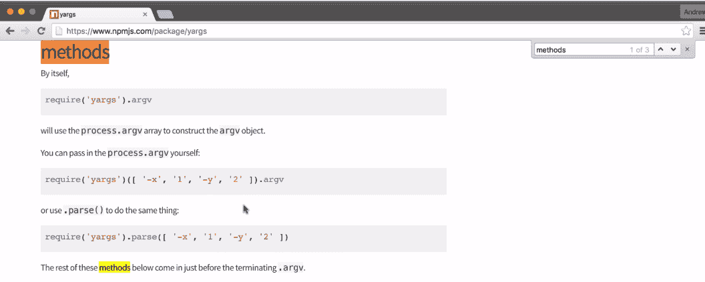

如果你在页面上向下滚动，我们会看到一个按字母顺序排列的列表，上面列出了你在 yargs 中可以访问的所有方法。我们特别寻找`.command`；这是我们可以用来配置所有四个命令的方法：`add`、`read`、`remove`和`list`注释：

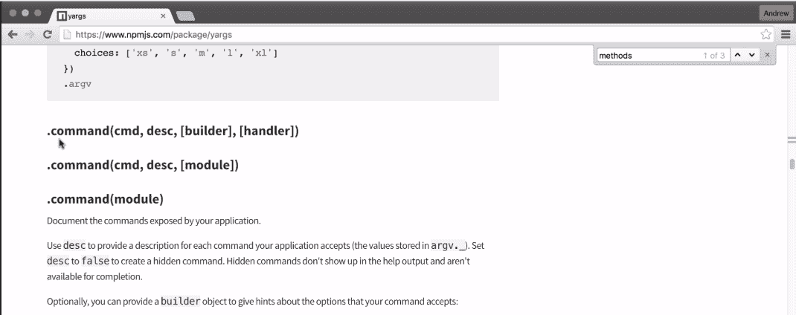

我们将指定它们需要哪些选项，如果有的话，我们还可以设置描述和帮助功能。

# 在 yargs 上使用链接语法

现在为了开始，我们需要在`app.js`内部进行一些更改。我们将从`add`命令开始（有关更多信息，请参阅上一章中的*添加和保存注释*部分）。

我们想在`app.js`中的`argv`函数中添加一些有用的信息，这将：

*   让 yargs 验证`add`命令是否正确运行，以及
*   让用户知道`add`命令将如何执行

现在我们将链接属性调用，这意味着在访问`.argv`之前，我想调用`.command`，然后我将调用`.argv`命令的返回值，如下所示：

```js
const argv = yargs
  .command()
  .argv;
```

现在，如果您使用过 jQuery，那么这种链接语法可能看起来很熟悉，它支持许多不同的库。一旦我们在`yargs`上调用`.command`，我们将传入三个参数。

第一个是命令名，用户将如何在终端中输入它，在我们的例子中，它将是`add`：

```js
const argv = yargs
  .command('add')
  .argv;
```

然后我们将传入另一个字符串，这将是对命令作用的描述。这将是一种英文可读的描述，用户可以通过阅读了解天气情况，这是他们想要运行的命令：

```js
const argv = yargs
  .command('add', 'Add a new note')
  .argv;
```

下一个将是一个对象。这将是 options 对象，它允许我们指定这个命令需要的参数。

# 调用.help 命令

现在，在我们进入选项对象之前，让我们在命令之后再添加一个调用。我们将调用`.help`，这是一个方法，所以我们将把它作为函数调用，不需要传入任何参数：

```js
const argv = yargs
  .command('add', 'Add a new note', {

  })
  .help()
  .argv;
```

当我们添加此帮助调用时，它会设置`yargs`，以便在有人运行程序时返回一些真正有用的信息。例如，我可以使用`help`标志运行`node app.js`命令。添加了`help`标志是因为我们调用了该帮助方法，当我运行该程序时，您可以看到我们提供的所有选项：

```js
node app.js --help
```

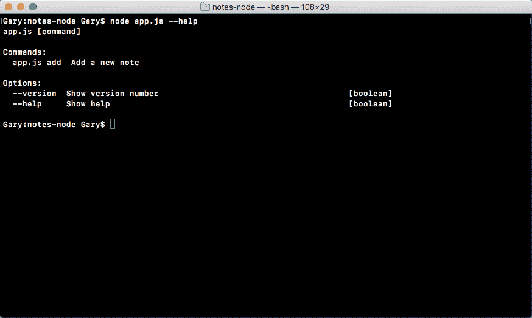

如前面的输出所示，我们有一个命令`add Add a new note`，当前命令有一个`help`选项`help`。如果我们使用`help`运行`node app.js add`命令，则同样适用，如下所示：

```js
node app.js add --help
```

在这个输出中，我们可以查看`add`命令的所有选项和参数，在本例中，这些选项和参数碰巧是无的，因为我们没有设置它们：

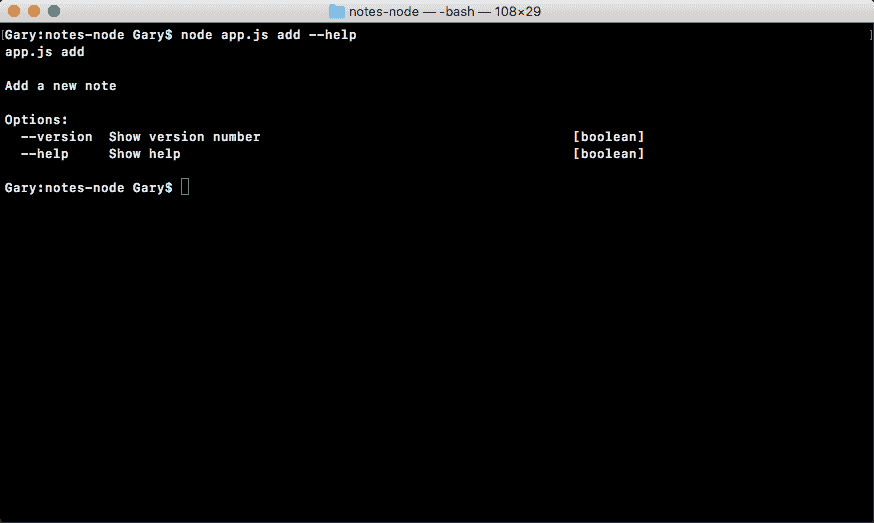

# 添加选项对象

让我们在 Atom 内部添加选项和参数。为了添加属性，我们将更新 options 对象，其中键是属性名称，无论是标题还是正文，值是另一个对象，它允许我们指定该属性的工作方式，如下所示：

```js
const argv = yargs
  .command('add', 'Add a new note', {
    title: {

    }
  })
  .help()
  .argv;
```

# 添加标题

在 title 的情况下，我们将在左侧添加 title，并将 options 对象放在右侧。在标题中，我们将配置三个属性`describe`、`demand`和`alias`：

`describe`属性将被设置为一个字符串，这将描述为标题传递的内容。在这种情况下，我们可以使用`Title of note`：

```js
const argv = yargs
  .command('add', 'Add a new note', {
    title: {
      describe: 'Title of note'
    }
  })
  .help()
  .argv;
```

接下来我们配置`demand`。它将告诉 yarg 是否需要这个论点。`demand`默认为`false`，我们将其设置为`true`：

```js
const argv = yargs
  .command('add', 'Add a new note', {
    title: {
      describe: 'Title of note',
      demand: true
    }
  })
  .help()
  .argv;
```

Now if someone tries to run the add command without the title, it's going to fail, and we can prove this. We can save `app.js`, and in Terminal, we can rerun our previous command removing the `help` flag, and when I do that, you see we get a warning, `Missing required argument: title` as shown here:


Notice that in the output the title argument, is `Title of note`, which is the describe string we used, and it's `required` on the right side, letting you know that you have to provide a title when you're calling that `add` command.

与`describe`和`demand`一起，我们将提供第三个选项，称为`alias`。`alias`允许您提供快捷方式，因此您不必键入`--title`；您可以将别名设置为单个字符，如`t`：

```js
const argv = yargs
  .command('add', 'Add a new note', {
    title: {
      describe: 'Title of note',
      demand: true,
      alias: 't'
    }
  })
  .help()
  .argv;
```

完成后，现在可以使用新语法在终端中运行命令。

让我们运行 add 命令`node app.js add`，而不是`--title`。我们将使用`-t`，这是标志版本，我们可以将其设置为我们喜欢的任何值，例如`flag title`将是标题，`--body`将被设置为等于`body`，如下代码所示。请注意，我们尚未设置 body 参数，因此没有`alias`：

```js
node app.js add -t="flag title" --body="body"
```

如果我运行这个命令，一切都会正常工作。标志标题显示在它应该显示的位置，尽管我们使用了别名版本，即字母`t`，如下所示：


# 添加主体

现在我们已经配置了标题，我们可以对主体执行完全相同的操作。我们将指定 options 对象，并提供这三个参数：`describe`、`demand`和`body`的`alias`：

```js
const argv = yargs
  .command('add', 'Add a new note', {
    title: {
      describe: 'Title of note',
      demand: true,
      alias: 't'
    },
    body: {

 }
  })
  .help()
  .argv;
```

第一个是`describe`，那个很简单。`describe`将被设置为一个字符串，在这种情况下`Body of note`将完成作业：

```js
const argv = yargs
  .command('add', 'Add a new note', {
    title: {
      describe: 'Title of note',
      demand: true,
      alias: 't'
    },
    body: {
      describe: 'Body of note'
    }
  })
  .help()
  .argv;
```

下一个是`demand`，要添加注释，我们需要一个`body`。所以我们将`demand`设置为`true`，就像我们之前对`title`所做的一样：

```js
const argv = yargs
  .command('add', 'Add a new note', {
    title: {
      describe: 'Title of note',
      demand: true,
      alias: 't'
    },
    body: {
      describe: 'Body of note'
      demand: true
    }
  })
  .help()
  .argv;
```

最后但并非最不重要的是`alias`。`alias`将被设置为一个字母，我将用字母`b`表示`body`：

```js
const argv = yargs
  .command('add', 'Add a new note', {
    title: {
      describe: 'Title of note',
      demand: true,
      alias: 't'
    },
    body: {
      describe: 'Body of note'
      demand: true,
      alias: 'b'
    }
  })
  .help()
  .argv;
```

有了这个，我们现在可以保存`app.js`，在终端内部，我们可以花一点时间使用`help`标志重新运行`node app.js add`：

```js
node app.js add --help
```

当我们运行这个命令时，我们现在应该看到 body 参数出现了，您甚至可以看到它显示了标志版本，如下面的输出所示，别名`-b`（`Body of note`），它是必需的：


现在我将运行`node app.js add`传入两个参数`t`。我将其设置为`t`，而`b`将其设置为`b`。

当我运行该命令时，一切正常：

```js
node app.js add -t=t -b=b
```


如前面的输出屏幕截图所示，创建了一个新注释，标题为`t`，正文为`b`。至此，我们已经成功地完成了`add`命令的设置。我们有`add`命令标题、描述和指定该命令参数的块。现在我们还有三个命令需要`add`支持，所以让我们开始吧。

# 添加对读取和删除命令的支持

在下一行中，我将再次调用`.command`，传递命令名。让我们先执行`list`命令，因为这个命令非常简单，不需要参数。然后我们将传入对`list`命令`List all notes`的描述，如下所示：

```js
.command('list', 'List all notes')
.help()
.argv;
```

下一步，我们将再次调用命令。这次我们将为`read`执行命令。`read`命令读取单个注释，因此对于`read`命令的描述，我们将使用类似于`Read a note`的内容：

```js
.command('list', 'List all notes')
.command('read', 'Read a note')
.help()
.argv;
```

现在，`read`命令确实需要 title 参数。这意味着我们需要提供选项对象。我将从`add`命令中获取`title`并复制它，然后将其粘贴到`read`命令选项对象中：

```js
.command('list', 'List all notes')
.command('read', 'Read a note', {
  title: {
    describe: 'Title of note',
    demand: true,
    alias: 't'
  }
})
.help()
.argv;
```

正如您可能刚刚注意到的，我们重复了代码。标题配置刚刚被复制并粘贴到多个位置。如果这是干的，如果它在一个变量中，我们可以在两个位置，在`add`和`read`命令中引用它，那就太好了。

将调用`remove`的命令，就在我们调用`read`命令的地方。现在，`remove`命令将有一个描述。我们将坚持使用类似于`Remove a note`的简单方法，并将提供一个选项对象：

```js
.command('remove', 'Remove a note', {

})
```

现在我可以添加与`read`命令相同的选项对象。但是，在这个 options 对象中，我将 title 设置为`titleOptions`，如下所示，以避免代码重复：

```js
.command('remove', 'Remove a note', {
  title: titleOptions
})
```

# 添加 titleOption 和 bodyOption 变量

现在我还没有创建`titleOptions`对象，所以代码目前会失败，但这是一般的想法。我们希望创建一次`titleOptions`对象，并在使用它的所有位置引用它，用于`add`、`read`和`remove`命令。我可以取`titleOptions`，为`read`和`add`命令添加，如下图：

```js
.command('add', 'Add a new note', {
  title: titleOptions,
  body: {
    describe: 'Body of note',
    demand: true,
    alias: 'b'
  }
})
.command('list', 'List all notes')
.command('read', 'Read a note', {
  title: titleOptions
})
.command('remove', 'Remove a note', {
title: titleOptions
})
```

现在，就在常量`argv`之前，我可以创建一个名为`titleOptions`的常量，我可以将它设置为我们之前为`add`和`read`命令定义的对象，即`describe`、`demand`和`alias`，如下所示：

```js
const titleOptions = {
  describe: 'Title of note',
  demand: true,
  alias: 't'
};
```

我们现在已经准备好了`titleOptions`，这将按预期工作。我们拥有与之前完全相同的功能，但现在我们在一个单独的对象中有了`titleOptions`，它遵循了我们在*阅读笔记*一节中讨论的干燥原理。

现在，我们也可以对身体做同样的事情。这似乎有些过分，因为我们只在一个位置使用它，但如果我们坚持将它们分解成变量的模式，我也会在身体的情况下使用它。在`titleOptions`常量之后，我可以创建常量`bodyOptions`，将其设置为我们在主体中定义的选项对象，用于上一小节中的`add`命令：

```js
const bodyOptions = {
  describe: 'Body of note',
  demand: true,
  alias: 'b'
};
```

有了这些，我们现在就完成了。我们有`add`、`read`和`remove`，它们的参数都是参照定义的`titleObject`和`bodyObject`变量设置的。

# 测试 remove 命令

让我们在终端中测试一下`remove`命令。我将使用`node app.js list`列出我的笔记，这样我可以看到我必须删除哪些笔记：

```js
node app.js list
```

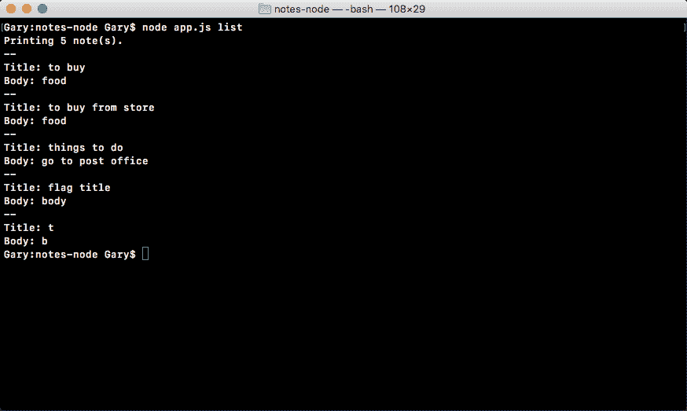

我将使用`node app.js remove`命令和我们的标志`"t"`来`remove`标题为`t`的便笺：

```js
node app.js remove -t="t"
```

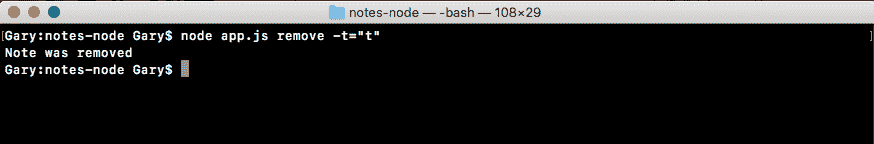

我们将删除标题为`t`的便笺，如前所示，`Note was removed`将打印到屏幕上。如果我使用向上箭头键两次，我可以再次列出注释，您可以看到标题为`t`的注释确实消失了：

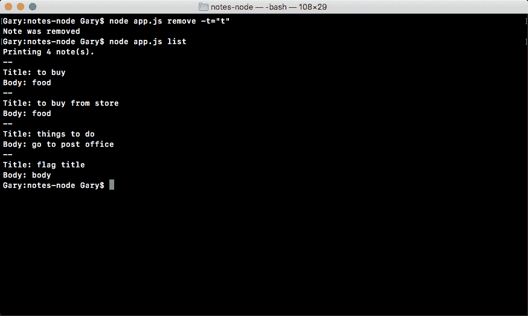

让我们使用`node app.js remove`命令再删除一个注释。这次我们将使用`--title`，这是参数名称，我们将`remove`的注释具有标题标志 title，如以下代码所示：


当我删除它时，它显示为`Note was removed`，如果我重新运行`list`命令，我可以看到我们还有三个注释，注释确实被删除了，如下所示：


这就是 notes 应用。

# 箭头函数

在本节中，您将学习箭头函数的输入和输出。这是 ES6 的一个特性，我们已经对它进行了一些研究。在`notes.js`中，我们在一些基本示例中使用它来创建`fetchNotes`和`saveNotes`等方法，我们还将其传递到一些数组方法中，如 filter，对于每个数组，我们将其用作回调函数，数组中的每个项都会调用一次。

现在，如果你试图用箭头函数替换程序中的所有函数，它很可能不会像预期的那样工作，因为两者之间存在一些差异，了解这些差异是非常重要的，因此，您可以决定使用常规 ES5 函数或 ES6 箭头函数。

# 使用箭头函数

本节的目标是为您提供做出选择的知识，我们将首先在游乐场文件夹中创建一个名为`arrow-function.js`的新文件：

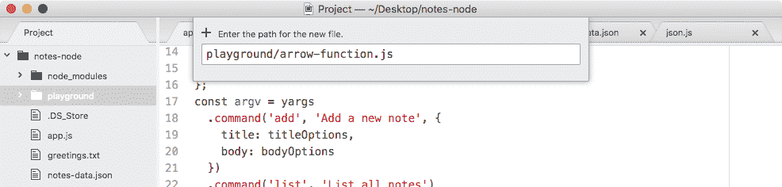

在这个文件中，我们将使用一些示例，介绍箭头函数的一些微妙之处。在我们在文件中键入任何内容之前，我将使用`nodemon`启动此文件，因此每次我们进行更改时，它都会在终端中自动刷新。

如果您还记得，`nodemon`是我们在[第 2 章](02.html)*Node基础-第 1 部分中安装的实用程序。*这是一个全球 npm 模块。`nodemon`是要运行的命令，然后我们只需像传递任何其他Node命令一样传递文件路径。当我们进入`playground`文件夹时，文件本身被称为`arrow-function.js`，我们将运行以下命令：

```js
nodemon playground/arrow-function.js
```

我们将运行该文件，屏幕上不会打印任何内容，如以下输出所示，除了`nodemon`日志之外，因为文件中没有任何内容：

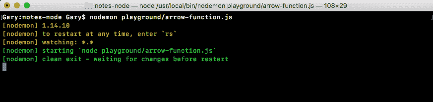

首先，在`arrowfunction.js`文件中，我们将创建一个名为 square 的函数，方法是创建一个名为 square 的变量并将其设置为 arrow 函数。

为了实现 arrow 函数（`=>`，我们将首先在括号内提供参数。因为我们将对一个数字求平方，所以我们只需要一个数字，我将该数字称为`x`。如果我通过 3 分，我预计会有 9 分回来，如果我通过 9 分，我预计会有 81 分回来。

在参数列表之后，我们必须通过将等号和大于号符号放在一起，将箭头放在箭头函数（`=>`中），创建我们漂亮的小箭头。从这里，我们可以在大括号内提供我们想要执行的所有语句：

```js
var square = (x) => {

};
```

接下来，我们可能会创建一个名为 result 的变量，将其设置为`x`乘以`x`，然后我们可能会使用`return`关键字返回结果变量，如下所示：

```js
var square = (x) => {
  var result = x * x;
  return result;
};
```

现在，显然这可以在一行上完成，但这里的目标是说明当您使用语句箭头函数（`=>`时，您可以在这些花括号之间插入任意多行。让我们调用一个正方形，我们将使用`console.log`这样我们可以将结果打印到屏幕上。我会打电话给广场；我们将使用`9`调用 square，`9`的 square 将是`81`，因此我们希望`81`能够打印到屏幕上：

```js
var square = (x) => {
  var result = x * x;
  return result;
};
console.log(square(9));
```

我将保存箭头函数（`=>`文件，在终端中，`81`如我们所料显示：

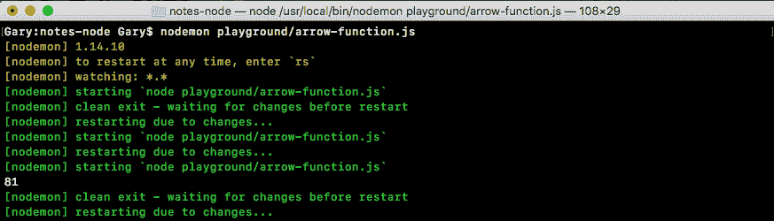

现在，我们在上一个示例中使用的语法是 arrow 函数（`=>`）的语句语法。我们前面还探讨了表达式语法，它允许您在返回一些表达式时简化箭头函数。在这种情况下，我们需要做的就是指定要返回的表达式。在我们的例子中，这是`x`乘以`x`：

```js
var square = (x) => x * x;
console.log(square(9));
```

您不需要显式添加`return`关键字。当您在没有花括号的情况下使用箭头函数（`=>`时，它会隐式地提供给您。这意味着我们可以保存前面所示的函数，并将完全相同的结果打印到屏幕上，`81`显示。

这是箭头函数的最大优点之一，当您在过滤器或我们在`notes.js`文件中所做的情况下使用箭头函数时。它可以简化代码，使所有内容保持在一行，并使代码更易于维护和扫描。

Now, there is one thing I want to note: when you have an arrow function (`=>`) that has just one argument, you can actually leave off the parentheses. If you have two or more arguments, or you have zero arguments, you are going to need to provide the parentheses, but if you just have one argument, you can reference it with no parentheses.

如果在这种状态下保存文件，`81`仍会打印到屏幕上；这很好，我们有一个更简单的箭头函数（`=>`：


现在我们有了一个基本的例子，我想继续讨论一个更复杂的例子，它将探索常规函数和箭头函数之间的细微差别。

# 探索正则函数和 arrow 函数之间的差异

为了说明区别，我将创建一个名为`user`的变量，它将是一个对象。在这个对象上，我们将指定一个属性 name。将名称设置为字符串，即您的名称，在本例中，我将其设置为字符串`Andrew`：

```js
var user = {
  name: 'Andrew'
};
```

然后我们可以在`user`对象上定义一个方法。在 name 之后，我将提供方法`sayHi`，将其设置为不带任何参数的 arrow 函数（`=>`）。目前，我们将保持箭头函数非常简单：

```js
var user = {
  name: 'Andrew',
  sayHi: () => {

  }
};
```

我们在`sayHi`中所要做的就是使用`console.log`在模板字符串`Hi`中打印到屏幕上：

```js
var user = {
  name: 'Andrew',
  sayHi: () => {
    console.log(`Hi`);
  }
};
```

我们还没有使用模板字符串，但稍后会使用，所以我将在这里使用它们。在用户对象下面，我们可以通过调用`user.sayHi`来测试`sayHi`：

```js
var user = {
  name: 'Andrew',
  sayHi: () => {
    console.log(`Hi`);
  }
};
user.sayHi();
```

我将调用它，然后保存文件，我们希望`Hi`打印到屏幕上，因为我们的箭头函数（`=>`所做的就是使用`console.log`打印静态字符串。在这种情况下，不会产生任何问题；您可以将常规函数替换为箭头函数（`=>`），而不会出现问题。

现在，使用箭头函数时会出现的第一个问题是，箭头函数不绑定`this`关键字。因此，如果您在函数中使用`this`，那么当您将其换成箭头函数（`=>`）时，它将不起作用。现在，`this`绑定；指的是父绑定，在我们的例子中没有父函数，因此这将指的是全局`this`关键字。现在我们有了不使用`this`的`console.log`，我将把它换成使用`this`的箱子。

我们会在`Hi`之后加上句号，我会说我是，然后是名字，我们通常可以通过`this.name`访问：

```js
var user = {
  name: 'Andrew',
  sayHi: () => {
    console.log(`Hi. I'm ${this.name}`);
  }
};
user.sayHi();
```

如果我试图运行这段代码，它将无法按预期工作；我们将得到`Hi`我在屏幕上进行未定义的打印，如下所示：


为了解决这个问题，我们将研究一种替代箭头函数的语法，当您定义对象文字时，它非常有用，就像我们在本例中所做的那样。

在`sayHi`之后，我将使用不同的 ES6 特性创建一个名为`sayHiAlt`的新方法。ES6 为我们提供了一种在对象上创建方法的新方法；提供方法名`sayHiAlt`，然后右键转到括号，跳过冒号。也不需要 function 关键字，即使它是一个常规函数，但它不是箭头函数（`=>`。然后我们继续讨论我们的花括号，如下所示：

```js
var user = {
  name: 'Andrew',
  sayHi: () => {
    console.log(`Hi. I'm ${this.name}`);
  },
  sayHiAlt() {

  }
};
user.sayHi();
```

在这里，我可以得到与`sayHi`函数中完全相同的代码，但它将按预期工作。它将打印`Hi. I'm Andrew`。我将调用下面的`sayHiAlt`而不是常规的`sayHi`方法：

```js
var user = {
  name: 'Andrew',
  sayHi: () => {
    console.log(`Hi. I'm ${this.name}`);
  },
  sayHiAlt() {
    console.log(`Hi. I'm ${this.name}`);
  }
};
user.sayHiAlt();
```

在终端中，您可以看到`Hi. I'm Andrew`，打印到屏幕上：


`sayHiAlt`语法是一种可以用于在对象文本上创建函数时解决`this`问题的语法。既然我们知道`this`关键字没有绑定，那么让我们探讨一下 arrow 函数的另一个怪癖，它也没有绑定 arguments 数组。

# 探索参数数组

像`sayHiAlt`这样的常规函数将有一个在函数内部可访问的参数数组：

```js
var user = {
  name: 'Andrew',
  sayHi: () => {
    console.log(`Hi. I'm ${this.name}`);
  },
  sayHiAlt() {
    console.log(arguments);
    console.log(`Hi. I'm ${this.name}`);
  }
};
user.sayHiAlt();
```

现在，它不是一个实际的数组，它更像是一个带有数组的对象；类似于属性，但 arguments 对象确实是在正则函数中指定的。如果我传入 1、2 和 3 并保存该文件，我们将在注销参数时返回该文件：

```js
var user = {
  name: 'Andrew',
  sayHi: () => {
    console.log(`Hi. I'm ${this.name}`);
  },
  sayHiAlt() {
    console.log(arguments);
    console.log(`Hi. I'm ${this.name}`);
  }
};
user.sayHiAlt(1, 2, 3);
```

在`nodemon`内部，需要很快的一秒钟才能重新启动，就在这里我们有了我们的目标：

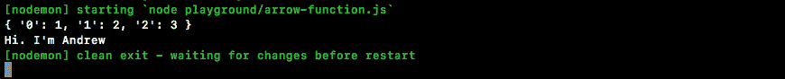

我们有一个，两个和三个，我们有每个的索引作为属性名，这是有效的，因为我们使用的是一个正则函数。但是，如果我们切换到箭头功能（`=>`），它将不会像预期的那样工作。

我会在我的 arrow 函数（`=>`中添加`console.log(arguments)`，从调用`sayHiAlt`切换回原来的方法`sayHi`，如下图：

```js
var user = {
  name: 'Andrew',
  sayHi: () => {
    console.log(arguments);
    console.log(`Hi. I'm ${this.name}`);
  },
  sayHiAlt() {
    console.log(arguments);
    console.log(`Hi. I'm ${this.name}`);
  }
};
user.sayHi(1, 2, 3);
```

当我将文件保存到`arrow-function.js`中时，我们将得到与以前不同的东西。我们将实际得到的是全局 arguments 变量，它是我们探索的包装器函数的 arguments 变量：


在前面的屏幕截图中，我们有 require 函数、定义、modules 对象以及指向文件和当前目录的两个字符串路径。这些显然不是我们所期望的，这是使用箭头函数时必须注意的另一件事；你不会得到`arguments`关键字，也不会得到你所期望的`this`绑定（在`sayHi`语法中定义）。

当您尝试在对象上创建方法并使用箭头函数时，这些问题通常会出现。在这些情况下，我强烈建议您切换到我们讨论过的`sayHiAlt`语法。您得到了一个简化的语法，但也得到了磁盘绑定，并得到了预期的 arguments 变量。

# 总结

在本章中，我们能够重用我们在前几章中已经创建的实用程序函数，从而使填写删除注释的过程更加容易。在`app.js`中，我们研究了`removeNote`函数是如何执行的，如果执行成功，我们会打印一条消息；如果没有，我们会打印另一条消息。

接下来，我们成功地完成了`read`命令，我们还创建了一个非常酷的实用程序函数，可以在多个地方使用。这使我们的代码保持干燥，并防止我们在应用中的多个位置使用相同的代码。

然后我们讨论了调试的简要介绍。从本质上讲，调试是一个过程，它允许您在任何时间点停止程序，并在程序存在时对其进行处理。这意味着您可以处理Node中存在的变量、函数或任何内容。我们了解了更多关于 YARG、其配置、设置命令、它们的描述和参数的信息。

最后，您进一步探讨了箭头函数、它们是如何工作的、何时使用它们以及何时不使用它们。一般来说，如果您不需要这个关键字，或者 arguments 关键字，那么您可以毫无问题地使用 arrow 函数，并且我总是喜欢在可能的情况下使用 arrow 函数而不是常规函数。

在下一章中，我们将探讨异步编程以及如何从第三方 API 获取数据。我们将更多地使用常规函数和箭头函数，您将能够直接看到如何在两者之间进行选择。