# 十、测试 Node 应用——第 1 部分

在本章中，我们将了解如何测试代码，以确保其按预期工作。现在，如果您曾经为其他语言设置过测试用例，那么您就知道开始有多难了。您必须设置实际的测试基础设施。然后，您必须编写单独的测试用例。每次我没有测试一个应用，都是因为安装过程和工具对我来说是一个负担。然后你在网上到处寻找信息，你会得到非常简单的例子，但不是用来测试现实世界中的东西的例子，比如异步代码。我们将在本章中完成所有这些。我将为您提供一个非常简单的测试和编写测试用例的设置。

我们将介绍可用的最佳工具，因此您将非常兴奋地编写这些测试用例，并看到所有这些绿色复选标记。我们也将从这里开始测试，所以让我们来看看如何测试一些代码。

# 基本测试

在本节中，您将创建第一个测试用例，以便测试代码是否按预期工作。通过向我们的项目中添加自动测试，我们将能够验证函数是否按照它所说的做。如果我们做了一个函数，它应该把两个数字相加，我们可以自动验证它是否在这样做。如果我们有一个从数据库中提取用户的函数，我们可以确保它也在这样做。

现在开始本节，我们将了解在 Node.js 项目中设置测试套件的基础知识。我们将测试一个真实的函数。

# 安装测试模块

为了开始，我们将创建一个目录来存储本章的代码。我们将使用`mkdir`在桌面上制作一个，我们将此目录称为`node-tests`：

```js
mkdir node-tests
```

然后我们将使用`cd`更改其中的目录，这样我们就可以继续运行`npm init`。我们将安装模块，这将需要一个`package.json`文件：

```js
cd node-tests

npm init
```


我们将使用所有内容的默认值运行`npm init`，只需在每个步骤中点击*回车*：


现在，一旦`package.json`文件生成，我们就可以打开 Atom 内部的目录。它在桌面上，叫做`node-tests`。

从这里开始，我们准备好实际定义一个要测试的函数。本节的目标是学习如何为 Node 项目设置测试，因此我们将要测试的实际功能将非常简单，但这将有助于准确说明如何设置测试。

# 测试 Node 项目

首先，让我们制作一个假模块。这个模块将有一些功能，我们将测试这些功能。在项目的根目录中，我们将创建一个全新的目录，我将此目录称为`utils`：


我们可以假设这将存储一些实用函数，比如将一个数字添加到另一个数字，或者从字符串中去除空白，任何不属于任何特定位置的 hodge podge。我们将在`utils`文件夹中创建一个名为`utils.js`的新文件，这与我们在上一章的天气应用中创建`weather`和`location`目录时所做的类似：


你可能想知道为什么我们有一个文件夹和一个同名文件。当我们开始测试时，这一点就很清楚了。

现在，在我们编写第一个测试用例以确保某些功能正常工作之前，我们需要进行一些测试。我将创建一个非常基本的函数，它将两个数字相加。我们将创建一个加法器函数，如以下代码块所示：

```js
module.exports.add = () => {

}
```

这个箭头函数（`=>`将接受两个参数`a`和`b`，在函数内部，我们将返回值`a + b`。这里没什么太复杂的：

```js
module.exports.add = () => {
  return a + b;
};
```

现在，因为我们的 arrow 函数（`=>`）中只有一个表达式，并且我们想要返回它，所以我们实际上可以使用 arrow 函数（`=>`）表达式语法，它允许我们添加表达式，如下面的代码`a + b`所示，它将隐式返回：

```js
module.exports.add = (a, b) => a + b;
```

无需在函数中显式添加`return`关键字。`utils.js`我们现在开始探索。

我们将使用一个名为 Mocha 的框架来建立我们的测试套件。这将允许我们配置单个测试用例，并运行所有测试文件。这对于创建和运行测试非常重要。这里的目标是使测试变得简单，我们将使用摩卡来实现这一点。现在我们有了一个文件和一个函数，我们实际上想要测试，让我们来探索如何创建和运行一个测试套件。

# Mocha–测试框架

我们将使用超级流行的测试框架 Mocha 进行测试，您可以在[mochajs.org](https://mochajs.org/)上找到。这是一个创建和运行测试套件的极好的框架。它非常受欢迎，他们的页面包含了您想要了解的有关设置、配置的所有信息，以及其中包含的所有酷铃声和口哨：

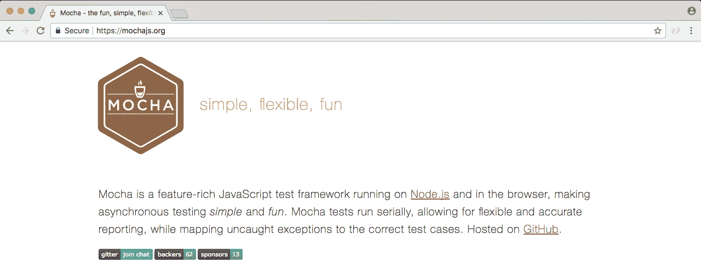

如果在此页面上向下滚动，您将能够看到目录：


在这里，您可以探索摩卡咖啡提供的一切。我们将在本章中介绍大部分内容，但对于我们没有介绍的内容，我想让您知道，您可以在本页上随时了解它。

现在我们已经浏览了 Mocha 文档页面，让我们安装它并开始使用它。在终端内部，我们将安装摩卡咖啡。首先，让我们清除终端输出。然后我们将使用`npm install`命令安装它。当您使用`npm install`时，您也可以使用快捷方式`npm i`。这具有完全相同的效果。我将使用`npm i`和`mocha`，指定版本`@3.0.0`。这是本次拍摄时图书馆的最新版本：

```js
npm i mocha@3.0.0
```

现在我们确实希望将其保存到`package.json`文件中。之前，我们使用了`save`标志，但我们将讨论一个新标志，称为`save-dev`。`save-dev`标志将保存此软件包，仅用于开发目的，这正是摩卡的用途。实际上，我们不需要 Mocha 在 Heroku 这样的服务上运行我们的应用。我们只需要在机器上本地安装 Mocha 来测试代码。

使用`save-dev`标志时，模块的安装方式大致相同：

```js
npm i mocha@5.0.0 --save-dev
```

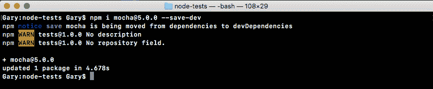

但是如果你探索`package.json`，你会发现事情有点不同。在我们的`package.json`文件中，不是依赖项属性，而是`devDependencies`属性：


在那里我们有摩卡，版本号作为值。`devDependencies`非常棒，因为它们不会安装在 Heroku 上，但会在本地安装。这将使 Heroku 的启动时间非常非常快。它不需要安装实际不需要的模块。从现在开始，我们将在大多数项目中同时安装`devDependencies`和`dependencies`。

# 为 add 函数创建测试文件

现在我们已经安装了 Mocha，我们可以继续创建一个测试文件。在`utils`文件夹中，我们将创建一个名为`utils.test.js`的新文件：

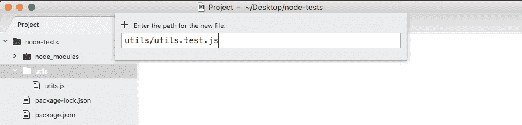

这个文件将存储我们的测试用例。我们不会将测试用例存储在`utils.js`中。这将是我们的应用代码。相反，我们将创建一个名为`utils.test.js`的文件。当我们使用这个`test.js`扩展时，我们基本上是告诉我们的应用，它将存储我们的测试用例。当 Mocha 通过我们的应用寻找要运行的测试时，它应该运行任何具有此扩展名的文件。

现在我们有了一个测试文件，唯一要做的就是创建一个测试用例。测试用例是一个运行一些代码的函数，如果一切顺利，很好，测试被认为已经通过。如果事情进展不顺利，测试就被认为失败了。我们可以使用`it`创建一个新的测试用例。这是摩卡提供的功能。我们将通过 Mocha 运行我们的项目测试文件，所以没有理由导入它或做类似的事情。我们只是这样称呼它：

```js
it();
```

现在我们可以定义一个新的测试用例，它包含两个参数。这些是：

*   第一个参数是字符串
*   第二个参数是一个函数

首先，我们将有一个字符串来描述测试到底在做什么。如果我们正在测试加法器函数是否工作，我们可能会遇到如下情况：

```js
it('should add two numbers');
```

注意这里，它在句子中起作用。应该这样读，`it should add two numbers`；准确描述测试将验证的内容。这就是所谓的**行为驱动开发**或**BDD**，这就是摩卡赖以建立的原则。

现在我们已经设置了测试字符串，接下来要做的是添加一个函数作为第二个参数：

```js
it('should add two numbers', () => {

});
```

在这个函数中，我们将添加测试 add 函数是否按预期工作的代码。这意味着它可能会调用`add`并检查返回的值是否是给定传入的两个数字的适当值。这意味着我们确实需要在顶部导入`util.js`文件。我们将创建一个常量，调用`utils`，将其设置为需要 UTIL 的返回结果。我们正在使用`./`，因为我们需要一个本地文件。它在同一个目录中，因此我可以简单地键入不带扩展名的`utils`，如下所示：

```js
const utils = require('./utils');

it('should add two numbers', () => {

});
```

现在我们已经加载了 utils 库，在回调中我们可以调用它。让我们创建一个变量来存储返回结果。我们称之为结果。我们将其设置为`utils.add`传入两个数字。让我们使用类似于`33`和`11`的东西：

```js
const utils = require('./utils');

it('should add two numbers', () => {
  var res = utils.add(33, 11);
});
```

我们希望它能回来。现在，我们的测试套件中确实有一些代码，所以我们运行它。我们将通过在`package.json`中配置上一章中介绍的测试脚本来实现这一点。

目前，测试脚本只是在屏幕上打印一条消息，说明不存在任何测试。我们要做的是叫摩卡咖啡。如下面的代码所示，我们将调用 Mocha，作为我们想要测试的实际文件的唯一参数传入。我们可以使用全局模式来指定多个文件。在本例中，我们将使用`**`查找每个目录。我们正在寻找一个名为`utils.test.js`的文件：

```js
"scripts": {
  "test": "mocha **/utils.test.js"
},
```

这是一个非常特殊的模式。它不会特别有用。相反，我们也可以用星号替换文件名。现在，我们正在查找项目中任何文件名以`.test.js`结尾的文件：

```js
"scripts": {
  "test": "mocha **/*.test.js"
},
```

这正是我们想要的。从这里，我们可以通过保存`package.json`并移动到终端来运行我们的测试套件。我们将使用`clear`命令清除终端输出，然后我们可以使用如下所示的命令运行`test`脚本：

```js
npm test
```

运行此命令时，我们将执行 Mocha 命令：

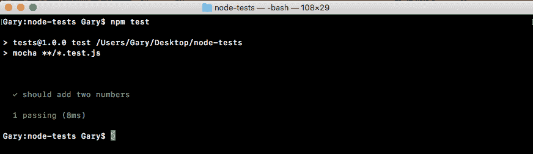

会爆炸的。它将获取我们所有的测试文件。它将运行所有这些程序，并在终端内部的屏幕上打印结果，如前一个屏幕截图所示。在这里，我们可以看到我们的测试旁边有一个绿色的复选标记，`should add two numbers`。接下来，我们有一个小结，一个通过的测试，它发生在 8 毫秒之内。

现在在我们的例子中，我们实际上并没有断言返回的数字。可能是 700，我们不在乎。考试总是会通过的。要使测试失败，我们必须做的就是抛出一个错误。这意味着我们可以抛出一个新的错误，并将我们想要用作错误的任何消息传递到构造函数中，如下面的代码块所示。在这种情况下，我可以说类似于`Value not correct`：

```js
const utils = require('./utils');

it('should add two numbers', () => {
  var res = utils.add(33, 11);
  throw new Error('Value not correct')
});
```

现在有了这个，我可以保存测试文件并通过重新运行`npm test`从终端重新运行东西，当我们这样做时，现在我们有 0 个测试通过，有 1 个测试失败：


接下来我们可以看到一个测试是应该添加两个数字，我们得到错误消息，Value not correct。当我们抛出一个新错误时，测试失败，这正是我们想要为 add 做的。

# 为测试创建 if 条件

现在，我们将为测试创建一个`if`语句。如果响应值不等于`44`，这意味着我们手头有问题，我们将抛出一个错误：

```js
const utils = require('./utils');

it('should add two numbers', () => {
  var res = utils.add(33, 11);

  if (res != 44){

  }
});
```

在`if`条件内，我们可以抛出一个新错误，我们将使用模板字符串作为消息字符串，因为我确实希望使用错误消息中返回的值。我会说`Expected 44, but got`，然后我会注入实际值，不管返回什么：

```js
const utils = require('./utils');

it('should add two numbers', () => {
  var res = utils.add(33, 11);

  if (res != 44){
    throw new Error(`Expected 44, but got ${res}.`);
  }
});
```

现在在我们的情况下，一切都会很好。但是如果`add`方法不能正常工作怎么办？让我们通过简单地添加另一个加法来模拟这一点，在`utils.js`中添加类似`22`的内容：

```js
module.exports.add = (a, b) => a + b + 22;
```

我将保存文件，重新运行测试套件：

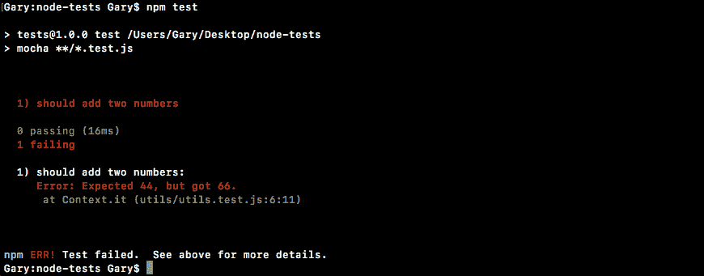

现在我们得到一条错误消息：预期为 44，但得到 66。这个错误消息太棒了。它让我们知道测试出了问题，甚至可以准确地告诉我们得到了什么以及我们期望得到什么。这将让我们进入`add`函数，查找错误，并希望修复它们。

创建测试用例不需要非常复杂。在本例中，我们有一个测试简单函数的简单测试用例。

# 数函数平方的检验

现在，我们将创建一个新函数，它将一个数字平方并返回结果。我们将使用`module.exports.square`在`utils.js`文件中定义它。我们将其设置为一个箭头函数（`=>`），该函数接受一个数字`x`，我们将返回`x`次`x`、`x * x`，如下所示：

```js
module.exports.add = (a, b) => a + b;

module.exports.square = (x) => x * x;
```

现在我们有了这个全新的 function square，我们将创建一个新的测试用例，以确保`square`按预期工作。在`utils.test.js`中，在`add`函数的`if`条件旁边，我们将再次调用`it`函数：

```js
const utils = require('./utils');

it('should add two numbers', () => {
  var res = utils.add(33, 11);

  if (res != 44){
    throw new Error(`Expected 44, but got ${res}.`);
  }
});

it();
```

在`it`函数中，我们将添加两个参数：字符串和回调函数。在字符串中，我们将创建消息`should square a number`：

```js
it('should square a number', () => {

});
```

在回调函数中，我们实际上可以继续调用`square`。现在我们确实想创建一个变量来存储结果，这样我们就可以检查结果是否符合我们的预期。然后我们可以打电话`utils.square`传入一个号码。在这种情况下，我将使用`3`，这意味着我应该期望 9 回来：

```js
it('should square a number', () => {
  var res = utils.square(3);
});
```

在下一行中，我们可以有一个`if`语句，如果结果不等于`9`，那么我们将抛出一条消息，因为事情出错了：

```js
it('should square a number', () => {
  var res = utils.square(3);

  if (res !== 9) {

  }
});
```

我们可以使用`throw new Error`抛出一个错误，传递我们喜欢的任何消息。我们可以使用常规字符串，但我始终更喜欢使用模板字符串，这样我们就可以轻松地插入值。我会说类似于`Expected 9, but got`的内容，后面是不正确的值；在本例中，它存储在响应变量中：

```js
it('should square a number', () => {
  var res = utils.square(3);

  if (res !== 9) {
    throw new Error(`Expected 9, but got ${res}`);
  }
});
```

现在我可以保存这个测试用例并从终端运行测试套件。使用向上箭头键和*回车*键，我们可以重新运行最后一个命令：

```js
npm test
```

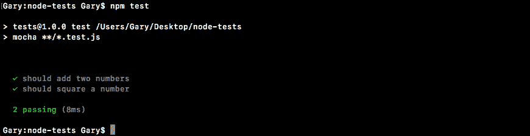

我们通过了两个测试，应该加上两个数字，然后将一个数字平方，两个数字旁边都有复选标记。我们在 14 毫秒内完成了这两个测试，这太棒了。

现在，我们要做的下一件事是搞乱`square`函数，以确保在数字不正确时测试失败。我将在`utils.js`中的结果上添加`1`，这将导致测试失败：

```js
module.exports.add = (a, b) => a + b;

module.exports.square = (x) => x * x + 1;
```

然后我们可以从终端重新运行，我们应该看到错误消息：


我们得到了预期的 9，但得到了 10。这太棒了。我们现在有一个测试套件，可以测试`add`函数和`square`函数。我会移除那个`+ 1`，我们就完成了。

我们现在有一个非常非常基本的测试套件，我们可以用摩卡来执行。目前，我们有两个测试，为了创建这些测试，我们使用了摩卡提供的`it`方法。在接下来的部分中，我们将探索摩卡为我们提供的更多方法，我们还将寻找更好的方法来进行断言。我们将使用断言库来帮助完成繁重的工作，而不是手动创建它们。

# 自动重新启动测试

在我们编写更多的测试用例之前，让我们看看当我们更改测试代码或应用代码时自动重新运行测试套件的方法。我们将用`nodemon`来做这件事。现在，我们之前使用的`nodemon`是这样的：

```js
nodemon app.js
```

我们会输入`nodemon`并传入一个类似`app.js`的文件。每当我们应用中的任何代码发生更改时，它都会将`app.js`文件作为 Node 应用重新运行。我们实际上可以做的是指定在文件更改时要运行的任何命令。这意味着当文件更改时，我们可以重新运行`npm test`。

为此，我们将使用`exec`标志。这个标志告诉`nodemon`我们将指定一个要运行的命令，它可能不一定是一个 Node 文件。如下面的命令所示，我们可以指定该命令。将是`'npm test'`：

```js
nodemon --exec 'npm test'
```

If you are using Windows, remember to use double quotes in place of single quotes.

有了这个，我们现在可以运行`nodemon`命令了。它将首次启动运行我们的测试套件：


这里我们看到有两个测试通过了。让我们进入应用`utils.js`并对其中一个函数进行更改，这样它就失败了。我们将在`add`的结果中添加`3`或`4`：

```js
module.exports.add = (a, b) => a + b + 4;

module.exports.square = (x) => x * x;
```

它会在此处自动重新启动：

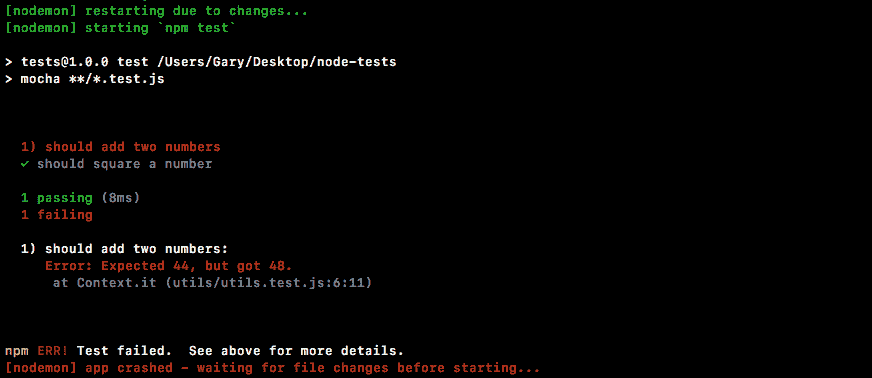

现在我们看到了一个测试套件，其中一个测试通过，一个测试失败。我总是可以继续并撤销我们添加的错误，保存文件，测试套件将自动重新运行。

这将使您的应用更容易测试。您不必每次更改应用时都切换到终端并重新运行`npm test`命令。现在我们有了一个可以运行的命令，我们将关闭`nodemon`并使用向上箭头键再次显示它。

我们可以把它放到`package.json`里面的脚本中。

在`package.json`中，我们将在测试脚本之后制作一个新脚本。现在我们已经使用了内置的`start`脚本和`test`脚本，我们将创建一个名为`test-watch`的自定义脚本，我们可以运行`test-watch`脚本来启动。在`test-watch`的内部，我们将拥有与终端运行的完全相同的命令。这意味着我们将取整`nodemon`。我们将使用`exec`标志和引号内部，我们将运行`npm test`：

```js
"scripts": {
  "test": "mocha **/*.test.js",
  "test-watch": "nodemon --exec 'npm test'"
},
```

现在我们已经准备好了，我们可以从终端运行脚本，而不是每次启动自动测试套件时都必须键入此命令。

The script we have inside `package.json` currently will work on macOS and Linux. It'll also work on Heroku, which uses Linux. But it will not work on Windows. The following script will:
`"test-watch": "nodemon --exec \"npm test\""`.
As you can see here, we're escaping the quotes surrounding `npm test` and we're using double quotes, which as we know are the only quotes supported by Windows. This script will remove any errors you're seeing, something like npm cannot be found, which you will get if you wrap `npm tests` in single quotes and run the script on Windows. So use the above script for cross-OS compatibility.

要运行自定义名称的脚本，如`test-watch`，在终端中只需运行`npm run`，后跟脚本名称`test-watch`，如下命令所示：

```js
npm run test-watch
```

如果我这样做，事情就会开始。我们将获得测试套件，它仍在等待更改，如下所示：


现在，每次启动测试套件时，您都可以简单地使用`npm run test-watch`。这将启动`test-watch`脚本，启动`nodemon`。每次项目中发生更改时，它都会重新运行`npm test`，在屏幕上显示测试套件的结果。

现在我们有了一种自动重新启动测试套件的方法，让我们继续并回到 Node 中测试的细节。

# 在测试 Node 模块中使用断言库

在前面的部分中，我们制作了两个测试用例来验证`utils.add`和`utils.square`方法是否按预期工作。我们使用了一个`if`条件，也就是说，如果值不是`44`，这意味着发生了错误，我们抛出了一个错误。在本节中，我们将学习如何使用断言库，它将为我们处理`utils.test.js`代码中的所有`if`条件：

```js
if (res !== 44)
  throw new Error(`Expected 44, but got ${res}.`)
}
```

因为当我们添加越来越多的测试时，代码最终会看起来非常相似，没有理由继续重写它。断言库允许我们对值进行断言，无论是关于值的类型、值本身、数组是否包含元素等等。他们真的很棒。

我们将要使用的是 expect。你可以通过谷歌和谷歌搜索`mjackson expect`找到它。这就是我们想要的结果：


这是 mjackson 的仓库，期待着。这是一个奇妙的、超级流行的断言库。这个库将允许我们传入一个值并对其进行断言。在本页上，我们向下滚动介绍和安装，我们可以看到一个示例：


如前面的屏幕截图所示，我们有我们的断言头，我们有我们的第一个断言，`toExist`。这将验证值是否存在。在下一行中，我们有一个示例，我们将字符串传递给`expect`：

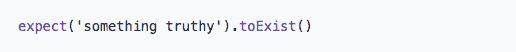

这就是我们想要断言的价值。在我们的应用上下文中，这将是`utils.test.js`中的响应变量，如下所示：

```js
const utils = require('./utils');

it('should add two numbers', () => {
  var res = utils.add(33, 11);
  if (res !== 44) {
    throw new Error(`Expected 44, but got ${res}.`)
  }
});
```

我们想断言它等于`44`。在我们调用`expect`之后，我们可以开始链接一些断言调用。在断言示例中，接下来我们检查它是否存在：

```js
expect('something truthy').toExist()
```

这不会引发错误，因为字符串在 JavaScript 中确实是真实的。如果我们传入类似于`undefined`的内容，而不是`truthy`，则`toExist`将失败。它将抛出一个错误，测试用例将无法通过。使用这些断言，我们可以非常非常容易地检查测试中的值，而不必自己编写所有代码。

# 探索断言库

让我们继续探索断言库。首先运行`npm install`将模块安装到终端内部。模块名本身称为 expect，我们将获取最新版本`@1.20.2`。再一次，我们将使用`save-dev`标志，就像我们使用摩卡一样。因为我们确实希望将此依赖项保存在`package.json`中，但它是`dev`依赖项，所以应用运行时不需要它，无论它是在 Heroku 还是其他服务上：

```js
npm install expect@1.20.2 --save-dev
```

The `expect` library has been donated to a different organization. The latest version, which is v21.1.0 is not compatible with the backward version we are using here that is 1.20.2. What I like you to do is install the 1.20.2 version in the section that will make sure, you'll use in next several sections.

让我们继续安装这个依赖项。

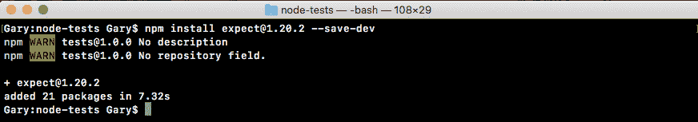

然后我们可以移动到应用，查看`package.json`文件，如下面的屏幕截图所示，它看起来很棒：

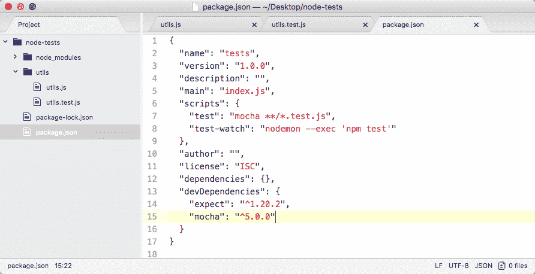

我们有 expect 和摩卡咖啡。现在，在我们的`utils.test`文件中，我们可以通过在库中加载并使用 expect 进行第一次断言来启动。在文件的最顶端，我们将加载到库中，创建一个名为`expect`和`require('expect')`的常量，如下所示：

```js
const expect = require('expect');
```

现在，我们可以通过调用`expect`来替换`utils.test.js`代码中的`if`条件：

```js
const expect = require('expect');

const utils = require('./utils');

it('should add two numbers', () => {
  var res = utils.add(33, 11);

  // if(res !== 44) {
  //   throw new Error(`Expected 44, but got ${res}.`)
  //}
});
```

正如您在 assertion/expect 页面上的示例中所看到的，我们将通过调用`expect`作为一个函数来启动所有的断言，该函数传递我们想要进行断言的值。在这种情况下，即`res`变量：

```js
const expect = require('expect');

const utils = require('./utils');

it('should add two numbers', () => {
  var res = utils.add(33, 11);

  expect(res)
  // if(res !== 44) {
  //   throw new Error(`Expected 44, but got ${res}.`)
  //}
});
```

现在，我们可以断言各种事情。在本例中，我们希望断言该值等于`44`。我们将做出我们的断言`toBe`。在“文档”页面上，它如下所示：


它断言一个值等于另一个值，这正是我们想要的。我们使用`toBe`断言传入 expect 的值等于另一个值，并将该值作为第一个参数传入。回到 Atom 内部，我们可以继续使用这个断言，`.toBe`，我们希望结果变量是数字`44`，如下所示：

```js
const expect = require('expect');

const utils = require('./utils');

it('should add two numbers', () => {
  var res = utils.add(33, 11);

  expect(res).toBe(44);
  // if(res !== 44) {
  //   throw new Error(`Expected 44, but got ${res}.`)
  //}
});
```

现在我们有了我们的测试用例，它应该像在`if`条件下一样工作。

为了证明它确实有效，让我们进入终端并使用`clear`命令清除终端输出。现在我们可以运行如下命令行所示的`test-watch`脚本：

```js
npm run test-watch
```


如前面的代码输出所示，我们通过了两个测试，就像以前一样。现在我们要将`44`更改为其他值，该值会引发类似`40`的错误：

```js
const expect = require('expect');

const utils = require('./utils');

it('should add two numbers', () => {
  var res = utils.add(33, 11);

  expect(res).toBe(40);
  // if(res !== 44) {
  //   throw new Error(`Expected 44, but got ${res}.`)
  //}
});
```

我们保存该文件，我们将得到一个错误，`expect`库将为我们生成有用的错误消息：

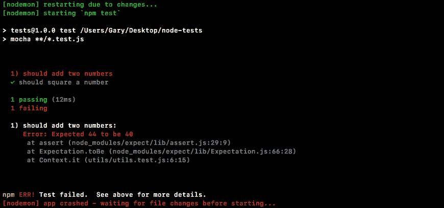

这是说我们预期 44 岁会是 40 岁。显然情况并非如此，因此会抛出一个错误。我会把它改回`44`，保存文件，我们所有的测试都会通过。

# 链接多个断言

现在我们还可以将多个断言链接在一起。例如，我们可以断言从`add`返回的值是一个数字。这可以使用另一个断言来完成。那么让我们进入文档并看一看。在 Chrome 中，我们将向下滚动浏览断言文档列表。有很多方法。我们将探索其中的一些。在本例中，我们正在寻找`toBeA`，该方法采用字符串：


它采用字符串类型，并使用`typeof`运算符断言该值属于某一类型。这里我们期待`2`是一个数字。我们可以在代码中做完全相同的事情。在 Atom 内部，`toBe`之后，我们可以连接另一个调用`toBeA`，后跟类型。这可能是一个字符串，也可能是一个对象，或者在我们的例子中，它可能是一个数字，就像这样：

```js
const expect = require('expect');

const utils = require('./utils');

it('should add two numbers', () => {
  var res = utils.add(33, 11);

  expect(res).toBe(44).toBeA('number');
  // if(res !== 44) {
  //   throw new Error(`Expected 44, but got ${res}.`)
  //}
});
```

我们将打开终端，以便查看结果。它现在是隐藏的。保存文件。我们的测试将重新运行，我们可以看到它们都通过了：


让我们使用另一种类型，它会导致测试失败，例如字符串：

```js
 expect(res).toBe(44).toBeA('string');
```

然后，我们将得到一条错误消息，预期 44 是一个字符串：

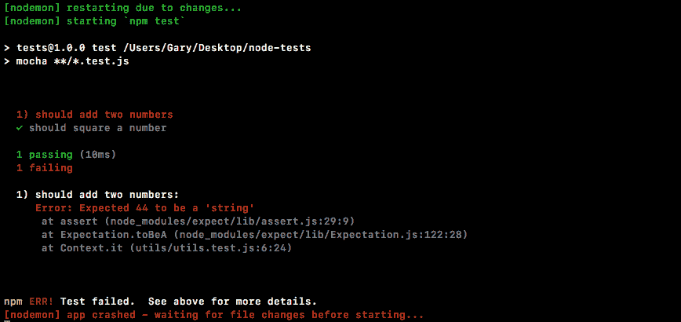

这真的很有用。这将帮助我们很快地清除错误。让我们把代码改回数字，我们就可以开始了。

# square 函数的多个断言

现在我们想对平方数函数做同样的测试。我们将使用`expect`断言响应确实是数字`9`，并且类型是数字。我们将使用与`add`函数相同的两个断言。首先，我们需要删除当前的方形`if`条件代码，因为我们将不再使用它。如下面的代码所示，我们将对`res`变量进行一些预期。我们希望它是数字`9`，就像这样：

```js
it('should square a number', () => {
  var res = utils.square(3);

  expect(res).toBe(9);
});
```

我们将保存该文件并确保测试通过，它确实通过了：


现在，我们将使用`toBeA`断言该类型。这里，我们检查`square`方法返回值的类型是否为数字：

```js
it('should square a number', () => {
  var res = utils.square(3);

  expect(res).toBe(9).toBeA('number');
});
```

当我们保存文件时，我们的两个测试仍然通过，这非常棒：


现在这只是一个关于`expect`能做什么的小测试。让我们创建一个虚假的测试用例，来探索更多我们可以使用`expect`的方法。我们不会测试实际的函数。我们将在回调函数中处理一些断言。

# 利用伪测试探索 expect 的使用

要创建伪测试，我们将使用`it`回调函数进行新测试：

```js
it('should expect some values');
```

我们可以在这里放任何我们想要的东西，这不太重要。我们将传入一个 arrow 函数（`=>`）作为回调函数：

```js
it('should expect some values', () => {

});
```

现在，正如我们已经看到的，您将要做出的最基本的断言之一是，您只需要检查等式。我们想检查响应变量是否等于其他变量，比如数字`44`。在`expect`中，我们也可以做相反的事情。我们可以使用`toNotBe`预期`12`这样的值不相等。然后我们可以断言它不等于其他值，比如`11`：

```js
it('should expect some values', () => {
  expect(12).toNotBe(11);
});
```

两者不相等，因此当我们在终端中保存文件时，所有三个测试都应通过：

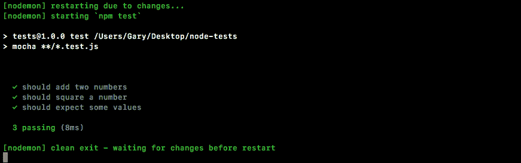

如果我将其设置为相同的值，它将无法按预期工作：

```js
it('should expect some values', () => {
  expect(12).toNotBe(12);
});
```

我们将得到一个错误，预期 12 不是 12：

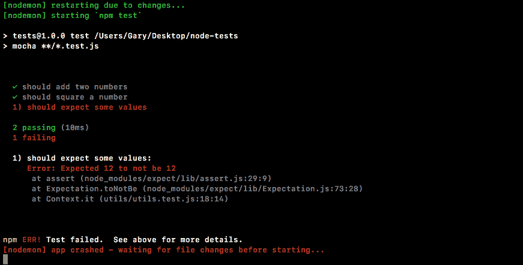

现在`toBe`和`toNotBe`对于数字、字符串和布尔值非常有效，但如果您试图比较数组或对象，它们将无法按预期工作，我们可以证明这一点。

# 使用 toBe 和 toNotBe 比较数组/对象

我们将首先通过注释删除当前代码。我们将保留它，以便稍后使用：

```js
it('should expect some values', () => {
  // expect(12).toNotBe(12);
});
```

我们将`expect`一个`name`属性设置为`Andrew`、`toBe`的对象，我们将断言它是另一个 name 属性等于`Andrew`的对象，如下所示：

```js
it('should expect some values', () => {
  // expect(12).toNotBe(12);
  expect({name: 'Andrew'})
});
```

我们将使用`toBe`，就像我们使用`number`一样，检查它是否与名称等于`Andrew`的另一个对象相同：

```js
it('should expect some values', () => {
  // expect(12).toNotBe(12);
  expect({name: 'Andrew'}).toBe({name: 'Andrew'});
});
```

现在，当我们保存此文件时，您可能认为测试会通过，但它不会：


如前面的输出所示，我们认为这两个名称应该相等。当使用`toBe`所使用的三重相等来比较对象是否相等时，它们将不相同，因为它试图确定它们是否是完全相同的对象，而它们不是。我们已经创建了两个具有相同属性的独立对象。

# 使用 toEqual 和 toNotEqual 断言

要检查这两个名称是否相等，我们必须使用不同的名称。其名称为`toEqual`，如图所示：

```js
it('should expect some values', () => {
  // expect(12).toNotBe(12);
  expect({name: 'Andrew'}).toEqual({name: 'Andrew'});
});
```

如果我们现在保存文件，这将起作用。它将撕裂对象属性，确保它们具有相同的属性：


`toNotEqual`也是如此。这将检查两个对象是否不相等。为了检查这一点，我们将继续并在`andrew`中将第一个对象更改为小写 a：

```js
it('should expect some values', () => {
  // expect(12).toNotBe(12);
  expect({name: 'andrew'}).toNotEqual({name: 'Andrew'});
});
```

现在，测试通过了。它们是不平等的：

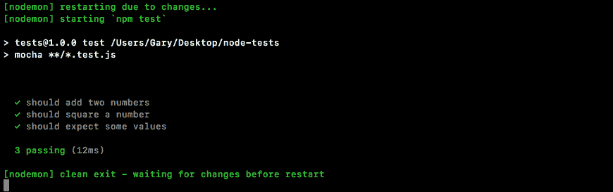

这就是我们如何与对象和数组相等。另一个真正有用的东西是`toInclude`。

# 使用 toInclude 和 toExclude

`toInclude`断言检查数组或对象是否包含某些内容。现在如果它是一个数组，我们可以检查它是否包含数组中的某个项。如果它是一个对象，我们可以检查它是否包含某些属性。让我们来看一个例子。

我们将`expect`在`it`回调中包含数字`2`、`3`和`4`的数组中包含数字`5`，我们可以使用`toInclude`实现这一点：

```js
it('should expect some values', () => {
  // expect(12).toNotBe(12);
  // expect({name: 'andrew'}).toNotEqual({name: 'Andrew'});
  expect([2,3,4]).toInclude(5);
});
```

`toInclude`断言接受该项。在这种情况下，我们将检查数组中是否有`5`。现在很明显它没有，所以这个测试会失败：

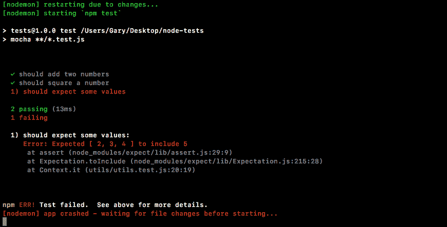

我们得到了这个信息，期望[2,3,4]包括 5。这是不存在的。现在我们将其更改为一个确实存在的数字，例如`2`：

```js
it('should expect some values', () => {
  // expect(12).toNotBe(12);
  // expect({name: 'andrew'}).toNotEqual({name: 'Andrew'});
  expect([2,3,4]).toInclude(2);
});
```

我们将重新运行测试套件，一切都将按预期工作：


现在，除了`toInclude`之外，我们还有如下`toExclude`：

```js
it('should expect some values', () => {
  // expect(12).toNotBe(12);
  // expect({name: 'andrew'}).toNotEqual({name: 'Andrew'});
  expect([2,3,4]).toExclude(1);
});
```

这将检查是否有不存在的内容，例如不在数组中的数字`1`。如果我们运行此断言，测试将通过：


同样的两种方法，`toInclude`和`toExclude`也适用于对象。我们可以在下一行玩这个。我将`expect`确认以下对象上有东西：

```js
it('should expect some values', () => {
  // expect(12).toNotBe(12);
  // expect({name: 'andrew'}).toNotEqual({name: 'Andrew'});
  // expect([2,3,4]).toExclude(1);
  expect({

  })
});
```

让我们继续创建一个具有一些属性的对象。这些是：

*   `name`：我们将其设置为任何名称，比如`Andrew`。
*   `age`：我们将其设置为年龄，比如`25`。
*   `location`：我们将其设置为任何位置，例如`Philadelphia`。

这将类似于以下代码块：

```js
it('should expect some values', () => {
  // expect(12).toNotBe(12);
  // expect({name: 'andrew'}).toNotEqual({name: 'Andrew'});
  // expect([2,3,4]).toExclude(1);
  expect({
    name: 'Andrew',
 age: 25,
 location: 'Philadelphia'
  })
});
```

现在让我们假设我们想要对特定属性做出一些断言，而不一定是整个对象。我们可以使用`toInclude`断言对象具有某些属性，并且这些属性值等于我们传入的值：

```js
it('should expect some values', () => {
  // expect(12).toNotBe(12);
  // expect({name: 'andrew'}).toNotEqual({name: 'Andrew'});
  // expect([2,3,4]).toExclude(1);
  expect({
    name: 'Andrew',
    age: 25,
    location: 'Philadelphia'
  }).toInclude({

 })
});
```

例如，`age`属性。假设我们只关心年龄。通过键入以下代码，我们可以断言该对象的`age`属性等于`25`：

```js
it('should expect some values', () => {
  // expect(12).toNotBe(12);
  // expect({name: 'andrew'}).toNotEqual({name: 'Andrew'});
  // expect([2,3,4]).toExclude(1);
  expect({
    name: 'Andrew',
    age: 25,
    location: 'Philadelphia'
  }).toInclude({
    age: 25
  })
});
```

有`name`财产并不重要。`name`属性可以是任何值。这与这一主张无关。现在让我们使用值`23`：

```js
.toInclude({
    age: 23
  })
```

由于数值不正确，此测试将失败，如下所示：


我们期望`age`属性是`23`，但它确实是`25`，所以测试失败。`toExclude`断言也是如此。

在这里，我们可以保存测试文件。这将检查对象的属性年龄是否不等于`23`。它确实没有，因此测试通过：


这只是一个关于 expect 可以做什么的快速尝试。要获得完整的功能列表，我建议浏览文档。你还可以使用大量其他断言，比如检查一个数字是否大于另一个数字，如果一个数字小于或等于另一个数字，所有与数学相关的操作都包括在内。

# 测试 setName 方法

现在让我们用更多的测试来结束这一部分。在`utils.js`中，我们可以创建一个新函数，一个我们将要测试的函数，`module.exports.setName`。`setName`函数将接受两个参数。它将接受一个`user`对象，一些具有一些通用属性的虚拟用户对象，并将`fullName`作为字符串：

```js
module.exports.add = (a, b) => a + b;

module.exports.square = (x) => x * x;

module.exports.setName (user, fullName)
```

`setName`的任务是将`fullName`拆分为两部分，即名字和姓氏，并在空格处拆分。我们将设置两个属性，first name 和 last name，并返回`user`对象。我们将填写函数，然后编写测试用例。

我们要做的第一件事是将名称拆分为一个`names`数组，`var names`将是该数组：

```js
module.exports.add = (a, b) => a + b;

module.exports.square = (x) => x * x;

module.exports.setName (user, fullName) => {
  var names
};
```

它将有两个值，假设名称中只有一个空格。我们假设有人键入他们的名字，点击空格，然后键入他们的姓氏。我们将这个值设为`fullName.split`，然后在空间上分开。因此，我将传入一个空字符串，其中包含一个空格作为要拆分的值：

```js
module.exports.add = (a, b) => a + b;

module.exports.square = (x) => x * x;

module.exports.setName (user, fullName) => {
  var names = fullName.split(' ');
};
```

现在我们有一个`names`数组，其中第一项是`firstName`，最后一项是`lastName`。所以我们可以开始更新`user`对象。`user.firstName`将等于`names`数组中的第一项，我们将获取`0`的索引，这是第一项。我们将对姓氏执行类似的操作，`user.lastName`等于`names`数组中的第二项：

```js
module.exports.add = (a, b) => a + b;

module.exports.square = (x) => x * x;

module.exports.setName (user, fullName) => {
  var names = fullName.split(' ');
  user.firstName = names[0];
  user.lastName = names[1];
};
```

现在我们都完成了，我们已经设置了名称，我们可以返回`user`对象`using return`用户，如下所示：

```js
module.exports.add = (a, b) => a + b;

module.exports.square = (x) => x * x;

module.exports.setName (user, fullName) => {
  var names = fullName.split(' ');
  user.firstName = names[0];
  user.lastName = names[1];
  return user;
};
```

在`utils.test`文件中，我们现在可以开始了。首先，我们将注释我们的`it('should expect some values')`处理程序：

```js
const expect = require('expect');

const utils = require('./utils');

it('should add two numbers', () => {
  var res = utils.add(33, 11);

  expect(res).toBe(44).toBeA('number');
});

it('should square a number', () => {
  var res = utils.square(3);

  expect(res).toBe(9).toBeA('number');
});

// it('should expect some values', () => {
//   // expect(12).toNotBe(12);
//   // expect({name: 'andrew'}).toNotEqual({name: 'Andrew'});
//   // expect([2,3,4]).toExclude(1);
//   expect({
//      name: 'Andrew',
//      age: 25,
//      location: 'Philadelphia'
//    }).toExclude({
//      age: 23
//    })
//  });
```

这对于文档来说非常好。如果你忘记了事情是如何运作的，你可以以后再去探索它。我们将创建一个新的测试，该测试将验证是否设置了名字和姓氏。

我们将创建一个`user`对象。在那个`user`对象上，我们想设置一些属性，比如`age`和`location`。然后我们将把变量`user`传递给`setName`方法。这将是`utils.js`文件中定义的第一个参数。我们将按顺序传递。带`firstName`的字符串，后跟空格和`lastName`。然后我们将得到结果，并对此做出一些断言。我们希望使用`toInclude`断言来断言返回的对象 includes。

如下面的代码所示，我们将调用它来生成新的测试用例。我们将测试：

```js
it('should set firstName and lastName')
```

在`it`中，我们现在可以提供第二个参数，即回调函数。我们将其设置为箭头函数（`=>`，现在我们可以制作`user`对象：

```js
it('should set firstName and lastName', () => {

});
```

`user`对象将具有一些属性。让我们添加类似于`location`的内容，将其设置为`Philadelphia`，然后设置`age`属性，将其设置为`25`：

```js
it('should set firstName and lastName', () => {
  var user = {location: 'Philadelphia', age: 25};
});
```

现在我们将调用在`utils.js`中定义的方法`setName`方法。我们将在下一行中这样做，创建一个名为`res`的变量来存储响应。然后我们将其设置为等于传入两个参数`user`对象和`fullName``Andrew Mead`：

```js
it('should set firstName and lastName', () => {
  var user = {location: 'Philadelphia', age: 25};
  var res = utils.setName(user, 'Andrew Mead');
});
```

现在，结果应该是我们所期望的。我们应该有`firstName`和`lastName`属性。我们应该拥有`location`属性和`age`属性。

现在，如果您对 JavaScript 了解很多，您可能知道对象是通过引用传递的，因此`user`变量实际上也已更新。这是意料之中的。`user`和`res`将具有完全相同的值。实际上，我们可以使用断言来证明这一点。我们将`expect`表示`user`等于使用`toEqual`和`res`：

```js
it('should set firstName and lastName', () => {
  var user = {location: 'Philadelphia', age: 25};
  var res = utils.setName(user, 'Andrew Mead');

  expect(user).toEqual(res);
});
```

在终端内部，我们可以看到测试确实通过了：

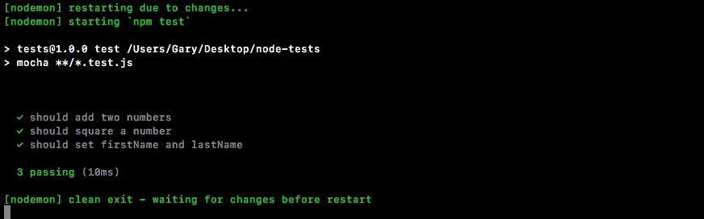

我们删除`expect(user).toEqual(res);`。现在，我们要检查`user`对象或`res`对象是否包含某些属性。我们将使用`expect`检查`res`变量是否具有使用`toInclude`的某些属性：

```js
it('should set firstName and lastName', () => {
  var user = {location: 'Philadelphia', age: 25};
  var res = utils.setName(user, 'Andrew Mead');

  expect(res).toInclude({

 })
});
```

我们正在寻找的属性`firstName`等于我们预期的属性`Andrew`，而`lastName`等于`Mead`：

```js
it('should set firstName and lastName', () => {
  var user = {location: 'Philadelphia', age: 25};
  var res = utils.setName(user, 'Andrew Mead');

  expect(res).toInclude({
    firstName: 'Andrew',
 lastName: 'Mead'
  })
});
```

这些是为了验证`setName`是否按预期工作而应该做出的断言。如果我保存该文件，`test`套件将重新运行，我们确实获得了如下所示的通过测试：

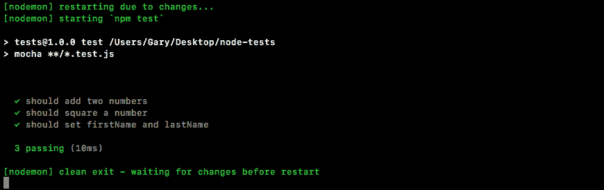

我们有三个，运行只需 10 毫秒。

有了这个，我们现在有了一个`test`套件的断言库。这太棒了，因为编写测试用例变得容易多了，本章的整个目标就是让测试变得容易接近。

在下一节中，我们将开始研究如何测试更复杂的异步函数。

# 异步测试

在本节中，您将学习如何测试异步函数。异步函数的测试过程与同步函数的测试过程并没有什么不同，就像我们已经做过的那样，但是它有点不同，所以它证明了它自己的部分是正确的。

# 使用 setTimeout 对象创建 asyncAdd 函数

首先，我们将使用`setTimeout`来模拟`utils.js`内部的延迟，从而生成一个假的`async`函数。就在我们制作`add`函数的下方，让我们制作一个名为`asyncAdd`的函数。它基本上具有相同的特性，但是它将使用`setTimeout`，并且它将有一个回调来模拟延迟。现在在现实世界中，这种延迟可能是数据库请求或 HTTP 请求。我们将在下面的章节中讨论这个问题。现在，让我们添加`module.exports.asyncAdd`：

```js
module.exports.add = (a, b) => a + b;

module.exports.asyncAdd = ()
```

这将需要三个参数，与`add`函数需要的两个参数相反，`a`、`b`和`callback`：

```js
module.exports.add = (a, b) => a + b;

module.exports.asyncAdd = (a, b, callback)
```

这就是使函数异步的原因。最后，一旦`setTimeout`上升，我们将用总和调用回调，无论是 1 加 3 等于 4，还是 5 加 9 等于 14。接下来，我们可以将箭头放入箭头函数（`=>`中），并打开和关闭我们的花括号：

```js
module.exports.asyncAdd = (a, b, callback) => {

};
```

在箭头函数（`=>`中，如前所述，我们将使用`setTimeout`创建延迟。我们将传入回调，并传入我们的`setTimeout`。在这种情况下，让我们用 1 秒：

```js
module.exports.asyncAdd = (a, b, callback) => {
  setTimeout(() => {

  }, 1000);
};
```

现在，默认情况下，如果我们的测试耗时超过 2 秒，Mocha 会认为这不是我们想要的，它会失败。这就是为什么我们在这种情况下使用 1 秒。在回调函数中，我们可以用 sum`a + b`调用实际的`callback`参数，如下所示：

```js
module.exports.asyncAdd = (a, b, callback) => {
  setTimeout(() => {
    callback(a + b);
  }, 1000);
};
```

我们现在有了一个`asyncAdd`函数，可以开始为它编写测试了。

# 为 asyncAdd 函数编写测试

在`utils.test`文件中，就在我们之前对`utils.add`的测试中，我们将为`asyncAdd`添加一个新的测试。测试设置看起来非常相似。我们将调用`it`并传入一个字符串作为第一个参数和一个回调作为第二个参数。然后我们将添加回调，如下所示：

```js
it('should async add two numbers', () => {

});
```

在回调中，我们可以开始调用`utils.asyncAdd`。我们将使用`utils.asyncAdd`调用它，并传入这三个参数。我们将使用`4`和`3`，这将导致`7`。我们将提供回调函数，应该使用该值调用该函数，该值为`7`：

```js
it('should async add two numbers', () => {
  utils.asyncAdd(4, 3, () => {

  });
});
```

在回调参数中，我们希望返回类似于`sum`的内容：

```js
it('should async add two numbers', () => {
  utils.asyncAdd(4, 3, (sum) => {

  });
});
```

# 为 asyncAdd 函数进行断言

现在我们可以开始使用`expect`对象对`sum`变量进行断言。我们可以将其传递到`expect`中来进行断言，而这些断言将不再是新的。这是我们已经做过的事情。我们将使用`toBe`使`sum`变量等于数字`7`。然后，我们将使用`toBeA`、内引号`number`检查它是否是一个数字：

```js
it('should async add two numbers', () => {
  utils.asyncAdd(4, 3, (sum) => {
    expect(sum).toBe(7).toBeA('number');
  });
});
```

现在很明显，如果它等于`7`，这意味着它是一个数字，但我们使用这两种方法只是为了准确模拟链接在我们的 expect 调用中的工作方式。

现在我们已经准备好了断言，让我们保存文件并运行测试，看看会发生什么。我们将从终端`npm run test-watch`运行它来启动我们的`nodemon`观看脚本：

```js
npm run test-watch
```

现在我们的测试将运行，测试确实通过了：

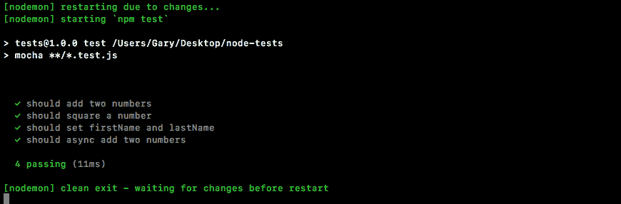

唯一的问题是它的通过是出于错误的原因。如果我们将`7`更改为`10`并保存文件：

```js
it('should async add two numbers', () => {
  utils.asyncAdd(4, 3, (sum) => {
    expect(sum).toBe(10).toBeA('number');
  });
});
```

在这种情况下，测试仍将通过。在这里，您可以看到我们有四项测试通过：

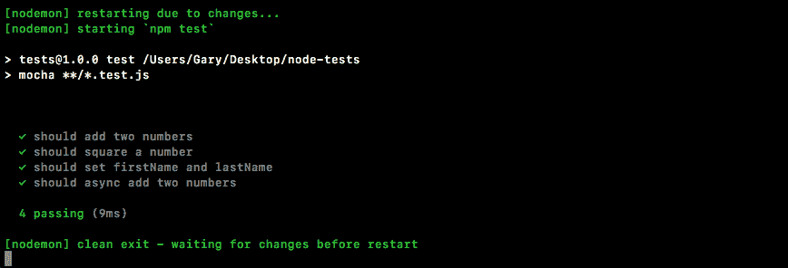

# 添加 done 参数

现在这个测试通过的原因并不是因为`utils.test.js`中的断言是有效的。它正在通过，因为我们有一个需要 1 秒的异步操作。此函数将在触发`async`回调之前返回。当我说函数返回时，我指的是`callback`函数，`it`的第二个参数。

这是摩卡认为你的测试完成的时候。这意味着这些断言永远不会运行。Mocha 的输出已经表明，在这个回调被触发之前，我们的测试通过了。我们需要做的是告诉 Mocha 这将是一个需要时间的异步测试。我们要做的就是传递一个回调函数。我们称之为`done`：

```js
it('should async add two numbers', (done) => {
```

当我们指定了`done`参数时，Mocha 知道这意味着我们有一个异步测试，在调用`done`之前，它不会完成这个测试。这意味着我们可以在断言之后调用`done`：

```js
it('should async add two numbers', (done) => {
  utils.asyncAdd(4, 3, (sum) => {
    expect(sum).toBe(10).toBeA('number');
    done();
  });
});
```

有了这个，我们的测试现在就可以运行了。函数将在调用`async.Add`后立即返回，但这没关系，因为我们已经指定了`done`。大约一秒钟后，我们的回调函数将启动。在`asyncAdd`回调函数中，我们将进行断言。这一次，断言将很重要，因为我们有`done`，但我们还没有调用它。在我们称之为“完成”的断言之后，这会告诉 Mocha 我们已经完成了测试。它可以继续处理结果，让我们知道它是通过了还是失败了。这将修复该错误。

如果我在这种状态下保存文件，它将重新运行测试，我们将看到我们的测试应该`async.Add`两个数字确实会失败。在终端内部，让我们打开错误消息，我们预计 7 是 10：


这正是我们第一次不使用`done`时所认为的情况，但正如我们所见，当我们在测试中执行异步操作时，确实需要使用`done`。

现在我们可以将此期望更改回`7`，保存文件：

```js
it('should async add two numbers', (done) => {
  utils.asyncAdd(4, 3, (sum) => {
    expect(sum).toBe(7).toBeA('number');
    done();
  });
});
```

在运行此测试时，经过 1 秒的延迟后，这段时间内的事情应该会如预期的那样工作：

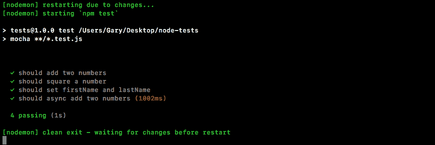

它无法立即报告，因为它必须等待完成才能接到呼叫。请注意，我们的总测试时间现在大约为 1 秒。我们可以看到，我们有四项测试通过。摩卡咖啡还警告我们，当一项测试需要很长时间，因为它假设这不是预期的。Node 内部的任何内容，即使是数据库或 HTTP 请求，都不应该花费将近一秒钟的时间，因此它本质上是在让我们知道，您的函数中可能存在错误，它需要非常非常长的时间来处理。然而，在我们的例子中，一秒钟的延迟显然是在`utils`内部设置的，因此没有必要担心这个警告。

有了它，我们现在就有了第一个异步方法的测试。我们所要做的就是添加一个`done`作为参数，并在我们完成断言后调用它。

# 平方函数的异步测试

现在，让我们创建一个异步版本的`square`方法，就像我们使用同步方法一样。为了开始，我们先定义函数，然后再编写测试。

# 创建异步平方函数

在`utils`文件中，我们可以在`square`方法旁边开始创建一个名为`asyncSquare`的新方法：

```js
module.exports.square = (x) => x * x;

module.exports.asyncSquare
```

它将包含两个参数：我们称之为`x`的原始参数和在 1 秒延迟后将被调用的`callback`函数：

```js
module.exports.square = (x) => x * x;

module.exports.asyncSquare = (x, callback) => {

};
```

然后我们可以完成箭头功能（`=>`，我们可以开始处理`asyncSquare`的主体。它看起来将非常类似于`asyncAdd`的那个。我们将调用`setTimeout`传入回调和延迟。在这种情况下，延迟将是相同的；我们将使用 1 秒：

```js
module.exports.square = (x) => x * x;

module.exports.asyncSquare = (x, callback) => {
  setTimeout(() => {

  }, 1000);
};
```

现在我们可以调用回调了。这将触发传入的`callback`函数，我们将传入值`x`乘以`x`，这将正确地将传入的数字平方以代替`x`：

```js
module.exports.square = (x) => x * x;

module.exports.asyncSquare = (x, callback) => {
  setTimeout(() => {
    callback(x * x);
  }, 1000);
};
```

# asyncSquare 的书写测试

现在在`test`文件中，事情确实通过了，但是我们还没有为`asyncSquare`函数添加测试，所以让我们这样做。在`utils.test`文件中，您需要做的下一件事是调用`it`。在`it`测试`asyncAdd`功能的旁边，我们调用`it`对`asyncSquare`功能进行新的测试：

```js
it('should square a number', () => {
  var res = utils.square(3);

  expect(res).toBe(9).toBeA('number');
});

it('should async square a number')
```

接下来，我们将提供回调函数，当测试实际执行时将调用该函数。由于我们正在测试一个`async`函数，我们将`done`放入回调函数中，如下所示：

```js
it('should async square a number', (done) => {

});
```

这将告诉摩卡等待`done`被调用来决定测试是否通过。接下来，我们可以调用`utils.asyncSquare`传入我们选择的号码。我们将使用`5`。接下来，我们可以传入一个回调：

```js
it('should async square a number', (done) => {
  utils.asyncSquare(5, () => {

  })
});
```

这将得到最终结果。在 arrow 函数（`=>`中，我们将创建一个变量来存储该结果：

```js
 utils.asyncSquare(5, (res) => {

  });
```

现在我们已经准备好了，我们可以开始发表我们的主张了。

# 为 asyncSquare 函数进行断言

断言将使用`expect`库完成。我们将对`res`变量进行一些断言。我们将使用`toBe`断言它等于数字`25`，即`5`乘以`5`。我们还将使用`toBeA`来断言值的类型：

```js
it('should async square a number', (done) => {
  utils.asyncSquare(5, (res) => {
    expect(res).toBe(25).toBeA('number');
  });
});
```

在本例中，我们希望确保`square`确实是一个数字，而不是布尔值、字符串或对象。有了这个，我们确实需要调用`done`然后保存文件：

```js
it('should async square a number', (done) => {
  utils.asyncSquare(5, (res) => {
    expect(res).toBe(25).toBeA('number');
    done();
  });
});
```

Remember, if you don't call `done`, your test will never finish. You might find that every once in a while you'll get an error like this inside the Terminal:


您收到一个错误超时，超过了 2000 毫秒。这是摩卡停止你的测试的时候。如果你看到这一点，这通常意味着两件事：

*   你有一个`async`函数，它从来没有真正调用过回调函数，所以你对 done 的调用永远不会被触发。
*   你只是从来没有打过电话。

If you see this message, it usually means there's a small typo somewhere in the `async` function. To overcome this, either fix things in the method (`utils.js`) by making sure the callback is called, or fix things in the test (`utils.test.js`) by calling `done`, and when you save the file you should now see all of your tests are passing.

在我们的例子中，我们有 5 个测试通过，这需要 2 秒钟。这太棒了：

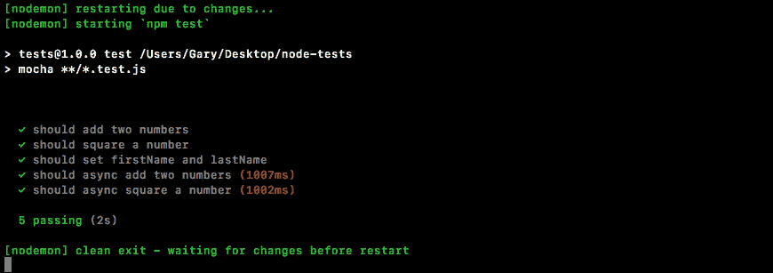

我们现在有了一种测试同步函数和异步函数的方法。这将使测试更加灵活。它可以让我们测试应用内部的所有内容。

# 总结

在本章中，我们研究了同步和异步函数的测试。我们研究了基本测试。我们探索了测试框架 Mocha。然后，我们研究如何在测试 Node 模块时使用断言库。

在下一章中，我们将了解如何测试 Express 应用。