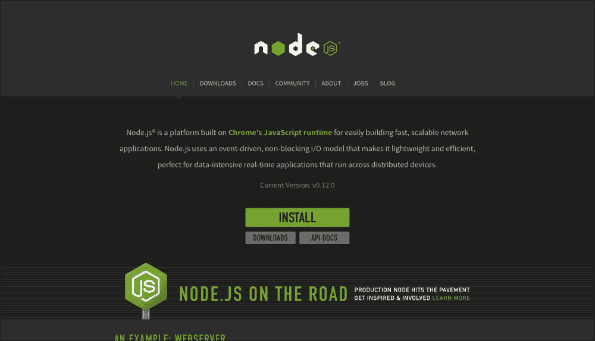
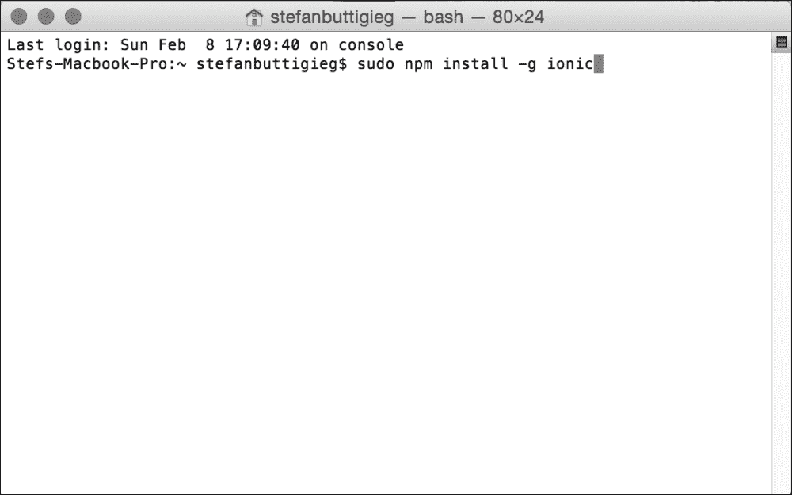
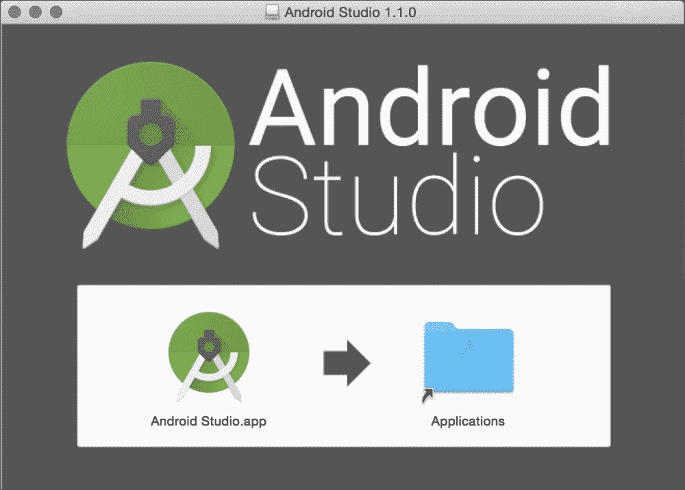
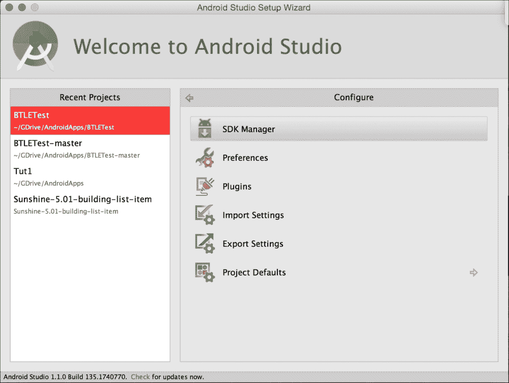

# 第一章。设置您的工作区

本书的首要目标是为您提供为用户高效构建现代跨平台解决方案所需的工具和知识。在这一章中，我们将关注工具本身，向您展示如何引导您的开发环境来应对我们在本书剩余部分中为您准备的挑战。我们还将向您简要介绍每种工具，以便让您了解它们为什么适合您的工具链。如果任何这样的细节在这一点上看起来不清楚，不要担心。我们将在本书的相关部分深入研究您需要了解的关于每个工具的一切。

阅读本章后，您将知道如何安装、配置和使用我们将在本书中使用的基本软件组件。您还将很好地理解为什么这些工具适合现代应用的开发。

# node . js 后端

现代应用有几个要求，是应用本身无法提供的，比如中央数据存储、通信路由、用户管理。为了提供这样的服务，应用依赖于一个被称为后端的外部软件组件。后端将在一个或多个远程服务器上执行，监听来自运行应用的设备的网络请求，并为它们提供请求所需的服务。

我们将在本书中使用的后端是 Node.js，这是一种强大但奇怪的野兽。在撰写本书时，Node.js 是几乎完全用 JavaScript 编写的唯一主要后端，而 JavaScript 实际上是一种前端脚本语言。Node.js 的创建者想要一个能够尽可能无缝地与用 JavaScript 编写的应用集成的后端，你不可能比 Node.js 更接近它了。除此之外，Node.js 以可靠和高性能而闻名。

在架构方面，Node.js 是高度模块化的，从头开始设计，可以通过插件或包进行扩展。Node.js 自带包管理系统，**节点包管理器** ( **NPM** ，通过它可以轻松安装、移除和管理项目的包。在本章的后面，您将看到如何使用 NPM 来安装其他必要的组件。

# 在不同系统上安装 Node.js

Node.js 作为一组 JavaScript 库交付，在围绕 Google V8 JavaScript 引擎构建的 C/C++运行时上执行。对于大多数主要的 **操作系统** ( **操作系统**)来说，这两者是捆绑在一起的，我们将在下面的章节中了解安装它的细节。

### 注

谷歌 V8 JavaScript 引擎与 Chrome 浏览器中使用的 JavaScript 引擎相同，是为了速度和效率而构建的。

## 窗户

对于 Windows，有专用的 MSI 向导安装 Node.js，可以从项目官网下载。为此，请转到主页面，导航至**下载**，然后选择**窗口安装程序**。下载完成后，运行 MSI 向导，按照步骤选择安装选项，并完成安装。请记住，您需要重新启动系统才能使更改生效。

## Linux

大多数主要的 Linux 发行版通过自己的包管理系统提供了 Node.js 的方便安装。但是，需要注意的是，对于他们中的许多人来说，**节点包管理器** ( **NPM** ) 不会与主 Node.js 包捆绑在一起。相反，它是作为单独的包提供的。我们将在下一节展示如何安装两者。

## Ubuntu/Debian

打开终端向发出`sudo apt-get update`确认有最新的套餐列表。在之后，发布`apt-get install nodejsnpm`以便一次性安装 Node.js 和 NPM。

## Fedora/RHEL/CentOS

在 Fedora 18 或更高版本上，打开一个终端并发出`sudo yum install nodejsnpm`。系统将为您完成全部设置。

如果您是运行 RHEL 或中央操作系统的，您需要启用可选的EPEL 存储库。这个可以结合安装过程来完成，这样在升级存储库时，通过发出`sudo yum install nodejsnpm --enablerepo=epel`命令就不需要再做一次了。

## 验证您的安装

现在我们已经完成了安装，让我们做一个健全性检查，并确保一切都按预期工作。为此，我们可以使用 Node.js shell，这是一个用于执行 JavaScript 代码的交互式运行时环境。要打开它，首先打开一个终端，然后向它发出以下命令:

```js
node

```

这将启动解释器，解释器将显示为一个外壳，输入行以`>`符号开始。一旦进入其中，请键入以下内容:

```js
console.log("Hello world!);

```

然后按*进入*。**你好世界！**短语应该出现在下一行。恭喜你，你的系统已经设置好运行 Node.js 了！

## Mac OS X

对于 OS X，您可以通过前往[www.nodejs.org](http://www.nodejs.org)，导航至**下载**，选择 **Mac OS X 安装程序**选项找到一个准备安装的 PKG 文件。否则，你可以点击**安装**，你的包文件会自动下载:



一旦下载了文件，运行它并按照屏幕上的指示进行操作。建议您保留提供的所有默认设置，除非有令人信服的理由让您根据您的特定机器进行更改。

## 验证您的安装

安装完成后，打开终端，通过发出以下命令启动 Node.js shell:

```js
node

```

这将启动交互式节点外壳，您可以在其中执行 JavaScript 代码。要确保一切正常，请尝试向解释器发出以下命令:

```js
console.log("hello world!");

```

按下*进入*键后，**你好世界！**短语将出现在您的屏幕上。恭喜你，Node.js 已经设置好了，可以开始了！

# 为麦克 OS X 建立离子框架和科尔多瓦

在您的苹果电脑上安装 Node.js 后，打开您的命令行应用并输入以下命令:

```js
$ sudonpm install -g ionic

```

输入此命令后，系统会提示您输入密码，如下图截图所示:



如果您已经在 OS X 设置了`npm`的权限，您可以使用以下命令安装爱奥尼亚:

```js
$ npm install -g ionic

```

前面的命令行应该会产生以下输出:


在 OS X 安装科尔多瓦与安装爱奥尼亚非常相似。您可以运行以下命令来安装科尔多瓦:

```js
$ sudonpm install -g cordova

```

# 为窗户设置离子框架和科尔多瓦

一旦你安装了 Node.js，在你的 Windows 机器上安装 Ionic。剩下的应该是直白。

运行以下命令，打开命令提示符，检查是否安装了`npm`:

```js
npm

```

一旦您确定已经成功安装`npm`，您可以继续运行以下命令:

```js
npm install -g ionic

```

这一步应该会产生一个输出，显示您已经成功安装了 ion。

为了安装科尔多瓦，还可以使用`npm`并运行以下命令:

```js
npm install -g cordova

```

一旦接收到成功的输出，就可以开始设置平台依赖项。

### 注

视窗的实验装置:

在 Windows 中，您将有机会设置一个游民包，这是在您的 Windows 机器上安装 ion 的一站式服务。可在[https://github.com/driftyco/ionic](https://github.com/driftyco/ionic)包厢进入。

## 设置平台依赖关系

要设置平台依赖关系，您需要安装 Java，这将在下一节中解释。

### 安装 Java

如果您没有安装Java或者您的版本低于 6.0，请转到[http://j.mp/javadevkit-download](http://j.mp/javadevkit-download)安装 Java JDK ，这是一个定制和缩短的链接，并选择适合您的版本。

这些项目的主要建议是安装 JDK 6.0 或更高版本。

为您的操作系统选择 JDK。在基于英特尔的 Mac 上，您可以使用以下有用的表格来检查您的 Mac 是 32 位还是 64 位操作系统。

您可以点击屏幕左上角的苹果标志，然后点击**关于我的苹果**，查看**处理器名称**:

<colgroup><col style="text-align: left"> <col style="text-align: left"></colgroup> 
| 

处理器名称

 | 

32 位或 64 位

 |
| --- | --- |
| 英特尔酷睿单核处理器 | 32 位 |
| 英特尔酷睿双核处理器 | 32 位 |
| 英特尔酷睿 2 双核处理器 | 64 位 |
| 英特尔四核至强处理器 | 64 位 |
| 双核英特尔至强处理器 | 64 位 |
| 四核英特尔至强处理器 | 64 位 |
| 酷睿 i3 | 64 位 |
| 酷睿 i5 | 64 位 |
| 酷睿 i7 | 64 位 |

就 Windows 而言，如果你有一台最近几年购买的机器，你应该选择 x64 (64 位)版本。

# 为安卓、Mac、Windows 设置安卓工作室

要为安卓、苹果和视窗设置安卓工作室，请按照的步骤操作:

1.  通过访问[http://developer.android.com](http://developer.android.com)前往安卓开发者网站。
2.  Click on **Android Studio**, where you will be directed to the landing page. Your operating system's version will be detected automatically:

    

3.  Accept the terms and conditions of the Software Use Agreement and click on **Download**:

    

4.  For Mac, double-click on the downloaded file, follow the prompts, and then drag the Android Studio icon into your **Applications** folder:

    

5.  对于窗口，打开下载的文件，然后通过**安卓工作室设置** **向导**完成安装。

# 设置安卓软件开发工具包

随着安卓工作室的推出，设置安卓**软件开发工具包** ( **SDK** )的过程有了很大的改进，因为安卓工作室安装包中预装了许多软件包。作为开始我们的安卓项目的准备工作的一部分，了解如何在安卓工作室中安装(甚至卸载)SDK 将非常有帮助。

有许多方法可以访问软件开发工具包管理器。这可以从安卓工作室的主工具栏完成:


否则，可通过导航至**配置** — **软件开发工具包管理器**从**开始**菜单进入:



这就是 SDK 管理器的样子。如果您需要安装软件包，您需要检查该特定软件包的标记，单击**安装软件包**，然后最终接受许可证:


# 设置你的实体安卓设备进行开发

以下是需要采取的三个主要步骤，以使您的安卓设备能够进行开发:

1.  在您的特定安卓设备上启用**开发者选项**
2.  启用 **USB 调试**
3.  通过安全的通用串行总线调试，为您的计算机提供安装的集成开发环境所需的信任凭据。(搭载安卓 4.4.2 的设备)

## 启用开发人员选项

根据您的设备，这可能会略有不同，但从安卓 4.2 及更高版本开始，**开发者选项**屏幕默认隐藏。

要启用它，导航至**设置** | **关于电话**并点击**建立**号码七次。当您返回上一屏幕时，您会发现**开发人员选项**已启用。

## 启用 USB 调试

**USB 调试**使 IDE 能够通过 USB 端口与设备通信。这可以在启用**开发者选项**后激活，并通过使用以下路径检查 **USB 调试**来完成:

**设置** — **开发者选项** — **调试** — **USB 调试**

## 使用安全 USB 调试信任安装了 IDE 的计算机(安卓 4.4.2 设备)

您必须接受手机或平板电脑上的 RSA 密钥，才能通过 **安卓调试桥** ( **亚行**)在设备之间传输任何内容。这是通过将设备通过 USB 连接到计算机来完成的，这会触发名为**启用 USB 调试的通知？**

勾选**始终允许从本** **电脑**点击**确定**。

# 在 Windows 7 及更高版本上设置环境变量

使用爱奥尼亚和科尔多瓦构建一个安卓应用可能需要修改视窗上的 T2 路径。这可以通过以下步骤完成:

1.  右键点击**我的电脑**，然后点击**属性**。
2.  点击左侧栏中的**高级系统设置**。
3.  在生成的对话框中，选择**环境变量**。
4.  选择**路径**变量，点击**编辑**。
5.  根据您安装软件开发工具包的位置，在**路径**中添加以下内容:

    ```js
    ;C:\Development\adt-bundle\sdk\platform-tools;C:\Deve
    lopment\adt-bundle\sdk\tools

    ```

# 在 Mac OS X 上为 iOS 设置环境变量

为 iOS 开发需要你从运行在 Mac OS X 上的机器上开发，在这个时间点，不可能从 Windows 开发 iOS 应用。在以下步骤中，我们将概述如何开始为 iOS 开发离子应用。

## 安装 iOS 软件开发工具包

以下是可以用来下载 Xcode 的两种方式:

*   从应用商店中，在应用商店应用中搜索 **Xcode**
*   它可以在苹果开发者下载网站上找到，该网站要求您注册为苹果开发者。

命令行工具集成在 Xcode 中。以前，这是单独安装的。一旦您下载并安装了 Xcode，您就可以从启用了苹果 OS X 的机器上处理 iOS 项目了。

# 蒙戈布

为了存储与你的应用和用户相关的数据，你的服务器需要一个数据库——一个专门用于数据存储和检索的软件。

数据库有许多变体。在本书中，我们的重点是**【NoSQL】**数据库，之所以如此命名，是因为它们没有使用传统的面向表的 SQL 数据访问架构，而这种架构是由更知名的关系数据库使用的，例如 Oracle、MySQL 和 PostgreSQL。NoSQL 数据库的设计和功能非常新颖，非常适合应对现代应用开发中可能面临的挑战。

我们将在本书中使用的 NoSQL 数据库是 MongoDB(它通常缩写为 MDB 或简称为 Mongo)。MongoDB 是一个面向文档的数据库，它将数据存储在文档中，文档是与标准 JSON 格式几乎相同的数据结构。

让我们看看如何安装和运行 MongoDB。如果您使用了更传统的数据库系统，您可能会惊讶于它有多容易。

## 在不同操作系统上安装 MongoDB

MongoDB 以包的形式提供给大多数主要的操作系统和版本。

### 窗户

MongoDB 附带了一个完整的 MSI，用于在 Windows 系统上安装。要下载，进入项目官网，[www.mongodb.org](http://www.mongodb.org)，导航至**下载**，选择**窗口**选项卡。您将获得以下三种下载选择:

*   **Windows 64 位 R2+** :如果您运行的是 Windows Server 2008、Windows 7 64 位或更新版本的 Windows，请使用此
*   **Windows 32 位**:如果你有比 Windows Vista 更新的 32 位 Windows 安装，就用这个
*   **Windows 64 位旧版**:如果您使用的是 Windows Vista 64 位、Windows Server 2003 或 Windows Server 2008，请使用此选项。

### 注

MongoDB 根本不在 Windows XP 上运行。

下载 MSI 后，以管理员权限运行它，以便执行安装。安装向导将为您提供安装 MongoDB 的默认位置— `C:/mongodb/`。如果您愿意，您可以更改它，但是建议您保留它，因为我们将假设这是 MongoDB 在本书剩余部分中驻留的位置。

安装完成后，下一步是配置一个数据目录，MongoDB 可以在其中存储我们将要提供给它的数据。该目录的默认位置是`/data/db`。在我们第一次启动 MongoDB 实例之前，我们需要确保这个目录存在并且是可写的。因此，以管理员权限启动命令提示符并发出`md/data/dbcommand`。这样做之后，我们就可以启动数据库服务器本身了。为此，请停留在命令提示符下，并发出以下命令:

```js
C:/mongodb/bin/mongodb.exe

```

您应该会收到 MongoDB 正在运行并正在侦听连接的确认。一切就绪！

### Linux

在 Linux 上，你会发现 MongoDB 已经在大多数主要的发行版上打包好了。但是，我们强烈建议您使用项目自己的存储库，以确保您始终能够访问最新的安全性和稳定性更新。

### Ubuntu

首先，您需要启用官方 MongoDB 存储库。为此，打开一个终端，首先导入项目的公共 **GNU 隐私保护** ( **GPG** )键如下:

```js
sudo apt-key adv --keyserverhkp://keyserver.ubuntu.com:80 --recv7F0CEB10

```

完成后，通过发出以下命令为存储库本身创建一个列表:

```js
echo 'deb http://downloads-distro.mongodb.org/repo/ubuntu-upstart dist10gen' | sudo tee /etc/apt/sources.list.d/mongodb.list

```

您的存储库列表现在处于活动状态。让**高级打包工具** ( **APT** ) 知道它以便安装 MongoDB，如下:

```js
sudo apt-get update

```

最后，发出以下命令来安装 MongoDB:

```js
sudo apt-get install mongodb-org

```

### Fedora/RHEL/CentOS

我们这里业务的第一个订单是启用官方 MongoDB 存储库。为此，首先通过打开终端并发出以下命令，确保您安装了纳米文本编辑器:

```js
sudo yum install nano

```

完成后，通过发出以下命令将添加到存储库中:

```js
sudonano /etc/yum.repos.d/mongodb.repo

```

Nano 将打开一个新的空白文本文件。将以下内容复制并粘贴到文件中:

```js
[mongodb]
name=MongoDB Repository
baseurl=http://downloads-distro.mongodb.org/repo/redhat/os/x86_64/
gpgcheck=0
enabled=1

```

按 *Ctrl+O* 保存并关闭文件，然后按*回车*键。其次是 *Ctrl+X* 。

最后，通过发出以下命令来执行安装:

```js
sudo yum install mongodb-org

```

## 启动 MongoDB

安装 MongoDB 后，您将需要启动 MongoDB 作为服务，以便让它运行。为此(在前面提到的所有发行版上)，打开一个终端并运行以下命令:

```js
sudo service mongodb start

```

重要的是，如果您运行 SELinux，您必须确保它允许 MongoDB 访问其默认端口。为此，在发出上述命令之前，请发出以下命令:

```js
sudosemanage port -a -t mongod_port_t -p tcp 27017

```

### Mac OS X

在 OS X 安装和更新 MongoDB 最简单的方法是使用 **自制程序**包管理器。即使我们只是在这里用它来安装 MongoDB，你很可能会发现它对你完成这本书后安装你自己项目可能需要的其他软件包很有用。

安装自制程序很简单；只需打开终端并发出以下命令:

```js
ruby -e "$(curl -fsSL https://raw.githubusercontent.com/Homebrew/install/master/install)"

```

完成后，请确保自制软件包数据库是最新的，如下所示:

```js
brew update

```

最后，只需发出以下命令即可安装 MongoDB:

```js
brew install mongodb

```

安装完成后，我们需要定义一个数据目录，以便为 MongoDB 提供存储数据的位置。默认情况下，该目录将位于`/data/db`。因此，除非您指定了其他内容，否则您需要确保该目录存在，并且运行您的 MongoDB 实例的用户既可以写也可以读。例如，如果在您的系统上运行 MongoDB 的用户是*约翰*，您将必须发出以下命令:

```js
sudomkdir -p /data/db
sudochmod 0755 /data/dbsudochownmongod:mongod /data/db

```

现在，这已经完成，是时候启动 MongoDB 了。为此，请确保您以 *john* 身份登录，打开一个终端，并简单地发出以下命令:

```js
mongodb

```

就这样！您应该收到 MongoDB 已启动并正在监听连接的通知。您的实例已经准备好了！

#### 连接到蒙古数据库

为了读取和写入 MongoDB 实例，我们首先需要连接到它。事实上，MongoDB 本身就是一个服务器。它通过一个网络端口公开其功能，客户端可以通过本地机器甚至互联网连接到该端口。

### 注

由于该功能是一种低劣的安全实践，因此默认情况下是禁用的，因此需要对 MongoDB 运行的操作系统进行特殊配置。我们将不讨论这个功能，因为它不在本书的范围内，但是我们将参考 MongoDB 文档，了解如何在各种操作系统中实现它的几个有用的例子。

要连接到 MongoDB 实例，您至少需要以下信息:

*   **实例**的 IP 地址:如果您正在本地机器上访问一个实例，默认情况下，这将是*本地主机*。
*   【MongoDB 监听的端口:除非配置自定义值，否则始终默认为端口 *27017* 。
*   **您试图连接到的数据库**:不要将其与 MongoDB 实例本身混淆。每个 MongoDB 实例可以包含任意数量的数据库，每个数据库属于不同的用户。实例只是管理对它们的访问。

或者，您可能还需要以下内容:

*   一个用户名及其关联的密码，用于授予您对实例以及其中您有权与之交互的任何数据库的访问权限。

亲自尝试这种连接并验证 MongoDB 是否如预期那样工作的一个非常简单的方法是使用 MongoDB 外壳，这是一个随 MongoDB 本身一起安装的工具，使用我们前面描述的方法。如何访问外壳取决于您的操作系统。我将在下一节展示每种方法，然后举例说明如何使用 shell 本身，因为这在所有平台上都是一样的。

### 窗户

首先，通过遵循前面概述的流程，确保 MongoDB 正在运行。之后，在命令提示符下发出以下命令:

```js
C:\mongodb\bin\mongo.exe

```

### Linux 和 OS X

首先，确保 MongoDB 正在运行。然后，打开一个终端，发出以下命令:

```js
mongo

```

现在我们的 shell 正在运行，让我们通过创建一个数据库并向其中添加一些数据来验证一切正常。

要创建数据库，请向 shell 发出以下命令:

```js
use Fruits

```

这将创建一个名为`Fruits`的数据库，我们可以立即开始向其中添加数据。(什么，你以为会有更多开销？不是在 MongoDB！)

我们不会向数据库中添加集合。一个集合只是一篮子数据条目，这些条目是根据某种逻辑特征分组的。例如，假设我们想要一批耐嚼的水果。然后，我们发出以下命令:

```js
db.createCollection("Chewy")

```

外壳应该用`{ "ok" : 1 }` JSON 响应来回应，告诉我们一切都很顺利。现在，让我们在我们的收藏中加入一些耐嚼的水果，如下所示:

```js
db.Chewy.insert({"name" : "pear"});
db.Chewy.insert({"name" : "apple"});

```

即使命名直观地表明了前面代码中发生了什么，如果您还不了解所有细节，也不要担心。我们会在适当的时候处理这件事。

最后，让 MongoDB 向我们展示我们储存的耐嚼水果。发出以下命令:

```js
db.Chewy.find();

```

外壳将做出如下响应:

```js
{ "_id" : ObjectId("54eb3e6043adbad374577df9"), "name" : "apple" }
{ "_id" : ObjectId("54eb4036cdc928dc6a32f686"), "name" : "pear" }

```

`_id`数字在你的系统上会不一样，但是你会发现名字是一样的。所有的水果都在我们想要的地方。

恭喜你现在已经有了一个完全运行的 MongoDB 设置准备行动！

# 总结

到目前为止，您可能已经注意到贯穿我们为工具链选择的所有组件的红线；它们都基于 JavaScript。这使我们能够用一种语言从上到下编写所有的逻辑，而不是对不同的组件使用不同的语言(Objective-C 或 Java 用于客户端，PHP 用于服务器，SQL 用于数据库，或者一些其他邪恶的组合)。正如您将在本书的剩余部分看到的，这将使我们更容易编写简洁、集中和可理解的代码。

一旦你完成了前面的所有步骤，我可以有把握地假设你有必要的工具包，你已经准备好应对即将到来的章节，在那里我们将有机会创建我们的第一个离子应用，并使其在安卓和 iOS 设备上工作。

一旦您完成了工作空间的设置，我建议您花一些时间阅读 Apache Cordova 文档，尤其是与不同平台依赖关系相关的文档。

在下一章中，我们将进行进一步的准备，并使用 MongoDB 配置持久性，作为我们为自己的离子应用后端做准备的一部分。