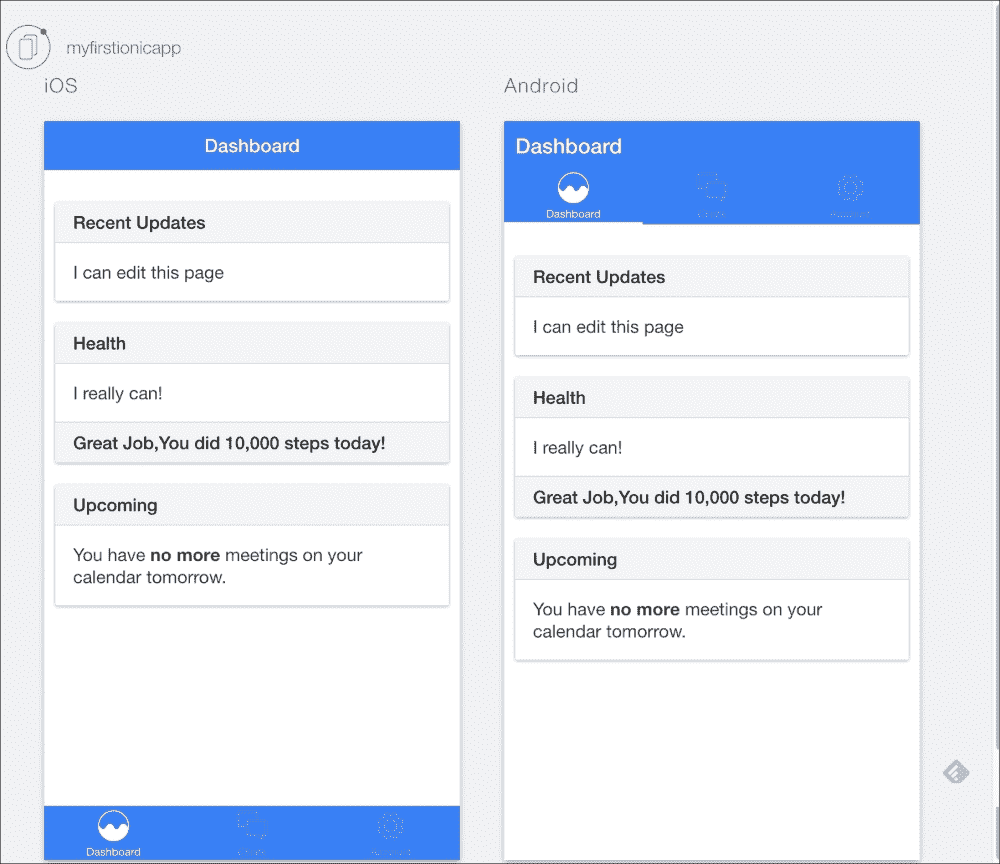

# 第七章。构建用户界面

在本章中，您将学习如何从实用的角度向当前的 ion 项目添加新的独特元素并对其进行修改。其中，我将向您展示如何修改选项卡图标和添加新的选项卡控制器。本章将指导您，并为您提供深入了解如何创建和修改自己的移动应用所需的必要知识。

最重要的是，您还将熟悉 AngularJS JavaScript 框架，这是 Ionic 功能的核心。

这个修改项目的全部源代码可以在 GitHub 资源库上找到，可以通过访问[https://github.com/stefanbuttigieg/nodejs-ionic-mongodb](https://github.com/stefanbuttigieg/nodejs-ionic-mongodb)查看。

# 离子项目的结构

在前几章创建项目的过程中，我们创建了一个名为`myfirstionicapp`的目录，可以在根文件夹中找到。我们建议您使用 **集成开发环境** ( **IDE** )或文本编辑器打开此项目文件夹。在我们的例子中，我们很容易使用 Atom，这是一个高级的开源文本编辑器。

### 注

你可以从[https://atom.io/](https://atom.io/)下载 Atom。

一旦您打开您的 IDE 并将项目文件夹添加到您的工作区，您将看到以下文件夹结构:


让我们依次仔细查看一下前面截图中显示的每个文件夹:

*   `hooks`:这个文件夹是我们的项目将自动(或手动)为底层 Cordova 系统存储生成的钩子的地方，它提供了我们项目的大部分运行时。
*   `platforms`:这个文件夹包含了在特定平台上部署项目所需的必要文件和配置，比如安卓或者 iOS。
*   `plugins`:这个存储了我们项目的各种科尔多瓦插件。如果您仔细检查它，您会发现它已经包含了许多默认插件，如`com.ionic.keyboard`，这使得使用每个平台的本机键盘功能变得更加容易。
*   `resources`:这个包含全局和平台特定的资源，比如 app logos、闪屏等等。
*   `scss`:这包含了我们项目的核心 **Sass** ( **语法上很棒的样式表**)文件。通过修改这些，我们可以广泛地改变我们的应用在它所针对的各种平台上的外观。
*   `www`: This is the folder that you will find yourself working with more than any other folder.

    如果您以前使用过 web 应用，您会熟悉它的内容:

    *   `css`:这个包含你的应用的 CSS 文件。
    *   `img`:这个包含你的应用的静态图片。
    *   `js`:这个包含你的应用的 JavaScript 文件。这也是您的大多数定制应用逻辑将驻留的地方。
    *   `lib`:这个包含可以在你的项目中使用的第三方库和应用。除此之外，这个文件夹包含了 AngularJS 本身，以及相关的依赖项。
    *   `templates`:这个包含 AngularJS 模板文件，是 HTML 文件，可能包含 AngularJS 特有的内容，比如数据绑定和指令(不用担心，我们一会儿会解释这些是什么)。

如前所述，你自己的工作将主要局限于`www`文件夹。这是有道理的，因为我们用离子键创建的项目实际上是一种特殊的网络应用，可以在移动设备上运行。

现在我们已经熟悉了项目的结构，让我们来看看 AngularJS，这是一个让它工作的框架。只会越来越好。

# 介绍 AngularJS

Ionic 由 AngularJS 框架(通常也称为 Angular)提供动力，该框架驱动用户界面交互、手势、动画以及应用的全部功能。理解这一点对于体验与爱奥尼亚合作至关重要。

Angular 最初是由谷歌在 2009 年开发的，旨在通过标签级别的动态数据绑定来增强 HTML(名称 **Angular** 指的是 HTML 标签周围的**角括号**)。它的架构理念牢固地建立在 **【模型-视图-控制器】** ( **MVC** )模式的基础上，并以构建用户界面的增强 HTML 语法和创建业务逻辑的功能丰富的模块化核心框架为中心。

由于其的广泛性，写一篇简洁的 Angular 入门并不容易。在接下来的章节中，我们将逐步深入，增加对框架的了解。在这里，我们将满足于对 AngularJS 最重要的方面的概述，这样您就可以理解这些方面在 ion 的环境中是如何工作的。

## Angular app 的结构

当我们完成本章和接下来的章节时，你会很快意识到你用 ion 构建的实际上是为移动设备设计的增强 Angular 应用。既然是这种情况，理解 Angular 应用的结构就变得至关重要。

## 模块

Angular 应用最基本的模块是，嗯，模块。一个**模块** 是**服务**、**控制器**和**指令**的集合，它们为你的应用提供了一些特定的功能。其实你的 Angular app 本身就是一个模块！

定义模块相当简单:

```js
angular.module('starter', []);
```

这会创建一个名为`starter`的`module`。第二个参数旨在包含一个依赖列表(稍后将讨论更多相关内容)。如果模块不依赖于任何其他模块，则此参数留空。

### 模块内模块内模块

模块可以加载其他模块，将它们的功能合并到自己的模块中。这使得开发人员编写和共享实用程序模块变得非常容易，其他开发人员可以在自己的应用中使用这些模块(在编写本书时，GitHub 上托管了成千上万个这样的模块，其中许多模块正在积极开发中)。

还记得我们刚才看到的例子中的那些空括号吗？您可以在这里列出当前模块为自己使用而应该加载的所有模块。例如，在我们的离子应用中，`ionic`模块是我们一直想要的基本组件:

```js
angular.module('myapp', ['ionic']);
```

现在，每当这个模块被加载时，Angular 会自动加载它的依赖项。

### 服务、控制者和其他野兽

如前所述，Angular 模块包含其他组件，为应用提供各种功能。在这里详细描述它们只会让事情变得混乱，所以我们会在继续的时候介绍它们(如果不是在这里，那么在后面的章节中，需要它们的地方)。现在，只要知道它们的存在就足够了，它们共同组成了 Angular 模块的功能。

## 角度 MVC 模式

现在我们对 Angular app 的结构有了更好的理解，是时候看看它在运行时是如何工作的了。

Angular 应用的功能围绕以下三个核心概念展开:

1.  **视图**是用户看到的，也是用户主要通过其与应用交互并从应用读取输出的媒介。
2.  **控制器** 响应用户与应用的交互，并与模型通信，以产生适当的数据。然后，它会更新视图以反映该数据。
3.  **模型** 是构成应用业务逻辑的数据、库、服务和其他东西的集合。模型负责应用中的大量处理，它通常是您的大部分代码驻留的地方。

这三个概念组成了 MVC 模式——模型-视图-控制器。这是现代网络应用非常流行的设计模式。

现在我们知道了 Angular 应用是如何工作的，让我们看看它是如何实现这三个概念的。

### 视图

在 Angular 应用中，视图主要由标准的 HTML 组成，为了便于动态更新，该 HTML 由 Angular 特定的组件扩充。以下是两个主要组件:

*   **指令**:这些是定制的 HTML 标签，其功能和行为是从 AngularJS 中定义的，但是编写起来像普通的 HTML。例如，像下面这样的标签可以是绘制以特定纬度和经度为中心的地图的指令:

    ```js
    <map lat="39.234" lng="43.453"></map>
    ```

*   **Expressions**: These are the expressions that are surrounded by double curly braces, which evaluate to a given value during the runtime of the application. Unless specified otherwise, the output of an expression will be updated as soon as the model of the application changes. The following is an example of such an expression:

    ```js
    {{ person.firstname }}
    ```

    前面的表达式做了一些在 Angular 中非常常见的事情——解析某个对象成员的值。然而，要做到这一点，我们首先需要定义在哪里可以找到该对象。这就是控制器出现的地方。

### 控制器

在 Angular app 中，**控制器**由特殊的模块组件实现，这些组件被恰当地称为控制器。您可以通过以下方式在模块中定义它们:

```js
angular.module('myapp.controllers', [])
controller('MyCtrl', function($scope) {})
```

第一个参数是`controller`的名称。第二个参数是`function`，定义控制器实际做什么。这个`function`可以接受可变数量的参数，这些参数代表控制器将使用的依赖关系，很像我们之前定义模块依赖关系的方式。

### 模型

广义地说，**模型**就是你应用中的*其他一切*。它是数据模型的总和。在接下来的章节中，我们将逐步探索您可以用来构建模型的各种组件。

## 把所有的放在一起

让我们通过展示如何连接到目前为止我们已经看到的各种组件来结束我们对 Angular 的简短参观。

考虑您首先导航到`index.html`的情况，它在以下路径`myfirstionicapp/www/index.html`可用:

当您导航到此处时，您将看到以下代码块:

```js
<ion-nav-bar class="bar-stable">
  <ion-nav-back-button>
  </ion-nav-back-button>
</ion-nav-bar>
```

这个代码块决定了应用的标题栏，这是 **用户界面** ( **UI** )组件的例子之一，可以通过 HTML5 进行管理。

出于文档和参考目的，您可以参考位于[http://ionicframework.com/docs/components](http://ionicframework.com/docs/components)的离子用户界面组件。

当您进一步研究您的项目时，您将会看到，为项目的交互功能提供动力的主控制器可以通过以下路径获得:

**my filicapp**|**js**|**controllers . js**

# 修改离子项目

为了建立在我们已经获得的知识和我们之前已经完成的工作的基础上，我们将修改我们之前创建的项目的用户界面。我们将从修改标题开始。

## 修改表头

假设我们想要将标题栏更改为平静的蓝色。导航到位于**www**|**index.html**的`index.html`文件。

参考`body`块，使用参考 UI 组件，将`ion-nav-bar`类改为如下:

```js
<ion-nav-bar class="bar-positive">
  <ion-nav-back-button>
  </ion-nav-back-button>
</ion-nav-bar>
```

## 修改标签颜色、图标和名称

由于我们已经决定更改标题颜色，我们将继续修改标签栏，使其颜色与标题颜色相匹配。我们应该首先导航到`tabs.html`文件，该文件可在 **www** | **模板**|**tabs.html**上获得，并将`ion-tabs`类更改为以下内容:

```js
<ion-tabs class="tabs-striped tabs-icon-top tabs-background-positive tabs-color-active-positive">
```

`icons`需要进一步修改以与新的`blue`颜色形成对比。所以，我们将`ion-tabs`类进一步修改为:

```js
<ion-tabs class=" tabs-striped tabs-icon-top tabs-background-positive tabs-color-light">
```

我们将进一步尝试改变图标的图形。假设我们希望将仪表板图标更改为看起来更圆的东西。

首先，我们需要参考[http://ionicons.com/cheatsheet.html](http://ionicons.com/cheatsheet.html)提供的爱奥尼亚文档，并找到与循环分析图标相关的类名。对于这个例子，我们将使用`ion-ios-analytics`。当我们希望用户点击图标并激活仪表板时，我们希望图标高亮显示，而当它不活动时，我们需要用户看到图标的轮廓。为了实现这一点，我们需要声明将在活动和非活动状态下使用的图标。

为此，我们将导航至`tabs.html`文件，并通过以下方式修改`Dashboard`选项卡图标:

```js
<ion-tab title="Dashboard" icon-off="ion-ios-analytics-outline" icon-on="ion-ios-analytics" href="#/tab/dash">
  <ion-nav-view name="tab-dash"></ion-nav-view>
</ion-tab>
```

## 修改我们的页面

在这个的特殊例子中，我们将编辑仪表板页面，在这里我们将修改**列表卡**用户界面组件的内容。

通过导航到`tab-dash.html`文件，可以修改仪表板，在这里我们将看到在`list card`的`div`类中声明的不同卡片。

`list card`声明如下:

```js
<div class="list card">
  <div class="item item-divider">Title of List Card</div>
    <div class="item item-body">
    <div>
    List Card Content
  </div>
</div>
```

通过使用离子框架，可以在你的卡片上添加一个页脚。在我们的例子中，我们将在`Health`列表卡中添加一个页脚，声明用户今天已经走了`10,000`步。为了做到这一点，我们将在中添加一个`item-divider`类，从而对`list card`进行如下修改:

```js
<div class="list card">
  <div class="item item-divider">Health</div>
  <div class="item item-body">
    <div>
      I really can!
    </div>
  </div>
  <div class="item item-divider">
    Great Job, You did 10,000 steps today!
  </div>
</div>
```

您到目前为止所做的所有修改将会产生一个**仪表盘**选项卡，如下图所示:



# 添加新标签

在这个项目中，我们想要添加一个新的选项卡，突出显示这个应用的开发人员。这将告知该应用的潜在用户如何与开发人员联系，以向他们提供必要的反馈来改善应用体验。

为了实现这一点，我们需要执行以下四个主要步骤:

1.  在`controllers.js`中创建新的控制器条目。
2.  在 HTML 中创建新的标签控制器`tab-about`。
3.  在`tabs.html`文件中添加一个新的标签条目。
4.  将我们的工作合并到`app.js`文件中，并将所有内容连接在一起。

## 创建新控制器

让我们从为新标签添加控制器开始。前往`controllers.js`并添加以下内容:

```js
controller('AboutCtrl', function($scope) {})
```

暂时不用担心空函数。目前，我们的标签除了简单地出现之外，不需要任何功能。

## 创建视图

现在我们有了控制器，我们需要实现新选项卡的视图。业务的第一个顺序是确保将选项卡添加到选项卡列表中。为此，修改`tabs.html`以包括以下内容:

```js
<!-- About Tab -->
<ion-tab
title="About"
icon-off="ion-ios-information-outline" icon-on="ion-ios-information"
href="#/tab/about">

<ion-nav-view name="tab-about"></ion-nav-view>

</ion-tab>
```

这将为新选项卡创建基本绑定，并将其添加到选项卡列表中。然而，我们仍然需要添加当用户点击标签时应该打开的内容。为此，在`templates`文件夹中创建一个名为`tab-about.html`的新文件，并在其中放入以下代码:

```js
<ion-view view-title="About">
  <ion-content>
    <div class="list card">
      <a href="#" class="item item-icon-left">
        <i class="icon ion-ios-people"></i>
        Christopher Svanefalk and Stefan Buttigieg
      </a>
      <a href="#" class="item item-icon-left">
        <i class="icon ion-home"></i>
        Malta and Sweden
      </a>

      <a href="#" class="item item-icon-left">
        <i class="icon ion-ios-telephone"></i>
        +3569912345678
      </a>
      <a href="#" class="item item-icon-left">
        <i class="icon ion-ios-world-outline"></i>
        www.ionicframework.com
      </a>
    </div>
  </ion-content>
</ion-view>
```

## 为新标签添加状态

接下来，我们需要给`controller`添加一个新的导航状态，以便允许用户在点击的帮助下导航到`tab-about.html`标签内容页面。为此，打开`app.js`文件并添加以下状态:

```js
state('tab.about', {
  url: '/about',
  views: {
    'tab-about': {
       templateUrl: 'templates/tab-about.html',
       controller: 'AboutCtrl'
     }
  }
})
```

请注意，前面的代码是这样做的:

*   `url`属性决定应用是否进入访问`/about`网址的状态。
*   在`views`属性中，我们确定了`view`的路径，当应用进入`view`状态时，应该加载该路径。在这种情况下，是我们之前创建的`tab-about.html`文件。
*   最后，在`views`内部，我们也确定哪个`controller`负责处理这个应用状态。在我们的例子中，它是`AboutCtrl`控制器，这是我们之前定义的。

## 测试新创建的选项卡

快速测试可以通过你的本地浏览器进行。使用 IDE 保存项目文件后，您将能够通过浏览器看到原型形式的应用:

1.  首先导航到项目文件夹:

    ```js
    cd myfirstionicapp

    ```

2.  然后，键入以下命令:

    ```js
    ionic serve --lab
    ```

下面的截图显示了结果。这些结果适用于 iOS 和安卓系统。除此之外，您还可以通过点击式界面测试您的应用。这种体验类似于让 iOS 或 Android 模拟器通过浏览器工作:


# 走得更远

在开始任何项目之前，设置布局和用户体验的重要性是至关重要的。这将增强您的用户体验，不仅在规划必要的项目结构时，而且在整个编程过程中，这将更有帮助。

您可以使用 Sass 进一步自定义应用的外观。Sass 被营销为最成熟、最稳定、最强大的专业 **级 CSS 扩展语言**，它可以让你进一步定制你的项目。

为了提高您对 AngularJS 的了解，我们建议您查看免费视频资源，该资源可在[http://campus . codeschool . com/courses/shaping-up-with-angular-js](http://campus.codeschool.com/courses/shaping-up-with-angular-js)、[http://campus . codeschool . com/courses/shaping-up-with-angular-js](http://campus.codeschool.com/courses/shaping-up-with-angular-js)获得。

上述课程由谷歌赞助，任何想深入了解 AngularJS 的人都可以免费获得。尝试不同的爱奥尼亚用户组件变得比以往任何时候都更容易，尤其是最近在 **爱奥尼亚游乐场**中提供的 **游乐场**工具，该工具可在[http://play . ion . io](http://play.ionic.io)上获得。

从安卓的角度来看，为了让你的项目更上一层楼，有一个免费的库可用，可以通过安装 Ionic Material 库来整合谷歌最新迭代的交互 Material 设计。通过首先确保您已经安装了 bower，然后导航到您的项目文件夹并输入以下命令，可以很容易地安装它:

```js
bower install ionic-material

```

我们希望，通过这一章，您将开始尝试您自己的项目，同时保持一致，用您迄今为止获得的现有知识提供卓越的用户体验。在下一章，我们将更进一步。

# 总结

在本章中，我们采用了我们在过去几章中创建的模板项目，并通过修改用户界面的外观，将其修改为更接近我们所设想的内容。除此之外，我们还开始试验离子项目代码，以更好地理解项目是由什么组成的。

此外，我们为您提供了在浏览器中开始原型化您的 ion 应用的基本知识。