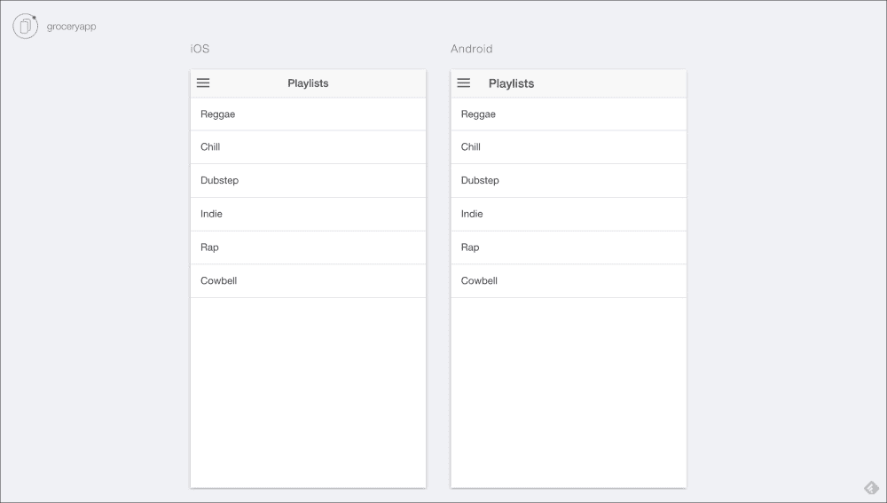
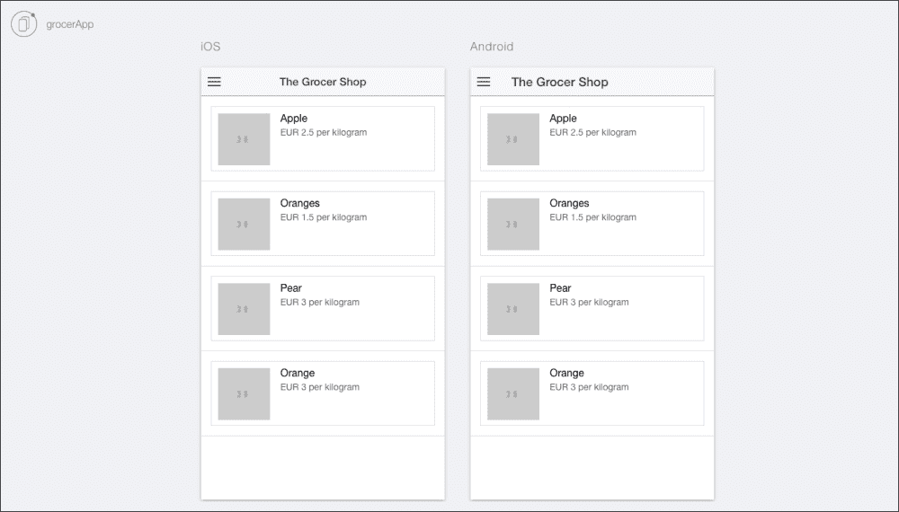

# 十四、使用Ionic框架创建电子商务应用

在这一章中，我们将把我们到现在为止在这本书中积累的所有知识汇集在一起，并在一个易于使用的 ion 框架中实现，这个框架可以应用在我们自己的项目中。

特别是，在这一章中，我们将在[第 3 章](03.html "Chapter 3. Creating an API")、*中已经完成的工作的基础上，创建一个 API* ，我们将把这项工作用于一个 Ionic 项目，该项目可以通过安卓或 iOS 智能手机访问。

# 设计我们的应用

作为应用开发过程的部分，重要的是我们要了解我们将如何构建我们的应用并将其连接到产品 API，以便实现我们创建基本电子商务应用的最终目标。

对于这个特定的项目，我们将在两个主屏幕上工作——产品的列表项、控制器和产品页面。除此之外，我们还将专注于创建一个基本的功能性侧菜单和一个基本的购买选项，在这个阶段它是不起作用的。

## 创建一个Ionic项目

我们将通过创建一个基于我们在前面章节中没有机会使用的一个Ionic启动器模板的项目来开始我们的项目。侧面菜单模板为我们提供了侧面菜单、列表项视图和列表项详细视图。这个模板应该为我们创建理想的电子商务应用提供必要的基础。

打开您的终端并输入以下命令:

```js
$ ionic start grocerApp sidemenu

```

前面的命令将用`sidemenu`项目创建一个项目文件夹。为了进一步了解该模板的工作原理，我们建议您首先导航到`project`文件夹，然后输入以下命令:

```js
$ ionic serve --lab

```

这将打开您选择的浏览器，并为您提供该应用在安卓和 iOS 设备上的并排视图:



## 实现我们的设计

当实现我们的设计时，我们需要在应用的代码中反映必要的变化。我们将首先从修改控制器开始。

我们将首先导航至`app.js`，路径`www/js/app.js`中提供。

我们将用以下代码替换`app.js`中的现有代码:

```js
angular.module('starter', ['ionic', 'starter.controllers'])

.run(function($ionicPlatform) {
  $ionicPlatform.ready(function() {
  // Hide the accessory bar by default (remove this to show the accessory bar above the keyboard
  // for form inputs)
  if (window.cordova && window.cordova.plugins.Keyboard) {
    cordova.plugins.Keyboard.hideKeyboardAccessoryBar(true);
    cordova.plugins.Keyboard.disableScroll(true);

  }
  if (window.StatusBar) {
    // org.apache.cordova.statusbar required
    StatusBar.styleDefault();
  }
});

.config(function($stateProvider, $urlRouterProvider) {
  $stateProvider

  .state('app', {
    url: '/app',
    abstract: true,
    templateUrl: 'templates/menu.html',
    controller: 'AppCtrl'
  })

  .state('app.search', {
    url: '/search',
    views: {
      'menuContent': {
      templateUrl: 'templates/search.html'
    }
  }
})

state('app.products', {
  url: '/products',
  views: {
    'menuContent': {
    templateUrl: 'templates/products.html',
    controller: 'ProductsCtrl'
  }
}
})

.state('app.single', {
  url: '/products/:productId',
  views: {
    'menuContent': {
    templateUrl: 'templates/product.html',
    controller: 'ProductCtrl'
    }
  }
});
// if none of the above states are matched, use this as the fallback
$urlRouterProvider.otherwise('/app/products');
});
```

上述代码将允许我们实现构成我们应用一部分的不同屏幕，即`products`页面、单个产品和搜索功能，这些在当前版本的应用中不会实现。

我们修改阶段的下一步是在我们的 app `controllers`中实现必要的更改，这些更改基于`controllers.js`文件。继续，用以下代码替换现有代码:

```js
angular.module('starter.controllers', [])

.controller('AppCtrl', function($scope, $ionicModal, $timeout) {

  // Form data for the login modal
  $scope.loginData = {};

  // Create the login modal that we will use later
  $ionicModal.fromTemplateUrl('templates/login.html', {
    scope: $scope
  }).then(function(modal) {
    $scope.modal = modal;
  });

  // Triggered in the login modal to close it
  $scope.closeLogin = function() {
    $scope.modal.hide();
  };

  // Open the login modal
  $scope.login = function() {
    $scope.modal.show();
  };

  // Perform the login action when the user submits the login form
  $scope.doLogin = function() {
    console.log('Doing login', $scope.loginData);

    // Simulate a login delay. Remove this and replace with your login
    // code if using a login system
    $timeout(function() {
      $scope.closeLogin();
    }, 1000);
  };
})

.controller('ProductsCtrl', function($scope) {
  $scope.products = [
    { title: 'Apples', id: 1 ,price:1.00, image:'http://loremflickr.com/30/30/apples'},
    { title: 'Carrots', id: 2,price:2.00, image:'http://loremflickr.com/30/30/carrots' },
    { title: 'Tomatoes', id: 3 ,price:3.00, image:'http://loremflickr.com/30/30/tomatoes'},
    { title: 'Pears', id: 4, price:1.50, image:'http://loremflickr.com/30/30/pears' },
    { title: 'Grapes', id: 5, price:1.00, image:'http://loremflickr.com/30/30/grapes' },
    { title: 'Plums', id: 6, price: 2.50, image:'http://loremflickr.com/30/30/plums' },
    { title: 'Olives', id:7, price: 0.50, image:'http://loremflickr.com/30/30/olives'}
  ];
})

.controller('ProductCtrl', function($scope, $stateParams) {
});
```

正如你在前面的代码中看到的，我们声明了一个`products`数组。此时，通过`title`变量声明产品名称，通过`id`声明产品标识，通过`price`声明价格。最后但并非最不重要的是，为了增加趣味，我们还添加了一个链接到由[http://loremflickr.com](http://loremflickr.com)支持的缩略图生成器。

当前的设置不会反映在我们的移动应用的前端，因为我们还没有在 HTML 文件中做必要的更改。

我们首先将`playlist.html`和`playlists.html`分别重命名为`product.html`和`products.html`。我们可以在`www/templates/playlist.html`和`www/templates/playlists.html`路径找到这两个文件。

然后我们将导航到`menu.html`文件，该文件在`www/templates/menu.html`路径下可用。

我们将用以下代码替换前面路径中的现有代码:

```js
<ion-side-menus enable-menu-with-back-views="false">
  <ion-side-menu-content>
    <ion-nav-bar class="bar-stable">
      <ion-nav-back-button>
      </ion-nav-back-button>

      <ion-nav-buttons side="left">
        <button class="button button-icon button-clear ion-navicon" menu-toggle="left">
        </button>
      </ion-nav-buttons>
    </ion-nav-bar>
    <ion-nav-view name="menuContent"></ion-nav-view>
  </ion-side-menu-content>

  <ion-side-menu side="left">
    <ion-header-bar class="bar-stable">
      <h1 class="title">Shop Menu</h1>
    </ion-header-bar>
    <ion-content>
      <ion-list>
        <ion-item menu-close href="#/app/search">
          Search
        </ion-item>
        <ion-item menu-close href="#/app/products">
          Products
        </ion-item>
        <ion-item menu-close href="#">
          Basket
        </ion-item>
      </ion-list>
    </ion-content>
  </ion-side-menu>
</ion-side-menus>
```

在前面的代码中，我们用更新的模板文件替换了对不同模板文件的旧引用，这反映了我们最近的更改。

接下来，我们将继续修改`product.html`文件，使我们的应用具有更像产品的外观。除此之外，该页面还将包括一个图像占位符、`Product Description`、`Price`和一个基本的`Add to Basket`按钮。在应用的未来迭代中，这将允许用户在希望购买必要的商品时将产品添加到虚拟购物篮中。我们将用以下代码替换`product.html`中的现有代码:

```js
<ion-view view-title="Product">
  <ion-content>
    <h1>Product</h1>
    
    <br>
      <p>Product Description</p>
    <br>
      <p>Price</p>
    <button class="button button-balanced">
      Add to Basket
    </button>
  </ion-content>
</ion-view>
```

在修改 HTML 文件的最后一步，我们将需要修改`products.html`文件，以使用 AngularJS 显示产品标题和产品图像。用以下代码替换现有代码:

```js
<ion-view view-title="The Grocer Shop">
  <ion-content>
    <ion-list>
      <ion-item ng-repeat="product in products">
        <a class="item item-thumbnail-left" href="#/app/products/{{product.id}}">
          
          <h2>{{product.title}}</h2>
          <p>EUR {{product.price}} per kilogram</p>
        </a>
      </ion-item>
    </ion-list>
  </ion-content>
</ion-view>
```

在前面提到的代码中，我们提取了在`app.js`中声明的`product.image`和`product.title`，并将其复制到`ion-view`标签中。我们还对它进行了个性化处理，包括货币和每公斤产品的价格。

## 设置产品的原料药

我们到目前为止已经实现的是我们想要实现的一个非常简化的版本。由于我们想要创建使用 MongoDB、Node.js 和 Ionic 的项目，我们应该利用这个机会创建一个连接到我们本地存储的后端的应用，以便使用这些知识来连接到由 Node.js 和 MongoDB 支持的基于互联网的服务器。

为了利用这一部分，您将需要遵循[第 3 章](03.html "Chapter 3. Creating an API")、*中的说明创建一个应用编程接口*，这是设置您自己的 Node.js 服务器和包含一组基本数据所必需的。

完成所有必要的步骤后，首先运行`mongodb`数据库，找出我们服务器上的当前条目。我们将通过首先导航到`order_api`文件夹并运行以下命令来实现:

```js
sudo mongod

```

我们将使用以下命令在终端中启动 Node.js 服务器:

```js
node api.js

```

如果您遵守[第 3 章](03.html "Chapter 3. Creating an API")、*中给出的创建应用编程接口*的说明，将出现以下消息:

**起来，跑起来，准备行动！**

此时，我们将打开已安装的 REST 客户端，并传递以下命令:

```js
http://localhost:8080/api/products

```

如果您有如下类似的回答，那么您应该认为创建服务器的尝试是成功的:

```js
[
  {
    "_id": "55be0d021259c5a6dc955289",
    "name": "Apple",
    "price": 2.5
  },
  {
    "_id": "55be0d541259c5a6dc95528a",
    "name": "Oranges",
    "price": 1.5
  },
  {
    "_id": "55be0d6c1259c5a6dc95528b",
    "name": "Pear",
    "price": 3
  },
  {
    "_id": "55be0d6c1259c5a6dc95528c",
    "name": "Orange",
    "price": 3
  }
]
```

## 将产品应用编程接口连接到我们的Ionic应用

一旦从服务器获得响应，并且服务器和数据库启动并运行，您需要用本地主机的阵列替换`app.js`文件中的现有阵列。

由于 web 服务器是基于本地的，您需要启用跨来源资源共享，这是目前通过谷歌 Chrome 最简单的方法，并通过启用**【CORS】**(**跨来源资源共享** ) Chrome 扩展来实现，该扩展可在[https://goo.gl/oQNhwh](https://goo.gl/oQNhwh)获得。如果您寻找 **允许-控制-允许-原点:*** ，该扩展也可以在 Chrome 网络商店获得。

我们将首先通过导航到`root`文件夹中的`ionic.project`文件开始我们的项目，并将以下代码添加到`ionic.project`中:

```js
"proxies": [
    {
      "path": "/api",
      "proxyUrl": "http://cors.api.com/api"
    }
  ]
```

这里的`http://cors.api.com/api` URL 充当占位符 URL，以实现本地开发和跨来源资源共享。

这一修改将帮助我们添加一个代理网址，这将允许跨来源的资源共享。

我们还将通过添加两个变量和两个任务来修改`gulpfile.js`文件，如下所示:

```js
var replace = require('replace');
var replaceFiles = ['./www/js/app.js'];

gulp.task('add-proxy', function() {
  return replace({
    regex: "http://cors.api.com/api",
    replacement: "http://localhost:8080/api",
    paths: replaceFiles,
    recursive: false,
    silent: false
  });
})

gulp.task('remove-proxy', function() {
  return replace({
    regex: "http://localhost:8080/api",
    replacement: "http://cors.api.com/api",
    paths: replaceFiles,
    recursive: false,
    silent: false
  });
})
```

为了确保正确运行`gulpfile`，我们建议您通过运行以下命令来确保`gulp`安装正确:

```js
sudo npm install gulp -g

```

使用`gulp`，我们还需要安装`replace`。这是一个`gulp`依赖项，它允许我们通过字符串替换将代理功能添加到项目中。这可以通过运行以下命令来实现:

```js
sudo npm install --save replace

```

为了便于在 Ionic 中跨来源的资源共享，我们还需要使用`factory`方法，这将通过在`www/js`文件夹中创建新的名为`services`的 JavaScript 文件来完成，该文件包含以下代码:

```js
angular.module('starter.services', [])
factory('Api', function($http, ApiEndpoint) {
  console.log('ApiEndpoint', ApiEndpoint);

  var getApiData = function() {
    return $http.get(ApiEndpoint.url + '/products');
  };

  return {
    getApiData: getApiData
  };
})
```

为了创建前面的代码，我们需要引用`index.html`文件和`app.js`文件中的`services.js`。我们将向`index.html` `head`标签添加以下代码:

```js
<script src="js/services.js"></script>
```

除此之外，我们将更新`app.js`文件，以包括我们的新常数，该常数已经在`services.js`文件中被引用。这将更新如下:

```js
angular.module('starter', ['ionic', 'starter.controllers','starter.services'])

.constant('ApiEndpoint', {
  url: 'http://localhost:8080/api'
})
```

### 注

为了方便您的编码体验，我们将我们所有的代码都上传到了 GitHub 资源库中，该资源库可在[https://GitHub . com/stefanbuttigieg/nodejs-ion-MongoDB/tree/master/chapter-14](https://github.com/stefanbuttigieg/nodejs-ionic-mongodb/tree/master/chapter-14)获得。

通过更新名为`ProductsCtrl`的`product`控制器，用户可以使用我们本地创建的 REST 应用编程接口与我们的角度控制器的连接。代码需要更新如下:

```js
.controller('ProductsCtrl', function($scope, Api) {
  $scope.products = null;
  Api.getApiData().then(function(result) {
          $scope.products = result.data;
  });
})
```

这段代码修改删除了 JSON 数组，并用从本地网络服务器上可用的 JSON 中提取数据的代码替换它，并使其在我们的`controller`中可用。点睛之笔要通过`products.html`文件来实现。在这里，我们将更新文件，以包含一个通用的图像占位符。我们将对`products.html`文件进行细微的修改，使其与我们自己的 JSON 文件配合使用:

```js
<ion-view view-title="The Grocer Shop">
  <ion-content>
    <ion-list>
      <ion-item ng-repeat="product in products">
        <a class="item item-thumbnail-left" href="#/app/products/{{product.id}}">
          
          <h2>{{product.name}}</h2>
          <p>EUR {{product.price}} per kilogram</p>
        </a>
      </ion-item>
    </ion-list>
  </ion-content>
</ion-view>
```

一旦执行了前面的代码，请随意导航到`grocerApp`软件的`root`文件夹并运行以下命令:

```js
ionic serve --lab

```

最终的应用应该如下所示:



# 总结

在这一章中，我们总结了过去几章中我们努力发展的一些技能。值得注意的是，我们设法连接了一个从头开始创建的应用编程接口和一个通过Ionic框架实现的跨平台应用。关于电子商务，有许多开源解决方案，如 **Traider.io** 和**reactiononmerce**。这些解决方案已经扩展了功能，并且正在通过社区贡献进行改进，特别是在 REST API 服务方面。除此之外，他们还利用了 MongoDB 和 Node.js

Ionic框架在各个方面都是一个不断发展的平台。正如我们在本书前面提到的，Ionic框架团队发布了许多更新，其中包含许多新功能。我们对此感到兴奋，我们相信投入精力和时间来进一步了解这个平台是无价的。