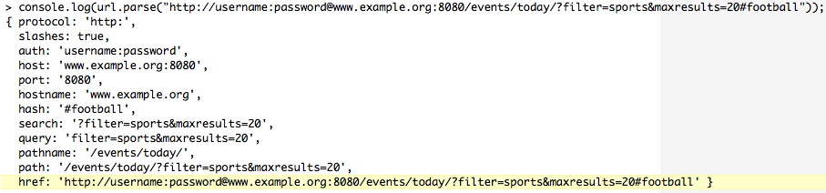

Streaming Data Across Nodes and Clients <link rel="stylesheet" href="css/style.css" type="text/css">   .koboSpan { -webkit-text-combine: inherit; }

# 跨节点和客户端流式传输数据

"A jug fills drop by drop." – Buddha

现在，我们更清楚地了解了 Node 的事件化、以 I/O 为中心的设计理念是如何在其各种模块 API 中得到体现的，从而为开发提供了一个一致且可预测的环境。

在本章中，我们将了解如何使用 Node 轻松地读取、写入和操作从文件或其他来源提取的数据。最后，我们将学习如何使用 Node 开发具有快速 I/O 接口的网络服务器，这些接口支持高度并发的应用程序，同时跨数千个客户端共享实时数据。

# 为什么要使用流？

当一个新的语言特性、设计模式或软件模块出现时，一个新手可能会开始使用它，因为它是新的和新奇的。另一方面，有经验的开发人员可能会问，*为什么需要这样做？*

因为文件很大，所以需要流。几个简单的例子可以说明它们的必要性。首先，假设我们要复制一个文件。在 Node 中，朴素的实现如下所示：

```js
// First attempt
console.log('Copying...');
let block = fs.readFileSync("source.bin");
console.log('Size: ' + block.length);
fs.writeFileSync("destination.bin", block);
console.log('Done.');
```

这很简单。

当节点将与脚本位于同一文件夹中的文件`source.bin`的内容复制到内存中时，对`readFileSync()`的调用将被阻止，并在此处返回一个名为`block`的`ByteBuffer`。
一旦我们有`block`，我们就可以检查并打印出它的尺寸。然后，代码将`block`交给`writeFileSync`，后者将内存块复制到新创建或覆盖的文件`destination.bin`的内容中。

此代码假定以下情况：

*   可以阻止事件循环（不是！）
*   我们可以将整个文件读入内存（我们不能！）

如前一章所述，节点处理一个又一个事件，一次处理一个事件。良好的异步设计允许节点程序看起来同时做各种事情，无论是对连接的软件系统还是对人类用户，同时为开发人员在代码中提供易于推理和抵抗 bug 的直观逻辑表示。这是正确的，尤其是与可能为解决同一任务而编写的多线程代码相比。您的团队甚至可能已经转向 Node 来改进这种经典的多线程系统。此外，良好的异步设计从不阻塞事件循环。

阻塞事件循环是不好的，因为节点不能做任何其他事情，而您的一行阻塞代码正在阻塞。前面的示例是作为基本脚本编写的，它将文件从一个地方复制到另一个地方，可能工作得很好。当节点复制文件时，它将阻止用户的终端。该文件可能足够小，几乎没有时间等待。如果没有，您可以在等待时打开另一个 shell 提示符。这样，它与熟悉的命令`cp`或`curl`没有什么区别。

然而，从计算机的角度来看，这是相当低效的。每个文件副本不应该需要自己的操作系统进程。

此外，将以前的代码合并到更大的节点项目中可能会破坏整个系统的稳定性。

您的服务器端节点应用程序可能同时允许三个用户登录，同时向另外两个用户发送大文件。如果该应用程序也执行前面的代码，则两次下载将持续，三次浏览器抖动将旋转。

所以，让我们一步一步地解决这个问题：

```js
// Attempt the second
console.log('Copying...');
fs.readFile('source.bin', null, (error1, block) => {
  if (error1) {
    throw error1;
  }
  console.log('Size: ' + block.length);
  fs.writeFile('destination.bin', block, (error2) => {
    if (error2) {
      throw error2;
    }
    console.log('Done.');
  });
});
```

至少现在我们没有使用标题中有*Sync*的节点方法。事件循环可以再次自由呼吸。

但仍然：

*   大文件怎么样？（大爆炸）
*   那是一个相当大的金字塔（厄运）

请使用 2 GB（2.0 x 2^30 或 2147483648 字节）源文件尝试前面的代码：

```js
RangeError: "size" argument must not be larger than 2147483647
 at Function.Buffer.allocUnsafe (buffer.js:209:3)
 at tryCreateBuffer (fs.js:530:21)
 at Object.fs.readFile (fs.js:569:14)
 ...
```

如果你在 YouTube 上观看 1080p 的视频，2GB 的视频将持续一个小时左右。前面的`RangeError`之所以发生，是因为`2,147,483,647`是二进制的`1111111111111111111111111111111`，是最大的 32 位有符号二进制整数。节点在内部使用该类型来调整`ByteBuffer`的大小和地址。

如果你举我们可怜的例子会怎么样？更小但仍然非常大的文件不太确定。当它工作时，它会这样做，因为节点成功地从操作系统获取了所需的内存量。在复制操作期间，节点进程的内存占用随着文件大小的增加而增加。老鼠可能会变成沙漏，粉丝可能会大声旋转。承诺会有帮助吗

```js
// Attempt, part III
console.log('Copying...');
fs.readFileAsync('source.bin').then((block) => {
  console.log('Size: ' + block.length);
  return fs.writeFileAsync('destination.bin', block);
}).then(() => {
 console.log('Done.');
}).catch((e) => {
  // handle errors
});
```

不，基本上是这样。我们已经将金字塔夷为平地，但大小限制和内存问题仍然存在。

我们真正需要的是一些既异步又逐段的代码，抓取源文件的一小部分，将其传递到目标文件进行编写，然后重复这个循环直到完成，就像古董消防队的水桶旅一样。


这样的设计可以让事件循环在整个时间内自由呼吸。
这正是流的含义：

```js
// Streams to the rescue
console.log('Copying...');
fs.createReadStream('source.bin')
.pipe(fs.createWriteStream('destination.bin'))
.on('close', () => { console.log('Done.'); });
```

实际上，扩展网络应用程序通常分布在多个实例中，要求数据流的处理分布在多个进程和服务器上。在这里，流文件只是一个划分为多个片段的数据流，其中每个片段都可以独立查看，而不考虑其他片段的可用性。您可以写入数据流或侦听数据流，自由地动态分配字节、忽略字节或重新路由字节。数据流可以分块，许多进程可以共享块处理，块可以转换和重新插入，数据流可以精确地发出并创造性地管理。

回顾我们对现代软件和模块化规则的讨论，我们可以看到流如何促进创建独立的不共享进程，这些进程可以很好地完成一项任务，并且结合起来，可以组成一个可预测的体系结构，其复杂性不妨碍对其行为的准确评估。如果与数据的接口没有争议，则可以准确地建模数据映射，而不考虑数据量或路由。

管理节点中的 I/O 涉及管理绑定到数据流的数据事件。节点流对象是`EventEmitter`的实例。正如我们在上一章中看到的，这个抽象接口在许多节点模块和对象中实现。让我们从理解节点的流模块开始，然后继续讨论如何通过各种流实现处理节点中的网络 I/O；特别是 HTTP 模块

# 探索溪流

根据 Bjarne Stoustrup 在他的书中，〈C++编程语言〉T1 T.（第三版）：

"Designing and implementing a general input/output facility for a programming language is notoriously difficult... An I/O facility should be easy, convenient, and safe to use; efficient and flexible; and, above all, complete."

一个专注于提供高效、简单的 I/O 的设计团队已经通过 Node 交付了这样一个工具，这不应该让任何人感到惊讶。通过一个对称且简单的接口（该接口处理数据缓冲区和流事件，以便实现者不必这样做），节点的流模块是管理两个内部模块的异步数据流的首选方式，模块的开发人员将创建。

节点中的流只是一个字节序列。在任何时候，流都包含字节缓冲区，该缓冲区的长度为零或更大：


由于流中的每个字符都有很好的定义，并且由于每种类型的数字数据都可以用字节表示，因此流的任何部分都可以重定向，或通过管道传输到任何其他流，流的不同块可以发送到不同的处理程序，依此类推。通过这种方式，流输入和输出接口既灵活又可预测，并且易于耦合。

Node also offers a second type of streams: object streams. Instead of chunks of memory flowing through the stream, an object stream shuttles JavaScript objects. Byte streams pass around serialized data like streaming media, while object streams are the right choice for parsed, structured data like JSON records.

数字流使用流体的类比进行了很好的描述，其中单个字节（水滴）被推过管道。在节点中，流是表示可以异步写入和读取的数据流的对象。

节点原理是一种非阻塞流，I/O 通过流处理，因此流 API 的设计自然地复制了这种一般原理。事实上，除了以异步、事件化的方式与流进行交互之外，没有其他方式与流进行交互，节点从设计上防止开发人员阻塞 I/O。

通过抽象流接口公开了五个不同的基类：**可读**、**可写**、**双工**、**转换**和**直通**。每个基类都继承自`EventEmitter`，我们称之为事件侦听器和发射器可以绑定到的接口。

正如我们将要学习的，这里将强调的，流接口是一个抽象接口。抽象接口作为一种蓝图或定义，描述必须构建到流对象的每个构造实例中的特性。例如，需要可读流实现来实现委托给接口的`internal _read`方法的`public read`方法。

通常，所有流实现都应遵循以下准则：

*   只要存在要发送的数据，就向流写入数据，直到该操作返回`false`，此时实现应等待一个排出事件，指示缓冲流数据已清空。
*   继续调用 read，直到接收到一个`null`值，此时在恢复读取之前等待一个可读事件。
*   几个节点 I/O 模块实现为流。网络套接字、文件读写器、`stdin`和`stdout`、zlib 等都是流。类似地，在实现可读数据源或数据读取器时，应该将该接口实现为流接口。

It is important to note that over the history of Node, the Stream interface changed in some fundamental ways. The Node team has done its best to implement compatible interfaces, so that (most) older programs will continue to function without modification. In this chapter, we will not spend any time discussing the specific features of this older API, focusing on the current design. The reader is encouraged to consult Node's online documentation for information on migrating older programs. As often happens, there are modules that *wrap* streams with convenient, reliable interfaces. A good one is: [https://github.com/rvagg/through2.](https://github.com/rvagg/through2)

# 实现可读流

产生另一进程可能感兴趣的数据的流通常使用`Readable`流实现。`Readable`流为实现者节省了管理读取队列、处理数据事件的发送等所有工作。

要创建`Readable`流，请使用以下命令：

```js
const stream = require('stream');
let readable = new stream.Readable({
  encoding: "utf8",
  highWaterMark: 16000,
  objectMode: true
});
```

如前所述，`Readable`作为基类公开，可以通过三个选项进行初始化：

*   `encoding`：将缓冲区解码为指定编码，默认为 UTF-8。
*   `highWaterMark`：在停止从数据源读取之前，要保留在内部缓冲区中的字节数。默认值为 16KB。
*   `objectMode`：告诉流作为对象流而不是字节流，例如 JSON 对象流而不是文件中的字节。默认值`false`。

在下面的示例中，我们创建一个 mock`Feed`对象，其实例将继承`Readable`流接口。我们的实现只需要实现`Readable`的抽象`_read`方法，它会将数据推送到消费者，直到没有更多的数据可推，在这一点上，它通过推一个`null`值触发`Readable`流发出`end`事件：

```js
const stream = require('stream');

let Feed = function(channel) {
   let readable = new stream.Readable({});
   let news = [
      "Big Win!",
      "Stocks Down!",
      "Actor Sad!"
   ];
   readable._read = () => {
      if(news.length) {
         return readable.push(news.shift() + "\n");
      }
      readable.push(null);
   };
   return readable;
};
```

现在我们有了一个实现，消费者可能希望实例化流并侦听流事件。两个关键事件是`readable`和`end`。

只要数据被推送到流中，`readable`事件就会发出。通过`Readable`的`read`方法提醒消费者检查新数据。

Note again how the `Readable` implementation must provide a `private _read` method that services the `public read` method exposed to the consumer API.

每当`null`值传递给我们`Readable`实现的`push`方法时，`end`事件就会发出。

这里，我们看到消费者使用这些方法来显示新的流数据，并在流停止发送数据时提供通知：

```js
let feed = new Feed();

feed.on("readable", () => {
   let data = feed.read();
   data && process.stdout.write(data);
});
feed.on("end", () => console.log("No more news"));
// Big Win!
// Stocks Down!
// Actor Sad!
// No more news
```

类似地，我们可以通过使用`objectMode`选项来实现对象流：

```js
const stream = require('stream');

let Feed = function(channel) {
   let readable = new stream.Readable({
      objectMode : true
   });
   let prices = [{price : 1},{price : 2}];
   readable._read = () => {
      if(prices.length) {
         return readable.push(prices.shift());
      }
      readable.push(null);
   };
   return readable;
};
```

被放置在 objectMode 中后，被推送的每个区块都应该是一个对象。然后，该流的读取器可以假设每个`read()`事件将产生一个对象：

```js
let feed = new Feed();
feed.on("readable", () => {
   let data = feed.read();
   data && console.log(data);
});
feed.on("end", () => console.log("No more news"));
// { price: 1 }
// { price: 2 }
// No more news
```

这里，我们看到每个读取事件都接收一个对象，而不是一个缓冲区或字符串。

最后，`Readable`流的`read`方法可以传递一个参数，指示要从流的内部缓冲区读取的字节数。例如，如果希望一次读取一个字节的文件，可以使用类似以下的例程实现使用者：

```js
let Feed = function(channel) {
   let readable = new stream.Readable({});
   let news = 'A long headline might go here';
   readable._read = () => {
      readable.push(news);
      readable.push(null);
   };
   return readable;
};
```

请注意，我们将整个新闻推送到流中，并以 null 结束。流将使用整个字节字符串进行预处理。现在消费者：

```js
feed.on('readable', () => {
   let character;
   while(character = feed.read(1)) {
      console.log(character.toString());
   }
});
// A
// 
// l
// o
// n
// ...
// No more bytes to read
```

在这里，应该清楚的是，`Readable`流的缓冲区一次填满了大量字节，但是从中离散读取的。

# 推拉

我们已经了解了`Readable`实现如何使用`push`填充流缓冲区进行读取。在设计这些实现时，重要的是要考虑在流的两端如何管理卷。向流中输入的数据超过了可读取的数据量，可能会导致超出可用空间（内存）的复杂情况。在使用者端，重要的是保持对终止事件的意识，以及如何处理数据流中的暂停。

我们可以将流经网络的数据流的行为与流经软管的水的行为进行比较。

与通过软管的水一样，如果推入读取流的数据量大于通过`read`从用户端的流中有效排出的数据量，则会产生大量背压，导致数据积压开始在流对象的缓冲区中累积。因为我们面临着严格的数学限制，`read`根本无法通过更快的阅读来释放这种压力——可用内存空间可能存在硬限制或其他限制。因此，内存使用率可能会高得危险，缓冲区可能会溢出，等等。

因此，流实现应该知道并响应来自`push`操作的响应。如果操作返回`false`，这表示实现应该停止从其源读取（并停止推送），直到发出下一个`_read`请求。

结合上述情况，如果没有更多的数据要推送，但未来会有更多的数据，则实现应该`push`一个空字符串`("")`，它不会向队列中添加任何数据，但会确保将来发生`readable`事件。

虽然流缓冲区最常见的处理方式是`push`到它（在一行中排队数据），但有时您可能希望将数据放在缓冲区的前面（跳过行）。节点为这些情况提供了一个`unshift`操作，其行为与 push 相同，超出了前面提到的缓冲区放置差异。

# 可写流

`Writable`流负责接受某个值（字节流、字符串）并将该数据写入目标。将数据流式传输到文件容器是一个常见的用例。

要创建`Writable`流，请执行以下操作：

```js
const stream = require('stream');
let readable = new stream.Writable({
  highWaterMark: 16000,
  decodeStrings: true
});
```

`Writable`streams 构造函数可以通过两个选项实例化：

*   `highWaterMark`：在写入时返回`false`之前，流的缓冲区将接受的最大字节数。默认值为 16KB。
*   `decodeStrings`：写入前是否将字符串转换为缓冲区。默认为`true`。

与`Readable`流一样，自定义`Writable`流实现必须实现`_write`处理程序，该处理程序将传递发送给实例的`write`方法的参数。

人们应该将`Writable`流视为数据目标，例如您正在上载的文件。从概念上讲，这与在`Readable`流中实现推送没有什么不同，推送数据直到数据源耗尽，通过`null`终止读取。例如，在这里，我们将 32 个“A”字符写入流，这将记录它们：

```js
const stream = require('stream');

let writable = new stream.Writable({
   decodeStrings: false
});

writable._write = (chunk, encoding, callback) => {
   console.log(chunk.toString());
   callback();
};

let written = writable.write(Buffer.alloc(32, 'A'));
writable.end();

console.log(written);

// AAAAAAAAAAAAAAAAAAAAAAAAAAAAAAAA
// true
```

这里有两件关键的事情需要注意。

首先，我们的`_write`实现在写入始终存在的回调后立即启动`callback`函数，而不管实例`write`方法是否直接传递了`callback`。此调用对于指示写入尝试的状态非常重要，无论是失败（错误）还是成功。

第二，write 调用返回了`true`。这表示在执行请求的写操作后，`Writable`实现的内部缓冲区已清空。如果我们发送了大量数据，足以超过内部缓冲区的默认大小，该怎么办？

修改前一个示例，下面将返回`false`：

```js
let written = writable.write(Buffer.alloc(16384, 'A'));
console.log(written); // Will be 'false'
```

此`write`返回`false`的原因是它已达到`highWaterMark`选项的默认值 16 KB（16*1024）。如果`write`的值再次增加`16383`，则`16383`的值会再次增加。

当`write`返回`false`时，您应该做什么？您当然不应该继续发送数据！回到我们对软管中的水的比喻：当水流满时，在发送更多数据之前，应该等待水流排干。只要可以安全地再次写入，节点的流实现就会发出`drain`事件。当`write`返回`false`时，在发送更多数据之前先监听`drain`事件。

结合我们所学的内容，让我们创建一个`highWaterMark`值为 10 字节的`Writable`流。然后，我们将建立一个模拟，将一串数据推到比`highWaterMark`大几倍的`stdout`。在发送更多数据之前，我们会捕获缓冲区溢出并等待释放事件触发：

```js
const stream = require('stream');

let writable = new stream.Writable({
   highWaterMark: 10
});

writable._write = (chunk, encoding, callback) => {
   process.stdout.write(chunk);
   callback();
};

function writeData(iterations, writer, data, encoding, cb) {
   (function write() {

      if(!iterations--) {
         return cb()
      }

      if (!writer.write(data, encoding)) {
         console.log(` <wait> highWaterMark of ${writable.writableHighWaterMark} reached`);
         writer.once('drain', write);
      }
   })()
}

writeData(4, writable, 'String longer than highWaterMark', 'utf8', () => console.log('finished'));
```

每次我们都会检查流写入操作是否返回 false，如果返回 false，则在再次运行`write`方法之前等待下一个 drain 事件。

您应该小心地实现正确的流管理，尊重写入事件发出的“警告”，并在发送更多数据之前正确地等待排放事件发生。

The fluid data in a `Readable` stream can be easily redirected to a `Writable` stream. For example, the following code will take any data sent by a terminal (`stdin` is a `Readable` stream) and echo it back to the destination `Writable` stream (`stdout`): `process.stdin.pipe(process.stdout)`. Whenever a `Writable` stream is passed to a `Readable` stream's pipe method, a **pipe** event will fire. Similarly, when a `Writable` stream is removed as a destination for a `Readable` stream, the **unpipe** event fires. To remove a `pipe`, use the following: `unpipe(destination stream)`

# 双工流

**双工流**既可读又可写。例如，在节点中创建的 TCP 服务器公开一个套接字，该套接字既可以读取，也可以写入：

```js
const stream = require("stream");
const net = require("net");

net.createServer(socket => {
  socket.write("Go ahead and type something!");
  socket.setEncoding("utf8");
  socket.on("readable", function() {
    process.stdout.write(this.read())
  });
})
.listen(8080);
```

执行此代码时，将创建可通过 Telnet 连接到的 TCP 服务器：

```js
telnet 127.0.0.1 8080
```

在一个终端窗口中启动服务器，打开一个单独的终端，然后通过 telnet 连接到服务器。连接后，连接终端将打印出`Go ahead and type something!`-写入插座。在连接终端中输入的任何文本（点击**回车**后）将被回响到运行 TCP 服务器的终端的`stdout`（从套接字读取），创建一种聊天应用程序。

这种双向（双工）通信协议的实现清楚地展示了独立进程如何形成复杂且响应迅速的应用程序的节点，无论是通过网络通信还是在单个进程的范围内通信。

构造`Duplex`实例时发送的选项将发送到`Readable`和`Writable`流的选项合并在一起，没有附加参数。事实上，这种流类型只是承担这两个角色，与之交互的规则遵循所使用的交互模式的规则。

由于`Duplex`流同时承担读和写角色，任何实现都需要同时实现`­_write`和`_read`方法，同样遵循相关流类型的标准实现细节。

# 变换流

有时，需要处理流数据，通常是在编写某种二进制协议或其他*动态*数据转换的情况下。一个`Transform`流就是为了这个目的而设计的，它作为一个`Duplex`流，位于`Readable`流和`Writable`流之间。

使用与初始化典型`Duplex`流相同的选项初始化`Transform`流，其中`Transform`与正常`Duplex`流的不同之处在于其要求自定义实现仅提供`_transform`方法，不包括`_write`和`_read`方法要求。

`_transform`方法将接收三个参数，首先是发送的缓冲区，一个可选的编码参数，最后是一个回调，当转换完成时`_transform`将调用该回调：

```js
_transform = function(buffer, encoding, cb) {
  let transformation = "...";
  this.push(transformation);
  cb();
};
```

让我们想象一个程序，它帮助将**ASCII（美国信息交换标准代码）**代码转换为 ASCII 字符，并接收`stdin`的输入。您输入一个 ASCII 码，程序用对应于该码的字母数字字符响应。在这里，我们可以简单地将输入通过管道传输到`Transform`流，然后将其输出通过管道传输回`stdout`：

```js
const stream = require('stream');
let converter = new stream.Transform();

converter._transform = function(num, encoding, cb) {
   this.push(String.fromCharCode(new Number(num)) + "\n");
   cb();
};

process.stdin.pipe(converter).pipe(process.stdout);
```

与此程序交互可能会产生类似于以下内容的输出：

```js
65 A
66 B
256 Ā
257 ā
```

本章结尾的示例将演示更复杂的转换流示例。

# 使用直通流

这种流是`Transform`流的一个简单实现，它只是将接收到的输入字节传递给输出流。如果不需要对输入数据进行任何转换，只需要简单地通过管道将`Readable`流传输到`Writable`流，这将非常有用。

`PassThrough`流具有类似于 JavaScript 匿名函数的优点，可以轻松地断言最小的功能，而无需太多麻烦。例如，不必实现抽象基类，正如人们对`Readable`流的`_read`方法所做的那样。考虑以下使用的一个事件：

```js
const fs = require('fs');
const stream = require('stream');
const spy = new stream.PassThrough();

spy
.on('error', (err) => console.error(err))
.on('data', function(chunk) {
    console.log(`spied data -> ${chunk}`);
})
.on('end', () => console.log('\nfinished'));

fs.createReadStream('./passthrough.txt').pipe(spy).pipe(process.stdout);
```

通常，转换或双工流是您想要的（您可以在其中设置`_read`和`_write`的正确实现），但在某些场景中，例如测试，在流上放置“观察者”可能会很有用。

# 创建 HTTP 服务器

HTTP 是一种基于请求/响应模型的无状态数据传输协议：客户端向服务器发出请求，然后服务器返回响应。由于促进这种快速模式的网络通信是 I/O 节点被设计为擅长的类型，所以 Node 作为一种创建服务器的工具早期得到了广泛的关注，尽管它当然可以用于做更多的事情。在本书中，我们将创建 HTTP 服务器以及其他协议服务器的许多实现，并将在特定业务案例中更深入地讨论最佳实践。预计您已经有过类似的经验。出于这两个原因，我们将快速地通过一般概述进入一些更专门的用途。

最简单的情况是，HTTP 服务器响应连接尝试，并在数据到达和发送时管理数据。节点服务器通常使用`http`模块的`createServer`方法创建：

```js
const http = require('http');
let server = http.createServer((request, response) => {
   response.writeHead(200, { 
      'Content-Type': 'text/plain'
   });
   response.write("PONG");
   response.end();
}).listen(8080);

server.on("request", (request, response) => {
   request.setEncoding("utf8");
   request.on("readable", () => console.log(request.read()));
   request.on("end", () => console.log("DONE"));
});
```

`http.createServer`返回的对象是`http.Server`的实例，它扩展了`EventEmitter`，在网络事件发生时广播网络事件，如客户端连接或请求。前面的代码是编写节点服务器的常用方法。然而，值得指出的是，直接实例化`http.Server`类有时是区分不同服务器/客户机交互的有用方法。我们将在以下示例中使用该格式。

在这里，我们创建一个基本服务器，它只报告连接何时建立以及连接何时终止：

```js
const http = require('http');
const server = new http.Server();
server.on('connection', socket => {
   let now = new Date();
   console.log(`Client arrived: ${now}`);
   socket.on('end', () => console.log(`client left: ${new Date()}`));
});
// Connections get 2 seconds before being terminated
server.setTimeout(2000, socket => socket.end());
server.listen(8080);
```

在构建多用户系统，特别是经过身份验证的多用户系统时，服务器-客户端事务中的这一点是进行客户端验证和跟踪代码的最佳位置，包括设置或读取 cookie 和其他会话变量，或者向在并发实时应用程序中协同工作的其他客户端广播客户端到达事件。

通过为请求添加侦听器，我们得到了更常见的请求/响应模式，作为`Readable`流处理。当客户机发布一些数据时，我们可以像下面这样捕获这些数据：

```js
server.on('request', (request, response) => {
   request.setEncoding('utf8');
   request.on('readable', () => {
      let data = request.read();
      data && response.end(data);
   });
});
```

尝试使用**curl**将一些数据发送到此服务器：

```js
curl http://localhost:8080 -d "Here is some data"
// Here is some data
```

通过使用连接事件，我们可以很好地分离连接处理代码，将其分组到明确定义的功能域中，这些功能域被正确地描述为响应特定事件而执行。在上面的示例中，我们看到了如何设置计时器，在两秒钟后启动服务器连接。

If one simply wants to set the number of milliseconds of inactivity before a socket is presumed to have timed out, simply use `server.timeout = (Integer)num_milliseconds`. To disable socket timeouts, pass a value of `0` (zero).

现在让我们看看如何使用节点的 HTTP 模块来进行更有趣的网络交互。

# 发出 HTTP 请求

网络应用程序通常需要进行外部 HTTP 调用。HTTP 服务器也经常被调用为发出请求的客户端执行 HTTP 服务。节点为进行外部 HTTP 调用提供了一个简单的接口。

例如，以下代码将获取`www.example.org`的 HTML 首页：

```js
const http = require('http');
http.request({ 
   host: 'www.example.org',
   method: 'GET',
   path: "/"
}, function(response) {
   response.setEncoding("utf8");
   response.on("readable", () => console.log(response.read()));
}).end();
```

正如我们所看到的，我们正在处理一个`Readable`流，它可以写入一个文件。

A popular Node module for managing HTTP requests is Mikeal Roger's request: [https://github.com/request/request](https://github.com/request/request)

由于通常使用`HTTP.request`来`GET`外部页面，节点提供了一个快捷方式：

```js
http.get("http://www.example.org/", response => {
  console.log(`Status: ${response.statusCode}`);
}).on('error', err => {
  console.log("Error: " + err.message);
});
```

现在让我们看看 HTTP 服务器的一些更高级的实现，在这些实现中，我们为客户机执行一般的网络服务。

# 代理和隧道

有时，为一台服务器提供一种方式，使其充当其他服务器的代理或代理是很有用的。例如，这将允许一台服务器将负载分配给其他服务器。另一个用途是为无法直接连接到安全服务器的用户提供对该服务器的访问。一台服务器使用代理为多个 URL 应答也是很常见的，一台服务器可以将请求转发给正确的收件人。

因为节点在其整个网络接口中都有一个一致的 streams 接口，所以我们只需几行代码就可以构建一个简单的 HTTP 代理。例如，以下程序将在端口`8080`上设置一个 HTTP 服务器，该服务器将通过获取网站首页并将该页面传回客户端来响应任何请求：

```js
const http = require('http');
const server = new http.Server();

server.on("request", (request, socket) => {
   console.log(request.url);
   http.request({ 
      host: 'www.example.org',
      method: 'GET',
      path: "/",
      port: 80
   }, response => response.pipe(socket))
   .end();
});

server.listen(8080, () => console.log('Proxy server listening on localhost:8080'));
```

继续并启动此服务器，然后连接到它。一旦该服务器接收到客户机套接字，就可以将任何可读流中的内容推送回客户机，在这里，`www.example.org`的`GET`结果流式传输。例如，您可以很容易地看到，管理应用程序缓存层的外部 content server 如何成为代理端点。

使用类似的想法，我们可以创建一个隧道服务，使用 Node 的原生`CONNECT`支持。隧道涉及使用代理服务器作为中介，代表客户端与远程服务器通信。一旦我们的代理服务器连接到远程服务器，它就能够在该服务器和客户端之间来回传递消息。当客户端和远程服务器之间无法直接连接或不需要连接时，这是有利的。

首先，我们将设置一个代理服务器来响应`HTTP``CONNECT`请求，然后向该服务器发出`CONNECT`请求。代理接收我们客户端的`Request`对象、客户端的套接字本身以及隧道流的头（第一个数据包）：

```js
const http = require('http');
const net = require('net');
const url = require('url');
const proxy = new http.Server();

proxy.on('connect', (request, clientSocket, head) => {
  let reqData = url.parse(`http://${request.url}`);
  let remoteSocket = net.connect(reqData.port, reqData.hostname, () => {
    clientSocket.write('HTTP/1.1 200 \r\n\r\n');
    remoteSocket.write(head);
    remoteSocket.pipe(clientSocket);
    clientSocket.pipe(remoteSocket);
   });
}).listen(8080);

let request = http.request({
  port: 8080,
  hostname: 'localhost',
  method: 'CONNECT',
  path: 'www.example.org:80'
});
request.end();

request.on('connect', (res, socket, head) => {
  socket.setEncoding("utf8");
  socket.write('GET / HTTP/1.1\r\nHost: www.example.org:80\r\nConnection: close\r\n\r\n');
  socket.on('readable', () => {
      console.log(socket.read());
   });
  socket.on('end', () => {
    proxy.close();
  });
});
```

一旦我们向在端口 8080 上运行的本地隧道服务器发出请求，它将建立到目的地的远程套接字连接，并维护远程套接字和（本地）客户端套接字之间的“桥”。当然，远程连接只会看到我们的隧道服务器，通过这种方式，客户端可以在某种意义上匿名连接到远程服务（这并不总是一种可疑的做法！）。

# HTTPS、TLS（SSL）和保护服务器安全

近年来，web 应用程序的安全性已成为一个重要的讨论话题。传统应用程序通常受益于设计到主要服务器和应用程序堆栈中的经过良好测试和成熟的安全模型，这些安全模型是主要部署的基础。出于这样或那样的原因，web 应用程序被允许冒险进入实验性的客户端业务逻辑世界，并在透明的窗帘下打开 web 服务。

由于 Node 定期部署为 web 服务器，社区必须开始承担保护这些服务器的责任。HTTPS 是一种安全传输协议，本质上是通过将 HTTP 协议分层到 SSL/TLS 协议之上而形成的加密 HTTP。

# 为开发创建自签名证书

为了支持 SSL 连接，服务器需要正确签名的证书。在开发过程中，只需创建一个自签名证书就容易多了，这将允许您使用 Node 的 HTTPS 模块。

这些是创建用于开发的证书所需的步骤。我们创建的证书不会像来自第三方的证书那样显示身份，但我们只需要使用 HTTPS 加密即可。从终端：

```js
openssl genrsa -out server-key.pem 2048
 openssl req -new -key server-key.pem -out server-csr.pem
 openssl x509 -req -in server-csr.pem -signkey server-key.pem -out server-cert.pem
```

这些密钥现在可用于开发 HTTPS 服务器。这些文件的内容只需作为选项传递给节点服务器即可：

```js
const https = require('https');
const fs = require('fs');
https.createServer({
  key: fs.readFileSync('server-key.pem'),
  cert: fs.readFileSync('server-cert.pem')
}, (req, res) => {
  ...
}).listen(443);
```

Free low-assurance SSL certificates are available from [http://www.startssl.com/](http://www.startssl.com/) for cases where self-signed certificates are not ideal during development. Additionally, [https://www.letsencrypt.org](https://www.letsencrypt.org) has started an exciting initiative toward providing free certificates for all (and a safer web).

# 安装真正的 SSL 证书

为了将一个安全的应用程序从开发环境转移到一个暴露于 internet 的环境中，需要购买一个真正的证书。这些证书的价格逐年下降，应该很容易找到价格合理、安全性足够高的证书提供商。一些提供商甚至提供免费的个人使用证书。

设置专业证书只需要更改我们前面介绍的 HTTPS 选项。不同的提供者将有不同的进程和文件名。通常，您需要从提供商处下载或接收一个`private``.key`文件、您的签名域证书`.crt`文件以及一个描述证书链的捆绑包：

```js
let options = {
  key: fs.readFileSync("mysite.key"),
  cert: fs.readFileSync("mysite.com.crt"),
  ca: [ fs.readFileSync("gd_bundle.crt") ]
};
```

需要注意的是，`ca`参数必须作为*数组*发送，即使证书束已连接到一个文件中。

# 请求对象

HTTP 请求和响应消息类似，包括以下内容：

*   一个状态行，对于请求类似于 GET/`index.html`HTTP/1.1，对于响应类似于 HTTP/1.1 200 OK
*   零个或多个头，在请求中可能包括`Accept-Charset`：`UTF-8 or From: user@server.com`，在响应中可能类似于`Content-Type: text/html and Content-Length: 1024`
*   消息体，对于响应可能是 HTML 页面，对于`POST`请求可能是一些表单数据

我们已经了解了节点中的 HTTP 服务器接口如何公开请求处理程序，以及如何将该处理程序传递给某种形式的请求和响应对象，每个对象都实现了可读或可写的流。

我们将在本章后面更深入地介绍`POST`数据和`Header`数据的处理。在此之前，让我们先看看如何解析出请求中包含的一些更直接的信息。

# URL 模块

每当向 HTTP 服务器发出请求时，请求对象将包含 URL 属性，标识目标资源。可通过`request.url`进行访问。节点的 URL 模块用于将典型的 URL 字符串分解为其组成部分。考虑下面的数字：



我们看到了`url.parse`方法是如何分解字符串的，每个片段的含义都应该很清楚。如果将`query`字段本身解析为键/值对，那么它可能会更有用。这是通过将`true`作为的第二个参数传递给`parse`方法来实现的，这将把上面给出的查询字段值更改为更有用的键/值映射：

```js
query: { filter: 'sports', maxresults: '20' }
```

这在解析 GET 请求时特别有用。`url.parse`的最后一个参数与这两个 URL 之间的差异有关：

*   `http://www.example.org`
*   `//www.example.org`

这里的第二个 URL 是 HTTP 协议的一个（相对未知）设计特性的示例：协议相对 URL（技术上是一个**网络路径参考**），而不是更常见的绝对 URL。

To learn more about how network-path references are used to smooth resource protocol resolution, visit: [http://tools.ietf.org/html/rfc3986#section-4.2](http://tools.ietf.org/html/rfc3986#section-4.2).

讨论的问题是：`url.parse`将以斜杠开头的字符串视为指示路径，而不是主机。例如，`url.parse("//www.example.org")`将在主机和路径字段中设置以下值：

```js
host: null,
 path: '//www.example.org'
```

我们真正想要的恰恰相反：

```js
host: 'www.example.org',
 path: null
```

要解决此问题，请将`true`作为第三个参数传递给`url.parse`，这向方法表明斜杠表示主机，而不是路径：

```js
url.parse("//www.example.org", null, true);
```

开发人员也会希望创建 URL，例如通过`http.request`发出请求时。所述 URL 的段可以分布在各种数据结构和变量中，并且需要进行组装。您可以通过将类似于从`url.parse`返回的对象传递给方法`url.format`来实现这一点。

以下代码将创建 URL 字符串`http://www.example.org`：

```js
url.format({
  protocol: 'http:',
  host: 'www.example.org'
});
```

类似地，您也可以使用`url.resolve`方法在需要连接基本 URL 和路径的常见场景中生成 URL 字符串：

```js
url.resolve("http://example.org/a/b", "c/d"); //'http://example.org/a/c/d'
url.resolve("http://example.org/a/b", "/c/d"); 
//'http://example.org/c/d'
url.resolve("http://example.org", "http://google.com"); //'http://google.com/'
```

# 查询字符串模块

正如我们在`URL`模块中看到的，查询字符串通常需要解析为键/值对的映射。`Querystring`模块将把现有的查询字符串分解成若干部分，或者从键/值对映射中组装查询字符串。

例如，`querystring.parse("foo=bar&bingo=bango")`将返回：

```js
{
  foo: 'bar',
  bingo: 'bango'
}
```

如果我们的查询字符串没有使用普通的`"&"`分隔符和`"="`赋值字符进行格式化，`Querystring`模块提供可定制的解析。

`Querystring`的第二个参数可以是自定义分隔符字符串，第三个参数是自定义赋值字符串。例如，以下内容将返回与前面在具有自定义格式的查询字符串上给出的相同映射：

```js
let qs = require("querystring");
console.log(qs.parse("foo:bar^bingo:bango", "^", ":"));
// { foo: 'bar', bingo: 'bango' }
```

您可以使用`Querystring.stringify`方法组合查询字符串：

```js
console.log(qs.stringify({ foo: 'bar', bingo: 'bango' }));
// foo=bar&bingo=bango
```

与 parse 一样，`stringify`也接受自定义分隔符和赋值参数：

```js
console.log(qs.stringify({ foo: 'bar', bingo: 'bango' }, "^", ":"));
// foo:bar^bingo:bango
```

查询字符串通常与`GET`请求关联，见`?`字符后面。如前所述，在这些情况下，使用`url`模块自动解析这些字符串是最简单的解决方案。然而，当我们处理`POST`数据时，以这种方式格式化的字符串也会出现，在这种情况下，`Querystring`模块才是真正有用的。我们将很快讨论这个用法，但首先，讨论一下 HTTP 头。

# 使用标题

向节点服务器发出的每个 HTTP 请求都可能包含有用的头信息，客户端通常希望从服务器接收类似的包信息。节点提供了用于读取和写入头的简单接口。我们将简要介绍这些简单的接口，澄清一些细节。最后，我们将讨论如何在节点中实现更高级的头使用，研究节点服务器可能需要适应的一些常见网络职责。

典型的请求头如下所示：


标题是简单的键/值对。请求密钥总是小写的。设置响应键时，可以使用任何大小写格式。

读取标题很简单。通过检查`request.header`对象读取头信息，该对象是头的键/值对的 1:1 映射。要从前面的示例中获取*接受*头，只需读取`request.headers.accept`。

The number of incoming headers can be limited by setting the `maxHeadersCount` property of your HTTP server.

如果首选以编程方式读取头，则节点提供`response.getHeader`方法，接受头键作为其第一个参数。

虽然请求头是简单的键/值对，但在编写头时，我们需要一个更具表现力的接口。由于响应通常必须发送状态代码，Node 提供了一种简单的方法，可以在一个命令中准备响应状态行和标题组：

```js
response.writeHead(200, {
  'Content-Length': 4096,
  'Content-Type': 'text/plain'
});
```

要单独设置头，可以使用`response.setHeader`，传递两个参数：头键，后跟头值。

要设置多个同名的头，可以将数组传递给`response.setHeader`：

```js
response.setHeader("Set-Cookie", ["session:12345", "language=en"]);
```

有时，可能需要在响应头已*排队*后删除该响应头。这是使用`response.removeHeader`完成的，将要删除的头名称作为参数传递。

必须在写入响应之前写入标题。在发送响应后写入标头是错误的。

# 使用 cookies

HTTP 协议是无状态的。任何给定的请求都没有关于以前请求的信息。对于服务器，这意味着无法确定两个请求是否来自同一个浏览器。饼干就是为了解决这个问题而发明的。Cookie 主要用于在客户端（通常是浏览器）和服务器之间共享状态，以浏览器中存储的小文本文件的形式存在。

饼干是不安全的。Cookie 信息以纯文本形式在服务器和客户端之间流动。中间有任意数量的篡改点。例如，浏览器允许轻松访问它们。这是一个好主意，因为没有人希望浏览器或本地机器上的信息对他们隐藏，超出他们的控制范围。

尽管如此，cookie 也被广泛用于维护状态信息或指向状态信息的指针，特别是在用户会话或其他身份验证场景中。

假设您熟悉 Cookie 的一般功能。这里，我们将讨论节点 HTTP 服务器如何获取、解析和设置 cookie。我们将使用一个服务器的示例，该服务器回显已发送 cookie 的值。如果不存在 cookie，服务器将创建该 cookie 并指示客户端再次请求它。

考虑下面的代码：

```js
const http = require('http');
const url = require('url');
http.createServer((request, response) => {
  let cookies = request.headers.cookie;
  if(!cookies) {
    let cookieName = "session";
    let cookieValue = "123456";
    let numberOfDays = 4;
    let expiryDate = new Date();
    expiryDate.setDate(expiryDate.getDate() + numberOfDays);

    let cookieText = `${cookieName}=${cookieValue};expires=${expiryDate.toUTCString()};`;
    response.setHeader('Set-Cookie', cookieText);
    response.writeHead(302, {'Location': '/'});
    return response.end();
  }

  cookies.split(';').forEach(cookie => {
    let m = cookie.match(/(.*?)=(.*)$/);
    cookies[m[1].trim()] = (m[2] || '').trim();
  });

  response.end(`Cookie set: ${cookies.toString()}`);
}).listen(8080);
```

首先，我们创建一个服务器，用于检查 Cookie 的请求头：

```js
let server = http.createServer((request, response) => {
  let cookies = request.headers.cookie;
  ...
```

请注意，Cookie 存储为`request.headers`的`cookie`属性。如果此域不存在 cookie，我们需要创建一个 cookie，名称为`session`，值为`123456`：

```js
if (!cookies) {
  ...
  let cookieText = `${cookieName}=${cookieValue};expires=${expiryDate.toUTCString()};`;
  response.setHeader('Set-Cookie', cookieText);
  response.writeHead(302, {
    'Location': '/'
  });
  return response.end();
}
```

如果我们第一次设置了此 cookie，则会指示客户端使用 302 找到的重定向向同一服务器发出另一个请求，指示客户端再次调用我们的服务器位置。由于该域现在设置了一个 cookie，因此后续请求将包含我们的 cookie，我们接下来将处理该 cookie：

```js
cookies.split(';').forEach(cookie => {
 let m = cookie.match(/(.*?)=(.*)$/);
 cookies[m[1].trim()] = (m[2] || '').trim();
});
response.end(`Cookie set: ${cookies.toString()}`);
```

现在如果您访问`localhost:8080`您应该会看到这样的显示：

```js
Cookie set: AuthSession=c3Bhc3F1YWxpOjU5QzkzRjQ3OosrEJ30gDa0KcTBhRk-YGGXSZnT; io=QuzEHrr5tIZdH3LjAAAC
```

# 了解内容类型

客户端通常会传递一个请求头，指示预期的响应**MIME**（**多用途互联网邮件扩展**类型。客户端还将指示请求主体的 MIME 类型。服务器同样会提供有关响应主体 MIME 类型的头信息。例如，HTML 的 MIME 类型是 text/HTML。

正如我们所看到的，HTTP 响应负责设置描述其包含的实体的头。类似地，`GET`请求通常会指示它期望作为响应的资源类型，即 MIME 类型。这样的请求头可能如下所示：

```js
Accept: text/html
```

接收此类指令的服务器负责准备符合所发送 MIME 类型的主体实体，如果能够这样做，则应返回类似的响应标头：

```js
Content-Type: text/html; charset=utf-8
```

由于请求还标识了所需的特定资源（如`/files/index.html`，因此服务器必须确保流回到客户端的请求资源实际上是正确的 MIME 类型。虽然由扩展名`html`标识的资源实际上是 MIME 类型 text/html，这一点似乎很明显，但这一点并不确定——文件系统不会阻止图像文件被赋予`html`扩展名。解析扩展名是确定文件类型的一种不完善的方法。我们需要做得更多。

UNIX`file`程序能够确定系统文件的 MIME 类型。例如，可以通过运行以下命令来确定没有扩展名（例如，`resource`）的文件的 MIME 类型：

```js
file --brief --mime resource
```

我们传递参数，指示`file`输出资源的 MIME 类型，并且输出应该简短（只有 MIME 类型，没有其他信息）。此命令可能返回类似于`text/plain; charset=us-ascii`的内容。在这里，我们有一个工具来解决我们的问题。

For more information about the file utility consult, go to: [http://man7.org/linux/man-pages/man1/file.1.html](http://man7.org/linux/man-pages/man1/file.1.html)

回想一下节点能够生成子进程，我们有了一个解决方案，可以准确地确定系统文件的 MIME 类型。我们可以使用 Node 的`child_process`模块的 Node 命令`exec`方法来确定文件的 MIME 类型，如下所示：

```js
let exec = require('child_process').exec;
exec("file --brief --mime resource", (err, mime) => {
  console.log(mime);
});
```

当验证从外部位置流入的文件时，此技术也很有用。遵循“从不信任客户机”的原则，最好检查发送到节点服务器的文件的`Content-type`头是否与本地文件系统上存在的接收文件的实际 MIME 类型匹配。

# 处理 favicon 请求

通过浏览器访问 URL 时，您经常会注意到浏览器选项卡或浏览器地址栏中有一个小图标。此图标是一个名为`favicon.ico`的图像，每次请求时都会获取该图标。因此，HTTP GET 请求通常会组合两个请求，一个用于 favicon，另一个用于请求的资源。

节点开发人员经常会对这种双重请求感到惊讶。HTTP 服务器的任何实现都必须处理 favicon 请求。为此，服务器必须检查请求类型并相应地处理它。以下示例演示了执行此操作的一种方法：

```js
const http = require('http');
http.createServer((request, response) => { 
  if(request.url === '/favicon.ico') {
    response.writeHead(200, {
      'Content-Type': 'img/x-icon'
    });
    return response.end();
  }
  response.writeHead(200, {
    'Content-Type': 'text/plain'
  });
  response.write('Some requested resource');
  response.end();

}).listen(8080);
```

这段代码只会为 favicon 发送一个空的图像流。如果要发送 favicon，您只需将该数据推送到响应流中，正如我们前面所讨论的。

# 处理 POST 数据

网络应用中最常用的`REST`方法之一是 POST。根据`REST`规范，`POST`不是幂等元，这与大多数其他已知的方法（`GET`、`PUT`、`DELETE`等）不同。提到这一点是为了指出`POST`数据的处理通常会对应用程序的状态产生影响，因此应谨慎处理。

现在我们将讨论最常见的`POST`数据类型的处理，即通过表单提交的数据。【T1-T3】将在【T44】章节中讨论更复杂的文件系统【T1-T3】访问类型。

让我们创建一个服务器，将表单返回给客户端，并回显客户端随表单提交的任何数据。我们需要首先检查请求`URL`，确定这是表单请求还是表单提交，在第一种情况下返回表单`HTML`，在第二种情况下解析提交的数据：

```js
const http = require('http');
const qs = require('querystring');

http.createServer((request, response) => {
   let body = "";
   if(request.url === "/") {
      response.writeHead(200, {
         "Content-Type": "text/html"
      });
      return response.end(
         '<form action="/submit" method="post">\
         <input type="text" name="sometext">\
         <input type="submit" value="Send some text">\
         </form>'
      );
   }
}).listen(8080);
```

请注意，我们响应的表单有一个名为`sometext`的字段。此表单应将表单`sometext=entered_text`中的数据发布到路径`/submit`。要捕获此数据，请添加以下条件：

```js
if(request.url === "/submit") {
   request.on('readable', () => {
      let data = request.read();
      data && (body += data);
   });
   request.on('end', () => {
      let fields = qs.parse(body);
      response.end(`Thanks for sending: ${fields.sometext}`);
   });
}
```

一旦我们的`POST`流结束，我们使用`Querystring.parse`解析主体，给我们一个键/值映射，我们可以从中提取名为`sometext`的表单元素的值，并向客户端响应我们已经收到了它们的数据。

# 使用节点创建和流式处理图像

在介绍了启动和转移数据流的主要策略之后，让我们通过创建一个服务来实践这一理论，将**PNG**（**Portable Network Graphics**）图像传输到客户端。然而，这将不是一个简单的文件服务器。目标是通过将在单独进程中执行的**ImageMagick**convert 操作的输出流管道化到 HTTP 连接的响应流中来创建 PNG 数据流，其中转换器正在转换**SVG**（**可缩放向量图形**的另一个流）节点运行时中存在的虚拟化**DOM**（**文档对象模型**中生成的数据。让我们开始吧。

The full code for this example can be found in your code bundle.

我们的目标是使用 Node 根据客户机请求在服务器上动态生成饼图。客户端将指定一些数据值，并生成一个在饼图中表示该数据的 PNG。我们将使用**D3.js**库，它提供了用于创建数据可视化的 Javascript API，以及**jsdom**NPM 包，它允许我们在节点进程中创建虚拟 DOM。此外，我们将使用**ImageMagick**将**SVG（可缩放矢量图形）**表示转换为**PNG（便携式网络图形）**表示。

Visit [https://github.com/tmpvar/jsdom](https://github.com/tmpvar/jsdom) to learn about how **jsdom** works, and [https://d3js.org/](https://d3js.org/) to learn about using D3 to generate SVG.

此外，我们创建的 PNG 将写入一个文件。如果将来的请求将相同的查询参数传递给我们的服务，那么我们将能够立即快速地对现有的呈现进行管道处理，而无需重新生成它的开销。

饼图表示一系列百分比，其总和填充圆的总面积，可视化为切片。我们的服务将根据客户端发送的值绘制这样的图表。在我们的系统中，客户端需要发送的值总和为 1，例如.5、.3、.2。因此，我们的服务器在收到请求时，需要获取查询参数，并创建一个唯一的密钥，该密钥映射到具有相同查询参数的未来请求：

```js
let values = url.parse(request.url, true).query['values'].split(",");
let cacheKey = values.sort().join('');
```

在这里，我们看到 URL 模块正在运行，它提取数据值。同样，我们首先对这些值进行排序，然后将它们合并到一个字符串中，作为缓存饼图的文件名，从而在这些值上创建一个键。出于这个原因，我们对值进行排序：相同的图是通过发送.5.3.2 和.3.5.2 来实现的。通过排序和连接，它们都成为文件名.2.3.5。

In a production application, more work would need to be done to ensure that the query is well formed, is mathematically correct, and so on. In our example, we assume proper values are being sent.

# 创建、缓存和发送 PNG 表示

要启动，请安装 ImageMagick:[http://www.imagemagick.org/script/download.php](http://www.imagemagick.org/script/download.php) 。我们将生成一个节点进程，与下面安装的二进制文件进行接口。

在动态构建图形之前，假设已经存在存储在变量`svg`上的 SVG 定义，该定义将包含类似以下内容的字符串：

```js
<svg width="200" height="200">
<g transform="translate(100,100)">
<defs>
  <radialgradient id="grad-0" gradientUnits="userSpaceOnUse" cx="0" cy="0" r="100">
  <stop offset="0" stop-color="#7db9e8"></stop>
 ...
```

要将 SVG 转换为 PNG，我们将生成一个子进程，运行 ImageMagick 转换程序，并将 SVG 数据流式传输到该进程的`stdin`，该进程将输出 PNG。在下面的示例中，我们继续这个想法，将生成的 PNG 流式传输到客户端。

我们将跳过服务器样板——只需说服务器将在 8080 上运行，并且将有一个客户端调用一些数据来绘制图表。重要的是我们如何生成并流式返回饼图。

例如，QUERYST 的一些参数将发送[QUERYST,4]，用于指示图的相对大小。服务器将使用 jsdom 模块生成一个“虚拟 DOM”，其中插入了 D3 图形库，以及一些 javascript（代码包中的`pie.js`），以获取我们收到的值，并使用 D3 绘制 SVG 饼图，所有这些都在服务器端虚拟 DOM 中。然后，我们获取生成的 SVG 代码，并使用 ImageMagick 将其转换为 PNG。为了允许缓存，我们使用缓存值形成的字符串文件名作为缓存键来存储此 PNG，并在写入时将流式 PNG 传输回客户端：

```js
jsdom.env({
   ...
   html : `<!DOCTYPE html><div id="pie" style="width:${width}px;height:${height}px;"></div>`,
   scripts : ['d3.min.js','d3.layout.min.js','pie.js'], 
   done : (err, window) => {
      let svg = window.insertPie("#pie", width, height, values).innerHTML;
      let svgToPng = spawn("convert", ["svg:", "png:-"]);
      let filewriter = fs.createWriteStream(cacheKey);

      filewriter.on("open", err => {
         let streamer = new stream.Transform();
         streamer._transform = function(data, enc, cb) {
            filewriter.write(data);
            this.push(data);
            cb();
         };
         svgToPng.stdout.pipe(streamer).pipe(response);
         svgToPng.stdout.on('finish', () => response.end());

         // jsdom's domToHTML will lowercase element names
         svg = svg.replace(/radialgradient/g,'radialGradient');

         svgToPng.stdin.write(svg);
         svgToPng.stdin.end();
         window.close();
      });
   }
});    
```

回顾我们关于溪流的讨论，这里发生的事情应该是清楚的。我们使用 jsdom 生成一个 DOM（`window`），运行`insertPie`函数生成 SVG，然后生成两个流：一个用于写入缓存文件，另一个用于 ImageMagick 进程。使用`TransformStream`（可读写）我们实现了它的抽象`_transform`方法，以期望来自 ImageMagick 流`stdout`的输入，将该数据写入本地文件系统，然后将数据重新推回到流中，该流通过管道向前传输到响应流中。我们现在可以实现所需的流链接：

```js
svgToPng.stdout.pipe(streamer).pipe(response);
```

客户端接收饼图，并在本地文件缓存中写入副本。如果已呈现所请求的饼图，则可以直接从文件系统进行流式传输：

```js
fs.exists(cacheKey, exists => {
  response.writeHead(200, {
    'Content-Type': 'img/png'
  });
  if (exists) {
    fs.createReadStream(cacheKey).pipe(response);
    return;
  }
 ...
```

如果启动服务器并将以下内容粘贴到浏览器中：

```js
http://localhost:8080/?values=3,3,3,3,3
```

您应该会看到显示的饼图：


虽然有些人为，但希望这能说明不同进程的链如何通过流连接起来，从而避免内存中的任何中间存储，这在通过流量很大的网络服务器传递数据时尤其有用。

# 总结

正如我们所了解的，Node 的设计人员已经成功地创建了一个简单、可预测和方便的解决方案，解决了在不同的源和目标之间实现高效 I/O 的挑战性设计问题，同时使代码易于管理。它的抽象流接口有助于实例化一致的可读写接口，并且将此接口扩展到 HTTP 请求和响应、文件系统、子进程和其他数据通道，使使用节点进行流编程成为一种愉快的体验。

现在，我们已经了解了如何设置 HTTP 服务器来处理来自多个同时连接的客户端的数据流，以及如何为这些客户端提供缓冲流的自助餐，我们可以开始更深入地参与构建具有节点的企业级并发实时系统的任务。