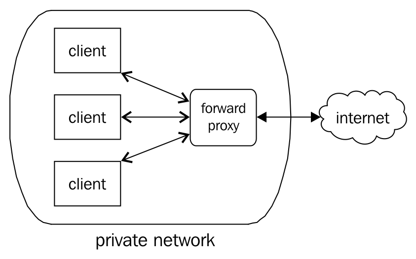
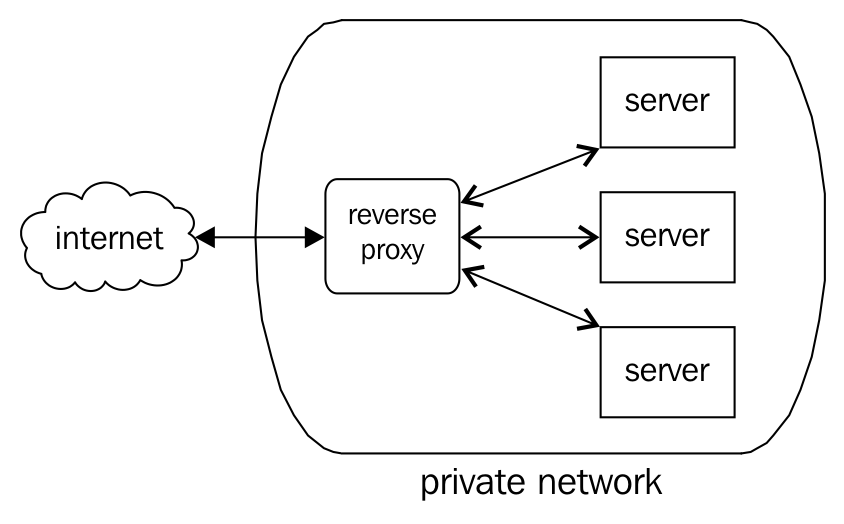
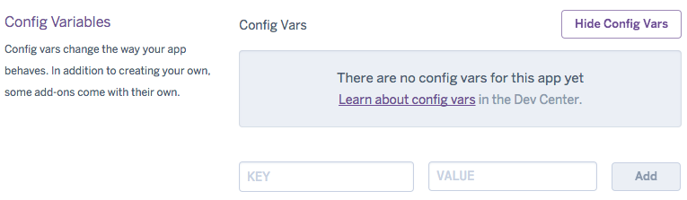

Scaling Your Application <link rel="stylesheet" href="css/style.css" type="text/css">   .koboSpan { -webkit-text-combine: inherit; }

# 扩展应用程序

"Evolution is a process of constant branching and expansion." - Stephen Jay Gould

可伸缩性和性能不是一回事：

"The terms "performance" and "scalability" are commonly used interchangeably,
but the two are distinct: performance measures the speed with which a single request can be executed, while scalability measures the ability of a request to maintain its performance under increasing load. For example, the performance of a request may be reported as generating a valid response within three seconds, but the scalability of the request measures the request's ability to maintain that three-second response time as the user load increases." - Steven Haines, "Pro Java EE 5"

在上一章中，我们研究了如何使用节点集群来提高应用程序的性能。通过使用流程和工作人员集群，我们学会了如何在面对多个并发请求时高效地交付结果。我们学会了垂直扩展节点*，保持相同的占地面积（单个服务器），并通过增加可用 CPU 的功率来提高吞吐量。*

 *在本章中，我们将重点关注*水平*可伸缩性；其思想是，由自给自足且独立的单元（服务器）组成的应用程序可以通过添加更多单元来扩展，而无需更改应用程序的代码。

我们希望创建一个体系结构，在该体系结构中，可以根据不断变化的需求添加或减少任何数量的优化和封装的节点驱动服务器，动态扩展，而无需系统重写。我们希望跨不同的系统共享工作，将请求推送到操作系统、另一台服务器和第三方服务，同时使用节点的事件并发方法智能地协调这些 I/O 操作。

通过架构并行性，我们的系统可以更有效地管理增加的数据量。必要时可以隔离专用系统，甚至可以独立扩展或以其他方式集群。

Node 特别适合处理水平扩展架构的两个关键方面。

首先，节点强制执行非阻塞 I/O，这样任何一个单元的占用都不会导致级联锁定，从而导致整个应用程序停机。由于没有单个 I/O 操作会阻塞整个系统，因此可以放心地集成第三方服务，从而鼓励采用解耦的体系结构。

其次，节点非常重视支持尽可能多的快速网络通信协议。无论是通过共享数据库、共享文件系统还是消息队列，节点的高效网络和`Stream`层都允许许多服务器同步其平衡负载的工作。例如，能够高效地管理共享套接字连接有助于扩展服务器集群和进程集群。

在本章中，我们将研究如何在运行 Node 的多个服务器之间平衡流量，这些不同的服务器如何通信，以及这些集群如何绑定到专门的云服务并从中受益。

# 何时缩放？

关于应用程序扩展的理论是一个复杂而有趣的话题，它将继续被完善和扩展。对该主题的全面讨论需要几本书，针对不同的环境和需求进行策划。出于我们的目的，我们将简单地学习如何识别何时需要放大（甚至缩小）。

拥有一个灵活的体系结构，可以根据需要添加和减少资源，这对于弹性扩展策略至关重要。垂直扩展解决方案并不总是足够的（仅仅添加内存或 CPU 不会带来必要的改进）。什么时候应该考虑水平缩放？

It is essential that you are able to monitor your servers. One simple but useful way to check the CPU and memory usage commanded by Node processes running on a server is to use the Unix `ps` (*process status*) command, for example, `ps aux | grep node`. A more robust solution is to install an interactive process manager, such as HTOP ([http://hisham.hm/htop/](http://hisham.hm/htop/)) for Unix systems, or Process Explorer for Windows-based systems ([https://docs.microsoft.com/en-us/sysinternals/downloads/process-explorer](https://docs.microsoft.com/en-us/sysinternals/downloads/process-explorer)).

# 网络延迟

当网络响应时间超过某个阈值时，例如每个请求需要几秒钟，系统很可能已经过了稳定状态。

虽然发现此问题的最简单方法是等待客户抱怨网站速度慢，但最好针对等效的应用程序环境或服务器创建受控压力测试。

**AB**（**Apache Bench**）是对服务器进行钝性压力测试的简单而直接的方法。此工具可以通过多种方式进行配置，但您为测量服务器的网络响应时间所做的测试通常是简单的。

例如，让我们测试这个简单节点服务器的响应时间：

```js
http.createServer(function(request, response) { 
    response.writeHeader(200, {"Content-Type": "text/plain"});   
    response.write("Hello World");   
    response.end();   
}).listen(2112) 
```

下面是如何测试针对该服务器运行 10000 个请求，并发度为 100（同时请求的数量）：

```js
ab -n 10000 -c 100 http://yourserver.com/ 
```

如果一切顺利，您将收到类似的报告：

```js
 Concurrency Level:      100
 Time taken for tests:   9.658 seconds
 Complete requests:      10000
 Failed requests:        0
 Write errors:           0
 Total transferred:      1120000 bytes
 HTML transferred:       110000 bytes
 Requests per second:    1035.42 [#/sec] (mean)
 Time per request:       96.579 [ms] (mean)
 Time per request:       0.966 [ms] (mean, across all concurrent requests)
 Transfer rate:          113.25 [Kbytes/sec] received

 Connection Times (ms)
 min  mean[+/-sd] median   max
 Connect:        0    0   0.4      0       6
 Processing:    54   96  11.7     90     136
 Waiting:       53   96  11.7     89     136
 Total:         54   96  11.6     90     136

 Percentage of the requests served within a certain time (ms)
 50%     90
 66%     98
 ...
 99%    133
 100%    136 (longest request) 
```

这份报告中包含了许多有用的信息。特别是，应该查找失败的请求和长时间运行的请求的百分比。

有更复杂的测试系统存在，但`ab`是一个快速而肮脏的性能快照。养成创建反映生产系统的测试环境的习惯，并对其进行测试。

Running `ab` on the same server running the Node process you are testing will, of course, impact the test speeds. The test runner itself uses a lot of server resources, so your results will be misleading. Full documentation for ab can be found at: [https://httpd.apache.org/docs/2.4/programs/ab.html](https://httpd.apache.org/docs/2.4/programs/ab.html).

# 热 CPU

当 CPU 使用率开始接近最大值时，开始考虑增加处理客户机请求的单元数。请记住，虽然向单个 CPU 机器添加一个新 CPU 会带来即时和巨大的改进，但向 32 核机器添加另一个 CPU 并不一定会带来同样的改进。减速并不总是关于缓慢的计算。

如前所述，`htop`是快速了解服务器性能的好方法。当它实时显示每个内核上的负载时，这是了解发生了什么的好方法。此外，服务器的平均负载可以用三个值很好地概括。这是一个快乐的服务器：

```js
Load average: 0.00 0.01 0.00
```

这些值意味着什么？什么是“好”或“坏”平均负载？

这三个数字都是测量 CPU 使用率的，分别以 1 分钟、5 分钟和 15 分钟为间隔进行测量。一般来说，可以预期短期负荷将高于长期负荷。如果平均而言，您的服务器没有随着时间的推移而过度紧张，那么客户机很可能拥有良好的体验。

在单芯机器上，平均负载应保持在 0.00 和 1.00 之间。任何请求都将花费*一些*时间。问题是请求所花费的*时间是否比所需的*时间多，以及是否由于负载过大而导致延迟。

如果 CPU 可以被视为管道，那么 0.00 的测量值意味着在推动一滴水时没有过度的摩擦或延迟。测量值为 1.00 表示我们的管道已达到其容量；水流是平稳的，但任何试图推动水流通过的额外尝试都将面临延迟或背压。这转化为网络上的延迟，新请求加入不断增长的队列。

多核机器只是将测量边界相乘。当平均负载达到 4.00 时，四芯机器处于其容量。

如何选择对平均负载作出反应取决于应用程序的具体情况。运行数学模型的服务器看到其 CPU 平均值达到最大容量并不罕见；在这种情况下，您需要*所有*可用资源专用于执行计算。另一方面，以高容量运行的文件服务器可能值得研究。

一般来说，应调查高于 0.60 的平均负荷。事情并不紧急，但可能会有问题。在所有已知优化完成后，定期达到 1.00 的服务器显然是可扩展的候选服务器，当然，任何超过该平均值的服务器都是如此。

节点还通过`os`模块提供本机流程信息：

```js
const os = require('os'); 
// Load average, as an Array 
console.log(os.loadavg()); 
// Total and free memory 
console.log(os.totalmem()); 
console.log(os.freemem()); 
// Information about CPUs, as an Array 
console.log(os.cpus()); 
```

# 套接字使用

当持续套接字连接的数量开始增长，超过任何单节点服务器的容量时（无论多么优化），有必要考虑将处理用户套接字的服务器分散开来。使用`socket.io`，可以随时使用以下命令检查已连接客户端的数量：

```js
io.sockets.clients() 
```

通常，最好通过某种跟踪/记录系统来跟踪应用程序中的 web 套接字连接计数。

# 许多文件描述符

当操作系统中打开的文件描述符数量接近其限制时，可能有过多的节点进程处于活动状态，文件处于打开状态，或者其他文件描述符（如套接字或命名管道）处于活动状态。如果这些高数字不是由于错误或糟糕的设计，那么是时候添加一个新服务器了。

可以使用`lsof`检查任何类型的打开文件描述符的数量：

```js
# lsof | wc -l     // 1345
```

# 数据蠕变

当单个数据库服务器管理的数据量开始超过数百万行或千兆字节的内存时，是时候考虑扩展了。在这里，您可以选择只将一台服务器专用于您的数据库，开始共享数据库，甚至更早而不是更晚地使用托管云存储解决方案。从数据层故障中恢复很少是一种快速修复方法，一般来说，对于像*所有数据*这样重要的东西，只有一个故障点是危险的。

如果您使用的是 Redis，`info`命令将提供您做出这些决策所需的大部分数据。考虑下面的例子：

```js
redis> info 
# Clients 
connected_clients:1 
blocked_clients:0 
# Memory 
used_memory:17683488 
used_memory_human:16.86M 
used_memory_rss:165900288 
used_memory_peak:226730192 
used_memory_peak_human:216.23M 
used_memory_lua:31744 
mem_fragmentation_ratio:9.38 
# CPU 
used_cpu_sys:13998.77 
used_cpu_user:21498.45 
used_cpu_sys_children:1.60 
used_cpu_user_children:7.19 
... 
```

More information on `INFO` can be found at: [https://redis.io/commands/INFO](https://redis.io/commands/INFO).

对于 MongoDB，您可以使用`db.stats()`命令：

```js
> db.stats(1024) 
{    "collections" : 3, 
 "objects" : 5, 
 "avgObjSize" : 39.2, 
 "dataSize" : 0, 
 "storageSize" : 12, 
 "numExtents" : 3, 
 "indexes" : 1, 
 "indexSize" : 7, 
 "fileSize" : 196608, 
 "nsSizeMB" : 16, 
 ... 
 "ok" : 1 } 
```

传递参数`1024`标志`stats`以千字节显示所有值。

More information can be found at: [https://docs.mongodb.com/v3.4/reference/method/db.stats/](https://docs.mongodb.com/v3.4/reference/method/db.stats/)

# 用于监视服务器的工具

有几种工具可用于监视服务器，但很少是专门为节点设计的。一个强有力的候选者是**N【固体】**（[https://nodesource.com/products/nsolid](https://nodesource.com/products/nsolid) ），一家由许多关键贡献者组成的公司。此云服务可以轻松地与节点应用程序集成，提供一个有用的仪表板，直观显示 CPU 使用情况、平均响应时间等。

其他值得考虑的监测工具列举如下：

*   **纳吉奥斯**：[https://www.nagios.org](https://www.nagios.org)
*   **穆宁**：[http://munin-monitoring.org/](http://munin-monitoring.org/)
*   **监视器**：[https://mmonit.com/](https://mmonit.com/)
*   **纽瑞**：[https://newrelic.com/nodejs](https://newrelic.com/nodejs)
*   **关键指标**：[https://keymetrics.io/](https://keymetrics.io/)

# 运行多节点服务器

购买多台服务器，然后在其上运行一些节点进程是很容易的。但是，如何协调这些不同的服务器，使它们成为单个应用程序的一部分？这个问题的一个方面是围绕一个入口点对多个相同的服务器进行集群。如何在服务器池中共享客户端连接？

**横向扩展**是将您的体系结构拆分为不同网络节点并进行协调的过程。*云计算*与此相关，简单地说是指在远程服务器的某个位置定位运行在服务器上的应用程序的某些功能，或者在其他位置运行。在没有单点故障的情况下（理论上是这样的），一般系统更健壮。*停车场问题*是沃尔玛在购物假期可能面临的另一个考虑因素，你将需要数千个停车位，但在今年余下的时间里，这种对空置空间的投资很难证明是合理的。就服务器而言，动态上下扩展的能力不利于构建固定的垂直筒仓。将硬件添加到正在运行的服务器也是一个比旋转并将另一个虚拟机无缝链接到应用程序更复杂的过程。

当然，文件服务速度并不是您可能使用像 NGINX 这样的代理服务器的唯一原因。的确，网络拓扑特征使反向代理成为更好的选择，特别是当公共服务（如压缩）的集中化有意义时。要点很简单，不应该仅仅因为对节点有效地服务文件的能力存在过时的偏见而将其排除在外。

# 正向和反向代理

**代理人**是代表另一方行事的人或事。

**转发代理**通常代表专用网络中的客户端工作，代理到外部网络的请求，例如从 internet 检索数据。在本书前面，我们了解了如何使用 Node 设置代理服务器，其中 Node 服务器充当中介，通常通过 internet 将客户机的请求转发到其他网络服务器。

早期的网络提供商（如 AOL）的运作方式如下：



网络管理员在必须限制对外部世界（即 internet）的访问时使用转发代理。如果网络用户通过电子邮件附件从`somebadwebsite.com`下载恶意软件，管理员可以阻止访问该位置。办公室网络可能会受到社交网站访问限制。一些国家甚至以这种方式限制访问公共网站。

不出意外，**反向代理**的工作方式正好相反，它接受来自公共网络的请求，并在客户端几乎看不到的私有网络中为这些请求提供服务。客户端对服务器的直接访问首先委托给反向代理：



这是一种我们可以用来平衡来自多个节点服务器的客户端请求的代理。客户端*X*不直接与任何给定服务器通信。代理*Y*是第一个接触点，能够将*X*指向负载较低的服务器，或者位于*X*附近，或者以其他方式是*X*此时访问的最佳服务器。

现在，我们将了解如何在扩展节点时实现反向代理，讨论使用**NGINX**（发音为**Engine X**）的实现，这是负载平衡节点服务器时的常用选择，以及使用本机节点模块的实现。

# 使用 http 代理模块

多年来，人们一直建议将 web 服务器（如 NGINX）放在节点服务器的前面。据称，成熟的 web 服务器可以更高效地处理静态文件传输。虽然这可能适用于早期的节点版本（也受到新技术所面临的缺陷的影响），但就纯速度而言，这已经不一定适用。更重要的是，使用**内容交付网络**（**CDN**和其他*边缘*服务，您的应用程序可能需要的静态文件将被缓存。首先，您的服务器不会为这些文件提供服务。

Node 旨在促进网络软件的创建，因此开发了几个代理模块也就不足为奇了。一种流行的生产级节点代理是**http 代理**。让我们看看如何使用它来平衡对不同节点服务器的请求。

我们的整个路由堆栈将由 Node 提供。一个节点服务器将运行我们的代理，监听端口`80`。我们将介绍以下三种场景：

*   在同一台计算机上的不同端口上运行多个节点服务器
*   使用一个盒子作为纯路由，代理外部 URL
*   创建基本循环负载平衡器

作为初始示例，让我们看看如何使用此模块重定向请求：

```js
let httpProxy = require('http-proxy'); 
let proxy = httpProxy.createServer({ 
target: { 
  host: 'www.example.com', 
  port: 80 
} 
}).listen(80); 
```

通过在本地机器的端口`80`上启动此服务器，我们可以将用户重定向到另一个 URL。

要在一台机器上运行多个不同的节点服务器，每个服务器响应不同的 URL，只需定义一个路由：

```js
let httpProxy = httpProxy.createServer({ 
  router: { 
    'www.mywebsite.com' : '127.0.0.1:8001', 
    'www.myothersite.com' : '127.0.0.1:8002', 
  } 
}); 
httpProxy.listen(80); 
```

对于每个不同的网站，您现在可以将 DNS 名称服务器
（通过 ANAME 或 CNAME 记录）指向同一个端点（无论此节点程序运行在何处），它们将解析为不同的节点服务器。当您想运行多个网站，但又不想为每个网站创建新的物理服务器时，这非常方便。另一种策略是在不同节点服务器上处理同一网站内的不同路径：

```js
let httpProxy = httpProxy.createServer({ 
  router: { 
    'www.mywebsite.com/friends': '127.0.0.1:8001', 
    'www.mywebsite.com/foes': '127.0.0.1:8002', 
  } 
}); 
httpProxy.listen(80); 
```

这允许应用程序中的专用功能由唯一配置的服务器处理。

设置负载平衡器也很简单。正如我们稍后将看到的 NGINX 的**上游**指令一样，我们只是提供了一个要平衡的服务器列表：

```js
const httpProxy = require('http-proxy'); 
let addresses = [ 
  { host: 'one.example.com', port: 80 }, 
  { host: 'two.example.com', port: 80 } 
]; 
httpProxy.createServer((req, res, proxy) => { 
  let target = addresses.shift(); 
  proxy.proxyRequest(req, res, target); 
  addresses.push(target); 
}).listen(80); 
```

在本例中，我们平等地对待服务器，按顺序循环使用它们。所选服务器代理后，返回列表的*后方*。

应该清楚的是，这个示例可以很容易地扩展以适应其他指令，例如 NGINX 的**weight**。

The `redbird` module is an extremely advanced reverse proxy built on top of **http-proxy**. Among other things, it has built-in support for automatic SSL certificate generation and HTTP/2 support. Learn more at: [https://github.com/OptimalBits/redbird](https://github.com/OptimalBits/redbird).

# 在 Digital Ocean 上部署 NGINX 负载平衡器

由于 Node 非常高效，大多数网站或应用程序都可以在垂直维度上满足其所有扩展需求。节点只需使用几个 CPU 和正常的内存量就可以处理大量的通信量。

NGINX 是一种非常流行的高性能 web 服务器，通常用作代理服务器。考虑到 NGINX 的设计，NGINX 是节点开发人员的热门选择，这一点有点意外：

As mentioned on [http://www.linuxjournal.com/magazine/nginx-high-performance-web-server-and-reverse-proxy](http://www.linuxjournal.com/magazine/nginx-high-performance-web-server-and-reverse-proxy), "NGINX is able to serve more requests per second with [fewer] resources because of its architecture. It consists of a master process, which delegates work to one or more worker processes. Each worker handles multiple requests in an event-driven or asynchronous manner using special functionality from the Linux kernel (epoll/select/poll). This allows NGINX to handle a large number of concurrent requests quickly with very little overhead."

NGINX 还使负载平衡变得非常容易。在下面的示例中，我们将看到通过 NGINX 代理如何实现开箱即用的负载平衡。

Digital Ocean 是一家云托管提供商，价格低廉且易于设置。我们将在此服务上构建一个 NGINX 负载平衡器。

要注册，请访问：[https://www.digitalocean.com](https://www.digitalocean.com) 。基本套餐（撰写本文时）需要支付 5 美元的费用，但促销代码定期提供；一个简单的 web 搜索应该会产生一个可用的代码。创建并验证帐户以开始。

数字海洋包装被描述为液滴，具有一定的存储空间、传输限制等特征。基本的一揽子计划足以满足我们的需要。此外，您还将指定一个托管区域以及要安装在 droplet 中的操作系统（在本例中，我们将使用最新版本的 Ubuntu）。创建一个微滴，并检查您的电子邮件以获取登录说明。你完了！

您将收到实例的完整登录信息。现在，您可以使用这些登录凭据打开一个终端并将 SSH 连接到您的设备中。

在初次登录时，您可能希望更新软件包。对于 Ubuntu，您可以运行`apt-get update`和`apt-get upgrade`。其他包管理器也有类似的命令（例如用于 RHEL/CentOs 的`yum update`）。

在开始安装之前，让我们更改 root 密码并创建一个非 root 用户（将 root 暴露给外部登录和软件安装是不安全的）。要更改您的根密码，请键入`passwd`并按照终端中的说明进行操作。要创建新用户，请输入`adduser <new user name>`（例如，`adduser john`）。按照说明操作。

还有一步：我们想给我们的新用户一些管理权限，因为我们将以该用户的身份安装软件。用 Unix 的说法，您希望给这个新用户`sudo`访问权。对于您选择的任何操作系统，都很容易找到有关如何执行此操作的说明。基本上，您需要更改`/etc/sudoers`文件。请记住使用诸如`lvisudo`之类的命令执行此操作；不要手动编辑 sudoers 文件！此时，您可能还希望限制 root 登录并执行其他 SSH 访问管理。

在您的终端中成功执行` sudo -i`后，您将能够输入命令，而无需在每个命令前面加上`sudo`。以下示例假设您已经完成了此操作。

现在，我们将为两个节点服务器创建一个 NGINX 负载平衡器前端。这意味着我们将创建三个液滴：一个用于平衡器，另外两个液滴用作节点服务器。最后，我们将得到一个类似以下内容的体系结构：


# 安装和配置 NGINX

让我们安装 NGINX 和 Node/npm。如果您仍然以 root 用户身份登录，请注销并以您刚刚创建的新用户身份重新验证。要安装 NGINX（在 Ubuntu 上），只需键入以下命令：

```js
apt-get install nginx
```

大多数其他 Unix 软件包管理器都有 NGINX 安装程序。

要启动 NGINX，请使用以下命令：

```js
service nginx start
```

NGINX 的完整文档可在以下网址找到：[https://www.nginx.com/resources/wiki/start/](https://www.nginx.com/resources/wiki/start/) 。

现在，您应该能够将浏览器指向分配给您的 IP（如果忘记了，请检查收件箱），并看到如下内容：


现在，让我们设置 NGINX 将平衡的两个服务器。

在数字海洋中创建另外两个水滴。您不会在这些服务器上安装 NGINX。像前面一样在这些服务器上配置权限，并在两个服务器上安装节点。管理节点安装的一种简单方法是使用*Tim Caswell 的***NVM**（节点版本管理器）。NVM 本质上是一个 bash 脚本，它提供了一组命令行工具来促进节点版本管理，允许您轻松地在版本之间切换。要安装它，请在终端中运行以下命令：

```js
curl https://raw.githubusercontent.com/creationix/nvm/v7.10.1/install.sh | sh
```

现在，安装首选节点版本：

```js
nvm install 9.2.0
```

您可能希望在`.bashrc`或`.profile`文件中添加一个命令，以确保每次启动 shell 时都使用特定的节点版本：

```js
nvm use 9.2.0
```

为了测试我们的系统，我们需要在这两台机器上设置节点服务器。在每台服务器上创建以下程序文件，将`**`更改为每台服务器上唯一的程序文件（例如*一个*和*两个*：

```js
const http = require('http');
http.createServer((req, res) => {
  res.writeHead(200, {
    "Content-Type" : "text/html"
  });
  res.write('HOST **');
  res.end();
}).listen(8080)
```

在每台服务器上启动此文件（`node serverfile.js`。每个服务器现在将在端口`8080`上应答。您现在应该能够通过将浏览器指向每个水滴的 IP:8080 来访问此服务器。一旦有两台服务器响应不同的消息，我们就可以设置 NGINX 负载平衡器。

使用 NGINX，跨服务器的负载平衡非常简单。您只需在 NGINX 配置脚本中指出应该平衡哪些上游服务器。我们刚刚创建的两个节点服务器将是上游服务器。NGINX 将配置为平衡对以下各项的请求：


每个请求将首先由 NGINX 处理，NGINX 将检查其*上游*配置，并根据其配置方式，将（反向）代理请求发送到实际处理请求的上游服务器。

您将在您的平衡器吊滴上的`/etc/nginx/sites-available/default`处找到默认的 NGINX 服务器配置文件。

在生产环境中，您可能希望创建自定义目录和配置文件，但出于我们的目的，我们只需修改默认配置文件（您可能希望在开始修改之前进行备份）。

在 NGINX 配置文件的顶部，我们想定义一些*上游*服务器，这些服务器将成为重定向的候选服务器。这只是一个带有`lb-servers`任意键的映射，将在下面的服务器定义中引用：

```js
upstream lb_servers {
  server first.node.server.ip;
  server second.node.server.ip;
}
```

现在我们已经建立了候选映射，我们需要配置 NGINX，使其能够以平衡的方式将请求转发给 lb 服务器的每个成员：

```js
server {
    listen 80 default_server;
    listen [::]:80 default_server ipv6only=on;

    #root /usr/share/nginx/html;
    #index index.html index.htm;

    # Make site accessible from http://localhost/
    server_name localhost;

    location / {
        proxy_pass http://lb-servers; # Load balance mapped servers

        proxy_http_version 1.1;
        proxy_set_header Upgrade $http_upgrade;
        proxy_set_header Connection 'upgrade';
        proxy_set_header Host $host;
        proxy_cache_bypass $http_upgrade;
    }

... more configuration options not specifically relevant to our purposes

}
```

关键是：

```js
proxy_pass http://lb-servers
```

注意名称`lb-servers`如何与上游定义的名称匹配。这应该清楚地表明发生了什么：侦听端口`80`的 NGINX 服务器将把请求传递给 lb 服务器中包含的服务器定义。如果上游定义中只有一台服务器，则该服务器将获得所有流量。如果定义了多个服务器，NGINX 将尝试在这些服务器之间平均分配流量。

也可以使用相同的技术在多个*本地服务器*之间平衡负载。一种是在不同的端口上运行不同的节点服务器，例如`server 127.0.0.1:8001`和`server 127.0.0.1:8002`。

继续更改 NGINX 配置（如果遇到问题，请参阅本书代码包中的`nginx.config`文件）。更改后，使用以下命令重新启动 NGINX：

```js
service nginx restart
```

或者，如果您愿意，请使用以下选项：

```js
service nginx stop
service nginx start
```

假设运行节点服务器的其他两个水滴处于活动状态，您现在应该能够将浏览器指向启用 NGINX 的水滴，并查看来自这些服务器的消息！

由于我们可能希望更精确地控制流量在上游服务器上的分布方式，因此有更多的指令可应用于上游服务器定义。

NGINX 使用加权循环算法平衡负载。为了控制流量分布的相对权重，我们使用权重指令：

```js
upstream lb-servers {
    server first.node.server.ip weight=10;
    server second.node.server.ip weight=20;
}
```

这个定义告诉 NGINX 将两倍的负载分配给第二台服务器。例如，具有更多内存或 CPU 的服务器可能会受到青睐。使用该系统的另一种方法是创建 A/B 测试场景，其中一台包含拟议新设计的服务器接收总流量的一小部分，这样就可以将测试服务器上的指标（销售、下载、参与长度等）与更广泛的平均值进行比较。

还有三个其他有用的指令可用于管理连接故障：

*   `max_fails`：在将服务器标记为不工作之前，与服务器的通信失败的次数。这些故障必须发生的时间段由`fail_timeout`定义。
*   `fail_timeout`：必须发生`max_fails`的时间片，表示服务器不工作。此数字还表示在服务器被标记为不工作后，NGINX 将再次尝试到达标记的服务器的时间。

考虑这个例子：

```js
upstream lb-servers {
  server first.node.server.ip weight=10 max_fails=2 fail_timeout=20s;
  server second.node.server.ip weight=20 max_fails=10 fail_timeout=5m;   
}
```

*   `backup`：只有当*所有*列出的其他服务器不可用时，才会调用标有此指令的服务器。

此外，对于上游定义，还有一些指令添加了一些对如何将客户端定向到上游服务器的控制：

*   `least_conn`：将请求传递给连接最少的服务器。考虑到服务器负载和权重，这提供了一种稍微智能化的平衡。
*   `ip_hash`：这里的想法是为每个连接的 IP 创建一个散列，并确保来自给定客户端的请求始终传递到同一服务器。

另一个用于平衡节点服务器的常用工具是专用负载平衡器 HAProxy，可在以下网址获得：[http://www.haproxy.org](http://www.haproxy.org) 。

# 消息队列–RabbitMQ

确保分布式服务器保持可靠通信通道的最佳方法之一是将远程过程调用的复杂性捆绑到一个独特的单元（消息队列）中。当一个进程希望向另一个进程发送消息时，可以简单地将消息作为应用程序的待办事项列表放置在该队列中，队列服务可以确保消息得到传递，并将任何重要的回复传递回原始发件人。

有一些企业级消息队列可用，其中许多部署了**AMQP****（高级消息队列协议）**。我们将重点关注一个非常稳定且众所周知的 RabbitMQ 实现。

To install RabbitMQ in your environment, follow the instructions found at: [https://www.rabbitmq.com/download.html](https://www.rabbitmq.com/download.html).

安装后，您将使用以下命令启动 RabbitMQ 服务器：

```js
service rabbitmq-server start
```

要使用 Node 与 RabbitMQ 交互，我们将使用*Theo Schlossnagle*创建的`node-amqp`模块：

```js
npm install amqp
```

要使用消息队列，必须首先创建一个使用者—一个到 RabbitMQ 的绑定，该绑定将侦听发布到队列的消息。最基本的消费者将监听所有消息：

```js
const amqp = require('amqp');

const consumer = amqp.createConnection({ host: 'localhost', port: 5672 });

consumer.on('error', err => {

console.log(err);

});

consumer.on('ready', () => {

let exchange = consumer.exchange('node-topic-exchange', {type: "topic"});

consumer.queue('node-topic-queue', q => {

q.bind(exchange, '#');

q.subscribe(message => {
   // Messages are buffers
   console.log(message.data.toString('utf8'));

});

exchange.publish("some-topic", "Hello!");

});

});
```

我们现在正在侦听来自绑定到端口`5672`的 RabbitMQ 服务器的消息。

一旦该使用者建立了连接，它将建立它将侦听的队列的名称，并且应该`bind`到`exchange`。在本例中，我们创建了一个主题`exchange`（默认设置），并给它一个唯一的名称。我们还表示希望通过`#`收听*所有*消息。剩下要做的就是订阅队列，接收消息对象。随着我们的进步，我们将了解更多关于消息对象的信息。现在，请注意重要的`data`属性，它包含已发送的消息。

现在我们已经建立了一个消费者，让我们向 exchange 发布一条消息。如果一切顺利，我们将在控制台中看到发送的消息：

```js
consumer.on('ready', function() { 
  // ... 
  exchange.publish("some-topic", "Hello!"); 
}); 
// Hello! 
```

我们已经学到了足够的知识来实现有用的缩放工具。如果我们有许多分布式节点进程，即使在不同的物理服务器上，每个进程都可以通过 RabbitMQ 可靠地相互发送消息。每个进程只需实现一个**交换队列订阅者**来接收消息，一个**交换发布者**来发送消息。

# 交易所类型

RabbitMQ 提供三种类型的交换：**直接**、**扇出**和**主题**。不同之处在于每种类型的交换处理**路由密钥**——发送给`exchange.publish`的第一个参数的方式。

直接交换直接匹配路由密钥。如下所示的队列绑定仅匹配发送到`'room-1'`的*消息：*

```js
queue.bind(exchange, 'room-1');
```

由于不需要解析，直接交换能够在一段时间内处理比主题交换更多的消息。

扇出交换是不加选择的；它将消息路由到绑定到它的所有队列，忽略路由密钥。这种类型的交换用于广泛广播。

主题交换根据通配符`#`和`*`匹配路由密钥。与其他类型不同，主题交换的路由键*必须*由点分隔的单词组成，例如`"animals.dogs.poodle"`。`#`匹配零个或多个单词；它将匹配每个消息（正如我们在前面的示例中看到的），就像扇出交换一样。另一个通配符是*，它与*完全匹配*一个单词。

直接和扇出交换可以使用与给定主题交换示例几乎相同的代码来实现，只需要更改交换类型，并且绑定操作知道它们将如何与路由密钥关联（扇出订阅者接收所有消息，而不考虑密钥；对于 direct，路由密钥必须直接匹配）。

本例最后一个主题是如何推动交流。我们将创建三个具有不同匹配规则的队列，过滤每个队列从 exchange 接收的消息：

```js
consumer.on('ready', function() { 
  // When all 3 queues are ready, publish. 
  let cnt = 3; 
  let queueReady = function() { 
    if(--cnt > 0) { 
      return; 
    } 
    exchange.publish("animals.dogs.poodles", "Poodle!"); 
    exchange.publish("animals.dogs.dachshund", "Dachshund!"); 
    exchange.publish("animals.cats.shorthaired", "Shorthaired Cat!"); 
    exchange.publish("animals.dogs.shorthaired", "Shorthaired Dog!"); 
    exchange.publish("animals.misc", "Misc!"); 
  } 
  let exchange = consumer.exchange('topical', {type: "topic"}); 
  consumer.queue('queue-1', q => { 
    q.bind(exchange, 'animals.*.shorthaired'); 
    q.subscribe(message => { 
      console.log(`animals.*.shorthaired -> ${message.data.toString('utf8')}`); 
    }); 
    queueReady(); 
  }); 
  consumer.queue('queue-2', q => {     
    q.bind(exchange, '#'); 
    q.subscribe(function(message) { 
      console.log('# -> ' + message.data.toString('utf8')); 
    }); 
    queueReady(); 
  }); 
  consumer.queue('queue-3', q => {     
    q.bind(exchange, '*.cats.*'); 
    q.subscribe(message => { 
      console.log(`*.cats.* -> ${message.data.toString('utf8')}`); 
    }); 
    queueReady(); 
  }); 
}); 

//    # -> Poodle! 
//    animals.*.shorthaired -> Shorthaired Cat! 
//    *.cats.* -> Shorthaired Cat! 
//    # -> Dachshund! 
//    # -> Shorthaired Cat! 
//    animals.*.shorthaired -> Shorthaired Dog! 
//    # -> Shorthaired Dog! 
//    # -> Misc! 
```

`node-amqp`模块包含控制连接、队列和交换的其他方法；特别是，它包含从交换机中删除队列和从队列中删除订阅者的方法。通常，动态更改正在运行的队列的组成可能会导致意外错误，因此请谨慎使用。

To learn more about the AMQP (and the options available when setting up with `node-amqp`), visit: [http://www.rabbitmq.com/tutorials/amqp-concepts.html](http://www.rabbitmq.com/tutorials/amqp-concepts.html).

# 使用节点的 UDP 模块

**UDP****（用户数据报协议）**是一种轻量级的核心互联网消息协议，使服务器能够传递简洁的**数据报**。UDP 以最小的协议开销设计，放弃了交付、订购和复制预防机制，以确保高性能。当不需要完美的可靠性并且需要高速传输时，UDP 是一个很好的选择，例如在网络视频游戏和视频会议应用中。

这并不是说 UDP 通常是不可靠的。在大多数应用程序中，它以高概率传递消息。当需要*完美*可靠性时，例如在银行应用程序中，它根本不适用。它是监视和记录应用程序以及非关键消息服务的最佳候选。

使用节点创建 UDP 服务器非常简单：

```js
const dgram = require("dgram"); 
let socket = dgram.createSocket("udp4"); 
socket.on("message", (msg, info) => { 
  console.log("socket got: " + msg + " from " + 
  info.address + ":" + info.port); 
}); 
socket.bind(41234); 
socket.on("listening", () => { 
  console.log("Listening for datagrams."); 
}); 
```

`bind`命令有三个参数，如下所示：

*   **端口**：`Integer`端口号。
*   **地址**：可选地址。如果没有指定，操作系统将尝试侦听所有地址（这通常是您想要的）。您也可以尝试显式使用`0.0.0.0`。
*   **回调**：这是一个可选回调，不接收任何参数。

现在，只要通过`41234`端口接收到数据报，该套接字就会发出`message`事件。事件回调作为第一个参数接收消息本身，作为第二个参数接收数据包信息的映射：

*   **地址**：发起 IP
*   **系列**：IPv4 或 IPv6 之一
*   **端口**：始发端口
*   **大小**：消息的大小，以字节为单位

此映射类似于调用`socket.address()`时返回的映射。

除了消息和侦听事件外，UDP 套接字还发出**关闭**和**错误**事件，后者在发生错误时接收`Error`对象。要关闭 UDP 套接字（并触发关闭事件），请使用`server.close()`。

发送消息更容易：

```js
let client = dgram.createSocket("udp4"); 
let message = Buffer.from('UDP says Hello!', 'utf8'); 
client.send(message, 0, message.length, 41234, "localhost", (err, bytes) => client.close()); 
```

`send`方法采用`client.send(buffer, offset, length, port, host, callback)`形式：

*   `buffer`：包含要发送的数据报的缓冲区。
*   `offset`：一个整数，表示数据报开始在缓冲区中的位置。
*   `length`：数据报中的字节数。结合**偏移量**，该值标识缓冲区内的完整数据报。
*   `port`：标识目的端口的整数。
*   `address`：表示数据报目的 IP 的字符串。
*   `callback`：可选回调函数，在发送发生后调用。

The size of a datagram cannot exceed 65507 bytes, which is equal to *2^16-1* (65535) bytes, minus the 8 bytes used by the UDP header minus the 20 bytes used by the IP header.

现在，我们有了另一个进程间消息传递的候选者。为我们的节点应用程序设置一个监控服务器，监听 UDP 套接字以获取从其他进程发送的程序更新和统计信息，将非常容易。协议速度对于实时系统来说已经足够快了，任何数据包丢失或其他 UDP 中断都不会占总容量的百分比。

进一步考虑广播的想法，我们还可以使用`dgram`模块创建多播服务器。**多播**只是一对多服务器广播。我们可以向一系列永久保留为多播地址的 IP 广播：

As can be found on [http://www.iana.org/assignments/multicast-addresses/multicast-addresses.xhtml](http://www.iana.org/assignments/multicast-addresses/multicast-addresses.xhtml), "Host Extensions for IP Multicasting [RFC1112] specifies the extensions required of a host implementation of the Internet Protocol (IP) to support multicasting. The multicast addresses are in the range 224.0.0.0 through 239.255.255.255."

此外，`224.0.0.0`到`224.0.0.255`之间的范围还为特殊路由协议预留。此外，某些端口号分配给 UDP（和 TCP）使用，其列表可在以下位置找到：[https://en.wikipedia.org/wiki/List_of_TCP_and_UDP_port_numbers](https://en.wikipedia.org/wiki/List_of_TCP_and_UDP_port_numbers) 。

所有这些引人入胜的信息的结果是，我们知道有一块 IP 和端口是为 UDP 和/或多播保留的，我们将使用其中一些 IP 和端口通过 UDP 和节点实现多播。

# 带节点的 UDP 多播

设置多播 UDP 服务器与*标准*服务器的唯一区别在于绑定到一个特殊的 UDP 端口进行发送，并表示我们希望侦听*所有*可用的网络适配器。我们的多播服务器初始化类似于以下代码段：

```js
let socket = dgram.createSocket('udp4'); 
let multicastAddress = '230.1.2.3'; 
let multicastPort = 5554; 
socket.bind(multicastPort); 
socket.on("listening", function() { 
    this.setMulticastTTL(64); 
    this.addMembership(multicastAddress); 
}); 
```

一旦我们决定了一个多播端口和一个地址并绑定，我们就会捕获`listenng`事件并配置我们的服务器。最重要的命令是`socket.addMembership`，它告诉内核在`multicastAddress`加入多播组。其他 UDP 套接字现在可以在此地址订阅多播组。

数据报就像任何网络数据包一样在网络中跳跃。`setMulticastTTL`方法用于设置一个数据报在被放弃和未交付之前允许进行的最大跳数（生存时间）。可接受的范围为 0-255，大多数系统的默认值为一（1）。这通常不是一个需要担心的设置，但当精确限制有意义时，例如当数据包便宜而跳数昂贵时，它是可用的。

If you'd like to also allow listening on the local interface, use `socket.setBroadcast(true)` and `socket.setMulticastLoopback(true)`. This is normally not necessary.

我们最终将使用此服务器向`multicastAddress`上的所有 UDP 侦听器广播消息。现在，让我们创建两个将侦听多播的客户端：

```js
dgram.createSocket('udp4').on('message', (message, remote) => { 
  console.log(`Client1 received message ${message} from ${remote.address}:${remote.port}`); 
}).bind(multicastPort, multicastAddress); 

dgram.createSocket('udp4').on('message', (message, remote) => { 
  console.log(`Client2 received message ${message} from ${remote.address}:${remote.port}`); 
}).bind(multicastPort, multicastAddress); 
```

我们现在有两个客户端在监听同一个多播端口。剩下要做的就是多播。在本例中，我们将使用`setTimeout`每秒发送一个计数器值：

```js
let cnt = 1; 
let sender; 
(sender = function() { 
  let msg = Buffer.from(`This is message #${cnt}`); 
  socket.send( 
    msg, 
    0, 
    msg.length, 
    multicastPort, 
    multicastAddress 
  ); 
  ++cnt; 
  setTimeout(sender, 1000); 
})(); 
```

下列值将产生计数器：

```js
 Client2 received message This is message #1 from 67.40.141.16:5554
 Client1 received message This is message #1 from 67.40.141.16:5554
 Client2 received message This is message #2 from 67.40.141.16:5554
 Client1 received message This is message #2 from 67.40.141.16:5554
 Client2 received message This is message #3 from 67.40.141.16:5554
 ...
```

我们有两个客户在收听某个特定群体的广播。让我们添加另一个客户端，监听另一个组，比如在多播地址`230.3.2.1`：

```js
dgram.createSocket('udp4').on('message', (message, remote) =>{ 
  console.log(`Client3 received message ${message} from ${remote.address}:${remote.port}`); 
}).bind(multicastPort, '230.3.2.1');
```

由于我们的服务器当前将消息广播到不同的地址，我们需要更改服务器配置，并通过另一个`addMembership`调用添加此新地址：

```js
socket.on("listening", function() { 
  this.addMembership(multicastAddress); 
  this.addMembership('230.3.2.1'); 
}); 
```

我们现在可以向*发送两个*地址：

```js
(sender = function() { 
  socket.send( 
      ... 
      multicastAddress 
  ); 
  socket.send( 
      ... 
      '230.3.2.1' 
  ); 
  // ... 
})(); 
```

没有任何东西可以阻止客户端向组中的其他人，甚至其他组的成员广播：

```js
dgram.createSocket('udp4').on('message', (message, remote) => { 
  let msg = Buffer.from('Calling original group!', 'utf8'); 
  // 230.1.2.3 is the multicast address 
  socket.send(msg, 0, msg.length, multicastPort, '230.1.2.3'); 
}).bind(multicastPort, '230.3.2.1'); 
```

任何在网络接口上有地址的节点进程现在都可以在 UDP 多播地址上侦听消息，从而提供一个快速而优雅的进程间通信系统。

# 在应用程序中使用 Amazon Web 服务

随着几千个用户变成几百万个用户，随着数据库扩展到数 TB 的数据，维护应用程序的成本和复杂性开始压倒经验、资金和/或时间不足的团队。当面临快速增长时，将应用程序的一个或多个方面的责任委托给基于云的服务提供商有时很有用。**AWS****（亚马逊网络服务）**就是这样一套云计算服务，由[亚马逊网站](http://amazon.com)提供。

You will need an AWS account in order to use these examples. All the services we will explore are free or nearly free for low-volume development uses. To create an account on AWS, visit the following link: [https://aws.amazon.com/](https://aws.amazon.com/). Once you have created an account, you will be able to manage all of your services via the AWS console: [https://aws.amazon.com/console/](https://aws.amazon.com/console/)

在本节中，我们将学习如何使用三种流行的 AWS 服务：

*   对于存储文档和文件，我们将与亚马逊**S3**
    **（简单存储服务）**连接
*   亚马逊关键/价值数据库**DynamoDB**
*   为了管理大量电子邮件，我们将利用亚马逊的**SES**
    **（简单电子邮件服务）**

要访问这些服务，我们将使用 AWS SDK for Node，可在以下链接
中找到：[https://github.com/aws/aws-sdk-js](https://github.com/aws/aws-sdk-js)

要安装模块，请运行以下命令：

```js
npm install aws-sdk  
```

Full documentation for the `aws-sdk` module can be found at: [https://docs.aws.amazon.com/AWSJavaScriptSDK/latest/index.html](https://docs.aws.amazon.com/AWSJavaScriptSDK/latest/index.html).

# 鉴定

向 AWS 注册的开发人员分配了两个标识符：

*   公共**访问密钥 ID**（20 个字符的字母数字序列）。
*   一个**秘密访问密钥**（一个 40 个字符的序列）。保密是非常重要的。

Amazon 还为开发人员提供了识别通信区域的能力，例如`"us-east-1"`。这允许开发人员针对最近的服务器（区域端点）进行请求。

区域端点和两个身份验证密钥是发出请求所必需的。

For a breakdown of regional endpoints, visit: [https://docs.aws.amazon.com/general/latest/gr/rande.html](https://docs.aws.amazon.com/general/latest/gr/rande.html).

由于我们将在以下每个示例中使用相同的凭据，因此让我们创建一个可重用的`config.json`文件：

```js
{ 
  "accessKeyId" : "your-key",  
  "secretAccessKey" : "your-secret", 
  "region" : "us-east-1", 
  "apiVersions" : { 
     "s3" : "2006-03-01", 
     "ses" : "2010-12-01", 
     "dynamodb" : "2012-08-10" 
  } 
} 
```

我们还配置将用于服务的特定 API 版本。如果亚马逊的服务 API 发生变化，这将确保我们的代码继续工作。

AWS 会话现在只需两行代码即可初始化。假设这两行出现在以下任何示例代码之前：

```js
const AWS = require('aws-sdk'); 
AWS.config.loadFromPath('./config.json');
```

# 错误

在试验这些服务时，有时可能会出现错误代码。由于其复杂性和云计算的性质，这些服务有时会发出意外或意外的错误。例如，由于 S3 只能保证某些区域和情况下的最终一致性，因此尝试读取刚刚写入的密钥可能并不总是成功。我们将研究每项服务的完整错误代码列表，它们可以在以下位置找到：

*   **S3:**[https://docs.aws.amazon.com/AmazonS3/latest/API/ErrorResponses.html](https://docs.aws.amazon.com/AmazonS3/latest/API/ErrorResponses.html)
*   **发电机 B:**[http://docs.aws.amazon.com/amazondynamodb/latest/developerguide/Programming.Errors.html](http://docs.aws.amazon.com/amazondynamodb/latest/developerguide/Programming.Errors.html)
*   **SES:**[https://docs.aws.amazon.com/ses/latest/DeveloperGuide/api-error-codes.html](https://docs.aws.amazon.com/ses/latest/DeveloperGuide/api-error-codes.html) 和[https://docs.aws.amazon.com/ses/latest/DeveloperGuide/smtp-response-codes.html](https://docs.aws.amazon.com/ses/latest/DeveloperGuide/smtp-response-codes.html)

由于在开始时很难预测错误可能出现的位置，因此在继续操作时使用`domain`模块或其他错误检查代码非常重要。

此外，Amazon 的安全性和一致性模型的一个微妙但基本的方面是严格同步其 web 服务器时间和发出请求的服务器所理解的时间。允许的最大偏差为 15 分钟。虽然这似乎是一个很长的时间，但事实上，时间漂移是很常见的。开发时，注意 403：类似于以下之一的禁止错误：

*   `SignatureDoesNotMatch`：此错误表示签名已过期
*   `RequestTimeTooSkewed`：请求时间与当前时间相差太大

如果遇到此类错误，则服务器发出请求的内部时间可能已漂移。如果是这样，则需要同步该服务器的时间。在 Unix 上，可以使用**NTP****（网络时间协议）**来实现同步。一种解决方案是使用以下命令：

```js
rdate 129.6.15.28
ntpdate 129.6.15.28  
```

For more information on NTP and time synchronization, visit: [http://www.pool.ntp.org/en/use.html](http://www.pool.ntp.org/en/use.html).

让我们开始使用 AWS 服务，从分布式文件服务 S3 开始。

# 使用 S3 存储文件

S3 可用于存储希望能够存储在文件系统上的任何文件。最常见的是，它用于存储图像和视频等媒体文件。S3 也是一个优秀的文档存储系统，特别适合存储小型 JSON 对象或类似的数据对象。

此外，S3 对象可以通过 HTTP 访问，这使得检索非常自然，并且支持 PUT/DELETE/UPDATE 等 REST 方法。S3 的工作原理与一般文件服务器的工作原理非常相似，它分布在遍布全球的服务器上，并提供无限的存储容量。

S3 使用**存储桶**的概念作为*硬盘*的一种推论。每个 S3 帐户可以包含 100 个存储桶（这是一个硬限制），每个存储桶中包含的文件数量没有限制。

# 用水桶工作

创建存储桶很容易：

```js
const AWS = require('aws-sdk');

 // You should change this to something unique. AWS bucket names must
// be unique and are shared across ALL USER namespaces.

const bucketName = 'nodejs-book';

AWS.config.loadFromPath('../config.json');

const S3 = new AWS.S3();

S3.createBucket({

 Bucket: bucketName

}, (err, data) => {

if(err) {
  throw err;
 }

console.log(data);

});
```

我们将收到一个包含`Location`桶的数据映射，以及一个`RequestId`：

```js
{
Location: '/masteringnodejs.examples'
}
```

可能会对一个铲斗执行许多不同的操作。为方便起见，`aws-sdk`允许在参数列表中为所有后续操作自动定义一个 bucket 名称：

```js
let S3 = new AWS.S3({ 
  params: { Bucket: 'nodejs-book' } 
}); 
S3.createBucket((err, data) => { // ... }); 
```

使用`listBuckets`获取现有桶的数组：

```js
S3.listBuckets((err, data) => { 
  console.log(data.Buckets); 
}); 
//    [ { Name: 'nodejs-book', 
//        CreationDate: Mon Jul 15 2013 22:17:08 GMT-0500 (CDT) }, 
//        ... 
//    ] 
```

Bucket names are global to all S3 users. No single user of S3 can use a bucket name that another user has claimed. If I have a bucket named `foo`, no other S3 user can ever use that bucket name. This is a gotcha that many miss.

# 处理对象

让我们在 S3 的`nodejs-book`存储桶中添加一个文档：

```js
const AWS = require('aws-sdk');
AWS.config.loadFromPath('../config.json');

const S3 = new AWS.S3({

 params: {
  Bucket: 'nodejs-book'
 }

});

let body = JSON.stringify({ foo: "bar" });

let s3Obj = {

 Key: 'demos/putObject/first.json',

 Body: body,

 ServerSideEncryption: "AES256",

 ContentType: "application/json",

 ContentLength: body.length,

 ACL: "private"
};

S3.putObject(s3Obj, (err, data) => {

 if(err) {
  throw err;
 }

 console.log(data);

});
```

如果 PUT 成功，其回调将接收类似以下内容的对象：

```js
{ ETag: '"9bb58f26192e4ba00f01e2e7b136bbd8"',
ServerSideEncryption: 'AES256'}
```

我们鼓励您参考 SDK 文档并使用`putObject`接受的所有参数进行实验。这里，我们只关注两个必填字段，以及一些有用和常见的字段：

*   `Key`：用于唯一标识此存储桶中的文件的名称。
*   `Body`：包含文件体的缓冲区、字符串或流。
*   `ServerSideEncryption`：是否对 S3 内的文件进行加密。目前唯一的选择是 AES256（这是一个很好的选择！）。
*   `ContentType`：标准 MIME 类型。
*   `ContentLength`：表示数据报目的 IP 的字符串。
*   `ACL`：屏蔽访问权限，如`private`或`public-read-write`。请参阅 S3 文档。

让`Key`对象类似于文件系统路径是个好主意，有助于以后的排序和检索。事实上，Amazon 的 S3 控制台在其 UI 中反映了这种模式：


让我们将图像流式传输到 S3：

```js
fs.stat("./testimage.jpg", (err, stat) => {

 let s3Obj = {

  Key    : 'demos/putObject/testimage.jpg',

  Body   : fs.createReadStream("./testimage.jpg"),

  ContentLength : stat.size,

  ContentType  : "img/jpeg",

  ACL    : "public-read"

};

 S3.putObject(s3Obj, (err, data) => {
  if(err) {
   throw err;
  }
  console.log(data);

});

});
```

由于我们授予此图像`public-read`权限，因此可在以下位置访问：[https://s3.amazonaws.com/nodejs-book/demos/putObject/testimage.jpg](https://s3.amazonaws.com/nodejs-book/demos/putObject/testimage.jpg) 。

从 S3 获取对象并将其流式传输到本地文件系统更容易：

```js
let outFile = fs.createWriteStream('./fetchedfile.jpg'); 
S3.getObject({ 
  Key : 'demos/putObject/testimage.jpg' 
}).createReadStream().pipe(outFile); 
```

或者，我们可以捕获 HTTP 分块传输上的数据事件：

```js
S3.getObject({ 
  Key : 'demos/putObject/testfile.jpg' 
}) 
.on('httpData', chunk => outFile.write(chunk)) 
.on('httpDone', () => outFile.end()) 
.send(); 
```

要删除对象，请执行以下操作：

```js
S3.deleteObject({ 
  Bucket : 'nodejs-book', 
  Key : 'demos/putObject/optimism.jpg' 
}, (err, data) => { // ... }); 
```

要删除多个对象，请传递一个数组（最多 1000 个对象）：

```js
S3.deleteObjects({ 
  Bucket : 'nodejs-book', 
  Delete : { 
    Objects : [{ 
      Key : 'demos/putObject/first.json' 
    }, { 
      Key : 'demos/putObject/testimage2.jpg' 
    }] 
  } 
}, (err, data) => { // ... });
```

# 将 AWS 与节点服务器一起使用

把我们对节点服务器、通过管道传输文件数据和 HTTP 的了解放在一起，就可以清楚地知道如何用几行代码将 S3 装载为文件系统：

```js
http.createServer(function(request, response) {  
  let requestedFile = request.url.substring(1); 
  S3.headObject({ 
    Key : requestedFile 
  }, (err, data) => { 
    // 404, etc. 
    if(err) { 
      response.writeHead(err.statusCode); 
      return response.end(err.name); 
    } 
    response.writeHead(200, { 
      "Last-Modified" : data.LastModified, 
      "Content-Length" : data.ContentLength, 
      "Content-Type" : data.ContentType, 
      "ETag" : data.ETag 
    }); 
    S3.getObject({ 
      Key : requestedFile 
    }).createReadStream().pipe(response); 
  }); 
}).listen(8080); 
```

标准节点 HTTP 服务器接收请求 URL。我们首先尝试使用`aws-sdk`方法`headObject`进行头部操作，完成两件事：

*   我们将确定该文件的可用性
*   我们将获得构建响应所需的标题信息

在处理任何非 200 状态代码错误之后，我们只需要设置响应头并将文件流回到请求者，如前所示。

这样的系统也可以在两个方向上作为**故障安全**运行；如果 S3 或文件不可用，我们可能会绑定到另一个文件系统，从那里进行流式处理。相反，如果我们首选的本地文件系统失败，我们可能会使用备份 S3 文件系统。

Refer to the `amazon/s3-redirect.js` file in the code bundle available at the Packt website for an example of using 302 redirects to similarly mount an AWS filesystem.

S3 是一个功能强大的数据存储系统，具有比我们前面介绍的更高级的功能，例如对象版本控制、下载支付管理以及将对象设置为 torrent 文件。通过对流的支持，`aws-sdk`模块使节点开发人员能够像处理本地文件系统一样轻松地处理 S3。

# 使用 DynamoDB 获取和设置数据

**DynamoDB**（**DDB**）是一个 NoSQL 数据库，提供非常高的吞吐量和可预测性，可以轻松扩展。DDB 专为**数据密集型**应用而设计，以低延迟和可靠的方式执行海量 map/reduce 和其他分析查询。也就是说，它也是一个用于一般 web 应用程序的优秀数据库解决方案。

The whitepaper announcing DynamoDB was highly influential, sparking a real interest in NoSQL databases, and inspiring many, including **Apache** **Cassandra**. The paper deals with advanced concepts, but rewards careful study; it is available at: [http://www.allthingsdistributed.com/files/amazon-dynamo-sosp2007.pdf](http://www.allthingsdistributed.com/files/amazon-dynamo-sosp2007.pdf).

Dynamo 数据库是表的集合，表是项的集合，项是属性的集合。表（或行，如果愿意）中的每个项都必须有一个主键，用作表的索引。除主键外，每个项还可以具有任意数量的属性（最大限制为 65 KB）。

这是一个有五个属性的项目，一个属性作为主键（`Id`：

```js
{
     Id = 123                                        
     Date = "1375314738466" 
     UserId = "DD9DDD8892" 
     Cart = [ "song1", "song2" ] 
     Action = "buy" 
} 
```

让我们创建一个包含主键和辅键的表：

```js
const AWS = require('aws-sdk'); 
AWS.config.loadFromPath('../config.json'); 
let db = new AWS.DynamoDB();  
db.createTable({ 
  TableName: 'purchases', 
  AttributeDefinitions : [{ 
    AttributeName : "Id", AttributeType : "N" 
  }, { 
    AttributeName : "Date", AttributeType : "N" 
  }], 
  KeySchema: [{  
    AttributeName: 'Id',  KeyType: 'HASH'  
  }, {  
    AttributeName: 'Date',  KeyType: 'RANGE'  
  }], 
  ProvisionedThroughput: { 
    ReadCapacityUnits: 2, 
    WriteCapacityUnits: 2 
  } 
}, (err, data) => console.log(util.inspect(data))); 
```

回调将接收类似以下内容的对象：

```js
{     
  TableDescription: {  
    AttributeDefinitions: [ // identical to what was sent], 
    CreationDateTime: 1375315748.029, 
    ItemCount: 0, 
    KeySchema: [ // identical to what was sent ], 
    ProvisionedThroughput: {  
      NumberOfDecreasesToday: 0, 
      ReadCapacityUnits: 2, 
      WriteCapacityUnits: 2  
    }, 
    TableName: 'purchases', 
    TableSizeBytes: 0, 
    TableStatus: 'CREATING'  
  }  
} 
```

不立即创建/删除表；实际上，您正在排队创建一个表（注意`TableStatus`。在不久的将来，该表将存在。由于在不删除并重建表的情况下无法更改 DDB 表定义，因此在实践中，这种延迟不会影响应用程序构建一次，然后再处理项。

DDB 表必须提供一个模式，指示将用作键的项属性，由`KeySchema`定义。`KeySchema`中的每个属性可以是`RANGE`或`HASH`。必须有一个这样的指数；最多可以有两个。每个添加的项必须包含任何已定义的键，以及所需的任意多个附加属性。

`KeySchema`中的每个项目必须与`AttributeDefinitions`中的项目在数量上匹配。在`AttributeDefinitions`中，每个属性可以是数字（`"N"`或字符串（`"S"`。添加或修改属性时，始终需要根据属性的类型以及名称来标识属性。

要添加项目，请使用以下命令：

```js
db.putItem({ 
  TableName : "purchases", 
  Item : { 
    Id : {"N": "123"},                                        
    Date : {"N": "1375314738466"}, 
    UserId : {"S" : "DD9DDD8892"}, 
    Cart : {"SS" : [ "song1", "song2" ]}, 
    Action : {"S" : "buy"} 
  } 
}, () => { // ... }); 
```

除了主键和（可选）辅助键之外，我们还希望向项目添加其他属性。每种类型都必须提供以下其中一种：

*   `S`：一串
*   `N`：一个数字
*   `B`：Base64 编码字符串
*   `SS`：字符串数组（字符串集）
*   `NS`：数字数组（数字集）
*   `BS`：Base64 编码字符串数组（Base64 集）

All items will need to have the same number of columns; again, dynamic schemas are *not* a feature of DDB.

假设我们创建了一个如下表所示的表：

| **Id** | **日期** | **动作** | **推车** | **用户 ID** |
| 123 | 1375314738466 | 购买 | {“歌曲 1”、“歌曲 2”} | DD9DDD8892 |
| 124 | 1375314738467 | 购买 | {“歌曲 2”，“歌曲 4”} | DD9EDD8892 |
| 125 | 1375314738468 | 购买 | {“song12”、“song6”} | DD9EDD8890 |

现在，让我们执行一些搜索操作。

# 搜索数据库

有两种搜索操作可用：**查询**和**扫描**。使用单个主键对表进行扫描将毫无例外地搜索表中的每个项目，并返回与搜索条件匹配的项目。这在任何情况下都可能非常慢，但在小型数据库上除外。查询是一种直接的键查找。我们首先来看查询。请注意，在本例中，我们将假定此表只有一个主键。

为了获取项目`124`的`Action`和`Cart`属性，我们使用以下代码：

```js
db.getItem({ 
  TableName : "purchases", 
  Key : { 
    Id : { "N" : "124" } 
  }, 
  AttributesToGet : ["Action", "Cart"] 
}, (err, res) => console.log(util.inspect(res, { depth: 10 }))); 
```

这将返回以下内容：

```js
{   
  Item: {  
    Action: { S: 'buy' },  
      Cart: { SS: [ 'song2', 'song4' ] }  
  }  
} 
```

要选择所有属性，只需省略`AttributesToGet`定义。

扫描成本更高，但允许进行更复杂的搜索。在进行扫描时，次键的用处尤其明显，这使我们能够避免扫描整个表的开销。在我们的第一个扫描示例中，我们将像只有一个主键一样工作。然后，我们将展示如何使用辅助键过滤扫描。

要获取`Cart`属性包含`song2`的所有记录，请使用以下代码：

```js
db.scan({ 
  TableName : "purchases", 
  ScanFilter : { 
    "Cart": { 
      "AttributeValueList" : [{ 
        "S":"song2" 
      }], 
      "ComparisonOperator" : "CONTAINS" 
    }, 
  } 
}, (err, res) => { 
  console.log(util.inspect(res, { 
    depth: 10 
  })); 
}); 
```

这将返回带有`Id`123 和 124 的项目的所有属性值。

现在，让我们使用我们的辅助键来进一步过滤：

```js
db.scan({ 
  TableName : "purchases", 
  ScanFilter : { 
    "Date": { 
      "AttributeValueList" : [{ 
        "N" : "1375314738467" 
      }], 
        "ComparisonOperator" : "EQ" 
      }, 
      "Cart": { 
         "AttributeValueList" : [{ 
           "S" : "song2" 
         }], 
         "ComparisonOperator" : "CONTAINS" 
      }, 
   } 
}, (err, res) => { 
  console.log(util.inspect(res, {depth: 10})); 
}); 
```

此新过滤器将结果限制为项目 124。

# 通过 SES 发送邮件

Amazon 描述了 SES 旨在通过以下方式解决的问题：

"Building large-scale email solutions to send marketing and transactional messages is often a complex and costly challenge for businesses. To optimize the percentage of emails that are successfully delivered, businesses must deal with hassles such as email server management, network configuration, and meeting rigorous Internet Service Provider (ISP) standards for email content."

除了日益增长的系统固有的典型网络扩展问题外，由于垃圾邮件的流行，提供电子邮件服务变得特别困难。发送大量未经请求的电子邮件而不被列入黑名单是非常困难的，即使收件人愿意接收这些电子邮件。垃圾邮件控制系统是自动化的；您的服务必须列在*白名单*中，各种电子邮件提供商和垃圾邮件追踪者都会使用该白名单，以避免您的电子邮件在客户收件箱以外的地方出现低百分比。邮件服务必须在合适的人中享有良好的声誉，否则它几乎毫无用处。

亚马逊的 SES 服务拥有必要的声誉，为应用程序开发人员提供基于云的电子邮件服务，该服务可靠，能够处理几乎无限量的电子邮件。在本节中，我们将学习节点应用程序如何将 SES 用作可靠的邮件传递服务。

Ensure that you have SES access by visiting your developer console. When you first sign up with SES, you will be given *Sandbox* access. When in this mode, you are limited to using only Amazon's mailbox simulator, or sending email to address you have verified (such as one's own). You may request production access, but for our purposes, you will only need to verify an email address to test with.

由于使用 SES 等服务的成本会随着邮件量的增加而增加，您可能需要定期检查配额：

```js
let ses = new AWS.SES(); 
ses.getSendQuota((err, data) => { 
  console.log(err, data); 
});  
```

要发送消息，请执行以下操作：

```js
ses.sendEmail({ 
  Source : "spasquali@gmail.com", 
  Destination : { 
    ToAddresses : [ "spasquali@gmail.com" ] 
  }, 
  Message : { 
    Subject: { Data : "NodeJS and AWS SES" }, 
    Body : { 
      Text : { Data : "It worked!" } 
    } 
  } 
}, (err, resp) => console.log(resp));
```

回调将接收类似以下输出的内容：

```js
RequestId: '623144c0-fa5b-11e2-8e49-f73ce5ee2612'

MessageId: '0000014037f1a167-587a626e-ca1f-4440-a4b0-81756301bc28-000000'
```

可以使用多个收件人、HTML 正文内容以及邮件服务的所有其他功能。

# 使用 Twilio 在 Heroku 上创建 SMS bot

我们将构建一个作为客户服务应用程序的应用程序，客户服务代理可以通过该应用程序处理客户的 SMS 请求并对其作出响应。该系统将由两部分组成。

*   第 1 部分：在本地计算机上运行的客户端应用程序，它启动了一个 React-powered web 界面，显示传入的 SMS 消息，指示消息的情绪（客户是否生气？高兴？），并允许您响应消息。请注意，即使此服务器在本地计算机上运行，也可以部署到 Heroku 或其他地方——目的是演示不同位置的多少台服务器可以智能地相互通信。
*   第 2 部分：一个*交换机*，用于记录通过 Twilio SMS 网关到达的消息，对其进行处理，并在任意数量的客户端服务器上分发消息——如果您有 10 名客户服务代表使用客户端应用程序连接到交换机，交换机接收的消息将均匀地分布在这些客户端上。第二个应用程序将部署在 Heroku 上。

您首先需要在**Heroku**上获得一个帐户，这是一家类似于数字海洋的云服务器提供商：[http://www.heroku.com](http://www.heroku.com)

Heroku 提供免费帐户，因此您可以免费构建以下应用程序。

拥有帐户后，登录并下载系统的 Heroku CLI:[https://devcenter.heroku.com/articles/getting-started-with-nodejs#set-向上](https://devcenter.heroku.com/articles/getting-started-with-nodejs#set-up)。按照该页面上的步骤登录 Heroku 的命令行 toolbelt。

确保已安装 Git（[https://git-scm.com/book/en/v2/Getting-Started-Installing-Git](https://git-scm.com/book/en/v2/Getting-Started-Installing-Git) ）。

在本地文件系统上创建一个目录，并将以下两个存储库克隆到该文件夹中：

*   [https://github.com/sandro-pasquali/thankyou](https://github.com/sandro-pasquali/thankyou)
*   [https://github.com/sandro-pasquali/switchboard](https://github.com/sandro-pasquali/switchboard)

*thankyou*存储库是客户端应用程序。现在，您将把*交换机*存储库部署到 Heroku。

使用终端导航到*交换机*存储库，并将副本部署到 Heroku：

```js
> heroku create
```

您应该会在终端中看到如下内容：


Heroku 已经在您的服务器上建立了 Git 端点。现在，运行以下命令：

```js
> git remote
```

您将看到返回的两个元素的列表：*heroku*和*origin*。这是您的本地*交换机*存储库正在跟踪的两个远程分支，一个在 Heroku 上，另一个是您最初克隆的分支。

下一步是将本地存储库推入 Heroku 存储库：

```js
> git push heroku master
```

您应该看到很多安装说明。当一切都完成时，请成功导航到应用程序 URL。您应该看到有一个*应用程序错误*。Heroku 为您的应用程序提供完整的日志。现在让我们访问它们，以发现哪里出了问题：

```js
> heroku logs
```

To keep a running tail of log activity on your Heroku server, use:
**` > heroku logs --tail`**

由于缺少环境变量，您应该会看到一些错误，特别是对于 Twilio。应用程序希望在应用程序环境中设置这些，但尚未设置。我们现在就开始吧。

# 使用 Twilio webhooks 接收和发送 SMS 消息

交换机应用程序最终提供了一个服务来设置一个支持 REST 的端点，Twilio 可以通过您注册的号码接收的 SMS 消息来调用该端点。它在 LevelDB（一个非常快速的键/值存储库）中按电话号码存储这些消息的日志，向连接到交换机的客户端广播新消息。

整个应用程序的逻辑流如下所示：


我们可以看到，我们的应用程序的逻辑从 Twilio 的 SMS 开始，并支持来自客户端的响应。这是构建*NoUI*或纯 SMS 应用程序的基本模式。这种模式越来越流行，常见于聊天机器人、支持人工智能的助手等形式。我们将很快深入研究这个应用程序。

现在，我们需要启用 Twilio 桥。

首先，您需要在 Twilio 上创建一个测试帐户来获取一些 API 变量。转到[https://www.twilio.com](https://www.twilio.com) 并注册一个测试帐户。确保您设置了测试电话号码；我们将向该号码发送短信。

完成后，从帐户仪表板中获取 Twilio API 密钥、电话号码和电话号码 SID。现在，您需要将该信息与其他一些键一起添加到 Heroku 的环境变量中。转到 Heroku 仪表板，找到您的实例，单击它，然后导航到设置|显示配置变量：



这是您在运行的节点进程中将键/值对添加到`process.env`的地方。添加以下键/值对：

*   `TWILIO_AUTH_TOKEN`/<您的授权令牌>
*   `TWILIO_SID`/<您的 sid>
*   `TWILIO_PHONE_NUMBER_SID`/<您的手机#sid>
*   `TWILIO_DEFAULT_FROM`/<您指定的电话号码>
*   `SOCK_PORT`/`8080`
*   `URL`/<您的服务器 URL（不带尾随斜杠）

保存这些新的环境变量后，应用程序将在 Heroku 上自动重新启动。请重试您的应用程序 URL。如果一切正常，您应该会看到一条消息，如交换机处于活动状态。

You can quickly load your application into a browser from the command line with **`> heroku open`**. While we will not be using the shell, you can log in to your Heroku box via your Terminal with `> heroku run bash`.

要与 Twilio 通信，我们将使用官方节点库：[https://github.com/twilio/twilio-node](https://github.com/twilio/twilio-node) 。重要代码可在交换机存储库的`router/sms/`文件夹中找到。这个模块将允许我们注册一个 webhook 来接收消息，并响应这些消息。

现在，让我们构建交换机。

# 总机

总机将单独负责与 Twilio 通信。因为我们需要从 web 服务器上创建一个[Twi-IO]包，所以我们需要使用[Twi-T1]来捕获数据 http://www.restify.com 。这是一个非常快速的节点服务器实现，专门为快速、高负载的基于 REST 的 API 设计。由于交换机只专注于处理来自 Twilio 的传入消息，其出站流量通过 WebSocket，因此不需要像 Express 这样的*更高级别*服务器，该服务器旨在通过模板、会话等方便视图的呈现。

让我们看一下代码，该代码实例化了一个 restify 服务器，该服务器接受来自 Twilio 的包含 SMS 消息数据的 POST 消息，以及将客户端绑定到交换机的套接字服务器：

```js
// router/index.js
const restify = require('restify');
const SServer = require("ws").Server;
const server = restify.createServer({
  // additional configuration can be done here
});
server.use(restify.plugins.acceptParser(server.acceptable));
server.use(restify.plugins.bodyParser());

function responder(req, res) {
   res.send(200, 'Switchboard is active');
}
server.get('/', responder);

// process.env.PORT is set by heroku (add it yourself if hosting elsewhere)
server.listen(process.env.PORT, () => {});

// Get the LevelDB interface, and its readable stream
require('./Db')((db, dbApi) => {

  // Configure the sms webhook routing
  require('./sms')(server, dbApi);

  // Configure a leveldb datastream listener which has the job
  // of informing clients of data changes.
  require('./dataStream.js')(db, Clients);

  // Configure the socket listener for client connections
  let wss = new SServer(server);

  wss.on("connection", clientConn => {
    clientConn.on("close", () => {
      // remove clients, close the connection
    });

    clientConn.on("message", payload => {
      // ...more on this later
    });

    // Say something nice to clients when they connect
    clientConn.send(JSON.stringify({
      type: 'alert',
      text: 'How can I help you?'
    }));
  });
});
```

只需很少的代码，我们就建立了一个 web 服务器，并使用套接字服务器对其进行了扩展（使用优秀的`ws`模块，您可以在[获取该模块）https://github.com/websockets/ws](https://github.com/websockets/ws) ）。我们鼓励您查看交换机存储库中的代码，其中关于如何管理客户端连接的详细信息应该很容易理解。特别是，调查`router/Db/index.js`文件，其中建立了`levelDB`连接，并定义了用于存储消息历史记录的 API（`api.addToNumberHistory`。出于我们的目的，请注意`server.get`方法，该方法为 GET 请求建立一个处理程序，如果我们需要检查交换机是否可用，该处理程序仅用作*ping*服务。接下来我们将添加重要的 webhook 路由。

Twilio webhook 代码如下所示：

```js
// router/sms/index.js
require('./sms')(server, dbApi);
```

该文件中的代码如下所示：

```js
const env = process.env;
const twilioAPI = require('twilio')(env.TWILIO_SID, env.TWILIO_AUTH_TOKEN);
module.exports = (server, dbApi) => {
  let smsUrl = env.URL + '/smswebhook';
  twilioAPI.incomingPhoneNumbers(env.TWILIO_PHONE_NUMBER_SID).update({
    smsUrl: smsUrl
  });    

  server.post('/smswebhook', (req, res) => {
    let dat = req.body;
    let meta = {
      message : dat.Body,
      received : Date.now(),
      fromCountry : dat.FromCountry,
      phoneNumber : dat.From
    };

    dbApi
    .addToNumberHistory(dat.From, meta)
    .then(newVal => console.log('Received message from', dat.From))
    .catch(err => console.log("levelERRR:", err));
    res.end();
  });
};
```

考虑到我们正在连接并使用一个全球短信网关，代码非常简单。在使用我们之前在 Heroku 上设置的环境变量实例化 Twilio API 实例后，我们可以方便地使用此 API 以编程方式建立 webhook，从而避免手动登录 Twilio 仪表板的过程：

```js
   let smsUrl = `${env.URL}/smswebhook`;
   twilioAPI.incomingPhoneNumbers(env.TWILIO_PHONE_NUMBER_SID).update({
     smsUrl: smsUrl
   });    
```

更重要的是，这种技术允许我们动态地重新配置 Twilio 端点 Twilio；能够*热插拔*处理程序的命名或其他更改总是很好的。

Twilio 发布和我们将接收的身体看起来像这样：

```js
{
  ToCountry: 'US',
  ToState: 'NY',
  SmsMessageSid: 'xxxxxx',
  NumMedia: '0',
  ToCity: 'SOUTH RICHMOND HILL',
  FromZip: '11575',
  SmsSid: 'xxxxxx',
  FromState: 'NY',
  SmsStatus: 'received',
  FromCity: 'SOUTH RICHMOND HILL',
  Body: 'Hi! This is a test message!',
  FromCountry: 'US',
  To: '+5555554444',
  ToZip: '11244',
  NumSegments: '1',
  MessageSid: 'xxxxxx',
  AccountSid: 'xxxxxx',
  From: '+555555555',
  ApiVersion: '2010-04-01' 
}
```

在钩子处理程序中，我们通过`api.addToNumberHistory`方法（返回一个承诺）获取密钥信息、发送者的编号以及将其存储在`levelDB`中的消息。现在我们已经准备好通知客户这条消息。我们怎么做？

客户端通过 websocket 连接。在写入 DB 之后，我们可以简单地将消息发送到同一个函数体中的客户机。然而，现在我们的代码开始变得复杂，承担了两个职责（接收和发送），而不仅仅是一个职责（接收）。这似乎是一件小事，但这正是特性爬行出现的地方，也许下一步我们会在这个函数中添加日志记录，等等。此外，如果我们负责通知客户端新消息，我们还需要确认数据库写入成功；这往往是不明确的，误报并不是不寻常的。

与其这样做，不如创建一个广播变更集的通知系统。每当新消息写入 DB-a 确认写入时，都会宣布更新事件，并注册事件处理程序。在我们的初始服务器代码中，此功能使用以下行绑定：

```js
require('./dataStream.js')(db, Clients);
```

捕获变更集并广播它们的代码使用*Domenic Tarr 的*`level-live-stream`包：

```js
module.exports = (db, Clients) => {
  const dbStream = require('level-live-stream')(db);

  // When a new write has been successfully written...
  dbStream.on('data', data => {
    let number = data.key;
    let val = data.value;

    // Find any clients that are listening on this number
    let boundClient = Clients.withNumber(number);

    // Send the current history to this client
    if(boundClient) {
      try {
        return boundClient.send(JSON.stringify({
          type: 'update',
          list: val
        }));
      } catch(e) {
        Clients.delete(boundClient);
      }
    }

    // Try to find an available client to handle this number
    let waitingClient = Clients.nextAvailable();

    if(waitingClient) {
      // This client is no longer `available`. Assign client a number.
      // Then send number history.
      Clients.set(waitingClient, number);
      waitingClient.send(JSON.stringify({
        type: 'update',
        list: val
      }));
    }
    // TODO: handle situations without available clients
  });
};
```

通过使用`level-live-stream`，我们能够将逻辑集中在正确的事件上——一个对数据库的确认写入，留下这个*微服务*专门负责查找可用的客户端并向他们发送更新的消息历史记录。请注意，本例中存储和引用客户机的方式根本不是确定的。您可能希望继续采用*将一件事做好*的理念，创建另一个专门负责代理连接的小型服务。例如，我们可以从这个示例中删除所有客户机代码，并创建另一个公开`getNextAvailableClient`方法的服务。这种编排微服务的组合策略将在下一章中进一步讨论。

我们现在可以接收、存储和广播传入的 SMS 消息。只剩下一点功能可以将客户端响应发送回 Twilio，继续 SMS 对话。这些响应的合成由*thankyou*应用程序执行，我们将在下面讨论。但是，最终，这些响应由交换机引导（回想前面的序列图），下面是可用于通过 Twilio 网关发送 SMS 消息的非常短的代码：

```js
// router/sms/sendResponse.js
const Twilio = require('twilio');
const twilioAPI = new Twilio(process.env.TWILIO_SID, process.env.TWILIO_AUTH_TOKEN);
module.exports = (number, message) => twilioAPI.messages.create({
  to: number,
  from: process.env.TWILIO_DEFAULT_FROM,
  body: message
});
```

您应该回忆一下在我们的基本服务器代码中注册的 websocket 的*on message*侦听器，它使用前面的功能响应调用方。现在，我们可以扩展该侦听器：

```js
// router/index.js
...
clientConn.on("message", payload => {
  try {
    payload = JSON.parse(payload);
 } catch(e) {
    return;
 }

 switch(payload.type) {
   case 'available':
     Client.set(clientConn, 'available');
   break;

   case 'response':
     let number = Clients.get(clientConn);
     // Add to message history when bound client
     // sends valid message to a known number.
     if(/^\+?[0-9]*$/.test(number)) {
       dbApi.addToNumberHistory(number, {
         message : payload.message,
         received : Date.now(),
         phoneNumber : number
       })
       .then(() => require('./sms/sendResponse.js')(number, payload.message))
       .catch(err => console.log("response send error:", err));
     }
     break;
  }
});
```

我们在这里再次看到`addToNumberHistory`，因为回复当然是对话历史的一部分。将传出消息添加到数据库记录后，通过 Twilio 发送出去。你注意到什么了吗？这只是我们必须做的事情之一。另一个是将更新后的消息历史记录*发送回客户端*，以便该响应可以出现在他们的历史记录视图中。通常，这是使用一些客户端 JavaScript 完成的，当客户端键入响应并单击*发送*时，它会乐观地更新客户端状态，希望消息能够发送到交换机。但是，它没有什么呢？

我们看到了变更集方法在这里的帮助。如果客户端消息未能到达交换机或以其他方式失败，`levelDB`将永远不会更新，并且客户端的历史状态不会与数据层表示的规范历史不同步。虽然在像这样一个普通的应用程序中，这可能并不重要，但如果您正在构建事务性软件，这将很重要。

现在，让我们浏览应用程序的另一半*thankyou*客户端。

# 感谢界面

总而言之，我们希望创建一个系统，交换机通过该系统接收 SMS 消息，并将其传递给*服务代表*，在其本地笔记本电脑或类似设备上运行对话界面。此客户端在`thankyou`存储库中定义，如下所示：


在这里，我们可以看到交换机管理的消息历史记录，以及用于发回响应的接口。重要的是，这些图标以人类可读的格式（*几秒钟前*）表示消息的情绪（眨眼的快乐、悲伤的愤怒）及其时间戳。`thankyou`的目标是捕获传入（和传出）消息，在消息流上运行情绪分析，并显示结果。我们将使用 React 来构建 UI。

React requires a build system, and we're using **Browserify**, **Gulp**, and **BrowserSync**. How those technologies work is beyond the scope of this chapter. Go over the contents of `gulpfile.js` and the `/source` directory of the `thankyou` repository. There are many online tutorials for these popular technologies.

由于我们正在为一个真实的 UI 提供服务，对于这个项目，我们将使用 Express 来构建我们的节点服务器。不过，服务器非常简单。它只负责提供刚才图片中的单个视图，该视图包含在单个`index.html`文件中：

```js
// /source/views/index.html

<!DOCTYPE html>
<html>
<head>
   <title>Untitled</title>
   <link rel="stylesheet" type="text/css" href="css/app.css">
</head&gt;
<body>

<div id="main"></div>
<div id="page_controls">
   <span id="message-composer"></span>
</div>

<script src="https://code.jquery.com/jquery-3.2.1.min.js" integrity="sha256-hwg4gsxgFZhOsEEamdOYGBf13FyQuiTwlAQgxVSNgt4=" crossorigin="anonymous"></script>
<script src="js/socketConnector.js"></script>
<script src="js/components.js"></script>
<script src="js/app.js"></script>
</body>
</html>
```

React 组件由构建系统捆绑到`components.js`中；JavaScript 文件类似地捆绑在`app.js`中，就像样式表捆绑在`app.css`中一样。jQuery DOM 操纵库用于简单元素效果和管理消息生成器。如前所述，我们不会深入讨论客户端 JavaScript。简要介绍一下用于构建时间线的 React 组件将非常有用，因为该组件最终将接收来自交换机的新消息。

这是为`thankyou`供电的主要 UI 组件：

```js
// source/jsx/MessageComposer.jsx
export class Timeline extends React.Component {
  constructor(props) {
    super(props);
    this.state = {
      phone : '',
      messages: []
    };
  }
  componentDidMount() {
    ws.onmessage = mOb => {
      let data = JSON.parse(mOb.data);
      if(data.messages && data.phone) {
        return this.setState(data);
      }
    }
  }

  render() {
    return <div>
      <MessageHistory history={this.state} />
      </div>
  }
}

export class MessageHistory extends React.Component {
  constructor(props) {
    super(props);
  }
  render() {
    let history = this.props.history;
     return <div id="timeline_container">
       <div className="history_header">
         <figure>{history.phone}</figure>
       </div>
         <ul> 
           { history.messages.map(function(it) { 
              return <li className="message_event" key={it.received}>
                <div className={"event_icn icon-emo-" + it.sentiment}></div>
                <div className="event_content">
                  <p>{it.message}</p>
                </div>
                <div className="event_date">
                  {it.date}
                </div>
              </li>
           }) }
        </ul>
      </div>;
    }
}

render(
  <Timeline />, document.getElementById('main')
);
```

即使您不知道 React，您也应该能够看到`MessageHistory`组件扩展了`Timeline`组件。`Timeline`组件负责维护应用程序状态，或者在我们的情况下，维护当前消息历史记录。

这是`MessageHistory`中的关键 UI 代码：

```js
{ history.messages.map(function(it) {
   return <li className="message_event" key={it.received}>
      <div className={"event_icn icon-emo-" + it.sentiment}></div>
      <div className="event_content">
         <p>{it.message}</p>
      </div>
      <div className="event_date">
         {it.date}
      </div>
   </li>
}) }
```

您可能会想起交换机使用的消息历史记录：

```js
dbApi.addToNumberHistory(number, {
  message : payload.message,
  received : Date.now(),
  phoneNumber : number
})
```

这是`MessageHistory`中的部分，其中数据被呈现到 UI 视图中。我们不会深入讨论 UI 代码，但您应该注意到交换机没有生成的一个属性：`it.sentiment`。请记住，在我们讨论 thankyou 如何与交换机进行数据通信时。

由于交换机通过 WebSocket 接收和发送消息，`Timeline`有这样一个参考：

```js
ws.onmessage = mOb => {
  let data = JSON.parse(mOb.data);
  if(data.messages && data.phone) {
    return this.setState(data);
  }
}
```

套接字代码包含在我们的`index.html`文件中：

```js
<script src="js/socketConnector.js"></script>
```

另外，它看起来是这样的：

```js
let ws = new WebSocket('ws://' + host + ':8080');
ws.sendMessage = function(command, msg) {
  this.send(JSON.stringify({
    command : command || '',
    message : msg || ''
  }));
};
```

此代码将`ws`引用放在客户端（`window.ws`上）的浏览器全局范围中。虽然通常不是最佳实践，但对于我们的简单 UI，这使得 React 组件很容易获取相同的套接字引用。该引用也用于`MessageComposer`组件，该组件接受客户的响应：

```js
// source/jsx/MessageComposer.jsx
export class MessageComposer extends React.Component {
  constructor(props) {
    super(props);
  }
  sendMessage(ev) {
    // Get message; clear input; exit if
    let input = document.getElementById('composer');
    let msg = input.value;

    input.value = '';

    if(msg.trim() === '') {
      return;
    }

    ws.sendMessage('response', msg);
  }
  render() {
    return <span>
      <textarea id="composer"></textarea><button onClick={this.sendMessage}>send</button>
    </span>
  }
}

render(
  <MessageComposer />, document.getElementById('message-composer')
);
```

该组件呈现一个文本区域，可以在其中合成响应，并通过套接字发送到交换机。

现在，让我们看一下客户机服务器如何与客户机 UI 通信，以及如何代理与交换机的通信。

客户端服务器在`router/index.js`中定义：

```js
const http = require('http');
const express = require('express');
const bodyParser = require('body-parser');

let defaultPort = 8080;
let app = express();

app.use(bodyParser.json());
app.use(bodyParser.urlencoded({
  extended: true
}));
app.use(express.static('./public'));

let server = http.createServer(app);
server.listen(process.env.PORT || defaultPort);

console.log('HTTP server listening on', process.env.PORT || defaultPort);

// The client is connected to a local socket server, which sends client->LocalSS->customer messages.
// The local SS is connected to switchboard, receiving SMS->switchboard->LocalSS->client messages.
require('./bindSocketServer.js')(server);
```

这是标准的 Express 设置。请注意以下行：

```js
require('./bindSocketServer.js')(server);
```

这是主要的代理逻辑。回顾应用程序序列图，这里是接收交换机消息并通过另一个套接字传递给 UI，最终传递给 React 渲染器的地方。类似地，服务器侦听来自 UI 的消息，并将这些消息传递给交换机：

```js
// router/bindSocketServer.js
const WebSocket = require('ws');
const SServer = WebSocket.Server;

let arrayToStream = require('./transformers/arrayToStream.js');
let timeTransformer = require('./transformers/time.js');
let sentimentTransformer = require('./transformers/sentiment.js');
let accumulator = require('./transformers/accumulator.js');

const sbUrl = process.env.SWITCHBOARD_URL;

module.exports = server => {
  // Bind the local socket server, which communicates
  // with web clients.
  (new SServer({
     server: server
  })).on('connection', localClientSS => {
    let keepalive;
    // A remote SMS gateway
    let switchboard = new WebSocket(sbUrl);

    // ... boilerplate ping/pong functionality

    // handle 
    switchboard.onmessage = event => {
      let data = event.data;
      try {
        data = JSON.parse(data);
      } catch(e) {
        return console.log(`Unable to process data: ${data}`);
      }
      // switchboard sent an update
      if(data.type === 'update') {
        // Transform messages into expected format for UI.
        arrayToStream(data.list.reverse())
        .pipe(timeTransformer({
          format: "%s ago"
        }))
        .pipe(sentimentTransformer('message'))
        .pipe(accumulator((err, messages) => {
          if(err) {
            return console.log(err);
          }
          localClientSS.sendMessage({
            messages: messages,
            phone: messages[0].phoneNumber
          })
         }));
        }
      };

      // Need to configure handlers so we can bidirectionally
      // communicate with client UI (snd/rcv messages)
      localClientSS.sendMessage = obj => {
        localClientSS.send(JSON.stringify(obj));
      };

      // Client UI is responding
      localClientSS.on('message', payload => {
        try {
          payload = JSON.parse(payload);
        } catch(e) {
          return;
        }
        switch(payload.command) {
          case 'response':
            switchboard.send(JSON.stringify({
              type: 'response',
              message : payload.message
            }));
            break;
            default:
              // do nothing
            break;
         }
      });

      // ... handle socket close, etc.
};
```

鉴于*配电盘*的设计，这一点现在应该是有意义的。从底部开始，我们可以看到，当客户端套接字服务器`localClientSS`接收到消息时，它会验证该消息并将其传递到*交换机*，在那里该消息将被添加到该客户端正在处理的电话号码的消息历史记录中。更有趣的是从交换机接收消息的代码，它执行情绪分析并将时间戳转换为人类可读的句子。

为了执行这些转换，使用`arrayToStream.js`模块将从*交换机*（JSON 格式的数组）接收的有效负载转换为对象流。[第 3 章](03.html)、*节点和客户端间的流数据*中介绍了流；我们只是创建一个`Readable`流，将数组中的每个元素作为一个不同的对象进行管道传输。真正的乐趣始于我们应用转换。让我们看看使用`through2`模块（[进行情绪分析的代码（处理历史对象的`'message'`属性）https://github.com/rvagg/through2](https://github.com/rvagg/through2) 简化了变换流的创建和设计，当然还有情感模块（[https://github.com/thisandagain/sentiment](https://github.com/thisandagain/sentiment) ）要测量消息的情绪：

```js
// router/transformers/sentiment.js
const through2 = require('through2');
const sentiment = require('sentiment');

module.exports = targProp => {
  if(typeof targProp !== 'string') {
     targProp = 'sentiment';
  }

  return through2.obj(function(chunk, enc, callback) {
    // Add #sentiment property
    let score = sentiment(chunk[targProp]).score;

    // Negative sentiments
    if(score < 0) {
      chunk.sentiment = score < -4 ? 'devil' : 'unhappy';
    }

    // Positive sentiments
    else if(score >= 0) {
      chunk.sentiment = score > 4 ? 'wink' : 'happy';
    }

    this.push(chunk);
    callback()
  });
};
```

功能简单；对于从交换机发送的历史记录数组中的每个对象，确定消息的情绪分数。负面分数为*差*，从非常差（*魔鬼*到*不快乐*不等。同样，我们在从非常好（*眨眼*）到*快乐*的范围内获得积极的情绪。消息对象中添加了一个新的`sentiment`属性，正如我们在前面考虑`MessageHistory`组件时看到的，这将设置消息在 UI 中接收的图标。

If you want to continue development of this application on your own, you should fork the repositories onto your own GitHub account, and repeat the process with these personal repositories. This will allow you to push changes and otherwise modify the application to suit your own needs.

*交换机*和*谢谢*的协调应该会让您了解如何使用服务、套接字、REST 端点和第三方 API 来分发功能，帮助您通过在堆栈中添加（或删除）组件进行扩展。通过使用转换流，您可以应用“动态”流数据转换，而不会阻塞、管理服务器上的数据模型，并将布局留给 UI 本身。

# 总结

大数据应用让网络应用程序的开发人员承担了为规模化做准备的重大责任。Node 在创建网络友好型应用程序开发环境方面提供了帮助，该环境可以轻松连接到网络上的其他设备，例如云服务，特别是其他节点服务器。

在本章中，我们学习了一些扩展节点服务器的好策略，从分析 CPU 使用情况到跨进程通信。利用我们对消息队列和 UDP 的新知识，我们可以构建水平扩展的节点服务器网络，通过简单地复制现有节点，让我们能够处理越来越多的流量。在研究了 Node 和 NGINX 的负载平衡和代理之后，我们可以自信地为应用程序添加容量。当与 Digital Ocean、AWS 和 Twilio 提供的云服务相匹配时，我们可以尝试以较低的成本进行企业级开发、数据存储和广播，而不会增加应用程序的复杂性。

随着应用程序的增长，我们需要不断了解每个部分以及整体的行为。当我们不断添加新的组件和功能时，有些是本地的，有些是通过云计算的，有些甚至是用另一种语言编写的，作为开发人员，我们如何智能地跟踪和规划添加和其他更改？在下一章中，我们将学习微服务，这是一种从许多小型、协作的水平分布网络服务中开发一个应用程序的方法。*