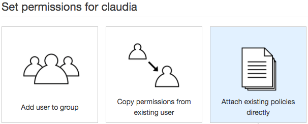
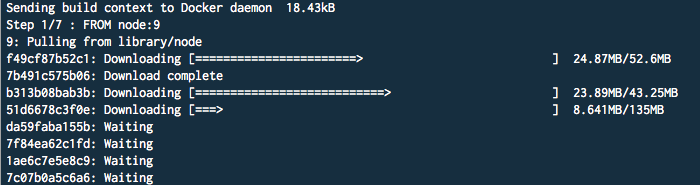
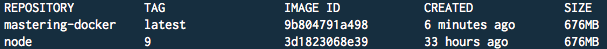
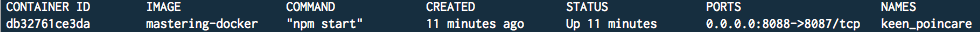
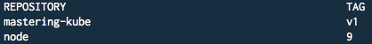
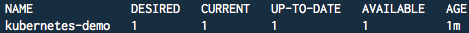

# 九、微服务

Let everyone sweep in front of his own door, and the whole world will be clean. – Goethe

随着软件变得越来越复杂，任何一个人，甚至一个团队都不可能保持对整个体系结构的全面了解。互联网的兴起推动了*前端*（一台计算机上处理 JavaScript、CSS、HTML 的浏览器）和*后端*（另一台运行数据库和 HTTP 服务器的计算机）的概念统一到一台服务器上，以提供一种产品*网页*。用户可能会单击一个按钮，给服务器打电话，该服务器可能会检查数据库，并最终交付一个 HTML 页面。

速度加快了。现代用户希望功能强大、互动性强的移动应用能够以低成本、定期更新来娱乐他们或推动他们的业务。现在，一个人可以创建一个应用，在几个月内获得数百万用户。要在几个月甚至几年内从一个人扩展到支持数百万并发用户的公司，需要高效的团队和工程管理。

当今基于网络的应用由几个独立的子系统组成，这些子系统必须相互协作以满足更大系统的业务或其他需求。例如，许多 web 应用将呈现由一个或多个库和/或 UI 框架组成的基于浏览器的界面，将用户针对运行在手机、微控制器和笔记本电脑上的 JavaScript 控制器的操作转换为跨多个 web 协议发出的形式化网络请求，最终与任意数量的服务器进行通信，这些服务器执行以不同语言编程的业务逻辑单元，所有服务器共享一个或多个数据库，可能跨越多个数据中心，它们自己发起并协调到云 API 或其他服务器的更长的请求链，等等。

如今，任何复杂的软件都很少包含在一台机器上或单个代码库中。在本章中，我们将研究最近流行的由独立参与者组成分布式体系结构的技术，每个参与者都以一个小的、被描述的、热可加载的服务或微服务的形式。微服务允许您重新布线、重写、重用和重新部署应用的模块化部分，使更改更容易。

# 为什么是微服务？

用较小的专用单元构建更大的系统并不是一个新想法。面向对象编程遵循同样的原则。Unix 就是这样构建的。促进可组合网络软件（CORBA、WebObjects、NetBeans）的体系结构已经有几十年的历史了。新的是网络软件产生的利润规模。几乎每个业务部门的客户都需要新软件和新功能，软件开发人员不断提供和/或改进这些功能，以响应不断变化的市场条件。微服务实际上是一种管理理念，其目标是减少在代码中反映不断变化的业务/客户需求所需的时间。目标是降低变革的成本。

由于没有绝对正确的方法来构建软件，每种语言设计都偏向于一个或几个关键原则，特别是指导系统应如何扩展的原则，这通常会影响系统的部署方式。为Node社区模块化系统提供信息的一些关键原则，这些系统由做一件事很好的小程序组成，事件驱动，以 I/O 为中心，以网络为中心，与支撑微服务的程序密切相关：

1.  一个系统应该分成许多小服务，每个服务只做一件事，而不是更多。这有助于澄清。
2.  为服务提供动力的代码应该简短。Node社区中的一个常见准则是将程序限制在接近 100 行代码的范围内。这有助于提高可维护性。

3.  任何服务都不应依赖于其他服务的存在，甚至不应知道其他服务的存在。服务是解耦的。这有助于提高可伸缩性、清晰度和可维护性。
4.  数据模型应该是分散的，公共（但不是必需的）微服务模式是每个服务维护自己的数据库或类似模型。服务是无状态的。这加强了（3）。
5.  独立服务易于复制（或剔除）。扩展（双向）是微服务架构的一个自然特征，因为可以根据需要添加或删除新的*Node*。这还可以进行简单的实验，可以测试原型服务，可以测试或临时部署新功能，等等。
6.  独立的、无状态的服务可以独立地被替换或升级（或降级），而不管它们构成的任何系统的状态如何。这为更加集中、谨慎的部署和重构提供了可能。
7.  失败是不可避免的，所以系统应该设计成优雅地失败。定位故障点（1,2），隔离故障（3,4），并实施恢复机制（当错误边界定义明确、较小且非关键时，恢复机制更容易），通过减少不可靠性范围来提高稳健性。
8.  测试对于任何非平凡的系统都是必不可少的。明确且简单的无状态服务易于测试。测试的一个关键方面是模拟服务的*存根*或*模拟*，以测试服务互操作性。清晰描述的服务也易于模拟，因此可以智能地组合到可测试系统中。

想法很简单：较小的服务很容易单独推理，鼓励规范的正确性（很少或没有灰色区域）和 API 的清晰性（受约束的输出集跟随受约束的输入集）。由于无状态和解耦，服务促进了系统的可组合性，有助于扩展性和可维护性，使它们更易于部署。此外，对这类系统进行非常精确、离散的监控也是可能的。

考虑到这个粗略的草图，让我们回到过去，考察一些基本的架构模式，例如“三层”架构，以及它们的特性如何导致了*微服务*的想法。将这一进展带到现在，我们将看看现代网络应用的惊人规模是如何迫使经典客户机->服务器->数据库设置重新构想的，这是一个通常由微服务组成的最佳新世界。

When building web-based APIs using microservices, it will be useful to have tools that give you precise control over handling calls, headers, POST bodies, responses and so on, especially when debugging. I recommend installing **Postman** ([https://www.getpostman.com/](https://www.getpostman.com/)), and an extension for your browser that "prettifies" JSON objects. For Chrome, a good one is **JSON Formatter** ([https://chrome.google.com/webstore/detail/json-formatter/bcjindcccaagfpapjjmafapmmgkkhgoa?hl=en](https://chrome.google.com/webstore/detail/json-formatter/bcjindcccaagfpapjjmafapmmgkkhgoa?hl=en)).

# 从 3 层到 4 层

要了解微服务如何改进Node应用，您必须了解它们旨在解决的问题，以及这些问题以前是如何解决的。重要的是要知道*面向微服务的体系结构可能应用于哪里*，以及*为什么*这样的改变会对您有所帮助。让我们看看多层分布式网络体系结构是如何随着时间的推移而发展的。

# 巨石

这是一块巨石：


它很大，一块一块，垂直生长。如果不付出巨大的努力、巨大的危险和巨大的成本，可能很难重塑或以其他方式修改。当有人将一个建筑描述为*整体*时，他们使用前面的隐喻来暗示一些非常大、不可移动、如此巨大的东西，以阻止那些试图改进它或全面考察其整体组成部分的人。

考虑一个简单的应用，比如一个 To.T3 to To To.t4}列表。列表管理器需要具备`create`、`add`、`delete`等更改列表的功能。该应用的代码可能类似于以下伪代码：

```js
let orm = require('some-orm');

module.exports = {
  create: list  => orm.createList(list),
  add: (list, item) => List(list).insert(new Item(item)),
  delete: (list, item) => List(list).delete(item)
};
```

这个例子展示了单片设计思想。数据与流程逻辑、功能位于同一上下文（封闭的Node模块）、同一文件和同一操作系统流程中的 UI 控制器位于同一台计算机上。您不必是专业的微服务人员，就可以理解，当您将用户帐户、草稿和媒体附件、共享、多设备同步和其他功能添加到您的待办应用中时，所有应用逻辑的原始单一单一存储库已经变得过于密集，需要将其分解为多个部分。

如果您将这些功能分解为一个独立的进程，在其自己的内存空间中运行，如此纯粹且独立于任何其他进程，以至于可以对其进行更新、关闭、复制、部署、测试甚至替换，而不影响系统的任何其他部分，该怎么办？微服务就是从这种思维中产生的。

使用标准 OO 或一个文件或一小部分文件中的函数或结构列表构建软件，并期望软件在一台机器上运行，这是完全可以的。可能是大多数建筑人的榜样；在现代硬件上，一台运行简单Node服务器的单核心机器很可能可以处理数千名并发用户执行非平凡的数据库驱动任务。通过添加更多内核或内存来垂直扩展体系结构来扩展不断增长的应用是完全可以的。通过竖立几个已经垂直扩展的服务器并平衡它们之间的负载，也可以扩展架构。这一战略仍被一些价值数十亿美元的公司所采用。

如果你的需求是正确的选择，那么建造一块巨石*是可以的。在其他时候，微服务将是正确的选择。您可能不需要使用分散的数据源；当服务发生变化时，您可能不需要*重新加载*服务。广泛使用的数据库 MYSQL 通常是垂直扩展的。当限制被取消时，只需向数据库服务器添加更多的处理核心、内存和存储空间，或者创建同一数据库的多个副本，并在它们之间平衡请求。这种单片结构很容易推理，并且通常具有弹性。*

垂直比例的建筑（独石）有什么优势

*   **测试和调试**：应用中发生的事情从应用本身开始到结束，与随机网络效应无关。这在测试和调试时非常有用。
*   **强一致性**：持久的本地数据库连接有助于保证事务完整性，包括回滚。分布式数据库，特别是那些被数千个客户端同时访问的数据库，更难保持同步，通常被描述为*最终一致*，这可能是一个问题，尤其是如果您是银行。
*   **简单性**：一个设计良好的应用，例如，一个 REST API 与一个数据库在同一逻辑空间内局部绑定，可以很容易地描述，并且是可预测的。通常，个人可以理解整个系统，甚至可以单独运行它！这是一个非常重要的优势，特别是在员工入职速度加快和个人创业机会增加方面。
*   **线性扩展**：假设你可以通过在一台机器上增加一倍的内存来增加你的容量，这是一个非常简单的升级。在某种程度上，这个解决方案是不够的，但这一点可能比你想象的要远得多。预测增加负载的成本和扩展系统所需的步骤相对容易。

一些公司或开发人员将遇到绝对需要分布式体系结构的规模。一些智能数据对象设计和组件化 UI 通过一个数据库进行关联，经过良好的设计和维护，在很长一段时间甚至是永远都足够了。在许多方面，流行的 RubyonRails 框架继续捍卫集成系统的整体性和价值，其创建者 David Heinemeier Hansson 在[强烈主张这一立场 http://rubyonrails.org/doctrine/#integrated-系统](http://rubyonrails.org/doctrine/#integrated-systems)。

# 从整体到三层体系结构

您可能会精确地说，现在很少有人真正构建单片应用了。如今人们称之为*巨石*的是一个典型的三层应用，它具体化了以下概念层：

*   **表示层**：客户端请求、查看、修改信息的接口。通常与应用层通信。
*   **应用层：**连接表示层和数据层的逻辑
*   **数据层**：保存和组织信息的地方

Node开发人员可能会识别由客户机框架组成的应用，如 React（Presentation），*由使用 Express 构建的应用层提供*，通过某种连接器（如 Mongoose）与 MongoDB 数据库通信。这些是**灯**堆栈，**表示**堆栈。系统架构师早就知道，将应用分离为不同的系统是一种明智的策略。在许多方面，该架构反映了**模型-视图-控制器****（**MVC**）模型，其中 M=数据，V=表示，C=应用。**

 **# 这种架构是如何产生的？

首先，人们认识到，系统中有非常明显的不同部分，应当单独理解。基于浏览器的 UI 与数据库或 web 服务器无关。通过不同的抽象层，它可能会*反映*您的数据库结构（例如，显示由兴趣链接的概要文件），但系统的特性最终是一个设计决策，而不是一个必要条件。独立于布局网格或交互组件维护和更新数据库是有意义的。不幸的是，由于懒惰的设计或快节奏的商业环境的变迁以及其他原因，这些截然不同的事情最终可能会纠缠在一起。

其次，当更改某一层的一个部分最终需要重新测试整个系统时，快速、持续的部署和集成将更加困难。集成测试必须接触真实系统或创建人工模拟，两者都不可靠，都可能导致破坏性的结果。类似地，部署是整体的，每个部分，即使在概念上不同，实际上也与其他部分紧密相连，其中每个部分的完整性必须通过验证整体的完整性来验证。庞大的测试套件反映了它们试图覆盖的应用设计的规模和密度。

只关注三个层次会使弹性变得困难。新的数据模型、功能、服务，甚至可能是*一次性*添加的 UI（例如，Facebook 的一个完全独立的登录系统）必须跨三层链接，并且必须小心地将其与许多或所有现有数据模型、功能、业务逻辑、UI 进行集成随着新的缓存机制（CDN）和 API 驱动的开发的兴起，三层系统的人为性开始让开发人员感到沮丧。

# 面向服务的体系结构

微服务的理念主要是围绕**面向服务的架构（SOA）**的理念的细化和再文本化，Wikipedia 将其定义为：

<q>"A [SOA] is a style of software design where services are provided to the other components by application components, through a communication protocol over a network. ... A service is a discrete unit of functionality that can be accessed remotely and acted upon and updated independently, such as retrieving a credit card statement online."</q>

当可以描述不同的功能时，SOA 非常有意义。如果您正在运行在线商店，您可能希望将搜索功能和支付功能与注册系统和客户端 UI 服务器分离。我们可以看到，这里的基本思想是创建逻辑上自包含且可通过网络访问的功能，其他系统组件（包括服务）可以使用这些有用的服务而不会相互冲突。

将类似的功能分离为单独的服务是对三层体系结构的常见调整，其中服务器上的业务逻辑可能将其职责委托给第三方 API。例如，可以使用身份管理服务，如**Auth0**来管理用户帐户，而不是将其本地存储在数据库中。这意味着登录的业务逻辑可以作为外部服务的代理。财务交易（如销售）通常委托给外部提供商，日志收集和存储也是如此。对于可能将其服务作为 API 提供的公司，整个 API 管理可能会委托给诸如 Swagger 或 Apariy 之类的云服务。

可能是由于服务的体系结构趋势，在第三方服务管理一次*现场*功能（如缓存和其他 API）的驱动下，一系列新的想法（通常称为“4 层体系结构”）吸引了系统架构师的注意。

# 4 层和微服务

过去几年的现代分布式应用开发已经在某种程度上形成了有利于扩展的模式共识。让我们首先考虑什么是“四层架构”，然后是微服务如何定义这些类型的系统的设计。

4 层体系结构扩展了 3 层体系结构：

*   **第 1 层：**三层架构中的数据层被**服务**层取代。这种想法很简单：数据存储规模如此之大，方式如此之多，技术如此之多，质量和类型如此频繁地发生变化，以至于“单一真相来源”的想法，如单一数据库，不再可行。数据通过抽象接口公开，其内部设计（调用 Redis 数据库和/或从 Gmail 中提取收件箱和/或从政府数据库读取天气数据）是一个“黑匣子”，只需以预期格式返回数据。
*   **第 2 层：**4 层架构引入了**聚合**层的概念。正如数据现在被分解成服务（1）一样，业务逻辑也被隔离成单独的服务。正如我们将在后面讨论 Lambda 体系结构时看到的，您获取数据或调用*子例程*的方式之间的区别已经模糊到一个通用的 API 驱动模型中，在该模型中，具有一致接口的单个服务生成协议感知数据。这一层组装和转换数据，将聚合的源数据扩充并过滤为以结构化、可预测的方式建模的数据。这一层可能被称为*后端*或应用层。在这里，开发人员对通道进行编程，数据通过这些通道按照商定的（编程的）协议流动。通常，我们希望在这里生成结构化数据。
*   其余的层是通过将表示层拆分为两个来创建的：
    *   **第 3 层：**第**交付**层：该层了解客户端配置文件（移动、桌面、物联网等），将聚合层交付的数据转换为特定于客户端的格式。缓存数据将通过 CDN 或其他方式在此处获取。选择要插入*网页*的广告可以在此处完成。该层负责为单个用户优化从聚合层接收的数据。这一层通常可以完全自动化。
    *   **第 4 层：**第**客户**层：该层为特定客户定制通常从交付层返回的内容。这可以简单到为移动设备呈现数据流（可能是响应的 CSS 结构或设备特定的本机格式）或反映个性化视图（仅图像或语言翻译）。在这里，同一数据源可以与特定的业务合作伙伴保持一致，以符合**SLA（服务级别协议）**或其他业务功能。

值得注意的变化是将表示层分为两层。Node通常出现在交付层中，代表客户端查询聚合层，自定义它为客户端接收的数据响应。

一般来说，我们已经转向这样一种体系结构，即单个服务不需要以任何特定方式反映调用者的需求，就像 Express 服务器中以浏览器为中心的模板引擎可能具有的那样。服务不需要共享相同的技术或编程语言，甚至不需要共享相同的操作系统版本或种类。相反，架构师声明了一种特定类型的拓扑，具有明确定义的通信点和协议，通常分布在：1）数据源、2）数据聚合器、3）数据整形器和 4）数据显示器中。

# 部署微服务

在这一节中，我们将考虑微服务上的几种变体，看看开发人员使用Node的微服务的几种常见方式。我们将从**Seneca**开始，这是一个Node的微服务框架。然后，我们将继续使用**Amazon Lambda**开发基于云的微服务。在此基础上，我们将尝试用**Docker**容器构建**Kubernetes**集群，探索现代集装箱化微服务编排。

# 塞内卡微服务公司

Seneca 是一个基于Node的微服务构建工具包，可以帮助您将代码组织成由模式触发的不同动作。Seneca 应用由可以接受 JSON 消息并可以选择返回一些 JSON 的服务组成。服务注册对具有特定特征的消息的兴趣。例如，每当广播显示`{ cmd: "doSomething" }`模式的 JSON 消息时，服务可能会运行。

首先，让我们创建一个响应三种模式的服务，一种模式返回“Hello！”，另外两种不同的方式表示“再见！”。

创建一个包含以下代码的`hellogoodbye.js`文件：

```js
// hellogoodbye.js
const seneca = require('seneca')({ log: 'silent' });
const clientHello = seneca.client(8080);
const clientGoodbye = seneca.client(8081);

seneca
.add({
role: 'hello',
cmd:'sayHello'
}, (args, done) => done(null, {message: "Hello!"}))
.listen(8082);

seneca
.add({
role: 'goodbye',
cmd:'sayGoodbye'
}, (args, done) => done(null, {message: "Goodbye"}))
.add({
role: 'goodbye',
cmd:'reallySayGoodbye'
}, (args, done) => done(null, {message: "Goodbye!!"}))
.listen(8083);

clientHello.act({
role: 'hello',
cmd: 'sayHello'
}, (err, result) => console.log(result.message));

clientGoodbye.act({
role: 'goodbye',
cmd: 'sayGoodbye'
}, (err, result) => console.log(result.message));

clientGoodbye.act({
role: 'goodbye',
cmd: 'reallySayGoodbye'
}, (err, result) => console.log(result.message));
```

Seneca 的工作理念是服务客户机监听特定的命令模式，并基于模式匹配路由到正确的处理程序。我们的第一项工作是建立两个 Seneca 服务客户端，监听端口`8080`和`8081`。我们已经可以看到服务如何被组织成两个组，一个是“hello 服务”，另一个是“再见服务”。我们现在需要向这些服务添加操作。要做到这一点，我们需要告诉 Seneca 在进行与特定模式匹配的服务调用时如何操作，这里使用特定的对象键定义。如何定义服务对象是一个未知数，但是“cmd”和“role”模式很常见，它可以帮助您创建逻辑组和标准命令调用签名。我们将在下面的示例中使用该模式。

考虑到前面的代码，我们看到当接收到一个 JSON 对象时，`cmd`字段设置为`sayHello`并且`role`字段设置为`hello`，服务处理程序应该返回`{ message: "Hello!" }`。“再见”角色方法的定义类似。在文件的底部，您可以看到我们如何通过 Node 直接调用这些服务。很容易想象这些服务定义如何被分解成单个文件中的几个模块导出，根据需要动态导入，或者以有组织的方式用于组合应用（基于微服务的体系结构的目标）。

要删除正在显示的日志数据，您可以使用`require('seneca')({ log: 'silent' })`初始化您的 Seneca 实例。

由于 Seneca 服务默认监听 HTTP，您可以通过 HTTP 进行直接调用，并针对`/act`路由进行操作，从而获得相同的结果：

```js
curl -d "{\"cmd\":\"sayHello\",\"role\":\"hello\"}" http://localhost:8082/act
// {"message":"Hello!"}
```

这个自动 HTTP 接口免费为我们提供网络可发现服务，这很方便。我们已经可以了解微服务模式：简单、独立、少量的功能，使用标准网络数据模式进行通信。塞内卡为我们提供了一个免费的编程和网络接口，这是一个额外的好处。

一旦开始创建大量服务，就很难跟踪哪个服务组在哪个端口上运行。服务发现是微服务体系结构引入的一个困难的新问题。Seneca 通过其**mesh**插件解决了这一问题，该插件将服务发现添加到您的 Seneca 集群中。让我们创建一个简单的计算器服务来演示。我们将创建两个服务，每个服务监听一个不同的端口，一个执行加法，另一个执行减法，以及一个用于实例化网格的基本服务。最后，我们将创建一个简单的脚本，通过网格使用不需要知道其位置的服务执行加法/减法操作。

本例的代码位于代码包的`/seneca`文件夹中。首先，您需要安装两个模块：

```js
npm i seneca-balance-client seneca-mesh
```

现在，我们创建一个将启用网格的基础Node：

```js
// base.js
require('seneca')().use('mesh', {
  base: true
});
```

一旦启动此Node，其他服务将在连接到网格后自动发现。

`add`服务块如下所示：

```js
// add.js
require('seneca')()
.add({
  role: 'calculator',
  cmd: 'add'
}, (args, done) => {
  let result = args.operands[0] + args.operands[1];
  done(null, {
    result : result
  })
})
.use('mesh', {
  pin: {
    role: 'calculator',
    cmd: 'add'
  }
})
.listen({
  host: 'localhost',
  port: 8080
});
```

（**减法**服务看起来完全一样，只改变了它使用的数学运算符，当然它的`cmd`将是“减法”）。

使用熟悉的 role/cmd 模式，我们将`add`命令附加到`calculator`组，类似于我们在前面的示例中定义“hello”服务的方式，使用处理程序执行添加操作。

我们还指示我们的服务将本地主机上的调用`listen`发送到特定端口，就像我们通常做的那样。新的是我们`use`在 mesh 网络中，使用`pin`属性指示此服务将响应的角色和 cmd，使其在 mesh 中可发现。

跳入代码包中的`/seneca`文件夹，在不同的终端中按以下顺序启动以下三个文件：`base.js`->`add.js `->`subtract.js`。计算器的逻辑单元是独立设置和运行的，这是微服务的总体目标。最后一步是与它们交互，我们将使用以下`calculator.js`文件：

```js
// calculator.js
require('seneca')({ log: 'silent' })
.use('mesh')
.ready(function() {

  let seneca = this;

  seneca.act({
    role: 'calculator',
    cmd: 'add',
    operands: [7,3]
  }, (err, op) => console.log(`Addition result -> ${op.result}`));

  seneca.act({
    role: 'calculator',
    cmd:'subtract',
    operands: [7,3]
  }, (err, op) => console.log(`Subtraction result -> ${op.result}`));
});
```

除了在 Seneca 的`ready`处理程序中运行我们的操作（一个有用的实践），当然还有`mesh`的`use`，这些`seneca.act`语句看起来和我们之前使用的“hello”动作一样，不是吗？它们是一样的，除了一个重要的细节：我们没有使用`.listen(<port>)`方法！无需像`hellogoodbye.js`示例中那样创建绑定到特定端口的新 Seneca 客户端，因为 mesh 网络服务是自动发现的。我们可以简单地拨打电话，而无需知道网络上存在哪些端口服务。继续运行前面的代码。您应该看到以下结果：

```js
Addition result -> 10
Subtraction result -> 4
```

这允许很大的灵活性。通过以这种方式构建计算器，可以将每个操作隔离到其自己的服务中，并且可以根据需要添加或删除功能，而不会影响整个程序。如果服务出现 bug，您可以在不停止通用计算器应用的情况下修复和替换它。如果一个操作需要更强大的硬件或更多内存，您可以将其转移到自己的服务器，而无需停止计算器应用或更改应用逻辑。很容易看出，与将数据库、身份验证、事务、映射和其他服务都耦合到一个集中式服务管理器相比，它们是如何更容易地建模、部署、扩展、监视和维护的。

# 无服务器应用

从这些分布式系统的设计中产生的抽象，主要是建立在微服务上的，表明了自然的下一步。为什么有传统意义上的服务器？服务器是在巨石时代设计的大型、功能强大的机器。如果我们考虑的是小型的、消耗资源的、独立的参与者，对他们周围的世界漠不关心，那么我们不应该将微服务部署到“微服务器”上吗？这一思路引发了一场革命：AWS Lamda。

# AWS Lambda

亚马逊 AWS Lambda 技术的引入推动了我们今天的无服务器运动。Amazon 对 Lambda 的描述如下：

"AWS Lambda lets you run code without provisioning or managing servers...With Lambda, you can run code for virtually any type of application or backend service - all with zero administration. Just upload your code and Lambda takes care of everything required to run and scale your code with high availability. You can set up your code to automatically trigger from other AWS services or call it directly from any web or mobile app."

Lambda 是一种技术，允许您创建一个由 JavaScript 编写的微服务组成的无限可伸缩的计算云。您不再管理服务器，只管理功能（Lambda 功能）。缩放成本根据*使用*进行计量，而不是*计数*。10 次调用 1 个 Lambda 服务比一次调用 9 个 Lambda 服务的成本更高。类似地，您的服务可以闲置，永远不会被调用，而不会产生任何费用。

Lambda 函数是功能虚拟机。Lambda 功能本质上是一个容器化Node应用，它可以自动构建和部署，包括安全更新和底层服务和基础设施的进一步维护。除了编写 Lambda 函数执行的代码之外，您永远不需要管理它们。

另一方面，您需要权衡在服务器体系结构上开发所提供的一些灵活性。在撰写本文时，以下是每个 Lambda 函数的限制：

| 资源 | 限制 |
| 内存分配范围 | 最小值=128 MB/最大值=1536 MB（增量为 64 MB）。如果超过最大内存使用量，函数调用将终止。 |
| 临时磁盘容量（“/tmp”空间） | 512MB |
| 文件描述符的数量 | 1,024 |
| 进程和线程数（合计） | 1,024 |
| 每个请求的最大执行持续时间 | 300 秒 |
| 调用请求正文有效负载大小（请求响应/同步调用） | 6MB |
| 调用请求正文有效负载大小（事件/异步调用） | 128K |

在设计应用时，需要记住这些限制。通常，Lambda 函数不应该依赖于持久性，只需做好一件事，然后快速完成。这些限制还意味着您不能在 Lambda 函数中启动本地数据库或其他进程内应用

发布时，Lambda 是专门为 Node 设计的；您通过Node运行时在 JavaScript 中编写了 Lambda 函数。这一事实至少表明了Node对于现代应用开发的重要性。虽然现在支持其他语言，但 Lambda 仍然将 Node 视为一等公民。在本节中，我们将使用 Lambda 计算云开发一个应用。

虽然现在使用 Lambda 进行设置的过程比项目首次发布时要容易得多，但仍然需要构建大量的自动样板文件，并且需要进行大量的手动更改。出于这个原因，在Node生态系统中涌现了许多非常高质量的、以 Lambda 为中心的“无服务器”框架。以下列出了一些主要框架：

*   无服务器：[https://github.com/serverless/serverless](https://github.com/serverless/serverless)
*   顶点：[https://github.com/apex/apex](https://github.com/apex/apex)
*   克劳迪娅：[https://github.com/claudiajs/claudia](https://github.com/claudiajs/claudia)

对于下面的例子，我们将使用`claudia`，它设计良好、文档化、维护良好，并且易于使用。`claudia`开发人员这样说：

"...if you want to build simple services and run them with AWS Lambda, and you're looking for something low-overhead, easy to get started with, and you only want to use the Node.js runtime, Claudia is a good choice. If you want to export SDKs, need fine-grained control over the distribution, allocation or discovery of services, need support for different runtimes and so on, use one of the alternative tools."

**API Gateway**是一个完全管理的 AWS 服务，“使开发人员能够轻松创建、发布、维护、监控和保护任何规模的 API”。我们现在将使用 Claudia 和 AWS API Gateway，使用 Lambda 驱动的微服务组装一个可伸缩的 web 服务器。

# 使用 Claudia 和 API 网关进行扩展

首先，您需要使用 AmazonWebServices（AWS）[创建一个开发者帐户 https://aws.amazon.com](https://aws.amazon.com) 。此帐户设置是免费的。此外，大多数 AWS 服务都有非常慷慨的免费使用层，在该层范围内，您可以在学习和开发时使用 AWS，而不会产生任何成本。有了 Lambda，每月的第一个一百万请求是免费的。

拥有开发人员帐户后，登录到仪表板，并从“服务”选项卡中选择 IAM。现在，您将添加一个我们将用于这些示例的用户。Claudia 需要与您的 AWS 帐户通信的权限。您通常不希望在应用中使用根帐户权限，这应理解为您帐户的“子用户”。AWS 提供**身份和访问管理（IAM）**服务来帮助实现这一点。让我们创建一个具有 IAM 完全访问权限、Lambda 完全访问权限和 API 网关管理员权限的 AWS 配置文件。

从侧面板中，选择用户并单击添加用户：


如图所示，创建一个新用户`claudia`，为该用户提供编程访问。

完成后，单击下一步：权限按钮。我们现在需要将此 IAM 帐户附加到 Lambda 和 API 网关服务，并授予其管理权限：



选择“直接附加现有策略”后，您将看到下面显示一长串选项清单。为`claudia`用户选择以下三种权限：管理员访问权限、AmazonAPIGatewayAdministrator，当然还有 AWSLAMBDAFULL 访问权限。

单击 Review 后，您将看到以下内容：


伟大的单击 CreateUser 并复制提供的访问密钥 ID 和机密访问密钥（稍后您将需要它们）。现在，您可以使用`claudia`开始部署 Lambda 函数了。

# 安装 claudia 并部署服务

要开始安装`claudia`模块，请键入以下命令：

```js
npm install claudia -g
```

现在，您应该存储刚才为`claudia`用户创建的凭据。这里的一个好模式是将 AWS 配置文件存储在您的主目录中（在 OSX 上，这将是` /Users/<yoursystemusername>`）。进入主目录后，使用 IAM 用户密钥创建`.aws/credentials`目录和文件：

```js
[claudia] 
aws_access_key_id = YOUR_ACCESS_KEY 
aws_secret_access_key = YOUR_ACCESS_SECRET
```

这里，我们指出`claudia`是 AWS 配置文件名称，目标是这些 IAM 凭据。当我们运行部署时，AWS 将被告知此配置文件和凭据。

现在，让我们创建一个可访问 web 的 HTTP 端点，该端点返回字符串“Hello from AWS！”。

创建一个新目录，并使用您想要的包的任何名称，使用`npm init`初始化一个`npm`包。要使用 AWS API 网关，我们还需要安装`claudia`的扩展：

```js
npm install claudia-api-builder
```

接下来，将以下`app.js`文件添加到此目录：

```js
const ApiBuilder = require('claudia-api-builder');
const api = new ApiBuilder();

module.exports = api;

api.get('/hello', function () {
    return 'Hello from AWS!';
});
```

使用`claudia``ApiBuilder`，我们附加了一个 Lambda 函数来处理`/hello`路线上的 GET。令人惊讶的是，我们完成了！要部署，请在终端中输入以下内容：

```js
AWS_PROFILE=claudia claudia create --region us-east-1 --api-module app
```

`AWS_PROFILE`环境变量引用凭证文件中的`[claudia]`配置文件标识符，我们使用`--region`标志建立部署区域。

如果一切正常，将部署端点，并返回类似于以下内容的信息：

```js
{
  "lambda": {
    "role": "claudiaapi-executor",
    "name": "claudiaapi",
    "region": "us-east-1"
  },
  "api": {
    "id": "s8r80rsu22",
    "module": "app",
    "url": "https://s8r80rsu22.execute-api.us-east-1.amazonaws.com/latest"
  }
}
```

返回的 URL 指向我们的 API 网关。现在，我们需要添加 Lambda 函数的名称，该函数在前面定义的 GET 处理程序中设置为`'hello'`：

```js
api.get('/hello', function () ...
```

在浏览器中复制并粘贴返回的 URL，并添加 Lambda 函数的名称：

```js
https://s8r80rsu22.execute-api.us-east-1.amazonaws.com/latest/hello
```

您将看到以下消息：

```js
Hello from AWS!
```

那很容易。更新函数同样简单。返回代码并将函数返回的字符串消息更改为其他内容，然后运行：

```js
AWS_PROFILE=claudia claudia update
```

成功后将返回一个 JSON 对象，指示代码大小和其他有关函数的有用信息。继续并在浏览器中重新加载端点，您将看到更新的消息。这些是零停机更新，在部署新代码时，您的服务永远不会停止工作。在这里，我们满足了创建“独立的、无状态的、可以独立替换或升级（或降级）的服务，而不管它们构成的任何系统的状态如何”的关键目标

现在，您可以通过返回 AWS 仪表板并访问 Lambda 服务来验证 Lambda 函数的存在性：


我们可以看到列出的包名（`claudiaapi`和我们正在使用的Node运行时（撰写本文时 AWS 上可用的最高版本）。如果单击该函数，您将看到 Lambda 函数的管理页面，包括其代码，以及用于管理最大执行时间和内存限制的界面。

将`app.js`中的处理函数更改为：

```js
api.get('/hello', function (request, context, callback) {
    return request;
});
```

您将看到三个新参数被传递给了`handler`、`request`、`context`和`callback`。`context`参数包含有关此调用的 Lambda 上下文的有用信息，例如调用 ID、被调用函数的名称等。有用的是，`claudia`在键`lambdaContext`处传递的`request`对象中镜像 Lambda 上下文。因此，在使用`claudia`时，您只需要使用`request`参数，这简化了事情。

To learn more about Lambda event contexts, refer to: [http://docs.aws.amazon.com/lambda/latest/dg/nodejs-prog-model-context.html](http://docs.aws.amazon.com/lambda/latest/dg/nodejs-prog-model-context.html).

现在，使用`claudia update`更新 Lambda 函数，并检查 URL。您应该会看到返回的大量 JSON 数据，即您可用的请求事件信息的总和。有关此数据对象的更多信息，请访问：[https://github.com/claudiajs/claudia-api-builder/blob/master/docs/api.md#the-请求对象](https://github.com/claudiajs/claudia-api-builder/blob/master/docs/api.md#the-request-object)。

An interesting collection of serverless development information and links can be found at: [https://github.com/anaibol/awesome-serverless](https://github.com/anaibol/awesome-serverless).

# 集装箱化微服务

Amazon AWS 基础设施能够创建类似 Lambda 的服务，因为当客户创建另一个云函数或 API 时，他们的工程师不再提供硬件（即新的物理服务器）。相反，它们提供了轻量级的**VM（虚拟机）**。当你注册的时候，没有人会把一个新的大金属盒抬到架子上。软件是新的硬件。

**容器**旨在实现与虚拟化服务器相同的总体架构理念和优势——大规模生产虚拟化、独立的机器。主要区别在于，虽然 VM 提供自己的操作系统（通常称为**Hypervisor**），但容器需要主机操作系统来提供实际的内核服务（如文件系统、其他设备以及资源管理和调度）由于它们不需要随身携带自己的操作系统，而是寄生在主机上操作，因此操作系统容器非常轻，使用的（主机）资源更少，启动速度更快。在本节中，我们将介绍任何开发人员如何使用领先的容器技术**Docker**，以低廉的成本制造和管理许多虚拟化服务器。

This is a good StackOverflow discussion on the distinctions between virtual environments at: [https://stackoverflow.com/questions/16047306/how-is-docker-different-from-a-normal-virtual-machine](https://stackoverflow.com/questions/16047306/how-is-docker-different-from-a-normal-virtual-machine).

此图片来自 Docker 网站（[http://www.docker.com/](http://www.docker.com/) 提供了 Docker 团队如何以及为什么认为他们的技术适合未来的应用开发的一些信息：


回顾我们对 4 层体系结构的讨论，这里我们可以看到开发人员问自己一个问题：如果我的应用是由许多独立开发、测试、部署和管理的通信服务组成的，在云中运行在他们自己的基础设施上，我们难道不能对我们的“本地”应用也这样做吗服务，并为每个服务提供自己的独立容器，以便能够独立开发、测试和部署这些服务，等等？降低实施变更的成本是集装箱化和微服务的目标。一个容器生成一个本地化的、独立的服务，该服务具有受保护的本地内存，可以快速启动和重新启动、单独测试，并且可以安静地发生故障，完全适合 microservices 体系结构：

*   明确界定的责任领域
*   独立依赖项和状态
*   过程是一次性的
*   轻量级且易于启动
*   无应用停机的优雅终止
*   可以独立测试
*   可以独立监控

# Docker 入门

Docker 生态系统有三个主要组成部分。以下是文档中的内容：

*   **码头集装箱**。Docker 容器包含应用运行所需的所有内容。每个容器都是从 Docker 图像创建的。Docker 容器可以运行、启动、停止、移动和删除。每个容器都是一个独立且安全的应用平台。您可以考虑 DOCKER 容器作为 DOCKER 框架的运行部分。
*   **码头工人图片**。Docker 映像是一个模板，例如，安装了 Apache 和 web 应用的 Ubuntu 操作系统。Docker 容器是从图像启动的。Docker 提供了一种构建新映像或更新现有映像的简单方法。您可以认为 DOCKER 图像是 DOCKER 框架的构建部分。
*   **码头工人注册处**。Docker 注册表保存图像。这些是公共（或私人）商店，你可以上传或下载图片。这些图像可以是您自己创建的图像，也可以使用其他人以前创建的图像。您可以认为 Docker 注册表是 DoCKER 框架的共享部分。您可以创建要在任意数量的独立容器中运行的应用的映像，如果愿意，可以与其他人共享这些映像。最受欢迎的是**Docker Hub**（[https://hub.docker.com/](https://hub.docker.com/) ），但您也可以自己操作。

由许多独立进程组成Node应用的概念自然与 Docker 背后的理念一致。Docker 容器是沙箱，在您不知情的情况下无法在其主机上执行指令。但是，他们可以向其主机操作系统公开一个端口，从而允许将许多独立的虚拟容器链接到一个更大的应用中。

It will be a good idea to learn a little about how to find information about your OS, which ports are being used, by which processes, and so on. We've mentioned HTOP previously, and you should familiarize yourself with at least gathering network statistics—most OS's offer a `netstat` utility, useful to discover which ports are open and who is listening on them. For example, `netstat -an | grep -i "listen"`.

下载并安装**Docker 社区版**（[https://www.docker.com/community-edition](https://www.docker.com/community-edition) 或**Docker 工具箱**（[https://docs.docker.com/toolbox/overview/](https://docs.docker.com/toolbox/overview/) 。可在[中找到两者之间的比较 https://docs.docker.com/docker-for-mac/docker-toolbox/](https://docs.docker.com/docker-for-mac/docker-toolbox/) 。如果您正在使用工具箱，请在出现提示时选择 Docker Quickstart 终端，这将生成一个终端并在您的系统上安装必要的组件。安装过程可能需要一段时间，因此不要惊慌！完成后，您应该在终端中看到如下内容：

```js
docker is configured to use the default machine with IP 192.158.59.101
```

请注意，Docker 机器的名称为“default”。

要了解图像是如何工作的，请运行`docker run hello-world`命令。你应该看到机器拉一个图像和集装箱它发生的全部细节将被打印出来。如果现在运行命令 docker images，您将看到如下内容：


此命令将告诉您有关 Docker 安装的信息：`docker info`。

Docker 容器运行应用的映像。当然，您可以自己创建这些图像，但现有图像确实存在一个庞大的生态系统。让我们创建运行 Express 的Node服务器的映像。

首先，我们需要构建一个要运行的应用。创建一个文件夹，将应用文件放入其中。在该文件夹中，创建一个`/app`文件夹；这是我们将放置服务器文件的地方。与所有Node应用一样，我们需要创建一个`package.json`文件。输入`/app`文件夹和`run npm init`，为该包命名为“docker 示例”。然后，使用`npm i express`安装 Express。

现在，创建一个简单的 Express 服务器并将其保存到`app/index.js`：

```js
// index.js
const express = require('express');
const port = 8087;
const app = express();
const message = `Service #${Date.now()} responding`;
app.get('/', (req, res) => {
    res.send(message);
});
app.listen(port, () => console.log(`Running on http://localhost:${port}`));
```

继续并启动服务器：

```js
> node app.js
// Running on http://localhost:8087
```

现在，您可以将浏览器指向端口`8087`上的主机，并看到一条类似于`Service #1513534970093 responding`的独特消息。伟大的创建一条独特的消息（通过`Date.now()`）是有原因的，这将在我们以后讨论扩展服务时更有意义。现在，让我们使用 Docker 将这些文件构建到一个容器中。

# 创建 Dockerfile

我们的目标是现在描述这个应用在其中执行的环境，以便 Docker 可以在容器中重现该环境。此外，我们希望添加应用的源文件，以便在这个新的虚拟化环境中运行。Docker 可以充当构建器，换句话说，遵循您提供的有关如何构建应用映像的说明。

首先，您应该有一个包含应用文件的文件夹。这是您的源代码存储库，docker 映像将在其中构建。如前所述，Dockerfile 是用于构建应用的指令列表。Dockerfile 描述构建过程。通常在 Dockerfile 中声明的是容器将运行的操作系统版本，以及可能需要完成的任何操作系统安装，例如Node。

创建一个`Dockerfile`文件（无扩展名）：

```js
# Dockerfile
FROM node:9
LABEL maintainer="your@email.com"
ENV NODE_ENV=development
WORKDIR /app
COPY ./app .
RUN npm i
EXPOSE 8087
CMD [ "npm", "start" ]
```

您可以在这个文件中看到各种指令，还有一些其他指令可以用于更复杂的构建。我们将保持简单的开始。要深入了解 Dockerfiles，您可以在以下位置运行完整的文档：[https://docs.docker.com/engine/reference/builder/](https://docs.docker.com/engine/reference/builder/) 。

`FROM`指令用于设置要构建的基础映像。我们将在包含最新Node的图像`node:9`上构建。这里通常包含更复杂的图像，通常是围绕常见模式构建的。例如，此图像实现了**平均值（Mongo Express Angular Node）**堆栈：[https://hub.docker.com/r/meanjs/mean/](https://hub.docker.com/r/meanjs/mean/) 。`FROM`应该是 Dockerfile 中的第一条指令。

您可以通过`LABEL`为您的图像设置（可选）元数据。可以有多个`LABEL`声明。这对于版本管理、信用等非常有用。我们还为Node进程设置了一些环境变量（`ENV`）（如您在`process.env`中所期望的那样公开）。

我们为应用声明我们的工作目录（`WORKDIR`），并将我们机器上的所有本地文件`COPY`放入容器的文件系统中；容器是孤立的，不能访问自身之外的文件系统，因此我们需要从我们的文件系统构建它的文件系统。

现在，我们建立启动指令。`RUN npm i`要安装`package.json`，`EXPOSE`服务器运行的端口（`8087`）对外（同样，容器是隔离的，未经许可不能暴露内部端口），并运行命令（`CMD`）`npm start`。您可以设置多个`RUN`和`CMD`指令，以启动应用。

我们现在已经准备好构建和运行一个容器。

# 流动容器

在包含 Dockerfile 的目录中，运行以下命令：

`docker build -t mastering-docker .`（注意尾随点）。

Docker 现在将获取所有基本依赖项，并根据您的指令构建您的映像：



您刚刚创建了第一个 Docker 图像！要查看您的图像，请使用`docker images`：



在这里，我们看到我们创建的图像-`mastering-docker`-以及我们的图像基于的图像-`node:9`。请注意冒号是如何用于创建标记版本的图像的——我们最终使用的是标记为**9**的**Node**图像。稍后将详细介绍版本控制。

下一步是容器化并运行映像。使用此命令：

```js
docker run -p 8088:8087 -d mastering-docker
```

如果一切顺利，您将能够使用`docker ps`命令列出正在运行的 Docker 进程：



召回`EXPOSE 8087`指令？我们需要将容器公开的端口映射到本地操作系统网络接口，我们在 run 命令中用`-p 8088:8087`标记该接口，并且可以在上面的屏幕截图中的`PORTS`下看到该映射。

`-d`标志向 Docker 指示我们希望以分离模式运行容器。这可能就是您想要做的，在后台运行您的容器。如果没有此标志，您将在终止终端会话时终止容器。

现在，您正在与本地计算机完全隔离的容器中运行Node服务器。通过将浏览器导航到`localhost:8088`进行尝试。能够在本地机器上构建完全独立的构建，使用完全不同的操作系统、数据库、软件版本等等，这非常棒，因为您知道，您可以使用完全相同的容器并将其部署到数据中心，而无需进行任何更改。

以下是一些更有用的命令：

*   删除一个容器：`docker rm <containerid>`
*   删除所有容器：`docker rm $(docker ps -a -q)`
*   删除图像：`docker rmi <imageid>`
*   删除所有图像：`docker rmi $(docker images -q)`
*   停止或启动容器：`docker stop (or start) <containerid>`

# 使用 Kubernetes 编排容器

微服务驱动的体系结构由独立的服务组成。我们刚刚了解了如何使用容器来隔离不同的服务。现在，问题是如何管理和协调这 10、20、100、1000 个服务容器？“手工”似乎不是正确的方法。**Kubernetes**自动化容器编排，帮助您处理部署、扩展和车队健康问题。它由谷歌开发，是一项成熟的技术，在谷歌自己的海量数据中心中用于协调数百万个容器。

我们将安装一个应用**Minikube**，它在本地机器上的 VM 内运行一个单Node Kubernetes 群集，因此您可以在部署之前在本地测试开发 Kubernetes 群集。由于您在本地进行的集群配置反映了一个“真正的”Kubernetes 集群，一旦您满意了，就可以在生产环境中将您的定义部署到 Kubernetes，而无需进行任何更改。

# 创建基本 Kubernetes 群集

Minikube 需要某种 VM 驱动程序，默认情况下，Minikube 使用**VirtualBox**。您可以在以下位置找到安装说明：[https://www.virtualbox.org/wiki/Downloads](https://www.virtualbox.org/wiki/Downloads) 。VirtualBox 本身就是一个免费的虚拟机监控程序，用于为其他有用的开发工具提供动力，如**Vagrant**。

现在，我们将安装`kubectl`（将其视为“Kube 控制”），Kubernetes 命令行界面。请按照以下说明操作：[https://kubernetes.io/docs/tasks/tools/install-kubectl/](https://kubernetes.io/docs/tasks/tools/install-kubectl/) 。

最后，我们安装 Minikube:[https://kubernetes.io/docs/tasks/tools/install-minikube/](https://kubernetes.io/docs/tasks/tools/install-minikube/) 。

使用`minikube start`启动集群（这可能需要一段时间，请耐心等待）。输出具有足够的描述性：您将启动一个 VM，获得一个 IP 地址，并构建一个 Kubernetes 集群。输出应该以类似 Kubectl 现在配置为使用集群的内容结束。您可以随时使用`minikube status`检查其状态：

```js
minikube: Running
cluster: Running
kubectl: Correctly Configured: pointing to minikube-vm at 192.160.80.100
```

要查看 kubectl 配置为与 Minikube 通信，请尝试`kubectl get nodes`，这应显示 Minkube 机器“Minikube”已“就绪”。

此 VM 正在通过 VirtualBox 运行。在您的计算机上打开 Virtualbox 管理器。您应该会看到列出一台名为“minikube”的机器。如果你这样做了，那太好了；您的计算机上正在运行 Kubernetes 群集！

You can test different Kubernetes versions with Minikube. To get available versions, run `minikube get-k8s-versions`. Once you have a version, start Minikube on that version with `minikube start --kubernetes-version v1.8.0`.

现在，我们将使用 Kubernetes 来部署“hello world”服务器，这是我们之前用 Docker 包装的。Minikube 可以管理自己的 Docker 守护程序和本地存储库。我们将使用它来构建以下内容。首先，用`eval $(minikube docker-env)`链接到 Minikube 的 Docker。当您想将控制权返回到主机 Docker 守护程序时，请尝试`eval $(minikube docker-env -u)`。

返回包含服务器的文件夹并构建 Docker 映像（注意尾随的点）：

```js
docker build -t mastering-kube:v1 .
```

当该过程完成后，您应该会在终端中看到如下内容：

```js
Successfully built 754d44e83976
Successfully tagged mastering-kube:v1
```

您可能已经注意到的一件事是我们的图像名称上的`:v1`后缀。我们之前在 Dockerfile 中声明 Node 时看到了这一点（还记得`FROM Node:9`指令吗）？如果您运行`docker images`，您将看到应用了标记：



稍后，如果我们想发布一个新版本的 mastering kube，我们可以简单地使用一个新标签构建，它创建一个独立的映像。随着时间的推移，为了管理容器映像的版本控制，您应该这样做。

很好，现在让我们用该映像启动一个容器，并将其部署到 Kubernetes 集群中：

```js
kubectl run kubernetes-demo --image=mastering-kube:v1
```

在这里，我们声明了一个名为`kubernetes-demo`的新部署，它应该在版本`v1`导入`mastering-kube`映像。如果一切正常，您应该看到在终端中创建的部署“kubernetes 演示”。您可以使用`kubectl get deployments`列出部署：



我们刚刚将一个**Pod**部署到 Kubernetes 集群中。Pod 是 Kubernetes 的基本组织单元，是容器的抽象包装。吊舱可以包含一个或多个容器。Kubernetes 管理豆荚，豆荚管理自己的容器。每个 Pod 接收自己的 IP 地址，并与其他 Pod 隔离，但 Pod 内的容器并不相互隔离（例如，它们都可以通过`localhost`进行通信）。

Pod 表示某个地方运行的单机（本地、AWS 上、数据中心中）和该单机上运行的所有容器的抽象。通过这种方式，您可以让一个 Kubernetes 集群运行位于云中不同位置的吊舱。Kubernetes 是一种跨不同位置的机器主机的抽象，它允许您协调它们的行为，而不管它们是 AWS 上的 VM 还是办公室中的笔记本电脑，就像您可能使用 ORM 抽象数据库详细信息一样，让您可以自由更改部署的技术组成，而无需更改配置文件。

使用`kubectl get pods`命令，您现在应该看到如下内容：


最后一步是将部署的 pod 作为服务公开。运行以下命令：

```js
kubectl expose deployment kubernetes-demo --port=8087 --type=LoadBalancer
```

如果成功，您将看到消息服务“kubernetes demo”公开。要查看服务，请使用`kubectl get services`：


请注意，我们是如何创建负载平衡型部署的，公开了映射到主控 kube 服务（容器）的 Kubernetes 服务，该服务可通过分配给该部署 Pod 的唯一 IP 访问。让我们查找该 URL：

```js
minikube service kubernetes-demo --url
```

您应该返回一个 URL（注意 Kubernetes 是如何运行自己的 DNS 的），然后浏览该 URL，您应该会看到如下消息：

```js
Service #1513534970093 responding
```

通过 Minikube，您只需一步即可在浏览器中启动服务：`minikube service kubernetes-demo`。

伟大的然而，Kubernetes 的真正魔力在于如何扩展部署，以及如何响应网络条件。

回想一下，这个部署是负载平衡的，让我们在同一个 pod 共享负载中创建多个容器（与您使用Node的集群模块平衡负载的方式没有什么不同）。运行以下命令：

```js
kubectl scale deployment kubernetes-demo --replicas=4
```

您应该得到消息部署“kubernetes demo”的缩放。让我们确保这是真的。再跑一次。您应该看到，我们的部署自动调整了平衡的吊舱数量：


那很容易。让我们做一个快速测试，以证明负载在多个容器中平衡。我们将使用**AB（Apache Bench）**进行快速基准测试并显示响应。对我们的服务 URL 使用以下命令（替换本地服务的 URL）：

```js
ab -n 100 -c 10 -v 2 http://192.168.99.100:31769/
```

上面提到的所有问题是，我们已经模拟了 100 次对服务器的调用，这是为了检查它是否按预期响应。我们将收到类似以下内容的输出：

```js
Service #1513614868094 responding
LOG: header received:
 HTTP/1.1 200 OK
X-Powered-By: Express
...
Connection: close

Service #1513614581591 responding
...

Service #1513614867927 responding
...
```

请记住，我们跨 4 个容器扩展的服务器有一条带有唯一时间戳的固定消息：

```js
// Per-server unique message
const message = `Service #${Date.now()} responding`; 

app.get('/', (req, res) => {
    res.send(message);
});
```

返回的响应`ab`中的差异证明了对一个端点的调用在多个服务器/容器之间是平衡的。

If you ever find Minikube in a strange or unbalanced state, just clear its home directory and reinstall. For example: `rm -rf ~/.minikube; minikube start`. You can also delete the Kubernetes cluster entirely with `minikube delete`.

虽然命令行工具非常有用，但您也可以访问 Kubernetes 集群的仪表板。您可以通过在终端中键入`kubectl proxy`启动仪表板来监控集群。您将看到与此类似的内容：从 127.0.0.1:8001 开始服务。这指向仪表板服务器。在浏览器中打开此服务器（`127.0.0.1:8001/ui`上的`/ui`路径。您应该会看到一个包含集群的 UI：


在这里，我们可以看到所有的 Pod、状态等等，特别是 Pod 容器的 4/4 缩放。在本章后面，我们将更深入地介绍如何使用仪表板检查正在运行的集群

Minikube provides a shortcut that will automatically open this dashboard: `minikube dashboard`.

现在，让我们看看如何使用**YAML（但不是标记语言）**创建 Pod 声明，避免我们一直在进行的手动配置，并简化以后的部署。

# 宣布 Pod 部署

在本节中，我们将创建一个包含三个容器的 Pod，演示使用 YAML 文件管理配置声明如何简化部署过程，以及同一 Pod 中的容器如何相互通信。

在您的代码包中，将有一个具有以下布局的目录`/kubernetes`：

```js
/kubernetes
 /rerouter /responder three-containers.yaml
```

每个目录定义一个 Docker 容器，该容器定义一个 Express 服务器，该服务器将成为该 Pod 中的容器。我们将把它们视为一项单独的服务，并演示它们如何通过`localhost`相互通信

首先，让我们看看 YAML 文件：

```js
apiVersion: v1
kind: Pod
metadata:
  name: three-containers
spec:
  restartPolicy: OnFailure
  volumes:
  - name: shared-data
    emptyDir: {}

  containers:
  - name: service-rerouter
    image: rerouter:v1
    volumeMounts:
    - name: shared-data
      mountPath: /app/public

  - name: service-responder
    image: responder:v1

  - name: service-os
    image: debian
    volumeMounts:
    - name: shared-data
      mountPath: /pod-data
    command: ["/bin/sh"]
    args: ["-c", "echo Another service wrote this! > /pod-data/index.html"]
```

此清单为一个`kind`（`Pod`），其规范（`spec`定义了三个`containers`、一个共享`volume`（第二节将详细介绍），以及一个`restartPolicy`指示容器只有在带故障代码退出时才应重新启动。

当容器需要共享数据时使用卷。在容器中，数据存储是短暂的——如果容器重新启动，数据就会丢失。共享卷位于 Pod 内容器的外部，因此可以通过容器重启和崩溃来持久化数据。更重要的是，单个 Pod 中的许多容器可以写入和读取共享卷，从而创建共享数据空间。我们的服务将使用这个卷作为共享文件系统，希望使用它的容器可以添加一个装载路径——我们将在几秒钟内了解它是如何工作的。有关卷的更多信息，请访问：[https://kubernetes.io/docs/concepts/storage/volumes/](https://kubernetes.io/docs/concepts/storage/volumes/) 。

首先，导航到`/rerouter`文件夹并构建 docker 映像：`docker build -t rerouter:v1 .`。请注意，在上面的 Pod 清单中，该图像是如何列出的：

```js
image: rerouter:v1
```

此容器的`name`为`service-rerouter`，并提供一个处理两条路由的快速服务器：

1.  当根路由被调用（`/`时，它将在`/public`目录中查找`index.html`文件。

2.  调用`/rerouter`时，会将用户重定向到该 Pod 中的另一个服务，即监听端口`8086`的服务：

```js
const express = require('express');
const port = 8087;
const app = express();

app.use(express.static('public'));

app.get('/rerouter', (req, res) => {
    res.redirect('http://localhost:8086/oneroute');
});

app.listen(port, () => console.log(`Running on http://localhost:${port}`)); 
```

如果您查看`service-rerouter`的声明，您将看到它已装载到路径`/app/public`上的共享卷。此 Pod 中的任何容器现在都可以写入共享卷，它所写入的内容将最终保存在此容器的`/public`文件夹中（使其作为静态文件提供服务）。我们创建了一个容器服务，它可以做到：

```js
- name: service-os
    image: debian
    volumeMounts:
    - name: shared-data
      mountPath: /pod-data
    command: ["/bin/sh"]
    args: ["-c", "echo Another service wrote this! > /pod-data/index.html"]
```

`service-os`容器将包含 Debian 操作系统，并将在路径`/pod-data`处装载共享卷。现在，任何写入文件系统的操作系统实际上都会写入这个共享卷。使用 system shell（`/bin/sh`，当这个容器启动时，它会`echo`向共享卷发送一个`index.html`文件，内容是“另一个服务写了这个！”。由于此容器在回显后没有其他事情要做，因此它将终止。正是出于这个原因，我们将重启策略设置为仅在失败时重启——我们不希望这个容器被无休止地重启。这种添加终止“助手”服务的模式有助于构建 Pod 容器，然后退出，这是 Kubernetes 部署的常见模式

回想`service-rerouter`还声明其卷装载在`/app/public`路径上的`shared-data`，由`service-os`生成的`index.html`文件现在将出现在该文件夹中，使其可用于服务：

```js
- name: service-rerouter
  image: rerouter:v1
  volumeMounts:
  - name: shared-data
    mountPath: /app/public
```

继续为文件夹`/responder`中的应用构建 docker 映像，就像您为`/rerouter`所做的一样。`service-responder`容器解析一条路由`/oneroute`，返回一条简单消息：

```js
const express = require('express');
const port = 8086;
const app = express();
app.get('/oneroute', (req, res) => {
    res.send('\nThe routing worked!\n\n');
});
app.listen(port, () => console.log(`Running on http://localhost:${port}`));
```

此容器将用于演示`service-rerouter`如何跨（共享的）`localhost`Kubernetes 为此 Pod 设置的 HTTP 请求重定向。由于`service-responder`绑定在端口`8086`上，`service-rerouter`（运行在端口`8087`上）可以通过本地主机路由到它：

```js
// rerouter/app/index.js
res.redirect('http://localhost:8086/oneroute');
```

因此，我们展示了 Pod 中的容器如何共享一个公共网络和数据量。假设您已经成功构建了`rerouter:v1`和`responder:v1`Docker 映像，请使用以下命令执行 Pod 清单：

```js
kubectl create -f three-containers.yaml
```

您应该会看到显示的 pod“三个容器”。用`minikube dashboard`打开仪表板。您应该看到三个容器吊舱：


单击三个容器以显示说明：


太好了，一切都在运行。现在，让我们通过连接到容器来验证事情是否正常工作。

向`service-router`获取一个外壳：

```js
kubectl exec -it three-containers -c service-rerouter -- /bin/bash
```

安装卷曲：

```js
apt-get install curl
```

你的工作目录应该有一个`/public`文件夹。其中应该有一个由`service-os`容器创建的`index.html`文件。获取该文件的内容：`cat public/index.html`。如果一切正常，您应该会看到消息“另一个服务写了这个！”，您会记得，`service-os`服务是通过共享卷创建的，`service-rerouter`将提供的`public/index.html`文件。

现在，让我们调用`/rerouter`路由，它应该重定向到`localhost:8086/oneroute/`上的`service-responder`服务器，并收到其响应“路由服务工作！”：

```js
curl -L http://localhost:8087/rerouter
```

这演示了同一 Pod 中的容器如何通过 localhost 跨端口范围进行通信，就好像它们的包含 Pod 是一台主机一样。

Mesos is another option for orchestration ([http://mesos.apache.org/](http://mesos.apache.org/)), as is CoreOS: [https://coreos.com/](https://coreos.com/)

这仅仅触及了 Docker 和 Kubernetes 如何部署以简化扩展的表面，特别是在微服务架构上。您可以通过服务和部署的声明性清单进一步协调整个车队。例如，很容易看出我们之前设计的 Seneca 微服务如何适合 POD。应该清楚的是，您现在能够抽象出各个服务器的实现细节，并开始以声明的方式进行思考，只需描述所需的部署拓扑（副本、卷、恢复行为等），并让 Kubernetes 实现这一点，这比强制性地对成千上万的服务进行微观管理要好得多。

# 总结

在本章中，我们深入探讨了各种建筑模式，从独石到 4 层。在这个过程中，我们开始考虑如何开始从微服务构建高度动态的应用，探索它们在可扩展性、灵活性和可维护性方面的一般优势。我们看了一看用于微服务的 Seneca 框架，它基于模式的执行模型很容易构建和遵循，特别是在结合了自动发现的 mesh 服务的优点时。跳转到完全分布式模式，我们与 Claudia 一起部署了无服务器 Lambda 函数，使用 API 网关将 RESTful API 推送到 AWS 云中，始终保持可用性并以低成本实现几乎无限的扩展。通过 Docker 和 Kubernetes（在 Minikube 的协助下），我们深入探讨了如何构建独立虚拟机集群，声明并部署可按需扩展的容器吊舱。

在本书的下一章也是最后一章中，我们将研究软件开发人员可能开发的最重要的技能：如何测试和调试代码。现在，我们已经学会了将应用的逻辑部分分离为独立的部分，我们可以开始探索这种设计在测试方面的优势，无论是在抽象测试工具还是实时代码情况下。**