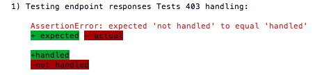
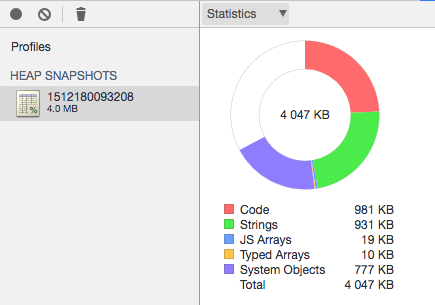
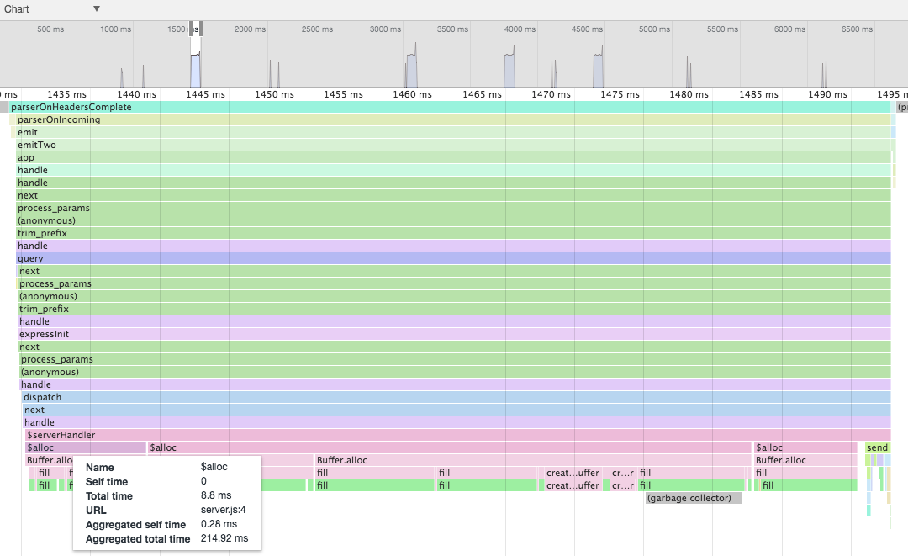
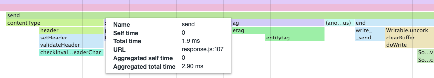
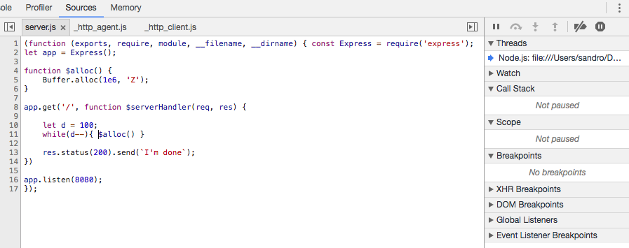
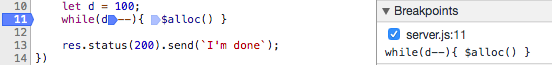
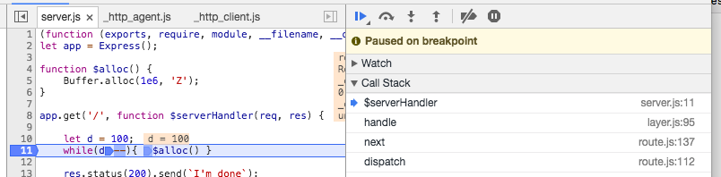

# 十、测试应用

"When the terrain disagrees with the map, trust the terrain." – Swiss Army Manual

由于 Node 是由一个完全致力于代码共享的社区构建的，模块之间的互操作性非常重要，所以代码测试工具和框架在创建之后就进入了 Node 的生态系统也就不足为奇了。事实上，通常节俭的核心Node团队在早期添加了`assert`模块，这表明他们认识到测试是开发过程的一个基本部分。

测试不仅仅是一个 bug 检测和缺陷修复过程。例如，测试驱动开发坚持让测试先于任何代码的存在！通常，测试是在软件中现有行为和期望行为之间进行比较的过程，新信息不断反馈到过程中。从这个意义上说，测试涉及对期望进行建模，并验证单个功能、组成单元和实现路径是否满足组织内外每个利益相关者的期望。

因此，测试也是关于管理风险的。通过这种方式，可以识别和量化异常，而地形起伏现在可以有效地告知我们当前对地图的理解，从而减少失误（或缺陷）的数量，提高我们的信心。测试帮助我们衡量何时完成。

在本章中，我们将重点介绍一些已知和有用的模式，用于测试Node应用，研究用于代码完整性测试的本机Node工具，使用 Mocha 框架进行常规测试，以及无头浏览器测试，最后一个允许在Node环境中测试基于浏览器的 JavaScript。我们还将研究测试币调试的另一面，并将两者结合起来。

在阅读本章时，请记住，将测试理念集成到项目中可能很难做好。编写正确的测试比编写一些测试更困难。测试正确的东西比测试所有东西都要困难（完整的代码覆盖很少意味着什么都不会出错）。在开始下一个Node项目时，应尽可能早地实施一个好的测试策略。

# 为什么测试很重要

一个好的测试策略通过积累证据和提高清晰度来建立信心。在公司内部，这可能意味着已经满足了执行业务战略的一些标准，允许发布新的服务或产品。项目团队中的开发人员获得了自动判断的乐趣，该判断确认或否认提交给代码库的更改是否合理。有了一个好的测试框架，重构就失去了危险；曾经给有新想法的开发者带来负面压力的“如果你打破了它，你就拥有它”警告不再那么不祥。如果有一个好的版本控制系统和测试/发布流程，任何突破性的更改都可以回滚而不会产生负面影响，从而释放好奇心和实验性。

三种常见的测试类型是：单元测试、功能测试和集成测试。虽然我们在本章中的目标不是提出关于如何测试应用的一般理论，但简要总结什么是单元测试、功能测试和集成测试、团队中哪些成员最感兴趣，以及我们如何将代码库构建（或分解）为可测试单元，这将非常有用。

# 单元测试

**单元测试**关注系统行为的单元。被测试的每个单元都应该封装一组非常小的代码路径，没有纠缠。当单元测试失败时，理想情况下，这应该表明整体功能的一个孤立部分被破坏。如果一个程序有一组描述良好的单元测试，那么整个程序的目的和预期行为应该很容易理解。单元测试将有限的视角应用于系统的小部分，而不关心这些部分如何包装成更大的功能块。

一个示例单元测试可以这样描述；当`123`值传递给`validate_phone_number()`方法时，测试应返回 false。对于这个单元的功能没有任何混淆，程序员可以自信地使用它。

单元测试通常由程序员编写和读取。类方法是单元测试的良好候选者，其他服务端点也是如此，它们的输入签名稳定且易于理解，预期的输出可以准确验证。通常，假设单元测试运行得很快。如果一个单元测试需要很长时间来执行，那么被测试的代码很可能比应该的复杂得多。

单元测试并不关心函数或方法将如何接收其输入，也不关心通常如何使用它。`add`方法的测试不应涉及该方法是否将用于计算器或其他地方，而应简单地测试两个整数输入（3,4）是否会导致装置发出正确的结果（7）。单元测试对它在依赖关系树中的位置不感兴趣。因此，单元测试通常会模拟或*存根*数据源，例如将两个样本整数传递给`add`方法。只要输入是典型的，就不需要是实际的。此外，好的单元测试是可靠的：不受外部依赖的影响，它们应该保持有效，不管周围的系统如何变化。

单元测试只确认单个实体是独立工作的。功能测试的目的是测试单元在组合时是否能够很好地工作。

# 功能测试

当单元测试涉及到特定的行为时，**功能测试**旨在验证功能的各个部分。词根*function*的歧义，特别是对于程序员而言，可能会导致混淆，*单元测试*被称为*functional tests*，反之亦然。功能测试将许多单元组合成一个功能体，例如*当用户输入用户名和密码并单击发送时，该用户将登录系统*。我们可以很容易地看到，这个功能组将由许多单元测试组成，一个用于验证用户名，一个用于处理按钮单击，等等。

功能测试通常是负责应用中某些特定领域的人员所关心的问题。虽然程序员和开发人员仍然是实现这些测试的人，但产品经理或类似的利益相关者通常会设计这些测试（失败时会抱怨）。这些测试在很大程度上检查是否满足更大的产品规格，而不是技术正确性。

前面给出的`validate_phone_number`的示例单元测试可能构成具有以下描述的功能测试的一部分：当用户输入错误的电话号码时，显示一条帮助消息，描述该用户所在国家/地区的正确格式。应用费心去帮助那些在电话号码上出错的用户，这是一项抽象的工作，与简单地验证电话号码之类的技术实体大不相同。功能测试可以被认为是一些单元集合如何协同工作以满足产品需求的抽象模型。

由于功能测试是针对许多单元的组合进行的，因此与独立单元测试不同，执行这些测试将涉及混合来自任意数量外部对象或系统的关注点。在前面的登录示例中，我们看到了一个相对简单的功能测试如何跨越数据库、UI、安全性和其他应用层。由于它在组成上更为复杂，如果功能测试比单元测试花费更多的时间来运行也没关系。功能测试的更改频率预计低于单元测试，因此功能的更改通常表示主要的发布，而不是单元测试修改通常表示的次要更改。

请注意，与单元测试一样，功能测试本身与被测试的功能组作为一个整体如何与应用的其余部分相关的问题无关。因此，模拟数据可以用作运行功能测试的上下文，因为功能组本身并不关心它对一般应用状态（集成测试的领域）的影响。

# 集成测试

**集成测试**确保整个系统正确连接在一起，让用户感觉应用工作正常。通过这种方式，集成测试通常验证整个应用的预期功能，或者验证一小部分重要产品功能中的一部分。

集成测试与讨论中的其他类型测试之间最重要的区别在于，集成测试将在现实环境中、在具有实际域数据的真实数据库上、在服务器上以及镜像目标生产环境的其他系统上执行。通过这种方式，集成测试可以很容易地打破以前通过的单元测试和功能测试。

例如，`validate_phone_number`的单元测试可能通过了`555-123-4567`等输入，但在集成测试期间，它将无法通过`555.123.4567`等真实（有效）系统数据。类似地，功能测试可以成功地测试理想系统打开帮助对话框的能力，但是当与新浏览器或其他运行时集成时，会发现预期的功能没有实现。在单个本地文件系统上运行良好的应用在分布式文件系统上运行时可能会失败。

由于这种增加的复杂性，系统架构师要求团队成员能够应用更高层次的视角来了解通常设计集成测试所需的系统正确性。这些测试发现隔离测试无法识别的接线错误。毫不奇怪，集成测试通常需要很长时间才能运行，通常设计为不仅运行简单的场景，而且模拟预期的高负载、现实的环境。

# 本机Node测试和调试工具

从一开始，对测试代码的偏好就已经成为Node社区精神的一部分，这反映在大多数流行的Node模块（即使是简单的Node模块）都与测试套件一起分发这一事实上。虽然使用 JavaScript 进行浏览器端开发多年来一直没有可用的测试工具，但相对年轻的Node发行版包含许多。也许正因为如此，已经为 Node 开发了许多成熟且易于使用的第三方测试框架。这使得开发人员没有理由编写未经测试的代码！让我们研究一下提供的一些用于调试和测试Node程序的工具。

# 写入控制台

Console output 是最基本的测试和调试工具，提供了一种快速查看脚本中某个点发生的情况的方法。调试时通常使用全局可访问的`console.log`。

Node 通过更有用的方法丰富了这个标准输出机制，例如`console.error(String, String…)`，它将参数打印到`stderr`而不是`stdout`，以及`console.dir(Object)`，它在提供的对象上运行`util.inspect`（参考下文），并将结果写入`stdout`。

当开发人员希望跟踪一段代码执行所需的时间时，通常会出现以下模式：

```js
let start = new Date().getTime();
for (x = 0; x < 1000; x++) {
  measureTheSpeedOfThisFunction();
}
console.log(new Date().getTime() - start);
// A time, in milliseconds 
```

`console.time`和`console.timeEnd`方法将此模式标准化：

```js
 console.time('Add 1000000 records');
 let rec = [];
 for (let i = 0; i < 1000000; i++) {
     rec.push(1);
 }
 console.timeEnd('Add 1000000 records');
 //  > Add 1000000 records: 59ms
```

确保将相同的标签传递给`timeEnd()`，以便Node可以找到您从`time()`开始的测量值。Node将秒表结果打印到`stdout`。在本章后面讨论断言模块和执行堆栈跟踪时，我们将看到其他特殊控制台方法。

# 格式化控制台输出

在记录简单字符串时，前面的方法都非常有用。更常见的情况是，可能需要格式化有用的日志数据，或者将多个值组合成一个字符串，或者整齐地显示一个复杂的数据对象。可以使用`util.format`和`util.inspect`方法处理这些情况。

# format（format，[arg，arg…]）方法

此方法允许由占位符组成格式化字符串，每个占位符捕获并显示传递的附加值。考虑下面的例子：

```js
> util.format('%s:%s', 'foo','bar')
 'foo:bar' 
```

在这里，我们看到两个占位符（前缀为`%`）按顺序被传递的参数替换。占位符需要以下三种类型的值之一：

*   `%s`：一串
*   `%d`：一个数字，可以是整数，也可以是浮点数
*   `%j`：一个 JSON 对象

如果发送的参数数大于占位符数，则额外的参数将通过`util.inspect()`转换为字符串，并连接到输出的末尾，以空格分隔：

```js
> util.format('%s:%s', 'foo', 'bar', 'baz');
 'foo:bar baz' 
```

如果没有发送格式化字符串，参数将简单地转换为字符串并连接起来，用空格分隔。

# util.inspect（对象，[options]）方法

当需要对象的字符串表示形式时，请使用此方法。通过设置各种选项，可以控制输出的外观：

*   `showHidden`：默认为 false。如果为 true，将显示对象的不可枚举属性。
*   `depth`：对象定义，比如 JSON 对象，可以深度嵌套。默认情况下，`util.inspect`只遍历对象的两个级别。使用此选项可增加（或减少）该深度。
*   `colors`：允许输出颜色化（查看下面的代码片段）。
*   `customInspect`：如果正在处理的对象定义了`inspect`方法，则将使用该方法的输出，而不是Node默认的`stringification`方法（参见下面的代码片段）。默认为 true。

设置自定义检查器：

```js
const util = require('util');
let obj = function() {
   this.foo = 'bar';
};
obj.prototype.inspect = function() {
   return "CUSTOM INSPECTOR";
};
console.log(util.inspect(new obj));
// CUSTOM INSPECTOR
console.log(util.inspect(new obj, { customInspect: false }));
// { foo: 'bar' }
```

当记录复杂对象或对象的值太大以至于控制台输出无法读取时，这非常有用。如果您的外壳在终端中显示出漂亮的颜色，那么如果颜色设置为 true，`util.inspect`也会显示。您甚至可以自定义哪些颜色以及它们的使用方式。默认情况下，颜色仅表示数据类型。

以下是`util.inspect.styles`中设置的默认值：

```js
{
   number: 'yellow',
   boolean: 'yellow',
   string: 'green',
   date: 'magenta',
   regexp: 'red'
   null: 'bold',
   undefined: 'grey',
   special: 'cyan',
 } 
```

Node以青色显示前面代码中特殊类别下的函数。这些默认颜色指定可以与`util.inspect.colors`对象中存储的支持的 ANSI 颜色代码之一交换：粗体、斜体、下划线、反转、白色、灰色、黑色、蓝色、青色、绿色、洋红、红色和黄色。例如，要使对象的数值显示为绿色而不是默认的黄色，请使用以下代码：

```js
 util.inspect.styles.number = "green";
 console.log(util.inspect([1,2,4,5,6], {colors: true}));
 // [1,2,3,4,5,6] Numbers are in green
```

# Node调试器

大多数开发人员都使用 IDE 进行开发。所有良好开发环境的一个关键特性是访问调试器，调试器允许在程序中需要检查运行时状态或其他方面的地方设置断点。

V8 附带了一个功能强大的调试器（常见于 Google Chrome 浏览器的开发者工具面板），Node可以访问该调试器。使用 inspect 指令调用它：

```js
> node inspect somescript.js 
```

现在，可以在Node程序中实现简单的单步执行和检查调试。考虑下面的程序：

```js
// debug-sample.js
setTimeout(() => {
  let dummyVar = 123;
  debugger;
  console.log('world');
}, 1000);
console.log('hello'); 
```

`dummyVar`马上就有意义了。现在，请注意`debugger`指令。在没有该行的情况下执行此程序将按预期运行程序：打印`hello`，等待一秒钟，然后打印`world`。使用 debugger 指令，运行 inspect 会产生以下结果：

```js
> node inspect debug-sample.js
< Debugger listening on ws://127.0.0.1:9229/b3f76643-9464-41d0-943a-d4102450467e
< For help see https://nodejs.org/en/docs/inspector
< Debugger attached.
Break on start in debug-sample.js:1
> 1 (function (exports, require, module, __filename, __dirname) { setTimeout(() => {
 2 let dummyVar = 123;
 3 debugger;
debug>
```

debugger 指令创建一个断点，一旦命中，Node 将为我们提供调试器本身的 CLI，我们可以在其中执行一些标准调试命令：

*   `cont`或`c`：从最后一个断点继续执行，直到下一个断点
*   `step`或`s`：单步执行，即继续运行，直到到达新的源代码行（或断点），然后将控制返回给调试器
*   `next`或`n`：与`step`相同，但在新的源行上进行的函数调用不停止执行
*   `out`或`o`：跳出，即执行当前函数的剩余部分并返回到父函数
*   `backtrace`或`bt`：将步骤追溯到当前执行帧

*   `setBreakpoint()`或`sb()`：在当前线路上设置断点
*   `setBreakpoint(Integer)`或`sb(Integer)`：在
    指定行上设置断点
*   `clearBreakpoint()`或`cb()`：清除当前线路上的断点
*   `clearBreakpoint(Integer)`或`cb(Integer)`：清除指定行上的断点

*   `run`：如果调试器的脚本已终止，将再次启动
*   `restart`：终止并重新启动脚本
*   `pause`或`p`：暂停运行代码
*   `kill`：杀死正在运行的脚本
*   `quit`：退出调试器
*   `version`：显示 V8 版本
*   `scripts`：列出所有加载的脚本

要重复上一个调试器命令，只需按键盘上的*回车*。你的腕管会感谢你的。

返回到我们正在调试的脚本：在调试器中输入`cont`将导致以下输出：

```js
...
debug> cont
< hello // A pause will now occur because of setTimeout
break in debug-sample.js:3
 1 (function (exports, require, module, __filename, __dirname) { setTimeout(() => {
 2 let dummyVar = 123;
> 3 debugger;
 4 console.log('world');
 5 }, 1000);
debug>
```

我们现在停在第 3 行的 debugger 语句（注意 V 形）。例如，如果您现在键入`next`（或`n`），调试器将转到下一条指令并在`console.log('world')`处停止

在断点处进行一些状态检查通常很有用，例如变量的值。您可以从调试器跳转到**repl**来执行此操作。目前，我们在`debugger`语句处暂停。如果我们想检查`dummyVar`的值，该怎么办？

```js
debug> repl
Press Ctrl + C to leave debug repl
> dummyVar
123
```

作为实验，在执行最终上下文之前，再次运行脚本，使用`next`而不是`cont`。继续按 Enter 键（重复上一个命令），并尝试按照正在执行的代码进行操作。经过几步之后，您会注意到`timers.js`脚本将被引入到这个执行上下文中，您将看到如下内容：

```js
debug> next
break in timers.js:307
 305 threw = false;
 306 } finally {
>307 if (timerAsyncId !== null) {
 308 if (!threw)
 309 emitAfter(timerAsyncId);
debug>
```

此时在调试器中运行`scripts`命令，该命令列出当前加载的脚本。您将看到如下内容：

```js
debug> scripts
* 39: timers.js <native>
71: debug-sample.js
```

尝试使用功能强大的 V8 调试器在Node程序中暂停、检查和导航的各种方法。除了常见的调试需求外，调试器还可以在执行代码时在深层向您展示Node的功能。

在本章的后面，我们将回到对Node开发人员可用的其他调试和测试技术和工具的讨论。现在，让我们考虑一下 HOLt0AE 模块，以及如何部署这个带有Node的本地测试框架。

# 断言模块

Node的`assert`模块用于简单的单元测试。在许多情况下，它足以作为测试的基本框架，或者用作测试框架（如 Mocha，我们将在后面看到）的断言库。用法很简单：我们想要断言某事的真实性，如果我们的断言不真实，就会抛出一个错误。考虑这个例子：

```js
> require('assert').equal(1,2,'Not equal!')
AssertionError [ERR_ASSERTION]: Not equal!
>
```

如果断言为 true（两个值相等），则不会返回任何内容：

```js
> require('assert').equal(1,1,"Not equal!")
undefined
```

遵循 UNIX 静默规则（当程序没有什么令人惊讶、有趣或有用的东西要说时，它应该什么也不说），断言仅在断言失败时返回值。可以使用可选的消息参数自定义返回的值，如前一节所示。

`assert`模块 API 由一组具有相同调用签名的比较操作组成：实际值、预期值，以及在比较失败时显示的可选消息。还提供了用于特殊情况的快捷方式或处理程序的替代方法。

必须区分身份比较（`===`和平等比较（`==`），前者通常被称为严格平等比较（如`assert`API 中的情况）。由于 JavaScript 采用动态类型，当使用`==`相等运算符比较不同类型的两个值时，会尝试强制（或强制）将一个值转换为另一个值，这是一种公共分母操作。看看这个例子：

```js
1 == "1" // true
false == "0" // true
false == null // false
```

注意使用标识比较时更可预测的结果：

```js
1 === "1" // false
false === "0" // false
false === null // false
```

需要记住的是，`===`运算符在比较之前不执行类型强制，而相等运算符在类型强制之后进行比较。

将字符串和数字等同起来，使 JavaScript 成为编程新手的一种宽容的语言，不久之后，就产生了一个 bug，而现在经验更丰富的程序员无意中将其隐藏在一个更大的代码库中。像*Brendan Eich*这样的语言作者做出了这样的决定，以后很少能够改变如此基本的行为，他们不得不通过无休止的争论和争论来捍卫自己的决定，因为程序员因为他们的语言而抨击和赞扬他们的语言。

此外，由于对象可能包含相同的值，但不能从相同的构造函数派生，因此具有相同值的两个对象的标识是不同的；标识要求两个操作数引用同一对象：

```js
let a = function(){};
let b = new a;
let c = new a;
let d = b;
console.log(a == function(){}) // false
console.log(b == c) // false
console.log(b == d) // true
console.log(b.constructor === c.constructor); // true
```

最后，深度相等的概念用于对象比较，其中标识不需要精确。如果两个对象都拥有相同数量的自有属性、相同的原型、相同的密钥集（但不一定是相同的顺序）以及每个属性的等效（不完全相同）值，则这两个对象是完全相等的：

```js
const assert = require('assert');
let a = [1,2,3];
let b = [1,2,3];
assert.deepEqual(a, b); // passes, so nothing is output
assert.strictEqual(a, b); // throws Assertion error
```

通过设计一些断言测试，测试您关于如何相互比较理解值的假设是非常有用的。结果可能会让你大吃一惊。

以下是Node的断言模块中的函数，它们根据您可能使用它们的方式组织为组：

```js
equal            notEqual
strictEqual      notStrictEqual
deepEqual        notDeepEqual
deepStrictEqual  notDeepStrictEqual
ok
ifError
fail
throws           doesNotThrow
```

使用名称中带有 equal 的断言函数遵循与`==`运算符相同的规则，而严格 equal 则类似于使用`===`。此外，选择一个标题中有深度的函数，或者选择没有深度的函数，以选择我们前面探讨过的所需行为。最简单的函数，`assert.ok`可以是你所需要的全部，如果你写的逻辑等于你自己。

Node的异步函数向回调函数返回一个错误对象。将该对象赋予`assert.ifError(e)`，如果`e`已定义，`ifError`将抛出该对象。当代码执行到了不应该执行的部分时，请使用`assert.fail()`。当异常被`try`/`catch`块捕获时，这是最有用的：

```js
// assertthrows.js
const assert = require('assert');
try {
   assert.fail(1,2,'Bad!','NOT EQ') 
} catch(e) { 
   console.log(e);
}
```

运行上述代码将生成以下输出：

```js
{ AssertionError [ERR_ASSERTION]: Bad!
 at Object.<anonymous> (/Users/sandro/Desktop/clients/ME/writing/Mastering_V2/chapter_ten/code/assertthrows.js:4:9)
 at Module._compile (module.js:660:30)
 ...
 at bootstrap_node.js:618:3
   generatedMessage: false,
 name: 'AssertionError [ERR_ASSERTION]',
 code: 'ERR_ASSERTION',
 actual: 1,
 expected: 2,
 operator: 'NOT EQ' }
```

控制台 API 中提供了记录断言结果的快捷方法：

```js
> repl
> console.assert(1 == 2, 'Nope!')
AssertionError [ERR_ASSERTION]: Nope!
```

或者，您可以使用`assert.throws`和`assert.doesNotThrow`确认函数始终抛出或从不抛出。

For a more detailed explanation of how comparison is done in JavaScript, consult:[https://developer.mozilla.org/en-US/docs/Web/JavaScript/Reference/Operators/Comparison_Operators](https://developer.mozilla.org/en-US/docs/Web/JavaScript/Reference/Operators/Comparison_Operators) [Node's assert module is strongly influenced by the CommonJS test specification, which can be found at:](https://developer.mozilla.org/en-US/docs/Web/JavaScript/Reference/Operators/Comparison_Operators) [http://wiki.commonjs.org/wiki/Unit_Testing](http://wiki.commonjs.org/wiki/Unit_Testing)[.](https://developer.mozilla.org/en-US/docs/Web/JavaScript/Reference/Operators/Comparison_Operators)

# 沙箱

在某些情况下，您可能希望在独立且更有限的上下文中运行脚本，该上下文与更大应用的范围隔离。对于这些情况，Node 提供了`vm`模块，这是一个沙箱环境，由一个新的 V8 实例和一个用于运行脚本块的有限执行上下文组成：

```js
const vm = require('vm');
let sandbox = {
    count: 2
};
let suspectCode = '++count;';
vm.runInNewContext(suspectCode, sandbox);
console.log(sandbox);
// { count: 3 }
```

在这里，我们看到所提供的沙箱如何成为所提供脚本的本地执行范围。正在运行的脚本仅在提供的沙盒对象中运行，并且被拒绝访问标准Node全局，例如正在运行的进程，我们可以通过更改前面的代码来演示：

```js
suspectCode = '++count; process.exit()';
vm.runInNewContext(suspectCode, sandbox);

// evalmachine.<anonymous>:1
// ++count; process.exit()
//          ^
//
// ReferenceError: process is not defined
// at evalmachine.<anonymous>:1:10
// at ContextifyScript.Script.runInContext (vm.js:59:29)
// ...
```

此模块不能保证一个完全安全的*监狱*，在这个监狱中完全不受信任的代码可以安全地执行。如果这是您的需要，请考虑使用适当的系统级权限运行单独的进程。当`vm`启动一个新的 V8 实例时，每次调用都需要几毫秒的启动时间和大约 2 兆字节的内存。只有在值得付出这样的性能成本时才使用`vm`。

为了测试代码，`vm`模块可以非常有效，特别是它能够强制代码在有限的上下文中运行。例如，在执行单元测试时，可以使用模拟数据创建一个特殊环境，模拟测试脚本将在其中运行的环境。这比用假数据创建人工调用上下文要好。此外，这种沙箱将允许更好地控制新代码的执行上下文，从而提供良好的保护，防止内存泄漏和测试时可能出现的其他意外冲突。

# 区分本地范围和执行上下文

在介绍更多示例之前，我们需要区分流程的本地范围和执行上下文。这种区别将有助于理解两种主要的`vm`方法`vm.runInThisContext`和`vm.runInNewContext`之间的差异。

在任何时候，V8 都可能有一个或多个执行上下文。这些上下文充当单独的容器，V8 可以在其中执行更多的 JavaScript。使用 Chrome 时，您可以将这些执行上下文视为导航到不同网站的不同选项卡。

一个站点上的脚本无法查看另一个站点上的脚本，也无法将其弄乱。Node进程的执行上下文表示 V8 中的运行时上下文，包括本机Node方法和其他全局对象（进程、控制台、setTimeout 等）

通过`vm.runInNewContext`执行的脚本对两个范围都不可见；它的上下文仅限于它被传递到的沙盒对象，如前所述。

通过`vm.runInThisContext`执行的脚本可以看到Node进程的全局执行范围，但不能看到本地范围。我们可以通过以下方式证明这一点：

```js
const vm = require('vm');

global.x = 1; // global scope
let y = 1; // local scope

vm.runInThisContext('x = 2; y = 3');
console.log(x, y); // 2, 1 <- only global is changed

eval('x = 3; y = 4');
console.log(x, y); // 3, 4 <- eval changes x, y
```

因此，脚本通过`vm`在上下文中运行。

预编译上下文和脚本通常很有用，尤其是在重复使用每种上下文和脚本时。使用`vm.createContext([sandbox])`编译执行上下文，并传入键/值映射。在下一节中，我们将了解如何将这些上下文应用于预编译脚本。

# 使用编译上下文

在收到一系列 JavaScript 代码后，V8 编译器将尽最大努力将代码优化为运行效率更高的编译版本。每次`vm`上下文方法以字符串形式接收代码时，都必须执行此编译步骤。如果您的代码没有更改，并且至少被重用一次，那么最好使用`new vm.Script(code, [filename])`一次性编译它。

我们可以在继承自`runInThisContext`和`runInNewContext`的上下文中执行这些编译后的脚本。在这里，我们在两种上下文中运行一个编译脚本，演示如何在完全隔离的作用域中存在递增的`x`和`y`变量：

```js
const vm = require('vm');

global.x = 0;
global.y = 0;

let script = new vm.Script('++x, ++y;');
let emulation = vm.createContext({ x:0, y:0 });

for (let i = 0; i < 1000; i++) {
   script.runInThisContext(); // using global
   script.runInNewContext(emulation); // using own context
}

console.log(x, y); // 1000 1000
console.log(emulation.x, emulation.y); // 1000 1000
```

如果这两个脚本在上下文中修改了相同的`x`和`y`，那么输出将改为`2000 2000`

请注意，如果`runInNewContext`脚本未通过仿真层（沙盒），它将抛出一个`ReferenceError: x is not defined`，既不能访问本地值，也不能访问全局值`x`和`y`。试试看。

现在我们了解了一些关于断言和创建测试上下文的知识，让我们使用一些常见的测试框架和工具编写一些真正的测试。

# 与摩卡、柴和西农一起测试

为代码编写测试的最大好处之一是，您将被迫仔细思考所编写的代码是如何工作的。难以编写的测试可能表明代码难以理解。

另一方面，良好测试的全面覆盖有助于其他人（和您）了解应用的工作方式。在本节中，我们将了解如何使用测试运行程序**摩卡**，使用**柴**作为其断言库，以及**西农**在测试需要模拟时描述您的测试。我们将使用**redis**演示如何针对模拟数据集创建测试（而不是针对生产数据库进行测试，这当然不是一个好主意）。我们将使用**npm**作为测试脚本运行程序。

要开始，请设置以下文件夹结构：

```js
/testing

/scripts

/spec
```

现在，用`/testing`文件夹中的`npm init`初始化一个`package.json`文件。您只需在提示下按*回车*，但当要求您输入测试命令时，请输入以下内容：

```js
mocha ./spec --require ./spec/helpers/chai.js --reporter spec
```

这为我们需要的模块的导入设置了项目。我们稍后再讨论 Chai 做什么。现在，可以说在这个测试命令中，Mocha 被引用到一个配置文件中以获取依赖信息。

继续并将所需的库安装到此包中：

```js
npm install --save-dev mocha chai sinon redis
```

`/scripts`文件夹将包含我们将要测试的 JavaScript。`/spec`文件夹将包含配置和测试文件。

随着我们的前进，这将更有意义。现在，请注意，分配给 npm 的`test`属性表明我们将使用 Mocha 进行测试，Mocha 的测试报告将是`spec`类型，并且测试将存在于`/spec`目录中。我们还需要一个 Chai 的配置文件，这将在我们继续讨论时解释。重要的是，这已经在 npm 中创建了一个脚本声明，允许您使用`npm test`命令运行测试套件。无论何时需要运行我们将在下面开发的 Mocha 测试，都可以使用该命令。

# 摩卡

Mocha 是一个不关心测试断言本身的测试运行者。Mocha 用于组织和运行您的测试，主要通过使用`describe`和`it`操作符。示意图上，Mocha 测试如下所示：

```js
describe("Test of Utility Class", function() {
  it("should return a date", function(){
   // Test date function somehow and assert success or failure
  });
  it("should return JSON", function() {
   // Test running some string through #parse 
  });
});
```

正如您所看到的，Mocha 工具保留了测试的描述和组织方式，并且没有对测试断言的设计进行任何假设。它是测试的组织工具，其额外目的是生成人类可读的测试定义。

您可以设置同步运行的测试，如前所述，也可以使用传递给所有回调的完成处理程序异步运行：

```js
describe("An asynchronous test", () => { 
  it("Runs an async function", done => { 
    // Run async test, and when finished call... done(); 
  }); 
}); 
```

块也可以嵌套：

```js
describe("Main block", () => { 
  describe("Sub block", () => { 
    it("Runs an async function", () => { 
      // A test running in sub block 
    }); 
  }); 
  it("Runs an async function", () => { 
    // A test running in main block 
  }); 
});
```

最后，Mocha 提供了*钩子*，使您能够在测试之前和/或之后运行一些代码：

*   `beforeEach()`在描述块中的每个测试之前运行
*   `afterEach()`在描述块中的每个测试后运行
*   `before()`在运行`beforeEach`之前的任何测试之前运行代码一次
*   `after()`在`afterEach`的任何一次运行后，在所有测试运行完毕后，运行代码一次

通常，这些用于设置测试上下文，例如在测试之前创建一些变量，并在其他测试之前清理它们。这个简单的工具集合具有足够的表现力来处理大多数测试需求。此外，摩卡还提供各种测试报告器，提供不同格式的结果。我们将在稍后构建一些真实的测试场景时看到这些场景的实际应用。

# 柴

正如我们前面在 Node 的本机 assert 模块中看到的，在其基础上，测试涉及断言我们期望某个代码块执行的操作，执行该代码，并检查是否满足了我们的期望。Chai 是一个断言库，提供了更具表现力的语法，提供了三种断言样式：`expect`、`should`和`assert`。我们将使用 Chai 提供要包装在 Mocha`it`语句中的断言（测试），支持`expect`风格的断言。

请注意，虽然`Chai.assert`是按照核心Node断言语法建模的，但 Chai 使用其他方法扩充了对象。

首先，我们将创建一个配置文件`chai.js`：

```js
let chai = require('chai');

chai.config.includeStack = true;
global.sinon = require('sinon');
global.expect = chai.expect;
global.AssertionError = chai.AssertionError;
global.Assertion = chai.Assertion;
```

将此文件放在`/spec/helpers`文件夹中。这将告诉 Chai 显示所有错误的完整堆栈跟踪，并将 expect 断言样式公开为全局。同样，Sinon 也是一家全球性公司（下一节将详细介绍 Sinon）。该文件将扩充 Mocha 测试运行上下文，这样我们就可以使用这些工具，而不必在每个测试文件中重新声明它们。`expect`风格的断言读起来像一个句子，其中*句子*由*到*、*是*、*是*等作品组成。考虑下面的例子：

```js
expect('hello').to.be.a('string') 
expect({ foo: 'bar' }).to.have.property('foo') 
expect({ foo: 'bar' }).to.deep.equal({ foo: 'bar' }); 
expect(true).to.not.be.false 
expect(1).to.not.be.true 
expect(5).to.be.at.least(10) // fails
```

要了解创建 expect 测试链时可用的*单词*的广泛列表，请参阅以下完整文档：[http://chaijs.com/api/bdd/](http://chaijs.com/api/bdd/) 。如前所述，摩卡对如何创建断言没有意见。我们将使用`expect`在接下来的测试中创建断言。

考虑测试以下对象中的大写函数：

```js
let Capitalizer = () => {
  this.capitalize = str => { 
    return str.split('').map(char => { 
      return char.toUpperCase(); 
    }).join(''); 
  }; 
};
```

我们可以这样做：

```js
describe('Testing Capitalization', () => { 
  let capitalizer = new Capitalizer(); 
  it('capitalizes a string', () => {
    let result = capitalizer.capitalize('foobar'); 
    expect(result).to.be.a('string').and.equal('FOOBAR'); 
  }); 
});
```

这一说法将是正确的，摩卡也将报告同样的情况。您将用这些描述和断言块构建整个测试套件。

接下来，我们将了解如何将 Sinon 添加到测试过程中。

# 西农

在测试环境中，您通常是在模拟生产环境的实际情况，因为访问真实用户、数据或其他实时系统是不安全的，或者是不需要的。因此，能够模拟环境是测试的一个重要部分。此外，您通常希望检查的不仅仅是通话结果；您可能需要测试给定函数是在正确的上下文中调用，还是使用正确的示例调用。Sinon 是一个帮助您模拟外部服务、模拟函数、跟踪函数调用等的工具。

The sinon-chai module extends Chai with Sinon assertions at: [https://github.com/domenic/sinon-chai](https://github.com/domenic/sinon-chai).

Sinon 的关键技术是间谍、存根和模拟。此外，您还可以设置假计时器、创建假服务器等（访问：[http://sinonjs.org/](http://sinonjs.org/) ）。本节重点介绍前三个方面。让我们看一下每个例子。

# 间谍

从 Sinon 文档中：

"A test spy is a function that records arguments, returns value, the value of this and exception thrown (if any) for all its calls. A test spy can be an anonymous function, or it can wrap an existing function."

间谍收集有关其跟踪功能的信息。看看这个例子：

```js
const sinon = require('sinon'); 

let argA = "foo"; 
let argB = "bar"; 
let callback = sinon.spy(); 

callback(argA); 
callback(argB); 

console.log(
  callback.called, 
  callback.callCount, 
  callback.calledWith(argA), 
  callback.calledWith(argB), 
  callback.calledWith('baz')
);
```

这将记录以下内容：

```js
true 
2 
true 
true 
false
```

那个间谍被叫了两次；一次与`foo`、一次与`bar`在一起，但从未与`baz`在一起。如果您正在编写某个函数是否被调用的测试和/或测试它收到的参数，那么 spies 是一个很好的测试工具。

假设我们想测试代码是否正确连接到 Redis 的发布/订阅功能：

```js
const redis = require("redis"); 
const client1 = redis.createClient(); 
const client2 = redis.createClient(); 

// Testing this
function nowPublish(channel, msg) { 
  client2.publish(channel, msg); 
}; 
describe('Testing pub/sub', function() { 
  before(function() { 
    sinon.spy(client1, "subscribe"); 
  }); 
  after(function() { 
    client1.subscribe.restore(); 
  }); 

  it('tests that #subscribe works', () => { 
    client1.subscribe("channel");
    expect(client1.subscribe.calledOnce); 
  }); 
  it('tests that #nowPublish works', done => { 
    let callback = sinon.spy(); 
    client1.subscribe('channel', callback); 
    client1.on('subscribe', () => { 
      nowPublish('channel', 'message'); 
        expect(callback.calledWith('message')); 
        expect(client1.subscribe.calledTwice); 
        done(); 
    }); 
  }); 
});
```

在本例中，我们更多地使用 spy 和 Mocha。我们部署 spy 来代理 client1 的本机订阅方法，重要的是在 Mocha 的 before 和 after 方法中设置和拆除 spy 代理（恢复原始功能）。Chai 的断言证明了`subscribe`和`nowPublish`功能正常，并且收到了正确的论点。有关间谍的更多信息，请访问：[http://sinonjs.org/releases/v4.1.2/spies](http://sinonjs.org/releases/v4.1.2/spies) 。

# 存根

测试存根是具有预编程行为的函数（间谍）。除了可以用来改变存根行为的方法外，它们还支持完整的测试 spy API。当存根用作间谍时，可以将其包装在现有函数的周围，这样它就可以伪造该函数的行为（而不是像我们前面在间谍中看到的那样简单地记录函数执行情况）。

让我们假设您的应用中有一些调用某个 HTTP 端点的功能。代码可能是这样的：

```js
http.get("http://www.example.org", res => { 
  console.log(`Got status: ${res.statusCode}`); 
}).on('error', e => { 
  console.log(`Got error: ${e.message}`); 
});
```

成功后，呼叫将记录`Got status: 200`。如果端点不可用，您将看到类似于`Got error: getaddrinfo ENOTFOUND`的内容。

您可能需要测试应用处理备用状态代码，当然还有显式错误的能力。您可能无法强制端点发出这些信息，但如果它们发生，您必须做好准备。存根在这里用于创建合成响应，以便可以对响应处理程序进行全面的测试。

我们可以使用存根来模拟响应，而无需实际调用`http.get`方法：

```js
const http = require('http'); 
const sinon = require('sinon'); 

sinon.stub(http, 'get').yields({ 
  statusCode: 404 
}); 

// This URL is never actually called 
http.get("http://www.example.org", res => { 
  console.log(`Got response: ${res.statusCode}`); 
  http.get.restore(); 
})
```

此存根通过包装原始方法（从未调用）生成模拟响应，导致从通常返回状态代码为`200`的调用返回`404`。重要的是，请注意我们是如何`restore`将存根方法恢复到其原始状态的。

例如，下面的*伪*代码描述了一个模块，该模块进行 HTTP 调用，解析响应，如果一切正常，则响应`'handled'`，如果 HTTP 响应意外，则响应`'not handled'`：

```js
const http = require('http'); 
module.exports = function() => { 
  this.makeCall = (url, cb) => { 
    http.get(url, res => { 
      cb(this.parseResponse(res)); 
    }) 
  } 
  this.parseResponse = res => { 
    if(!res.statusCode) { 
      throw new Error('No status code present'); 
    }
    switch(res.statusCode) { 
      case 200: 
        return 'handled'; 
        break; 
      case 404: 
        return 'handled'; 
        break; 
      default: 
        return 'not handled'; break; 
    } 
  } 
}
```

以下 Mocha 测试确保`Caller.parseReponse`方法可以处理我们需要处理的所有响应代码，使用存根模拟整个预期响应范围：

```js
let Caller = require('../scripts/Caller.js'); 
describe('Testing endpoint responses', function() { 
  let caller = new Caller(); 
  function setTestForCode(code) { 
    return done => { 
      sinon.stub(caller, 'makeCall').yields(caller.parseResponse({ 
        statusCode: code 
      })); 
      caller.makeCall('anyURLWillDo', h => { 
        expect(h).to.be.a('string').and.equal('handled'); 
        done(); 
      }); 
    } 
  } 
  afterEach(() => caller.makeCall.restore()); 

  it('Tests 200 handling', setTestForCode(200)); 
  it('Tests 404 handling', setTestForCode(404)); 
  it('Tests 403 handling', setTestForCode(403)); 
});
```

通过代理原始的`makeCall`方法，我们可以针对一系列状态代码测试`parseResponse`，而无需强制远程网络行为。注意前面的测试应该失败（没有针对`403`代码的处理程序），此测试的输出应该如下所示：



存根的完整 API 见：[http://sinonjs.org/releases/v4.1.2/stubs/](http://sinonjs.org/releases/v4.1.2/stubs/) 。

# 嘲弄

模拟（和模拟预期）是带有预编程行为（如存根）和预编程预期的假方法（如间谍）。如果未按预期使用模拟，则测试将失败。不必在事实之后检查预期*，可以使用模拟来检查被测单元是否正确使用；它们强制执行实现细节。*

在下面的示例中，我们检查调用特定函数的次数以及使用特定的预期参数调用该函数的次数。具体来说，我们再次测试实用程序的`capitalize`方法，这次使用模拟：

```js
const sinon = require('sinon'); 
let Capitalizer = require('../scripts/Capitalizer.js'); 
let capitalizer = new Capitalizer(); 

let arr = ['a','b','c','d','e']; 
let mock = sinon.mock(capitalizer); 

// Expectations 
mock.expects("capitalize").exactly(5).withArgs.apply(sinon, arr); 
// Reality
arr.map(capitalizer.capitalize);
// Verification
console.log(mock.verify());

// true
```

在`utilities`上建立模拟后，我们将一个五元素数组映射到`capitalize`，期望`capitalize`被调用五次，数组的元素作为参数（使用`apply`将数组扩展为单个参数）。然后检查名为`mock.verify`的项目，看我们的期望是否得到满足。像往常一样，完成后，我们用`mock.restore`打开 utilities 对象。您应该会看到真实的日志记录到您的终端。

现在，从测试的数组中删除一个元素，这会让人失望。再次运行测试时，应在输出顶部附近看到以下内容：

```js
ExpectationError: Expected capitalize([...]) 5 times (called 4 times)
```

这应该澄清模拟设计用于产生的测试结果类型。

Note that mocked functions do not execute; `mock` overrides its target. In the preceding example, no array members are ever run through `capitalize`.

让我们回顾一下前面使用 mock 测试 Redis`pub/sub`的示例：

```js
const redis = require("redis"); 
const client = redis.createClient(); 

describe('Mocking pub/sub', function() { 
  let mock = sinon.mock(client); 
  mock.expects('subscribe').withExactArgs('channel').once(); 
  it('tests that #subscribe is being called correctly', function() { 
    client.subscribe('channel'); 
    expect(mock.verify()).to.be.true; 
  }); 
});
```

在这里，我们不是检查结论，而是断言我们的期望，模拟的`subscribe`方法只会收到一次确切的参数通道。摩卡期待`mock.verify`回归`true`。要使此测试失败，请再添加一条`client.subscribe('channel')`行，生成如下内容：

```js
ExpectationError: Unexpected call: subscribe(channel)
```

有关如何使用模拟的更多信息，请访问：[http://sinonjs.org/releases/v4.1.2/mocks/](http://sinonjs.org/releases/v4.1.2/mocks/) 。

# 噩梦和木偶演员无头测试

测试 UI 是否正常工作的一种方法是付钱给几个人，让他们通过浏览器与网站交互，并报告他们发现的任何错误。这可能会成为一个非常昂贵且最终不可靠的过程。此外，它还需要将可能出现故障的代码投入生产，以便对其进行测试。最好在将任何内容*发布到野外*之前，从测试过程本身测试浏览器视图是否正确呈现。

去掉按钮和其他控件的浏览器，其核心是一个验证和运行 JavaScript、HTML 和 CSS 并创建视图的程序。验证后的 HTML 在屏幕上以可视方式呈现，这仅仅是人类只能用眼睛看到的结果。机器可以解释编译代码的逻辑，并在没有可视化组件的情况下查看与该代码交互的结果。也许，因为眼睛通常在人的脑袋里，由服务器上的机器运行的浏览器通常被称为无头浏览器。

我们来看看两个无头浏览器测试自动化库：**噩梦**（[https://github.com/segmentio/nightmare](https://github.com/segmentio/nightmare) 和**木偶演员**（[https://github.com/GoogleChrome/puppeteer](https://github.com/GoogleChrome/puppeteer) 。梦魇使用**电子**作为浏览器环境，而木偶演员使用无头**铬**。它们都为您提供了一个围绕浏览器上下文的可编写脚本的环境，允许您在*页面*上执行各种操作，例如抓取屏幕截图、填写并提交表单，或者根据 CSS 选择器从页面中提取一些内容。为了与我们之前的工作保持一致，我们还将学习如何使用 Mocha 和 Chai 来利用这些无头浏览器测试。

让我们熟悉这两种工具，然后看看如何将它们集成到您的测试环境中。

# 噩梦

噩梦公开了一个用于处理 web 内容的非常有表现力的 API。让我们直接来看一个验证网页文档标题的 Mocha 测试示例：

```js
const Nightmare = require('nightmare');

describe(`Nightmare`, function() {
  let nightmare;

  beforeEach(() => nightmare = Nightmare({
    show: false
  }));

  afterEach(function(done) {
    nightmare.end(done);
  });

  it(`Title should be 'Example Domain'`, function(done) {
    nightmare
    .goto('http://example.org')
    .title()
    .then(title => expect(title).to.equal(`Example Domain`))
    .then(() => done())
    .catch(done);
  });
});
```

在这里，我们使用 Mocha 的`beforeEach`和`afterEach`预测许多测试块，为每个测试块创建一个新的噩梦实例，并在每个测试通过`nightmare.end`运行后自动清理这些实例。您不必这样做，但它是一个有用的*样板文件*。噩梦接受反映 Electron 的**浏览器窗口**选项（[的配置对象 https://github.com/electron/electron/blob/master/docs/api/browser-window.md#new-browserwindowoptions](https://github.com/electron/electron/blob/master/docs/api/browser-window.md#new-browserwindowoptions)），这里我们使用`show`属性，使得渲染实例在弹出视图*时可见*在您的屏幕上，这样您就可以看到被操纵的页面。尤其是在进行导航和 UI 交互的测试中，查看这些操纵的实际情况可能会很有用。继续，在这里和接下来的测试中尝试。

这个测试很容易阅读。在这里，我们只需指向一个 URL，获取该页面的标题，并运行一个断言来测试我们是否拥有正确的标题。请注意，“噩梦”的设计目的是本机使用承诺，而您看到的`Promise`链是基于Node本机承诺构建的。如果您想使用另一个`Promise`库，您可以这样做：

```js
const bbNightmare = Nightmare({
  Promise: require('bluebird')
});

bbNightmare.goto(...)
```

与页面交互是无头浏览器测试的必要条件，允许您编写自动运行的 UI 测试。例如，您可能希望测试应用的登录页面，或者在提交时搜索输入是否以正确的顺序返回正确的结果。让我们在此套件中添加另一个测试，在其中搜索 Yahoo 上的噩梦主页，并在结果页中查询链接文本：

```js
it('Yahoo search should find Nightmare homepage', done => {
    nightmare
    .goto('http://www.yahoo.com')
    .type('form[action*="/search"] [name=p]', 'nightmare.js')
    .click('form[action*="/search"] [type=submit]')
    .wait('#main')
    .evaluate(() => document.querySelector('#main .searchCenterMiddle a').href)
    .then(result => expect(result).to.equal(`http://www.nightmarejs.org/`))
    .then(() => done())
    .catch(done);
})
```

你可以看到它是如何工作的。使用 CSS 选择器在雅虎首页上找到搜索框，在其中键入`'nightmare.js'`，然后单击提交按钮提交表单。等待新元素`#main`出现，表示结果页面已经呈现。然后我们创建一个`evaluate`块，它将在浏览器范围内执行。这是一个进行自定义 DOM 选择和操作的好地方。在这里，我们找到第一个链接，并检查它是否是我们期望的链接。这个简单的模式可以很容易地修改为单击网站上的链接以确保链接正常工作，例如，或者在生成的页面上运行多个选择器以确保提供正确的结果。

在测试中，您可能会发现重复的模式。假设从选择器所指向的链接中提取文本是测试中的常见模式。噩梦可以让你把这些变成自定义的动作。让我们在噩梦上创建一个自定义的`getLinkText`操作，并在测试中使用它。要开始并在实例化之前定义一个新的`action`：

```js
Nightmare.action('getLinkText', function(selector, done) {
    // `this` is the nightmare instance
    this.evaluate_now(selector => {
        return document.querySelector(selector).href;
    }, done, selector)
});
```

请调用“自定义”立即使用原始指令进行评估：

```js
...
.wait('#main')
.getLinkText('#main .searchCenterMiddle a') // Call action
...
```

我们只是简单地将原始指令转换为具有自定义名称和函数签名的操作块，并从测试链中调用它。虽然这个例子是人为设计的，但很容易想象出更复杂的动作，甚至你的工程师可能会利用其中的一个库作为一种用于测试的*编程语言*。注意动作中使用的是`evaluate_now`，而不是`evaluate`。噩梦将对`evaluate`指令进行排队，由于我们的操作已经排队（作为原始测试链的一部分），我们希望立即在操作中评估命令，而不是重新排队。

有关噩梦的更多信息，请访问：[https://github.com/segmentio/nightmare#api](https://github.com/segmentio/nightmare#api) 。

# 木偶演员

Puppeter 是一个全新的 Google 项目，专注于使用 Chromium 引擎创建浏览器测试 API。该团队积极瞄准最新的Node版本，利用 Chromium 引擎的所有最新功能（访问：[https://github.com/GoogleChrome/puppeteer/issues/316](https://github.com/GoogleChrome/puppeteer/issues/316) ）。特别是，它旨在鼓励在编写测试时使用异步/等待模式。

以下是先前使用 Puppeter 编写的文档标题示例：

```js
it(`Title should be 'Example Domain'`, async function() {
    let browser = await puppeteer.launch({
        headless: true
    });

    let page = await browser.newPage();
    await page.goto(`http://example.org`);
    let title = await page.title();
    await browser.close();

    expect(title).to.equal(`Example Domain`);
});
```

注意`async`函数包装器。这种模式非常紧凑，考虑到测试必须跳入和跳出浏览器上下文的频率，`async`/`await`感觉非常适合这里。我们还可以看到木偶剧 API 受到噩梦 API 的影响有多大。像噩梦一样，木偶演员接受一个配置对象：[https://github.com/GoogleChrome/puppeteer/blob/master/docs/api.md#puppeteerlaunchoptions](https://github.com/GoogleChrome/puppeteer/blob/master/docs/api.md#puppeteerlaunchoptions) 。与噩梦的`show`相当的是`headless`，它将 Chrome 置于无头模式。在 Puppeter 中重写前面的噩梦雅虎搜索示例可能是一个很好的练习。完整文件可在以下网址获取：[https://github.com/GoogleChrome/puppeteer/blob/master/docs/api.md](https://github.com/GoogleChrome/puppeteer/blob/master/docs/api.md) 。

下面是一个 Mocha 测试，使用 Puppeter 读取 NYTimes，拦截图像渲染调用并取消它们，然后截取无图像页面的屏幕快照并将其写入本地文件系统：

```js
it(`Should create an imageless screenshot`, async function() {

    let savePath = './news.png';
    const browser = await puppeteer.launch({
        headless: true
    });

    const page = await browser.newPage();
    await page.setRequestInterception(true);
    page.on('request', request => {
        if (request.resourceType === 'image') {
            request.abort();
        }
        else {
            request.continue();
        }
    });
    await page.goto('http://www.nytimes.com');
    await page.screenshot({
        path: savePath,
        fullPage: true
    });
    await browser.close();

    expect(fs.existsSync(savePath)).to.equal(true);
});
```

要创建 PDF，只需将`screenshot`部分替换为以下内容：

```js
savePath = './news.pdf';
await page.pdf({path: savePath});
```

开发人员构建测试套件，以不同的移动设备大小拍摄同一页面的屏幕截图，甚至运行视差来检查您的网站是否在所有方面都正确呈现（例如，[），这种情况并不少见 https://github.com/mapbox/pixelmatch](https://github.com/mapbox/pixelmatch) ）。您甚至可以创建一个服务来选择几个 URL 的片段，并将它们组合成一个 PDF 报告。

Navalia is another new framework with an interesting approach to testing with the headless Chrome API; you can find it at: [https://github.com/joelgriffith/navalia](https://github.com/joelgriffith/navalia).

您现在应该有足够的信息开始为应用实现 UI 测试。一些超现代应用甚至涉及在 AWS Lambda 上运行 Chromium（请参阅[第 9 章](09.html)、*微服务*），让您*将测试工作分给*。梦魇和木偶都是现代的、维护良好的，并且记录了非常适合Node测试生态系统的项目。

现在，让我们更深入地了解一下，当Node进程运行时，如何弄清*幕后发生了什么*，以及如何在测试和调试时更加灵活。

# 测试地形

测试Node还需要更科学、更实验的努力。例如，内存泄漏是众所周知的难以追踪的 bug。您需要强大的流程分析工具来采集样本、测试场景，并掌握问题的来源。如果您正在设计一个必须处理千兆字节数据的日志分析和摘要工具，那么您可能需要测试各种解析算法，并对它们的 CPU/内存使用情况进行排名。无论是测试现有流程还是作为一名软件工程师，收集资源使用信息都很重要。在本节中，我们将介绍如何获取正在运行的进程的数据快照，以及如何从中提取有用的信息。

Node已经以本机方式提供了一些流程信息。使用`process.memoryUsage()`可以轻松获取Node进程使用的内存量的基本跟踪：

```js
{
  rss: 23744512,
  heapTotal: 7708672,
  heapUsed: 5011728,
  external: 12021 
}
```

您可以构建脚本来监视这些数字，并在内存分配超过某个预定阈值时发出警告。有很多公司提供此类监控服务，如**Keymetrics**（[等）https://keymetrics.io](https://keymetrics.io) ），PM2 的制造者和维护者。还有**Node报表**（[等模块 https://github.com/nodejs/node-report](https://github.com/nodejs/node-report) ），当您的进程因进程崩溃、系统信号或其他原因终止时，它提供了一种生成系统报告的好方法。大模块**memeye**（[https://github.com/JerryC8080/Memeye](https://github.com/JerryC8080/Memeye) 使得创建基于浏览器的仪表板来显示此类系统数据变得容易。

There are several native sources of information on Node processes. Visit the documentation at: [https://nodejs.org/api/process.html](https://nodejs.org/api/process.html).

在接下来的几节中，我们首先学习如何收集更广泛的内存使用统计信息、分析运行的进程、收集有关 V8 执行情况的关键数据分析，等等。

# 测试进程、内存和 CPU

有用于 Node 的本机工具，使您能够分析运行的 V8 进程。这些是带有摘要的快照，捕获有关 V8 在编译时如何处理流程的统计信息，以及 V8 在有选择地优化*热门*代码时所做的各种操作和决策。这是一种强大的调试技术，可以用来查找函数运行缓慢的原因。

任何Node进程都可以通过传递`--prof`（用于概要文件）标志生成 V8 日志。让我们使用一个示例来了解 V8 进程评测是如何工作的。读取一个大的日志文件是Node开发人员将遇到的一项非常普通的任务。让我们创建一个日志读取器并检查其性能。

# 分析过程

在您的代码包中，本章的`/profiling`目录下会有一个`logreader.js`文件。这只是读取代码包中的`dummy.log`文件。这是如何使用`stream.Transform`处理大型文件的一个很好的示例：

```js
const fs = require('fs');
const stream = require('stream');
let lineReader = new stream.Transform({ 
   objectMode: true 
});

lineReader._transform = function $transform(chunk, encoding, done) {
   let data = chunk.toString();
   if(this._lastLine) {
      data = this._lastLine + data;
   }
   let lines = data.split('\n');
   this._lastLine = lines.pop();
   lines.forEach(line => this.push(line));
   done();
};

lineReader._flush = function $flush(done) {
     if(this._lastLine) {
       this.push(this._lastLine);
     }
     this._lastLine = null;
     done();
};

lineReader.on('readable', function $reader() {
   let line;
   while(line = this.read()) {
      console.log(line);
   }
});

fs.createReadStream('./dummy.log').pipe(lineReader);
```

需要注意的重要一点是，主要函数已命名，前缀为$。这是一个很好的实践，通常您应该始终命名您的函数，其原因与调试特别相关。我们希望这些名字出现在我们即将生成的报告中。

要生成 v8 日志，请使用`–-prof`参数运行此脚本：

```js
node --prof logreader.js
```

您现在应该在当前工作目录中看到一个 V8 日志文件，名为类似于`isolate-0x103000000-v8.log`的文件。继续看一看，日志有点吓人，但是如果你搜索，比如说，`$reader`，你会发现 V8 是如何记录其调用堆栈结构和编译工作的实例。无论如何，这显然不是供人类阅读的。

通过对该日志运行以下命令，可以创建此概要文件的更有用的摘要：

```js
node --prof-process isolate-0x103000000-v8.log > profile
```

几秒钟后，进程将完成，目录中将存在一个新文件 profile。继续并打开它。有很多信息，深入研究这一切意味着什么远远超出了本章的范围。然而，你应该看到，总结简洁地总结了关键的 V8 活动，用记号来衡量（还记得我们在[第 2 章](02.html)、*中对事件循环的讨论吗了解异步事件驱动编程*。例如，考虑这一行：

```js
8   50.0%    LazyCompile: *$reader /../profiling/logreader.js:26:43
```

在这里，我们可以看到`$reader`消耗了 8 个刻度，是延迟编译的，并且经过了优化（*）。如果它没有被优化，它会被一个波浪号（~）标记。如果您看到一个未优化的文件消耗了大量的刻度，您可能会看一看并尝试以最佳方式重写它。这是“解决”应用堆栈中较慢部分的一种强大方法。

# 倒垃圾

正如我们前面所了解的，堆本质上是一个大的内存分配，在这个特定的例子中，它是分配给 V8 进程的内存。通过检查内存使用的位置和方式，您可以跟踪内存泄漏等情况，或者只需找出内存使用最多的位置，并在需要时对代码进行调整。

获取堆快照的实际模块是`heapdump`（[https://github.com/bnoordhuis/node-heapdump](https://github.com/bnoordhuis/node-heapdump) 由*Ben Noordhuis*撰写，自项目一开始，他就是核心Node开发者。

继续安装该模块，并使用以下代码创建一个新文件：

```js
// heapdumper.js
const path = require('path');
const heapdump = require('heapdump');

heapdump.writeSnapshot(path.join(__dirname, `${Date.now()}.heapsnapshot`));
```

运行该文件。您将看到生成了一个名为`1512180093208.heapsnapshot`的文件。它不是人类可读的文件，但它包含重建堆使用情况视图所需的所有内容。你只需要合适的可视化软件。谢天谢地，你可以使用 Chrome 浏览器来实现这一点。

打开 Chrome 开发工具。转到“内存”选项卡。您将看到加载堆快照的选项：


加载您刚刚创建的文件（注意它的**必须**具有`.heapsnapshot`扩展名）。加载后，单击堆图标，您将看到如下内容：


单击 Summary 以激活下拉列表，然后选择 Statistics。现在，您将看到类似下图的内容：



熟悉如何读取堆转储对任何Node开发人员来说都是一项有用的技能。有关如何理解内存分配的详细介绍，请尝试：[https://developer.chrome.com/devtools/docs/memory-analysis-101](https://developer.chrome.com/devtools/docs/memory-analysis-101) 。运行 Chrome DevTools UI 的源代码是开放和免费的，[https://github.com/ChromeDevTools/devtools-frontend](https://github.com/ChromeDevTools/devtools-frontend) ，协议本身也是如此。考虑如何使用 DevTools 定期转储正在运行的进程并测试系统运行状况，如我们所演示的，或者通过自定义构建。

While we use Chrome in our demonstrations, other tools can *hook into* this protocol. Check out [https://nodejs.org/en/docs/inspector/](https://nodejs.org/en/docs/inspector/) and [https://github.com/ChromeDevTools/awesome-chrome-devtools#chrome-devtools-protocol](https://github.com/ChromeDevTools/awesome-chrome-devtools#chrome-devtools-protocol).

Chrome 开发工具具有更多对开发人员有用的功能。现在让我们来看看这些。

# 将Node连接到 Chrome 开发工具

Chrome 调试协议最近被*与Node核心[集成](https://github.com/nodejs/node/pull/6792)*https://github.com/nodejs/node/pull/6792 ），这意味着您现在可以使用 Chrome DevTools（和其他工具）调试正在运行的Node进程。这包括不仅可以观察内存分配，还可以收集 CPU 使用情况的主动反馈，例如，直接调试实时代码添加断点和检查当前变量值。这是专业Node开发人员必不可少的调试和测试工具。让我们深入研究一下。

出于演示目的，我们将创建一个执行一些重要工作的快速服务器：

```js
// server.js
const Express = require('express');
let app = Express();

function $alloc() {
    Buffer.alloc(1e6, 'Z');
}

app.get('/', function $serverHandler(req, res) => {

    let d = 100;
    while(d--){ $alloc() }

    res.status(200).send(`I'm done`);
})

app.listen(8080);
```

注意`$alloc`和`$serverHandler`命名函数；这些函数名将用于跟踪我们的进程。现在，我们将启动该服务器，但有一个特殊的`--inspect`标志指示我们计划检查（调试）该进程的Node：

```js
node --inspect server.js
```

您应该会看到如下所示：

```js
Debugger listening on ws://127.0.0.1:9229/bc4d2b60-0d01-4a66-ad49-2e990fa42f4e
For help see https://nodejs.org/en/docs/inspector
```

看起来调试器处于活动状态。要查看它，请打开 Chrome 浏览器并输入以下内容：

```js
chrome://inspect
```

您应该看到列出的已开始的流程。您可以检查该进程，也可以通过单击打开Node专用 DevTools 加载活动调试屏幕，从现在起，该工具将连接到您以`--inspect`开始的任何Node进程。

# CPU 配置文件

打开另一个浏览器窗口并导航到我们位于`localhost:8080`的测试服务器。您应该会看到显示的“我已完成”（如果未完成，请按照前面的指示返回并启动`server.js`）。保持开放；您将很快重新加载此页面。

单击调试器 UI 中的内存，您将看到前面的界面。这是我们前面看到的调试器的*独立*版本。

现在，单击 Profiler，这是调试 CPU 行为（特别是执行时间）的接口，然后单击 Start。返回浏览器并重新加载“我已完成”页面几次。返回调试器并单击停止。您应该看到如下内容：


请注意三个较大的*块*，它们由我们的服务器处理程序的三次运行生成。使用鼠标，选择其中一个块并放大：



在这里，我们看到了处理请求时参与的 V8 活动的完整分解。还记得`$alloc`吗？通过将鼠标悬停在它的时间线上，您可以检查它所消耗的 CPU 总时间。如果我们放大右下角的 send 部分，我们还可以看到我们的服务器用了 1.9 毫秒来执行 HTTP 响应：



使用此界面进行游戏。除了帮助您查找和调试应用中较慢的部分外，在开发测试时，您还可以使用此工具创建一个心理地图，了解*正常*运行的预期行为，并设计运行状况测试。例如，您的一个测试可能会调用特定的路由处理程序，并根据某个预定的最大执行时间阈值通过或失败。如果这些测试*始终处于*状态，定期探测您的实时应用，它们甚至可能触发自动节流行为、日志条目或向您的工程团队发送紧急电子邮件。

# 现场调试

也许，该接口最强大的功能是它能够直接调试正在运行的代码，并测试实时应用的状态。单击调试器中的“源”选项卡。这是一个到实际的*脚本*的接口，包括Node进程。您应该看到我们的`server.js`文件的*挂载*版本：



有趣的事实：在这里，您可以看到 Node 实际上是如何包装您的模块的，这样全局的`exports`、`require`、`module`、`__filename`和`__dirname`变量就可以使用了。

让我们在第 11 行设置一个断点。只需点击号码；您应该看到：



还记得我们之前关于Node调试器的讨论吗？同样的原则也适用于此；我们将能够使用此接口逐步执行代码、定期停止执行以及检查应用状态。

为了演示，让我们在服务器中执行此代码。返回浏览器并重新加载`localhost:8080`，调用路线并最终到达刚才设置的断点。调试器界面应弹出，其外观如下所示：



除了清楚地指示我们在哪里（行号，在`$serverHandler`函数中），接口还有用地向我们显示`while`循环当前迭代中`d`的值。还记得我们前面讨论的Node调试器吗？这里也适用同样的原则。如果将鼠标悬停在右侧的调试控制图标上，您将看到第二个图标是*步过*功能。我们处于一个循环中；让我们进入下一个迭代。继续，在环路上按几次跨步。您是否注意到，当您逐步完成此循环时，d 的值是如何更新的？

如果您浏览右边的界面，您可以深入了解程序的当前状态，包括所有范围变量的完整分解、引用的全局变量等等。通过在控件中使用*步骤，您可以通过执行堆栈观察每个请求的进度，并在执行时遍历Node运行时。您将从这个练习中受益，并更清楚地理解您的代码（以及Node如何工作）。这将帮助你成为一名更好的测试作者。*

有用的是，有一个 chrome 插件，它可以使与被检查Node进程的交互像点击一样简单；可在以下网址获得：[https://chrome.google.com/webstore/detail/nodejs-v8-inspector-manag/gnhhdgbaldcilmgcpfddgdbkhjohddkj](https://chrome.google.com/webstore/detail/nodejs-v8-inspector-manag/gnhhdgbaldcilmgcpfddgdbkhjohddkj) 。

*Mathias Buus*已经创建了一个有趣的工具，为罕见但令人毛骨悚然的进程未按预期结束的情况提供了非常有用的调试信息，您可以在：[找到它 https://github.com/mafintosh/why-is-node-running](https://github.com/mafintosh/why-is-node-running) 。

*Matteo Collina 的*优秀`loopbench`（[https://github.com/mcollina/loopbench](https://github.com/mcollina/loopbench) 及其用于Node服务器的打包版本（[https://github.com/davidmarkclements/overload-protection](https://github.com/davidmarkclements/overload-protection) 不仅可以提供测试和调试信息，还可以用于 smart 的开发，当运行太热时，自我调节服务器将自动卸载（或重定向）负载，这是独立网络Node分布式应用体系结构中的一个不错的特性。

# 总结

Node社区从一开始就接受测试，许多测试框架和本机工具可供开发人员使用。在本章中，我们研究了为什么测试对现代软件开发如此重要，以及功能测试、单元测试和集成测试，它们是什么，以及如何使用它们。通过 vm 模块，我们学习了如何创建用于测试 JavaScript 程序的特殊上下文，并学习了一些用于沙箱不受信任代码的技术。

此外，我们还学习了如何使用大量Node测试和错误处理工具，从更具表现力的控制台日志记录到 Mocha 和 Sinon 模拟，再到单行跟踪和调试堆和实时代码。最后，我们学习了两个不同的无头浏览器测试库，学习了在每个库中进行此类测试的两种方法，以及如何将这些虚拟浏览器与其他测试环境集成。

现在，您可以测试代码了，现在就开始体验 Node 的强大功能。